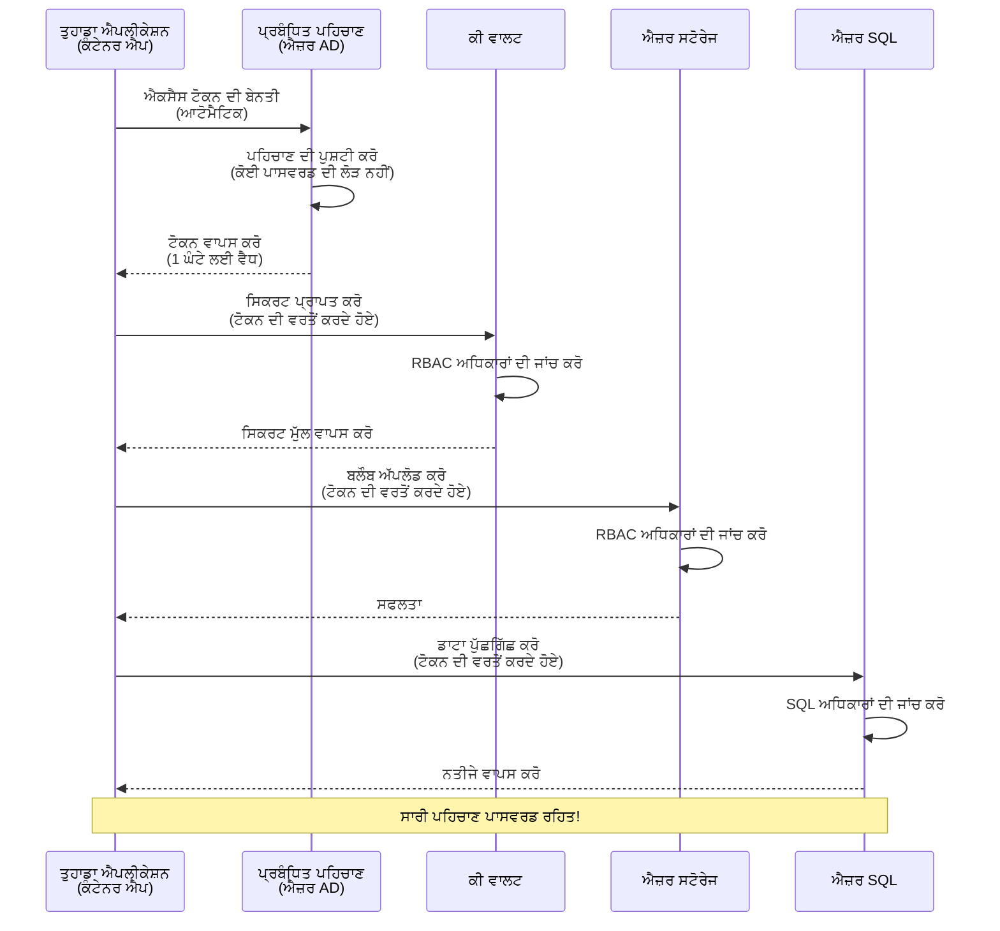
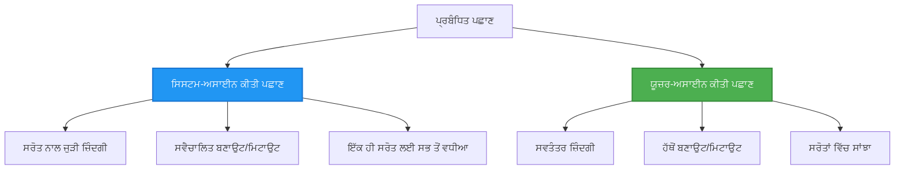

<!--
CO_OP_TRANSLATOR_METADATA:
{
  "original_hash": "e13ff6e1197e0a7462ed0aede7df9f23",
  "translation_date": "2025-11-21T00:37:28+00:00",
  "source_file": "docs/getting-started/authsecurity.md",
  "language_code": "pa"
}
-->
# ਪ੍ਰਮਾਣਿਕਤਾ ਪੈਟਰਨ ਅਤੇ ਮੈਨੇਜਡ ਆਈਡੈਂਟਿਟੀ

⏱️ **ਅਨੁਮਾਨਿਤ ਸਮਾਂ**: 45-60 ਮਿੰਟ | 💰 **ਲਾਗਤ ਪ੍ਰਭਾਵ**: ਮੁਫ਼ਤ (ਕੋਈ ਵਾਧੂ ਖਰਚ ਨਹੀਂ) | ⭐ **ਜਟਿਲਤਾ**: ਦਰਮਿਆਨਾ

**📚 ਸਿੱਖਣ ਦਾ ਰਾਹ**:
- ← ਪਿਛਲਾ: [ਕੰਫਿਗਰੇਸ਼ਨ ਮੈਨੇਜਮੈਂਟ](configuration.md) - ਵਾਤਾਵਰਣ ਵੈਰੀਏਬਲ ਅਤੇ ਰਾਜ਼ਾਂ ਦਾ ਪ੍ਰਬੰਧਨ
- 🎯 **ਤੁਸੀਂ ਇੱਥੇ ਹੋ**: ਪ੍ਰਮਾਣਿਕਤਾ ਅਤੇ ਸੁਰੱਖਿਆ (ਮੈਨੇਜਡ ਆਈਡੈਂਟਿਟੀ, ਕੀ ਵੌਲਟ, ਸੁਰੱਖਿਅਤ ਪੈਟਰਨ)
- → ਅਗਲਾ: [ਪਹਿਲਾ ਪ੍ਰੋਜੈਕਟ](first-project.md) - ਆਪਣਾ ਪਹਿਲਾ AZD ਐਪਲੀਕੇਸ਼ਨ ਬਣਾਓ
- 🏠 [ਕੋਰਸ ਹੋਮ](../../README.md)

---

## ਤੁਸੀਂ ਕੀ ਸਿੱਖੋਗੇ

ਇਸ ਪਾਠ ਨੂੰ ਪੂਰਾ ਕਰਕੇ, ਤੁਸੀਂ:
- ਐਜ਼ਰ ਪ੍ਰਮਾਣਿਕਤਾ ਪੈਟਰਨ (ਕੀਜ਼, ਕਨੈਕਸ਼ਨ ਸਟ੍ਰਿੰਗ, ਮੈਨੇਜਡ ਆਈਡੈਂਟਿਟੀ) ਨੂੰ ਸਮਝੋਗੇ
- **ਮੈਨੇਜਡ ਆਈਡੈਂਟਿਟੀ** ਨੂੰ ਪਾਸਵਰਡ-ਰਹਿਤ ਪ੍ਰਮਾਣਿਕਤਾ ਲਈ ਲਾਗੂ ਕਰੋ
- **ਐਜ਼ਰ ਕੀ ਵੌਲਟ** ਇੰਟੀਗ੍ਰੇਸ਼ਨ ਨਾਲ ਰਾਜ਼ਾਂ ਨੂੰ ਸੁਰੱਖਿਅਤ ਕਰੋ
- AZD ਡਿਪਲੌਇਮੈਂਟ ਲਈ **ਰੋਲ-ਅਧਾਰਿਤ ਪਹੁੰਚ ਨਿਯੰਤਰਣ (RBAC)** ਕਨਫਿਗਰ ਕਰੋ
- ਕੰਟੇਨਰ ਐਪਸ ਅਤੇ ਐਜ਼ਰ ਸੇਵਾਵਾਂ ਵਿੱਚ ਸੁਰੱਖਿਆ ਦੇ ਸਰਵੋਤਮ ਅਭਿਆਸ ਲਾਗੂ ਕਰੋ
- ਕੀ-ਅਧਾਰਿਤ ਤੋਂ ਆਈਡੈਂਟਿਟੀ-ਅਧਾਰਿਤ ਪ੍ਰਮਾਣਿਕਤਾ ਵਿੱਚ ਮਾਈਗਰੇਟ ਕਰੋ

## ਮੈਨੇਜਡ ਆਈਡੈਂਟਿਟੀ ਕਿਉਂ ਮਹੱਤਵਪੂਰਨ ਹੈ

### ਸਮੱਸਿਆ: ਰਵਾਇਤੀ ਪ੍ਰਮਾਣਿਕਤਾ

**ਮੈਨੇਜਡ ਆਈਡੈਂਟਿਟੀ ਤੋਂ ਪਹਿਲਾਂ:**
```javascript
// ❌ ਸੁਰੱਖਿਆ ਖਤਰਾ: ਕੋਡ ਵਿੱਚ ਹਾਰਡਕੋਡ ਕੀਤੇ ਗਏ ਰਾਜ
const connectionString = "Server=mydb.database.windows.net;User=admin;Password=P@ssw0rd123";
const storageKey = "xK7mN9pQ2wR5tY8uI0oP3aS6dF1gH4jK...";
const cosmosKey = "C2x7B9n4M1p8Q5w3E6r0T2y5U8i1O4p7...";
```

**ਸਮੱਸਿਆਵਾਂ:**
- 🔴 **ਕੋਡ, ਕਨਫਿਗਰੇਸ਼ਨ ਫਾਈਲਾਂ, ਵਾਤਾਵਰਣ ਵੈਰੀਏਬਲ ਵਿੱਚ ਰਾਜ਼ਾਂ ਦਾ ਪਰਦਾਫਾਸ਼**
- 🔴 **ਕ੍ਰੈਡੈਂਸ਼ਲ ਰੋਟੇਸ਼ਨ** ਲਈ ਕੋਡ ਬਦਲਣ ਅਤੇ ਮੁੜ ਡਿਪਲੌਇਮੈਂਟ ਦੀ ਲੋੜ
- 🔴 **ਆਡਿਟ ਦੀਆਂ ਮੁਸ਼ਕਲਾਂ** - ਕਿਸ ਨੇ ਕੀ ਪਹੁੰਚ ਕੀਤੀ, ਕਦੋਂ?
- 🔴 **ਬੇਤਰਤੀਬੀ** - ਕਈ ਸਿਸਟਮਾਂ ਵਿੱਚ ਫੈਲੇ ਰਾਜ਼
- 🔴 **ਅਨੁਕੂਲਤਾ ਖਤਰੇ** - ਸੁਰੱਖਿਆ ਆਡਿਟਾਂ ਵਿੱਚ ਫੇਲ

### ਹੱਲ: ਮੈਨੇਜਡ ਆਈਡੈਂਟਿਟੀ

**ਮੈਨੇਜਡ ਆਈਡੈਂਟਿਟੀ ਦੇ ਬਾਅਦ:**
```javascript
// ✅ ਸੁਰੱਖਿਅਤ: ਕੋਡ ਵਿੱਚ ਕੋਈ ਰਾਜ ਨਹੀਂ
const credential = new DefaultAzureCredential();
const client = new BlobServiceClient(
  "https://mystorageaccount.blob.core.windows.net",
  credential  // ਐਜ਼ਰ ਸਵੈਚਾਲਿਤ ਤੌਰ 'ਤੇ ਪ੍ਰਮਾਣਿਕਤਾ ਨੂੰ ਸੰਭਾਲਦਾ ਹੈ
);
```

**ਫਾਇਦੇ:**
- ✅ **ਕੋਡ ਜਾਂ ਕਨਫਿਗਰੇਸ਼ਨ ਵਿੱਚ ਕੋਈ ਰਾਜ਼ ਨਹੀਂ**
- ✅ **ਆਟੋਮੈਟਿਕ ਰੋਟੇਸ਼ਨ** - ਐਜ਼ਰ ਇਸ ਨੂੰ ਸੰਭਾਲਦਾ ਹੈ
- ✅ **ਪੂਰਾ ਆਡਿਟ ਟ੍ਰੇਲ** ਐਜ਼ਰ AD ਲੌਗ ਵਿੱਚ
- ✅ **ਕੇਂਦਰੀਕ੍ਰਿਤ ਸੁਰੱਖਿਆ** - ਐਜ਼ਰ ਪੋਰਟਲ ਵਿੱਚ ਪ੍ਰਬੰਧਿਤ
- ✅ **ਅਨੁਕੂਲਤਾ ਲਈ ਤਿਆਰ** - ਸੁਰੱਖਿਆ ਮਿਆਰਾਂ ਨੂੰ ਪੂਰਾ ਕਰਦਾ ਹੈ

**ਉਦਾਹਰਣ**: ਰਵਾਇਤੀ ਪ੍ਰਮਾਣਿਕਤਾ ਕਈ ਦਰਵਾਜ਼ਿਆਂ ਲਈ ਕਈ ਭੌਤਿਕ ਚਾਬੀਆਂ ਲਿਜਾਣ ਵਰਗਾ ਹੈ। ਮੈਨੇਜਡ ਆਈਡੈਂਟਿਟੀ ਇੱਕ ਸੁਰੱਖਿਆ ਬੈਜ ਵਰਗਾ ਹੈ ਜੋ ਆਪਣੇ ਆਪ ਪਹੁੰਚ ਦਿੰਦਾ ਹੈ ਕਿ ਤੁਸੀਂ ਕੌਣ ਹੋ—ਕੋਈ ਚਾਬੀਆਂ ਗੁਆਉਣ, ਕਾਪੀ ਕਰਨ ਜਾਂ ਰੋਟੇਟ ਕਰਨ ਦੀ ਲੋੜ ਨਹੀਂ।

---

## ਆਰਕੀਟੈਕਚਰ ਝਲਕ

### ਮੈਨੇਜਡ ਆਈਡੈਂਟਿਟੀ ਨਾਲ ਪ੍ਰਮਾਣਿਕਤਾ ਦਾ ਪ੍ਰਵਾਹ


### ਮੈਨੇਜਡ ਆਈਡੈਂਟਿਟੀ ਦੇ ਕਿਸਮਾਂ


| ਫੀਚਰ | ਸਿਸਟਮ-ਅਸਾਈਨਡ | ਯੂਜ਼ਰ-ਅਸਾਈਨਡ |
|---------|----------------|---------------|
| **ਜੀਵਨ ਚੱਕਰ** | ਸਰੋਤ ਨਾਲ ਜੁੜਿਆ | ਸਵਤੰਤਰ |
| **ਤਿਆਰੀ** | ਸਰੋਤ ਨਾਲ ਆਟੋਮੈਟਿਕ | ਮੈਨੂਅਲ ਤਿਆਰੀ |
| **ਹਟਾਉਣਾ** | ਸਰੋਤ ਨਾਲ ਹਟਾਇਆ ਗਿਆ | ਸਰੋਤ ਹਟਾਉਣ ਤੋਂ ਬਾਅਦ ਵੀ ਕਾਇਮ |
| **ਸਾਂਝਾ ਕਰਨਾ** | ਸਿਰਫ ਇੱਕ ਸਰੋਤ | ਕਈ ਸਰੋਤ |
| **ਵਰਤੋਂ ਦਾ ਕੇਸ** | ਸਧਾਰਨ ਸਥਿਤੀਆਂ | ਜਟਿਲ ਬਹੁ-ਸਰੋਤ ਸਥਿਤੀਆਂ |
| **AZD ਡਿਫਾਲਟ** | ✅ ਸਿਫਾਰਸ਼ੀ | ਵਿਕਲਪਿਕ |

---

## ਪੂਰਵ ਸ਼ਰਤਾਂ

### ਲੋੜੀਂਦੇ ਟੂਲ

ਤੁਹਾਨੂੰ ਪਿਛਲੇ ਪਾਠਾਂ ਤੋਂ ਇਹਨਾਂ ਦੀ ਸਥਾਪਨਾ ਹੋਣੀ ਚਾਹੀਦੀ ਹੈ:

```bash
# ਐਜ਼ਰ ਡਿਵੈਲਪਰ CLI ਦੀ ਪੁਸ਼ਟੀ ਕਰੋ
azd version
# ✅ ਉਮੀਦ: azd ਵਰਜਨ 1.0.0 ਜਾਂ ਉੱਚਾ

# ਐਜ਼ਰ CLI ਦੀ ਪੁਸ਼ਟੀ ਕਰੋ
az --version
# ✅ ਉਮੀਦ: azure-cli 2.50.0 ਜਾਂ ਉੱਚਾ
```

### ਐਜ਼ਰ ਦੀਆਂ ਲੋੜਾਂ

- ਸਰਗਰਮ ਐਜ਼ਰ ਸਬਸਕ੍ਰਿਪਸ਼ਨ
- ਅਧਿਕਾਰ:
  - ਮੈਨੇਜਡ ਆਈਡੈਂਟਿਟੀ ਬਣਾਉਣ
  - RBAC ਰੋਲ ਅਸਾਈਨ ਕਰੋ
  - ਕੀ ਵੌਲਟ ਸਰੋਤ ਬਣਾਉਣ
  - ਕੰਟੇਨਰ ਐਪਸ ਡਿਪਲੌਇਮੈਂਟ

### ਗਿਆਨ ਪੂਰਵ ਸ਼ਰਤਾਂ

ਤੁਹਾਨੂੰ ਪੂਰਾ ਕਰਨਾ ਚਾਹੀਦਾ ਹੈ:
- [ਇੰਸਟਾਲੇਸ਼ਨ ਗਾਈਡ](installation.md) - AZD ਸੈਟਅਪ
- [AZD ਬੇਸਿਕਸ](azd-basics.md) - ਮੁੱਖ ਧਾਰਨਾਵਾਂ
- [ਕੰਫਿਗਰੇਸ਼ਨ ਮੈਨੇਜਮੈਂਟ](configuration.md) - ਵਾਤਾਵਰਣ ਵੈਰੀਏਬਲ

---

## ਪਾਠ 1: ਪ੍ਰਮਾਣਿਕਤਾ ਪੈਟਰਨ ਨੂੰ ਸਮਝਣਾ

### ਪੈਟਰਨ 1: ਕਨੈਕਸ਼ਨ ਸਟ੍ਰਿੰਗ (ਪੁਰਾਣਾ - ਬਚੋ)

**ਇਹ ਕਿਵੇਂ ਕੰਮ ਕਰਦਾ ਹੈ:**
```bash
# ਕਨੈਕਸ਼ਨ ਸਟ੍ਰਿੰਗ ਵਿੱਚ ਪ੍ਰਮਾਣ ਪੱਤਰ ਸ਼ਾਮਲ ਹਨ
STORAGE_CONNECTION_STRING="DefaultEndpointsProtocol=https;AccountName=myaccount;AccountKey=xK7mN9pQ2wR5..."
COSMOS_CONNECTION_STRING="AccountEndpoint=https://myaccount.documents.azure.com:443/;AccountKey=C2x7..."
SQL_CONNECTION_STRING="Server=myserver.database.windows.net;User=admin;Password=P@ssw0rd..."
```

**ਸਮੱਸਿਆਵਾਂ:**
- ❌ ਰਾਜ਼ ਵਾਤਾਵਰਣ ਵੈਰੀਏਬਲ ਵਿੱਚ ਦਿਖਾਈ ਦੇ ਰਹੇ ਹਨ
- ❌ ਡਿਪਲੌਇਮੈਂਟ ਸਿਸਟਮਾਂ ਵਿੱਚ ਲੌਗ ਕੀਤਾ ਗਿਆ
- ❌ ਰੋਟੇਟ ਕਰਨਾ ਮੁਸ਼ਕਲ
- ❌ ਪਹੁੰਚ ਦਾ ਕੋਈ ਆਡਿਟ ਟ੍ਰੇਲ ਨਹੀਂ

**ਕਦੋਂ ਵਰਤਣਾ ਹੈ:** ਸਿਰਫ ਸਥਾਨਕ ਵਿਕਾਸ ਲਈ, ਕਦੇ ਵੀ ਉਤਪਾਦਨ ਲਈ ਨਹੀਂ।

---

### ਪੈਟਰਨ 2: ਕੀ ਵੌਲਟ ਰਿਫਰੈਂਸ (ਵਧੀਆ)

**ਇਹ ਕਿਵੇਂ ਕੰਮ ਕਰਦਾ ਹੈ:**
```bicep
// Store secret in Key Vault
resource keyVault 'Microsoft.KeyVault/vaults@2023-02-01' = {
  name: 'mykv'
  properties: {
    enableRbacAuthorization: true
  }
}

// Reference in Container App
env: [
  {
    name: 'STORAGE_KEY'
    secretRef: 'storage-key'  // References Key Vault
  }
]
```

**ਫਾਇਦੇ:**
- ✅ ਰਾਜ਼ ਕੀ ਵੌਲਟ ਵਿੱਚ ਸੁਰੱਖਿਅਤ ਤੌਰ 'ਤੇ ਸਟੋਰ ਕੀਤੇ
- ✅ ਕੇਂਦਰੀਕ੍ਰਿਤ ਰਾਜ਼ ਪ੍ਰਬੰਧਨ
- ✅ ਰੋਟੇਸ਼ਨ ਬਿਨਾਂ ਕੋਡ ਬਦਲਣ ਦੇ

**ਪਾਬੰਦੀਆਂ:**
- ⚠️ ਫਿਰ ਵੀ ਕੀਜ਼/ਪਾਸਵਰਡ ਵਰਤ ਰਹੇ ਹਨ
- ⚠️ ਕੀ ਵੌਲਟ ਪਹੁੰਚ ਦਾ ਪ੍ਰਬੰਧਨ ਕਰਨ ਦੀ ਲੋੜ

**ਕਦੋਂ ਵਰਤਣਾ ਹੈ:** ਕਨੈਕਸ਼ਨ ਸਟ੍ਰਿੰਗ ਤੋਂ ਮੈਨੇਜਡ ਆਈਡੈਂਟਿਟੀ ਵੱਲ ਜਾਣ ਦਾ ਅੰਤਰਾਲ ਕਦਮ।

---

### ਪੈਟਰਨ 3: ਮੈਨੇਜਡ ਆਈਡੈਂਟਿਟੀ (ਸਰਵੋਤਮ ਅਭਿਆਸ)

**ਇਹ ਕਿਵੇਂ ਕੰਮ ਕਰਦਾ ਹੈ:**
```bicep
// Enable managed identity
resource containerApp 'Microsoft.App/containerApps@2023-05-01' = {
  name: 'myapp'
  identity: {
    type: 'SystemAssigned'  // Automatically creates identity
  }
}

// Grant permissions
resource roleAssignment 'Microsoft.Authorization/roleAssignments@2022-04-01' = {
  scope: storageAccount
  properties: {
    roleDefinitionId: storageBlobDataContributorRole
    principalId: containerApp.identity.principalId
  }
}
```

**ਐਪਲੀਕੇਸ਼ਨ ਕੋਡ:**
```javascript
// ਕੋਈ ਰਾਜ਼ ਦੀ ਲੋੜ ਨਹੀਂ!
const { DefaultAzureCredential } = require('@azure/identity');
const { BlobServiceClient } = require('@azure/storage-blob');

const credential = new DefaultAzureCredential();
const blobServiceClient = new BlobServiceClient(
  'https://mystorageaccount.blob.core.windows.net',
  credential
);
```

**ਫਾਇਦੇ:**
- ✅ ਕੋਡ/ਕਨਫਿਗ ਵਿੱਚ ਕੋਈ ਰਾਜ਼ ਨਹੀਂ
- ✅ ਆਟੋਮੈਟਿਕ ਕ੍ਰੈਡੈਂਸ਼ਲ ਰੋਟੇਸ਼ਨ
- ✅ ਪੂਰਾ ਆਡਿਟ ਟ੍ਰੇਲ
- ✅ RBAC-ਅਧਾਰਿਤ ਅਧਿਕਾਰ
- ✅ ਅਨੁਕੂਲਤਾ ਲਈ ਤਿਆਰ

**ਕਦੋਂ ਵਰਤਣਾ ਹੈ:** ਹਮੇਸ਼ਾ, ਉਤਪਾਦਨ ਐਪਲੀਕੇਸ਼ਨਾਂ ਲਈ।

---

## ਪਾਠ 2: AZD ਨਾਲ ਮੈਨੇਜਡ ਆਈਡੈਂਟਿਟੀ ਲਾਗੂ ਕਰਨਾ

### ਕਦਮ-ਦਰ-ਕਦਮ ਲਾਗੂ ਕਰਨਾ

ਆਓ ਇੱਕ ਸੁਰੱਖਿਅਤ ਕੰਟੇਨਰ ਐਪ ਬਣਾਈਏ ਜੋ ਮੈਨੇਜਡ ਆਈਡੈਂਟਿਟੀ ਦੀ ਵਰਤੋਂ ਕਰਕੇ ਐਜ਼ਰ ਸਟੋਰੇਜ ਅਤੇ ਕੀ ਵੌਲਟ ਤੱਕ ਪਹੁੰਚ ਕਰਦਾ ਹੈ।

### ਪ੍ਰੋਜੈਕਟ ਸਟ੍ਰਕਚਰ

```
secure-app/
├── azure.yaml                 # AZD configuration
├── infra/
│   ├── main.bicep            # Main infrastructure
│   ├── core/
│   │   ├── identity.bicep    # Managed identity setup
│   │   ├── keyvault.bicep    # Key Vault configuration
│   │   └── storage.bicep     # Storage with RBAC
│   └── app/
│       └── container-app.bicep
└── src/
    ├── app.js                # Application code
    ├── package.json
    └── Dockerfile
```

### 1. AZD ਕਨਫਿਗਰ ਕਰੋ (azure.yaml)

```yaml
name: secure-app
metadata:
  template: secure-app@1.0.0

services:
  api:
    project: ./src
    language: js
    host: containerapp

# Enable managed identity (AZD handles this automatically)
```

### 2. ਇੰਫਰਾਸਟਰਕਚਰ: ਮੈਨੇਜਡ ਆਈਡੈਂਟਿਟੀ ਨੂੰ ਯੋਗ ਕਰੋ

**ਫਾਈਲ: `infra/main.bicep`**

```bicep
targetScope = 'subscription'

param environmentName string
param location string = 'eastus'

var tags = { 'azd-env-name': environmentName }

// Resource group
resource rg 'Microsoft.Resources/resourceGroups@2021-04-01' = {
  name: 'rg-${environmentName}'
  location: location
  tags: tags
}

// Storage Account
module storage './core/storage.bicep' = {
  name: 'storage'
  scope: rg
  params: {
    name: 'st${uniqueString(rg.id)}'
    location: location
    tags: tags
  }
}

// Key Vault
module keyVault './core/keyvault.bicep' = {
  name: 'keyvault'
  scope: rg
  params: {
    name: 'kv-${uniqueString(rg.id)}'
    location: location
    tags: tags
  }
}

// Container App with Managed Identity
module containerApp './app/container-app.bicep' = {
  name: 'container-app'
  scope: rg
  params: {
    name: 'ca-${environmentName}'
    location: location
    tags: tags
    storageAccountName: storage.outputs.name
    keyVaultName: keyVault.outputs.name
  }
}

// Grant Container App access to Storage
module storageRoleAssignment './core/role-assignment.bicep' = {
  name: 'storage-role'
  scope: rg
  params: {
    principalId: containerApp.outputs.identityPrincipalId
    roleDefinitionId: 'ba92f5b4-2d11-453d-a403-e96b0029c9fe'  // Storage Blob Data Contributor
    targetResourceId: storage.outputs.id
  }
}

// Grant Container App access to Key Vault
module kvRoleAssignment './core/role-assignment.bicep' = {
  name: 'kv-role'
  scope: rg
  params: {
    principalId: containerApp.outputs.identityPrincipalId
    roleDefinitionId: '4633458b-17de-408a-b874-0445c86b69e6'  // Key Vault Secrets User
    targetResourceId: keyVault.outputs.id
  }
}

// Outputs
output AZURE_STORAGE_ACCOUNT_NAME string = storage.outputs.name
output AZURE_KEY_VAULT_NAME string = keyVault.outputs.name
output APP_URL string = containerApp.outputs.url
```

### 3. ਸਿਸਟਮ-ਅਸਾਈਨਡ ਆਈਡੈਂਟਿਟੀ ਨਾਲ ਕੰਟੇਨਰ ਐਪ

**ਫਾਈਲ: `infra/app/container-app.bicep`**

```bicep
param name string
param location string
param tags object = {}
param storageAccountName string
param keyVaultName string

resource containerApp 'Microsoft.App/containerApps@2023-05-01' = {
  name: name
  location: location
  tags: tags
  identity: {
    type: 'SystemAssigned'  // 🔑 Enable managed identity
  }
  properties: {
    configuration: {
      ingress: {
        external: true
        targetPort: 3000
      }
    }
    template: {
      containers: [
        {
          name: 'api'
          image: 'myregistry.azurecr.io/api:latest'
          resources: {
            cpu: json('0.5')
            memory: '1Gi'
          }
          env: [
            {
              name: 'AZURE_STORAGE_ACCOUNT_NAME'
              value: storageAccountName
            }
            {
              name: 'AZURE_KEY_VAULT_NAME'
              value: keyVaultName
            }
            // 🔑 No secrets - managed identity handles authentication!
          ]
        }
      ]
    }
  }
}

// Output the identity for RBAC assignments
output identityPrincipalId string = containerApp.identity.principalId
output id string = containerApp.id
output url string = 'https://${containerApp.properties.configuration.ingress.fqdn}'
```

### 4. RBAC ਰੋਲ ਅਸਾਈਨਮੈਂਟ ਮੋਡਿਊਲ

**ਫਾਈਲ: `infra/core/role-assignment.bicep`**

```bicep
param principalId string
param roleDefinitionId string  // Azure built-in role ID
param targetResourceId string

resource roleAssignment 'Microsoft.Authorization/roleAssignments@2022-04-01' = {
  name: guid(principalId, roleDefinitionId, targetResourceId)
  scope: resourceId('Microsoft.Resources/resourceGroups', resourceGroup().name)
  properties: {
    roleDefinitionId: subscriptionResourceId('Microsoft.Authorization/roleDefinitions', roleDefinitionId)
    principalId: principalId
    principalType: 'ServicePrincipal'
  }
}

output id string = roleAssignment.id
```

### 5. ਮੈਨੇਜਡ ਆਈਡੈਂਟਿਟੀ ਨਾਲ ਐਪਲੀਕੇਸ਼ਨ ਕੋਡ

**ਫਾਈਲ: `src/app.js`**

```javascript
const express = require('express');
const { DefaultAzureCredential } = require('@azure/identity');
const { BlobServiceClient } = require('@azure/storage-blob');
const { SecretClient } = require('@azure/keyvault-secrets');

const app = express();
const PORT = process.env.PORT || 3000;

// 🔑 ਪ੍ਰਮਾਣ ਪੱਤਰ ਸ਼ੁਰੂ ਕਰੋ (ਪ੍ਰਬੰਧਿਤ ਪਹਿਚਾਣ ਨਾਲ ਸਵੈਚਾਲਿਤ ਤੌਰ 'ਤੇ ਕੰਮ ਕਰਦਾ ਹੈ)
const credential = new DefaultAzureCredential();

// ਐਜ਼ਰ ਸਟੋਰੇਜ ਸੈਟਅੱਪ
const storageAccountName = process.env.AZURE_STORAGE_ACCOUNT_NAME;
const blobServiceClient = new BlobServiceClient(
  `https://${storageAccountName}.blob.core.windows.net`,
  credential  // ਕੋਈ ਕੁੰਜੀਆਂ ਦੀ ਲੋੜ ਨਹੀਂ!
);

// ਕੀ ਵੌਲਟ ਸੈਟਅੱਪ
const keyVaultName = process.env.AZURE_KEY_VAULT_NAME;
const secretClient = new SecretClient(
  `https://${keyVaultName}.vault.azure.net`,
  credential  // ਕੋਈ ਕੁੰਜੀਆਂ ਦੀ ਲੋੜ ਨਹੀਂ!
);

// ਸਿਹਤ ਜਾਂਚ
app.get('/health', (req, res) => {
  res.json({ status: 'healthy', authentication: 'managed-identity' });
});

// ਬਲੌਬ ਸਟੋਰੇਜ ਵਿੱਚ ਫਾਈਲ ਅੱਪਲੋਡ ਕਰੋ
app.post('/upload', async (req, res) => {
  try {
    const containerClient = blobServiceClient.getContainerClient('uploads');
    await containerClient.createIfNotExists();
    
    const blobName = `file-${Date.now()}.txt`;
    const blockBlobClient = containerClient.getBlockBlobClient(blobName);
    
    await blockBlobClient.upload('Hello from managed identity!', 30);
    
    res.json({
      success: true,
      blobName: blobName,
      message: 'File uploaded using managed identity!'
    });
  } catch (error) {
    console.error('Upload error:', error);
    res.status(500).json({ error: error.message });
  }
});

// ਕੀ ਵੌਲਟ ਤੋਂ ਗੁਪਤ ਪ੍ਰਾਪਤ ਕਰੋ
app.get('/secret/:name', async (req, res) => {
  try {
    const secretName = req.params.name;
    const secret = await secretClient.getSecret(secretName);
    
    res.json({
      name: secretName,
      value: secret.value,
      message: 'Secret retrieved using managed identity!'
    });
  } catch (error) {
    console.error('Secret error:', error);
    res.status(500).json({ error: error.message });
  }
});

// ਬਲੌਬ ਕੰਟੇਨਰਾਂ ਦੀ ਸੂਚੀ ਬਣਾਓ (ਪੜ੍ਹਨ ਦੀ ਪਹੁੰਚ ਦਿਖਾਉਂਦਾ ਹੈ)
app.get('/containers', async (req, res) => {
  try {
    const containers = [];
    for await (const container of blobServiceClient.listContainers()) {
      containers.push(container.name);
    }
    
    res.json({
      containers: containers,
      count: containers.length,
      message: 'Containers listed using managed identity!'
    });
  } catch (error) {
    console.error('List error:', error);
    res.status(500).json({ error: error.message });
  }
});

app.listen(PORT, () => {
  console.log(`Secure API listening on port ${PORT}`);
  console.log('Authentication: Managed Identity (passwordless)');
});
```

**ਫਾਈਲ: `src/package.json`**

```json
{
  "name": "secure-app",
  "version": "1.0.0",
  "dependencies": {
    "express": "^4.18.2",
    "@azure/identity": "^4.0.0",
    "@azure/storage-blob": "^12.17.0",
    "@azure/keyvault-secrets": "^4.7.0"
  },
  "scripts": {
    "start": "node app.js"
  }
}
```

### 6. ਡਿਪਲੌਇਮੈਂਟ ਅਤੇ ਟੈਸਟ

```bash
# AZD ਵਾਤਾਵਰਣ ਸ਼ੁਰੂ ਕਰੋ
azd init

# ਢਾਂਚਾ ਅਤੇ ਐਪਲੀਕੇਸ਼ਨ ਤੈਨਾਤ ਕਰੋ
azd up

# ਐਪ URL ਪ੍ਰਾਪਤ ਕਰੋ
APP_URL=$(azd env get-values | grep APP_URL | cut -d '=' -f2 | tr -d '"')

# ਹੈਲਥ ਚੈੱਕ ਦੀ ਜਾਂਚ ਕਰੋ
curl $APP_URL/health
```

**✅ ਉਮੀਦਵਾਰ ਨਤੀਜਾ:**
```json
{
  "status": "healthy",
  "authentication": "managed-identity"
}
```

**ਬਲੌਬ ਅਪਲੋਡ ਟੈਸਟ ਕਰੋ:**
```bash
curl -X POST $APP_URL/upload
```

**✅ ਉਮੀਦਵਾਰ ਨਤੀਜਾ:**
```json
{
  "success": true,
  "blobName": "file-1700404800000.txt",
  "message": "File uploaded using managed identity!"
}
```

**ਕੰਟੇਨਰ ਲਿਸਟਿੰਗ ਟੈਸਟ ਕਰੋ:**
```bash
curl $APP_URL/containers
```

**✅ ਉਮੀਦਵਾਰ ਨਤੀਜਾ:**
```json
{
  "containers": ["uploads"],
  "count": 1,
  "message": "Containers listed using managed identity!"
}
```

---

## ਆਮ ਐਜ਼ਰ RBAC ਰੋਲ

### ਮੈਨੇਜਡ ਆਈਡੈਂਟਿਟੀ ਲਈ ਬਿਲਟ-ਇਨ ਰੋਲ ID

| ਸੇਵਾ | ਰੋਲ ਦਾ ਨਾਮ | ਰੋਲ ID | ਅਧਿਕਾਰ |
|---------|-----------|---------|-------------|
| **ਸਟੋਰੇਜ** | ਸਟੋਰੇਜ ਬਲੌਬ ਡਾਟਾ ਰੀਡਰ | `2a2b9908-6b94-4a3d-8e5a-a7d8f8cc8a12` | ਬਲੌਬ ਅਤੇ ਕੰਟੇਨਰ ਪੜ੍ਹੋ |
| **ਸਟੋਰੇਜ** | ਸਟੋਰੇਜ ਬਲੌਬ ਡਾਟਾ ਕੰਟ੍ਰਿਬਿਊਟਰ | `ba92f5b4-2d11-453d-a403-e96b0029c9fe` | ਪੜ੍ਹੋ, ਲਿਖੋ, ਬਲੌਬ ਮਿਟਾਓ |
| **ਸਟੋਰੇਜ** | ਸਟੋਰੇਜ ਕਿਊ ਡਾਟਾ ਕੰਟ੍ਰਿਬਿਊਟਰ | `974c5e8b-45b9-4653-ba55-5f855dd0fb88` | ਕਿਊ ਸੁਨੇਹੇ ਪੜ੍ਹੋ, ਲਿਖੋ, ਮਿਟਾਓ |
| **ਕੀ ਵੌਲਟ** | ਕੀ ਵੌਲਟ ਸਿਕ੍ਰੇਟਸ ਯੂਜ਼ਰ | `4633458b-17de-408a-b874-0445c86b69e6` | ਰਾਜ਼ ਪੜ੍ਹੋ |
| **ਕੀ ਵੌਲਟ** | ਕੀ ਵੌਲਟ ਸਿਕ੍ਰੇਟਸ ਅਫਸਰ | `b86a8fe4-44ce-4948-aee5-eccb2c155cd7` | ਰਾਜ਼ ਪੜ੍ਹੋ, ਲਿਖੋ, ਮਿਟਾਓ |
| **ਕੌਸਮੋਸ DB** | ਕੌਸਮੋਸ DB ਬਿਲਟ-ਇਨ ਡਾਟਾ ਰੀਡਰ | `00000000-0000-0000-0000-000000000001` | ਕੌਸਮੋਸ DB ਡਾਟਾ ਪੜ੍ਹੋ |
| **ਕੌਸਮੋਸ DB** | ਕੌਸਮੋਸ DB ਬਿਲਟ-ਇਨ ਡਾਟਾ ਕੰਟ੍ਰਿਬਿਊਟਰ | `00000000-0000-0000-0000-000000000002` | ਕੌਸਮੋਸ DB ਡਾਟਾ ਪੜ੍ਹੋ, ਲਿਖੋ |
| **SQL ਡਾਟਾਬੇਸ** | SQL DB ਕੰਟ੍ਰਿਬਿਊਟਰ | `9b7fa17d-e63e-47b0-bb0a-15c516ac86ec` | SQL ਡਾਟਾਬੇਸ ਪ੍ਰਬੰਧਨ |
| **ਸਰਵਿਸ ਬੱਸ** | ਐਜ਼ਰ ਸਰਵਿਸ ਬੱਸ ਡਾਟਾ ਓਨਰ | `090c5cfd-751d-490a-894a-3ce6f1109419` | ਸੁਨੇਹੇ ਭੇਜੋ, ਪ੍ਰਾਪਤ ਕਰੋ, ਪ੍ਰਬੰਧਨ ਕਰੋ |

### ਰੋਲ ID ਕਿਵੇਂ ਲੱਭੋ

```bash
# ਸਾਰੇ ਬਿਲਟ-ਇਨ ਰੋਲਾਂ ਦੀ ਸੂਚੀ ਬਣਾਓ
az role definition list --query "[].{Name:roleName, ID:name}" --output table

# ਖਾਸ ਰੋਲ ਦੀ ਖੋਜ ਕਰੋ
az role definition list --query "[?contains(roleName, 'Storage Blob')].{Name:roleName, ID:name}" --output table

# ਰੋਲ ਵੇਰਵੇ ਪ੍ਰਾਪਤ ਕਰੋ
az role definition list --name "Storage Blob Data Contributor"
```

---

## ਵਿਹਾਰਕ ਅਭਿਆਸ

### ਅਭਿਆਸ 1: ਮੌਜੂਦਾ ਐਪ ਲਈ ਮੈਨੇਜਡ ਆਈਡੈਂਟਿਟੀ ਯੋਗ ਕਰੋ ⭐⭐ (ਦਰਮਿਆਨਾ)

**ਲਕਸ਼**: ਮੌਜੂਦਾ ਕੰਟੇਨਰ ਐਪ ਡਿਪਲੌਇਮੈਂਟ ਵਿੱਚ ਮੈਨੇਜਡ ਆਈਡੈਂਟਿਟੀ ਸ਼ਾਮਲ ਕਰੋ

**ਸਥਿਤੀ**: ਤੁਹਾਡੇ ਕੋਲ ਇੱਕ ਕੰਟੇਨਰ ਐਪ ਹੈ ਜੋ ਕਨੈਕਸ਼ਨ ਸਟ੍ਰਿੰਗ ਵਰਤਦਾ ਹੈ। ਇਸਨੂੰ ਮੈਨੇਜਡ ਆਈਡੈਂਟਿਟੀ ਵਿੱਚ ਬਦਲੋ।

**ਸ਼ੁਰੂਆਤੀ ਬਿੰਦੂ**: ਕੰਟੇਨਰ ਐਪ ਇਸ ਕਨਫਿਗਰੇਸ਼ਨ ਨਾਲ:

```bicep
// ❌ Current: Using connection string
env: [
  {
    name: 'STORAGE_CONNECTION_STRING'
    secretRef: 'storage-connection'
  }
]
```

**ਕਦਮ**:

1. **Bicep ਵਿੱਚ ਮੈਨੇਜਡ ਆਈਡੈਂਟਿਟੀ ਯੋਗ ਕਰੋ:**

```bicep
resource containerApp 'Microsoft.App/containerApps@2023-05-01' = {
  name: 'myapp'
  identity: {
    type: 'SystemAssigned'  // Add this
  }
  // ... rest of configuration
}
```

2. **ਸਟੋਰੇਜ ਪਹੁੰਚ ਦਿਓ:**

```bicep
// Get storage account reference
resource storageAccount 'Microsoft.Storage/storageAccounts@2023-01-01' existing = {
  name: storageAccountName
}

// Assign role
resource roleAssignment 'Microsoft.Authorization/roleAssignments@2022-04-01' = {
  name: guid(containerApp.id, 'ba92f5b4-2d11-453d-a403-e96b0029c9fe', storageAccount.id)
  scope: storageAccount
  properties: {
    roleDefinitionId: subscriptionResourceId('Microsoft.Authorization/roleDefinitions', 'ba92f5b4-2d11-453d-a403-e96b0029c9fe')
    principalId: containerApp.identity.principalId
    principalType: 'ServicePrincipal'
  }
}
```

3. **ਐਪਲੀਕੇਸ਼ਨ ਕੋਡ ਅਪਡੇਟ ਕਰੋ:**

**ਪਹਿਲਾਂ (ਕਨੈਕਸ਼ਨ ਸਟ੍ਰਿੰਗ):**
```javascript
const { BlobServiceClient } = require('@azure/storage-blob');

const blobServiceClient = BlobServiceClient.fromConnectionString(
  process.env.STORAGE_CONNECTION_STRING
);
```

**ਬਾਅਦ (ਮੈਨੇਜਡ ਆਈਡੈਂਟਿਟੀ):**
```javascript
const { DefaultAzureCredential } = require('@azure/identity');
const { BlobServiceClient } = require('@azure/storage-blob');

const credential = new DefaultAzureCredential();
const blobServiceClient = new BlobServiceClient(
  `https://${process.env.STORAGE_ACCOUNT_NAME}.blob.core.windows.net`,
  credential
);
```

4. **ਵਾਤਾਵਰਣ ਵੈਰੀਏਬਲ ਅਪਡੇਟ ਕਰੋ:**

```bicep
env: [
  {
    name: 'STORAGE_ACCOUNT_NAME'
    value: storageAccountName  // Just the name, no secrets!
  }
  // Remove STORAGE_CONNECTION_STRING
]
```

5. **ਡਿਪਲੌਇਮੈਂਟ ਅਤੇ ਟੈਸਟ:**

```bash
# ਮੁੜ ਤੈਨਾਤ ਕਰੋ
azd up

# ਟੈਸਟ ਕਰੋ ਕਿ ਇਹ ਅਜੇ ਵੀ ਕੰਮ ਕਰਦਾ ਹੈ
curl https://myapp.azurecontainerapps.io/upload
```

**✅ ਸਫਲਤਾ ਮਾਪਦੰਡ:**
- ✅ ਐਪਲੀਕੇਸ਼ਨ ਬਿਨਾਂ ਗਲਤੀਆਂ ਦੇ ਡਿਪਲੌਇਮੈਂਟ ਹੁੰਦੀ ਹੈ
- ✅ ਸਟੋਰੇਜ ਕਾਰਵਾਈਆਂ ਕੰਮ ਕਰਦੀਆਂ ਹਨ (ਅਪਲੋਡ, ਲਿਸਟ, ਡਾਊਨਲੋਡ)
- ✅ ਵਾਤਾਵਰਣ ਵੈਰੀਏਬਲ ਵਿੱਚ ਕੋਈ ਕਨੈਕਸ਼ਨ ਸਟ੍ਰਿੰਗ ਨਹੀਂ
- ✅ ਐਜ਼ਰ ਪੋਰਟਲ ਵਿੱਚ "ਆਈਡੈਂਟਿਟੀ" ਬਲੇਡ ਦੇ ਤਹਿਤ ਆਈਡੈਂਟਿਟੀ ਦਿਖਾਈ ਦਿੰਦੀ ਹੈ

**ਪ੍ਰਮਾਣਿਕਤਾ:**

```bash
# ਪ੍ਰਬੰਧਿਤ ਪਹਿਚਾਣ ਚਾਲੂ ਹੈ ਜਾਂ ਨਹੀਂ ਜਾਂਚੋ
az containerapp show \
  --name myapp \
  --resource-group rg-myapp \
  --query "identity.type"
# ✅ ਉਮੀਦ: "SystemAssigned"

# ਭੂਮਿਕਾ ਅਸਾਈਨਮੈਂਟ ਜਾਂਚੋ
az role assignment list \
  --assignee $(az containerapp show --name myapp --resource-group rg-myapp --query "identity.principalId" -o tsv) \
  --scope /subscriptions/{sub-id}/resourceGroups/rg-myapp/providers/Microsoft.Storage/storageAccounts/mystorageaccount
# ✅ ਉਮੀਦ: "Storage Blob Data Contributor" ਭੂਮਿਕਾ ਦਿਖਾਈ ਦਿੰਦੀ ਹੈ
```

**ਸਮਾਂ**: 20-30 ਮਿੰਟ

---

### ਅਭਿਆਸ 2: ਯੂਜ਼ਰ-ਅਸਾਈਨਡ ਆਈਡੈਂਟਿਟੀ ਨਾਲ ਬਹੁ-ਸੇਵਾ ਪਹੁੰਚ ⭐⭐⭐ (ਜਟਿਲ)

**ਲਕਸ਼**: ਕਈ ਕੰਟੇਨਰ ਐਪਸ ਵਿੱਚ ਸਾਂਝਾ ਕੀਤੀ ਗਈ ਯੂਜ਼ਰ-ਅਸਾਈਨਡ ਆਈਡੈਂਟਿਟੀ ਬਣਾਓ

**ਸਥਿਤੀ**: ਤੁਹਾਡੇ ਕੋਲ 3 ਮਾਈਕ੍ਰੋਸੇਵਾਵਾਂ ਹਨ ਜੋ ਸਾਰੇ ਇੱਕੋ ਸਟੋਰੇ
- [ ] **Q1**: Key Vault ਲਈ RBAC ਨੂੰ access policies ਦੀ ਥਾਂ ਕਿਵੇਂ ਚਾਲੂ ਕਰਦੇ ਹੋ?
  - **A**: Bicep ਵਿੱਚ `enableRbacAuthorization: true` ਸੈਟ ਕਰੋ

- [ ] **Q2**: ਕਿਹੜੀ Azure SDK ਲਾਇਬ੍ਰੇਰੀ managed identity authentication ਨੂੰ ਹੈਂਡਲ ਕਰਦੀ ਹੈ?
  - **A**: `@azure/identity` ਨਾਲ `DefaultAzureCredential` ਕਲਾਸ

- [ ] **Q3**: Key Vault ਦੇ secrets ਕਿੰਨੇ ਸਮੇਂ ਲਈ cache ਵਿੱਚ ਰਹਿੰਦੇ ਹਨ?
  - **A**: ਐਪਲੀਕੇਸ਼ਨ-ਨਿਰਭਰ; ਆਪਣੀ caching strategy ਲਾਗੂ ਕਰੋ

**ਹੱਥ-ਅਜਮਾਇਸ਼ ਪ੍ਰਮਾਣਿਕਤਾ:**
```bash
# ਟੈਸਟ ਕੀ ਵਾਲਟ ਐਕਸੈਸ
az keyvault secret show \
  --vault-name $KV_NAME \
  --name "OpenAI-ApiKey" \
  --query "value"

# ਜਾਂਚੋ ਕਿ RBAC ਚਾਲੂ ਹੈ
az keyvault show \
  --name $KV_NAME \
  --query "properties.enableRbacAuthorization"
# ✅ ਉਮੀਦ: ਸਹੀ
```

---

## ਸੁਰੱਖਿਆ ਲਈ ਵਧੀਆ ਤਰੀਕੇ

### ✅ ਕਰਨਾ ਚਾਹੀਦਾ ਹੈ:

1. **ਹਮੇਸ਼ਾ production ਵਿੱਚ managed identity ਵਰਤੋ**
   ```bicep
   identity: {
     type: 'SystemAssigned'
   }
   ```

2. **ਘੱਟ-ਸਰੋਤ RBAC roles ਵਰਤੋ**
   - ਜਿੱਥੇ ਸੰਭਵ ਹੋਵੇ "Reader" roles ਵਰਤੋ
   - "Owner" ਜਾਂ "Contributor" ਤੋਂ ਬਚੋ ਜਦੋਂ ਤੱਕ ਜ਼ਰੂਰੀ ਨਾ ਹੋਵੇ

3. **ਤ੍ਰਿਪੱਖੀ keys ਨੂੰ Key Vault ਵਿੱਚ ਸਟੋਰ ਕਰੋ**
   ```javascript
   const apiKey = await secretClient.getSecret('ThirdPartyApiKey');
   ```

4. **Audit logging ਚਾਲੂ ਕਰੋ**
   ```bicep
   diagnosticSettings: {
     logs: [{ category: 'AuditEvent', enabled: true }]
   }
   ```

5. **dev/staging/prod ਲਈ ਵੱਖ-ਵੱਖ identities ਵਰਤੋ**
   ```bash
   azd env new dev
   azd env new staging
   azd env new prod
   ```

6. **Secrets ਨੂੰ ਨਿਯਮਿਤ ਤੌਰ 'ਤੇ ਘੁੰਮਾਓ**
   - Key Vault secrets 'ਤੇ expiration dates ਸੈਟ ਕਰੋ
   - Azure Functions ਨਾਲ rotation ਨੂੰ automate ਕਰੋ

### ❌ ਨਹੀਂ ਕਰਨਾ ਚਾਹੀਦਾ:

1. **ਕਦੇ ਵੀ secrets ਨੂੰ hardcode ਨਾ ਕਰੋ**
   ```javascript
   // ❌ ਖਰਾਬ
   const apiKey = "sk-proj-xxxxxxxxxxxxx";
   ```

2. **Production ਵਿੱਚ connection strings ਨਾ ਵਰਤੋ**
   ```javascript
   // ❌ ਖਰਾਬ
   BlobServiceClient.fromConnectionString(process.env.STORAGE_CONNECTION_STRING)
   ```

3. **ਵਧੇਰੇ permissions ਨਾ ਦਿਓ**
   ```bicep
   // ❌ BAD - too much access
   roleDefinitionId: 'Owner'
   
   // ✅ GOOD - least privilege
   roleDefinitionId: 'Storage Blob Data Reader'
   ```

4. **Secrets ਨੂੰ log ਨਾ ਕਰੋ**
   ```javascript
   // ❌ ਖਰਾਬ
   console.log('API Key:', apiKey);
   
   // ✅ ਚੰਗਾ
   console.log('API Key retrieved successfully');
   ```

5. **Production identities ਨੂੰ ਵੱਖ-ਵੱਖ environments ਵਿੱਚ share ਨਾ ਕਰੋ**
   ```bicep
   // ❌ BAD - same identity for dev and prod
   // ✅ GOOD - separate identities per environment
   ```

---

## Troubleshooting Guide

### ਸਮੱਸਿਆ: "Unauthorized" ਜਦੋਂ Azure Storage ਨੂੰ access ਕਰਦੇ ਹੋ

**ਲੱਛਣ:**
```
Error: Unauthorized (403)
AuthorizationPermissionMismatch: This request is not authorized to perform this operation
```

**ਜਾਂਚ:**

```bash
# ਜਾਂਚੋ ਕਿ ਮੈਨੇਜ ਕੀਤੀ ਗਈ ਪਹਿਚਾਣ ਚਾਲੂ ਹੈ
az containerapp show \
  --name myapp \
  --resource-group rg-myapp \
  --query "identity.type"
# ✅ ਉਮੀਦ: "SystemAssigned" ਜਾਂ "UserAssigned"

# ਭੂਮਿਕਾ ਅਸਾਈਨਮੈਂਟ ਦੀ ਜਾਂਚ ਕਰੋ
PRINCIPAL_ID=$(az containerapp show --name myapp --resource-group rg-myapp --query "identity.principalId" -o tsv)
az role assignment list --assignee $PRINCIPAL_ID

# ਉਮੀਦ: "Storage Blob Data Contributor" ਜਾਂ ਇਸੇ ਤਰ੍ਹਾਂ ਦੀ ਭੂਮਿਕਾ ਦੇਖਣੀ ਚਾਹੀਦੀ ਹੈ
```

**ਹੱਲ:**

1. **ਸਹੀ RBAC role ਦਿਓ:**
```bash
STORAGE_ID=$(az storage account show --name mystorageaccount --resource-group rg-myapp --query "id" -o tsv)
az role assignment create \
  --assignee $PRINCIPAL_ID \
  --role "Storage Blob Data Contributor" \
  --scope $STORAGE_ID
```

2. **Propagation ਲਈ ਉਡੀਕ ਕਰੋ (5-10 ਮਿੰਟ ਲੱਗ ਸਕਦੇ ਹਨ):**
```bash
# ਰੋਲ ਅਸਾਈਨਮੈਂਟ ਸਥਿਤੀ ਦੀ ਜਾਂਚ ਕਰੋ
az role assignment list --assignee $PRINCIPAL_ID --scope $STORAGE_ID
```

3. **ਪੱਕਾ ਕਰੋ ਕਿ ਐਪਲੀਕੇਸ਼ਨ ਕੋਡ ਸਹੀ credential ਵਰਤਦਾ ਹੈ:**
```javascript
// ਯਕੀਨੀ ਬਣਾਓ ਕਿ ਤੁਸੀਂ DefaultAzureCredential ਵਰਤ ਰਹੇ ਹੋ
const credential = new DefaultAzureCredential();
```

---

### ਸਮੱਸਿਆ: Key Vault access denied

**ਲੱਛਣ:**
```
Error: Forbidden (403)
The user, group or application does not have secrets get permission
```

**ਜਾਂਚ:**

```bash
# ਕੀ-ਵਾਲਟ RBAC ਚਾਲੂ ਹੈ ਜਾਂ ਨਹੀਂ ਜਾਂਚੋ
az keyvault show \
  --name $KV_NAME \
  --query "properties.enableRbacAuthorization"
# ✅ ਉਮੀਦ: ਸੱਚ

# ਰੋਲ ਅਸਾਈਨਮੈਂਟ ਜਾਂਚੋ
az role assignment list \
  --assignee $PRINCIPAL_ID \
  --scope /subscriptions/{sub-id}/resourceGroups/rg-myapp/providers/Microsoft.KeyVault/vaults/$KV_NAME
```

**ਹੱਲ:**

1. **Key Vault 'ਤੇ RBAC ਚਾਲੂ ਕਰੋ:**
```bash
az keyvault update \
  --name $KV_NAME \
  --enable-rbac-authorization true
```

2. **Key Vault Secrets User role ਦਿਓ:**
```bash
KV_ID=$(az keyvault show --name $KV_NAME --query "id" -o tsv)
az role assignment create \
  --assignee $PRINCIPAL_ID \
  --role "Key Vault Secrets User" \
  --scope $KV_ID
```

---

### ਸਮੱਸਿਆ: DefaultAzureCredential ਸਥਾਨਕ ਤੌਰ 'ਤੇ ਫੇਲ੍ਹ ਹੋ ਜਾਂਦਾ ਹੈ

**ਲੱਛਣ:**
```
Error: DefaultAzureCredential failed to retrieve a token
CredentialUnavailableError: No credential available
```

**ਜਾਂਚ:**

```bash
# ਜਾਂਚੋ ਕਿ ਤੁਸੀਂ ਲੌਗਇਨ ਹੋ
az account show

# Azure CLI ਪ੍ਰਮਾਣਿਕਤਾ ਦੀ ਜਾਂਚ ਕਰੋ
az ad signed-in-user show
```

**ਹੱਲ:**

1. **Azure CLI ਵਿੱਚ login ਕਰੋ:**
```bash
az login
```

2. **Azure subscription ਸੈਟ ਕਰੋ:**
```bash
az account set --subscription "Your Subscription Name"
```

3. **ਸਥਾਨਕ ਵਿਕਾਸ ਲਈ, environment variables ਵਰਤੋ:**
```bash
export AZURE_TENANT_ID="your-tenant-id"
export AZURE_CLIENT_ID="your-client-id"
export AZURE_CLIENT_SECRET="your-client-secret"
```

4. **ਜਾਂ ਸਥਾਨਕ ਤੌਰ 'ਤੇ ਵੱਖ credential ਵਰਤੋ:**
```javascript
const { DefaultAzureCredential, AzureCliCredential } = require('@azure/identity');

// ਸਥਾਨਕ ਵਿਕਾਸ ਲਈ AzureCliCredential ਵਰਤੋ
const credential = process.env.NODE_ENV === 'production' 
  ? new DefaultAzureCredential()
  : new AzureCliCredential();
```

---

### ਸਮੱਸਿਆ: Role assignment ਨੂੰ propagate ਹੋਣ ਵਿੱਚ ਬਹੁਤ ਸਮਾਂ ਲੱਗਦਾ ਹੈ

**ਲੱਛਣ:**
- Role ਸਫਲਤਾਪੂਰਵਕ assign ਕੀਤਾ ਗਿਆ
- ਫਿਰ ਵੀ 403 errors ਆ ਰਹੇ ਹਨ
- Intermittent access (ਕਦੇ ਕੰਮ ਕਰਦਾ ਹੈ, ਕਦੇ ਨਹੀਂ)

**ਵਿਆਖਿਆ:**
Azure RBAC ਬਦਲਾਅ ਨੂੰ ਵਿਸ਼ਵ ਪੱਧਰ 'ਤੇ propagate ਹੋਣ ਵਿੱਚ 5-10 ਮਿੰਟ ਲੱਗ ਸਕਦੇ ਹਨ।

**ਹੱਲ:**

```bash
# ਉਡੀਕ ਕਰੋ ਅਤੇ ਦੁਬਾਰਾ ਕੋਸ਼ਿਸ਼ ਕਰੋ
echo "Waiting for RBAC propagation..."
sleep 300  # 5 ਮਿੰਟ ਉਡੀਕ ਕਰੋ

# ਪਹੁੰਚ ਦੀ ਜਾਂਚ ਕਰੋ
curl https://myapp.azurecontainerapps.io/upload

# ਜੇ ਅਜੇ ਵੀ ਫੇਲ ਹੋ ਰਿਹਾ ਹੈ, ਐਪ ਨੂੰ ਰੀਸਟਾਰਟ ਕਰੋ
az containerapp revision restart \
  --name myapp \
  --resource-group rg-myapp
```

---

## ਲਾਗਤ ਦੇ ਵਿਚਾਰ

### Managed Identity Costs

| Resource | ਲਾਗਤ |
|----------|------|
| **Managed Identity** | 🆓 **ਮੁਫ਼ਤ** - ਕੋਈ ਚਾਰਜ ਨਹੀਂ |
| **RBAC Role Assignments** | 🆓 **ਮੁਫ਼ਤ** - ਕੋਈ ਚਾਰਜ ਨਹੀਂ |
| **Azure AD Token Requests** | 🆓 **ਮੁਫ਼ਤ** - ਸ਼ਾਮਲ |
| **Key Vault Operations** | $0.03 ਪ੍ਰਤੀ 10,000 operations |
| **Key Vault Storage** | $0.024 ਪ੍ਰਤੀ secret ਪ੍ਰਤੀ ਮਹੀਨਾ |

**Managed identity ਪੈਸਾ ਬਚਾਉਂਦਾ ਹੈ:**
- ✅ Service-to-service authentication ਲਈ Key Vault operations ਨੂੰ ਖਤਮ ਕਰਨਾ
- ✅ ਸੁਰੱਖਿਆ ਘਟਨਾ ਨੂੰ ਘਟਾਉਣਾ (ਕੋਈ leaked credentials ਨਹੀਂ)
- ✅ Operational overhead ਨੂੰ ਘਟਾਉਣਾ (ਕੋਈ manual rotation ਨਹੀਂ)

**ਮਹੀਨਾਵਾਰ ਲਾਗਤ ਦੀ ਤੁਲਨਾ ਦਾ ਉਦਾਹਰਨ:**

| Scenario | Connection Strings | Managed Identity | ਬਚਤ |
|----------|-------------------|-----------------|---------|
| ਛੋਟਾ ਐਪ (1M requests) | ~$50 (Key Vault + ops) | ~$0 | $50/month |
| ਮੱਧਮ ਐਪ (10M requests) | ~$200 | ~$0 | $200/month |
| ਵੱਡਾ ਐਪ (100M requests) | ~$1,500 | ~$0 | $1,500/month |

---

## ਹੋਰ ਸਿੱਖੋ

### Official Documentation
- [Azure Managed Identity](https://learn.microsoft.com/entra/identity/managed-identities-azure-resources/overview)
- [Azure RBAC](https://learn.microsoft.com/azure/role-based-access-control/overview)
- [Azure Key Vault](https://learn.microsoft.com/azure/key-vault/general/overview)
- [DefaultAzureCredential](https://learn.microsoft.com/dotnet/api/azure.identity.defaultazurecredential)

### SDK Documentation
- [@azure/identity (Node.js)](https://www.npmjs.com/package/@azure/identity)
- [Azure.Identity (C#)](https://www.nuget.org/packages/Azure.Identity/)
- [azure-identity (Python)](https://pypi.org/project/azure-identity/)

### Next Steps in This Course
- ← ਪਿਛਲਾ: [Configuration Management](configuration.md)
- → ਅਗਲਾ: [First Project](first-project.md)
- 🏠 [Course Home](../../README.md)

### ਸੰਬੰਧਿਤ ਉਦਾਹਰਨ
- [Azure OpenAI Chat Example](../../../../examples/azure-openai-chat) - Azure OpenAI ਲਈ managed identity ਵਰਤਦਾ ਹੈ
- [Microservices Example](../../../../examples/microservices) - Multi-service authentication patterns

---

## Summary

**ਤੁਹਾਨੂੰ ਸਿੱਖਿਆ:**
- ✅ ਤਿੰਨ authentication patterns (connection strings, Key Vault, managed identity)
- ✅ AZD ਵਿੱਚ managed identity ਨੂੰ enable ਅਤੇ configure ਕਿਵੇਂ ਕਰਨਾ ਹੈ
- ✅ Azure services ਲਈ RBAC role assignments
- ✅ ਤ੍ਰਿਪੱਖੀ secrets ਲਈ Key Vault integration
- ✅ User-assigned ਅਤੇ system-assigned identities
- ✅ ਸੁਰੱਖਿਆ ਲਈ ਵਧੀਆ ਤਰੀਕੇ ਅਤੇ troubleshooting

**ਮੁੱਖ ਸਿੱਟਾ:**
1. **ਹਮੇਸ਼ਾ production ਵਿੱਚ managed identity ਵਰਤੋ** - Zero secrets, automatic rotation
2. **ਘੱਟ-ਸਰੋਤ RBAC roles ਵਰਤੋ** - ਸਿਰਫ਼ ਜ਼ਰੂਰੀ permissions ਦਿਓ
3. **ਤ੍ਰਿਪੱਖੀ keys ਨੂੰ Key Vault ਵਿੱਚ ਸਟੋਰ ਕਰੋ** - Centralized secret management
4. **ਵੱਖ-ਵੱਖ environments ਲਈ ਵੱਖ identities** - Dev, staging, prod isolation
5. **Audit logging ਚਾਲੂ ਕਰੋ** - Track ਕਰੋ ਕਿ ਕਿਸ ਨੇ ਕੀ access ਕੀਤਾ

**ਅਗਲੇ ਕਦਮ:**
1. ਉਪਰੋਕਤ practical exercises ਪੂਰੇ ਕਰੋ
2. Connection strings ਤੋਂ managed identity ਵਿੱਚ ਮੌਜੂਦਾ ਐਪ ਨੂੰ migrate ਕਰੋ
3. ਪਹਿਲਾ AZD project ਬਣਾਓ ਜਿਸ ਵਿੱਚ ਪਹਿਲੇ ਦਿਨ ਤੋਂ ਸੁਰੱਖਿਆ ਹੋਵੇ: [First Project](first-project.md)

---

<!-- CO-OP TRANSLATOR DISCLAIMER START -->
**ਅਸਵੀਕਰਤੀ**:  
ਇਹ ਦਸਤਾਵੇਜ਼ AI ਅਨੁਵਾਦ ਸੇਵਾ [Co-op Translator](https://github.com/Azure/co-op-translator) ਦੀ ਵਰਤੋਂ ਕਰਕੇ ਅਨੁਵਾਦ ਕੀਤਾ ਗਿਆ ਹੈ। ਜਦੋਂ ਕਿ ਅਸੀਂ ਸਹੀ ਹੋਣ ਦਾ ਯਤਨ ਕਰਦੇ ਹਾਂ, ਕਿਰਪਾ ਕਰਕੇ ਧਿਆਨ ਦਿਓ ਕਿ ਸਵੈਚਾਲਿਤ ਅਨੁਵਾਦਾਂ ਵਿੱਚ ਗਲਤੀਆਂ ਜਾਂ ਅਸੁੱਤੀਆਂ ਹੋ ਸਕਦੀਆਂ ਹਨ। ਇਸ ਦੀ ਮੂਲ ਭਾਸ਼ਾ ਵਿੱਚ ਮੂਲ ਦਸਤਾਵੇਜ਼ ਨੂੰ ਅਧਿਕਾਰਤ ਸਰੋਤ ਮੰਨਿਆ ਜਾਣਾ ਚਾਹੀਦਾ ਹੈ। ਮਹੱਤਵਪੂਰਨ ਜਾਣਕਾਰੀ ਲਈ, ਪੇਸ਼ੇਵਰ ਮਨੁੱਖੀ ਅਨੁਵਾਦ ਦੀ ਸਿਫਾਰਸ਼ ਕੀਤੀ ਜਾਂਦੀ ਹੈ। ਇਸ ਅਨੁਵਾਦ ਦੀ ਵਰਤੋਂ ਤੋਂ ਪੈਦਾ ਹੋਣ ਵਾਲੇ ਕਿਸੇ ਵੀ ਗਲਤਫਹਿਮੀ ਜਾਂ ਗਲਤ ਵਿਆਖਿਆ ਲਈ ਅਸੀਂ ਜ਼ਿੰਮੇਵਾਰ ਨਹੀਂ ਹਾਂ।
<!-- CO-OP TRANSLATOR DISCLAIMER END -->