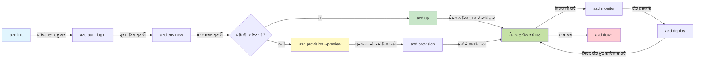

<!--
CO_OP_TRANSLATOR_METADATA:
{
  "original_hash": "e855e899d2705754fe85b04190edd0f0",
  "translation_date": "2025-11-20T21:01:04+00:00",
  "source_file": "docs/getting-started/azd-basics.md",
  "language_code": "pa"
}
-->
# AZD ਬੁਨਿਆਦੀਆਂ - Azure Developer CLI ਨੂੰ ਸਮਝਣਾ

# AZD ਬੁਨਿਆਦੀਆਂ - ਮੁੱਖ ਧਾਰਨਾਵਾਂ ਅਤੇ ਮੂਲ ਤੱਤ

**ਅਧਿਆਇ ਨੈਵੀਗੇਸ਼ਨ:**
- **📚 ਕੋਰਸ ਮੁੱਖ ਪੰਨਾ**: [AZD ਸ਼ੁਰੂਆਤ ਲਈ](../../README.md)
- **📖 ਮੌਜੂਦਾ ਅਧਿਆਇ**: ਅਧਿਆਇ 1 - ਬੁਨਿਆਦ ਅਤੇ ਤੁਰੰਤ ਸ਼ੁਰੂਆਤ
- **⬅️ ਪਿਛਲਾ**: [ਕੋਰਸ ਓਵਰਵਿਊ](../../README.md#-chapter-1-foundation--quick-start)
- **➡️ ਅਗਲਾ**: [ਇੰਸਟਾਲੇਸ਼ਨ ਅਤੇ ਸੈਟਅੱਪ](installation.md)
- **🚀 ਅਗਲਾ ਅਧਿਆਇ**: [ਅਧਿਆਇ 2: AI-ਪਹਿਲਾ ਵਿਕਾਸ](../microsoft-foundry/microsoft-foundry-integration.md)

## ਪਰਿਚਯ

ਇਸ ਪਾਠ ਵਿੱਚ ਤੁਸੀਂ Azure Developer CLI (azd) ਨਾਲ ਜਾਣੂ ਹੋਵੋਗੇ, ਜੋ ਕਿ ਇੱਕ ਸ਼ਕਤੀਸ਼ਾਲੀ ਕਮਾਂਡ-ਲਾਈਨ ਟੂਲ ਹੈ ਜੋ ਤੁਹਾਡੇ ਸਥਾਨਕ ਵਿਕਾਸ ਤੋਂ ਲੈ ਕੇ Azure 'ਤੇ ਡਿਪਲੌਇਮੈਂਟ ਤੱਕ ਦੇ ਸਫਰ ਨੂੰ ਤੇਜ਼ ਕਰਦਾ ਹੈ। ਤੁਸੀਂ ਮੁੱਖ ਧਾਰਨਾਵਾਂ, ਮੁੱਖ ਵਿਸ਼ੇਸ਼ਤਾਵਾਂ ਬਾਰੇ ਸਿੱਖੋਗੇ ਅਤੇ ਸਮਝੋਗੇ ਕਿ azd ਕਿਵੇਂ ਕਲਾਉਡ-ਨੈਟਿਵ ਐਪਲੀਕੇਸ਼ਨ ਡਿਪਲੌਇਮੈਂਟ ਨੂੰ ਆਸਾਨ ਬਣਾਉਂਦਾ ਹੈ।

## ਸਿੱਖਣ ਦੇ ਲਕਸ਼

ਇਸ ਪਾਠ ਦੇ ਅੰਤ ਤੱਕ, ਤੁਸੀਂ:
- ਸਮਝ ਪਾਉਗੇ ਕਿ Azure Developer CLI ਕੀ ਹੈ ਅਤੇ ਇਸ ਦਾ ਮੁੱਖ ਉਦੇਸ਼ ਕੀ ਹੈ
- ਟੈਂਪਲੇਟਸ, ਇਨਵਾਇਰਮੈਂਟਸ ਅਤੇ ਸਰਵਿਸਜ਼ ਦੀਆਂ ਮੁੱਖ ਧਾਰਨਾਵਾਂ ਬਾਰੇ ਸਿੱਖੋਗੇ
- ਮੁੱਖ ਵਿਸ਼ੇਸ਼ਤਾਵਾਂ ਦੀ ਖੋਜ ਕਰੋਗੇ ਜਿਵੇਂ ਕਿ ਟੈਂਪਲੇਟ-ਚਲਿਤ ਵਿਕਾਸ ਅਤੇ Infrastructure as Code
- azd ਪ੍ਰੋਜੈਕਟ ਦੀ ਬਣਾਵਟ ਅਤੇ ਵਰਕਫਲੋ ਨੂੰ ਸਮਝੋਗੇ
- ਆਪਣੇ ਵਿਕਾਸ ਦੇ ਮਾਹੌਲ ਲਈ azd ਨੂੰ ਇੰਸਟਾਲ ਅਤੇ ਕਨਫਿਗਰ ਕਰਨ ਲਈ ਤਿਆਰ ਹੋਵੋਗੇ

## ਸਿੱਖਣ ਦੇ ਨਤੀਜੇ

ਇਸ ਪਾਠ ਨੂੰ ਪੂਰਾ ਕਰਨ ਤੋਂ ਬਾਅਦ, ਤੁਸੀਂ:
- ਆਧੁਨਿਕ ਕਲਾਉਡ ਵਿਕਾਸ ਵਰਕਫਲੋਜ਼ ਵਿੱਚ azd ਦੀ ਭੂਮਿਕਾ ਦੀ ਵਿਆਖਿਆ ਕਰ ਸਕੋਗੇ
- azd ਪ੍ਰੋਜੈਕਟ ਬਣਾਵਟ ਦੇ ਹਿੱਸਿਆਂ ਦੀ ਪਛਾਣ ਕਰ ਸਕੋਗੇ
- ਸਮਝ ਸਕੋਗੇ ਕਿ ਟੈਂਪਲੇਟਸ, ਇਨਵਾਇਰਮੈਂਟਸ ਅਤੇ ਸਰਵਿਸਜ਼ ਕਿਵੇਂ ਇਕੱਠੇ ਕੰਮ ਕਰਦੇ ਹਨ
- azd ਨਾਲ Infrastructure as Code ਦੇ ਫਾਇਦਿਆਂ ਨੂੰ ਸਮਝ ਸਕੋਗੇ
- ਵੱਖ-ਵੱਖ azd ਕਮਾਂਡਾਂ ਅਤੇ ਉਨ੍ਹਾਂ ਦੇ ਉਦੇਸ਼ਾਂ ਨੂੰ ਪਛਾਣ ਸਕੋਗੇ

## Azure Developer CLI (azd) ਕੀ ਹੈ?

Azure Developer CLI (azd) ਇੱਕ ਕਮਾਂਡ-ਲਾਈਨ ਟੂਲ ਹੈ ਜੋ ਤੁਹਾਡੇ ਸਥਾਨਕ ਵਿਕਾਸ ਤੋਂ ਲੈ ਕੇ Azure 'ਤੇ ਡਿਪਲੌਇਮੈਂਟ ਤੱਕ ਦੇ ਸਫਰ ਨੂੰ ਤੇਜ਼ ਕਰਦਾ ਹੈ। ਇਹ Azure 'ਤੇ ਕਲਾਉਡ-ਨੈਟਿਵ ਐਪਲੀਕੇਸ਼ਨ ਬਣਾਉਣ, ਡਿਪਲੌਇ ਕਰਨ ਅਤੇ ਪ੍ਰਬੰਧਿਤ ਕਰਨ ਦੀ ਪ੍ਰਕਿਰਿਆ ਨੂੰ ਆਸਾਨ ਬਣਾਉਂਦਾ ਹੈ।

### 🎯 AZD ਕਿਉਂ ਵਰਤੋਂ? ਇੱਕ ਅਸਲ ਜਗਤ ਦੀ ਤੁਲਨਾ

ਆਓ ਇੱਕ ਸਧਾਰਨ ਵੈੱਬ ਐਪ ਨੂੰ ਡਾਟਾਬੇਸ ਨਾਲ ਡਿਪਲੌਇ ਕਰਨ ਦੀ ਤੁਲਨਾ ਕਰੀਏ:

#### ❌ AZD ਦੇ ਬਿਨਾਂ: ਮੈਨੂਅਲ Azure ਡਿਪਲੌਇਮੈਂਟ (30+ ਮਿੰਟ)

```bash
# ਪਹਲਾ ਕਦਮ: ਰਿਸੋਰਸ ਗਰੁੱਪ ਬਣਾਓ
az group create --name myapp-rg --location eastus

# ਦੂਜਾ ਕਦਮ: ਐਪ ਸਰਵਿਸ ਪਲਾਨ ਬਣਾਓ
az appservice plan create --name myapp-plan \
  --resource-group myapp-rg \
  --sku B1 --is-linux

# ਤੀਜਾ ਕਦਮ: ਵੈੱਬ ਐਪ ਬਣਾਓ
az webapp create --name myapp-web-unique123 \
  --resource-group myapp-rg \
  --plan myapp-plan \
  --runtime "NODE:18-lts"

# ਚੌਥਾ ਕਦਮ: ਕੋਸਮੋਸ ਡੀਬੀ ਅਕਾਊਂਟ ਬਣਾਓ (10-15 ਮਿੰਟ)
az cosmosdb create --name myapp-cosmos-unique123 \
  --resource-group myapp-rg \
  --kind MongoDB

# ਪੰਜਵਾਂ ਕਦਮ: ਡੇਟਾਬੇਸ ਬਣਾਓ
az cosmosdb mongodb database create \
  --account-name myapp-cosmos-unique123 \
  --resource-group myapp-rg \
  --name tododb

# ਛੇਵਾਂ ਕਦਮ: ਕਲੈਕਸ਼ਨ ਬਣਾਓ
az cosmosdb mongodb collection create \
  --account-name myapp-cosmos-unique123 \
  --resource-group myapp-rg \
  --database-name tododb \
  --name todos

# ਸੱਤਵਾਂ ਕਦਮ: ਕਨੈਕਸ਼ਨ ਸਟ੍ਰਿੰਗ ਪ੍ਰਾਪਤ ਕਰੋ
CONN_STR=$(az cosmosdb keys list \
  --name myapp-cosmos-unique123 \
  --resource-group myapp-rg \
  --type connection-strings \
  --query "connectionStrings[0].connectionString" -o tsv)

# ਅੱਠਵਾਂ ਕਦਮ: ਐਪ ਸੈਟਿੰਗਜ਼ ਕਨਫਿਗਰ ਕਰੋ
az webapp config appsettings set \
  --name myapp-web-unique123 \
  --resource-group myapp-rg \
  --settings MONGODB_URI="$CONN_STR"

# ਨੌਵਾਂ ਕਦਮ: ਲੌਗਿੰਗ ਐਨੇਬਲ ਕਰੋ
az webapp log config --name myapp-web-unique123 \
  --resource-group myapp-rg \
  --application-logging filesystem \
  --detailed-error-messages true

# ਦਸਵਾਂ ਕਦਮ: ਐਪਲੀਕੇਸ਼ਨ ਇਨਸਾਈਟਸ ਸੈਟਅਪ ਕਰੋ
az monitor app-insights component create \
  --app myapp-insights \
  --location eastus \
  --resource-group myapp-rg

# ਗਿਆਰਵਾਂ ਕਦਮ: ਐਪ ਇਨਸਾਈਟਸ ਨੂੰ ਵੈੱਬ ਐਪ ਨਾਲ ਲਿੰਕ ਕਰੋ
INSTRUMENTATION_KEY=$(az monitor app-insights component show \
  --app myapp-insights \
  --resource-group myapp-rg \
  --query "instrumentationKey" -o tsv)

az webapp config appsettings set \
  --name myapp-web-unique123 \
  --resource-group myapp-rg \
  --settings APPINSIGHTS_INSTRUMENTATIONKEY="$INSTRUMENTATION_KEY"

# ਬਾਰਵਾਂ ਕਦਮ: ਐਪਲੀਕੇਸ਼ਨ ਨੂੰ ਲੋਕਲ ਤੌਰ 'ਤੇ ਬਣਾਓ
npm install
npm run build

# ਤੇਰਵਾਂ ਕਦਮ: ਡਿਪਲੌਇਮੈਂਟ ਪੈਕੇਜ ਬਣਾਓ
zip -r app.zip . -x "*.git*" "node_modules/*"

# ਚੌਦਵਾਂ ਕਦਮ: ਐਪਲੀਕੇਸ਼ਨ ਡਿਪਲੌਇ ਕਰੋ
az webapp deployment source config-zip \
  --resource-group myapp-rg \
  --name myapp-web-unique123 \
  --src app.zip

# ਪੰਦਰਵਾਂ ਕਦਮ: ਉਡੀਕ ਕਰੋ ਅਤੇ ਦੁਆ ਕਰੋ ਕਿ ਇਹ ਕੰਮ ਕਰੇ 🙏
# (ਕੋਈ ਆਟੋਮੈਟਿਕ ਵੈਲੀਡੇਸ਼ਨ ਨਹੀਂ, ਹੱਥੋਂ ਟੈਸਟਿੰਗ ਦੀ ਲੋੜ ਹੈ)
```

**ਸਮੱਸਿਆਵਾਂ:**
- ❌ 15+ ਕਮਾਂਡਾਂ ਨੂੰ ਯਾਦ ਰੱਖਣਾ ਅਤੇ ਕ੍ਰਮ ਵਿੱਚ ਚਲਾਉਣਾ
- ❌ 30-45 ਮਿੰਟ ਦਾ ਮੈਨੂਅਲ ਕੰਮ
- ❌ ਗਲਤੀਆਂ ਕਰਨ ਦੀ ਸੰਭਾਵਨਾ (ਟਾਈਪੋ, ਗਲਤ ਪੈਰਾਮੀਟਰ)
- ❌ ਟਰਮੀਨਲ ਇਤਿਹਾਸ ਵਿੱਚ ਕਨੈਕਸ਼ਨ ਸਟ੍ਰਿੰਗਜ਼ ਦਾ ਪ੍ਰਦਰਸ਼ਨ
- ❌ ਕੁਝ ਗਲਤ ਹੋਣ 'ਤੇ ਕੋਈ ਆਟੋਮੈਟਿਕ ਰੋਲਬੈਕ ਨਹੀਂ
- ❌ ਟੀਮ ਮੈਂਬਰਾਂ ਲਈ ਦੁਹਰਾਉਣਾ ਮੁਸ਼ਕਲ
- ❌ ਹਰ ਵਾਰ ਵੱਖਰਾ (ਦੁਹਰਾਉਣਯੋਗ ਨਹੀਂ)

#### ✅ AZD ਨਾਲ: ਆਟੋਮੈਟਿਕ ਡਿਪਲੌਇਮੈਂਟ (5 ਕਮਾਂਡਾਂ, 10-15 ਮਿੰਟ)

```bash
# ਕਦਮ 1: ਟੈਮਪਲੇਟ ਤੋਂ ਸ਼ੁਰੂ ਕਰੋ
azd init --template todo-nodejs-mongo

# ਕਦਮ 2: ਪ੍ਰਮਾਣਿਕਤਾ ਕਰੋ
azd auth login

# ਕਦਮ 3: ਵਾਤਾਵਰਣ ਬਣਾਓ
azd env new dev

# ਕਦਮ 4: ਬਦਲਾਵਾਂ ਦਾ ਪ੍ਰੀਵਿਊ ਕਰੋ (ਵਿਕਲਪਿਕ ਪਰ ਸਿਫਾਰਸ਼ੀ)
azd provision --preview

# ਕਦਮ 5: ਸਭ ਕੁਝ ਡਿਪਲੌਇ ਕਰੋ
azd up

# ✨ ਮੁਕੰਮਲ! ਸਭ ਕੁਝ ਡਿਪਲੌਇ, ਸੰਰਚਿਤ, ਅਤੇ ਨਿਗਰਾਨੀ ਕੀਤਾ ਗਿਆ
```

**ਫਾਇਦੇ:**
- ✅ **5 ਕਮਾਂਡਾਂ** ਵਿਰੁੱਧ 15+ ਮੈਨੂਅਲ ਕਦਮ
- ✅ **10-15 ਮਿੰਟ** ਕੁੱਲ ਸਮਾਂ (ਜਿਆਦਾਤਰ Azure ਲਈ ਉਡੀਕ)
- ✅ **ਗਲਤੀਆਂ ਨਹੀਂ** - ਆਟੋਮੈਟਿਕ ਅਤੇ ਟੈਸਟ ਕੀਤਾ ਹੋਇਆ
- ✅ **ਸੁਰੱਖਿਅਤ ਤਰੀਕੇ ਨਾਲ ਸੇਕ੍ਰੇਟਸ ਦਾ ਪ੍ਰਬੰਧਨ** Key Vault ਰਾਹੀਂ
- ✅ **ਫੇਲ੍ਹ ਹੋਣ 'ਤੇ ਆਟੋਮੈਟਿਕ ਰੋਲਬੈਕ**
- ✅ **ਪੂਰੀ ਤਰ੍ਹਾਂ ਦੁਹਰਾਉਣਯੋਗ** - ਹਰ ਵਾਰ ਇੱਕੋ ਨਤੀਜਾ
- ✅ **ਟੀਮ ਲਈ ਤਿਆਰ** - ਹਰ ਕੋਈ ਇੱਕੋ ਕਮਾਂਡਾਂ ਨਾਲ ਡਿਪਲੌਇ ਕਰ ਸਕਦਾ ਹੈ
- ✅ **Infrastructure as Code** - ਵਰਜਨ ਕੰਟਰੋਲ ਕੀਤੇ Bicep ਟੈਂਪਲੇਟਸ
- ✅ **ਬਿਲਟ-ਇਨ ਮਾਨੀਟਰਿੰਗ** - Application Insights ਆਟੋਮੈਟਿਕ ਤੌਰ 'ਤੇ ਕਨਫਿਗਰ ਕੀਤਾ ਗਿਆ

### 📊 ਸਮਾਂ ਅਤੇ ਗਲਤੀ ਘਟਾਉਣਾ

| ਮਾਪ | ਮੈਨੂਅਲ ਡਿਪਲੌਇਮੈਂਟ | AZD ਡਿਪਲੌਇਮੈਂਟ | ਸੁਧਾਰ |
|:-------|:------------------|:---------------|:------------|
| **ਕਮਾਂਡਾਂ** | 15+ | 5 | 67% ਘੱਟ |
| **ਸਮਾਂ** | 30-45 ਮਿੰਟ | 10-15 ਮਿੰਟ | 60% ਤੇਜ਼ |
| **ਗਲਤੀ ਦਰ** | ~40% | <5% | 88% ਘਟਾਅ |
| **ਸਥਿਰਤਾ** | ਘੱਟ (ਮੈਨੂਅਲ) | 100% (ਆਟੋਮੈਟਿਕ) | ਪੂਰੀ |
| **ਟੀਮ ਓਨਬੋਰਡਿੰਗ** | 2-4 ਘੰਟੇ | 30 ਮਿੰਟ | 75% ਤੇਜ਼ |
| **ਰੋਲਬੈਕ ਸਮਾਂ** | 30+ ਮਿੰਟ (ਮੈਨੂਅਲ) | 2 ਮਿੰਟ (ਆਟੋਮੈਟਿਕ) | 93% ਤੇਜ਼ |

## ਮੁੱਖ ਧਾਰਨਾਵਾਂ

### ਟੈਂਪਲੇਟਸ
ਟੈਂਪਲੇਟਸ azd ਦੀ ਬੁਨਿਆਦ ਹਨ। ਇਹ ਸ਼ਾਮਲ ਕਰਦੇ ਹਨ:
- **ਐਪਲੀਕੇਸ਼ਨ ਕੋਡ** - ਤੁਹਾਡਾ ਸੋਰਸ ਕੋਡ ਅਤੇ ਡਿਪੈਂਡੈਂਸੀਜ਼
- **ਇੰਫਰਾਸਟਰਕਚਰ ਦੀ ਪਰਿਭਾਸ਼ਾ** - Azure ਸਰੋਤਾਂ ਨੂੰ Bicep ਜਾਂ Terraform ਵਿੱਚ ਪਰਿਭਾਸ਼ਿਤ ਕੀਤਾ ਗਿਆ
- **ਕਨਫਿਗਰੇਸ਼ਨ ਫਾਈਲਾਂ** - ਸੈਟਿੰਗਾਂ ਅਤੇ ਇਨਵਾਇਰਮੈਂਟ ਵੈਰੀਏਬਲ
- **ਡਿਪਲੌਇਮੈਂਟ ਸਕ੍ਰਿਪਟਸ** - ਆਟੋਮੈਟਿਕ ਡਿਪਲੌਇਮੈਂਟ ਵਰਕਫਲੋਜ਼

### ਇਨਵਾਇਰਮੈਂਟਸ
ਇਨਵਾਇਰਮੈਂਟਸ ਵੱਖ-ਵੱਖ ਡਿਪਲੌਇਮੈਂਟ ਟਾਰਗਟਸ ਦਾ ਪ੍ਰਤੀਨਿਧਿਤਾ ਕਰਦੇ ਹਨ:
- **ਡਿਵੈਲਪਮੈਂਟ** - ਟੈਸਟਿੰਗ ਅਤੇ ਵਿਕਾਸ ਲਈ
- **ਸਟੇਜਿੰਗ** - ਪ੍ਰੀ-ਪ੍ਰੋਡਕਸ਼ਨ ਇਨਵਾਇਰਮੈਂਟ
- **ਪ੍ਰੋਡਕਸ਼ਨ** - ਲਾਈਵ ਪ੍ਰੋਡਕਸ਼ਨ ਇਨਵਾਇਰਮੈਂਟ

ਹਰ ਇਨਵਾਇਰਮੈਂਟ ਆਪਣਾ:
- Azure ਰਿਸੋਰਸ ਗਰੁੱਪ
- ਕਨਫਿਗਰੇਸ਼ਨ ਸੈਟਿੰਗਾਂ
- ਡਿਪਲੌਇਮੈਂਟ ਸਥਿਤੀ ਰੱਖਦਾ ਹੈ

### ਸਰਵਿਸਜ਼
ਸਰਵਿਸਜ਼ ਤੁਹਾਡੇ ਐਪਲੀਕੇਸ਼ਨ ਦੇ ਬਿਲਡਿੰਗ ਬਲਾਕ ਹਨ:
- **ਫਰੰਟਐਂਡ** - ਵੈੱਬ ਐਪਲੀਕੇਸ਼ਨ, SPAs
- **ਬੈਕਐਂਡ** - APIs, ਮਾਈਕਰੋਸਰਵਿਸਜ਼
- **ਡਾਟਾਬੇਸ** - ਡਾਟਾ ਸਟੋਰੇਜ ਹੱਲ
- **ਸਟੋਰੇਜ** - ਫਾਈਲ ਅਤੇ ਬਲੌਬ ਸਟੋਰੇਜ

## ਮੁੱਖ ਵਿਸ਼ੇਸ਼ਤਾਵਾਂ

### 1. ਟੈਂਪਲੇਟ-ਚਲਿਤ ਵਿਕਾਸ
```bash
# ਉਪਲਬਧ ਟੈਂਪਲੇਟਸ ਨੂੰ ਬ੍ਰਾਊਜ਼ ਕਰੋ
azd template list

# ਇੱਕ ਟੈਂਪਲੇਟ ਤੋਂ ਸ਼ੁਰੂ ਕਰੋ
azd init --template <template-name>
```

### 2. Infrastructure as Code
- **Bicep** - Azure ਦੀ ਡੋਮੇਨ-ਸਪੇਸਿਫਿਕ ਭਾਸ਼ਾ
- **Terraform** - ਮਲਟੀ-ਕਲਾਉਡ ਇੰਫਰਾਸਟਰਕਚਰ ਟੂਲ
- **ARM ਟੈਂਪਲੇਟਸ** - Azure Resource Manager ਟੈਂਪਲੇਟਸ

### 3. ਇੰਟਿਗ੍ਰੇਟਡ ਵਰਕਫਲੋਜ਼
```bash
# ਪੂਰਾ ਡਿਪਲੌਇਮੈਂਟ ਵਰਕਫਲੋ
azd up            # ਪ੍ਰੋਵਿਜ਼ਨ + ਡਿਪਲੌਇ, ਇਹ ਪਹਿਲੀ ਵਾਰ ਸੈਟਅੱਪ ਲਈ ਹੈਂਡਸ ਆਫ਼ ਹੈ

# 🧪 ਨਵਾਂ: ਡਿਪਲੌਇਮੈਂਟ ਤੋਂ ਪਹਿਲਾਂ ਇੰਫਰਾਸਟਰਕਚਰ ਬਦਲਾਵਾਂ ਦਾ ਪ੍ਰੀਵਿਊ ਕਰੋ (ਸੁਰੱਖਿਅਤ)
azd provision --preview    # ਬਦਲਾਵਾਂ ਕੀਤੇ ਬਿਨਾਂ ਇੰਫਰਾਸਟਰਕਚਰ ਡਿਪਲੌਇਮੈਂਟ ਦਾ ਸਿਮੂਲੇਟ ਕਰੋ

azd provision     # ਜੇ ਤੁਸੀਂ ਇੰਫਰਾਸਟਰਕਚਰ ਨੂੰ ਅਪਡੇਟ ਕਰਦੇ ਹੋ ਤਾਂ ਅਜ਼ੂਰ ਸਰੋਤ ਬਣਾਓ
azd deploy        # ਐਪਲੀਕੇਸ਼ਨ ਕੋਡ ਡਿਪਲੌਇ ਕਰੋ ਜਾਂ ਅਪਡੇਟ ਤੋਂ ਬਾਅਦ ਐਪਲੀਕੇਸ਼ਨ ਕੋਡ ਨੂੰ ਮੁੜ ਡਿਪਲੌਇ ਕਰੋ
azd down          # ਸਰੋਤਾਂ ਨੂੰ ਸਾਫ਼ ਕਰੋ
```

#### 🛡️ ਸੁਰੱਖਿਅਤ ਇੰਫਰਾਸਟਰਕਚਰ ਪਲੈਨਿੰਗ ਨਾਲ ਪ੍ਰੀਵਿਊ
`azd provision --preview` ਕਮਾਂਡ ਸੁਰੱਖਿਅਤ ਡਿਪਲੌਇਮੈਂਟ ਲਈ ਇੱਕ ਗੇਮ-ਚੇਂਜਰ ਹੈ:
- **ਡ੍ਰਾਈ-ਰਨ ਵਿਸ਼ਲੇਸ਼ਣ** - ਦਿਖਾਉਂਦਾ ਹੈ ਕਿ ਕੀ ਬਣਾਇਆ, ਸੋਧਿਆ ਜਾਂ ਹਟਾਇਆ ਜਾਵੇਗਾ
- **ਜੀਰੋ ਰਿਸਕ** - ਤੁਹਾਡੇ Azure ਇਨਵਾਇਰਮੈਂਟ ਵਿੱਚ ਕੋਈ ਅਸਲ ਬਦਲਾਅ ਨਹੀਂ ਹੁੰਦੇ
- **ਟੀਮ ਸਹਿਯੋਗ** - ਡਿਪਲੌਇਮੈਂਟ ਤੋਂ ਪਹਿਲਾਂ ਪ੍ਰੀਵਿਊ ਨਤੀਜੇ ਸਾਂਝੇ ਕਰੋ
- **ਲਾਗਤ ਦਾ ਅੰਦਾਜ਼ਾ** - ਕਮਿਟਮੈਂਟ ਤੋਂ ਪਹਿਲਾਂ ਸਰੋਤਾਂ ਦੀ ਲਾਗਤ ਨੂੰ ਸਮਝੋ

```bash
# ਉਦਾਹਰਨ ਪੂਰਵਦਰਸ਼ਨ ਵਰਕਫਲੋ
azd provision --preview           # ਦੇਖੋ ਕੀ ਬਦਲੇਗਾ
# ਨਤੀਜੇ ਦੀ ਸਮੀਖਿਆ ਕਰੋ, ਟੀਮ ਨਾਲ ਚਰਚਾ ਕਰੋ
azd provision                     # ਵਿਸ਼ਵਾਸ ਨਾਲ ਬਦਲਾਅ ਲਾਗੂ ਕਰੋ
```

### 📊 ਵਿਜੁਅਲ: AZD ਵਿਕਾਸ ਵਰਕਫਲੋ


**ਵਰਕਫਲੋ ਵਿਆਖਿਆ:**
1. **Init** - ਟੈਂਪਲੇਟ ਜਾਂ ਨਵੇਂ ਪ੍ਰੋਜੈਕਟ ਨਾਲ ਸ਼ੁਰੂ ਕਰੋ
2. **Auth** - Azure ਨਾਲ ਪ੍ਰਮਾਣਿਕਤਾ ਕਰੋ
3. **Environment** - ਅਲੱਗ ਡਿਪਲੌਇਮੈਂਟ ਇਨਵਾਇਰਮੈਂਟ ਬਣਾਓ
4. **Preview** - 🆕 ਹਮੇਸ਼ਾ ਇੰਫਰਾਸਟਰਕਚਰ ਬਦਲਾਅ ਪਹਿਲਾਂ ਪ੍ਰੀਵਿਊ ਕਰੋ (ਸੁਰੱਖਿਅਤ ਅਭਿਆਸ)
5. **Provision** - Azure ਸਰੋਤ ਬਣਾਓ/ਅਪਡੇਟ ਕਰੋ
6. **Deploy** - ਆਪਣਾ ਐਪਲੀਕੇਸ਼ਨ ਕੋਡ ਪਹੁੰਚਾਓ
7. **Monitor** - ਐਪਲੀਕੇਸ਼ਨ ਦੇ ਪ੍ਰਦਰਸ਼ਨ ਨੂੰ ਦੇਖੋ
8. **Iterate** - ਬਦਲਾਅ ਕਰੋ ਅਤੇ ਕੋਡ ਨੂੰ ਦੁਬਾਰਾ ਡਿਪਲੌਇ ਕਰੋ
9. **Cleanup** - ਕੰਮ ਮੁਕੰਮਲ ਹੋਣ 'ਤੇ ਸਰੋਤ ਹਟਾਓ

### 4. ਇਨਵਾਇਰਮੈਂਟ ਪ੍ਰਬੰਧਨ
```bash
# ਵਾਤਾਵਰਣ ਬਣਾਓ ਅਤੇ ਪ੍ਰਬੰਧਿਤ ਕਰੋ
azd env new <environment-name>
azd env select <environment-name>
azd env list
```

## 📁 ਪ੍ਰੋਜੈਕਟ ਬਣਾਵਟ

ਇੱਕ ਆਮ azd ਪ੍ਰੋਜੈਕਟ ਬਣਾਵਟ:
```
my-app/
├── .azd/                    # azd configuration
│   └── config.json
├── .azure/                  # Azure deployment artifacts
├── .devcontainer/          # Development container config
├── .github/workflows/      # GitHub Actions
├── .vscode/               # VS Code settings
├── infra/                 # Infrastructure code
│   ├── main.bicep        # Main infrastructure template
│   ├── main.parameters.json
│   └── modules/          # Reusable modules
├── src/                  # Application source code
│   ├── api/             # Backend services
│   └── web/             # Frontend application
├── azure.yaml           # azd project configuration
└── README.md
```

## 🔧 ਕਨਫਿਗਰੇਸ਼ਨ ਫਾਈਲਾਂ

### azure.yaml
ਮੁੱਖ ਪ੍ਰੋਜੈਕਟ ਕਨਫਿਗਰੇਸ਼ਨ ਫਾਈਲ:
```yaml
name: my-awesome-app
metadata:
  template: my-template@1.0.0

services:
  web:
    project: ./src/web
    language: js
    host: appservice
  api:
    project: ./src/api
    language: js
    host: appservice

hooks:
  preprovision:
    shell: pwsh
    run: echo "Preparing to provision..."
```

### .azure/config.json
ਇਨਵਾਇਰਮੈਂਟ-ਵਿਸ਼ੇਸ਼ ਕਨਫਿਗਰੇਸ਼ਨ:
```json
{
  "version": 1,
  "defaultEnvironment": "dev",
  "environments": {
    "dev": {
      "subscriptionId": "your-subscription-id",
      "location": "eastus"
    }
  }
}
```

## 🎪 ਆਮ ਵਰਕਫਲੋਜ਼ ਨਾਲ ਹੱਥ-ਅਭਿਆਸ

> **💡 ਸਿੱਖਣ ਦੀ ਟਿੱਪ:** ਆਪਣੇ AZD ਹੁਨਰਾਂ ਨੂੰ ਤਰੱਕੀਸ਼ੀਲ ਤੌਰ 'ਤੇ ਬਣਾਉਣ ਲਈ ਇਹ ਅਭਿਆਸ ਕ੍ਰਮਵਾਰ ਕਰੋ।

### 🎯 ਅਭਿਆਸ 1: ਆਪਣਾ ਪਹਿਲਾ ਪ੍ਰੋਜੈਕਟ ਸ਼ੁਰੂ ਕਰੋ

**ਲਕਸ਼:** ਇੱਕ AZD ਪ੍ਰੋਜੈਕਟ ਬਣਾਓ ਅਤੇ ਇਸ ਦੀ ਬਣਾਵਟ ਦੀ ਪੜਚੋਲ ਕਰੋ

**ਕਦਮ:**
```bash
# ਇੱਕ ਸਾਬਤ ਟੈਂਪਲੇਟ ਦੀ ਵਰਤੋਂ ਕਰੋ
azd init --template todo-nodejs-mongo

# ਬਣਾਈ ਗਈ ਫਾਈਲਾਂ ਦੀ ਪੜਚੋਲ ਕਰੋ
ls -la  # ਸਾਰੀਆਂ ਫਾਈਲਾਂ ਵੇਖੋ, ਜਿਨ੍ਹਾਂ ਵਿੱਚ ਲੁਕੀਆਂ ਹੋਈਆਂ ਵੀ ਸ਼ਾਮਲ ਹਨ

# ਮੁੱਖ ਫਾਈਲਾਂ ਬਣਾਈਆਂ ਗਈਆਂ:
# - azure.yaml (ਮੁੱਖ ਕਨਫਿਗ)
# - infra/ (ਇੰਫਰਾਸਟਰਕਚਰ ਕੋਡ)
# - src/ (ਐਪਲੀਕੇਸ਼ਨ ਕੋਡ)
```

**✅ ਸਫਲਤਾ:** ਤੁਹਾਡੇ ਕੋਲ azure.yaml, infra/, ਅਤੇ src/ ਡਾਇਰੈਕਟਰੀਜ਼ ਹਨ

---

### 🎯 ਅਭਿਆਸ 2: Azure 'ਤੇ ਡਿਪਲੌਇ ਕਰੋ

**ਲਕਸ਼:** ਪੂਰਾ ਐਂਡ-ਟੂ-ਐਂਡ ਡਿਪਲੌਇਮੈਂਟ

**ਕਦਮ:**
```bash
# 1. ਪ੍ਰਮਾਣਿਕਤਾ ਕਰੋ
az login && azd auth login

# 2. ਵਾਤਾਵਰਣ ਬਣਾਓ
azd env new dev
azd env set AZURE_LOCATION eastus

# 3. ਬਦਲਾਵਾਂ ਦਾ ਪ੍ਰੀਵਿਊ ਕਰੋ (ਸਿਫਾਰਸ਼ ਕੀਤੀ ਗਈ)
azd provision --preview

# 4. ਸਭ ਕੁਝ ਡਿਪਲੌਇ ਕਰੋ
azd up

# 5. ਡਿਪਲੌਇਮੈਂਟ ਦੀ ਪੁਸ਼ਟੀ ਕਰੋ
azd show    # ਆਪਣੀ ਐਪ URL ਵੇਖੋ
```

**ਅਨੁਮਾਨਿਤ ਸਮਾਂ:** 10-15 ਮਿੰਟ  
**✅ ਸਫਲਤਾ:** ਐਪਲੀਕੇਸ਼ਨ URL ਬ੍ਰਾਊਜ਼ਰ ਵਿੱਚ ਖੁਲਦਾ ਹੈ

---

### 🎯 ਅਭਿਆਸ 3: ਕਈ ਇਨਵਾਇਰਮੈਂਟਸ

**ਲਕਸ਼:** ਡਿਵ ਅਤੇ ਸਟੇਜਿੰਗ 'ਤੇ ਡਿਪਲੌਇ ਕਰੋ

**ਕਦਮ:**
```bash
# ਪਹਿਲਾਂ ਹੀ ਡਿਵ ਹੈ, ਸਟੇਜਿੰਗ ਬਣਾਓ
azd env new staging
azd env set AZURE_LOCATION westus2
azd up

# ਉਨ੍ਹਾਂ ਦੇ ਵਿਚਕਾਰ ਸਵਿੱਚ ਕਰੋ
azd env list
azd env select dev
```

**✅ ਸਫਲਤਾ:** Azure ਪੋਰਟਲ ਵਿੱਚ ਦੋ ਵੱਖਰੇ ਰਿਸੋਰਸ ਗਰੁੱਪ

---

### 🛡️ ਸਾਫ ਸ਼ੁਰੂਆਤ: `azd down --force --purge`

ਜਦੋਂ ਤੁਹਾਨੂੰ ਪੂਰੀ ਤਰ੍ਹਾਂ ਰੀਸੈਟ ਕਰਨ ਦੀ ਲੋੜ ਹੋਵੇ:

```bash
azd down --force --purge
```

**ਇਹ ਕੀ ਕਰਦਾ ਹੈ:**
- `--force`: ਕੋਈ ਪੁਸ਼ਟੀ ਪ੍ਰੰਪਟ ਨਹੀਂ
- `--purge`: ਸਾਰੇ ਸਥਾਨਕ ਸਥਿਤੀ ਅਤੇ Azure ਸਰੋਤਾਂ ਨੂੰ ਹਟਾਉਂਦਾ ਹੈ

**ਕਦੋਂ ਵਰਤੋਂ:**
- ਡਿਪਲੌਇਮੈਂਟ ਵਿਚਕਾਰ ਫੇਲ੍ਹ ਹੋ ਗਿਆ
- ਪ੍ਰੋਜੈਕਟ ਬਦਲ ਰਹੇ ਹੋ
- ਨਵੀਂ ਸ਼ੁਰੂਆਤ ਦੀ ਲੋੜ

---

## 🎪 ਮੂਲ ਵਰਕਫਲੋ ਰਿਫਰੈਂਸ

### ਨਵਾਂ ਪ੍ਰੋਜੈਕਟ ਸ਼ੁਰੂ ਕਰਨਾ
```bash
# ਤਰੀਕਾ 1: ਮੌਜੂਦਾ ਟੈਂਪਲੇਟ ਵਰਤੋ
azd init --template todo-nodejs-mongo

# ਤਰੀਕਾ 2: ਨਵੀਂ ਸ਼ੁਰੂਆਤ ਕਰੋ
azd init

# ਤਰੀਕਾ 3: ਮੌਜੂਦਾ ਡਾਇਰੈਕਟਰੀ ਵਰਤੋ
azd init .
```

### ਵਿਕਾਸ ਚੱਕਰ
```bash
# ਵਿਕਾਸ ਵਾਤਾਵਰਣ ਸੈੱਟ ਕਰੋ
azd auth login
azd env new dev
azd env select dev

# ਸਭ ਕੁਝ ਤਾਇਨਾਤ ਕਰੋ
azd up

# ਬਦਲਾਅ ਕਰੋ ਅਤੇ ਦੁਬਾਰਾ ਤਾਇਨਾਤ ਕਰੋ
azd deploy

# ਕੰਮ ਮੁਕੰਮਲ ਹੋਣ 'ਤੇ ਸਾਫ਼ ਕਰੋ
azd down --force --purge # Azure Developer CLI ਵਿੱਚ ਕਮਾਂਡ ਤੁਹਾਡੇ ਵਾਤਾਵਰਣ ਲਈ ਇੱਕ **ਕਠੋਰ ਰੀਸੈਟ** ਹੈ—ਖਾਸ ਤੌਰ 'ਤੇ ਉਸ ਸਮੇਂ ਲਾਭਦਾਇਕ ਜਦੋਂ ਤੁਸੀਂ ਅਸਫਲ ਤਾਇਨਾਤੀਆਂ ਦਾ ਸਮੱਸਿਆ ਹੱਲ ਕਰ ਰਹੇ ਹੋ, ਅਨਾਥ ਸਰੋਤਾਂ ਨੂੰ ਸਾਫ਼ ਕਰ ਰਹੇ ਹੋ, ਜਾਂ ਨਵੇਂ ਤਾਇਨਾਤ ਲਈ ਤਿਆਰੀ ਕਰ ਰਹੇ ਹੋ।
```

## `azd down --force --purge` ਨੂੰ ਸਮਝਣਾ
`azd down --force --purge` ਕਮਾਂਡ ਤੁਹਾਡੇ azd ਇਨਵਾਇਰਮੈਂਟ ਅਤੇ ਸਾਰੇ ਸੰਬੰਧਿਤ ਸਰੋਤਾਂ ਨੂੰ ਪੂਰੀ ਤਰ੍ਹਾਂ ਹਟਾਉਣ ਦਾ ਇੱਕ ਸ਼ਕਤੀਸ਼ਾਲੀ ਤਰੀਕਾ ਹੈ। ਇੱਥੇ ਹਰ ਝੰਡੇ ਦਾ ਵਿਸ਼ਲੇਸ਼ਣ ਹੈ:
```
--force
```
- ਪੁਸ਼ਟੀ ਪ੍ਰੰਪਟਸ ਨੂੰ ਛੱਡ ਦਿੰਦਾ ਹੈ।
- ਆਟੋਮੇਸ਼ਨ ਜਾਂ ਸਕ੍ਰਿਪਟਿੰਗ ਲਈ ਉਪਯੋਗ ਜਿੱਥੇ ਮੈਨੂਅਲ ਇਨਪੁਟ ਸੰਭਵ ਨਹੀਂ।
- ਇਹ ਯਕੀਨੀ ਬਣਾਉਂਦਾ ਹੈ ਕਿ CLI ਅਸੰਗਤੀਆਂ ਦਾ ਪਤਾ ਲਗਾਉਣ ਦੇ ਬਾਵਜੂਦ ਟੀਅਰਡਾਊਨ ਬਿਨਾਂ ਰੁਕਾਵਟ ਜਾਰੀ ਰਹੇ।

```
--purge
```
**ਸਾਰੇ ਸੰਬੰਧਿਤ ਮੈਟਾਡੇਟਾ** ਨੂੰ ਹਟਾਉਂਦਾ ਹੈ, ਜਿਸ ਵਿੱਚ ਸ਼ਾਮਲ ਹਨ:
ਇਨਵਾਇਰਮੈਂਟ ਸਥਿਤੀ  
ਸਥਾਨਕ `.azure` ਫੋਲਡਰ  
ਕੈਸ਼ਡ ਡਿਪਲੌਇਮੈਂਟ ਜਾਣਕਾਰੀ  
azd ਨੂੰ ਪਿਛਲੇ ਡਿਪਲੌਇਮੈਂਟਸ "ਯਾਦ" ਕਰਨ ਤੋਂ ਰੋਕਦਾ ਹੈ, ਜੋ ਕਿ ਮਿਸਮੈਚਡ ਰਿਸੋਰਸ ਗਰੁੱਪ ਜਾਂ ਸਟੇਲ ਰਜਿਸਟਰੀ ਰਿਫਰੈਂਸਾਂ ਵਰਗੀਆਂ ਸਮੱਸਿਆਵਾਂ ਪੈਦਾ ਕਰ ਸਕਦਾ ਹੈ।

### ਦੋਹਰੇ ਝੰਡੇ ਕਿਉਂ ਵਰਤੋਂ?
ਜਦੋਂ ਤੁਸੀਂ `azd up` ਨਾਲ ਅਟਕ ਜਾਂਦੇ ਹੋ ਕਿਉਂਕਿ ਬਚੀ ਹੋਈ ਸਥਿਤੀ ਜਾਂ ਅਧੂਰੇ ਡਿਪਲੌਇਮੈਂਟਸ ਹਨ, ਇਹ ਕੌਂਬੋ ਇੱਕ **ਸਾਫ ਸ਼ੁਰੂਆਤ** ਯਕੀਨੀ ਬਣਾਉਂਦਾ ਹੈ।

ਇਹ ਖਾਸ ਤੌਰ 'ਤੇ ਮਦਦਗਾਰ ਹੈ ਜਦੋਂ Azure ਪੋਰਟਲ ਵਿੱਚ ਮੈਨੂਅਲ ਸਰੋਤ ਹਟਾਏ ਜਾਂਦੇ ਹਨ ਜਾਂ ਜਦੋਂ ਟੈਂਪਲੇਟਸ, ਇਨਵਾਇਰਮੈਂਟਸ ਜਾਂ ਰਿਸੋਰਸ ਗਰੁੱਪ ਨਾਮਕਰਨ ਰਿਵਾਜਾਂ
- [ਇੰਸਟਾਲੇਸ਼ਨ ਅਤੇ ਸੈਟਅਪ](installation.md) - AZD ਨੂੰ ਇੰਸਟਾਲ ਅਤੇ ਕਨਫਿਗਰ ਕਰੋ
- [ਤੁਹਾਡਾ ਪਹਿਲਾ ਪ੍ਰੋਜੈਕਟ](first-project.md) - ਪੂਰਾ ਹੈਂਡਸ-ਆਨ ਟਿਊਟੋਰਿਅਲ
- [ਕਨਫਿਗਰੇਸ਼ਨ ਗਾਈਡ](configuration.md) - ਉੱਚ-ਸਤਹ ਦੇ ਕਨਫਿਗਰੇਸ਼ਨ ਵਿਕਲਪ

**🎯 ਅਗਲੇ ਅਧਿਆਇ ਲਈ ਤਿਆਰ?**
- [ਅਧਿਆਇ 2: AI-ਪਹਿਲਾ ਵਿਕਾਸ](../microsoft-foundry/microsoft-foundry-integration.md) - AI ਐਪਲੀਕੇਸ਼ਨ ਬਣਾਉਣਾ ਸ਼ੁਰੂ ਕਰੋ

## ਵਾਧੂ ਸਰੋਤ

- [Azure Developer CLI ਝਲਕ](https://learn.microsoft.com/en-us/azure/developer/azure-developer-cli/)
- [ਟੈਂਪਲੇਟ ਗੈਲਰੀ](https://azure.github.io/awesome-azd/)
- [ਕਮਿਊਨਿਟੀ ਸੈਂਪਲ](https://github.com/Azure-Samples)

---

## 🙋 ਅਕਸਰ ਪੁੱਛੇ ਜਾਣ ਵਾਲੇ ਸਵਾਲ

### ਆਮ ਸਵਾਲ

**ਸਵਾਲ: AZD ਅਤੇ Azure CLI ਵਿੱਚ ਕੀ ਫਰਕ ਹੈ?**

ਜਵਾਬ: Azure CLI (`az`) ਵਿਅਕਤੀਗਤ Azure ਸਰੋਤਾਂ ਨੂੰ ਮੈਨੇਜ ਕਰਨ ਲਈ ਹੈ। AZD (`azd`) ਪੂਰੇ ਐਪਲੀਕੇਸ਼ਨ ਨੂੰ ਮੈਨੇਜ ਕਰਨ ਲਈ ਹੈ:

```bash
# ਐਜ਼ੂਰ CLI - ਨੀਚਲੇ ਪੱਧਰ ਦੇ ਸਰੋਤ ਪ੍ਰਬੰਧਨ
az webapp create --name myapp --resource-group rg
az sql server create --name myserver --resource-group rg
# ...ਹੋਰ ਕਈ ਕਮਾਂਡਾਂ ਦੀ ਲੋੜ ਹੈ

# AZD - ਐਪਲੀਕੇਸ਼ਨ ਪੱਧਰ ਪ੍ਰਬੰਧਨ
azd up  # ਸਾਰੇ ਸਰੋਤਾਂ ਨਾਲ ਪੂਰੇ ਐਪ ਨੂੰ ਡਿਪਲੌਇ ਕਰਦਾ ਹੈ
```

**ਇਸ ਤਰ੍ਹਾਂ ਸੋਚੋ:**
- `az` = ਵਿਅਕਤੀਗਤ ਲੇਗੋ ਬ੍ਰਿਕਸ 'ਤੇ ਕੰਮ ਕਰਨਾ
- `azd` = ਪੂਰੇ ਲੇਗੋ ਸੈਟ 'ਤੇ ਕੰਮ ਕਰਨਾ

---

**ਸਵਾਲ: ਕੀ ਮੈਨੂੰ AZD ਵਰਤਣ ਲਈ Bicep ਜਾਂ Terraform ਜਾਣਨ ਦੀ ਲੋੜ ਹੈ?**

ਜਵਾਬ: ਨਹੀਂ! ਟੈਂਪਲੇਟ ਨਾਲ ਸ਼ੁਰੂ ਕਰੋ:
```bash
# ਮੌਜੂਦਾ ਟੈਂਪਲੇਟ ਵਰਤੋ - IaC ਗਿਆਨ ਦੀ ਲੋੜ ਨਹੀਂ
azd init --template todo-nodejs-mongo
azd up
```

ਤੁਹਾਨੂੰ ਬਾਅਦ ਵਿੱਚ Bicep ਸਿੱਖਣ ਦੀ ਆਜ਼ਾਦੀ ਹੈ। ਟੈਂਪਲੇਟ ਸਿੱਖਣ ਲਈ ਕੰਮ ਕਰਨ ਵਾਲੇ ਉਦਾਹਰਨਾਂ ਦਿੰਦੇ ਹਨ।

---

**ਸਵਾਲ: AZD ਟੈਂਪਲੇਟ ਚਲਾਉਣ ਦੀ ਕੀਮਤ ਕਿੰਨੀ ਹੈ?**

ਜਵਾਬ: ਟੈਂਪਲੇਟ ਦੇ ਅਨੁਸਾਰ ਕੀਮਤ ਵੱਖ-ਵੱਖ ਹੁੰਦੀ ਹੈ। ਜ਼ਿਆਦਾਤਰ ਵਿਕਾਸ ਟੈਂਪਲੇਟ ਦੀ ਕੀਮਤ $50-150/ਮਹੀਨਾ ਹੁੰਦੀ ਹੈ:

```bash
# ਤੈਨਾਤ ਕਰਨ ਤੋਂ ਪਹਿਲਾਂ ਖਰਚੇ ਪ੍ਰੀਵਿਊ ਕਰੋ
azd provision --preview

# ਵਰਤੋਂ ਨਾ ਕਰਨ 'ਤੇ ਹਮੇਸ਼ਾ ਸਾਫ਼ ਕਰੋ
azd down --force --purge  # ਸਾਰੇ ਸਰੋਤਾਂ ਨੂੰ ਹਟਾਉਂਦਾ ਹੈ
```

**ਪ੍ਰੋ ਟਿਪ:** ਜਿੱਥੇ ਸੰਭਵ ਹੋਵੇ, ਮੁਫ਼ਤ ਟੀਅਰ ਵਰਤੋ:
- ਐਪ ਸਰਵਿਸ: F1 (ਮੁਫ਼ਤ) ਟੀਅਰ
- Azure OpenAI: 50,000 ਟੋਕਨ/ਮਹੀਨਾ ਮੁਫ਼ਤ
- Cosmos DB: 1000 RU/s ਮੁਫ਼ਤ ਟੀਅਰ

---

**ਸਵਾਲ: ਕੀ ਮੈਂ AZD ਨੂੰ ਮੌਜੂਦਾ Azure ਸਰੋਤਾਂ ਨਾਲ ਵਰਤ ਸਕਦਾ ਹਾਂ?**

ਜਵਾਬ: ਹਾਂ, ਪਰ ਨਵੀਂ ਸ਼ੁਰੂਆਤ ਕਰਨਾ ਆਸਾਨ ਹੈ। AZD ਪੂਰੇ ਲਾਈਫਸਾਈਕਲ ਨੂੰ ਮੈਨੇਜ ਕਰਨ ਵਿੱਚ ਸਭ ਤੋਂ ਵਧੀਆ ਕੰਮ ਕਰਦਾ ਹੈ। ਮੌਜੂਦਾ ਸਰੋਤਾਂ ਲਈ:

```bash
# ਵਿਕਲਪ 1: ਮੌਜੂਦਾ ਸਰੋਤਾਂ ਨੂੰ ਆਯਾਤ ਕਰੋ (ਉੱਨਤ)
azd init
# ਫਿਰ ਮੌਜੂਦਾ ਸਰੋਤਾਂ ਨੂੰ ਦਰਸਾਉਣ ਲਈ infra/ ਨੂੰ ਸੋਧੋ

# ਵਿਕਲਪ 2: ਨਵਾਂ ਸ਼ੁਰੂ ਕਰੋ (ਸਿਫਾਰਸ਼ ਕੀਤੀ)
azd init --template matching-your-stack
azd up  # ਨਵਾਂ ਵਾਤਾਵਰਣ ਬਣਾਉਂਦਾ ਹੈ
```

---

**ਸਵਾਲ: ਮੈਂ ਆਪਣਾ ਪ੍ਰੋਜੈਕਟ ਟੀਮ ਮੈਂਬਰਾਂ ਨਾਲ ਕਿਵੇਂ ਸਾਂਝਾ ਕਰ ਸਕਦਾ ਹਾਂ?**

ਜਵਾਬ: AZD ਪ੍ਰੋਜੈਕਟ ਨੂੰ Git 'ਤੇ ਕਮਿਟ ਕਰੋ (ਪਰ .azure ਫੋਲਡਰ ਨਹੀਂ):

```bash
# ਪਹਿਲਾਂ ਤੋਂ .gitignore ਵਿੱਚ ਮੌਜੂਦ ਹੈ
.azure/        # ਰਾਜ਼ ਅਤੇ ਵਾਤਾਵਰਣ ਡਾਟਾ ਸ਼ਾਮਲ ਹੈ
*.env          # ਵਾਤਾਵਰਣ ਵੈਰੀਏਬਲ

# ਫਿਰ ਟੀਮ ਦੇ ਮੈਂਬਰ:
git clone <your-repo>
azd auth login
azd env new <their-name>-dev
azd up
```

ਹਰੇਕ ਨੂੰ ਇੱਕੋ ਜਿਹੇ ਟੈਂਪਲੇਟ ਤੋਂ ਇੱਕੋ ਜਿਹੇ ਇੰਫਰਾਸਟਰਕਚਰ ਮਿਲਦੇ ਹਨ।

---

### ਟਰਬਲਸ਼ੂਟਿੰਗ ਸਵਾਲ

**ਸਵਾਲ: "azd up" ਅੱਧੇ ਰਾਹ ਵਿੱਚ ਫੇਲ੍ਹ ਹੋ ਗਿਆ। ਹੁਣ ਕੀ ਕਰਨਾ ਹੈ?**

ਜਵਾਬ: ਗਲਤੀ ਦੀ ਜਾਂਚ ਕਰੋ, ਇਸਨੂੰ ਠੀਕ ਕਰੋ, ਫਿਰ ਦੁਬਾਰਾ ਕੋਸ਼ਿਸ਼ ਕਰੋ:

```bash
# ਵਿਸਤਾਰਿਤ ਲਾਗਸ ਦੇਖੋ
azd show

# ਆਮ ਸੁਧਾਰ:

# 1. ਜੇ ਕੋਟਾ ਪਾਰ ਹੋ ਗਿਆ:
azd env set AZURE_LOCATION "westus2"  # ਵੱਖਰੇ ਖੇਤਰ ਦੀ ਕੋਸ਼ਿਸ਼ ਕਰੋ

# 2. ਜੇ ਸਰੋਤ ਨਾਮ ਟਕਰਾਅ:
azd down --force --purge  # ਸਾਫ ਸ਼ੁਰੂਆਤ
azd up  # ਮੁੜ ਕੋਸ਼ਿਸ਼ ਕਰੋ

# 3. ਜੇ ਪ੍ਰਮਾਣਿਕਤਾ ਸਮਾਪਤ ਹੋਈ:
az login
azd auth login
azd up
```

**ਸਭ ਤੋਂ ਆਮ ਸਮੱਸਿਆ:** ਗਲਤ Azure ਸਬਸਕ੍ਰਿਪਸ਼ਨ ਚੁਣੀ ਗਈ
```bash
az account list --output table
az account set --subscription "<correct-subscription>"
```

---

**ਸਵਾਲ: ਮੈਂ ਬਿਨਾਂ ਇੰਫਰਾਸਟਰਕਚਰ ਨੂੰ ਦੁਬਾਰਾ ਪ੍ਰੋਵਿਜ਼ਨ ਕੀਤੇ ਸਿਰਫ ਕੋਡ ਬਦਲਾਅ ਕਿਵੇਂ ਡਿਪਲੌਇ ਕਰ ਸਕਦਾ ਹਾਂ?**

ਜਵਾਬ: `azd up` ਦੀ ਬਜਾਏ `azd deploy` ਵਰਤੋ:

```bash
azd up          # ਪਹਿਲੀ ਵਾਰ: ਪ੍ਰੋਵਿਜ਼ਨ + ਡਿਪਲੌਇ (ਧੀਰਾ)

# ਕੋਡ ਵਿੱਚ ਤਬਦੀਲੀਆਂ ਕਰੋ...

azd deploy      # ਅਗਲੀ ਵਾਰਾਂ: ਸਿਰਫ ਡਿਪਲੌਇ (ਤੇਜ਼)
```

ਗਤੀ ਦੀ ਤੁਲਨਾ:
- `azd up`: 10-15 ਮਿੰਟ (ਇੰਫਰਾਸਟਰਕਚਰ ਪ੍ਰੋਵਿਜ਼ਨ ਕਰਦਾ ਹੈ)
- `azd deploy`: 2-5 ਮਿੰਟ (ਸਿਰਫ ਕੋਡ)

---

**ਸਵਾਲ: ਕੀ ਮੈਂ ਇੰਫਰਾਸਟਰਕਚਰ ਟੈਂਪਲੇਟ ਨੂੰ ਕਸਟਮਾਈਜ਼ ਕਰ ਸਕਦਾ ਹਾਂ?**

ਜਵਾਬ: ਹਾਂ! `infra/` ਵਿੱਚ Bicep ਫਾਈਲਾਂ ਨੂੰ ਐਡਿਟ ਕਰੋ:

```bash
# ਅਜ਼ਦ ਸ਼ੁਰੂ ਕਰਨ ਤੋਂ ਬਾਅਦ
cd infra/
code main.bicep  # ਵੀਐਸ ਕੋਡ ਵਿੱਚ ਸੋਧ ਕਰੋ

# ਬਦਲਾਵਾਂ ਦਾ ਪ੍ਰੀਵਿਊ ਕਰੋ
azd provision --preview

# ਬਦਲਾਵਾਂ ਲਾਗੂ ਕਰੋ
azd provision
```

**ਟਿਪ:** ਛੋਟੇ ਬਦਲਾਅ ਨਾਲ ਸ਼ੁਰੂ ਕਰੋ - ਪਹਿਲਾਂ SKUs ਬਦਲੋ:
```bicep
// infra/main.bicep
sku: {
  name: 'B1'  // Change to 'P1V2' for production
}
```

---

**ਸਵਾਲ: AZD ਦੁਆਰਾ ਬਣਾਈ ਗਈ ਹਰ ਚੀਜ਼ ਨੂੰ ਕਿਵੇਂ ਮਿਟਾਏ?**

ਜਵਾਬ: ਇੱਕ ਕਮਾਂਡ ਸਾਰੇ ਸਰੋਤਾਂ ਨੂੰ ਹਟਾ ਦਿੰਦੀ ਹੈ:

```bash
azd down --force --purge

# ਇਹ ਮਿਟਾਉਂਦਾ ਹੈ:
# - ਸਾਰੇ ਐਜ਼ਰ ਸਰੋਤ
# - ਸਰੋਤ ਸਮੂਹ
# - ਸਥਾਨਕ ਵਾਤਾਵਰਣ ਦੀ ਸਥਿਤੀ
# - ਕੈਸ਼ ਕੀਤੀ ਤਾਇਨਾਤੀ ਡਾਟਾ
```

**ਹਮੇਸ਼ਾ ਇਹ ਚਲਾਓ ਜਦੋਂ:**
- ਟੈਂਪਲੇਟ ਦੀ ਜਾਂਚ ਪੂਰੀ ਹੋ ਗਈ
- ਵੱਖਰੇ ਪ੍ਰੋਜੈਕਟ 'ਤੇ ਸਵਿੱਚ ਕਰਨਾ ਹੈ
- ਨਵੀਂ ਸ਼ੁਰੂਆਤ ਕਰਨੀ ਹੈ

**ਲਾਗਤ ਦੀ ਬਚਤ:** ਬਿਨਾਂ ਵਰਤੇ ਸਰੋਤਾਂ ਨੂੰ ਮਿਟਾਉਣਾ = $0 ਚਾਰਜ

---

**ਸਵਾਲ: ਜੇ ਮੈਂ Azure ਪੋਰਟਲ ਵਿੱਚ ਸਰੋਤਾਂ ਨੂੰ ਗਲਤੀ ਨਾਲ ਮਿਟਾ ਦਿੱਤਾ ਤਾਂ ਕੀ ਹੋਵੇਗਾ?**

ਜਵਾਬ: AZD ਸਟੇਟ ਸਿੰਕ ਤੋਂ ਬਾਹਰ ਹੋ ਸਕਦਾ ਹੈ। ਸਾਫ਼ ਸਲੇਟ ਪਹੁੰਚ:

```bash
# 1. ਸਥਾਨਕ ਸਥਿਤੀ ਹਟਾਓ
azd down --force --purge

# 2. ਨਵੀਂ ਸ਼ੁਰੂਆਤ ਕਰੋ
azd up

# ਵਿਕਲਪ: AZD ਨੂੰ ਪਛਾਣਣ ਅਤੇ ਠੀਕ ਕਰਨ ਦਿਓ
azd provision  # ਗੁੰਮ ਹੋਈਆਂ ਸਰੋਤਾਂ ਬਣਾਏਗਾ
```

---

### ਉੱਚ-ਸਤਹ ਦੇ ਸਵਾਲ

**ਸਵਾਲ: ਕੀ ਮੈਂ AZD ਨੂੰ CI/CD ਪਾਈਪਲਾਈਨ ਵਿੱਚ ਵਰਤ ਸਕਦਾ ਹਾਂ?**

ਜਵਾਬ: ਹਾਂ! GitHub Actions ਉਦਾਹਰਨ:

```yaml
# .github/workflows/deploy.yml
name: Deploy with AZD

on:
  push:
    branches: [main]

jobs:
  deploy:
    runs-on: ubuntu-latest
    steps:
      - uses: actions/checkout@v2
      
      - name: Install azd
        run: curl -fsSL https://aka.ms/install-azd.sh | bash
      
      - name: Azure Login
        run: |
          azd auth login \
            --client-id ${{ secrets.AZURE_CLIENT_ID }} \
            --client-secret ${{ secrets.AZURE_CLIENT_SECRET }} \
            --tenant-id ${{ secrets.AZURE_TENANT_ID }}
      
      - name: Deploy
        run: azd up --no-prompt
```

---

**ਸਵਾਲ: ਮੈਂ ਰਾਜ਼ ਅਤੇ ਸੰਵੇਦਨਸ਼ੀਲ ਡਾਟਾ ਕਿਵੇਂ ਮੈਨੇਜ ਕਰ ਸਕਦਾ ਹਾਂ?**

ਜਵਾਬ: AZD ਆਟੋਮੈਟਿਕ ਤੌਰ 'ਤੇ Azure Key Vault ਨਾਲ ਇੰਟਿਗਰੇਟ ਕਰਦਾ ਹੈ:

```bash
# ਰਾਜ਼ਾਂ ਨੂੰ ਕੋਡ ਵਿੱਚ ਨਹੀਂ, ਕੀ ਵਾਲਟ ਵਿੱਚ ਸਟੋਰ ਕੀਤਾ ਜਾਂਦਾ ਹੈ
azd env set DATABASE_PASSWORD "$(openssl rand -base64 32)"

# AZD ਆਪਣੇ ਆਪ:
# 1. ਕੀ ਵਾਲਟ ਬਣਾਉਂਦਾ ਹੈ
# 2. ਰਾਜ਼ ਸਟੋਰ ਕਰਦਾ ਹੈ
# 3. ਮੈਨੇਜਡ ਆਈਡੈਂਟਿਟੀ ਰਾਹੀਂ ਐਪ ਨੂੰ ਪਹੁੰਚ ਦਿੰਦਾ ਹੈ
# 4. ਰਨਟਾਈਮ 'ਤੇ ਇੰਜੈਕਟ ਕਰਦਾ ਹੈ
```

**ਕਦੇ ਵੀ ਕਮਿਟ ਨਾ ਕਰੋ:**
- `.azure/` ਫੋਲਡਰ (ਵਾਤਾਵਰਣ ਡਾਟਾ ਸ਼ਾਮਲ ਹੈ)
- `.env` ਫਾਈਲਾਂ (ਸਥਾਨਕ ਰਾਜ਼)
- ਕਨੈਕਸ਼ਨ ਸਟ੍ਰਿੰਗਜ਼

---

**ਸਵਾਲ: ਕੀ ਮੈਂ ਕਈ ਖੇਤਰਾਂ ਵਿੱਚ ਡਿਪਲੌਇ ਕਰ ਸਕਦਾ ਹਾਂ?**

ਜਵਾਬ: ਹਾਂ, ਹਰ ਖੇਤਰ ਲਈ ਵਾਤਾਵਰਣ ਬਣਾਓ:

```bash
# ਪੂਰਬੀ ਅਮਰੀਕਾ ਦਾ ਵਾਤਾਵਰਣ
azd env new prod-eastus
azd env set AZURE_LOCATION eastus
azd up

# ਪੱਛਮੀ ਯੂਰਪ ਦਾ ਵਾਤਾਵਰਣ
azd env new prod-westeurope
azd env set AZURE_LOCATION westeurope
azd up

# ਹਰ ਵਾਤਾਵਰਣ ਸੁਤੰਤਰ ਹੈ
azd env list
```

ਅਸਲ ਵਿੱਚ ਮਲਟੀ-ਰੀਜਨ ਐਪਸ ਲਈ, Bicep ਟੈਂਪਲੇਟ ਨੂੰ ਇੱਕੋ ਸਮੇਂ ਕਈ ਖੇਤਰਾਂ ਵਿੱਚ ਡਿਪਲੌਇ ਕਰਨ ਲਈ ਕਸਟਮਾਈਜ਼ ਕਰੋ।

---

**ਸਵਾਲ: ਜੇ ਮੈਂ ਫਸ ਜਾਵਾਂ ਤਾਂ ਮਦਦ ਕਿੱਥੇ ਮਿਲ ਸਕਦੀ ਹੈ?**

1. **AZD ਡੌਕੂਮੈਂਟੇਸ਼ਨ:** https://learn.microsoft.com/azure/developer/azure-developer-cli/
2. **GitHub Issues:** https://github.com/Azure/azure-dev/issues
3. **Discord:** [Azure Discord](https://discord.gg/microsoft-azure) - #azure-developer-cli ਚੈਨਲ
4. **Stack Overflow:** Tag `azure-developer-cli`
5. **ਇਹ ਕੋਰਸ:** [ਟਰਬਲਸ਼ੂਟਿੰਗ ਗਾਈਡ](../troubleshooting/common-issues.md)

**ਪ੍ਰੋ ਟਿਪ:** ਪੁੱਛਣ ਤੋਂ ਪਹਿਲਾਂ, ਚਲਾਓ:
```bash
azd show       # ਮੌਜੂਦਾ ਸਥਿਤੀ ਦਿਖਾਉਂਦਾ ਹੈ
azd version    # ਤੁਹਾਡਾ ਵਰਜਨ ਦਿਖਾਉਂਦਾ ਹੈ
```
ਇਹ ਜਾਣਕਾਰੀ ਆਪਣੇ ਸਵਾਲ ਵਿੱਚ ਸ਼ਾਮਲ ਕਰੋ ਤੇਜ਼ ਮਦਦ ਲਈ।

---

## 🎓 ਅਗਲਾ ਕੀ ਹੈ?

ਤੁਸੀਂ ਹੁਣ AZD ਦੀ ਬੁਨਿਆਦ ਨੂੰ ਸਮਝਦੇ ਹੋ। ਆਪਣਾ ਰਸਤਾ ਚੁਣੋ:

### 🎯 ਸ਼ੁਰੂਆਤ ਕਰਨ ਵਾਲਿਆਂ ਲਈ:
1. **ਅਗਲਾ:** [ਇੰਸਟਾਲੇਸ਼ਨ ਅਤੇ ਸੈਟਅਪ](installation.md) - AZD ਨੂੰ ਆਪਣੇ ਮਸ਼ੀਨ 'ਤੇ ਇੰਸਟਾਲ ਕਰੋ
2. **ਫਿਰ:** [ਤੁਹਾਡਾ ਪਹਿਲਾ ਪ੍ਰੋਜੈਕਟ](first-project.md) - ਆਪਣਾ ਪਹਿਲਾ ਐਪ ਡਿਪਲੌਇ ਕਰੋ
3. **ਅਭਿਆਸ:** ਇਸ ਪਾਠ ਵਿੱਚ ਸਾਰੇ 3 ਅਭਿਆਸ ਪੂਰੇ ਕਰੋ

### 🚀 AI ਡਿਵੈਲਪਰਾਂ ਲਈ:
1. **ਸਿੱਧਾ ਜਾਓ:** [ਅਧਿਆਇ 2: AI-ਪਹਿਲਾ ਵਿਕਾਸ](../microsoft-foundry/microsoft-foundry-integration.md)
2. **ਡਿਪਲੌਇ ਕਰੋ:** `azd init --template get-started-with-ai-chat` ਨਾਲ ਸ਼ੁਰੂ ਕਰੋ
3. **ਸਿੱਖੋ:** ਡਿਪਲੌਇ ਕਰਦੇ ਸਮੇਂ ਬਣਾਓ

### 🏗️ ਅਨੁਭਵੀ ਡਿਵੈਲਪਰਾਂ ਲਈ:
1. **ਸਮੀਖਿਆ ਕਰੋ:** [ਕਨਫਿਗਰੇਸ਼ਨ ਗਾਈਡ](configuration.md) - ਉੱਚ-ਸਤਹ ਦੇ ਸੈਟਿੰਗ
2. **ਖੋਜ ਕਰੋ:** [ਇੰਫਰਾਸਟਰਕਚਰ ਐਜ਼ ਕੋਡ](../deployment/provisioning.md) - Bicep ਡੀਪ ਡਾਈਵ
3. **ਬਣਾਓ:** ਆਪਣੇ ਸਟੈਕ ਲਈ ਕਸਟਮ ਟੈਂਪਲੇਟ ਬਣਾਓ

---

**ਅਧਿਆਇ ਨੈਵੀਗੇਸ਼ਨ:**
- **📚 ਕੋਰਸ ਹੋਮ**: [AZD ਸ਼ੁਰੂਆਤ ਕਰਨ ਵਾਲਿਆਂ ਲਈ](../../README.md)
- **📖 ਮੌਜੂਦਾ ਅਧਿਆਇ**: ਅਧਿਆਇ 1 - ਬੁਨਿਆਦ ਅਤੇ ਤੇਜ਼ ਸ਼ੁਰੂਆਤ  
- **⬅️ ਪਿਛਲਾ**: [ਕੋਰਸ ਝਲਕ](../../README.md#-chapter-1-foundation--quick-start)
- **➡️ ਅਗਲਾ**: [ਇੰਸਟਾਲੇਸ਼ਨ ਅਤੇ ਸੈਟਅਪ](installation.md)
- **🚀 ਅਗਲਾ ਅਧਿਆਇ**: [ਅਧਿਆਇ 2: AI-ਪਹਿਲਾ ਵਿਕਾਸ](../microsoft-foundry/microsoft-foundry-integration.md)

---

<!-- CO-OP TRANSLATOR DISCLAIMER START -->
**ਅਸਵੀਕਰਤੀ**:  
ਇਹ ਦਸਤਾਵੇਜ਼ AI ਅਨੁਵਾਦ ਸੇਵਾ [Co-op Translator](https://github.com/Azure/co-op-translator) ਦੀ ਵਰਤੋਂ ਕਰਕੇ ਅਨੁਵਾਦ ਕੀਤਾ ਗਿਆ ਹੈ। ਜਦੋਂ ਕਿ ਅਸੀਂ ਸਹੀ ਹੋਣ ਦਾ ਯਤਨ ਕਰਦੇ ਹਾਂ, ਕਿਰਪਾ ਕਰਕੇ ਧਿਆਨ ਦਿਓ ਕਿ ਸਵੈਚਾਲਿਤ ਅਨੁਵਾਦਾਂ ਵਿੱਚ ਗਲਤੀਆਂ ਜਾਂ ਅਸੁਚੱਜੇਪਣ ਹੋ ਸਕਦੇ ਹਨ। ਇਸ ਦੀ ਮੂਲ ਭਾਸ਼ਾ ਵਿੱਚ ਮੌਜੂਦ ਮੂਲ ਦਸਤਾਵੇਜ਼ ਨੂੰ ਅਧਿਕਾਰਕ ਸਰੋਤ ਮੰਨਿਆ ਜਾਣਾ ਚਾਹੀਦਾ ਹੈ। ਮਹੱਤਵਪੂਰਨ ਜਾਣਕਾਰੀ ਲਈ, ਪੇਸ਼ੇਵਰ ਮਨੁੱਖੀ ਅਨੁਵਾਦ ਦੀ ਸਿਫਾਰਸ਼ ਕੀਤੀ ਜਾਂਦੀ ਹੈ। ਅਸੀਂ ਇਸ ਅਨੁਵਾਦ ਦੀ ਵਰਤੋਂ ਤੋਂ ਪੈਦਾ ਹੋਣ ਵਾਲੇ ਕਿਸੇ ਵੀ ਗਲਤਫਹਿਮੀ ਜਾਂ ਗਲਤ ਵਿਆਖਿਆ ਲਈ ਜ਼ਿੰਮੇਵਾਰ ਨਹੀਂ ਹਾਂ।
<!-- CO-OP TRANSLATOR DISCLAIMER END -->