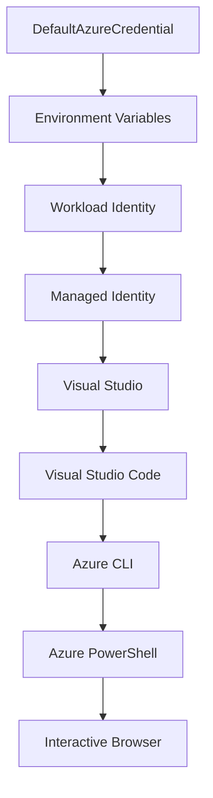

<!--
CO_OP_TRANSLATOR_METADATA:
{
  "original_hash": "4dc26ed8004b58a51875efd07203340f",
  "translation_date": "2025-09-26T18:33:06+00:00",
  "source_file": "docs/getting-started/azd-basics.md",
  "language_code": "pa"
}
-->
# AZD ਬੁਨਿਆਦੀਆਂ - Azure Developer CLI ਨੂੰ ਸਮਝਣਾ

# AZD ਬੁਨਿਆਦੀਆਂ - ਮੁੱਖ ਧਾਰਨਾਵਾਂ ਅਤੇ ਮੂਲ ਸਿਧਾਂਤ

**ਅਧਿਆਇ ਨੈਵੀਗੇਸ਼ਨ:**
- **📚 ਕੋਰਸ ਮੁੱਖ ਪੰਨਾ**: [AZD ਸ਼ੁਰੂਆਤੀ ਲਈ](../../README.md)
- **📖 ਮੌਜੂਦਾ ਅਧਿਆਇ**: ਅਧਿਆਇ 1 - ਬੁਨਿਆਦ ਅਤੇ ਤੁਰੰਤ ਸ਼ੁਰੂਆਤ
- **⬅️ ਪਿਛਲਾ**: [ਕੋਰਸ ਝਲਕ](../../README.md#-chapter-1-foundation--quick-start)
- **➡️ ਅਗਲਾ**: [ਇੰਸਟਾਲੇਸ਼ਨ ਅਤੇ ਸੈਟਅੱਪ](installation.md)
- **🚀 ਅਗਲਾ ਅਧਿਆਇ**: [ਅਧਿਆਇ 2: AI-ਪਹਿਲਾ ਵਿਕਾਸ](../ai-foundry/azure-ai-foundry-integration.md)

## ਪਰਿਚਯ

ਇਸ ਪਾਠ ਵਿੱਚ ਤੁਹਾਨੂੰ Azure Developer CLI (azd) ਨਾਲ ਜਾਣੂ ਕਰਵਾਇਆ ਜਾਵੇਗਾ, ਜੋ ਕਿ ਇੱਕ ਸ਼ਕਤੀਸ਼ਾਲੀ ਕਮਾਂਡ-ਲਾਈਨ ਟੂਲ ਹੈ ਜੋ ਤੁਹਾਡੇ ਸਥਾਨਕ ਵਿਕਾਸ ਤੋਂ Azure ਡਿਪਲੌਇਮੈਂਟ ਤੱਕ ਦੇ ਯਾਤਰਾ ਨੂੰ ਤੇਜ਼ ਕਰਦਾ ਹੈ। ਤੁਸੀਂ ਮੁੱਖ ਧਾਰਨਾਵਾਂ, ਮੁੱਖ ਵਿਸ਼ੇਸ਼ਤਾਵਾਂ ਬਾਰੇ ਸਿੱਖੋਗੇ ਅਤੇ ਸਮਝੋਗੇ ਕਿ azd ਕਲਾਉਡ-ਨੈਟਿਵ ਐਪਲੀਕੇਸ਼ਨ ਡਿਪਲੌਇਮੈਂਟ ਨੂੰ ਕਿਵੇਂ ਸਧਾਰਨ ਬਣਾਉਂਦਾ ਹੈ।

## ਸਿੱਖਣ ਦੇ ਲਕਸ਼

ਇਸ ਪਾਠ ਦੇ ਅੰਤ ਤੱਕ, ਤੁਸੀਂ:
- ਸਮਝ ਪਾਉਗੇ ਕਿ Azure Developer CLI ਕੀ ਹੈ ਅਤੇ ਇਸ ਦਾ ਮੁੱਖ ਉਦੇਸ਼ ਕੀ ਹੈ
- ਟੈਂਪਲੇਟ, ਵਾਤਾਵਰਣ ਅਤੇ ਸੇਵਾਵਾਂ ਦੀਆਂ ਮੁੱਖ ਧਾਰਨਾਵਾਂ ਬਾਰੇ ਸਿੱਖੋਗੇ
- ਮੁੱਖ ਵਿਸ਼ੇਸ਼ਤਾਵਾਂ ਦੀ ਖੋਜ ਕਰੋਗੇ ਜਿਵੇਂ ਕਿ ਟੈਂਪਲੇਟ-ਚਲਿਤ ਵਿਕਾਸ ਅਤੇ Infrastructure as Code
- azd ਪ੍ਰੋਜੈਕਟ ਸਟ੍ਰਕਚਰ ਅਤੇ ਵਰਕਫਲੋ ਨੂੰ ਸਮਝੋਗੇ
- azd ਨੂੰ ਆਪਣੇ ਵਿਕਾਸ ਵਾਤਾਵਰਣ ਲਈ ਇੰਸਟਾਲ ਅਤੇ ਕਨਫਿਗਰ ਕਰਨ ਲਈ ਤਿਆਰ ਹੋਵੋਗੇ

## ਸਿੱਖਣ ਦੇ ਨਤੀਜੇ

ਇਸ ਪਾਠ ਨੂੰ ਪੂਰਾ ਕਰਨ ਦੇ ਬਾਅਦ, ਤੁਸੀਂ:
- ਸਮਝਾ ਸਕੋਗੇ ਕਿ azd ਆਧੁਨਿਕ ਕਲਾਉਡ ਵਿਕਾਸ ਵਰਕਫਲੋਜ਼ ਵਿੱਚ ਕਿਵੇਂ ਯੋਗਦਾਨ ਪਾਉਂਦਾ ਹੈ
- azd ਪ੍ਰੋਜੈਕਟ ਸਟ੍ਰਕਚਰ ਦੇ ਘਟਕਾਂ ਦੀ ਪਛਾਣ ਕਰ ਸਕੋਗੇ
- ਸਮਝ ਸਕੋਗੇ ਕਿ ਟੈਂਪਲੇਟ, ਵਾਤਾਵਰਣ ਅਤੇ ਸੇਵਾਵਾਂ ਕਿਵੇਂ ਇਕੱਠੇ ਕੰਮ ਕਰਦੇ ਹਨ
- azd ਨਾਲ Infrastructure as Code ਦੇ ਫਾਇਦੇ ਸਮਝ ਸਕੋਗੇ
- ਵੱਖ-ਵੱਖ azd ਕਮਾਂਡਾਂ ਅਤੇ ਉਨ੍ਹਾਂ ਦੇ ਉਦੇਸ਼ਾਂ ਨੂੰ ਪਛਾਣ ਸਕੋਗੇ

## Azure Developer CLI (azd) ਕੀ ਹੈ?

Azure Developer CLI (azd) ਇੱਕ ਕਮਾਂਡ-ਲਾਈਨ ਟੂਲ ਹੈ ਜੋ ਸਥਾਨਕ ਵਿਕਾਸ ਤੋਂ Azure ਡਿਪਲੌਇਮੈਂਟ ਤੱਕ ਦੇ ਯਾਤਰਾ ਨੂੰ ਤੇਜ਼ ਕਰਨ ਲਈ ਡਿਜ਼ਾਈਨ ਕੀਤਾ ਗਿਆ ਹੈ। ਇਹ Azure 'ਤੇ ਕਲਾਉਡ-ਨੈਟਿਵ ਐਪਲੀਕੇਸ਼ਨ ਬਣਾਉਣ, ਡਿਪਲੌਇ ਕਰਨ ਅਤੇ ਪ੍ਰਬੰਧਨ ਦੀ ਪ੍ਰਕਿਰਿਆ ਨੂੰ ਸਧਾਰਨ ਬਣਾਉਂਦਾ ਹੈ।

## ਮੁੱਖ ਧਾਰਨਾਵਾਂ

### ਟੈਂਪਲੇਟ
ਟੈਂਪਲੇਟ azd ਦੀ ਬੁਨਿਆਦ ਹਨ। ਇਹ ਸ਼ਾਮਲ ਕਰਦੇ ਹਨ:
- **ਐਪਲੀਕੇਸ਼ਨ ਕੋਡ** - ਤੁਹਾਡਾ ਸਰੋਤ ਕੋਡ ਅਤੇ ਡਿਪੈਂਡੈਂਸੀਜ਼
- **Infrastructure ਦੀ ਪਰਿਭਾਸ਼ਾ** - Bicep ਜਾਂ Terraform ਵਿੱਚ ਪਰਿਭਾਸ਼ਿਤ Azure ਸਰੋਤ
- **ਕਨਫਿਗਰੇਸ਼ਨ ਫਾਈਲਾਂ** - ਸੈਟਿੰਗਾਂ ਅਤੇ ਵਾਤਾਵਰਣ ਵੈਰੀਏਬਲ
- **ਡਿਪਲੌਇਮੈਂਟ ਸਕ੍ਰਿਪਟ** - ਆਟੋਮੈਟਿਕ ਡਿਪਲੌਇਮੈਂਟ ਵਰਕਫਲੋਜ਼

### ਵਾਤਾਵਰਣ
ਵਾਤਾਵਰਣ ਵੱਖ-ਵੱਖ ਡਿਪਲੌਇਮੈਂਟ ਟਾਰਗਟਾਂ ਨੂੰ ਦਰਸਾਉਂਦੇ ਹਨ:
- **ਵਿਕਾਸ** - ਟੈਸਟਿੰਗ ਅਤੇ ਵਿਕਾਸ ਲਈ
- **ਸਟੇਜਿੰਗ** - ਪ੍ਰੀ-ਪ੍ਰੋਡਕਸ਼ਨ ਵਾਤਾਵਰਣ
- **ਪ੍ਰੋਡਕਸ਼ਨ** - ਲਾਈਵ ਪ੍ਰੋਡਕਸ਼ਨ ਵਾਤਾਵਰਣ

ਹਰ ਵਾਤਾਵਰਣ ਆਪਣਾ:
- Azure ਰਿਸੋਰਸ ਗਰੁੱਪ
- ਕਨਫਿਗਰੇਸ਼ਨ ਸੈਟਿੰਗਾਂ
- ਡਿਪਲੌਇਮੈਂਟ ਸਟੇਟ

### ਸੇਵਾਵਾਂ
ਸੇਵਾਵਾਂ ਤੁਹਾਡੇ ਐਪਲੀਕੇਸ਼ਨ ਦੇ ਬਿਲਡਿੰਗ ਬਲਾਕ ਹਨ:
- **ਫਰੰਟਐਂਡ** - ਵੈਬ ਐਪਲੀਕੇਸ਼ਨ, SPAs
- **ਬੈਕਐਂਡ** - APIs, ਮਾਈਕ੍ਰੋਸੇਵਾਵਾਂ
- **ਡਾਟਾਬੇਸ** - ਡਾਟਾ ਸਟੋਰੇਜ ਹੱਲ
- **ਸਟੋਰੇਜ** - ਫਾਈਲ ਅਤੇ ਬਲੌਬ ਸਟੋਰੇਜ

## ਮੁੱਖ ਵਿਸ਼ੇਸ਼ਤਾਵਾਂ

### 1. ਟੈਂਪਲੇਟ-ਚਲਿਤ ਵਿਕਾਸ
```bash
# Browse available templates
azd template list

# Initialize from a template
azd init --template <template-name>
```

### 2. Infrastructure as Code
- **Bicep** - Azure ਦੀ ਡੋਮੇਨ-ਸਪੈਸਿਫਿਕ ਭਾਸ਼ਾ
- **Terraform** - ਮਲਟੀ-ਕਲਾਉਡ Infrastructure ਟੂਲ
- **ARM ਟੈਂਪਲੇਟ** - Azure Resource Manager ਟੈਂਪਲੇਟ

### 3. ਇੰਟੀਗ੍ਰੇਟਡ ਵਰਕਫਲੋਜ਼
```bash
# Complete deployment workflow
azd up            # Provision + Deploy this is hands off for first time setup
azd provision     # Create Azure resources if you update the infrastructure use this
azd deploy        # Deploy application code or redeploy application code once update
azd down          # Clean up resources
```

### 4. ਵਾਤਾਵਰਣ ਪ੍ਰਬੰਧਨ
```bash
# Create and manage environments
azd env new <environment-name>
azd env select <environment-name>
azd env list
```

## 📁 ਪ੍ਰੋਜੈਕਟ ਸਟ੍ਰਕਚਰ

ਇੱਕ ਆਮ azd ਪ੍ਰੋਜੈਕਟ ਸਟ੍ਰਕਚਰ:
```
my-app/
├── .azd/                    # azd configuration
│   └── config.json
├── .azure/                  # Azure deployment artifacts
├── .devcontainer/          # Development container config
├── .github/workflows/      # GitHub Actions
├── .vscode/               # VS Code settings
├── infra/                 # Infrastructure code
│   ├── main.bicep        # Main infrastructure template
│   ├── main.parameters.json
│   └── modules/          # Reusable modules
├── src/                  # Application source code
│   ├── api/             # Backend services
│   └── web/             # Frontend application
├── azure.yaml           # azd project configuration
└── README.md
```

## 🔧 ਕਨਫਿਗਰੇਸ਼ਨ ਫਾਈਲਾਂ

### azure.yaml
ਮੁੱਖ ਪ੍ਰੋਜੈਕਟ ਕਨਫਿਗਰੇਸ਼ਨ ਫਾਈਲ:
```yaml
name: my-awesome-app
metadata:
  template: my-template@1.0.0

services:
  web:
    project: ./src/web
    language: js
    host: appservice
  api:
    project: ./src/api
    language: js
    host: appservice

hooks:
  preprovision:
    shell: pwsh
    run: echo "Preparing to provision..."
```

### .azure/config.json
ਵਾਤਾਵਰਣ-ਵਿਸ਼ੇਸ਼ ਕਨਫਿਗਰੇਸ਼ਨ:
```json
{
  "version": 1,
  "defaultEnvironment": "dev",
  "environments": {
    "dev": {
      "subscriptionId": "your-subscription-id",
      "location": "eastus"
    }
  }
}
```

## 🎪 ਆਮ ਵਰਕਫਲੋਜ਼

### ਨਵਾਂ ਪ੍ਰੋਜੈਕਟ ਸ਼ੁਰੂ ਕਰਨਾ
```bash
# Method 1: Use existing template
azd init --template todo-nodejs-mongo

# Method 2: Start from scratch
azd init

# Method 3: Use current directory
azd init .
```

### ਵਿਕਾਸ ਚੱਕਰ
```bash
# Set up development environment
azd auth login
azd env new dev
azd env select dev

# Deploy everything
azd up

# Make changes and redeploy
azd deploy

# Clean up when done
azd down --force --purge # command in the Azure Developer CLI is a **hard reset** for your environment—especially useful when you're troubleshooting failed deployments, cleaning up orphaned resources, or prepping for a fresh redeploy.
```

## `azd down --force --purge` ਨੂੰ ਸਮਝਣਾ
`azd down --force --purge` ਕਮਾਂਡ ਤੁਹਾਡੇ azd ਵਾਤਾਵਰਣ ਅਤੇ ਸਾਰੇ ਸੰਬੰਧਿਤ ਸਰੋਤਾਂ ਨੂੰ ਪੂਰੀ ਤਰ੍ਹਾਂ ਹਟਾਉਣ ਦਾ ਇੱਕ ਸ਼ਕਤੀਸ਼ਾਲੀ ਤਰੀਕਾ ਹੈ। ਇਹ ਹੈਰਾਨੀਜਨਕ ਤੌਰ 'ਤੇ ਹਰ ਝੰਡੇ ਦਾ ਵਿਵਰਣ:
```
--force
```
- ਪੁਸ਼ਟੀਕਰਨ ਪ੍ਰੰਪਟਾਂ ਨੂੰ ਸਕਿਪ ਕਰਦਾ ਹੈ।
- ਆਟੋਮੇਸ਼ਨ ਜਾਂ ਸਕ੍ਰਿਪਟਿੰਗ ਲਈ ਲਾਭਦਾਇਕ ਜਿੱਥੇ ਮੈਨੂਅਲ ਇਨਪੁਟ ਸੰਭਵ ਨਹੀਂ।
- ਇਹ ਯਕੀਨੀ ਬਣਾਉਂਦਾ ਹੈ ਕਿ CLI ਦੁਆਰਾ ਅਸੰਗਤੀਆਂ ਦਾ ਪਤਾ ਲਗਣ ਦੇ ਬਾਵਜੂਦ ਹਟਾਉਣ ਬਿਨਾਂ ਰੁਕਾਵਟ ਦੇ ਅੱਗੇ ਵਧਦਾ ਹੈ।

```
--purge
```
**ਸਾਰੇ ਸੰਬੰਧਿਤ ਮੈਟਾਡੇਟਾ** ਨੂੰ ਹਟਾਉਂਦਾ ਹੈ, ਜਿਸ ਵਿੱਚ ਸ਼ਾਮਲ ਹਨ:
ਵਾਤਾਵਰਣ ਸਟੇਟ
ਸਥਾਨਕ `.azure` ਫੋਲਡਰ
ਕੈਸ਼ਡ ਡਿਪਲੌਇਮੈਂਟ ਜਾਣਕਾਰੀ
azd ਨੂੰ ਪਿਛਲੇ ਡਿਪਲੌਇਮੈਂਟ "ਯਾਦ" ਕਰਨ ਤੋਂ ਰੋਕਦਾ ਹੈ, ਜੋ ਕਿ ਮਿਸਮੈਚਡ ਰਿਸੋਰਸ ਗਰੁੱਪ ਜਾਂ ਸਟੇਲ ਰਜਿਸਟਰੀ ਰਿਫਰੈਂਸਾਂ ਵਰਗੇ ਮੁੱਦੇ ਪੈਦਾ ਕਰ ਸਕਦਾ ਹੈ।

### ਦੋਹਾਂ ਨੂੰ ਕਿਉਂ ਵਰਤਣਾ?
ਜਦੋਂ ਤੁਸੀਂ `azd up` ਨਾਲ ਅਟਕ ਜਾਂਦੇ ਹੋ ਕਿਉਂਕਿ ਲਿੰਗਰਿੰਗ ਸਟੇਟ ਜਾਂ ਅਧੂਰੇ ਡਿਪਲੌਇਮੈਂਟ, ਇਹ ਕਾਂਬੋ **ਸਾਫ਼ ਸਲੇਟ** ਯਕੀਨੀ ਬਣਾਉਂਦਾ ਹੈ।

ਇਹ ਖਾਸ ਤੌਰ 'ਤੇ ਮੈਨੂਅਲ ਸਰੋਤ ਹਟਾਉਣ ਦੇ ਬਾਅਦ Azure ਪੋਰਟਲ ਵਿੱਚ ਜਾਂ ਟੈਂਪਲੇਟ, ਵਾਤਾਵਰਣ ਜਾਂ ਰਿਸੋਰਸ ਗਰੁੱਪ ਨਾਮਕਰਨ ਕਨਵੈਨਸ਼ਨ ਸਵਿੱਚ ਕਰਨ ਸਮੇਂ ਲਾਭਦਾਇਕ ਹੈ।

### ਕਈ ਵਾਤਾਵਰਣਾਂ ਦਾ ਪ੍ਰਬੰਧਨ
```bash
# Create staging environment
azd env new staging
azd env select staging
azd up

# Switch back to dev
azd env select dev

# Compare environments
azd env list
```

## 🔐 ਪ੍ਰਮਾਣਿਕਤਾ ਅਤੇ ਪ੍ਰਮਾਣ

azd ਡਿਪਲੌਇਮੈਂਟਾਂ ਲਈ ਪ੍ਰਮਾਣਿਕਤਾ ਨੂੰ ਸਮਝਣਾ ਬਹੁਤ ਜ਼ਰੂਰੀ ਹੈ। Azure ਕਈ ਪ੍ਰਮਾਣਿਕਤਾ ਤਰੀਕਿਆਂ ਦੀ ਵਰਤੋਂ ਕਰਦਾ ਹੈ, ਅਤੇ azd ਉਹੀ ਪ੍ਰਮਾਣ ਚੇਨ ਵਰਤਦਾ ਹੈ ਜੋ ਹੋਰ Azure ਟੂਲਾਂ ਦੁਆਰਾ ਵਰਤਿਆ ਜਾਂਦਾ ਹੈ।

### Azure CLI ਪ੍ਰਮਾਣਿਕਤਾ (`az login`)

azd ਵਰਤਣ ਤੋਂ ਪਹਿਲਾਂ, ਤੁਹਾਨੂੰ Azure ਨਾਲ ਪ੍ਰਮਾਣਿਕਤਾ ਕਰਨ ਦੀ ਜ਼ਰੂਰਤ ਹੈ। ਸਭ ਤੋਂ ਆਮ ਤਰੀਕਾ Azure CLI ਦੀ ਵਰਤੋਂ ਕਰਨਾ ਹੈ:

```bash
# Interactive login (opens browser)
az login

# Login with specific tenant
az login --tenant <tenant-id>

# Login with service principal
az login --service-principal -u <app-id> -p <password> --tenant <tenant-id>

# Check current login status
az account show

# List available subscriptions
az account list --output table

# Set default subscription
az account set --subscription <subscription-id>
```

### ਪ੍ਰਮਾਣਿਕਤਾ ਪ੍ਰਵਾਹ
1. **ਇੰਟਰਐਕਟਿਵ ਲੌਗਇਨ**: ਪ੍ਰਮਾਣਿਕਤਾ ਲਈ ਤੁਹਾਡੇ ਡਿਫਾਲਟ ਬ੍ਰਾਊਜ਼ਰ ਨੂੰ ਖੋਲ੍ਹਦਾ ਹੈ
2. **ਡਿਵਾਈਸ ਕੋਡ ਪ੍ਰਵਾਹ**: ਜਿੱਥੇ ਬ੍ਰਾਊਜ਼ਰ ਪਹੁੰਚ ਨਹੀਂ ਹੈ
3. **ਸਰਵਿਸ ਪ੍ਰਿੰਸਿਪਲ**: ਆਟੋਮੇਸ਼ਨ ਅਤੇ CI/CD ਸਥਿਤੀਆਂ ਲਈ
4. **ਮੈਨੇਜਡ ਆਈਡੈਂਟਿਟੀ**: Azure-ਹੋਸਟ ਕੀਤੀਆਂ ਐਪਲੀਕੇਸ਼ਨਾਂ ਲਈ

### DefaultAzureCredential ਚੇਨ

`DefaultAzureCredential` ਇੱਕ ਪ੍ਰਮਾਣ ਕਿਸਮ ਹੈ ਜੋ ਕਈ ਪ੍ਰਮਾਣ ਸਰੋਤਾਂ ਨੂੰ ਇੱਕ ਵਿਸ਼ੇਸ਼ ਕ੍ਰਮ ਵਿੱਚ ਆਟੋਮੈਟਿਕ ਤੌਰ 'ਤੇ ਅਜ਼ਮਾਉਣ ਦੁਆਰਾ ਸਧਾਰਨ ਪ੍ਰਮਾਣਿਕਤਾ ਅਨੁਭਵ ਪ੍ਰਦਾਨ ਕਰਦਾ ਹੈ:

#### ਪ੍ਰਮਾਣ ਚੇਨ ਕ੍ਰਮ


#### 1. ਵਾਤਾਵਰਣ ਵੈਰੀਏਬਲ
```bash
# Set environment variables for service principal
export AZURE_CLIENT_ID="<app-id>"
export AZURE_CLIENT_SECRET="<password>"
export AZURE_TENANT_ID="<tenant-id>"
```

#### 2. ਵਰਕਲੋਡ ਆਈਡੈਂਟਿਟੀ (Kubernetes/GitHub Actions)
ਆਟੋਮੈਟਿਕ ਤੌਰ 'ਤੇ ਵਰਤਿਆ ਜਾਂਦਾ ਹੈ:
- Azure Kubernetes Service (AKS) ਨਾਲ ਵਰਕਲੋਡ ਆਈਡੈਂਟਿਟੀ
- GitHub Actions ਨਾਲ OIDC ਫੈਡਰੇਸ਼ਨ
- ਹੋਰ ਫੈਡਰੇਟਿਡ ਆਈਡੈਂਟਿਟੀ ਸਥਿਤੀਆਂ

#### 3. ਮੈਨੇਜਡ ਆਈਡੈਂਟਿਟੀ
Azure ਸਰੋਤਾਂ ਲਈ ਜਿਵੇਂ:
- ਵਰਚੁਅਲ ਮਸ਼ੀਨ
- ਐਪ ਸਰਵਿਸ
- Azure Functions
- ਕੰਟੇਨਰ ਇੰਸਟੈਂਸ

```bash
# Check if running on Azure resource with managed identity
az account show --query "user.type" --output tsv
# Returns: "servicePrincipal" if using managed identity
```

#### 4. ਡਿਵੈਲਪਰ ਟੂਲ ਇੰਟੀਗ੍ਰੇਸ਼ਨ
- **Visual Studio**: ਆਟੋਮੈਟਿਕ ਤੌਰ 'ਤੇ ਸਾਈਨ-ਇਨ ਖਾਤੇ ਦੀ ਵਰਤੋਂ ਕਰਦਾ ਹੈ
- **VS Code**: Azure Account ਐਕਸਟੈਂਸ਼ਨ ਪ੍ਰਮਾਣ ਦੀ ਵਰਤੋਂ ਕਰਦਾ ਹੈ
- **Azure CLI**: `az login` ਪ੍ਰਮਾਣ ਦੀ ਵਰਤੋਂ ਕਰਦਾ ਹੈ (ਸਥਾਨਕ ਵਿਕਾਸ ਲਈ ਸਭ ਤੋਂ ਆਮ)

### AZD ਪ੍ਰਮਾਣ ਸੈਟਅੱਪ

```bash
# Method 1: Use Azure CLI (Recommended for development)
az login
azd auth login  # Uses existing Azure CLI credentials

# Method 2: Direct azd authentication
azd auth login --use-device-code  # For headless environments

# Method 3: Check authentication status
azd auth login --check-status

# Method 4: Logout and re-authenticate
azd auth logout
azd auth login
```

### ਪ੍ਰਮਾਣਿਕਤਾ ਲਈ ਸਭ ਤੋਂ ਵਧੀਆ ਤਰੀਕੇ

#### ਸਥਾਨਕ ਵਿਕਾਸ ਲਈ
```bash
# 1. Login with Azure CLI
az login

# 2. Verify correct subscription
az account show
az account set --subscription "Your Subscription Name"

# 3. Use azd with existing credentials
azd auth login
```

#### CI/CD ਪਾਈਪਲਾਈਨਾਂ ਲਈ
```yaml
# GitHub Actions example
- name: Azure Login
  uses: azure/login@v1
  with:
    creds: ${{ secrets.AZURE_CREDENTIALS }}

- name: Deploy with azd
  run: |
    azd auth login --client-id ${{ secrets.AZURE_CLIENT_ID }} \
                    --client-secret ${{ secrets.AZURE_CLIENT_SECRET }} \
                    --tenant-id ${{ secrets.AZURE_TENANT_ID }}
    azd up --no-prompt
```

#### ਪ੍ਰੋਡਕਸ਼ਨ ਵਾਤਾਵਰਣਾਂ ਲਈ
- **ਮੈਨੇਜਡ ਆਈਡੈਂਟਿਟੀ** ਦੀ ਵਰਤੋਂ ਕਰੋ ਜਦੋਂ Azure ਸਰੋਤਾਂ 'ਤੇ ਚੱਲ ਰਹੇ ਹੋਵੋ
- **ਸਰਵਿਸ ਪ੍ਰਿੰਸਿਪਲ** ਦੀ ਵਰਤੋਂ ਕਰੋ ਆਟੋਮੇਸ਼ਨ ਸਥਿਤੀਆਂ ਲਈ
- ਕੋਡ ਜਾਂ ਕਨਫਿਗਰੇਸ਼ਨ ਫਾਈਲਾਂ ਵਿੱਚ ਪ੍ਰਮਾਣ ਸਟੋਰ ਕਰਨ ਤੋਂ ਬਚੋ
- ਸੰਵੇਦਨਸ਼ੀਲ ਕਨਫਿਗਰੇਸ਼ਨ ਲਈ **Azure Key Vault** ਦੀ ਵਰਤੋਂ ਕਰੋ

### ਆਮ ਪ੍ਰਮਾਣਿਕਤਾ ਮੁੱਦੇ ਅਤੇ ਹੱਲ

#### ਮੁੱਦਾ: "ਕੋਈ ਸਬਸਕ੍ਰਿਪਸ਼ਨ ਨਹੀਂ ਮਿਲੀ"
```bash
# Solution: Set default subscription
az account list --output table
az account set --subscription "<subscription-id>"
azd env set AZURE_SUBSCRIPTION_ID "<subscription-id>"
```

#### ਮੁੱਦਾ: "ਅਧਿਕਾਰ ਅਪੂਰਣ ਹਨ"
```bash
# Solution: Check and assign required roles
az role assignment list --assignee $(az account show --query user.name --output tsv)

# Common required roles:
# - Contributor (for resource management)
# - User Access Administrator (for role assignments)
```

#### ਮੁੱਦਾ: "ਟੋਕਨ ਮਿਆਦ ਖਤਮ ਹੋ ਗਈ"
```bash
# Solution: Re-authenticate
az logout
az login
azd auth logout
azd auth login
```

### ਵੱਖ-ਵੱਖ ਸਥਿਤੀਆਂ ਵਿੱਚ ਪ੍ਰਮਾਣਿਕਤਾ

#### ਸਥਾਨਕ ਵਿਕਾਸ
```bash
# Personal development account
az login
azd auth login
```

#### ਟੀਮ ਵਿਕਾਸ
```bash
# Use specific tenant for organization
az login --tenant contoso.onmicrosoft.com
azd auth login
```

#### ਮਲਟੀ-ਟੈਨੈਂਟ ਸਥਿਤੀਆਂ
```bash
# Switch between tenants
az login --tenant tenant1.onmicrosoft.com
# Deploy to tenant 1
azd up

az login --tenant tenant2.onmicrosoft.com  
# Deploy to tenant 2
azd up
```

### ਸੁਰੱਖਿਆ ਵਿਚਾਰ

1. **ਪ੍ਰਮਾਣ ਸਟੋਰੇਜ**: ਕਦੇ ਵੀ ਸਰੋਤ ਕੋਡ ਵਿੱਚ ਪ੍ਰਮਾਣ ਸਟੋਰ ਨਾ ਕਰੋ
2. **ਸਕੋਪ ਸੀਮਿਤਤਾ**: ਸਰਵਿਸ ਪ੍ਰਿੰਸਿਪਲ ਲਈ ਘੱਟ-ਵਰਤੋਂ ਦਾ ਸਿਧਾਂਤ ਵਰਤੋ
3. **ਟੋਕਨ ਰੋਟੇਸ਼ਨ**: ਸਰਵਿਸ ਪ੍ਰਿੰਸਿਪਲ ਰਾਜ਼ਾਂ ਨੂੰ ਨਿਯਮਿਤ ਤੌਰ 'ਤੇ ਰੋਟੇਟ ਕਰੋ
4. **ਆਡਿਟ ਟ੍ਰੇਲ**: ਪ੍ਰਮਾਣਿਕਤਾ ਅਤੇ ਡਿਪਲੌਇਮੈਂਟ ਗਤੀਵਿਧੀਆਂ ਦੀ ਨਿਗਰਾਨੀ ਕਰੋ
5. **ਨੈਟਵਰਕ ਸੁਰੱਖਿਆ**: ਜਿੱਥੇ ਸੰਭਵ ਹੋਵੇ, ਪ੍ਰਾਈਵੇਟ ਐਂਡਪੋਇੰਟ ਦੀ ਵਰਤੋਂ ਕਰੋ

### ਪ੍ਰਮਾਣਿਕਤਾ ਦੀ ਸਮੱਸਿਆ ਹੱਲ

```bash
# Debug authentication issues
azd auth login --check-status
az account show
az account get-access-token

# Common diagnostic commands
whoami                          # Current user context
az ad signed-in-user show      # Azure AD user details
az group list                  # Test resource access
```

## `azd down --force --purge` ਨੂੰ ਸਮਝਣਾ

### ਖੋਜ
```bash
azd template list              # Browse templates
azd template show <template>   # Template details
azd init --help               # Initialization options
```

### ਪ੍ਰੋਜੈਕਟ ਪ੍ਰਬੰਧਨ
```bash
azd show                     # Project overview
azd env show                 # Current environment
azd config list             # Configuration settings
```

### ਨਿਗਰਾਨੀ
```bash
azd monitor                  # Open Azure portal
azd pipeline config          # Set up CI/CD
azd logs                     # View application logs
```

## ਸਭ ਤੋਂ ਵਧੀਆ ਤਰੀਕੇ

### 1. ਅਰਥਪੂਰਨ ਨਾਮ ਵਰਤੋ
```bash
# Good
azd env new production-east
azd init --template web-app-secure

# Avoid
azd env new env1
azd init --template template1
```

### 2. ਟੈਂਪਲੇਟਾਂ ਦੀ ਵਰਤੋਂ ਕਰੋ
- ਮੌਜੂਦਾ ਟੈਂਪਲੇਟਾਂ ਨਾਲ ਸ਼ੁਰੂ ਕਰੋ
- ਆਪਣੀਆਂ ਜ਼ਰੂਰਤਾਂ ਲਈ ਕਸਟਮਾਈਜ਼ ਕਰੋ
- ਆਪਣੇ ਸੰਗਠਨ ਲਈ ਦੁਬਾਰਾ ਵਰਤਣਯੋਗ ਟੈਂਪਲੇਟ ਬਣਾਓ

### 3. ਵਾਤਾਵਰਣ ਅਲੱਗਾਵ
- dev/staging/prod ਲਈ ਵੱਖ-ਵੱਖ ਵਾਤਾਵਰਣ ਦੀ ਵਰਤੋਂ ਕਰੋ
- ਸਥਾਨਕ ਮਸ਼ੀਨ ਤੋਂ ਸਿੱਧੇ ਪ੍ਰੋਡਕਸ਼ਨ ਵਿੱਚ ਕਦੇ ਵੀ ਡਿਪਲੌਇ ਨਾ ਕਰੋ
- ਪ੍ਰੋਡਕਸ਼ਨ ਡਿਪਲੌਇਮੈਂਟ ਲਈ CI/CD ਪਾਈਪਲਾਈਨਾਂ ਦੀ ਵਰਤੋਂ ਕਰੋ

### 4. ਕਨਫਿਗਰੇਸ਼ਨ ਪ੍ਰਬੰਧਨ
- ਸੰਵੇਦਨਸ਼ੀਲ ਡਾਟਾ ਲਈ ਵਾਤਾਵਰਣ ਵੈਰੀਏਬਲ ਦੀ ਵਰਤੋਂ ਕਰੋ
- ਕਨਫਿਗਰੇਸ਼ਨ ਨੂੰ ਵਰਜਨ ਕੰਟਰੋਲ ਵਿੱਚ ਰੱਖੋ
- ਵਾਤਾਵਰਣ-ਵਿਸ਼ੇਸ਼ ਸੈਟਿੰਗਾਂ ਦਾ ਦਸਤਾਵੇਜ਼ ਬਣਾਓ

## ਸਿੱਖਣ ਦੀ ਪ੍ਰਗਤੀ

### ਸ਼ੁਰੂਆਤੀ (ਹਫ਼ਤਾ 1-2)
1. azd ਇੰਸਟਾਲ ਕਰੋ ਅਤੇ ਪ੍ਰਮਾਣਿਕਤਾ ਕਰੋ
2. ਇੱਕ ਸਧਾਰਨ ਟੈਂਪਲੇਟ ਡਿਪਲੌਇ ਕਰੋ
3. ਪ੍ਰੋਜੈਕਟ ਸਟ੍ਰਕਚਰ ਨੂੰ ਸਮਝੋ
4. ਬੁਨਿਆਦੀ ਕਮਾਂਡਾਂ (up, down, deploy) ਸਿੱਖੋ

### ਮੱਧਮ (ਹਫ਼ਤਾ 3-4)
1. ਟੈਂਪਲੇਟਾਂ ਨੂੰ ਕਸਟਮਾਈਜ਼ ਕਰੋ
2. ਕਈ ਵਾਤਾਵਰਣਾਂ ਦਾ ਪ੍ਰਬੰਧਨ ਕਰੋ
3. Infrastructure ਕੋਡ ਨੂੰ ਸਮਝੋ
4. CI/CD ਪਾਈਪਲਾਈਨਾਂ ਸੈਟਅੱਪ ਕਰੋ

### ਉੱਚ (ਹਫ਼ਤਾ 5+)
1. ਕਸਟਮ ਟੈਂਪਲੇਟ ਬਣਾਓ
2. ਉੱਚਤਮ Infrastructure ਪੈਟਰਨ
3. ਮਲਟੀ-ਰੀਜਨ ਡਿਪਲ

---

