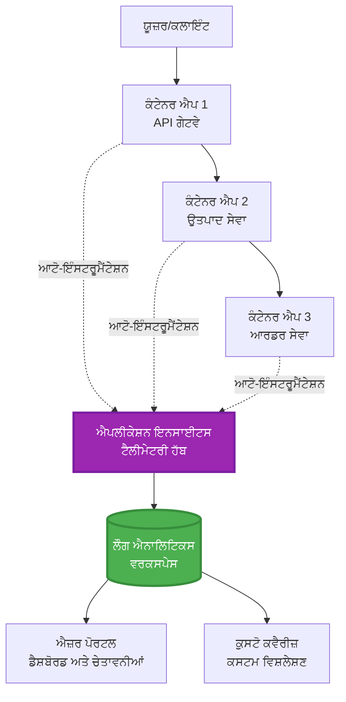
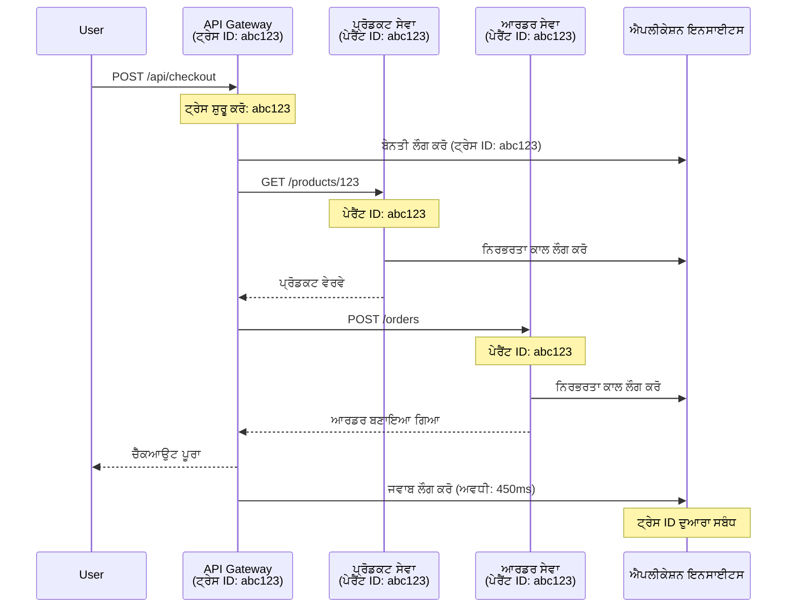

# AZD ਨਾਲ ਐਪਲੀਕੇਸ਼ਨ ਇਨਸਾਈਟਸ ਇੰਟੀਗ੍ਰੇਸ਼ਨ

⏱️ **ਅਨੁਮਾਨਿਤ ਸਮਾਂ**: 40-50 ਮਿੰਟ | 💰 **ਲਾਗਤ ਪ੍ਰਭਾਵ**: ~$5-15/ਮਹੀਨਾ | ⭐ **ਜਟਿਲਤਾ**: ਦਰਮਿਆਨਾ

**📚 ਸਿੱਖਣ ਦਾ ਮਾਰਗ:**
- ← ਪਿਛਲਾ: [ਪ੍ਰੀਫਲਾਈਟ ਚੈੱਕਸ](preflight-checks.md) - ਡਿਪਲੌਇਮੈਂਟ ਤੋਂ ਪਹਿਲਾਂ ਦੀ ਜਾਂਚ
- 🎯 **ਤੁਸੀਂ ਇੱਥੇ ਹੋ**: ਐਪਲੀਕੇਸ਼ਨ ਇਨਸਾਈਟਸ ਇੰਟੀਗ੍ਰੇਸ਼ਨ (ਮਾਨੀਟਰਿੰਗ, ਟੈਲੀਮੀਟਰੀ, ਡੀਬੱਗਿੰਗ)
- → ਅਗਲਾ: [ਡਿਪਲੌਇਮੈਂਟ ਗਾਈਡ](../deployment/deployment-guide.md) - ਐਜ਼ਰ 'ਤੇ ਡਿਪਲੌਇਮੈਂਟ
- 🏠 [ਕੋਰਸ ਹੋਮ](../../README.md)

---

## ਤੁਸੀਂ ਕੀ ਸਿੱਖੋਗੇ

ਇਸ ਪਾਠ ਨੂੰ ਪੂਰਾ ਕਰਕੇ, ਤੁਸੀਂ:
- **ਐਪਲੀਕੇਸ਼ਨ ਇਨਸਾਈਟਸ** ਨੂੰ AZD ਪ੍ਰੋਜੈਕਟਾਂ ਵਿੱਚ ਆਟੋਮੈਟਿਕਲੀ ਇੰਟੀਗ੍ਰੇਟ ਕਰਨਾ ਸਿੱਖੋਗੇ
- **ਡਿਸਟ੍ਰਿਬਿਊਟਡ ਟ੍ਰੇਸਿੰਗ** ਨੂੰ ਮਾਈਕ੍ਰੋਸਰਵਿਸਿਜ਼ ਲਈ ਕਨਫਿਗਰ ਕਰਨਾ
- **ਕਸਟਮ ਟੈਲੀਮੀਟਰੀ** (ਮੈਟ੍ਰਿਕਸ, ਇਵੈਂਟਸ, ਡਿਪੈਂਡੈਂਸੀਜ਼) ਲਾਗੂ ਕਰਨਾ
- **ਲਾਈਵ ਮੈਟ੍ਰਿਕਸ** ਸੈਟਅੱਪ ਕਰਨਾ ਰੀਅਲ-ਟਾਈਮ ਮਾਨੀਟਰਿੰਗ ਲਈ
- AZD ਡਿਪਲੌਇਮੈਂਟ ਤੋਂ **ਅਲਰਟਸ ਅਤੇ ਡੈਸ਼ਬੋਰਡਸ** ਬਣਾਉਣਾ
- **ਟੈਲੀਮੀਟਰੀ ਕੁਐਰੀਜ਼** ਨਾਲ ਪ੍ਰੋਡਕਸ਼ਨ ਸਮੱਸਿਆਵਾਂ ਨੂੰ ਡੀਬੱਗ ਕਰਨਾ
- **ਲਾਗਤ ਅਤੇ ਸੈਂਪਲਿੰਗ** ਰਣਨੀਤੀਆਂ ਨੂੰ ਅਨੁਕੂਲਿਤ ਕਰਨਾ
- **AI/LLM ਐਪਲੀਕੇਸ਼ਨਜ਼** (ਟੋਕਨ, ਲੈਟੈਂਸੀ, ਲਾਗਤਾਂ) ਦੀ ਮਾਨੀਟਰਿੰਗ ਕਰਨਾ

## AZD ਨਾਲ ਐਪਲੀਕੇਸ਼ਨ ਇਨਸਾਈਟਸ ਕਿਉਂ ਮਹੱਤਵਪੂਰਨ ਹੈ

### ਚੁਣੌਤੀ: ਪ੍ਰੋਡਕਸ਼ਨ ਓਬਜ਼ਰਵੇਬਿਲਿਟੀ

**ਐਪਲੀਕੇਸ਼ਨ ਇਨਸਾਈਟਸ ਤੋਂ ਬਿਨਾਂ:**
```
❌ No visibility into production behavior
❌ Manual log aggregation across services
❌ Reactive debugging (wait for customer complaints)
❌ No performance metrics
❌ Cannot trace requests across services
❌ Unknown failure rates and bottlenecks
```

**ਐਪਲੀਕੇਸ਼ਨ ਇਨਸਾਈਟਸ + AZD ਨਾਲ:**
```
✅ Automatic telemetry collection
✅ Centralized logs from all services
✅ Proactive issue detection
✅ End-to-end request tracing
✅ Performance metrics and insights
✅ Real-time dashboards
✅ AZD provisions everything automatically
```

**ਉਦਾਹਰਣ**: ਐਪਲੀਕੇਸ਼ਨ ਇਨਸਾਈਟਸ ਤੁਹਾਡੇ ਐਪਲੀਕੇਸ਼ਨ ਲਈ "ਬਲੈਕ ਬਾਕਸ" ਫਲਾਈਟ ਰਿਕਾਰਡਰ + ਕਾਕਪਿਟ ਡੈਸ਼ਬੋਰਡ ਵਰਗਾ ਹੈ। ਤੁਸੀਂ ਰੀਅਲ-ਟਾਈਮ ਵਿੱਚ ਸਭ ਕੁਝ ਦੇਖ ਸਕਦੇ ਹੋ ਅਤੇ ਕਿਸੇ ਵੀ ਘਟਨਾ ਨੂੰ ਦੁਬਾਰਾ ਚਲਾ ਸਕਦੇ ਹੋ।

---

## ਆਰਕੀਟੈਕਚਰ ਓਵਰਵਿਊ

### AZD ਆਰਕੀਟੈਕਚਰ ਵਿੱਚ ਐਪਲੀਕੇਸ਼ਨ ਇਨਸਾਈਟਸ


### ਕੀ ਕੁਝ ਆਟੋਮੈਟਿਕਲੀ ਮਾਨੀਟਰ ਹੁੰਦਾ ਹੈ

| ਟੈਲੀਮੀਟਰੀ ਕਿਸਮ | ਇਹ ਕੀ ਕੈਪਚਰ ਕਰਦਾ ਹੈ | ਵਰਤੋਂ ਦਾ ਕੇਸ |
|----------------|------------------|----------|
| **ਰਿਕਵੈਸਟਸ** | HTTP ਰਿਕਵੈਸਟਸ, ਸਟੇਟਸ ਕੋਡਸ, ਦੌਰਾਨੀ | API ਪ੍ਰਦਰਸ਼ਨ ਮਾਨੀਟਰਿੰਗ |
| **ਡਿਪੈਂਡੈਂਸੀਜ਼** | ਬਾਹਰੀ ਕਾਲਾਂ (DB, APIs, ਸਟੋਰੇਜ) | ਬੋਤਲਨੈਕਸ ਦੀ ਪਛਾਣ |
| **ਐਕਸਪਸ਼ਨਜ਼** | ਅਨਹੈਂਡਲਡ ਗਲਤੀਆਂ ਸਟੈਕ ਟ੍ਰੇਸ ਨਾਲ | ਫੇਲ੍ਹ ਹੋਣ ਦੀ ਡੀਬੱਗਿੰਗ |
| **ਕਸਟਮ ਇਵੈਂਟਸ** | ਬਿਜ਼ਨਸ ਇਵੈਂਟਸ (ਸਾਈਨਅਪ, ਖਰੀਦ) | ਵਿਸ਼ਲੇਸ਼ਣ ਅਤੇ ਫਨਲਸ |
| **ਮੈਟ੍ਰਿਕਸ** | ਪ੍ਰਦਰਸ਼ਨ ਕਾਊਂਟਰ, ਕਸਟਮ ਮੈਟ੍ਰਿਕਸ | ਸਮਰੱਥਾ ਯੋਜਨਾ |
| **ਟ੍ਰੇਸਸ** | ਗੰਭੀਰਤਾ ਨਾਲ ਲੌਗ ਸੁਨੇਹੇ | ਡੀਬੱਗਿੰਗ ਅਤੇ ਆਡਿਟਿੰਗ |
| **ਉਪਲਬਧਤਾ** | ਅਪਟਾਈਮ ਅਤੇ ਰਿਸਪਾਂਸ ਟਾਈਮ ਟੈਸਟਸ | SLA ਮਾਨੀਟਰਿੰਗ |

---

## ਪੂਰਵ ਸ਼ਰਤਾਂ

### ਲੋੜੀਂਦੇ ਟੂਲ

```bash
# ਐਜ਼ਰ ਡਿਵੈਲਪਰ CLI ਦੀ ਪੁਸ਼ਟੀ ਕਰੋ
azd version
# ✅ ਉਮੀਦ: azd ਵਰਜਨ 1.0.0 ਜਾਂ ਇਸ ਤੋਂ ਉੱਚਾ

# ਐਜ਼ਰ CLI ਦੀ ਪੁਸ਼ਟੀ ਕਰੋ
az --version
# ✅ ਉਮੀਦ: azure-cli 2.50.0 ਜਾਂ ਇਸ ਤੋਂ ਉੱਚਾ
```

### ਐਜ਼ਰ ਦੀਆਂ ਲੋੜਾਂ

- ਐਕਟਿਵ ਐਜ਼ਰ ਸਬਸਕ੍ਰਿਪਸ਼ਨ
- ਇਹ ਬਣਾਉਣ ਦੀਆਂ ਇਜਾਜ਼ਤਾਂ:
  - ਐਪਲੀਕੇਸ਼ਨ ਇਨਸਾਈਟਸ ਸਰੋਤ
  - ਲੌਗ ਐਨਾਲਿਟਿਕਸ ਵਰਕਸਪੇਸ
  - ਕੰਟੇਨਰ ਐਪਸ
  - ਰਿਸੋਰਸ ਗਰੁੱਪਸ

### ਗਿਆਨ ਦੀਆਂ ਪੂਰਵ ਸ਼ਰਤਾਂ

ਤੁਹਾਨੂੰ ਇਹ ਪੂਰਾ ਕਰਨਾ ਚਾਹੀਦਾ ਹੈ:
- [AZD ਬੇਸਿਕਸ](../getting-started/azd-basics.md) - AZD ਦੇ ਮੁੱਖ ਸੰਕਲਪ
- [ਕਨਫਿਗਰੇਸ਼ਨ](../getting-started/configuration.md) - ਵਾਤਾਵਰਣ ਸੈਟਅੱਪ
- [ਪਹਿਲਾ ਪ੍ਰੋਜੈਕਟ](../getting-started/first-project.md) - ਬੇਸਿਕ ਡਿਪਲੌਇਮੈਂਟ

---

## ਪਾਠ 1: AZD ਨਾਲ ਆਟੋਮੈਟਿਕ ਐਪਲੀਕੇਸ਼ਨ ਇਨਸਾਈਟਸ

### AZD ਕਿਵੇਂ ਐਪਲੀਕੇਸ਼ਨ ਇਨਸਾਈਟਸ ਪ੍ਰੋਵਿਜ਼ਨ ਕਰਦਾ ਹੈ

AZD ਤੁਹਾਡੇ ਡਿਪਲੌਇਮੈਂਟ ਦੇ ਸਮੇਂ ਆਟੋਮੈਟਿਕਲੀ ਐਪਲੀਕੇਸ਼ਨ ਇਨਸਾਈਟਸ ਬਣਾਉਂਦਾ ਅਤੇ ਕਨਫਿਗਰ ਕਰਦਾ ਹੈ। ਆਓ ਵੇਖੀਏ ਇਹ ਕਿਵੇਂ ਕੰਮ ਕਰਦਾ ਹੈ।

### ਪ੍ਰੋਜੈਕਟ ਸਟ੍ਰਕਚਰ

```
monitored-app/
├── azure.yaml                     # AZD configuration
├── infra/
│   ├── main.bicep                # Main infrastructure
│   ├── core/
│   │   └── monitoring.bicep      # Application Insights + Log Analytics
│   └── app/
│       └── api.bicep             # Container App with monitoring
└── src/
    ├── app.py                    # Application with telemetry
    ├── requirements.txt
    └── Dockerfile
```

---

### ਕਦਮ 1: AZD (azure.yaml) ਨੂੰ ਕਨਫਿਗਰ ਕਰੋ

**ਫਾਈਲ: `azure.yaml`**

```yaml
name: monitored-app
metadata:
  template: monitored-app@1.0.0

services:
  api:
    project: ./src
    language: python
    host: containerapp

# AZD automatically provisions monitoring!
```

**ਇਹ ਹੀ ਹੈ!** AZD ਡਿਫਾਲਟ ਰੂਪ ਵਿੱਚ ਐਪਲੀਕੇਸ਼ਨ ਇਨਸਾਈਟਸ ਬਣਾਏਗਾ। ਬੇਸਿਕ ਮਾਨੀਟਰਿੰਗ ਲਈ ਹੋਰ ਕੋਈ ਕਨਫਿਗਰੇਸ਼ਨ ਦੀ ਲੋੜ ਨਹੀਂ।

---

### ਕਦਮ 2: ਮਾਨੀਟਰਿੰਗ ਇੰਫਰਾਸਟਰਕਚਰ (Bicep)

**ਫਾਈਲ: `infra/core/monitoring.bicep`**

```bicep
param logAnalyticsName string
param applicationInsightsName string
param location string = resourceGroup().location
param tags object = {}

// Log Analytics Workspace (required for Application Insights)
resource logAnalytics 'Microsoft.OperationalInsights/workspaces@2022-10-01' = {
  name: logAnalyticsName
  location: location
  tags: tags
  properties: {
    sku: {
      name: 'PerGB2018'  // Pay-as-you-go pricing
    }
    retentionInDays: 30  // Keep logs for 30 days
    features: {
      enableLogAccessUsingOnlyResourcePermissions: true
    }
  }
}

// Application Insights
resource applicationInsights 'Microsoft.Insights/components@2020-02-02' = {
  name: applicationInsightsName
  location: location
  tags: tags
  kind: 'web'
  properties: {
    Application_Type: 'web'
    WorkspaceResourceId: logAnalytics.id
    IngestionMode: 'LogAnalytics'
    publicNetworkAccessForIngestion: 'Enabled'
    publicNetworkAccessForQuery: 'Enabled'
  }
}

// Outputs for Container Apps
output logAnalyticsWorkspaceId string = logAnalytics.id
output logAnalyticsWorkspaceName string = logAnalytics.name
output applicationInsightsConnectionString string = applicationInsights.properties.ConnectionString
output applicationInsightsInstrumentationKey string = applicationInsights.properties.InstrumentationKey
output applicationInsightsName string = applicationInsights.name
```

---

### ਕਦਮ 3: ਕੰਟੇਨਰ ਐਪ ਨੂੰ ਐਪਲੀਕੇਸ਼ਨ ਇਨਸਾਈਟਸ ਨਾਲ ਕਨੈਕਟ ਕਰੋ

**ਫਾਈਲ: `infra/app/api.bicep`**

```bicep
param name string
param location string
param tags object = {}
param containerAppsEnvironmentName string
param applicationInsightsConnectionString string

resource containerApp 'Microsoft.App/containerApps@2023-05-01' = {
  name: name
  location: location
  tags: tags
  properties: {
    configuration: {
      ingress: {
        external: true
        targetPort: 8000
      }
      secrets: [
        {
          name: 'appinsights-connection-string'
          value: applicationInsightsConnectionString
        }
      ]
    }
    template: {
      containers: [
        {
          name: 'api'
          image: 'myregistry.azurecr.io/api:latest'
          resources: {
            cpu: json('0.5')
            memory: '1Gi'
          }
          env: [
            {
              name: 'APPLICATIONINSIGHTS_CONNECTION_STRING'
              secretRef: 'appinsights-connection-string'
            }
            {
              name: 'APPLICATIONINSIGHTS_ENABLED'
              value: 'true'
            }
          ]
        }
      ]
    }
  }
}

output uri string = 'https://${containerApp.properties.configuration.ingress.fqdn}'
```

---

### ਕਦਮ 4: ਟੈਲੀਮੀਟਰੀ ਨਾਲ ਐਪਲੀਕੇਸ਼ਨ ਕੋਡ

**ਫਾਈਲ: `src/app.py`**

```python
from flask import Flask, request, jsonify
from opencensus.ext.azure.log_exporter import AzureLogHandler
from opencensus.ext.azure.trace_exporter import AzureExporter
from opencensus.ext.flask.flask_middleware import FlaskMiddleware
from opencensus.trace.samplers import ProbabilitySampler
import logging
import os

app = Flask(__name__)

# ਐਪਲੀਕੇਸ਼ਨ ਇਨਸਾਈਟਸ ਕਨੈਕਸ਼ਨ ਸਟ੍ਰਿੰਗ ਪ੍ਰਾਪਤ ਕਰੋ
connection_string = os.environ.get('APPLICATIONINSIGHTS_CONNECTION_STRING')

if connection_string:
    # ਵੰਡੇ ਹੋਏ ਟ੍ਰੇਸਿੰਗ ਨੂੰ ਕਨਫਿਗਰ ਕਰੋ
    middleware = FlaskMiddleware(
        app,
        exporter=AzureExporter(connection_string=connection_string),
        sampler=ProbabilitySampler(rate=1.0)  # ਡਿਵ ਲਈ 100% ਸੈਂਪਲਿੰਗ
    )
    
    # ਲੌਗਿੰਗ ਨੂੰ ਕਨਫਿਗਰ ਕਰੋ
    logger = logging.getLogger(__name__)
    logger.addHandler(AzureLogHandler(connection_string=connection_string))
    logger.setLevel(logging.INFO)
    
    print("✅ Application Insights enabled")
else:
    logger = logging.getLogger(__name__)
    logger.setLevel(logging.INFO)
    print("⚠️ Application Insights not configured")

@app.route('/health')
def health():
    logger.info('Health check endpoint called')
    return jsonify({'status': 'healthy', 'monitoring': 'enabled'})

@app.route('/api/products')
def get_products():
    logger.info('Fetching products')
    
    # ਡੇਟਾਬੇਸ ਕਾਲ ਦਾ ਨਕਲ ਬਣਾਓ (ਆਪੋ-ਆਪ ਟ੍ਰੈਕ ਕੀਤਾ ਗਿਆ ਨਿਰਭਰਤਾ ਵਜੋਂ)
    products = [
        {'id': 1, 'name': 'Laptop', 'price': 999.99},
        {'id': 2, 'name': 'Mouse', 'price': 29.99},
        {'id': 3, 'name': 'Keyboard', 'price': 79.99}
    ]
    
    logger.info(f'Returned {len(products)} products')
    return jsonify(products)

@app.route('/api/error-test')
def error_test():
    """Test error tracking"""
    logger.error('Testing error tracking')
    try:
        raise ValueError('This is a test exception')
    except Exception as e:
        logger.exception('Exception occurred in error-test endpoint')
        return jsonify({'error': str(e)}), 500

@app.route('/api/slow')
def slow_endpoint():
    """Test performance tracking"""
    import time
    logger.info('Slow endpoint called')
    time.sleep(3)  # ਹੌਲੀ ਕਾਰਵਾਈ ਦਾ ਨਕਲ ਬਣਾਓ
    logger.warning('Endpoint took 3 seconds to respond')
    return jsonify({'message': 'Slow operation completed'})

if __name__ == '__main__':
    app.run(host='0.0.0.0', port=8000)
```

**ਫਾਈਲ: `src/requirements.txt`**

```txt
Flask==3.0.0
opencensus-ext-azure==1.1.13
opencensus-ext-flask==0.8.1
gunicorn==21.2.0
```

---

### ਕਦਮ 5: ਡਿਪਲੌਇਮੈਂਟ ਅਤੇ ਵੈਰੀਫਾਈ ਕਰੋ

```bash
# AZD ਸ਼ੁਰੂ ਕਰੋ
azd init

# ਡਿਪਲੌਇ ਕਰੋ (ਆਟੋਮੈਟਿਕ ਤੌਰ 'ਤੇ ਐਪਲੀਕੇਸ਼ਨ ਇਨਸਾਈਟਸ ਪ੍ਰੋਵੀਜ਼ਨ ਕਰਦਾ ਹੈ)
azd up

# ਐਪ URL ਪ੍ਰਾਪਤ ਕਰੋ
APP_URL=$(azd env get-values | grep API_URL | cut -d '=' -f2 | tr -d '"')

# ਟੈਲੀਮੇਟਰੀ ਜਨਰੇਟ ਕਰੋ
curl $APP_URL/health
curl $APP_URL/api/products
curl $APP_URL/api/error-test
curl $APP_URL/api/slow
```

**✅ ਉਮੀਦਵਾਰ ਨਤੀਜਾ:**
```json
{
  "status": "healthy",
  "monitoring": "enabled"
}
```

---

### ਕਦਮ 6: ਐਜ਼ਰ ਪੋਰਟਲ ਵਿੱਚ ਟੈਲੀਮੀਟਰੀ ਵੇਖੋ

```bash
# ਐਪਲੀਕੇਸ਼ਨ ਇਨਸਾਈਟਸ ਵੇਰਵੇ ਪ੍ਰਾਪਤ ਕਰੋ
azd env get-values | grep APPLICATIONINSIGHTS

# ਅਜ਼ੂਰ ਪੋਰਟਲ ਵਿੱਚ ਖੋਲ੍ਹੋ
az monitor app-insights component show \
  --app $(azd env get-values | grep APPLICATIONINSIGHTS_NAME | cut -d '=' -f2 | tr -d '"') \
  --resource-group $(azd env get-values | grep AZURE_RESOURCE_GROUP | cut -d '=' -f2 | tr -d '"') \
  --query "appId" -o tsv
```

**ਐਜ਼ਰ ਪੋਰਟਲ → ਐਪਲੀਕੇਸ਼ਨ ਇਨਸਾਈਟਸ → ਟ੍ਰਾਂਜ਼ੈਕਸ਼ਨ ਖੋਜ** 'ਤੇ ਜਾਓ

ਤੁਸੀਂ ਦੇਖੋਗੇ:
- ✅ HTTP ਰਿਕਵੈਸਟਸ ਸਟੇਟਸ ਕੋਡਸ ਨਾਲ
- ✅ `/api/slow` ਲਈ ਰਿਕਵੈਸਟ ਦੌਰਾਨੀ (3+ ਸਕਿੰਟ)
- ✅ `/api/error-test` ਤੋਂ ਐਕਸਪਸ਼ਨ ਵੇਰਵੇ
- ✅ ਕਸਟਮ ਲੌਗ ਸੁਨੇਹੇ

---

## ਪਾਠ 2: ਕਸਟਮ ਟੈਲੀਮੀਟਰੀ ਅਤੇ ਇਵੈਂਟਸ

### ਬਿਜ਼ਨਸ ਇਵੈਂਟਸ ਟ੍ਰੈਕ ਕਰੋ

ਆਓ ਬਿਜ਼ਨਸ-ਮਹੱਤਵਪੂਰਨ ਇਵੈਂਟਸ ਲਈ ਕਸਟਮ ਟੈਲੀਮੀਟਰੀ ਸ਼ਾਮਲ ਕਰੀਏ।

**ਫਾਈਲ: `src/telemetry.py`**

```python
from opencensus.ext.azure import metrics_exporter
from opencensus.stats import aggregation as aggregation_module
from opencensus.stats import measure as measure_module
from opencensus.stats import stats as stats_module
from opencensus.stats import view as view_module
from opencensus.tags import tag_map as tag_map_module
from opencensus.ext.azure.log_exporter import AzureLogHandler
from opencensus.ext.azure.trace_exporter import AzureExporter
from opencensus.trace import tracer as tracer_module
import logging
import os

class TelemetryClient:
    """Custom telemetry client for Application Insights"""
    
    def __init__(self, connection_string=None):
        self.connection_string = connection_string or os.environ.get('APPLICATIONINSIGHTS_CONNECTION_STRING')
        
        if not self.connection_string:
            print("⚠️ Application Insights connection string not found")
            return
        
        # ਲੌਗਰ ਸੈਟਅੱਪ ਕਰੋ
        self.logger = logging.getLogger(__name__)
        self.logger.addHandler(AzureLogHandler(connection_string=self.connection_string))
        self.logger.setLevel(logging.INFO)
        
        # ਮੈਟ੍ਰਿਕਸ ਐਕਸਪੋਰਟਰ ਸੈਟਅੱਪ ਕਰੋ
        self.stats = stats_module.stats
        self.view_manager = self.stats.view_manager
        self.stats_recorder = self.stats.stats_recorder
        
        exporter = metrics_exporter.new_metrics_exporter(
            connection_string=self.connection_string
        )
        self.view_manager.register_exporter(exporter)
        
        # ਟ੍ਰੇਸਰ ਸੈਟਅੱਪ ਕਰੋ
        self.tracer = tracer_module.Tracer(
            exporter=AzureExporter(connection_string=self.connection_string)
        )
        
        print("✅ Custom telemetry client initialized")
    
    def track_event(self, event_name: str, properties: dict = None):
        """Track custom business event"""
        properties = properties or {}
        self.logger.info(
            f"CustomEvent: {event_name}",
            extra={
                'custom_dimensions': {
                    'event_name': event_name,
                    **properties
                }
            }
        )
    
    def track_metric(self, metric_name: str, value: float, properties: dict = None):
        """Track custom metric"""
        properties = properties or {}
        self.logger.info(
            f"CustomMetric: {metric_name} = {value}",
            extra={
                'custom_dimensions': {
                    'metric_name': metric_name,
                    'value': value,
                    **properties
                }
            }
        )
    
    def track_dependency(self, name: str, dependency_type: str, duration: float, success: bool):
        """Track external dependency call"""
        with self.tracer.span(name=name) as span:
            span.add_attribute('dependency.type', dependency_type)
            span.add_attribute('duration', duration)
            span.add_attribute('success', success)

# ਗਲੋਬਲ ਟੈਲੀਮੀਟਰੀ ਕਲਾਇੰਟ
telemetry = TelemetryClient()
```

### ਕਸਟਮ ਇਵੈਂਟਸ ਨਾਲ ਐਪਲੀਕੇਸ਼ਨ ਨੂੰ ਅਪਡੇਟ ਕਰੋ

**ਫਾਈਲ: `src/app.py` (ਵਧਾਇਆ ਹੋਇਆ)**

```python
from flask import Flask, request, jsonify
from telemetry import telemetry
import time
import random

app = Flask(__name__)

@app.route('/api/purchase', methods=['POST'])
def purchase():
    """Track purchase event with custom telemetry"""
    data = request.json
    product_id = data.get('product_id')
    quantity = data.get('quantity', 1)
    price = data.get('price', 0)
    
    # ਕਾਰੋਬਾਰੀ ਇਵੈਂਟ ਨੂੰ ਟ੍ਰੈਕ ਕਰੋ
    telemetry.track_event('Purchase', {
        'product_id': product_id,
        'quantity': quantity,
        'total_amount': price * quantity,
        'user_id': request.headers.get('X-User-Id', 'anonymous')
    })
    
    # ਰਿਵਨਿਊ ਮੈਟਰਿਕ ਨੂੰ ਟ੍ਰੈਕ ਕਰੋ
    telemetry.track_metric('Revenue', price * quantity, {
        'product_id': product_id,
        'currency': 'USD'
    })
    
    return jsonify({
        'order_id': f'ORD-{random.randint(1000, 9999)}',
        'status': 'confirmed',
        'total': price * quantity
    })

@app.route('/api/search')
def search():
    """Track search queries"""
    query = request.args.get('q', '')
    
    start_time = time.time()
    
    # ਖੋਜ ਦਾ ਸਿਮੂਲੇਟ ਕਰੋ (ਇਹ ਅਸਲ ਡਾਟਾਬੇਸ ਕਵੈਰੀ ਹੋਵੇਗੀ)
    results = [{'id': 1, 'name': f'Result for {query}'}]
    
    duration = (time.time() - start_time) * 1000  # ਮਿ.ਸੇ. ਵਿੱਚ ਬਦਲੋ
    
    # ਖੋਜ ਇਵੈਂਟ ਨੂੰ ਟ੍ਰੈਕ ਕਰੋ
    telemetry.track_event('Search', {
        'query': query,
        'results_count': len(results),
        'duration_ms': duration
    })
    
    # ਖੋਜ ਪ੍ਰਦਰਸ਼ਨ ਮੈਟਰਿਕ ਨੂੰ ਟ੍ਰੈਕ ਕਰੋ
    telemetry.track_metric('SearchDuration', duration, {
        'query_length': len(query)
    })
    
    return jsonify({'results': results, 'count': len(results)})

@app.route('/api/external-call')
def external_call():
    """Track external API dependency"""
    import requests
    
    start_time = time.time()
    success = True
    
    try:
        # ਬਾਹਰੀ API ਕਾਲ ਦਾ ਸਿਮੂਲੇਟ ਕਰੋ
        response = requests.get('https://api.example.com/data', timeout=5)
        result = response.json()
    except Exception as e:
        success = False
        result = {'error': str(e)}
    
    duration = (time.time() - start_time) * 1000
    
    # ਨਿਰਭਰਤਾ ਨੂੰ ਟ੍ਰੈਕ ਕਰੋ
    telemetry.track_dependency(
        name='ExternalAPI',
        dependency_type='HTTP',
        duration=duration,
        success=success
    )
    
    return jsonify(result)

if __name__ == '__main__':
    app.run(host='0.0.0.0', port=8000)
```

### ਕਸਟਮ ਟੈਲੀਮੀਟਰੀ ਟੈਸਟ ਕਰੋ

```bash
# ਖਰੀਦ ਦੀ ਘਟਨਾ ਨੂੰ ਟ੍ਰੈਕ ਕਰੋ
curl -X POST $APP_URL/api/purchase \
  -H "Content-Type: application/json" \
  -H "X-User-Id: user123" \
  -d '{"product_id": 1, "quantity": 2, "price": 29.99}'

# ਖੋਜ ਦੀ ਘਟਨਾ ਨੂੰ ਟ੍ਰੈਕ ਕਰੋ
curl "$APP_URL/api/search?q=laptop"

# ਬਾਹਰੀ ਨਿਰਭਰਤਾ ਨੂੰ ਟ੍ਰੈਕ ਕਰੋ
curl $APP_URL/api/external-call
```

**ਐਜ਼ਰ ਪੋਰਟਲ ਵਿੱਚ ਵੇਖੋ:**

ਐਪਲੀਕੇਸ਼ਨ ਇਨਸਾਈਟਸ → ਲੌਗਸ 'ਤੇ ਜਾਓ, ਫਿਰ ਚਲਾਓ:

```kusto
// View purchase events
traces
| where customDimensions.event_name == "Purchase"
| project 
    timestamp,
    product_id = tostring(customDimensions.product_id),
    total_amount = todouble(customDimensions.total_amount),
    user_id = tostring(customDimensions.user_id)
| order by timestamp desc

// View revenue metrics
traces
| where customDimensions.metric_name == "Revenue"
| summarize TotalRevenue = sum(todouble(customDimensions.value)) by bin(timestamp, 1h)
| render timechart

// View search performance
traces
| where customDimensions.event_name == "Search"
| summarize 
    AvgDuration = avg(todouble(customDimensions.duration_ms)),
    SearchCount = count()
  by bin(timestamp, 5m)
| render timechart
```

---

## ਪਾਠ 3: ਮਾਈਕ੍ਰੋਸਰਵਿਸਿਜ਼ ਲਈ ਡਿਸਟ੍ਰਿਬਿਊਟਡ ਟ੍ਰੇਸਿੰਗ

### ਕ੍ਰਾਸ-ਸਰਵਿਸ ਟ੍ਰੇਸਿੰਗ ਐਨੇਬਲ ਕਰੋ

ਮਾਈਕ੍ਰੋਸਰਵਿਸਿਜ਼ ਲਈ, ਐਪਲੀਕੇਸ਼ਨ ਇਨਸਾਈਟਸ ਆਟੋਮੈਟਿਕਲੀ ਸਰਵਿਸਿਜ਼ ਵਿੱਚ ਰਿਕਵੈਸਟਸ ਨੂੰ ਕੋਰਲੇਟ ਕਰਦਾ ਹੈ।

**ਫਾਈਲ: `infra/main.bicep`**

```bicep
targetScope = 'subscription'

param environmentName string
param location string = 'eastus'

var tags = { 'azd-env-name': environmentName }

resource rg 'Microsoft.Resources/resourceGroups@2021-04-01' = {
  name: 'rg-${environmentName}'
  location: location
  tags: tags
}

// Monitoring (shared by all services)
module monitoring './core/monitoring.bicep' = {
  name: 'monitoring'
  scope: rg
  params: {
    logAnalyticsName: 'log-${environmentName}'
    applicationInsightsName: 'appi-${environmentName}'
    location: location
    tags: tags
  }
}

// API Gateway
module apiGateway './app/api-gateway.bicep' = {
  name: 'api-gateway'
  scope: rg
  params: {
    name: 'ca-gateway-${environmentName}'
    location: location
    tags: union(tags, { 'azd-service-name': 'gateway' })
    applicationInsightsConnectionString: monitoring.outputs.applicationInsightsConnectionString
  }
}

// Product Service
module productService './app/product-service.bicep' = {
  name: 'product-service'
  scope: rg
  params: {
    name: 'ca-products-${environmentName}'
    location: location
    tags: union(tags, { 'azd-service-name': 'products' })
    applicationInsightsConnectionString: monitoring.outputs.applicationInsightsConnectionString
  }
}

// Order Service
module orderService './app/order-service.bicep' = {
  name: 'order-service'
  scope: rg
  params: {
    name: 'ca-orders-${environmentName}'
    location: location
    tags: union(tags, { 'azd-service-name': 'orders' })
    applicationInsightsConnectionString: monitoring.outputs.applicationInsightsConnectionString
  }
}

output APPLICATIONINSIGHTS_CONNECTION_STRING string = monitoring.outputs.applicationInsightsConnectionString
output GATEWAY_URL string = apiGateway.outputs.uri
```

### ਐਂਡ-ਟੂ-ਐਂਡ ਟ੍ਰਾਂਜ਼ੈਕਸ਼ਨ ਵੇਖੋ


**ਐਂਡ-ਟੂ-ਐਂਡ ਟ੍ਰੇਸ ਕੁਐਰੀ ਕਰੋ:**

```kusto
// Find complete request flow
let traceId = "abc123...";  // Get from response header
dependencies
| union requests
| where operation_Id == traceId
| project 
    timestamp,
    type = itemType,
    name,
    duration,
    success,
    cloud_RoleName
| order by timestamp asc
```

---

## ਪਾਠ 4: ਲਾਈਵ ਮੈਟ੍ਰਿਕਸ ਅਤੇ ਰੀਅਲ-ਟਾਈਮ ਮਾਨੀਟਰਿੰਗ

### ਲਾਈਵ ਮੈਟ੍ਰਿਕਸ ਸਟ੍ਰੀਮ ਐਨੇਬਲ ਕਰੋ

ਲਾਈਵ ਮੈਟ੍ਰਿਕਸ <1 ਸਕਿੰਟ ਲੈਟੈਂਸੀ ਨਾਲ ਰੀਅਲ-ਟਾਈਮ ਟੈਲੀਮੀਟਰੀ ਪ੍ਰਦਾਨ ਕਰਦਾ ਹੈ।

**ਲਾਈਵ ਮੈਟ੍ਰਿਕਸ ਤੱਕ ਪਹੁੰਚੋ:**

```bash
# ਐਪਲੀਕੇਸ਼ਨ ਇਨਸਾਈਟਸ ਸਰੋਤ ਪ੍ਰਾਪਤ ਕਰੋ
APPI_NAME=$(azd env get-values | grep APPLICATIONINSIGHTS_NAME | cut -d '=' -f2 | tr -d '"')

# ਸਰੋਤ ਸਮੂਹ ਪ੍ਰਾਪਤ ਕਰੋ
RG_NAME=$(azd env get-values | grep AZURE_RESOURCE_GROUP | cut -d '=' -f2 | tr -d '"')

echo "Navigate to: Azure Portal → Resource Groups → $RG_NAME → $APPI_NAME → Live Metrics"
```

**ਤੁਸੀਂ ਰੀਅਲ-ਟਾਈਮ ਵਿੱਚ ਦੇਖਦੇ ਹੋ:**
- ✅ ਆਉਣ ਵਾਲੀ ਰਿਕਵੈਸਟ ਦਰ (ਰਿਕਵੈਸਟਸ/ਸੈਕੰਡ)
- ✅ ਬਾਹਰ ਜਾਣ ਵਾਲੀਆਂ ਡਿਪੈਂਡੈਂਸੀ ਕਾਲਾਂ
- ✅ ਐਕਸਪਸ਼ਨ ਗਿਣਤੀ
- ✅ CPU ਅਤੇ ਮੈਮੋਰੀ ਵਰਤੋਂ
- ✅ ਸਰਵਰ ਦੀ ਗਿਣਤੀ
- ✅ ਸੈਂਪਲ ਟੈਲੀਮੀਟਰੀ

### ਟੈਸਟਿੰਗ ਲਈ ਲੋਡ ਜਨਰੇਟ ਕਰੋ

```bash
# ਲਾਈਵ ਮੈਟ੍ਰਿਕਸ ਦੇਖਣ ਲਈ ਲੋਡ ਜਨਰੇਟ ਕਰੋ
for i in {1..100}; do
  curl $APP_URL/api/products &
  curl $APP_URL/api/search?q=test$i &
done

# ਐਜ਼ਰ ਪੋਰਟਲ ਵਿੱਚ ਲਾਈਵ ਮੈਟ੍ਰਿਕਸ ਦੇਖੋ
# ਤੁਹਾਨੂੰ ਬੇਨਤੀ ਦਰ ਵਿੱਚ ਵਾਧਾ ਦੇਖਣਾ ਚਾਹੀਦਾ ਹੈ
```

---

## ਪ੍ਰੈਕਟਿਕਲ ਅਭਿਆਸ

### ਅਭਿਆਸ 1: ਅਲਰਟਸ ਸੈਟਅੱਪ ਕਰੋ ⭐⭐ (ਦਰਮਿਆਨਾ)

**ਲਕਸ਼**: ਉੱਚ ਗਲਤੀ ਦਰਾਂ ਅਤੇ ਹੌਲੀ ਜਵਾਬਾਂ ਲਈ ਅਲਰਟਸ ਬਣਾਓ।

**ਕਦਮ:**

1. **ਗਲਤੀ ਦਰ ਲਈ ਅਲਰਟ ਬਣਾਓ:**

```bash
# ਐਪਲੀਕੇਸ਼ਨ ਇਨਸਾਈਟਸ ਰਿਸੋਰਸ ID ਪ੍ਰਾਪਤ ਕਰੋ
APPI_ID=$(az monitor app-insights component show \
  --app $APPI_NAME \
  --resource-group $RG_NAME \
  --query "id" -o tsv)

# ਫੇਲ ਹੋਈ ਬੇਨਤੀਆਂ ਲਈ ਮੈਟਰਿਕ ਚੇਤਾਵਨੀ ਬਣਾਓ
az monitor metrics alert create \
  --name "High-Error-Rate" \
  --resource-group $RG_NAME \
  --scopes $APPI_ID \
  --condition "count requests/failed > 10" \
  --window-size 5m \
  --evaluation-frequency 1m \
  --description "Alert when error rate exceeds 10 per 5 minutes"
```

2. **ਹੌਲੀ ਜਵਾਬਾਂ ਲਈ ਅਲਰਟ ਬਣਾਓ:**

```bash
az monitor metrics alert create \
  --name "Slow-Responses" \
  --resource-group $RG_NAME \
  --scopes $APPI_ID \
  --condition "avg requests/duration > 3000" \
  --window-size 5m \
  --evaluation-frequency 1m \
  --description "Alert when average response time exceeds 3 seconds"
```

3. **Bicep ਰਾਹੀਂ ਅਲਰਟ ਬਣਾਓ (AZD ਲਈ ਪਸੰਦੀਦਾ):**

**ਫਾਈਲ: `infra/core/alerts.bicep`**

```bicep
param applicationInsightsId string
param actionGroupId string = ''
param location string = resourceGroup().location

// High error rate alert
resource errorRateAlert 'Microsoft.Insights/metricAlerts@2018-03-01' = {
  name: 'high-error-rate'
  location: 'global'
  properties: {
    description: 'Alert when error rate exceeds threshold'
    severity: 2
    enabled: true
    scopes: [
      applicationInsightsId
    ]
    evaluationFrequency: 'PT1M'
    windowSize: 'PT5M'
    criteria: {
      'odata.type': 'Microsoft.Azure.Monitor.SingleResourceMultipleMetricCriteria'
      allOf: [
        {
          name: 'Error rate'
          metricName: 'requests/failed'
          operator: 'GreaterThan'
          threshold: 10
          timeAggregation: 'Count'
        }
      ]
    }
    actions: actionGroupId != '' ? [
      {
        actionGroupId: actionGroupId
      }
    ] : []
  }
}

// Slow response alert
resource slowResponseAlert 'Microsoft.Insights/metricAlerts@2018-03-01' = {
  name: 'slow-responses'
  location: 'global'
  properties: {
    description: 'Alert when response time is too high'
    severity: 3
    enabled: true
    scopes: [
      applicationInsightsId
    ]
    evaluationFrequency: 'PT1M'
    windowSize: 'PT5M'
    criteria: {
      'odata.type': 'Microsoft.Azure.Monitor.SingleResourceMultipleMetricCriteria'
      allOf: [
        {
          name: 'Response duration'
          metricName: 'requests/duration'
          operator: 'GreaterThan'
          threshold: 3000
          timeAggregation: 'Average'
        }
      ]
    }
  }
}

output errorAlertId string = errorRateAlert.id
output slowResponseAlertId string = slowResponseAlert.id
```

4. **ਅਲਰਟਸ ਟੈਸਟ ਕਰੋ:**

```bash
# ਗਲਤੀਆਂ ਪੈਦਾ ਕਰੋ
for i in {1..20}; do
  curl $APP_URL/api/error-test
done

# ਹੌਲੀ ਜਵਾਬ ਪੈਦਾ ਕਰੋ
for i in {1..10}; do
  curl $APP_URL/api/slow
done

# ਚੇਤਾਵਨੀ ਸਥਿਤੀ ਦੀ ਜਾਂਚ ਕਰੋ (5-10 ਮਿੰਟ ਉਡੀਕ ਕਰੋ)
az monitor metrics alert list \
  --resource-group $RG_NAME \
  --query "[].{Name:name, Enabled:enabled, State:properties.enabled}" \
  --output table
```

**✅ ਸਫਲਤਾ ਮਾਪਦੰਡ:**
- ✅ ਅਲਰਟਸ ਸਫਲਤਾਪੂਰਵਕ ਬਣਾਏ ਗਏ
- ✅ ਅਲਰਟਸ ਸੀਮਾਵਾਂ ਤੋਂ ਵੱਧ ਹੋਣ 'ਤੇ ਚਲਦੇ ਹਨ
- ✅ ਐਜ਼ਰ ਪੋਰਟਲ ਵਿੱਚ ਅਲਰਟ ਇਤਿਹਾਸ ਵੇਖ ਸਕਦੇ ਹੋ
- ✅ AZD ਡਿਪਲੌਇਮੈਂਟ ਨਾਲ ਇੰਟੀਗ੍ਰੇਟ ਕੀਤਾ

**ਸਮਾਂ**: 20-25 ਮਿੰਟ

---

### ਅਭਿਆਸ 2: ਕਸਟਮ ਡੈਸ਼ਬੋਰਡ ਬਣਾਓ ⭐⭐ (ਦਰਮਿਆਨਾ)

**ਲਕਸ਼**: ਮੁੱਖ ਐਪਲੀਕੇਸ਼ਨ ਮੈਟ੍ਰਿਕਸ ਦਿਖਾਉਣ ਵਾਲਾ ਡੈਸ਼ਬੋਰਡ ਬਣਾਓ।

**ਕਦਮ:**

1. **ਐਜ਼ਰ ਪੋਰਟਲ ਰਾਹੀਂ ਡੈਸ਼ਬੋਰਡ ਬਣਾਓ:**

ਐਜ਼ਰ ਪੋਰਟਲ → ਡੈਸ਼ਬੋਰਡਸ → ਨਵਾਂ ਡੈਸ਼ਬੋਰਡ

2. **ਮੁੱਖ ਮੈਟ੍ਰਿਕਸ ਲਈ ਟਾਈਲਸ ਸ਼ਾਮਲ ਕਰੋ:**

- ਰਿਕਵੈਸਟ ਗਿਣਤੀ (ਪਿਛਲੇ 24 ਘੰਟੇ)
- ਔਸਤ ਜਵਾਬ ਸਮਾਂ
- ਗਲਤੀ ਦਰ
- ਸਭ ਤੋਂ ਹੌਲੀ 5 ਓਪਰੇਸ਼ਨ
- ਯੂਜ਼ਰਾਂ ਦਾ ਭੂਗੋਲਿਕ ਵੰਡ

3. **Bicep ਰਾਹੀਂ ਡੈਸ਼ਬੋਰਡ ਬਣਾਓ:**

**ਫਾਈਲ: `infra/core/dashboard.bicep`**

```bicep
param dashboardName string
param applicationInsightsId string
param location string = resourceGroup().location

resource dashboard 'Microsoft.Portal/dashboards@2020-09-01-preview' = {
  name: dashboardName
  location: location
  properties: {
    lenses: [
      {
        order: 0
        parts: [
          // Request count
          {
            position: { x: 0, y: 0, rowSpan: 4, colSpan: 6 }
            metadata: {
              type: 'Extension/Microsoft_OperationsManagementSuite_Workspace/PartType/LogsDashboardPart'
              inputs: [
                {
                  name: 'resourceId'
                  value: applicationInsightsId
                }
                {
                  name: 'query'
                  value: '''
                    requests
                    | summarize RequestCount = count() by bin(timestamp, 1h)
                    | render timechart
                  '''
                }
              ]
            }
          }
          // Error rate
          {
            position: { x: 6, y: 0, rowSpan: 4, colSpan: 6 }
            metadata: {
              type: 'Extension/Microsoft_OperationsManagementSuite_Workspace/PartType/LogsDashboardPart'
              inputs: [
                {
                  name: 'resourceId'
                  value: applicationInsightsId
                }
                {
                  name: 'query'
                  value: '''
                    requests
                    | summarize 
                        Total = count(),
                        Failed = countif(success == false)
                    | extend ErrorRate = (Failed * 100.0) / Total
                    | project ErrorRate
                  '''
                }
              ]
            }
          }
        ]
      }
    ]
  }
}

output dashboardId string = dashboard.id
```

4. **ਡੈਸ਼ਬੋਰਡ ਡਿਪਲੌਇ ਕਰੋ:**

```bash
# ਮੁੱਖ.bicep ਵਿੱਚ ਸ਼ਾਮਲ ਕਰੋ
module dashboard './core/dashboard.bicep' = {
  name: 'dashboard'
  scope: rg
  params: {
    dashboardName: 'dashboard-${environmentName}'
    applicationInsightsId: monitoring.outputs.applicationInsightsId
    location: location
  }
}

# ਤੈਨਾਤ ਕਰੋ
azd up
```

**✅ ਸਫਲਤਾ ਮਾਪਦੰਡ:**
- ✅ ਡੈਸ਼ਬੋਰਡ ਮੁੱਖ ਮੈਟ੍ਰਿਕਸ ਦਿਖਾਉਂਦਾ ਹੈ
- ✅ AZD ਡਿਪਲੌਇਮੈਂਟ ਰਾਹੀਂ ਡਿਪਲੌਇਬਲ
- ✅ ਰੀਅਲ-ਟਾਈਮ ਵਿੱਚ ਅਪਡੇਟ ਹੁੰਦਾ ਹੈ

**ਸਮਾਂ**: 25-30 ਮਿੰਟ

---

### ਅਭਿਆਸ 3: AI/LLM ਐਪਲੀਕੇਸ਼ਨ ਮਾਨੀਟਰ ਕਰੋ ⭐⭐⭐ (ਉੱਚ)

**ਲਕਸ਼**: ਐਜ਼ਰ OpenAI ਦੀ ਵਰਤੋਂ (ਟੋਕਨ, ਲਾਗਤਾਂ, ਲੈਟੈਂਸੀ) ਟ੍ਰੈਕ ਕਰੋ।

**ਕਦਮ:**

1. **AI ਮਾਨੀਟਰਿੰਗ ਵ੍ਰੈਪਰ ਬਣਾਓ:**

**ਫਾਈਲ: `src/ai_telemetry.py`**

```python
from telemetry import telemetry
from openai import AzureOpenAI
import time

class MonitoredAzureOpenAI:
    """Azure OpenAI client with automatic telemetry"""
    
    def __init__(self, api_key, endpoint, api_version="2024-02-01"):
        self.client = AzureOpenAI(
            api_key=api_key,
            api_version=api_version,
            azure_endpoint=endpoint
        )
    
    def chat_completion(self, model: str, messages: list, **kwargs):
        """Track chat completion with telemetry"""
        start_time = time.time()
        
        try:
            # ਐਜ਼ਰ ਓਪਨਏਆਈ ਨੂੰ ਕਾਲ ਕਰੋ
            response = self.client.chat.completions.create(
                model=model,
                messages=messages,
                **kwargs
            )
            
            duration = (time.time() - start_time) * 1000  # ਮਿ.ਸੈ.
            
            # ਵਰਤੋਂ ਨੂੰ ਕੱਢੋ
            usage = response.usage
            prompt_tokens = usage.prompt_tokens
            completion_tokens = usage.completion_tokens
            total_tokens = usage.total_tokens
            
            # ਲਾਗਤ ਦੀ ਗਣਨਾ ਕਰੋ (GPT-4 ਕੀਮਤ)
            prompt_cost = (prompt_tokens / 1000) * 0.03  # $0.03 ਪ੍ਰਤੀ 1K ਟੋਕਨ
            completion_cost = (completion_tokens / 1000) * 0.06  # $0.06 ਪ੍ਰਤੀ 1K ਟੋਕਨ
            total_cost = prompt_cost + completion_cost
            
            # ਕਸਟਮ ਇਵੈਂਟ ਨੂੰ ਟ੍ਰੈਕ ਕਰੋ
            telemetry.track_event('OpenAI_Request', {
                'model': model,
                'prompt_tokens': prompt_tokens,
                'completion_tokens': completion_tokens,
                'total_tokens': total_tokens,
                'duration_ms': duration,
                'cost_usd': total_cost,
                'success': True
            })
            
            # ਮੈਟ੍ਰਿਕਸ ਨੂੰ ਟ੍ਰੈਕ ਕਰੋ
            telemetry.track_metric('OpenAI_Tokens', total_tokens, {
                'model': model,
                'type': 'total'
            })
            
            telemetry.track_metric('OpenAI_Cost', total_cost, {
                'model': model,
                'currency': 'USD'
            })
            
            telemetry.track_metric('OpenAI_Duration', duration, {
                'model': model
            })
            
            return response
            
        except Exception as e:
            duration = (time.time() - start_time) * 1000
            
            telemetry.track_event('OpenAI_Request', {
                'model': model,
                'duration_ms': duration,
                'success': False,
                'error': str(e)
            })
            
            raise
```

2. **ਮਾਨੀਟਰਡ ਕਲਾਇੰਟ ਵਰਤੋ:**

```python
from flask import Flask, request, jsonify
from ai_telemetry import MonitoredAzureOpenAI
import os

app = Flask(__name__)

# ਮਾਨੀਟਰ ਕੀਤੇ OpenAI ਕਲਾਇੰਟ ਨੂੰ ਸ਼ੁਰੂ ਕਰੋ
openai_client = MonitoredAzureOpenAI(
    api_key=os.environ['AZURE_OPENAI_API_KEY'],
    endpoint=os.environ['AZURE_OPENAI_ENDPOINT']
)

@app.route('/api/chat', methods=['POST'])
def chat():
    data = request.json
    user_message = data.get('message')
    
    # ਸਵੈਚਾਲਿਤ ਮਾਨੀਟਰਿੰਗ ਨਾਲ ਕਾਲ ਕਰੋ
    response = openai_client.chat_completion(
        model='gpt-4',
        messages=[
            {'role': 'user', 'content': user_message}
        ]
    )
    
    return jsonify({
        'response': response.choices[0].message.content,
        'tokens': response.usage.total_tokens
    })
```

3. **AI ਮੈਟ੍ਰਿਕਸ ਕੁਐਰੀ ਕਰੋ:**

```kusto
// Total AI spend over time
traces
| where customDimensions.event_name == "OpenAI_Request"
| where customDimensions.success == "True"
| summarize TotalCost = sum(todouble(customDimensions.cost_usd)) by bin(timestamp, 1h)
| render timechart

// Token usage by model
traces
| where customDimensions.event_name == "OpenAI_Request"
| summarize 
    TotalTokens = sum(toint(customDimensions.total_tokens)),
    RequestCount = count()
  by Model = tostring(customDimensions.model)

// Average latency
traces
| where customDimensions.event_name == "OpenAI_Request"
| summarize AvgDuration = avg(todouble(customDimensions.duration_ms))
| project AvgDurationSeconds = AvgDuration / 1000

// Cost per request
traces
| where customDimensions.event_name == "OpenAI_Request"
| extend Cost = todouble(customDimensions.cost_usd)
| summarize 
    TotalCost = sum(Cost),
    RequestCount = count(),
    AvgCostPerRequest = avg(Cost)
```

**✅ ਸਫਲਤਾ ਮਾਪਦੰਡ:**
- ✅ ਹਰ OpenAI ਕਾਲ ਆਟੋਮੈਟਿਕਲੀ ਟ੍ਰੈਕ ਕੀਤੀ ਗਈ
- ✅ ਟੋਕਨ ਵਰਤੋਂ ਅਤੇ ਲਾਗਤਾਂ ਦਿਖਾਈਆਂ ਗਈਆਂ
- ✅ ਲੈਟੈਂਸੀ ਮਾਨੀਟਰ ਕੀਤੀ ਗਈ
- ✅ ਬਜਟ ਅਲਰਟਸ ਸੈਟ ਕਰ ਸਕਦੇ ਹੋ

**ਸਮਾਂ**: 35-45 ਮਿੰਟ

---

## ਲਾਗਤ ਅਨੁਕੂਲਤਾ

### ਸੈਂਪਲਿੰਗ ਰਣਨੀਤੀਆਂ

ਟੈਲੀਮੀਟਰੀ ਨੂੰ ਸੈਂਪਲ ਕਰਕੇ ਲਾਗਤਾਂ ਨੂੰ ਕਾਬੂ ਕਰੋ:

```python
from opencensus.trace.samplers import ProbabilitySampler

# ਵਿਕਾਸ: 100% ਸੈਂਪਲਿੰਗ
sampler = ProbabilitySampler(rate=1.0)

# ਉਤਪਾਦਨ: 10% ਸੈਂਪਲਿੰਗ (ਖਰਚੇ 90% ਘਟਾਓ)
sampler = ProbabilitySampler(rate=0.1)

# ਅਨੁਕੂਲ ਸੈਂਪਲਿੰਗ (ਆਪੋ-ਆਪ ਸਹੀ ਕਰਦਾ ਹੈ)
from opencensus.trace.samplers import AdaptiveSampler
sampler = AdaptiveSampler()
```

**Bicep ਵਿੱਚ:**

```bicep
resource applicationInsights 'Microsoft.Insights/components@2020-02-02' = {
  name: applicationInsightsName
  properties: {
    SamplingPercentage: 10  // 10% sampling
  }
}
```

### ਡਾਟਾ ਰਿਟੈਂਸ਼ਨ

```bicep
resource logAnalytics 'Microsoft.OperationalInsights/workspaces@2022-10-01' = {
  name: logAnalyticsName
  properties: {
    retentionInDays: 30  // Minimum (cheapest)
    // Options: 30, 31, 60, 90, 120, 180, 270, 365, 550, 730
  }
}
```

### ਮਹੀਨਾਵਾਰ ਲਾਗਤ ਅਨੁਮਾਨ

| ਡਾਟਾ ਵਾਲਿਊਮ | ਰਿਟੈਂਸ਼ਨ | ਮਹੀਨਾਵਾਰ ਲਾਗਤ |
|-------------|-----------|--------------|
| 1 GB/ਮਹੀਨਾ | 30 ਦਿਨ | ~$2-5 |
| 5 GB/ਮਹੀਨਾ | 30 ਦਿਨ | ~$10-15 |
| 10 GB/ਮਹੀਨਾ | 90 ਦਿਨ | ~$25-40 |
| 50 GB/ਮਹੀਨਾ | 90 ਦਿਨ | ~$100-150 |

**ਮੁਫ਼ਤ ਪੱਧਰ**: 5 GB/ਮਹੀਨਾ ਸ਼ਾਮਲ

---

## ਗਿਆਨ ਚੈੱਕਪੌਇੰਟ

### 1. ਬੇਸਿਕ ਇੰਟੀਗ੍ਰੇਸ਼ਨ ✓

ਆਪਣੀ ਸਮਝ ਦੀ ਜਾਂਚ ਕਰੋ:

- [ ] **Q1**: AZD ਕਿਵੇਂ ਐਪਲੀਕੇਸ਼ਨ ਇਨਸਾਈਟਸ ਪ੍ਰੋਵਿਜ਼ਨ ਕਰਦਾ ਹੈ?
  - **A**: ਆਟੋਮੈਟਿਕਲੀ `infra/core/monitoring.bicep` ਵਿੱਚ Bicep ਟੈਂਪਲੇਟਸ ਰਾਹੀਂ

- [ ] **Q2**: ਕਿਹੜਾ ਵਾਤਾਵਰਣ ਵੈਰੀਏਬਲ ਐਪਲੀਕੇਸ਼ਨ ਇਨਸਾਈਟਸ ਨੂੰ ਐਨੇਬਲ ਕਰਦਾ ਹੈ?
  - **A**: `APPLICATIONINSIGHTS_CONNECTION_STRING`

- [ ] **Q
- ✅ AI/LLM ਐਪਲੀਕੇਸ਼ਨ ਮਾਨੀਟਰਿੰਗ  
- ✅ ਖਰਚੇ ਨੂੰ ਵਧੀਆ ਬਣਾਉਣ ਦੀਆਂ ਰਣਨੀਤੀਆਂ  

**ਮੁੱਖ ਸਿੱਖਣ ਵਾਲੀਆਂ ਗੱਲਾਂ:**  
1. **AZD ਮਾਨੀਟਰਿੰਗ ਨੂੰ ਆਪਣੇ ਆਪ ਸੈਟਅਪ ਕਰਦਾ ਹੈ** - ਕੋਈ ਹੱਥੋਂ ਸੈਟਅਪ ਦੀ ਲੋੜ ਨਹੀਂ  
2. **ਸੰਰਚਿਤ ਲੌਗਿੰਗ ਵਰਤੋ** - ਪੁੱਛਗਿੱਛ ਨੂੰ ਆਸਾਨ ਬਣਾਉਂਦਾ ਹੈ  
3. **ਵਪਾਰਕ ਘਟਨਾਵਾਂ ਨੂੰ ਟ੍ਰੈਕ ਕਰੋ** - ਸਿਰਫ ਤਕਨੀਕੀ ਮਾਪਦੰਡ ਨਹੀਂ  
4. **AI ਦੇ ਖਰਚੇ ਮਾਨੀਟਰ ਕਰੋ** - ਟੋਕਨ ਅਤੇ ਖਰਚੇ ਨੂੰ ਟ੍ਰੈਕ ਕਰੋ  
5. **ਚੇਤਾਵਨੀਆਂ ਸੈਟਅਪ ਕਰੋ** - ਪ੍ਰਤੀਕ੍ਰਿਆਤਮਕ ਨਹੀਂ, ਸੁਰਗ੍ਰਹੀ ਬਣੋ  
6. **ਖਰਚੇ ਨੂੰ ਵਧੀਆ ਬਣਾਓ** - ਸੈਂਪਲਿੰਗ ਅਤੇ ਰਿਟੇਨਸ਼ਨ ਸੀਮਾਵਾਂ ਵਰਤੋ  

**ਅਗਲੇ ਕਦਮ:**  
1. ਪ੍ਰੈਕਟਿਕਲ ਅਭਿਆਸ ਪੂਰੇ ਕਰੋ  
2. ਆਪਣੇ AZD ਪ੍ਰੋਜੈਕਟਾਂ ਵਿੱਚ ਐਪਲੀਕੇਸ਼ਨ ਇਨਸਾਈਟਸ ਸ਼ਾਮਲ ਕਰੋ  
3. ਆਪਣੀ ਟੀਮ ਲਈ ਕਸਟਮ ਡੈਸ਼ਬੋਰਡ ਬਣਾਓ  
4. [ਡਿਪਲੌਇਮੈਂਟ ਗਾਈਡ](../deployment/deployment-guide.md) ਸਿੱਖੋ  

---

<!-- CO-OP TRANSLATOR DISCLAIMER START -->
**ਅਸਵੀਕਰਤੀ**:  
ਇਹ ਦਸਤਾਵੇਜ਼ AI ਅਨੁਵਾਦ ਸੇਵਾ [Co-op Translator](https://github.com/Azure/co-op-translator) ਦੀ ਵਰਤੋਂ ਕਰਕੇ ਅਨੁਵਾਦ ਕੀਤਾ ਗਿਆ ਹੈ। ਜਦੋਂ ਕਿ ਅਸੀਂ ਸਹੀ ਹੋਣ ਦੀ ਕੋਸ਼ਿਸ਼ ਕਰਦੇ ਹਾਂ, ਕਿਰਪਾ ਕਰਕੇ ਧਿਆਨ ਦਿਓ ਕਿ ਸਵੈਚਾਲਿਤ ਅਨੁਵਾਦਾਂ ਵਿੱਚ ਗਲਤੀਆਂ ਜਾਂ ਅਸੁੱਤੀਆਂ ਹੋ ਸਕਦੀਆਂ ਹਨ। ਇਸ ਦੀ ਮੂਲ ਭਾਸ਼ਾ ਵਿੱਚ ਮੂਲ ਦਸਤਾਵੇਜ਼ ਨੂੰ ਅਧਿਕਾਰਤ ਸਰੋਤ ਮੰਨਿਆ ਜਾਣਾ ਚਾਹੀਦਾ ਹੈ। ਮਹੱਤਵਪੂਰਨ ਜਾਣਕਾਰੀ ਲਈ, ਪੇਸ਼ੇਵਰ ਮਨੁੱਖੀ ਅਨੁਵਾਦ ਦੀ ਸਿਫਾਰਸ਼ ਕੀਤੀ ਜਾਂਦੀ ਹੈ। ਇਸ ਅਨੁਵਾਦ ਦੀ ਵਰਤੋਂ ਤੋਂ ਪੈਦਾ ਹੋਣ ਵਾਲੇ ਕਿਸੇ ਵੀ ਗਲਤਫਹਿਮੀ ਜਾਂ ਗਲਤ ਵਿਆਖਿਆ ਲਈ ਅਸੀਂ ਜ਼ਿੰਮੇਵਾਰ ਨਹੀਂ ਹਾਂ।
<!-- CO-OP TRANSLATOR DISCLAIMER END -->