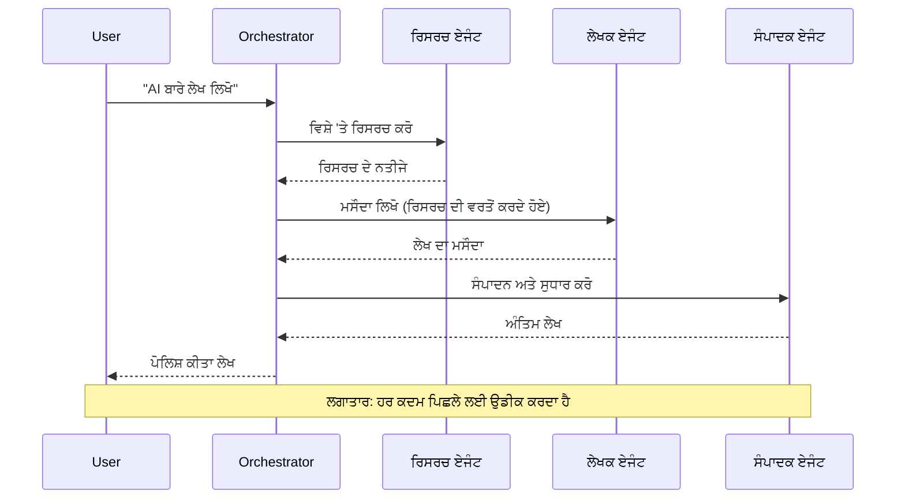
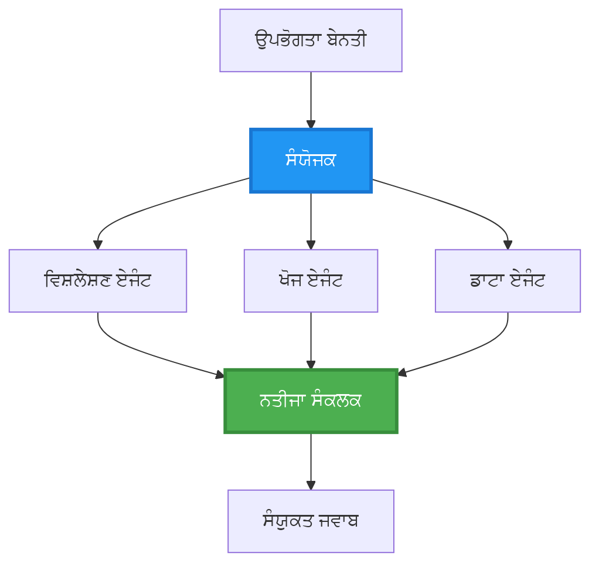
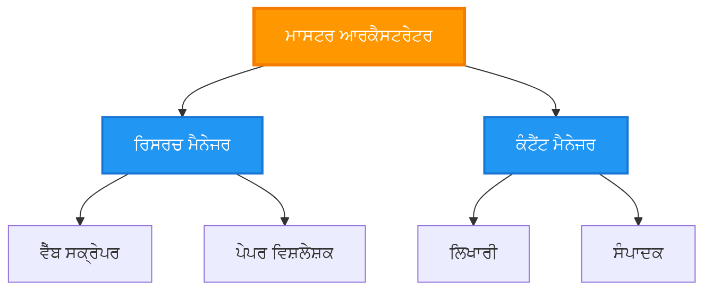
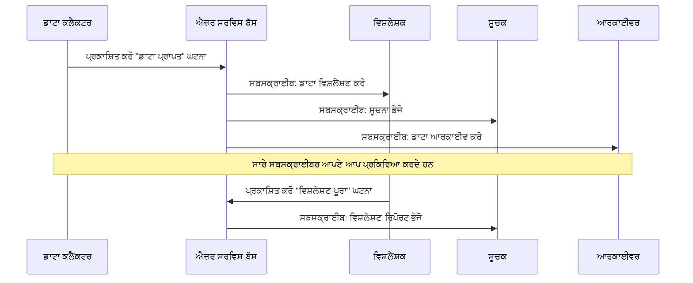
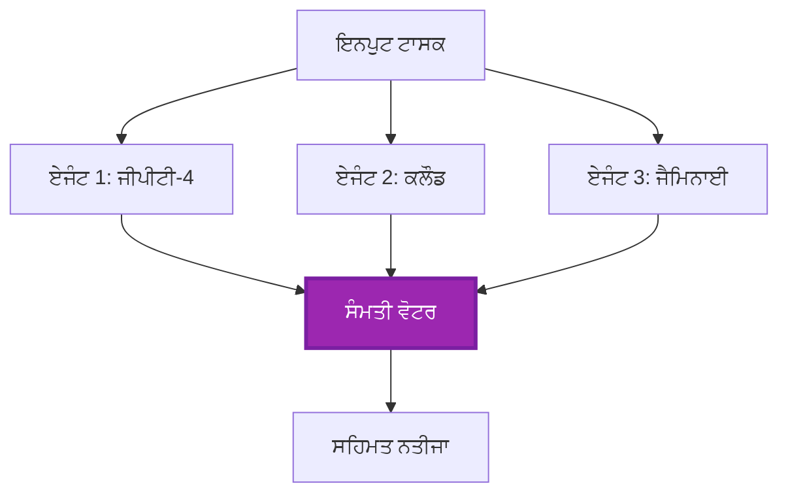
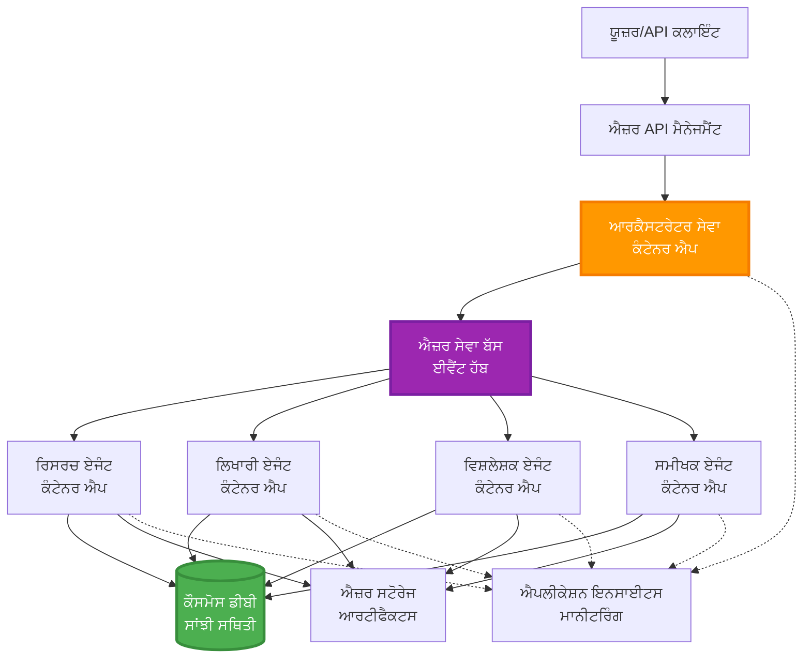

<!--
CO_OP_TRANSLATOR_METADATA:
{
  "original_hash": "bcefbd5d0107691ef3e6e33ba694d6f4",
  "translation_date": "2025-11-21T00:02:40+00:00",
  "source_file": "docs/pre-deployment/coordination-patterns.md",
  "language_code": "pa"
}
-->
# ਮਲਟੀ-ਏਜੰਟ ਕੋਆਰਡੀਨੇਸ਼ਨ ਪੈਟਰਨ

⏱️ **ਅਨੁਮਾਨਿਤ ਸਮਾਂ**: 60-75 ਮਿੰਟ | 💰 **ਅਨੁਮਾਨਿਤ ਖਰਚਾ**: ~$100-300/ਮਹੀਨਾ | ⭐ **ਜਟਿਲਤਾ**: ਉੱਚ-ਸਤਹ

**📚 ਸਿੱਖਣ ਦਾ ਰਾਹ**:
- ← ਪਿਛਲਾ: [ਸਮਰੱਥਾ ਯੋਜਨਾ](capacity-planning.md) - ਸਰੋਤਾਂ ਦੇ ਆਕਾਰ ਅਤੇ ਸਕੇਲਿੰਗ ਰਣਨੀਤੀਆਂ
- 🎯 **ਤੁਸੀਂ ਇੱਥੇ ਹੋ**: ਮਲਟੀ-ਏਜੰਟ ਕੋਆਰਡੀਨੇਸ਼ਨ ਪੈਟਰਨ (ਸੰਚਾਲਨ, ਸੰਚਾਰ, ਸਟੇਟ ਮੈਨੇਜਮੈਂਟ)
- → ਅਗਲਾ: [SKU ਚੋਣ](sku-selection.md) - ਸਹੀ Azure ਸੇਵਾਵਾਂ ਦੀ ਚੋਣ
- 🏠 [ਕੋਰਸ ਹੋਮ](../../README.md)

---

## ਤੁਸੀਂ ਕੀ ਸਿੱਖੋਗੇ

ਇਸ ਪਾਠ ਨੂੰ ਪੂਰਾ ਕਰਕੇ, ਤੁਸੀਂ:
- **ਮਲਟੀ-ਏਜੰਟ ਆਰਕੀਟੈਕਚਰ** ਪੈਟਰਨ ਅਤੇ ਕਦੋਂ ਇਸਤੇਮਾਲ ਕਰਨ ਦੀ ਸਮਝ ਪ੍ਰਾਪਤ ਕਰੋਗੇ
- **ਸੰਚਾਲਨ ਪੈਟਰਨ** (ਕੇਂਦਰੀਕ੍ਰਿਤ, ਵਿਕੇਂਦਰੀਕ੍ਰਿਤ, ਹਾਇਰਾਰਕੀਕਲ) ਨੂੰ ਲਾਗੂ ਕਰੋਗੇ
- **ਏਜੰਟ ਸੰਚਾਰ** ਰਣਨੀਤੀਆਂ (ਸਿੰਕ੍ਰੋਨਸ, ਅਸਿੰਕ੍ਰੋਨਸ, ਇਵੈਂਟ-ਡ੍ਰਿਵਨ) ਡਿਜ਼ਾਈਨ ਕਰੋਗੇ
- ਵੰਡੇ ਹੋਏ ਏਜੰਟਾਂ ਵਿੱਚ **ਸ਼ੇਅਰਡ ਸਟੇਟ** ਦਾ ਪ੍ਰਬੰਧਨ ਕਰੋਗੇ
- AZD ਨਾਲ **ਮਲਟੀ-ਏਜੰਟ ਸਿਸਟਮ** ਨੂੰ ਡਿਪਲੌਇ ਕਰੋਗੇ
- ਅਸਲ ਦੁਨੀਆ ਦੇ AI ਸਨਰੀਓਜ਼ ਲਈ **ਕੋਆਰਡੀਨੇਸ਼ਨ ਪੈਟਰਨ** ਲਾਗੂ ਕਰੋਗੇ
- ਵੰਡੇ ਹੋਏ ਏਜੰਟ ਸਿਸਟਮਾਂ ਦੀ ਨਿਗਰਾਨੀ ਅਤੇ ਡੀਬੱਗ ਕਰੋਗੇ

## ਮਲਟੀ-ਏਜੰਟ ਕੋਆਰਡੀਨੇਸ਼ਨ ਕਿਉਂ ਮਹੱਤਵਪੂਰਨ ਹੈ

### ਵਿਕਾਸ: ਸਿੰਗਲ ਏਜੰਟ ਤੋਂ ਮਲਟੀ-ਏਜੰਟ ਤੱਕ

**ਸਿੰਗਲ ਏਜੰਟ (ਸਧਾਰਨ):**
```
User → Agent → Response
```
- ✅ ਸਮਝਣ ਅਤੇ ਲਾਗੂ ਕਰਨ ਲਈ ਆਸਾਨ
- ✅ ਸਧਾਰਨ ਕੰਮਾਂ ਲਈ ਤੇਜ਼
- ❌ ਸਿੰਗਲ ਮਾਡਲ ਦੀ ਸਮਰੱਥਾ ਦੁਆਰਾ ਸੀਮਿਤ
- ❌ ਜਟਿਲ ਕੰਮਾਂ ਨੂੰ ਪੈਰਲਲ ਨਹੀਂ ਕਰ ਸਕਦਾ
- ❌ ਕੋਈ ਵਿਸ਼ੇਸ਼ਤਾ ਨਹੀਂ

**ਮਲਟੀ-ਏਜੰਟ ਸਿਸਟਮ (ਉੱਚ-ਸਤਹ):**
```
           ┌─────────────┐
           │ Orchestrator│
           └──────┬──────┘
        ┌─────────┼─────────┐
        │         │         │
    ┌───▼──┐  ┌──▼───┐  ┌──▼────┐
    │Agent1│  │Agent2│  │Agent3 │
    │(Plan)│  │(Code)│  │(Review)│
    └──────┘  └──────┘  └───────┘
```
- ✅ ਵਿਸ਼ੇਸ਼ਤਾਵਾਂ ਵਾਲੇ ਏਜੰਟ ਵਿਸ਼ੇਸ਼ ਕੰਮਾਂ ਲਈ
- ✅ ਗਤੀ ਲਈ ਪੈਰਲਲ ਐਗਜ਼ਿਕਿਊਸ਼ਨ
- ✅ ਮੋਡਿਊਲਰ ਅਤੇ ਰੱਖ-ਰਖਾਅ ਯੋਗ
- ✅ ਜਟਿਲ ਵਰਕਫਲੋਜ਼ ਵਿੱਚ ਬਿਹਤਰ
- ⚠️ ਕੋਆਰਡੀਨੇਸ਼ਨ ਲਾਜਿਕ ਦੀ ਲੋੜ

**ਉਦਾਹਰਣ**: ਸਿੰਗਲ ਏਜੰਟ ਇੱਕ ਵਿਅਕਤੀ ਵਾਂਗ ਹੈ ਜੋ ਸਾਰੇ ਕੰਮ ਕਰਦਾ ਹੈ। ਮਲਟੀ-ਏਜੰਟ ਇੱਕ ਟੀਮ ਵਾਂਗ ਹੈ ਜਿੱਥੇ ਹਰ ਮੈਂਬਰ ਦੇ ਵਿਸ਼ੇਸ਼ ਹੁਨਰ ਹਨ (ਖੋਜਕਰਤਾ, ਕੋਡਰ, ਰਿਵਿਊਅਰ, ਲੇਖਕ) ਜੋ ਇਕੱਠੇ ਕੰਮ ਕਰਦੇ ਹਨ।

---

## ਮੁੱਖ ਕੋਆਰਡੀਨੇਸ਼ਨ ਪੈਟਰਨ

### ਪੈਟਰਨ 1: ਲਗਾਤਾਰ ਕੋਆਰਡੀਨੇਸ਼ਨ (ਚੇਨ ਆਫ ਰਿਸਪਾਂਸਬਿਲਿਟੀ)

**ਕਦੋਂ ਇਸਤੇਮਾਲ ਕਰਨਾ ਹੈ**: ਕੰਮਾਂ ਨੂੰ ਨਿਰਧਾਰਤ ਕ੍ਰਮ ਵਿੱਚ ਪੂਰਾ ਕਰਨਾ ਚਾਹੀਦਾ ਹੈ, ਹਰ ਏਜੰਟ ਪਿਛਲੇ ਆਉਟਪੁੱਟ 'ਤੇ ਬਣਾਉਂਦਾ ਹੈ।


**ਫਾਇਦੇ:**
- ✅ ਸਪਸ਼ਟ ਡਾਟਾ ਫਲੋ
- ✅ ਡੀਬੱਗ ਕਰਨ ਲਈ ਆਸਾਨ
- ✅ ਐਗਜ਼ਿਕਿਊਸ਼ਨ ਕ੍ਰਮ ਪੂਰਾ

**ਪਾਬੰਦੀਆਂ:**
- ❌ ਹੌਲੀ (ਕੋਈ ਪੈਰਲਲਿਜ਼ਮ ਨਹੀਂ)
- ❌ ਇੱਕ ਫੇਲ੍ਹਰ ਪੂਰੀ ਚੇਨ ਨੂੰ ਰੋਕਦਾ ਹੈ
- ❌ ਪਰਸਪਰ ਨਿਰਭਰ ਕੰਮਾਂ ਨੂੰ ਸੰਭਾਲ ਨਹੀਂ ਸਕਦਾ

**ਉਦਾਹਰਣ ਵਰਤੋਂ ਦੇ ਕੇਸ:**
- ਸਮੱਗਰੀ ਬਣਾਉਣ ਦੀ ਪਾਈਪਲਾਈਨ (ਖੋਜ → ਲਿਖੋ → ਸੰਪਾਦਨ ਕਰੋ → ਪ੍ਰਕਾਸ਼ਿਤ ਕਰੋ)
- ਕੋਡ ਜਨਰੇਸ਼ਨ (ਯੋਜਨਾ → ਲਾਗੂ ਕਰੋ → ਟੈਸਟ ਕਰੋ → ਡਿਪਲੌਇ ਕਰੋ)
- ਰਿਪੋਰਟ ਜਨਰੇਸ਼ਨ (ਡਾਟਾ ਇਕੱਠਾ ਕਰੋ → ਵਿਸ਼ਲੇਸ਼ਣ → ਵਿਜੁਅਲਾਈਜ਼ੇਸ਼ਨ → ਸੰਖੇਪ)

---

### ਪੈਟਰਨ 2: ਪੈਰਲਲ ਕੋਆਰਡੀਨੇਸ਼ਨ (Fan-Out/Fan-In)

**ਕਦੋਂ ਇਸਤੇਮਾਲ ਕਰਨਾ ਹੈ**: ਸਵਤੰਤਰ ਕੰਮ ਇੱਕੋ ਸਮੇਂ ਚੱਲ ਸਕਦੇ ਹਨ, ਨਤੀਜੇ ਅੰਤ ਵਿੱਚ ਜੋੜੇ ਜਾਂਦੇ ਹਨ।


**ਫਾਇਦੇ:**
- ✅ ਤੇਜ਼ (ਪੈਰਲਲ ਐਗਜ਼ਿਕਿਊਸ਼ਨ)
- ✅ ਫਾਲਟ-ਟੋਲਰੈਂਟ (ਅੰਸ਼ਕ ਨਤੀਜੇ ਸਵੀਕਾਰਯੋਗ)
- ✅ ਹਾਰਿਜ਼ੋਂਟਲ ਸਕੇਲ ਕਰਦਾ ਹੈ

**ਪਾਬੰਦੀਆਂ:**
- ⚠️ ਨਤੀਜੇ ਕ੍ਰਮ ਤੋਂ ਬਾਹਰ ਆ ਸਕਦੇ ਹਨ
- ⚠️ ਐਗਰੀਗੇਸ਼ਨ ਲਾਜਿਕ ਦੀ ਲੋੜ ਹੈ
- ⚠️ ਜਟਿਲ ਸਟੇਟ ਮੈਨੇਜਮੈਂਟ

**ਉਦਾਹਰਣ ਵਰਤੋਂ ਦੇ ਕੇਸ:**
- ਮਲਟੀ-ਸੋਰਸ ਡਾਟਾ ਇਕੱਠਾ ਕਰਨਾ (APIs + ਡਾਟਾਬੇਸ + ਵੈੱਬ ਸਕ੍ਰੈਪਿੰਗ)
- ਮੁਕਾਬਲਾਤੀ ਵਿਸ਼ਲੇਸ਼ਣ (ਕਈ ਮਾਡਲ ਹੱਲ ਪੈਦਾ ਕਰਦੇ ਹਨ, ਸਭ ਤੋਂ ਵਧੀਆ ਚੁਣਿਆ ਜਾਂਦਾ ਹੈ)
- ਅਨੁਵਾਦ ਸੇਵਾਵਾਂ (ਇੱਕੋ ਸਮੇਂ ਕਈ ਭਾਸ਼ਾਵਾਂ ਵਿੱਚ ਅਨੁਵਾਦ)

---

### ਪੈਟਰਨ 3: ਹਾਇਰਾਰਕੀਕਲ ਕੋਆਰਡੀਨੇਸ਼ਨ (ਮੈਨੇਜਰ-ਵਰਕਰ)

**ਕਦੋਂ ਇਸਤੇਮਾਲ ਕਰਨਾ ਹੈ**: ਜਟਿਲ ਵਰਕਫਲੋਜ਼ ਜਿਨ੍ਹਾਂ ਵਿੱਚ ਉਪ-ਕੰਮ ਹਨ, ਸੌਂਪਣ ਦੀ ਲੋੜ ਹੈ।


**ਫਾਇਦੇ:**
- ✅ ਜਟਿਲ ਵਰਕਫਲੋਜ਼ ਨੂੰ ਸੰਭਾਲਦਾ ਹੈ
- ✅ ਮੋਡਿਊਲਰ ਅਤੇ ਰੱਖ-ਰਖਾਅ ਯੋਗ
- ✅ ਸਪਸ਼ਟ ਜ਼ਿੰਮੇਵਾਰੀ ਦੀਆਂ ਹੱਦਾਂ

**ਪਾਬੰਦੀਆਂ:**
- ⚠️ ਹੋਰ ਜਟਿਲ ਆਰਕੀਟੈਕਚਰ
- ⚠️ ਵਧੇਰੇ ਲੈਟੈਂਸੀ (ਕਈ ਕੋਆਰਡੀਨੇਸ਼ਨ ਲੇਅਰ)
- ⚠️ ਸੁਧਾਰਸ਼ੀਲ ਸੰਚਾਲਨ ਦੀ ਲੋੜ ਹੈ

**ਉਦਾਹਰਣ ਵਰਤੋਂ ਦੇ ਕੇਸ:**
- ਇੰਟਰਪ੍ਰਾਈਜ਼ ਦਸਤਾਵੇਜ਼ ਪ੍ਰੋਸੈਸਿੰਗ (ਵਰਗਬੱਧ ਕਰੋ → ਰੂਟ ਕਰੋ → ਪ੍ਰੋਸੈਸ ਕਰੋ → ਆਰਕਾਈਵ ਕਰੋ)
- ਮਲਟੀ-ਸਟੇਜ ਡਾਟਾ ਪਾਈਪਲਾਈਨ (ਇਨਜੈਸਟ → ਸਾਫ਼ ਕਰੋ → ਰੂਪਾਂਤਰਿਤ ਕਰੋ → ਵਿਸ਼ਲੇਸ਼ਣ → ਰਿਪੋਰਟ)
- ਜਟਿਲ ਆਟੋਮੇਸ਼ਨ ਵਰਕਫਲੋਜ਼ (ਯੋਜਨਾ → ਸਰੋਤਾਂ ਦਾ ਆਵਟਨ → ਐਗਜ਼ਿਕਿਊਸ਼ਨ → ਮਾਨੀਟਰਿੰਗ)

---

### ਪੈਟਰਨ 4: ਇਵੈਂਟ-ਡ੍ਰਿਵਨ ਕੋਆਰਡੀਨੇਸ਼ਨ (ਪਬਲਿਸ਼-ਸਬਸਕ੍ਰਾਈਬ)

**ਕਦੋਂ ਇਸਤੇਮਾਲ ਕਰਨਾ ਹੈ**: ਏਜੰਟਾਂ ਨੂੰ ਇਵੈਂਟਸ 'ਤੇ ਪ੍ਰਤੀਕ੍ਰਿਆ ਕਰਨ ਦੀ ਲੋੜ ਹੈ, ਢਿੱਲੇ ਜੁੜਾਅ ਦੀ ਇੱਛਾ ਹੈ।


**ਫਾਇਦੇ:**
- ✅ ਏਜੰਟਾਂ ਦੇ ਵਿਚਕਾਰ ਢਿੱਲਾ ਜੁੜਾਅ
- ✅ ਨਵੇਂ ਏਜੰਟਾਂ ਨੂੰ ਜੋੜਨਾ ਆਸਾਨ (ਸਿਰਫ਼ ਸਬਸਕ੍ਰਾਈਬ ਕਰੋ)
- ✅ ਅਸਿੰਕ੍ਰੋਨਸ ਪ੍ਰੋਸੈਸਿੰਗ
- ✅ ਲਚੀਲਾ (ਸੰਦੇਸ਼ ਟਿਕਾਊ)

**ਪਾਬੰਦੀਆਂ:**
- ⚠️ ਇਵੈਂਚੁਅਲ ਕਨਸਿਸਟੈਂਸੀ
- ⚠️ ਜਟਿਲ ਡੀਬੱਗਿੰਗ
- ⚠️ ਸੰਦੇਸ਼ ਕ੍ਰਮਬੱਧਤਾ ਦੀਆਂ ਚੁਣੌਤੀਆਂ

**ਉਦਾਹਰਣ ਵਰਤੋਂ ਦੇ ਕੇਸ:**
- ਰੀਅਲ-ਟਾਈਮ ਮਾਨੀਟਰਿੰਗ ਸਿਸਟਮ (ਚੇਤਾਵਨੀ, ਡੈਸ਼ਬੋਰਡ, ਲੌਗ)
- ਮਲਟੀ-ਚੈਨਲ ਨੋਟੀਫਿਕੇਸ਼ਨ (ਈਮੇਲ, SMS, ਪੁਸ਼, Slack)
- ਡਾਟਾ ਪ੍ਰੋਸੈਸਿੰਗ ਪਾਈਪਲਾਈਨ (ਇੱਕੋ ਡਾਟਾ ਦੇ ਕਈ ਖਪਤਕਾਰ)

---

### ਪੈਟਰਨ 5: ਸਹਿਮਤੀ-ਅਧਾਰਿਤ ਕੋਆਰਡੀਨੇਸ਼ਨ (ਵੋਟਿੰਗ/ਕੋਰਮ)

**ਕਦੋਂ ਇਸਤੇਮਾਲ ਕਰਨਾ ਹੈ**: ਅੱਗੇ ਵਧਣ ਤੋਂ ਪਹਿਲਾਂ ਕਈ ਏਜੰਟਾਂ ਤੋਂ ਸਹਿਮਤੀ ਦੀ ਲੋੜ ਹੈ।


**ਫਾਇਦੇ:**
- ✅ ਉੱਚ ਸਹੀਤਾ (ਕਈ ਰਾਏ)
- ✅ ਫਾਲਟ-ਟੋਲਰੈਂਟ (ਅਲਪਸੰਖਕ ਫੇਲ੍ਹਰ ਸਵੀਕਾਰਯੋਗ)
- ✅ ਗੁਣਵੱਤਾ ਅਸ਼ੁਰੈਂਸ ਅੰਦਰ-ਅੰਦਰ

**ਪਾਬੰਦੀਆਂ:**
- ❌ ਮਹਿੰਗਾ (ਕਈ ਮਾਡਲ ਕਾਲ)
- ❌ ਹੌਲਾ (ਸਾਰੇ ਏਜੰਟਾਂ ਦੀ ਉਡੀਕ)
- ⚠️ ਸੰਘਰਸ਼ ਨਿਪਟਾਰਾ ਦੀ ਲੋੜ

**ਉਦਾਹਰਣ ਵਰਤੋਂ ਦੇ ਕੇਸ:**
- ਸਮੱਗਰੀ ਮਾਡਰੇਸ਼ਨ (ਕਈ ਮਾਡਲ ਸਮੱਗਰੀ ਦੀ ਸਮੀਖਾ ਕਰਦੇ ਹਨ)
- ਕੋਡ ਰਿਵਿਊ (ਕਈ ਲਿੰਟਰ/ਵਿਸ਼ਲੇਸ਼ਕ)
- ਮੈਡੀਕਲ ਡਾਇਗਨੋਸਿਸ (ਕਈ AI ਮਾਡਲ, ਮਾਹਰ ਵੈਰੀਫਿਕੇਸ਼ਨ)

---

## ਆਰਕੀਟੈਕਚਰ ਝਲਕ

### ਪੂਰਾ ਮਲਟੀ-ਏਜੰਟ ਸਿਸਟਮ Azure 'ਤੇ


**ਮੁੱਖ ਘਟਕੇ:**

| ਘਟਕਾ | ਉਦੇਸ਼ | Azure ਸੇਵਾ |
|-----------|---------|---------------|
| **API Gateway** | ਐਂਟਰੀ ਪੌਇੰਟ, ਰੇਟ ਲਿਮਿਟਿੰਗ, ਆਥ | API Management |
| **Orchestrator** | ਏਜੰਟ ਵਰਕਫਲੋਜ਼ ਨੂੰ ਸੰਚਾਲਿਤ ਕਰਦਾ ਹੈ | Container Apps |
| **Message Queue** | ਅਸਿੰਕ੍ਰੋਨਸ ਸੰਚਾਰ | Service Bus / Event Hubs |
| **Agents** | ਵਿਸ਼ੇਸ਼ਤਾਵਾਂ ਵਾਲੇ AI ਵਰਕਰ | Container Apps / Functions |
| **State Store** | ਸ਼ੇਅਰਡ ਸਟੇਟ, ਟਾਸਕ ਟ੍ਰੈਕਿੰਗ | Cosmos DB |
| **Artifact Storage** | ਦਸਤਾਵੇਜ਼, ਨਤੀਜੇ, ਲੌਗ | Blob Storage |
| **Monitoring** | ਵੰਡੇ ਹੋਏ ਟ੍ਰੇਸਿੰਗ, ਲੌਗ | Application Insights |

---

## ਪੂਰਵ ਸ਼ਰਤਾਂ

### ਲੋੜੀਂਦੇ ਟੂਲ

```bash
# ਐਜ਼ਰ ਡਿਵੈਲਪਰ CLI ਦੀ ਪੁਸ਼ਟੀ ਕਰੋ
azd version
# ✅ ਉਮੀਦ: azd ਵਰਜਨ 1.0.0 ਜਾਂ ਉੱਚਾ

# ਐਜ਼ਰ CLI ਦੀ ਪੁਸ਼ਟੀ ਕਰੋ
az --version
# ✅ ਉਮੀਦ: azure-cli 2.50.0 ਜਾਂ ਉੱਚਾ

# ਡੋਕਰ ਦੀ ਪੁਸ਼ਟੀ ਕਰੋ (ਸਥਾਨਕ ਟੈਸਟਿੰਗ ਲਈ)
docker --version
# ✅ ਉਮੀਦ: ਡੋਕਰ ਵਰਜਨ 20.10 ਜਾਂ ਉੱਚਾ
```

### Azure ਦੀਆਂ ਲੋੜਾਂ

- ਸਰਗਰਮ Azure ਸਬਸਕ੍ਰਿਪਸ਼ਨ
- ਇਹ ਬਣਾਉਣ ਦੀਆਂ ਅਨੁਮਤੀਆਂ:
  - Container Apps
  - Service Bus namespaces
  - Cosmos DB accounts
  - Storage accounts
  - Application Insights

### ਗਿਆਨ ਪੂਰਵ ਸ਼ਰਤਾਂ

ਤੁਸੀਂ ਪੂਰਾ ਕੀਤਾ ਹੋਣਾ ਚਾਹੀਦਾ ਹੈ:
- [ਕੰਫਿਗਰੇਸ਼ਨ ਮੈਨੇਜਮੈਂਟ](../getting-started/configuration.md)
- [ਪ੍ਰਮਾਣਿਕਤਾ ਅਤੇ ਸੁਰੱਖਿਆ](../getting-started/authsecurity.md)
- [ਮਾਈਕ੍ਰੋਸਰਵਿਸਜ਼ ਉਦਾਹਰਣ](../../../../examples/microservices)

---

## ਲਾਗੂ ਕਰਨ ਦੀ ਗਾਈਡ

### ਪ੍ਰੋਜੈਕਟ ਸਟ੍ਰਕਚਰ

```
multi-agent-system/
├── azure.yaml                    # AZD configuration
├── infra/
│   ├── main.bicep               # Main infrastructure
│   ├── core/
│   │   ├── servicebus.bicep     # Message queue
│   │   ├── cosmos.bicep         # State store
│   │   ├── storage.bicep        # Artifact storage
│   │   └── monitoring.bicep     # Application Insights
│   └── app/
│       ├── orchestrator.bicep   # Orchestrator service
│       └── agent.bicep          # Agent template
└── src/
    ├── orchestrator/            # Orchestration logic
    │   ├── app.py
    │   ├── workflows.py
    │   └── Dockerfile
    ├── agents/
    │   ├── research/            # Research agent
    │   ├── writer/              # Writer agent
    │   ├── analyst/             # Analyst agent
    │   └── reviewer/            # Reviewer agent
    └── shared/
        ├── state_manager.py     # Shared state logic
        └── message_handler.py   # Message handling
```

---

## ਪਾਠ 1: ਲਗਾਤਾਰ ਕੋਆਰਡੀਨੇਸ਼ਨ ਪੈਟਰਨ

### ਲਾਗੂ ਕਰਨਾ: ਸਮੱਗਰੀ ਬਣਾਉਣ ਦੀ ਪਾਈਪਲਾਈਨ

ਆਓ ਇੱਕ ਲਗਾਤਾਰ ਪਾਈਪਲਾਈਨ ਬਣਾਈਏ: ਖੋਜ → ਲਿਖੋ → ਸੰਪਾਦਨ ਕਰੋ → ਪ੍ਰਕਾਸ਼ਿਤ ਕਰੋ

### 1. AZD ਕਨਫਿਗਰੇਸ਼ਨ

**ਫਾਈਲ: `azure.yaml`**

```yaml
name: content-pipeline
metadata:
  template: multi-agent-sequential@1.0.0

services:
  orchestrator:
    project: ./src/orchestrator
    language: python
    host: containerapp
  
  research-agent:
    project: ./src/agents/research
    language: python
    host: containerapp
  
  writer-agent:
    project: ./src/agents/writer
    language: python
    host: containerapp
  
  editor-agent:
    project: ./src/agents/editor
    language: python
    host: containerapp
```

### 2. ਇਨਫ੍ਰਾਸਟਰਕਚਰ: ਕੋਆਰਡੀਨੇਸ਼ਨ ਲਈ Service Bus

**ਫਾਈਲ: `infra/core/servicebus.bicep`**

```bicep
param name string
param location string
param tags object = {}

resource serviceBusNamespace 'Microsoft.ServiceBus/namespaces@2022-10-01-preview' = {
  name: name
  location: location
  tags: tags
  sku: {
    name: 'Standard'
    tier: 'Standard'
  }
  properties: {
    minimumTlsVersion: '1.2'
  }
}

// Queue for orchestrator → research agent
resource researchQueue 'Microsoft.ServiceBus/namespaces/queues@2022-10-01-preview' = {
  parent: serviceBusNamespace
  name: 'research-tasks'
  properties: {
    maxDeliveryCount: 3
    lockDuration: 'PT5M'
    deadLetteringOnMessageExpiration: true
  }
}

// Queue for research agent → writer agent
resource writerQueue 'Microsoft.ServiceBus/namespaces/queues@2022-10-01-preview' = {
  parent: serviceBusNamespace
  name: 'writer-tasks'
  properties: {
    maxDeliveryCount: 3
    lockDuration: 'PT5M'
  }
}

// Queue for writer agent → editor agent
resource editorQueue 'Microsoft.ServiceBus/namespaces/queues@2022-10-01-preview' = {
  parent: serviceBusNamespace
  name: 'editor-tasks'
  properties: {
    maxDeliveryCount: 3
    lockDuration: 'PT5M'
  }
}

output namespace string = serviceBusNamespace.name
output connectionString string = listKeys('${serviceBusNamespace.id}/AuthorizationRules/RootManageSharedAccessKey', serviceBusNamespace.apiVersion).primaryConnectionString
```

### 3. ਸ਼ੇਅਰਡ ਸਟੇਟ ਮੈਨੇਜਰ

**ਫਾਈਲ: `src/shared/state_manager.py`**

```python
from azure.cosmos import CosmosClient, PartitionKey
from datetime import datetime
import os

class StateManager:
    """Manages shared state across agents using Cosmos DB"""
    
    def __init__(self):
        endpoint = os.environ['COSMOS_ENDPOINT']
        key = os.environ['COSMOS_KEY']
        
        self.client = CosmosClient(endpoint, key)
        self.database = self.client.get_database_client('agent-state')
        self.container = self.database.get_container_client('tasks')
    
    def create_task(self, task_id: str, task_type: str, input_data: dict):
        """Create a new task"""
        task = {
            'id': task_id,
            'type': task_type,
            'status': 'pending',
            'input': input_data,
            'created_at': datetime.utcnow().isoformat(),
            'steps': []
        }
        self.container.create_item(task)
        return task
    
    def update_task_step(self, task_id: str, step_name: str, result: dict):
        """Update task with completed step"""
        task = self.container.read_item(task_id, partition_key=task_id)
        
        task['steps'].append({
            'name': step_name,
            'completed_at': datetime.utcnow().isoformat(),
            'result': result
        })
        
        self.container.replace_item(task_id, task)
        return task
    
    def complete_task(self, task_id: str, final_result: dict):
        """Mark task as complete"""
        task = self.container.read_item(task_id, partition_key=task_id)
        task['status'] = 'completed'
        task['result'] = final_result
        task['completed_at'] = datetime.utcnow().isoformat()
        self.container.replace_item(task_id, task)
        return task
    
    def get_task(self, task_id: str):
        """Retrieve task state"""
        return self.container.read_item(task_id, partition_key=task_id)
```

### 4. Orchestrator ਸੇਵਾ

**ਫਾਈਲ: `src/orchestrator/app.py`**

```python
from flask import Flask, request, jsonify
from azure.servicebus import ServiceBusClient, ServiceBusMessage
import json
import uuid
import os
from shared.state_manager import StateManager

app = Flask(__name__)
state_manager = StateManager()

# ਸੇਵਾ ਬੱਸ ਕਨੈਕਸ਼ਨ
servicebus_connection_str = os.environ['SERVICEBUS_CONNECTION_STRING']
servicebus_client = ServiceBusClient.from_connection_string(servicebus_connection_str)

@app.route('/health', methods=['GET'])
def health():
    return jsonify({'status': 'healthy', 'service': 'orchestrator'})

@app.route('/create-content', methods=['POST'])
def create_content():
    """
    Sequential workflow: Research → Write → Edit → Publish
    """
    data = request.json
    topic = data.get('topic')
    
    if not topic:
        return jsonify({'error': 'Topic required'}), 400
    
    # ਸਟੇਟ ਸਟੋਰ ਵਿੱਚ ਟਾਸਕ ਬਣਾਓ
    task_id = str(uuid.uuid4())
    task = state_manager.create_task(
        task_id=task_id,
        task_type='content_creation',
        input_data={'topic': topic}
    )
    
    # ਰਿਸਰਚ ਏਜੰਟ ਨੂੰ ਸੁਨੇਹਾ ਭੇਜੋ (ਪਹਿਲਾ ਕਦਮ)
    sender = servicebus_client.get_queue_sender('research-tasks')
    message = ServiceBusMessage(
        body=json.dumps({
            'task_id': task_id,
            'topic': topic,
            'next_queue': 'writer-tasks'  # ਨਤੀਜੇ ਕਿੱਥੇ ਭੇਜਣੇ ਹਨ
        }),
        content_type='application/json'
    )
    
    with sender:
        sender.send_messages(message)
    
    return jsonify({
        'task_id': task_id,
        'status': 'started',
        'workflow': 'sequential',
        'steps': ['research', 'write', 'edit', 'publish'],
        'message': 'Content creation pipeline initiated'
    }), 202

@app.route('/task/<task_id>', methods=['GET'])
def get_task_status(task_id):
    """Check task status"""
    try:
        task = state_manager.get_task(task_id)
        return jsonify(task)
    except Exception as e:
        return jsonify({'error': str(e)}), 404

if __name__ == '__main__':
    app.run(host='0.0.0.0', port=8080)
```

### 5. ਖੋਜ ਏਜੰਟ

**ਫਾਈਲ: `src/agents/research/app.py`**

```python
from azure.servicebus import ServiceBusClient, ServiceBusMessage
from openai import AzureOpenAI
import json
import os
import time
from shared.state_manager import StateManager

# ਕਲਾਇੰਟਸ ਸ਼ੁਰੂ ਕਰੋ
state_manager = StateManager()
servicebus_client = ServiceBusClient.from_connection_string(
    os.environ['SERVICEBUS_CONNECTION_STRING']
)

openai_client = AzureOpenAI(
    api_key=os.environ['AZURE_OPENAI_API_KEY'],
    api_version="2024-02-01",
    azure_endpoint=os.environ['AZURE_OPENAI_ENDPOINT']
)

def process_research_task(message_data):
    """Process research request and pass to writer"""
    task_id = message_data['task_id']
    topic = message_data['topic']
    next_queue = message_data['next_queue']
    
    print(f"🔬 Researching: {topic}")
    
    # ਰਿਸਰਚ ਲਈ Azure OpenAI ਨੂੰ ਕਾਲ ਕਰੋ
    response = openai_client.chat.completions.create(
        model="gpt-4",
        messages=[
            {"role": "system", "content": "You are a research assistant. Provide comprehensive research on the given topic."},
            {"role": "user", "content": f"Research this topic thoroughly: {topic}"}
        ],
        max_tokens=1500
    )
    
    research_results = response.choices[0].message.content
    
    # ਸਟੇਟ ਅਪਡੇਟ ਕਰੋ
    state_manager.update_task_step(
        task_id=task_id,
        step_name='research',
        result={'research': research_results}
    )
    
    # ਅਗਲੇ ਏਜੰਟ (ਲਿਖਾਰੀ) ਨੂੰ ਭੇਜੋ
    sender = servicebus_client.get_queue_sender(next_queue)
    message = ServiceBusMessage(
        body=json.dumps({
            'task_id': task_id,
            'topic': topic,
            'research': research_results,
            'next_queue': 'editor-tasks'
        }),
        content_type='application/json'
    )
    
    with sender:
        sender.send_messages(message)
    
    print(f"✅ Research complete for task {task_id}")

def main():
    """Listen to research queue"""
    receiver = servicebus_client.get_queue_receiver('research-tasks')
    
    print("🔬 Research Agent started, listening for tasks...")
    
    with receiver:
        while True:
            messages = receiver.receive_messages(max_wait_time=5)
            for message in messages:
                try:
                    message_data = json.loads(str(message))
                    process_research_task(message_data)
                    receiver.complete_message(message)
                except Exception as e:
                    print(f"❌ Error processing message: {e}")
                    receiver.abandon_message(message)

if __name__ == '__main__':
    main()
```

### 6. ਲੇਖਕ ਏਜੰਟ

**ਫਾਈਲ: `src/agents/writer/app.py`**

```python
from azure.servicebus import ServiceBusClient, ServiceBusMessage
from openai import AzureOpenAI
import json
import os
from shared.state_manager import StateManager

state_manager = StateManager()
servicebus_client = ServiceBusClient.from_connection_string(
    os.environ['SERVICEBUS_CONNECTION_STRING']
)

openai_client = AzureOpenAI(
    api_key=os.environ['AZURE_OPENAI_API_KEY'],
    api_version="2024-02-01",
    azure_endpoint=os.environ['AZURE_OPENAI_ENDPOINT']
)

def process_writing_task(message_data):
    """Write article based on research"""
    task_id = message_data['task_id']
    topic = message_data['topic']
    research = message_data['research']
    next_queue = message_data['next_queue']
    
    print(f"✍️ Writing article: {topic}")
    
    # ਆਰਟੀਕਲ ਲਿਖਣ ਲਈ ਐਜ਼ਰ ਓਪਨਏਆਈ ਨੂੰ ਕਾਲ ਕਰੋ
    response = openai_client.chat.completions.create(
        model="gpt-4",
        messages=[
            {"role": "system", "content": "You are a professional writer. Write engaging, well-structured articles."},
            {"role": "user", "content": f"Based on this research:\n\n{research}\n\nWrite a comprehensive article about: {topic}"}
        ],
        max_tokens=2000
    )
    
    article_draft = response.choices[0].message.content
    
    # ਸਟੇਟ ਅਪਡੇਟ ਕਰੋ
    state_manager.update_task_step(
        task_id=task_id,
        step_name='writing',
        result={'draft': article_draft}
    )
    
    # ਸੰਪਾਦਕ ਨੂੰ ਭੇਜੋ
    sender = servicebus_client.get_queue_sender(next_queue)
    message = ServiceBusMessage(
        body=json.dumps({
            'task_id': task_id,
            'topic': topic,
            'draft': article_draft
        }),
        content_type='application/json'
    )
    
    with sender:
        sender.send_messages(message)
    
    print(f"✅ Article draft complete for task {task_id}")

def main():
    """Listen to writer queue"""
    receiver = servicebus_client.get_queue_receiver('writer-tasks')
    
    print("✍️ Writer Agent started, listening for tasks...")
    
    with receiver:
        while True:
            messages = receiver.receive_messages(max_wait_time=5)
            for message in messages:
                try:
                    message_data = json.loads(str(message))
                    process_writing_task(message_data)
                    receiver.complete_message(message)
                except Exception as e:
                    print(f"❌ Error: {e}")
                    receiver.abandon_message(message)

if __name__ == '__main__':
    main()
```

### 7. ਸੰਪਾਦਕ ਏਜੰਟ

**ਫਾਈਲ: `src/agents/editor/app.py`**

```python
from azure.servicebus import ServiceBusClient
from openai import AzureOpenAI
import json
import os
from shared.state_manager import StateManager

state_manager = StateManager()
servicebus_client = ServiceBusClient.from_connection_string(
    os.environ['SERVICEBUS_CONNECTION_STRING']
)

openai_client = AzureOpenAI(
    api_key=os.environ['AZURE_OPENAI_API_KEY'],
    api_version="2024-02-01",
    azure_endpoint=os.environ['AZURE_OPENAI_ENDPOINT']
)

def process_editing_task(message_data):
    """Edit and finalize article"""
    task_id = message_data['task_id']
    topic = message_data['topic']
    draft = message_data['draft']
    
    print(f"📝 Editing article: {topic}")
    
    # ਐਜ਼ਰ ਓਪਨਏਆਈ ਨੂੰ ਸੰਪਾਦਨ ਲਈ ਕਾਲ ਕਰੋ
    response = openai_client.chat.completions.create(
        model="gpt-4",
        messages=[
            {"role": "system", "content": "You are an expert editor. Improve grammar, clarity, and structure."},
            {"role": "user", "content": f"Edit and improve this article:\n\n{draft}"}
        ],
        max_tokens=2000
    )
    
    final_article = response.choices[0].message.content
    
    # ਕੰਮ ਨੂੰ ਪੂਰਾ ਹੋਇਆ ਚਿੰਨ੍ਹਿਤ ਕਰੋ
    state_manager.complete_task(
        task_id=task_id,
        final_result={
            'topic': topic,
            'final_article': final_article,
            'word_count': len(final_article.split())
        }
    )
    
    print(f"✅ Article finalized for task {task_id}")

def main():
    """Listen to editor queue"""
    receiver = servicebus_client.get_queue_receiver('editor-tasks')
    
    print("📝 Editor Agent started, listening for tasks...")
    
    with receiver:
        while True:
            messages = receiver.receive_messages(max_wait_time=5)
            for message in messages:
                try:
                    message_data = json.loads(str(message))
                    process_editing_task(message_data)
                    receiver.complete_message(message)
                except Exception as e:
                    print(f"❌ Error: {e}")
                    receiver.abandon_message(message)

if __name__ == '__main__':
    main()
```

### 8. ਡਿਪਲੌਇ ਅਤੇ ਟੈਸਟ

```bash
# ਸ਼ੁਰੂ ਕਰੋ ਅਤੇ ਤੈਨਾਤ ਕਰੋ
azd init
azd up

# ਆਰਕੇਸਟਰੇਟਰ URL ਪ੍ਰਾਪਤ ਕਰੋ
ORCHESTRATOR_URL=$(azd env get-values | grep ORCHESTRATOR_URL | cut -d '=' -f2 | tr -d '"')

# ਸਮੱਗਰੀ ਬਣਾਓ
curl -X POST $ORCHESTRATOR_URL/create-content \
  -H "Content-Type: application/json" \
  -d '{"topic": "The Future of AI in Healthcare"}'
```

**✅ ਉਮੀਦਵਾਰ ਨਤੀਜਾ:**
```json
{
  "task_id": "a1b2c3d4-e5f6-7890-abcd-ef1234567890",
  "status": "started",
  "workflow": "sequential",
  "steps": ["research", "write", "edit", "publish"],
  "message": "Content creation pipeline initiated"
}
```

**ਟਾਸਕ ਪ੍ਰਗਤੀ ਦੀ ਜਾਂਚ ਕਰੋ:**
```bash
TASK_ID="a1b2c3d4-e5f6-7890-abcd-ef1234567890"
curl $ORCHESTRATOR_URL/task/$TASK_ID
```

**✅ ਉਮੀਦਵਾਰ ਨਤੀਜਾ (ਪੂਰਾ):**
```json
{
  "id": "a1b2c3d4-e5f6-7890-abcd-ef1234567890",
  "type": "content_creation",
  "status": "completed",
  "steps": [
    {
      "name": "research",
      "completed_at": "2025-11-19T10:30:00Z",
      "result": {"research": "..."}
    },
    {
      "name": "writing",
      "completed_at": "2025-11-19T10:32:00Z",
      "result": {"draft": "..."}
    }
  ],
  "result": {
    "topic": "The Future of AI in Healthcare",
    "final_article": "...",
    "word_count": 1500
  }
}
```

---

## ਪਾਠ 2: ਪੈਰਲਲ ਕੋਆਰਡੀਨੇਸ਼ਨ ਪੈਟਰਨ

### ਲਾਗੂ ਕਰਨਾ: ਮਲਟੀ-ਸੋਰਸ ਰਿਸਰਚ ਐਗਰੀਗੇਟਰ

ਆਓ ਇੱਕ ਪੈਰਲਲ ਸਿਸਟਮ ਬਣਾਈਏ ਜੋ ਇੱਕੋ ਸਮੇਂ ਕਈ ਸਰੋਤਾਂ ਤੋਂ ਜਾਣਕਾਰੀ ਇਕੱਠੀ ਕਰਦਾ ਹੈ।

### ਪੈਰਲਲ Orchestrator

**ਫਾਈਲ: `src/orchestrator/parallel_workflow.py`**

```python
from flask import Flask, request, jsonify
from azure.servicebus import ServiceBusClient, ServiceBusMessage
import json
import uuid
import os
from shared.state_manager import StateManager

app = Flask(__name__)
state_manager = StateManager()

servicebus_client = ServiceBusClient.from_connection_string(
    os.environ['SERVICEBUS_CONNECTION_STRING']
)

@app.route('/research-parallel', methods=['POST'])
def research_parallel():
    """
    Parallel workflow: Multiple agents work simultaneously
    """
    data = request.json
    query = data.get('query')
    
    task_id = str(uuid.uuid4())
    task = state_manager.create_task(
        task_id=task_id,
        task_type='parallel_research',
        input_data={
            'query': query,
            'agents': ['web', 'academic', 'news', 'social']
        }
    )
    
    # ਫੈਨ-ਆਉਟ: ਸਾਰੇ ਏਜੰਟਾਂ ਨੂੰ ਇਕੱਠੇ ਭੇਜੋ
    agents = [
        ('web-research-queue', 'web'),
        ('academic-research-queue', 'academic'),
        ('news-research-queue', 'news'),
        ('social-research-queue', 'social')
    ]
    
    for queue_name, agent_type in agents:
        sender = servicebus_client.get_queue_sender(queue_name)
        message = ServiceBusMessage(
            body=json.dumps({
                'task_id': task_id,
                'query': query,
                'agent_type': agent_type,
                'result_queue': 'aggregation-queue'
            }),
            content_type='application/json'
        )
        
        with sender:
            sender.send_messages(message)
    
    return jsonify({
        'task_id': task_id,
        'status': 'started',
        'workflow': 'parallel',
        'agents_dispatched': 4,
        'message': 'Parallel research initiated'
    }), 202

if __name__ == '__main__':
    app.run(host='0.0.0.0', port=8080)
```

### ਐਗਰੀਗੇਸ਼ਨ ਲਾਜਿਕ

**ਫਾਈਲ: `src/agents/aggregator/app.py`**

```python
from azure.servicebus import ServiceBusClient
import json
import os
from collections import defaultdict
from shared.state_manager import StateManager

state_manager = StateManager()
servicebus_client = ServiceBusClient.from_connection_string(
    os.environ['SERVICEBUS_CONNECTION_STRING']
)

# ਹਰ ਕੰਮ ਦੇ ਨਤੀਜੇ ਟ੍ਰੈਕ ਕਰੋ
task_results = defaultdict(list)
expected_agents = 4  # ਵੈਬ, ਅਕਾਦਮਿਕ, ਖਬਰਾਂ, ਸਮਾਜਿਕ

def process_result(message_data):
    """Aggregate results from parallel agents"""
    task_id = message_data['task_id']
    agent_type = message_data['agent_type']
    result = message_data['result']
    
    # ਨਤੀਜਾ ਸਟੋਰ ਕਰੋ
    task_results[task_id].append({
        'agent': agent_type,
        'data': result
    })
    
    print(f"📊 Received result from {agent_type} agent ({len(task_results[task_id])}/{expected_agents})")
    
    # ਜਾਂਚ ਕਰੋ ਕਿ ਸਾਰੇ ਏਜੰਟਾਂ ਨੇ ਪੂਰਾ ਕੀਤਾ (ਫੈਨ-ਇਨ)
    if len(task_results[task_id]) == expected_agents:
        print(f"✅ All agents completed for task {task_id}. Aggregating...")
        
        # ਨਤੀਜੇ ਜੋੜੋ
        aggregated = {
            'query': message_data['query'],
            'sources': task_results[task_id],
            'summary': generate_summary(task_results[task_id])
        }
        
        # ਪੂਰਾ ਚਿੰਨ੍ਹਿਤ ਕਰੋ
        state_manager.complete_task(task_id, aggregated)
        
        # ਸਾਫ਼ ਕਰੋ
        del task_results[task_id]
        
        print(f"✅ Aggregation complete for task {task_id}")

def generate_summary(results):
    """Generate summary from all sources"""
    summaries = [r['data'].get('summary', '') for r in results]
    return '\n\n'.join(summaries)

def main():
    """Listen to aggregation queue"""
    receiver = servicebus_client.get_queue_receiver('aggregation-queue')
    
    print("📊 Aggregator started, listening for results...")
    
    with receiver:
        while True:
            messages = receiver.receive_messages(max_wait_time=5)
            for message in messages:
                try:
                    message_data = json.loads(str(message))
                    process_result(message_data)
                    receiver.complete_message(message)
                except Exception as e:
                    print(f"❌ Error: {e}")
                    receiver.abandon_message(message)

if __name__ == '__main__':
    main()
```

**ਪੈਰਲਲ ਪੈਟਰਨ ਦੇ ਫਾਇਦੇ:**
- ⚡ **4x ਤੇਜ਼** (ਏਜੰਟ ਇੱਕੋ ਸਮੇਂ ਚੱਲਦੇ ਹਨ)
- 🔄 **ਫਾਲਟ-ਟੋਲਰੈਂਟ** (ਅੰਸ਼ਕ ਨਤੀਜੇ ਸਵੀਕਾਰਯੋਗ)
- 📈 **ਸਕੇਲਯੋਗ** (ਆਸਾਨੀ ਨਾਲ ਹੋਰ ਏਜੰਟ ਜੋੜੋ)

---

## ਵਿਹਾਰਕ ਅਭਿਆਸ

### ਅਭਿਆਸ 1: ਟਾਈਮਆਉਟ ਹੈਂਡਲਿੰਗ ਜੋੜੋ ⭐⭐ (ਦਰਮਿਆਨਾ)

**ਲਕਸ਼**: ਟਾਈਮਆਉਟ ਲਾਜਿਕ ਲਾਗੂ ਕਰੋ ਤਾਂ ਜੋ ਐਗਰੀਗੇਟਰ ਹਮੇਸ਼ਾ ਹੌਲੇ ਏਜੰਟਾਂ ਦੀ ਉਡੀਕ ਨਾ ਕਰੇ।

**ਕਦਮ**:

1. **ਐਗਰੀਗੇਟਰ ਵਿੱਚ ਟਾਈਮਆਉਟ ਟ੍ਰੈਕਿੰਗ ਜੋੜੋ:**

```python
from datetime import datetime, timedelta

task_timeouts = {}  # ਟਾਸਕ_ਆਈਡੀ -> ਮਿਆਦ ਸਮਾਂ

def process_result(message_data):
    task_id = message_data['task_id']
    
    # ਪਹਿਲੇ ਨਤੀਜੇ 'ਤੇ ਟਾਈਮਆਉਟ ਸੈਟ ਕਰੋ
    if task_id not in task_timeouts:
        task_timeouts[task_id] = datetime.utcnow() + timedelta(seconds=30)
    
    task_results[task_id].append({
        'agent': message_data['agent_type'],
        'data': message_data['result']
    })
    
    # ਜਾਂਚ ਕਰੋ ਕਿ ਪੂਰਾ ਹੋਇਆ ਹੈ ਜਾਂ ਟਾਈਮਆਉਟ ਹੋਇਆ ਹੈ
    if len(task_results[task_id]) == expected_agents or \
       datetime.utcnow() > task_timeouts[task_id]:
        
        print(f"📊 Aggregating with {len(task_results[task_id])}/{expected_agents} results")
        
        aggregated = {
            'query': message_data['query'],
            'sources': task_results[task_id],
            'completed_agents': len(task_results[task_id]),
            'timed_out': len(task_results[task_id]) < expected_agents
        }
        
        state_manager.complete_task(task_id, aggregated)
        
        # ਸਾਫ਼ ਕਰੋ
        del task_results[task_id]
        del task_timeouts[task_id]
```

2. **ਕ੍ਰਿਤ੍ਰਿਮ ਦੇਰੀਆਂ ਨਾਲ ਟੈਸਟ ਕਰੋ:**

```python
# ਇੱਕ ਏਜੰਟ ਵਿੱਚ, ਹੌਲੀ ਪ੍ਰੋਸੈਸਿੰਗ ਨੂੰ ਨਕਲ ਕਰਨ ਲਈ ਡਿਲੇਅ ਸ਼ਾਮਲ ਕਰੋ
import time
time.sleep(35)  # 30-ਸਕਿੰਟ ਟਾਈਮਆਉਟ ਤੋਂ ਵੱਧ
```

3. **ਡਿਪਲੌਇ ਅਤੇ ਸਤਿਆਪਿਤ ਕਰੋ:**

```bash
azd deploy aggregator

# ਕੰਮ ਜਮ੍ਹਾਂ ਕਰੋ
curl -X POST $ORCHESTRATOR_URL/research-parallel \
  -H "Content-Type: application/json" \
  -d '{"query": "AI safety research"}'

# 30 ਸਕਿੰਟਾਂ ਬਾਅਦ ਨਤੀਜੇ ਚੈਕ ਕਰੋ
curl $ORCHESTRATOR_URL/task/$TASK_ID
```

**✅ ਸਫਲਤਾ ਮਾਪਦੰਡ:**
- ✅ ਟਾਸਕ 30 ਸਕਿੰਟਾਂ ਬਾਅਦ ਪੂਰਾ ਹੋ ਜਾਂਦਾ ਹੈ ਭਾਵੇਂ ਏਜੰਟ ਅਧੂਰੇ ਹੋਣ
- ✅ ਜਵਾਬ ਅੰਸ਼ਕ ਨਤੀਜੇ ਦਰਸਾਉਂਦਾ ਹੈ (`"timed_out": true`)
- ✅ ਉਪਲਬਧ ਨਤੀਜੇ ਵਾਪਸ ਕੀਤੇ ਜਾਂਦੇ ਹਨ (4 ਵਿੱਚੋਂ 3 ਏਜ
## ਸਮੱਸਿਆ ਹੱਲ ਗਾਈਡ

### ਸਮੱਸਿਆ: ਸੁਨੇਹੇ ਕਤਾਰ ਵਿੱਚ ਫਸੇ ਹੋਏ ਹਨ

**ਲੱਛਣ:**
- ਸੁਨੇਹੇ ਕਤਾਰ ਵਿੱਚ ਇਕੱਠੇ ਹੋ ਰਹੇ ਹਨ
- ਏਜੰਟ ਪ੍ਰਕਿਰਿਆ ਨਹੀਂ ਕਰ ਰਹੇ
- ਟਾਸਕ ਸਥਿਤੀ "ਬਕਾਇਆ" 'ਤੇ ਫਸ ਗਈ ਹੈ

**ਜਾਂਚ:**
```bash
# ਕਤਾਰ ਦੀ ਗਹਿਰਾਈ ਚੈੱਕ ਕਰੋ
az servicebus queue show \
  --namespace-name mybus \
  --name research-tasks \
  --query "countDetails"

# ਏਜੰਟ ਦੀ ਸਿਹਤ ਚੈੱਕ ਕਰੋ
azd logs research-agent --tail 50
```

**ਹੱਲ:**

1. **ਏਜੰਟ ਰਿਪਲਿਕਾ ਵਧਾਓ:**
   ```bash
   az containerapp update \
     --name research-agent \
     --min-replicas 3 \
     --max-replicas 10
   ```

2. **ਡੈੱਡ ਲੈਟਰ ਕਤਾਰ ਦੀ ਜਾਂਚ ਕਰੋ:**
   ```bash
   az servicebus queue show \
     --namespace-name mybus \
     --name research-tasks \
     --query "countDetails.deadLetterMessageCount"
   ```

---

### ਸਮੱਸਿਆ: ਟਾਸਕ ਟਾਈਮਆਉਟ/ਕਦੇ ਪੂਰਾ ਨਹੀਂ ਹੁੰਦਾ

**ਲੱਛਣ:**
- ਟਾਸਕ ਸਥਿਤੀ "ਚਲ ਰਹੀ ਹੈ" 'ਤੇ ਰਹਿੰਦੀ ਹੈ
- ਕੁਝ ਏਜੰਟ ਪੂਰੇ ਕਰਦੇ ਹਨ, ਕੁਝ ਨਹੀਂ
- ਕੋਈ ਗਲਤੀ ਸੁਨੇਹੇ ਨਹੀਂ

**ਜਾਂਚ:**
```bash
# ਟਾਸਕ ਦੀ ਸਥਿਤੀ ਚੈੱਕ ਕਰੋ
curl $ORCHESTRATOR_URL/task/$TASK_ID

# ਐਪਲੀਕੇਸ਼ਨ ਇਨਸਾਈਟਸ ਚੈੱਕ ਕਰੋ
# ਕਵੈਰੀ ਚਲਾਓ: ਟਰੇਸ | ਜਿੱਥੇ customDimensions.task_id == "..."
```

**ਹੱਲ:**

1. **ਐਗਰੀਗੇਟਰ ਵਿੱਚ ਟਾਈਮਆਉਟ ਲਾਗੂ ਕਰੋ (ਅਭਿਆਸ 1)**

2. **ਏਜੰਟ ਦੀ ਅਸਫਲਤਾ ਦੀ ਜਾਂਚ ਕਰੋ:**
   ```bash
   azd logs --follow | grep "ERROR\|FAIL"
   ```

3. **ਸਾਰੇ ਏਜੰਟ ਚਲ ਰਹੇ ਹਨ ਇਹ ਯਕੀਨੀ ਬਣਾਓ:**
   ```bash
   az containerapp list \
     --resource-group rg-agents \
     --query "[].{name:name, status:properties.runningStatus}"
   ```

---

## ਹੋਰ ਸਿੱਖੋ

### ਅਧਿਕਾਰਤ ਦਸਤਾਵੇਜ਼
- [Azure Service Bus](https://learn.microsoft.com/azure/service-bus-messaging/service-bus-messaging-overview)
- [Cosmos DB](https://learn.microsoft.com/azure/cosmos-db/introduction)
- [Container Apps DAPR](https://learn.microsoft.com/azure/container-apps/dapr-overview)
- [Multi-Agent Design Patterns](https://learn.microsoft.com/azure/architecture/guide/ai/multi-agent-systems)

### ਇਸ ਕੋਰਸ ਵਿੱਚ ਅਗਲੇ ਕਦਮ
- ← ਪਿਛਲਾ: [Capacity Planning](capacity-planning.md)
- → ਅਗਲਾ: [SKU Selection](sku-selection.md)
- 🏠 [ਕੋਰਸ ਮੁੱਖ ਪੰਨਾ](../../README.md)

### ਸੰਬੰਧਿਤ ਉਦਾਹਰਨ
- [Microservices Example](../../../../examples/microservices) - ਸੇਵਾ ਸੰਚਾਰ ਪੈਟਰਨ
- [Azure OpenAI Example](../../../../examples/azure-openai-chat) - AI ਇੰਟੀਗ੍ਰੇਸ਼ਨ

---

## ਸਾਰ

**ਤੁਹਾਨੂੰ ਸਿੱਖਿਆ:**
- ✅ ਪੰਜ ਕੋਆਰਡੀਨੇਸ਼ਨ ਪੈਟਰਨ (ਲਗਾਤਾਰ, ਸਮਾਂਤਰ, ਹਾਇਰਾਰਕੀਕਲ, ਇਵੈਂਟ-ਡ੍ਰਿਵਨ, ਸਹਿਮਤੀ)
- ✅ Azure 'ਤੇ ਮਲਟੀ-ਏਜੰਟ ਆਰਕੀਟੈਕਚਰ (Service Bus, Cosmos DB, Container Apps)
- ✅ ਵੰਡੇ ਹੋਏ ਏਜੰਟਾਂ ਵਿੱਚ ਸਟੇਟ ਮੈਨੇਜਮੈਂਟ
- ✅ ਟਾਈਮਆਉਟ ਹੈਂਡਲਿੰਗ, ਰਿਟ੍ਰਾਈਜ਼, ਅਤੇ ਸਰਕਿਟ ਬ੍ਰੇਕਰ
- ✅ ਵੰਡੇ ਹੋਏ ਸਿਸਟਮਾਂ ਦੀ ਨਿਗਰਾਨੀ ਅਤੇ ਡੀਬੱਗਿੰਗ
- ✅ ਲਾਗਤ ਨੂੰ ਠੀਕ ਕਰਨ ਦੀਆਂ ਰਣਨੀਤੀਆਂ

**ਮੁੱਖ ਨਤੀਜੇ:**
1. **ਸਹੀ ਪੈਟਰਨ ਚੁਣੋ** - ਲਗਾਤਾਰ ਵਰਕਫਲੋਜ਼ ਲਈ, ਸਮਾਂਤਰ ਗਤੀ ਲਈ, ਇਵੈਂਟ-ਡ੍ਰਿਵਨ ਲਚਕਤਾ ਲਈ
2. **ਸਟੇਟ ਨੂੰ ਧਿਆਨ ਨਾਲ ਮੈਨੇਜ ਕਰੋ** - ਸਾਂਝੇ ਸਟੇਟ ਲਈ Cosmos DB ਜਾਂ ਇਸਦੇ ਸਮਾਨ ਦੀ ਵਰਤੋਂ ਕਰੋ
3. **ਅਸਫਲਤਾਵਾਂ ਨੂੰ ਸਹੀ ਢੰਗ ਨਾਲ ਹੈਂਡਲ ਕਰੋ** - ਟਾਈਮਆਉਟ, ਰਿਟ੍ਰਾਈਜ਼, ਸਰਕਿਟ ਬ੍ਰੇਕਰ, ਡੈੱਡ ਲੈਟਰ ਕਤਾਰਾਂ
4. **ਸਭ ਕੁਝ ਮਾਨਟਰ ਕਰੋ** - ਵੰਡੇ ਹੋਏ ਟ੍ਰੇਸਿੰਗ ਡੀਬੱਗਿੰਗ ਲਈ ਜ਼ਰੂਰੀ ਹੈ
5. **ਲਾਗਤ ਨੂੰ ਠੀਕ ਕਰੋ** - ਜ਼ੀਰੋ ਤੱਕ ਸਕੇਲ ਕਰੋ, ਸਰਵਰਲੈਸ ਵਰਤੋਂ ਕਰੋ, ਕੈਸ਼ਿੰਗ ਲਾਗੂ ਕਰੋ

**ਅਗਲੇ ਕਦਮ:**
1. ਪ੍ਰੈਕਟਿਕਲ ਅਭਿਆਸ ਪੂਰੇ ਕਰੋ
2. ਆਪਣੇ ਵਰਤੋਂ ਕੇਸ ਲਈ ਮਲਟੀ-ਏਜੰਟ ਸਿਸਟਮ ਬਣਾਓ
3. [SKU Selection](sku-selection.md) ਅਧਿਐਨ ਕਰੋ ਤਾਂ ਜੋ ਪ੍ਰਦਰਸ਼ਨ ਅਤੇ ਲਾਗਤ ਨੂੰ ਠੀਕ ਕੀਤਾ ਜਾ ਸਕੇ

---

<!-- CO-OP TRANSLATOR DISCLAIMER START -->
**ਅਸਵੀਕਰਤਾ**:  
ਇਹ ਦਸਤਾਵੇਜ਼ AI ਅਨੁਵਾਦ ਸੇਵਾ [Co-op Translator](https://github.com/Azure/co-op-translator) ਦੀ ਵਰਤੋਂ ਕਰਕੇ ਅਨੁਵਾਦ ਕੀਤਾ ਗਿਆ ਹੈ। ਜਦੋਂ ਕਿ ਅਸੀਂ ਸਹੀ ਹੋਣ ਦੀ ਕੋਸ਼ਿਸ਼ ਕਰਦੇ ਹਾਂ, ਕਿਰਪਾ ਕਰਕੇ ਧਿਆਨ ਦਿਓ ਕਿ ਸਵੈਚਾਲਿਤ ਅਨੁਵਾਦਾਂ ਵਿੱਚ ਗਲਤੀਆਂ ਜਾਂ ਅਸੁਚਤਤਾਵਾਂ ਹੋ ਸਕਦੀਆਂ ਹਨ। ਮੂਲ ਦਸਤਾਵੇਜ਼ ਨੂੰ ਇਸਦੀ ਮੂਲ ਭਾਸ਼ਾ ਵਿੱਚ ਅਧਿਕਾਰਤ ਸਰੋਤ ਮੰਨਿਆ ਜਾਣਾ ਚਾਹੀਦਾ ਹੈ। ਮਹੱਤਵਪੂਰਨ ਜਾਣਕਾਰੀ ਲਈ, ਪੇਸ਼ੇਵਰ ਮਨੁੱਖੀ ਅਨੁਵਾਦ ਦੀ ਸਿਫਾਰਸ਼ ਕੀਤੀ ਜਾਂਦੀ ਹੈ। ਅਸੀਂ ਇਸ ਅਨੁਵਾਦ ਦੀ ਵਰਤੋਂ ਤੋਂ ਪੈਦਾ ਹੋਣ ਵਾਲੇ ਕਿਸੇ ਵੀ ਗਲਤਫਹਿਮੀ ਜਾਂ ਗਲਤ ਵਿਆਖਿਆ ਲਈ ਜ਼ਿੰਮੇਵਾਰ ਨਹੀਂ ਹਾਂ।
<!-- CO-OP TRANSLATOR DISCLAIMER END -->