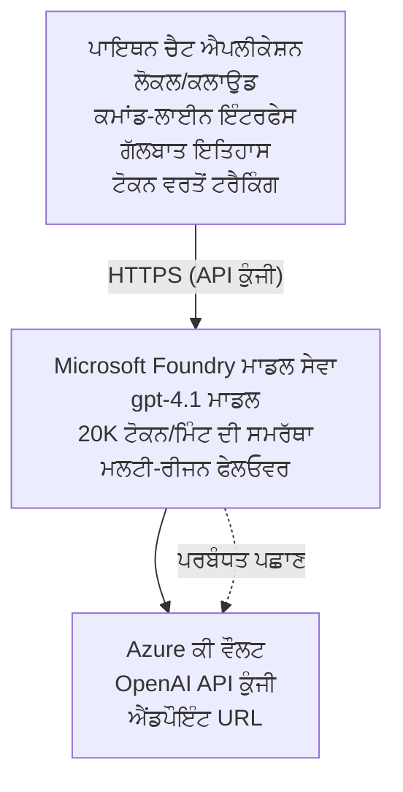

# Microsoft Foundry Models ਚੈਟ ਐਪਲੀਕੇਸ਼ਨ

**ਸਿੱਖਣ ਦਾ ਰਸਤਾ:** ਦਰਮਿਆਨਾ ⭐⭐ | **ਸਮਾਂ:** 35-45 minutes | **ਲਾਗਤ:** $50-200/month

ایک مکمل Microsoft Foundry Models چَیٹ ایپلیکیشن جو Azure Developer CLI (azd) ਦੀ ਵਰਤੋਂ ਨਾਲ ਡਿਪਲੋਇ ਕੀਤੀ ਗਈ ਹੈ। ਇਹ ਉਦਾਹਰਨ gpt-4.1 ਡਿਪਲੋਇਮੈਂਟ, ਸੁਰੱਖਿਅਤ API ਐਕਸੈਸ, ਅਤੇ ਇੱਕ ਸਧਾਰਣ ਚੈਟ ਇੰਟਰਫੇਸ ਦਿਖਾਉਂਦੀ ਹੈ।

## 🎯 ਤੁਸੀਂ ਕੀ ਸਿੱਖੋਗੇ

- gpt-4.1 ਮਾਡਲ ਨਾਲ Microsoft Foundry Models ਸੇਵਾ ਨੂੰ ਡਿਪਲੋਇ ਕਰੋ
- Key Vault ਨਾਲ OpenAI API ਚਾਬੀਆਂ ਨੂੰ ਸੁਰੱਖਿਅਤ ਕਰੋ
- Python ਨਾਲ ਇਕ ਸਧਾਰਣ ਚੈਟ ਇੰਟਰਫੇਸ ਬਣਾਓ
- ਟੋਕਨ ਵਰਤੋਂ ਅਤੇ ਲਾਗਤ ਦੀ ਨਿਗਰਾਨੀ ਕਰੋ
- ਰੇਟ ਲਿਮਿਟਿੰਗ ਅਤੇ ਗਲਤੀ ਸੰਭਾਲ ਲਾਗੂ ਕਰੋ

## 📦 ਕੀ ਸ਼ਾਮਿਲ ਹੈ

✅ **Microsoft Foundry Models Service** - gpt-4.1 ਮਾਡਲ ਡਿਪਲੋਇਮੈਂਟ  
✅ **Python Chat App** - ਸਧਾਰਣ ਕਮਾਂਡ-ਲਾਈਨ ਚੈਟ ਇੰਟਰਫੇਸ  
✅ **Key Vault Integration** - API ਚਾਬੀਆਂ ਦਾ ਸੁਰੱਖਿਅਤ ਸਟੋਰੇਜ  
✅ **ARM Templates** - ਇੰਫਰਾਸਟਰਕਚਰ ਐਜ਼ ਕੋਡ  
✅ **Cost Monitoring** - ਟੋਕਨ ਵਰਤੋਂ ਟ੍ਰੈਕਿੰਗ  
✅ **Rate Limiting** - ਕੋਟਾ ਖਤਮ ਹੋਣ ਤੋਂ ਰੋਕੋ  

## Architecture



## ਪੂਰਵ-ਆਵਸ਼ਕਤਾਵਾਂ

### ਜ਼ਰੂਰੀ

- **Azure Developer CLI (azd)** - [ਇੰਸਟਾਲ ਗਾਈਡ](https://learn.microsoft.com/azure/developer/azure-developer-cli/install-azd)
- **Azure subscription** with OpenAI access - [ਐਕਸੈਸ ਦੀ ਬੇਨਤੀ](https://aka.ms/oai/access)
- **Python 3.9+** - [ਪਾਇਥਨ ਇੰਸਟਾਲ ਕਰੋ](https://www.python.org/downloads/)

### ਲੋੜੀਂਦੀਆਂ ਚੀਜ਼ਾਂ ਦੀ ਜਾਂਚ

```bash
# azd ਵਰਜ਼ਨ ਚੈੱਕ ਕਰੋ (ਲੋੜ ਹੈ 1.5.0 ਜਾਂ ਉਸ ਤੋਂ ਉੱਚਾ)
azd version

# Azure ਲੌਗਿਨ ਦੀ ਪੁਸ਼ਟੀ ਕਰੋ
azd auth login

# Python ਵਰਜ਼ਨ ਚੈੱਕ ਕਰੋ
python --version  # ਜਾਂ python3 --version

# OpenAI ਪਹੁੰਚ ਦੀ ਪੁਸ਼ਟੀ ਕਰੋ (Azure ਪੋਰਟਲ ਵਿੱਚ ਚੈੱਕ ਕਰੋ)
az cognitiveservices account list-skus \
  --kind OpenAI \
  --location eastus
```

> **⚠️ ਮਹੱਤਵਪੂਰਨ:** Microsoft Foundry Models ਨੂੰ ਅਪਲੀਕੇਸ਼ਨ ਮਨਜ਼ੂਰੀ ਦੀ ਲੋੜ ਹੁੰਦੀ ਹੈ। ਜੇ ਤੁਸੀਂ ਅਰਜ਼ੀ ਨਹੀਂ ਦਿੱਤੀ, ਤਾਂ [aka.ms/oai/access](https://aka.ms/oai/access) 'ਤੇ ਜਾਓ। ਮਨਜ਼ੂਰੀ ਆਮਤੌਰ 'ਤੇ 1-2 ਕਾਰੋਬਾਰੀ ਦਿਨ ਲੈਂਦੀ ਹੈ।

## ⏱️ ਡਿਪਲੋਇਮੈਂਟ ਸਮਾਂ-ਰੇਖਾ

| ਫੇਜ਼ | ਮਿਆਦ | ਕੀ ਹੁੰਦਾ ਹੈ |
|-------|----------|--------------|
| ਤਿਆਰੀਆਂ ਦੀ ਜਾਂਚ | 2-3 minutes | OpenAI ਕੋਟੇ ਦੀ ਉਪਲਬਧਤਾ ਦੀ ਪੁਸ਼ਟੀ ਕਰੋ |
| ਇੰਫਰਾਸਟਰਕਚਰ ਡਿਪਲੋਇ ਕਰੋ | 8-12 minutes | OpenAI, Key Vault, ਅਤੇ ਮਾਡਲ ਡਿਪਲੋਇਮੈਂਟ ਬਣਾਓ |
| ਐਪਲੀਕੇਸ਼ਨ ਕੰਫਿਗਰ ਕਰੋ | 2-3 minutes | ਵਾਤਾਵਰਣ ਅਤੇ ਨਿਰਭਰਤਾਵਾਂ ਸੈਟ ਕਰੋ |
| **ਕੁੱਲ** | **12-18 minutes** | gpt-4.1 ਨਾਲ ਚੈਟ ਕਰਨ ਲਈ ਤਿਆਰ |

**ਨੋਟ:** ਪਹਿਲੀ ਵਾਰੀ OpenAI ਡਿਪਲੋਇਮੈਂਟ ਮਾਡਲ ਪ੍ਰੋਵਿਜ਼ਨਿੰਗ ਕਰਕੇ ਵਧੇਰੇ ਸਮਾਂ ਲੈ ਸਕਦੀ ਹੈ।

## ਤੁਰੰਤ ਸ਼ੁਰੂਆਤ

```bash
# ਉਦਾਹਰਨ ਵੱਲ ਜਾਓ
cd examples/azure-openai-chat

# ਮਾਹੌਲ ਨੂੰ ਸ਼ੁਰੂ ਕਰੋ
azd env new myopenai

# ਸਭ ਕੁਝ ਤੈਨਾਤ ਕਰੋ (ਬੁਨਿਆਦੀ ਢਾਂਚਾ + ਸੰਰਚਨਾ)
azd up
# ਤੁਹਾਨੂੰ ਪੁੱਛਿਆ ਜਾਵੇਗਾ:
# 1. Azure ਸਬਸਕ੍ਰਿਪਸ਼ਨ ਚੁਣੋ
# 2. OpenAI ਉਪਲਬਧਤਾ ਵਾਲਾ ਸਥਾਨ ਚੁਣੋ (ਉਦਾਹਰਨ: eastus, eastus2, westus)
# 3. ਤੈਨਾਤ ਲਈ 12-18 ਮਿੰਟ ਉਡੀਕ ਕਰੋ

# Python ਲਈ ਨਿਰਭਰਤਾਵਾਂ ਇੰਸਟਾਲ ਕਰੋ
pip install -r requirements.txt

# ਚੈਟ ਸ਼ੁਰੂ ਕਰੋ!
python chat.py
```

**ਉਮੀਦ ਕੀਤੀ ਆਉਟਪੁੱਟ:**
```
🤖 Microsoft Foundry Models Chat Application
Connected to: gpt-4.1 (eastus)
Type your message (or 'quit' to exit)

You: Hello! Tell me about Microsoft Foundry Models.
Assistant: Microsoft Foundry Models Service provides REST API access to OpenAI's powerful language models including gpt-4.1, GPT-3.5-Turbo, and Embeddings...

[Tokens used: 145 | Estimated cost: $0.0044]
```

## ✅ ਡਿਪਲੋਇਮੈਂਟ ਦੀ ਪੁਸ਼ਟੀ ਕਰੋ

### ਕਦਮ 1: Azure ਰਿਸੋਰਸ ਚੈੱਕ ਕਰੋ

```bash
# ਤੈਨਾਤ ਕੀਤੇ ਗਏ ਸੰਸਾਧਨਾਂ ਨੂੰ ਵੇਖੋ
azd show

# ਉਮੀਦ ਕੀਤੀ ਆਉਟਪੁੱਟ ਦਿਖਾਉਂਦੀ ਹੈ:
# - OpenAI ਸੇਵਾ: (ਸੰਸਾਧਨ ਦਾ ਨਾਮ)
# - ਕੀ ਵੌਲਟ: (ਸੰਸਾਧਨ ਦਾ ਨਾਮ)
# - ਤੈਨਾਤ: gpt-4.1
# - ਸਥਾਨ: eastus (ਜਾਂ ਤੁਹਾਡੇ ਚੁਣੇ ਹੋਏ ਰੀਜਨ)
```

### ਕਦਮ 2: OpenAI API ਦੀ ਟੈਸਟਿੰਗ ਕਰੋ

```bash
# OpenAI ਐਂਡਪੌਇੰਟ ਅਤੇ ਕੁੰਜੀ ਪ੍ਰਾਪਤ ਕਰੋ
OPENAI_ENDPOINT=$(azd env get-value AZURE_OPENAI_ENDPOINT)
OPENAI_KEY=$(azd env get-value AZURE_OPENAI_API_KEY)

# API ਕਾਲ ਦੀ ਜਾਂਚ ਕਰੋ
curl "$OPENAI_ENDPOINT/openai/deployments/gpt-4.1/chat/completions?api-version=2024-08-01-preview" \
  -H "Content-Type: application/json" \
  -H "api-key: $OPENAI_KEY" \
  -d '{
    "messages": [{"role": "user", "content": "Say hello!"}],
    "max_tokens": 50
  }'
```

**ਉਮੀਦ ਕੀਤੀ ਜਵਾਬ:**
```json
{
  "choices": [
    {
      "message": {
        "role": "assistant",
        "content": "Hello! How can I assist you today?"
      }
    }
  ],
  "usage": {
    "prompt_tokens": 8,
    "completion_tokens": 9,
    "total_tokens": 17
  }
}
```

### ਕਦਮ 3: Key Vault ਐਕਸੈਸ ਦੀ ਪੁਸ਼ਟੀ ਕਰੋ

```bash
# Key Vault ਵਿੱਚ ਸੀਕ੍ਰੇਟਸ ਦੀ ਸੂਚੀ ਕਰੋ
KV_NAME=$(azd env get-value AZURE_KEY_VAULT_NAME)

az keyvault secret list \
  --vault-name $KV_NAME \
  --query "[].name" \
  --output table
```

**ਉਮੀਦ ਕੀਤੀਆਂ ਸੀਕ੍ਰੇਟਸ:**
- `openai-api-key`
- `openai-endpoint`

**ਸਫਲਤਾ ਦੇ ਮਾਪਦੰਡ:**
- ✅ gpt-4.1 ਨਾਲ OpenAI ਸੇਵਾ ਡਿਪਲੋਇ ਕੀਤੀ ਗਈ
- ✅ API ਕਾਲ ਵੈਧ ਜਵਾਬ ਦਿੰਦੀ ਹੈ
- ✅ ਸੀਕ੍ਰੇਟਸ Key Vault ਵਿੱਚ ਸਟੋਰ ਕੀਤੇ ਗਏ ਹਨ
- ✅ ਟੋਕਨ ਵਰਤੋਂ ਟ੍ਰੈਕਿੰਗ ਕੰਮ ਕਰਦੀ ਹੈ

## ਪ੍ਰਾਜੈਕਟ ਸਰੰਚਨਾ

```
azure-openai-chat/
├── README.md                   ✅ This guide
├── azure.yaml                  ✅ AZD configuration
├── infra/                      ✅ Infrastructure as Code
│   ├── main.bicep             ✅ Main Bicep template
│   ├── main.parameters.json   ✅ Parameters
│   └── openai.bicep           ✅ OpenAI resource definition
├── src/                        ✅ Application code
│   ├── chat.py                ✅ Chat interface
│   ├── config.py              ✅ Configuration loader
│   └── requirements.txt       ✅ Python dependencies
└── .gitignore                  ✅ Git ignore rules
```

## ਐਪਲੀਕੇਸ਼ਨ ਫੀਚਰ

### Chat Interface (`chat.py`)

ਚੈਟ ਐਪਲੀਕੇਸ਼ਨ ਵਿੱਚ ਸ਼ਾਮਿਲ ਹਨ:

- **ਸੰਵਾਦ ਇਤਿਹਾਸ** - ਸੁਨੇਹਿਆਂ ਦੌਰਾਨ ਸੰਦਰਭ ਬਣਾਈ ਰੱਖਦਾ ਹੈ
- **ਟੋਕਨ ਗਿਣਤੀ** - ਵਰਤੋਂ ਟ੍ਰੈਕ ਕਰਦੀ ਹੈ ਅਤੇ ਲਾਗਤ ਦਾ ਅੰਦਾਜ਼ਾ ਲਗਾਉਂਦੀ ਹੈ
- **ਗਲਤੀ ਸੰਭਾਲ** - ਰੇਟ ਸੀਮਾਵਾਂ ਅਤੇ API ਤ੍ਰੁੱਟੀਆਂ ਨੂੰ ਸੋਹਣੇ ਢੰਗ ਨਾਲ ਸੰਭਾਲਦਾ ਹੈ
- **ਲਾਗਤ ਅੰਦਾਜ਼ਾ** - ਪ੍ਰਤੀ ਸੁਨੇਹੇ ਰੀਅਲ-ਟਾਈਮ ਲਾਗਤ ਗਣਨਾ
- **ਸਟਰੀਮਿੰਗ ਸਮਰਥਨ** - ਵਿਕਲਪਿਕ ਸਟਰੀਮਿੰਗ ਜਵਾਬ

### ਕਮਾਂਡਾਂ

ਚੈਟ ਕਰਦਿਆਂ, ਤੁਸੀਂ ਵਰਤ ਸਕਦੇ ਹੋ:
- `quit` or `exit` - ਸੈਸ਼ਨ ਖਤਮ ਕਰੋ
- `clear` - ਗੱਲਬਾਤ ਇਤਿਹਾਸ ਸਾਫ਼ ਕਰੋ
- `tokens` - ਕੁੱਲ ਟੋਕਨ ਵਰਤੋਂ ਦਿਖਾਓ
- `cost` - ਕੁੱਲ ਅੰਦਾਜ਼ੀ ਲਾਗਤ ਦਿਖਾਓ

### ਕੰਫਿਗਰੇਸ਼ਨ (`config.py`)

ਵਾਤਾਵਰਣ ਵੇਰੀਏਬਲਜ਼ ਤੋਂ ਕੰਫਿਗਰੇਸ਼ਨ ਲੋਡ ਕਰਦਾ ਹੈ:
```python
AZURE_OPENAI_ENDPOINT  # ਕੀ ਵੌਲਟ ਤੋਂ
AZURE_OPENAI_API_KEY   # ਕੀ ਵੌਲਟ ਤੋਂ
AZURE_OPENAI_MODEL     # ਡਿਫੌਲਟ: gpt-4.1
AZURE_OPENAI_MAX_TOKENS # ਡਿਫੌਲਟ: 800
```

## ਵਰਤੋਂ ਦੇ ਉਦਾਹਰਣ

### ਮੂਲ ਚੈਟ

```bash
python chat.py
```

### ਕਸਟਮ ਮਾਡਲ ਨਾਲ ਚੈਟ

```bash
export AZURE_OPENAI_MODEL=gpt-35-turbo
python chat.py
```

### ਸਟਰੀਮਿੰਗ ਨਾਲ ਚੈਟ

```bash
python chat.py --stream
```

### ਉਦਾਹਰਣ ਸੰਵਾਦ

```
You: Explain Microsoft Foundry Models Service in 3 sentences.
Assistant: Microsoft Foundry Models Service is Microsoft Azure's cloud platform offering 
that provides access to OpenAI's powerful language models. It enables developers 
to integrate capabilities like gpt-4.1 into their applications with enterprise-grade 
security and compliance. The service includes features for content filtering, 
abuse monitoring, and responsible AI practices.

[Tokens used: 89 | Estimated cost: $0.0027]

You: What models are available?
Assistant: Microsoft Foundry Models Service offers several model families including gpt-4.1 
(most capable), GPT-3.5-Turbo (faster and cost-effective), and Embeddings models 
for vector search. Each model has different capabilities, pricing, and token limits.

[Tokens used: 67 | Estimated cost: $0.0020]

Total session: 156 tokens | $0.0047
```

## ਲਾਗਤ ਪ੍ਰਬੰਧਨ

### ਟੋਕਨ ਮੁੱਲ (gpt-4.1)

| ਮਾਡਲ | ਇਨਪੁੱਟ (ਹਰ 1K ਟੋਕਨ ਲਈ) | ਆਉਟਪੁੱਟ (ਹਰ 1K ਟੋਕਨ ਲਈ) |
|-------|----------------------|------------------------|
| gpt-4.1 | $0.03 | $0.06 |
| GPT-3.5-Turbo | $0.0015 | $0.002 |

### ਅੰਦਾਜ਼ਨਤੀ ਮਾਸਿਕ ਲਾਗਤ

ਵਰਤੋਂ ਦੇ ਨਮੂਨੇ ਆਧਾਰਿਤ:

| ਵਰਤੋਂ ਦਾ ਪੱਧਰ | ਸੁਨੇਹੇ/ਦਿਨ | ਟੋਕਨ/ਦਿਨ | ਮਾਸਿਕ ਲਾਗਤ |
|-------------|--------------|------------|--------------|
| **ਹਲਕਾ** | 20 messages | 3,000 tokens | $3-5 |
| **ਮਧਯਮ** | 100 messages | 15,000 tokens | $15-25 |
| **ਭਾਰੀ** | 500 messages | 75,000 tokens | $75-125 |

**ਬੇਸ ਇੰਫਰਾਸਟਰਕਚਰ ਲਾਗਤ:** $1-2/month (Key Vault + minimal compute)

### ਲਾਗਤ ਘਟਾਉਣ ਦੇ ਸੁਝਾਅ

```bash
# 1. ਸਧਾਰਨ ਕੰਮਾਂ ਲਈ GPT-3.5-Turbo ਦੀ ਵਰਤੋਂ ਕਰੋ (20 ਗੁਣਾ ਸਸਤਾ)
export AZURE_OPENAI_MODEL=gpt-35-turbo

# 2. ਛੋਟੇ ਜਵਾਬਾਂ ਲਈ ਅਧਿਕਤਮ ਟੋਕਨ ਘਟਾਓ
export AZURE_OPENAI_MAX_TOKENS=400

# 3. ਟੋਕਨ ਦੀ ਵਰਤੋਂ ਦੀ ਨਿਗਰਾਨੀ ਕਰੋ
python chat.py --show-tokens

# 4. ਬਜਟ ਚੇਤਾਵਨੀਆਂ ਸੈੱਟ ਕਰੋ
az consumption budget create \
  --budget-name "openai-budget" \
  --amount 50 \
  --time-grain Monthly
```

## ਨਿਗਰਾਨੀ

### ਟੋਕਨ ਵਰਤੋਂ ਵੇਖੋ

```bash
# Azure ਪੋਰਟਲ ਵਿੱਚ:
# OpenAI ਰਿਸੋਰਸ → ਮੀਟਰਿਕਸ → "ਟੋਕਨ ਲੈਣ-ਦੇਣ" ਚੁਣੋ

# ਜਾਂ Azure CLI ਰਾਹੀਂ:
az monitor metrics list \
  --resource $(azd env get-value AZURE_OPENAI_RESOURCE_ID) \
  --metric "TokenTransaction" \
  --start-time $(date -u -d '1 hour ago' '+%Y-%m-%dT%H:%M:%S') \
  --interval PT1M
```

### API ਲੌਗ ਵੇਖੋ

```bash
# ਡਾਇਗਨੋਸਟਿਕ ਲਾਗਾਂ ਨੂੰ ਸਟ੍ਰੀਮ ਕਰੋ
az monitor diagnostic-settings create \
  --resource $(azd env get-value AZURE_OPENAI_RESOURCE_ID) \
  --name openai-logs \
  --logs '[{"category": "Audit", "enabled": true}]' \
  --workspace $(azd env get-value LOG_ANALYTICS_WORKSPACE_ID)

# ਲਾਗਾਂ ਦੀ ਪੁੱਛਗਿੱਛ
az monitor log-analytics query \
  --workspace $(azd env get-value LOG_ANALYTICS_WORKSPACE_ID) \
  --analytics-query "AzureDiagnostics | where Category == 'Audit' | top 10 by TimeGenerated"
```

## ਸਮੱਸਿਆ ਨਿਵਾਰਣ

### ਸਮੱਸਿਆ: "Access Denied" Error

**ਲੱਛਣ:** API ਨੂੰ ਕਾਲ ਕਰਦੇ ਸਮੇਂ 403 Forbidden

**ਹੱਲ:**
```bash
# 1. ਯਕੀਨੀ ਬਣਾਓ ਕਿ OpenAI ਦੀ ਪਹੁੰਚ ਮਨਜ਼ੂਰ ਹੈ
az cognitiveservices account show \
  --name $(azd env get-value AZURE_OPENAI_NAME) \
  --resource-group $(azd env get-value AZURE_RESOURCE_GROUP)

# 2. ਜਾਂਚੋ ਕਿ API ਕੁੰਜੀ ਸਹੀ ਹੈ
azd env get-value AZURE_OPENAI_API_KEY

# 3. ਐਂਡਪੌਇੰਟ URL ਦੇ ਫਾਰਮੈਟ ਦੀ ਜਾਂਚ ਕਰੋ
azd env get-value AZURE_OPENAI_ENDPOINT
# ਇਹ ਹੋਣਾ ਚਾਹੀਦਾ ਹੈ: https://[name].openai.azure.com/
```

### ਸਮੱਸਿਆ: "Rate Limit Exceeded"

**ਲੱਛਣ:** 429 Too Many Requests

**ਹੱਲ:**
```bash
# 1. ਮੌਜੂਦਾ ਕੋਟਾ ਜਾਂਚੋ
az cognitiveservices account deployment show \
  --name $(azd env get-value AZURE_OPENAI_NAME) \
  --resource-group $(azd env get-value AZURE_RESOURCE_GROUP) \
  --deployment-name gpt-4.1

# 2. ਕੋਟਾ ਵਧਾਉਣ ਦੀ ਬੇਨਤੀ ਕਰੋ (ਜੇ ਲੋੜ ਹੋਵੇ)
# ਜਾਓ Azure ਪੋਰਟਲ → OpenAI ਰਿਸੋਰਸ → ਕੋਟੇ → ਵਾਧੇ ਦੀ ਬੇਨਤੀ

# 3. ਰੀਟ੍ਰਾਈ ਲੌਜਿਕ ਲਾਗੂ ਕਰੋ (ਪਹਿਲਾਂ ਹੀ chat.py ਵਿੱਚ ਹੈ)
# ਐਪਲੀਕੇਸ਼ਨ ਆਟੋਮੈਟਿਕ ਤੌਰ ਤੇ ਇਕਸਪੋਨੈਂਸ਼ੀਅਲ ਬੈਕਆਫ ਨਾਲ ਦੁਬਾਰਾ ਕੋਸ਼ਿਸ਼ ਕਰਦੀ ਹੈ
```

### ਸਮੱਸਿਆ: "Model Not Found"

**ਲੱਛਣ:** ਡਿਪਲੋਇਮੈਂਟ ਲਈ 404 error

**ਹੱਲ:**
```bash
# 1. ਉਪਲਬਧ ਡਿਪਲੌਇਮੈਂਟਾਂ ਦੀ ਸੂਚੀ ਬਣਾਓ
az cognitiveservices account deployment list \
  --name $(azd env get-value AZURE_OPENAI_NAME) \
  --resource-group $(azd env get-value AZURE_RESOURCE_GROUP)

# 2. ਵਾਤਾਵਰਣ ਵਿੱਚ ਮਾਡਲ ਦਾ ਨਾਮ ਜਾਂਚੋ
echo $AZURE_OPENAI_MODEL

# 3. ਡਿਪਲੌਇਮੈਂਟ ਦਾ ਸਹੀ ਨਾਮ ਅਪਡੇਟ ਕਰੋ
export AZURE_OPENAI_MODEL=gpt-4.1  # ਜਾਂ gpt-35-turbo
```

### ਸਮੱਸਿਆ: High Latency

**ਲੱਛਣ:** ਧੀਮੇ ਜਵਾਬ ਸਮੇਂ (>5 seconds)

**ਹੱਲ:**
```bash
# 1. ਖੇਤਰੀ ਲੈਟੈਂਸੀ ਚੈੱਕ ਕਰੋ
# ਉਪਭੋਗਤਿਆਂ ਦੇ ਸਭ ਤੋਂ ਨੇੜਲੇ ਖੇਤਰ ਵਿੱਚ ਤੈਨਾਤ ਕਰੋ

# 2. ਤੇਜ਼ ਜਵਾਬਾਂ ਲਈ max_tokens ਘਟਾਓ
export AZURE_OPENAI_MAX_TOKENS=400

# 3. ਬਿਹਤਰ ਉਪਭੋਗਤਾ ਅਨੁਭਵ ਲਈ ਸਟ੍ਰੀਮਿੰਗ ਵਰਤੋ
python chat.py --stream
```

## ਸੁਰੱਖਿਆ ਲਈ ਸਭ ਤੋਂ ਵਧੀਆ ਅਭਿਆਸ

### 1. API ਕੁੰਜੀਆਂ ਦੀ ਰੱਖਿਆ ਕਰੋ

```bash
# ਕਦੇ ਵੀ ਕੁੰਜੀਆਂ ਸੋਰਸ ਕੰਟਰੋਲ ਵਿੱਚ ਕਮੀਟ ਨਾ ਕਰੋ
# Key Vault ਦੀ ਵਰਤੋਂ ਕਰੋ (ਪਹਿਲਾਂ ਹੀ ਸੰਰਚਿਤ ਹੈ)

# ਕੁੰਜੀਆਂ ਨੂੰ ਨਿਯਮਤ ਤੌਰ ਤੇ ਬਦਲਦੇ ਰਹੋ
az cognitiveservices account keys regenerate \
  --name $(azd env get-value AZURE_OPENAI_NAME) \
  --resource-group $(azd env get-value AZURE_RESOURCE_GROUP) \
  --key-name key1
```

### 2. ਸਮੱਗਰੀ ਫਿਲਟਰਨਗ ਲਾਗੂ ਕਰੋ

```python
# Microsoft Foundry ਮਾਡਲਾਂ ਵਿੱਚ ਬਿਲਟ-ਇਨ ਸਮੱਗਰੀ ਫਿਲਟਰਿੰਗ ਸ਼ਾਮਲ ਹੈ
# Azure ਪੋਰਟਲ ਵਿੱਚ ਸੰਰਚਨਾ ਕਰੋ:
# OpenAI ਰਿਸੋਰਸ → ਸਮੱਗਰੀ ਫਿਲਟਰ → ਕਸਟਮ ਫਿਲਟਰ ਬਣਾਓ

# ਸ਼੍ਰੇਣੀਆਂ: ਨਫ਼ਰਤ, ਯੌਨਕ, ਹਿੰਸਾ, ਆਤਮ-ਹਾਨੀ
# ਪੱਧਰ: ਘੱਟ, ਦਰਮਿਆਨਾ, ਉੱਚ ਫਿਲਟਰੇਸ਼ਨ
```

### 3. ਮੈਨੇਜ ਕੀਤੀ ਪਛਾਣ ਵਰਤੋਂ (ਪ੍ਰੋਡਕਸ਼ਨ)

```bash
# ਉਤਪਾਦਨ ਦੇ ਤੈਨਾਤੀਆਂ ਲਈ, ਮੈਨੇਜਡ ਆਈਡੈਂਟੀਟੀ ਦੀ ਵਰਤੋਂ ਕਰੋ
# API ਕੁੰਜੀਆਂ ਦੀ ਥਾਂ (ਇਸ ਲਈ ਐਜ਼ੂਅਰ 'ਤੇ ਐਪ ਹੋਸਟ ਕਰਨ ਦੀ ਲੋੜ ਹੁੰਦੀ ਹੈ)

# infra/openai.bicep ਨੂੰ ਅਪਡੇਟ ਕਰੋ ਤਾਂ ਕਿ ਇਹ ਸ਼ਾਮਿਲ ਹੋਵੇ:
# identity: { type: 'SystemAssigned' }
```

## ਵਿਕਾਸ

### ਲੋਕਲ ਵਿੱਖੇ ਚਲਾਓ

```bash
# ਨਿਰਭਰਤਾਵਾਂ ਸਥਾਪਿਤ ਕਰੋ
pip install -r src/requirements.txt

# ਇਨਵਾਇਰਨਮੈਂਟ ਵੇਰੀਏਬਲ ਸੈੱਟ ਕਰੋ
export AZURE_OPENAI_ENDPOINT="https://[name].openai.azure.com/"
export AZURE_OPENAI_API_KEY="your-api-key"
export AZURE_OPENAI_MODEL="gpt-4.1"

# ਐਪਲੀਕੇਸ਼ਨ ਚਲਾਓ
python src/chat.py
```

### ਟੈਸਟ ਚਲਾਓ

```bash
# ਟੈਸਟ ਲਈ ਨਿਰਭਰਤਾਵਾਂ ਇੰਸਟਾਲ ਕਰੋ
pip install pytest pytest-cov

# ਟੈਸਟ ਚਲਾਓ
pytest tests/ -v

# ਕਵਰੇਜ ਦੇ ਨਾਲ
pytest tests/ --cov=src --cov-report=html
```

### ਮਾਡਲ ਡਿਪਲੋਇਮੈਂਟ ਅਪਡੇਟ ਕਰੋ

```bash
# ਵੱਖਰਾ ਮਾਡਲ ਵਰਜ਼ਨ ਤੈਨਾਤ ਕਰੋ
az cognitiveservices account deployment create \
  --name $(azd env get-value AZURE_OPENAI_NAME) \
  --resource-group $(azd env get-value AZURE_RESOURCE_GROUP) \
  --deployment-name gpt-35-turbo \
  --model-name gpt-35-turbo \
  --model-version "0613" \
  --model-format OpenAI \
  --sku-capacity 20 \
  --sku-name "Standard"
```

## ਸਾਫ਼-ਸੁਥਰਾ ਕਰੋ

```bash
# ਸਾਰੇ Azure ਰਿਸੋਰਸ ਮਿਟਾਓ
azd down --force --purge

# ਇਹ ਹਟਾਏਗਾ:
# - OpenAI ਸੇਵਾ
# - Key Vault (90 ਦਿਨਾਂ ਦੀ ਸੌਫਟ ਡਿਲੀਟ ਸਮੇਤ)
# - ਰਿਸੋਰਸ ਗਰੁੱਪ
# - ਸਾਰੇ ਡਿਪਲੋਇਮੈਂਟ ਅਤੇ ਕਨਫਿਗਰੇਸ਼ਨ
```

## ਅਗਲੇ ਕਦਮ

### ਇਸ ਉਦਾਹਰਨ ਨੂੰ ਵਿਸਤਾਰ ਕਰੋ

1. **ਵੈੱਬ ਇੰਟਰਫੇਸ ਸ਼ਾਮਿਲ ਕਰੋ** - React/Vue ਫਰੰਟਏਂਡ ਬਣਾਓ
   ```bash
   # azure.yaml ਵਿੱਚ ਫਰੰਟਏਂਡ ਸੇਵਾ ਜੋੜੋ
   # Azure Static Web Apps 'ਤੇ ਡਿਪਲੋਏ ਕਰੋ
   ```

2. **RAG ਲਾਗੂ ਕਰੋ** - ਦਸਤਾਵੇਜ਼ ਖੋਜ ਲਈ Azure AI Search ਸ਼ਾਮਿਲ ਕਰੋ
   ```python
   # Azure AI Search ਨੂੰ ਇਕੀਕ੍ਰਿਤ ਕਰੋ
   # ਦਸਤਾਵੇਜ਼ ਅਪਲੋਡ ਕਰੋ ਅਤੇ ਵੈਕਟਰ ਇੰਡੈਕਸ ਬਣਾਓ
   ```

3. **ਫੰਕਸ਼ਨ ਕਾਲਿੰਗ ਸ਼ਾਮਿਲ ਕਰੋ** - ਟੂਲ ਦੀ ਵਰਤੋਂ ਯੋਗ ਬਣਾਓ
   ```python
   # chat.py ਵਿੱਚ ਫੰਕਸ਼ਨਾਂ ਨੂੰ ਪਰਿਭਾਸ਼ਿਤ ਕਰੋ
   # gpt-4.1 ਨੂੰ ਬਾਹਰੀ APIs ਨੂੰ ਕਾਲ ਕਰਨ ਦੀ ਇਜਾਜ਼ਤ ਦਿਓ
   ```

4. **ਮਲਟੀ-ਮਾਡਲ ਸਮਰਥਨ** - ਕਈ ਮਾਡਲ ਡਿਪਲੋਇ ਕਰੋ
   ```bash
   # gpt-35-turbo ਅਤੇ embeddings ਮਾਡਲ ਸ਼ਾਮِل ਕਰੋ
   # ਮਾਡਲ ਰੂਟਿੰਗ ਲਾਜਿਕ ਨੂੰ ਲਾਗੂ ਕਰੋ
   ```

### ਸੰਬੰਧਤ ਉਦਾਹਰਣ

- **[ਰਿਟੇਲ ਮਲਟੀ-ਏਜੈਂਟ](../retail-scenario.md)** - ਅਡਵਾਂਸਡ ਮੁਲਟੀ-ਏਜੈਂਟ ਆਰਕੀਟੈਕਚਰ
- **[ਡੇਟਾਬੇਸ ਐਪ](../../../../examples/database-app)** - ਸਥਾਈ ਸਟੋਰੇਜ ਸ਼ਾਮਿਲ ਕਰੋ
- **[ਕੰਟੇਨਰ ਐਪਸ](../../../../examples/container-app)** - ਕੰਟੇਨਰ ਬਣਾਏ ਸੇਵਾ ਵਜੋਂ ਡਿਪਲੋਇ ਕਰੋ

### ਸਿੱਖਣ ਲਈ ਸਰੋਤ

- 📚 [AZD ਬਿਗਿਨਰਜ਼ ਕੋਰਸ](../../README.md) - ਮੁੱਖ ਕੋਰਸ ਹੋਮ
- 📚 [Microsoft Foundry Models Documentation](https://learn.microsoft.com/azure/ai-services/openai/) - ਆਧਿਕਾਰਕ ਦਸਤਾਵੇਜ਼
- 📚 [OpenAI API Reference](https://platform.openai.com/docs/api-reference) - API ਵਿਵਰਣ
- 📚 [Responsible AI](https://www.microsoft.com/ai/responsible-ai) - ਸਭ ਤੋਂ ਵਧੀਆ ਅਭਿਆਸ

## ਵਾਧੂ ਸਰੋਤ

### ਦਸਤਾਵੇਜ਼
- **[Microsoft Foundry Models Service](https://learn.microsoft.com/azure/ai-services/openai/)** - ਪੂਰਾ ਗਾਈਡ
- **[gpt-4.1 Models](https://learn.microsoft.com/azure/ai-services/openai/concepts/models)** - ਮਾਡਲ ਸਮਰੱਥਾਵਾਂ
- **[Content Filtering](https://learn.microsoft.com/azure/ai-services/openai/concepts/content-filter)** - ਸੁਰੱਖਿਆ ਫੀਚਰ
- **[Azure Developer CLI](https://learn.microsoft.com/azure/developer/azure-developer-cli/)** - azd ਰੈਫਰੰਸ

### ਟਿਊਟੋਰੀਅਲ
- **[OpenAI Quickstart](https://learn.microsoft.com/azure/ai-services/openai/quickstart)** - ਪਹਿਲੀ ਡਿਪਲੋਇਮੈਂਟ
- **[Chat Completions](https://learn.microsoft.com/azure/ai-services/openai/how-to/chatgpt)** - ਚੈਟ ਐਪ ਬਣਾਉਣਾ
- **[Function Calling](https://learn.microsoft.com/azure/ai-services/openai/how-to/function-calling)** - ਉੱਨਤ ਫੀਚਰ

### ਟੂਲ
- **[Microsoft Foundry Models Studio](https://oai.azure.com/)** - ਵੈੱਬ-ਅਧਾਰਤ ਪਲੇਗਰਾਉਂਡ
- **[Prompt Engineering Guide](https://platform.openai.com/docs/guides/prompt-engineering)** - ਵਧੀਆ ਪ੍ਰਾਂਪਟ ਲਿਖਣ ਲਈ
- **[Token Calculator](https://platform.openai.com/tokenizer)** - ਟੋਕਨ ਵਰਤੋਂ ਦਾ ਅੰਦਾਜ਼ਾ ਲਗਾਓ

### ਕਮਿਊਨਟੀ
- **[Azure AI Discord](https://discord.gg/azure)** - ਕਮਿਊਨਟੀ ਤੋਂ ਮਦਦ ਲਵੋ
- **[GitHub Discussions](https://github.com/Azure-Samples/openai/discussions)** - Q&A ਫੋਰਮ
- **[Azure Blog](https://azure.microsoft.com/blog/tag/azure-openai-service/)** - ਤਾਜ਼ਾ ਅੱਪਡੇਟਸ

---

**🎉 ਸਫਲਤਾ!** ਤੁਸੀਂ Microsoft Foundry Models ਡਿਪਲੋਇ ਕੀਤਾ ਅਤੇ ਇਕ ਕੰਮ ਕਰ ਰਹੀ ਚੈਟ ਐਪਲੀਕੇਸ਼ਨ ਬਣਾਈ ਹੈ। gpt-4.1 ਦੀਆਂ ਸਮਰੱਥਾਵਾਂ ਨੂੰ ਖੋਜਣਾ ਸ਼ੁਰੂ ਕਰੋ ਅਤੇ ਵੱਖ-ਵੱਖ ਪ੍ਰਾਂਪਟਾਂ ਅਤੇ ਵਰਤੋਂ ਕੇਸਾਂ ਨਾਲ ਪ੍ਰਯੋਗ ਕਰੋ।

**ਸਵਾਲ ਹਨ?** [ਇੱਕ ਇਸ਼ੂ ਖੋਲੋ](https://github.com/microsoft/AZD-for-beginners/issues) ਜਾਂ [FAQ](../../resources/faq.md) ਨੂੰ ਚੈੱਕ ਕਰੋ

**ਲਾਗਤ ਚੇਤਾਵਨੀ:** ਟੈਸਟਿੰਗ ਖ਼ਤਮ ਹੋਣ 'ਤੇ ongoing ਚਾਰਜਜ਼ ਤੋਂ ਬਚਣ ਲਈ `azd down` ਚਲਾਉਣਾ ਯਾਦ ਰੱਖੋ (~$50-100/month for active usage).

---

<!-- CO-OP TRANSLATOR DISCLAIMER START -->
**ਅਸਵੀਕਾਰੋਪਣ**:
ਇਸ ਦਸਤਾਵੇਜ਼ ਦਾ ਅਨੁਵਾਦ ਏਆਈ ਅਨੁਵਾਦ ਸੇਵਾ [Co-op Translator](https://github.com/Azure/co-op-translator) ਦੀ ਵਰਤੋਂ ਕਰਕੇ ਕੀਤਾ ਗਿਆ ਹੈ। ਜਦੋਂ ਕਿ ਅਸੀਂ ਸਹੀਤਾਵਾਂ ਲਈ ਯਤਨਸ਼ੀਲ ਹਾਂ, ਕਿਰਪਾ ਕਰਕੇ ਧਿਆਨ ਰੱਖੋ ਕਿ ਸਵੈਚਾਲਿਤ ਅਨੁਵਾਦਾਂ ਵਿੱਚ ਗਲਤੀਆਂ ਜਾਂ ਅਸਮੱਤਿਆਵਾਂ ਹੋ ਸਕਦੀਆਂ ਹਨ। ਮੂਲ ਦਸਤਾਵੇਜ਼ ਆਪਣੀ ਮੂਲ ਭਾਸ਼ਾ ਵਿੱਚ ਅਧਿਕਾਰਕ ਸਰੋਤ ਮੰਨਿਆ ਜਾਣਾ ਚਾਹੀਦਾ ਹੈ। ਜਰੂਰੀ ਜਾਣਕਾਰੀ ਲਈ, ਪੇਸ਼ੇਵਰ ਮਨੁੱਖੀ ਅਨੁਵਾਦ ਦੀ ਸਿਫ਼ਾਰਸ਼ ਕੀਤੀ ਜਾਂਦੀ ਹੈ। ਅਸੀਂ ਇਸ ਅਨੁਵਾਦ ਦੇ ਉਪਯੋਗ ਤੋਂ ਪੈਦਾ ਹੋਣ ਵਾਲੀਆਂ ਕਿਸੇ ਵੀ ਗਲਤਫਹਿਮੀਆਂ ਜਾਂ ਗਲਤ ਵਿਆਖਿਆਵਾਂ ਲਈ ਜਵਾਬਦੇਹ ਨਹੀਂ ਹਾਂ।
<!-- CO-OP TRANSLATOR DISCLAIMER END -->