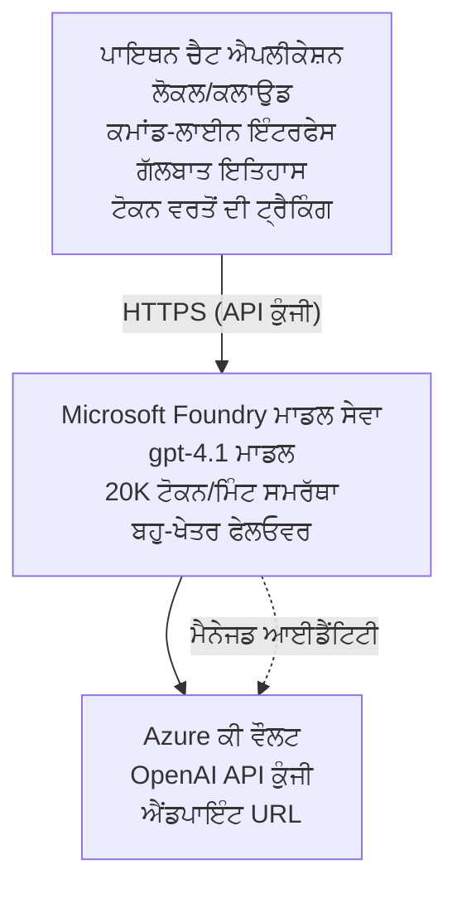

# ਮਾਈਕ੍ਰੋਸੋਫਟ ਫਾਊਂਡਰੀ ਮਾਡਲਜ਼ ਚੈਟ ਐਪਲੀਕੇਸ਼ਨ

**ਸਿੱਖਣ ਦਾ ਰਸਤਾ:** ਮਧਿਅਮ ⭐⭐ | **ਸਮਾਂ:** 35-45 ਮਿੰਟ | **ਲਾਗਤ:** $50-200/ਮਹੀਨਾ

ਇੱਕ ਪੂਰੀ Microsoft Foundry Models ਚੈਟ ਐਪਲੀਕੇਸ਼ਨ ਜੋ Azure Developer CLI (azd) ਦੀ ਵਰਤੋਂ ਨਾਲ ਤਾਇਨਾਤ ਕੀਤੀ ਗਈ ਹੈ। ਇਹ ਉਦਾਹਰਣ gpt-4.1 ਦੀ ਤਾਇਨਾਤ, ਸੁਰੱਖਿਅਤ API ਪਹੁੰਚ, ਅਤੇ ਇੱਕ ਸਾਦਾ ਚੈਟ ਇੰਟਰਫੇਸ ਦਰਸਾਉਂਦੀ ਹੈ।

## 🎯 ਤੁਸੀਂ ਇਹ ਸਿੱਖੋਗੇ

- Microsoft Foundry Models ਸੇਵਾ gpt-4.1 ਮਾਡਲ ਨਾਲ ਤਾਇਨਾਤ ਕਰਨਾ
- Key Vault ਨਾਲ OpenAI API ਕੀਜ਼ ਸੁਰੱਖਿਅਤ ਕਰਨੇ
- Python ਨਾਲ ਇੱਕ ਸਾਦਾ ਚੈਟ ਇੰਟਰਫੇਸ ਬਣਾਉਣਾ
- ਟੋਕਨ ਉਪਯੋਗ ਅਤੇ ਖਰਚੇ ਨਿਗਰਾਨੀ ਕਰਨਾ
- ਰੇਟ ਲਿਮਿਟਿੰਗ ਅਤੇ ਐਰਰ ਹੈਂਡਲਿੰਗ ਲਾਗੂ ਕਰਨਾ

## 📦 ਕੀ ਸ਼ਾਮਲ ਹੈ

✅ **Microsoft Foundry Models ਸੇਵਾ** - gpt-4.1 ਮਾਡਲ ਤਾਇਨਾਤ  
✅ **Python ਚੈਟ ਐਪ** - ਸਾਦਾ ਕਮਾਂਡ-ਲਾਈਨ ਚੈਟ ਇੰਟਰਫੇਸ  
✅ **Key Vault ਇੰਟੀਗ੍ਰੇਸ਼ਨ** - API ਕੀਜ਼ ਦੀ ਸੁਰੱਖਿਅਤ ਸਟੋਰੇਜ  
✅ **ARM ਟੈਮਪਲੇਟਸ** - ਕੋਡ ਵਜੋਂ ਪੂਰਾ ਇੰਫ੍ਰਾਸਟਰੱਕਚਰ  
✅ **ਲਾਗਤ ਨਿਗਰਾਨੀ** - ਟੋਕਨ ਉਪਯੋਗ ਟ੍ਰੈਕਿੰਗ  
✅ **ਰੇਟ ਲਿਮਿਟਿੰਗ** - ਕੋਟਾ ਖਤਮ ਹੋਣ ਤੋਂ ਰੋਕੋ  

## Architecture


## ਪੂਰਵ-ਸ਼ਰਤਾਂ

### ਜ਼ਰੂਰੀ

- **Azure Developer CLI (azd)** - [Install guide](https://learn.microsoft.com/azure/developer/azure-developer-cli/install-azd)
- **Azure subscription** with OpenAI access - [Request access](https://aka.ms/oai/access)
- **Python 3.9+** - [Install Python](https://www.python.org/downloads/)

### ਪੂਰਵ-ਸ਼ਰਤਾਂ ਦੀ ਜਾਂਚ

```bash
# azd ਵਰਜ਼ਨ ਚੈੱਕ ਕਰੋ (ਲੋੜ: 1.5.0 ਜਾਂ ਉੱਪਰ)
azd version

# Azure ਲੌਗਇਨ ਦੀ ਪੁਸ਼ਟੀ ਕਰੋ
azd auth login

# Python ਵਰਜ਼ਨ ਚੈੱਕ ਕਰੋ
python --version  # ਜਾਂ python3 --version

# OpenAI ਪਹੁੰਚ ਦੀ ਪੁਸ਼ਟੀ ਕਰੋ (Azure ਪੋਰਟਲ ਵਿੱਚ ਜਾਂਚੋ)
az cognitiveservices account list-skus \
  --kind OpenAI \
  --location eastus
```

> **⚠️ ਮਹੱਤਵਪੂਰਨ:** Microsoft Foundry Models ਲਈ ਅਰਜ਼ੀ ਦੀ ਮਨਜ਼ੂਰੀ ਲੋੜੀਂਦੀ ਹੈ। ਜੇ ਤੁਸੀਂ ਅਰਜ਼ੀ ਨਹੀਂ ਦਿੱਤੀ, ਤਾਂ [aka.ms/oai/access](https://aka.ms/oai/access) ਨੂੰ ਵੇਖੋ। ਮਨਜ਼ੂਰੀ ਆਮ ਤੌਰ 'ਤੇ 1-2 ਕਾਰੋਬਾਰੀ ਦਿਨ ਲੈ ਸਕਦੀ ਹੈ।

## ⏱️ ਤਾਇਨਾਤ ਸਮਾਂ-ਰੇਖਾ

| ਚਰਣ | ਸਮਾਂ | ਕੀ ਹੁੰਦਾ ਹੈ |
|-------|----------|--------------|
| ਪੂਰਵ-ਸ਼ਰਤਾਂ ਦੀ ਜਾਂਚ | 2-3 ਮਿੰਟ | OpenAI ਕੋਟਾ ਉਪਲਬਧਤਾ ਦੀ ਜਾਂਚ |
| ਇੰਫ੍ਰਾਸਟਰੱਕਚਰ ਤਾਇਨਾਤ | 8-12 ਮਿੰਟ | OpenAI, Key Vault, ਮਾਡਲ ਤਾਇਨਾਤ ਬਣਾਓ |
| ਐਪਲੀਕੇਸ਼ਨ ਸੰਰਚਨਾ | 2-3 ਮਿੰਟ | ਇੰਵਾਇਰੋਨਮੈਂਟ ਅਤੇ ਨਿਰਭਰਤਾਵਾਂ ਸੈਟ ਕਰੋ |
| **ਕੁੱਲ** | **12-18 ਮਿੰਟ** | gpt-4.1 ਨਾਲ ਗੱਲ ਕਰਨ ਲਈ ਤਿਆਰ |

**ਨੋਟ:** ਪਹਿਲੀ ਵਾਰੀ OpenAI ਤਾਇਨਾਤ ਮਾਡਲ ਪ੍ਰੋਵਿਜ਼ਨਿੰਗ ਕਰਕੇ ਵੱਧ ਸਮਾਂ ਲੈ ਸਕਦੀ ਹੈ।

## ਸ਼ੁਰੂਆਤ

```bash
# ਉਦਾਹਰਨ 'ਤੇ ਜਾਓ
cd examples/azure-openai-chat

# ਵਾਤਾਵਰਨ ਸ਼ੁਰੂ ਕਰੋ
azd env new myopenai

# ਸਭ ਕੁਝ ਤੈਨਾਤ ਕਰੋ (ਢਾਂਚਾ + ਸੰਰਚਨਾ)
azd up
# ਤੁਹਾਨੂੰ ਪੁੱਛਿਆ ਜਾਵੇਗਾ:
# 1. Azure ਸਬਸਕ੍ਰਿਪਸ਼ਨ ਚੁਣੋ
# 2. ਉਹ ਸਥਾਨ ਚੁਣੋ ਜਿੱਥੇ OpenAI ਉਪਲਬਧ ਹੈ (ਉਦਾਹਰਨ ਲਈ: eastus, eastus2, westus)
# 3. ਤੈਨਾਤ ਕਰਨ ਲਈ 12-18 ਮਿੰਟ ਉਡੀਕ ਕਰੋ

# Python ਦੀਆਂ ਨਿਰਭਰਤਾਵਾਂ ਇੰਸਟਾਲ ਕਰੋ
pip install -r requirements.txt

# ਗੱਲਬਾਤ ਸ਼ੁਰੂ ਕਰੋ!
python chat.py
```

**ਉਮੀਦ ਕੀਤੀ ਆਉਟਪੁੱਟ:**
```
🤖 Microsoft Foundry Models Chat Application
Connected to: gpt-4.1 (eastus)
Type your message (or 'quit' to exit)

You: Hello! Tell me about Microsoft Foundry Models.
Assistant: Microsoft Foundry Models Service provides REST API access to OpenAI's powerful language models including gpt-4.1, GPT-3.5-Turbo, and Embeddings...

[Tokens used: 145 | Estimated cost: $0.0044]
```

## ✅ ਤਾਇਨਾਤ ਦੀ ਪੁਸ਼ਟੀ

### ਕਦਮ 1: Azure ਰਿਸੋਰਸ ਚੈੱਕ ਕਰੋ

```bash
# ਤੈਨਾਤ ਕੀਤੇ ਸਰੋਤ ਵੇਖੋ
azd show

# ਉਮੀਦ ਕੀਤੀ ਆਉਟਪੁੱਟ ਦਿਖਾਉਂਦੀ ਹੈ:
# - OpenAI ਸੇਵਾ: (ਸਰੋਤ ਦਾ ਨਾਮ)
# - ਕੀ ਵੌਲਟ: (ਸਰੋਤ ਦਾ ਨਾਮ)
# - ਡਿਪਲੋਇਮੈਂਟ: gpt-4.1
# - ਸਥਾਨ: eastus (ਜਾਂ ਤੁਹਾਡੇ ਚੁਣੇ ਹੋਏ ਖੇਤਰ)
```

### ਕਦਮ 2: OpenAI API ਦੀ ਜਾਂਚ

```bash
# OpenAI ਐਂਡਪੋਇੰਟ ਅਤੇ ਕੀ ਪ੍ਰਾਪਤ ਕਰੋ
OPENAI_ENDPOINT=$(azd env get-value AZURE_OPENAI_ENDPOINT)
OPENAI_KEY=$(azd env get-value AZURE_OPENAI_API_KEY)

# API ਕਾਲ ਦੀ ਜਾਂਚ ਕਰੋ
curl "$OPENAI_ENDPOINT/openai/deployments/gpt-4.1/chat/completions?api-version=2024-08-01-preview" \
  -H "Content-Type: application/json" \
  -H "api-key: $OPENAI_KEY" \
  -d '{
    "messages": [{"role": "user", "content": "Say hello!"}],
    "max_tokens": 50
  }'
```

**ਉਮੀਦ ਕੀਤੀ ਪ੍ਰਤੀਕ੍ਰਿਆ:**
```json
{
  "choices": [
    {
      "message": {
        "role": "assistant",
        "content": "Hello! How can I assist you today?"
      }
    }
  ],
  "usage": {
    "prompt_tokens": 8,
    "completion_tokens": 9,
    "total_tokens": 17
  }
}
```

### ਕਦਮ 3: Key Vault ਪਹੁੰਚ ਦੀ ਜਾਂਚ

```bash
# ਕੀ ਵੌਲਟ ਵਿੱਚ ਗੁਪਤ ਜਾਣਕਾਰੀਆਂ ਦੀ ਸੂਚੀ ਦਿਖਾਓ
KV_NAME=$(azd env get-value AZURE_KEY_VAULT_NAME)

az keyvault secret list \
  --vault-name $KV_NAME \
  --query "[].name" \
  --output table
```

**ਉਮੀਦ ਕੀਤੀਆਂ ਸਿਕ੍ਰਿਟਸ:**
- `openai-api-key`
- `openai-endpoint`

**ਸਫਲਤਾ ਮਾਪਦੰਡ:**
- ✅ OpenAI ਸੇਵਾ gpt-4.1 ਨਾਲ ਤਾਇਨਾਤ ਕੀਤੀ ਗਈ
- ✅ API ਕਾਲ ਵੈਧ ਨਤੀਜਾ ਵਾਪਸ ਕਰਦੀ ਹੈ
- ✅ ਸਿਕ੍ਰਿਟਸ Key Vault ਵਿੱਚ ਸੰਭਾਲੇ ਗਏ ਹਨ
- ✅ ਟੋਕਨ ਉਪਯੋਗ ਦੀ ਟ੍ਰੈਕਿੰਗ ਕੰਮ ਕਰਦੀ ਹੈ

## ਪ੍ਰੋਜੈਕਟ ਸੰਰਚਨਾ

```
azure-openai-chat/
├── README.md                   ✅ This guide
├── azure.yaml                  ✅ AZD configuration
├── infra/                      ✅ Infrastructure as Code
│   ├── main.bicep             ✅ Main Bicep template
│   ├── main.parameters.json   ✅ Parameters
│   └── openai.bicep           ✅ OpenAI resource definition
├── src/                        ✅ Application code
│   ├── chat.py                ✅ Chat interface
│   ├── config.py              ✅ Configuration loader
│   └── requirements.txt       ✅ Python dependencies
└── .gitignore                  ✅ Git ignore rules
```

## ਐਪਲੀਕੇਸ਼ਨ ਵਿਸ਼ੇਸ਼ਤਾਵਾਂ

### ਚੈਟ ਇੰਟਰਫੇਸ (`chat.py`)

ਚੈਟ ਐਪਲੀਕੇਸ਼ਨ ਵਿੱਚ ਸ਼ਾਮਲ ਹਨ:

- **ਬਾਤ-ਚੀਤ ਇਤਿਹਾਸ** - ਸੁਨੇਹਿਆਂ ਵਿੱਚ ਸੰਦਰਭਕਤਾ ਬਣਾਈ ਰੱਖਦਾ ਹੈ
- **ਟੋਕਨ ਗਿਣਤੀ** - ਉਪਯੋਗ ਟਰੈਕ ਕਰਦਾ ਹੈ ਅਤੇ ਲਾਗਤ ਦਾ ਅੰਦਾਜ਼ਾ ਲਗਾਉਂਦਾ ਹੈ
- **ਤ੍ਰੁੱਟੀ ਸੰਭਾਲ** - ਰੇਟ ਲਿਮਿਟ ਅਤੇ API ਗਲਤੀਆਂ ਦਾ ਨਰਮ ਸੰਭਾਲ
- **ਲਾਗਤ ਅੰਦਾਜ਼ਾ** - ਪ੍ਰਤੀ ਸੁਨੇਹਾ ਰੀਅਲ-ਟਾਈਮ ਲਾਗਤ ਗਣਨਾ
- **ਸਟਰਿਮਿੰਗ ਸਹਾਇਤਾ** - ਵਿਕਲਪਿਕ ਸਟਰਿਮਿੰਗ ਪ੍ਰਤਿਕ੍ਰਿਆਵਾਂ

### ਕਮਾਂਡਾਂ

ਚੈਟ ਕਰਦਿਆਂ, ਤੁਸੀਂ ਵਰਤ ਸਕਦੇ ਹੋ:
- `quit` or `exit` - ਸੈਸ਼ਨ ਖਤਮ ਕਰੋ
- `clear` - ਬਾਤ-ਚੀਤ ਇਤਿਹਾਸ ਸਾਫ ਕਰੋ
- `tokens` - ਕੁੱਲ ਟੋਕਨ ਉਪਯੋਗ ਦਰਸਾਓ
- `cost` - ਅੰਦਾਜ਼ਿਤ ਕੁੱਲ ਲਾਗਤ ਦਿਖਾਓ

### ਸੰਰਚਨਾ (`config.py`)

ਇੰਵਾਇਰਨਮੈਂਟ ਵੇਰੀਏਬਲ ਤੋਂ ਸੰਰਚਨਾ ਲੋਡ ਕਰਦਾ ਹੈ:
```python
AZURE_OPENAI_ENDPOINT  # ਕੀ ਵੌਲਟ ਤੋਂ
AZURE_OPENAI_API_KEY   # ਕੀ ਵੌਲਟ ਤੋਂ
AZURE_OPENAI_MODEL     # ਡਿਫਾਲਟ: gpt-4.1
AZURE_OPENAI_MAX_TOKENS # ਡਿਫਾਲਟ: 800
```

## ਵਰਤੋਂ ਉਦਾਹਰਣਾਂ

### ਬੁਨਿਆਦੀ ਚੈਟ

```bash
python chat.py
```

### ਕਸਟਮ ਮਾਡਲ ਨਾਲ ਚੈਟ

```bash
export AZURE_OPENAI_MODEL=gpt-35-turbo
python chat.py
```

### ਸਟਰਿਮਿੰਗ ਨਾਲ ਚੈਟ

```bash
python chat.py --stream
```

### ਉਦਾਹਰਣ ਗੱਲਬਾਤ

```
You: Explain Microsoft Foundry Models Service in 3 sentences.
Assistant: Microsoft Foundry Models Service is Microsoft Azure's cloud platform offering 
that provides access to OpenAI's powerful language models. It enables developers 
to integrate capabilities like gpt-4.1 into their applications with enterprise-grade 
security and compliance. The service includes features for content filtering, 
abuse monitoring, and responsible AI practices.

[Tokens used: 89 | Estimated cost: $0.0027]

You: What models are available?
Assistant: Microsoft Foundry Models Service offers several model families including gpt-4.1 
(most capable), GPT-3.5-Turbo (faster and cost-effective), and Embeddings models 
for vector search. Each model has different capabilities, pricing, and token limits.

[Tokens used: 67 | Estimated cost: $0.0020]

Total session: 156 tokens | $0.0047
```

## ਲਾਗਤ ਪ੍ਰਬੰਧਨ

### ਟੋਕਨ ਕੀਮਤ (gpt-4.1)

| ਮਾਡਲ | ਇਨਪੁੱਟ (ਪ੍ਰਤੀ 1K ਟੋਕਨ) | ਆਉਟਪੁੱਟ (ਪ੍ਰਤੀ 1K ਟੋਕਨ) |
|-------|----------------------|------------------------|
| gpt-4.1 | $0.03 | $0.06 |
| GPT-3.5-Turbo | $0.0015 | $0.002 |

### ਅੰਦਾਜ਼ਿਤ ਮਾਸਿਕ ਖ਼ਰਚੇ

ਆਪਣੇ ਉਪਯੋਗ ਪੈਟਰਨਾਂ ਦੇ ਆਧਾਰ 'ਤੇ:

| ਵਰਤੋਂ ਦੀ ਪੱਧਰ | ਸੁਨੇਹੇ/ਦਿਨ | ਟੋਕਨ/ਦਿਨ | ਮਾਸਿਕ ਲਾਗਤ |
|-------------|--------------|------------|--------------|
| **ਹਲਕੀ** | 20 messages | 3,000 tokens | $3-5 |
| **ਮਧਿਅਮ** | 100 messages | 15,000 tokens | $15-25 |
| **ਭਾਰੀ** | 500 messages | 75,000 tokens | $75-125 |

**ਮੂਲ ਢਾਂਚਾ ਲਾਗਤ:** $1-2/ਮਹੀਨਾ (Key Vault + ਘੱਟੋ-ਘੱਟ compute)

### ਲਾਗਤ ਅਨੁਕੂਲਤਾ ਸੁਝਾਅ

```bash
# 1. ਸਧਾਰਨ ਕੰਮਾਂ ਲਈ GPT-3.5-Turbo ਵਰਤੋ (20x ਸਸਤਾ)
export AZURE_OPENAI_MODEL=gpt-35-turbo

# 2. ਛੋਟੇ ਜਵਾਬਾਂ ਲਈ ਅਧਿਕਤਮ ਟੋਕਨ ਘਟਾਓ
export AZURE_OPENAI_MAX_TOKENS=400

# 3. ਟੋਕਨ ਵਰਤੋਂ ਦੀ ਨਿਗਰਾਨੀ ਕਰੋ
python chat.py --show-tokens

# 4. ਬਜਟ ਚੇਤਾਵਨੀਆਂ ਸੈੱਟ ਕਰੋ
az consumption budget create \
  --budget-name "openai-budget" \
  --amount 50 \
  --time-grain Monthly
```

## ਨਿਗਰਾਨੀ

### ਟੋਕਨ ਉਪਯੋਗ ਵੇਖੋ

```bash
# Azure ਪੋਰਟਲ ਵਿੱਚ:
# OpenAI ਰਿਸੋਰਸ → ਮੀਟ੍ਰਿਕਸ → "ਟੋਕਨ ਲੈਣ-ਦੇਣ" ਚੁਣੋ

# ਜਾਂ Azure CLI ਰਾਹੀਂ:
az monitor metrics list \
  --resource $(azd env get-value AZURE_OPENAI_RESOURCE_ID) \
  --metric "TokenTransaction" \
  --start-time $(date -u -d '1 hour ago' '+%Y-%m-%dT%H:%M:%S') \
  --interval PT1M
```

### API ਲੌਗ ਵੇਖੋ

```bash
# ਡਾਇਗਨੋਸਟਿਕ ਲੌਗਾਂ ਸਟ੍ਰੀਮ ਕਰੋ
az monitor diagnostic-settings create \
  --resource $(azd env get-value AZURE_OPENAI_RESOURCE_ID) \
  --name openai-logs \
  --logs '[{"category": "Audit", "enabled": true}]' \
  --workspace $(azd env get-value LOG_ANALYTICS_WORKSPACE_ID)

# ਕੁਐਰੀ ਲੌਗਾਂ
az monitor log-analytics query \
  --workspace $(azd env get-value LOG_ANALYTICS_WORKSPACE_ID) \
  --analytics-query "AzureDiagnostics | where Category == 'Audit' | top 10 by TimeGenerated"
```

## ਟ੍ਰਬਲਸ਼ੂਟਿੰਗ

### ਮਸਲਾ: "Access Denied" Error

**ਲੱਛਣ:** API ਕਾਲ ਕਰਦੇ ਸਮੇਂ 403 Forbidden

**ਹੱਲ:**
```bash
# 1. ਯਕੀਨੀ ਕਰੋ ਕਿ OpenAI ਤੱਕ ਪਹੁੰਚ ਮਨਜ਼ੂਰ ਕੀਤੀ ਗਈ ਹੈ
az cognitiveservices account show \
  --name $(azd env get-value AZURE_OPENAI_NAME) \
  --resource-group $(azd env get-value AZURE_RESOURCE_GROUP)

# 2. ਜਾਂਚੋ ਕਿ API ਕੁੰਜੀ ਸਹੀ ਹੈ
azd env get-value AZURE_OPENAI_API_KEY

# 3. ਪੱਕਾ ਕਰੋ ਕਿ ਐਂਡਪੌਇੰਟ URL ਦਾ ਫਾਰਮੈਟ ਸਹੀ ਹੈ
azd env get-value AZURE_OPENAI_ENDPOINT
# ਹੋਣਾ ਚਾਹੀਦਾ ਹੈ: https://[name].openai.azure.com/
```

### ਮਸਲਾ: "Rate Limit Exceeded"

**ਲੱਛਣ:** 429 Too Many Requests

**ਹੱਲ:**
```bash
# 1. ਮੌਜੂਦਾ ਕੋਟਾ ਚੈੱਕ ਕਰੋ
az cognitiveservices account deployment show \
  --name $(azd env get-value AZURE_OPENAI_NAME) \
  --resource-group $(azd env get-value AZURE_RESOURCE_GROUP) \
  --deployment-name gpt-4.1

# 2. ਕੋਟਾ ਵਧਾਉਣ ਦੀ ਬੇਨਤੀ ਕਰੋ (ਜੇ ਲੋੜ ਹੋਵੇ)
# Azure Portal ਤੇ ਜਾਓ → OpenAI Resource → Quotas → Request Increase

# 3. ਰੀਟ੍ਰਾਈ ਲੋਜਿਕ ਲਾਗੂ ਕਰੋ (ਪਹਿਲਾਂ ਹੀ chat.py ਵਿੱਚ ਹੈ)
# ਐਪਲੀਕੇਸ਼ਨ ਆਪਣੇ ਆਪ ਐਕਸਪੋਨੈਂਸ਼ਲ ਬੈਕਆਫ ਨਾਲ ਦੁਬਾਰਾ ਕੋਸ਼ਿਸ਼ ਕਰਦੀ ਹੈ
```

### ਮਸਲਾ: "Model Not Found"

**ਲੱਛਣ:** ਤਾਇਨਾਤੀ ਲਈ 404 error

**ਹੱਲ:**
```bash
# 1. ਉਪਲਬਧ ਡਿਪਲੋਇਮੈਂਟਾਂ ਦੀ ਸੂਚੀ
az cognitiveservices account deployment list \
  --name $(azd env get-value AZURE_OPENAI_NAME) \
  --resource-group $(azd env get-value AZURE_RESOURCE_GROUP)

# 2. ਇਨਵਾਇਰਨਮੈਂਟ ਵਿੱਚ ਮਾਡਲ ਦਾ ਨਾਮ ਜਾਂਚੋ
echo $AZURE_OPENAI_MODEL

# 3. ਸਹੀ ਡਿਪਲੋਇਮੈਂਟ ਨਾਮ ਨਾਲ ਅੱਪਡੇਟ ਕਰੋ
export AZURE_OPENAI_MODEL=gpt-4.1  # ਜਾਂ gpt-35-turbo
```

### ਮਸਲਾ: High Latency

**ਲੱਛਣ:** ਹੌਲੀ ਪ੍ਰਤਿਕ੍ਰਿਆ ਸਮਾਂ (>5 seconds)

**ਹੱਲ:**
```bash
# 1. ਖੇਤਰੀ ਲੇਟੈਂਸੀ ਦੀ ਜਾਂਚ ਕਰੋ
# ਉਪਭੋਗਤਿਆਂ ਦੇ ਸਭ ਤੋਂ ਨੇੜਲੇ ਖੇਤਰ ਵਿੱਚ ਤੈਨਾਤ ਕਰੋ

# 2. ਤੇਜ਼ ਜਵਾਬਾਂ ਲਈ max_tokens ਘਟਾਓ
export AZURE_OPENAI_MAX_TOKENS=400

# 3. ਬਿਹਤਰ ਉਪਭੋਗਤਾ ਅਨੁਭਵ ਲਈ ਸਟ੍ਰੀਮਿੰਗ ਵਰਤੋ
python chat.py --stream
```

## ਸੁਰੱਖਿਆ ਲਈ ਸਰਵੋਤਮ ਅਭਿਆਸ

### 1. API ਕੁੰਜੀਆਂ ਦੀ ਸੁਰੱਖਿਆ ਕਰੋ

```bash
# ਕੀਜ਼ ਨੂੰ ਕਦੇ ਵੀ ਸੋਰਸ ਕੰਟਰੋਲ ਵਿੱਚ ਕਮਿੱਟ ਨਾ ਕਰੋ
# ਕੀ ਵੌਲਟ ਵਰਤੋ (ਪਹਿਲਾਂ ਹੀ ਕਨਫਿਗਰ ਕੀਤਾ ਗਿਆ ਹੈ)

# ਕੀਜ਼ ਨੂੰ ਨਿਯਮਤ ਤੌਰ 'ਤੇ ਰੋਟੇਟ ਕਰੋ
az cognitiveservices account keys regenerate \
  --name $(azd env get-value AZURE_OPENAI_NAME) \
  --resource-group $(azd env get-value AZURE_RESOURCE_GROUP) \
  --key-name key1
```

### 2. ਸਮੱਗਰੀ ਫਿਲਟਰਨਗ ਲਾਗੂ ਕਰੋ

```python
# Microsoft Foundry ਮਾਡਲਾਂ ਵਿੱਚ ਬਿਲਟ-ਇਨ ਸਮੱਗਰੀ ਫਿਲਟਰਿੰਗ ਸ਼ਾਮਲ ਹੈ
# Azure ਪੋਰਟਲ ਵਿੱਚ ਸੰਰਚਨਾ ਕਰੋ:
# OpenAI ਸੰਸਾਧਨ → ਸਮੱਗਰੀ ਫਿਲਟਰ → ਕਸਟਮ ਫਿਲਟਰ ਬਣਾਓ

# ਸ਼੍ਰੇਣੀਆਂ: ਨਫ਼ਰਤ, ਯੌਨ, ਹਿੰਸਾ, ਆਤਮ-ਹਾਨੀ
# ਸਤਹ: ਘੱਟ, ਮੱਧ, ਉੱਚ ਫਿਲਟਰਿੰਗ
```

### 3. Managed Identity ਦੀ ਵਰਤੋਂ ਕਰੋ (ਉਤਪਾਦਨ)

```bash
# ਉਤਪਾਦਨ ਡਿਪਲੋਇਮੈਂਟਾਂ ਲਈ, ਪ੍ਰਬੰਧਿਤ ਆਈਡੈਂਟਿਟੀ ਵਰਤੋਂ ਕਰੋ
# API ਕੁੰਜੀਆਂ ਦੀ ਥਾਂ (ਐਪ ਨੂੰ ਐਜ਼ੂਰ 'ਤੇ ਹੋਸਟ ਕਰਨ ਦੀ ਲੋੜ)

# infra/openai.bicep ਨੂੰ ਸ਼ਾਮِل ਕਰਨ ਲਈ ਅਪਡੇਟ ਕਰੋ:
# identity: { type: 'SystemAssigned' }
```

## ਡਿਵੈਲਪਮੈਂਟ

### ਸਥਾਨਕ ਤੌਰ 'ਤੇ ਚਲਾਓ

```bash
# ਨਿਰਭਰਤਾਵਾਂ ਇੰਸਟਾਲ ਕਰੋ
pip install -r src/requirements.txt

# ਮਾਹੌਲਿਕ ਵੈਰੀਏਬਲ ਸੈੱਟ ਕਰੋ
export AZURE_OPENAI_ENDPOINT="https://[name].openai.azure.com/"
export AZURE_OPENAI_API_KEY="your-api-key"
export AZURE_OPENAI_MODEL="gpt-4.1"

# ਐਪਲੀਕੇਸ਼ਨ ਚਲਾਓ
python src/chat.py
```

### ਟੈਸਟ ਚਲਾਓ

```bash
# ਟੈਸਟ ਲਈ ਨਿਰਭਰਤਾਵਾਂ ਇੰਸਟਾਲ ਕਰੋ
pip install pytest pytest-cov

# ਟੈਸਟ ਚਲਾਓ
pytest tests/ -v

# ਕਵਰੇਜ ਦੇ ਨਾਲ
pytest tests/ --cov=src --cov-report=html
```

### ਮਾਡਲ ਤਾਇਨਾਤੀ ਅਪਡੇਟ ਕਰੋ

```bash
# ਵੱਖਰਾ ਮਾਡਲ ਵਰਜਨ ਤੈਨਾਤ ਕਰੋ
az cognitiveservices account deployment create \
  --name $(azd env get-value AZURE_OPENAI_NAME) \
  --resource-group $(azd env get-value AZURE_RESOURCE_GROUP) \
  --deployment-name gpt-35-turbo \
  --model-name gpt-35-turbo \
  --model-version "0613" \
  --model-format OpenAI \
  --sku-capacity 20 \
  --sku-name "Standard"
```

## ਸਾਫ਼-ਸਫਾਈ

```bash
# ਸਾਰੇ Azure ਸਰੋਤ ਮਿਟਾਓ
azd down --force --purge

# ਇਹ ਹਟਾਏਗਾ:
# - OpenAI ਸੇਵਾ
# - ਕੀ ਵੌਲਟ (90 ਦਿਨ ਦੀ ਸੌਫਟ-ਡਿਲੀਟ ਸਮੇਤ)
# - ਰਿਸੋਰਸ ਗਰੁੱਪ
# - ਸਾਰੇ ਡਿਪਲੌਇਮੈਂਟ ਅਤੇ ਸੰਰਚਨਾਵਾਂ
```

## ਅਗਲੇ ਕਦਮ

### ਇਸ ਉਦਾਹਰਣ ਨੂੰ ਵਿਸਥਾਰ ਕਰੋ

1. **ਵੈੱਬ ਇੰਟਰਫੇਸ ਸ਼ਾਮਲ ਕਰੋ** - React/Vue ਫਰੰਟਐਂਡ ਬਣਾਓ
   ```bash
   # azure.yaml ਵਿੱਚ ਫਰੰਟਐਂਡ ਸੇਵਾ ਜੋੜੋ
   # Azure Static Web Apps ਤੇ ਤੈਨਾਤ ਕਰੋ
   ```

2. **RAG ਲਾਗੂ ਕਰੋ** - ਦਸਤਾਵੇਜ਼ ਖੋਜ Azure AI Search ਨਾਲ ਸ਼ਾਮਲ ਕਰੋ
   ```python
   # Azure Cognitive Search ਨੂੰ ਇੰਟੀਗ੍ਰੇਟ ਕਰੋ
   # ਦਸਤਾਵੇਜ਼ ਅਪਲੋਡ ਕਰੋ ਅਤੇ ਵੇਕਟਰ ਇੰਡੈਕਸ ਬਣਾਓ
   ```

3. **ਫੰਕਸ਼ਨ ਕਾਲਿੰਗ ਸ਼ਾਮਲ ਕਰੋ** - ਟੂਲ ਦੀ ਵਰਤੋਂ ਯੋਗ ਬਣਾਓ
   ```python
   # chat.py ਵਿੱਚ ਫੰਕਸ਼ਨਾਂ ਨੂੰ ਪਰਿਭਾਸ਼ਿਤ ਕਰੋ
   # gpt-4.1 ਨੂੰ ਬਾਹਰੀ APIs ਨੂੰ ਕਾਲ ਕਰਨ ਦੀ ਆਗਿਆ ਦਿਓ
   ```

4. **ਮੁਲਟੀ-ਮਾਡਲ ਸਹਿਯੋਗ** - ਕਈ ਮਾਡਲ ਤਾਇਨਾਤ ਕਰੋ
   ```bash
   # gpt-35-turbo ਅਤੇ ਐਂਬੈਡਿੰਗ ਮਾਡਲ ਸ਼ਾਮਲ ਕਰੋ
   # ਮਾਡਲ ਰੂਟਿੰਗ ਲਾਜਿਕ ਲਾਗੂ ਕਰੋ
   ```

### ਸੰਬੰਧਿਤ ਉਦਾਹਰਣਾਂ

- **[Retail Multi-Agent](../retail-scenario.md)** - ਉੱਨਤ ਬਹੁ-ਏਜੈਂਟ ਆਰਕੀਟੈਕਚਰ
- **[Database App](../../../../examples/database-app)** - ਸਥਾਈ ਸਟੋਰੇਜ ਸ਼ਾਮਲ ਕਰੋ
- **[Container Apps](../../../../examples/container-app)** - ਕੰਟੇਨਰਾਈਜ਼ਡ ਸੇਵਾ ਵਜੋਂ ਤਾਇਨਾਤ ਕਰੋ

### ਸਿੱਖਣ ਦੇ ਸਰੋਤ

- 📚 [AZD For Beginners Course](../../README.md) - ਮੁੱਖ ਕੋਰਸ ਦਾ ਮੁੱਖ ਪੰਨਾ
- 📚 [Microsoft Foundry Models Documentation](https://learn.microsoft.com/azure/ai-services/openai/) - ਅਧਿਕਾਰਿਕ ਦਸਤਾਵੇਜ਼
- 📚 [OpenAI API Reference](https://platform.openai.com/docs/api-reference) - API ਵੇਰਵੇ
- 📚 [Responsible AI](https://www.microsoft.com/ai/responsible-ai) - ਸਰਵੋਤਮ ਅਭਿਆਸ

## ਵਾਧੂ ਸਰੋਤ

### ਡੌਕਯੂਮੈਂਟੇਸ਼ਨ
- **[Microsoft Foundry Models Service](https://learn.microsoft.com/azure/ai-services/openai/)** - ਪੂਰਾ ਮਾਰਗਦਰਸ਼ਨ
- **[gpt-4.1 Models](https://learn.microsoft.com/azure/ai-services/openai/concepts/models)** - ਮਾਡਲ ਸਮਰੱਥਾਵਾਂ
- **[Content Filtering](https://learn.microsoft.com/azure/ai-services/openai/concepts/content-filter)** - ਸੁਰੱਖਿਆ ਵਿਸ਼ੇਸ਼ਤਾਵਾਂ
- **[Azure Developer CLI](https://learn.microsoft.com/azure/developer/azure-developer-cli/)** - azd ਸੰਦਰਭ

### ਟਿਊਟੋਰਿਯਲ
- **[OpenAI Quickstart](https://learn.microsoft.com/azure/ai-services/openai/quickstart)** - ਪਹਿਲੀ ਤਾਇਨਾਤੀ
- **[Chat Completions](https://learn.microsoft.com/azure/ai-services/openai/how-to/chatgpt)** - ਚੈਟ ਐਪ ਬਣਾਉਣਾ
- **[Function Calling](https://learn.microsoft.com/azure/ai-services/openai/how-to/function-calling)** - ਉन्नਤ ਵਿਸ਼ੇਸ਼ਤਾਵਾਂ

### ਟੂਲ
- **[Microsoft Foundry Models Studio](https://oai.azure.com/)** - ਵੈੱਬ-ਅਧਾਰਿਤ ਪਲੇਗ੍ਰਾਉਂਡ
- **[Prompt Engineering Guide](https://platform.openai.com/docs/guides/prompt-engineering)** - ਬਿਹਤਰ ਪ੍ਰਾਂਪਟ ਲਿਖਣ ਲਈ ਗਾਈਡ
- **[Token Calculator](https://platform.openai.com/tokenizer)** - ਟੋਕਨ ਉਪਯੋਗ ਦਾ ਅੰਦਾਜ਼ਾ ਲਗਾਓ

### ਕਮਿਊਨਿਟੀ
- **[Azure AI Discord](https://discord.gg/azure)** - ਕਮਿਊਨਿਟੀ ਤੋਂ ਮਦਦ ਲਵੋ
- **[GitHub Discussions](https://github.com/Azure-Samples/openai/discussions)** - ਸਵਾਲ-ਜਵਾਬ ਫੋਰਮ
- **[Azure Blog](https://azure.microsoft.com/blog/tag/azure-openai-service/)** - ਤਾਜ਼ਾ ਅੱਪਡੇਟ

---

**🎉 ਸਫਲਤਾ!** ਤੁਸੀਂ Microsoft Foundry Models ਤਾਇਨਾਤ ਕੀਤੇ ਅਤੇ ਇੱਕ ਕਾਰਗਰ ਚੈਟ ਐਪਲੀਕੇਸ਼ਨ ਬਣਾਇਆ। gpt-4.1 ਦੀਆਂ ਸਮਰੱਥਾਵਾਂ ਦੀ ਪੜਚੋਲ ਸ਼ੁਰੂ ਕਰੋ ਅਤੇ ਵੱਖ-ਵੱਖ ਪ੍ਰਾਂਪਟ ਅਤੇ ਉਪਯੋਗ ਕੇਸਾਂ ਨਾਲ ਪ੍ਰਯੋਗ ਕਰੋ।

**ਸਵਾਲ ਹਨ?** [Open an issue](https://github.com/microsoft/AZD-for-beginners/issues) ਜਾਂ [ਅਕਸਰ ਪੁੱਛੇ ਜਾਣ ਵਾਲੇ ਸਵਾਲ](../../resources/faq.md) ਦੇਖੋ

**ਲਾਗਤ ਚੇਤਾਵਨੀ:** ਯਾਦ ਰੱਖੋ ਕਿ ਟੈਸਟਿੰਗ ਮੁਕੰਮਲ ਹੋਣ 'ਤੇ ਚਲਾਓ `azd down` ਤਾਂ ਜੋ ਜਾਰੀ ਖਰਚਿਆਂ ਤੋਂ ਬਚਿਆ ਜਾ ਸਕੇ (~$50-100/ਮਹੀਨਾ ਸਰਗਰਮ ਉਪਯੋਗ ਲਈ)।

---

<!-- CO-OP TRANSLATOR DISCLAIMER START -->
**Disclaimer**:
ਇਸ ਦਸਤਾਵੇਜ਼ ਦਾ ਅਨੁਵਾਦ AI ਅਨੁਵਾਦ ਸੇਵਾ [Co-op Translator](https://github.com/Azure/co-op-translator) ਦੀ ਵਰਤੋਂ ਕਰਕੇ ਕੀਤਾ ਗਿਆ ਹੈ। ਹਾਲਾਂਕਿ ਅਸੀਂ ਸਹੀਤਾ ਲਈ ਕੋਸ਼ਿਸ਼ ਕਰਦੇ ਹਾਂ, ਕਿਰਪਾ ਕਰਕੇ ਧਿਆਨ ਰੱਖੋ ਕਿ ਆਟੋਮੇਟਿਕ ਅਨੁਵਾਦਾਂ ਵਿੱਚ ਗਲਤੀਆਂ ਜਾਂ ਅਣਸੁਧਰਤੀਆਂ ਹੋ ਸਕਦੀਆਂ ਹਨ। ਮੂਲ ਦਸਤਾਵੇਜ਼ ਆਪਣੀ ਮੂਲ ਭਾਸ਼ਾ ਵਿੱਚ ਅਧਿਕਾਰਕ ਸਰੋਤ ਮੰਨਿਆ ਜਾਣਾ ਚਾਹੀਦਾ ਹੈ। ਅਹਿਮ ਜਾਣਕਾਰੀ ਲਈ, ਪੇਸ਼ੇਵਰ ਮਨੁੱਖੀ ਅਨੁਵਾਦ ਦੀ ਸਿਫ਼ਾਰਿਸ਼ ਕੀਤੀ ਜਾਂਦੀ ਹੈ। ਅਸੀਂ ਇਸ ਅਨੁਵਾਦ ਦੀ ਵਰਤੋਂ ਤੋਂ ਪੈਦਾ ਹੋਣ ਵਾਲੀਆਂ ਕਿਸੇ ਵੀ ਗਲਤਫਹਮੀਆਂ ਜਾਂ ਗਲਤ ਵਿਆਖਿਆਵਾਂ ਲਈ ਜ਼ਿੰਮੇਵਾਰ ਨਹੀਂ ਹਾਂ।
<!-- CO-OP TRANSLATOR DISCLAIMER END -->