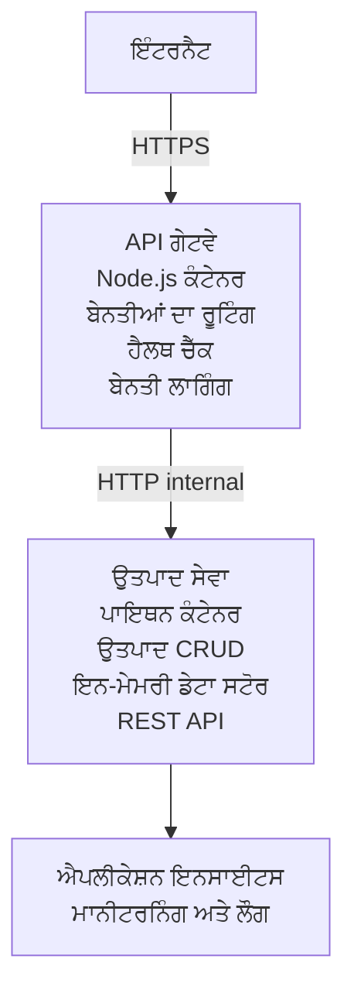

# ਮਾਈਕਰੋਸਰਵਿਸਿਜ਼ ਆਰਕੀਟੈਕਚਰ - ਕੰਟੇਨਰ ਐਪ ਉਦਾਹਰਣ

⏱️ **ਅੰਦਾਜ਼ਾ ਸਮਾਂ**: 25-35 ਮਿੰਟ | 💰 **ਅੰਦਾਜ਼ਾ ਲਾਗਤ**: ~$50-100/ਮਹੀਨਾ | ⭐ **ਜਟਿਲਤਾ**: ਉੱਚ ਪੱਧਰ

ਇੱਕ **ਸਧਾਰਨ ਪਰ ਕਾਰਗਰ** ਮਾਈਕਰੋਸਰਵਿਸਿਜ਼ ਆਰਕੀਟੈਕਚਰ ਜੋ AZD CLI ਦੀ ਵਰਤੋਂ ਕਰਕੇ Azure Container Apps 'ਤੇ ਡਿਪਲੋਯ ਕੀਤੀ ਗਈ ਹੈ। ਇਸ ਉਦਾਹਰਣ ਵਿੱਚ ਸਰਵਿਸ-ਟੂ-ਸਰਵਿਸ ਸੰਚਾਰ, ਕੰਟੇਨਰ ਆਰਕੀਸਟ੍ਰੇਸ਼ਨ ਅਤੇ ਮਾਨੀਟਰਿੰਗ ਨੂੰ ਇੱਕ ਪ੍ਰਾਇਕਟਿਕਲ 2-ਸਰਵਿਸ ਸੈਟਅਪ ਦੇ ਨਾਲ ਦਰਸਾਇਆ ਗਿਆ ਹੈ।

> **📚 ਸਿੱਖਣ ਦਾ ਢੰਗ**: ਇਹ ਉਦਾਹਰਣ ਇੱਕ ਘੱਟੋ-ਘੱਟ 2-ਸਰਵਿਸ ਆਰਕੀਟੈਕਚਰ (API ਗੇਟਵੇ + ਬੈਕਐਂਡ ਸਰਵਿਸ) ਨਾਲ ਸ਼ੁਰੂ ਹੁੰਦੀ ਹੈ ਜਿਸਨੂੰ ਤੁਸੀਂ ਅਸਲ ਵਿੱਚ ਡਿਪਲੋਏ ਅਤੇ ਸਿੱਖ ਸਕਦੇ ਹੋ। ਇਸ ਬੁਨਿਆਦ ਨੂੰ ਸਮਝਣ ਦੇ ਬਾਅਦ, ਅਸੀਂ ਪੂਰੇ ਮਾਈਕਰੋਸਰਵਿਸ ਈਕੋਸਿਸਟਮ ਤੱਕ ਫੈਲਾਉਣ ਲਈ ਦਿਸ਼ਾ-ਨਿਰਦੇਸ਼ ਦਿੰਦੇ ਹਾਂ।

## ਤੁਸੀਂ ਕੀ ਸਿੱਖੋਗੇ

ਇਸ ਉਦਾਹਰਣ ਨੂੰ ਪੂਰਾ ਕਰਕੇ, ਤੁਸੀਂ:
- Azure Container Apps 'ਤੇ ਬਹੁਤ ਸਾਰੇ ਕੰਟੇਨਰ ਡਿਪਲੋਯ ਕਰਨਾ ਸਿੱਖੋਗੇ
- ਅੰਦਰੂਨੀ ਨੈਟਵਰਕਿੰਗ ਨਾਲ ਸਰਵਿਸ-ਟੂ-ਸਰਵਿਸ ਸੰਚਾਰ ਲਾਗੂ ਕਰਨਾ ਸਿੱਖੋਗੇ
- ਵਾਤਾਵਰਨ-ਆਧਾਰਿਤ ਸਕੇਲਿੰਗ ਅਤੇ ਹੈਲਥ ਚੈਕਸ ਸੰਰਚਿਤ ਕਰਨਗੇ
- Application Insights ਨਾਲ ਵਿਤਰਿਤ ਐਪਲੀਕੇਸ਼ਨਾਂ ਦੀ ਨਿਗਰਾਨੀ ਕਰਨਾ ਸਿੱਖੋਗੇ
- ਮਾਈਕਰੋਸਰਵਿਸਿਜ਼ ਡਿਪਲੋਯਮੈਂਟ ਪੈਟਰਨ ਅਤੇ ਸਰਵੋਤਮ ਅਭਿਆਸਾਂ ਨੂੰ ਸਮਝੋਗੇ
- ਸਧਾਰਨ ਤੋਂ ਜਟਿਲ ਆਰਕੀਟੈਕਚਰਾਂ ਤੱਕ ਕ੍ਰਮਿਕ ਤੌਰ 'ਤੇ ਵਧਾਉਣਾ ਸਿੱਖੋਗੇ

## ਆਰਕੀਟੈਕਚਰ

### ਫੇਜ਼ 1: ਜੋ ਅਸੀਂ ਬਣਾ ਰਹੇ ਹਾਂ (ਇਸ ਉਦਾਹਰਣ ਵਿੱਚ ਸ਼ਾਮਿਲ)


**ਸਧਾਰਨ ਤੋਂ ਕਿਉਂ ਸ਼ੁਰੂ ਕਰੀਏ?**
- ✅ ਤੇਜ਼ੀ ਨਾਲ ਡਿਪਲੋਈ ਅਤੇ ਸਮਝੋ (25-35 ਮਿੰਟ)
- ✅ ਜਟਿਲਤਾ ਦੇ ਬਿਨ੍ਹਾਂ ਮੁੱਖ ਮਾਈਕਰੋਸਰਵਿਸ ਪੈਟਰਨ ਸਿੱਖੋ
- ✅ ਕੰਮ ਕਰਨ ਵਾਲਾ ਕੋਡ ਜੋ ਤੁਸੀਂ ਸੋਧ ਅਤੇ ਪ੍ਰਯੋਗ ਕਰ ਸਕਦੇ ਹੋ
- ✅ ਸਿੱਖਣ ਲਈ ਘੱਟ ਲਾਗਤ (~$50-100/ਮਹੀਨਾ vs $300-1400/ਮਹੀਨਾ)
- ✅ ਡੇਟਾਬੇਸ ਅਤੇ ਮੈਸੇਜ ਕਿਊਜ਼ ਸ਼ਾਮਿਲ ਕਰਨ ਤੋਂ ਪਹਿਲਾਂ ਵਿਸ਼ਵਾਸ ਬਣਾਓ

**ਉਪਮਾ**: ਇਸਨੂੰ ਡ੍ਰਾਈਵ ਸਿੱਖਣ ਵਾਂਗ ਸੋਚੋ। ਤੁਸੀਂ ਖਾਲੀ ਪਾਰਕਿੰਗ ਲਾਟ (2 ਸਰਵਿਸ) ਨਾਲ ਸ਼ੁਰੂ ਕਰਦੇ ਹੋ, ਬੁਨਿਆਦੀ ਗੱਲਾਂ 'ਤੇ ਨਿਪੁੰਨ ਹੋਦੇ ਹੋ, ਫਿਰ ਸ਼ਹਿਰ ਟ੍ਰੈਫਿਕ (5+ ਸਰਵਿਸਾਂ ਨਾਲ ਡੇਟਾਬੇਸ) ਵੱਲ ਪ੍ਰਗਟਿ ਕਰਦੇ ਹੋ।

### ਫੇਜ਼ 2: ਭਵਿੱਖੀ ਵਧਾਈ (ਸੰਦਰਭ ਆਰਕੀਟੈਕਚਰ)

```
Full Architecture (Not Included - For Reference)
├── API Gateway (✅ Included)
├── Product Service (✅ Included)
├── Order Service (🔜 Add next)
├── User Service (🔜 Add next)
├── Notification Service (🔜 Add last)
├── Azure Service Bus (🔜 For async communication)
├── Cosmos DB (🔜 For product persistence)
├── Azure SQL (🔜 For order management)
└── Azure Storage (🔜 For file storage)
```

ਅੰਤ ਵਿੱਚ ਦਿੱਤੇ "Expansion Guide" ਸੈਕਸ਼ਨ ਨੂੰ ਕਦਮ-ਦਰ-ਕਦਮ ਨਿਰਦੇਸ਼ਾਂ ਲਈ ਦੇਖੋ।

## ਸ਼ਾਮਿਲ ਫੀਚਰ

✅ **ਸਰਵਿਸ ਡਿਸਕਵਰੀ**: ਕੰਟੇਨਰਾਂ ਦੇ ਵਿਚਕਾਰ ਆਟੋਮੈਟਿਕ DNS-ਅਧਾਰਿਤ ਡਿਸਕਵਰੀ  
✅ **ਲੋਡ ਬੈਲੈਂਸਿੰਗ**: ਰਿਪਲਿਕਾਸ ਦੇ ਆੜ-ਪਾਸ ਆਟੋਮੈਟਿਕ ਲੋਡ ਬੈਲੈਂਸਿੰਗ  
✅ **ਆਟੋ-ਸਕੇਲਿੰਗ**: HTTP ਰਿਕਵੈਸਟਾਂ ਅਧਾਰਿਤ ਹਰ ਸਰਵਿਸ ਲਈ ਅਲੱਗ ਸਕੇਲਿੰਗ  
✅ **ਹੈਲਥ ਮਾਨੀਟਰਿੰਗ**: ਦੋਹਾਂ ਸਰਵਿਸਾਂ ਲਈ ਲਾਈਵਨੇਸ ਅਤੇ ਰੈਡੀਨੇਸ ਪ੍ਰੋਬਸ  
✅ **ਵਿਤਰਿਤ ਲੌਗਿੰਗ**: Application Insights ਨਾਲ ਕੇਂਦਰੀਕ੍ਰਿਤ ਲੌਗਿੰਗ  
✅ **ਅੰਦਰੂਨੀ ਨੈਟਵਰਕਿੰਗ**: ਸੁਰੱਖਿਅਤ ਸਰਵਿਸ-ਟੂ-ਸਰਵਿਸ ਸਾਂਝ  
✅ **ਕੰਟੇਨਰ ਆਰਕੀਸਟ੍ਰੇਸ਼ਨ**: ਆਟੋਮੈਟਿਕ ਡਿਪਲੋਯਮੈਂਟ ਅਤੇ ਸਕੇਲਿੰਗ  
✅ **ਜ਼ੀਰੋ-ਡਾਊਨਟਾਈਮ ਅਪਡੇਟਸ**: ਰੋਲਿੰਗ ਅਪਡੇਟਸ ਅਤੇ ਰਿਵਿਜ਼ਨ ਮੈਨੇਜਮੈਂਟ  

## ਪੂਰਵ-ਆਵਸ਼ਕਤਾਵਾਂ

### ਲੋੜੀਂਦੇ ਟੂਲ

ਸ਼ੁਰੂ ਕਰਨ ਤੋਂ ਪਹਿਲਾਂ, ਜਾਂਚ ਕਰੋ ਕਿ ਤੁਹਾਡੇ ਕੋਲ ਇਹ ਟੂਲ ਇੰਸਟਾਲ ਹੋਏ ਹਨ:

1. **[Azure ਡਿਵੈਲਪਰ CLI (azd)](https://learn.microsoft.com/azure/developer/azure-developer-cli/install-azd)** (ਸੰસ્કਰਣ 1.0.0 ਜਾਂ ਵੱਧ)
   ```bash
   azd version
   # ਉਮੀਦਿਤ ਨਤੀਜਾ: azd ਸੰਸਕਰਣ 1.0.0 ਜਾਂ ਇਸ ਤੋਂ ਉੱਚਾ
   ```

2. **[Azure CLI](https://learn.microsoft.com/cli/azure/install-azure-cli)** (ਸੰਸਕਰਣ 2.50.0 ਜਾਂ ਵੱਧ)
   ```bash
   az --version
   # ਉਮੀਦ ਕੀਤੀ ਆਉਟਪੁੱਟ: azure-cli 2.50.0 ਜਾਂ ਉੱਚਾ
   ```

3. **[Docker](https://www.docker.com/get-started)** (ਲੋਕਲ ਡਿਵੈਲਪਮੈਂਟ/ਟੈਸਟਿੰਗ ਲਈ - ਵਿਕਲਪੀ)
   ```bash
   docker --version
   # ਉਮੀਦਿਤ ਨਤੀਜਾ: Docker ਵਰਜ਼ਨ 20.10 ਜਾਂ ਉੱਪਰ
   ```

### Azure ਦੀਆਂ ਲੋੜਾਂ

- ਇੱਕ ਸਰਗਰਮ **Azure subscription** ([create a free account](https://azure.microsoft.com/free/))
- ਤੁਹਾਡੇ subscription ਵਿੱਚ resources ਬਣਾਉਣ ਦੀ ਆਗਿਆ
- Subscription ਜਾਂ resource group 'Contributor' ਭੂਮਿਕਾ

### ਜਾਣਕਾਰੀ ਦੀਆਂ ਲੋੜਾਂ

ਇਹ ਇੱਕ **ਉੱਚ ਪੱਧਰ** ਦਾ ਉਦਾਹਰਣ ਹੈ। ਤੁਹਾਡੇ ਕੋਲ ਇਹ ਹੋਣਾ ਚਾਹੀਦਾ ਹੈ:
- ਪੂਰਾ ਕੀਤਾ ਹੋਇਆ [ਸਧਾਰਣ Flask API ਉਦਾਹਰਣ](../../../../../examples/container-app/simple-flask-api) 
- ਮਾਈਕਰੋਸਰਵਿਸ ਆਰਕੀਟੈਕਚਰ ਦੀ ਮੁੱਢਲੀ ਸਮਝ
- REST APIs ਅਤੇ HTTP ਨਾਲ ਆਸ਼ਕਤਾ
- ਕੰਟੇਨਰ ਸੰਕਲਪਾਂ ਦੀ ਸਮਝ

**Container Apps ਵਿੱਚ ਨਵੇਂ ਹੋ?** ਬੁਨਿਆਦੀ ਗਿਆਨ ਲਈ ਪਹਿਲਾਂ [ਸਧਾਰਣ Flask API ਉਦਾਹਰਣ](../../../../../examples/container-app/simple-flask-api) ਦੇ ਨਾਲ ਸ਼ੁਰੂ ਕਰੋ।

## ਤੁਰੰਤ ਸ਼ੁਰੂ (ਕਦਮ-ਦਰ-ਕਦਮ)

### ਕਦਮ 1: ਕਲੋਨ ਅਤੇ ਨੈਵੀਗੇਟ ਕਰੋ

```bash
git clone https://github.com/microsoft/AZD-for-beginners.git
cd AZD-for-beginners/examples/container-app/microservices
```

**✓ ਸਫਲਤਾ ਚੈੱਕ**: ਜਾਂਚੋ ਕਿ ਤੁਸੀਂ `azure.yaml` ਵੇਖ ਰਹੇ ਹੋ:
```bash
ls
# ਉਮੀਦ ਕੀਤੀ ਗਈ: README.md, azure.yaml, infra/, src/
```

### ਕਦਮ 2: Azure ਨਾਲ ਪ੍ਰਮਾਣੀਕਰਨ ਕਰੋ

```bash
azd auth login
```

ਇਸ ਨਾਲ ਤੁਹਾਡੇ ਬ੍ਰਾਉਜ਼ਰ ਵਿੱਚ Azure ਪ੍ਰਮਾਣੀਕਰਨ ਖੁੱਲੇਗਾ। ਆਪਣੇ Azure ਪ੍ਰਮਾਣ ਪੱਤਰਾਂ ਨਾਲ ਸਾਈਨ ਇਨ ਕਰੋ।

**✓ ਸਫਲਤਾ ਚੈੱਕ**: ਤੁਹਾਨੂੰ ਇਹ ਦੇਖਣਾ ਚਾਹੀਦਾ ਹੈ:
```
Logged in to Azure.
```

### ਕਦਮ 3: ਵਾਤਾਵਰਨ ਸ਼ੁਰੂ ਕਰੋ

```bash
azd init
```

**ਤੁਹਾਨੂੰ ਜੋ ਪ੍ਰੌਮਪਟ ਦਿੱਸਣਗੇ**:
- **Environment name**: ਇੱਕ ਛੋਟਾ ਨਾਮ ਦਰਜ ਕਰੋ (ਉదਾਹਰਨ: `microservices-dev`)
- **Azure subscription**: ਆਪਣਾ subscription ਚੁਣੋ
- **Azure location**: ਇੱਕ ਖੇਤਰ ਚੁਣੋ (ਉਦਾਹਰਨ: `eastus`, `westeurope`)

**✓ ਸਫਲਤਾ ਚੈੱਕ**: ਤੁਹਾਨੂੰ ਇਹ ਦੇਖਣਾ ਚਾਹੀਦਾ ਹੈ:
```
SUCCESS: New project initialized!
```

### ਕਦਮ 4: ਇੰਫ੍ਰਾਸਟ੍ਰੱਕਚਰ ਅਤੇ ਸਰਵਿਸਾਂ ਡਿਪਲੋਯ ਕਰੋ

```bash
azd up
```

**ਕੀ ਹੁੰਦਾ ਹੈ** (8-12 ਮਿੰਟ ਲੱਗਦੇ ਹਨ):
1. Container Apps ਵਾਤਾਵਰਨ ਬਣਾਇਆ ਜਾਂਦਾ ਹੈ
2. ਮਾਨੀਟਰਿੰਗ ਲਈ Application Insights ਬਣਾਇਆ ਜਾਂਦਾ ਹੈ
3. API Gateway ਕੰਟੇਨਰ (Node.js) ਬਣਾਇਆ ਜਾਂਦਾ ਹੈ
4. Product Service ਕੰਟੇਨਰ (Python) ਬਣਾਇਆ ਜਾਂਦਾ ਹੈ
5. ਦੋਹਾਂ ਕੰਟੇਨਰਾਂ ਨੂੰ Azure 'ਤੇ ਡਿਪਲੋਯ ਕੀਤਾ ਜਾਂਦਾ ਹੈ
6. ਨੈਟਵਰਕਿੰਗ ਅਤੇ ਹੈਲਥ ਚੈਕਸ ਕਨਫਿਗਰ ਕੀਤੇ ਜਾਂਦੇ ਹਨ
7. ਮਾਨੀਟਰਿੰਗ ਅਤੇ ਲੌਗਿੰਗ ਸੈਟਅਪ ਕੀਤੀ ਜਾਂਦੀ ਹੈ

**✓ ਸਫਲਤਾ ਚੈੱਕ**: ਤੁਹਾਨੂੰ ਇਹ ਦੇਖਣਾ ਚਾਹੀਦਾ ਹੈ:
```
SUCCESS: Your application was deployed to Azure in X minutes Y seconds.
Endpoint: https://api-gateway-<unique-id>.azurecontainerapps.io
```

**⏱️ ਸਮਾਂ**: 8-12 ਮਿੰਟ

### ਕਦਮ 5: ਡਿਪਲੋਯਮੈਂਟ ਦੀ ਜਾਂਚ ਕਰੋ

```bash
# ਗੇਟਵੇ ਐਂਡਪੌਇੰਟ ਪ੍ਰਾਪਤ ਕਰੋ
GATEWAY_URL=$(azd env get-values | grep API_GATEWAY_URL | cut -d '=' -f2 | tr -d '"')

# API ਗੇਟਵੇ ਦੀ ਸਿਹਤ ਦੀ ਜਾਂਚ ਕਰੋ
curl $GATEWAY_URL/health

# ਉਮੀਦ ਕੀਤੀ ਆਉਟਪੁੱਟ:
# {"status":"healthy","service":"api-gateway","timestamp":"2025-11-19T10:30:00Z"}
```

**ਗੇਟਵੇ ਤੋਂ ਪ੍ਰੋਡਕਟ ਸਰਵਿਸ ਦੀ ਜਾਂਚ ਕਰੋ**:
```bash
# ਉਤਪਾਦਾਂ ਦੀ ਸੂਚੀ
curl $GATEWAY_URL/api/products

# ਉਮੀਦ ਕੀਤਾ ਨਤੀਜਾ:
# [
#   {"id":1,"name":"Laptop","price":999.99,"stock":50},
#   {"id":2,"name":"Mouse","price":29.99,"stock":200},
#   {"id":3,"name":"Keyboard","price":79.99,"stock":150}
# ]
```

**✓ ਸਫਲਤਾ ਚੈੱਕ**: ਦੋਹਾਂ ਐਂਡਪોઈਂਟ JSON ਡੇਟਾ ਬਿਨਾਂ ਤਰੁਟੀਆਂ ਦੇ ਵਾਪਸ ਕਰਦੇ ਹਨ।

---

**🎉 ਵਧਾਈਆਂ!** ਤੁਸੀਂ Azure 'ਤੇ ਮਾਈਕਰੋਸਰਵਿਸ ਆਰਕੀਟੈਕਚਰ ਡਿਪਲੋਏ ਕਰ ਦਿੱਤਾ ਹੈ!

## ਪ੍ਰੋਜੈਕਟ ਸਟਰਕਚਰ

ਸਾਰੇ ਇੰਪਲੀਮੇਂਟੇਸ਼ਨ ਫਾਈਲਾਂ ਸ਼ਾਮਿਲ ਹਨ—ਇਹ ਇੱਕ ਪੂਰਾ, ਕਾਰਗਰ ਉਦਾਹਰਣ ਹੈ:

```
microservices/
│
├── README.md                         # This file
├── azure.yaml                        # AZD configuration
├── .gitignore                        # Git ignore patterns
│
├── infra/                           # Infrastructure as Code (Bicep)
│   ├── main.bicep                   # Main orchestration
│   ├── abbreviations.json           # Naming conventions
│   ├── core/                        # Shared infrastructure
│   │   ├── container-apps-environment.bicep  # Container environment + registry
│   │   └── monitor.bicep            # Application Insights + Log Analytics
│   └── app/                         # Service definitions
│       ├── api-gateway.bicep        # API Gateway container app
│       └── product-service.bicep    # Product Service container app
│
└── src/                             # Application source code
    ├── api-gateway/                 # Node.js API Gateway
    │   ├── app.js                   # Express server with routing
    │   ├── package.json             # Node dependencies
    │   └── Dockerfile               # Container definition
    └── product-service/             # Python Product Service
        ├── main.py                  # Flask API with product data
        ├── requirements.txt         # Python dependencies
        └── Dockerfile               # Container definition
```

**ਹਰੇਕ ਕੰਪੋਨੈਂਟ ਕੀ ਕਰਦਾ ਹੈ:**

**ਇੰਫਰਾਸਟ੍ਰਕਚਰ (infra/)**:
- `main.bicep`: ਸਾਰੇ Azure resources ਅਤੇ ਉਨ੍ਹਾਂ ਦੀਆਂ ਨਿਰਭਰਤਾਵਾਂ ਨੂੰ ਆਰਕੀਸਟ੍ਰੇਟ ਕਰਦਾ ਹੈ
- `core/container-apps-environment.bicep`: Container Apps ਵਾਤਾਵਰਨ ਅਤੇ Azure Container Registry ਬਣਾਉਂਦਾ ਹੈ
- `core/monitor.bicep`: ਵਿੱਤਰਿਤ ਲੌਗਿੰਗ ਲਈ Application Insights ਸੈਟ ਕਰਦਾ ਹੈ
- `app/*.bicep`: ਸਕੇਲਿੰਗ ਅਤੇ ਹੈਲਥ ਚੈਕਸ ਨਾਲ ਵਿਅਕਤੀਗਤ ਕੰਟੇਨਰ ਐਪ ਪਰਿਭਾਸ਼ਾਵਾਂ

**API Gateway (src/api-gateway/)**:
- ਪਬਲਿਕ-ਫੇਸਿੰਗ ਸਰਵਿਸ ਜੋ ਬੈਕਐਂਡ ਸਰਵਿਸਾਂ ਵੱਲ ਰਿਕਵੈਸਟ ਰੂਟ ਕਰਦਾ ਹੈ
- ਲੌਗਿੰਗ, ਐਰਰ ਹੈਂਡਲਿੰਗ, ਅਤੇ ਰਿਕਵੈਸਟ ਫਾਰਵਰਡਿੰਗ ਲਾਗੂ ਕਰਦਾ ਹੈ
- ਸਰਵਿਸ-ਟੂ-ਸਰਵਿਸ HTTP ਸੰਚਾਰ ਦਾ ਦਰਸਾਉਂਦਾ ਹੈ

**Product Service (src/product-service/)**:
- ਅੰਦਰੂਨੀ ਸਰਵਿਸ ਜਿਸ ਵਿੱਚ ਪ੍ਰੋਡਕਟ ਕੈਟਾਲੌਗ ਹੈ (ਸਧਾਰਨਤਾ ਲਈ ਇਨ-ਮੈਮੋਰੀ)
- REST API ਅਤੇ ਹੈਲਥ ਚੈਕਸ
- ਬੈਕਐਂਡ ਮਾਈਕਰੋਸਰਵਿਸ ਪੈਟਰਨ ਦਾ ਉਦਾਹਰਣ

## ਸਰਵਿਸਾਂ ਦਾ ਝਲਕ

### API Gateway (Node.js/Express)

**ਪੋਰਟ**: 8080  
**ਪਹੁੰਚ**: ਪਬਲਿਕ (ਬਾਹਰੀ ਇਨਗ੍ਰੈੱਸ)  
**ਮਕਸਦ**: ਆਉਣ ਵਾਲੀਆਂ ਰਿਕਵੈਸਟਾਂ ਨੂੰ ਸਹੀ ਬੈਕਐਂਡ ਸਰਵਿਸਾਂ ਨੂੰ ਰੂਟ ਕਰਨਾ  

**ਐਂਡਪੌਇੰਟਸ**:
- `GET /` - ਸਰਵਿਸ ਜਾਣਕਾਰੀ
- `GET /health` - ਹੈਲਥ ਚੈਕ ਐਂਡਪੌਇੰਟ
- `GET /api/products` - ਪ੍ਰੋਡਕਟ ਸਰਵਿਸ ਵੱਲ ਫਾਰਵਰਡ (ਸਭ ਲਿਸਟ)
- `GET /api/products/:id` - ਪ੍ਰੋਡਕਟ ਸਰਵਿਸ ਵੱਲ ਫਾਰਵਰਡ (ID ਦੇ ਆਧਾਰ 'ਤੇ ਲਿਆਉਣਾ)

**ਮੁੱਖ ਫੀਚਰ**:
- axios ਨਾਲ ਰਿਕਵੈਸਟ ਰੂਟਿੰਗ
- ਕੇਂਦਰੀਕ੍ਰਿਤ ਲੌਗਿੰਗ
- ਐਰਰ ਹੈਂਡਲਿੰਗ ਅਤੇ ਟਾਈਮਆਉਟ ਪ੍ਰਬੰਧਨ
- ਵਾਤਾਵਰਨ ਵਾਰੀਏਬਲਾਂ ਰਾਹੀਂ ਸਰਵਿਸ ਡਿਸਕਵਰੀ
- Application Insights ਇੰਟੀਗ੍ਰੇਸ਼ਨ

**ਕੋਡ હਾਈਲਾਈਟ** (`src/api-gateway/app.js`):
```javascript
// ਅੰਦਰੂਨੀ ਸੇਵਾ ਸੰਚਾਰ
app.get('/api/products', async (req, res) => {
  const response = await axios.get(`${PRODUCT_SERVICE_URL}/products`);
  res.json(response.data);
});
```

### Product Service (Python/Flask)

**ਪੋਰਟ**: 8000  
**ਪਹੁੰਚ**: ਸਿਰਫ ਅੰਦਰੂਨੀ (ਕੋਈ ਬਾਹਰੀ ਇਨਗ੍ਰੈੱਸ ਨਹੀਂ)  
**ਮਕਸਦ**: ਇਨ-ਮੈਮੋਰੀ ਡੇਟਾ ਨਾਲ ਪ੍ਰੋਡਕਟ ਕੈਟਾਲੋਗ ਦਾ ਪ੍ਰਬੰਧਨ  

**ਐਂਡਪੌਇੰਟਸ**:
- `GET /` - ਸਰਵਿਸ ਜਾਣਕਾਰੀ
- `GET /health` - ਹੈਲਥ ਚੈਕ ਐਂਡਪੌਇੰਟ
- `GET /products` - ਸਾਰੇ ਪ੍ਰੋਡਕਟ ਲਿਸਟ
- `GET /products/<id>` - ID ਦੇ ਆਧਾਰ 'ਤੇ ਪ੍ਰੋਡਕਟ ਲਿਆਓ

**ਮੁੱਖ ਫੀਚਰ**:
- Flask ਨਾਲ RESTful API
- ਇਨ-ਮੈਮੋਰੀ ਪ੍ਰੋਡਕਟ ਸਟੋਰ (ਸਧਾਰਨ, ਕੋਈ ਡੇਟਾਬੇਸ ਲੋੜ ਨਹੀਂ)
- ਪ੍ਰੋਬਸ ਨਾਲ ਹੈਲਥ ਮਾਨੀਟਰਿੰਗ
- ਸੰਰਚਿਤ ਲੌਗਿੰਗ
- Application Insights ਇੰਟੀਗ੍ਰੇਸ਼ਨ

**ਡਾਟਾ ਮਾਡਲ**:
```python
{
  "id": 1,
  "name": "Laptop",
  "description": "High-performance laptop",
  "price": 999.99,
  "stock": 50
}
```

**ਅੰਦਰੂਨੀ ਹੀ ਕਿਉਂ?**
ਪ੍ਰੋਡਕਟ ਸਰਵਿਸ ਨੂੰ ਪਬਲਿਕ ਤੌਰ 'ਤੇ ਦਰਸਾਇਆ ਨਹੀਂ ਗਿਆ। ਸਾਰੇ ਰਿਕਵੈਸਟ API ਗੇਟਵੇ ਰਾਹੀਂ ਜਾਣੇ ਚਾਹੀਦੇ ਹਨ, ਜੋ ਇਹ ਪ੍ਰਦਾਨ ਕਰਦਾ ਹੈ:
- ਸੁਰੱਖਿਆ: ਨਿਯੰਤਰਿਤ ਪਹੁੰਚ ਬਿੰਦੂ
- ਲਚੀਲਾਪਣ: ਬੈਕਐਂਡ ਬਦਲਣ 'ਤੇ ਕਲਾਇੰਟ ਪ੍ਰਭਾਵਿਤ ਨਹੀਂ ਹੁੰਦੇ
- ਮਾਨੀਟਰਿੰਗ: ਕੇਂਦਰੀਕ੍ਰਿਤ ਰਿਕਵੈਸਟ ਲੌਗਿੰਗ

## ਸਰਵਿਸ ਸੰਚਾਰ ਨੂੰ ਸਮਝਣਾ

### ਸਰਵਿਸਾਂ ਇੱਕ ਦੂਜੇ ਨਾਲ ਕਿਵੇਂ ਗੱਲ ਕਰਦੀਆਂ ਹਨ

ਇਸ ਉਦਾਹਰਣ ਵਿੱਚ, API Gateway ਪ੍ਰੋਡਕਟ ਸਰਵਿਸ ਨਾਲ **ਅੰਦਰੂਨੀ HTTP ਕਾਲਾਂ** ਰਾਹੀਂ ਸੰਚਾਰ ਕਰਦਾ ਹੈ:

```javascript
// API ਗੇਟਵੇ (src/api-gateway/app.js)
const PRODUCT_SERVICE_URL = process.env.PRODUCT_SERVICE_URL;

// ਅੰਦਰੂਨੀ HTTP ਬੇਨਤੀ ਕਰੋ
const response = await axios.get(`${PRODUCT_SERVICE_URL}/products`);
```

**ਮੁੱਖ ਬਿੰਦੂ**:

1. **DNS-ਅਧਾਰਿਤ ਡਿਸਕਵਰੀ**: Container Apps ਆਟੋਮੈਟਿਕ ਤੌਰ 'ਤੇ ਅੰਦਰੂਨੀ ਸਰਵਿਸਾਂ ਲਈ DNS ਪ੍ਰਦਾਨ ਕਰਦਾ ਹੈ
   - Product Service FQDN: `product-service.internal.<environment>.azurecontainerapps.io`
   - ਸਧਾਰਨ ਰੂਪ ਵਿੱਚ: `http://product-service` (Container Apps ਇਸਨੂੰ resolve ਕਰਦਾ ਹੈ)

2. **ਕੋਈ ਪਬਲਿਕ ਐਕਸਪੋਜ਼ਰ ਨਹੀਂ**: Bicep ਵਿਚ Product Service ਵਿੱਚ `external: false` ਹੈ
   - ਸਿਰਫ Container Apps ਵਾਤਾਵਰਨ ਅੰਦਰ ਪਹੁੰਚਯੋਗ
   - ਇੰਟਰਨੈਟ ਤੋਂ ਪਹੁੰਚ ਨਹੀਂ ਕੀਤੀ ਜਾ ਸਕਦੀ

3. **ਵਾਤਾਵਰਨ ਵਾਰੀਏਬਲ**: ਸਰਵਿਸ URLs ਡਿਪਲੋਯਮੈਂਟ ਸਮੇਂ ਇੰਜੈਕਟ ਕੀਤੀਆਂ ਜਾਂਦੀਆਂ ਹਨ
   - Bicep ਗੇਟਵੇ ਨੂੰ ਅੰਦਰੂਨੀ FQDN ਪਾਸ ਕਰਦਾ ਹੈ
   - ਐਪਲੀਕੇਸ਼ਨ ਕੋਡ ਵਿੱਚ ਕੋਈ ਹਾਰਡਕੋਡ ਕੀਤਾ URL ਨਹੀਂ

**ਉਪਮਾ**: ਇਸਨੂੰ ਦਫ਼ਤਰ ਦੇ ਕਮਰਿਆਂ ਵਾਂਗ ਸੋਚੋ। API Gateway ਰਿਸੈਪਸ਼ਨ ਡੈੱਸਕ ਹੈ (ਪਬਲਿਕ-ਫੇਸਿੰਗ), ਅਤੇ Product Service ਇੱਕ ਦਫ਼ਤਰ ਕਮਰਾ ਹੈ (ਸਿਰਫ ਅੰਦਰੂਨੀ)। ਮੁਹਤਾਜ਼ ਨੂੰ ਕਿਸੇ ਵੀ ਦਫ਼ਤਰ ਤੱਕ ਪਹੁੰਚਣ ਲਈ ਰਿਸੈਪਸ਼ਨ ਰਾਹੀਂ ਜਾਣਾ ਪੈਂਦਾ ਹੈ।

## ਡਿਪਲੋਯਮੈਂਟ ਵਿਕਲਪ

### ਪੂਰਾ ਡਿਪਲੋਯਮੈਂਟ (ਸਿਫਾਰਸ਼ੀ)

```bash
# ਢਾਂਚਾ ਅਤੇ ਦੋਹਾਂ ਸੇਵਾਵਾਂ ਨੂੰ ਸਥਾਪਿਤ ਕਰੋ
azd up
```

ਇਹ ਡਿਪਲੋਯ ਕਰਦਾ ਹੈ:
1. Container Apps ਵਾਤਾਵਰਨ
2. Application Insights
3. Container Registry
4. API Gateway ਕੰਟੇਨਰ
5. Product Service ਕੰਟੇਨਰ

**ਸਮਾਂ**: 8-12 ਮਿੰਟ

### ਵਿਅਕਤੀਗਤ ਸਰਵਿਸ ਡਿਪਲੋਯ ਕਰੋ

```bash
# ਕੇਵਲ ਇੱਕ ਸੇਵਾ ਤੈਨਾਤ ਕਰੋ (ਪਹਿਲੀ azd up ਤੋਂ ਬਾਅਦ)
azd deploy api-gateway

# ਜਾਂ ਉਤਪਾਦ ਸੇਵਾ ਤੈਨਾਤ ਕਰੋ
azd deploy product-service
```

**ਵਰਤੋਂ ਦਾ ਕੇਸ**: ਜਦੋਂ ਤੁਸੀਂ ਇੱਕ ਸਰਵਿਸ ਵਿੱਚ ਕੋਡ ਅੱਪਡੇਟ ਕੀਤਾ ਹੈ ਅਤੇ ਸਿਰਫ ਉਸੇ ਸਰਵਿਸ ਨੂੰ ਦੁਬਾਰਾ ਡਿਪਲੋਯ ਕਰਨਾ ਚਾਹੁੰਦੇ ਹੋ।

### ਕੁਨਫਿਗਰੇਸ਼ਨ ਅਪਡੇਟ ਕਰੋ

```bash
# ਸਕੇਲਿੰਗ ਪੈਰਾਮੀਟਰਾਂ ਬਦਲੋ
azd env set GATEWAY_MAX_REPLICAS 30

# ਨਵੀਂ ਸੰਰਚਨਾ ਨਾਲ ਮੁੜ ਤੈਨਾਤ ਕਰੋ
azd up
```

## ਕੁਨਫਿਗਰੇਸ਼ਨ

### ਸਕੇਲਿੰਗ ਸੰਰਚਨਾ

ਦੋਹਾਂ ਸਰਵਿਸਾਂ ਨੂੰ ਉਨ੍ਹਾਂ ਦੀਆਂ Bicep ਫਾਈਲਾਂ ਵਿੱਚ HTTP-ਅਧਾਰਿਤ ਆਟੋ-ਸਕੇਲਿੰਗ ਨਾਲ ਸੰਰਚਿਤ ਕੀਤਾ ਗਿਆ ਹੈ:

**API Gateway**:
- ਘੱਟੋ-ਘੱਟ ਰਿਪਲਿਕਾਸ: 2 (ਉਪਲਬਧਤਾ ਲਈ ਹਮੇਸ਼ਾ ਘੱਟੋ-ਘੱਟ 2)
- ਵੱਧ ਤੱਕ ਰਿਪਲਿਕਾਸ: 20
- ਸਕੇਲ ਟ੍ਰਿਗਰ: ਪ੍ਰਤੀ ਰਿਪਲਿਕਾ 50 ਸਮਕਾਲੀ ਰਿਕਵੈਸਟ

**Product Service**:
- ਘੱਟੋ-ਘੱਟ ਰਿਪਲਿਕਾਸ: 1 (ਲੋੜ ਪੈਣ 'ਤੇ zero ਤੱਕ ਸਕੇਲ ਕਰਨ ਦੇ ਯੋਗ)
- ਵੱਧ ਤੱਕ ਰਿਪਲਿਕਾਸ: 10
- ਸਕੇਲ ਟ੍ਰਿਗਰ: ਪ੍ਰਤੀ ਰਿਪਲਿਕਾ 100 ਸਮਕਾਲੀ ਰਿਕਵੈਸਟ

**ਸਕੇਲਿੰਗ ਨੂੰ ਕਸਟਮਾਈਜ ਕਰੋ** (in `infra/app/*.bicep`):
```bicep
scale: {
  minReplicas: 1
  maxReplicas: 10
  rules: [
    {
      name: 'http-scale-rule'
      http: {
        metadata: {
          concurrentRequests: '100'  // Adjust this
        }
      }
    }
  ]
}
```

### ਰਿਸੋਰਸ ਵੰਡ

**API Gateway**:
- CPU: 1.0 vCPU
- ਮੈਮੋਰੀ: 2 GiB
- ਕਾਰਨ: ਸਾਰੇ ਬਾਹਰੀ ਟ੍ਰੈਫਿਕ ਨੂੰ ਹੈਂਡਲ ਕਰਦਾ ਹੈ

**Product Service**:
- CPU: 0.5 vCPU
- ਮੈਮੋਰੀ: 1 GiB
- ਕਾਰਨ: ਹਲਕੀ-ਫੁਲਕੀ ਇਨ-ਮੈਮੋਰੀ ਆਪਰੇਸ਼ਨ

### ਹੈਲਥ ਚੈਕਸ

ਦੋਹਾਂ ਸਰਵਿਸਾਂ ਵਿੱਚ ਲਾਈਵਨੇਸ ਅਤੇ ਰੈਡੀਨੇਸ ਪ੍ਰੋਬਸ ਸ਼ਾਮਿਲ ਹਨ:

```bicep
probes: [
  {
    type: 'Liveness'
    httpGet: {
      path: '/health'
      port: 8080
    }
    initialDelaySeconds: 10
    periodSeconds: 30
  }
  {
    type: 'Readiness'
    httpGet: {
      path: '/health'
      port: 8080
    }
    initialDelaySeconds: 5
    periodSeconds: 10
  }
]
```

**ਇਸਦਾ ਕੀ ਮਤਲਬ ਹੈ**:
- **Liveness**: ਜੇ ਹੈਲਥ ਚੈੱਕ ਫੇਲ ਹੋ ਜਾਂਦਾ ਹੈ, Container Apps ਕੰਟੇਨਰ ਨੂੰ ਰੀਸਟਾਰਟ ਕਰਦਾ ਹੈ
- **Readiness**: ਜੇ ਤਿਆਰ ਨਹੀਂ ਹੈ, Container Apps ਉਸ ਰਿਪਲਿਕਾ ਵਾਲੀ ਟ੍ਰੈਫਿਕ ਨੂੰ ਰੂਟਿੰਗ ਤੋਂ ਰੋਕਦਾ ਹੈ


## ਮਾਨੀਟਰਿੰਗ ਅਤੇ ਦ੍ਰਿਸ਼ਯਤਾ

### ਸਰਵਿਸ ਲੌਗ ਵੇਖੋ

```bash
# azd monitor ਦੀ ਵਰਤੋਂ ਕਰਕੇ ਲੌਗ ਵੇਖੋ
azd monitor --logs

# ਜਾਂ ਨਿਰਦਿਸ਼ਟ ਕੰਟੇਨਰ ਐਪਸ ਲਈ Azure CLI ਦੀ ਵਰਤੋਂ ਕਰੋ:
# API Gateway ਤੋਂ ਲੌਗ ਸਟ੍ਰੀਮ ਕਰੋ
az containerapp logs show --name api-gateway --resource-group $RG_NAME --follow

# ਤਾਜ਼ਾ ਉਤਪਾਦ ਸੇਵਾ ਦੇ ਲੌਗ ਵੇਖੋ
az containerapp logs show --name product-service --resource-group $RG_NAME --tail 100
```

**ਉਮੀਦ ਕੀਤੀ ਆਉਟਪੁੱਟ**:
```
[api-gateway] API Gateway listening on port 8080
[api-gateway] Product Service URL: http://product-service
[api-gateway] GET /api/products 200 - 45ms
[product-service] Retrieved 5 products
```

### Application Insights ਕਵੈਰੀਜ਼

Azure ਪੋਰਟਲ ਵਿੱਚ Application Insights ਨੂੰ ਐਕਸੈਸ ਕਰੋ, ਫਿਰ ਇਹਨੂੰ ਚਲਾਓ:

**ਢੀਲੀਆ ਰਿਕਵੈਸਟ ਲੱਭੋ**:
```kusto
requests
| where timestamp > ago(1h)
| where duration > 1000  // Requests taking >1 second
| summarize count() by name, cloud_RoleName
| order by count_ desc
```

**ਸਰਵਿਸ-ਟੂ-ਸਰਵਿਸ ਕਾਲਜ਼ ਨੂੰ ਟਰੈਕ ਕਰੋ**:
```kusto
dependencies
| where timestamp > ago(1h)
| where type == "Http"
| project timestamp, name, target, duration, success
| order by timestamp desc
```

**ਸਰਵਿਸ ਮੁਤਾਬਕ ਤਰੁੱਟੀ ਦਰ**:
```kusto
exceptions
| where timestamp > ago(24h)
| summarize errorCount = count() by cloud_RoleName, type
| order by errorCount desc
```

**ਸਮੇਂ ਦੇ ਨਾਲ ਰਿਕਵੈਸਟ ਖਪਤ**:
```kusto
requests
| where timestamp > ago(1h)
| summarize requestCount = count() by bin(timestamp, 5m), cloud_RoleName
| render timechart
```

### ਮਾਨੀਟਰਿੰਗ ਡੈਸ਼ਬੋਰਡ ਐਕਸੈਸ ਕਰੋ

```bash
# Application Insights ਦੇ ਵੇਰਵੇ ਪ੍ਰਾਪਤ ਕਰੋ
azd env get-values | grep APPLICATIONINSIGHTS

# Azure ਪੋਰਟਲ ਵਿੱਚ ਮਾਨੀਟਰਿੰਗ ਖੋਲ੍ਹੋ
az monitor app-insights component show \
  --app $(azd env get-values | grep APPLICATIONINSIGHTS_CONNECTION_STRING | cut -d '=' -f2) \
  --resource-group $(azd env get-values | grep AZURE_RESOURCE_GROUP | cut -d '=' -f2) \
  --query "appId" -o tsv
```

### ਲਾਈਵ ਮੈਟ੍ਰਿਕਸ

1. Azure ਪੋਰਟਲ ਵਿੱਚ Application Insights ਤੇ ਜਾਓ
2. "Live Metrics" 'ਤੇ ਕਲਿਕ ਕਰੋ
3. ਰੀਅਲ-ਟਾਈਮ ਰਿਕਵੈਸਟ, ਫੇਲਿਆਵਾਂ, ਅਤੇ ਪ੍ਰਦਰਸ਼ਨ ਵੇਖੋ
4. ਇਹ ਚਲਾ ਕੇ ਟੈਸਟ ਕਰੋ: `curl $(azd env get-values | grep API_GATEWAY_URL | cut -d '=' -f2 | tr -d '"')/api/products`

## ਪ੍ਰਾਇਕਟਿਕਲ ਅਭਿਆਸ

[ਨੋਟ: ਵਿਸਥਾਰਪੂਰਵਕ ਕਦਮ-ਦਰ-ਕਦਮ ਅਭਿਆਸਾਂ ਲਈ "Practical Exercises" ਸੈਕਸ਼ਨ ਵਿੱਚ ਉਪਰ ਦਿੱਤੇ ਪੂਰੇ ਅਭਿਆਸਾਂ ਨੂੰ ਦੇਖੋ, ਜਿਨ੍ਹਾਂ ਵਿੱਚ ਡਿਪਲੋਯਮੈਂਟ ਵੈਰੀਫਿਕੇਸ਼ਨ, ਡੇਟਾ ਸੋਧ, ਆਟੋਸਕੇਲਿੰਗ ਟੈਸਟ, ਐਰਰ ਹੈਂਡਲਿੰਗ ਅਤੇ ਤੀਜੀ ਸਰਵਿਸ ਸ਼ਾਮਿਲ ਕਰਨ ਦੇ ਨਿਰਦੇਸ਼ ਹਨ।]

## ਲਾਗਤ ਵਿਸ਼ਲੇਸ਼ਣ

### ਇਸ 2-ਸਰਵਿਸ ਉਦਾਹਰਣ ਲਈ ਅੰਦਾਜ਼ਿਤ ਮਹੀਨਾਵਾਰ ਲਾਗਤ

| Resource | Configuration | Estimated Cost |
|----------|--------------|----------------|
| API Gateway | 2-20 replicas, 1 vCPU, 2GB RAM | $30-150 |
| Product Service | 1-10 replicas, 0.5 vCPU, 1GB RAM | $15-75 |
| Container Registry | Basic tier | $5 |
| Application Insights | 1-2 GB/month | $5-10 |
| Log Analytics | 1 GB/month | $3 |
| **Total** | | **$58-243/month** |

**ਵਰਤੋਂ ਅਨੁਸਾਰ ਲਾਗਤ ਵਿਭਾਜਨ**:
- **ਘੱਟ ਟ੍ਰੈਫਿਕ** (ਟੈਸਟਿੰਗ/ਸਿੱਖਣ): ~$60/ਮਹੀਨਾ
- **ਮਧਯਮ ਟ੍ਰੈਫਿਕ** (ਛੋਟੀ ਪ੍ਰੋਡਕਸ਼ਨ): ~$120/ਮਹੀਨਾ
- **ਉੱਚ ਟ੍ਰੈਫਿਕ** (ਬਹੁਤ ਰੁਝਾਨ ਵਾਲੇ ਸਮੇਂ): ~$240/ਮਹੀਨਾ

### ਲਾਗਤ ਕਮੀ ਕਰਨ ਦੇ ਸੁਝਾਅ

1. **ਡਿਵੈਲਪਮੈਂਟ ਲਈ Zero ਤੱਕ ਸਕੇਲ ਕਰੋ**:
   ```bicep
   scale: {
     minReplicas: 0  // Save $30-40/month when not in use
     maxReplicas: 10
   }
   ```

2. **Cosmos DB ਲਈ Consumption Plan ਵਰਤੋਂ** (ਜਦੋਂ ਤੁਸੀਂ ਇਸਨੂੰ ਸ਼ਾਮਿਲ ਕਰੋ):
   - ਸਿਰਫ਼ ਉਹੀ ਭਰੇ ਜੋ ਤੁਸੀਂ ਵਰਤਦੇ ਹੋ
   - ਕੋਈ ਘੱਟੋ-ਘੱਟ ਚਾਰਜ ਨਹੀਂ

3. **Application Insights ਸੈਂਪਲਿੰਗ ਸੈੱਟ ਕਰੋ**:
   ```javascript
   appInsights.defaultClient.config.samplingPercentage = 50; // ਬੇਨਤੀਆਂ ਦਾ 50% ਨਮੂਨਾ ਲਵੋ
   ```

4. **ਜਦੋਂ ਲੋੜ ਨਾ ਹੋਵੇ ਤਾਂ ਸਫਾਈ ਕਰੋ**:
   ```bash
   azd down
   ```

### ਮੁਫ਼ਤ ਟੀਅਰ ਵਿਕਲਪ

ਸਿੱਖਣ/ਟੈਸਟ ਕਰਨ ਲਈ, ਵਿਚਾਰ ਕਰੋ:
- Azure ਮੁਫ਼ਤ ਕਰੈਡਿਟ ਵਰਤੋ (ਪਹਿਲੇ 30 ਦਿਨ)
- ਰੀਪਲਿਕਾਸ ਘੱਟ ਤੋਂ ਘੱਟ ਰੱਖੋ
- ਟੈਸਟਿੰਗ ਤੋਂ ਬਾਅਦ ਮਿਟਾਓ (ਕੋਈ ਚੱਲਦੇ ਚਾਰਜ ਨਹੀਂ)

---

## Cleanup

ਚੱਲਦੇ ਚਾਰਜਾਂ ਤੋਂ ਬਚਣ ਲਈ, ਸਾਰੇ ਰਿਸੋਰਸ ਮਿਟਾ ਦਿਓ:

```bash
azd down --force --purge
```

**ਪੁਸ਼ਟੀ ਪ੍ਰਾਂਪਟ**:
```
? Total resources to delete: 6, are you sure you want to continue? (y/N)
```

ਪੁਸ਼ਟੀ ਕਰਨ ਲਈ `y` ਟਾਈਪ ਕਰੋ।

**ਕੀ ਮਿਟਾਇਆ ਜਾਏਗਾ**:
- Container Apps Environment
- ਦੋਵਾਂ Container Apps (gateway & product service)
- Container Registry
- Application Insights
- Log Analytics Workspace
- Resource Group

**✓ ਸਫਾਈ ਦੀ ਪੁਸ਼ਟੀ ਕਰੋ**:
```bash
az group list --query "[?starts_with(name,'rg-microservices')]" --output table
```

ਖਾਲੀ ਵਾਪਸ ਹੋਣਾ ਚਾਹੀਦਾ ਹੈ।

---

## Expansion Guide: From 2 to 5+ Services

ਜਦੋਂ ਤੁਸੀਂ ਇਸ 2-ਸਰਵਿਸ ਆਰਕੀਟੈਕਚਰ 'ਤੇ ਨਿਪੁੰਨ ਹੋ ਜਾਓ, ਤਾਂ ਵਧਾਉਣ ਲਈ ਇੱਥੇ ਹੈ:

### Phase 1: Add Database Persistence (Next Step)

**Product Service ਲਈ Cosmos DB ਜੋੜੋ**:

1. ਬਣਾਓ `infra/core/cosmos.bicep`:
   ```bicep
   resource cosmosAccount 'Microsoft.DocumentDB/databaseAccounts@2023-04-15' = {
     name: name
     location: location
     kind: 'GlobalDocumentDB'
     properties: {
       databaseAccountOfferType: 'Standard'
       locations: [{ locationName: location, failoverPriority: 0 }]
     }
   }
   ```

2. Product service ਨੂੰ in-memory ਡੇਟਾ ਦੀ ਥਾਂ Cosmos DB ਵਰਤਣ ਲਈ ਅਪਡੇਟ ਕਰੋ

3. ਅਨੁਮਾਨਤ ਵਾਧੂ ਲਾਗਤ: ~$25/month (serverless)

### Phase 2: Add Third Service (Order Management)

**Order Service ਬਣਾਓ**:

1. ਨਵੀਂ ਫੋਲਡਰ: `src/order-service/` (Python/Node.js/C#)
2. ਨਵਾਂ Bicep: `infra/app/order-service.bicep`
3. API Gateway ਨੂੰ `/api/orders` ਰੂਟ ਕਰਨ ਲਈ ਅਪਡੇਟ ਕਰੋ
4. ਆਰਡਰ ਪਰਸਿਸਟੈਂਸ ਲਈ Azure SQL Database ਜੋੜੋ

**ਆਰਕੀਟੈਕਚਰ ਬਣ ਜਾਂਦਾ ਹੈ**:
```
API Gateway → Product Service (Cosmos DB)
           → Order Service (Azure SQL)
```

### Phase 3: Add Async Communication (Service Bus)

**Event-Driven ਆਰਕੀਟੈਕਚਰ ਲਾਗੂ ਕਰੋ**:

1. Azure Service Bus ਜੋੜੋ: `infra/core/servicebus.bicep`
2. Product Service "ProductCreated" ਇਵੈਂਟ ਪਬਲਿਸ਼ ਕਰਦਾ ਹੈ
3. Order Service product ਇਵੈਂਟ ਨੂੰ سبਸਕ੍ਰਾਈਬ ਕਰਦਾ ਹੈ
4. ਇਵੈਂਟ ਪ੍ਰਕਿਰਿਆ ਕਰਨ ਲਈ Notification Service ਜੋੜੋ

**ਪੈਟਰਨ**: Request/Response (HTTP) + ਇਵੈਂਟ-ਡ੍ਰਿਵਨ (Service Bus)

### Phase 4: Add User Authentication

**User Service ਲਾਗੂ ਕਰੋ**:

1. ਬਣਾਓ `src/user-service/` (Go/Node.js)
2. Azure AD B2C ਜਾਂ ਕਸਟਮ JWT ਪ੍ਰਮਾਣਿਕਤਾ ਜੋੜੋ
3. API Gateway ਟੋਕਨ ਵੈਰੀਫਾਈ ਕਰਦਾ ਹੈ
4. ਸਰਵਿਸਿਜ਼ ਯੂਜ਼ਰ ਪਰਮਿਸ਼ਨ ਚੈੱਕ ਕਰਦੀਆਂ ਹਨ

### Phase 5: Production Readiness

**ਇਹ ਕੰਪੋਨੈਂਟ ਜੋੜੋ**:
- Azure Front Door (ਗਲੋਬਲ ਲੋਡ ਬੈਲੈਂਸਿੰਗ)
- Azure Key Vault (ਸੀਕ੍ਰੇਟ ਮੈਨੇਜਮੈਂਟ)
- Azure Monitor Workbooks (ਕਸਟਮ ਡੈਸ਼ਬੋਰਡ)
- CI/CD Pipeline (GitHub Actions)
- Blue-Green Deployments
- ਸਾਰੀਆਂ ਸਰਵਿਸਿਜ਼ ਲਈ Managed Identity

**ਪੂਰੀ ਪ੍ਰੋਡਕਸ਼ਨ ਆਰਕੀਟੈਕਚਰ ਦੀ ਲਾਗਤ**: ~$300-1,400/month

---

## Learn More

### Related Documentation
- [Azure Container Apps Documentation](https://learn.microsoft.com/azure/container-apps/)
- [Microservices Architecture Guide](https://learn.microsoft.com/azure/architecture/guide/architecture-styles/microservices)
- [Application Insights for Distributed Tracing](https://learn.microsoft.com/azure/azure-monitor/app/distributed-tracing)
- [Azure Developer CLI Documentation](https://learn.microsoft.com/azure/developer/azure-developer-cli/)

### Next Steps in This Course
- ← Previous: [Simple Flask API](../../../../../examples/container-app/simple-flask-api) - ਸ਼ੁਰੂਆਤੀ ਇੱਕ-ਕਨਟੇਨਰ ਉਦਾਹਰਨ
- → Next: [AI Integration Guide](../../../../../examples/docs/ai-foundry) - AI ਸਮਰੱਥਾਵਾਂ ਜੋੜੋ
- 🏠 [Course Home](../../README.md)

### Comparison: When to Use What

**Single Container App** (ਸਾਦਾ Flask API ਉਦਾਹਰਨ):
- ✅ ਸਰਲ ਐਪਲੀਕੇਸ਼ਨ
- ✅ ਮੋਨੋਲੀਥਿਕ ਆਰਕੀਟੈਕਚਰ
- ✅ ਤੇਜ਼ ਤਰੀਕੇ ਨਾਲ ਡਿਪਲੌਏਬਲ
- ❌ ਸੀਮਿਤ ਸਕੇਲਬਿਲਟੀ
- **ਲਾਗਤ**: ~$15-50/month

**Microservices** (ਇਸ ਉਦਾਹਰਨ):
- ✅ ਜਟਿਲ ਐਪਲੀਕੇਸ਼ਨ
- ✅ ਹਰ ਸਰਵਿਸ ਲਈ ਸੁਤੰਤਰ ਤੌਰ 'ਤੇ ਸਕੇਲਿੰਗ
- ✅ ਟੀਮ ਆਜ਼ਾਦੀ (ਵੱਖ-ਵੱਖ ਸਰਵਿਸਿਜ਼, ਵੱਖ-ਵੱਖ ਟੀਮਾਂ)
- ❌ ਪ੍ਰਬੰਧਨ ਵਿੱਚ ਵੱਧ ਜਟਿਲਤਾ
- **ਲਾਗਤ**: ~$60-250/month

**Kubernetes (AKS)**:
- ✅ ਵੱਧ ਤੋਂ ਵੱਧ ਕੰਟਰੋਲ ਅਤੇ ਲਚਕੀਲਾਪਨ
- ✅ ਮਲਟੀ-ਕਲਾਉਡ ਪੋਰਟੇਬਿਲਿਟੀ
- ✅ ਐਡਵਾਂਸਡ ਨੈੱਟਵਰਕਿੰਗ
- ❌ Kubernetes ਦੀ ਮਹਿਰਤ ਦੀ ਲੋੜ
- **ਲਾਗਤ**: ~$150-500/month ਨਿਊਨਤਮ

**ਸਿਫਾਰਿਸ਼**: ਸ਼ੁਰੂ ਕਰੋ Container Apps ਨਾਲ (ਇਹ ਉਦਾਹਰਨ), AKS ਤੇ ਤਬ ਜਾਓ ਜਦੋਂ ਤੁਹਾਨੂੰ Kubernetes-ਖਾਸ ਫੀਚਰਾਂ ਦੀ ਲੋੜ ਹੋਵੇ।

---

## Frequently Asked Questions

**Q: ਕਿਉਂ ਸਿਰਫ 2 ਸਰਵਿਸਿਜ਼ 5+ ਦੀ ਬਜਾਏ?**  
A: ਤਾਲੀਮੀ ਪੱਧਰਬੰਦੀ। ਸਧਾਰਣ ਉਦਾਹਰਨ ਨਾਲ ਮੂਲ ਗੱਲਾਂ (ਸਰਵਿਸ ਕਮਿਊਨੀਕੇਸ਼ਨ, ਮਾਨੀਟਰਿੰਗ, ਸਕੇਲਿੰਗ) 'ਤੇ ਨਿਪੁੰਨਤਾ ਹਾਸਲ ਕਰੋ, ਫਿਰ ਜਟਿਲਤਾ ਜੋੜੋ। ਇੱਥੇ ਸਿੱਖੇ ਪੈਟਰਨ 100-ਸਰਵਿਸ ਆਰਕੀਟੈਕਚਰਾਂ 'ਤੇ ਵੀ ਲਾਗੂ ਹੁੰਦੇ ਹਨ।

**Q: ਕੀ ਮੈਂ ਖੁਦ ਹੋਰ ਸਰਵਿਸਿਜ਼ ਜੋੜ ਸਕਦਾ/ਸਕਦੀ ਹਾਂ?**  
A: ਬਿਲਕੁਲ! ਉੱਪਰ ਦਿੱਤੇ Expansion Guide ਦੀ ਪਾਲਣਾ ਕਰੋ। ਹਰ ਨਵੀਂ ਸਰਵਿਸ ਇੱਕੋ ਪੈਟਰਨ ਫਾਲੋ ਕਰਦੀ ਹੈ: src ਫੋਲਡਰ ਬਣਾਓ, Bicep ਫਾਈਲ ਬਣਾਓ, azure.yaml ਅਪਡੇਟ ਕਰੋ, ਡਿਪਲੌਏ ਕਰੋ।

**Q: ਕੀ ਇਹ production-ready ਹੈ?**  
A: ਇਹ ਇੱਕ ਮਜ਼ਬੂਤ ਬੁਨਿਆਦ ਹੈ। ਪ੍ਰੋਡਕਸ਼ਨ ਲਈ ਜੋੜੋ: managed identity, Key Vault, ਪਰਸਿਸਟੈਂਟ ਡੇਟਾਬੇਸ, CI/CD pipeline, ਮਾਨੀਟਰਿੰਗ ਅਲਰਟਸ, ਅਤੇ ਬੈਕਅੱਪ ਰਣਨੀਤੀ।

**Q: ਕਿਉਂ Dapr ਜਾਂ ਹੋਰ service mesh ਨਹੀਂ ਵਰਤਦੇ?**  
A: ਸਿੱਖਣ ਲਈ ਸਧਾਰਨ ਰੱਖੋ। ਜਦੋਂ ਤੁਸੀਂ Container Apps ਦੇ ਨੈਟਵਰਕਿੰਗ ਨੂੰ ਸਮਝ ਲਵੋਗੇ, ਤਾਂ ਆਡਵਾਂਸ ਸੀਨੈਰਿਓਜ਼ ਲਈ Dapr ਜੋੜ ਸਕਦੇ ਹੋ।

**Q: ਮੈਂ ਲੋਕੱਲੀ ਕਿਵੇਂ ਡੀਬੱਗ ਕਰਾਂ?**  
A: Docker ਨਾਲ ਸਰਵਿਸਿਜ਼ ਲੋਕਲ ਰਨ ਕਰੋ:
```bash
cd src/api-gateway
docker build -t local-gateway .
docker run -p 8080:8080 -e PRODUCT_SERVICE_URL=http://localhost:8000 local-gateway
```

**Q: ਕੀ ਮੈਂ ਵੱਖ-ਵੱਖ ਪ੍ਰੋਗ੍ਰਾਮਿੰਗ ਭਾਸ਼ਾਵਾਂ ਵਰਤ ਸਕਦਾ/ਸਕਦੀ ਹਾਂ?**  
A: ਹਾਂ! ਇਸ ਉਦਾਹਰਨ ਵਿੱਚ Node.js (gateway) + Python (product service) ਦਿਖਾਇਆ ਗਿਆ ਹੈ। ਤੁਸੀਂ ਕੋਈ ਵੀ ਭਾਸ਼ਾ ਜੋ ਕੰਟੇਨਰਾਂ ਵਿੱਚ ਚਲ ਸਕੇ ਇਸ ਵਿੱਚ ਮਿਕਸ ਕਰ ਸਕਦੇ ਹੋ।

**Q: ਜੇ ਮੇਰੇ ਕੋਲ Azure ਕਰੈਡਿਟ ਨਾ ਹੋਣ ਤਾਂ?**  
A: Azure free tier ਵਰਤੋਂ (ਨਵਾਂ ਖਾਤਾ: ਪਹਿਲੇ 30 ਦਿਨ) ਜਾਂ ਛੋਟੇ ਟੈਸਟਿੰਗ ਪੀਰੀਅਡ ਲਈ ਡਿਪਲੌਏ ਕਰੋ ਅਤੇ ਤੁਰੰਤ ਮਿਟਾ ਦਿਓ।

---

> **🎓 Learning Path Summary**: ਤੁਸੀਂ ਇਕ multi-service ਆਰਕੀਟੈਕਚਰ ਡਿਪਲੌਏ ਕਰਨ ਲਈ ਸਿੱਖਿਆ ਹੈ ਜਿਸ ਵਿੱਚ ਆਟੋਮੈਟਿਕ ਸਕੇਲਿੰਗ, ਅੰਦਰੂਨੀ ਨੈੱਟਵਰਕਿੰਗ, ਕੇਂਦਰੀਕ੍ਰਿਤ ਮਾਨੀਟਰਿੰਗ, ਅਤੇ ਪ੍ਰੋਡਕਸ਼ਨ-ਰੇਡੀ ਪੈਟਰਨ ਸ਼ਾਮਲ ਹਨ। ਇਹ ਬੁਨਿਆਦ ਤੁਹਾਨੂੰ ਜਟਿਲ ਵਿਤਰਿਤ ਸਿਸਟਮਾਂ ਅਤੇ ਐਨਟਰਪਰਾਈਜ਼ ਮਾਈਕ੍ਰੋਸਰਵਿਸ ਆਰਕੀਟੈਕਚਰਾਂ ਲਈ ਤਿਆਰ ਕਰਦੀ ਹੈ।

**📚 Course Navigation:**
- ← Previous: [Simple Flask API](../../../../../examples/container-app/simple-flask-api)
- → Next: [Database Integration Example](../../../../../examples/database-app)
- 🏠 [Course Home](../../../README.md)
- 📖 [Container Apps Best Practices](../../../docs/chapter-04-infrastructure/deployment-guide.md)

---

<!-- CO-OP TRANSLATOR DISCLAIMER START -->
**ਅਸਵੀਕਾਰਤਾ**:
ਇਸ ਦਸਤਾਵੇਜ਼ ਨੂੰ AI ਅਨੁਵਾਦ ਸੇਵਾ [Co-op Translator](https://github.com/Azure/co-op-translator) ਦੀ ਵਰਤੋਂ ਕਰ ਕੇ ਅਨੁਵਾਦ ਕੀਤਾ ਗਿਆ ਹੈ। ਅਸੀਂ ਸ਼ੁੱਧਤਾ ਲਈ ਕੋਸ਼ਿਸ਼ ਕਰਦੇ ਹਾਂ, ਪਰ ਕਿਰਪਾ ਕਰਕੇ ਧਿਆਨ ਰੱਖੋ ਕਿ ਸਵੈਚਾਲਿਤ ਅਨੁਵਾਦਾਂ ਵਿੱਚ ਗਲਤੀਆਂ ਜਾਂ ਤ੍ਰੁੱਟੀਆਂ ਹੋ ਸਕਦੀਆਂ ਹਨ। ਮੂਲ ਦਸਤਾਵੇਜ਼, ਜੋ ਇਸ ਦੀ ਮੂਲ ਭਾਸ਼ਾ ਵਿੱਚ ਹੈ, ਹੀ ਅਧਿਕਾਰਿਕ ਸਰੋਤ ਮੰਨਿਆ ਜਾਣਾ ਚਾਹੀਦਾ ਹੈ। ਨਾਜ਼ੁਕ ਜਾਂ ਮਹੱਤਵਪੂਰਨ ਜਾਣਕਾਰੀ ਲਈ, ਪੇਸ਼ੇਵਰ ਮਨੁੱਖੀ ਅਨੁਵਾਦ ਦੀ ਸਿਫਾਰਸ਼ ਕੀਤੀ ਜਾਂਦੀ ਹੈ। ਅਸੀਂ ਇਸ ਅਨੁਵਾਦ ਦੀ ਵਰਤੋਂ ਕਰਕੇ ਪੈਦਾ ਹੋਣ ਵਾਲੀਆਂ ਕਿਸੇ ਵੀ ਗਲਤਫ਼ਹਿਮੀਆਂ ਜਾਂ ਭੁੱਲ-ਵਿਆਖਿਆਵਾਂ ਲਈ ਜ਼ਿੰਮੇਵਾਰ ਨਹੀਂ ਹਾਂ।
<!-- CO-OP TRANSLATOR DISCLAIMER END -->