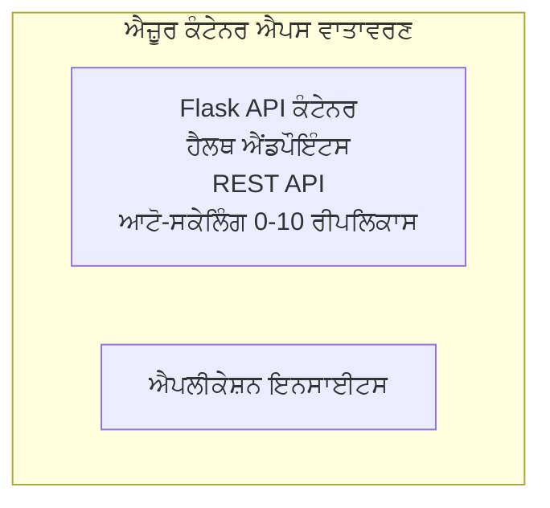

# ਸਧਾਰਨ Flask API - Container App ਉਦਾਹਰਨ

**ਸਿੱਖਣ ਦਾ ਰਸਤਾ:** ਸ਼ੁਰੂਆਤੀ ⭐ | **ਸਮਾਂ:** 25-35 minutes | **ਲਾਗਤ:** $0-15/month

ਇੱਕ ਪੂਰਾ, ਕੰਮ ਕਰ ਰਿਹਾ Python Flask REST API ਜੋ Azure Container Apps 'ਤੇ Azure Developer CLI (azd) ਦੀ ਵਰਤੋਂ ਨਾਲ ਡਿਪਲੋਇ ਕੀਤਾ ਗਿਆ ਹੈ। ਇਹ ਉਦਾਹਰਨ ਕੰਟੇਨਰ ਡਿਪਲੋਇਮੈਂਟ, ਆਟੋ-ਸਕੇਲਿੰਗ, ਅਤੇ ਨਿਰੀਖਣ ਦੀਆਂ ਬੁਨਿਆਦੀ ਗੱਲਾਂ ਦਿਖਾਉਂਦੀ ਹੈ।

## 🎯 ਤੁਸੀਂ ਕੀ ਸਿੱਖੋਗੇ

- ਐਜ਼ੂਰ 'ਤੇ ਇੱਕ ਕੰਟੇਨਰਕ੍ਰਿਤ Python ਐਪ ਡਿਪਲੋਇ ਕਰਨਾ
- ਸਕੇਲ-ਟੂ-ਜ਼ੀਰੋ ਸਮੇਤ ਆਟੋ-ਸਕੇਲਿੰਗ ਸੰਰਚਨਾ ਕਰਨੀ
- ਹੈਲਥ ਪ੍ਰੋਬਸ ਅਤੇ ਰੈਡੀਨੈਸ ਚੈੱਕ ਲਾਗੂ ਕਰਨਾ
- ਐਪਲਿਕੇਸ਼ਨ ਲੌਗ ਅਤੇ ਮੈਟ੍ਰਿਕਸ ਦੀ ਨਿਗਰਾਨੀ ਕਰਨਾ
- ਤੇਜ਼ ਡਿਪਲੋਇਮੈਂਟ ਲਈ Azure Developer CLI ਦੀ ਵਰਤੋਂ

## 📦 ਕੀ ਸ਼ਾਮਲ ਹੈ

✅ **Flask Application** - CRUD ਓਪਰੇਸ਼ਨਸ ਨਾਲ ਪੂਰਾ REST API (`src/app.py`)  
✅ **Dockerfile** - ਪ੍ਰੋਡਕਸ਼ਨ-ਰੈਡੀ ਕੰਟੇਨਰ ਸੰਰਚਨਾ  
✅ **Bicep Infrastructure** - Container Apps ਮਾਹੌਲ ਅਤੇ API ਡਿਪਲੋਇਮੈਂਟ  
✅ **AZD Configuration** - ਇੱਕ-ਕਮਾਂਡ ਡਿਪਲੋਇਮੈਂਟ ਸੈਟਅੱਪ  
✅ **Health Probes** - ਲਾਈਵਨੇਸ ਅਤੇ ਰੈਡੀਨੇਸ ਚੈੱਕਸ ਸੈਟ ਕੀਤੇ ਗਏ  
✅ **Auto-scaling** - HTTP ਲੋਡ ਦੇ ਅਧਾਰ 'ਤੇ 0-10 ਰਿਪਲਿਕਾਸ  

## Architecture



## ਪ੍ਰੀਰਿਕਵਿਜ਼ਾਈਟਸ

### ਲਾਜ਼ਮੀ
- **Azure Developer CLI (azd)** - [ਇੰਸਟਾਲ ਗਾਈਡ](https://learn.microsoft.com/azure/developer/azure-developer-cli/install-azd)
- **Azure subscription** - [Free account](https://azure.microsoft.com/free/)
- **Docker Desktop** - [Docker ਇੰਸਟਾਲ](https://www.docker.com/products/docker-desktop/) (ਸਥਾਨਕ ਟੈਸਟਿੰਗ ਲਈ)

### Verify Prerequisites

```bash
# azd ਵਰਜ਼ਨ ਦੀ ਜਾਂਚ ਕਰੋ (1.5.0 ਜਾਂ ਉਸ ਤੋਂ ਉੱਚਾ ਲੋੜੀਂਦਾ ਹੈ)
azd version

# Azure ਲੌਗਿਨ ਦੀ ਪੁਸ਼ਟੀ ਕਰੋ
azd auth login

# Docker ਦੀ ਜਾਂਚ ਕਰੋ (ਵਿਕਲਪਿਕ, ਸਥਾਨਕ ਟੈਸਟਿੰਗ ਲਈ)
docker --version
```

## ⏱️ ਡਿਪਲੋਇਮੈਂਟ ਟਾਈਮਲਾਈਨ

| Phase | Duration | What Happens |
|-------|----------|--------------||
| Environment setup | 30 seconds | azd ਮਾਹੌਲ ਬਣਾਓ |
| Build container | 2-3 minutes | Docker ਨਾਲ Flask ਐਪ ਬਿਲਡ ਕਰੋ |
| Provision infrastructure | 3-5 minutes | Container Apps, ਰਜਿਸਟਰੀ, ਨਿਰੀਖਣ ਬਣਾਓ |
| Deploy application | 2-3 minutes | ਇਮੇਜ ਪুশ ਕਰੋ ਅਤੇ Container Apps 'ਤੇ ਡਿਪਲੋਇ ਕਰੋ |
| **Total** | **8-12 minutes** | Complete deployment ready |

## ਤੁਰੰਤ ਸ਼ੁਰੂਆਤ

```bash
# ਉਦਾਹਰਨ ਵੱਲ ਜਾਓ
cd examples/container-app/simple-flask-api

# ਮਾਹੌਲ ਸ਼ੁਰੂ ਕਰੋ (ਇੱਕ ਵਿਲੱਖਣ ਨਾਮ ਚੁਣੋ)
azd env new myflaskapi

# ਸਭ ਕੁਝ ਡਿਪਲੌਇ ਕਰੋ (ਇੰਫ੍ਰਾਸਟ੍ਰਕਚਰ + ਐਪਲੀਕੇਸ਼ਨ)
azd up
# ਤੁਹਾਨੂੰ ਪੁੱਛਿਆ ਜਾਵੇਗਾ:
# 1. Azure ਸਬਸਕ੍ਰਿਪਸ਼ਨ ਚੁਣੋ
# 2. ਟਿਕਾਣਾ ਚੁਣੋ (ਜਿਵੇਂ, eastus2)
# 3. ਡਿਪਲੌਇਮੈਂਟ ਲਈ 8-12 ਮਿੰਟ ਰੁਕੋ

# ਆਪਣਾ API ਐਂਡਪੌਇੰਟ ਪ੍ਰਾਪਤ ਕਰੋ
azd env get-values

# API ਦੀ ਜਾਂਚ ਕਰੋ
curl $(azd env get-value API_ENDPOINT)/health
```

**ਉਮੀਦ ਕੀਤੀ ਆਉਟਪੁੱਟ:**
```json
{
  "status": "healthy",
  "timestamp": "2025-11-19T10:30:00Z",
  "service": "simple-flask-api",
  "version": "1.0.0"
}
```

## ✅ ਡਿਪਲੋਇਮੈਂਟ ਦੀ ਜਾਂਚ

### ਕਦਮ 1: ਡਿਪਲੋਇਮੈਂਟ ਸਥਿਤੀ ਦੀ ਜਾਂਚ

```bash
# ਤੈਨਾਤ ਕੀਤੀਆਂ ਸੇਵਾਵਾਂ ਵੇਖੋ
azd show

# ਉਮੀਦ ਕੀਤੀ ਆਉਟਪੁੱਟ ਦਰਸਾਉਂਦੀ ਹੈ:
# - ਸੇਵਾ: api
# - ਐਂਡਪੋਇੰਟ: https://ca-api-[env].xxx.azurecontainerapps.io
# - ਸਥਿਤੀ: ਚੱਲ ਰਹੀ ਹੈ
```

### ਕਦਮ 2: API ਐਂਡਪੌਇੰਟ ਟੈਸਟ ਕਰੋ

```bash
# API ਐਂਡਪੋਇੰਟ ਪ੍ਰਾਪਤ ਕਰੋ
API_URL=$(azd env get-value API_ENDPOINT)

# ਸਿਹਤ ਦੀ ਜਾਂਚ ਕਰੋ
curl $API_URL/health

# ਰੂਟ ਐਂਡਪੀਓਇੰਟ ਦੀ ਜਾਂਚ ਕਰੋ
curl $API_URL/

# ਇੱਕ ਆਈਟਮ ਬਣਾਓ
curl -X POST $API_URL/api/items \
  -H "Content-Type: application/json" \
  -d '{"name": "Test Item", "description": "My first item"}'

# ਸਾਰੇ ਆਈਟਮ ਪ੍ਰਾਪਤ ਕਰੋ
curl $API_URL/api/items
```

**ਸਫਲਤਾ ਮਾਪਦੰਡ:**
- ✅ ਹੈਲਥ ਐਂਡਪੌਇੰਟ HTTP 200 ਵਾਪਸ ਕਰਦਾ ਹੈ
- ✅ ਰੂਟ ਐਂਡਪੌਇੰਟ API ਜਾਣਕਾਰੀ ਦਿਖਾਉਂਦਾ ਹੈ
- ✅ POST ਆਈਟਮ ਬਣਾਉਂਦਾ ਹੈ ਅਤੇ HTTP 201 ਵਾਪਸ ਕਰਦਾ ਹੈ
- ✅ GET ਬਣਾਈਆਂ ਗਈਆਂ ਆਈਟਮ ਵਾਪਸ ਕਰਦਾ ਹੈ

### ਕਦਮ 3: ਲੌਗ ਵੇਖੋ

```bash
# azd monitor ਦੀ ਵਰਤੋਂ ਕਰਕੇ ਲਾਈਵ ਲੌਗ ਸਟ੍ਰੀਮ ਕਰੋ
azd monitor --logs

# ਜਾਂ Azure CLI ਦੀ ਵਰਤੋਂ ਕਰੋ:
az containerapp logs show --name api --resource-group $RG_NAME --follow

# ਤੁਹਾਨੂੰ ਇਹ ਦੇਖਣਾ ਚਾਹੀਦਾ ਹੈ:
# - Gunicorn ਸਟਾਰਟਅਪ ਸੁਨੇਹੇ
# - HTTP ਬੇਨਤੀ ਲੌਗ
# - ਐਪਲੀਕੇਸ਼ਨ ਜਾਣਕਾਰੀ ਲੌਗ
```

## ਪ੍ਰੋਜੈਕਟ ਦੀ ਸਰਚਨਾ

```
simple-flask-api/
├── azure.yaml              # AZD configuration
├── infra/
│   ├── main.bicep         # Main infrastructure
│   ├── main.parameters.json
│   └── app/
│       ├── container-env.bicep
│       └── api.bicep
└── src/
    ├── app.py             # Flask application
    ├── requirements.txt
    └── Dockerfile
```

## API ਐਂਡਪੌਇੰਟ

| Endpoint | Method | Description |
|----------|--------|-------------|
| `/health` | GET | ਸਿਹਤ ਜਾਂਚ |
| `/api/items` | GET | ਸਾਰੇ ਆਈਟਮ ਦੀ ਸੂਚੀ |
| `/api/items` | POST | ਨਵਾਂ ਆਈਟਮ ਬਣਾਓ |
| `/api/items/{id}` | GET | ਕਿਸੇ ਖ਼ਾਸ ਆਈਟਮ ਪ੍ਰਾਪਤ ਕਰੋ |
| `/api/items/{id}` | PUT | ਆਈਟਮ ਅਪਡੇਟ ਕਰੋ |
| `/api/items/{id}` | DELETE | ਆਈਟਮ ਮਿਟਾਓ |

## ਕੰਫਿਗਰੇਸ਼ਨ

### Environment Variables

```bash
# ਕਸਟਮ ਸੰਰਚਨਾ ਸੈੱਟ ਕਰੋ
azd env set PORT 8000
azd env set LOG_LEVEL info
azd env set MAX_REPLICAS 20
```

### ਸਕੇਲਿੰਗ ਸੰਰਚਨਾ

API HTTP ਟ੍ਰੈਫਿਕ ਦੇ ਅਧਾਰ 'ਤੇ ਆਟੋਮੈਟਿਕ ਤੌਰ 'ਤੇ ਸਕੇਲ ਹੁੰਦੀ ਹੈ:
- **Min Replicas**: 0 (ਨਿਸ਼ਕ੍ਰਿਆ ਹੋਣ 'ਤੇ ਜ਼ੀਰੋ ਤੱਕ ਸਕੇਲ)
- **Max Replicas**: 10
- **Concurrent Requests per Replica**: 50

## ਡਿਵੈਲਪਮੈਂਟ

### ਲੋਕਲੀ ਤੌਰ 'ਤੇ ਚਲਾਓ

```bash
# ਨਿਰਭਰਤਾਵਾਂ ਨੂੰ ਇੰਸਟਾਲ ਕਰੋ
cd src
pip install -r requirements.txt

# ਐਪ ਚਲਾਓ
python app.py

# ਸਥਾਨਕ ਤੌਰ 'ਤੇ ਟੈਸਟ ਕਰੋ
curl http://localhost:8000/health
```

### ਕੰਟੇਨਰ ਬਿਲਡ ਅਤੇ ਟੈਸਟ ਕਰੋ

```bash
# Docker ਇਮੇਜ ਬਣਾਓ
docker build -t flask-api:local ./src

# ਕੰਟੇਨਰ ਨੂੰ ਸਥਾਨਕ ਤੌਰ 'ਤੇ ਚਲਾਓ
docker run -p 8000:8000 flask-api:local

# ਕੰਟੇਨਰ ਦੀ ਜਾਂਚ ਕਰੋ
curl http://localhost:8000/health
```

## ਡਿਪਲੋਇਮੈਂਟ

### ਪੂਰਾ ਡਿਪਲੋਇਮੈਂਟ

```bash
# ਇੰਫਰਾਸਟ੍ਰਕਚਰ ਅਤੇ ਐਪਲੀਕੇਸ਼ਨ ਤਾਇਨਾਤ ਕਰੋ
azd up
```

### ਸਿਰਫ਼ ਕੋਡ ਡਿਪਲੋਇਮੈਂਟ

```bash
# ਸਿਰਫ਼ ਐਪਲੀਕੇਸ਼ਨ ਕੋਡ ਨੂੰ ਤੈਨਾਤ ਕਰੋ (ਇੰਫਰਾਸਟਰੱਕਚਰ ਬਦਲੇ ਬਿਨਾਂ)
azd deploy api
```

### ਸੰਰਚਨਾ ਨੂੰ ਅਪਡੇਟ ਕਰੋ

```bash
# ਮਾਹੌਲ ਦੇ ਵੇਰੀਏਬਲਾਂ ਅਪਡੇਟ ਕਰੋ
azd env set API_KEY "new-api-key"

# ਨਵੀਂ ਸੰਰਚਨਾ ਨਾਲ ਦੁਬਾਰਾ ਡਿਪਲੋਇ ਕਰੋ
azd deploy api
```

## ਨਿਰੀਖਣ

### ਲੌਗ ਵੇਖੋ

```bash
# azd monitor ਦੀ ਵਰਤੋਂ ਕਰਕੇ ਲਾਈਵ ਲੌਗ ਸਟਰੀਮ ਕਰੋ
azd monitor --logs

# ਜਾਂ Container Apps ਲਈ Azure CLI ਵਰਤੋ:
az containerapp logs show --name api --resource-group $RG_NAME --follow

# ਆਖਰੀ 100 ਲਾਈਨਾਂ ਵੇਖੋ
az containerapp logs show --name api --resource-group $RG_NAME --tail 100
```

### ਮੀਟ੍ਰਿਕਸ ਨਿਰੀਖਣ ਕਰੋ

```bash
# Azure Monitor ਡੈਸ਼ਬੋਰਡ ਖੋਲ੍ਹੋ
azd monitor --overview

# ਖਾਸ ਮੈਟ੍ਰਿਕਸ ਵੇਖੋ
az monitor metrics list \
  --resource $(azd show --output json | jq -r '.services.api.resourceId') \
  --metric "Requests,ResponseTime"
```

## ਟੈਸਟਿੰਗ

### ਹੈਲਥ ਚੈੱਕ

```bash
curl $(azd show --output json | jq -r '.services.api.endpoint')/health
```

ਉਮੀਦ ਕੀਤੀ ਜਵਾਬ:
```json
{
  "status": "healthy",
  "timestamp": "2025-11-19T10:30:00Z"
}
```

### ਆਈਟਮ ਬਣਾਓ

```bash
curl -X POST $(azd show --output json | jq -r '.services.api.endpoint')/api/items \
  -H "Content-Type: application/json" \
  -d '{"name": "Test Item", "description": "A test item"}'
```

### ਸਾਰੇ ਆਈਟਮ ਪ੍ਰਾਪਤ ਕਰੋ

```bash
curl $(azd show --output json | jq -r '.services.api.endpoint')/api/items
```

## ਲਾਗਤ ਅਨੁਕੂਲਤਾ

ਇਹ ਡਿਪਲੋਇਮੈਂਟ ਸਕੇਲ-ਟੂ-ਜ਼ੀਰੋ ਦੀ ਵਰਤੋਂ ਕਰਦਾ ਹੈ, ਇਸ ਲਈ ਤੁਸੀਂ ਸਿਰਫ਼ ਉਸ ਵੇਲੇ ਭੁਗਤਾਨ ਕਰਦੇ ਹੋ ਜਦੋਂ API ਬੇਨਤੀ ਪ੍ਰੋਸੈਸ ਕਰ ਰਿਹਾ ਹੁੰਦਾ ਹੈ:

- **Idle cost**: ~$0/month (ਜ਼ੀਰੋ ਤੱਕ ਸਕੇਲ)
- **Active cost**: ~$0.000024/second per replica
- **ਉਮੀਦ ਕੀਤੀ ਮਹੀਨਾਵਾਰ ਲਾਗਤ** (ਹਲਕੀ ਵਰਤੋਂ): $5-15

### ਲਾਗਤ ਹੋਰ ਘਟਾਓ

```bash
# ਡੈਵ ਲਈ ਅਧਿਕਤਮ ਨਕਲਾਂ ਘਟਾਓ
azd env set MAX_REPLICAS 3

# ਛੋਟੀ ਨਿਸ਼ਕ੍ਰਿਆ ਸਮਾਂ ਸੀਮਾ ਵਰਤੋ
azd env set SCALE_TO_ZERO_TIMEOUT 300  # 5 ਮਿੰਟ
```

## ਟ੍ਰਬਲਸ਼ੂਟਿੰਗ

### ਕੰਟੇਨਰ ਸ਼ੁਰੂ ਨਹੀਂ ਹੋ ਰਿਹਾ

```bash
# Azure CLI ਦੀ ਵਰਤੋਂ ਕਰਕੇ ਕੰਟੇਨਰ ਲੌਗਾਂ ਦੀ ਜਾਂਚ ਕਰੋ
az containerapp logs show --name api --resource-group $RG_NAME --tail 100

# ਸਥਾਨਕ ਤੌਰ ਤੇ Docker ਇਮੇਜਾਂ ਦੇ ਬਣਨ ਦੀ ਜਾਂਚ ਕਰੋ
docker build -t test ./src
```

### API ਪਹੁੰਚਯੋਗ ਨਹੀਂ

```bash
# ਪੁਸ਼ਟੀ ਕਰੋ ਕਿ ਇਨਗ੍ਰੈਸ ਬਾਹਰੀ ਹੈ
az containerapp show --name api --resource-group rg-simple-flask-api \
  --query properties.configuration.ingress.external
```

### ਉੱਚੀ ਪ੍ਰਤੀਕਿਰਿਆ ਸਮਾਂ

```bash
# CPU/ਮੈਮਰੀ ਦੇ ਉਪਯੋਗ ਦੀ ਜਾਂਚ ਕਰੋ
az monitor metrics list \
  --resource $(azd show --output json | jq -r '.services.api.resourceId') \
  --metric "CPUPercentage,MemoryPercentage"

# ਲੋੜ ਹੋਣ ਤੇ ਸਰੋਤ ਵਧਾਓ
az containerapp update --name api --resource-group rg-simple-flask-api \
  --cpu 1.0 --memory 2Gi
```

## ਸਾਫ਼-ਅਪ

```bash
# ਸਾਰੇ ਸੰਸਾਧਨਾਂ ਨੂੰ ਮਿਟਾਓ
azd down --force --purge
```

## ਅਗਲੇ ਕਦਮ

### ਇਸ ਉਦਾਹਰਨ ਨੂੰ ਫੈਲਾਓ

1. **ਡੇਟਾਬੇਸ ਸ਼ਾਮਲ ਕਰੋ** - Azure Cosmos DB ਜਾਂ SQL Database ਨੂੰ ਇੰਟੇਗ੍ਰੇਟ ਕਰੋ
   ```bash
   # infra/main.bicep ਵਿੱਚ Cosmos DB ਮੌਡੀਊਲ ਸ਼ਾਮਿਲ ਕਰੋ
   # app.py ਨੂੰ ਡੇਟਾਬੇਸ ਕਨੈਕਸ਼ਨ ਨਾਲ ਅਪਡੇਟ ਕਰੋ
   ```

2. **ਪਹੁੰਚ ਨਿਰਧਾਰਿਤ ਕਰੋ** - Microsoft Entra ID ਜਾਂ API کیز ਲਾਗੂ ਕਰੋ
   ```python
   # app.py ਵਿੱਚ ਪ੍ਰਮਾਣੀਕਰਨ ਮਿਡਲਵੇਅਰ ਜੋੜੋ
   from functools import wraps
   ```

3. **CI/CD ਸੈਟ ਕਰੋ** - GitHub Actions ਵਰਕਫ਼ਲੋ
   ```yaml
   # Create .github/workflows/deploy.yml
   name: Deploy to Azure
   on: [push]
   ```

4. **ਮੇਨੇਜਡ ਆਈਡੈਂਟਿਟੀ ਸ਼ਾਮਲ ਕਰੋ** - Azure ਸੇਵਾਵਾਂ ਤੱਕ ਸੁਰੱਖਿਅਤ ਪਹੁੰਚ
   ```bicep
   # Update infra/app/api.bicep
   identity: { type: 'SystemAssigned' }
   ```

### ਸੰਬੰਧਤ ਉਦਾਹਰਨਾਂ

- **[Database App](../../../../../examples/database-app)** - SQL Database ਨਾਲ ਪੂਰੀ ਉਦਾਹਰਨ
- **[Microservices](../../../../../examples/container-app/microservices)** - ਬਹੁ-ਸੇਵਾ ਆਰਕੀਟੈਕਚਰ
- **[Container Apps Master Guide](../README.md)** - ਸਾਰੇ ਕੰਟੇਨਰ ਪੈਟਰਨ

### ਸਿੱਖਣ ਵਾਲੇ ਸਰੋਤ

- 📚 [AZD For Beginners Course](../../../README.md) - ਮੁੱਖ ਕੋਰਸ ਹੋਮ
- 📚 [Container Apps Patterns](../README.md) - ਹੋਰ ਡਿਪਲੋਇਮੈਂਟ ਪੈਟਰਨ
- 📚 [AZD Templates Gallery](https://azure.github.io/awesome-azd/) - ਸਮੁਦਾਇਕ ਟੈਮਪਲੇਟਸ

## ਅਤਿਰਿਕਤ ਸਰੋਤ

### ਦਸਤਾਵੇਜ਼
- **[Flask Documentation](https://flask.palletsprojects.com/)** - Flask ਫਰੇਮਵਰਕ ਗਾਈਡ
- **[Azure Container Apps](https://learn.microsoft.com/azure/container-apps/)** - ਅਧਿਕਾਰਿਕ Azure ਦਸਤਾਵੇਜ਼
- **[Azure Developer CLI](https://learn.microsoft.com/azure/developer/azure-developer-cli/)** - azd ਕਮਾਂਡ ਰੈਫਰੰਸ

### ਟਿਊਟੋਰਿਅਲ
- **[Container Apps Quickstart](https://learn.microsoft.com/azure/container-apps/quickstart-portal)** - ਆਪਣੀ ਪਹਿਲੀ ਐਪ ਡਿਪਲੋਇ ਕਰੋ
- **[Python on Azure](https://learn.microsoft.com/azure/developer/python/)** - Python ਡਿਵੈਲਪਮੈਂਟ ਗਾਈਡ
- **[Bicep Language](https://learn.microsoft.com/azure/azure-resource-manager/bicep/)** - Infrastructure as code

### ਟੂਲਸ
- **[Azure Portal](https://portal.azure.com)** - ਰਿਸੋਰਸਾਂ ਨੂੰ ਵਿਜ਼ੂਅਲ ਤਰੀਕੇ ਨਾਲ ਮੈਨੇਜ ਕਰੋ
- **[VS Code Azure Extension](https://marketplace.visualstudio.com/items?itemName=ms-azuretools.vscode-azurecontainerapps)** - IDE ਇੰਟੇਗ੍ਰੇਸ਼ਨ

---

**🎉 ਵਧਾਈਆਂ!** ਤੁਸੀਂ auto-scaling ਅਤੇ ਨਿਰੀਖਣ ਸਮੇਤ ਇੱਕ ਪ੍ਰੋਡਕਸ਼ਨ-ਰੈਡੀ Flask API ਨੂੰ Azure Container Apps 'ਤੇ ਡਿਪਲੋਇ ਕਰ ਲਿਆ ਹੈ।

**ਸਵਾਲ?** [ਇੱਕ ਇਸ਼ੂ ਖੋਲ੍ਹੋ](https://github.com/microsoft/AZD-for-beginners/issues) ਜਾਂ [FAQ](../../../resources/faq.md) ਨੂੰ ਚੈੱਕ ਕਰੋ

---

<!-- CO-OP TRANSLATOR DISCLAIMER START -->
**ਅਸਵੀਕਾਰੋਪਣ**:
ਇਸ ਦਸਤਾਵੇਜ਼ ਦਾ ਅਨੁਵਾਦ ਏਆਈ ਅਨੁਵਾਦ ਸੇਵਾ [Co-op Translator](https://github.com/Azure/co-op-translator) ਦੀ ਵਰਤੋਂ ਕਰਕੇ ਕੀਤਾ ਗਿਆ ਹੈ। ਜਦੋਂ ਕਿ ਅਸੀਂ ਸਹੀਤਾਵਾਂ ਲਈ ਯਤਨਸ਼ੀਲ ਹਾਂ, ਕਿਰਪਾ ਕਰਕੇ ਧਿਆਨ ਰੱਖੋ ਕਿ ਸਵੈਚਾਲਿਤ ਅਨੁਵਾਦਾਂ ਵਿੱਚ ਗਲਤੀਆਂ ਜਾਂ ਅਸਮੱਤਿਆਵਾਂ ਹੋ ਸਕਦੀਆਂ ਹਨ। ਮੂਲ ਦਸਤਾਵੇਜ਼ ਆਪਣੀ ਮੂਲ ਭਾਸ਼ਾ ਵਿੱਚ ਅਧਿਕਾਰਕ ਸਰੋਤ ਮੰਨਿਆ ਜਾਣਾ ਚਾਹੀਦਾ ਹੈ। ਜਰੂਰੀ ਜਾਣਕਾਰੀ ਲਈ, ਪੇਸ਼ੇਵਰ ਮਨੁੱਖੀ ਅਨੁਵਾਦ ਦੀ ਸਿਫ਼ਾਰਸ਼ ਕੀਤੀ ਜਾਂਦੀ ਹੈ। ਅਸੀਂ ਇਸ ਅਨੁਵਾਦ ਦੇ ਉਪਯੋਗ ਤੋਂ ਪੈਦਾ ਹੋਣ ਵਾਲੀਆਂ ਕਿਸੇ ਵੀ ਗਲਤਫਹਿਮੀਆਂ ਜਾਂ ਗਲਤ ਵਿਆਖਿਆਵਾਂ ਲਈ ਜਵਾਬਦੇਹ ਨਹੀਂ ਹਾਂ।
<!-- CO-OP TRANSLATOR DISCLAIMER END -->