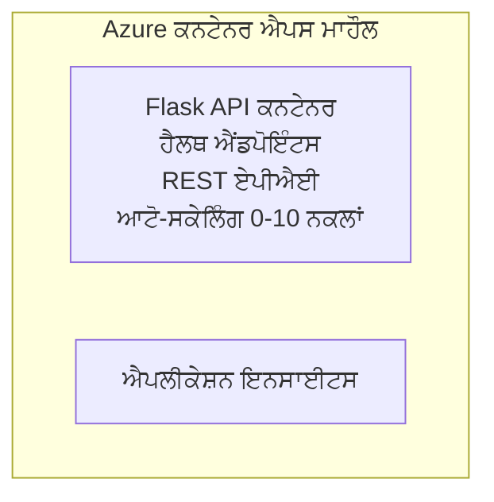

# ਸਧਾਰਣ Flask API - Container App ਉਦਾਹਰਣ

**Learning Path:** ਸ਼ੁਰੂਆਤੀ ⭐ | **Time:** 25-35 ਮਿੰਟ | **Cost:** $0-15/ਮਹੀਨਾ

ਇੱਕ مکمل, ਕੰਮ ਕਰਨ ਵਾਲਾ Python Flask REST API ਜੋ Azure Container Apps 'ਤੇ Azure Developer CLI (azd) ਦੀ ਵਰਤੋਂ ਨਾਲ ਤੈਅ ਕੀਤਾ ਗਿਆ ਹੈ। ਇਹ ਉਦਾਹਰਣ ਕੰਟੇਨਰ ਡਿਪਲੋਇਮੈਂਟ, ਆਟੋ-ਸਕੇਲਿੰਗ, ਅਤੇ ਮਾਨੀਟਰਨਿੰਗ ਦੀਆਂ ਬੁਨਿਆਦੀ ਗੱਲਾਂ ਦਿਖਾਉਂਦੀ ਹੈ।

## 🎯 ਤੁਹਾਨੂੰ ਕੀ ਸਿਖਣ ਨੂੰ ਮਿਲੇਗਾ

- Azure 'ਤੇ ਇੱਕ ਕੰਟੇਨਰਕ੍ਰਿਤ Python ਐਪ ਤੈਅ ਕਰਨਾ
- scale-to-zero ਦੇ ਨਾਲ ਆਟੋ-ਸਕੇਲਿੰਗ ਨੂੰ ਸੰਰਚਿਤ ਕਰਨਾ
- ਹੈਲਥ ਪ੍ਰੋਬਸ ਅਤੇ ਰੇਡੀਨੇਸ ਚੈੱਕ ਲਾਗੂ ਕਰਨਾ
- ਐਪਲਿਕੇਸ਼ਨ ਲੋਗ ਅਤੇ ਮੈਟ੍ਰਿਕਸ ਦੀ ਮਾਨੀਟਰਨਿੰਗ ਕਰਨਾ
- ਤੇਜ਼ ਡਿਪਲੋਇਮੈਂਟ ਲਈ Azure Developer CLI ਦੀ ਵਰਤੋਂ

## 📦 ਸ਼ਾਮِل ਕੀ ਹੈ

✅ **Flask Application** - CRUD ਆਪਰੇਸ਼ਨਾਂ ਸਮੇਤ ਪੂਰਾ REST API (`src/app.py`)  
✅ **Dockerfile** - ਪ੍ਰੋਡਕਸ਼ਨ-ਤਿਆਰ ਕੰਟੇਨਰ ਸੰਰਚਨਾ  
✅ **Bicep Infrastructure** - Container Apps ਵਾਤਾਵਰਨ ਅਤੇ API ਡਿਪਲੋਇਮੈਂਟ  
✅ **AZD Configuration** - ਇਕ-ਕਮਾਂਡ ਡਿਪਲੋਇਮੈਂਟ ਸੈਟਅੱਪ  
✅ **Health Probes** - ਲਾਈਵਨੇਸ ਅਤੇ ਰੇਡੀਨੇਸ ਚੈੱਕ ਸੰਰਚਿਤ  
✅ **Auto-scaling** - HTTP ਲੋਡ ਦੇ ਅਧਾਰ 'ਤੇ 0-10 ਰੀਪਲਿਕਾਜ਼  

## Architecture


## ਲੋੜੀਂਦੀਆਂ ਚੀਜ਼ਾਂ

### ਲਾਜ਼ਮੀ
- **Azure Developer CLI (azd)** - [ਇੰਸਟਾਲ ਗਾਈਡ](https://learn.microsoft.com/azure/developer/azure-developer-cli/install-azd)
- **Azure subscription** - [ਮੁਫ਼ਤ ਖਾਤਾ](https://azure.microsoft.com/free/)
- **Docker Desktop** - [Docker ਇੰਸਟਾਲ ਕਰੋ](https://www.docker.com/products/docker-desktop/) (ਲੋਕਲ ਟੈਸਟਿੰਗ ਲਈ)

### ਲੋੜੀਂਦੀਆਂ ਚੀਜ਼ਾਂ ਦੀ ਜਾਂਚ

```bash
# azd ਵਰਜ਼ਨ ਦੀ ਜਾਂਚ ਕਰੋ (ਲੋੜ ਹੈ 1.5.0 ਜਾਂ ਉਸ ਤੋਂ ਉੱਪਰ)
azd version

# Azure ਲਾਗਇਨ ਦੀ ਪੁਸ਼ਟੀ ਕਰੋ
azd auth login

# Docker ਦੀ ਜਾਂਚ ਕਰੋ (ਵਿਕਲਪਿਕ, ਸਥਾਨਕ ਟੈਸਟਿੰਗ ਲਈ)
docker --version
```

## ⏱️ ਡਿਪਲੋਇਮੈਂਟ ਦੀ ਸਮਾਂਰੇਖਾ

| Phase | Duration | What Happens |
|-------|----------|--------------||
| Environment setup | 30 seconds | Create azd environment |
| Build container | 2-3 minutes | Docker build Flask app |
| Provision infrastructure | 3-5 minutes | Create Container Apps, registry, monitoring |
| Deploy application | 2-3 minutes | Push image and deploy to Container Apps |
| **Total** | **8-12 minutes** | Complete deployment ready |

## ਫੁਟਕਾਰ ਸਟਾਰਟ

```bash
# ਉਦਾਹਰਨ ਤੇ ਜਾਓ
cd examples/container-app/simple-flask-api

# ਵਾਤਾਵਰਨ ਦੀ ਸ਼ੁਰੂਆਤ ਕਰੋ (ਇੱਕ ਵਿਲੱਖਣ ਨਾਮ ਚੁਣੋ)
azd env new myflaskapi

# ਸਭ ਕੁਝ ਤਾਇਨਾਤ ਕਰੋ (ਬੁਨਿਆਦੀ ਢਾਂਚਾ + ਐਪਲੀਕੇਸ਼ਨ)
azd up
# ਤੁਹਾਨੂੰ ਪੁੱਛਿਆ ਜਾਵੇਗਾ:
# 1. Azure ਸਬਸਕ੍ਰਿਪਸ਼ਨ ਚੁਣੋ
# 2. ਸਥਾਨ ਚੁਣੋ (ਉਦਾਹਰਨ ਲਈ: eastus2)
# 3. ਤਾਇਨਾਤ ਲਈ 8-12 ਮਿੰਟ ਉਡੀਕ ਕਰੋ

# ਆਪਣਾ API ਐਂਡਪੌਇੰਟ ਪ੍ਰਾਪਤ ਕਰੋ
azd env get-values

# API ਦੀ ਜਾਂਚ ਕਰੋ
curl $(azd env get-value API_ENDPOINT)/health
```

**ਉਮੀਦ ਕੀਤੀ ਆਉਟਪੁੱਟ:**
```json
{
  "status": "healthy",
  "timestamp": "2025-11-19T10:30:00Z",
  "service": "simple-flask-api",
  "version": "1.0.0"
}
```

## ✅ ਡਿਪਲੋਇਮੈਂਟ ਦੀ ਜਾਂਚ

### ਕਦਮ 1: ਡਿਪਲੋਇਮੈਂਟ ਸਥਿਤੀ ਚੈਕ ਕਰੋ

```bash
# ਤਾਇਨਾਤ ਕੀਤੀਆਂ ਸੇਵਾਵਾਂ ਵੇਖੋ
azd show

# ਉਮੀਦ ਕੀਤੀ ਆਉਟਪੁੱਟ ਦਿਖਾਉਂਦੀ ਹੈ:
# - ਸੇਵਾ: api
# - ਐਂਡਪੌਇੰਟ: https://ca-api-[env].xxx.azurecontainerapps.io
# - ਸਥਿਤੀ: ਚੱਲ ਰਹੀ ਹੈ
```

### ਕਦਮ 2: API ਐਂਡਪੋਰਟਸ ਦੀ ਟੈਸਟਿੰਗ

```bash
# API ਐਂਡਪੌਇੰਟ ਪ੍ਰਾਪਤ ਕਰੋ
API_URL=$(azd env get-value API_ENDPOINT)

# ਸਿਹਤ ਦੀ ਜਾਂਚ ਕਰੋ
curl $API_URL/health

# ਰੂਟ ਐਂਡਪੌਇੰਟ ਦੀ ਜਾਂਚ ਕਰੋ
curl $API_URL/

# ਇੱਕ ਆਈਟਮ ਬਣਾਓ
curl -X POST $API_URL/api/items \
  -H "Content-Type: application/json" \
  -d '{"name": "Test Item", "description": "My first item"}'

# ਸਾਰੇ ਆਈਟਮ ਪ੍ਰਾਪਤ ਕਰੋ
curl $API_URL/api/items
```

**ਸਫਲਤਾ ਮਾਪਦੰਡ:**
- ✅ ਹੈਲਥ ਐਂਡਪੋਰਟ HTTP 200 ਵਾਪਸ ਕਰਦਾ ਹੈ
- ✅ ਰੂਟ ਐਂਡਪੋਰਟ API ਜਾਣਕਾਰੀ ਦਿਖਾਉਂਦਾ ਹੈ
- ✅ POST ਆਈਟਮ ਬਣਾਉਂਦਾ ਹੈ ਅਤੇ HTTP 201 ਵਾਪਸ ਕਰਦਾ ਹੈ
- ✅ GET ਬਣਾਏ ਗਏ ਆਈਟਮ ਵਾਪਸ ਕਰਦਾ ਹੈ

### ਕਦਮ 3: ਲੋਗ ਵੇਖੋ

```bash
# azd monitor ਦੀ ਵਰਤੋਂ ਕਰਕੇ ਲਾਈਵ ਲੌਗ ਸਟ੍ਰੀਮ ਕਰੋ
azd monitor --logs

# ਜਾਂ Azure CLI ਦੀ ਵਰਤੋਂ ਕਰੋ:
az containerapp logs show --name api --resource-group $RG_NAME --follow

# ਤੁਹਾਨੂੰ ਇਹ ਦਿਖਾਈ ਦੇਣਾ ਚਾਹੀਦਾ ਹੈ:
# - Gunicorn ਸਟਾਰਟਅਪ ਸੁਨੇਹੇ
# - HTTP ਰਿਕਵੇਸਟ ਲੌਗ
# - ਐਪਲੀਕੇਸ਼ਨ ਜਾਣਕਾਰੀ ਲੌਗ
```

## ਪ੍ਰੋਜੈਕਟ ਢਾਂਚਾ

```
simple-flask-api/
├── azure.yaml              # AZD configuration
├── infra/
│   ├── main.bicep         # Main infrastructure
│   ├── main.parameters.json
│   └── app/
│       ├── container-env.bicep
│       └── api.bicep
└── src/
    ├── app.py             # Flask application
    ├── requirements.txt
    └── Dockerfile
```

## API ਐਂਡਪੋਰਟਸ

| Endpoint | Method | Description |
|----------|--------|-------------|
| `/health` | GET | ਹੈਲਥ ਚੈੱਕ |
| `/api/items` | GET | ਸਭ ਆਈਟਮ ਦੀ ਸੂਚੀ |
| `/api/items` | POST | ਨਵਾਂ ਆਈਟਮ ਬਣਾਓ |
| `/api/items/{id}` | GET | ਖਾਸ ਆਈਟਮ ਪ੍ਰਾਪਤ ਕਰੋ |
| `/api/items/{id}` | PUT | ਆਈਟਮ ਅੱਪਡੇਟ ਕਰੋ |
| `/api/items/{id}` | DELETE | ਆਈਟਮ ਹਟਾਓ |

## ਸੰਰਚਨਾ

### ਐਨਵਾਇਰਨਮੈਂਟ ਵੈਰੀਏਬਲ

```bash
# ਕਸਟਮ ਸੰਰਚਨਾ ਸੈਟ ਕਰੋ
azd env set PORT 8000
azd env set LOG_LEVEL info
azd env set MAX_REPLICAS 20
```

### ਸਕੇਲਿੰਗ ਸੰਰਚਨਾ

API ਆਪਣੇ ਆਪ HTTP ਟ੍ਰੈਫਿਕ ਦੇ ਅਧਾਰ 'ਤੇ ਸਕੇਲ ਹੁੰਦੀ ਹੈ:
- **Min Replicas**: 0 (ਜਦੋਂ ਬੇਕਾਮ ਹੁੰਦਾ ਹੈ ਤਾਂ zero ਤੱਕ ਸਕੇਲ ਕਰਦਾ ਹੈ)
- **Max Replicas**: 10
- **Concurrent Requests per Replica**: 50

## ਵਿਕਾਸ

### ਲੋਕਲ 'ਚ ਚਲਾਉ

```bash
# ਨਿਰਭਰਤਾਵਾਂ ਸਥਾਪਿਤ ਕਰੋ
cd src
pip install -r requirements.txt

# ਐਪ ਚਲਾਓ
python app.py

# ਸਥਾਨਕ ਤੌਰ 'ਤੇ ਟੈਸਟ ਕਰੋ
curl http://localhost:8000/health
```

### ਕੰਟੇਨਰ ਬਣਾਓ ਅਤੇ ਟੈਸਟ ਕਰੋ

```bash
# Docker ਇਮੇਜ ਬਣਾਓ
docker build -t flask-api:local ./src

# ਸਥਾਨਕ ਤੌਰ ਤੇ ਕੰਟੇਨਰ ਚਲਾਓ
docker run -p 8000:8000 flask-api:local

# ਕੰਟੇਨਰ ਦੀ ਜਾਂਚ ਕਰੋ
curl http://localhost:8000/health
```

## ਡਿਪਲੋਇਮੈਂਟ

### ਪੂਰਾ ਡਿਪਲੋਇਮੈਂਟ

```bash
# ਇਨਫਰਾਸਟਰਕਚਰ ਅਤੇ ਐਪਲੀਕੇਸ਼ਨ ਨੂੰ ਤੈਨਾਤ ਕਰੋ
azd up
```

### ਸਿਰਫ਼ ਕੋਡ ਡਿਪਲੋਇਮੈਂਟ

```bash
# ਸਿਰਫ਼ ਐਪਲੀਕੇਸ਼ਨ ਕੋਡ ਹੀ ਤੈਨਾਤ ਕਰੋ (ਬੁਨਿਆਦੀ ਢਾਂਚਾ ਬਦਲਿਆ ਨਹੀਂ ਗਿਆ)
azd deploy api
```

### ਸੰਰਚਨਾ ਅੱਪਡੇਟ ਕਰੋ

```bash
# ਇਨਵਾਇਰਨਮੈਂਟ ਵੈਰੀਏਬਲ ਅੱਪਡੇਟ ਕਰੋ
azd env set API_KEY "new-api-key"

# ਨਵੀਂ ਸੰਰਚਨਾ ਨਾਲ ਦੁਬਾਰਾ ਤੈਨਾਤ ਕਰੋ
azd deploy api
```

## ਮਾਨੀਟਰਨਿੰਗ

### ਲੋਗ ਵੇਖੋ

```bash
# azd monitor ਦੀ ਵਰਤੋਂ ਕਰਕੇ ਲਾਈਵ ਲੌਗਾਂ ਨੂੰ ਸਟ੍ਰੀਮ ਕਰੋ
azd monitor --logs

# ਜਾਂ Container Apps ਲਈ Azure CLI ਦੀ ਵਰਤੋਂ ਕਰੋ:
az containerapp logs show --name api --resource-group $RG_NAME --follow

# ਆਖਰੀ 100 ਲਾਈਨਾਂ ਵੇਖੋ
az containerapp logs show --name api --resource-group $RG_NAME --tail 100
```

### ਮੈਟ੍ਰਿਕਸ ਮਾਨੀਟਰ ਕਰੋ

```bash
# Azure Monitor ਦਾ ਡੈਸ਼ਬੋਰਡ ਖੋਲੋ
azd monitor --overview

# ਨਿਰਧਾਰਿਤ ਮੈਟ੍ਰਿਕਸ ਵੇਖੋ
az monitor metrics list \
  --resource $(azd show --output json | jq -r '.services.api.resourceId') \
  --metric "Requests,ResponseTime"
```

## ਟੈਸਟਿੰਗ

### ਹੈਲਥ ਚੈੱਕ

```bash
curl $(azd show --output json | jq -r '.services.api.endpoint')/health
```

ਉਮੀਦ ਕੀਤੀ ਜਵਾਬ:
```json
{
  "status": "healthy",
  "timestamp": "2025-11-19T10:30:00Z"
}
```

### ਆਈਟਮ ਬਣਾਓ

```bash
curl -X POST $(azd show --output json | jq -r '.services.api.endpoint')/api/items \
  -H "Content-Type: application/json" \
  -d '{"name": "Test Item", "description": "A test item"}'
```

### ਸਾਰੇ ਆਈਟਮ ਪ੍ਰਾਪਤ ਕਰੋ

```bash
curl $(azd show --output json | jq -r '.services.api.endpoint')/api/items
```

## ਲਾਗਤ ਦੀ ਖ਼ਰਚ ਘਟਾਉਣ

ਇਹ ਡਿਪਲੋਇਮੈਂਟ scale-to-zero ਵਰਤਦਾ ਹੈ, ਇਸ ਲਈ ਤੁਸੀਂ ਸਿਰਫ਼ ਉਦੋਂ ਹੀ ਭੁਗਤਾਨ ਕਰੋਗੇ ਜਦੋਂ API ਬੇਨਤੀ ਪ੍ਰੋਸੈਸ ਕਰ ਰਿਹਾ ਹੋਵੇ:

- **Idle cost**: ~$0/ਮਹੀਨਾ (zero ਤੱਕ ਸਕੇਲ ਕੀਤਾ ਗਿਆ)
- **Active cost**: ~$0.000024/ਸੈਕਿੰਡ ਪ੍ਰਤੀ ਰੀਪਲਿਕਾ
- **ਉਮੀਦਵਾਰ ਮਹੀਨਾਵਾਰ ਲਾਗਤ** (ਹਲਕੀ ਵਰਤੋਂ): $5-15

### ਅੱਗੇ ਹੋਰ ਲਾਗਤ ਘਟਾਓ

```bash
# ਡੈਵ ਲਈ ਵੱਧ ਤੋਂ ਵੱਧ ਰੇਪਲਿਕਾ ਘਟਾਓ
azd env set MAX_REPLICAS 3

# ਛੋਟਾ ਆਈਡਲ ਟਾਈਮਆਊਟ ਵਰਤੋ
azd env set SCALE_TO_ZERO_TIMEOUT 300  # 5 ਮਿੰਟ
```

## Troubleshooting

### ਕੰਟੇਨਰ ਸ਼ੁਰੂ ਨਹੀਂ ਹੋ ਰਿਹਾ

```bash
# Azure CLI ਦੀ ਵਰਤੋਂ ਕਰਕੇ ਕੰਟੇਨਰ ਲੌਗਾਂ ਦੀ ਜਾਂਚ ਕਰੋ
az containerapp logs show --name api --resource-group $RG_NAME --tail 100

# ਸਥਾਨਕ ਤੌਰ 'ਤੇ Docker ਇਮੇਜਾਂ ਦੇ ਬਣਨ ਦੀ ਜਾਂਚ ਕਰੋ
docker build -t test ./src
```

### API ਪਹੁੰਚਯੋਗ ਨਹੀਂ ਹੈ

```bash
# ਪੁਸ਼ਟੀ ਕਰੋ ਕਿ ਇੰਗਰੈੱਸ ਬਾਹਰੀ ਹੈ
az containerapp show --name api --resource-group rg-simple-flask-api \
  --query properties.configuration.ingress.external
```

### ਉੱਚ ਜਵਾਬ ਸਮਾਂ

```bash
# CPU/ਮੈਮੋਰੀ ਦੀ ਵਰਤੋਂ ਜਾਂਚੋ
az monitor metrics list \
  --resource $(azd show --output json | jq -r '.services.api.resourceId') \
  --metric "CPUPercentage,MemoryPercentage"

# ਜੇ ਲੋੜ ਹੋਵੇ ਤਾਂ ਸਰੋਤ ਵਧਾਓ
az containerapp update --name api --resource-group rg-simple-flask-api \
  --cpu 1.0 --memory 2Gi
```

## ਸਾਫ਼-ਸਫਾਈ

```bash
# ਸਾਰੇ ਸਰੋਤਾਂ ਨੂੰ ਮਿਟਾਓ
azd down --force --purge
```

## ਅਗਲੇ ਕਦਮ

### ਇਸ ਉਦਾਹਰਣ ਨੂੰ ਵਧਾਓ

1. **ਡਾਟਾਬੇਸ ਸ਼ਾਮِل ਕਰੋ** - Azure Cosmos DB ਜਾਂ SQL Database ਨਾਲ ਇੰਟੀਗ੍ਰੇਟ ਕਰੋ
   ```bash
   # Cosmos DB ਮਾਡਿਊਲ ਨੂੰ infra/main.bicep ਵਿੱਚ ਜੋੜੋ
   # app.py ਨੂੰ ਡੇਟਾਬੇਸ ਕਨੈਕਸ਼ਨ ਨਾਲ ਅਪਡੇਟ ਕਰੋ
   ```

2. **ਪ੍ਰਮਾਣਿਕਤਾ ਸ਼ਾਮِل ਕਰੋ** - Azure AD ਜਾਂ API keys ਲਾਗੂ ਕਰੋ
   ```python
   # app.py ਵਿੱਚ ਪ੍ਰਮਾਣਿਕਤਾ ਮਿਡਲਵੇਅਰ ਸ਼ਾਮਲ ਕਰੋ
   from functools import wraps
   ```

3. **CI/CD ਸੈੱਟਅੱਪ ਕਰੋ** - GitHub Actions ਵਰਕਫਲੋ
   ```yaml
   # Create .github/workflows/deploy.yml
   name: Deploy to Azure
   on: [push]
   ```

4. **Managed Identity ਸ਼ਾਮِل ਕਰੋ** - Azure ਸਰਵਿਸਿਜ਼ ਲਈ ਸੁਰੱਖਿਅਤ ਪਹੁੰਚ
   ```bicep
   # Update infra/app/api.bicep
   identity: { type: 'SystemAssigned' }
   ```

### ਸੰਬੰਧਤ ਉਦਾਹਰਣ

- **[Database App](../../../../../examples/database-app)** - SQL Database ਦੇ ਨਾਲ ਪੂਰਾ ਉਦਾਹਰਣ
- **[Microservices](../../../../../examples/container-app/microservices)** - ਬਹੁ-ਸੇਵਾ ਆਰਕੀਟੈਕਚਰ
- **[Container Apps Master Guide](../README.md)** - ਸਾਰੇ ਕੰਟੇਨਰ ਪੈਟਰਨ

### ਸਿੱਖਣ ਦੇ ਸਰੋਤ

- 📚 [AZD For Beginners Course](../../../README.md) - ਮੁੱਖ ਕੋਰਸ ਹੋਮ
- 📚 [Container Apps Patterns](../README.md) - ਹੋਰ ਡਿਪਲੋਇਮੈਂਟ ਪੈਟਰਨ
- 📚 [AZD Templates Gallery](https://azure.github.io/awesome-azd/) - ਕਮਿਊਨਿਟੀ ਟੈਂਪਲੇਟ

## ਵਾਧੂ ਸਰੋਤ

### ਦਸਤਾਵੇਜ਼
- **[Flask Documentation](https://flask.palletsprojects.com/)** - Flask ਫਰੇਮਵਰਕ ਗਾਈਡ
- **[Azure Container Apps](https://learn.microsoft.com/azure/container-apps/)** - ਅਧਿਕਾਰਿਕ Azure ਦਸਤਾਵੇਜ਼
- **[Azure Developer CLI](https://learn.microsoft.com/azure/developer/azure-developer-cli/)** - azd ਕਮਾਂਡ ਸੰਦਰਭ

### ਟਿਊਟੋਰੀਅਲ
- **[Container Apps Quickstart](https://learn.microsoft.com/azure/container-apps/quickstart-portal)** - ਆਪਣੀ ਪਹਿਲੀ ਐਪ ਤੈਅ ਕਰੋ
- **[Python on Azure](https://learn.microsoft.com/azure/developer/python/)** - Python ਵਿਕਾਸ ਗਾਈਡ
- **[Bicep Language](https://learn.microsoft.com/azure/azure-resource-manager/bicep/)** - Infrastructure as code

### ਟੂਲ
- **[Azure Portal](https://portal.azure.com)** - ਰਿਸੋਰਸਾਂ ਨੂੰ ਵਿਜ਼ੂਅਲ ਤਰੀਕੇ ਨਾਲ ਪ੍ਰਬੰਧਿਤ ਕਰੋ
- **[VS Code Azure Extension](https://marketplace.visualstudio.com/items?itemName=ms-azuretools.vscode-azurecontainerapps)** - IDE ਇੰਟੀਗ੍ਰੇਸ਼ਨ

---

**🎉 ਵਧਾਈਆਂ!** ਤੁਸੀਂ auto-scaling ਅਤੇ ਮਾਨੀਟਰਨਿੰਗ ਨਾਲ ਇੱਕ ਪ੍ਰੋਡਕਸ਼ਨ-ਤਿਆਰ Flask API ਨੂੰ Azure Container Apps 'ਤੇ ਤੈਅ ਕੀਤਾ ਹੈ।

**ਸਵਾਲ?** [ਇੱਕ ਇਸ਼ੂ ਖੋਲ੍ਹੋ](https://github.com/microsoft/AZD-for-beginners/issues) ਜਾਂ [FAQ](../../../resources/faq.md) ਵੇਖੋ

---

<!-- CO-OP TRANSLATOR DISCLAIMER START -->
**Disclaimer**:
ਇਸ ਦਸਤਾਵੇਜ਼ ਨੂੰ AI ਅਨੁਵਾਦ ਸੇਵਾ [Co-op Translator](https://github.com/Azure/co-op-translator) ਦੀ ਵਰਤੋਂ ਕਰਕੇ ਅਨੁਵਾਦ ਕੀਤਾ ਗਿਆ ਹੈ। ਹਾਲਾਂਕਿ ਅਸੀਂ ਸਹੀਤਾ ਲਈ ਯਤਨ ਕਰਦੇ ਹਾਂ, ਧਿਆਨ ਰੱਖੋ ਕਿ ਆਟੋਮੈਟਿਕ ਅਨੁਵਾਦਾਂ ਵਿੱਚ ਗਲਤੀਆਂ ਜਾਂ ਅਸਥਿਰਤਾਵਾਂ ਹੋ ਸਕਦੀਆਂ ਹਨ। ਮੂਲ ਦਸਤਾਵੇਜ਼ ਨੂੰ ਉਸ ਦੀ ਮੂਲ ਭਾਸ਼ਾ ਵਿੱਚ ਅਧਿਕਾਰਿਕ ਸਰੋਤ ਮੰਨਿਆ ਜਾਣਾ ਚਾਹੀਦਾ ਹੈ। ਮਹੱਤਵਪੂਰਨ ਜਾਣਕਾਰੀ ਲਈ, ਪੇਸ਼ੇਵਰ ਮਨੁੱਖੀ ਅਨੁਵਾਦ ਦੀ ਸਿਫਾਰਿਸ਼ ਕੀਤੀ ਜਾਂਦੀ ਹੈ। ਅਸੀਂ ਇਸ ਅਨੁਵਾਦ ਦੀ ਵਰਤੋਂ ਦੇ ਨਤੀਜੇ ਵੱਜੋਂ ਉੱਠਣ ਵਾਲੀਆਂ ਕਿਸੇ ਵੀ ਗਲਤਫਹਿਮੀਆਂ ਜਾਂ ਭੁਲ-ਵਿਆਖਿਆਵਾਂ ਲਈ ਜ਼ਿੰਮੇਵਾਰ ਨਹੀਂ ਹਾਂ।
<!-- CO-OP TRANSLATOR DISCLAIMER END -->