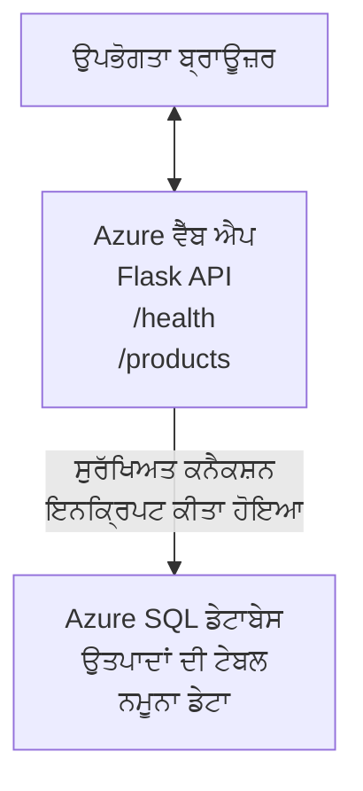

# AZD ਨਾਲ ਇੱਕ Microsoft SQL ਡੇਟਾਬੇਸ ਅਤੇ ਵੈਬ ਐਪ ਤैनਾਤ ਕਰਨਾ

⏱️ **ਅੰਦਾਜ਼ਾ ਸਮਾਂ**: 20-30 ਮਿੰਟ | 💰 **ਅੰਦਾਜ਼ਾ ਲਾਗਤ**: ~$15-25/ਮਹੀਨਾ | ⭐ **ਜਟਿਲਤਾ**: ਦਰਮਿਆਨਾ

ਇਹ **ਪੂਰਾ, ਕੰਮ ਕਰਨ ਵਾਲਾ ਉਦਾਹਰਨ** ਦਿਖਾਉਂਦਾ ਹੈ ਕਿ [Azure ਡਿਵੈਲਪਰ CLI (azd)](https://learn.microsoft.com/azure/developer/azure-developer-cli/) ਦੀ ਵਰਤੋਂ ਕਰਕੇ ਕਿਸ ਤਰ੍ਹਾਂ ਇੱਕ Python Flask ਵੈਬ ਐਪਲੀਕੇਸ਼ਨ ਨੂੰ Microsoft SQL Database ਨਾਲ Azure 'ਤੇ ਤੈਨਾਤ ਕੀਤਾ ਜਾ ਸਕਦਾ ਹੈ। ਸਾਰੇ ਕੋਡ ਸ਼ਾਮਲ ਅਤੇ ਟੈਸਟ ਕੀਤੇ ਗਏ ਹਨ—ਕੋਈ ਬਾਹਰੀ ਨਿਰਭਰਤਾਵਾਂ ਲੋੜੀਂਦੀਆਂ ਨਹੀਂ।

## ਤੁਸੀਂ ਕੀ ਸਿੱਖੋਗੇ

ਇਸ ਉਦਾਹਰਨ ਨੂੰ ਪੂਰਾ ਕਰਕੇ, ਤੁਸੀਂ:
- infrastructure-as-code ਦੀ ਵਰਤੋਂ ਨਾਲ ਇੱਕ ਬਹੁ-ਪੜ੍ਹੀ ਐਪਲੀਕੇਸ਼ਨ (ਵੈਬ ਐਪ + ਡੇਟਾਬੇਸ) ਤੈਨਾਤ ਕਰਨਾ
- ਗੁਪਤ ਜਾਣਕਾਰੀਆਂ ਨੂੰ ਹਾਰਡਕੋਡ ਕੀਤੇ ਬਿਨਾਂ ਸੁਰੱਖਿਅਤ ਤਰੀਕੇ ਨਾਲ ਡੇਟਾਬੇਸ ਕੁਨੈਕਸ਼ਨ ਸੰਰਚਿਤ ਕਰਨਾ
- Application Insights ਨਾਲ ਐਪਲੀਕੇਸ਼ਨ ਦੀ ਸਿਹਤ ਦੀ ਨਿਗਰਾਨੀ ਕਰਨੀ
- AZD CLI ਨਾਲ Azure ਸਾਧਨਾਂ ਨੂੰ ਪ੍ਰਭਾਵਸ਼ਾਲੀ ਢੰਗ ਨਾਲ ਪ੍ਰਬੰਧਿਤ ਕਰਨਾ
- ਸੁਰੱਖਿਆ, ਲਾਗਤ ਅਪਟੀਮਾਈਜ਼ੇਸ਼ਨ, ਅਤੇ ਆਬਜ਼ਰਵੇਬਿਲਿਟੀ ਲਈ Azure ਦੀਆਂ ਸਰਵੋਤਮ ਪ੍ਰਕਿਰਿਆਵਾਂ ਦੀ ਪਾਲਣਾ ਕਰਨੀ

## ਸਨਾਰੀਓ ਓਵਰਵਿਊ
- **Web App**: Python Flask REST API ਜਿਸ ਵਿੱਚ ਡੇਟਾਬੇਸ ਕੁਨੈਕਸ਼ਨ ਹੈ
- **Database**: Azure SQL Database ਸੈਂਪਲ ਡੇਟਾ ਨਾਲ
- **Infrastructure**: Bicep ਦਾ ਉਪਯੋਗ ਕਰਕੇ ਪ੍ਰੋਵਾਇਜ਼ਨ (ਮੋਡੀਊਲਰ, ਰੀਯੂਜ਼ੇਬਲ ਟੈਂਪਲੇਟ)
- **Deployment**: `azd` ਕਮਾਂਡਾਂ ਨਾਲ ਪੂਰਨ ਤੌਰ 'ਤੇ ਆਟੋਮੇਟਡ
- **Monitoring**: ਲਾਗ ਅਤੇ ਟੇਲੀਮੇਟਰੀ ਲਈ Application Insights

## ਪਹਿਲਾਂ ਲੋੜੀਂਦੀਆਂ ਸ਼ਰਤਾਂ

### ਲੋੜੀਂਦੇ ਟੂਲ

ਸ਼ੁਰੂ ਕਰਨ ਤੋਂ ਪਹਿਲਾਂ, ਇਹ ਯਕੀਨੀ ਬਣਾਓ ਕਿ ਤੁਸੀਂ ਹੇਠਾਂ ਦਿੱਤੇ ਟੂਲ ਇੰਸਟਾਲ ਕੀਤੇ ਹੋ:

1. **[Azure CLI](https://learn.microsoft.com/cli/azure/install-azure-cli)** (ਸੰਸਕਰਨ 2.50.0 ਜਾਂ ਉੱਪਰ)
   ```sh
   az --version
   # ਉਮੀਦ ਕੀਤੀ ਆਉਟਪੁੱਟ: azure-cli 2.50.0 ਜਾਂ ਵੱਧ
   ```

2. **[Azure ਡਿਵੈਲਪਰ CLI (azd)](https://learn.microsoft.com/azure/developer/azure-developer-cli/install-azd)** (ਸੰਸਕਰਨ 1.0.0 ਜਾਂ ਉੱਪਰ)
   ```sh
   azd version
   # ਉਮੀਦ ਕੀਤੀ ਆਉਟਪੁੱਟ: azd ਦਾ ਵਰਜਨ 1.0.0 ਜਾਂ ਇਸ ਤੋਂ ਉੱਚਾ
   ```

3. **[Python 3.8+](https://www.python.org/downloads/)** (ਲੋਕਲ ਵਿਕਾਸ ਲਈ)
   ```sh
   python --version
   # ਉਮੀਦ ਕੀਤੀ ਆਉਟਪੁੱਟ: Python 3.8 ਜਾਂ ਇਸ ਤੋਂ ਉੱਪਰ
   ```

4. **[Docker](https://www.docker.com/get-started)** (ਵਿਕਲਪਿਕ, ਲੋਕਲ ਕਨਟੇਨਰਡ ਵਿਕਾਸ ਲਈ)
   ```sh
   docker --version
   # ਉਮੀਦ ਕੀਤਾ ਨਤੀਜਾ: Docker ਵਰਜ਼ਨ 20.10 ਜਾਂ ਉੱਪਰ
   ```

### Azure ਲੋੜਾਂ

- ਇੱਕ ਸਰਗਰਮ **Azure subscription** ([ਮੁਫ਼ਤ ਅਕਾਉਂਟ ਬਣਾਓ](https://azure.microsoft.com/free/))
- ਤੁਹਾਡੇ subscription ਵਿੱਚ ਸਾਧਨ ਬਣਾਉਣ ਦੀ ਇਜਾਜ਼ਤ
- Subscription ਜਾਂ Resource Group 'ਤੇ **Owner** ਜਾਂ **Contributor** ਰੋਲ

### ਗਿਆਨ ਦੀਆਂ ਪੂਰਵ-ਆਵਸ਼੍ਯਕਤਾਵਾਂ

ਇਹ ਇੱਕ **ਦਰਮਿਆਨੇ ਪੱਧਰ** ਦੀ ਉਦਾਹਰਨ ਹੈ। ਤੁਹਾਨੂੰ ਇਹਨਾਂ ਚੀਜ਼ਾਂ ਦੀ ਜਾਣਕਾਰੀ ਹੋਣੀ ਚਾਹੀਦੀ ਹੈ:
- ਬੇਸਿਕ ਕਮਾਂਡ-ਲਾਈਨ ਓਪਰੇਸ਼ਨ
- ਮੁਢਲੀ ਕਲਾਉਡ ਸਮਝ (ਰਿਸੋਰਸ, ਰਿਸੋਰਸ ਗਰੁੱਪ)
- ਵੈਬ ਐਪਲੀਕੇਸ਼ਨ ਅਤੇ ਡੇਟਾਬੇਸ ਦੀ ਬੁਨਿਆਦੀ ਜਾਣਕਾਰੀ

**AZD ਨਵਾਂ ਹੈ?** ਪਹਿਲਾਂ [Getting Started guide](../../docs/chapter-01-foundation/azd-basics.md) ਨਾਲ ਸ਼ੁਰੂ ਕਰੋ।

## ਆਰਕੀਟੈਕਚਰ

ਇਹ ਉਦਾਹਰਨ ਇੱਕ ਦੋ-ਪੜ੍ਹੀ ਆਰਕੀਟੈਕਚਰ ਤੈਨਾਤ ਕਰਦੀ ਹੈ ਜਿਸ ਵਿੱਚ ਇੱਕ ਵੈਬ ਐਪ ਅਤੇ SQL ਡੇਟਾਬੇਸ ਸ਼ਾਮਲ ਹਨ:



**Resource Deployment:**
- **Resource Group**: ਸਾਰਿਆਂ ਸਾਧਨਾਂ ਲਈ ਕੰਟੇਨਰ
- **App Service Plan**: Linux-ਅਧਾਰਿਤ ਹੋਸਟਿੰਗ (ਲਾਗਤ-ਕਸਰਤ ਲਈ B1 ਟਾਇਰ)
- **Web App**: Python 3.11 ਰਨਟਾਈਮ ਨਾਲ Flask ਐਪਲੀਕੇਸ਼ਨ
- **SQL Server**: ਪ੍ਰਬੰਧਿਤ ਡੇਟਾਬੇਸ ਸਰਵਰ (ਕਮ-ਸਭ ਤੋਂ TLS 1.2)
- **SQL Database**: ਬੇਸਿਕ ਟਾਇਰ (2GB, ਵਿਕਾਸ/ਟੈਸਟ ਲਈ ਉਚਿਤ)
- **Application Insights**: ਮਾਨੀਟਰਿੰਗ ਅਤੇ ਲੌਗਿੰਗ
- **Log Analytics Workspace**: ਕੇਂਦਰੀਕ੍ਰਿਤ ਲੌਗ ਸਟੋਰੇਜ

**ਉਪਮਾ**: ਇਸਨੂੰ ਇੱਕ ਰੈਸਟੋਰੈਂਟ (ਵੈਬ ਐਪ) ਵਜੋਂ ਸੋਚੋ ਜਿਸਦੇ ਕੋਲ ਇੱਕ ਵਾਕ-ਇਨ ਫਰੀਜ਼ਰ (ਡੇਟਾਬੇਸ) ਹੈ। ਗਾਹਕ ਮੀਨੂ (API ਐਂਡਪੌਇੰਟ) ਤੋਂ ਆਰਡਰ ਕਰਦੇ ਹਨ, ਅਤੇ ਰਸੋਈ (Flask ਐਪ) ਫਰੀਜ਼ਰ (ਡੇਟਾ) ਤੋਂ ਸਮੱਗਰੀ ਲੈ ਲੈਂਦੀ ਹੈ। ਰੈਸਟੋਰੈਂਟ ਮੈਨੇਜਰ (Application Insights) ਸਭ ਕੁਝ ਟ੍ਰੈਕ ਕਰਦਾ ਹੈ।

## ਫੋਲਡਰ ਸਟ੍ਰੱਕਚਰ

ਸਾਰੇ ਫਾਇਲਾਂ ਇਸ ਉਦਾਹਰਨ ਵਿੱਚ ਸ਼ਾਮਲ ਹਨ—ਕੋਈ ਬਾਹਰੀ ਨਿਰਭਰਤਾਵਾਂ ਲੋੜੀਂਦੀਆਂ ਨਹੀਂ:

```
examples/database-app/
│
├── README.md                    # This file
├── azure.yaml                   # AZD configuration file
├── .env.sample                  # Sample environment variables
├── .gitignore                   # Git ignore patterns
│
├── infra/                       # Infrastructure as Code (Bicep)
│   ├── main.bicep              # Main orchestration template
│   ├── abbreviations.json      # Azure naming conventions
│   └── resources/              # Modular resource templates
│       ├── sql-server.bicep    # SQL Server configuration
│       ├── sql-database.bicep  # Database configuration
│       ├── app-service-plan.bicep  # Hosting plan
│       ├── app-insights.bicep  # Monitoring setup
│       └── web-app.bicep       # Web application
│
└── src/
    └── web/                    # Application source code
        ├── app.py              # Flask REST API
        ├── requirements.txt    # Python dependencies
        └── Dockerfile          # Container definition
```

**ਹਰ ਫਾਇਲ ਦਾ ਕੰਮ:**
- **azure.yaml**: AZD ਨੂੰ ਦੱਸਦਾ ਹੈ ਕਿ ਕੀ ਤੈਨਾਤ ਕਰਨਾ ਹੈ ਅਤੇ ਕਿੱਥੇ
- **infra/main.bicep**: ਸਭ Azure ਸਾਧਨਾਂ ਦਾ ਸੰਗਠਨ
- **infra/resources/*.bicep**: ਵਿਅਕਤੀਗਤ ਰਿਸੋਰਸ ਪਰਿਭਾਸ਼ਾ (ਰੀਯੂਜ਼ ਲਈ ਮੋਡੀਊਲਰ)
- **src/web/app.py**: ਡੇਟਾਬੇਸ ਲਾਜਿਕ ਨਾਲ Flask ਐਪਲੀਕੇਸ਼ਨ
- **requirements.txt**: Python ਪੈਕੇਜ ਨਿਰਭਰਤਾਵਾਂ
- **Dockerfile**: ਤੈਨਾਤ ਲਈ ਕਨਟੇਨਰਾਈਜ਼ੇਸ਼ਨ ਨਿਰਦੇਸ਼

## ਤੁਰੰਤ ਸ਼ੁਰੂਆਤ (ਕਦਮ-ਦਰ-ਕਦਮ)

### ਕਦਮ 1: ਕਲੋਨ ਅਤੇ ਨੈਵੀਗੇਟ

```sh
git clone https://github.com/microsoft/AZD-for-beginners.git
cd AZD-for-beginners/examples/database-app
```

**✓ ਕਾਮਯਾਬੀ ਚੈੱਕ**: ਯਕੀਨੀ ਬਣਾਓ ਕਿ ਤੁਸੀਂ `azure.yaml` ਅਤੇ `infra/` ਫੋਲਡਰ ਵੇਖ ਰਹੇ ਹੋ:
```sh
ls
# ਉਮੀਦ ਕੀਤੀ ਗਈ: README.md, azure.yaml, infra/, src/
```

### ਕਦਮ 2: Azure ਨਾਲ ਪ੍ਰਮਾਣੀਕਰਨ

```sh
azd auth login
```

ਇਹ ਤੁਹਾਡੇ ਬ੍ਰਾਉਜ਼ਰ ਨੂੰ Azure ਪ੍ਰਮਾਣੀਕਰਨ ਲਈ ਖੋਲ੍ਹੇਗਾ। ਆਪਣੇ Azure ਪ੍ਰਮਾਣਪੱਤਰਾਂ ਨਾਲ ਸਾਇਨ-ਇਨ ਕਰੋ।

**✓ ਕਾਮਯਾਬੀ ਚੈੱਕ**: ਤੁਸੀਂ ਇਹ ਦੇਖਣਾ ਚਾਹੀਦਾ ਹੈ:
```
Logged in to Azure.
```

### ਕਦਮ 3: Environment ਸ਼ੁਰੂ ਕਰੋ

```sh
azd init
```

**ਕੀ ਹੁੰਦਾ ਹੈ**: AZD ਤੁਹਾਡੇ ਤੈਨਾਤ ਲਈ ਇੱਕ ਲੋਕਲ ਸੰਰਚਨਾ ਬਣਾਉਂਦਾ ਹੈ।

**ਜਿਹੜੇ ਪ੍ਰੌਮਪਟ ਤੁਸੀਂ ਵੇਖੋਗੇ**:
- **Environment name**: ਇੱਕ ਛੋਟਾ ਨਾਮ ਦੇਵੋ (ਉਦਾਹਰਨ: `dev`, `myapp`)
- **Azure subscription**: ਸੂਚੀ ਵਿੱਚੋਂ ਆਪਣੀ subscription ਚੁਣੋ
- **Azure location**: ਇੱਕ ਰੀਜਨ ਚੁਣੋ (ਉਦਾਹਰਨ: `eastus`, `westeurope`)

**✓ ਕਾਮਯਾਬੀ ਚੈੱਕ**: ਤੁਸੀਂ ਇਹ ਦੇਖਣਾ ਚਾਹੀਦਾ ਹੈ:
```
SUCCESS: New project initialized!
```

### ਕਦਮ 4: Azure ਸਾਧਨ ਪ੍ਰੋਵਾਈਜਨ ਕਰੋ

```sh
azd provision
```

**ਕੀ ਹੁੰਦਾ ਹੈ**: AZD ਸਾਰੀ ਇੰਫਰਾਸਟਰੱਕਚਰ ਦਪਲੋਏ ਕਰਦਾ ਹੈ (5-8 ਮਿੰਟ ਲੱਗ ਸਕਦੇ ਹਨ):
1. Resource group ਬਣਾਉਂਦਾ ਹੈ
2. SQL Server ਅਤੇ Database ਬਣਾਉਂਦਾ ਹੈ
3. App Service Plan ਬਣਾਉਂਦਾ ਹੈ
4. Web App ਬਣਾਉਂਦਾ ਹੈ
5. Application Insights ਬਣਾਉਂਦਾ ਹੈ
6. ਨੈਟਵਰਕਿੰਗ ਅਤੇ ਸੁਰੱਖਿਆ ਕਨਫਿਗਰ ਕਰਦਾ ਹੈ

**ਤੁਹਾਨੂੰ ਪੁੱਛਿਆ ਜਾਵੇਗਾ**:
- **SQL admin username**: ਇੱਕ ਯੂਜ਼ਰਨੇਮ ਦਿਓ (ਉਦਾਹਰਨ: `sqladmin`)
- **SQL admin password**: ਇੱਕ ਮਜ਼ਬੂਤ ਪਾਸਵਰ্ড ਦਿਓ (ਇਸਨੂੰ ਸੰਭਾਲ ਕੇ ਰੱਖੋ!)

**✓ ਕਾਮਯਾਬੀ ਚੈੱਕ**: ਤੁਸੀਂ ਇਹ ਦੇਖਣਾ ਚਾਹੀਦਾ ਹੈ:
```
SUCCESS: Your application was provisioned in Azure in X minutes Y seconds.
You can view the resources created under the resource group rg-<env-name> in Azure Portal:
https://portal.azure.com/#@/resource/subscriptions/.../resourceGroups/rg-<env-name>
```

**⏱️ ਸਮਾਂ**: 5-8 ਮਿੰਟ

### ਕਦਮ 5: ਐਪਲੀਕੇਸ਼ਨ ਤੈਨਾਤ ਕਰੋ

```sh
azd deploy
```

**ਕੀ ਹੁੰਦਾ ਹੈ**: AZD ਤੁਹਾਡੇ Flask ਐਪਲੀਕੇਸ਼ਨ ਨੂੰ ਬਣਾਉਂਦਾ ਅਤੇ ਤੈਨਾਤ ਕਰਦਾ ਹੈ:
1. Python ਐਪਲੀਕੇਸ਼ਨ ਨੂੰ ਪੈਕੇਜ ਕਰਦਾ ਹੈ
2. Docker ਕਨਟੇਨਰ ਬਿਲਡ ਕਰਦਾ ਹੈ
3. Azure Web App 'ਤੇ ਪੁਸ਼ ਕਰਦਾ ਹੈ
4. ਡੇਟਾਬੇਸ ਨੂੰ ਸੈਂਪਲ ਡੇਟਾ ਨਾਲ ਇਨੀਸ਼ੀਅਲਾਈਜ਼ ਕਰਦਾ ਹੈ
5. ਐਪਲੀਕੇਸ਼ਨ ਸਟਾਰਟ ਕਰਦਾ ਹੈ

**✓ ਕਾਮਯਾਬੀ ਚੈੱਕ**: ਤੁਸੀਂ ਇਹ ਦੇਖਣਾ ਚਾਹੀਦਾ ਹੈ:
```
SUCCESS: Your application was deployed to Azure in X minutes Y seconds.
You can view the resources created under the resource group rg-<env-name> in Azure Portal:
https://portal.azure.com/#@/resource/subscriptions/.../resourceGroups/rg-<env-name>
```

**⏱️ ਸਮਾਂ**: 3-5 ਮਿੰਟ

### ਕਦਮ 6: ਐਪਲੀਕੇਸ਼ਨ ਬਰਾਊਜ਼ ਕਰੋ

```sh
azd browse
```

ਇਹ ਤੁਹਾਡੇ ਤੈਨਾਤ ਕੀਤੇ ਵੈਬ ਐਪ ਨੂੰ ਬ੍ਰਾਊਜ਼ਰ ਵਿੱਚ ਖੋਲ੍ਹੇਗਾ `https://app-<unique-id>.azurewebsites.net`

**✓ ਕਾਮਯਾਬੀ ਚੈੱਕ**: ਤੁਸੀਂ JSON ਆਉਟਪੁੱਟ ਵੇਖੋਗੇ:
```json
{
  "message": "Welcome to the Database App API",
  "endpoints": {
    "/": "This help message",
    "/health": "Health check endpoint",
    "/products": "List all products",
    "/products/<id>": "Get product by ID"
  }
}
```

### ਕਦਮ 7: API ਐਂਡਪੋਇੰਟ ਟੈਸਟ ਕਰੋ

**Health Check** (ਡੇਟਾਬੇਸ ਕੁਨੈਕਸ਼ਨ ਦੀ ਜਾਂਚ):
```sh
curl https://app-<your-id>.azurewebsites.net/health
```

**ਉਮੀਦ ਕੀਤੀ ਜਵਾਬੀ**:
```json
{
  "status": "healthy",
  "database": "connected"
}
```

**List Products** (ਸੈਂਪਲ ਡੇਟਾ):
```sh
curl https://app-<your-id>.azurewebsites.net/products
```

**ਉਮੀਦ ਕੀਤੀ ਜਵਾਬੀ**:
```json
[
  {
    "id": 1,
    "name": "Laptop",
    "description": "High-performance laptop",
    "price": 1299.99,
    "created_at": "2025-11-19T10:30:00"
  },
  ...
]
```

**Get Single Product**:
```sh
curl https://app-<your-id>.azurewebsites.net/products/1
```

**✓ ਕਾਮਯਾਬੀ ਚੈੱਕ**: ਸਾਰੇ ਐਂਡਪੋਇੰਟ ਬਿਨਾਂ errors ਦੇ JSON ਡੇਟਾ ਰਿਟਰਨ ਕਰਦੇ ਹਨ।

---

**🎉 ਵਧਾਈਆਂ!** ਤੁਸੀਂ AZD ਦੀ ਵਰਤੋਂ ਕਰਕੇ Azure 'ਤੇ ਇੱਕ ਡੇਟਾਬੇਸ ਨਾਲ ਵੈਬ ਐਪ ਸਫਲਤਾਪੂਰਵਕ ਤੈਨਾਤ ਕਰ ਲਿਆ ਹੈ।

## ਕਨਫਿਗਰੇਸ਼ਨ ਦੀ ਗਹਿਰਾਈ ਨਾਲ ਸਮਝ

### Environment Variables

Secrets Azure App Service ਕਨਫਿਗਰੇਸ਼ਨ ਰਾਹੀਂ ਸੁਰੱਖਿਅਤ ਢੰਗ ਨਾਲ ਮੈਨੇਜ ਕੀਤੀਆਂ ਜਾਂਦੀਆਂ ਹਨ—**ਕਦੇ ਵੀ ਸੋਰਸ ਕੋਡ ਵਿੱਚ ਹਾਰਡਕੋਡ ਨਾ ਕਰੋ**।

**AZD ਦੁਆਰਾ ਆਟੋਮੈਟਿਕ ਤੌਰ 'ਤੇ ਸੰਰਚਿਤ**:
- `SQL_CONNECTION_STRING`: ਇੰਕ੍ਰਿਪਟ ਕੀਤੀਆਂ ਪ੍ਰਮਾਣਿਕਤਾਵਾਂ ਨਾਲ ਡੇਟਾਬੇਸ ਕੰਨੈਕਸ਼ਨ
- `APPLICATIONINSIGHTS_CONNECTION_STRING`: ਮਾਨੀਟਰਿੰਗ ਟੇਲੀਮੇਟਰੀ ਐਂਡਪੌਇੰਟ
- `SCM_DO_BUILD_DURING_DEPLOYMENT`: ਡਿਪਲਾਇਮੈਂਟ ਦੌਰਾਨ ਆਟੋਮੈਟਿਕ ਨਿਰਭਰਤਾਵਾਂ ਇੰਸਟਾਲ ਕਰਨ ਨੂੰ ਯੋਗ ਕਰਦਾ ਹੈ

**ਗੁਪਤ ਜਾਣਕਾਰੀਆਂ ਕਿੱਥੇ ਸਟੋਰ ਹੁੰਦੀਆਂ ਹਨ**:
1. `azd provision` ਦੌਰਾਨ, ਤੁਸੀਂ SQL ਪ੍ਰਮਾਣਿਕਤਾਵਾਂ ਸੁਰੱਖਿਅਤ ਪ੍ਰੌਮਪਟ ਰਾਹੀਂ ਦਿੰਦੇ ਹੋ
2. AZD ਇਨ੍ਹਾਂ ਨੂੰ ਤੁਹਾਡੇ ਲੋਕਲ `.azure/<env-name>/.env` ਫਾਇਲ ਵਿੱਚ ਸਟੋਰ ਕਰਦਾ ਹੈ (git-ignored)
3. AZD ਇਨ੍ਹਾਂ ਨੂੰ Azure App Service ਦੇ ਕਨਫਿਗਰੇਸ਼ਨ ਵਿੱਚ ਇੰਜੈਕਟ ਕਰਦਾ ਹੈ (ਰੈਸਟ 'ਤੇ ਐਨਕ੍ਰਿਪਟਡ)
4. ਐਪਲੀਕੇਸ਼ਨ ਰਨਟਾਈਮ 'ਤੇ `os.getenv()` ਰਾਹੀਂ ਇਨ੍ਹਾਂ ਨੂੰ ਪੜ੍ਹਦਾ ਹੈ

### ਲੋਕਲ ਵਿਕਾਸ

ਲੋਕਲ ਟੈਸਟਿੰਗ ਲਈ, ਸੈਂਪਲ ਤੋਂ `.env` ਫਾਇਲ ਬਣਾਓ:

```sh
cp .env.sample .env
# ਆਪਣੇ ਸਥਾਨਕ ਡੇਟਾਬੇਸ ਕਨੈਕਸ਼ਨ ਨਾਲ .env ਸੰਪਾਦਿਤ ਕਰੋ
```

**ਲੋਕਲ ਵਿਕਾਸ ਵਰਕਫਲੋ**:
```sh
# ਨਿਰਭਰਤਾਵਾਂ ਇੰਸਟਾਲ ਕਰੋ
cd src/web
pip install -r requirements.txt

# ਵਾਤਾਵਰਣ ਚਰ ਸੈੱਟ ਕਰੋ
export SQL_CONNECTION_STRING="your-local-connection-string"

# ਐਪਲੀਕੇਸ਼ਨ ਚਲਾਓ
python app.py
```

**ਲੋਕਲ ਟੈਸਟ ਕਰੋ**:
```sh
curl http://localhost:8000/health
# ਉਮੀਦ: {"status": "healthy", "database": "connected"}
```

### Infrastructure as Code

ਸਾਰੇ Azure ਸਾਧਨ Bicep ਟੈਂਪਲੇਟਾਂ (`infra/` ਫੋਲਡਰ) ਵਿੱਚ ਪਰਿਭਾਸ਼ਿਤ ਹਨ:

- **ਮੋਡੀਊਲਰ ਡਿਜ਼ਾਇਨ**: ਹਰ ਰਿਸੋਰਸ ਟਾਈਪ ਲਈ ਆਪਣੀ ਫਾਇਲ ਹੈ ਤਾਂ ਜੋ ਦੁਬਾਰਾ ਵਰਤਿਆ ਜਾ ਸਕੇ
- **ਪੈਰਾਮੀਟਰਾਇਜ਼ਡ**: SKUs, ਰੀਜਨ, ਨਾਂਕਰਨ ਰਿਵਾਜਨ ਕਸਟਮਾਈਜ਼ ਕਰੋ
- **ਸਰਵੋਤਮ ਅਭਿਆਸ**: Azure ਨਾਂਕਰਨ ਮਿਆਰ ਅਤੇ ਸੁਰੱਖਿਆ ਡਿਫੌਲਟਾਂ ਦੀ ਪਾਲਣਾ
- **ਵਰਜ਼ਨ ਕੰਟਰੋਲ**: ਇੰਫ੍ਰਾਸਟਰੱਕਚਰ ਬਦਲਾਅ Git ਵਿੱਚ ਟਰੈਕ ਕੀਤੇ ਜਾਂਦੇ ਹਨ

**ਕਸਟਮਾਈਜ਼ੇਸ਼ਨ ਉਦਾਹਰਨ**:
ਡੇਟਾਬੇਸ ਟਾਇਰ ਬਦਲਣ ਲਈ `infra/resources/sql-database.bicep` ਨੂੰ ਐਡਿਟ ਕਰੋ:
```bicep
sku: {
  name: 'Standard'  // Changed from 'Basic'
  tier: 'Standard'
  capacity: 10
}
```

## ਸੁਰੱਖਿਆ ਦੇ ਸਰਵੋਤਮ ਅਭਿਆਸ

ਇਹ ਉਦਾਹਰਨ Azure ਸੁਰੱਖਿਆ ਦੇ ਸਰਵੋਤਮ ਅਭਿਆਸ ਦੀ ਪਾਲਣਾ ਕਰਦੀ ਹੈ:

### 1. **ਸੋਰਸ ਕੋਡ ਵਿੱਚ ਕੋਈ ਗੁਪਤ ਜਾਣਕਾਰੀ ਨਹੀਂ**
- ✅ ਪ੍ਰਮਾਣਿਕਤਾਵਾਂ Azure App Service ਕਨਫਿਗਰੇਸ਼ਨ ਵਿੱਚ ਸਟੋਰ ਕੀਤੀਆਂ ਜਾਂਦੀਆਂ ਹਨ (ਐਨਕ੍ਰਿਪਟਡ)
- ✅ `.env` ਫਾਇਲਾਂ `.gitignore` ਰਾਹੀਂ Git ਤੋਂ ਬਾਹਰ ਰੱਖੀਆਂ ਜਾਂਦੀਆਂ ਹਨ
- ✅ ਪ੍ਰੋਵਿਜ਼ਨਿੰਗ ਦੌਰਾਨ ਸੁਰੱਖਿਅਤ ਪੈਰਾਮੀਟਰ ਰਾਹੀਂ ਗੁਪਤ ਜਾਣਕਾਰੀਆਂ ਦਿੱਤੀਆਂ ਜਾਂਦੀਆਂ ਹਨ

### 2. **ਇੰਕ੍ਰਿਪਟਡ ਕੁਨੈਕਸ਼ਨ**
- ✅ SQL Server ਲਈ ਘੱਟੋ-ਘੱਟ TLS 1.2
- ✅ Web App ਲਈ ਕੇਵਲ HTTPS ਲਾਗੂ
- ✅ ਡੇਟਾਬੇਸ ਕੁਨੈਕਸ਼ਨ ਇੰਕ੍ਰਿਪਟਡ ਚੈਨਲਾਂ ਵਰਤਦੇ ਹਨ

### 3. **ਨੈਟਵਰਕ ਸੁਰੱਖਿਆ**
- ✅ SQL Server ਫਾਇਰਵਾਲ Azure ਸਰਵਿਸਿਜ਼ ਨੂੰ ਹੀ ਆਗਿਆ ਦਿੰਦਾ ਹੈ
- ✅ ਪਬਲਿਕ ਨੈਟਵਰਕ ਐਕਸੈੱਸ ਸੀਮਿਤ ਹੈ (ਹੋਰ ਤੌਰ 'ਤੇ Private Endpoints ਨਾਲ ਲਾਕ ਕੀਤਾ ਜਾ ਸਕਦਾ ਹੈ)
- ✅ Web App 'ਤੇ FTPS ਅਣਸਕ੍ਰਿਯ

### 4. **ਪਰਮਾਣੀਕਰਨ ਅਤੇ ਅਧਿਕਾਰ**
- ⚠️ **ਮੌਜੂਦਾ**: SQL ਪ੍ਰਮਾਣੀਕਰਨ (username/password)
- ✅ **ਪ੍ਰੋਡਕਸ਼ਨ ਸਿਫਾਰਸ਼**: password-less ਪ੍ਰਮਾਣੀਕਰਨ ਲਈ Azure Managed Identity ਵਰਤੋ

**Managed Identity ਵੱਲ ਅਪਗ੍ਰੇਡ ਕਰਨ ਲਈ** (ਪ੍ਰੋਡਕਸ਼ਨ ਲਈ):
1. Web App 'ਤੇ managed identity ਐਨੇਬਲ ਕਰੋ
2. identity ਨੂੰ SQL ਅਧਿਕਾਰ ਦਿਓ
3. ਕੁਨੈਕਸ਼ਨ ਸਟਰਿੰਗ ਨੂੰ managed identity ਵਰਤਣ ਲਈ ਅਪਡੇਟ ਕਰੋ
4. ਪਾਸਵਰਡ-ਅਧਾਰਿਤ ਪ੍ਰਮਾਣੀਕਰਨ ਨੂੰ ਹਟਾਓ

### 5. **ਆਡਿਟਿੰਗ ਅਤੇ ਅਨੁਕੂਲਤਾ**
- ✅ Application Insights ਸਾਰੇ ਰਿਕਵੇਸਟ ਅਤੇ ਐਰਰ ਲੌਗ ਕਰਦਾ ਹੈ
- ✅ SQL Database ਆਡਿਟਿੰਗ ਐਨੇਬਲ ਹੈ (ਅਨੁਕੂਲਤਾ ਲਈ ਕਨਫਿਗਰ ਕੀਤਾ ਜਾ ਸਕਦਾ ਹੈ)
- ✅ ਸਾਰੇ ਰਿਸੋਰਸ ਗਵਰਨੈਂਸ ਲਈ ਟੈਗ ਕੀਤੇ ਜਾਂਦੇ ਹਨ

**ਪ੍ਰੋਡਕਸ਼ਨ ਤੋਂ ਪਹਿਲਾਂ ਸੁਰੱਖਿਆ ਚੈਕਲਿਸਟ**:
- [ ] Azure Defender for SQL ਐਨੇਬਲ ਕਰੋ
- [ ] SQL Database ਲਈ Private Endpoints ਕਨਫਿਗਰ ਕਰੋ
- [ ] Web Application Firewall (WAF) ਐਨੇਬਲ ਕਰੋ
- [ ] ਗੁਪਤ ਸ਼ਬਦ ਰੋਟੇਸ਼ਨ ਲਈ Azure Key Vault ਲਾਗੂ ਕਰੋ
- [ ] Microsoft Entra ID ਪ੍ਰਮਾਣੀਕਰਨ ਕਨਫਿਗਰ ਕਰੋ
- [ ] ਸਾਰਿਆਂ ਰਿਸੋਰਸਾਂ ਲਈ ਡਾਇਗਨੋਸਟਿਕ ਲੌਗਿੰਗ ਐਨੇਬਲ ਕਰੋ

## ਲਾਗਤ ਅਪਟੀਮਾਈਜ਼ੇਸ਼ਨ

**ਅੰਦਾਜ਼ਾ ਮਾਸਿਕ ਲਾਗਤਾਂ** (ਨਵੰਬਰ 2025 ਤੱਕ):

| ਸਰੋਤ | SKU/Tier | ਅੰਦਾਜ਼ਾ ਲਾਗਤ |
|----------|----------|----------------|
| App Service Plan | B1 (Basic) | ~$13/month |
| SQL Database | Basic (2GB) | ~$5/month |
| Application Insights | Pay-as-you-go | ~$2/month (low traffic) |
| **ਕੁੱਲ** | | **~$20/month** |

**💡 ਲਾਗਤ ਬਚਤ ਟਿੱਪਸ**:

1. **ਸੀਖਣ ਲਈ ਮੁਫ਼ਤ ਟਾਇਰ ਵਰਤੋਂ**:
   - App Service: F1 ਟਾਇਰ (ਮੁਫ਼ਤ, ਸੀਮਿਤ ਘੰਟੇ)
   - SQL Database: Azure SQL Database serverless ਵਰਤੋਂ
   - Application Insights: 5GB/ਮਹੀਨਾ ਮੁਫ਼ਤ ingestion

2. **ਜਦੋਂ ਵਰਤੋਂ ਵਿੱਚ ਨਾ ਹੋਵੇ ਤਾਂ ਰਿਸੋਰਸ ਰੋਕੋ**:
   ```sh
   # ਵੈੱਬ ਐਪ ਬੰਦ ਕਰੋ (ਡੇਟਾਬੇਸ ਲਈ ਖਰਚੇ ਫਿਰ ਵੀ ਲੱਗਦੇ ਰਹਿਣਗੇ)
   az webapp stop --name <app-name> --resource-group <rg-name>
   
   # ਲੋੜ ਪੈਣ ਤੇ ਮੁੜ ਚਾਲੂ ਕਰੋ
   az webapp start --name <app-name> --resource-group <rg-name>
   ```

3. **ਟੈਸਟਿੰਗ ਖਤਮ ਹੋਣ 'ਤੇ ਸਭ ਕੁਝ ਹਟਾ ਦਿਓ**:
   ```sh
   azd down
   ```
   ਇਹ ਸਾਰੇ ਰਿਸੋਰਸ ਹਟਾ ਦਿੰਦਾ ਹੈ ਅਤੇ ਚਾਰਜ ਰੋਕ ਦਿੰਦਾ ਹੈ।

4. **Development vs. Production SKUs**:
   - **Development**: ਬੇਸਿਕ ਟਾਇਰ (ਇਸ ਉਦਾਹਰਨ ਵਿੱਚ ਵਰਤਿਆ ਗਿਆ)
   - **Production**: redundancy ਵਾਲੇ Standard/Premium ਟਾਇਰ

**ਲਾਗਤ ਨਿਗਰਾਨੀ**:
- [Azure Cost Management](https://portal.azure.com/#view/Microsoft_Azure_CostManagement) ਵਿੱਚ ਲਾਗਤ ਵੇਖੋ
- ਅਚਾਨਕ ਰੁਕਾਵਟਾਂ ਤੋਂ ਬਚਣ ਲਈ ਲਾਗਤ ਸੂਚਨਾਵਾਂ ਸੈੱਟ ਕਰੋ
- ਟਰੈਕਿੰਗ ਲਈ ਸਾਰਿਆਂ ਰਿਸੋਰਸਾਂ ਨੂੰ `azd-env-name` ਨਾਲ ਟੈਗ ਕਰੋ

**ਮੁਫ਼ਤ ਟਾਇਰ ਵਿਕਲਪ**:
ਸਿੱਖਣ ਦੇ ਮਕਸਦ ਲਈ, ਤੁਸੀਂ `infra/resources/app-service-plan.bicep` ਨੂੰ ਸੋਧ ਸਕਦੇ ਹੋ:
```bicep
sku: {
  name: 'F1'  // Free tier
  tier: 'Free'
}
```
**ਨੋਟ**: ਮੁਫ਼ਤ ਟਾਇਰ ਦੀਆਂ ਸੀਮਾਵਾਂ ਹਨ (60 ਮਿੰਟ/ਦਿਨ CPU, ਕੋਈ always-on ਨਹੀਂ)।

## ਮਾਨੀਟਰਿੰਗ ਅਤੇ ਆਬਜ਼ਰਵੇਬਿਲਿਟੀ

### Application Insights ਇੰਟਿਗ੍ਰੇਸ਼ਨ

ਇਸ ਉਦਾਹਰਨ ਵਿੱਚ ਵਿਸ਼ਤਰੀ ਮਾਨੀਟਰਿੰਗ ਲਈ **Application Insights** ਸ਼ਾਮਲ ਹੈ:

**ਕੀ ਮਾਨੀਟਰ ਹੁੰਦਾ ਹੈ**:
- ✅ HTTP ਰਿਕਵੇਸਟ (ਲੈਟੰਸੀ, ਸਟੇਟਸ ਕੋਡ, ਐਂਡਪੌਇੰਟ)
- ✅ ਐਪਲੀਕੇਸ਼ਨ ਦੀਆਂ ਐਰਰ ਅਤੇ ਐਕਸੈਪਸ਼ਨ
- ✅ Flask ਐਪ ਤੋਂ ਕਸਟਮ ਲੌਗਿੰਗ
- ✅ ਡੇਟਾਬੇਸ ਕੁਨੈਕਸ਼ਨ ਸਿਹਤ
- ✅ ਪ੍ਰਦਰਸ਼ਨ ਮੈਟ੍ਰਿਕਸ (CPU, ਮੈਮੋਰੀ)

**Application Insights ਤੱਕ ਪਹੁੰਚ**:
1. [Azure Portal](https://portal.azure.com) ਖੋਲ੍ਹੋ
2. ਆਪਣੇ resource group (`rg-<env-name>`) ਵਿੱਚ ਜਾਓ
3. Application Insights ਰਿਸੋਰਸ (`appi-<unique-id>`) 'ਤੇ ਕਲਿਕ ਕਰੋ

**ਉਪਯੋਗੀ ਕਵੈਰੀਜ਼** (Application Insights → Logs):

**ਸਾਰੇ ਰਿਕਵੇਸਟ ਵੇਖੋ**:
```kusto
requests
| where timestamp > ago(1h)
| order by timestamp desc
| project timestamp, name, url, resultCode, duration
```

**ਐਰਰ ਲੱਭੋ**:
```kusto
exceptions
| where timestamp > ago(24h)
| order by timestamp desc
| project timestamp, type, outerMessage, operation_Name
```

**Health Endpoint ਦੀ ਜਾਂਚ ਕਰੋ**:
```kusto
requests
| where name contains "health"
| summarize count() by resultCode, bin(timestamp, 1h)
```

### SQL Database ਆਡਿਟਿੰਗ

**SQL Database ਆਡਿਟਿੰਗ ਐਨੇਬਲ ਹੈ** ਤਾਂ ਜੋ ਟ੍ਰੈਕ ਕੀਤਾ ਜਾ ਸਕੇ:
- ਡੇਟਾਬੇਸ ਐਕਸੈੱਸ ਪੈਟਰਨ
- ਫੇਲਡ ਲੌਗਿਨ ਕੋਸ਼ਿਸ਼ਾਂ
- ਸਕੀਮਾ ਬਦਲਾਵ
- ਡੇਟਾ ਐਕਸੈੱਸ (ਕੰਪਲਾਇੰਸ ਲਈ)

**ਆਡਿਟ ਲੌਗਜ਼ ਤੱਕ ਪਹੁੰਚ**:
1. Azure Portal → SQL Database → Auditing
2. Log Analytics workspace ਵਿੱਚ ਲੌਗ ਵੇਖੋ

### ਰੀਅਲ-ਟਾਈਮ ਮਾਨੀਟਰਿੰਗ

**ਲਾਈਵ ਮੈਟ੍ਰਿਕਸ ਵੇਖੋ**:
1. Application Insights → Live Metrics
2. ਰੀਅਲ-ਟਾਈਮ ਵਿੱਚ ਰਿਕਵੇਸਟ, ਫੇਲਿਅਰ, ਅਤੇ ਪ੍ਰਦਰਸ਼ਨ ਦੇਖੋ

**ਅਲਰਟ ਸੈੱਟ ਕਰੋ**:
ਅਹਿਮ ਘਟਨਾਵਾਂ ਲਈ ਅਲਰਟ ਬਣਾਓ:
- HTTP 500 errors > 5 in 5 minutes
- ਡੇਟਾਬੇਸ ਕੁਨੈਕਸ਼ਨ ਫੇਲਿਓਰ
- ਉੱਚ ਉਤਰ-ਕਾਲੀ ਸਮਾਂ (>2 seconds)

**ਅਲਰਟ ਬਣਾਉਣ ਦਾ ਉਦਾਹਰਨ**:
```sh
az monitor metrics alert create \
  --name "High-Response-Time" \
  --resource-group <rg-name> \
  --scopes <app-insights-resource-id> \
  --condition "avg requests/duration > 2000" \
  --description "Alert when response time exceeds 2 seconds"
```

## Troubleshooting
### ਆਮ ਸਮੱਸਿਆਵਾਂ ਅਤੇ ਹੱਲ

#### 1. `azd provision` fails with "Location not available"

**ਲੱਛਣ**:
```
Error: The subscription is not registered for the resource type 'components' in the location 'centralus'.
```

**ਹੱਲ**:
ਇੱਕ ਵੱਖਰਾ Azure ਰੀਜਨ ਚੁਣੋ ਜਾਂ ਰਿਸੋਰਸ ਪ੍ਰੋਵਾਈਡਰ ਨੂੰ ਰਜਿਸਟਰ ਕਰੋ:
```sh
az provider register --namespace Microsoft.Insights
```

#### 2. SQL Connection Fails During Deployment

**ਲੱਛਣ**:
```
pyodbc.OperationalError: ('08001', '[08001] [Microsoft][ODBC Driver 18 for SQL Server]TCP Provider...')
```

**ਹੱਲ**:
- ਯਕੀਨੀ ਬਣਾਓ ਕਿ SQL Server ਫਾਇਰਵਾਲ Azure ਸੇਵਾਵਾਂ ਨੂੰ ਆਗਿਆ ਦਿੰਦਾ ਹੈ (ਆਪਮੈਟਿਕ ਤੌਰ `configured automatically`)
- ਜਾਂਚੋ ਕਿ SQL ਐਡਮਿਨ ਪਾਸਵਰਡ `azd provision` ਦੌਰਾਨ ਸਹੀ ਤਰ੍ਹਾਂ ਦਰਜ ਕੀਤਾ ਗਿਆ ਸੀ
- ਪੱਕਾ ਕਰੋ ਕਿ SQL Server ਪੂਰੀ ਤਰ੍ਹਾਂ provision ਹੋ ਚੁੱਕਾ ਹੈ (2-3 ਮਿੰਟ ਲੱਗ ਸਕਦੇ ਹਨ)

**ਕਨੈਕਸ਼ਨ ਦੀ ਜਾਂਚ ਕਰੋ**:
```sh
# Azure ਪੋਰਟਲ ਤੋਂ SQL ਡੇਟਾਬੇਸ → ਕੁਐਰੀ ਐਡੀਟਰ ਤੇ ਜਾਓ
# ਆਪਣੀਆਂ ਲਾਗਇਨ ਜਾਣਕਾਰੀਆਂ ਨਾਲ ਜੁੜਨ ਦੀ ਕੋਸ਼ਿਸ਼ ਕਰੋ
```

#### 3. Web App Shows "Application Error"

**ਲੱਛਣ**:
ਬ੍ਰਾਉਜ਼ਰ ਇੱਕ ਸਧਾਰਣ ਗਲਤੀ ਪੇਜ਼ ਦਿਖਾਉਂਦਾ ਹੈ।

**ਹੱਲ**:
ਐਪਲੀਕੇਸ਼ਨ ਲੌਗ ਦੀ ਜਾਂਚ ਕਰੋ:
```sh
# ਹਾਲੀਆ ਲੌਗਾਂ ਵੇਖੋ
az webapp log tail --name <app-name> --resource-group <rg-name>
```

**ਆਮ ਕਾਰਨ**:
- ਮਾਹੌਲ ਵੈਰੀਏਬਲ ਗਾਇਬ ਹਨ (App Service → Configuration ਨੂੰ ਜਾਂਚੋ)
- Python ਪੈਕੇਜ ਇੰਸਟਾਲੇਸ਼ਨ ਫੇਲ ਹੋ ਗਿਆ (ਡਿਪਲੌਇਮੈਂਟ ਲੌਗ ਚੈੱਕ ਕਰੋ)
- ਡੇਟਾਬੇਸ ਸ਼ੁਰੂਆਤ ਦੀ ਗਲਤੀ (SQL ਕਨੈਕਟਿਵਿਟੀ ਦੀ ਜਾਂਚ ਕਰੋ)

#### 4. `azd deploy` Fails with "Build Error"

**ਲੱਛਣ**:
```
Error: Failed to build project
```

**ਹੱਲ**:
- ਯਕੀਨੀ ਬਣਾਓ ਕਿ `requirements.txt` ਵਿੱਚ ਕੋਈ ਸਿੰਟੈਕਸ ਗਲਤੀਆਂ ਨਹੀਂ ਹਨ
- ਜਾਂਚੋ ਕਿ `infra/resources/web-app.bicep` ਵਿੱਚ Python 3.11 ਦੱਸਿਆ ਗਿਆ ਹੈ
- ਪੱਕਾ ਕਰੋ ਕਿ Dockerfile ਵਿੱਚ ਸਹੀ ਬੇਸ ਇਮੇਜ਼ ਹੈ

**ਸਥਾਨਕ ਤੌਰ 'ਤੇ ਡੀਬੱਗ ਕਰੋ**:
```sh
cd src/web
docker build -t test-app .
docker run -p 8000:8000 test-app
```

#### 5. "Unauthorized" When Running AZD Commands

**ਲੱਛਣ**:
```
ERROR: (Unauthorized) The client '<id>' with object id '<id>' does not have authorization
```

**ਹੱਲ**:
Azure ਨਾਲ ਦੁਬਾਰਾ ਪ੍ਰਮਾਣਿਤ ਕਰੋ:
```sh
# AZD ਵਰਕਫਲੋਜ਼ ਲਈ ਲਾਜ਼ਮੀ
azd auth login

# ਜੇ ਤੁਸੀਂ ਸਿੱਧਾ Azure CLI ਕਮਾਂਡਾਂ ਵੀ ਵਰਤ ਰਹੇ ਹੋ ਤਾਂ ਇਹ ਵਿਕਲਪੀ ਹੈ
az login
```

ਪੱਕਾ ਕਰੋ ਕਿ ਤੁਹਾਡੇ ਕੋਲ ਸਬਸਕ੍ਰਿਪਸ਼ਨ ਉੱਤੇ ਸਹੀ ਅਧਿਕਾਰ ਹਨ (Contributor role)।

#### 6. High Database Costs

**ਲੱਛਣ**:
ਅਣਛਾਹੀ Azure ਬਿੱਲ।

**ਹੱਲ**:
- ਜਾਂਚੋ ਕਿ ਕੀ ਤੁਸੀਂ ਟੈਸਟਿੰਗ ਦੇ ਬਾਅਦ `azd down` ਚਲਾਉਣਾ ਭੁੱਲ ਗਏ ਸੀ
- ਪੱਕਾ ਕਰੋ ਕਿ SQL Database Basic ਟੀਅਰ ਵਰਤ ਰਿਹਾ ਹੈ (Premium ਨਹੀਂ)
- Azure Cost Management ਵਿੱਚ ਖਰਚੇ ਦੀ ਸਮੀਖਿਆ ਕਰੋ
- ਖਰਚੇ ਲਈ ਅਲਰਟ ਸੈਟ ਕਰੋ

### ਮਦਦ ਪ੍ਰਾਪਤ ਕਰੋ

**ਸਾਰੇ AZD ਮਾਹੌਲ-ਚਲਕ ਵੇਖੋ**:
```sh
azd env get-values
```

**ਡਿਪਲੌਇਮੈਂਟ ਸਥਿਤੀ ਚੈੱਕ ਕਰੋ**:
```sh
az webapp show --name <app-name> --resource-group <rg-name> --query state
```

**ਐਪਲੀਕੇਸ਼ਨ ਲੌਗਸ ਤੱਕ ਪਹੁੰਚ**:
```sh
az webapp log download --name <app-name> --resource-group <rg-name> --log-file app-logs.zip
```

**ਹੋਰ ਮਦਦ ਚਾਹੀਦੀ ਹੈ?**
- [AZD Troubleshooting Guide](../../docs/chapter-07-troubleshooting/common-issues.md)
- [Azure App Service Troubleshooting](https://learn.microsoft.com/azure/app-service/troubleshoot-diagnostic-logs)
- [Azure SQL Troubleshooting](https://learn.microsoft.com/azure/azure-sql/database/troubleshoot-common-errors-issues)

## ਵਿਆਵਹਾਰਿਕ ਅਭਿਆਸ

### ਅਭਿਆਸ 1: ਆਪਣੀ ਤੈਨਾਤੀ ਦੀ ਜਾਂਚ ਕਰੋ (ਸ਼ੁਰੂਆਤੀ)

**ਮਕਸਦ**: ਪੱਕਾ ਕਰੋ ਕਿ ਸਾਰੇ ਰਿਸੋਰਸ ਤੈਨਾਤ ਹੋ ਚੁੱਕੇ ਹਨ ਅਤੇ ਐਪਲੀਕੇਸ਼ਨ ਕੰਮ ਕਰ ਰਿਹਾ ਹੈ।

**ਕਦਮ**:
1. ਆਪਣੇ ਰਿਸੋਰਸ ਗਰੁੱਪ ਵਿੱਚ ਸਾਰੇ ਰਿਸੋਰਸ ਸੂਚੀਬੱਧ ਕਰੋ:
   ```sh
   az resource list --resource-group rg-<env-name> --output table
   ```
   **ਉਮੀਦ**: 6-7 ਰਿਸੋਰਸ (Web App, SQL Server, SQL Database, App Service Plan, Application Insights, Log Analytics)

2. ਸਾਰੇ API ਐਂਡਪੋਇੰਟ ਟੈਸਟ ਕਰੋ:
   ```sh
   curl https://app-<your-id>.azurewebsites.net/
   curl https://app-<your-id>.azurewebsites.net/health
   curl https://app-<your-id>.azurewebsites.net/products
   curl https://app-<your-id>.azurewebsites.net/products/1
   ```
   **ਉਮੀਦ**: ਸਾਰੇ ਵਿਧੀਤ JSON ਵਾਪਸ ਕਰਦੇ ਹਨ ਅਤੇ ਤਰੁੱਟੀ ਨਹੀਂ ਦਿੰਦੇ

3. Application Insights ਜਾਂਚੋ:
   - Azure ਪੋਰਟਲ ਵਿੱਚ Application Insights ਤੇ ਜਾਓ
   - "Live Metrics" ਤੇ ਜਾਓ
   - ਵੈੱਬ ਐਪ 'ਤੇ ਆਪਣੇ ਬ੍ਰਾਉਜ਼ਰ ਨੂੰ ਰੀਫ੍ਰੈਸ਼ ਕਰੋ
   **ਉਮੀਦ**: ਰੀਅਲ-ਟਾਈਮ ਵਿੱਚ ਰਿਕੁਏਸਟਸ ਦਿਖਨੀਆਂ ਲੱਗਣ

**ਸਫਲਤਾ ਮਾਪਦੰਡ**: ਸਾਰੇ 6-7 ਰਿਸੋਰਸ ਮੌਜੂਦ ਹਨ, ਸਾਰੇ ਐਂਡਪੋਇੰਟ ਡੇਟਾ ਵਾਪਸ ਕਰਦੇ ਹਨ, Live Metrics ਸਰਗਰਮੀ ਦਿਖਾਉਂਦਾ ਹੈ।

---

### ਅਭਿਆਸ 2: ਨਵਾਂ API ਐਂਡਪੋਇੰਟ ਸ਼ਾਮਲ ਕਰੋ (ਦਰਮਿਆਨੀ)

**ਮਕਸਦ**: Flask ਐਪਲੀਕੇਸ਼ਨ ਨੂੰ ਇੱਕ ਨਵੇਂ ਐਂਡਪੋਇੰਟ ਨਾਲ ਵਧਾਓ।

**ਸ਼ੁਰੂਆਤੀ ਕੋਡ**: ਮੌਜੂਦਾ ਐਂਡਪੋਇੰਟ `src/web/app.py` ਵਿੱਚ ਹਨ

**ਕਦਮ**:
1. `src/web/app.py` ਸੋਧੋ ਅਤੇ `get_product()` ਫੰਕਸ਼ਨ ਤੋਂ ਬਾਅਦ ਇੱਕ ਨਵਾਂ ਐਂਡਪੋਇੰਟ ਸ਼ਾਮਲ ਕਰੋ:
   ```python
   @app.route('/products/search/<keyword>')
   def search_products(keyword):
       """Search products by name or description."""
       try:
           conn = get_db_connection()
           cursor = conn.cursor()
           cursor.execute(
               "SELECT id, name, description, price, created_at FROM products WHERE name LIKE ? OR description LIKE ?",
               (f'%{keyword}%', f'%{keyword}%')
           )
           
           products = []
           for row in cursor.fetchall():
               products.append({
                   'id': row[0],
                   'name': row[1],
                   'description': row[2],
                   'price': float(row[3]) if row[3] else None,
                   'created_at': row[4].isoformat() if row[4] else None
               })
           
           cursor.close()
           conn.close()
           
           logger.info(f"Search for '{keyword}' returned {len(products)} results")
           return jsonify(products), 200
           
       except Exception as e:
           logger.error(f"Error searching products: {str(e)}")
           return jsonify({'error': str(e)}), 500
   ```

2. ਅਪਡੇਟ ਕੀਤਾ ਹੋਇਆ ਐਪ ਡਿਪਲੋਇ ਕਰੋ:
   ```sh
   azd deploy
   ```

3. ਨਵੇਂ ਐਂਡਪੋਇੰਟ ਦੀ ਜਾਂਚ ਕਰੋ:
   ```sh
   curl https://app-<your-id>.azurewebsites.net/products/search/laptop
   ```
   **ਉਮੀਦ**: "laptop" ਨਾਲ ਮਿਲਦੇ ਉਤਪਾਦ ਵਾਪਸ ਹੁੰਦੇ ਹਨ

**ਸਫਲਤਾ ਮਾਪਦੰਡ**: ਨਵਾਂ ਐਂਡਪੋਇੰਟ ਕੰਮ ਕਰਦਾ ਹੈ, ਫਿਲਟਰ ਕੀਤੇ ਨਤੀਜੇ ਵਾਪਸ ਕਰਦਾ ਹੈ, Application Insights ਲੌਗਸ ਵਿੱਚ ਨਜ਼ਰ ਆਉਂਦਾ ਹੈ।

---

### ਅਭਿਆਸ 3: ਮਾਨਟਰਿੰਗ ਅਤੇ ਅਲਰਟ ਸ਼ਾਮਲ ਕਰੋ (ਉੱਨਤ)

**ਮਕਸਦ**: ਪ੍ਰੋਐਕਟਿਵ ਮਾਨਟਰਿੰਗ ਅਲਰਟਸ ਸੈੱਟ ਕਰੋ।

**ਕਦਮ**:
1. HTTP 500 ਗਲਤੀਆਂ ਲਈ ਇੱਕ ਅਲਰਟ ਬਣਾਓ:
   ```sh
   # ਐਪਲੀਕੇਸ਼ਨ ਇਨਸਾਈਟਸ ਰਿਸੋਰਸ ID ਪ੍ਰਾਪਤ ਕਰੋ
   AI_ID=$(az monitor app-insights component show \
     --app appi-<your-id> \
     --resource-group rg-<env-name> \
     --query id -o tsv)
   
   # ਅਲਰਟ ਬਣਾਓ
   az monitor metrics alert create \
     --name "High-Error-Rate" \
     --resource-group rg-<env-name> \
     --scopes $AI_ID \
     --condition "count requests/failed > 5" \
     --window-size 5m \
     --evaluation-frequency 1m \
     --description "Alert when >5 failed requests in 5 minutes"
   ```

2. ਗਲਤੀਆਂ ਪੈਦਾ ਕਰਕੇ ਅਲਰਟ ਟ੍ਰਿਗਰ ਕਰੋ:
   ```sh
   # ਇੱਕ ਅਣਮੌਜੂਦ ਉਤਪਾਦ ਦੀ ਬੇਨਤੀ ਕਰੋ
   for i in {1..10}; do curl https://app-<your-id>.azurewebsites.net/products/999; done
   ```

3. ਜਾਂਚੋ ਕਿ ਅਲਰਟ ਫਾਇਰ ਹੋਇਆ ਕਿ ਨਹੀਂ:
   - Azure Portal → Alerts → Alert Rules
   - ਆਪਣਾ ਈਮੇਲ ਚੈੱਕ ਕਰੋ (ਜੇ ਕਨਫਿਗਰ ਕੀਤਾ ਹੋਇਆ ਹੈ)

**ਸਫਲਤਾ ਮਾਪਦੰਡ**: ਅਲਰਟ ਰੂਲ ਬਣਿਆ ਹੋਇਆ ਹੈ, ਗਲਤੀਆਂ ਉੱਤੇ ਟ੍ਰਿਗਰ ਹੁੰਦਾ ਹੈ, ਸੂਚਨਾਵਾਂ ਮਿਲਦੀਆਂ ਹਨ।

---

### ਅਭਿਆਸ 4: ਡੇਟਾਬੇਸ ਸਕੀਮਾ ਬਦਲਾਅ (ਉੱਨਤ)

**ਮਕਸਦ**: ਇੱਕ ਨਵੀਂ ਟੇਬਲ ਸ਼ਾਮਲ ਕਰੋ ਅਤੇ ਐਪ ਨੂੰ ਇਸਨੂੰ ਵਰਤਣ ਲਈ ਸੋਧੋ।

**ਕਦਮ**:
1. Azure Portal Query Editor ਰਾਹੀਂ SQL Database ਨਾਲ ਜੁੜੋ

2. ਇੱਕ ਨਵੀਂ `categories` ਟੇਬਲ ਬਣਾਓ:
   ```sql
   CREATE TABLE categories (
       id INT PRIMARY KEY IDENTITY(1,1),
       name NVARCHAR(50) NOT NULL,
       description NVARCHAR(200)
   );
   
   INSERT INTO categories (name, description) VALUES
   ('Electronics', 'Electronic devices and accessories'),
   ('Office Supplies', 'Office equipment and supplies');
   
   -- Add category to products table
   ALTER TABLE products ADD category_id INT;
   UPDATE products SET category_id = 1; -- Set all to Electronics
   ```

3. `src/web/app.py` ਨੂੰ ਅਪਡੇਟ ਕਰੋ ਤਾਂ ਜੋ ਜਵਾਬਾਂ ਵਿੱਚ ਕੈਟੇਗਰੀ ਜਾਣਕਾਰੀ ਸ਼ਾਮਲ ਹੋਵੇ

4. ਡਿਪਲੋਇ ਅਤੇ ਟੈਸਟ ਕਰੋ

**ਸਫਲਤਾ ਮਾਪਦੰਡ**: ਨਵੀਂ ਟੇਬਲ ਮੌਜੂਦ ਹੈ, ਉਤਪਾਦ ਕੈਟੇਗਰੀ ਜਾਣਕਾਰੀ ਦਿਖਾਉਂਦੇ ਹਨ, ਐਪਲੀਕੇਸ਼ਨ ਅਜੇ ਵੀ ਕੰਮ ਕਰਦਾ ਹੈ।

---

### ਅਭਿਆਸ 5: ਕੈਸ਼ਿੰਗ ਲਾਗੂ ਕਰੋ (ਮਾਹਿਰ)

**ਮਕਸਦ**: ਪ੍ਰਦਰਸ਼ਨ ਸੁਧਾਰਨ ਲਈ Azure Redis Cache ਸ਼ਾਮਲ ਕਰੋ।

**ਕਦਮ**:
1. `infra/main.bicep` ਵਿੱਚ Redis Cache ਸ਼ਾਮਲ ਕਰੋ
2. `src/web/app.py` ਨੂੰ ਅਪਡੇਟ ਕਰੋ ਤਾਂ ਜੋ ਉਤਪਾਦ ਕਵੇਰੀਆਂ ਨੂੰ ਕੈਸ਼ ਕੀਤਾ ਜਾਵੇ
3. Application Insights ਨਾਲ ਪ੍ਰਦਰਸ਼ਨ ਸੁਧਾਰ ਮਾਪੋ
4. ਕੈਸ਼ਿੰਗ ਤੋਂ ਪਹਿਲਾਂ/ਬਾਅਦ ਰਿਸਪਾਂਸ ਟਾਈਮ ਦੀ ਤੁਲਨਾ ਕਰੋ

**ਸਫਲਤਾ ਮਾਪਦੰਡ**: Redis ਡਿਪਲੋਇ ਹੋਇਆ ਹੈ, ਕੈਸ਼ਿੰਗ ਕੰਮ ਕਰਦੀ ਹੈ, ਰਿਸਪਾਂਸ ਟਾਈਮ >50% ਸਧਰਦਾ ਹੈ।

**ਸੂਝਵਾਂ**: ਸ਼ੁਰੂ ਕਰੋ [Azure Cache for Redis documentation](https://learn.microsoft.com/azure/azure-cache-for-redis/) ਨਾਲ।

---

## ਸਫਾਈ

ਲਗਾਤਾਰ ਖਰਚੇ ਤੋਂ ਬਚਣ ਲਈ, ਕੰਮ ਮੁਕੰਮਲ ਹੋਣ ‘ਤੇ ਸਾਰੇ ਰਿਸੋਰਸ ਮਿਟਾ ਦਿਓ:

```sh
azd down
```

**ਪੁਸ਼ਟੀ ਕਰਨ ਦੀ ਪ੍ਰੰਪਟ**:
```
? Total resources to delete: 7, are you sure you want to continue? (y/N)
```

ਪੁਸ਼ਟੀ ਕਰਨ ਲਈ `y` ਟਾਈਪ ਕਰੋ।

**✓ ਸਫਲਤਾ ਚੈੱਕ**: 
- ਸਾਰੇ ਰਿਸੋਰਸ Azure Portal ਤੋਂ ਮਿਟਾ ਦਿੱਤੇ ਗਏ ਹਨ
- ਕੋਈ ਲਗਾਤਾਰ ਚਾਰਜ ਨਹੀਂ
- ਸਥਾਨਕ `.azure/<env-name>` ਫੋਲਡਰ ਡਿਲੀਟ ਕੀਤਾ ਜਾ ਸਕਦਾ ਹੈ

**ਵਿਕਲਪ** (ਇੰਫਰਾਸਟਰਕਚਰ ਰੱਖੋ, ਡੇਟਾ ਮਿਟਾਓ):
```sh
# ਸਿਰਫ਼ ਸੰਸਾਧਨ ਗਰੁੱਪ ਮਿਟਾਓ (AZD ਕਨਫਿਗ ਰੱਖੋ)
az group delete --name rg-<env-name> --yes
```
## ਹੋਰ ਜਾਣੋ

### ਸਬੰਧਤ ਦਸਤਾਵੇਜ਼
- [Azure Developer CLI Documentation](https://learn.microsoft.com/azure/developer/azure-developer-cli/)
- [Azure SQL Database Documentation](https://learn.microsoft.com/azure/azure-sql/database/)
- [Azure App Service Documentation](https://learn.microsoft.com/azure/app-service/)
- [Application Insights Documentation](https://learn.microsoft.com/azure/azure-monitor/app/app-insights-overview)
- [Bicep Language Reference](https://learn.microsoft.com/azure/azure-resource-manager/bicep/)

### ਇਸ ਕੋਰਸ ਵਿੱਚ ਅਗਲੇ ਕਦਮ
- **[Container Apps Example](../../../../examples/container-app)**: Azure Container Apps ਨਾਲ ਮਾਈਕ੍ਰੋਸੇਰਵਿਸਜ਼ ਡਿਪਲੋਇ ਕਰੋ
- **[AI Integration Guide](../../../../docs/ai-foundry)**: ਆਪਣੀ ਐਪ ਵਿੱਚ AI ਸਮਰੱਥਾਵਾਂ ਸ਼ਾਮਲ ਕਰੋ
- **[Deployment Best Practices](../../docs/chapter-04-infrastructure/deployment-guide.md)**: ਉਤਪਾਦਨ ਡਿਪਲੋਇਮੈਂਟ ਪੈਟਰਨ

### ਉੱਨਤ ਵਿਸ਼ੇ
- **Managed Identity**: ਪਾਸਵਰਡ ਹਟਾਓ ਅਤੇ Microsoft Entra ID ਪ੍ਰਮਾਣਿਕਤਾ ਦੀ ਵਰਤੋਂ ਕਰੋ
- **Private Endpoints**: ਵਰਚੁਅਲ ਨੈੱਟਵਰਕ ਦੇ ਅੰਦਰ ਡੇਟਾਬੇਸ ਕਨੈਕਸ਼ਨਾਂ ਨੂੰ ਸੁਰੱਖਿਅਤ ਕਰੋ
- **CI/CD Integration**: GitHub Actions ਜਾਂ Azure DevOps ਨਾਲ ਡਿਪਲੋਇਮੈਂਟਾਂ ਨੂੰ ਆਟੋਮੇਟ ਕਰੋ
- **Multi-Environment**: dev, staging, ਅਤੇ production ਵਾਤਾਵਰਨ ਸੈਟ ਅੱਪ ਕਰੋ
- **Database Migrations**: ਸਕੀਮਾ ਵਰਜਨਿੰਗ ਲਈ Alembic ਜਾਂ Entity Framework ਵਰਤੋ

### ਹੋਰ ਪਹੁੰਚਾਂ ਨਾਲ ਤੁਲਨਾ

**AZD vs. ARM Templates**:
- ✅ AZD: ਉੱਚ-ਸਤਹ ਦਾ ਐਬਸਟ੍ਰੈਕਸ਼ਨ, ਸਧਾਰਣ ਕਮਾਂਡ
- ⚠️ ARM: ਵਧੇਰੇ ਵਿਵਰਣਾਤਮਕ, ਵਧੇਰੇ ਨਿਯੰਤਰਣ

**AZD vs. Terraform**:
- ✅ AZD: Azure-ਮੂਲ, Azure ਸੇਵਾਵਾਂ ਨਾਲ ਏਕੀਕ੍ਰਿਤ
- ⚠️ Terraform: ਮਲਟੀ-ਕਲਾਉਡ ਸਹਾਇਤਾ, ਵੱਡਾ ਇਕੋਸਿਸਟਮ

**AZD vs. Azure Portal**:
- ✅ AZD: ਦੁਹਰਾਏ ਜਾ ਸਕਣ ਵਾਲੇ, ਵਰਜ਼ਨ-ਨਿਯੰਤਰਿਤ, ਆਟੋਮੈਟੇਬਲ
- ⚠️ Portal: ਮੈਨੂਅਲ ਕਲਿੱਕ, ਦੁਹਰਾਉਣ ਵਿੱਚ ਮੁਸ਼ਕਲ

**AZD ਬਾਰੇ ਸੋਚੋ**: Azure ਲਈ Docker Compose — ਜਟਿਲ ਤੈਨਾਤੀਆਂ ਲਈ ਸਧਾਰਨ ਕੀਤਾ ਹੋਇਆ ਸੰਰਚਨਾ।

---

## ਆਕਸਰ ਪੁੱਛੇ ਜਾਣ ਵਾਲੇ ਪ੍ਰਸ਼ਨ

ਸਵਾਲ: ਕੀ ਮੈਂ ਕੋਈ ਵੱਖਰੀ ਪ੍ਰੋਗਰਾਮਿੰਗ ਭਾਸ਼ਾ ਵਰਤ ਸਕਦਾ ਹਾਂ?  
ਜਵਾਬ: ਹਾਂ! `src/web/` ਨੂੰ Node.js, C#, Go, ਜਾਂ ਕਿਸੇ ਵੀ ਭਾਸ਼ਾ ਨਾਲ ਬਦਲੋ। `azure.yaml` ਅਤੇ Bicep ਨੂੰ ਮੁਤਾਬਕ ਅਪਡੇਟ ਕਰੋ।

ਸਵਾਲ: ਮੈਂ ਹੋਰ ਡੇਟਾਬੇਸ ਕਿਵੇਂ ਸ਼ਾਮਲ ਕਰਾਂ?  
ਜਵਾਬ: `infra/main.bicep` ਵਿੱਚ ਇਕ ਹੋਰ SQL Database ਮੋਡੀਊਲ ਸ਼ਾਮਲ ਕਰੋ ਜਾਂ Azure Database ਤੋਂ PostgreSQL/MySQL ਵਰਤੋ।

ਸਵਾਲ: ਕੀ ਮੈਂ ਇਸਨੂੰ ਪ੍ਰੋਡਕਸ਼ਨ ਲਈ ਵਰਤ ਸਕਦਾ ਹਾਂ?  
ਜਵਾਬ: ਇਹ ਸ਼ੁਰੂਆਤੀ ਨੁਕਤਾ ਹੈ। ਪ੍ਰੋਡਕਸ਼ਨ ਲਈ: managed identity, private endpoints, redundancy, ਬੈਕਅੱਪ ਰਣਨੀਤੀ, WAF, ਅਤੇ ਸੁਧਾਰਿਆ ਮਾਨਟਰਿੰਗ ਸ਼ਾਮਲ ਕਰੋ।

ਸਵਾਲ: ਜੇ ਮੈਂ ਕੋਡ ਡਿਪਲੋਇਮੈਂਟ ਦੀ ਜਗ੍ਹਾ ਕੰਟੇਨਰ ਵਰਤਣਾ ਚਾਹੁੰਦਾ ਹਾਂ ਤਾਂ?  
ਜਵਾਬ: [Container Apps Example](../../../../examples/container-app) ਵੇਖੋ ਜੋ Docker ਕੰਟੇਨਰਾਂ ਨੂੰ ਸਾਰੀਆਂ ਥਾਂਵਾਂ 'ਤੇ ਵਰਤਦਾ ਹੈ।

ਸਵਾਲ: ਮੈਂ ਆਪਣੇ ਲੋਕਲ ਮਸ਼ੀਨ ਤੋਂ ਡੇਟਾਬੇਸ ਨਾਲ ਕਿਵੇਂ ਜੁੜਾਂ?  
ਜਵਾਬ: SQL Server ਫਾਇਰਵਾਲ ਵਿੱਚ ਆਪਣਾ IP ਜੋੜੋ:
```sh
az sql server firewall-rule create \
  --resource-group rg-<env-name> \
  --server sql-<unique-id> \
  --name AllowMyIP \
  --start-ip-address <your-ip> \
  --end-ip-address <your-ip>
```

ਸਵਾਲ: ਕੀ ਮੈਂ ਮੌਜੂਦਾ ਡੇਟਾਬੇਸ ਵਰਤ ਸਕਦਾ/ਸਕਦੀ ਹਾਂ ਨਾਂ ਕਿ ਨਵਾਂ ਬਣਾਉਣਾ?  
ਜਵਾਬ: ਹਾਂ, `infra/main.bicep` ਨੂੰ ਸੋਧੋ ਤਾਂ ਜੋ ਮੌਜੂਦਾ SQL Server ਨੂੰ ਰੈਫਰੈਂਸ ਕੀਤਾ ਜਾਵੇ ਅਤੇ ਕਨੈਕਸ਼ਨ ਸਟਰਿੰਗ ਪੈਰਾਮੀਟਰ ਅਪਡੇਟ ਕਰੋ।

---

> **نوਟ:** ਇਹ ਉਦਾਹਰਨ AZD ਵਰਤ ਕੇ ਡੇਟਾਬੇਸ ਨਾਲ ਇੱਕ ਵੈੱਬ ਐਪ ਤੈਨਾਤ ਕਰਨ ਦੀਆਂ ਸਰਵੋਤਮ ਪ੍ਰਥਾਵਾਂ ਨੂੰ ਦਰਸਾਉਂਦਾ ਹੈ। ਇਸ ਵਿੱਚ ਕੰਮ ਕਰਦੇ ਕੋਡ, ਵਿਸਤ੍ਰਿਤ ਡੌਕਯੂਮੈਂਟੇਸ਼ਨ, ਅਤੇ ਸਿੱਖਣ ਨੂੰ ਮਜਬੂਤ ਕਰਨ ਵਾਲੇ ਪ੍ਰਯੋਗਾਤਮਕ ਅਭਿਆਸ ਸ਼ਾਮਲ ਹਨ। ਪ੍ਰੋਡਕਸ਼ਨ ਡਿਪਲੋਇਮੈਂਟ ਲਈ, ਆਪਣੇ ਸੰਗਠਨ ਦੀ ਸੁਰੱਖਿਆ, ਸਕੇਲਿੰਗ, ਅਨੁਸਾਰਤਾ ਅਤੇ ਲਾਗਤ ਦੀਆਂ ਜ਼ਰੂਰਤਾਂ ਦੀ ਸਮੀਖਿਆ ਕਰੋ।

**📚 Course Navigation:**
- ← Previous: [Container Apps Example](../../../../examples/container-app)
- → Next: [AI Integration Guide](../../../../docs/ai-foundry)
- 🏠 [Course Home](../../README.md)

---

<!-- CO-OP TRANSLATOR DISCLAIMER START -->
**ਅਸਵੀਕਾਰੋਪਣ**:
ਇਸ ਦਸਤਾਵੇਜ਼ ਦਾ ਅਨੁਵਾਦ ਏਆਈ ਅਨੁਵਾਦ ਸੇਵਾ [Co-op Translator](https://github.com/Azure/co-op-translator) ਦੀ ਵਰਤੋਂ ਕਰਕੇ ਕੀਤਾ ਗਿਆ ਹੈ। ਜਦੋਂ ਕਿ ਅਸੀਂ ਸਹੀਤਾਵਾਂ ਲਈ ਯਤਨਸ਼ੀਲ ਹਾਂ, ਕਿਰਪਾ ਕਰਕੇ ਧਿਆਨ ਰੱਖੋ ਕਿ ਸਵੈਚਾਲਿਤ ਅਨੁਵਾਦਾਂ ਵਿੱਚ ਗਲਤੀਆਂ ਜਾਂ ਅਸਮੱਤਿਆਵਾਂ ਹੋ ਸਕਦੀਆਂ ਹਨ। ਮੂਲ ਦਸਤਾਵੇਜ਼ ਆਪਣੀ ਮੂਲ ਭਾਸ਼ਾ ਵਿੱਚ ਅਧਿਕਾਰਕ ਸਰੋਤ ਮੰਨਿਆ ਜਾਣਾ ਚਾਹੀਦਾ ਹੈ। ਜਰੂਰੀ ਜਾਣਕਾਰੀ ਲਈ, ਪੇਸ਼ੇਵਰ ਮਨੁੱਖੀ ਅਨੁਵਾਦ ਦੀ ਸਿਫ਼ਾਰਸ਼ ਕੀਤੀ ਜਾਂਦੀ ਹੈ। ਅਸੀਂ ਇਸ ਅਨੁਵਾਦ ਦੇ ਉਪਯੋਗ ਤੋਂ ਪੈਦਾ ਹੋਣ ਵਾਲੀਆਂ ਕਿਸੇ ਵੀ ਗਲਤਫਹਿਮੀਆਂ ਜਾਂ ਗਲਤ ਵਿਆਖਿਆਵਾਂ ਲਈ ਜਵਾਬਦੇਹ ਨਹੀਂ ਹਾਂ।
<!-- CO-OP TRANSLATOR DISCLAIMER END -->