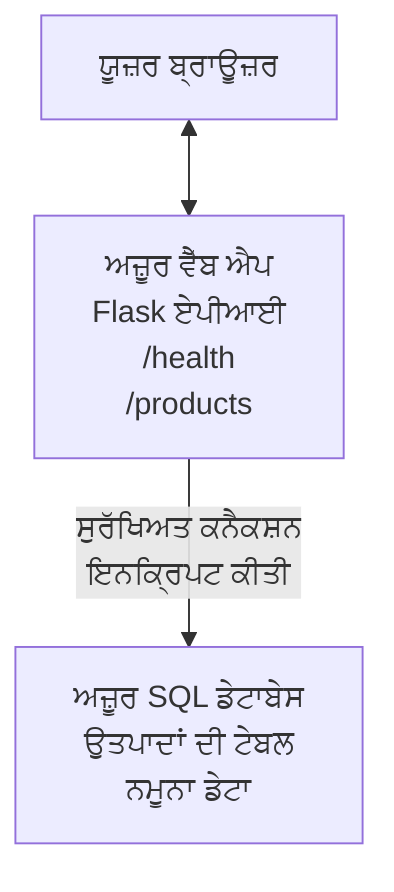

# Deploying a Microsoft SQL Database and Web App with AZD

⏱️ **Estimated Time**: 20-30 minutes | 💰 **Estimated Cost**: ~$15-25/month | ⭐ **Complexity**: Intermediate

ਇਹ **ਪੂਰਾ, ਕੰਮ ਕਰਨ ਵਾਲਾ ਉਦਾਹਰਨ** ਦਿਖਾਉਂਦਾ ਹੈ ਕਿ ਕਿਵੇਂ [Azure Developer CLI (azd)](https://learn.microsoft.com/azure/developer/azure-developer-cli/) ਦੀ ਵਰਤੋਂ ਕਰਕੇ ਇੱਕ Python Flask ਵੈੱਬ ਐਪਲੀਕੇਸ਼ਨ ਨੂੰ Microsoft SQL Database ਨਾਲ Azure ‘ਤੇ ਡਿਪਲੋਇ ਕੀਤਾ ਜਾ ਸਕਦਾ ਹੈ। ਸਾਰੀ ਕੋਡ ਸ਼ਾਮਲ ਹੈ ਅਤੇ ਟੈਸਟ ਕੀਤੀ ਗਈ ਹੈ—ਕੋਈ ਬਾਹਰੀ ਨਿਰਭਰਤਾਵਾਂ ਲੋੜੀਂਦੀਆਂ ਨਹੀਂ।

## ਤੁਸੀਂ ਕੀ ਸਿੱਖੋਗੇ

ਇਸ ਉਦਾਹਰਨ ਨੂੰ ਪੂਰਾ ਕਰਕੇ, ਤੁਸੀਂ:
- ਇੰਫრਾਸਟਰੱਕਚਰ-ਏਜ਼-ਕੋਡ ਦੀ ਵਰਤੋਂ ਕਰਕੇ ਇਕ ਬਹੁ-ਟਾਇਰ ਐਪਲੀਕੇਸ਼ਨ (ਵੈੱਬ ਐਪ + ਡੇਟਾਬੇਸ) ਡਿਪਲੋਇ ਕਰਨਾ
- ਗੁਪਤਕੀ ਨੂਆਂ (secrets) ਨੂੰ ਹਾਰਡਕੋਡ ਕੀਤੇ ਬਿਨਾਂ ਸੁਰੱਖਿਅਤ ਤਰੀਕੇ ਨਾਲ ਕਨਫਿਗਰ ਕਰਨਾ
- Application Insights ਨਾਲ ਐਪਲੀਕੇਸ਼ਨ ਸਿਹਤ ਦੀ ਨਿਗਰਾਨੀ ਕਰਨਾ
- AZD CLI ਨਾਲ Azure ਰਿਸੋਰਸਾਂ ਨੂੰ ਪ੍ਰਭਾਵੀ ਢੰਗ ਨਾਲ ਪ੍ਰਬੰਧਿਤ ਕਰਨਾ
- ਸੁਰੱਖਿਆ, ਲਾਗਤ ਅਨੁਕੂਲਤਾ ਅਤੇ ਦਿੱਖ-ਯੋਗਤਾ ਲਈ Azure ਦੀਆਂ ਸਰਵੋਤਮ ਪ੍ਰਥਾਵਾਂ ਦੀ ਪਾਲਣਾ ਕਰਨਾ

## ਸ السينੇਰਿਓ ਦਾ ਝਲਕ

- **Web App**: ਡੇਟਾਬੇਸ ਕਨੈਕਟਿਵਿਟੀ ਵਾਲਾ Python Flask REST API
- **Database**: ਨਮੂਨਾ ਡੇਟਾ ਨਾਲ Azure SQL Database
- **Infrastructure**: Bicep ਦੀ ਵਰਤੋਂ ਨਾਲ ਪ੍ਰੋਵਿਜ਼ਨ (ਮੋਡੀਊਲਰ, ਦੁਬਾਰਾ ਵਰਤਣ ਯੋਗ ਟੈਪਲੇਟਸ)
- **Deployment**: `azd` ਕਮਾਂਡਸ ਨਾਲ ਪੂਰੀ ਤਰ੍ਹਾਂ ਆਟੋਮੇਟਿਕ
- **Monitoring**: ਲੌਗਾਂ ਅਤੇ ਟੈਲੀਮੇਟਰੀ ਲਈ Application Insights

## ਜਰੂਰੀਆਂ ਸ਼ਰਤਾਂ

### ਲੋੜੀਂਦੇ ਟੂਲ

ਸ਼ੁਰੂ ਕਰਨ ਤੋਂ ਪਹਿਲਾਂ, ਯਕੀਨੀ ਬਣਾਓ ਕਿ ਤੁਹਾਡੇ ਕੋਲ ਇਹ ਟੂਲ ਇੰਸਟਾਲ ਹਨ:

1. **[Azure CLI](https://learn.microsoft.com/cli/azure/install-azure-cli)** (ਵਰਜ਼ਨ 2.50.0 ਜਾਂ ਉੱਪਰ)
   ```sh
   az --version
   # ਉਮੀਦ ਕੀਤੀ ਆਉਟਪੁੱਟ: azure-cli 2.50.0 ਜਾਂ ਉਸ ਤੋਂ ਵੱਧ
   ```

2. **[Azure Developer CLI (azd)](https://learn.microsoft.com/azure/developer/azure-developer-cli/install-azd)** (ਵਰਜ਼ਨ 1.0.0 ਜਾਂ ਉੱਪਰ)
   ```sh
   azd version
   # ਉਮੀਦ ਕੀਤੀ ਆਉਟਪੁੱਟ: azd ਵਰਜਨ 1.0.0 ਜਾਂ ਵੱਧ
   ```

3. **[Python 3.8+](https://www.python.org/downloads/)** (ਲੋਕਲ ਡਿਵੈਲਪਮੈਂਟ ਲਈ)
   ```sh
   python --version
   # ਉਮੀਦ ਕੀਤੀ ਆਉਟਪੁੱਟ: Python 3.8 ਜਾਂ ਉਸ ਤੋਂ ਉੱਪਰ
   ```

4. **[Docker](https://www.docker.com/get-started)** (ਇਛਿਕ, ਲੋਕਲ ਕੰਟੇਨਰਾਇਜ਼ਡ ਡਿਵੈਲਪਮੈਂਟ ਲਈ)
   ```sh
   docker --version
   # ਉਮੀਦ ਕੀਤਾ ਨਤੀਜਾ: Docker ਦਾ ਵਰਜਨ 20.10 ਜਾਂ ਇਸ ਤੋਂ ਉੱਪਰ
   ```

### Azure ਦੀਆਂ ਲੋੜਾਂ

- ਇੱਕ ਐਕਟਿਵ **Azure subscription** ([create a free account](https://azure.microsoft.com/free/))
- ਤੁਹਾਡੇ ਸੁਬਸਕ੍ਰਿਪਸ਼ਨ ਵਿੱਚ ਰਿਸੋਰਸ ਬਣਾਉਣ ਦੀਆਂ ਅਨੁਮਤੀਆਂ
- ਸੁਬਸਕ੍ਰਿਪਸ਼ਨ ਜਾਂ ਰਿਸੋਰਸ ਗਰੂਪ 'ਤੇ **Owner** ਜਾਂ **Contributor** ਰੋਲ

### ਗਿਆਨ ਦੀਆਂ ਬੁਨਿਆਦੀਆਂ ਲੋੜਾਂ

ਇਹ ਇੱਕ **ਦਰਮਿਆਨਾ-ਪੱਧਰ** ਦੀ ਉਦਾਹਰਨ ਹੈ। ਤੁਹਾਨੂੰ ਇਹਨਾਂ ਨਾਲ ਜਾਣੂ ਹੋਣਾ ਚਾਹੀਦਾ ਹੈ:
- ਬੁਨਿਆਦੀ ਕਮਾਂਡ-ਲਾਈਨ ਆਪਰੇਸ਼ਨ
- ਕਲਾਉਡ ਦੀਆਂ ਮੁੱਢ-ਧਾਰਣਾਵਾਂ (ਰਿਸੋਰਸ, ਰਿਸੋਰਸ ਗਰੂਪ)
- ਵੈੱਬ ਐਪਲੀਕੇਸ਼ਨ ਅਤੇ ਡੇਟਾਬੇਸ ਬਾਰੇ ਬੁਨਿਆਦੀ ਸਮਝ

**AZD ਵਿੱਚ ਨਵਾਂ ਹੋ?** ਪਹਿਲਾਂ [Getting Started guide](../../docs/chapter-01-foundation/azd-basics.md) ਨਾਲ ਸ਼ੁਰੂ ਕਰੋ।

## ਆਰਕੀਟੈਕਚਰ

ਇਹ ਉਦਾਹਰਨ ਇੱਕ ਦੋ-ਟਾਇਰ ਆਰਕੀਟੈਕਚਰ ਡਿਪਲੋਇ ਕਰਦੀ ਹੈ ਜਿਸ ਵਿੱਚ ਵੈੱਬ ਐਪਲੀਕੇਸ਼ਨ ਅਤੇ SQL ਡੇਟਾਬੇਸ ਸ਼ਾਮਲ ਹਨ:


**Resource Deployment:**
- **Resource Group**: ਸਾਰੇ ਰਿਸੋਰਸਾਂ ਲਈ ਕੰਟੈਨਰ
- **App Service Plan**: Linux-ਆਧਾਰਿਤ ਹੋਸਟਿੰਗ (ਲਾਗਤ ਦੀ ਬਚਤ ਲਈ B1 ਟੀਅਰ)
- **Web App**: Flask ਐਪਲੀਕੇਸ਼ਨ ਨਾਲ Python 3.11 ਰਨਟਾਈਮ
- **SQL Server**: TLS 1.2 ਘੱਟੋ-ਘੱਟ ਨਾਲ ਮੈਨੇਜਡ ਡੇਟਾਬੇਸ ਸਰਵਰ
- **SQL Database**: ਬੇਸਿਕ ਟੀਅਰ (2GB, ਡਿਵੈਲਪਮੈਂਟ/ਟੈਸਟਿੰਗ ਲਈ موزੂਨ)
- **Application Insights**: ਮਾਨੀਟਰਿੰਗ ਅਤੇ ਲੌਗਿੰਗ
- **Log Analytics Workspace**: ਕੇਂਦਰੀ ਲੌਗ ਸਟੋਰੇਜ

**ਉਪਮਾ**: ਇਸਨੂੰ ਏਕ ਰੈਸਟੋਰੈਂਟ (ਵੈੱਬ ਐਪ) ਸਮਝੋ ਜਿਸਦੇ ਕੋਲ ਇੱਕ ਪੈਦਾ ਫ੍ਰੀਜ਼ਰ (ਡੇਟਾਬੇਸ) ਹੈ। ਗਾਹਕ ਮੀਨੂ (API endpoints) ਤੋਂ ਆਰਡਰ ਕਰਦੇ ਹਨ, ਅਤੇ ਰਸੋਈ (Flask ਐਪ) ਫ੍ਰੀਜ਼ਰ ਤੋਂ ਸਮੱਗਰੀ (ਡੇਟਾ) ਲੈ ਆਉਂਦੀ ਹੈ। ਰੈਸਟੋਰੈਂਟ ਮੈਨੇਜਰ (Application Insights) ਸਾਰੀਆਂ ਘਟਨਾਵਾਂ ਨੂੰ ਟ੍ਰੈਕ ਕਰਦਾ ਹੈ।

## ਫੋਲਡਰ ਸਟਰਕਚਰ

ਸਾਰੇ ਫਾਇਲ ਇਸ ਉਦਾਹਰਨ ਵਿੱਚ ਸ਼ਾਮਲ ਹਨ—ਕੋਈ ਬਾਹਰੀ ਨਿਰਭਰਤਾ ਲੋੜੀਂਦੀ ਨਹੀਂ:

```
examples/database-app/
│
├── README.md                    # This file
├── azure.yaml                   # AZD configuration file
├── .env.sample                  # Sample environment variables
├── .gitignore                   # Git ignore patterns
│
├── infra/                       # Infrastructure as Code (Bicep)
│   ├── main.bicep              # Main orchestration template
│   ├── abbreviations.json      # Azure naming conventions
│   └── resources/              # Modular resource templates
│       ├── sql-server.bicep    # SQL Server configuration
│       ├── sql-database.bicep  # Database configuration
│       ├── app-service-plan.bicep  # Hosting plan
│       ├── app-insights.bicep  # Monitoring setup
│       └── web-app.bicep       # Web application
│
└── src/
    └── web/                    # Application source code
        ├── app.py              # Flask REST API
        ├── requirements.txt    # Python dependencies
        └── Dockerfile          # Container definition
```

**ਹਰ ਫਾਇਲ ਦਾ ਕੰਮ:**
- **azure.yaml**: AZD ਨੂੰ ਦੱਸਦਾ ਹੈ ਕਿ ਕੀ ਡਿਪਲੋਇ ਕਰਨਾ ਹੈ ਅਤੇ ਕਿੱਥੇ
- **infra/main.bicep**: ਸਾਰੇ Azure ਰਿਸੋਰਸਾਂ ਨੂੰ ਤਰਤੀਬ ਦਿੰਦਾ ਹੈ
- **infra/resources/*.bicep**: ਵਿਅਕਤੀਗਤ ਰਿਸੋਰਸ ਪਰਿਭਾਸ਼ਾਵਾਂ (ਦੁਬਾਰਾ ਵਰਤੋਂ ਲਈ ਮੋਡੀਊਲਰ)
- **src/web/app.py**: ਡੇਟਾਬੇਸ ਲੌਜਿਕ ਵਾਲੀ Flask ਐਪਲੀਕੇਸ਼ਨ
- **requirements.txt**: Python ਪੈਕੇਜ ਨਿਰਭਰਤਾਵਾਂ
- **Dockerfile**: ਡਿਪਲੋਇਮੈਂਟ ਲਈ ਕੰਟੇਨਰਾਈਜ਼ੇਸ਼ਨ ਨਿਰਦੇਸ਼

## ਕਵਾਇਕਸਟਾਰਟ (ਕਦਮ-ਦਰ-ਕਦਮ)

### ਕਦਮ 1: ਕਲੋਨ ਅਤੇ ਨੈਵੀਗੇਟ

```sh
git clone https://github.com/microsoft/AZD-for-beginners.git
cd AZD-for-beginners/examples/database-app
```

**✓ ਸਫਲਤਾ ਚੈੱਕ**: ਯਕੀਨੀ ਬਣਾਓ ਕਿ ਤੁਸੀਂ `azure.yaml` ਅਤੇ `infra/` ਫੋਲਡਰ ਵੇਖ ਰਹੇ ਹੋ:
```sh
ls
# ਉਮੀਦ ਕੀਤੀ ਗਈ: README.md, azure.yaml, infra/, src/
```

### ਕਦਮ 2: Azure ਨਾਲ ਪ੍ਰਮਾਣਿਕਤਾ

```sh
azd auth login
```

ਇਸ ਨਾਲ ਤੁਹਾਡਾ ਬ੍ਰਾਊਜ਼ਰ Azure ਪ੍ਰਮਾਣਿਕਤਾ ਲਈ ਖੁੱਲੇਗਾ। ਆਪਣੇ Azure ਰਿਕਾਰਡਾਂ ਨਾਲ ਸਾਈਨ-ਇਨ ਕਰੋ।

**✓ ਸਫਲਤਾ ਚੈੱਕ**: ਤੁਹਾਨੂੰ ਇਹ ਵੇਖਣਾ ਚਾਹੀਦਾ ਹੈ:
```
Logged in to Azure.
```

### ਕਦਮ 3: ਇਨਵਾਇਰਨਮੈਂਟ ਇਨੀਸ਼ੀਅਲਾਈਜ਼ ਕਰੋ

```sh
azd init
```

**ਕੀ ਹੁੰਦਾ ਹੈ**: AZD ਤੁਹਾਡੇ ਡਿਪਲੋਇਮੈਂਟ ਲਈ ਇੱਕ ਲੋਕਲ ਕনਫਿਗਰੇਸ਼ਨ ਬਣਾਉਂਦਾ ਹੈ।

**ਤੁਹਾਨੂੰ ਇਹ ਪ੍ਰੋਂਪਟਸ ਦਿੱਸਣਗੇ**:
- **Environment name**: ਇਕ ਛੋਟਾ ਨਾਂ ਦਿਓ (ਜਿਵੇਂ `dev`, `myapp`)
- **Azure subscription**: ਸੁਚੀ ਤੋਂ ਆਪਣੀ ਸਬਸਕ੍ਰਿਪਸ਼ਨ ਚੁਣੋ
- **Azure location**: ਇੱਕ ਰੀਜਨ ਚੁਣੋ (ਜਿਵੇਂ `eastus`, `westeurope`)

**✓ ਸਫਲਤਾ ਚੈੱਕ**: ਤੁਹਾਨੂੰ ਇਹ ਵੇਖਣਾ ਚਾਹੀਦਾ ਹੈ:
```
SUCCESS: New project initialized!
```

### ਕਦਮ 4: Azure ਰਿਸੋਰਸਾਂ ਦੀ ਪ੍ਰੋਵਿਜ਼ਨਿੰਗ

```sh
azd provision
```

**ਕੀ ਹੁੰਦਾ ਹੈ**: AZD ਸਾਰੀ ਇੰਫਰਾਸਟਰੱਕਚਰ ਡਿਪਲੋਇ ਕਰਦਾ ਹੈ (5-8 ਮਿੰਟ ਲੱਗ ਸਕਦੇ ਹਨ):
1. Resource group ਬਣਾਉਂਦਾ ਹੈ
2. SQL Server ਅਤੇ Database ਬਣਾਉਂਦਾ ਹੈ
3. App Service Plan ਬਣਾਉਂਦਾ ਹੈ
4. Web App ਬਣਾਉਂਦਾ ਹੈ
5. Application Insights ਬਣਾਉਂਦਾ ਹੈ
6. ਨੈੱਟਵਰਕਿੰਗ ਅਤੇ ਸੁਰੱਖਿਆ ਕਨਫਿਗਰ ਕਰਦਾ ਹੈ

**ਤੁਹਾਨੂੰ ਇਹ ਪ੍ਰੋਂਪਟਸ ਦਿੱਸਣਗੇ**:
- **SQL admin username**: ਇਕ ਯੂਜ਼ਰਨੇਮ ਦਿਓ (ਜਿਵੇਂ `sqladmin`)
- **SQL admin password**: ਇਕ ਮਜ਼ਬੂਤ ਪਾਸਵਰਡ ਦਿਓ (ਇਸਨੂੰ ਸੇਵ ਕਰੋ!)

**✓ ਸਫਲਤਾ ਚੈੱਕ**: ਤੁਹਾਨੂੰ ਇਹ ਵੇਖਣਾ ਚਾਹੀਦਾ ਹੈ:
```
SUCCESS: Your application was provisioned in Azure in X minutes Y seconds.
You can view the resources created under the resource group rg-<env-name> in Azure Portal:
https://portal.azure.com/#@/resource/subscriptions/.../resourceGroups/rg-<env-name>
```

**⏱️ Time**: 5-8 minutes

### ਕਦਮ 5: ਐਪਲੀਕੇਸ਼ਨ ਡਿਪਲੋਇ ਕਰੋ

```sh
azd deploy
```

**ਕੀ ਹੁੰਦਾ ਹੈ**: AZD ਤੁਹਾਡੇ Flask ਐਪ ਨੂੰ ਬਿਲਡ ਅਤੇ ਡਿਪਲੋਇ ਕਰਦਾ ਹੈ:
1. Python ਐਪਲੀਕੇਸ਼ਨ ਨੂੰ ਪੈਕੇਜ ਕਰਦਾ ਹੈ
2. Docker ਕੰਟੇਨਰ ਬਣਾਉਂਦਾ ਹੈ
3. Azure Web App ਤੇ ਪੁਸ਼ ਕਰਦਾ ਹੈ
4. ਨਮੂਨਾ ਡੇਟਾ ਨਾਲ ਡੇਟਾਬੇਸ ਨੂੰ ਆਰੰਭ ਕਰਦਾ ਹੈ
5. ਐਪਲੀਕੇਸ਼ਨ ਨੂੰ ਸ਼ੁਰੂ ਕਰਦਾ ਹੈ

**✓ ਸਫਲਤਾ ਚੈੱਕ**: ਤੁਹਾਨੂੰ ਇਹ ਵੇਖਣਾ ਚਾਹੀਦਾ ਹੈ:
```
SUCCESS: Your application was deployed to Azure in X minutes Y seconds.
You can view the resources created under the resource group rg-<env-name> in Azure Portal:
https://portal.azure.com/#@/resource/subscriptions/.../resourceGroups/rg-<env-name>
```

**⏱️ Time**: 3-5 minutes

### ਕਦਮ 6: ਐਪਲੀਕੇਸ਼ਨ ਨੂੰ ਬਰਾਊਜ਼ ਕਰੋ

```sh
azd browse
```

ਇਹ ਤੁਹਾਡੇ ਡਿਪਲੋਇਡ ਵੈੱਬ ਐਪ ਨੂੰ ਬ੍ਰਾਊਜ਼ਰ ਵਿੱਚ ਖੋਲ੍ਹੇਗਾ `https://app-<unique-id>.azurewebsites.net`

**✓ ਸਫਲਤਾ ਚੈੱਕ**: ਤੁਹਾਨੂੰ JSON ਆਉਟਪੁੱਟ ਵੇਖਣਾ ਚਾਹੀਦਾ ਹੈ:
```json
{
  "message": "Welcome to the Database App API",
  "endpoints": {
    "/": "This help message",
    "/health": "Health check endpoint",
    "/products": "List all products",
    "/products/<id>": "Get product by ID"
  }
}
```

### ਕਦਮ 7: API Endpoints ਦੀ ਟੈਸਟਿੰਗ

**ਹੈਲਥ ਚੈੱਕ** (ਡੇਟਾਬੇਸ ਕਨੈਕਸ਼ਨ ਦੀ ਪੁਸ਼ਟੀ ਕਰੋ):
```sh
curl https://app-<your-id>.azurewebsites.net/health
```

**ਉਮੀਦ ਕੀਤੀ ਜਵਾਬਦਿਹੀ**:
```json
{
  "status": "healthy",
  "database": "connected"
}
```

**List Products** (ਨਮੂਨਾ ਡੇਟਾ):
```sh
curl https://app-<your-id>.azurewebsites.net/products
```

**ਉਮੀਦ ਕੀਤੀ ਜਵਾਬਦਿਹੀ**:
```json
[
  {
    "id": 1,
    "name": "Laptop",
    "description": "High-performance laptop",
    "price": 1299.99,
    "created_at": "2025-11-19T10:30:00"
  },
  ...
]
```

**Get Single Product**:
```sh
curl https://app-<your-id>.azurewebsites.net/products/1
```

**✓ ਸਫਲਤਾ ਚੈੱਕ**: ਸਾਰੇ endpoints ਬਿਨਾਂ ਏਰਰ ਦੇ JSON ਡੇਟਾ ਰਿਟਰਨ ਕਰਨਗੇ।

---

**🎉 ਵਧਾਈਆਂ!** ਤੁਸੀਂ ਸਫਲਤਾਪੂਰਵਕ AZD ਦੀ ਵਰਤੋਂ ਕਰਕੇ Azure 'ਤੇ ਡੇਟਾਬੇਸ ਵਾਲੀ ਇਕ ਵੈੱਬ ਐਪਲੀਕੇਸ਼ਨ ਡਿਪਲੋਇ ਕਰ ਲਈ ਹੈ।

## ਗੁੰਝਲਦਾਰ ਵਿਆਖਿਆ (Configuration Deep-Dive)

### Environment Variables

ਗੁਪਤਕੀ ਨੂਆਂ ਸੁਰੱਖਿਅਤ ਤਰੀਕੇ ਨਾਲ Azure App Service configuration ਰਾਹੀਂ ਪ੍ਰਬੰਧਤ ਕੀਤੀਆਂ ਜਾਂਦੀਆਂ ਹਨ—**ਕੋਡ ਵਿੱਚ کبھی ਵੀ ਹਾਰਡਕੋਡ ਨਾ ਕਰੋ**।

**AZD ਦੁਆਰਾ ਆਟੋਮੈਟਿਕ ਤੌਰ ਤੇ ਕਨਫਿਗਰ ਕੀਤਿਆ ਜਾਂਦਾ ਹੈ**:
- `SQL_CONNECTION_STRING`: ਡੇਟਾਬੇਸ ਕਨੈਕਸ਼ਨ ਵਿਥ ਇੰਕ੍ਰਿਪਟਿਡ ਕ੍ਰੈਡੈਂਸ਼ਲਜ਼
- `APPLICATIONINSIGHTS_CONNECTION_STRING`: ਮਾਨੀਟਰਿੰਗ ਟੈਲੀਮੇਟਰੀ ਐਂਡਪਾਇੰਟ
- `SCM_DO_BUILD_DURING_DEPLOYMENT`: ਡਿਪਲੋਇਮੈਂਟ ਦੌਰਾਨ ਆਟੋਮੈਟਿਕ ਡੀਪੈਂਡੈਂਸੀ ਇੰਸਟਾਲੇਸ਼ਨ ਨੂੰ ਯੋਗ ਕਰਦਾ ਹੈ

**ਗੁਪਤਕੀ ਕਿੱਥੇ ਸਟੋਰ ਹੁੰਦੀਆਂ ਹਨ**:
1. `azd provision` ਦੌਰਾਨ, ਤੁਸੀਂ SQL ਕ੍ਰੈਡੈਂਸ਼ਲਜ਼ ਸੁਰੱਖਿਅਤ ਪ੍ਰੋਂਪਟਸ ਰਾਹੀਂ ਦਿੰਦੇ ਹੋ
2. AZD ਇਨ੍ਹਾਂ ਨੂੰ ਤੁਹਾਡੇ ਲੋਕਲ `.azure/<env-name>/.env` ਫਾਇਲ ਵਿੱਚ ਸਟੋਰ ਕਰਦਾ ਹੈ (git-ignored)
3. AZD इन्हें Azure App Service configuration ਵਿੱਚ ਇੰਜੈਕਟ ਕਰਦਾ ਹੈ (rest 'ਤੇ ਐਨਕ੍ਰਿਪਟ ਕੀਤਿਆ ਹੋਇਆ)
4. ਐਪਲੀਕੇਸ਼ਨ runtime ’ਤੇ `os.getenv()` ਰਾਹੀਂ ਇਨ੍ਹਾਂ ਨੂੰ ਪੜ੍ਹਦਾ ਹੈ

### ਲੋਕਲ ਡਿਵੈਲਪਮੈਂਟ

ਲੋਕਲ ਟੈਸਟਿੰਗ ਲਈ, ਨਮੂਨੇ ਤੋਂ `.env` ਫਾਇਲ ਬਣਾਓ:

```sh
cp .env.sample .env
# .env ਨੂੰ ਆਪਣੇ ਲੋਕਲ ਡੇਟਾਬੇਸ ਕਨੈਕਸ਼ਨ ਨਾਲ ਸੋਧੋ
```

**ਲੋਕਲ ਡਿਵੈਲਪਮੈਂਟ ਵਰਕਫਲੋ**:
```sh
# ਨਿਰਭਰਤਾਵਾਂ ਇੰਸਟਾਲ ਕਰੋ
cd src/web
pip install -r requirements.txt

# ਇਨਵਾਇਰਨਮੈਂਟ ਵੈਰੀਏਬਲ ਸੈਟ ਕਰੋ
export SQL_CONNECTION_STRING="your-local-connection-string"

# ਐਪਲੀਕੇਸ਼ਨ ਚਲਾਓ
python app.py
```

**ਲੋਕਲ ਟੈਸਟ ਕਰੋ**:
```sh
curl http://localhost:8000/health
# ਉਮੀਦ: {"status": "ਸਿਹਤਮੰਦ", "database": "ਜੁੜਿਆ"}
```

### Infrastructure as Code

ਸਾਰੇ Azure ਰਿਸੋਰਸ **Bicep templates** (`infra/` ਫੋਲਡਰ) ਵਿੱਚ ਪਰਿਭਾਸ਼ਿਤ ਹਨ:

- **ਮੋਡੀਊਲਰ ਡਿਜ਼ਾਇਨ**: ਹਰ ਰਿਸੋਰਸ ਟਾਈਪ ਲਈ ਅਲੱਗ ਫਾਇਲ ਹੈ ਤਾ ਕਿ ਦੁਬਾਰਾ ਵਰਤਿਆ ਜਾ ਸਕੇ
- **ਪੈਰਾਮੀਟਰਾਈਜ਼ਡ**: SKUs, ਰੀਜਨ, ਨਿਆਮਕ ਨਾਂਕਰਨ ਆਦਿ ਕਸਟਮਾਈਜ਼ ਕਰੋ
- **ਸਰਵੋਤਮ ਅਭਿਆਸ**: Azure ਨਾਂਕਰਨ ਮਿਆਰ ਅਤੇ ਸੁਰੱਖਿਆ ਡਿਫਾਲਟ ਪਾਲਣਾ ਕੀਤੀ ਗਈ
- **ਵਰਜ਼ਨ ਕੰਟ੍ਰੋਲ**: ਇਨਫਰਾਸਟਰੱਕਚਰ ਬਦਲਾਅ Git ਵਿੱਚ ਟਰੈਕ ਕੀਤੇ ਜਾਂਦੇ ਹਨ

**ਕਸਟਮਾਈਜ਼ੇਸ਼ਨ ਉਦਾਹਰਨ**:
ਡੇਟਾਬੇਸ ਟੀਅਰ ਬਦਲਣ ਲਈ `infra/resources/sql-database.bicep` ਨੂੰ ਸੋਧੋ:
```bicep
sku: {
  name: 'Standard'  // Changed from 'Basic'
  tier: 'Standard'
  capacity: 10
}
```

## ਸੁਰੱਖਿਆ ਦੇ ਸਰਵੋਤਮ ਅਭਿਆਸ

ਇਹ ਉਦਾਹਰਨ Azure ਦੀਆਂ ਸੁਰੱਖਿਆ ਦੀਆਂ ਸਰਵੋਤਮ ਪ੍ਰਥਾਵਾਂ ਦੀ ਪਾਲਣਾ ਕਰਦੀ ਹੈ:

### 1. **Source Code ਵਿੱਚ ਕੋਈ Secrets ਨਹੀਂ**
- ✅ ਕ੍ਰੈਡੈਂਸ਼ਲਜ਼ Azure App Service configuration ਵਿੱਚ ਸਟੋਰ ਕੀਤੇ ਜਾਂਦੇ ਹਨ (ਇੰਕ੍ਰਿਪਟ ਕੀਤੇ ਹੋਏ)
- ✅ `.env` ਫਾਇਲਾਂ Git ਤੋਂ `.gitignore` ਰਾਹੀਂ ਬਾਹਰ ਰੱਖੀਆਂ ਗਈਆਂ ਹਨ
- ✅ ਪ੍ਰੋਵਿਜ਼ਨਿੰਗ ਦੌਰਾਨ ਸੁਰੱਖਿਅਤ ਪੈਰਾਮੀਟਰਾਂ ਰਾਹੀਂ ਗੁਪਤਕੀ ਪਾਸ ਕੀਤੀਆਂ ਜਾਂਦੀਆਂ ਹਨ

### 2. **ਏਨਕ੍ਰਿਪਟਿਡ ਕਨੈਕਸ਼ਨ**
- ✅ SQL Server ਲਈ ਘੱਟੋ-ਘੱਟ TLS 1.2
- ✅ Web App ਲਈ ਸਿਰਫ HTTPS ਚਲਾਇਆ ਜਾ ਰਿਹਾ ਹੈ
- ✅ ਡੇਟਾਬੇਸ ਕਨੈਕਸ਼ਨ ਇੰਕ੍ਰਿਪਟਿਡ ਚੈਨਲਾਂ ਰਾਹੀਂ ਹੁੰਦੇ ਹਨ

### 3. **ਨੈੱਟਵਰਕ ਸੁਰੱਖਿਆ**
- ✅ SQL Server ਫਾਇਰਵਾਲ ਕੇਵਲ Azure ਸੇਵਾਵਾਂ ਨੂੰ ਆਗਿਆ ਦਿੰਦਾ ਹੈ
- ✅ ਪਬਲਿਕ ਨੈੱਟਵਰਕ ਐਕਸੈਸ ਸੀਮਤ (Private Endpoints ਨਾਲ ਹੋਰ ਲਾਕ ਕੀਤਾ ਜਾ ਸਕਦਾ ਹੈ)
- ✅ Web App ‘ਤੇ FTPS ਅਯੋਗ ਕੀਤਾ ਗਿਆ

### 4. **Authentication & Authorization**
- ⚠️ **ਮੌਜੂਦਾ**: SQL authentication (username/password)
- ✅ **ਪੈਦਾਵਾਰ ਸਿਫਾਰਸ਼**: ਪਾਸਵਰਡ-ਰਹਿਤ ਪ੍ਰਮਾਣਿਕਤਾ ਲਈ Azure Managed Identity ਵਰਤੋ

**Managed Identity ਵਿੱਚ ਅੱਪਗਰੇਡ ਕਰਨ ਲਈ** (ਪੈਦਾਵਾਰ ਲਈ):
1. Web App ‘ਤੇ managed identity ਯੋਗ ਕਰੋ
2. identity ਨੂੰ SQL ਪర్మਿਸ਼ਨ ਦਿਓ
3. connection string ਨੂੰ managed identity ਵਰਤਣ ਲਈ ਅਪਡੇਟ ਕਰੋ
4. ਪਾਸਵਰਡ-ਅਧਾਰਿਤ ਪ੍ਰਮਾਣਿਕਤਾ ਹਟਾਓ

### 5. **ਆਡੀਟਿੰਗ ਅਤੇ ਅਨੁਕੂਲਤਾ**
- ✅ Application Insights ਸਾਰੇ ਰਿਕਵੈਸਟ ਅਤੇ ਏਰਰਲੌਗ ਕਰਦਾ ਹੈ
- ✅ SQL Database ਆਡੀਟਿੰਗ ਯੋਗ ਹੈ (ਕੰਪਲਾਇੰਸ ਲਈ ਕਨਫਿਗਰ ਕੀਤਾ ਜਾ ਸਕਦਾ ਹੈ)
- ✅ ਤਮਾਮ ਰਿਸੋਰਸ ਗਵਰਨੈਂਸ ਲਈ ਟੈਗ ਕੀਤੇ ਗਏ ਹਨ

**ਪੈਦਾਵਾਰ ਤੋਂ ਪਹਿਲਾਂ ਸੁਰੱਖਿਆ ਚੈਕਲਿਸਟ**:
- [ ] SQL ਲਈ Azure Defender ਯੋਗ ਕਰੋ
- [ ] SQL Database ਲਈ Private Endpoints ਕਨਫਿਗਰ ਕਰੋ
- [ ] Web Application Firewall (WAF) ਯੋਗ ਕਰੋ
- [ ] ਨਗਰਾਨੀ ਲਈ Azure Key Vault ਨੂੰ ਲਾਗੂ ਕਰੋ
- [ ] Azure AD ਪ੍ਰਮਾਣਿਕਤਾ ਕਨਫਿਗਰ ਕਰੋ
- [ ] ਸਾਰੇ ਰਿਸੋਰਸ ਲਈ ਡਾਇਗਨੋਸਟਿਕ ਲੌਗਿੰਗ ਯੋਗ ਕਰੋ

## ਲਾਗਤ ਦੀ ਬਚਤ

**ਮੈਂਹੀਨਾ ਅਨੁਮਾਨਕੀ ਲਾਗਤ** (ਨਵੰਬਰ 2025 ਤੱਕ):

| Resource | SKU/Tier | Estimated Cost |
|----------|----------|----------------|
| App Service Plan | B1 (Basic) | ~$13/month |
| SQL Database | Basic (2GB) | ~$5/month |
| Application Insights | Pay-as-you-go | ~$2/month (low traffic) |
| **Total** | | **~$20/month** |

**💡 ਲਾਗਤ ਬਚਾਉਣ ਦੇ ਸੁਝਾਅ**:

1. **ਸਿੱਖਣ ਲਈ Free Tier ਵਰਤੋ**:
   - App Service: F1 ਟੀਅਰ (ਫ੍ਰੀ, ਸੀਮਤ ਘੰਟੇ)
   - SQL Database: Azure SQL Database serverless ਵਰਤੋ
   - Application Insights: 5GB/ਮਹੀਨਾ ਮੁਫ਼ਤ ingestion

2. **ਜਦੋਂ ਵਰਤ ਨਹੀਂ ਰਹੇ ਤਾਂ ਰਿਸੋਰਸ ਰੋਕੋ**:
   ```sh
   # ਵੈਬ ਐਪ ਨੂੰ ਰੋਕੋ (ਡੇਟਾਬੇਸ ਲਈ ਖਰਚੇ ਫਿਰ ਵੀ ਲੱਗਦੇ ਰਹਿੰਦੇ ਹਨ)
   az webapp stop --name <app-name> --resource-group <rg-name>
   
   # ਲੋੜ ਹੋਣ 'ਤੇ ਮੁੜ ਚਾਲੂ ਕਰੋ
   az webapp start --name <app-name> --resource-group <rg-name>
   ```

3. **ਟੈਸਟਿੰਗ ਮਗਰੋਂ ਸਭ ਕੁਝ ਮਿਟਾਓ**:
   ```sh
   azd down
   ```
   ਇਸ ਨਾਲ ਸਾਰੇ ਰਿਸੋਰਸ ਹਟ ਜਾਣਗੇ ਅਤੇ ਚਾਰ্জ ਰੁਕ ਜਾਣਗੇ।

4. **Development ਵਿ. Production SKUs**:
   - **Development**: ਬੇਸਿਕ ਟੀਅਰ (ਇਸ ਉਦਾਹਰਨ ਵਿੱਚ ਵਰਤਿਆ ਗਿਆ)
   - **Production**: redundancy ਵਾਲੇ Standard/Premium ਟੀਅਰ

**ਲਾਗਤ ਨਿਗਰਾਨੀ**:
- [Azure Cost Management](https://portal.azure.com/#view/Microsoft_Azure_CostManagement) ਵਿੱਚ ਲਾਗਤ ਵੇਖੋ
- ਅਚਾਨਕ ਚਾਰਜ ਤੋਂ ਬਚਣ ਲਈ ਲਾਗਤ ਅਲਰਟ ਸੈੱਟ ਕਰੋ
- ਟਰੈਕਿੰਗ ਲਈ ਸਾਰੇ ਰਿਸੋਰਸਾਂ ਨੂੰ `azd-env-name` ਨਾਲ ਟੈਗ ਕਰੋ

**ਫ੍ਰੀ ਟੀਅਰ ਵਿਕਲਪ**:
ਸਿੱਖਣ ਦੇ ਉਦੇਸ਼ ਲਈ, ਤੁਸੀਂ `infra/resources/app-service-plan.bicep` ਸੋਧ ਸਕਦੇ ਹੋ:
```bicep
sku: {
  name: 'F1'  // Free tier
  tier: 'Free'
}
```
**Note**: ਮੁਫ਼ਤ ਟੀਅਰ ਦੀਆਂ ਪਾਬੰਦੀਆਂ ਹਨ (60 min/day CPU, always-on ਨਹੀਂ)।

## ਮਾਨੀਟਰਿੰਗ ਅਤੇ ਦਿੱਖ-ਯੋਗਤਾ

### Application Insights ਇੰਟੀਗਰੇਸ਼ਨ

ਇਹ ਉਦਾਹਰਨ ਵਿਸਥਾਰਤ ਮਾਨੀਟਰਿੰਗ ਲਈ **Application Insights** ਸ਼ਾਮਲ ਕਰਦੀ ਹੈ:

**ਕੀ ਮਾਨੀਟਰ ਕੀਤਾ ਜਾਂਦਾ ਹੈ**:
- ✅ HTTP ਰਿਕਵੈਸਟ (ਲੈਟੈਂਸੀ, ਸਟੇਟਸ ਕੋਡ, endpoints)
- ✅ ਐਪਲੀਕੇਸ਼ਨ ਏਰਰ ਅਤੇ ਐਕਸੈਪਸ਼ਨ
- ✅ Flask ਐਪ ਤੋਂ ਕਸਟਮ ਲੌਗਿੰਗ
- ✅ ਡੇਟਾਬੇਸ ਕਨੈਕਸ਼ਨ ਸਿਹਤ
- ✅ ਪ੍ਰਦਰਸ਼ਨ ਮੈਟ੍ਰਿਕਸ (CPU, ਮੈਮੋਰੀ)

**Application Insights ਤੱਕ ਪਹੁੰਚ**:
1. [Azure Portal](https://portal.azure.com) ਖੋਲ੍ਹੋ
2. ਆਪਣੇ resource group (`rg-<env-name>`) ਤੇ ਜਾਓ
3. Application Insights resource (`appi-<unique-id>`) 'ਤੇ ਕਲਿੱਕ ਕਰੋ

**ਲਾਭਦਾਇਕ ਕੁਏਰੀਜ਼** (Application Insights → Logs):

**ਸਾਰੇ Requests ਵੇਖੋ**:
```kusto
requests
| where timestamp > ago(1h)
| order by timestamp desc
| project timestamp, name, url, resultCode, duration
```

**Errors ਲੱਭੋ**:
```kusto
exceptions
| where timestamp > ago(24h)
| order by timestamp desc
| project timestamp, type, outerMessage, operation_Name
```

**Health Endpoint ਚੈੱਕ ਕਰੋ**:
```kusto
requests
| where name contains "health"
| summarize count() by resultCode, bin(timestamp, 1h)
```

### SQL Database ਆਡੀਟਿੰਗ

**SQL Database ਆਡੀਟਿੰਗ ਯੋਗ ਹੈ** ਤਾਂ ਜੋ ਇਹ ਟਰੈਕ ਕਰ ਸਕੇ:
- ਡੇਟਾਬੇਸ ਐਕਸੈਸ ਪੈਟਰਨ
- ਨਾਕਾਮ ਲੋਗਿਨ ਕੋਸ਼ਿਸ਼ਾਂ
- ਸਕੀਮਾ ਬਦਲਾਵ
- ਡੇਟਾ ਐਕਸੈਸ (ਕੰਪਲਾਇੰਸ ਲਈ)

**ਆਡੀਟ ਲੌਗਸ ਤੱਕ ਪਹੁੰਚ**:
1. Azure Portal → SQL Database → Auditing
2. Log Analytics workspace ਵਿੱਚ ਲੌਗ ਵੇਖੋ

### ਰੀਅਲ-ਟਾਈਮ ਮਾਨੀਟਰਿੰਗ

**ਲਾਈਵ ਮੈਟਰਿਕਸ ਵੇਖੋ**:
1. Application Insights → Live Metrics
2. ਸੱਚ-ਵਕਤ ਵਿੱਚ ਰਿਕਵੈਸਟ, ਫੇਲਿਯਰ ਅਤੇ ਪ੍ਰਦਰਸ਼ਨ ਦੇਖੋ

**ਅਲਰਟਸ ਸੈੱਟ ਕਰੋ**:
ਜ਼ਰੂਰੀ ਘਟਨਾਵਾਂ ਲਈ ਅਲਰਟ ਬਣਾਓ:
- HTTP 500 errors > 5 in 5 minutes
- ਡੇਟਾਬੇਸ ਕਨੈਕਸ਼ਨ ਫੇਲਿਯਰ
- ਉੱਚ ਰਿਸਪਾਂਸ ਸਮਾਂ (>2 seconds)

**ਅਲਰਟ ਬਣਾਉਣ ਦਾ ਉਦਾਹਰਨ**:
```sh
az monitor metrics alert create \
  --name "High-Response-Time" \
  --resource-group <rg-name> \
  --scopes <app-insights-resource-id> \
  --condition "avg requests/duration > 2000" \
  --description "Alert when response time exceeds 2 seconds"
```

## Troubleshooting
### ਆਮ ਸਮੱਸਿਆਵਾਂ ਅਤੇ ਉਨ੍ਹਾਂ ਦੇ ਹੱਲ

#### 1. `azd provision` ਅਸਫਲ "Location not available" ਨਾਲ

**ਲੱਛਣ**:
```
Error: The subscription is not registered for the resource type 'components' in the location 'centralus'.
```

**ਹੱਲ**:
ਕਿਸੇ ਹੋਰ Azure ਰੀਜਨ ਚੁਣੋ ਜਾਂ ਰਿਸੋਰਸ ਪ੍ਰੋਵਾਈਡਰ ਰਜਿਸਟਰ ਕਰੋ:
```sh
az provider register --namespace Microsoft.Insights
```

#### 2. ਡਿਪਲੋਇਮੈਂਟ ਦੌਰਾਨ SQL ਕਨੈਕਸ਼ਨ ਫੇਲ

**ਲੱਛਣ**:
```
pyodbc.OperationalError: ('08001', '[08001] [Microsoft][ODBC Driver 18 for SQL Server]TCP Provider...')
```

**ਹੱਲ**:
- ਜਾਂਚੋ ਕਿ SQL Server ਫਾਇਰਵਾਲ Azure ਸੇਵਾਵਾਂ ਦੀ ਆਗਿਆ ਦਿੰਦਾ ਹੈ (ਆਟੋਮੈਟਿਕ ਤੌਰ 'ਤੇ ਕੰਫਿਗਰ ਕੀਤਾ ਗਿਆ)
- ਜਾਂਚੋ ਕਿ SQL ਐਡਮਿਨ ਪਾਸਵਰਡ `azd provision` ਦੌਰਾਨ ਸਹੀ ਤਰ੍ਹਾਂ ਦਰਜ ਕੀਤਾ ਗਿਆ ਸੀ
- ਯਕੀਨੀ ਬਣਾਓ ਕਿ SQL Server ਪੂਰੀ ਤਰ੍ਹਾਂ ਪ੍ਰੋਵਿਜ਼ਨ ਹੋਇਆ ਹੈ (2-3 ਮਿੰਟ ਲੱਗ ਸਕਦੇ ਹਨ)

**ਕਨੈਕਸ਼ਨ ਦੀ ਜਾਂਚ ਕਰੋ**:
```sh
# Azure ਪੋਰਟਲ ਵਿੱਚੋਂ SQL ਡੇਟਾਬੇਸ → ਕੁਐਰੀ ਐਡੀਟਰ 'ਤੇ ਜਾਓ
# ਆਪਣੀਆਂ ਪ੍ਰਮਾਣ-ਪੱਤਰਾਂ ਨਾਲ ਜੁੜਨ ਦੀ ਕੋਸ਼ਿਸ਼ ਕਰੋ
```

#### 3. ਵੈੱਬ ਐਪ "Application Error" ਦਿਖਾਉਂਦਾ ਹੈ

**ਲੱਛਣ**:
ਬ੍ਰਾਉਜ਼ਰ ਇੱਕ ਜਨਰਿਕ ਐਰਰ ਪੰਨਾ ਦਿਖਾਉਂਦਾ ਹੈ।

**ਹੱਲ**:
ਐਪਲੀਕੇਸ਼ਨ ਲਾਗ ਚੈੱਕ ਕਰੋ:
```sh
# ਹਾਲੀਆ ਲੌਗ ਵੇਖੋ
az webapp log tail --name <app-name> --resource-group <rg-name>
```

**ਆਮ ਕਾਰਨ**:
- ਜਰੂਰੀ ਵਾਤਾਵਰਣ ਵੈਰੀਏਬਲ ਗਾਇਬ ਹਨ (App Service → Configuration ਚੈੱਕ ਕਰੋ)
- Python ਪੈਕੇਜ ਇੰਸਟਾਲੇਸ਼ਨ ਫੇਲ ਹੋ ਗਿਆ (ਡਿਪਲੋਇਮੈਂਟ ਲੌਗ ਚੈੱਕ ਕਰੋ)
- ਡਾਟਾਬੇਸ ਇਨਿਸ਼ੀਅਲਾਈਜ਼ੇਸ਼ਨ ਦੀ ਗੜਬੜ (SQL ਕਨੈਕਟਿਵਿਟੀ ਚੈੱਕ ਕਰੋ)

#### 4. `azd deploy` ਅਸਫਲ "Build Error" ਨਾਲ

**ਲੱਛਣ**:
```
Error: Failed to build project
```

**ਹੱਲ**:
- ਯਕੀਨੀ ਬਣਾਓ ਕਿ `requirements.txt` ਵਿੱਚ ਕੋਈ ਸਿੰਟੈਕਸ ਐਰਰ ਨਹੀਂ ਹਨ
- ਜਾਂਚੋ ਕਿ Python 3.11 `infra/resources/web-app.bicep` ਵਿੱਚ ਦਰਜ ਕੀਤਾ ਗਿਆ ਹੈ
- ਯਕੀਨੀ ਬਣਾਓ ਕਿ Dockerfile ਵਿੱਚ ਸਹੀ ਬੇਸ ਇਮੇਜ ਹੈ

**ਲੋਕਲ ਤੇ ਡੀਬੱਗ ਕਰੋ**:
```sh
cd src/web
docker build -t test-app .
docker run -p 8000:8000 test-app
```

#### 5. AZD ਕਮਾਂਡ ਚਲਾਉਂਦੇ ਸਮੇਂ "Unauthorized"

**ਲੱਛਣ**:
```
ERROR: (Unauthorized) The client '<id>' with object id '<id>' does not have authorization
```

**ਹੱਲ**:
Azure ਨਾਲ ਮੁੜ ਪ੍ਰਮਾਣਿਕਰਣ ਕਰੋ:
```sh
# AZD ਵਰਕਫਲੋ ਲਈ ਲਾਜ਼ਮੀ
azd auth login

# ਜੇ ਤੁਸੀਂ ਸਿੱਧੇ ਤੌਰ 'ਤੇ Azure CLI ਕਮਾਂਡਾਂ ਵੀ ਵਰਤ ਰਹੇ ਹੋ ਤਾਂ ਇਹ ਵਿਕਲਪਿਕ ਹੈ
az login
```

ਪੱਕਾ ਕਰੋ ਕਿ ਤੁਹਾਡੇ ਕੋਲ ਸਬਸਕ੍ਰਿਪਸ਼ਨ 'ਤੇ ਠੀਕ ਅਧਿਕਾਰ ਹਨ (Contributor ਰੋਲ).

#### 6. ਡਾਟਾਬੇਸ ਦੇ ਉੱਚੇ ਖਰਚੇ

**ਲੱਛਣ**:
ਅਣਪੇक्षित Azure ਬਿੱਲ।

**ਹੱਲ**:
- ਜਾਂਚੋ ਕਿ ਕੀ ਤੁਸੀਂ ਟੈਸਟ ਕਰਨ ਤੋਂ ਬਾਅਦ `azd down` ਚਲਾਉਣਾ ਭੁੱਲ ਗਏ ਸੀ
- ਯਕੀਨੀ ਬਣਾਓ ਕਿ SQL Database Basic tier ਵਰਤ ਰਿਹਾ ਹੈ (Premium ਨਹੀਂ)
- Azure Cost Management ਵਿੱਚ ਖਰਚੇ ਸਮੀਖਿਆ ਕਰੋ
- ਲਾਗਤ ਅਲਰਟ ਸੈਟ ਕਰੋ

### ਮਦਦ

**ਸਾਰੇ AZD ਵਾਤਾਵਰਣ ਵੈਰੀਏਬਲ ਵੇਖੋ**:
```sh
azd env get-values
```

**ਡਿਪਲੋਇਮੈਂਟ ਸਥਿਤੀ ਚੈੱਕ ਕਰੋ**:
```sh
az webapp show --name <app-name> --resource-group <rg-name> --query state
```

**ਐਪਲੀਕੇਸ਼ਨ ਲਾਗ ਐਕਸੈਸ ਕਰੋ**:
```sh
az webapp log download --name <app-name> --resource-group <rg-name> --log-file app-logs.zip
```

**ਹੋਰ ਮਦਦ ਚਾਹੀਦੀ ਹੈ?**
- [AZD ਟਰਬਲਸ਼ੂਟਿੰਗ ਗਾਈਡ](../../docs/chapter-07-troubleshooting/common-issues.md)
- [Azure App Service ਟ੍ਰਬਲਸ਼ੂਟਿੰਗ](https://learn.microsoft.com/azure/app-service/troubleshoot-diagnostic-logs)
- [Azure SQL ਟ੍ਰਬਲਸ਼ੂਟਿੰਗ](https://learn.microsoft.com/azure/azure-sql/database/troubleshoot-common-errors-issues)

## ਪ੍ਰੈਕਟਿਕਲ ਅਭਿਆਸ

### ਅਭਿਆਸ 1: ਆਪਣੀ ਡਿਪਲੋਇਮੈਂਟ ਦੀ ਪੁਸ਼ਟੀ ਕਰੋ (ਬਿਗਿਨਰ)

**ਉਦੇਸ਼**: ਯਕੀਨੀ ਬਣਾਓ ਕਿ ਸਾਰੇ ਰਿਸੋਰਸ ਤਾਇਨਾਤ ਹੋ ਚੁਕੇ ਹਨ ਅਤੇ ਐਪਲੀਕੇਸ਼ਨ ਠੀਕ ਕੰਮ ਕਰ ਰਹੀ ਹੈ।

**ਕਦਮ**:
1. ਆਪਣੇ resource group ਵਿੱਚ ਸਾਰੇ ਰਿਸੋਰਸ ਲਿਸਟ ਕਰੋ:
   ```sh
   az resource list --resource-group rg-<env-name> --output table
   ```
   **ਉਮੀਦ**: 6-7 resources (Web App, SQL Server, SQL Database, App Service Plan, Application Insights, Log Analytics)

2. ਸਾਰੇ API endpoints ਟੈਸਟ ਕਰੋ:
   ```sh
   curl https://app-<your-id>.azurewebsites.net/
   curl https://app-<your-id>.azurewebsites.net/health
   curl https://app-<your-id>.azurewebsites.net/products
   curl https://app-<your-id>.azurewebsites.net/products/1
   ```
   **ਉਮੀਦ**: ਸਾਰੇ ਸਹੀ JSON ਬਿਨਾਂ ਐਰਰ ਦੇ ਵਾਪਸ ਕਰਦੇ ਹਨ

3. Application Insights ਚੈੱਕ ਕਰੋ:
   - Azure Portal ਵਿੱਚ Application Insights 'ਤੇ ਜਾਓ
   - "Live Metrics" 'ਤੇ ਜਾਓ
   - ਵੈੱਬ ਐਪ 'ਤੇ ਆਪਣੇ ਬ੍ਰਾਊਜ਼ਰ ਨੂੰ ਰੀਫ੍ਰੈਸ਼ ਕਰੋ
   **ਉਮੀਦ**: ਰੀਅਲ-ਟਾਈਮ ਵਿੱਚ ਨਿuroੋਤਾਂ ਦਿਖਾਈ ਦੈਣ

**ਸਫਲਤਾ ਮਾਪਦੰਡ**: ਸਾਰੇ 6-7 ਰਿਸੋਰਸ ਮੌਜੂਦ ਹਨ, ਸਾਰੇ endpoints ਡੇਟਾ ਵਾਪਸ ਕਰਦੇ ਹਨ, Live Metrics ਵਿਚ ਸਰਗਰਮੀ ਦਿਖਾਈ ਦਿੰਦੀ ਹੈ।

---

### ਅਭਿਆਸ 2: ਨਵਾਂ API Endpoint ਜੋੜੋ (ਇੰਟਰਮੀਡੀਏਟ)

**ਉਦੇਸ਼**: Flask ਐਪਲੀਕੇਸ਼ਨ ਵਿੱਚ ਇੱਕ ਨਵਾਂ endpoint ਜੋੜੋ।

**ਸਰਟਰ ਕੋਡ**: ਮੌਜੂਦਾ endpoints `src/web/app.py` ਵਿੱਚ

**ਕਦਮ**:
1. `src/web/app.py` ਨੂੰ ਐਡਿਟ ਕਰੋ ਅਤੇ `get_product()` ਫੰਕਸ਼ਨ ਤੋਂ ਬਾਅਦ ਇੱਕ ਨਵਾਂ endpoint ਸ਼ਾਮਲ ਕਰੋ:
   ```python
   @app.route('/products/search/<keyword>')
   def search_products(keyword):
       """Search products by name or description."""
       try:
           conn = get_db_connection()
           cursor = conn.cursor()
           cursor.execute(
               "SELECT id, name, description, price, created_at FROM products WHERE name LIKE ? OR description LIKE ?",
               (f'%{keyword}%', f'%{keyword}%')
           )
           
           products = []
           for row in cursor.fetchall():
               products.append({
                   'id': row[0],
                   'name': row[1],
                   'description': row[2],
                   'price': float(row[3]) if row[3] else None,
                   'created_at': row[4].isoformat() if row[4] else None
               })
           
           cursor.close()
           conn.close()
           
           logger.info(f"Search for '{keyword}' returned {len(products)} results")
           return jsonify(products), 200
           
       except Exception as e:
           logger.error(f"Error searching products: {str(e)}")
           return jsonify({'error': str(e)}), 500
   ```

2. ਅੱਪਡੇਟ ਕੀਤੀ ਐਪ ਨੂੰ ਡਿਪਲੋਇ ਕਰੋ:
   ```sh
   azd deploy
   ```

3. ਨਵੇਂ endpoint ਨੂੰ ਟੈਸਟ ਕਰੋ:
   ```sh
   curl https://app-<your-id>.azurewebsites.net/products/search/laptop
   ```
   **ਉਮੀਦ**: ਉਹਨਾਂ ਉਤਪਾਦਾਂ ਨੂੰ ਵਾਪਸ ਕਰਦਾ ਹੈ ਜੋ "laptop" ਨਾਲ ਮੇਲ ਖਾਂਦੇ ਹਨ

**ਸਫਲਤਾ ਮਾਪਦੰਡ**: ਨਵਾਂ endpoint ਕੰਮ ਕਰਦਾ ਹੈ, ਫਿਲਟਰੇਡ ਨਤੀਜੇ ਵਾਪਸ ਕਰਦਾ ਹੈ, Application Insights ਲਾਗਜ਼ ਵਿੱਚ ਦਿਖਾਈ ਦਿੰਦਾ ਹੈ।

---

### ਅਭਿਆਸ 3: ਮਾਨੀਟਰਿੰਗ ਅਤੇ ਅਲਰਟ ਸ਼ਾਮਲ ਕਰੋ (ਅਡਵਾਂਸਡ)

**ਉਦੇਸ਼**: ਅਲਰਟਾਂ ਨਾਲ ਪ੍ਰੋਐਕਟਿਵ ਮਾਨੀਟਰਿੰਗ ਸੈਟ ਅਪ ਕਰੋ।

**ਕਦਮ**:
1. HTTP 500 ਐਰਰਾਂ ਲਈ ਇੱਕ ਅਲਰਟ ਬਣਾਓ:
   ```sh
   # Application Insights ਦਾ ਰਿਸੋਰਸ ID ਪ੍ਰਾਪਤ ਕਰੋ
   AI_ID=$(az monitor app-insights component show \
     --app appi-<your-id> \
     --resource-group rg-<env-name> \
     --query id -o tsv)
   
   # ਅਲਰਟ ਬਣਾਓ
   az monitor metrics alert create \
     --name "High-Error-Rate" \
     --resource-group rg-<env-name> \
     --scopes $AI_ID \
     --condition "count requests/failed > 5" \
     --window-size 5m \
     --evaluation-frequency 1m \
     --description "Alert when >5 failed requests in 5 minutes"
   ```

2. ਐਰਰ ਪੈਦਾ ਕਰਕੇ ਅਲਰਟ ਟ੍ਰਿਗਰ ਕਰੋ:
   ```sh
   # ਗੈਰ-ਮੌਜੂਦ ਉਤਪਾਦ ਦੀ ਬੇਨਤੀ
   for i in {1..10}; do curl https://app-<your-id>.azurewebsites.net/products/999; done
   ```

3. ਜਾਂਚੋ ਕਿ ਅਲਰਟ ਫਾਇਰ ਹੋਇਆ ਕਿ ਨਹੀਂ:
   - Azure Portal → Alerts → Alert Rules
   - ਆਪਣੀ ਈਮੇਲ ਚੈੱਕ ਕਰੋ (ਜੇ ਕਨਫਿਗਰ ਕੀਤੀ ਹੋਈ ਹੋਵੇ)

**ਸਫਲਤਾ ਮਾਪਦੰਡ**: ਅਲਰਟ ਰੂਲ ਬਣਾਇਆ ਗਿਆ ਹੈ, ਐਰਰਾਂ 'ਤੇ ਟ੍ਰਿਗਰ ਹੁੰਦਾ ਹੈ, ਸੂਚਨਾਵਾਂ ਮਿਲਦੀਆਂ ਹਨ।

---

### ਅਭਿਆਸ 4: ਡਾਟਾਬੇਸ ਸਕੀਮਾ ਬਦਲਾਅ (ਅਡਵਾਂਸਡ)

**ਉਦੇਸ਼**: ਇੱਕ ਨਵੀਂ ਟੇਬਲ ਜੋੜੋ ਅਤੇ ਐਪ ਨੂੰ ਇਸਦਾ ਉਪਯੋਗ ਕਰਨ ਲਈ ਬਦਲੋ।

**ਕਦਮ**:
1. Azure Portal Query Editor ਰਾਹੀਂ SQL Database ਨਾਲ ਕਨੈਕਟ ਕਰੋ

2. ਇੱਕ ਨਵੀਂ `categories` ਟੇਬਲ ਬਣਾਓ:
   ```sql
   CREATE TABLE categories (
       id INT PRIMARY KEY IDENTITY(1,1),
       name NVARCHAR(50) NOT NULL,
       description NVARCHAR(200)
   );
   
   INSERT INTO categories (name, description) VALUES
   ('Electronics', 'Electronic devices and accessories'),
   ('Office Supplies', 'Office equipment and supplies');
   
   -- Add category to products table
   ALTER TABLE products ADD category_id INT;
   UPDATE products SET category_id = 1; -- Set all to Electronics
   ```

3. `src/web/app.py` ਅਪਡੇਟ ਕਰੋ ਤਾਂ ਜੋ responses ਵਿੱਚ category ਜਾਣਕਾਰੀ ਸ਼ਾਮਲ ਹੋਵੇ

4. ਡਿਪਲੋਇ ਅਤੇ ਟੈਸਟ ਕਰੋ

**ਸਫਲਤਾ ਮਾਪਦੰਡ**: ਨਵੀਂ ਟੇਬਲ ਮੌਜੂਦ ਹੈ, ਪ੍ਰੋਡਕਟਜ਼ ਵਿੱਚ category ਜਾਣਕਾਰੀ ਦਿਖਾਈ ਦਿੰਦੀ ਹੈ, ਐਪ ਫਿਰ ਵੀ ਕੰਮ ਕਰਦੀ ਹੈ।

---

### ਅਭਿਆਸ 5: ਕੈਸ਼ਿੰਗ ਲਾਗੂ ਕਰੋ (ਐਕਸਪਰਟ)

**ਉਦੇਸ਼**: ਪ੍ਰਦਰਸ਼ਨ ਸੁਧਾਰਣ ਲਈ Azure Redis Cache ਜ਼ੋੜੋ।

**ਕਦਮ**:
1. `infra/main.bicep` ਵਿੱਚ Redis Cache ਸ਼ਾਮਲ ਕਰੋ
2. `src/web/app.py` ਅਪਡੇਟ ਕਰੋ ਤਾਂ ਜੋ ਉਤਪਾਦ ਕਵੈਰੀਜ਼ ਨੂੰ ਕੈਸ਼ ਕੀਤਾ ਜਾਏ
3. Application Insights ਨਾਲ ਪ੍ਰਦਰਸ਼ਨ ਸੁਧਾਰ ਮਾਪੋ
4. ਕੈਸ਼ਿੰਗ ਤੋਂ ਪਹਿਲਾਂ/ਬਾਅਦ ਰਿਸਪਾਂਸ ਸਮਿਆਂ ਦੀ ਤੁਲਨਾ ਕਰੋ

**ਸਫਲਤਾ ਮਾਪਦੰਡ**: Redis ਡਿਪਲੋਇ ਹੋਇਆ ਹੈ, ਕੈਸ਼ਿੰਗ ਕੰਮ ਕਰਦੀ ਹੈ, ਰਿਸਪਾਂਸ ਸਮਾਂ >50% ਸੁਧਰਦਾ ਹੈ।

**ਸੁਝਾਅ**: ਸ਼ੁਰੂ ਕਰੋ [Azure Cache for Redis ਡੌਕਯੂਮੈਂਟੇਸ਼ਨ](https://learn.microsoft.com/azure/azure-cache-for-redis/) ਨਾਲ।

---

## ਸਾਫ਼-ਸਫਾਈ

ਚੱਲ ਰਹੇ ਚਾਰਜਾਂ ਤੋਂ ਬਚਣ ਲਈ, ਮੁਕੰਮਲ ਹੋਣ 'ਤੇ ਸਾਰੇ ਰਿਸੋਰਸ ਮਿਟਾ ਦਿਓ:

```sh
azd down
```

**ਪੁਸ਼ਟੀ ਪ੍ਰਾਂਪਟ**:
```
? Total resources to delete: 7, are you sure you want to continue? (y/N)
```

ਪੁਸ਼ਟੀ ਕਰਨ ਲਈ `y` ਟਾਈਪ ਕਰੋ।

**✓ ਸਫਲਤਾ ਜਾਂਚ**: 
- Azure Portal ਤੋਂ ਸਾਰੇ ਰਿਸੋਰਸ ਮਿਟਾ ਦਿੱਤੇ ਗਏ ਹਨ
- ਕੋਈ ਚੱਲ ਰਹੇ ਚਾਰਜ ਨਹੀਂ
- ਸਥਾਨਕ `.azure/<env-name>` ਫੋਲਡਰ ਮਿਟਾਇਆ ਜਾ ਸਕਦਾ ਹੈ

**ਵਿਕਲਪ** (ਇੰਫ੍ਰਾਸਟ੍ਰਕਚਰ ਰੱਖੋ, ਡੇਟਾ ਮਿਟਾਓ):
```sh
# ਕੇਵਲ ਰਿਸੋਰਸ ਗਰੁੱਪ ਹਟਾਓ (AZD ਸੰਰਚਨਾ ਬਰਕਰਾਰ ਰੱਖੋ)
az group delete --name rg-<env-name> --yes
```
## ਹੋਰ ਜਾਣਕਾਰੀ

### ਸੰਬੰਧਿਤ ਦਸਤਾਵੇਜ਼
- [Azure Developer CLI Documentation](https://learn.microsoft.com/azure/developer/azure-developer-cli/)
- [Azure SQL Database Documentation](https://learn.microsoft.com/azure/azure-sql/database/)
- [Azure App Service Documentation](https://learn.microsoft.com/azure/app-service/)
- [Application Insights Documentation](https://learn.microsoft.com/azure/azure-monitor/app/app-insights-overview)
- [Bicep Language Reference](https://learn.microsoft.com/azure/azure-resource-manager/bicep/)

### ਇਸ ਕੋਰਸ ਵਿੱਚ ਅਗਲੇ ਕਦਮ
- **[Container Apps Example](../../../../examples/container-app)**: Azure Container Apps ਨਾਲ ਮਾਈਕਰੋਸਰਵਿਸਜ਼ ਡਿਪਲੋਇ ਕਰੋ
- **[AI Integration Guide](../../../../docs/ai-foundry)**: ਆਪਣੀ ਐਪ ਵਿੱਚ AI ਸਮਰੱਥਾਵਾਂ ਸ਼ਾਮਲ ਕਰੋ
- **[Deployment Best Practices](../../docs/chapter-04-infrastructure/deployment-guide.md)**: ਪ੍ਰੋਡਕਸ਼ਨ ਡਿਪਲੋਇਮੈਂਟ ਪੈਟਰਨ

### ਉੱਨਤ ਵਿਸ਼ੇ
- **Managed Identity**: ਪਾਸਵਰਡ ਹਟਾਓ ਅਤੇ Azure AD ਪ੍ਰਮਾਣਿਕਤਾ ਵਰਤੋ
- **Private Endpoints**: ਇੱਕ ਵਰਚੁਅਲ ਨੈੱਟਵਰਕ ਦੇ ਅੰਦਰ ਡਾਟਾਬੇਸ ਕਨੈਕਸ਼ਨਾਂ ਨੂੰ ਸੁਰੱਖਿਅਤ ਕਰੋ
- **CI/CD Integration**: GitHub Actions ਜਾਂ Azure DevOps ਨਾਲ ਡਿਪਲੋਇਮੈਂਟ ਆਟੋਮੇਟ ਕਰੋ
- **Multi-Environment**: dev, staging, ਅਤੇ production ਵਾਤਾਵਰਣ ਸੈਟ ਅਪ ਕਰੋ
- **Database Migrations**: ਸਕੀਮਾ ਵਰਜ਼ਨਿੰਗ ਲਈ Alembic ਜਾਂ Entity Framework ਵਰਤੋਂ

### ਹੋਰ ਢੰਗਾਂ ਨਾਲ ਤੁਲਨਾ

**AZD vs. ARM Templates**:
- ✅ AZD: ਉੱਚ-ਸਤਹੀ ਅਬਸਟ੍ਰੈਕਸ਼ਨ, ਸਧਾਰਨ ਕਮਾਂਡਾਂ
- ⚠️ ARM: ਵਧੇਰੇ ਵਿਸਤਾਰਪੂਰਕ, ਬਰੀਕੀ ਕੰਟਰੋਲ

**AZD vs. Terraform**:
- ✅ AZD: Azure-ਨੇਟਿਵ, Azure ਸੇਵਾਵਾਂ ਨਾਲ ਏਕੀਕ੍ਰਿਤ
- ⚠️ Terraform: Multi-cloud ਸਹਾਇਤਾ, ਵੱਡਾ ecosystem

**AZD vs. Azure Portal**:
- ✅ AZD: ਦੁਹਰਾਇਆ ਜਾ ਸਕਦਾ, ਵਰਜ਼ਨ-ਕੰਟਰੋਲ, ਆਟੋਮੇਟੇਬਲ
- ⚠️ Portal: ਹੱਥੋਂ-ਹੱਥ ਕਲਿੱਕ, ਦੁਬਾਰਾ ਬਣਾਉਣਾ ਮੁਸ਼ਕਲ

**AZD ਨੂੰ ਸੋਚੋ ਇਸ ਤਰ੍ਹਾਂ**: Azure ਲਈ Docker Compose—ਜਟਿਲ ਡਿਪਲੋਇਮੈਂਟਸ ਲਈ ਸਰਲੀਕ੍ਰਿਤ ਕੰਫਿਗਰੇਸ਼ਨ।

---

## ਅਕਸਰ ਪੁੱਛੇ ਜਾਣ ਵਾਲੇ ਪ੍ਰਸ਼ਨ

**Q: ਕੀ ਮੈਂ ਕੋਈ ਹੋਰ ਪ੍ਰੋਗ੍ਰਾਮਿੰਗ ਭਾਸ਼ਾ ਵਰਤ ਸਕਦਾ/ਸਕਦੀ ਹਾਂ?**  
A: ਹਾਂ! `src/web/` ਨੂੰ Node.js, C#, Go, ਜਾਂ ਕਿਸੇ ਵੀ ਭਾਸ਼ਾ ਨਾਲ ਬਦਲੋ। `azure.yaml` ਅਤੇ Bicep ਨੂੰ ਅਨੁਸਾਰ ਅਪਡੇਟ ਕਰੋ।

**Q: ਮੈਂ ਹੋਰ ਡਾਟਾਬੇਸ ਕਿਵੇਂ ਜੋੜਾਂ?**  
A: `infra/main.bicep` ਵਿੱਚ ਇੱਕ ਹੋਰ SQL Database ਮਾਡਿਊਲ ਸ਼ਾਮਲ ਕਰੋ ਜਾਂ Azure Database ਸੇਵਾਵਾਂ ਵਿੱਚੋਂ PostgreSQL/MySQL ਵਰਤੋ।

**Q: ਕੀ ਮੈਂ ਇਸਨੂੰ ਪ੍ਰੋਡਕਸ਼ਨ ਲਈ ਵਰਤ ਸਕਦਾ/ਸਕਦੀ ਹਾਂ?**  
A: ਇਹ ਇੱਕ ਸ਼ੁਰੂਆਤੀ ਬਿੰਦੂ ਹੈ। ਪ੍ਰੋਡਕਸ਼ਨ ਲਈ, ਸ਼ਾਮਲ ਕਰੋ: managed identity, private endpoints, redundancy, ਬੈਕਅੱਪ ਰਣਨੀਤੀ, WAF, ਅਤੇ ਬਿਹਤਰ ਮਾਨੀਟਰਿੰਗ।

**Q: ਜੇ ਮੈਂ ਕੋਡ ਡਿਪਲੋਇਮੈਂਟ ਦੀ ਥਾਂ ਕੰਟੇਨਰ ਵਰਤਣਾ ਚਾਹਾਂ ਤਾਂ?**  
A: [Container Apps Example](../../../../examples/container-app) ਵੇਖੋ ਜੋ Docker containers ਸਾਰੀ ਰਾਹ ਵਿੱਚ ਵਰਤਦਾ ਹੈ।

**Q: ਮੈਂ ਆਪਣੇ ਲੋਕਲ ਮਸ਼ੀਨ ਤੋਂ ਡਾਟਾਬੇਸ ਨਾਲ ਕਿਵੇਂ ਕੁਨੈਕਟ ਕਰਾਂ?**  
A: SQL Server ਫਾਇਰਵਾਲ ਵਿੱਚ ਆਪਣਾ IP ਜੋੜੋ:
```sh
az sql server firewall-rule create \
  --resource-group rg-<env-name> \
  --server sql-<unique-id> \
  --name AllowMyIP \
  --start-ip-address <your-ip> \
  --end-ip-address <your-ip>
```

**Q: ਕੀ ਮੈਂ ਨਵਾਂ ਬਣਾਉਣ ਦੀ ਥਾਂ ਮੌਜੂਦਾ ਡਾਟਾਬੇਸ ਵਰਤ ਸਕਦਾ/ਸਕਦੀ ਹਾਂ?**  
A: ਹਾਂ, `infra/main.bicep` ਨੂੰ ਤਬਦੀਲ ਕਰੋ ਤਾਂ ਜੋ ਮੌਜੂਦਾ SQL Server ਨੂੰ ਰੈਫਰੈਂਸ ਕਰੇ ਅਤੇ connection string ਪੈਰਾਮੀਟਰ ਅਪਡੇਟ ਕਰੋ।

---

> **ਨੋਟ:** ਇਹ ਉਦਾਹਰਨ AZD ਦੀ ਵਰਤੋਂ ਕਰਕੇ ਡਾਟਾਬੇਸ ਨਾਲ ਵੈੱਬ ਐਪ ਡਿਪਲੋਇ ਕਰਨ ਲਈ ਬਿਹਤਰ ਅਭਿਆਸ ਦਰਸਾਉਂਦੀ ਹੈ। ਇਹ ਵਿੱਚ ਕਾਰਜਸ਼ੀਲ ਕੋਡ, ਵਿਸਤ੍ਰਿਤ ਦਸਤਾਵੇਜ਼ ਅਤੇ ਸਿੱਖਣ ਨੂੰ ਮਜ਼ਬੂਤ ਬਣਾਉਣ ਲਈ ਵਿਹਾਰਕ ਅਭਿਆਸ ਸ਼ਾਮਲ ਹਨ। ਪ੍ਰੋਡਕਸ਼ਨ ਡਿਪਲੋਇਮੈਂਟ ਲਈ, ਆਪਣੇ ਸੰਸਥਾ-ਵਿਸ਼ੇਸ਼ ਸੁਰੱਖਿਆ, ਸਕੇਲਿੰਗ, ਅਨੁਕੂਲਤਾ, ਅਤੇ ਲਾਗਤ ਦੀਆਂ ਲੋੜਾਂ ਦੀ ਸਮੀਖਿਆ ਕਰੋ।

**📚 ਕੋਰਸ ਨੈਵੀਗੇਸ਼ਨ:**
- ← ਪਿਛਲਾ: [Container Apps Example](../../../../examples/container-app)
- → ਅਗਲਾ: [AI Integration Guide](../../../../docs/ai-foundry)
- 🏠 [Course Home](../../README.md)

---

<!-- CO-OP TRANSLATOR DISCLAIMER START -->
**Disclaimer**:
ਇਹ ਦਸਤਾਵੇਜ਼ AI ਅਨੁਵਾਦ ਸੇਵਾ [Co-op Translator](https://github.com/Azure/co-op-translator) ਦੀ ਵਰਤੋਂ ਕਰਕੇ ਅਨੁਵਾਦ ਕੀਤਾ ਗਿਆ ਹੈ। ਹਾਲਾਂਕਿ ਅਸੀਂ ਸ਼ੁੱਧਤਾ ਲਈ ਕੋਸ਼ਿਸ਼ ਕਰਦੇ ਹਾਂ, ਕਿਰਪਾ ਕਰਕੇ ਧਿਆਨ ਰੱਖੋ ਕਿ ਆਟੋਮੇਟਿਕ ਅਨੁਵਾਦਾਂ ਵਿੱਚ ਗਲਤੀਆਂ ਜਾਂ ਅਣਸਹੀਤੀਆਂ ਹੋ ਸਕਦੀਆਂ ਹਨ। ਮੂਲ ਦਸਤਾਵੇਜ਼ ਨੂੰ ਇਸ ਦੀ ਮੂਲ ਭਾਸ਼ਾ ਵਿੱਚ ਪ੍ਰਮਾਣਿਕ ਸਰੋਤ ਮੰਨਿਆ ਜਾਣਾ ਚਾਹੀਦਾ ਹੈ। ਮਹੱਤਵਪੂਰਨ ਜਾਣਕਾਰੀ ਲਈ, ਪ੍ਰੋਫੈਸ਼ਨਲ ਮਨੁੱਖੀ ਅਨੁਵਾਦ ਦੀ ਸਿਫਾਰਿਸ਼ ਕੀਤੀ ਜਾਂਦੀ ਹੈ। ਅਸੀਂ ਇਸ ਅਨੁਵਾਦ ਦੀ ਵਰਤੋਂ ਤੋਂ ਪੈਦਾ ਹੋਣ ਵਾਲੀਆਂ ਕਿਸੇ ਵੀ ਗਲਤਫਹਮੀ ਜਾਂ ਗਲਤ ਵਿਆਖਿਆ ਲਈ ਜ਼ਿੰਮੇਵਾਰ ਨਹੀਂ ਹਾਂ।
<!-- CO-OP TRANSLATOR DISCLAIMER END -->