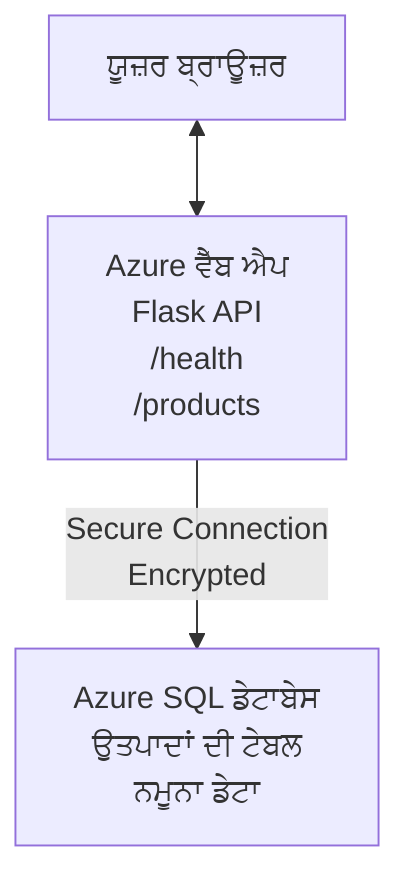

# Deploying a Microsoft SQL Database and Web App with AZD

⏱️ **ਅੰਦਾਜ਼ਾ ਸਮਾਂ**: 20-30 ਮਿੰਟ | 💰 **ਅੰਦਾਜ਼ਾ ਲਾਗਤ**: ~$15-25/ਮਹੀਨਾ | ⭐ **ਜਟਿਲਤਾ**: ਦਰਮਿਆਨਾ

ਇਹ **ਪੂਰਾ, ਕੰਮ ਕਰਨ ਵਾਲਾ ਉਦਾਹਰਨ** ਦਰਸਾਉਂਦਾ ਹੈ ਕਿ [Azure Developer CLI (azd)](https://learn.microsoft.com/azure/developer/azure-developer-cli/) ਵਰਤ ਕੇ ਕਿਸ ਤਰ੍ਹਾਂ ਇੱਕ Python Flask ਵੈੱਬ ਐਪਲੀਕੇਸ਼ਨ ਨੂੰ Microsoft SQL Database ਨਾਲ Azure ’ਤੇਡਿਪਲੌਇ ਕੀਤਾ ਜਾ ਸਕਦਾ ਹੈ। ਸਾਰਾ ਕੋਡ ਸ਼ਾਮਲ ਅਤੇ ਟੈਸਟ ਕੀਤਾ ਗਿਆ ਹੈ—ਕੋਈ ਬਾਹਰੀ ਨਿਰਭਰਤਾ ਲੋੜੀਂਦੀ ਨਹੀਂ।

## ਤੁਸੀਂ ਕੀ ਸਿੱਖੋਗੇ

ਇਸ ਉਦਾਹਰਨ ਨੂੰ ਪੂਰਾ ਕਰਨ ਨਾਲ, ਤੁਸੀਂ:
- ਇੰਫ੍ਰਾਸਟਰੱਕਚਰ-ਏਜ਼-ਕੋਡ ਵਰਤ ਕੇ ਇੱਕ ਮਲਟੀ-ਟੀਅਰ ਐਪਲੀਕੇਸ਼ਨ (ਵੈੱਬ ਐਪ + ਡੇਟਾਬੇਸ) ਡਿਪਲੌਇ ਕਰਨਾ
- ਸੈਕਰੇਟ ਹਾਰਡਕੋਡ ਕੀਤੇ ਬਿਨਾਂ ਸੁਰੱਖਿਅਤ ਡੇਟਾਬੇਸ ਕਨੈਕਸ਼ਨ ਕੰਫਿਗਰ ਕਰਨਾ
- Application Insights ਨਾਲ ਐਪਲੀਕੇਸ਼ਨ ਦੀ ਸਿਹਤ ਮਾਨੀਟਰ ਕਰਨਾ
- AZD CLI ਨਾਲ Azure ਸਰੋਤਾਂ ਨੂੰ ਪ੍ਰਭਾਵਸ਼ਾਲੀ ਢੰਗ ਨਾਲ ਮੈਨੇਜ ਕਰਨਾ
- ਸੁਰੱਖਿਆ, ਲਾਗਤ ਅਪਟੀਮਾਈਜ਼ੇਸ਼ਨ ਅਤੇ ਅਬਜ਼ਰਵੇਬਿਲਟੀ ਲਈ Azure ਦੇ ਵਧੀਆ ਅਭਿਆਸ ਦੀ ਪਾਲਣਾ ਕਰਨਾ

## ਸਿਨਾਰਿਓ ਓਵਰਵਿਊ
- **Web App**: ਡੇਟਾਬੇਸ ਕਨੈਕਟੀਵਿਟੀ ਵਾਲਾ Python Flask REST API
- **Database**: ਨਮੂਨਾ ਡੇਟਾ ਨਾਲ Azure SQL Database
- **Infrastructure**: Bicep (ਮਾਡਿਊਲਰ, ਦੁਬਾਰਾ ਵਰਤਣਯੋਗ ਟੈਂਪਲੇਟ) ਵਰਤ ਕੇ ਪ੍ਰੋਵਿਜ਼ਨ ਕੀਤਾ ਗਿਆ
- **Deployment**: `azd` ਕਮਾਂਡਾਂ ਨਾਲ ਪੂਰੀ ਤਰ੍ਹਾਂ ਆਟੋਮੇਟਿਕ
- **Monitoring**: ਲੋਗਸ ਅਤੇ ਟੈਲੀਮੇਟਰੀ ਲਈ Application Insights

## ਪ੍ਰੀਰਿਕੁਇਜ਼ਾਈਟਸ

### ਲੋੜੀਂਦੇ ਟੂਲ

ਸ਼ੁਰੂ ਕਰਨ ਤੋਂ ਪਹਿਲਾਂ, ਇਹ ਯਕੀਨੀ ਬਣਾਓ ਕਿ ਤੁਹਾਡੇ ਕੋਲ ਇਹ ਟੂਲ ਇੰਸਟਾਲ ਹੋਏ ਹਨ:

1. **[Azure CLI](https://learn.microsoft.com/cli/azure/install-azure-cli)** (ਵਰਜ਼ਨ 2.50.0 ਜਾਂ ਉਪਰ)
   ```sh
   az --version
   # ਉਮੀਦ ਕੀਤੀ ਆਉਟਪੁੱਟ: azure-cli 2.50.0 ਜਾਂ ਇਸ ਤੋਂ ਉੱਪਰ
   ```

2. **[Azure Developer CLI (azd)](https://learn.microsoft.com/azure/developer/azure-developer-cli/install-azd)** (ਵਰਜ਼ਨ 1.0.0 ਜਾਂ ਉਪਰ)
   ```sh
   azd version
   # ਉਮੀਦ ਕੀਤਾ ਨਤੀਜਾ: azd ਸੰਸਕਰਣ 1.0.0 ਜਾਂ ਇਸ ਤੋਂ ਵੱਧ
   ```

3. **[Python 3.8+](https://www.python.org/downloads/)** (ਲੋਕਲ ਡਿਵੈਲਪਮੈਂਟ ਲਈ)
   ```sh
   python --version
   # ਉਮੀਦ ਕੀਤੀ ਆਉਟਪੁੱਟ: Python 3.8 ਜਾਂ ਉੱਪਰ
   ```

4. **[Docker](https://www.docker.com/get-started)** (ਵਿਕਲਪਿਕ, ਲੋਕਲ ਕੰਟੇਨਰਾਈਜ਼ਡ ਡਿਵੈਲਪਮੈਂਟ ਲਈ)
   ```sh
   docker --version
   # ਉਮੀਦ ਕੀਤਾ ਨਤੀਜਾ: Docker ਵਰਜ਼ਨ 20.10 ਜਾਂ ਵੱਧ
   ```

### Azure ਲੋੜਾਂ

- ਇਕ ਐਕਟਿਵ **Azure subscription** ([create a free account](https://azure.microsoft.com/free/))
- ਤੁਹਾਡੇ subscription ਵਿੱਚ ਸਰੋਤ ਬਣਾਉਣ ਦੀਆਂ ਅਨੁਮਤੀਆਂ
- subscription ਜਾਂ resource group 'ਤੇ **Owner** ਜਾਂ **Contributor** ਰੋਲ

### ਗਿਆਨ ਦੀਆਂ ਜ਼ਰੂਰਤਾਂ

ਇਹ ਇੱਕ **ਦਰਮਿਆਨਾ ਪੱਧਰ** ਦੀ ਉਦਾਹਰਨ ਹੈ। ਤੁਹਾਨੂੰ ਇਹਨਾਂ ਨਾਲ ਵਾਕਿਫ ਹੋਣਾ ਚਾਹੀਦਾ ਹੈ:
- ਬੇਸਿਕ ਕਮਾਂਡ-ਲਾਈਨ ਓਪਰੇਸ਼ਨ
- ਮੁੱਢਲੀ ਕਲਾਉਡ ਧਾਰਣਾਵਾਂ (resources, resource groups)
- ਵੈੱਬ ਐਪਲੀਕੇਸ਼ਨ ਅਤੇ ਡੇਟਾਬੇਸ ਦੀ ਬੁਨਿਆਦੀ ਸਮਝ

**AZD ਵਿੱਚ ਨਵਾਂ ਹੋ?** ਪਹਿਲਾਂ [Getting Started guide](../../docs/chapter-01-foundation/azd-basics.md) ਤੋਂ ਸ਼ੁਰੂ ਕਰੋ।

## ਆਰਕੀਟੈਕਚਰ

ਇਹ ਉਦਾਹਰਨ ਇੱਕ ਦੋ-ਟੀਅਰ ਆਰਕੀਟੈਕਚਰ ਡਿਪਲੌਇ ਕਰਦੀ ਹੈ ਜਿਸ ਵਿੱਚ ਵੈੱਬ ਐਪ ਅਤੇ SQL ਡੇਟਾਬੇਸ ਹਨ:


**Resource Deployment:**
- **Resource Group**: ਸਾਰੀਆਂ ਸਰੋਤਾਂ ਲਈ ਕੰਟੇਨਰ
- **App Service Plan**: Linux-ਆਧਾਰਿਤ ਹੋਸਟਿੰਗ (ਲਾਗਤ ਪ੍ਰਭਾਵਸ਼ੀਲਤਾ ਲਈ B1 ਟੀਅਰ)
- **Web App**: Python 3.11 ਰਨਟਾਈਮ ਨਾਲ Flask ਐਪਲੀਕੇਸ਼ਨ
- **SQL Server**: TLS 1.2 ਘੱਟੋ-ਘੱਟ ਨਾਲ ਮੈਨੇਜਡ ਡੇਟਾਬੇਸ ਸਰਵਰ
- **SQL Database**: Basic ਟੀਅਰ (2GB, ਡਿਵੈਲਪਮੈਂਟ/ਟੈਸਟਿੰਗ ਲਈ موزوں)
- **Application Insights**: ਮਾਨੀਟਰਿੰਗ ਅਤੇ ਲੋਗਿੰਗ
- **Log Analytics Workspace**: ਸੈਂਟਰਲ ਲੋਗ ਸਟੋਰੇਜ

**ਉਪਮਾ**: ਇਸਨੂੰ ਇੱਕ ਰੈਸਟੋਰੈਂਟ (ਵੈੱਬ ਐਪ) ਸਮਝੋ ਜਿਸਦੇ ਕੋਲ ਇੱਕ ਵਾਕ-ਇਨ ਫ੍ਰੀਜ਼ਰ (ਡੇਟਾਬੇਸ) ਹੈ। ਗ੍ਰਾਹਕ ਮੀਨੂ (API endpoints) ਤੋਂ ਆਰਡਰ ਕਰਦੇ ਹਨ, ਅਤੇ ਰਸੋਈ (Flask ਐਪ) ਫ੍ਰੀਜ਼ਰ ਤੋਂ ਸਮੱਗਰੀ (ਡੇਟਾ) ਲੈਂਦੀ ਹੈ। ਰੈਸਟੋਰੈਂਟ ਮੈਨੇਜਰ (Application Insights) ਸਭ ਕੁਝ ਟਰੈਕ ਕਰਦਾ ਹੈ।

## ਫੋਲਡਰ ਸੰਰਚਨਾ

ਸਾਰੇ ਫਾਇਲ ਇਸ ਉਦਾਹਰਨ ਵਿੱਚ ਸ਼ਾਮਲ ਹਨ—ਕੋਈ ਬਾਹਰੀ ਨਿਰਭਰਤਾ ਲੋੜੀਂਦੀ ਨਹੀਂ:

```
examples/database-app/
│
├── README.md                    # This file
├── azure.yaml                   # AZD configuration file
├── .env.sample                  # Sample environment variables
├── .gitignore                   # Git ignore patterns
│
├── infra/                       # Infrastructure as Code (Bicep)
│   ├── main.bicep              # Main orchestration template
│   ├── abbreviations.json      # Azure naming conventions
│   └── resources/              # Modular resource templates
│       ├── sql-server.bicep    # SQL Server configuration
│       ├── sql-database.bicep  # Database configuration
│       ├── app-service-plan.bicep  # Hosting plan
│       ├── app-insights.bicep  # Monitoring setup
│       └── web-app.bicep       # Web application
│
└── src/
    └── web/                    # Application source code
        ├── app.py              # Flask REST API
        ├── requirements.txt    # Python dependencies
        └── Dockerfile          # Container definition
```

**ਹਰ ਫਾਈਲ ਕੀ ਕਰਦੀ ਹੈ:**
- **azure.yaml**: AZD ਨੂੰ ਦੱਸਦਾ ਹੈ ਕਿ ਕੀ ਡਿਪਲੌਇ ਕਰਨਾ ਹੈ ਅਤੇ ਕਿੱਥੇ
- **infra/main.bicep**: ਸਾਰੇ Azure ਸਰੋਤਾਂ ਦੀ ਕੋਆਰਡੀਨੇਸ਼ਨ
- **infra/resources/*.bicep**: ਵਿਅਕਤੀਗਤ ਸਰੋਤ ਦੀਆਂ ਪਰਿਭਾਸ਼ਾਵਾਂ (ਦੁਬਾਰਾ ਵਰਤੋਂ ਲਈ ਮਾਡਿਊਲਰ)
- **src/web/app.py**: ਡੇਟਾਬੇਸ ਲਾਜਿਕ ਨਾਲ Flask ਐਪਲੀਕੇਸ਼ਨ
- **requirements.txt**: Python ਪੈਕੇਜ ਨਿਰਭਰਤਾਵਾਂ
- **Dockerfile**: ਡਿਪਲੌਇਮੈਂਟ ਲਈ ਕੰਟੇਨਰਾਈਜ਼ੇਸ਼ਨ ਨਿਰਦੇਸ਼

## ਕਵਿਕਸਟਾਰਟ (ਕਦਮ-ਦਰ-ਕਦਮ)

### Step 1: Clone and Navigate

```sh
git clone https://github.com/microsoft/AZD-for-beginners.git
cd AZD-for-beginners/examples/database-app
```

**✓ ਸਫਲਤਾ ਚੈੱਕ**: ਯਕੀਨੀ ਬਣਾਓ ਕਿ ਤੁਸੀਂ `azure.yaml` ਅਤੇ `infra/` ਫੋਲਡਰ ਵੇਖ ਰਹੇ ਹੋ:
```sh
ls
# ਉਮੀਦ ਕੀਤੀ ਗਈ: README.md, azure.yaml, infra/, src/
```

### Step 2: Authenticate with Azure

```sh
azd auth login
```

ਇਹ ਤੁਹਾਡੇ ਬ੍ਰਾਉਜ਼ਰ ਨੂੰ Azure authentication ਲਈ ਖੋਲ੍ਹੇਗਾ। ਆਪਣੀਆਂ Azure ਪ੍ਰਮਾਣਪੱਤਰਾਂ ਨਾਲ ਸਾਈਨ ਇਨ ਕਰੋ।

**✓ ਸਫਲਤਾ ਚੈੱਕ**: ਤੁਹਾਨੂੰ ਇਹ ਦਿਖਾਈ ਦੇਣਾ ਚਾਹੀਦਾ ਹੈ:
```
Logged in to Azure.
```

### Step 3: Initialize the Environment

```sh
azd init
```

**ਕੀ ਹੋਂਦਾ ਹੈ**: AZD ਤੁਹਾਡੇ ਡਿਪਲੌਇਮੈਂਟ ਲਈ ਇੱਕ ਲੋਕਲ کنਫਿਗਰੇਸ਼ਨ ਬਣਾਉਂਦਾ ਹੈ।

**ਤੁਹਾਨੂੰ ਜੋ ਪ੍ਰਾਂਪਟ ਦਿਖਾਈ ਦੇਣਗੇ**:
- **Environment name**: ਇੱਕ ਛੋਟਾ ਨਾਮ ਦਿਓ (ਉਦਾਹਰਣ: `dev`, `myapp`)
- **Azure subscription**: ਸੂਚੀ ਵਿਚੋਂ ਆਪਣੀ subscription ਚੁਣੋ
- **Azure location**: ਇੱਕ ਰੀਜਿਅਨ ਚੁਣੋ (ਉਦਾਹਰਣ: `eastus`, `westeurope`)

**✓ ਸਫਲਤਾ ਚੈੱਕ**: ਤੁਹਾਨੂੰ ਇਹ ਦਿਖਾਈ ਦੇਣਾ ਚਾਹੀਦਾ ਹੈ:
```
SUCCESS: New project initialized!
```

### Step 4: Provision Azure Resources

```sh
azd provision
```

**ਕੀ ਹੋਂਦਾ ਹੈ**: AZD ਸਾਰੀ ਇੰਫ੍ਰਾਸਟਰੱਕਚਰ ਡਿਪਲੌਇ ਕਰਦਾ ਹੈ (5-8 ਮਿੰਟ ਲੱਗਦੇ ਹਨ):
1. Resource group ਬਣਾਉਂਦਾ ਹੈ
2. SQL Server ਅਤੇ Database ਬਣਾਉਂਦਾ ਹੈ
3. App Service Plan ਬਣਾਉਂਦਾ ਹੈ
4. Web App ਬਣਾਉਂਦਾ ਹੈ
5. Application Insights ਤਿਆਰ ਕਰਦਾ ਹੈ
6. ਨੈਟਵਰਕਿੰਗ ਅਤੇ ਸੁਰੱਖਿਆ ਸੰਰਚਨਾ ਕਰਦਾ ਹੈ

**ਤੁਹਾਨੂੰ ਪੁੱਛਿਆ ਜਾਵੇਗਾ**:
- **SQL admin username**: ਇੱਕ ਯੂਜ਼ਰਨੇਮ ਦਿਓ (ਉਦਾਹਰਣ: `sqladmin`)
- **SQL admin password**: ਇੱਕ ਮਜ਼ਬੂਤ ਪਾਸਵਰਡ ਦਿਓ (ਇਸਨੂੰ ਸੇਵ ਕਰੋ!)

**✓ ਸਫਲਤਾ ਚੈੱਕ**: ਤੁਹਾਨੂੰ ਇਹ ਦਿਖਾਈ ਦੇਣਾ ਚਾਹੀਦਾ ਹੈ:
```
SUCCESS: Your application was provisioned in Azure in X minutes Y seconds.
You can view the resources created under the resource group rg-<env-name> in Azure Portal:
https://portal.azure.com/#@/resource/subscriptions/.../resourceGroups/rg-<env-name>
```

**⏱️ ਸਮਾਂ**: 5-8 ਮਿੰਟ

### Step 5: Deploy the Application

```sh
azd deploy
```

**ਕੀ ਹੋਂਦਾ ਹੈ**: AZD ਤੁਹਾਡੀ Flask ਐਪਲੀਕੇਸ਼ਨ ਨੂੰ ਬਿਲਡ ਅਤੇ ਡਿਪਲੌਇ ਕਰਦਾ ਹੈ:
1. Python ਐਪਲੀਕੇਸ਼ਨ ਦਾ ਪੈਕੇਜ ਬਣਾਉਂਦਾ ਹੈ
2. Docker ਕੰਟੇਨਰ ਬਿਲਡ ਕਰਦਾ ਹੈ
3. Azure Web App 'ਤੇ ਪুশ ਕਰਦਾ ਹੈ
4. ਡੇਟਾਬੇਸ ਨੂੰ ਨਮੂਨਾ ਡੇਟਾ ਨਾਲ ਇਨੀਸ਼ੀਅਲਾਈਜ਼ ਕਰਦਾ ਹੈ
5. ਐਪਲੀਕੇਸ਼ਨ ਸ਼ੁਰੂ ਕਰਦਾ ਹੈ

**✓ ਸਫਲਤਾ ਚੈੱਕ**: ਤੁਹਾਨੂੰ ਇਹ ਦਿਖਾਈ ਦੇਣਾ ਚਾਹੀਦਾ ਹੈ:
```
SUCCESS: Your application was deployed to Azure in X minutes Y seconds.
You can view the resources created under the resource group rg-<env-name> in Azure Portal:
https://portal.azure.com/#@/resource/subscriptions/.../resourceGroups/rg-<env-name>
```

**⏱️ ਸਮਾਂ**: 3-5 ਮਿੰਟ

### Step 6: Browse the Application

```sh
azd browse
```

ਇਹ ਤੁਹਾਡੇ ਡਿਪਲੌਇਡ ਵੈੱਬ ਐਪ ਨੂੰ ਬ੍ਰਾਉਜ਼ਰ ਵਿੱਚ ਖੋਲ੍ਹੇਗਾ: `https://app-<unique-id>.azurewebsites.net`

**✓ ਸਫਲਤਾ ਚੈੱਕ**: ਤੁਹਾਨੂੰ JSON ਆਉਟਪੁਟ ਦੇਖਣਾ ਚਾਹੀਦਾ ਹੈ:
```json
{
  "message": "Welcome to the Database App API",
  "endpoints": {
    "/": "This help message",
    "/health": "Health check endpoint",
    "/products": "List all products",
    "/products/<id>": "Get product by ID"
  }
}
```

### Step 7: Test the API Endpoints

**Health Check** (ਡੇਟਾਬੇਸ ਕਨੈਕਸ਼ਨ ਦੀ ਜਾਂਚ ਕਰੋ):
```sh
curl https://app-<your-id>.azurewebsites.net/health
```

**ਉਮੀਦ ਕੀਤੀ ਜਾਵੇ ਵਾਲੀ ਜਵਾਬਦਿਹੀ**:
```json
{
  "status": "healthy",
  "database": "connected"
}
```

**List Products** (ਨਮੂਨਾ ਡੇਟਾ):
```sh
curl https://app-<your-id>.azurewebsites.net/products
```

**ਉਮੀਦ ਕੀਤੀ ਜਾਵਾਬਦਿਹੀ**:
```json
[
  {
    "id": 1,
    "name": "Laptop",
    "description": "High-performance laptop",
    "price": 1299.99,
    "created_at": "2025-11-19T10:30:00"
  },
  ...
]
```

**Get Single Product**:
```sh
curl https://app-<your-id>.azurewebsites.net/products/1
```

**✓ ਸਫਲਤਾ ਚੈੱਕ**: ਸਾਰੇ endpoints ਬਿਨਾਂ ਤਰੁਟੀਆਂ ਦੇ JSON ਡੇਟਾ ਰਿਟਰਨ ਕਰਨਗੇ।

---

**🎉 ਮੁਬਾਰਕਾਂ!** ਤੁਸੀਂ ਸਫਲਤਾਪੂਰਵਕ AZD ਦੀ ਵਰਤੋਂ ਕਰਕੇ Azure 'ਤੇ ਡੇਟਾਬੇਸ ਨਾਲ ਇੱਕ ਵੈੱਬ ਐਪਲੀਕੇਸ਼ਨ ਡਿਪਲੌਇ ਕੀਤਾ ਹੈ।

## ਕੰਫਿਗਰੇਸ਼ਨ ਦੀ ਡੀਪ-ਡਾਈਵ

### Environment Variables

ਰਹੱਸ ਸੁਰੱਖਿਅਤ ਤਰੀਕੇ ਨਾਲ Azure App Service ਕਨਫਿਗਰੇਸ਼ਨ ਰਾਹੀਂ ਮੈਨੇਜ ਕੀਤੇ ਜਾਂਦੇ ਹਨ—**ਸੋਰਸ ਕੋਡ ਵਿੱਚ ਕਦੇ ਵੀ ਹਾਰਡਕੋਡ ਨਾ ਕਰੋ**।

**AZD ਦੁਆਰਾ ਆਟੋਮੈਟਿਕ ਤੌਰ 'ਤੇ ਕੰਫਿਗਰ ਕੀਤੇ ਜਾਂਦੇ**:
- `SQL_CONNECTION_STRING`: ਇਨਕ੍ਰਿਪਟ ਕੀਤੀਆਂ ਪ੍ਰਮਾਣਪੱਤਰਾਂ ਨਾਲ ਡੇਟਾਬੇਸ ਕਨੈਕਸ਼ਨ
- `APPLICATIONINSIGHTS_CONNECTION_STRING`: ਮਾਨੀਟਰਨਿੰਗ ਟੈਲੀਮੇਟਰੀ ਐਂਡਪੌਇੰਟ
- `SCM_DO_BUILD_DURING_DEPLOYMENT`: ਆਟੋਮੈਟਿਕ ਨਿਰਭਰਤਾਵਾਂ ਇੰਸਟਾਲੇਸ਼ਨ ਨੂੰ ਯੋਗ ਬਣਾਉਂਦਾ ਹੈ

**ਕਿੱਥੇ ਸੁਰੱਖਿਆਤਾਰਕ ਰੱਖੇ ਜਾਂਦੇ ਹਨ**:
1. `azd provision` ਦੌਰਾਨ, ਤੁਸੀਂ ਸੁਰੱਖਿਅਤ ਪ੍ਰਾਂਪਟ ਰਾਹੀਂ SQL ਪ੍ਰਮਾਣਪੱਤਰ ਦਿੰਦੇ ਹੋ
2. AZD ਇਹਨਾਂ ਨੂੰ ਤੁਹਾਡੇ ਲੋਕਲ `.azure/<env-name>/.env` ਫਾਇਲ ਵਿੱਚ ਸਟੋਰ ਕਰਦਾ ਹੈ (git-ignored)
3. AZD ਇਹਨਾਂ ਨੂੰ Azure App Service ਕੰਫਿਗਰੇਸ਼ਨ ਵਿੱਚ ਇੰਜੈਕਟ ਕਰਦਾ ਹੈ (rest ਤੇ encrypted)
4. ਐਪਲੀਕੇਸ਼ਨ ਰਨਟਾਈਮ 'ਤੇ `os.getenv()` ਰਾਹੀਂ ਇਹਨਾਂ ਨੂੰ ਪੜ੍ਹਦੀ ਹੈ

### Local Development

ਲੋਕਲ ਟੇਸਟਿੰਗ ਲਈ, ਨਮੂਨੇ ਤੋਂ `.env` ਫਾਇਲ ਬਣਾਓ:

```sh
cp .env.sample .env
# .env ਫਾਇਲ ਨੂੰ ਆਪਣੇ ਲੋਕਲ ਡੇਟਾਬੇਸ ਕਨੈਕਸ਼ਨ ਨਾਲ ਸੰਪਾਦਿਤ ਕਰੋ
```

**ਲੋਕਲ ਡਿਵੈਲਪਮੈਂਟ ਵਰਕਫਲੋ**:
```sh
# ਨਿਰਭਰਤਾਵਾਂ ਇੰਸਟਾਲ ਕਰੋ
cd src/web
pip install -r requirements.txt

# ਇਨਵਾਇਰਨਮੈਂਟ ਵੈਰੀਏਬਲ ਸੈੱਟ ਕਰੋ
export SQL_CONNECTION_STRING="your-local-connection-string"

# ਐਪਲੀਕੇਸ਼ਨ ਚਲਾਓ
python app.py
```

**ਲੋਕਲ ਟੈਸਟ ਕਰੋ**:
```sh
curl http://localhost:8000/health
# ਉਮੀਦ: {"status": "healthy", "database": "connected"}
```

### Infrastructure as Code

ਸਾਰੇ Azure ਸਰੋਤ **Bicep ਟੈਂਪਲੇਟਸ** (`infra/` ਫੋਲਡਰ) ਵਿੱਚ ਪਰਿਭਾਸ਼ਿਤ ਹਨ:

- **ਮਾਡਿਊਲਰ ਡਿਜ਼ਾਇਨ**: ਹਰ ਸਰੋਤ ਕਿਸਮ ਲਈ ਆਪਣੀ ਫਾਇਲ ਹੈ ਤਾਂ ਜੋ ਦੁਬਾਰਾ ਵਰਤਿਆ ਜਾ ਸਕੇ
- **ਪੈਰਾਮੀਟਰਾਈਜ਼ਡ**: SKUs, ਰੀਜਿਅਨ, ਨਾਂਕਰਨ ਪਰੰਪਰਾਸ਼ਾਂ ਨੂੰ কਸਟਮਾਈਜ਼ ਕਰੋ
- **ਵਧੀਆ ਅਭਿਆਸ**: Azure ਨਾਂਕਰਨ ਮਾਪਦੰਡ ਅਤੇ ਸੁਰੱਖਿਆ ਡਿਫੌਲਟਾਂ ਦੀ ਪਾਲਣਾ
- **ਵਰਜ਼ਨ ਕੰਟਰੋਲ**: ਇੰਫ੍ਰਾਸਟਰੱਕਚਰ ਬਦਲਾਅ Git ਵਿਚ ਟਰੈਕ ਕੀਤੇ ਜਾਂਦੇ ਹਨ

**ਕਸਟਮਾਈਜ਼ੇਸ਼ਨ ਉਦਾਹਰਨ**:
ਡੇਟਾਬੇਸ ਟੀਅਰ ਬਦਲਣ ਲਈ, edit ਕਰੋ `infra/resources/sql-database.bicep`:
```bicep
sku: {
  name: 'Standard'  // Changed from 'Basic'
  tier: 'Standard'
  capacity: 10
}
```

## ਸੁਰੱਖਿਆ ਦੇ ਵਧੀਆ ਅਭਿਆਸ

ਇਹ ਉਦਾਹਰਨ Azure ਦੀਆਂ ਸੁਰੱਖਿਆ ਬਿਹਤਰ ਪ੍ਰਥਾਵਾਂ ਦੀ ਪਾਲਣਾ ਕਰਦੀ ਹੈ:

### 1. **ਸੋਰਸ ਕੋਡ ਵਿੱਚ ਕੋਈ ਸਿਕਰੇਟ ਨਹੀਂ**
- ✅ ਪ੍ਰਮਾਣਪੱਤਰ Azure App Service ਕੰਫਿਗਰੇਸ਼ਨ ਵਿੱਚ ਸਟੋਰ ਕੀਤੇ ਜਾਂਦੇ ਹਨ (encrypted)
- ✅ `.env` ਫਾਇਲਾਂ Git ਵਿੱਚ `.gitignore` ਰਾਹੀਂ ਬਾਹਰ ਰੱਖੀਆਂ ਜਾਂਦੀਆਂ ਹਨ
- ✅ ਪ੍ਰੋਵਿਜ਼ਨਿੰਗ ਦੌਰਾਨ ਸੁਰੱਖਿਅਤ ਪੈਰਾਮੀਟਰਾਂ ਰਾਹੀਂ ਸਿਕਰੇਟ ਦਿੱਤੇ ਜਾਂਦੇ ਹਨ

### 2. **ਇਨਕ੍ਰਿਪਟਿਡ ਕਨੈਕਸ਼ਨ**
- ✅ SQL Server ਲਈ TLC 1.2 ਘੱਟੋ-ਘੱਟ
- ✅ Web App ਲਈ ਸਿਰਫ HTTPS ਜ਼ੁਰੂਰੀ
- ✅ ਡੇਟਾਬੇਸ ਕਨੈਕਸ਼ਨਾਂ ਲਈ ਇਨਕ੍ਰਿਪਟਿਡ ਚੈਨਲ ਵਰਤੇ ਜਾਂਦੇ ਹਨ

### 3. **ਨੈਟਵਰਕ ਸੁਰੱਖਿਆ**
- ✅ SQL Server ਫਾਇਰਵਾਲ Azure ਸਰਵਿਸਿਜ਼ ਨੂੰ ਹੀ ਆਗਿਆ ਦਿੰਦੈ
- ✅ ਪਬਲਿਕ ਨੈਟਵਰਕ ਪਹੁੰਚ ਸੀਮਿਤ (ਹੋਰ ਤੌਰ 'ਤੇ Private Endpoints ਨਾਲ ਆਪਣੀ/ਹੋਰ ਲਾਕ ਡਾਊਨ ਕੀਤੀ ਜਾ ਸਕਦੀ ਹੈ)
- ✅ Web App 'ਤੇ FTPS ਨਿਰਤਾਰਿਤ ਤੌਰ 'ਤੇ ਬੰਦ

### 4. **ਪਛਾਣ ਅਤੇ ਅਧਿਕਾਰਤਾ**
- ⚠️ **ਮੌਜੂਦਾ**: SQL authentication (username/password)
- ✅ **ਉਤਪਾਦਨ ਦੀ ਸਿਫਾਰਸ਼**: passwordless authentication ਲਈ Azure Managed Identity ਵਰਤੋ

**Managed Identity 'ਤੇ ਅਪਗਰੇਡ ਕਰਨ ਲਈ** (ਉਤਪਾਦਨ ਲਈ):
1. Web App 'ਤੇ managed identity ਯੋਗ ਕਰੋ
2. Identity ਨੂੰ SQL ਅਨੁਮਤੀਆਂ ਦਿਓ
3. کنیکشن ਸਟਰਿੰਗ update ਕਰੋ ਤਾਂ ਜੋ managed identity ਵਰਤੇ
4. ਪਾਸਵਰਡ-ਆਧਾਰਿਤ ਪ੍ਰਮਾਣਪੱਤਰ ਹਟਾਓ

### 5. **ਆਡੀਟਿੰਗ ਅਤੇ ਅਨੁਕੂਲਤਾ**
- ✅ Application Insights ਸਾਰੇ ਰਿਕਵੇਸਟ ਅਤੇ ਐਰਰ ਲੌਗ ਕਰਦਾ ਹੈ
- ✅ SQL Database ਆਡੀਟਿੰਗ ਯੋਗ ਹੈ (ਕੰਪਲਾਇੰਸ ਲਈ ਕੰਫਿਗਰ ਕੀਤਾ ਜਾ ਸਕਦਾ ਹੈ)
- ✅ ਸਾਰੇ ਸਰੋਤ ਗਵਰਨੈਂਸ ਲਈ ਟੈਗ ਕੀਤੇ ਜਾਂਦੇ ਹਨ

**ਉਤਪਾਦਨ ਤੋਂ ਪਹਿਲਾਂ ਸੁਰੱਖਿਆ ਚੈਕਲਿਸਟ**:
- [ ] SQL ਲਈ Azure Defender ਯੋਗ ਕਰੋ
- [ ] SQL Database ਲਈ Private Endpoints ਕੰਫਿਗਰ ਕਰੋ
- [ ] Web Application Firewall (WAF) ਯੋਗ ਕਰੋ
- [ ] Secret rotation ਲਈ Azure Key Vault ਲਾਗੂ ਕਰੋ
- [ ] Azure AD authentication ਕੰਫਿਗਰ ਕਰੋ
- [ ] ਸਾਰਿਆਂ ਸਰੋਤਾਂ ਲਈ diagnostic logging ਯੋਗ ਕਰੋ

## ਲਾਗਤ ਅਪਟੀਮਾਈਜ਼ੇਸ਼ਨ

**ਅੰਦਾਜ਼ਾ ਮਹੀਨਾਵਾਰ ਲਾਗਤਾਂ** (ਨਵੰਬਰ 2025 ਦੀ ਸਥਿਤੀ ਦੇ ਅਨੁਸਾਰ):

| Resource | SKU/Tier | Estimated Cost |
|----------|----------|----------------|
| App Service Plan | B1 (Basic) | ~$13/month |
| SQL Database | Basic (2GB) | ~$5/month |
| Application Insights | Pay-as-you-go | ~$2/month (low traffic) |
| **Total** | | **~$20/month** |

**💡 ਲਾਗਤ ਘਟਾਉਣ ਲਈ ਸੁਝਾਅ**:

1. **ਸਿੱਖਣ ਲਈ Free Tier ਦੀ ਵਰਤੋਂ ਕਰੋ**:
   - App Service: F1 ਟੀਅਰ (ਮੁਫ਼ਤ, ਸੀਮਿਤ ਘੰਟੇ)
   - SQL Database: Azure SQL Database serverless ਵਰਤੋਂ
   - Application Insights: 5GB/ਮਹੀਨਾ ਮੁਫ਼ਤ ingestion

2. **ਜਦੋਂ ਵਰਤੋਂ ਨਾਹੀ ਹੋ ਰਹੀ ਤਾਂ ਸਰੋਤ ਰੋਕੋ**:
   ```sh
   # ਵੈੱਬ ਐਪ ਨੂੰ ਰੋਕੋ (ਡੇਟਾਬੇਸ ਲਈ ਫਿਰ ਵੀ ਖਰਚ ਹੁੰਦੇ ਹਨ)
   az webapp stop --name <app-name> --resource-group <rg-name>
   
   # ਲੋੜ ਪੈਣ ਤੇ ਮੁੜ ਸ਼ੁਰੂ ਕਰੋ
   az webapp start --name <app-name> --resource-group <rg-name>
   ```

3. **ਟੈਸਟਿੰਗ ਤੋਂ ਬਾਅਦ ਸਾਰਿਆਂ ਨੂੰ ਡਿਲੀਟ ਕਰੋ**:
   ```sh
   azd down
   ```
   ਇਹ ਸਾਰੇ ਸਰੋਤ ਹਟਾ ਦਿੰਦਾ ਹੈ ਅਤੇ ਚਾਰਜ ਰੋਕਦਾ ਹੈ।

4. **ਡਿਵੈਲਪਮੈਂਟ ਵੱਵਰੁੱਧ ਉਤਪਾਦਨ SKUs**:
   - **Development**: Basic ਟੀਅਰ (ਇਸ ਉਦਾਹਰਨ ਵਿੱਚ ਵਰਤਿਆ ਗਿਆ)
   - **Production**: redundancy ਵਾਲੇ Standard/Premium ਟੀਅਰ

**ਲਾਗਤ ਮਾਨੀਟਰਿੰਗ**:
- [Azure Cost Management](https://portal.azure.com/#view/Microsoft_Azure_CostManagement) ਵਿੱਚ ਲਾਗਤ ਵੇਖੋ
- ਅਚਾਨਕ ਚਾਰਜ ਤੋਂ ਬਚਣ ਲਈ ਲਾਗਤ ਅਲਰਟ ਸੈੱਟ ਕਰੋ
- ਟ੍ਰੈਕਿੰਗ ਲਈ ਸਾਰੇ ਸਰੋਤਾਂ ਨੂੰ `azd-env-name` ਨਾਲ ਟੈਗ ਕਰੋ

**ਮੁਫ਼ਤ ਟੀਅਰ ਵਿਕਲਪ**:
ਸਿੱਖਣ ਲਈ, ਤੁਸੀਂ ਬਦਲ ਸਕਦੇ ਹੋ `infra/resources/app-service-plan.bicep`:
```bicep
sku: {
  name: 'F1'  // Free tier
  tier: 'Free'
}
```
**ਨੋਟ**: ਮੁਫ਼ਤ ਟੀਅਰ ਦੀਆਂ ਸੀਮਾਵਾਂ ਹਨ (60 ਮਿੰਟ/ਦਿਨ CPU, no always-on)।

## ਮਾਨੀਟਰਿੰਗ ਅਤੇ ਅਬਜ਼ਰਵੇਬਿਲਟੀ

### Application Insights ਇੰਟੀਗ੍ਰੇਸ਼ਨ

ਇਸ ਉਦਾਹਰਨ ਵਿੱਚ ਵਿਸਤృత ਮਾਨੀਟਰਿੰਗ ਲਈ **Application Insights** ਸ਼ਾਮਲ ਹੈ:

**ਕੀ ਮਾਨੀਟਰ ਕੀਤਾ ਜਾਂਦਾ ਹੈ**:
- ✅ HTTP ਰਿਕਵੇਸਟ (ਲੈਟੈਂਸੀ, ਸਟੇਟਸ ਕੋਡ, endpoints)
- ✅ ਐਪਲੀਕੇਸ਼ਨ ਐਰਰ ਅਤੇ ਐਕਸੈਪਸ਼ਨ
- ✅ Flask ਐਪ ਤੋਂ ਕਸ੍ਟਮ ਲੋਗਿੰਗ
- ✅ ਡੇਟਾਬੇਸ ਕਨੈਕਸ਼ਨ ਸਿਹਤ
- ✅ ਪ੍ਰਦਰਸ਼ਨ ਮੈਟਰਿਕਸ (CPU, memory)

**Application Insights ਤੱਕ ਪਹੁੰਚ**:
1. [Azure Portal](https://portal.azure.com) ਖੋਲ੍ਹੋ
2. ਆਪਣੇ resource group (`rg-<env-name>`) ਤੇ ਜਾਓ
3. Application Insights ਸਰੋਤ (`appi-<unique-id>`) 'ਤੇ ਕਲਿੱਕ ਕਰੋ

**ਉਪਯੋਗੀ ਕਵੈਰੀਜ਼** (Application Insights → Logs):

**ਸਭ ਰਿਕਵੇਸਟ ਵੇਖੋ**:
```kusto
requests
| where timestamp > ago(1h)
| order by timestamp desc
| project timestamp, name, url, resultCode, duration
```

**ਏਰਰ ਲੱਭੋ**:
```kusto
exceptions
| where timestamp > ago(24h)
| order by timestamp desc
| project timestamp, type, outerMessage, operation_Name
```

**Health Endpoint ਚੈੱਕ ਕਰੋ**:
```kusto
requests
| where name contains "health"
| summarize count() by resultCode, bin(timestamp, 1h)
```

### SQL Database ਆਡੀਟਿੰਗ

**SQL Database ਆਡੀਟਿੰਗ ਯੋਗ ਕੀਤੀ ਗਈ ਹੈ** ਤਾਂ ਜੋ ਟਰੈਕ ਕੀਤਾ ਜਾ سکے:
- ਡੇਟਾਬੇਸ ਪਹੁੰਚ ਪੈਟਰਨ
- ਨਾਕਾਮ ਲੌਗਿਨ ਕੋਸ਼ਿਸ਼ਾਂ
- ਸਕੀਮਾ ਬਦਲਾਅ
- ਡੇਟਾ ਪਹੁੰਚ (ਕੰਪਲਾਇੰਸ ਲਈ)

**ਆਡੀਟ ਲੌਗਸ ਤੱਕ ਪਹੁੰਚ**:
1. Azure Portal → SQL Database → Auditing
2. Log Analytics workspace ਵਿੱਚ ਲੌਗਸ ਵੇਖੋ

### ਰੀਅਲ-ਟਾਈਮ ਮਾਨੀਟਰਿੰਗ

**ਲਾਈਵ ਮੈਟ੍ਰਿਕਸ ਵੇਖੋ**:
1. Application Insights → Live Metrics
2. ਰੀਅਲ-ਟਾਈਮ ਵਿੱਚ ਰਿਕਵੇਸਟ, ਫੇਲਿਯਰ, ਅਤੇ ਪ੍ਰਦਰਸ਼ਨ ਦੇਖੋ

**ਅਲਰਟ ਸੈੱਟ ਕਰੋ**:
ਨਿਮਨਲਿਖਤ ਸਮੀਕਰਨ ਲਈ ਅਲਰਟ ਬਣਾਓ:
- 5 ਮਿੰਟ ਵਿੱਚ HTTP 500 ਐਰਰ > 5
- ਡੇਟਾਬੇਸ ਕਨੈਕਸ਼ਨ ਫੇਲਿਉਰ
- ਉੱਚ ਰਿਸਪਾਂਸ ਸਮਾਂ (>2 ਸੈਕਿੰਡ)

**ਅਲਰਟ ਬਣਾਉਣ ਦਾ ਉਦਾਹਰਨ**:
```sh
az monitor metrics alert create \
  --name "High-Response-Time" \
  --resource-group <rg-name> \
  --scopes <app-insights-resource-id> \
  --condition "avg requests/duration > 2000" \
  --description "Alert when response time exceeds 2 seconds"
```

## Troubleshooting
### ਆਮ ਸਮੱਸਿਆਵਾਂ ਅਤੇ ਉਨ੍ਹਾਂ ਦੇ ਹੱਲ

#### 1. `azd provision` "Location not available" ਨਾਲ ਫੇਲ

**ਲੱਛਣ**:
```
Error: The subscription is not registered for the resource type 'components' in the location 'centralus'.
```

**ਹੱਲ**:
ਕਿਸੇ ਹੋਰ Azure ਖੇਤਰ ਦੀ ਚੋਣ ਕਰੋ ਜਾਂ ਰਿਸੋਰਸ ਪ੍ਰੋਵਾਈਡਰ ਨੂੰ ਰਜਿਸਟਰ ਕਰੋ:
```sh
az provider register --namespace Microsoft.Insights
```

#### 2. ਡਿਪਲੌਇਮੈਂਟ ਦੌਰਾਨ SQL Connection ਫੇਲ

**ਲੱਛਣ**:
```
pyodbc.OperationalError: ('08001', '[08001] [Microsoft][ODBC Driver 18 for SQL Server]TCP Provider...')
```

**ਹੱਲ**:
- ਯਕੀਨੀ ਬਣਾਓ ਕਿ SQL Server ਫਾਇਰਵਾਲ Azure ਸੇਵਾਵਾਂ ਨੂੰ ਆਗਿਆ ਦਿੰਦਾ ਹੈ (ਆਟੋਮੈਟਿਕ ਤੌਰ 'ਤੇ ਸੰਰਚਿਤ)
- ਜਾਂਚੋ ਕਿ SQL admin ਪਾਸਵਰਡ `azd provision` ਦੌਰਾਨ ਠੀਕ ਦਰਜ ਕੀਤਾ ਗਿਆ ਸੀ
- ਯਕੀਨੀ ਬਣਾਓ ਕਿ SQL Server ਪੂਰੀ ਤਰ੍ਹਾਂ ਪ੍ਰੋਵਿਜ਼ਨ ਹੋਇਆ ਹੈ (2-3 ਮਿੰਟ ਲੱਗ ਸਕਦੇ ਹਨ)

**ਕਨੈਕਸ਼ਨ ਦੀ ਜਾਂਚ ਕਰੋ**:
```sh
# Azure ਪੋਰਟਲ ਵਿੱਚੋਂ SQL Database → Query editor ਤੇ ਜਾਓ
# ਆਪਣੀਆਂ ਲਾਗਇਨ ਜਾਣਕਾਰੀਆਂ ਨਾਲ ਜੁੜਨ ਦੀ ਕੋਸ਼ਿਸ਼ ਕਰੋ
```

#### 3. ਵੈੱਬ ਐਪ "Application Error" ਦਿਖਾਉਂਦਾ ਹੈ

**ਲੱਛਣ**:
ਬ੍ਰਾਉਜ਼ਰ ਇੱਕ ਸਧਾਰਣ ਐਰਰ ਪੇਜ ਦਿਖਾਉਂਦਾ ਹੈ।

**ਹੱਲ**:
ਐਪਲੀਕੇਸ਼ਨ ਲੌਗ ਚੈੱਕ ਕਰੋ:
```sh
# ਹਾਲੀਆ ਲੌਗ ਵੇਖੋ
az webapp log tail --name <app-name> --resource-group <rg-name>
```

**ਆਮ ਕਾਰਨ**:
- ਮਾਹੌਲ ਵਾਲੇ ਵੈਰੀਏਬਲ ਗਾਇਬ ਹਨ (App Service → Configuration ਚੈੱਕ ਕਰੋ)
- Python ਪੈਕੇਜ ਇੰਸਟਾਲੇਸ਼ਨ ਅਸਫਲ ਹੋਇਆ (ਡਿਪਲੌਇਮੈਂਟ ਲੌਗ ਚੈੱਕ ਕਰੋ)
- ਡੇਟਾਬੇਸ ਇਨੀਸ਼ੀਅਲਾਈਜ਼ੇਸ਼ਨ ਤ੍ਰੁੱਟੀ (SQL ਕਨੈਕਟਿਵਿਟੀ ਚੈੱਕ ਕਰੋ)

#### 4. `azd deploy` "Build Error" ਨਾਲ ਫੇਲ

**ਲੱਛਣ**:
```
Error: Failed to build project
```

**ਹੱਲ**:
- ਯਕੀਨੀ ਬਣਾਓ ਕਿ `requirements.txt` ਵਿੱਚ ਕੋਈ ਸਿੰਟੈਕਸ ਤ੍ਰੁੱਟੀ ਨਹੀਂ ਹੈ
- ਜਾਂਚੋ ਕਿ Python 3.11 `infra/resources/web-app.bicep` ਵਿੱਚ ਦਰਜ ਹੈ
- ਪਕਾਓ ਕਿ Dockerfile ਵਿੱਚ ਸਹੀ ਬੇਸ ਇਮੇਜ ਹੈ

**ਲੋਕਲ ਤੌਰ 'ਤੇ ਡੀਬੱਗ ਕਰੋ**:
```sh
cd src/web
docker build -t test-app .
docker run -p 8000:8000 test-app
```

#### 5. AZD ਕਮਾਂਡ ਚਲਾਉਂਦਿਆਂ "ਅਣਅਧਿਕਾਰਤ"

**ਲੱਛਣ**:
```
ERROR: (Unauthorized) The client '<id>' with object id '<id>' does not have authorization
```

**ਹੱਲ**:
ਮੁੜ Azure ਨਾਲ ਪ੍ਰਮਾਣਿਕਤਾ ਕਰੋ:
```sh
azd auth login
az login
```

ਯਕੀਨੀ ਬਣਾਓ ਕਿ ਤੁਹਾਡੇ ਕੋਲ subscription 'ਤੇ ਸਹੀ ਅਨੁਮਤੀਆਂ ਹਨ (Contributor ਭੂਮਿਕਾ)।

#### 6. ਡੇਟਾਬੇਸ ਦੇ ਉੱਚੇ ਖਰਚੇ

**ਲੱਛਣ**:
ਅਣਉਮੀਦਿਤ Azure ਬਿੱਲ।

**ਹੱਲ**:
- ਚੈੱਕ ਕਰੋ ਕਿ ਕੀ ਤੁਸੀਂ ਟੈਸਟਿੰਗ ਦੇ ਬਾਅਦ `azd down` ਚਲਾਉਣਾ ਭੁੱਲ ਗਏ ਸੀ
- ਤਸਦੀਕ ਕਰੋ ਕਿ SQL Database Basic tier ਵਰਤ ਰਿਹਾ ਹੈ (Premium ਨਹੀਂ)
- Azure Cost Management ਵਿੱਚ ਖਰਚੇ ਸਮੀਖਿਆ ਕਰੋ
- ਖਰਚੇ ਲਈ alerts ਸੈੱਟ ਕਰੋ

### ਸਹਾਇਤਾ ਪ੍ਰਾਪਤ ਕਰੋ

**ਸਾਰੇ AZD Environment Variables ਵੇਖੋ**:
```sh
azd env get-values
```

**ਡਿਪਲੌਇਮੈਂਟ ਸਥਿਤੀ ਚੈੱਕ ਕਰੋ**:
```sh
az webapp show --name <app-name> --resource-group <rg-name> --query state
```

**ਐਪਲੀਕੇਸ਼ਨ ਲੌਗਸ ਤੱਕ ਪਹੁੰਚ**:
```sh
az webapp log download --name <app-name> --resource-group <rg-name> --log-file app-logs.zip
```

**ਹੋਰ ਮਦਦ ਚਾਹੀਦੀ ਹੈ?**
- [AZD Troubleshooting Guide](../../docs/chapter-07-troubleshooting/common-issues.md)
- [Azure App Service Troubleshooting](https://learn.microsoft.com/azure/app-service/troubleshoot-diagnostic-logs)
- [Azure SQL Troubleshooting](https://learn.microsoft.com/azure/azure-sql/database/troubleshoot-common-errors-issues)

## ਪ੍ਰਯੋਗਾਤਮਕ ਅਭਿਆਸ

### ਅਭਿਆਸ 1: ਆਪਣੇ ਡਿਪਲੌਇਮੈਂਟ ਦੀ ਜਾਂਚ ਕਰੋ (ਸ਼ੁਰੂਆਤੀ)

**ਉਦੇਸ਼**: ਪੱਕਾ ਕਰੋ ਕਿ ਸਾਰੇ ਰਿਸੋਰਸ ਡਿਪਲੋਇ ਹੋ ਚੁੱਕੇ ਹਨ ਅਤੇ ਐਪਲੀਕੇਸ਼ਨ ਕੰਮ ਕਰ ਰਹੀ ਹੈ।

**ਕਦਮ**:
1. ਆਪਣੇ ਰਿਸੋਰਸ ਗਰੁੱਪ ਵਿੱਚ ਸਾਰੇ ਰਿਸੋਰਸ ਲਿਸਟ ਕਰੋ:
   ```sh
   az resource list --resource-group rg-<env-name> --output table
   ```
   **ਉਮੀਦ**: 6-7 ਰਿਸੋਰਸ (Web App, SQL Server, SQL Database, App Service Plan, Application Insights, Log Analytics)

2. ਸਾਰੇ API endpoints ਦੀ ਜਾਂਚ ਕਰੋ:
   ```sh
   curl https://app-<your-id>.azurewebsites.net/
   curl https://app-<your-id>.azurewebsites.net/health
   curl https://app-<your-id>.azurewebsites.net/products
   curl https://app-<your-id>.azurewebsites.net/products/1
   ```
   **ਉਮੀਦ**: ਸਾਰੇ ਸਹੀ JSON ਵਾਪਸ ਕਰਦੇ ਹਨ ਬਿਨਾਂ ਤ੍ਰੁੱਟੀਆਂ ਦੇ

3. Application Insights ਚੈੱਕ ਕਰੋ:
   - Azure Portal ਵਿੱਚ Application Insights 'ਤੇ ਜਾਓ
   - "ਲਾਈਵ ਮੈਟ੍ਰਿਕਸ" 'ਤੇ ਜਾਓ
   - ਵੈੱਬ ਐਪ 'ਤੇ ਆਪਣਾ ਬ੍ਰਾਉਜ਼ਰ ਰੀਫ੍ਰੈਸ਼ ਕਰੋ
   **ਉਮੀਦ**: ਰੀਅਲ-ਟਾਈਮ ਵਿੱਚ ਰਿਕਵੇਸਟਾਂ ਦਿਖਾਈ ਦੇਣ

**ਕਾਮਯਾਬੀ ਦੇ ਮਾਪਦੰਡ**: ਸਾਰੇ 6-7 ਰਿਸੋਰਸ ਮੌਜੂਦ ਹਨ, ਸਾਰੇ endpoints ਡੇਟਾ ਵਾਪਸ ਕਰਦੇ ਹਨ, Live Metrics ਚ ਸਰਗਰਮੀ ਦਿਖਾਈ ਦਿੰਦੀ ਹੈ।

---

### ਅਭਿਆਸ 2: ਨਵਾਂ API Endpoint ਸ਼ਾਮਲ ਕਰੋ (ਦਰਮਿਆਨਾ)

**ਉਦੇਸ਼**: Flask ਐਪਲੀਕੇਸ਼ਨ ਵਿੱਚ ਨਵਾਂ endpoint ਜੋੜੋ।

**ਸ਼ੁਰੂਆਤੀ ਕੋਡ**: ਮੌਜੂਦਾ endpoints `src/web/app.py` ਵਿੱਚ

**ਕਦਮ**:
1. `src/web/app.py` ਨੂੰ ਸੰਪਾਦਿਤ ਕਰੋ ਅਤੇ `get_product()` ਫੰਕਸ਼ਨ ਤੋਂ ਬਾਅਦ ਇੱਕ ਨਵਾਂ endpoint ਜੋੜੋ:
   ```python
   @app.route('/products/search/<keyword>')
   def search_products(keyword):
       """Search products by name or description."""
       try:
           conn = get_db_connection()
           cursor = conn.cursor()
           cursor.execute(
               "SELECT id, name, description, price, created_at FROM products WHERE name LIKE ? OR description LIKE ?",
               (f'%{keyword}%', f'%{keyword}%')
           )
           
           products = []
           for row in cursor.fetchall():
               products.append({
                   'id': row[0],
                   'name': row[1],
                   'description': row[2],
                   'price': float(row[3]) if row[3] else None,
                   'created_at': row[4].isoformat() if row[4] else None
               })
           
           cursor.close()
           conn.close()
           
           logger.info(f"Search for '{keyword}' returned {len(products)} results")
           return jsonify(products), 200
           
       except Exception as e:
           logger.error(f"Error searching products: {str(e)}")
           return jsonify({'error': str(e)}), 500
   ```

2. ਅਪਡੇਟ ਕੀਤੀ ਐਪਲੀਕੇਸ਼ਨ ਡਿਪਲੌਇ ਕਰੋ:
   ```sh
   azd deploy
   ```

3. ਨਵੇਂ endpoint ਦੀ ਜਾਂਚ ਕਰੋ:
   ```sh
   curl https://app-<your-id>.azurewebsites.net/products/search/laptop
   ```
   **ਉਮੀਦ**: ਉਹ ਉਤਪਾਦ ਵਾਪਸ ਕਰਦਾ ਹੈ ਜੋ "laptop" ਨਾਲ ਮੈਚ ਕਰਦੇ ਹੋਣ

**ਕਾਮਯਾਬੀ ਦੇ ਮਾਪਦੰਡ**: ਨਵਾਂ endpoint ਕੰਮ ਕਰਦਾ ਹੈ, ਫਿਲਟਰ ਕੀਤੇ ਨਤੀਜੇ ਵਾਪਸ ਕਰਦਾ ਹੈ, Application Insights ਲੌਗ ਵਿੱਚ ਦਿਖਾਈ ਦਿੰਦਾ ਹੈ।

---

### ਅਭਿਆਸ 3: ਨਿਗਰਾਨੀ ਅਤੇ ਅਲਰਟ ਜੋੜੋ (ਉੱਚ ਪੱਧਰ)

**ਉਦੇਸ਼**: ਅਲਰਟਸ ਨਾਲ ਪ੍ਰੋਐਕਟਿਵ ਮਾਨਿਟਰਿੰਗ ਸੈੱਟ ਕਰੋ।

**ਕਦਮ**:
1. HTTP 500 ਤ੍ਰੁਟੀਆਂ ਲਈ ਇਕ ਅਲਰਟ ਬਣਾਓ:
   ```sh
   # Application Insights ਰਿਸੋਰਸ ID ਪ੍ਰਾਪਤ ਕਰੋ
   AI_ID=$(az monitor app-insights component show \
     --app appi-<your-id> \
     --resource-group rg-<env-name> \
     --query id -o tsv)
   
   # ਅਲਰਟ ਬਣਾਓ
   az monitor metrics alert create \
     --name "High-Error-Rate" \
     --resource-group rg-<env-name> \
     --scopes $AI_ID \
     --condition "count requests/failed > 5" \
     --window-size 5m \
     --evaluation-frequency 1m \
     --description "Alert when >5 failed requests in 5 minutes"
   ```

2. ਗਲਤੀਆਂ ਪੈਦਾ ਕਰਕੇ ਅਲਰਟ ਟ੍ਰਿਗਰ ਕਰੋ:
   ```sh
   # ਮੌਜੂਦ ਨਾ ਹੋਣ ਵਾਲੇ ਉਤਪਾਦ ਦੀ ਬੇਨਤੀ ਕਰੋ
   for i in {1..10}; do curl https://app-<your-id>.azurewebsites.net/products/999; done
   ```

3. ਜਾਂਚੋ ਕਿ ਅਲਰਟ ਚਲਿਆ ਹੈ ਜਾਂ ਨਹੀਂ:
   - Azure Portal → Alerts → Alert Rules
   - ਆਪਣਾ ਈਮੇਲ ਚੈੱਕ ਕਰੋ (ਜੇ ਸੰਰਚਿਤ ਕੀਤਾ ਗਿਆ ਹੋਵੇ)

**ਕਾਮਯਾਬੀ ਦੇ ਮਾਪਦੰਡ**: ਅਲਰਟ ਰੂਲ ਬਣਿਆ ਹੋਇਆ ਹੈ, ਗਲਤੀਆਂ 'ਤੇ ਟ੍ਰਿਗਰ ਹੁੰਦਾ ਹੈ, ਸੁਚਨਾਵਾਂ ਪ੍ਰਾਪਤ ਹੁੰਦੀਆਂ ਹਨ।

---

### ਅਭਿਆਸ 4: ਡੇਟਾਬੇਸ ਸਕੀਮਾ ਬਦਲਾਅ (ਉੱਚ ਪੱਧਰ)

**ਉਦੇਸ਼**: ਨਵੀਂ ਟੇਬਲ ਜੋੜੋ ਅਤੇ ਐਪਲੀਕੇਸ਼ਨ ਨੂੰ ਇਸਦਾ ਉਪਯੋਗ ਕਰਨ ਲਈ ਬਦਲੋ।

**ਕਦਮ**:
1. Azure Portal Query Editor ਰਾਹੀਂ SQL Database ਨਾਲ ਜੁੜੋ

2. ਨਵੀਂ `categories` ਟੇਬਲ ਬਣਾਓ:
   ```sql
   CREATE TABLE categories (
       id INT PRIMARY KEY IDENTITY(1,1),
       name NVARCHAR(50) NOT NULL,
       description NVARCHAR(200)
   );
   
   INSERT INTO categories (name, description) VALUES
   ('Electronics', 'Electronic devices and accessories'),
   ('Office Supplies', 'Office equipment and supplies');
   
   -- Add category to products table
   ALTER TABLE products ADD category_id INT;
   UPDATE products SET category_id = 1; -- Set all to Electronics
   ```

3. `src/web/app.py` ਨੂੰ ਅਪਡੇਟ ਕਰੋ ਤਾਂ ਜੋ responses ਵਿੱਚ category ਜਾਣਕਾਰੀ ਸ਼ਾਮਿਲ ਹੋਵੇ

4. ਡਿਪਲੌਇ ਕਰਕੇ ਜਾਂਚੋ

**ਕਾਮਯਾਬੀ ਦੇ ਮਾਪਦੰਡ**: ਨਵੀਂ ਟੇਬਲ ਮੌਜੂਦ ਹੈ, ਉਤਪਾਦ category ਜਾਣਕਾਰੀ ਦਿਖਾਉਂਦੇ ਹਨ, ਐਪਲੀਕੇਸ਼ਨ ਹੁਣ ਵੀ ਕੰਮ ਕਰਦੀ ਹੈ।

---

### ਅਭਿਆਸ 5: ਕੈਸ਼ਿੰਗ ਲਾਗੂ ਕਰੋ (ਮਾਹਿਰ)

**ਉਦੇਸ਼**: ਪ੍ਰਦਰਸ਼ਨ ਸੁਧਾਰਨ ਲਈ Azure Redis Cache ਜੋੜੋ।

**ਕਦਮ**:
1. `infra/main.bicep` ਵਿੱਚ Redis Cache ਜੋੜੋ
2. `src/web/app.py` ਨੂੰ ਅਪਡੇਟ ਕਰੋ ਤਾ ਕਿ product queries ਕੈਸ਼ ਹੋਣ
3. Application Insights ਨਾਲ ਪ੍ਰਦਰਸ਼ਨ ਸੁਧਾਰ ਮਾਪੋ
4. ਕੈਸ਼ਿੰਗ ਤੋਂ ਪਹਿਲਾਂ/ਬਾਅਦ response ਸਮੇਂ ਦੀ ਤੁਲਨਾ ਕਰੋ

**ਕਾਮਯਾਬੀ ਦੇ ਮਾਪਦੰਡ**: Redis ਡਿਪਲੋਇ ਹੋਇਆ ਹੈ, ਕੈਸ਼ਿੰਗ ਕੰਮ ਕਰਦੀ ਹੈ, response ਸਮੇਂ ਵਿੱਚ >50% ਸੁਧਾਰ।

**ਸੰਕੇਤ**: ਸ਼ੁਰੂਆਤ ਕਰੋ [Azure Cache for Redis documentation](https://learn.microsoft.com/azure/azure-cache-for-redis/) ਨਾਲ।

---

## ਸਾਫ਼-ਸਫਾਈ

ਜ਼ਾਰੀ ਖਰਚਿਆਂ ਤੋਂ ਬਚਣ ਲਈ, ਸਮਾਪਤੀ 'ਤੇ ਸਾਰੇ ਰਿਸੋਰਸ ਮਿਟਾ ਦਿਓ:

```sh
azd down
```

**ਪੁਸ਼ਟੀ ਪ੍ਰੰਪਟ**:
```
? Total resources to delete: 7, are you sure you want to continue? (y/N)
```

`y` ਟਾਈਪ ਕਰੋ ਪੁਸ਼ਟੀ ਕਰਨ ਲਈ।

**✓ ਸਫਲਤਾ ਜਾਂਚ**: 
- ਸਾਰੇ ਰਿਸੋਰਸ Azure Portal ਤੋਂ ਮਿਟਾਏ ਗਏ ਹਨ
- ਕੋਈ ਚਲਦੇ ਖਰਚੇ ਨਹੀਂ
- ਲੋਕਲ `.azure/<env-name>` ਫੋਲਡਰ ਮਿਟਾਇਆ ਜਾ ਸਕਦਾ ਹੈ

**ਵਿਕਲਪ** (ਇੰਫ੍ਰਾਸਟਰੱਕਚਰ ਰੱਖੋ, ਡੇਟਾ ਹਟਾਓ):
```sh
# ਕੇਵਲ ਰਿਸੋਰਸ ਗਰੁੱਪ ਹਟਾਓ (AZD ਸੰਰਚਨਾ ਰੱਖੋ)
az group delete --name rg-<env-name> --yes
```
## ਹੋਰ ਜਾਣਕਾਰੀ

### ਸੰਬੰਧਤ ਦਸਤਾਵੇਜ਼
- [Azure Developer CLI Documentation](https://learn.microsoft.com/azure/developer/azure-developer-cli/)
- [Azure SQL Database Documentation](https://learn.microsoft.com/azure/azure-sql/database/)
- [Azure App Service Documentation](https://learn.microsoft.com/azure/app-service/)
- [Application Insights Documentation](https://learn.microsoft.com/azure/azure-monitor/app/app-insights-overview)
- [Bicep Language Reference](https://learn.microsoft.com/azure/azure-resource-manager/bicep/)

### ਕੋਰਸ ਵਿੱਚ ਅਗਲੇ ਕਦਮ
- **[Container Apps Example](../../../../examples/container-app)**: Azure Container Apps ਨਾਲ ਮਾਇਕ੍ਰੋਸਰਵਿਸਜ਼ ਡਿਪਲੋਇ ਕਰੋ
- **[AI Integration Guide](../../../../docs/ai-foundry)**: ਆਪਣੀ ਐਪ ਵਿੱਚ AI ਯੋਗਤਾਵਾਂ ਜੋੜੋ
- **[Deployment Best Practices](../../docs/chapter-04-infrastructure/deployment-guide.md)**: ਪ੍ਰੋਡਕਸ਼ਨ ਡਿਪਲੌਇਮੈਂਟ ਪੈਟਰਨ

### ਉੱਨਤ ਵਿਸ਼ੇ
- **Managed Identity**: ਪਾਸਵਰਡ ਹਟਾਓ ਅਤੇ Azure AD ਪ੍ਰਮਾਣਿਕਤਾ ਵਰਤੋਂ
- **Private Endpoints**: ਵਰਚੁਅਲ ਨੈੱਟਵਰਕ ਵਿੱਚ ਡੇਟਾਬੇਸ ਕਨੈਕਸ਼ਨਾਂ ਨੂੰ ਸੁਰੱਖਿਅਤ ਕਰੋ
- **CI/CD ਇੰਟੀਗ੍ਰੇਸ਼ਨ**: GitHub Actions ਜਾਂ Azure DevOps ਨਾਲ ਡਿਪਲੌਇਮੈਂਟ ਆਟੋਮੇਟ ਕਰੋ
- **Multi-Environment**: dev, staging ਅਤੇ production ਵਾਤਾਵਰਣ ਸੈੱਟ ਕਰੋ
- **Database Migrations**: ਸਕੀਮਾ ਵਰਸਨਿੰਗ ਲਈ Alembic ਜਾਂ Entity Framework ਵਰਤੋਂ

### ਹੋਰ ਪਹੁੰਚਾਂ ਨਾਲ ਤੁਲਨਾ

**AZD vs. ARM Templates**:
- ✅ AZD: ਉੱਚ-ਸਤਈ ਅਬਸਟਰੈਕਸ਼ਨ, ਸਧਾਰਣ ਕਮਾਂਡਾਂ
- ⚠️ ARM: ਜ਼ਿਆਦਾ ਵਿਸਤ੍ਰਿਤ, ਬਰੀਕੀ ਵਾਲਾ ਕੰਟਰੋਲ

**AZD vs. Terraform**:
- ✅ AZD: Azure-ਨੈਟਿਵ, Azure ਸੇਵਾਵਾਂ ਨਾਲ ਇੰਟੀਗਰੇਟਡ
- ⚠️ Terraform: Multi-cloud ਸਹਾਇਤਾ, ਵੱਡਾ ecosystem

**AZD vs. Azure Portal**:
- ✅ AZD: ਦੁਹਰਾਉਣਯੋਗ, ਵਰਜ਼ਨ-ਕੰਟਰੋਲ ਵਾਲਾ, ਆਟੋਮੇਟੇਬਲ
- ⚠️ Portal: ਮੈਨੁਅਲ ਕਲਿੱਕ, ਦੁਹਰਾਉਣਾ ਮੁਸ਼ਕਿਲ

**AZD ਬਾਰੇ ਸੋਚੋ**: Azure ਲਈ Docker Compose—ਜਟਿਲ ਡਿਪਲੌਇਮੈਂਟਾਂ ਲਈ ਸਰਲ ਕੀਤੀ ਗਈ ਸੰਰਚਨਾ।

---

## ਅਕਸਰ ਪੁੱਛੇ ਜਾਂਦੇ ਪ੍ਰਸ਼ਨ

**ਪ੍ਰ: ਕੀ ਮੈਂ ਕੋਈ ਹੋਰ ਪ੍ਰੋਗ੍ਰਾਮਿੰਗ ਭਾਸ਼ਾ ਵਰਤ ਸਕਦਾ ਹਾਂ?**  
ਉ: ਹਾਂ! `src/web/` ਨੂੰ Node.js, C#, Go, ਜਾਂ ਕਿਸੇ ਹੋਰ ਭਾਸ਼ਾ ਨਾਲ ਬਦਲੋ। `azure.yaml` ਅਤੇ Bicep ਨੂੰ ਮੁਤਾਬਕ ਅਪਡੇਟ ਕਰੋ।

**ਪ੍ਰ: ਮੈਂ ਹੋਰ ਡੇਟਾਬੇਸ ਕਿਵੇਂ ਜੋੜ ਸਕਦਾ/ਸਕਦੀ ਹਾਂ?**  
ਉ: `infra/main.bicep` ਵਿੱਚ ਹੋਰ SQL Database ਮਾਡਿਊਲ ਜੋੜੋ ਜਾਂ Azure Database ਸੇਵਾਵਾਂ ਵਿੱਚੋਂ PostgreSQL/MySQL ਵਰਤੋਂ।

**ਪ੍ਰ: ਕੀ ਮੈਂ ਇਸਨੂੰ ਪ੍ਰੋਡਕਸ਼ਨ ਲਈ ਵਰਤ ਸਕਦਾ/ਸਕਦੀ ਹਾਂ?**  
ਉ: ਇਹ ਇੱਕ ਸ਼ੁਰੂਆਤੀ ਬਿੰਦੂ ਹੈ। ਪ੍ਰੋਡਕਸ਼ਨ ਲਈ, managed identity, private endpoints, redundancy, backup ਰਣਨੀਤੀ, WAF, ਅਤੇ ਵਧੀਕ ਨਿਗਰਾਨੀ ਸ਼ਾਮਿਲ ਕਰੋ।

**ਪ੍ਰ: ਜੇ ਮੈਂ ਕੋਡ ਡਿਪਲੌਇਮੈਂਟ ਦੀ ਥਾਂ ਕਨਟੇਨਰ ਵਰਤਣਾ ਚਾਹਾਂ ਤਾਂ ਕੀ?**  
ਉ: ਵੇਖੋ [Container Apps Example](../../../../examples/container-app) ਜੋ ਸਾਰੀ ਪ੍ਰਕਿਰਿਆ ਵਿੱਚ Docker containers ਵਰਤਦਾ ਹੈ।

**ਪ੍ਰ: ਮੈਂ ਆਪਣੇ ਲੋਕਲ ਮਸ਼ੀਨ ਤੋਂ ਡੇਟਾਬੇਸ ਨਾਲ ਕਿਵੇਂ ਜੁੜਾਂ?**  
ਉ: SQL Server ਫਾਇਰਵਾਲ ਵਿੱਚ ਆਪਣਾ IP ਜੋੜੋ:
```sh
az sql server firewall-rule create \
  --resource-group rg-<env-name> \
  --server sql-<unique-id> \
  --name AllowMyIP \
  --start-ip-address <your-ip> \
  --end-ip-address <your-ip>
```

**ਪ੍ਰ: ਕੀ ਮੈਂ ਨਵੀਂ ਬਣਾਉਣ ਦੀ ਥਾਂ ਮੌਜੂਦਾ ਡੇਟਾਬੇਸ ਵਰਤ ਸਕਦਾ/ਸਕਦੀ ਹਾਂ?**  
ਉ: ਹਾਂ, `infra/main.bicep` ਨੂੰ ਸੋਧੋ ਤਾਂ ਜੋ ਮੌਜੂਦਾ SQL Server ਨੂੰ ਰੈਫਰੈਂਸ ਕੀਤਾ ਜਾ ਸਕੇ ਅਤੇ connection string ਪੈਰਾਮੀਟਰ ਅਪਡੇਟ ਕਰੋ।

---

> **ਨੋਟ:** ਇਹ ਉਦਾਹਰਨ AZD ਦੀ ਵਰਤੋਂ ਕਰਕੇ ਡੇਟਾਬੇਸ ਨਾਲ ਵੈੱਬ ਐਪ ਡਿਪਲੋਇ ਕਰਨ ਲਈ ਸਰਵੋਤਮ ਅਭਿਆਸ ਦਿਖਾਉਂਦੀ ਹੈ। ਇਸ ਵਿੱਚ ਕੰਮ ਕਰ ਰਹਾ ਕੋਡ, ਵਿਸਤ੍ਰਿਤ ਦਸਤਾਵੇਜ਼ ਅਤੇ ਸਿੱਖਣ ਨੂੰ ਮਜ਼ਬੂਤ ਕਰਨ ਲਈ ਪ੍ਰਯੋਗਾਤਮਕ ਅਭਿਆਸ ਸ਼ਾਮਿਲ ਹਨ। ਪ੍ਰੋਡਕਸ਼ਨ ਡਿਪਲੌਇਮੈਂਟ ਲਈ, ਆਪਣੇ ਸੰਗਠਨ ਲਈ ਖਾਸ ਸੁਰੱਖਿਆ, ਸਕੇਲਿੰਗ, ਅਨੁਕੂਲਤਾ ਅਤੇ ਲਾਗਤ ਦੀਆਂ ਲੋੜਾਂ ਦੀ ਸਮੀਖਿਆ ਕਰੋ।

**📚 ਕੋਰਸ ਨੇਵੀਗੇਸ਼ਨ:**
- ← ਪਿਛਲਾ: [Container Apps Example](../../../../examples/container-app)
- → ਅਗਲਾ: [AI Integration Guide](../../../../docs/ai-foundry)
- 🏠 [ਕੋਰਸ ਹੋਮ](../../README.md)

---

<!-- CO-OP TRANSLATOR DISCLAIMER START -->
**Disclaimer**:
ਇਹ ਦਸਤਾਵੇਜ਼ ਏ.ਆਈ. ਅਨੁਵਾਦ ਸੇਵਾ [Co-op Translator](https://github.com/Azure/co-op-translator) ਦੀ ਵਰਤੋਂ ਕਰਕੇ ਅਨੁਵਾਦ ਕੀਤਾ ਗਿਆ ਹੈ। ਜਦੋਂ ਕਿ ਅਸੀਂ ਸ਼ੁੱਧਤਾ ਲਈ ਕੋਸ਼ਿਸ਼ ਕਰਦੇ ਹਾਂ, ਕਿਰਪਾ ਕਰਕੇ ਧਿਆਨ ਰੱਖੋ ਕਿ ਆਟੋਮੇਟਿਕ ਅਨੁਵਾਦਾਂ ਵਿੱਚ ਗਲਤੀਆਂ ਜਾਂ ਅਸਥਿਰਤਾਵਾਂ ਹੋ ਸਕਦੀਆਂ ਹਨ। ਮੂਲ ਦਸਤਾਵੇਜ਼ ਨੂੰ ਇਸ ਦੀ ਮੂਲ ਭਾਸ਼ਾ ਵਿੱਚ ਅਧਿਕਾਰਿਕ ਸਰੋਤ ਮੰਨਿਆ ਜਾਣਾ ਚਾਹੀਦਾ ਹੈ। ਮਹੱਤਵਪੂਰਨ ਜਾਣਕਾਰੀ ਲਈ ਪੇਸ਼ੇਵਰ ਮਨੁੱਖੀ ਅਨੁਵਾਦ ਦੀ ਸਿਫਾਰਸ਼ ਕੀਤੀ ਜਾਂਦੀ ਹੈ। ਅਸੀਂ ਇਸ ਅਨੁਵਾਦ ਦੀ ਵਰਤੋਂ ਕਰਕੇ ਹੋਣ ਵਾਲੀਆਂ ਕਿਸੇ ਵੀ ਗਲਤਫਹਿਮੀਆਂ ਜਾਂ ਗਲਤ ਵਿਆਖਿਆਵਾਂ ਲਈ ਜ਼ਿੰਮੇਵਾਰ ਨਹੀਂ ਹਾਂ।
<!-- CO-OP TRANSLATOR DISCLAIMER END -->