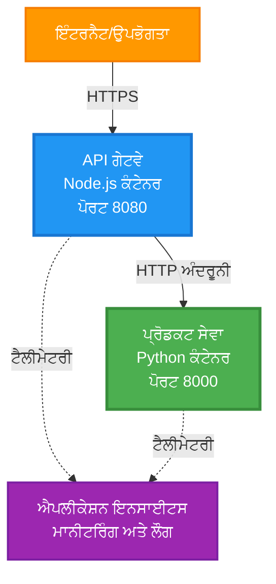
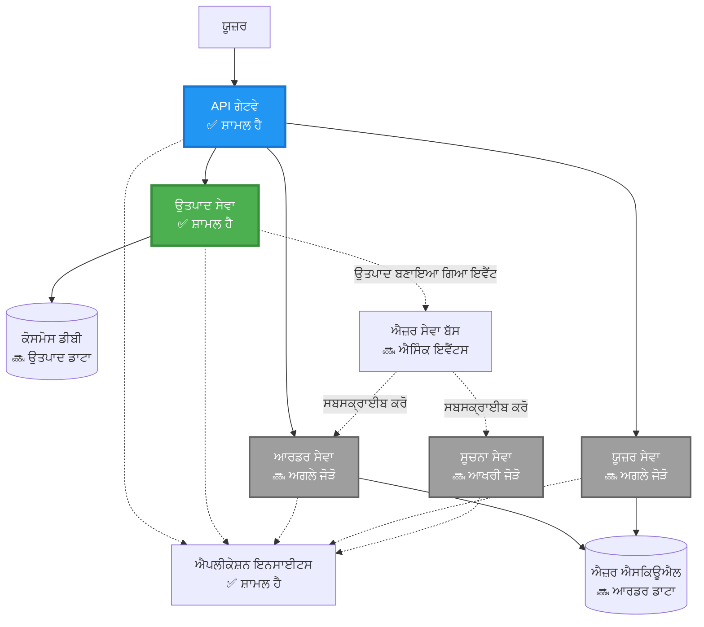
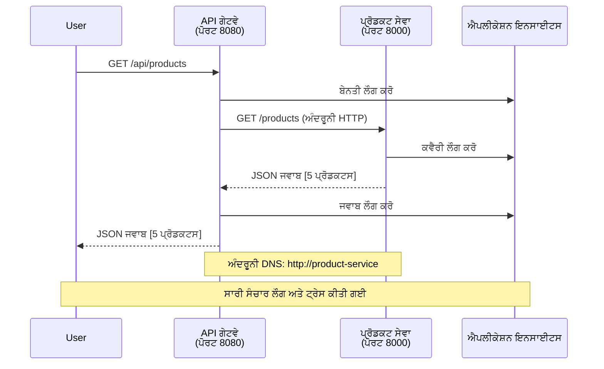

# ਮਾਈਕ੍ਰੋਸਰਵਿਸ ਆਰਕੀਟੈਕਚਰ - ਕੰਟੇਨਰ ਐਪ ਉਦਾਹਰਨ

⏱️ **ਅਨੁਮਾਨਿਤ ਸਮਾਂ**: 25-35 ਮਿੰਟ | 💰 **ਅਨੁਮਾਨਿਤ ਖਰਚ**: ~$50-100/ਮਹੀਨਾ | ⭐ **ਜਟਿਲਤਾ**: ਉੱਚ ਪੱਧਰ

**📚 ਸਿੱਖਣ ਦਾ ਰਾਹ**:
- ← ਪਿਛਲਾ: [ਸਧਾਰਨ Flask API](../../../../examples/container-app/simple-flask-api) - ਸਿੰਗਲ ਕੰਟੇਨਰ ਬੁਨਿਆਦ
- 🎯 **ਤੁਸੀਂ ਇੱਥੇ ਹੋ**: ਮਾਈਕ੍ਰੋਸਰਵਿਸ ਆਰਕੀਟੈਕਚਰ (2-ਸਰਵਿਸ ਬੁਨਿਆਦ)
- → ਅਗਲਾ: [AI ਇੰਟੀਗ੍ਰੇਸ਼ਨ](../../../../docs/ai-foundry) - ਆਪਣੀਆਂ ਸਰਵਿਸਾਂ ਵਿੱਚ ਸਮਰੱਥਾ ਸ਼ਾਮਲ ਕਰੋ
- 🏠 [ਕੋਰਸ ਹੋਮ](../../README.md)

---

ਇੱਕ **ਸਰਲ ਪਰ ਕਾਰਗਰ** ਮਾਈਕ੍ਰੋਸਰਵਿਸ ਆਰਕੀਟੈਕਚਰ ਜੋ AZD CLI ਦੀ ਵਰਤੋਂ ਕਰਕੇ Azure Container Apps ਵਿੱਚ ਡਿਪਲੌਇ ਕੀਤੀ ਗਈ ਹੈ। ਇਹ ਉਦਾਹਰਨ ਸਰਵਿਸ-ਤੋਂ-ਸਰਵਿਸ ਸੰਚਾਰ, ਕੰਟੇਨਰ ਆਰਕੇਸਟ੍ਰੇਸ਼ਨ, ਅਤੇ ਮਾਨੀਟਰਿੰਗ ਨੂੰ ਇੱਕ ਪ੍ਰਯੋਗਤਮ 2-ਸਰਵਿਸ ਸੈਟਅਪ ਨਾਲ ਦਰਸਾਉਂਦੀ ਹੈ।

> **📚 ਸਿੱਖਣ ਦਾ ਢੰਗ**: ਇਹ ਉਦਾਹਰਨ ਇੱਕ ਘੱਟੋ-ਘੱਟ 2-ਸਰਵਿਸ ਆਰਕੀਟੈਕਚਰ (API Gateway + Backend Service) ਨਾਲ ਸ਼ੁਰੂ ਹੁੰਦੀ ਹੈ ਜਿਸਨੂੰ ਤੁਸੀਂ ਅਸਲ ਵਿੱਚ ਡਿਪਲੌਇ ਕਰ ਸਕਦੇ ਹੋ ਅਤੇ ਸਿੱਖ ਸਕਦੇ ਹੋ। ਇਸ ਬੁਨਿਆਦ ਨੂੰ ਮਾਸਟਰ ਕਰਨ ਤੋਂ ਬਾਅਦ, ਅਸੀਂ ਪੂਰੇ ਮਾਈਕ੍ਰੋਸਰਵਿਸ ਸਿਸਟਮ ਵਿੱਚ ਵਧਾਉਣ ਲਈ ਮਾਰਗਦਰਸ਼ਨ ਪ੍ਰਦਾਨ ਕਰਦੇ ਹਾਂ।

## ਤੁਸੀਂ ਕੀ ਸਿੱਖੋਗੇ

ਇਸ ਉਦਾਹਰਨ ਨੂੰ ਪੂਰਾ ਕਰਕੇ, ਤੁਸੀਂ:
- Azure Container Apps ਵਿੱਚ ਕਈ ਕੰਟੇਨਰ ਡਿਪਲੌਇ ਕਰਨਾ
- ਅੰਦਰੂਨੀ ਨੈਟਵਰਕਿੰਗ ਨਾਲ ਸਰਵਿਸ-ਤੋਂ-ਸਰਵਿਸ ਸੰਚਾਰ ਲਾਗੂ ਕਰਨਾ
- ਵਾਤਾਵਰਣ-ਅਧਾਰਿਤ ਸਕੇਲਿੰਗ ਅਤੇ ਸਿਹਤ ਜਾਂਚਾਂ ਕਨਫਿਗਰ ਕਰਨਾ
- Application Insights ਨਾਲ ਵੰਡੇ ਐਪਲੀਕੇਸ਼ਨ ਮਾਨੀਟਰ ਕਰਨਾ
- ਮਾਈਕ੍ਰੋਸਰਵਿਸ ਡਿਪਲੌਇਮੈਂਟ ਪੈਟਰਨ ਅਤੇ ਵਧੀਆ ਅਭਿਆਸ ਸਮਝਣਾ
- ਸਧਾਰਨ ਤੋਂ ਜਟਿਲ ਆਰਕੀਟੈਕਚਰ ਵਿੱਚ ਤਰੱਕੀ ਕਰਨ ਦੀ ਸਿੱਖਣਾ

## ਆਰਕੀਟੈਕਚਰ

### ਫੇਜ਼ 1: ਜੋ ਅਸੀਂ ਬਣਾਉਣ ਜਾ ਰਹੇ ਹਾਂ (ਇਸ ਉਦਾਹਰਨ ਵਿੱਚ ਸ਼ਾਮਲ)


**ਕੰਪੋਨੈਂਟ ਵੇਰਵਾ:**

| ਕੰਪੋਨੈਂਟ | ਉਦੇਸ਼ | ਪਹੁੰਚ | ਸਰੋਤ |
|-----------|---------|--------|-----------|
| **API Gateway** | ਬੈਕਐਂਡ ਸਰਵਿਸਾਂ ਨੂੰ ਬਾਹਰੀ ਬੇਨਤੀਆਂ ਰੂਟ ਕਰਦਾ ਹੈ | ਪਬਲਿਕ (HTTPS) | 1 vCPU, 2GB RAM, 2-20 ਰਿਪਲਿਕਾ |
| **Product Service** | ਇਨ-ਮੇਮੋਰੀ ਡਾਟਾ ਨਾਲ ਪ੍ਰੋਡਕਟ ਕੈਟਾਲੌਗ ਦਾ ਪ੍ਰਬੰਧ ਕਰਦਾ ਹੈ | ਸਿਰਫ ਅੰਦਰੂਨੀ | 0.5 vCPU, 1GB RAM, 1-10 ਰਿਪਲਿਕਾ |
| **Application Insights** | ਕੇਂਦਰੀ ਲਾਗਿੰਗ ਅਤੇ ਵੰਡੇ ਟ੍ਰੇਸਿੰਗ | Azure ਪੋਰਟਲ | 1-2 GB/ਮਹੀਨਾ ਡਾਟਾ ਇੰਜੈਕਸ਼ਨ |

**ਸਧਾਰਨ ਤੋਂ ਸ਼ੁਰੂ ਕਿਉਂ?**
- ✅ ਤੇਜ਼ੀ ਨਾਲ ਡਿਪਲੌਇ ਅਤੇ ਸਮਝੋ (25-35 ਮਿੰਟ)
- ✅ ਜਟਿਲਤਾ ਤੋਂ ਬਿਨਾਂ ਮੁੱਖ ਮਾਈਕ੍ਰੋਸਰਵਿਸ ਪੈਟਰਨ ਸਿੱਖੋ
- ✅ ਕੰਮ ਕਰਨ ਵਾਲਾ ਕੋਡ ਜਿਸਨੂੰ ਤੁਸੀਂ ਸੋਧ ਅਤੇ ਪ੍ਰਯੋਗ ਕਰ ਸਕਦੇ ਹੋ
- ✅ ਸਿੱਖਣ ਲਈ ਘੱਟ ਖਰਚ (~$50-100/ਮਹੀਨਾ ਬਨਾਮ $300-1400/ਮਹੀਨਾ)
- ✅ ਡਾਟਾਬੇਸ ਅਤੇ ਮੈਸੇਜ ਕਿਊਜ਼ ਸ਼ਾਮਲ ਕਰਨ ਤੋਂ ਪਹਿਲਾਂ ਭਰੋਸਾ ਬਣਾਓ

**ਉਦਾਹਰਣ**: ਇਸਨੂੰ ਡਰਾਈਵ ਕਰਨਾ ਸਿੱਖਣ ਵਾਂਗ ਸੋਚੋ। ਤੁਸੀਂ ਇੱਕ ਖਾਲੀ ਪਾਰਕਿੰਗ ਲਾਟ (2 ਸਰਵਿਸਾਂ) ਨਾਲ ਸ਼ੁਰੂ ਕਰਦੇ ਹੋ, ਮੁੱਢਲੇ ਸਿੱਧਾਂਤਾਂ ਨੂੰ ਮਾਸਟਰ ਕਰਦੇ ਹੋ, ਫਿਰ ਸ਼ਹਿਰੀ ਟ੍ਰੈਫਿਕ (5+ ਸਰਵਿਸਾਂ ਡਾਟਾਬੇਸਾਂ ਨਾਲ) ਵਿੱਚ ਤਰੱਕੀ ਕਰਦੇ ਹੋ।

### ਫੇਜ਼ 2: ਭਵਿੱਖ ਵਿੱਚ ਵਧਾਉਣਾ (ਰੈਫਰੈਂਸ ਆਰਕੀਟੈਕਚਰ)

ਜਦੋਂ ਤੁਸੀਂ 2-ਸਰਵਿਸ ਆਰਕੀਟੈਕਚਰ ਨੂੰ ਮਾਸਟਰ ਕਰ ਲੈਂਦੇ ਹੋ, ਤੁਸੀਂ ਇਸਨੂੰ ਵਧਾ ਸਕਦੇ ਹੋ:


"ਵਧਾਉਣ ਦੀ ਗਾਈਡ" ਸੈਕਸ਼ਨ ਦੇ ਅੰਤ ਵਿੱਚ ਕਦਮ-ਦਰ-ਕਦਮ ਹਦਾਇਤਾਂ ਦੇਖੋ।

## ਸ਼ਾਮਲ ਵਿਸ਼ੇਸ਼ਤਾਵਾਂ

✅ **ਸਰਵਿਸ ਡਿਸਕਵਰੀ**: ਕੰਟੇਨਰਾਂ ਦੇ ਵਿਚਕਾਰ DNS-ਅਧਾਰਿਤ ਆਟੋਮੈਟਿਕ ਡਿਸਕਵਰੀ  
✅ **ਲੋਡ ਬੈਲੈਂਸਿੰਗ**: ਰਿਪਲਿਕਾ ਵਿੱਚ ਬਣਾਇਆ ਗਿਆ ਲੋਡ ਬੈਲੈਂਸਿੰਗ  
✅ **ਆਟੋ-ਸਕੇਲਿੰਗ**: HTTP ਬੇਨਤੀਆਂ ਦੇ ਅਧਾਰ 'ਤੇ ਹਰ ਸਰਵਿਸ ਲਈ ਸੁਤੰਤਰ ਸਕੇਲਿੰਗ  
✅ **ਸਿਹਤ ਮਾਨੀਟਰਿੰਗ**: ਦੋਵਾਂ ਸਰਵਿਸਾਂ ਲਈ ਲਾਈਵਨੈਸ ਅਤੇ ਰੀਡੀਨੈਸ ਪ੍ਰੋਬ  
✅ **ਵੰਡੇ ਲਾਗਿੰਗ**: Application Insights ਨਾਲ ਕੇਂਦਰੀ ਲਾਗਿੰਗ  
✅ **ਅੰਦਰੂਨੀ ਨੈਟਵਰਕਿੰਗ**: ਸੁਰੱਖਿਅਤ ਸਰਵਿਸ-ਤੋਂ-ਸਰਵਿਸ ਸੰਚਾਰ  
✅ **ਕੰਟੇਨਰ ਆਰਕੇਸਟ੍ਰੇਸ਼ਨ**: ਆਟੋਮੈਟਿਕ ਡਿਪਲੌਇਮੈਂਟ ਅਤੇ ਸਕੇਲਿੰਗ  
✅ **ਜ਼ੀਰੋ-ਡਾਊਨਟਾਈਮ ਅਪਡੇਟਸ**: ਰੋਲਿੰਗ ਅਪਡੇਟਸ ਰਿਵੀਜ਼ਨ ਪ੍ਰਬੰਧਨ ਨਾਲ  

## ਪੂਰਵ ਸ਼ਰਤਾਂ

### ਲੋੜੀਂਦੇ ਟੂਲ

ਸ਼ੁਰੂ ਕਰਨ ਤੋਂ ਪਹਿਲਾਂ, ਇਹ ਯਕੀਨੀ ਬਣਾਓ ਕਿ ਤੁਹਾਡੇ ਕੋਲ ਇਹ ਟੂਲ ਇੰਸਟਾਲ ਹਨ:

1. **[Azure Developer CLI (azd)](https://learn.microsoft.com/azure/developer/azure-developer-cli/install-azd)** (ਵਰਜਨ 1.0.0 ਜਾਂ ਇਸ ਤੋਂ ਉੱਚਾ)
   ```bash
   azd version
   # ਉਮੀਦ ਕੀਤੀ ਆਉਟਪੁੱਟ: azd ਵਰਜਨ 1.0.0 ਜਾਂ ਇਸ ਤੋਂ ਉੱਚਾ
   ```

2. **[Azure CLI](https://learn.microsoft.com/cli/azure/install-azure-cli)** (ਵਰਜਨ 2.50.0 ਜਾਂ ਇਸ ਤੋਂ ਉੱਚਾ)
   ```bash
   az --version
   # ਉਮੀਦ ਕੀਤੀ ਆਉਟਪੁੱਟ: azure-cli 2.50.0 ਜਾਂ ਇਸ ਤੋਂ ਉੱਚਾ
   ```

3. **[Docker](https://www.docker.com/get-started)** (ਸਥਾਨਕ ਵਿਕਾਸ/ਟੈਸਟਿੰਗ ਲਈ - ਵਿਕਲਪਿਕ)
   ```bash
   docker --version
   # ਉਮੀਦ ਕੀਤੀ ਆਉਟਪੁੱਟ: ਡਾਕਰ ਵਰਜਨ 20.10 ਜਾਂ ਇਸ ਤੋਂ ਉੱਚਾ
   ```

### ਆਪਣੀ ਸੈਟਅਪ ਦੀ ਪੁਸ਼ਟੀ ਕਰੋ

ਇਹ ਕਮਾਂਡ ਚਲਾਓ ਤਾਂ ਜੋ ਇਹ ਯਕੀਨੀ ਬਣੇ ਕਿ ਤੁਸੀਂ ਤਿਆਰ ਹੋ:

```bash
# ਐਜ਼ਰ ਡਿਵੈਲਪਰ CLI ਚੈੱਕ ਕਰੋ
azd version
# ✅ ਉਮੀਦ: azd ਵਰਜਨ 1.0.0 ਜਾਂ ਇਸ ਤੋਂ ਉੱਚਾ

# ਐਜ਼ਰ CLI ਚੈੱਕ ਕਰੋ
az --version
# ✅ ਉਮੀਦ: azure-cli 2.50.0 ਜਾਂ ਇਸ ਤੋਂ ਉੱਚਾ

# ਡਾਕਰ ਚੈੱਕ ਕਰੋ (ਵਿਕਲਪਿਕ)
docker --version
# ✅ ਉਮੀਦ: ਡਾਕਰ ਵਰਜਨ 20.10 ਜਾਂ ਇਸ ਤੋਂ ਉੱਚਾ
```

**ਸਫਲਤਾ ਮਾਪਦੰਡ**: ਸਾਰੀਆਂ ਕਮਾਂਡਾਂ ਵਰਜਨ ਨੰਬਰ ਵਾਪਸ ਕਰਦੀਆਂ ਹਨ ਜੋ ਘੱਟੋ-ਘੱਟ ਮਾਪਦੰਡਾਂ ਨਾਲ ਮੇਲ ਖਾਂਦੀਆਂ ਹਨ।

### Azure ਦੀਆਂ ਲੋੜਾਂ

- ਇੱਕ ਸਰਗਰਮ **Azure ਸਬਸਕ੍ਰਿਪਸ਼ਨ** ([ਮੁਫ਼ਤ ਖਾਤਾ ਬਣਾਓ](https://azure.microsoft.com/free/))
- ਤੁਹਾਡੇ ਸਬਸਕ੍ਰਿਪਸ਼ਨ ਵਿੱਚ ਸਰੋਤ ਬਣਾਉਣ ਦੀਆਂ ਅਨੁਮਤੀਆਂ
- ਸਬਸਕ੍ਰਿਪਸ਼ਨ ਜਾਂ ਰਿਸੋਰਸ ਗਰੁੱਪ 'ਤੇ **Contributor** ਭੂਮਿਕਾ

### ਗਿਆਨ ਪੂਰਵ ਸ਼ਰਤਾਂ

ਇਹ ਇੱਕ **ਉੱਚ ਪੱਧਰ** ਦੀ ਉਦਾਹਰਨ ਹੈ। ਤੁਹਾਨੂੰ:
- [ਸਧਾਰਨ Flask API ਉਦਾਹਰਨ](../../../../examples/container-app/simple-flask-api) ਪੂਰਾ ਕੀਤਾ ਹੋਣਾ ਚਾਹੀਦਾ ਹੈ
- ਮਾਈਕ੍ਰੋਸਰਵਿਸ ਆਰਕੀਟੈਕਚਰ ਦੀ ਬੁਨਿਆਦ ਸਮਝ ਹੋਣੀ ਚਾਹੀਦੀ ਹੈ
- REST APIs ਅਤੇ HTTP ਨਾਲ ਜਾਣੂ ਹੋਣਾ ਚਾਹੀਦਾ ਹੈ
- ਕੰਟੇਨਰ ਸੰਕਲਪਾਂ ਦੀ ਸਮਝ ਹੋਣੀ ਚਾਹੀਦੀ ਹੈ

**ਕੰਟੇਨਰ ਐਪਸ ਵਿੱਚ ਨਵੇਂ ਹੋ?** ਪਹਿਲਾਂ [ਸਧਾਰਨ Flask API ਉਦਾਹਰਨ](../../../../examples/container-app/simple-flask-api) ਨਾਲ ਸ਼ੁਰੂ ਕਰੋ ਤਾਂ ਜੋ ਬੁਨਿਆਦ ਸਿੱਖ ਸਕੋ।

## ਤੇਜ਼ ਸ਼ੁਰੂਆਤ (ਕਦਮ-ਦਰ-ਕਦਮ)

### ਕਦਮ 1: ਕਲੋਨ ਅਤੇ ਨੈਵੀਗੇਟ ਕਰੋ

```bash
git clone https://github.com/microsoft/AZD-for-beginners.git
cd AZD-for-beginners/examples/microservices
```

**✓ ਸਫਲਤਾ ਦੀ ਜਾਂਚ**: ਯਕੀਨੀ ਬਣਾਓ ਕਿ ਤੁਸੀਂ `azure.yaml` ਵੇਖਦੇ ਹੋ:
```bash
ls
# ਉਮੀਦ ਹੈ: README.md, azure.yaml, infra/, src/
```

### ਕਦਮ 2: Azure ਨਾਲ ਪ੍ਰਮਾਣਿਕਤਾ

```bash
azd auth login
```

ਇਹ ਤੁਹਾਡੇ ਬ੍ਰਾਊਜ਼ਰ ਨੂੰ Azure ਪ੍ਰਮਾਣਿਕਤਾ ਲਈ ਖੋਲ੍ਹਦਾ ਹੈ। ਆਪਣੇ Azure ਪ੍ਰਮਾਣਿਕਤਾ ਪੱਤਰਾਂ ਨਾਲ ਸਾਈਨ ਇਨ ਕਰੋ।

**✓ ਸਫਲਤਾ ਦੀ ਜਾਂਚ**: ਤੁਹਾਨੂੰ ਇਹ ਵੇਖਣਾ ਚਾਹੀਦਾ ਹੈ:
```
Logged in to Azure.
```

### ਕਦਮ 3: ਵਾਤਾਵਰਣ ਸ਼ੁਰੂ ਕਰੋ

```bash
azd init
```

**ਤੁਹਾਨੂੰ ਜੋ ਪ੍ਰਸ਼ਨ ਦਿੱਤੇ ਜਾਣਗੇ**:
- **ਵਾਤਾਵਰਣ ਦਾ ਨਾਮ**: ਇੱਕ ਛੋਟਾ ਨਾਮ ਦਾਖਲ ਕਰੋ (ਜਿਵੇਂ, `microservices-dev`)
- **Azure ਸਬਸਕ੍ਰਿਪਸ਼ਨ**: ਆਪਣੀ ਸਬਸਕ੍ਰਿਪਸ਼ਨ ਚੁਣੋ
- **Azure ਸਥਾਨ**: ਇੱਕ ਖੇਤਰ ਚੁਣੋ (ਜਿਵੇਂ, `eastus`, `westeurope`)

**✓ ਸਫਲਤਾ ਦੀ ਜਾਂਚ**: ਤੁਹਾਨੂੰ ਇਹ ਵੇਖਣਾ ਚਾਹੀਦਾ ਹੈ:
```
SUCCESS: New project initialized!
```

### ਕਦਮ 4: ਢਾਂਚਾ ਅਤੇ ਸਰਵਿਸਾਂ ਡਿਪਲੌਇ ਕਰੋ

```bash
azd up
```

**ਕੀ ਹੁੰਦਾ ਹੈ** (8-12 ਮਿੰਟ ਲੱਗਦੇ ਹਨ):

```mermaid
graph LR
    A[azd ਅੱਪ] --> B[ਰਿਸੋਰਸ ਗਰੁੱਪ ਬਣਾਓ]
    B --> C[ਕੰਟੇਨਰ ਰਜਿਸਟਰੀ ਡਿਪਲੌਇ ਕਰੋ]
    C --> D[ਲੌਗ ਐਨਾਲਿਟਿਕਸ ਡਿਪਲੌਇ ਕਰੋ]
    D --> E[ਐਪ ਇਨਸਾਈਟਸ ਡਿਪਲੌਇ ਕਰੋ]
    E --> F[ਕੰਟੇਨਰ ਵਾਤਾਵਰਣ ਬਣਾਓ]
    F --> G[API ਗੇਟਵੇ ਇਮੇਜ ਬਣਾਓ]
    F --> H[ਪ੍ਰੋਡਕਟ ਸੇਵਾ ਇਮੇਜ ਬਣਾਓ]
    G --> I[ਰਜਿਸਟਰੀ ਵਿੱਚ ਪੁਸ਼ ਕਰੋ]
    H --> I
    I --> J[API ਗੇਟਵੇ ਡਿਪਲੌਇ ਕਰੋ]
    I --> K[ਪ੍ਰੋਡਕਟ ਸੇਵਾ ਡਿਪਲੌਇ ਕਰੋ]
    J --> L[ਇਨਗ੍ਰੈਸ ਅਤੇ ਹੈਲਥ ਚੈਕਸ ਸੰਰਚਨਾ ਕਰੋ]
    K --> L
    L --> M[ਡਿਪਲੌਇਮੈਂਟ ਪੂਰਾ ✓]
    
    style A fill:#2196F3,stroke:#1976D2,stroke-width:3px,color:#fff
    style M fill:#4CAF50,stroke:#388E3C,stroke-width:3px,color:#fff
```


**✓ ਸਫਲਤਾ ਦੀ ਜਾਂਚ**: ਤੁਹਾਨੂੰ ਇਹ ਵੇਖਣਾ ਚਾਹੀਦਾ ਹੈ:
```
SUCCESS: Your application was deployed to Azure in X minutes Y seconds.
Endpoint: https://api-gateway-<unique-id>.azurecontainerapps.io
```

**⏱️ ਸਮਾਂ**: 8-12 ਮਿੰਟ

### ਕਦਮ 5: ਡਿਪਲੌਇਮੈਂਟ ਦੀ ਜਾਂਚ ਕਰੋ

```bash
# ਗੇਟਵੇ ਐਂਡਪੌਇੰਟ ਪ੍ਰਾਪਤ ਕਰੋ
GATEWAY_URL=$(azd env get-values | grep API_GATEWAY_URL | cut -d '=' -f2 | tr -d '"')

# API ਗੇਟਵੇ ਦੀ ਸਿਹਤ ਦੀ ਜਾਂਚ ਕਰੋ
curl $GATEWAY_URL/health
```

**✅ ਉਮੀਦਵਾਰ ਨਤੀਜਾ**:
```json
{
  "status": "healthy",
  "service": "api-gateway",
  "timestamp": "2025-11-19T10:30:00Z"
}
```

**ਗੇਟਵੇ ਰਾਹੀਂ ਪ੍ਰੋਡਕਟ ਸਰਵਿਸ ਦੀ ਜਾਂਚ ਕਰੋ**:
```bash
# ਉਤਪਾਦਾਂ ਦੀ ਸੂਚੀ
curl $GATEWAY_URL/api/products
```

**✅ ਉਮੀਦਵਾਰ ਨਤੀਜਾ**:
```json
[
  {"id":1,"name":"Laptop","price":999.99,"stock":50},
  {"id":2,"name":"Mouse","price":29.99,"stock":200},
  {"id":3,"name":"Keyboard","price":79.99,"stock":150}
]
```

**✓ ਸਫਲਤਾ ਦੀ ਜਾਂਚ**: ਦੋਵੇਂ ਐਂਡਪੌਇੰਟ JSON ਡਾਟਾ ਬਿਨਾਂ ਗਲਤੀਆਂ ਦੇ ਵਾਪਸ ਕਰਦੇ ਹਨ।

---

**🎉 ਵਧਾਈ ਹੋਵੇ!** ਤੁਸੀਂ Azure ਵਿੱਚ ਇੱਕ ਮਾਈਕ੍ਰੋਸਰਵਿਸ ਆਰਕੀਟੈਕਚਰ ਡਿਪਲੌਇ ਕਰ ਦਿੱਤਾ ਹੈ!

## ਪ੍ਰੋਜੈਕਟ ਸਟ੍ਰਕਚਰ

ਸਾਰੇ ਇੰਪਲੀਮੈਂਟੇਸ਼ਨ ਫਾਈਲਾਂ ਸ਼ਾਮਲ ਹਨ—ਇਹ ਇੱਕ ਪੂਰੀ, ਕੰਮ ਕਰਨ ਵਾਲੀ ਉਦਾਹਰਨ ਹੈ:

```
microservices/
│
├── README.md                         # This file
├── azure.yaml                        # AZD configuration
├── .gitignore                        # Git ignore patterns
│
├── infra/                           # Infrastructure as Code (Bicep)
│   ├── main.bicep                   # Main orchestration
│   ├── abbreviations.json           # Naming conventions
│   ├── core/                        # Shared infrastructure
│   │   ├── container-apps-environment.bicep  # Container environment + registry
│   │   └── monitor.bicep            # Application Insights + Log Analytics
│   └── app/                         # Service definitions
│       ├── api-gateway.bicep        # API Gateway container app
│       └── product-service.bicep    # Product Service container app
│
└── src/                             # Application source code
    ├── api-gateway/                 # Node.js API Gateway
    │   ├── app.js                   # Express server with routing
    │   ├── package.json             # Node dependencies
    │   └── Dockerfile               # Container definition
    └── product-service/             # Python Product Service
        ├── main.py                  # Flask API with product data
        ├── requirements.txt         # Python dependencies
        └── Dockerfile               # Container definition
```

**ਹਰ ਕੰਪੋਨੈਂਟ ਕੀ ਕਰਦਾ ਹੈ:**

**Infrastructure (infra/)**:
- `main.bicep`: ਸਾਰੇ Azure ਸਰੋਤਾਂ ਅਤੇ ਉਨ੍ਹਾਂ ਦੀਆਂ ਲੋੜਾਂ ਨੂੰ ਆਰਕੇਸਟ੍ਰੇਟ ਕਰਦਾ ਹੈ
- `core/container-apps-environment.bicep`: ਕੰਟੇਨਰ ਐਪਸ ਵਾਤਾਵਰਣ ਅਤੇ Azure Container Registry ਬਣਾਉਂਦਾ ਹੈ
- `core/monitor.bicep`: ਵੰਡੇ ਲਾਗਿੰਗ ਲਈ Application Insights ਸੈਟਅਪ ਕਰਦਾ ਹੈ
- `app/*.bicep`: ਸਕੇਲਿੰਗ ਅਤੇ ਸਿਹਤ ਜਾਂਚਾਂ ਨਾਲ ਵਿਅਕਤੀਗਤ ਕੰਟੇਨਰ ਐਪ ਪਰਿਭਾਸ਼ਾਵਾਂ

**API Gateway (src/api-gateway/)**:
- ਬਾਹਰੀ ਬੇਨਤੀਆਂ ਨੂੰ ਬੈਕਐਂਡ ਸਰਵਿਸਾਂ ਵੱਲ ਰੂਟ ਕਰਨ ਵਾਲੀ ਸਰਵਿਸ
- ਲਾਗਿੰਗ, ਗਲਤੀ ਸੰਭਾਲਣ, ਅਤੇ ਬੇਨਤੀ ਅੱਗੇ ਭੇਜਣ ਨੂੰ ਲਾਗੂ ਕਰਦਾ ਹੈ
- ਸਰਵਿਸ-ਤੋਂ-ਸਰਵਿਸ HTTP ਸੰਚਾਰ ਦਾ ਪ੍ਰਦਰਸ਼ਨ ਕਰਦਾ ਹੈ

**Product Service (src/product-service/)**:
- ਪ੍ਰੋਡਕਟ ਕੈਟਾਲੌਗ ਨਾਲ ਅੰਦਰੂਨੀ ਸਰਵਿਸ (ਸਰਲਤਾ ਲਈ ਇਨ-ਮੇਮੋਰੀ)
- REST API ਸਿਹਤ ਜਾਂਚਾਂ ਨਾਲ
- ਬੈਕਐਂਡ ਮਾਈਕ੍ਰੋਸਰਵਿਸ ਪੈਟਰਨ ਦਾ ਉਦਾਹਰਨ

## ਸਰਵਿਸਾਂ ਦਾ ਝਲਕ

### API Gateway (Node.js/Express)

**Port**: 8080  
**Access**: ਪਬਲਿਕ (ਬਾਹਰੀ ਇਨਗਰੈਸ)  
**Purpose**: ਆਉਣ ਵਾਲੀਆਂ ਬੇਨਤੀਆਂ ਨੂੰ ਉਚਿਤ ਬੈਕਐਂਡ ਸਰਵਿਸਾਂ ਵੱਲ ਰੂਟ ਕਰਦਾ ਹੈ  

**Endpoints**:
- `GET /` - ਸਰਵਿਸ ਜਾਣਕਾਰੀ
- `GET /health` - ਸਿਹਤ ਜਾਂਚ ਐਂਡਪੌਇੰਟ
- `GET /api/products` - ਪ੍ਰੋਡਕਟ ਸਰਵਿਸ ਵੱਲ ਅੱਗੇ ਭੇਜੋ (ਸਾਰੇ ਦੀ ਸੂਚੀ)
- `GET /api/products/:id` - ਪ੍ਰੋਡਕਟ ਸਰਵਿਸ ਵੱਲ ਅੱਗੇ ਭੇਜੋ (ID ਦੁਆਰਾ ਪ੍ਰਾਪਤ ਕਰੋ)

**ਮੁੱਖ ਵਿਸ਼ੇਸ਼ਤਾਵਾਂ**:
- axios ਨਾਲ ਬੇਨਤੀ ਰੂਟਿੰਗ
- ਕੇਂਦਰੀ ਲਾਗਿੰਗ
- ਗਲਤੀ ਸੰਭਾਲਣ ਅਤੇ ਟਾਈਮਆਉਟ ਪ੍ਰਬੰਧਨ
- ਵਾਤਾਵਰਣ ਵੈਰੀਏਬਲਾਂ ਰਾਹੀਂ ਸਰਵਿਸ ਡਿਸਕਵਰੀ
- Application Insights ਇੰਟੀਗ੍ਰੇਸ਼ਨ

**ਕੋਡ ਹਾਈਲਾਈਟ** (`src/api-gateway/app.js`):
```javascript
// ਅੰਦਰੂਨੀ ਸੇਵਾ ਸੰਚਾਰ
app.get('/api/products', async (req, res) => {
  const response = await axios.get(`${PRODUCT_SERVICE_URL}/products`, {
    timeout: 5000
  });
  res.json(response.data);
});
```

### Product Service (Python/Flask)

**Port**: 8000  
**Access**: ਸਿਰਫ ਅੰਦਰੂਨੀ (ਕੋਈ ਬਾਹਰੀ ਇਨਗਰੈਸ ਨਹੀਂ)  
**Purpose**: ਇਨ-ਮੇਮੋਰੀ ਡਾਟਾ ਨਾਲ ਪ੍ਰੋਡਕਟ ਕੈਟਾਲੌਗ ਦਾ ਪ੍ਰਬੰਧ ਕਰਦਾ ਹੈ  

**Endpoints**:
- `GET /` - ਸਰਵਿਸ ਜਾਣਕਾਰੀ
- `GET /health` - ਸਿਹਤ ਜਾਂਚ ਐਂਡਪੌਇੰਟ
- `GET /products` - ਸਾਰੇ ਪ੍ਰੋਡਕਟ ਦੀ ਸੂਚੀ
- `GET /products/<id>` - ID ਦੁਆਰਾ ਪ੍ਰੋਡਕਟ ਪ੍ਰਾਪਤ ਕਰੋ

**ਮੁੱਖ ਵਿਸ਼ੇਸ਼ਤਾਵਾਂ**:
- Flask ਨਾਲ RESTful API
- ਸਿਹਤ ਮਾਨੀਟਰਿੰਗ ਪ੍ਰੋਬ ਨਾਲ
- ਸਟ੍ਰਕਚਰਡ ਲਾਗਿੰਗ
- Application Insights ਇੰਟੀਗ੍ਰੇਸ਼ਨ

**ਡਾਟਾ ਮਾਡਲ**:
```python
{
  "id": 1,
  "name": "Laptop",
  "description": "High-performance laptop",
  "price": 999.99,
  "stock": 50
}
```

**ਸਿਰਫ ਅੰਦਰੂਨੀ ਕਿਉਂ?**
ਪ੍ਰੋਡਕਟ ਸਰਵਿਸ ਨੂੰ ਜਨਤਕ ਤੌਰ 'ਤੇ ਉਜਾਗਰ ਨਹੀਂ ਕੀਤਾ ਗਿਆ। ਸਾਰੀਆਂ ਬੇਨਤੀਆਂ API Gateway ਰਾਹੀਂ ਜਾਣੀਆਂ ਚਾਹੀਦੀਆਂ ਹਨ, ਜੋ ਪ੍ਰਦਾਨ ਕਰਦਾ ਹੈ:
- ਸੁਰੱਖਿਆ: ਨਿਯੰਤਰਿਤ ਪਹੁੰਚ ਬਿੰਦੂ
- ਲਚਕਤਾ: ਬੈਕਐਂਡ ਬਦਲ ਸਕਦੇ ਹੋ ਬਿਨਾਂ ਕਲਾਇੰਟਾਂ ਨੂੰ ਪ੍ਰਭਾਵਿਤ ਕੀਤੇ
- ਮਾਨੀਟਰਿੰਗ: ਕੇਂਦਰੀ ਬੇਨਤੀ ਲਾਗਿੰਗ

## ਸਰਵਿਸ ਸੰਚਾਰ ਨੂੰ ਸਮਝਣਾ

### ਸਰਵਿਸਾਂ ਇੱਕ-ਦੂਜੇ ਨਾਲ ਕਿਵੇਂ ਗੱਲ ਕਰਦੀਆਂ ਹਨ


ਇਸ ਉਦਾਹਰਨ ਵਿੱਚ, API Gateway **ਅੰਦਰੂਨੀ HTTP ਕਾਲਾਂ** ਦੀ ਵਰਤੋਂ ਕਰਕੇ Product Service ਨਾਲ ਗੱਲ ਕਰਦਾ ਹੈ:

```javascript
// API ਗੇਟਵੇ (src/api-gateway/app.js)
const PRODUCT_SERVICE_URL = process.env.PRODUCT_SERVICE_URL;

// ਅੰਦਰੂਨੀ HTTP ਬੇਨਤੀ ਕਰੋ
const response = await axios.get(`${PRODUCT_SERVICE_URL}/products`);
```

**ਮੁੱਖ ਬਿੰਦੂ**:

1. **DNS-ਅਧਾਰਿਤ ਡਿਸਕਵਰੀ**: ਕੰਟੇਨਰ ਐਪਸ ਅੰਦਰੂਨੀ ਸਰਵਿਸਾਂ ਲਈ DNS ਆਟੋਮੈਟਿਕ ਪ੍ਰਦਾਨ ਕਰਦਾ ਹੈ
   - ਪ੍ਰੋਡਕਟ ਸਰ
3. ਦੋਵੇਂ ਸੇਵਾਵਾਂ ਨੂੰ ਮੁੜ ਤੈਨਾਤ ਕਰੋ:

```bash
azd deploy product-service
azd deploy api-gateway
```

4. ਨਵੇਂ ਐਂਡਪੌਇੰਟ ਦੀ ਜਾਂਚ ਕਰੋ:

```bash
GATEWAY_URL=$(azd env get-values | grep API_GATEWAY_URL | cut -d '=' -f2 | tr -d '"')

# ਨਵਾਂ ਉਤਪਾਦ ਬਣਾਓ
curl -X POST $GATEWAY_URL/api/products \
  -H "Content-Type: application/json" \
  -d '{"name":"USB Cable","price":9.99,"stock":500}'
```

**✅ ਉਮੀਦ ਕੀਤੀ ਆਉਟਪੁੱਟ:**
```json
{"id":6,"name":"USB Cable","description":"","price":9.99,"stock":500}
```

5. ਪੱਕਾ ਕਰੋ ਕਿ ਇਹ ਸੂਚੀ ਵਿੱਚ ਦਿਖਾਈ ਦੇ ਰਿਹਾ ਹੈ:

```bash
curl $GATEWAY_URL/api/products
# ਹੁਣ 6 ਉਤਪਾਦ ਦਿਖਾਉਣੇ ਚਾਹੀਦੇ ਹਨ, ਜਿਸ ਵਿੱਚ ਨਵਾਂ USB ਕੇਬਲ ਸ਼ਾਮਲ ਹੈ।
```

**ਸਫਲਤਾ ਮਾਪਦੰਡ**:
- ✅ POST ਬੇਨਤੀ HTTP 201 ਵਾਪਸ ਕਰਦੀ ਹੈ
- ✅ GET /api/products ਸੂਚੀ ਵਿੱਚ ਨਵਾਂ ਉਤਪਾਦ ਦਿਖਾਈ ਦਿੰਦਾ ਹੈ
- ✅ ਉਤਪਾਦ ਵਿੱਚ ਆਟੋ-ਇੰਕਰੀਮੈਂਟ ਕੀਤਾ ID ਹੁੰਦਾ ਹੈ

**ਸਮਾਂ**: 10-15 ਮਿੰਟ

---

### ਅਭਿਆਸ 2: Autoscaling ਨਿਯਮਾਂ ਨੂੰ ਸੋਧੋ ⭐⭐ (ਦਰਮਿਆਨਾ)

**ਲਕਸ਼**: Product Service ਨੂੰ ਜ਼ਿਆਦਾ ਤੇਜ਼ੀ ਨਾਲ ਸਕੇਲ ਕਰਨ ਲਈ ਬਦਲੋ

**ਸ਼ੁਰੂਆਤੀ ਬਿੰਦੂ**: `infra/app/product-service.bicep`

**ਕਦਮ**:

1. `infra/app/product-service.bicep` ਖੋਲ੍ਹੋ ਅਤੇ `scale` ਬਲਾਕ ਲੱਭੋ (ਲਗਭਗ ਲਾਈਨ 95)

2. ਇਸ ਨੂੰ ਬਦਲੋ:
```bicep
scale: {
  minReplicas: 1
  maxReplicas: 10
  rules: [
    {
      name: 'http-scale-rule'
      http: {
        metadata: {
          concurrentRequests: '100'  // OLD
        }
      }
    }
  ]
}
```

ਇਸ ਵਿੱਚ:
```bicep
scale: {
  minReplicas: 2  // Always have 2 running
  maxReplicas: 20  // Allow more scaling
  rules: [
    {
      name: 'http-scale-rule'
      http: {
        metadata: {
          concurrentRequests: '20'  // Scale at lower threshold
        }
      }
    }
  ]
}
```

3. ਢਾਂਚੇ ਨੂੰ ਮੁੜ ਤੈਨਾਤ ਕਰੋ:

```bash
azd up
```

4. ਨਵੇਂ ਸਕੇਲਿੰਗ ਸੰਰਚਨਾ ਦੀ ਪੁਸ਼ਟੀ ਕਰੋ:

```bash
az containerapp show \
  --name $(azd env get-values | grep PRODUCT_SERVICE | head -1 | cut -d '/' -f5) \
  --resource-group $(azd env get-values | grep AZURE_RESOURCE_GROUP | cut -d '=' -f2 | tr -d '"') \
  --query "properties.template.scale" -o json
```

**✅ ਉਮੀਦ ਕੀਤੀ ਆਉਟਪੁੱਟ:**
```json
{
  "minReplicas": 2,
  "maxReplicas": 20,
  "rules": [...]
}
```

5. ਲੋਡ ਨਾਲ autoscaling ਦੀ ਜਾਂਚ ਕਰੋ:

```bash
# ਸਮਕਾਲੀ ਬੇਨਤੀਆਂ ਬਣਾਓ
for i in {1..500}; do curl $GATEWAY_URL/api/products & done

# ਸਕੇਲਿੰਗ ਦੇ ਘਟਨਾ ਦੇਖੋ
azd logs product-service --follow
# ਲੱਭੋ: ਕੰਟੇਨਰ ਐਪਸ ਸਕੇਲਿੰਗ ਘਟਨਾਵਾਂ
```

**ਸਫਲਤਾ ਮਾਪਦੰਡ**:
- ✅ Product Service ਹਮੇਸ਼ਾ ਘੱਟੋ-ਘੱਟ 2 replicas ਚਲਾਉਂਦਾ ਹੈ
- ✅ ਲੋਡ ਦੇ ਹੇਠਾਂ, 2 ਤੋਂ ਵੱਧ replicas ਤੱਕ ਸਕੇਲ ਕਰਦਾ ਹੈ
- ✅ Azure Portal ਵਿੱਚ ਨਵੇਂ ਸਕੇਲਿੰਗ ਨਿਯਮ ਦਿਖਾਈ ਦਿੰਦੇ ਹਨ

**ਸਮਾਂ**: 15-20 ਮਿੰਟ

---

### ਅਭਿਆਸ 3: Custom Monitoring Query ਸ਼ਾਮਲ ਕਰੋ ⭐⭐ (ਦਰਮਿਆਨਾ)

**ਲਕਸ਼**: Product API ਦੇ ਪ੍ਰਦਰਸ਼ਨ ਨੂੰ ਟ੍ਰੈਕ ਕਰਨ ਲਈ ਇੱਕ custom Application Insights query ਬਣਾਓ

**ਕਦਮ**:

1. Azure Portal ਵਿੱਚ Application Insights ਤੇ ਜਾਓ:
   - Azure Portal ਤੇ ਜਾਓ
   - ਆਪਣੀ resource group (rg-microservices-*) ਲੱਭੋ
   - Application Insights resource 'ਤੇ ਕਲਿੱਕ ਕਰੋ

2. ਖੱਬੇ ਮੀਨੂ ਵਿੱਚ "Logs" 'ਤੇ ਕਲਿੱਕ ਕਰੋ

3. ਇਹ query ਬਣਾਓ:

```kusto
requests
| where timestamp > ago(1h)
| where name contains "products"
| summarize 
    RequestCount = count(),
    AvgDuration = avg(duration),
    P95Duration = percentile(duration, 95),
    SuccessRate = 100.0 * countif(success == true) / count()
  by bin(timestamp, 5m)
| render timechart
```

4. Query ਨੂੰ ਚਲਾਉਣ ਲਈ "Run" 'ਤੇ ਕਲਿੱਕ ਕਰੋ

5. Query ਨੂੰ ਸੇਵ ਕਰੋ:
   - "Save" 'ਤੇ ਕਲਿੱਕ ਕਰੋ
   - ਨਾਮ: "Product API Performance"
   - ਸ਼੍ਰੇਣੀ: "Performance"

6. ਟੈਸਟ ਟ੍ਰੈਫਿਕ ਜਨਰੇਟ ਕਰੋ:

```bash
for i in {1..100}; do curl $GATEWAY_URL/api/products; sleep 1; done
```

7. ਡੇਟਾ ਦੇਖਣ ਲਈ query ਨੂੰ ਰਿਫ੍ਰੈਸ਼ ਕਰੋ

**✅ ਉਮੀਦ ਕੀਤੀ ਆਉਟਪੁੱਟ:**
- ਸਮੇਂ ਦੇ ਨਾਲ ਬੇਨਤੀ ਗਿਣਤੀ ਦਿਖਾਉਣ ਵਾਲਾ ਚਾਰਟ
- ਔਸਤ ਅੰਤਰਾਲ < 500ms
- ਸਫਲਤਾ ਦਰ = 100%
- 5 ਮਿੰਟ ਦੇ ਸਮੇਂ ਦੇ ਬਿਨ

**ਸਫਲਤਾ ਮਾਪਦੰਡ**:
- ✅ Query 100+ ਬੇਨਤੀਆਂ ਦਿਖਾਉਂਦੀ ਹੈ
- ✅ ਸਫਲਤਾ ਦਰ 100% ਹੈ
- ✅ ਔਸਤ ਅੰਤਰਾਲ < 500ms
- ✅ ਚਾਰਟ 5 ਮਿੰਟ ਦੇ ਸਮੇਂ ਦੇ ਬਿਨ ਦਿਖਾਉਂਦਾ ਹੈ

**ਸਿੱਖਣ ਦਾ ਨਤੀਜਾ**: custom queries ਨਾਲ ਸੇਵਾ ਦੇ ਪ੍ਰਦਰਸ਼ਨ ਦੀ ਨਿਗਰਾਨੀ ਕਰਨ ਦੀ ਸਮਝ

**ਸਮਾਂ**: 10-15 ਮਿੰਟ

---

### ਅਭਿਆਸ 4: Retry Logic ਲਾਗੂ ਕਰੋ ⭐⭐⭐ (ਉੱਚ ਪੱਧਰ)

**ਲਕਸ਼**: ਜਦੋਂ Product Service ਅਸਥਾਈ ਤੌਰ 'ਤੇ ਉਪਲਬਧ ਨਹੀਂ ਹੁੰਦੀ, API Gateway ਵਿੱਚ retry logic ਸ਼ਾਮਲ ਕਰੋ

**ਸ਼ੁਰੂਆਤੀ ਬਿੰਦੂ**: `src/api-gateway/app.js`

**ਕਦਮ**:

1. Retry ਲਾਇਬ੍ਰੇਰੀ ਇੰਸਟਾਲ ਕਰੋ:

```bash
cd src/api-gateway
npm install axios-retry --save
cd ../..
```

2. `src/api-gateway/app.js` ਨੂੰ ਅਪਡੇਟ ਕਰੋ (axios import ਤੋਂ ਬਾਅਦ ਸ਼ਾਮਲ ਕਰੋ):

```javascript
const axiosRetry = require('axios-retry');

// ਰੀਟ੍ਰਾਈ ਲਾਜਿਕ ਸੰਰਚਿਤ ਕਰੋ
axiosRetry(axios, {
  retries: 3,
  retryDelay: (retryCount) => {
    return retryCount * 1000; // 1ਸ, 2ਸ, 3ਸ
  },
  retryCondition: (error) => {
    // ਨੈਟਵਰਕ ਗਲਤੀਆਂ ਜਾਂ 5xx ਜਵਾਬਾਂ 'ਤੇ ਰੀਟ੍ਰਾਈ ਕਰੋ
    return axiosRetry.isNetworkOrIdempotentRequestError(error) ||
           (error.response && error.response.status >= 500);
  }
});

console.log('Retry logic configured: 3 retries with exponential backoff');
```

3. API Gateway ਨੂੰ ਮੁੜ ਤੈਨਾਤ ਕਰੋ:

```bash
azd deploy api-gateway
```

4. ਸੇਵਾ ਦੀ ਅਸਫਲਤਾ ਨੂੰ ਨਕਲ ਕਰਕੇ retry ਵਿਹਾਰ ਦੀ ਜਾਂਚ ਕਰੋ:

```bash
# ਪ੍ਰੋਡਕਟ ਸੇਵਾ ਨੂੰ 0 'ਤੇ ਸਕੇਲ ਕਰੋ (ਨਕਲ ਫੇਲ੍ਹ)
az containerapp update \
  --name $(azd env get-values | grep PRODUCT_SERVICE | head -1 | cut -d '/' -f5) \
  --resource-group $(azd env get-values | grep AZURE_RESOURCE_GROUP | cut -d '=' -f2 | tr -d '"') \
  --min-replicas 0 \
  --max-replicas 0

# ਪ੍ਰੋਡਕਟਸ ਤੱਕ ਪਹੁੰਚ ਕਰਨ ਦੀ ਕੋਸ਼ਿਸ਼ ਕਰੋ (3 ਵਾਰ ਦੁਬਾਰਾ ਕੋਸ਼ਿਸ਼ ਕਰੇਗਾ)
time curl -v $GATEWAY_URL/api/products
# ਦੇਖੋ: ਜਵਾਬ ਲਗਭਗ 6 ਸਕਿੰਟ ਲੈਂਦਾ ਹੈ (1ਸ + 2ਸ + 3ਸ ਦੁਬਾਰਾ ਕੋਸ਼ਿਸ਼)

# ਪ੍ਰੋਡਕਟ ਸੇਵਾ ਨੂੰ ਮੁੜ ਸਥਾਪਿਤ ਕਰੋ
az containerapp update \
  --name $(azd env get-values | grep PRODUCT_SERVICE | head -1 | cut -d '/' -f5) \
  --resource-group $(azd env get-values | grep AZURE_RESOURCE_GROUP | cut -d '=' -f2 | tr -d '"') \
  --min-replicas 1 \
  --max-replicas 10
```

5. Retry logs ਦੇਖੋ:

```bash
azd logs api-gateway --tail 50
# ਰੀਟ੍ਰਾਈ ਕੋਸ਼ਿਸ਼ ਸੁਨੇਹਿਆਂ ਦੀ ਭਾਲ ਕਰੋ
```

**✅ ਉਮੀਦ ਕੀਤੀ ਵਿਹਾਰ:**
- ਬੇਨਤੀਆਂ 3 ਵਾਰ retry ਕਰਦੀਆਂ ਹਨ ਜਦੋਂ ਤੱਕ ਅਸਫਲ ਨਹੀਂ ਹੁੰਦੀਆਂ
- ਹਰ retry ਵਧੇਰੇ ਸਮਾਂ ਲੈਂਦਾ ਹੈ (1s, 2s, 3s)
- ਸੇਵਾ ਮੁੜ ਸ਼ੁਰੂ ਹੋਣ ਤੋਂ ਬਾਅਦ ਸਫਲ ਬੇਨਤੀਆਂ
- Logs retry ਦੇ ਯਤਨ ਦਿਖਾਉਂਦੇ ਹਨ

**ਸਫਲਤਾ ਮਾਪਦੰਡ**:
- ✅ ਬੇਨਤੀਆਂ 3 ਵਾਰ retry ਕਰਦੀਆਂ ਹਨ ਜਦੋਂ ਤੱਕ ਅਸਫਲ ਨਹੀਂ ਹੁੰਦੀਆਂ
- ✅ ਹਰ retry ਵਧੇਰੇ ਸਮਾਂ ਲੈਂਦਾ ਹੈ (exponential backoff)
- ✅ ਸੇਵਾ ਮੁੜ ਸ਼ੁਰੂ ਹੋਣ ਤੋਂ ਬਾਅਦ ਸਫਲ ਬੇਨਤੀਆਂ
- ✅ Logs retry ਦੇ ਯਤਨ ਦਿਖਾਉਂਦੇ ਹਨ

**ਸਿੱਖਣ ਦਾ ਨਤੀਜਾ**: microservices ਵਿੱਚ resilience patterns ਦੀ ਸਮਝ (circuit breakers, retries, timeouts)

**ਸਮਾਂ**: 20-25 ਮਿੰਟ

---

## ਗਿਆਨ ਚੈੱਕਪੋਇੰਟ

ਇਹ ਉਦਾਹਰਨ ਪੂਰੀ ਕਰਨ ਤੋਂ ਬਾਅਦ, ਆਪਣੀ ਸਮਝ ਦੀ ਪੁਸ਼ਟੀ ਕਰੋ:

### 1. ਸੇਵਾ ਸੰਚਾਰ ✓

ਆਪਣੀ ਜਾਣਕਾਰੀ ਦੀ ਜਾਂਚ ਕਰੋ:
- [ ] ਕੀ ਤੁਸੀਂ ਸਮਝਾ ਸਕਦੇ ਹੋ ਕਿ API Gateway Product Service ਨੂੰ ਕਿਵੇਂ ਲੱਭਦਾ ਹੈ? (DNS-ਅਧਾਰਿਤ ਸੇਵਾ ਖੋਜ)
- [ ] ਜੇ Product Service ਡਾਊਨ ਹੋਵੇ ਤਾਂ ਕੀ ਹੁੰਦਾ ਹੈ? (Gateway 503 error ਵਾਪਸ ਕਰਦਾ ਹੈ)
- [ ] ਤੁਸੀਂ ਤੀਜੀ ਸੇਵਾ ਕਿਵੇਂ ਸ਼ਾਮਲ ਕਰਦੇ ਹੋ? (ਨਵਾਂ Bicep ਫਾਈਲ ਬਣਾਓ, main.bicep ਵਿੱਚ ਸ਼ਾਮਲ ਕਰੋ, src ਫੋਲਡਰ ਬਣਾਓ)

**ਹੈਂਡਸ-ਆਨ ਪੁਸ਼ਟੀਕਰਨ**:
```bash
# ਸੇਵਾ ਦੀ ਨਾਕਾਮੀ ਦਾ ਨਕਲ ਕਰੋ
az containerapp update --name <product-service-name> --min-replicas 0 --max-replicas 0
curl $GATEWAY_URL/api/products
# ✅ ਉਮੀਦ: 503 ਸੇਵਾ ਉਪਲਬਧ ਨਹੀਂ

# ਸੇਵਾ ਨੂੰ ਮੁੜ ਸਥਾਪਿਤ ਕਰੋ
az containerapp update --name <product-service-name> --min-replicas 1 --max-replicas 10
```

### 2. ਨਿਗਰਾਨੀ ਅਤੇ ਦ੍ਰਿਸ਼ਟਤਾ ✓

ਆਪਣੀ ਜਾਣਕਾਰੀ ਦੀ ਜਾਂਚ ਕਰੋ:
- [ ] ਤੁਸੀਂ ਵਿਤਰਿਤ logs ਕਿੱਥੇ ਦੇਖਦੇ ਹੋ? (Azure Portal ਵਿੱਚ Application Insights)
- [ ] ਤੁਸੀਂ ਹੌਲੀ ਬੇਨਤੀਆਂ ਨੂੰ ਕਿਵੇਂ ਟ੍ਰੈਕ ਕਰਦੇ ਹੋ? (Kusto query: `requests | where duration > 1000`)
- [ ] ਤੁਸੀਂ ਪਛਾਣ ਸਕਦੇ ਹੋ ਕਿ ਕਿਹੜੀ ਸੇਵਾ ਨੇ ਗਲਤੀ ਕੀਤੀ? (logs ਵਿੱਚ `cloud_RoleName` field ਚੈੱਕ ਕਰੋ)

**ਹੈਂਡਸ-ਆਨ ਪੁਸ਼ਟੀਕਰਨ**:
```bash
# ਹੌਲੀ ਬੇਨਤੀ ਸਿਮੂਲੇਸ਼ਨ ਬਣਾਓ
curl "$GATEWAY_URL/api/products?delay=2000"

# ਹੌਲੀ ਬੇਨਤੀਆਂ ਲਈ ਐਪਲੀਕੇਸ਼ਨ ਇਨਸਾਈਟਸ ਦੀ ਪੁੱਛਗਿੱਛ ਕਰੋ
# ਐਜ਼ਰ ਪੋਰਟਲ → ਐਪਲੀਕੇਸ਼ਨ ਇਨਸਾਈਟਸ → ਲੌਗਸ 'ਤੇ ਜਾਓ
# ਚਲਾਓ: requests | where duration > 1000 | project timestamp, name, duration, cloud_RoleName
```

### 3. ਸਕੇਲਿੰਗ ਅਤੇ ਪ੍ਰਦਰਸ਼ਨ ✓

ਆਪਣੀ ਜਾਣਕਾਰੀ ਦੀ ਜਾਂਚ ਕਰੋ:
- [ ] Autoscaling ਨੂੰ ਕਿਹੜਾ trigger ਕਰਦਾ ਹੈ? (HTTP concurrent request rules: gateway ਲਈ 50, product ਲਈ 100)
- [ ] ਹੁਣ ਕਿੰਨੇ replicas ਚਲ ਰਹੇ ਹਨ? (`az containerapp revision list` ਨਾਲ ਚੈੱਕ ਕਰੋ)
- [ ] ਤੁਸੀਂ Product Service ਨੂੰ 5 replicas ਤੱਕ ਕਿਵੇਂ ਸਕੇਲ ਕਰਦੇ ਹੋ? (Bicep ਵਿੱਚ minReplicas ਅਪਡੇਟ ਕਰੋ)

**ਹੈਂਡਸ-ਆਨ ਪੁਸ਼ਟੀਕਰਨ**:
```bash
# ਆਟੋਸਕੇਲਿੰਗ ਦੀ ਜਾਂਚ ਲਈ ਲੋਡ ਬਣਾਓ
for i in {1..1000}; do curl $GATEWAY_URL/api/products & done

# ਰਿਪਲਿਕਾ ਵਧਦੇ ਦੇਖੋ
azd logs api-gateway --follow
# ✅ ਉਮੀਦ: ਲਾਗਜ਼ ਵਿੱਚ ਸਕੇਲਿੰਗ ਇਵੈਂਟਸ ਦੇਖੋ
```

**ਸਫਲਤਾ ਮਾਪਦੰਡ**: ਤੁਸੀਂ ਸਾਰੇ ਸਵਾਲਾਂ ਦੇ ਜਵਾਬ ਦੇ ਸਕਦੇ ਹੋ ਅਤੇ hands-on commands ਨਾਲ ਪੁਸ਼ਟੀ ਕਰ ਸਕਦੇ ਹੋ।

---

## ਲਾਗਤ ਵਿਸ਼ਲੇਸ਼ਣ

### ਅਨੁਮਾਨਿਤ ਮਾਸਿਕ ਲਾਗਤ (ਇਸ 2-ਸੇਵਾ ਉਦਾਹਰਨ ਲਈ)

| Resource | Configuration | Estimated Cost |
|----------|--------------|----------------|
| API Gateway | 2-20 replicas, 1 vCPU, 2GB RAM | $30-150 |
| Product Service | 1-10 replicas, 0.5 vCPU, 1GB RAM | $15-75 |
| Container Registry | Basic tier | $5 |
| Application Insights | 1-2 GB/month | $5-10 |
| Log Analytics | 1 GB/month | $3 |
| **Total** | | **$58-243/month** |

### ਵਰਤੋਂ ਦੁਆਰਾ ਲਾਗਤ ਦਾ ਵਿਸ਼ਲੇਸ਼ਣ

**ਹਲਕਾ ਟ੍ਰੈਫਿਕ** (ਟੈਸਟਿੰਗ/ਸਿੱਖਣ): ~$60/month
- API Gateway: 2 replicas × 24/7 = $30
- Product Service: 1 replica × 24/7 = $15
- Monitoring + Registry = $13

**ਦਰਮਿਆਨਾ ਟ੍ਰੈਫਿਕ** (ਛੋਟਾ production): ~$120/month
- API Gateway: 5 avg replicas = $75
- Product Service: 3 avg replicas = $45
- Monitoring + Registry = $13

**ਉੱਚ ਟ੍ਰੈਫਿਕ** (ਵਿਆਸਤ ਸਮੇਂ): ~$240/month
- API Gateway: 15 avg replicas = $225
- Product Service: 8 avg replicas = $120
- Monitoring + Registry = $13

### ਲਾਗਤ ਨੂੰ ਘਟਾਉਣ ਦੇ ਸੁਝਾਅ

1. **Development ਲਈ Scale to Zero**:
   ```bicep
   scale: {
     minReplicas: 0  // Save $30-40/month when not in use
     maxReplicas: 10
   }
   ```

2. **Cosmos DB ਲਈ Consumption Plan ਵਰਤੋ** (ਜਦੋਂ ਤੁਸੀਂ ਇਸਨੂੰ ਸ਼ਾਮਲ ਕਰਦੇ ਹੋ):
   - ਸਿਰਫ਼ ਜੋ ਤੁਸੀਂ ਵਰਤਦੇ ਹੋ ਉਸ ਲਈ ਭੁਗਤਾਨ ਕਰੋ
   - ਕੋਈ ਘੱਟੋ-ਘੱਟ ਚਾਰਜ ਨਹੀਂ

3. **Application Insights Sampling ਸੈਟ ਕਰੋ**:
   ```javascript
   appInsights.defaultClient.config.samplingPercentage = 50; // 50% ਬੇਨਤੀਆਂ ਦਾ ਨਮੂਨਾ
   ```

4. **ਜਦੋਂ ਲੋੜ ਨਹੀਂ ਹੁੰਦੀ ਤਾਂ ਸਾਫ਼ ਕਰੋ**:
   ```bash
   azd down --force --purge
   ```

### ਮੁਫ਼ਤ ਟੀਅਰ ਵਿਕਲਪ

ਸਿੱਖਣ/ਟੈਸਟਿੰਗ ਲਈ, ਵਿਚਾਰ ਕਰੋ:
- ✅ Azure ਮੁਫ਼ਤ credits ($200 ਪਹਿਲੇ 30 ਦਿਨਾਂ ਲਈ ਨਵੇਂ ਖਾਤਿਆਂ ਨਾਲ)
- ✅ ਘੱਟੋ-ਘੱਟ replicas ਰੱਖੋ (ਲਗਭਗ 50% ਲਾਗਤ ਬਚਾਉਂਦਾ ਹੈ)
- ✅ ਟੈਸਟਿੰਗ ਤੋਂ ਬਾਅਦ ਮਿਟਾਓ (ਕੋਈ ongoing charges ਨਹੀਂ)
- ✅ ਸਿੱਖਣ ਸੈਸ਼ਨ ਦੇ ਵਿਚਕਾਰ scale to zero ਕਰੋ

**ਉਦਾਹਰਨ**: ਇਸ ਉਦਾਹਰਨ ਨੂੰ 2 ਘੰਟੇ/ਦਿਨ × 30 ਦਿਨਾਂ ਲਈ ਚਲਾਉਣਾ = ~$5/month ਬਜਾਏ $60/month

---

## Troubleshooting Quick Reference

### ਸਮੱਸਿਆ: `azd up` "Subscription not found" ਨਾਲ ਅਸਫਲ ਹੁੰਦਾ ਹੈ

**Solution**:
```bash
# ਸਪਸ਼ਟ ਸਬਸਕ੍ਰਿਪਸ਼ਨ ਨਾਲ ਮੁੜ ਲੌਗਇਨ ਕਰੋ
az account set --subscription <your-subscription-id>
azd env set AZURE_SUBSCRIPTION_ID <your-subscription-id>
azd up
```

### ਸਮੱਸਿਆ: API Gateway 503 "Product service unavailable" ਵਾਪਸ ਕਰਦਾ ਹੈ

**Diagnose**:
```bash
# ਉਤਪਾਦ ਸੇਵਾ ਲੌਗਸ ਦੀ ਜਾਂਚ ਕਰੋ
azd logs product-service --tail 50

# ਉਤਪਾਦ ਸੇਵਾ ਦੀ ਸਿਹਤ ਦੀ ਜਾਂਚ ਕਰੋ
az containerapp show \
  --name $(azd env get-values | grep PRODUCT_SERVICE | head -1 | cut -d '/' -f5) \
  --resource-group $(azd env get-values | grep AZURE_RESOURCE_GROUP | cut -d '=' -f2 | tr -d '"') \
  --query "properties.runningStatus"
```

**ਆਮ ਕਾਰਨ**:
1. Product service ਸ਼ੁਰੂ ਨਹੀਂ ਹੋਈ (Python errors ਲਈ logs ਚੈੱਕ ਕਰੋ)
2. Health check ਅਸਫਲ ਹੋ ਰਿਹਾ ਹੈ (`/health` endpoint ਦੀ ਪੁਸ਼ਟੀ ਕਰੋ)
3. Container image build ਅਸਫਲ ਹੋਈ (image ਲਈ registry ਚੈੱਕ ਕਰੋ)

### ਸਮੱਸਿਆ: Autoscaling ਕੰਮ ਨਹੀਂ ਕਰ ਰਿਹਾ

**Diagnose**:
```bash
# ਮੌਜੂਦਾ ਰਿਪਲਿਕਾ ਗਿਣਤੀ ਦੀ ਜਾਂਚ ਕਰੋ
az containerapp revision list \
  --name $(azd env get-values | grep API_GATEWAY | head -1 | cut -d '/' -f5) \
  --resource-group $(azd env get-values | grep AZURE_RESOURCE_GROUP | cut -d '=' -f2 | tr -d '"') \
  --query "[].properties.replicas"

# ਟੈਸਟ ਕਰਨ ਲਈ ਲੋਡ ਤਿਆਰ ਕਰੋ
for i in {1..1000}; do curl $GATEWAY_URL/api/products & done

# ਸਕੇਲਿੰਗ ਘਟਨਾਵਾਂ ਨੂੰ ਦੇਖੋ
azd logs api-gateway --follow | grep -i scale
```

**ਆਮ ਕਾਰਨ**:
1. ਲੋਡ autoscaling rule ਨੂੰ trigger ਕਰਨ ਲਈ ਕਾਫ਼ੀ ਨਹੀਂ ਹੈ (50 concurrent requests ਤੋਂ ਵੱਧ ਦੀ ਲੋੜ ਹੈ)
2. Max replicas ਪਹਿਲਾਂ ਹੀ ਪਹੁੰਚ ਗਏ ਹਨ (Bicep configuration ਚੈੱਕ ਕਰੋ)
3. Scale rule Bicep ਵਿੱਚ ਗਲਤ ਕਨਫਿਗਰ ਕੀਤਾ ਗਿਆ ਹੈ (concurrentRequests value ਦੀ ਪੁਸ਼ਟੀ ਕਰੋ)

### ਸਮੱਸਿਆ: Application Insights logs ਨਹੀਂ ਦਿਖਾ ਰਿਹਾ

**Diagnose**:
```bash
# ਕਨੈਕਸ਼ਨ ਸਟ੍ਰਿੰਗ ਸੈਟ ਹੋਣ ਦੀ ਪੁਸ਼ਟੀ ਕਰੋ
azd env get-values | grep APPLICATIONINSIGHTS

# ਜਾਂਚੋ ਕਿ ਸੇਵਾਵਾਂ ਟੈਲੀਮੈਟਰੀ ਭੇਜ ਰਹੀਆਂ ਹਨ
az monitor app-insights component show \
  --app $(azd env get-values | grep APPLICATIONINSIGHTS_NAME | cut -d '=' -f2 | tr -d '"') \
  --resource-group $(azd env get-values | grep AZURE_RESOURCE_GROUP | cut -d '=' -f2 | tr -d '"') \
  --query "properties.InstrumentationKey"
```

**ਆਮ ਕਾਰਨ**:
1. Connection string container ਨੂੰ ਨਹੀਂ ਦਿੱਤੀ ਗਈ (environment variables ਚੈੱਕ ਕਰੋ)
2. Application Insights SDK ਕਨਫਿਗਰ ਨਹੀਂ ਕੀਤਾ ਗਿਆ (code ਵਿੱਚ imports ਦੀ ਪੁਸ਼ਟੀ ਕਰੋ)
3. Firewall telemetry ਨੂੰ ਰੋਕ ਰਿਹਾ ਹੈ (ਕਦਾਚਿਤ, network rules ਚੈੱਕ ਕਰੋ)

### ਸਮੱਸਿਆ: Docker build ਸਥਾਨਕ ਤੌਰ 'ਤੇ ਅਸਫਲ ਹੁੰਦਾ ਹੈ

**Diagnose**:
```bash
# API ਗੇਟਵੇ ਬਣਾਉਣ ਦੀ ਜਾਂਚ ਕਰੋ
cd src/api-gateway
docker build -t test-gateway .

# ਪ੍ਰੋਡਕਟ ਸੇਵਾ ਬਣਾਉਣ ਦੀ ਜਾਂਚ ਕਰੋ
cd ../product-service
docker build -t test-product .
```

**ਆਮ ਕਾਰਨ**:
1. package.json/requirements.txt ਵਿੱਚ dependencies ਦੀ ਘਾਟ
2. Dockerfile syntax errors
3. Dependencies ਡਾਊਨਲੋਡ ਕਰਨ ਵਿੱਚ network issues

**ਹਾਲੇ ਵੀ ਫਸੇ ਹੋ?** [Common Issues Guide](../../docs/troubleshooting/common-issues.md) ਜਾਂ [Azure Container Apps Troubleshooting](https://learn.microsoft.com/azure/container-apps/troubleshooting) ਵੇਖੋ

---

## Cleanup

ਚਾਰਜਾਂ ਤੋਂ ਬਚਣ ਲਈ, ਸਾਰੇ resources ਮਿਟਾਓ:

```bash
azd down --force --purge
```

**Confirmation Prompt**:
```
? Total resources to delete: 6, are you sure you want to continue? (y/N)
```

`y` ਟਾਈਪ ਕਰੋ ਪੁਸ਼ਟੀ ਕਰਨ ਲਈ।

**ਕੀ ਮਿਟਾਇਆ ਜਾਵੇਗਾ**:
- Container Apps Environment
- ਦੋ Container Apps (gateway & product service)
- Container Registry
- Application Insights
- Log Analytics Workspace
- Resource Group

**✓ Cleanup ਦੀ ਪੁਸ਼ਟੀ ਕਰੋ**:
```bash
az group list --query "[?starts_with(name,'rg-microservices')]" --output table
```

ਖਾਲੀ ਵਾਪਸ ਕਰਨਾ ਚਾਹੀਦਾ ਹੈ।

---

## ਵਿਸਤਾਰ ਗਾਈਡ: 2 ਤੋਂ 5+ ਸੇਵਾਵਾਂ

ਜਦੋਂ ਤੁਸੀਂ ਇਸ 2-service architecture ਨੂੰ ਮਾਸਟਰ ਕਰ ਲੈਂਦੇ ਹੋ, ਤਾਂ ਇਸਨੂੰ ਵਧਾਉਣ ਦਾ ਤਰੀਕਾ:

### ਚਰਨ 1: ਡਾਟਾਬੇਸ Persistence ਸ਼ਾਮਲ ਕਰੋ (ਅਗਲਾ ਕਦਮ)

**Product Service ਲਈ Cosmos DB ਸ਼ਾਮਲ ਕਰੋ**:

1. `infra/core/cosmos.bicep` ਬਣਾਓ:
   ```bicep
   resource cosmosAccount 'Microsoft.DocumentDB/databaseAccounts@2023-04-15' = {
     name: name
     location: location
     kind: 'GlobalDocumentDB'
     properties: {
       databaseAccountOfferType: 'Standard'
       consistencyPolicy: { defaultConsistencyLevel: 'Session' }
       locations: [{ locationName: location, failoverPriority: 0 }]
     }
   }
   ```

2. Product Service ਨੂੰ in-memory data ਦੀ ਬਜਾਏ Azure Cosmos DB Python SDK ਵਰਤਣ ਲਈ ਅਪਡੇਟ ਕਰੋ

3. ਅਨੁਮਾਨਿਤ ਵਾਧੂ ਲਾਗਤ: ~$25/month (serverless)

### ਚਰਨ 2: ਤੀਜੀ ਸੇਵਾ ਸ਼ਾਮਲ ਕਰੋ (Order Management)

**Order Service ਬਣਾਓ**:

1. ਨਵਾਂ ਫੋਲਡਰ: `src/order-service/` (Python/Node.js/C#)
2. ਨਵਾਂ Bicep: `infra/app/order-service.bicep`
3. API Gateway ਨੂੰ `/api/orders` ਰੂਟ ਕਰਨ ਲਈ ਅਪਡੇਟ ਕਰੋ
4. Order persistence ਲਈ Azure SQL Database ਸ਼ਾਮਲ ਕਰੋ

**Architecture ਬਣ ਜਾਂਦਾ ਹੈ**:
```
API Gateway → Product Service (Cosmos DB)
           → Order Service (Azure SQL)
```

### ਚਰਨ 3: Async Communication ਸ਼ਾਮਲ ਕਰੋ (Service Bus)

**Event-Driven Architecture ਲਾਗੂ ਕਰੋ**:

1. Azure Service Bus ਸ਼ਾਮਲ ਕਰੋ: `infra/core/servicebus.bicep`
2. Product Service "ProductCreated" events ਪਬਲਿਸ਼ ਕਰਦਾ ਹੈ
3. Order Service product events ਨੂੰ subscribe ਕਰਦਾ ਹੈ
4. Notification Service events ਨੂੰ process ਕਰਨ ਲਈ ਸ਼ਾਮਲ ਕਰੋ

**Pattern**: Request/Response (HTTP) + Event-Driven (Service Bus)

### ਚਰਨ 4: User Authentication ਸ਼ਾਮਲ ਕਰੋ

**User Service ਲਾਗੂ ਕਰੋ**:

1. `src/user-service/` ਬਣਾਓ (Go/Node.js)
2. Azure AD B2C ਜਾਂ custom JWT authentication ਸ਼ਾਮਲ ਕਰੋ
3. API Gateway tokens ਨੂੰ validate ਕਰਦਾ ਹੈ ਰੂਟ ਕਰਨ ਤੋਂ ਪਹਿਲਾਂ
4. ਸੇਵਾਵਾਂ user permissions ਨੂੰ ਚੈੱਕ ਕਰਦੀਆਂ ਹਨ

### ਚਰਨ 5: Production Readiness

**ਇਹ Components ਸ਼ਾਮਲ ਕਰੋ**:
- ✅ Azure Front Door (global load balancing)
- ✅ Azure Key Vault (secret management)
- ✅ Azure Monitor Workbooks (custom dashboards)
- ✅ CI/CD Pipeline (GitHub Actions)
- ✅ Blue-Green Deployments
- ✅ Managed Identity for all services

**Full Production Architecture Cost**: ~$300-1,400/month

---

## ਹੋਰ ਸਿੱਖੋ

### ਸੰਬੰਧਿਤ ਦਸਤਾਵੇਜ਼
- [Azure Container Apps Documentation](https://learn.microsoft.com/azure/container-apps/)
- [Microservices Architecture Guide](https://learn.microsoft.com/azure/architecture/guide/architecture-styles/microservices)
- [Application Insights for Distributed Tracing](https://learn.microsoft.com/azure/azure-monitor/app/distributed-tracing)
- [Azure Developer CLI Documentation](https://learn.microsoft.com/azure/developer/azure-developer-cli/)

### ਇਸ ਕੋਰਸ ਵਿੱਚ ਅਗਲੇ ਕਦਮ
- ← ਪਿਛਲਾ: [Simple Flask API](../../../../examples/container-app/simple-flask-api) - ਸ਼ੁਰੂਆਤੀ single-container ਉਦਾਹਰਨ
- → ਅਗਲਾ: [AI Integration Guide](../../../../docs/ai-foundry) - AI ਸਮਰੱਥਾ ਸ਼ਾਮਲ ਕਰੋ
- 🏠 [Course Home](../../README.md)

### ਤੁਲਨਾ: ਕਦੋਂ ਕੀ ਵਰਤਣਾ ਹੈ

| Feature | Single Container | Microservices (
| **ਸਰਬੋਤਮ ਲਈ** | MVPs, ਪ੍ਰੋਟੋਟਾਈਪ | ਪ੍ਰੋਡਕਸ਼ਨ ਐਪਸ | ਮਲਟੀ-ਕਲਾਉਡ, ਅਡਵਾਂਸਡ ਨੈਟਵਰਕਿੰਗ |

**ਸਿਫਾਰਸ਼**: ਕੰਟੇਨਰ ਐਪਸ (ਇਸ ਉਦਾਹਰਨ) ਨਾਲ ਸ਼ੁਰੂ ਕਰੋ, AKS 'ਤੇ ਸਿਰਫ਼ ਤਦ ਹੀ ਜਾਓ ਜਦੋਂ ਤੁਹਾਨੂੰ Kubernetes-ਵਿਸ਼ੇਸ਼ ਫੀਚਰਾਂ ਦੀ ਲੋੜ ਹੋਵੇ।

---

## ਅਕਸਰ ਪੁੱਛੇ ਜਾਣ ਵਾਲੇ ਸਵਾਲ

**ਸਵਾਲ: ਸਿਰਫ਼ 2 ਸੇਵਾਵਾਂ 5+ ਦੀ ਬਜਾਏ ਕਿਉਂ?**  
ਜਵਾਬ: ਸਿੱਖਣ ਦੀ ਤਰੱਕੀ। ਪੇਚੀਦਗੀ ਵਧਾਉਣ ਤੋਂ ਪਹਿਲਾਂ ਇੱਕ ਸਧਾਰਨ ਉਦਾਹਰਨ ਨਾਲ ਮੁੱਢਲੇ ਗੁਣਾਂ (ਸੇਵਾ ਸੰਚਾਰ, ਮਾਨੀਟਰਿੰਗ, ਸਕੇਲਿੰਗ) ਨੂੰ ਸਮਝੋ। ਇੱਥੇ ਸਿੱਖੇ ਪੈਟਰਨ 100-ਸੇਵਾ ਆਰਕੀਟੈਕਚਰਾਂ 'ਤੇ ਲਾਗੂ ਹੁੰਦੇ ਹਨ।

**ਸਵਾਲ: ਕੀ ਮੈਂ ਹੋਰ ਸੇਵਾਵਾਂ ਖੁਦ ਸ਼ਾਮਲ ਕਰ ਸਕਦਾ ਹਾਂ?**  
ਜਵਾਬ: ਬਿਲਕੁਲ! ਉਪਰ ਦਿੱਤੇ ਵਿਸਥਾਰ ਗਾਈਡ ਦੀ ਪਾਲਣਾ ਕਰੋ। ਹਰ ਨਵੀਂ ਸੇਵਾ ਇੱਕੋ ਪੈਟਰਨ ਦੀ ਪਾਲਣਾ ਕਰਦੀ ਹੈ: src ਫੋਲਡਰ ਬਣਾਓ, Bicep ਫਾਈਲ ਬਣਾਓ, azure.yaml ਅਪਡੇਟ ਕਰੋ, ਡਿਪਲੌਇ ਕਰੋ।

**ਸਵਾਲ: ਕੀ ਇਹ ਪ੍ਰੋਡਕਸ਼ਨ-ਤਿਆਰ ਹੈ?**  
ਜਵਾਬ: ਇਹ ਇੱਕ ਮਜ਼ਬੂਤ ਨੀਂਹ ਹੈ। ਪ੍ਰੋਡਕਸ਼ਨ ਲਈ ਸ਼ਾਮਲ ਕਰੋ: ਮੈਨੇਜਡ ਆਈਡੈਂਟਿਟੀ, Key Vault, ਪERSISTENT ਡੇਟਾਬੇਸ, CI/CD ਪਾਈਪਲਾਈਨ, ਮਾਨੀਟਰਿੰਗ ਅਲਰਟਸ, ਅਤੇ ਬੈਕਅਪ ਸਟ੍ਰੈਟਜੀ।

**ਸਵਾਲ: Dapr ਜਾਂ ਹੋਰ ਸੇਵਾ ਮੈਸ਼ ਕਿਉਂ ਨਹੀਂ ਵਰਤਦੇ?**  
ਜਵਾਬ: ਸਿੱਖਣ ਲਈ ਸਧਾਰਨ ਰੱਖੋ। ਜਦੋਂ ਤੁਸੀਂ ਮੂਲ ਕੰਟੇਨਰ ਐਪਸ ਨੈਟਵਰਕਿੰਗ ਨੂੰ ਸਮਝ ਲੈਂਦੇ ਹੋ, ਤਾਂ ਤੁਸੀਂ ਅਡਵਾਂਸਡ ਸਨਰੀਓਜ਼ (ਸਟੇਟ ਮੈਨੇਜਮੈਂਟ, pub/sub, ਬਾਈਂਡਿੰਗ) ਲਈ Dapr ਨੂੰ ਸ਼ਾਮਲ ਕਰ ਸਕਦੇ ਹੋ।

**ਸਵਾਲ: ਮੈਂ ਲੋਕਲ ਡੀਬੱਗ ਕਿਵੇਂ ਕਰ ਸਕਦਾ ਹਾਂ?**  
ਜਵਾਬ: Docker ਨਾਲ ਸੇਵਾਵਾਂ ਨੂੰ ਲੋਕਲ ਚਲਾਓ:  
```bash
cd src/api-gateway
docker build -t local-gateway .
docker run -p 8080:8080 -e PRODUCT_SERVICE_URL=http://localhost:8000 local-gateway
```
  
**ਸਵਾਲ: ਕੀ ਮੈਂ ਵੱਖ-ਵੱਖ ਪ੍ਰੋਗਰਾਮਿੰਗ ਭਾਸ਼ਾਵਾਂ ਵਰਤ ਸਕਦਾ ਹਾਂ?**  
ਜਵਾਬ: ਹਾਂ! ਇਹ ਉਦਾਹਰਨ Node.js (gateway) + Python (product service) ਦਿਖਾਉਂਦੀ ਹੈ। ਤੁਸੀਂ ਕੋਈ ਵੀ ਭਾਸ਼ਾਵਾਂ ਮਿਲਾ ਸਕਦੇ ਹੋ ਜੋ ਕੰਟੇਨਰਾਂ ਵਿੱਚ ਚੱਲਦੀਆਂ ਹਨ: C#, Go, Java, Ruby, PHP, ਆਦਿ।

**ਸਵਾਲ: ਜੇ ਮੇਰੇ ਕੋਲ Azure credits ਨਹੀਂ ਹਨ ਤਾਂ ਕੀ ਕਰਨਾ?**  
ਜਵਾਬ: Azure ਫ੍ਰੀ ਟੀਅਰ ਵਰਤੋ (ਨਵੇਂ ਖਾਤਿਆਂ ਲਈ ਪਹਿਲੇ 30 ਦਿਨਾਂ ਵਿੱਚ $200 ਕ੍ਰੈਡਿਟ ਮਿਲਦੇ ਹਨ) ਜਾਂ ਛੋਟੇ ਟੈਸਟਿੰਗ ਪੀਰੀਅਡ ਲਈ ਡਿਪਲੌਇ ਕਰੋ ਅਤੇ ਤੁਰੰਤ ਮਿਟਾਓ। ਇਹ ਉਦਾਹਰਨ ~$2/ਦਿਨ ਦੀ ਲਾਗਤ ਕਰਦੀ ਹੈ।

**ਸਵਾਲ: ਇਹ Azure Kubernetes Service (AKS) ਤੋਂ ਕਿਵੇਂ ਵੱਖ ਹੈ?**  
ਜਵਾਬ: ਕੰਟੇਨਰ ਐਪਸ ਸਧਾਰਨ ਹੈ (Kubernetes ਦੀ ਜਾਣਕਾਰੀ ਦੀ ਲੋੜ ਨਹੀਂ) ਪਰ ਘੱਟ ਲਚੀਲਾ। AKS ਤੁਹਾਨੂੰ ਪੂਰੀ Kubernetes ਕੰਟਰੋਲ ਦਿੰਦਾ ਹੈ ਪਰ ਵਧੇਰੇ ਮਾਹਰਤਾ ਦੀ ਲੋੜ ਹੁੰਦੀ ਹੈ। ਕੰਟੇਨਰ ਐਪਸ ਨਾਲ ਸ਼ੁਰੂ ਕਰੋ, ਜਰੂਰਤ ਪੈਣ 'ਤੇ AKS 'ਤੇ ਜਾਓ।

**ਸਵਾਲ: ਕੀ ਮੈਂ ਇਸਨੂੰ ਮੌਜੂਦਾ Azure ਸੇਵਾਵਾਂ ਨਾਲ ਵਰਤ ਸਕਦਾ ਹਾਂ?**  
ਜਵਾਬ: ਹਾਂ! ਤੁਸੀਂ ਮੌਜੂਦਾ ਡੇਟਾਬੇਸ, ਸਟੋਰੇਜ ਅਕਾਊਂਟਸ, Service Bus ਆਦਿ ਨਾਲ ਕਨੈਕਟ ਕਰ ਸਕਦੇ ਹੋ। Bicep ਫਾਈਲਾਂ ਨੂੰ ਅਪਡੇਟ ਕਰੋ ਤਾਂ ਜੋ ਨਵੀਆਂ ਰਿਸੋਰਸਾਂ ਬਣਾਉਣ ਦੀ ਬਜਾਏ ਮੌਜੂਦਾ ਰਿਸੋਰਸਾਂ ਨੂੰ ਰਿਫਰ ਕਰ ਸਕੋ।

---

> **🎓 ਸਿੱਖਣ ਪਾਥ ਸੰਖੇਪ**: ਤੁਸੀਂ ਸਵੈ-ਚਲਿਤ ਸਕੇਲਿੰਗ, ਅੰਦਰੂਨੀ ਨੈਟਵਰਕਿੰਗ, ਕੇਂਦਰੀ ਮਾਨੀਟਰਿੰਗ, ਅਤੇ ਪ੍ਰੋਡਕਸ਼ਨ-ਤਿਆਰ ਪੈਟਰਨਾਂ ਨਾਲ ਇੱਕ ਮਲਟੀ-ਸੇਵਾ ਆਰਕੀਟੈਕਚਰ ਨੂੰ ਡਿਪਲੌਇ ਕਰਨਾ ਸਿੱਖਿਆ ਹੈ। ਇਹ ਨੀਂਹ ਤੁਹਾਨੂੰ ਪੇਚੀਦਾ ਵੰਡੇ ਸਿਸਟਮਾਂ ਅਤੇ ਐਨਟਰਪ੍ਰਾਈਜ਼ ਮਾਈਕ੍ਰੋਸੇਵਾ ਆਰਕੀਟੈਕਚਰਾਂ ਲਈ ਤਿਆਰ ਕਰਦੀ ਹੈ।

**📚 ਕੋਰਸ ਨੈਵੀਗੇਸ਼ਨ:**  
- ← ਪਿਛਲਾ: [ਸਧਾਰਨ Flask API](../../../../examples/container-app/simple-flask-api)  
- → ਅਗਲਾ: [ਡੇਟਾਬੇਸ ਇੰਟੀਗ੍ਰੇਸ਼ਨ ਉਦਾਹਰਨ](../../../../database-app)  
- 🏠 [ਕੋਰਸ ਹੋਮ](../../README.md)  
- 📖 [ਕੰਟੇਨਰ ਐਪਸ ਸਰਬੋਤਮ ਅਭਿਆਸ](../../docs/deployment/deployment-guide.md)  

---

**✨ ਵਧਾਈ ਹੋਵੇ!** ਤੁਸੀਂ ਮਾਈਕ੍ਰੋਸੇਵਾ ਉਦਾਹਰਨ ਪੂਰਾ ਕਰ ਲਿਆ ਹੈ। ਹੁਣ ਤੁਸੀਂ Azure Container Apps 'ਤੇ ਵੰਡੇ ਐਪਲੀਕੇਸ਼ਨ ਬਣਾਉਣ, ਡਿਪਲੌਇ ਕਰਨ, ਅਤੇ ਮਾਨੀਟਰ ਕਰਨ ਦਾ ਤਰੀਕਾ ਸਮਝਦੇ ਹੋ। AI ਸਮਰਥਨ ਸ਼ਾਮਲ ਕਰਨ ਲਈ ਤਿਆਰ ਹੋ? [AI ਇੰਟੀਗ੍ਰੇਸ਼ਨ ਗਾਈਡ](../../../../docs/ai-foundry) ਵੇਖੋ!

---

<!-- CO-OP TRANSLATOR DISCLAIMER START -->
**ਅਸਵੀਕਰਤਾ**:  
ਇਹ ਦਸਤਾਵੇਜ਼ AI ਅਨੁਵਾਦ ਸੇਵਾ [Co-op Translator](https://github.com/Azure/co-op-translator) ਦੀ ਵਰਤੋਂ ਕਰਕੇ ਅਨੁਵਾਦ ਕੀਤਾ ਗਿਆ ਹੈ। ਜਦੋਂ ਕਿ ਅਸੀਂ ਸਹੀ ਹੋਣ ਦੀ ਕੋਸ਼ਿਸ਼ ਕਰਦੇ ਹਾਂ, ਕਿਰਪਾ ਕਰਕੇ ਧਿਆਨ ਦਿਓ ਕਿ ਸਵੈਚਾਲਿਤ ਅਨੁਵਾਦਾਂ ਵਿੱਚ ਗਲਤੀਆਂ ਜਾਂ ਅਸੁਚਤਤਾਵਾਂ ਹੋ ਸਕਦੀਆਂ ਹਨ। ਮੂਲ ਦਸਤਾਵੇਜ਼ ਨੂੰ ਇਸਦੀ ਮੂਲ ਭਾਸ਼ਾ ਵਿੱਚ ਅਧਿਕਾਰਤ ਸਰੋਤ ਮੰਨਿਆ ਜਾਣਾ ਚਾਹੀਦਾ ਹੈ। ਮਹੱਤਵਪੂਰਨ ਜਾਣਕਾਰੀ ਲਈ, ਪੇਸ਼ੇਵਰ ਮਨੁੱਖੀ ਅਨੁਵਾਦ ਦੀ ਸਿਫਾਰਸ਼ ਕੀਤੀ ਜਾਂਦੀ ਹੈ। ਇਸ ਅਨੁਵਾਦ ਦੀ ਵਰਤੋਂ ਤੋਂ ਪੈਦਾ ਹੋਣ ਵਾਲੇ ਕਿਸੇ ਵੀ ਗਲਤਫਹਿਮੀ ਜਾਂ ਗਲਤ ਵਿਆਖਿਆ ਲਈ ਅਸੀਂ ਜ਼ਿੰਮੇਵਾਰ ਨਹੀਂ ਹਾਂ।
<!-- CO-OP TRANSLATOR DISCLAIMER END -->