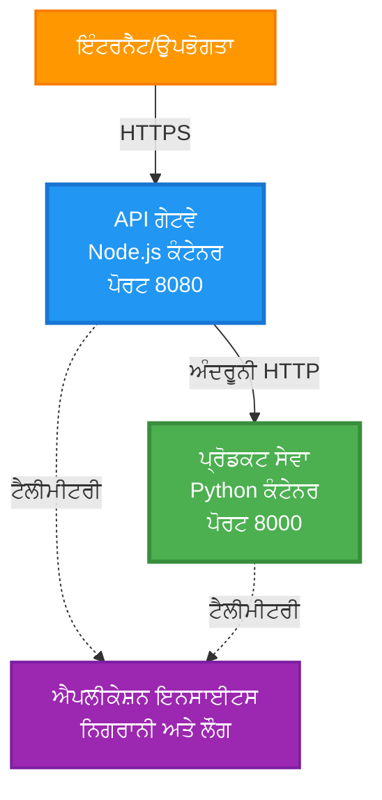
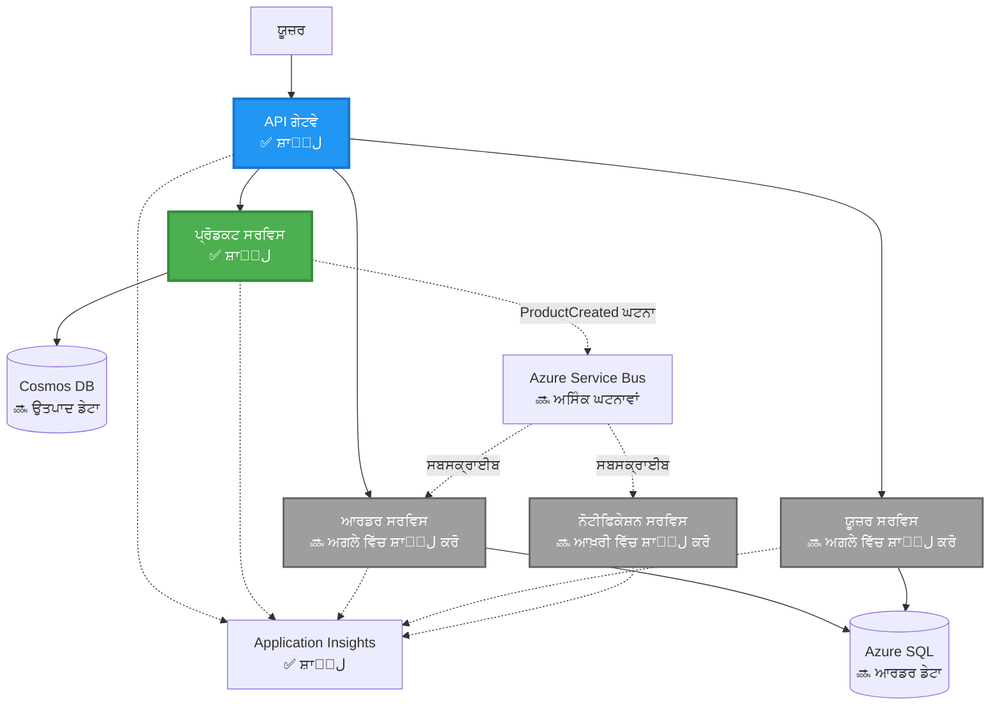
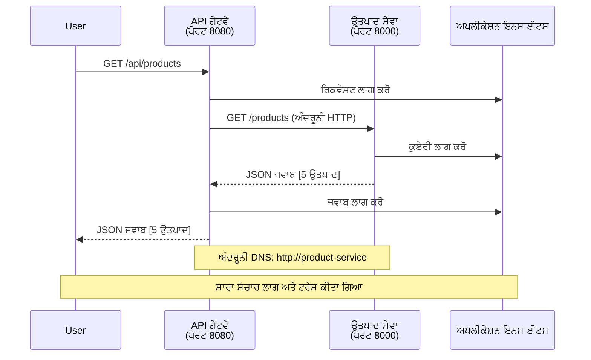

# Microservices Architecture - Container App Example

⏱️ **ਅੰਦਾਜ਼ੀ ਸਮਾਂ**: 25-35 minutes | 💰 **ਅੰਦਾਜ਼ੀ ਲਾਗਤ**: ~$50-100/month | ⭐ **ਜਟਿਲਤਾ**: ਉੱਨਤ

**📚 ਲਰਨਿੰਗ ਪਾਥ:**
- ← ਪਿਛਲਾ: [Simple Flask API](../../../../examples/container-app/simple-flask-api) - ਸਿੰਗਲ ਕਨਟੇਨਰ ਬੁਨਿਆਦੀ ਗੱਲਾਂ
- 🎯 **ਤੁਸੀਂ ਇੱਥੇ ਹੋ**: ਮਾਈਕ੍ਰੋਸਰਵਿਸ ਆਰਕੀਟੈਕਚਰ (2-ਸੇਵਾ ਬੇਸ)
- → ਅਗਲਾ: [AI Integration](../../../../docs/ai-foundry) - ਆਪਣੀਆਂ ਸੇਵਾਵਾਂ ਵਿੱਚ ਬੁੱਧੀਮੱਤਾ ਸ਼ਾਮਲ ਕਰੋ
- 🏠 [Course Home](../../README.md)

---

A **ਸਰਲ ਪਰ ਕਾਰਗਰ** ਮਾਈਕ੍ਰੋਸਰਵਿਸ ਆਰਕੀਟੈਕਚਰ ਜੋ AZD CLI ਦੀ ਵਰਤੋਂ ਕਰਕੇ Azure Container Apps 'ਤੇ ਡਿਪਲੋਏ ਕੀਤਾ ਗਿਆ ਹੈ। ਇਹ ਉਦਾਹਰਣ ਸੇਵਾ-ਤੋਂ-ਸੇਵਾ ਸੰਚਾਰ, ਕਨਟੇਨਰ ਓਰਕੇਸਟ੍ਰੇਸ਼ਨ, ਅਤੇ ਨਿਰੀਖਣ ਨੂੰ ਇੱਕ ਪ੍ਰਯੋਗਕ 2-ਸੇਵਾ ਸੈਟਅਪ ਨਾਲ ਦਰਸਾਉਂਦੀ ਹੈ।

> **📚 ਲਰਨਿੰਗ ਅੰਦਾਜ਼ਾ**: ਇਹ ਉਦਾਹਰਣ ਇੱਕ ਘੱਟੋ ਘੱਟ 2-ਸੇਵਾ ਆਰਕੀਟੈਕਚਰ (API Gateway + Backend Service) ਨਾਲ ਸ਼ੁਰੂ ਹੁੰਦੀ ਹੈ ਜਿਸਨੂੰ ਤੁਸੀਂ ਆਸਲ ਵਿੱਚ ਡਿਪਲੋਏ ਕਰ ਸਕਦੇ ਹੋ ਅਤੇ ਇਸ ਤੋਂ ਸਿੱਖ ਸਕਦੇ ਹੋ। ਇਸ ਬੁਨਿਆਦ ਨੂੰ ਮਾਹਿਰ ਬਣਾਉਣ ਤੋਂ ਬਾਅਦ, ਅਸੀਂ ਪੂਰੇ ਮਾਈਕ੍ਰੋਸਰਵਿਸ ਇਕੋਸਿਸਟਮ ਵੱਲ ਵਿਕਾਸ ਲਈ ਮਾਰਗਦਰਸ਼ਨ ਦਿੰਦੇ ਹਾਂ।

## ਤੁਸੀਂ ਕੀ ਸਿੱਖੋਗੇ

ਇਸ ਉਦਾਹਰਣ ਨੂੰ ਪੂਰਾ ਕਰਕੇ, ਤੁਸੀਂ:
- ਅਨੇਕ ਕਨਟੇਨਰ Azure Container Apps 'ਤੇ ਡਿਪਲੋਏ ਕਰਨਾ ਸਿੱਖੋਗੇ
- ਅੰਦਰੂਨੀ ਨੈਟਵਰਕਿੰਗ ਨਾਲ ਸੇਵਾ-ਤੋਂ-ਸੇਵਾ ਸੰਚਾਰ ਲਾਗੂ ਕਰਨਾ
- ਵਾਤਾਵਰਣ ਆਧਾਰਤ ਸਕੇਲਿੰਗ ਅਤੇ ਹੈਲਥ ਚੈੱਕ ਕੰਫਿਗਰ ਕਰਨਾ
- Application Insights ਨਾਲ ਵਿਤਰਿਤ ਐਪਲੀਕੇਸ਼ਨਾਂ ਦੀ ਨਿਗਰਾਨੀ ਕਰਨਾ
- ਮਾਈਕ੍ਰੋਸਰਵਿਸ ਡਿਪਲੋਏਮੈਂਟ ਪੈਟਰਨਾਂ ਅਤੇ بہترین ਅਭਿਆਸਾਂ ਨੂੰ ਸਮਝਣਾ
- ਸਧਾਰਨ ਤੋਂ ਜਟਿਲ ਆਰਕੀਟੈਕਚਰ ਵੱਲ ਪ੍ਰਗਟ ਤੌਰ 'ਤੇ ਵਿਸ਼ਤਾਰ ਕਰਨਾ ਸਿੱਖਣਾ

## ਆਰਕੀਟੈਕਚਰ

### ਦੌਰ 1: ਅਸੀਂ ਕੀ ਬਣਾ ਰਹੇ ਹਾਂ (ਇਸ ਉਦਾਹਰਣ ਵਿੱਚ ਸ਼ਾਮਲ)


```mermaid
graph TB
    Internet[ਇੰਟਰਨੈੱਟ/ਉਪਭੋਗਤਾ]
    Gateway[API ਗੇਟਵੇ<br/>Node.js ਕੰਟੇਨਰ<br/>ਪੋਰਟ 8080]
    Product[ਪ੍ਰੋਡਕਟ ਸੇਵਾ<br/>Python ਕੰਟੇਨਰ<br/>ਪੋਰਟ 8000]
    AppInsights[ਐਪਲੀਕੇਸ਼ਨ ਇਨਸਾਈਟਸ<br/>ਨਿਗਰਾਨੀ ਅਤੇ ਲੌਗ]
    
    Internet -->|HTTPS| Gateway
    Gateway -->|ਅੰਦਰੂਨੀ HTTP| Product
    Gateway -.->|ਟੈਲੀਮੀਟਰੀ| AppInsights
    Product -.->|ਟੈਲੀਮੀਟਰੀ| AppInsights
    
    style Gateway fill:#2196F3,stroke:#1976D2,stroke-width:3px,color:#fff
    style Product fill:#4CAF50,stroke:#388E3C,stroke-width:3px,color:#fff
    style Internet fill:#FF9800,stroke:#F57C00,stroke-width:2px,color:#fff
    style AppInsights fill:#9C27B0,stroke:#7B1FA2,stroke-width:2px,color:#fff
```
**Component Details:**

| Component | Purpose | Access | Resources |
|-----------|---------|--------|-----------|
| **API Gateway** | ਬੈਕਐਂਡ ਸੇਵਾਵਾਂ ਵੱਲ ਬਾਹਰੀ ਬੇਨਤੀਆਂ ਰੂਟ ਕਰਦਾ ਹੈ | Public (HTTPS) | 1 vCPU, 2GB RAM, 2-20 replicas |
| **Product Service** | ਇਨ-ਮੇਮੋਰੀ ਡੇਟਾ ਨਾਲ ਉਤਪਾਦ ਕੈਟਾਲੌਗ ਦਾ ਪ੍ਰਬੰਧਨ ਕਰਦਾ ਹੈ | Internal only | 0.5 vCPU, 1GB RAM, 1-10 replicas |
| **Application Insights** | ਕੇਂਦਰੀਕ੍ਰਿਤ ਲੌਗਿੰਗ ਅਤੇ ਵਿਤਰਿਤ ਟ੍ਰੇਸਿੰਗ | Azure Portal | 1-2 GB/month data ingestion |

**ਕਿਉਂ ਸਧਾਰਨ ਤੋਂ ਸ਼ੁਰੂ ਕਰੀਏ?**
- ✅ ਤੇਜ਼ੀ ਨਾਲ ਡਿਪਲੋਏ ਅਤੇ ਸਮਝੋ (25-35 ਮਿੰਟ)
- ✅ ਮੁੱਖ ਮਾਈਕ੍ਰੋਸਰਵਿਸ ਪੈਟਰਨ ਬਿਨਾਂ ਜਟਿਲਤਾ ਦੇ ਸਿੱਖੋ
- ✅ ਕੰਮ ਕਰਨ ਵਾਲਾ ਕੋਡ ਜਿਸਨੂੰ ਤੁਸੀਂ ਸੋਧ ਸਕਦੇ ਹੋ ਅਤੇ ਪ੍ਰਯੋਗ ਕਰ ਸਕਦੇ ਹੋ
- ✅ ਸਿੱਖਣ ਲਈ ਘੱਟ ਲਾਗਤ (~$50-100/month ਬਨਾਮ $300-1400/month)
- ✅ ਡੇਟਾਬੇਸ ਅਤੇ ਮੈਸੇਜ ਕਿਊਜ਼ ਸ਼ਾਮਲ ਕਰਨ ਤੋਂ ਪਹਿਲਾਂ ਵਿਸ਼ਵਾਸ ਬਣਾਓ

**ਉਪਮੈਾ**: ਇਸਨੂੰ ਗੱਡੀ ਚਲਾਉਣਾ ਸਿੱਖਣ ਵਰਗੋ ਸੋਚੋ। ਤੁਸੀਂ ਖਾਲੀ ਪਾਰਕਿੰਗ ਲੌਟ (2 ਸੇਵਾਵਾਂ) ਨਾਲ ਸ਼ੁਰੂ ਕਰਦੇ ਹੋ, ਬੁਨਿਆਦੀ ਗੱਲਾਂ ਮਾਸਟਰ ਕਰਦੇ ਹੋ, ਫਿਰ ਸ਼ਹਿਰੀ ਟ੍ਰੈਫਿਕ (5+ ਸੇਵਾਵਾਂ ਡੇਟਾਬੇਸਾਂ ਦੇ ਨਾਲ) ਵੱਲ ਵਧਦੇ ਹੋ।

### ਦੌਰ 2: ਭਵਿੱਖੀ ਵਿਸਥਾਰ (ਸੰਦਰਭ ਆਰਕੀਟੈਕਚਰ)

ਜਦੋਂ ਤੁਸੀਂ 2-ਸੇਵਾ ਆਰਕੀਟੈਕਚਰ 'ਤੇ ਮਾਹਿਰ ਹੋ ਜਾਵੋਗੇ, ਤਾਂ ਤੁਸੀਂ ਇਹ ਵਿਸਥਾਰ ਕਰ ਸਕਦੇ ਹੋ:


```mermaid
graph TB
    User[ਯੂਜ਼ਰ]
    Gateway[API ਗੇਟਵੇ<br/>✅ ਸ਼ਾਮِل]
    Product[ਪ੍ਰੋਡਕਟ ਸਰਵਿਸ<br/>✅ ਸ਼ਾਮِل]
    Order[ਆਰਡਰ ਸਰਵਿਸ<br/>🔜 ਅਗਲੇ ਵਿੱਚ ਸ਼ਾਮِل ਕਰੋ]
    UserSvc[ਯੂਜ਼ਰ ਸਰਵਿਸ<br/>🔜 ਅਗਲੇ ਵਿੱਚ ਸ਼ਾਮِل ਕਰੋ]
    Notify[ਨੋਟੀਫਿਕੇਸ਼ਨ ਸਰਵਿਸ<br/>🔜 ਆਖ਼ਰੀ ਵਿੱਚ ਸ਼ਾਮِل ਕਰੋ]
    
    CosmosDB[(Cosmos DB<br/>🔜 ਉਤਪਾਦ ਡੇਟਾ)]
    AzureSQL[(Azure SQL<br/>🔜 ਆਰਡਰ ਡੇਟਾ)]
    ServiceBus[Azure Service Bus<br/>🔜 ਅਸਿੰਕ ਘਟਨਾਵਾਂ]
    AppInsights[Application Insights<br/>✅ ਸ਼ਾਮِل]
    
    User --> Gateway
    Gateway --> Product
    Gateway --> Order
    Gateway --> UserSvc
    
    Product --> CosmosDB
    Order --> AzureSQL
    UserSvc --> AzureSQL
    
    Product -.->|ProductCreated ਘਟਨਾ| ServiceBus
    ServiceBus -.->|ਸਬਸਕ੍ਰਾਈਬ| Notify
    ServiceBus -.->|ਸਬਸਕ੍ਰਾਈਬ| Order
    
    Gateway -.-> AppInsights
    Product -.-> AppInsights
    Order -.-> AppInsights
    UserSvc -.-> AppInsights
    Notify -.-> AppInsights
    
    style Product fill:#4CAF50,stroke:#388E3C,stroke-width:3px,color:#fff
    style Gateway fill:#2196F3,stroke:#1976D2,stroke-width:3px,color:#fff
    style Order fill:#9E9E9E,stroke:#616161,stroke-width:2px,color:#fff
    style UserSvc fill:#9E9E9E,stroke:#616161,stroke-width:2px,color:#fff
    style Notify fill:#9E9E9E,stroke:#616161,stroke-width:2px,color:#fff
```
ਐਖ਼ੀ ਕਦਮ-ਦਰ-ਕਦਮ ਦਿਸ਼ਾ-ਨਿਰਦੇਸ਼ਾਂ ਲਈ ਅਖੀਰ ਵਿੱਚ "Expansion Guide" ਸੈਕਸ਼ਨ ਵੇਖੋ।

## ਸ਼ਾਮਲ ਵਿਸ਼ੇਸ਼ਤਾਵਾਂ

✅ **ਸੇਵਾ ਖੋਜ**: ਕੰਟੇਨਰਾਂ ਦਰਮਿਆਨ ਆਟੋਮੈਟਿਕ DNS-ਆਧਾਰਤ ਖੋਜ  
✅ **ਲੋਡ ਬੈਲੈਂਸਿੰਗ**: ਰੀਪਲਿਕਾਸ ਦੇ ਆਰੰਭ ਵਿੱਚ ਨਿਰਮਿਤ ਲੋਡ ਬੈਲੈਂਸਿੰਗ  
✅ **ਆਟੋ-ਸਕੇਲਿੰਗ**: HTTP ਬੇਨਤੀਆਂ ਅਧਾਰਤ ਪ੍ਰਤੀ ਸੇਵਾ ਸੁਤੰਤਰ ਸਕੇਲਿੰਗ  
✅ **ਹੈਲਥ ਮਾਨੀਟਰਿੰਗ**: ਦੋਹਾਂ ਸੇਵਾਵਾਂ ਲਈ ਲਾਇਵੇਨੈੱਸ ਅਤੇ ਰੀਡਿਨੈੱਸ ਪ੍ਰੋਬਸ  
✅ **ਵਿਤਰਿਤ ਲੌਗਿੰਗ**: Application Insights ਨਾਲ ਕੇਂਦਰੀ ਲੌਗਿੰਗ  
✅ **ਅੰਦਰੂਨੀ ਨੈਟਵਰਕਿੰਗ**: ਸੁਰੱਖਿਅਤ ਸੇਵਾ-ਤੋਂ-ਸੇਵਾ ਸੰਚਾਰ  
✅ **ਕਨਟੇਨਰ ਓਰਕੇਸਟ੍ਰੇਸ਼ਨ**: ਆਟੋਮੈਟਿਕ ਡਿਪਲੋਇਮੈਂਟ ਅਤੇ ਸਕੇਲਿੰਗ  
✅ **ਜ਼ੀਰੋ-ਡਾਊਨਟਾਈਮ ਅਪਡੇਟਸ**: ਰਿਵਿਜ਼ਨ ਪ੍ਰਬੰਧਨ ਨਾਲ ਰੋਲਿੰਗ ਅਪਡੇਟਸ  

## ਲੋੜੀਂਦੀਆਂ ਜ਼ਰੂਰਤਾਂ

### ਲੋੜੀਂਦੇ ਟੂਲ

ਸ਼ੁਰੂ ਕਰਨ ਤੋਂ ਪਹਿਲਾਂ, ਯਕੀਨੀ ਬਣਾਓ ਕਿ ਤੁਹਾਡੇ ਕੋਲ ਇਹ ਟੂਲ ਇੰਸਟਾਲ ਹਨ:

1. **[Azure Developer CLI (azd)](https://learn.microsoft.com/azure/developer/azure-developer-cli/install-azd)** (version 1.0.0 or higher)
   ```bash
   azd version
   # ਉਮੀਦ ਕੀਤੀ ਆਉਟਪੁਟ: azd ਸੰਸਕਰਣ 1.0.0 ਜਾਂ ਇਸ ਤੋਂ ਉੱਤੇ
   ```

2. **[Azure CLI](https://learn.microsoft.com/cli/azure/install-azure-cli)** (version 2.50.0 or higher)
   ```bash
   az --version
   # ਉਮੀਦ ਕੀਤੀ ਆਉਟਪੁੱਟ: azure-cli 2.50.0 ਜਾਂ ਉੱਪਰ
   ```

3. **[Docker](https://www.docker.com/get-started)** (ਲੋਕਲ ਡਿਵੈਲਪਮੈਂਟ/ਟੈਸਟਿੰਗ ਲਈ - ਵਿਕਲਪੀ)
   ```bash
   docker --version
   # ਉਮੀਦ ਕੀਤਾ ਨਤੀਜਾ: Docker ਵਰਜ਼ਨ 20.10 ਜਾਂ ਵੱਧ
   ```

### ਆਪਣੀ ਸੈਟਅਪ ਦੀ ਪੁਸ਼ਟੀ ਕਰੋ

ਇਨ੍ਹਾਂ ਕਮਾਂਡਾਂ ਨੂੰ ਚਲਾਕੇ ਯਕੀਨੀ ਬਣਾਓ ਕਿ ਤੁਸੀਂ ਤਿਆਰ ਹੋ:

```bash
# Azure Developer CLI ਦੀ ਜਾਂਚ ਕਰੋ
azd version
# ✅ ਉਮੀਦ: azd ਵਰਜਨ 1.0.0 ਜਾਂ ਉਸ ਤੋਂ ਉੱਪਰ

# Azure CLI ਦੀ ਜਾਂਚ ਕਰੋ
az --version
# ✅ ਉਮੀਦ: azure-cli 2.50.0 ਜਾਂ ਉਸ ਤੋਂ ਉੱਪਰ

# Docker (ਵਿਕਲਪਿਕ) ਦੀ ਜਾਂਚ ਕਰੋ
docker --version
# ✅ ਉਮੀਦ: Docker ਵਰਜਨ 20.10 ਜਾਂ ਉਸ ਤੋਂ ਉੱਪਰ
```

**ਸਫਲਤਾ ਮਾਪਦੰਡ**: ਸਾਰੀਆਂ ਕਮਾਂਡਾਂ ਉਹਨਾਂ ਸੰਸਕਰਣ ਨੰਬਰਾਂ ਨੂੰ ਵਾਪਸ ਕਰਦੀਆਂ ਹੋਣ ਜੋ ਘੱਟੋ-ਘੱਟਆਂ ਨਾਲ ਮਿਲਦੀਆਂ ਜਾਂ ਵੱਧ ਹੁੰਦੀਆਂ ਹਨ।

### Azure ਦੀਆਂ ਲੋੜਾਂ

- ਇੱਕ ਸਰਗਰਮ **Azure subscription** ([create a free account](https://azure.microsoft.com/free/))
- ਆਪਣੀ subscription ਵਿੱਚ ਸਰੋਤ ਬਣਾਉਣ ਦੀਆਂ ਅਨੁਮਤੀਆਂ
- subscription ਜਾਂ resource group 'ਤੇ **Contributor** ਭੂਮਿਕਾ

### ਜਾਣਕਾਰੀਕ ਲੋੜੀਂਦੀਆਂ

ਇਹ ਇੱਕ **ਉੱਚ ਪੱਧਰੀ** ਉਦਾਹਰਣ ਹੈ। ਤੁਹਾਨੂੰ ਇਹ ਜਾਣਕਾਰੀ ਹੋਣੀ ਚਾਹੀਦੀ ਹੈ:
- [Simple Flask API example](../../../../examples/container-app/simple-flask-api) ਮੁਕੰਮਲ ਕੀਤਾ ਹੋਇਆ ਹੋਏ
- ਮਾਈਕ੍ਰੋਸਰਵਿਸ ਆਰਕੀਟੈਕਚਰ ਦੀ ਬੁਨਿਆਦੀ ਸਮਝ
- REST APIs ਅਤੇ HTTP ਨਾਲ ਜਾਣੂ
- ਕਨਟੇਨਰ ਸੰਕਲਪਾਂ ਦੀ ਸਮਝ

**Container Apps ਲਈ ਨਵੇਂ ਹੋ?** ਪਹਿਲਾਂ ਮੂਲ ਸਿੱਖਣ ਲਈ [Simple Flask API example](../../../../examples/container-app/simple-flask-api) ਨਾਲ ਸ਼ੁਰੂ ਕਰੋ।

## ਤੁਰੰਤ ਸ਼ੁਰੂਆਤ (ਕਦਮ-ਦਰ-ਕਦਮ)

### ਕਦਮ 1: ਕਲੋਨ ਅਤੇ नौੈਵੀਗੇਟ

```bash
git clone https://github.com/microsoft/AZD-for-beginners.git
cd AZD-for-beginners/examples/microservices
```

**✓ ਸਫਲਤਾ ਚੈੱਕ**: ਜਾਂਚੋ ਕਿ ਤੁਸੀਂ `azure.yaml` ਵੇਖ ਰਹੇ ਹੋ:
```bash
ls
# ਉਮੀਦ: README.md, azure.yaml, infra/, src/
```

### ਕਦਮ 2: Azure ਨਾਲ ਪ੍ਰਮਾਣਿਕਤਾ

```bash
azd auth login
```

ਇਹ ਤੁਹਾਡਾ ਬ੍ਰਾਊਜ਼ਰ Azure ਪ੍ਰਮਾਣਿਕਤਾ ਲਈ ਖੋਲ੍ਹੇਗਾ। ਆਪਣੇ Azure ਪ੍ਰਮਾਣ ਪੱਤਰਾਂ ਨਾਲ ਸਾਈਨ-ਇਨ ਕਰੋ।

**✓ ਸਫਲਤਾ ਚੈੱਕ**: ਤੁਹਾਨੂੰ ਇਹ ਸਮਝ ਆਣਾ ਚਾਹੀਦਾ ਹੈ:
```
Logged in to Azure.
```

### ਕਦਮ 3: ਵਾਤਾਵਰਣ ਐਨੀਸ਼ੀਅਲਾਈਜ਼ ਕਰੋ

```bash
azd init
```

**ਪ੍ਰਾਂਪਟਸ ਜੋ ਤੁਹਾਨੂੰ ਦਿਖਾਈ ਦੇਣਗੇ**:
- **Environment name**: ਇੱਕ ਛੋਟਾ ਨਾਮ ਦਿਓ (ਉਦਾਹਰਣ ਲਈ, `microservices-dev`)
- **Azure subscription**: ਆਪਣੀ subscription ਚੁਣੋ
- **Azure location**: ਇੱਕ ਖੇਤਰ ਚੁਣੋ (ਉਦਾਹਰਣ ਲਈ, `eastus`, `westeurope`)

**✓ ਸਫਲਤਾ ਚੈੱਕ**: ਤੁਹਾਨੂੰ ਇਹ ਦਿਖਾਈ ਦੇਣਾ ਚਾਹੀਦਾ ਹੈ:
```
SUCCESS: New project initialized!
```

### ਕਦਮ 4: ਇੰਫ਼ਾਸਟਰਕਚਰ ਅਤੇ ਸੇਵਾਵਾਂ ਡਿਪਲੋਏ ਕਰੋ

```bash
azd up
```

**ਕੀ ਹੁੰਦਾ ਹੈ** (ਲਗਭਗ 8-12 ਮਿੰਟ ਲੱਗਦੇ ਹਨ):


```mermaid
graph LR
    A[azd ਅੱਪ] --> B[ਰਿਸੋਰਸ ਗਰੁੱਪ ਬਣਾਓ]
    B --> C[ਕੰਟੇਨਰ ਰਜਿਸਟਰੀ ਤੈਨਾਤ ਕਰੋ]
    C --> D[ਲੌਗ ਐਨਾਲਿਟਿਕਸ ਤੈਨਾਤ ਕਰੋ]
    D --> E[ਐਪ ਇਨਸਾਈਟਸ тੈਨਾਤ ਕਰੋ]
    E --> F[ਕੰਟੇਨਰ ਵਾਤਾਵਰਣ ਬਣਾਓ]
    F --> G[API ਗੇਟਵੇ ਇਮੇਜ ਬਣਾਓ]
    F --> H[ਪ੍ਰੋਡਕਟ ਸਰਵਿਸ ਇਮੇਜ ਬਣਾਓ]
    G --> I[ਰਜਿਸਟਰੀ ਵਿੱਚ ਪੁਸ਼ ਕਰੋ]
    H --> I
    I --> J[API ਗੇਟਵੇ ਤੈਨਾਤ ਕਰੋ]
    I --> K[ਪ੍ਰੋਡਕਟ ਸਰਵਿਸ ਤੈਨਾਤ ਕਰੋ]
    J --> L[Ingress ਅਤੇ Health Checks ਕਨਫਿਗਰ ਕਰੋ]
    K --> L
    L --> M[ਡਿਪਲੋਇਮੈਂਟ ਮੁਕੰਮਲ ✓]
    
    style A fill:#2196F3,stroke:#1976D2,stroke-width:3px,color:#fff
    style M fill:#4CAF50,stroke:#388E3C,stroke-width:3px,color:#fff
```
**✓ ਸਫਲਤਾ ਚੈੱਕ**: ਤੁਹਾਨੂੰ ਇਹ ਦਿਖਾਈ ਦੇਣਾ ਚਾਹੀਦਾ ਹੈ:
```
SUCCESS: Your application was deployed to Azure in X minutes Y seconds.
Endpoint: https://api-gateway-<unique-id>.azurecontainerapps.io
```

**⏱️ ਸਮਾਂ**: 8-12 ਮਿੰਟ

### ਕਦਮ 5: ਡਿਪਲੋਇਮੈਂਟ ਦੀ ਜਾਂਚ

```bash
# ਗੇਟਵੇ ਐਂਡਪੌਇੰਟ ਪ੍ਰਾਪਤ ਕਰੋ
GATEWAY_URL=$(azd env get-values | grep API_GATEWAY_URL | cut -d '=' -f2 | tr -d '"')

# ਏਪੀਆਈ ਗੇਟਵੇ ਦੀ ਸਿਹਤ ਦੀ ਜਾਂਚ ਕਰੋ
curl $GATEWAY_URL/health
```

**✅ ਉਮੀਦ ਕੀਤੀ ਆਉਟਪੁੱਟ:**
```json
{
  "status": "healthy",
  "service": "api-gateway",
  "timestamp": "2025-11-19T10:30:00Z"
}
```

**ਗੇਟਵੇ ਰਾਹੀਂ ਪ੍ਰੋਡਕਟ ਸਰਵਿਸ ਦੀ ਜਾਂਚ**:
```bash
# ਉਤਪਾਦਾਂ ਦੀ ਸੂਚੀ
curl $GATEWAY_URL/api/products
```

**✅ ਉਮੀਦ ਕੀਤੀ ਆਉਟਪੁੱਟ:**
```json
[
  {"id":1,"name":"Laptop","price":999.99,"stock":50},
  {"id":2,"name":"Mouse","price":29.99,"stock":200},
  {"id":3,"name":"Keyboard","price":79.99,"stock":150}
]
```

**✓ ਸਫਲਤਾ ਚੈੱਕ**: ਦੋਹਾਂ ਐਂਡਪੋਇੰਟ JSON ਡਾਟਾ ਬਿਨਾਂ ਤਰੁਟੀਆਂ ਦੇ ਵਾਪਸ ਕਰਨ।

---

**🎉 ਵਧਾਈਆਂ!** ਤੁਸੀਂ Azure 'ਤੇ ਇੱਕ ਮਾਈਕ੍ਰੋਸਰਵਿਸ ਆਰਕੀਟੈਕਚਰ ਡਿਪਲੋਏ ਕੀਤਾ ਹੈ!

## ਪ੍ਰੋਜੈਕਟ ਦਾ ਢਾਂਚਾ

ਸਾਰੀਆਂ ਕਰਮਾਂਕਾਰੀ ਫਾਈਲਾਂ ਸ਼ਾਮਲ ਹਨ—ਇਹ ਇਕ ਪੂਰਾ, ਕਾਰਜਕ ਅਦਾਹਰਣ ਹੈ:

```
microservices/
│
├── README.md                         # This file
├── azure.yaml                        # AZD configuration
├── .gitignore                        # Git ignore patterns
│
├── infra/                           # Infrastructure as Code (Bicep)
│   ├── main.bicep                   # Main orchestration
│   ├── abbreviations.json           # Naming conventions
│   ├── core/                        # Shared infrastructure
│   │   ├── container-apps-environment.bicep  # Container environment + registry
│   │   └── monitor.bicep            # Application Insights + Log Analytics
│   └── app/                         # Service definitions
│       ├── api-gateway.bicep        # API Gateway container app
│       └── product-service.bicep    # Product Service container app
│
└── src/                             # Application source code
    ├── api-gateway/                 # Node.js API Gateway
    │   ├── app.js                   # Express server with routing
    │   ├── package.json             # Node dependencies
    │   └── Dockerfile               # Container definition
    └── product-service/             # Python Product Service
        ├── main.py                  # Flask API with product data
        ├── requirements.txt         # Python dependencies
        └── Dockerfile               # Container definition
```

**ਹਰ ਘਟਕਾ ਕੀ ਕਰਦਾ ਹੈ:**

**Infrastructure (infra/)**:
- `main.bicep`: ਸਾਰੇ Azure ਸਰੋਤ ਅਤੇ ਉਨ੍ਹਾਂ ਦੀਆਂ ਨਿਰਭਰਤਾਵਾਂ ਦਾ ਓਰਕੇਸਟ੍ਰੇਸ਼ਨ
- `core/container-apps-environment.bicep`: Container Apps ਵਾਤਾਵਰਣ ਅਤੇ Azure Container Registry ਬਣਾਉਂਦਾ ਹੈ
- `core/monitor.bicep`: ਵਿਤਰਿਤ ਲੌਗਿੰਗ ਲਈ Application Insights ਸੈਟਅਪ ਕਰਦਾ ਹੈ
- `app/*.bicep`: ਵਿਅਕਤੀਗਤ ਕੰਟੇਨਰ ਐਪ ਪਰਿਭਾਸ਼ਾਵਾਂ ਸਕੇਲਿੰਗ ਅਤੇ ਹੈਲਥ ਚੈੱਕਸ ਦੇ ਨਾਲ

**API Gateway (src/api-gateway/)**:
- ਬਾਹਰੀ-ਮੁਖੀ ਸੇਵਾ ਜੋ ਬੈਕਐਂਡ ਸੇਵਾਵਾਂ ਵੱਲ ਰਿਕਵੈਸਟ ਰੂਟ ਕਰਦੀ ਹੈ
- ਲੌਗਿੰਗ, ਐਰਰ ਹੈਂਡਲਿੰਗ, ਅਤੇ ਬੇਨਤੀ ਅੱਗੇ ਭੇਜਣ ਲਾਗੂ ਕਰਦੀ ਹੈ
- ਸੇਵਾ-ਤੋਂ-ਸੇਵਾ HTTP ਸੰਚਾਰ ਨੂੰ ਦਰਸਾਉਂਦੀ ਹੈ

**Product Service (src/product-service/)**:
- ਇਨ-ਮੇਮੋਰੀ ਲਈ ਉਤਪਾਦ ਕੈਟਾਲੌਗ ਵਾਲੀ ਅੰਦਰੂਨੀ ਸੇਵਾ
- REST API ਲੈ ਕੇ ਹੈਲਥ ਚੈੱਕਸ
- ਬੈਕਐਂਡ ਮਾਈਕ੍ਰੋਸਰਵਿਸ ਪੈਟਰਨ ਦੀ ਉਦਾਹਰਣ

## ਸੇਵਾਵਾਂ ਦਾ ਜਾਇਜ਼ਾ

### API Gateway (Node.js/Express)

**Port**: 8080  
**ਐਕਸੈੱਸ**: Public (external ingress)  
**ਉਦੇਸ਼**: ਆਉਣ ਵਾਲੀਆਂ ਬੇਨਤੀਆਂ ਨੂੰ ਢੰਗ-ਮੁਤਾਬਕ ਬੈਕਐਂਡ ਸੇਵਾਵਾਂ ਵੱਲ ਰੂਟ ਕਰਨਾ  

**ਐਂਡਪੋਇੰਟਸ**:
- `GET /` - ਸੇਵਾ ਜਾਣਕਾਰੀ
- `GET /health` - ਹੈਲਥ ਚੈੱਕ ਐਂਡਪੋਇੰਟ
- `GET /api/products` - ਉਤਪਾਦ ਸੇਵਾ ਵੱਲ ਅੱਗੇ ਭੇਜੋ (ਸਭ ਦੀ ਸੂਚੀ)
- `GET /api/products/:id` - ਉਤਪਾਦ ਸੇਵਾ ਵੱਲ ਅੱਗੇ ਭੇਜੋ (ID ਦੁਆਰਾ ਪ੍ਰਾਪਤ)

**ਮੁੱਖ ਵਿਸ਼ੇਸ਼ਤਾਵਾਂ**:
- axios ਨਾਲ ਬੇਨਤੀ ਰੂਟਿੰਗ
- ਕੇਂਦਰੀ ਲੌਗਿੰਗ
- ਐਰਰ ਹੈਂਡਲਿੰਗ ਅਤੇ ਟਾਈਮਆਊਟ ਮੈਨੇਜਮੈਂਟ
- ਵਾਤਾਵਰਣ ਚਲਣਾਂ ਦੁਆਰਾ ਸੇਵਾ ਖੋਜ
- Application Insights ਇੰਟੀਗ੍ਰੇਸ਼ਨ

**ਕੋਡ ਹਾਈਲਾਈਟ** (`src/api-gateway/app.js`):
```javascript
// ਅੰਦਰੂਨੀ ਸੇਵਾ ਸੰਚਾਰ
app.get('/api/products', async (req, res) => {
  const response = await axios.get(`${PRODUCT_SERVICE_URL}/products`, {
    timeout: 5000
  });
  res.json(response.data);
});
```

### Product Service (Python/Flask)

**Port**: 8000  
**ਐਕਸੈੱਸ**: ਸਿਰਫ਼ ਅੰਦਰੂਨੀ (ਕੋਈ ਬਾਹਰੀ ਇੰਗ੍ਰੈੱਸ ਨਹੀਂ)  
**ਉਦੇਸ਼**: ਇਨ-ਮੇਮੋਰੀ ਡਾਟਾ ਨਾਲ ਉਤਪਾਦ ਕੈਟਾਲੌਗ ਦਾ ਪ੍ਰਬੰਧਨ  

**ਐਂਡਪੋਇੰਟਸ**:
- `GET /` - ਸੇਵਾ ਜਾਣਕਾਰੀ
- `GET /health` - ਹੈਲਥ ਚੈੱਕ ਐਂਡਪੋਇੰਟ
- `GET /products` - ਸਾਰੇ ਉਤਪਾਦ ਦੀ ਸੂਚੀ
- `GET /products/<id>` - ID ਦੁਆਰਾ ਉਤਪਾਦ ਪ੍ਰਾਪਤ ਕਰੋ

**ਮੁੱਖ ਵਿਸ਼ੇਸ਼ਤਾਵਾਂ**:
- Flask ਨਾਲ RESTful API
- ਇਨ-ਮੇਮੋਰੀ ਉਤਪਾਦ ਸਟੋਰ (ਸਰਲ, ਕਿਸੇ ਡੇਟਾਬੇਸ ਦੀ ਲੋੜ ਨਹੀਂ)
- ਪ੍ਰੋਬਸ ਨਾਲ ਹੈਲਥ ਮਾਨੀਟਰਿੰਗ
- ਸੰਰਚਿਤ ਲੌਗਿੰਗ
- Application Insights ਇੰਟੀਗ੍ਰੇਸ਼ਨ

**ਡਾਟਾ ਮਾਡਲ**:
```python
{
  "id": 1,
  "name": "Laptop",
  "description": "High-performance laptop",
  "price": 999.99,
  "stock": 50
}
```

**ਕਿਉਂ ਸਿਰਫ਼ ਅੰਦਰੂਨੀ?**
Product Service ਨੂੰ ਜਨਤਕ ਤੌਰ 'ਤੇ ਪ੍ਰਦਰਸ਼ਿਤ ਨਹੀਂ ਕੀਤਾ ਗਿਆ ਹੈ। ਸਾਰੀਆਂ ਬੇਨਤੀਆਂ API Gateway ਰਾਹੀਂ ਜਾਣੀਆਂ ਚਾਹੀਦੀਆਂ ਹਨ, ਜੋ ਇਹ ਮੁਹੱਈਆ ਕਰਦਾ ਹੈ:
- ਸੁਰੱਖਿਆ: ਨਿਯੰਤਰਿਤ ਐਕਸੈੱਸ ਪੁਆਇੰਟ
- ਲਚਕੀਲਾਪਨ: ਬੈਕਏਂਡ ਬਦਲ ਸਕਦਾ ਹੈ ਬਿਨਾਂ ਕਲਾਇੰਟਾਂ ਨੂੰ ਪ੍ਰਭਾਵਿਤ ਕੀਤੇ
- ਨਿਗਰਾਨੀ: ਕੇਂਦਰੀ ਬੇਨਤੀ ਲੌਗਿੰਗ

## ਸੇਵਾ ਸੰਚਾਰ ਨੂੰ ਸਮਝਣਾ

### ਸੇਵਾਵਾਂ ਇਕ ਦੂਜੇ ਨਾਲ ਕਿਵੇਂ ਗੱਲ ਕਰਦੀਆਂ ਹਨ


```mermaid
sequenceDiagram
    participant User
    participant Gateway as API ਗੇਟਵੇ<br/>(ਪੋਰਟ 8080)
    participant Product as ਉਤਪਾਦ ਸੇਵਾ<br/>(ਪੋਰਟ 8000)
    participant AI as ਅਪਲੀਕੇਸ਼ਨ ਇਨਸਾਈਟਸ
    
    User->>Gateway: GET /api/products
    Gateway->>AI: ਰਿਕਵੇਸਟ ਲਾਗ ਕਰੋ
    Gateway->>Product: GET /products (ਅੰਦਰੂਨੀ HTTP)
    Product->>AI: ਕੁਏਰੀ ਲਾਗ ਕਰੋ
    Product-->>Gateway: JSON ਜਵਾਬ [5 ਉਤਪਾਦ]
    Gateway->>AI: ਜਵਾਬ ਲਾਗ ਕਰੋ
    Gateway-->>User: JSON ਜਵਾਬ [5 ਉਤਪਾਦ]
    
    Note over Gateway,Product: ਅੰਦਰੂਨੀ DNS: http://product-service
    Note over User,AI: ਸਾਰਾ ਸੰਚਾਰ ਲਾਗ ਅਤੇ ਟਰੇਸ ਕੀਤਾ ਗਿਆ
```
ਇਸ ਉਦਾਹਰਣ ਵਿੱਚ, API Gateway Product Service ਨਾਲ **ਅੰਦਰੂਨੀ HTTP ਕਾਲਾਂ** ਰਾਹੀਂ ਸੰਚਾਰ ਕਰਦੀ ਹੈ:

```javascript
// API ਗੇਟਵੇ (src/api-gateway/app.js)
const PRODUCT_SERVICE_URL = process.env.PRODUCT_SERVICE_URL;

// ਅੰਦਰੂਨੀ HTTP ਬੇਨਤੀ ਕਰੋ
const response = await axios.get(`${PRODUCT_SERVICE_URL}/products`);
```

**ਮੁੱਖ ਬਿੰਦੂ**:

1. **DNS-ਆਧਾਰਤ ਖੋਜ**: Container Apps ਆਟੋਮੈਟਿਕ ਤੌਰ 'ਤੇ ਅੰਦਰੂਨੀ ਸੇਵਾਵਾਂ ਲਈ DNS ਪ੍ਰਦਾਨ ਕਰਦਾ ਹੈ
   - Product Service FQDN: product-service.internal.<environment>.azurecontainerapps.io
   - ਸਧਾਰਨ ਕੀਤਾ ਗਿਆ: `http://product-service` (Container Apps ਇਹ ਸਾਲੱਬ ਕਰਦਾ ਹੈ)

2. **ਕੋਈ ਜਨਤਕ ਪਰਦਰਸ਼ਨ ਨਹੀਂ**: Bicep ਵਿੱਚ Product Service ਲਈ `external: false` ਹੈ
   - ਸਿਰਫ਼ Container Apps ਵਾਤਾਵਰਣ ਦੇ ਅੰਦਰ ਪਹੁੰਚਯੋਗ
   - ਇੰਟਰਨੈੱਟ ਤੋਂ ਪਹੁੰਚ ਨਹੀਂ ਕੀਤੀ ਜਾ ਸਕਦੀ

3. **ਵਾਤਾਵਰਣ ਵੇਰੀਏਬਲ**: ਸੇਵਾ URLs ਡਿਪਲੋਇਮੈਂਟ ਸਮੇਂ ਇੰਜੇਕਟ ਕੀਤੀਆਂ ਜਾਂਦੀਆਂ ਹਨ
   - Bicep ਗੇਟਵੇ ਨੂੰ ਅੰਦਰੂਨੀ FQDN ਪਾਸ ਕਰਦਾ ਹੈ
   - ਐਪਲੀਕੇਸ਼ਨ ਕੋਡ ਵਿੱਚ ਕੋਈ ਹਾਰਡਕੋਡ ਕੀਤੇ URLs ਨਹੀਂ

**ਉਪਮੈਾ**: ਇਸਨੂੰ ਦਫਤਰ ਦੇ ਕਮਰਿਆਂ ਵਾਂਗ ਸੋਚੋ। API Gateway ਰਿਸੈਪਸ਼ਨ ਡੈਸਕ (ਪਬਲਿਕ-ਮੁਖੀ) ਹੈ, ਅਤੇ Product Service ਇੱਕ ਦਫਤਰ ਕਮਰਾ (ਅੰਦਰੂਨੀ) ਹੈ। ਦੌਰੇ ਕਰਨ ਵਾਲੇ ਰਿਸੈਪਸ਼ਨ ਰਾਹੀਂ ਹੀ ਕਿਸੇ ਵੀ ਦਫਤਰ ਤੱਕ ਜਾ ਸਕਦੇ ਹਨ।

## ਡਿਪਲੋਇਮੈਂਟ ਵਿਕਲਪ

### ਪੂਰਾ ਡਿਪਲੋਇਮੈਂਟ (ਸਿਫ਼ਾਰਸ਼ੀ)

```bash
# ਇੰਫ੍ਰਾਸਟਰਕਚਰ ਅਤੇ ਦੋਹਾਂ ਸੇਵਾਵਾਂ ਨੂੰ ਤੈਨਾਤ ਕਰੋ
azd up
```

ਇਹ ਡਿਪਲੋਇਮੈਂਟ ਕਰਦਾ ਹੈ:
1. Container Apps ਵਾਤਾਵਰਣ
2. Application Insights
3. Container Registry
4. API Gateway ਕੰਟੇਨਰ
5. Product Service ਕੰਟੇਨਰ

**ਸਮਾਂ**: 8-12 ਮਿੰਟ

### ਵਿਅਕਤੀਗਤ ਸੇਵਾ ਡਿਪਲੋਏ ਕਰੋ

```bash
# ਕੇਵਲ ਇੱਕ ਸੇਵਾ ਡਿਪਲੋਇ ਕਰੋ (ਪ੍ਰਾਰੰਭਿਕ azd up ਤੋਂ ਬਾਅਦ)
azd deploy api-gateway

# ਜਾਂ ਉਤਪਾਦ ਸੇਵਾ ਡਿਪਲੋਇ ਕਰੋ
azd deploy product-service
```

**ਉਪਯੋਗ ਮਾਮਲਾ**: ਜਦੋਂ ਤੁਸੀਂ ਇੱਕ ਸੇਵਾ ਵਿੱਚ ਕੋਡ ਅੱਪਡੇਟ ਕੀਤਾ ਹੈ ਅਤੇ ਸਿਰਫ਼ ਉਸ ਸੇਵਾ ਨੂੰ ਹੀ ਦੁਬਾਰਾ ਡਿਪਲੋਏ ਕਰਨਾ ਚਾਹੁੰਦੇ ਹੋ।

### ਸੰਰਚਨਾ ਅੱਪਡੇਟ ਕਰੋ

```bash
# ਸਕੇਲਿੰਗ ਪੈਰਾਮੀਟਰ ਬਦਲੋ
azd env set GATEWAY_MAX_REPLICAS 30

# ਨਵੀਂ ਸੰਰਚਨਾ ਨਾਲ ਮੁੜ ਤੈਨਾਤ ਕਰੋ
azd up
```

## ਕੰਫਿਗਰੇਸ਼ਨ

### ਸਕੇਲਿੰਗ ਸੰਰਚਨਾ

ਦੋਹਾਂ ਸੇਵਾਵਾਂ ਨੂੰ ਉਨ੍ਹਾਂ ਦੀਆਂ Bicep ਫਾਈਲਾਂ ਵਿੱਚ HTTP-ਅਧਾਰਤ ਆਟੋ-ਸਕੇਲਿੰਗ ਨਾਲ ਕੰਫਿਗਰ ਕੀਤਾ ਗਿਆ ਹੈ:

**API Gateway**:
- ਨਿਥੈਨ ਰੀਪਲਿਕਾ(ਜ਼): 2 (ਉਪਲਬਧਤਾ ਲਈ ਹਮੇਸ਼ਾਂ ਘੱਟੋ-ਘੱਟ 2)
- ਵੱਧੋ-ਤੱਕ ਰੀਪਲਿਕਾ(ਜ਼): 20
- ਸਕੇਲ ਟ੍ਰਿਗਰ: ਪ੍ਰਤੀ ਰੀਪਲਿਕਾ 50 ਸਮਕਾਲੀ ਬੇਨਤੀਆਂ

**Product Service**:
- ਨਿਥੈਨ ਰੀਪਲਿਕਾ(ਜ਼): 1 (ਜ਼ਰੂਰਤ ਹੋਣ 'ਤੇ ਜ਼ੀਰੋ ਤੱਕ ਸਕੇਲ ਹੋ ਸਕਦਾ ਹੈ)
- ਵੱਧੋ-ਤੱਕ ਰੀਪਲਿਕਾ(ਜ਼): 10
- ਸਕੇਲ ਟ੍ਰਿਗਰ: ਪ੍ਰਤੀ ਰੀਪਲਿਕਾ 100 ਸਮਕਾਲੀ ਬੇਨਤੀਆਂ

**ਸਕੇਲਿੰਗ ਕਸਟਮਾਈਜ਼ ਕਰੋ** (in `infra/app/*.bicep`):
```bicep
scale: {
  minReplicas: 1
  maxReplicas: 10
  rules: [
    {
      name: 'http-scale-rule'
      http: {
        metadata: {
          concurrentRequests: '100'  // Adjust this
        }
      }
    }
  ]
}
```

### ਸਰੋਤ ਆਲੋਕੇਸ਼ਨ

**API Gateway**:
- CPU: 1.0 vCPU
- ਮੈਮੋਰੀ: 2 GiB
- ਕਾਰਨ: ਸਾਰੇ ਬਾਹਰੀ ਟ੍ਰੈਫਿਕ ਨੂੰ ਸਹਿਣਾ

**Product Service**:
- CPU: 0.5 vCPU
- ਮੈਮੋਰੀ: 1 GiB
- ਕਾਰਨ: ਹਲਕੇ-ਭਾਰੇ ਇਨ-ਮੇਮੋਰੀ ਆਪਰੇਸ਼ਨ

### ਹੈਲਥ ਚੈੱਕਸ

ਦੋਹਾਂ ਸੇਵਾਵਾਂ ਵਿੱਚ ਲਾਇਵੇਨੈੱਸ ਅਤੇ ਰੀਡਿਨੈੱਸ ਪ੍ਰੋਬਸ ਸ਼ਾਮਲ ਹਨ:

```bicep
probes: [
  {
    type: 'Liveness'
    httpGet: {
      path: '/health'
      port: 8080
    }
    initialDelaySeconds: 10
    periodSeconds: 30
  }
  {
    type: 'Readiness'
    httpGet: {
      path: '/health'
      port: 8080
    }
    initialDelaySeconds: 5
    periodSeconds: 10
  }
]
```

**ਇਸਦਾ ਕੀ ਮਤਲਬ ਹੈ**:
- **ਲਾਇਵੇਨੈੱਸ**: ਜੇ ਹੈਲਥ ਚੈੱਕ ਫੇਲ ਹੁੰਦਾ ਹੈ, Container Apps ਕੰਟੇਨਰ ਨੂੰ ਰੀਸਟਾਰਟ ਕਰਦਾ ਹੈ
- **ਰੀਡਿਨੈੱਸ**: ਜੇ ਤਿਆਰ ਨਹੀਂ, Container Apps ਉਸ ਰੀਪਲਿਕਾ ਨੂੰ ਟਰੇਫਿਕ ਰੂਟ ਕਰਨ ਤੋਂ ਰੋਕਦਾ ਹੈ

## ਨਿਗਰਾਨੀ ਅਤੇ ਦ੍ਰਿਸ਼ਯਤਾ

### ਸੇਵਾ ਲੌਗਸ ਵੇਖੋ

```bash
# azd monitor ਦੀ ਵਰਤੋਂ ਕਰਕੇ ਲੌਗ ਵੇਖੋ
azd monitor --logs

# ਜਾਂ ਕਿਸੇ ਖਾਸ Container Apps ਲਈ Azure CLI ਦੀ ਵਰਤੋਂ ਕਰੋ:
# API Gateway ਤੋਂ ਲੌਗਾਂ ਨੂੰ ਸਟ੍ਰੀਮ ਕਰੋ
az containerapp logs show --name api-gateway --resource-group $RG_NAME --follow

# ਹਾਲੀਆ ਉਤਪਾਦ ਸੇਵਾ ਦੇ ਲੌਗ ਵੇਖੋ
az containerapp logs show --name product-service --resource-group $RG_NAME --tail 100
```

**ਉਮੀਦ ਕੀਤੀ ਆਉਟਪੁੱਟ**:
```
[api-gateway] API Gateway listening on port 8080
[api-gateway] Product Service URL: http://product-service
[api-gateway] GET /api/products 200 - 45ms
[product-service] Retrieved 5 products
```

### Application Insights ਕੈਰੀਜ਼

Azure Portal ਵਿਚ Application Insights 'ਤੇ ਜਾ ਕੇ, ਫਿਰ ਇਹਨਾਂ ਕਵੈਰੀਆਂ ਨੂੰ ਚਲਾਓ:

**ਢੀਹੀ ਬੇਨਤੀਆਂ ਲੱਭੋ**:
```kusto
requests
| where timestamp > ago(1h)
| where duration > 1000  // Requests taking >1 second
| summarize count() by name, cloud_RoleName
| order by count_ desc
```

**ਸੇਵਾ-ਤੋਂ-ਸੇਵਾ ਕਾਲਾਂ ট্রੈਕ ਕਰੋ**:
```kusto
dependencies
| where timestamp > ago(1h)
| where type == "Http"
| project timestamp, name, target, duration, success
| order by timestamp desc
```

**ਸੇਵਾ ਅਨੁਸਾਰ ਤ੍ਰੁੱਟੀ ਦੀ ਦਰ**:
```kusto
exceptions
| where timestamp > ago(24h)
| summarize errorCount = count() by cloud_RoleName, type
| order by errorCount desc
```

**ਸਮੇਂ ਦੇ ਨਾਲ ਬੇਨਤੀ ਦੀ ਮਾਤਰਾ**:
```kusto
requests
| where timestamp > ago(1h)
| summarize requestCount = count() by bin(timestamp, 5m), cloud_RoleName
| render timechart
```

### ਨਿਗਰਾਨੀ ਡੈਸ਼ਬੋਰਡ ਤੱਕ ਪਹੁੰਚ

```bash
# Application Insights ਦੇ ਵੇਰਵੇ ਪ੍ਰਾਪਤ ਕਰੋ
azd env get-values | grep APPLICATIONINSIGHTS

# Azure Portal ਦੀ ਨਿਗਰਾਨੀ ਖੋਲ੍ਹੋ
az monitor app-insights component show \
  --app $(azd env get-values | grep APPLICATIONINSIGHTS_CONNECTION_STRING | cut -d '=' -f2) \
  --resource-group $(azd env get-values | grep AZURE_RESOURCE_GROUP | cut -d '=' -f2) \
  --query "appId" -o tsv
```

### ਲਾਈਵ ਮੈਟਰਿਕਸ

1. Application Insights ਵਿੱਚ Azure Portal 'ਤੇ ਜਾਓ
2. "Live Metrics" 'ਤੇ ਕਲਿੱਕ ਕਰੋ
3. ਰੀਅਲ-ਟਾਈਮ ਬੇਨਤੀਆਂ, ਫੇਲ੍ਹਰ, ਅਤੇ ਪ੍ਰਦਰਸ਼ਨ ਵੇਖੋ
4. ਟੈਸਟ ਕਰਨ ਲਈ ਰਨ ਕਰੋ: `curl $(azd env get-values | grep API_GATEWAY_URL | cut -d '=' -f2 | tr -d '"')/api/products`

## ਪ੍ਰਯੋਗਿਕ ਅਭਿਆਸ

### ਅਭਿਆਸ 1: ਨਵਾਂ ਪ੍ਰੋਡਕਟ ਐਂਡਪੋਇੰਟ ਜੋੜੋ ⭐ (ਆਸਾਨ)

**ਲਕਸ਼**: ਨਵੇਂ ਉਤਪਾਦ ਬਣਾਉਣ ਲਈ POST ਐਂਡਪੋਇੰਟ ਸ਼ਾਮਲ ਕਰੋ

**ਸ਼ੁਰੂਆਤੀ ਬਿੰਦੂ**: `src/product-service/main.py`

**ਕਦਮ**:

1. `main.py` ਵਿੱਚ `get_product` ֆੰਕਸ਼ਨ ਤੋਂ ਬਾਅਦ ਇਹ ਐਂਡਪੋਇੰਟ ਜੋੜੋ:

```python
@app.route('/products', methods=['POST'])
def create_product():
    """Create a new product"""
    data = request.get_json()
    
    # ਲਾਜ਼ਮੀ ਖੇਤਰਾਂ ਦੀ ਜਾਂਚ ਕਰੋ
    if not data or 'name' not in data or 'price' not in data:
        return jsonify({'error': 'Missing required fields: name, price'}), 400
    
    new_id = max(p['id'] for p in products) + 1
    new_product = {
        'id': new_id,
        'name': data['name'],
        'description': data.get('description', ''),
        'price': float(data['price']),
        'stock': int(data.get('stock', 0))
    }
    products.append(new_product)
    logger.info(f"Created product {new_id}")
    return jsonify(new_product), 201
```

2. API Gateway (`src/api-gateway/app.js`) ਵਿੱਚ POST ਰੂਟ ਸ਼ਾਮਲ ਕਰੋ:

```javascript
// ਇਸ ਨੂੰ GET /api/products ਰੂਟ ਦੇ ਬਾਅਦ ਜੋੜੋ
app.post('/api/products', async (req, res) => {
  try {
    console.log(`Forwarding POST request to ${PRODUCT_SERVICE_URL}/products`);
    const response = await axios.post(`${PRODUCT_SERVICE_URL}/products`, req.body, {
      timeout: 5000
    });
    res.status(201).json(response.data);
  } catch (error) {
    console.error('Error calling product service:', error.message);
    res.status(503).json({
      error: 'Product service unavailable',
      message: error.message
    });
  }
});
```

3. ਦੋਹਾਂ ਸੇਵਾਵਾਂ ਨੂੰ ਮੁੜ ਤੈਨਾਤ ਕਰੋ:

```bash
azd deploy product-service
azd deploy api-gateway
```

4. ਨਵੇਂ ਐਂਡਪੋਇੰਟ ਦੀ ਜਾਂਚ ਕਰੋ:

```bash
GATEWAY_URL=$(azd env get-values | grep API_GATEWAY_URL | cut -d '=' -f2 | tr -d '"')

# ਨਵਾਂ ਉਤਪਾਦ ਬਣਾਓ
curl -X POST $GATEWAY_URL/api/products \
  -H "Content-Type: application/json" \
  -d '{"name":"USB Cable","price":9.99,"stock":500}'
```

**✅ ਉਮੀਦ ਕੀਤੀ ਆਉਟਪੁੱਟ:**
```json
{"id":6,"name":"USB Cable","description":"","price":9.99,"stock":500}
```

5. ਜਾਂਚੋ ਕਿ ਇਹ ਸੂਚੀ ਵਿੱਚ ਦਿਸਦਾ ਹੈ:

```bash
curl $GATEWAY_URL/api/products
# ਹੁਣ ਨਵੇਂ USB ਕੇਬਲ ਸਮੇਤ 6 ਉਤਪਾਦ ਦਿਖਾਏ ਜਾਣੇ ਚਾਹੀਦੇ ਹਨ
```

**ਸਫਲਤਾ ਮਾਪਦੰਡ**:
- ✅ POST request HTTP 201 ਵਾਪਸ ਕਰਦੀ ਹੈ
- ✅ ਨਵਾਂ ਪ੍ਰੋਡਕਟ GET /api/products ਸੂਚੀ ਵਿੱਚ ਦਿਖਦਾ ਹੈ
- ✅ ਪ੍ਰੋਡਕਟ ਦਾ ID ਆਟੋ-ਇੰਕਰੀਮੈਂਟ ਹੋਇਆ ਹੈ

**ਸਮਾਂ**: 10-15 ਮਿੰਟ

---

### ਅਭਿਆਸ 2: ਆਟੋਸਕੇਲਿੰਗ ਨਿਯਮ ਬਦਲੋ ⭐⭐ (ਦਰਮਿਆਨਾ)

**ਮਕਸਦ**: Product Service ਨੂੰ ਹੋਰ ਜ਼ਿਆਦਾ ਅਗਰੈਸੀਵ ਤਰੀਕੇ ਨਾਲ ਸਕੇਲ ਕਰਨ ਲਈ ਬਦਲੋ

**ਸ਼ੁਰੂਆਤੀ ਨੁਕਤਾ**: `infra/app/product-service.bicep`

**ਕਦਮ**:

1. `infra/app/product-service.bicep` ਖੋਲ੍ਹੋ ਅਤੇ `scale` ਬਲਾਕ ਲੱਭੋ (ਲਗਭਗ ਲਾਈਨ 95)

2. ਇਸ ਤੋਂ ਬਦਲੋ:
```bicep
scale: {
  minReplicas: 1
  maxReplicas: 10
  rules: [
    {
      name: 'http-scale-rule'
      http: {
        metadata: {
          concurrentRequests: '100'  // OLD
        }
      }
    }
  ]
}
```

ਇਸ ਨਾਲ:
```bicep
scale: {
  minReplicas: 2  // Always have 2 running
  maxReplicas: 20  // Allow more scaling
  rules: [
    {
      name: 'http-scale-rule'
      http: {
        metadata: {
          concurrentRequests: '20'  // Scale at lower threshold
        }
      }
    }
  ]
}
```

3. ਇਨਫਰਾਸਟਰੱਕਚਰ ਨੂੰ ਮੁੜ ਤੈਨਾਤ ਕਰੋ:

```bash
azd up
```

4. ਨਵੀਂ ਸਕੇਲਿੰਗ ਸੰਰਚਨਾ ਦੀ ਪੁਸ਼ਟੀ ਕਰੋ:

```bash
az containerapp show \
  --name $(azd env get-values | grep PRODUCT_SERVICE | head -1 | cut -d '/' -f5) \
  --resource-group $(azd env get-values | grep AZURE_RESOURCE_GROUP | cut -d '=' -f2 | tr -d '"') \
  --query "properties.template.scale" -o json
```

**✅ ਉਮੀਦ ਕੀਤੀ ਆਉਟਪੁੱਟ:**
```json
{
  "minReplicas": 2,
  "maxReplicas": 20,
  "rules": [...]
}
```

5. ਲੋਡ ਨਾਲ ਆਟੋਸਕੇਲਿੰਗ ਦੀ ਪਰਖ ਕਰੋ:

```bash
# ਸਮਕਾਲੀ ਬੇਨਤੀਆਂ ਬਣਾਓ
for i in {1..500}; do curl $GATEWAY_URL/api/products & done

# Azure CLI ਦੀ ਵਰਤੋਂ ਕਰਕੇ ਸਕੇਲਿੰਗ ਹੋਣ ਵੇਖੋ
az containerapp logs show --name product-service --resource-group $RG_NAME --follow
# ਖੋਜੋ: Container Apps ਦੇ ਸਕੇਲਿੰਗ ਘਟਨਾਵਾਂ
```

**ਸਫਲਤਾ ਮਾਪਦੰਡ**:
- ✅ Product Service ਹਮੇਸ਼ਾ ਘੱਟੋ-ਘੱਟ 2 ਰੇਪਲਿਕਾ 'ਤੇ ਚੱਲਦੀ ਹੈ
- ✅ ਲੋਡ ਹੇਠਾਂ, 2 ਤੋਂ ਵੱਧ ਰੇਪਲਿਕਾ ਤੱਕ ਸਕੇਲ ਹੁੰਦਾ ਹੈ
- ✅ Azure Portal ਨਵੇਂ ਸਕੇਲਿੰਗ ਨਿਯਮ ਦਿਖਾਉਂਦਾ ਹੈ

**ਸਮਾਂ**: 15-20 ਮਿੰਟ

---

### ਅਭਿਆਸ 3: ਕਸਟਮ ਮਾਨੀਟਰਨਿੰਗ ਕੁਐਰੀ ਸ਼ਾਮਲ ਕਰੋ ⭐⭐ (ਦਰਮਿਆਨਾ)

**ਮਕਸਦ**: Product API ਦੇ ਪ੍ਰਦਰਸ਼ਨ ਨੂੰ ਟਰੈਕ ਕਰਨ ਲਈ ਇੱਕ ਕਸਟਮ Application Insights ਕੁਐਰੀ ਬਣਾਓ

**ਕਦਮ**:

1. Azure Portal ਵਿੱਚ Application Insights 'ਤੇ ਜਾਓ:
   - Azure Portal 'ਤੇ ਜਾਓ
   - ਆਪਣਾ resource group ਲੱਭੋ (rg-microservices-*)
   - Application Insights resource 'ਤੇ ਕਲਿੱਕ ਕਰੋ

2. ਖੱਬੇ ਮੇਨੂ ਵਿੱਚ "Logs" 'ਤੇ ਕਲਿੱਕ ਕਰੋ

3. ਇਹ ਕੁਐਰੀ ਬਣਾਓ:

```kusto
requests
| where timestamp > ago(1h)
| where name contains "products"
| summarize 
    RequestCount = count(),
    AvgDuration = avg(duration),
    P95Duration = percentile(duration, 95),
    SuccessRate = 100.0 * countif(success == true) / count()
  by bin(timestamp, 5m)
| render timechart
```

4. ਕੁਐਰੀ ਚਲਾਉਣ ਲਈ "Run" 'ਤੇ ਕਲਿੱਕ ਕਰੋ

5. ਕੁਐਰੀ ਨੂੰ ਸੇਵ ਕਰੋ:
   - "Save" 'ਤੇ ਕਲਿੱਕ ਕਰੋ
   - ਨਾਮ: "Product API Performance"
   - ਸ਼੍ਰੇਣੀ: "Performance"

6. ਟੈਸਟ ਟ੍ਰੈਫਿਕ ਜਨਰੇਟ ਕਰੋ:

```bash
for i in {1..100}; do curl $GATEWAY_URL/api/products; sleep 1; done
```

7. ਡੇਟਾ ਵੇਖਣ ਲਈ ਕੁਐਰੀ ਨੂੰ ਰੀਫ੍ਰੈਸ਼ ਕਰੋ

**✅ ਉਮੀਦ ਕੀਤੀ ਆਉਟਪੁੱਟ:**
- ਇੱਕ ਚਾਰਟ ਜੋ ਸਮੇਂ ਦੇ ਨਾਲ ਰਿਕਵੇਸਟ ਗਿਣਤੀਆਂ ਦਿਖਾਉਂਦਾ ਹੈ
- ਔਸਤ ਅਵਧੀ < 500ms
- ਸਫਲਤਾ ਦਰ = 100%
- 5 ਮਿੰਟ ਦੇ ਟਾਈਮ ਬਿਨ

**ਸਫਲਤਾ ਮਾਪਦੰਡ**:
- ✅ ਕੁਐਰੀ 100+ ਰਿਕਵੇਸਟ ਦਿਖਾਉਂਦੀ ਹੈ
- ✅ ਸਫਲਤਾ ਦਰ 100% ਹੈ
- ✅ ਔਸਤ ਅਵਧੀ < 500ms
- ✅ ਚਾਰਟ 5-ਮਿੰਟ ਵਾਲੇ ਟਾਈਮ ਬਿਨ ਦਿਖਾਉਂਦਾ ਹੈ

**ਸਿੱਖਣ ਦਾ ਨਤੀਜਾ**: ਸਮਝੋ ਕਿ ਕਸਟਮ ਕੁਐਰੀਜ਼ ਨਾਲ ਸੇਵਾ ਦੇ ਪ੍ਰਦਰਸ਼ਨ ਦੀ ਨਿਗਰਾਨੀ ਕਿਵੇਂ ਕੀਤੀ ਜਾਂਦੀ ਹੈ

**ਸਮਾਂ**: 10-15 ਮਿੰਟ

---

### ਅਭਿਆਸ 4: ਰੀਟ੍ਰਾਈ ਲਾਜਿਕ ਲਾਗੂ ਕਰੋ ⭐⭐⭐ (ਉੱਚ-ਪੱਧਰੀ)

**ਮਕਸਦ**: ਜਦੋਂ Product Service ਅਸਥਾਈ ਤੌਰ 'ਤੇ ਉਪਲਬਧ ਨਾ ਹੋਵੇ ਤਾਂ API Gateway ਵਿੱਚ ਰੀਟ੍ਰਾਈ ਲਾਜਿਕ ਸ਼ਾਮਲ ਕਰੋ

**ਸ਼ੁਰੂਆਤੀ ਨੁਕਤਾ**: `src/api-gateway/app.js`

**ਕਦਮ**:

1. ਰੀਟ੍ਰਾਈ ਲਾਇਬ੍ਰੇਰੀ ਇੰਸਟਾਲ ਕਰੋ:

```bash
cd src/api-gateway
npm install axios-retry --save
cd ../..
```

2. `src/api-gateway/app.js` ਅਪਡੇਟ ਕਰੋ (axios ਇੰਪੋਰਟ ਦੇ ਬਾਅਦ ਜੋੜੋ):

```javascript
const axiosRetry = require('axios-retry');

// ਰੀਟ੍ਰਾਈ ਲੋਜਿਕ ਨੂੰ ਸੰਰਚਿਤ ਕਰੋ
axiosRetry(axios, {
  retries: 3,
  retryDelay: (retryCount) => {
    return retryCount * 1000; // 1 ਸਕਿੰਟ, 2 ਸਕਿੰਟ, 3 ਸਕਿੰਟ
  },
  retryCondition: (error) => {
    // ਨੈੱਟਵਰਕ ਦੀਆਂ ਗਲਤੀਆਂ ਜਾਂ 5xx ਰਿਸਪਾਂਸਾਂ ਤੇ ਮੁੜ ਕੋਸ਼ਿਸ਼ ਕਰੋ
    return axiosRetry.isNetworkOrIdempotentRequestError(error) ||
           (error.response && error.response.status >= 500);
  }
});

console.log('Retry logic configured: 3 retries with exponential backoff');
```

3. API Gateway ਨੂੰ ਮੁੜ ਤੈਨਾਤ ਕਰੋ:

```bash
azd deploy api-gateway
```

4. ਸੇਵਾ ਦੀ ਨਾਕਾਮੀ ਦੀ ਨਕਲ ਕਰਕੇ ਰੀਟ੍ਰਾਈ ਵਿਹਾਰ ਦੀ ਜਾਂਚ ਕਰੋ:

```bash
# ਉਤਪਾਦ ਸੇਵਾ ਨੂੰ 0 'ਤੇ ਸਕੇਲ ਕਰੋ (ਫੇਲ੍ਹ ਦੀ ਨਕਲ ਕਰਨ ਲਈ)
az containerapp update \
  --name $(azd env get-values | grep PRODUCT_SERVICE | head -1 | cut -d '/' -f5) \
  --resource-group $(azd env get-values | grep AZURE_RESOURCE_GROUP | cut -d '=' -f2 | tr -d '"') \
  --min-replicas 0 \
  --max-replicas 0

# ਉਤਪਾਦਾਂ ਤੱਕ ਪਹੁੰਚ ਕਰਨ ਦੀ ਕੋਸ਼ਿਸ਼ ਕਰੋ (3 ਵਾਰ ਮੁੜ ਕੋਸ਼ਿਸ਼ ਕੀਤੀ ਜਾਵੇਗੀ)
time curl -v $GATEWAY_URL/api/products
# ਨੋਟ ਕਰੋ: ਜਵਾਬ ਲਗਭਗ 6 ਸੈਕਿੰਡ ਲੈਂਦਾ ਹੈ (1s + 2s + 3s ਦੀਆਂ ਮੁੜ ਕੋਸ਼ਿਸ਼ਾਂ)

# ਉਤਪਾਦ ਸੇਵਾ ਨੂੰ ਬਹਾਲ ਕਰੋ
az containerapp update \
  --name $(azd env get-values | grep PRODUCT_SERVICE | head -1 | cut -d '/' -f5) \
  --resource-group $(azd env get-values | grep AZURE_RESOURCE_GROUP | cut -d '=' -f2 | tr -d '"') \
  --min-replicas 1 \
  --max-replicas 10
```

5. ਰੀਟ੍ਰਾਈ ਲੋਗ ਵੇਖੋ:

```bash
az containerapp logs show --name api-gateway --resource-group $RG_NAME --tail 50
# ਖੋਜੋ: ਦੁਬਾਰਾ ਕੋਸ਼ਿਸ਼ ਦੇ ਸੰਦੇਸ਼
```

**✅ ਉਮੀਦ ਕੀਤੀ ਵਿਹਾਰ:**
- ਨਾਕਾਮ ਹੋਣ ਤੋਂ ਪਹਿਲਾਂ ਰਿਕਵੇਸਟ 3 ਵਾਰੀ ਰੀਟ੍ਰਾਈ ਹੁੰਦੀ ਹੈ
- ਹਰ ਰੀਟ੍ਰਾਈ ਲਈ ਇੰਤਜ਼ਾਰ ਲੰਮਾ ਹੁੰਦਾ ਹੈ (1s, 2s, 3s)
- ਸੇਵਾ ਰੀਸਟਾਰਟ ਹੋਣ ਤੇ ਰਿਕਵੇਸਟ ਸਫਲ ਹੁੰਦੇ ਹਨ
- ਲੋਗ ਰੀਟ੍ਰਾਈ ਕੋਸ਼ਿਸ਼ਾਂ ਦਿਖਾਉਂਦੇ ਹਨ

**ਸਫਲਤਾ ਮਾਪਦੰਡ**:
- ✅ ਨਾਕਾਮ ਹੋਣ ਤੋਂ ਪਹਿਲਾਂ ਰਿਕਵੇਸਟ 3 ਵਾਰੀ ਰੀਟ੍ਰਾਈ ਹੁੰਦੀ ਹੈ
- ✅ ਹਰ ਰੀਟ੍ਰਾਈ ਲਈ ਇੰਤਜ਼ਾਰ ਲੰਮਾ ਹੁੰਦਾ ਹੈ (exponential backoff)
- ✅ ਸੇਵਾ ਰੀਸਟਾਰਟ ਹੋਣ ਤੇ ਰਿਕਵੇਸਟ ਸਫਲ ਹੁੰਦੇ ਹਨ
- ✅ ਲੋਗ ਰੀਟ੍ਰਾਈ ਕੋਸ਼ਿਸ਼ਾਂ ਦਿਖਾਉਂਦੇ ਹਨ

**ਸਿੱਖਣ ਦਾ ਨਤੀਜਾ**: ਮਾਈਕ੍ਰੋਸਰਵਿਸਜ਼ ਵਿੱਚ ਰੇਜ਼ਿਲੀਅੰਸ ਪੈਟਰਨ (circuit breakers, retries, timeouts) ਨੂੰ ਸਮਝੋ

**ਸਮਾਂ**: 20-25 ਮਿੰਟ

---

## ਗਿਆਨ ਚੈਕਪੋਇੰਟ

ਇਸ ਉਦਾਹਰਨ ਨੂੰ ਪੂਰਾ ਕਰਨ ਤੋਂ ਬਾਦ, ਆਪਣੀ ਸਮਝ ਦੀ ਪੁਸ਼ਟੀ ਕਰੋ:

### 1. ਸੇਵਾ ਸੰਚਾਰ ✓

ਆਪਣੀ ਜਾਣਕਾਰੀ ਦੀ ਜਾਂਚ ਕਰੋ:
- [ ] ਕੀ ਤੁਸੀਂ ਵਿਆਖਿਆ ਕਰ ਸਕਦੇ ਹੋ ਕਿ API Gateway Product Service ਨੂੰ ਕਿਵੇਂ ਖੋਜਦਾ ਹੈ? (DNS-based service discovery)
- [ ] ਜੇ Product Service ਡਾਊਨ ਹੋਵੇ ਤਾਂ ਕੀ ਹੁੰਦਾ ਹੈ? (Gateway returns 503 error)
- [ ] ਤੁਸੀਂ ਤੀਜੀ ਸੇਵਾ ਕਿਵੇਂ ਸ਼ਾਮਲ ਕਰੋਗੇ? (Create new Bicep file, add to main.bicep, create src folder)

**ਹੈਂਡਸ-ਆਨ ਪੁਸ਼ਟੀ:**
```bash
# ਸੇਵਾ ਦੀ ਅਸਫਲਤਾ ਦਾ ਅਨੁਕਲਨ ਕਰੋ
az containerapp update --name <product-service-name> --min-replicas 0 --max-replicas 0
curl $GATEWAY_URL/api/products
# ✅ ਉਮੀਦ: 503 ਸੇਵਾ ਉਪਲਬਧ ਨਹੀਂ

# ਸੇਵਾ ਬਹਾਲ ਕਰੋ
az containerapp update --name <product-service-name> --min-replicas 1 --max-replicas 10
```

### 2. ਮਾਨੀਟਰਨਿੰਗ ਅਤੇ ਨਿਰੀਖਣਯੋਗਤਾ ✓

ਆਪਣੀ ਜਾਣਕਾਰੀ ਦੀ ਜਾਂਚ ਕਰੋ:
- [ ] ਤੁਸੀਂ ਵੰਡੇ ਹੋਏ ਲੋਗ ਕਿੱਥੇ ਵੇਖਦੇ ਹੋ? (Application Insights in Azure Portal)
- [ ] ਤੁਸੀਂ ਸਲੋ ਰਿਕਵੇਸਟਾਂ ਨੂੰ ਕਿਵੇਂ ਟਰੈਕ ਕਰਦੇ ਹੋ? (Kusto query: `requests | where duration > 1000`)
- [ ] ਕੀ ਤੁਸੀਂ ਪਛਾਣ ਸਕਦੇ ਹੋ ਕਿ ਕਿਹੜੀ ਸੇਵਾ ਨੇ ਤਰੁਟੀ ਪੈਦਾ ਕੀਤੀ? (ਲੋਗ ਵਿੱਚ `cloud_RoleName` ਫੀਲਡ ਚੈੱਕ ਕਰੋ)

**ਹੈਂਡਸ-ਆਨ ਪੁਸ਼ਟੀ:**
```bash
# ਇੱਕ ਢਿੱਲੀ ਬੇਨਤੀ ਦੀ ਨਕਲ ਤਿਆਰ ਕਰੋ
curl "$GATEWAY_URL/api/products?delay=2000"

# ਢਿੱਲੀਆਂ ਬੇਨਤੀਆਂ ਲਈ Application Insights ਵਿੱਚ ਪੁੱਛਗਿੱਛ ਕਰੋ
# Azure Portal → Application Insights → Logs ਤੇ ਜਾਓ
# ਚਲਾਓ: requests | where duration > 1000 | project timestamp, name, duration, cloud_RoleName
```

### 3. ਸਕੇਲਿੰਗ ਅਤੇ ਪ੍ਰਦਰਸ਼ਨ ✓

ਆਪਣੀ ਜਾਣਕਾਰੀ ਦੀ ਜਾਂਚ ਕਰੋ:
- [ ] ਆਟੋਸਕੇਲਿੰਗ ਨੂੰ ਕੀ ਟ੍ਰਿਗਰ ਕਰਦਾ ਹੈ? (HTTP concurrent request rules: 50 for gateway, 100 for product)
- [ ] ਹੁਣ ਕਿੰਨੇ ਰੇਪਲਿਕਾ ਚੱਲ ਰਹੇ ਹਨ? (Check with `az containerapp revision list`)
- [ ] ਤੁਸੀਂ Product Service ਨੂੰ 5 ਰੇਪਲਿਕਾ ਤੱਕ ਕਿਵੇਂ ਸਕੇਲ ਕਰੋਗੇ? (Update minReplicas in Bicep)

**ਹੈਂਡਸ-ਆਨ ਪੁਸ਼ਟੀ:**
```bash
# ਆਟੋਸਕੇਲਿੰਗ ਦੀ ਜਾਂਚ ਲਈ ਲੋਡ ਬਣਾਓ
for i in {1..1000}; do curl $GATEWAY_URL/api/products & done

# Azure CLI ਦੀ ਵਰਤੋਂ ਕਰਕੇ ਰਿਪਲਿਕਿਆਂ ਦੇ ਵਧਣ ਨੂੰ ਦੇਖੋ
az containerapp logs show --name api-gateway --resource-group $RG_NAME --follow
# ✅ ਉਮੀਦ: ਲੌਗਾਂ ਵਿੱਚ ਸਕੇਲਿੰਗ ਘਟਨਾਵਾਂ ਦਿਖਾਈ ਦੇਣ
```

**ਸਫਲਤਾ ਮਾਪਦੰਡ**: ਤੁਸੀਂ ਸਾਰੇ ਸਵਾਲ ਦਾ ਜਵਾਬ ਦੇ ਸਕਦੇ ਹੋ ਅਤੇ ਹੈਂਡਸ-ਆਨ ਕਮਾਂਡ ਨਾਲ ਪੁਸ਼ਟੀ ਕਰ ਸਕਦੇ ਹੋ।

---

## ਲਾਗਤ ਵਿਸ਼ਲੇਸ਼ਣ

### ਅੰਦਾਜ਼ਿਤ ਮਹੀਨਾਵਾਰ ਲਾਗਤ (ਇਸ 2-ਸੇਵਾ ਉਦਾਹਰਨ ਲਈ)

| ਸਰੋਤ | ਕਨਫਿਗਰੇਸ਼ਨ | ਅੰਦਾਜ਼ਿਤ ਲਾਗਤ |
|----------|--------------|----------------|
| API Gateway | 2-20 ਰੇਪਲਿਕਾ, 1 vCPU, 2GB RAM | $30-150 |
| Product Service | 1-10 ਰੇਪਲਿਕਾ, 0.5 vCPU, 1GB RAM | $15-75 |
| Container Registry | ਬੇਸਿਕ ਟੀਅਰ | $5 |
| Application Insights | 1-2 GB/ਮਹੀਨਾ | $5-10 |
| Log Analytics | 1 GB/ਮਹੀਨਾ | $3 |
| **ਕੁੱਲ** | | **$58-243/month** |

### ਉਪਯੋਗ ਅਨੁਸਾਰ ਲਗਤ ਵਿਭਾਜਨ

**ਛੋਟੀ ਟ੍ਰੈਫਿਕ** (ਟੈਸਟਿੰਗ/ਸਿੱਖਣ): ~$60/ਮਹੀਨਾ
- API Gateway: 2 ਰੇਪਲਿਕਾ × 24/7 = $30
- Product Service: 1 ਰੇਪਲਿਕਾ × 24/7 = $15
- ਮਾਨੀਟਰਨਿੰਗ + ਰਜਿਸਟਰੀ = $13

**ਮੋਡਰੇਟ ਟ੍ਰੈਫਿਕ** (ਛੋਟੀ ਪ੍ਰੋਡਕਸ਼ਨ): ~$120/ਮਹੀਨਾ
- API Gateway: 5 ਔਸਤ ਰੇਪਲਿਕਾ = $75
- Product Service: 3 ਔਸਤ ਰੇਪਲਿਕਾ = $45
- ਮਾਨੀਟਰਨਿੰਗ + ਰਜਿਸਟਰੀ = $13

**ਵੱਧੇ ਟ੍ਰੈਫਿਕ** (ਵਿਆਸਤ ਸਮੇ): ~$240/ਮਹੀਨਾ
- API Gateway: 15 ਔਸਤ ਰੇਪਲਿਕਾ = $225
- Product Service: 8 ਔਸਤ ਰੇਪਲਿਕਾ = $120
- ਮਾਨੀਟਰਨਿੰਗ + ਰਜਿਸਟਰੀ = $13

### ਲਾਗਤ ਘਟਾਉਣ ਦੇ ਸੁਝਾਅ

1. **ਡਿਵੈਲਪਮੈਂਟ ਲਈ ਜ਼ੀਰੋ ਤੱਕ ਸਕੇਲ ਕਰੋ**:
   ```bicep
   scale: {
     minReplicas: 0  // Save $30-40/month when not in use
     maxReplicas: 10
   }
   ```

2. **Cosmos DB ਲਈ Consumption Plan ਵਰਤੋ** (ਜਦੋਂ ਤੁਸੀਂ ਇਸਨੂੰ ਸ਼ਾਮਲ ਕਰੋ):
   - ਸਿਰਫ਼ ਉਸਦੀ ਭੁਗਤਾਨ ਕਰੋ ਜੋ ਤੁਸੀਂ ਵਰਤਦੇ ਹੋ
   - ਕੋਈ ਘੱਟੋ-ਘੱਟ ਚਾਰਜ ਨਹੀਂ

3. **Application Insights Sampling ਸੈਟ ਕਰੋ**:
   ```javascript
   appInsights.defaultClient.config.samplingPercentage = 50; // ਬੇਨਤੀਆਂ ਦਾ 50% ਨਮੂਨਾ ਲਓ
   ```

4. **ਜਦੋਂ ਜ਼ਰੂਰਤ ਨਾ ਹੋਵੇ ਤਾਂ ਸਾਫ਼ ਕਰੋ**:
   ```bash
   azd down --force --purge
   ```

### ਮੁਫ਼ਤ ਟੀਅਰ ਵਿਕਲਪ

ਸਿੱਖਣ/ਪਰੀਖਣ ਲਈ, ਵਿਚਾਰ ਕਰੋ:
- ✅ Azure ਮੁਫ਼ਤ ਕਰੈਡਿਟ ਵਰਤੋ ($200 ਪਹਿਲੇ 30 ਦਿਨਾਂ ਲਈ ਨਵੇਂ ਖਾਤਿਆਂ ਲਈ)
- ✅ ਘੱਟੋ ਘੱਟ ਰੇਪਲਿਕਾ ਰੱਖੋ (ਲਗਭਗ 50% ਲਾਗਤ ਬਚਾਓ)
- ✅ ਟੈਸਟਿੰਗ ਤੋਂ ਬਾਅਦ ਮਿਟਾਓ (ਕੋਈ ਲਗਾਤਾਰ ਚਾਰਜ ਨਹੀਂ)
- ✅ ਸਿੱਖਣ ਵਾਲੀਆਂ ਸੈਸ਼ਨਾਂ ਦੇ ਵਿਚਕਾਰ ਜ਼ੀਰੋ ਤਕ ਸਕੇਲ ਕਰੋ

**ਉਦਾਹਰਨ**: ਇਸ ਉਦਾਹਰਨ ਨੂੰ 2 ਘੰਟੇ/ਰੋਜ਼ × 30 ਦਿਨ ਚਲਾਉਣ ਨਾਲ = ~$5/ਮਹੀਨਾ ਬਜਾਏ $60/ਮਹੀਨਾ

---

## ਟ੍ਰਬਲਸ਼ੂਟਿੰਗ ਤੁਰੰਤ ਸੰਦਰਭ

### ਸਮੱਸਿਆ: `azd up` "Subscription not found" ਨਾਲ ਫੇਲ ਹੁੰਦਾ ਹੈ

**ਉਪਾਇ**:
```bash
# ਫਿਰ ਤੋਂ ਸਪਸ਼ਟ ਸਬਸਕ੍ਰਿਪਸ਼ਨ ਨਾਲ ਲੌਗਿਨ ਕਰੋ
az account set --subscription <your-subscription-id>
azd env set AZURE_SUBSCRIPTION_ID <your-subscription-id>
azd up
```

### ਸਮੱਸਿਆ: API Gateway 503 "Product service unavailable" ਵਾਪਸ ਕਰਦਾ ਹੈ

**ਡਾਇਗਨੋਜ਼**:
```bash
# Azure CLI ਦੀ ਵਰਤੋਂ ਕਰਕੇ ਉਤਪਾਦ ਸੇਵਾ ਦੇ ਲੌਗ ਚੈੱਕ ਕਰੋ
az containerapp logs show --name product-service --resource-group $RG_NAME --tail 50

# ਉਤਪਾਦ ਸੇਵਾ ਦੀ ਸਿਹਤ ਜਾਂਚੋ
az containerapp show \
  --name $(azd env get-values | grep PRODUCT_SERVICE | head -1 | cut -d '/' -f5) \
  --resource-group $(azd env get-values | grep AZURE_RESOURCE_GROUP | cut -d '=' -f2 | tr -d '"') \
  --query "properties.runningStatus"
```

**ਆਮ ਕਾਰਨ**:
1. Product service ਸ਼ੁਰੂ ਨਹੀਂ ਹੋਈ (Python errors ਲਈ ਲੋਗ ਚੈੱਕ ਕਰੋ)
2. Health check ਫੇਲ ਹੋ ਰਿਹਾ ਹੈ (verify `/health` endpoint works)
3. Container image build failed (check registry for image)

### ਸਮੱਸਿਆ: ਆਟੋਸਕੇਲਿੰਗ ਕੰਮ ਨਹੀਂ ਕਰ ਰਹੀ

**ਡਾਇਗਨੋਜ਼**:
```bash
# ਮੌਜੂਦਾ ਰੇਪਲੀਕਾ ਗਿਣਤੀ ਜਾਂਚੋ
az containerapp revision list \
  --name $(azd env get-values | grep API_GATEWAY | head -1 | cut -d '/' -f5) \
  --resource-group $(azd env get-values | grep AZURE_RESOURCE_GROUP | cut -d '=' -f2 | tr -d '"') \
  --query "[].properties.replicas"

# ਟੈਸਟ ਕਰਨ ਲਈ ਲੋਡ ਬਣਾਓ
for i in {1..1000}; do curl $GATEWAY_URL/api/products & done

# Azure CLI ਦੀ ਵਰਤੋਂ ਕਰਕੇ ਸਕੇਲਿੰਗ ਘਟਨਾਵਾਂ ਵੇਖੋ
az containerapp logs show --name api-gateway --resource-group $RG_NAME --follow | grep -i scale
```

**ਆਮ ਕਾਰਨ**:
1. ਲੋਡ ਸਕੇਲ ਨਿਯਮ ਨੂੰ ਟ੍ਰਿਗਰ ਕਰਨ ਲਈ ਕਾਫ਼ੀ ਉੱਚਾ ਨਹੀਂ (50+ concurrent requests ਦੀ ਲੋੜ ਹੈ)
2. Max replicas ਪਹਿਲਾਂ ਹੀ ਪਹੁੰਚ ਗਈ (Bicep configuration ਚੈੱਕ ਕਰੋ)
3. Scale rule Bicep ਵਿੱਚ ਗਲਤ ਕਨਫਿਗਰ ਹੈ (concurrentRequests value ਦੀ ਪੁਸ਼ਟੀ ਕਰੋ)

### ਸਮੱਸਿਆ: Application Insights ਲੋਗ ਨਹੀਂ ਦਿਖਾ ਰਿਹਾ

**ਡਾਇਗਨੋਜ਼**:
```bash
# ਪੁਸ਼ਟੀ ਕਰੋ ਕਿ ਕਨੈਕਸ਼ਨ ਸਟਰਿੰਗ ਸੈੱਟ ਹੈ
azd env get-values | grep APPLICATIONINSIGHTS

# ਜਾਂਚ ਕਰੋ ਕਿ ਸੇਵਾਵਾਂ ਟੈਲੀਮੀਟਰੀ ਭੇਜ ਰਹੀਆਂ ਹਨ
az monitor app-insights component show \
  --app $(azd env get-values | grep APPLICATIONINSIGHTS_NAME | cut -d '=' -f2 | tr -d '"') \
  --resource-group $(azd env get-values | grep AZURE_RESOURCE_GROUP | cut -d '=' -f2 | tr -d '"') \
  --query "properties.InstrumentationKey"
```

**ਆਮ ਕਾਰਨ**:
1. Connection string ਕੰਟੇਨਰ ਨੂੰ ਨਹੀਂ ਪਾਸ ਕੀਤੀ ਗਈ (environment variables ਚੈੱਕ ਕਰੋ)
2. Application Insights SDK ਕਨਫਿਗਰ ਨਹੀਂ (verify imports in code)
3. ਫਾਇਰਵਾਲ ਟੈਲੇਮੈਟਰੀ ਰੋਕ ਰਿਹਾ ਹੈ (ਘਟਨਾ ਵਿਰਲੇ, network rules ਚੈੱਕ ਕਰੋ)

### ਸਮੱਸਿਆ: Docker ਬਿਲਡ ਲੋਕਲ ਤੌਰ ਤੇ ਫੇਲ ਹੁੰਦਾ ਹੈ

**ਡਾਇਗਨੋਜ਼**:
```bash
# API ਗੇਟਵੇ ਬਿਲਡ ਦੀ ਜਾਂਚ
cd src/api-gateway
docker build -t test-gateway .

# ਉਤਪਾਦ ਸੇਵਾ ਬਿਲਡ ਦੀ ਜਾਂਚ
cd ../product-service
docker build -t test-product .
```

**ਆਮ ਕਾਰਨ**:
1. package.json/requirements.txt ਵਿੱਚ ਡਿਪੈਂਡੈਂਸੀ ਦੀ ਘਾਟ
2. Dockerfile ਸਿੰਟੈਕਸ ਗਲਤੀਆਂ
3. ਡਿਪੈਂਡੈਂਸੀ ਡਾਊਨਲੋਡ ਕਰਨ ਵਿੱਚ ਨੈੱਟਵਰਕ ਸਮੱਸਿਆਵਾਂ

**ਅਜੇ ਵੀ ਫਸੇ ਹੋ?** ਵੇਖੋ [Common Issues Guide](../../docs/chapter-07-troubleshooting/common-issues.md) ਜਾਂ [Azure Container Apps Troubleshooting](https://learn.microsoft.com/azure/container-apps/troubleshooting)

---

## ਕਲੀਨਅੱਪ

ਚੱਲ ਰਹੇ ਚਾਰਜਾਂ ਤੋਂ ਬਚਣ ਲਈ, ਸਾਰੇ ਰਿਸੋਰਸ ਮਿਟਾਓ:

```bash
azd down --force --purge
```

**ਪੁਸ਼ਟੀ ਪ੍ਰਾਂਪਟ**:
```
? Total resources to delete: 6, are you sure you want to continue? (y/N)
```

ਪੁਸ਼ਟੀ ਕਰਨ ਲਈ `y` ਟਾਈਪ ਕਰੋ।

**ਕੀ ਮਿਟਾਇਆ ਜਾਂਦਾ ਹੈ**:
- Container Apps Environment
- ਦੋਹਾਂ Container Apps (gateway & product service)
- Container Registry
- Application Insights
- Log Analytics Workspace
- Resource Group

**✓ ਕਲੀਨਅੱਪ ਦੀ ਪੁਸ਼ਟੀ ਕਰੋ**:
```bash
az group list --query "[?starts_with(name,'rg-microservices')]" --output table
```

ਖਾਲੀ ਵਾਪਸ ਆਣਾ ਚਾਹੀਦਾ ਹੈ।

---

## ਵਿਸਥਾਰ ਗਾਈਡ: 2 ਤੋਂ 5+ ਸੇਵਾਵਾਂ ਵੱਲ

ਜਦੋਂ ਤੁਸੀਂ ਇਸ 2-ਸੇਵਾ ਆਰਕੀਟੈਕਚਰ 'ਤੇ ਪ੍ਰਾਵੀਨ ਹੋ ਜਾਵੋਗੇ, ਇੱਥੇ ਇਹਨਾਂ ਨੂੰ ਵਧਾਉਣ ਦਾ ਤਰੀਕਾ ਹੈ:

### ਫੇਜ਼ 1: ਡੇਟਾਬੇਸ ਪ੍ਰਸਿਸਟੈਂਸ ਸ਼ਾਮਲ ਕਰੋ (ਅਗਲਾ ਕਦਮ)

**Product Service ਲਈ Cosmos DB ਸ਼ਾਮਲ ਕਰੋ**:

1. ਬਣਾਓ `infra/core/cosmos.bicep`:
   ```bicep
   resource cosmosAccount 'Microsoft.DocumentDB/databaseAccounts@2023-04-15' = {
     name: name
     location: location
     kind: 'GlobalDocumentDB'
     properties: {
       databaseAccountOfferType: 'Standard'
       consistencyPolicy: { defaultConsistencyLevel: 'Session' }
       locations: [{ locationName: location, failoverPriority: 0 }]
     }
   }
   ```

2. product service ਨੂੰ ਅਪਡੇਟ ਕਰੋ ਤਾਂ ਜੋ in-memory ਡਾਟਾ ਦੀ ਥਾਂ Azure Cosmos DB Python SDK ਵਰਤੇ

3. ਅੰਦਾਜ਼ਿਤ ਵਾਧੂ ਲਾਗਤ: ~$25/month (serverless)

### ਫੇਜ਼ 2: ਤੀਜੀ ਸੇਵਾ ਜੋੜੋ (Order Management)

**Order Service ਬਣਾਓ**:

1. ਨਵਾਂ ਫੋਲਡਰ: `src/order-service/` (Python/Node.js/C#)
2. ਨਵਾਂ Bicep: `infra/app/order-service.bicep`
3. API Gateway ਨੂੰ `/api/orders` ਰੂਟ ਕਰਨ ਲਈ ਅਪਡੇਟ ਕਰੋ
4. Order persistence ਲਈ Azure SQL Database ਜੋੜੋ

**ਆਰਕੀਟੈਕਚਰ ਬਣ ਜਾਂਦੀ ਹੈ**:
```
API Gateway → Product Service (Cosmos DB)
           → Order Service (Azure SQL)
```

### ਫੇਜ਼ 3: ਐਸਿੰਕ ਸਾਂਝ (Service Bus)

**ਈਵੈਂਟ-ਡ੍ਰਿਵਨ ਆਰਕੀਟੈਕਚਰ ਲਾਗੂ ਕਰੋ**:

1. Azure Service Bus ਜੋੜੋ: `infra/core/servicebus.bicep`
2. Product Service "ProductCreated" ਇਵੈਂਟ ਪ੍ਰਕਾਸ਼ਿਤ ਕਰਦਾ ਹੈ
3. Order Service product ਇਵੈਂਟਸ ਨੂੰ subscribe ਕਰਦਾ ਹੈ
4. ਇਵੈਂਟਸ ਨੂੰ ਪ੍ਰਕਿਰਿਆ ਕਰਨ ਲਈ Notification Service ਜੋੜੋ

**ਪੈਟਰਨ**: Request/Response (HTTP) + Event-Driven (Service Bus)

### ਫੇਜ਼ 4: ਯੂਜ਼ਰ ਆਥੇਂਟੀਕੇਸ਼ਨ ਸ਼ਾਮਲ ਕਰੋ

**User Service ਲਾਗੂ ਕਰੋ**:

1. ਬਣਾਓ `src/user-service/` (Go/Node.js)
2. Azure AD B2C ਜਾਂ custom JWT authentication ਜੋੜੋ
3. API Gateway ਰੂਟ ਕਰਨ ਤੋਂ ਪਹਿਲਾਂ ਟੋਕਨ ਦੀ ਪੁਸ਼ਟੀ ਕਰਦਾ ਹੈ
4. ਸੇਵਾਵਾਂ ਯੂਜ਼ਰ ਪਰਮਿਸ਼ਨ ਚੈੱਕ ਕਰਦੀਆਂ ਹਨ

### ਫੇਜ਼ 5: ਪ੍ਰੋਡਕਸ਼ਨ ਤਿਆਰੀ

**ਇਹ ਕੰਪੋਨੈਂਟ ਜੋੜੋ**:
- ✅ Azure Front Door (ਗਲੋਬਲ ਲੋਡ ਬੈਲੈਂਸਿੰਗ)
- ✅ Azure Key Vault (ਸਿਕ੍ਰੇਟ ਪ੍ਰਬੰਧਨ)
- ✅ Azure Monitor Workbooks (ਕਸਟਮ ਡੈਸ਼ਬੋਰਡ)
- ✅ CI/CD Pipeline (GitHub Actions)
- ✅ Blue-Green Deployments
- ✅ ਸਾਰੀਆਂ ਸੇਵਾਵਾਂ ਲਈ Managed Identity

**ਪੂਰਾ ਪ੍ਰੋਡਕਸ਼ਨ ਆਰਕੀਟੈਕਚਰ ਲਾਗਤ**: ~$300-1,400/month

---

## ਹੋਰ ਜਾਣੋ

### ਸਬੰਧਤ ਡਾਕਯੂਮੈਂਟੇਸ਼ਨ
- [Azure Container Apps Documentation](https://learn.microsoft.com/azure/container-apps/)
- [Microservices Architecture Guide](https://learn.microsoft.com/azure/architecture/guide/architecture-styles/microservices)
- [Application Insights for Distributed Tracing](https://learn.microsoft.com/azure/azure-monitor/app/distributed-tracing)
- [Azure Developer CLI Documentation](https://learn.microsoft.com/azure/developer/azure-developer-cli/)

### ਇਸ ਕੋਰਸ ਦੇ ਅਗਲੇ ਕਦਮ
- ← ਪਿਛਲਾ: [Simple Flask API](../../../../examples/container-app/simple-flask-api) - ਸ਼ੁਰੂਆਤੀ ਇੱਕ-ਕੰਟੇਨਰ ਉਦਾਹਰਨ
- → ਅਗਲਾ: [AI Integration Guide](../../../../docs/ai-foundry) - AI ਸਮਰੱਥਾਵਾਂ ਜੋੜੋ
- 🏠 [Course Home](../../README.md)

### ਤੁਲਨਾ: ਕਦੋਂ ਕਿਹੜਾ ਵਰਤਣਾ

| ਫੀਚਰ | ਸਿੰਗਲ ਕਨਟੇਨਰ | ਮਾਈਕ੍ਰੋਸਰਵਿਸ (ਇਹ) | Kubernetes (AKS) |
|---------|-----------------|---------------------|------------------|
| **ਵਰਤੋਂ ਮਾਮਲਾ** | ਸਧਾਰਨ ਐਪ | ਜਟਿਲ ਐਪ | ਐਂਟਰਪ੍ਰਾਈਜ਼ ਐਪ |
| **ਸਕੇਲਬਿਲਟੀ** | ਇਕ ਸੇਵਾ | ਪ੍ਰਤੀ-ਸੇਵਾ ਸਕੇਲਿੰਗ | ਅਧਿਕਤਮ ਲਚਕੀਲਾਪਣ |
| **ਜਟਿਲਤਾ** | ਘੱਟ | ਦਰਮਿਆਨਾ | ਉੱਚ |
| **ਟੀਮ ਸਾਈਜ਼** | 1-3 ਡਿਵੈਲਪਰ | 3-10 ਡਿਵੈਲਪਰ | 10+ ਡਿਵੈਲਪਰ |
| **ਲਾਗਤ** | ~$15-50/month | ~$60-250/month | ~$150-500/month |
| **ਡਿਪਲੋਯਮੈਂਟ ਸਮਾਂ** | 5-10 minutes | 8-12 minutes | 15-30 minutes |
| **ਲਈ ਸਭ ਤੋਂ ਵਧੀਆ** | MVPs, ਪ੍ਰੋਟੋਟਾਈਪ | ਉਤਪਾਦਨ ਐਪਸ | ਮਲਟੀ-ਕਲਾਉਡ, ਉੱਨਤ ਨੈਟਵਰਕਿੰਗ |

**ਸਿਫ਼ਾਰਿਸ਼**: Container Apps (ਇਹ ਉਦਾਹਰਨ) ਨਾਲ ਸ਼ੁਰੂ ਕਰੋ, AKS ਵੱਲ ਤਦ ਹੀ ਜਾਓ ਜਦੋਂ ਤੁਹਾਨੂੰ Kubernetes-ਖਾਸ ਫੀਚਰਾਂ ਦੀ ਲੋੜ ਹੋਵੇ।

---

## ਅਕਸਰ ਪੁੱਛੇ ਜਾਂਦੇ ਸਵਾਲ

**Q: 5+ ਦੀ ਥਾਂ ਕੇਵਲ 2 ਸੇਵਾਵਾਂ ਕਿਉਂ?**  
A: ਸਿੱਖਣਕ੍ਰਮਕ ਤਰੱਕੀ। ਬੁਨਿਆਦੀ ਗੱਲਾਂ ਨੂੰ (service communication, monitoring, scaling) ਇੱਕ ਸਧਾਰਣ ਉਦਾਹਰਨ ਨਾਲ ਮਾਹਿਰ ਹੋਵੋ ਪਹਿਲਾਂ ਜਦੋਂ ਕਿ ਜਟਿਲਤਾ ਜੋੜੋ। ਇੱਥੇ ਜੋ ਪੈਟਰਨ ਤੁਸੀਂ ਸਿੱਖਦੇ ਹੋ ਉਹ 100-ਸੇਵਾ ਆਰਕੀਟੈਕਚਰਾਂ 'ਤੇ ਲਾਗੂ ਹੁੰਦੇ ਹਨ।

**Q: ਕੀ ਮੈੰ ਹੋਰ ਸੇਵਾਵਾਂ ਆਪਣੇ ਆਪ ਜੋੜ ਸਕਦਾ ਹਾਂ?**  
A: ਬਿਲਕੁਲ! ਉੱਪਰ ਦਿੱਤੇ ਵਾਧਾ ਮਾਰਗਦਰਸ਼ਨ ਦੀ ਪਾਲਣਾ ਕਰੋ। ਹਰ ਨਵੀਂ ਸੇਵਾ ਇਕੋ ਜਿਹਾ ਪੈਟਰਨ ਫਾਲੋ ਕਰਦੀ ਹੈ: src ਫੋਲਡਰ ਬਣਾਓ, Bicep ਫਾਇਲ ਬਣਾਓ, azure.yaml ਅੱਪਡੇਟ ਕਰੋ, ਅਤੇ ਤੈਨਾਤ ਕਰੋ।

**Q: ਕੀ ਇਹ ਉਤਪਾਦਨ-ਤਿਆਰ ਹੈ?**  
A: ਇਹ ਇੱਕ ਮਜ਼ਬੂਤ ਬੁਨਿਆਦ ਹੈ। ਉਤਪਾਦਨ ਲਈ, ਇਹ ਸ਼ਾਮਲ ਕਰੋ: managed identity, Key Vault, ਸਥਾਈ ਡੇਟਾਬੇਸ, CI/CD ਪਾਈਪਲਾਈਨ, ਮਾਨੀਟਰਿੰਗ ਅਲਰਟ ਅਤੇ ਬੈਕਅਪ ਰਣਨੀਤੀ।

**Q: Dapr ਜਾਂ ਹੋਰ service mesh ਕਿਉਂ ਨਹੀਂ ਵਰਤਦੇ?**  
A: ਸਿੱਖਣ ਲਈ ਇਸਨੂੰ ਸਧਾਰਨ ਰੱਖੋ। ਜਦੋਂ ਤੁਸੀਂ ਨੈਟਿਵ Container Apps ਨੈਟਵਰਕਿੰਗ ਨੂੰ ਸਮਝ ਲੈ ਲੈਂਦੇ ਹੋ, ਤਾਂ ਤੁਸੀਂ ਉन्नਤ ਸਿਨਾਰਿਓਜ਼ ਲਈ Dapr ਲੇਅਰ ਕਰ ਸਕਦੇ ਹੋ (ਅਵਸਥਾ ਪ੍ਰਬੰਧਨ, pub/sub, bindings)।

**Q: ਮੈਂ ਸਥਾਨਕ ਤੌਰ 'ਤੇ ਕਿਵੇਂ ਡੀਬੱਗ ਕਰਾਂ?**  
A: Docker ਨਾਲ ਸੇਵਾਵਾਂ ਸਥਾਨਕ ਤੌਰ 'ਤੇ ਚਲਾਓ:
```bash
cd src/api-gateway
docker build -t local-gateway .
docker run -p 8080:8080 -e PRODUCT_SERVICE_URL=http://localhost:8000 local-gateway
```

**Q: ਕੀ ਮੈਂ ਵੱਖ-ਵੱਖ ਪ੍ਰੋਗ੍ਰਾਮਿੰਗ ਭਾਸ਼ਾਵਾਂ ਵਰਤ ਸਕਦਾ ਹਾਂ?**  
A: ਹਾਂ! ਇਹ ਉਦਾਹਰਨ Node.js (gateway) + Python (product service) ਦਿਖਾਉਂਦੀ ਹੈ। ਤੁਸੀਂ ਉਹਨਾਂ ਕਿਸੇ ਵੀ ਭਾਸ਼ਾ ਨੂੰ ਮਿਲਾ ਸਕਦੇ ਹੋ ਜੋ ਕੰਟੇਨਰਾਂ ਵਿੱਚ ਚਲਦੀ ਹੈ: C#, Go, Java, Ruby, PHP, ਆਦਿ।

**Q: ਜੇ ਮੇਰੇ ਕੋਲ Azure credits ਨਾ ਹੋਣ ਤਾਂ ਕੀ?**  
A: Azure ਫ੍ਰੀ ਟੀਅਰ ਦੀ ਵਰਤੋਂ ਕਰੋ (ਨਵੇਂ ਖਾਤਿਆਂ ਲਈ ਪਹਿਲੇ 30 ਦਿਨਾਂ ਵਿੱਚ $200 credits ਮਿਲਦੇ ਹਨ) ਜਾਂ ਛੋਟੇ ਟੈਸਟਿੰਗ ਅਵਧੀ ਲਈ ਤੈਨਾਤ ਕਰੋ ਅਤੇ ਤੁਰੰਤ ਮਿਟਾ ਦਿਓ। ਇਸ ਉਦਾਹਰਨ ਦੀ ਲਾਗਤ ~\$2/ਦਿਨ ਹੈ।

**Q: ਇਹ Azure Kubernetes Service (AKS) ਨਾਲ ਕਿਵੇਂ ਵੱਖਰਾ ਹੈ?**  
A: Container Apps ਸਧਾਰਣ ਹੈ (Kubernetes ਗਿਆਨ ਦੀ ਲੋੜ ਨਹੀਂ) ਪਰ ਘੱਟ ਲਚਕੀਲਾ ਹੈ। AKS ਤੁਹਾਨੂੰ ਪੂਰਾ Kubernetes ਕੰਟਰੋਲ ਦਿੰਦਾ ਹੈ ਪਰ ਇਸ ਲਈ ਵੱਧ ਮਾਹਿਰਤਾ ਦੀ ਲੋੜ ਹੁੰਦੀ ਹੈ। Container Apps ਨਾਲ ਸ਼ੁਰੂ ਕਰੋ, ਜੇ ਲੋੜ ਹੋਵੇ ਤਦ AKS ਵੱਲ ਅੱਗੇ ਵਧੋ।

**Q: ਕੀ ਮੈਂ ਇਸ ਨੂੰ ਮੌਜੂਦਾ Azure ਸੇਵਾਵਾਂ ਨਾਲ ਵਰਤ ਸਕਦਾ ਹਾਂ?**  
A: ਹਾਂ! ਤੁਸੀਂ ਮੌਜੂਦਾ ਡੇਟਾਬੇਸ, ਸਟੋਰੇਜ ਅਕਾਊਂਟ, Service Bus ਆਦਿ ਨਾਲ ਕਨੈਕਟ ਕਰ ਸਕਦੇ ਹੋ। ਨਵੀਆਂ ਸਰੋਤਾਂ ਬਣਾਉਣ ਦੀ ਥਾਂ Bicep ਫਾਇਲਾਂ ਨੂੰ ਮੌਜੂਦਾ ਸਰੋਤਾਂ ਦੀ ਸੰਦਰਭ ਲਈ ਅੱਪਡੇਟ ਕਰੋ।

---

> **🎓 ਲਰਨਿੰਗ ਪਾਥ ਸੰਖੇਪ**: ਤੁਸੀਂ ਆਟੋਮੈਟਿਕ ਸਕੇਲਿੰਗ, ਅੰਦਰੂਨੀ ਨੈਟਵਰਕਿੰਗ, ਕੇਂਦਰੀ ਮਾਨੀਟਰਿੰਗ, ਅਤੇ ਪ੍ਰੋਡਕਸ਼ਨ-ਤਿਆਰ ਪੈਟਰਨਾਂ ਨਾਲ ਇੱਕ ਮਲਟੀ-ਸੇਵਾ ਆਰਕੀਟੈਕਚਰ ਤੈਨਾਤ ਕਰਨਾ ਸਿੱਖ ਲਿਆ ਹੈ। ਇਹ ਬੁਨਿਆਦ ਤੁਹਾਨੂੰ ਜਟਿਲ ਵਿਤਰਿਤ ਸਿਸਟਮਾਂ ਅਤੇ ਐਂਟਰਪ੍ਰਾਈਜ਼ ਮਾਈਕ੍ਰੋਸਰਵਿਸ ਆਰਕੀਟੈਕਚਰਾਂ ਲਈ ਤਿਆਰ ਕਰਦੀ ਹੈ।

**📚 ਕੋਰਸ ਨੈਵੀਗੇਸ਼ਨ:**
- ← ਪਿਛਲਾ: [ਸਧਾਰਨ Flask API](../../../../examples/container-app/simple-flask-api)
- → ਅਗਲਾ: [ਡੇਟਾਬੇਸ ਇੰਟੀਗ੍ਰੇਸ਼ਨ ਉਦਾਹਰਨ](../../../../database-app)
- 🏠 [ਕੋਰਸ ਹੋਮ](../../README.md)
- 📖 [Container Apps ਲਈ ਸ਼੍ਰੇਸ਼ਠ ਅਭਿਆਸ](../../docs/chapter-04-infrastructure/deployment-guide.md)

---

**✨ ਵਧਾਈਆਂ!** ਤੁਸੀਂ ਮਾਇਕ੍ਰੋਸਰਵਿਸਾਂ ਦੀ ਉਦਾਹਰਨ ਪੂਰੀ ਕਰ ਲਈ ਹੈ। ਹੁਣ ਤੁਸੀਂ ਸਮਝਦੇ ਹੋ ਕਿ Azure Container Apps 'ਤੇ ਵੰਡੇ ਹੋਏ ਐਪਲੀਕੇਸ਼ਨਾਂ ਨੂੰ ਕਿਵੇਂ ਬਣਾਇਆ, ਤੈਨਾਤ ਅਤੇ ਮਾਨੀਟਰ ਕੀਤਾ ਜਾਂਦਾ ਹੈ। ਕੀ ਤੁਸੀਂ AI ਸਮਰੱਥਤਾਵਾਂ ਜੋੜਨ ਲਈ ਤਿਆਰ ਹੋ? ਵੇਖੋ [AI ਇੰਟੀਗ੍ਰੇਸ਼ਨ ਗਾਈਡ](../../../../docs/ai-foundry)!

---

<!-- CO-OP TRANSLATOR DISCLAIMER START -->
ਜਵਾਬਦਾਰੀ ਤੋਂ ਇਨਕਾਰ:
ਇਹ ਦਸਤਾਵੇਜ਼ ਏਆਈ ਅਨੁਵਾਦ ਸੇਵਾ Co-op Translator (https://github.com/Azure/co-op-translator) ਦੀ ਵਰਤੋਂ ਕਰਕੇ ਅਨੁਵਾਦ ਕੀਤਾ ਗਿਆ ਹੈ। ਅਸੀਂ ਸ਼ੁੱਧਤਾ ਲਈ ਯਤਨਸ਼ੀਲ ਹਾਂ, ਪਰ ਕਿਰਪਾ ਧਿਆਨ ਰੱਖੋ ਕਿ ਸਵੈਚਾਲਿਤ ਅਨੁਵਾਦਾਂ ਵਿੱਚ ਗਲਤੀਆਂ ਜਾਂ ਤ੍ਰੁਟੀਆਂ ਹੋ ਸਕਦੀਆਂ ਹਨ। ਮੂਲ ਦਸਤਾਵੇਜ਼ ਆਪਣੀ ਮੂਲ ਭਾਸ਼ਾ ਵਿੱਚ ਅਧਿਕਾਰਕ ਸਰੋਤ ਮੰਨਿਆ ਜਾਣਾ ਚਾਹੀਦਾ ਹੈ। ਮਹੱਤਵਪੂਰਨ ਜਾਣਕਾਰੀ ਲਈ, ਪੇਸ਼ੇਵਰ ਮਨੁੱਖੀ ਅਨੁਵਾਦ ਦੀ ਸਿਫ਼ਾਰਿਸ਼ ਕੀਤੀ ਜਾਂਦੀ ਹੈ। ਇਸ ਅਨੁਵਾਦ ਦੀ ਵਰਤੋਂ ਤੋਂ ਉਤਪੰਨ ਕਿਸੇ ਵੀ ਗਲਤਫਹਮੀ ਜਾਂ ਗਲਤ ਵਿਆਖਿਆ ਲਈ ਅਸੀਂ ਜ਼ਿੰਮੇਵਾਰ ਨਹੀਂ ਹਾਂ।
<!-- CO-OP TRANSLATOR DISCLAIMER END -->