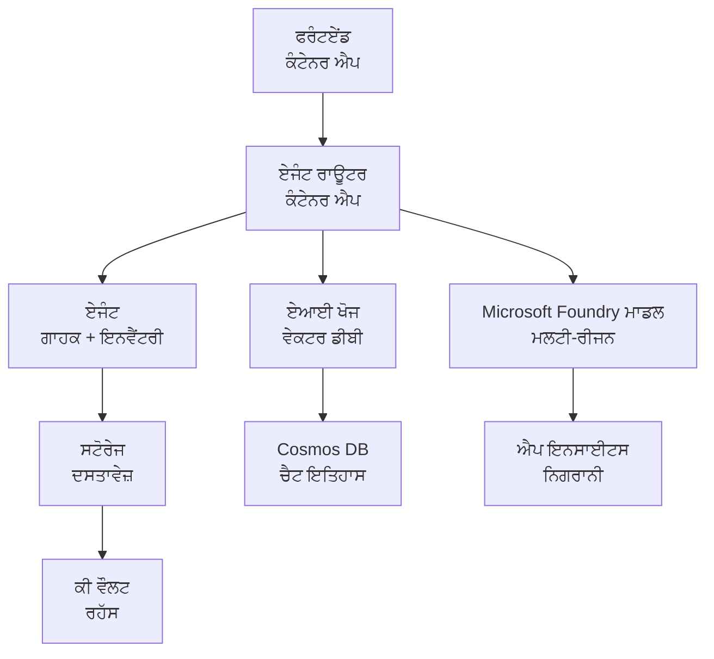

# ਰੀਟੇਲ ਮਲਟੀ-ਏਜੰਟ ਸਲੂਸ਼ਨ - ਇੰਫਰਾਸਟ੍ਰੱਕਚਰ ਟੈਂਪਲੇਟ

**ਅਧਿਆਇ 5: ਉਤਪਾਦਨ ਤਾਇਨਾਤੀ ਪੈਕੇਜ**
- **📚 ਕੋਰਸ ਹੋਮ**: [AZD ਬਿਗਿਨਰਜ਼ ਲਈ](../../README.md)
- **📖 ਸਬੰਧਤ ਅਧਿਆਇ**: [ਅਧਿਆਇ 5: ਮਲਟੀ-ਏਜੰਟ AI ਹੱਲ](../../README.md#-chapter-5-multi-agent-ai-solutions-advanced)
- **📝 ਸੈਨਾਰਿਓ ਗਾਈਡ**: [ਸੰਪੂਰਨ ਆਰਕੀਟੈਕਚਰ](../retail-scenario.md)
- **🎯 ਤੁਰੰਤ ਤਾਇਨਾਤੀ**: [ਇੱਕ-ਕਲਿਕ ਤਾਇਨਾਤੀ](#-quick-deployment)

> **⚠️ ਸਿਰਫ਼ ਇੰਫਰਾਸਟ੍ਰੱਕਚਰ ਟੈਂਪਲੇਟ**  
> ਇਹ ARM ਟੈਂਪਲੇਟ ਇੱਕ ਮਲਟੀ-ਏਜੰਟ ਸਿਸਟਮ ਲਈ **Azure ਸਰੋਤਾਂ** ਨੂੰ ਤਾਇਨਾਤੀ ਕਰਦਾ ਹੈ।  
>  
> **ਕੀ ਤਾਇਨਾਤੀ ਹੁੰਦਾ ਹੈ (15-25 ਮਿੰਟ):**
> - ✅ Microsoft Foundry ਮਾਡਲਸ (gpt-4.1, gpt-4.1-mini, embeddings ਤਿੰਨ ਖੇਤਰਾਂ ਵਿੱਚ)
> - ✅ AI Search ਸੇਵਾ (ਖਾਲੀ, ਇੰਡੈਕਸ ਬਣਾਉਣ ਲਈ ਤਿਆਰ)
> - ✅ Container Apps (ਪਲੇਸਹੋਲਡਰ ਇਮੇਜ, ਤੁਹਾਡੇ ਕੋਡ ਲਈ ਤਿਆਰ)
> - ✅ Storage, Cosmos DB, Key Vault, Application Insights
>  
> **ਕੀ ਸ਼ਾਮਲ ਨਹੀਂ ਹੈ (ਡਿਵੈਲਪਮੈਂਟ ਦੀ ਲੋੜ):**
> - ❌ ਏਜੰਟ ਇੰਪਲੀਮੈਂਟੇਸ਼ਨ ਕੋਡ (Customer Agent, Inventory Agent)
> - ❌ ਰੂਟਿੰਗ ਲੌਜਿਕ ਅਤੇ API ਐਂਡਪੌਇੰਟਸ
> - ❌ ਫਰੰਟਐਂਡ ਚੈਟ UI
> - ❌ ਸਰਚ ਇੰਡੈਕਸ ਸਕੀਮਾ ਅਤੇ ਡੇਟਾ ਪਾਈਪਲਾਈਨ
> - ❌ **ਅੰਦਾਜ਼ਾ ਡਿਵੈਲਪਮੈਂਟ ਮਿਹਨਤ: 80-120 ਘੰਟੇ**
>  
> **ਇਸ ਟੈਂਪਲੇਟ ਨੂੰ ਵਰਤੋਂ ਜੇ:**
> - ✅ ਤੁਸੀਂ ਮਲਟੀ-ਏਜੰਟ ਪ੍ਰੋਜੈਕਟ ਲਈ Azure ਇੰਫਰਾਸਟ੍ਰੱਕਚਰ ਪ੍ਰੋਵਿਜ਼ਨ ਕਰਨਾ ਚਾਹੁੰਦੇ ਹੋ
> - ✅ ਤੁਸੀਂ ਏਜੰਟ ਇੰਪਲੀਮੈਂਟੇਸ਼ਨ ਨੂੰ ਵੱਖਰਾ ਵਿਕਸਿਤ ਕਰਨ ਦੀ ਯੋਜਨਾ ਬਣਾ ਰਹੇ ਹੋ
> - ✅ ਤੁਹਾਨੂੰ ਪ੍ਰੋਡਕਸ਼ਨ-ਰੇਡੀ ਇੰਫਰਾਸਟ੍ਰੱਕਚਰ ਬੇਸਲਾਈਨ ਦੀ ਲੋੜ ਹੈ
>  
> **ਇਹ ਨਾ ਵਰਤੋਂ ਜੇ:**
> - ❌ ਤੁਸੀਂ ਤੁਰੰਤ ਇੱਕ ਕੰਮ ਕਰਦੇ ਮਲਟੀ-ਏਜੰਟ ਡੈਮੋ ਦੀ ਉਮੀਦ ਕਰ ਰਹੇ ਹੋ
> - ❌ ਤੁਸੀਂ ਪੂਰਾ ਐਪਲੀਕੇਸ਼ਨ ਕੋਡ ਉਦਾਹਰਣ ਲੱਭ ਰਹੇ ਹੋ

## ਓਵਰਵਿਊ

ਇਹ ਡਾਇਰੈਕਟਰੀ ਇੱਕ ਵਿਆਪਕ Azure Resource Manager (ARM) ਟੈਂਪਲੇਟ ਸ਼ਾਮਲ ਕਰਦੀ ਹੈ ਜੋ ਇੱਕ ਮਲਟੀ-ਏਜੰਟ ਗ੍ਰਾਹਕ ਸਹਾਇਤਾ ਸਿਸਟਮ ਦੀ **ਇੰਫਰਾਸਟ੍ਰੱਕਚਰ ਨੀਂਹ** ਤਾਇਨਾਤ ਕਰਨ ਲਈ ਹੈ। ਟੈਂਪਲੇਟ ਸਾਰੇ ਲੋੜੀਂਦੇ Azure ਸੇਵਾਵਾਂ ਪ੍ਰੋਵਾਈਜਨ ਕਰਦਾ ਹੈ, ਢੰਗ ਨਾਲ ਕਨਫਿਗਰ ਕੀਤੀਆਂ ਅਤੇ ਇਕ ਦੂਜੇ ਨਾਲ ਜੁੜੀਆਂ ਹੋਈਆਂ, ਤੁਹਾਡੇ ਐਪਲੀਕੇਸ਼ਨ ਡਿਵੈਲਪਮੈਂਟ ਲਈ ਤਿਆਰ।

**ਤਾਇਨਾਤੀ ਤੋਂ ਬਾਅਦ, ਤੁਹਾਡੇ ਕੋਲ ਹੋਵੇਗਾ:** ਪ੍ਰੋਡਕਸ਼ਨ-ਰੇਡੀ Azure ਇੰਫਰਾਸਟ੍ਰੱਕਚਰ  
**ਸਿਸਟਮ ਨੂੰ ਪੂਰਾ ਕਰਨ ਲਈ, ਤੁਹਾਨੂੰ ਲੋੜ ਹੈ:** ਏਜੰਟ ਕੋਡ, ਫਰੰਟਐਂਡ UI, ਅਤੇ ਡੇਟਾ ਕਨਫਿਗਰੇਸ਼ਨ (ਦੇਖੋ [Architecture Guide](../retail-scenario.md))

## 🎯 ਕੀ ਤਾਇਨਾਤੀ ਹੁੰਦਾ ਹੈ

### ਕੋਰ ਇੰਫਰਾਸਟ੍ਰੱਕਚਰ (ਤਾਇਨਾਤੀ ਤੋਂ ਬਾਅਦ ਸਥਿਤੀ)

✅ **Microsoft Foundry Models Services** (API ਕਾਲਾਂ ਲਈ ਤਿਆਰ)
  - ਪ੍ਰਾਇਮਰੀ ਖੇਤਰ: gpt-4.1 ਡਿਪਲੋਇਮੈਂਟ (20K TPM ਕੈਪਸੀਟੀ)
  - ਸੈਕੰਡਰੀ ਖੇਤਰ: gpt-4.1-mini ਡਿਪਲੋਇਮੈਂਟ (10K TPM ਕੈਪਸੀਟੀ)
  - ਟਰਸ਼ਰੀ ਖੇਤਰ: Text embeddings ਮਾਡਲ (30K TPM ਕੈਪਸੀਟੀ)
  - ਇਵੈਲੂਏਸ਼ਨ ਖੇਤਰ: gpt-4.1 grader ਮਾਡਲ (15K TPM ਕੈਪਸੀਟੀ)
  - **ਸਥਿਤੀ:** ਪੂਰੀ ਤਰ੍ਹਾਂ ਕਾਰਯਸ਼ੀਲ - ਤੁਰੰਤ API ਕਾਲਾਂ ਕੀਤੀਆਂ ਜਾ ਸਕਦੀਆਂ ਹਨ

✅ **Azure AI Search** (ਖਾਲੀ - ਕਨਫਿਗਰੇਸ਼ਨ ਲਈ ਤਿਆਰ)
  - ਵੇਕਟਰ ਸੇਰਚ ਸਮਰੱਥਾਵਾਂ ਸක්ਰਿਯ
  - ਸਟੈਂਡਰਡ ਟੀਅਰ ਨਾਲ 1 ਪਾਰਟੀਸ਼ਨ, 1 ਰਪੀਲਿਕਾ
  - **ਸਥਿਤੀ:** ਸੇਵਾ ਚੱਲ ਰਹੀ ਹੈ, ਪਰ ਇੰਡੈਕਸ ਬਣਾਉਣ ਦੀ ਲੋੜ ਹੈ
  - **ਕਾਰਵਾਈ ਲੋੜੀਦੀ ਹੈ:** ਆਪਣੇ ਸਕੀਮਾ ਨਾਲ ਸਰਚ ਇੰਡੈਕਸ ਬਣਾਓ

✅ **Azure Storage Account** (ਖਾਲੀ - ਅੱਪਲੋਡ ਲਈ ਤਿਆਰ)
  - Blob ਕਨਟੇਨਰ: `documents`, `uploads`
  - ਸੁਰੱਖਿਅਤ ਕਨਫਿਗਰੇਸ਼ਨ (ਸਿਰਫ HTTPS, ਕੋਈ ਪਬਲਿਕ ਐਕਸેસ ਨਹੀਂ)
  - **ਸਥਿਤੀ:** ਫਾਇਲਾਂ ਪ੍ਰਾਪਤ ਕਰਨ ਲਈ ਤਿਆਰ
  - **ਕਾਰਵਾਈ ਲੋੜੀਦੀ ਹੈ:** ਆਪਣਾ ਉਤਪਾਦ ਡੇਟਾ ਅਤੇ ਦਸਤਾਵੇਜ਼ ਅੱਪਲੋਡ ਕਰੋ

⚠️ **Container Apps Environment** (ਪਲੇਸਹੋਲਡਰ ਇਮੇਜ ਤਾਇਨਾਤ)
  - ਏਜੰਟ ਰਾਊਟਰ ਐਪ (nginx ਡਿਫ਼ਾਲਟ ਇਮੇਜ)
  - ਫਰੰਟਐਂਡ ਐਪ (nginx ਡਿਫ਼ਾਲਟ ਇਮੇਜ)
  - ਆਟੋ-ਸਕੇਲਿੰਗ ਕਨਫਿਗਰ ਕੀਤੀ ਗਈ (0-10 ਇੰਸਟੈਂਸ)
  - **ਸਥਿਤੀ:** ਪਲੇਸਹੋਲਡਰ ਕੰਟੇਨਰ ਚੱਲ ਰਹੇ ਹਨ
  - **ਕਾਰਵਾਈ ਲੋੜੀਦੀ ਹੈ:** ਆਪਣੇ ਏਜੰਟ ਐਪਲੀਕੇਸ਼ਨ ਬਣਾਓ ਅਤੇ ਤਾਇਨਾਤ ਕਰੋ

✅ **Azure Cosmos DB** (ਖਾਲੀ - ਡੇਟਾ ਲਈ ਤਿਆਰ)
  - ਡੇਟਾਬੇਸ ਅਤੇ ਕਨਟੇਨਰ ਪਹਿਲਾਂ ਤੋਂ ਕਨਫਿਗਰ ਕੀਤੇ ਗਏ
  - ਘੱਟ-ਲੈਨਸੀ ਦੇ ਕਾਰਜਾਂ ਲਈ ਓਪਟੀਮਾਈਜ਼ਡ
  - TTL ਆਟੋਮੈਟਿਕ ਕਲੀਨਅਪ ਲਈ ਸක්ਰਿਯ
  - **ਸਥਿਤੀ:** ਚੈਟ ਇਤਿਹਾਸ ਸੰਭਾਲਣ ਲਈ ਤਿਆਰ

✅ **Azure Key Vault** (ਔਪਸ਼ਨਲ - ਸੀਕ੍ਰੇਟਸ ਲਈ ਤਿਆਰ)
  - ਸੌਫਟ ਡੀਲੀਟ ਸක්ਰਿਯ
  - ਮੈਨੇਜਡ ਆਈਡੈਂਟਿਟੀਜ਼ ਲਈ RBAC ਕਨਫਿਗਰ ਕੀਤਾ ਗਿਆ
  - **ਸਥਿਤੀ:** API ਕੀਜ਼ ਅਤੇ ਕਨੈਕਸ਼ਨ ਸਟਰਿੰਗਜ਼ ਸਟੋਰ ਕਰਨ ਲਈ ਤਿਆਰ

✅ **Application Insights** (ਔਪਸ਼ਨਲ - ਮਾਨੀਟਰਿੰਗ ਚਾਲੂ)
  - Log Analytics ਵਰਕਸਪੇਸ ਨਾਲ ਜੁੜਿਆ
  - ਕਸਟਮ ਮੈਟ੍ਰਿਕਸ ਅਤੇ ਅਲਰਟਸ ਕਨਫਿਗਰ ਕੀਤੇ ਗਏ
  - **ਸਥਿਤੀ:** ਤੁਹਾਡੇ ਐਪਸ ਤੋਂ ਟੈਲੀਮੇਟਰੀ ਪ੍ਰਾਪਤ ਕਰਨ ਲਈ ਤਿਆਰ

✅ **Document Intelligence** (API ਕਾਲਾਂ ਲਈ ਤਿਆਰ)
  - S0 ਟੀਅਰ ਪ੍ਰੋਡਕਸ਼ਨ ਵਰਕਲੋਡ ਲਈ
  - **ਸਥਿਤੀ:** ਅੱਪਲੋਡ ਕੀਤੇ ਦਸਤਾਵੇਜ਼ ਪ੍ਰੋਸੈੱਸ ਕਰਨ ਲਈ ਤਿਆਰ

✅ **Bing Search API** (API ਕਾਲਾਂ ਲਈ ਤਿਆਰ)
  - S1 ਟੀਅਰ ਰੀਅਲ-ਟਾਈਮ ਸਰਚ ਲਈ
  - **ਸਥਿਤੀ:** ਵੈੱਬ ਸਰਚ ਕੁਐਰੀਆਂ ਲਈ ਤਿਆਰ

### ਤਾਇਨਾਤੀ ਮੋਡ

| Mode | OpenAI Capacity | Container Instances | Search Tier | Storage Redundancy | Best For |
|------|-----------------|---------------------|-------------|-------------------|----------|
| **Minimal** | 10K-20K TPM | 0-2 replicas | Basic | LRS (Local) | Dev/test, ਸਿੱਖਿਆ, ਪ੍ਰੂਫ-ਆਫ-ਕਾਂਸੈਪਟ |
| **Standard** | 30K-60K TPM | 2-5 replicas | Standard | ZRS (Zone) | ਪ੍ਰੋਡਕਸ਼ਨ, ਦਰਮਿਆਨਾ ਟ੍ਰੈਫਿਕ (<10K ਯੂਜ਼ਰ) |
| **Premium** | 80K-150K TPM | 5-10 replicas, zone-redundant | Premium | GRS (Geo) | ਐਨਟਰਪ੍ਰਾਈਜ਼, ਉੱਚ ਟ੍ਰੈਫਿਕ (>10K ਯੂਜ਼ਰ), 99.99% SLA |

**ਲਾਗਤ ਪ੍ਰਭਾਵ:**
- **Minimal → Standard:** ~4x ਲਾਗਤ ਵਾਧਾ ($100-370/mo → $420-1,450/mo)
- **Standard → Premium:** ~3x ਲਾਗਤ ਵਾਧਾ ($420-1,450/mo → $1,150-3,500/mo)
- **ਚੁਣੋ ਅਧਾਰ 'ਤੇ:** ਉਮੀਦ ਕੀਤੀ ਲੋਡ, SLA ਦੀਆਂ ਲੋੜਾਂ, ਬਜਟ ਦੀਆਂ ਪਾਬੰਦੀਆਂ

**ਕੈਪਸੀਟੀ ਯੋਜਨਾ:**
- **TPM (Tokens Per Minute):** ਸਾਰੇ ਮਾਡਲ ਡਿਪਲੋਇਮੈਂਟਾਂ ਵਿੱਚ ਕੁੱਲ
- **Container Instances:** ਆਟੋ-ਸਕੇਲਿੰਗ ਰੇਂਜ (ਮਿਨ-ਮੈਕਸ ਰੀਪਲਿਕਾ)
- **Search Tier:** ਕੁਐਰੀ ਪ੍ਰਦਸ਼ਨ ਅਤੇ ਇੰਡੈਕਸ ਸਾਈਜ਼ ਸੀਮਾਵਾਂ ਨੂੰ ਪ੍ਰਭਾਵਤ ਕਰਦਾ ਹੈ

## 📋 ਪਹਿਲਾਂ ਤੋਂ ਲੋੜੀਂਦੇ ਚੀਜ਼ਾਂ

### ਲੋੜੀਂਦੇ ਟੂਲ
1. **Azure CLI** (ਸੰਸਕਰਣ 2.50.0 ਜਾਂ ਉੱਪਰ)
   ```bash
   az --version  # ਸੰਸਕਰਣ ਦੀ ਜਾਂਚ ਕਰੋ
   az login      # ਪ੍ਰਮਾਣੀਕਰਨ ਕਰੋ
   ```

2. **ਸਕ੍ਰਿਆ Azure ਸਬਸਕ੍ਰਿਪਸ਼ਨ** ਜਿਸ ਵਿੱਚ Owner ਜਾਂ Contributor ਐਕਸੈਸ ਹੋਵੇ
   ```bash
   az account show  # ਸਬਸਕ੍ਰਿਪਸ਼ਨ ਦੀ ਪੁਸ਼ਟੀ ਕਰੋ
   ```

### ਲੋੜੀਂਦੇ Azure ਕੋਟਾ

ਤਾਇਨਾਤੀ ਤੋਂ ਪਹਿਲਾਂ, ਆਪਣੇ ਟਾਰਗੇਟ ਖੇਤਰਾਂ ਵਿੱਚ ਕਾਫੀ ਕੋਟਾ ਦੀ ਜਾਂਚ ਕਰੋ:

```bash
# ਆਪਣੇ ਖੇਤਰ ਵਿੱਚ Microsoft Foundry ਮਾਡਲਾਂ ਦੀ ਉਪਲਬਧਤਾ ਜਾਂਚੋ
az cognitiveservices account list-skus \
  --kind OpenAI \
  --location eastus2

# OpenAI ਕੋਟਾ ਦੀ ਪੁਸ਼ਟੀ ਕਰੋ (gpt-4.1 ਲਈ ਉਦਾਹਰਨ)
az cognitiveservices usage list \
  --location eastus2 \
  --query "[?name.value=='OpenAI.Standard.gpt-4.1']"

# ਕੰਟੇਨਰ ਐਪਸ ਕੋਟਾ ਜਾਂਚੋ
az provider show \
  --namespace Microsoft.App \
  --query "resourceTypes[?resourceType=='managedEnvironments'].locations"
```

**ਨਿਊਨਤਮ ਲੋੜੀਂਦੇ ਕੋਟਾ:**
- **Microsoft Foundry Models:** ਖੇਤਰਾਂ ਵਿੱਚ 3-4 ਮਾਡਲ ਡਿਪਲੋਇਮੈਂਟ
  - gpt-4.1: 20K TPM (ਟੋਕਨ ਪ੍ਰਤੀ ਮਿੰਟ)
  - gpt-4.1-mini: 10K TPM
  - text-embedding-ada-002: 30K TPM
  - **ਨੋਟ:** gpt-4.1 ਕੁਝ ਖੇਤਰਾਂ ਵਿੱਚ ਵੈਟਲਿਸਟ 'ਤੇ ਹੋ ਸਕਦਾ ਹੈ - [model availability](https://learn.microsoft.com/azure/ai-services/openai/concepts/models) ਦੀ ਜਾਂਚ ਕਰੋ
- **Container Apps:** ਮੈਨੇਜਡ ਐਨਵਾਇਰਨਮੈਂਟ + 2-10 ਕੰਟੇਨਰ ਇੰਸਟੈਂਸ
- **AI Search:** Standard ਟੀਅਰ (Basic ਵੇਕਟਰ ਸਰਚ ਲਈ ਅਪਰਯਾਪਤ)
- **Cosmos DB:** ਸਟੈਂਡਰਡ ਪ੍ਰੋਵਿਸ਼ਨਡ ਥਰੂਪੁੱਟ

**ਜੇ ਕੋਟਾ ਅਪਰਯਾਪਤ ਹੈ:**
1. Azure ਪੋਰਟਲ → Quotas → Request increase 'ਤੇ ਜाओ
2. ਜਾਂ Azure CLI ਵਰਤੋ:
   ```bash
   az support tickets create \
     --ticket-name "OpenAI-Quota-Increase" \
     --severity "minimal" \
     --description "Request quota increase for Microsoft Foundry Models gpt-4.1 in eastus2"
   ```
3. ਉਪਲਬਧਤਾ ਵਾਲੇ ਵਿਕਲਪ ਖੇਤਰਾਂ 'ਤੇ ਵਿਚਾਰ ਕਰੋ

## 🚀 ਤੁਰੰਤ ਤਾਇਨਾਤੀ

### ਵਿਕਲਪ 1: Azure CLI ਵਰਤ ਕੇ

```bash
# ਟੈਂਪਲੇਟ ਫਾਈਲਾਂ ਨੂੰ ਕਲੋਨ ਕਰੋ ਜਾਂ ਡਾਊਨਲੋਡ ਕਰੋ
git clone <repository-url>
cd examples/retail-multiagent-arm-template

# ਡਿਪਲੌਇਮੈਂਟ ਸਕ੍ਰਿਪਟ ਨੂੰ ਚਲਾਉਣ ਯੋਗ ਬਣਾਓ
chmod +x deploy.sh

# ਡਿਫਾਲਟ ਸੈਟਿੰਗਾਂ ਨਾਲ ਡਿਪਲੌਇ ਕਰੋ
./deploy.sh -g myResourceGroup

# ਪ੍ਰੋਡਕਸ਼ਨ ਲਈ ਪ੍ਰੀਮੀਅਮ ਫੀਚਰਾਂ ਨਾਲ ਡਿਪਲੌਇ ਕਰੋ
./deploy.sh -g myProdRG -e prod -m premium -l eastus2
```

### ਵਿਕਲਪ 2: Azure ਪੋਰਟਲ ਵਰਤ ਕੇ

[](https://portal.azure.com/#create/Microsoft.Template/uri/https%3A%2F%2Fraw.githubusercontent.com%2Fmicrosoft%2Fazd-for-beginners%2Fmain%2Fexamples%2Fretail-multiagent-arm-template%2Fazuredeploy.json)

### ਵਿਕਲਪ 3: Azure CLI ਨੂੰ ਸਿੱਧਾ ਵਰਤ ਕੇ

```bash
# ਰਿਸੋਰਸ ਗਰੁੱਪ ਬਣਾਓ
az group create --name myResourceGroup --location eastus2

# ਟੈਮਪਲੇਟ ਤੈਨਾਤ ਕਰੋ
az deployment group create \
  --resource-group myResourceGroup \
  --template-file azuredeploy.json \
  --parameters azuredeploy.parameters.json
```

## ⏱️ ਤਾਇਨਾਤੀ ਸਮਾਂਰੈਖਾ

### ਕੀ ਉਮੀਦ ਰੱਖਣੀ ਹੈ

| Phase | Duration | What Happens |
|-------|----------|--------------||
| **Template Validation** | 30-60 seconds | Azure ਟੈਂਪਲੇਟ ਸਿੰਟੈਕਸ ਅਤੇ ਪੈਰਾਮੀਟਰਾਂ ਦੀ ਜਾਂਚ ਕਰਦਾ ਹੈ |
| **Resource Group Setup** | 10-20 seconds | ਰਿਸੋর্স ਗਰੁੱਪ ਬਣਾਉਂਦਾ ਹੈ (ਜੇ ਲੋੜ ਹੋਵੇ) |
| **OpenAI Provisioning** | 5-8 minutes | 3-4 OpenAI ਖਾਤੇ ਬਣਾਉਂਦਾ ਅਤੇ ਮਾਡਲ ਡਿਪਲੋਇ ਕਰਦਾ ਹੈ |
| **Container Apps** | 3-5 minutes | ਐਨਵਾਇਰਨਮੈਂਟ ਬਣਾਉਂਦਾ ਅਤੇ ਪਲੇਸਹੋਲਡਰ ਕੰਟੇਨਰ ਤਾਇਨਾਤ ਕਰਦਾ ਹੈ |
| **Search & Storage** | 2-4 minutes | AI Search ਸੇਵਾ ਅਤੇ ਸਟੋਰੇਜ ਅਕਾਊਂਟ ਪ੍ਰੋਵਾਈਜਨ ਕਰਦਾ ਹੈ |
| **Cosmos DB** | 2-3 minutes | ਡੇਟਾਬੇਸ ਬਣਾਉਂਦਾ ਅਤੇ ਕਨਟੇਨਰ ਕਨਫਿਗਰ ਕਰਦਾ ਹੈ |
| **Monitoring Setup** | 2-3 minutes | Application Insights ਅਤੇ Log Analytics ਸੈਟਅੱਪ ਕਰਦਾ ਹੈ |
| **RBAC Configuration** | 1-2 minutes | ਮੈਨੇਜਡ ਆਈਡੈਂਟਿਟੀਜ਼ ਅਤੇ ਅਨੁਮਤੀਆਂ ਕਨਫਿਗਰ ਕਰਦਾ ਹੈ |
| **Total Deployment** | **15-25 minutes** | ਸਾਰੀ ਇੰਫਰਾਸਟ੍ਰੱਕਚਰ ਤਿਆਰ |

**ਤਾਇਨਾਤੀ ਤੋਂ ਬਾਅਦ:**
- ✅ **ਇੰਫਰਾਸਟ੍ਰੱਕਚਰ ਤਿਆਰ:** ਸਾਰੇ Azure ਸਰੋਤ ਪ੍ਰੋਵਾਈਜਡ ਅਤੇ ਚੱਲ ਰਹੇ ਹਨ
- ⏱️ **ਐਪਲੀਕੇਸ਼ਨ ਡਿਵੈਲਪਮੈਂਟ:** 80-120 ਘੰਟੇ (ਤੁਹਾਡੀ ਜਿੰਮੇਵਾਰੀ)
- ⏱️ **ਇੰਡੀਐਕਸ ਕਨਫਿਗਰੇਸ਼ਨ:** 15-30 ਮਿੰਟ (ਤੁਹਾਡੇ ਸਕੀਮਾ ਦੀ ਲੋੜ)
- ⏱️ **ਡੇਟਾ ਅੱਪਲੋਡ:** ਡੈਟਾਸੈਟ ਦੇ ਸਾਈਜ਼ ਅਨੁਸਾਰ ਵੱਖ-ਵੱਖ
- ⏱️ **ਟੈਸਟਿੰਗ ਅਤੇ ਵੈਰਿਫਿਕੇਸ਼ਨ:** 2-4 ਘੰਟੇ

---

## ✅ ਤਾਇਨਾਤੀ ਸਫਲਤਾ ਦੀ ਪੁਸ਼ਟੀ ਕਰੋ

### ਕਦਮ 1: ਰਿਸੋর্স ਪ੍ਰੋਵਿਜ਼ਨਿੰਗ ਦੀ ਜਾਂਚ (2 ਮਿੰਟ)

```bash
# ਸਾਰੇ ਸਾਧਨ ਸਫਲਤਾਪੂਰਵਕ ਤਾਇਨਾਤ ਹੋਏ ਹਨ ਇਹ ਪੱਕਾ ਕਰੋ
az resource list \
  --resource-group myResourceGroup \
  --query "[?provisioningState!='Succeeded'].{Name:name, Status:provisioningState, Type:type}" \
  --output table
```

**ਉਮੀਦ ਕੀਤੀ ਗਈ:** ਖਾਲੀ ਟੇਬਲ (ਸਾਰੇ ਰਿਸੋর্স "Succeeded" ਸਥਿਤੀ ਦਿਖਾ ਰਹੇ ਹੋਣ)

### ਕਦਮ 2: Microsoft Foundry Models ਡਿਪਲੋਇਮੈਂਟ ਦੀ ਜਾਂਚ (3 ਮਿੰਟ)

```bash
# ਸਾਰੇ OpenAI ਖਾਤੇ ਲਿਸਟ ਕਰੋ
az cognitiveservices account list \
  --resource-group myResourceGroup \
  --query "[?kind=='OpenAI'].{Name:name, Location:location, Status:properties.provisioningState}" \
  --output table

# ਮੁੱਖ ਖੇਤਰ ਲਈ ਮਾਡਲ ਤੈਨਾਤੀਆਂ ਦੀ ਜਾਂਚ ਕਰੋ
OPENAI_NAME=$(az cognitiveservices account list \
  --resource-group myResourceGroup \
  --query "[?kind=='OpenAI'] | [0].name" -o tsv)

az cognitiveservices account deployment list \
  --name $OPENAI_NAME \
  --resource-group myResourceGroup \
  --output table
```

**ਉਮੀਦ ਕੀਤੀ ਗਈ:** 
- 3-4 OpenAI ਖਾਤੇ (ਪ੍ਰਾਇਮਰੀ, ਸੈਕੰਡਰੀ, ਟਰਸ਼ਰੀ, ਇਵੈਲੂਏਸ਼ਨ ਖੇਤਰ)
- ਪ੍ਰਤੀ ਖਾਤੇ 1-2 ਮਾਡਲ ਡਿਪਲੋਇਮੈਂਟ (gpt-4.1, gpt-4.1-mini, text-embedding-ada-002)

### ਕਦਮ 3: ਇੰਫਰਾਸਟ੍ਰੱਕਚਰ ਐਂਡਪੌਇੰਟਸ ਦੀ ਟੈਸਟਿੰਗ (5 ਮਿੰਟ)

```bash
# ਕੰਟੇਨਰ ਐਪ URLs ਪ੍ਰਾਪਤ ਕਰੋ
az containerapp list \
  --resource-group myResourceGroup \
  --query "[].{Name:name, URL:properties.configuration.ingress.fqdn, Status:properties.runningStatus}" \
  --output table

# ਰਾਊਟਰ ਐਂਡਪੋਇੰਟ ਦੀ ਜਾਂਚ ਕਰੋ (ਪਲੇਸਹੋਲਡਰ ਚਿੱਤਰ ਜਵਾਬ ਦੇਵੇਗਾ)
ROUTER_URL=$(az containerapp show \
  --name retail-router \
  --resource-group myResourceGroup \
  --query "properties.configuration.ingress.fqdn" -o tsv)

echo "Testing: https://$ROUTER_URL"
curl -I https://$ROUTER_URL || echo "Container running (placeholder image - expected)"
```

**ਉਮੀਦ ਕੀਤੀ ਗਈ:** 
- Container Apps "Running" ਸਥਿਤੀ ਦਿਖਾਉਂਦੇ ਹਨ
- ਪਲੇਸਹੋਲਡਰ nginx HTTP 200 ਜਾਂ 404 ਨਾਲ ਜਵਾਬ ਦਿੰਦਾ ਹੈ (ਹਾਲੇ ਕੋਈ ਐਪਲੀਕੇਸ਼ਨ ਕੋਡ ਨਹੀਂ)

### ਕਦਮ 4: Microsoft Foundry Models API ਐਕਸੈਸ ਦੀ ਜਾਂਚ (3 ਮਿੰਟ)

```bash
# OpenAI ਐਂਡਪਾਇੰਟ ਅਤੇ ਕੀ ਪ੍ਰਾਪਤ ਕਰੋ
OPENAI_ENDPOINT=$(az cognitiveservices account show \
  --name $OPENAI_NAME \
  --resource-group myResourceGroup \
  --query "properties.endpoint" -o tsv)

OPENAI_KEY=$(az cognitiveservices account keys list \
  --name $OPENAI_NAME \
  --resource-group myResourceGroup \
  --query "key1" -o tsv)

# gpt-4.1 ਡਿਪਲੋਇਮੈਂਟ ਦੀ ਜਾਂਚ ਕਰੋ
curl "${OPENAI_ENDPOINT}openai/deployments/gpt-4.1/chat/completions?api-version=2024-08-01-preview" \
  -H "Content-Type: application/json" \
  -H "api-key: $OPENAI_KEY" \
  -d '{
    "messages": [{"role": "user", "content": "Say hello"}],
    "max_tokens": 10
  }'
```

**ਉਮੀਦ ਕੀਤੀ ਗਈ:** JSON ਜਵਾਬ chat completion ਨਾਲ (OpenAI ਕਾਰਯਸ਼ੀਲ ਹੋਣ ਦੀ ਪੁਸ਼ਟੀ)

### ਕੀ ਕੰਮ ਕਰ ਰਿਹਾ ਹੈ ਬਣਾਮ ਕੀ ਨਹੀਂ

**✅ ਤਾਇਨਾਤੀ ਤੋਂ ਬਾਅਦ ਕੰਮ ਕਰ ਰਿਹਾ ਹੈ:**
- Microsoft Foundry Models ਡਿਪਲੋਇ ਹੋਏ ਅਤੇ API ਕਾਲਾਂ ਕਬੂਲ ਕਰ ਰਹੇ ਹਨ
- AI Search ਸੇਵਾ ਚੱਲ ਰਹੀ ਹੈ (ਖਾਲੀ, ਅਜੇ ਕੋਈ ਇੰਡੈਕਸ ਨਹੀਂ)
- Container Apps ਚੱਲ ਰਹੇ ਹਨ (ਪਲੇਸਹੋਲਡਰ nginx ਇਮੇਜ)
- ਸਟੋਰੇਜ ਅਕਾਊਂਟਸ ਪਹੁੰਚਯੋਗ ਹਨ ਅਤੇ ਅੱਪਲੋਡ ਲਈ ਤਿਆਰ ਹਨ
- Cosmos DB ਡੇਟਾ ਕਾਰਜਾਂ ਲਈ ਤਿਆਰ ਹੈ
- Application Insights ਇੰਫਰਾਸਟ੍ਰੱਕਚਰ ਟੈਲੀਮੇਟਰੀ ਇਕੱਠੀ ਕਰ ਰਿਹਾ ਹੈ
- Key Vault ਸੀਕ੍ਰੇਟ ਸਟੋਰ ਕਰਨ ਲਈ ਤਿਆਰ ਹੈ

**❌ ਅਜੇ ਕੰਮ ਨਹੀਂ ਕਰ ਰਿਹਾ (ਡਿਵੈਲਪਮੈਂਟ ਦੀ ਲੋੜ):**
- ਏਜੰਟ ਐਂਡਪੌਇੰਟ (ਕੋਈ ਐਪਲੀਕੇਸ਼ਨ ਕੋਡ ਤਾਇਨਾਤ ਨਹੀਂ)
- ਚੈਟ ਫੰਕਸ਼ਨਾਲਟੀ (ਫਰੰਟਐਂਡ + ਬੈਕਐਂਡ ਇੰਪਲੀਮੈਂਟੇਸ਼ਨ ਦੀ ਲੋੜ)
- ਸਰਚ ਕੁਐਰੀਆਂ (ਕੋਈ ਸਰਚ ਇੰਡੈਕਸ ਬਣਾਇਆ ਨਹੀਂ ਗਿਆ)
- ਦਸਤਾਵੇਜ਼ ਪ੍ਰੋਸੈਸਿੰਗ ਪਾਈਪਲਾਈਨ (ਕੋਈ ਡੇਟਾ ਅੱਪਲੋਡ ਨਹੀਂ)
- ਕਸਟਮ ਟੈਲੀਮੇਟਰੀ (ਐਪਲੀਕੇਸ਼ਨ ਇੰਸਟਰੂਮੈਂਟੇਸ਼ਨ ਦੀ ਲੋੜ)

**ਅਗਲੇ ਕਦਮ:** ਆਪਣੇ ਐਪਲੀਕੇਸ਼ਨ ਨੂੰ ਵਿਕਸਿਤ ਅਤੇ ਤਾਇਨਾਤ ਕਰਨ ਲਈ [Post-Deployment Configuration](#-post-deployment-next-steps) ਵੇਖੋ

---

## ⚙️ ਸੰਰਚਨਾ ਵਿਕਲਪ

### ਟੈਂਪਲੇਟ ਪੈਰਾਮੀਟਰ

| Parameter | Type | Default | Description |
|-----------|------|---------|-------------|
| `projectName` | string | "retail" | ਸਾਰੇ ਰਿਸੋর্স ਨਾਂਵਾਂ ਲਈ ਪ੍ਰੀਫਿਕਸ |
| `location` | string | Resource group location | ਪ੍ਰਾਇਮਰੀ ਤਾਇਨਾਤੀ ਖੇਤਰ |
| `secondaryLocation` | string | "westus2" | ਮਲਟੀ-ਰੀਜਨ ਤਾਇਨਾਤੀ ਲਈ ਸੈਕੰਡਰੀ ਖੇਤਰ |
| `tertiaryLocation` | string | "francecentral" | embeddings ਮਾਡਲ ਲਈ ਖੇਤਰ |
| `environmentName` | string | "dev" | ਵਾਤਾਵਰਣ ਦਾ ਨਿਰਧਾਰਨ (dev/staging/prod) |
| `deploymentMode` | string | "standard" | ਤਾਇਨਾਤੀ ਕਨਫਿਗਰੇਸ਼ਨ (minimal/standard/premium) |
| `enableMultiRegion` | bool | true | ਮਲਟੀ-ਰੀਜਨ ਤਾਇਨਾਤੀ ਨੂੰ ਐਨੇਬਲ ਕਰੋ |
| `enableMonitoring` | bool | true | Application Insights ਅਤੇ ਲੋਗਿੰਗ ਐਨੇਬਲ ਕਰੋ |
| `enableSecurity` | bool | true | Key Vault ਅਤੇ ਸੁਧਰੇ ਸੁਰੱਖਿਆ ਨੂੰ ਐਨੇਬਲ ਕਰੋ |

### ਪੈਰਾਮੀਟਰ ਕਸਟਮਾਈਜ਼ ਕਰਨਾ

Edit `azuredeploy.parameters.json`:

```json
{
  "$schema": "https://schema.management.azure.com/schemas/2019-04-01/deploymentParameters.json#",
  "contentVersion": "1.0.0.0",
  "parameters": {
    "projectName": {
      "value": "mycompany"
    },
    "environmentName": {
      "value": "prod"
    },
    "deploymentMode": {
      "value": "premium"
    },
    "location": {
      "value": "eastus2"
    }
  }
}
```

## 🏗️ ਆਰਕੀਟੈਕਚਰ ਓਵਰਵਿਊ


## 📖 ਤਾਇਨਾਤੀ ਸਕ੍ਰਿਪਟ ਦੀ ਵਰਤੋਂ

`deploy.sh` ਸਕ੍ਰਿਪਟ ਇੱਕ ਇੰਟਰਐਕਟਿਵ ਤਾਇਨਾਤੀ ਅਨੁਭਵ ਪ੍ਰਦਾਨ ਕਰਦਾ ਹੈ:

```bash
# ਸਹਾਇਤਾ ਦਿਖਾਓ
./deploy.sh --help

# ਬੁਨਿਆਦੀ ਤੈਨਾਤੀ
./deploy.sh -g myResourceGroup

# ਕਸਟਮ ਸੈਟਿੰਗਾਂ ਨਾਲ ਉੱਨਤ ਤੈਨਾਤੀ
./deploy.sh \
  -g myProductionRG \
  -p companyname \
  -e prod \
  -m premium \
  -l eastus2

# ਮਲਟੀ-ਰੀਜਨ ਤੋਂ ਬਿਨਾਂ ਵਿਕਾਸੀ ਤੈਨਾਤੀ
./deploy.sh \
  -g myDevRG \
  -e dev \
  -m minimal \
  --no-multi-region \
  --no-security
```

### ਸਕ੍ਰਿਪਟ ਵਿਸ਼ੇਸ਼ਤਾਵਾਂ

- ✅ **ਪ੍ਰੀਰੇਕਵਿਜ਼ਾਈਟਸ ਵੈਰੀਫਿਕੇਸ਼ਨ** (Azure CLI, ਲਾਗਇਨ ਸਥਿਤੀ, ਟੈਂਪਲੇਟ ਫਾਇਲਾਂ)
- ✅ **ਰਿਸੋর্স ਗਰੁੱਪ ਪ੍ਰਬੰਧਨ** (ਜੇ ਨਹੀਂ ਹੋਵੇ ਤਾਂ ਬਣਾਉਂਦਾ ਹੈ)
- ✅ **ਤਾਇਨਾਤੀ ਤੋਂ ਪਹਿਲਾਂ ਟੈਂਪਲੇਟ ਵੈਰੀਫਾਈ** ਕਰਦਾ ਹੈ
- ✅ **ਪ੍ਰੋਗਰੈਸ ਮਾਨੀਟਰਿੰਗ** ਰੰਗੀਨ ਆਊਟਪੁੱਟ ਨਾਲ
- ✅ **ਤਾਇਨਾਤੀ ਆਉਟਪੁੱਟ** ਦਿਖਾਉਂਦਾ ਹੈ
- ✅ **ਪੋਸਟ-ਤਾਇਨਾਤੀ ਮਾਰਗਦਰਸ਼ਨ**

## 📊 ਤਾਇਨਾਤੀ ਦੀ ਨਿਗਰਾਨੀ

### ਤਾਇਨਾਤੀ ਸਥਿਤੀ ਚੈੱਕ ਕਰੋ

```bash
# ਡਿਪਲਾਇਮੈਂਟਾਂ ਦੀ ਸੂਚੀ
az deployment group list --resource-group myResourceGroup --output table

# ਡਿਪਲਾਇਮੈਂਟ ਦੇ ਵੇਰਵੇ ਪ੍ਰਾਪਤ ਕਰੋ
az deployment group show \
  --resource-group myResourceGroup \
  --name retail-deployment-YYYYMMDD-HHMMSS

# ਡਿਪਲਾਇਮੈਂਟ ਦੀ ਤਰੱਕੀ ਵੇਖੋ
az deployment group create \
  --resource-group myResourceGroup \
  --template-file azuredeploy.json \
  --parameters azuredeploy.parameters.json \
  --verbose
```

### ਤਾਇਨਾਤੀ ਆਉਟਪੁੱਟਸ

ਸਫਲ ਤਾਇਨਾਤੀ ਤੋਂ ਬਾਅਦ, ਹੇਠਾਂ ਦਿੱਤੇ ਆਉਟਪੁੱਟ ਉਪਲਬਧ ਹੁੰਦੇ ਹਨ:

- **Frontend URL**: ਵੈੱਬ ਇੰਟਰਫੇਸ ਲਈ ਪਬਲਿਕ ਐਂਡਪੌਇੰਟ
- **Router URL**: ਏਜੰਟ ਰਾਊਟਰ ਲਈ API ਐਂਡਪੌਇੰਟ
- **OpenAI Endpoints**: ਪ੍ਰਾਇਮਰੀ ਅਤੇ ਸੈਕੰਡਰੀ OpenAI ਸੇਵਾ ਐਂਡਪੌਇੰਟ
- **Search Service**: Azure AI Search ਸੇਵਾ ਐਂਡਪੌਇੰਟ
- **Storage Account**: ਦਸਤਾਵੇਜ਼ਾਂ ਲਈ ਸਟੋਰੇਜ ਅਕਾਊਂਟ ਦਾ ਨਾਂ
- **Key Vault**: Key Vault ਦਾ ਨਾਂ (ਜੇ ਐਨੇਬਲ ਕੀਤਾ ਗਿਆ ਹੋਵੇ)
- **Application Insights**: ਮਾਨੀਟਰਿੰਗ ਸੇਵਾ ਦਾ ਨਾਂ (ਜੇ ਐਨੇਬਲ ਕੀਤਾ ਗਿਆ ਹੋਵੇ)

## 🔧 ਪੋਸਟ-ਤਾਇਨਾਤੀ: ਅਗਲੇ ਕਦਮ
> **📝 ਮਹੱਤਵਪੂਰਣ:** ਇੰਫਰਾਸਟਰਕਚਰ ਤਿਆਰ ਕੀਤਾ ਗਿਆ ਹੈ, ਪਰ ਤੁਹਾਨੂੰ ਐਪਲੀਕੇਸ਼ਨ ਕੋਡ ਵਿਕਸਿਤ ਅਤੇ ਡੀਪਲੋਇ ਕਰਨਾ ਲਾਜ਼ਮੀ ਹੈ।

### ਫੇਜ਼ 1: ਏਜੰਟ ਐਪਲੀਕੇਸ਼ਨਾਂ ਦਾ ਵਿਕਾਸ (ਤੁਹਾਡੇ ਦੀ ਜ਼ਿੰਮੇਵਾਰੀ)

ARM ਟੈਮਪਲੇਟ **ਖਾਲੀ Container Apps** ਬਣਾਉਂਦਾ ਹੈ ਜਿਨ੍ਹਾਂ ਵਿੱਚ placeholder nginx images ਹਨ। ਤੁਹਾਨੂੰ ਇਹ ਕਰਨੇ ਲਾਜ਼ਮੀ ਹਨ:

**ਲਾਜ਼ਮੀ ਵਿਕਾਸ:**
1. **Agent Implementation** (30-40 hours)
   - ਗਾਹਕ ਸੇਵਾ ਏਜੰਟ gpt-4.1 ਇੰਟਿਗ੍ਰੇਸ਼ਨ ਨਾਲ
   - ਇਨਵੇਂਟਰੀ ਏਜੰਟ gpt-4.1-mini ਇੰਟਿਗ੍ਰੇਸ਼ਨ ਨਾਲ
   - ਏਜੰਟ ਰਾਊਟਿੰਗ ਲੌਜਿਕ

2. **Frontend Development** (20-30 hours)
   - ਚੈਟ ਇੰਟਰਫੇਸ UI (React/Vue/Angular)
   - ਫਾਈਲ ਅਪਲੋਡ ਫੰਕਸ਼ਨਾਲਿਟੀ
   - ਜਵਾਬ ਦੀ ਰੇਂਡਰਿੰਗ ਅਤੇ ਫਾਰਮੇਟਿੰਗ

3. **Backend Services** (12-16 hours)
   - FastAPI or Express router
   - Authentication middleware
   - ਟੈਲੇਮੇਟਰੀ ਇੰਟਿਗ੍ਰੇਸ਼ਨ

See: [Architecture Guide](../retail-scenario.md) for detailed implementation patterns and code examples

### ਫੇਜ਼ 2: AI Search Index ਸੰਰਚਨਾ ਕਰੋ (15-30 minutes)

ਆਪਣੇ ਡੇਟਾ ਮਾਡਲ ਨਾਲ ਮੇਲ ਖਾਂਦੇ ਖੋਜ ਇੰਡੈਕਸ ਬਣਾਓ:

```bash
# ਖੋਜ ਸੇਵਾ ਦੇ ਵੇਰਵੇ ਪ੍ਰਾਪਤ ਕਰੋ
SEARCH_NAME=$(az search service list \
  --resource-group myResourceGroup \
  --query "[0].name" -o tsv)

SEARCH_KEY=$(az search admin-key show \
  --service-name $SEARCH_NAME \
  --resource-group myResourceGroup \
  --query "primaryKey" -o tsv)

# ਆਪਣੇ ਸਕੀਮਾ ਨਾਲ ਇੰਡੈਕਸ ਬਣਾਓ (ਉਦਾਹਰਨ)
curl -X POST "https://${SEARCH_NAME}.search.windows.net/indexes?api-version=2023-11-01" \
  -H "Content-Type: application/json" \
  -H "api-key: ${SEARCH_KEY}" \
  -d '{
    "name": "products",
    "fields": [
      {"name": "id", "type": "Edm.String", "key": true},
      {"name": "title", "type": "Edm.String", "searchable": true},
      {"name": "content", "type": "Edm.String", "searchable": true},
      {"name": "category", "type": "Edm.String", "filterable": true},
      {"name": "content_vector", "type": "Collection(Edm.Single)", 
       "searchable": true, "dimensions": 1536, "vectorSearchProfile": "default"}
    ],
    "vectorSearch": {
      "algorithms": [{"name": "default", "kind": "hnsw"}],
      "profiles": [{"name": "default", "algorithm": "default"}]
    }
  }'
```

**Resources:**
- [AI Search Index Schema Design](https://learn.microsoft.com/azure/search/search-what-is-an-index)
- [Vector Search Configuration](https://learn.microsoft.com/azure/search/vector-search-how-to-create-index)

### ਫੇਜ਼ 3: ਆਪਣਾ ਡੇਟਾ ਅਪਲੋਡ ਕਰੋ (ਸਮਾਂ ਵੱਖਰਾ ਹੋ ਸਕਦਾ ਹੈ)

ਜਦੋਂ ਤੁਹਾਡੇ ਕੋਲ ਉਤਪਾਦ ਡੇਟਾ ਅਤੇ ਦਸਤਾਵੇਜ਼ ਹੋਣ:

```bash
# ਸਟੋਰੇਜ ਖਾਤੇ ਦੇ ਵੇਰਵੇ ਪ੍ਰਾਪਤ ਕਰੋ
STORAGE_NAME=$(az storage account list \
  --resource-group myResourceGroup \
  --query "[0].name" -o tsv)

STORAGE_KEY=$(az storage account keys list \
  --account-name $STORAGE_NAME \
  --resource-group myResourceGroup \
  --query "[0].value" -o tsv)

# ਆਪਣੇ ਦਸਤਾਵੇਜ਼ਾਂ ਨੂੰ ਅਪਲੋਡ ਕਰੋ
az storage blob upload-batch \
  --destination documents \
  --source /path/to/your/product/docs \
  --account-name $STORAGE_NAME \
  --account-key $STORAGE_KEY

# ਉਦਾਹਰਨ: ਇੱਕ ਫਾਇਲ ਅਪਲੋਡ ਕਰੋ
az storage blob upload \
  --container-name documents \
  --name "product-manual.pdf" \
  --file /path/to/product-manual.pdf \
  --account-name $STORAGE_NAME \
  --account-key $STORAGE_KEY
```

### ਫੇਜ਼ 4: ਆਪਣੀਆਂ ਐਪਲੀਕੇਸ਼ਨਾਂ ਬਣਾਓ ਅਤੇ ਡੀਪਲੋਇ ਕਰੋ (8-12 hours)

ਜਦੋਂ ਤੁਸੀਂ ਆਪਣਾ ਏਜੰਟ ਕੋਡ ਵਿਕਸਿਤ ਕਰ ਲਿਆ ਹੈ:

```bash
# 1. ਜੇ ਲੋੜ ਹੋਵੇ ਤਾਂ Azure Container Registry ਬਣਾਓ
az acr create \
  --name myregistry \
  --resource-group myResourceGroup \
  --sku Basic

# 2. ਏਜੰਟ ਰਾਊਟਰ ਇਮੇਜ ਬਣਾਓ ਅਤੇ ਪੁਸ਼ ਕਰੋ
docker build -t myregistry.azurecr.io/agent-router:v1 /path/to/your/router/code
az acr login --name myregistry
docker push myregistry.azurecr.io/agent-router:v1

# 3. ਫਰੰਟਏਂਡ ਇਮੇਜ ਬਣਾਓ ਅਤੇ ਪੁਸ਼ ਕਰੋ
docker build -t myregistry.azurecr.io/frontend:v1 /path/to/your/frontend/code
docker push myregistry.azurecr.io/frontend:v1

# 4. ਆਪਣੇ ਇਮੇਜਾਂ ਨਾਲ Container Apps ਨੂੰ ਅੱਪਡੇਟ ਕਰੋ
az containerapp update \
  --name retail-router \
  --resource-group myResourceGroup \
  --image myregistry.azurecr.io/agent-router:v1

az containerapp update \
  --name retail-frontend \
  --resource-group myResourceGroup \
  --image myregistry.azurecr.io/frontend:v1

# 5. ਵਾਤਾਵਰਣ ਵੇਰੀਏਬਲ ਸੰਰਚਿਤ ਕਰੋ
az containerapp update \
  --name retail-router \
  --resource-group myResourceGroup \
  --set-env-vars \
    OPENAI_ENDPOINT=secretref:openai-endpoint \
    OPENAI_KEY=secretref:openai-key \
    SEARCH_ENDPOINT=secretref:search-endpoint \
    SEARCH_KEY=secretref:search-key
```

### ਫੇਜ਼ 5: ਆਪਣੀ ਐਪਲੀਕੇਸ਼ਨ ਦੀ ਟੈਸਟਿੰਗ ਕਰੋ (2-4 hours)

```bash
# ਆਪਣੇ ਐਪਲੀਕੇਸ਼ਨ ਦਾ URL ਪ੍ਰਾਪਤ ਕਰੋ
ROUTER_URL=$(az containerapp show \
  --name retail-router \
  --resource-group myResourceGroup \
  --query "properties.configuration.ingress.fqdn" -o tsv)

# ਏਜੰਟ ਐਂਡਪੋਇੰਟ ਦੀ ਜਾਂਚ ਕਰੋ (ਜਦੋਂ ਤੁਹਾਡਾ ਕੋਡ ਡੈਪਲੋਇਡ ਹੋ ਜਾਵੇ)
curl -X POST "https://${ROUTER_URL}/chat" \
  -H "Content-Type: application/json" \
  -d '{
    "message": "Hello, I need help with my order",
    "agent": "customer"
  }'

# ਐਪਲੀਕੇਸ਼ਨ ਦੇ ਲੌਗ ਚੈੱਕ ਕਰੋ
az containerapp logs show \
  --name retail-router \
  --resource-group myResourceGroup \
  --follow
```

### ਇੰਪਲੀਮੈਂਟੇਸ਼ਨ ਰਿਸੋਰਸਜ਼

**Architecture & Design:**
- 📖 [Complete Architecture Guide](../retail-scenario.md) - ਵਿਸਥਾਰਿਤ ਇੰਪਲੀਮੈਂਟੇਸ਼ਨ ਪੈਟਰਨ
- 📖 [Multi-Agent Design Patterns](https://learn.microsoft.com/azure/architecture/ai-ml/guide/multi-agent-systems)

**Code Examples:**
- 🔗 [Microsoft Foundry Models Chat Sample](https://github.com/Azure-Samples/azure-search-openai-demo) - RAG pattern
- 🔗 [Semantic Kernel](https://github.com/microsoft/semantic-kernel) - Agent ਫਰੇਮਵਰਕ (C#)
- 🔗 [LangChain Azure](https://github.com/langchain-ai/langchain) - Agent orchestration (Python)
- 🔗 [AutoGen](https://github.com/microsoft/autogen) - Multi-agent conversations

**Estimated Total Effort:**
- Infrastructure deployment: 15-25 minutes (✅ Complete)
- Application development: 80-120 hours (🔨 ਤੁਹਾਡਾ ਕੰਮ)
- Testing and optimization: 15-25 hours (🔨 ਤੁਹਾਡਾ ਕੰਮ)

## 🛠️ ਟ੍ਰਬਲਸ਼ੂਟਿੰਗ

### ਆਮ ਮੁੱਦੇ

#### 1. Microsoft Foundry Models Quota Exceeded

```bash
# ਮੌਜੂਦਾ ਕੋਟਾ ਦੀ ਵਰਤੋਂ ਜਾਂਚੋ
az cognitiveservices usage list --location eastus2

# ਕੋਟਾ ਵਧਾਉਣ ਦੀ ਬੇਨਤੀ ਕਰੋ
az support tickets create \
  --ticket-name "OpenAI-Quota-Increase" \
  --severity "minimal" \
  --description "Request quota increase for Microsoft Foundry Models in region X"
```

#### 2. Container Apps Deployment Failed

```bash
# ਕੰਟੇਨਰ ਐਪ ਦੇ ਲੌਗ ਚੈੱਕ ਕਰੋ
az containerapp logs show \
  --name retail-router \
  --resource-group myResourceGroup \
  --follow

# ਕੰਟੇਨਰ ਐਪ ਨੂੰ ਮੁੜ ਚਾਲੂ ਕਰੋ
az containerapp revision restart \
  --name retail-router \
  --resource-group myResourceGroup
```

#### 3. Search Service Initialization

```bash
# ਖੋਜ ਸੇਵਾ ਦੀ ਸਥਿਤੀ ਦੀ ਪੁਸ਼ਟੀ ਕਰੋ
az search service show \
  --name <search-service-name> \
  --resource-group myResourceGroup

# ਖੋਜ ਸੇਵਾ ਨਾਲ ਜੁੜਾਈ ਦੀ ਜਾਂਚ ਕਰੋ
curl -X GET "https://<search-service-name>.search.windows.net/indexes?api-version=2023-11-01" \
  -H "api-key: <search-admin-key>"
```

### ਡੀਪਲੋਇਮੈਂਟ ਵਿਸ਼ਲੇਸ਼ਣ

```bash
# ਸਾਰੇ ਸਰੋਤ ਬਣਾਏ ਗਏ ਹਨ ਇਹ ਪੁਸ਼ਟੀ ਕਰੋ
az resource list \
  --resource-group myResourceGroup \
  --output table

# ਸਰੋਤਾਂ ਦੀ ਸਿਹਤ ਜਾਂਚੋ
az resource list \
  --resource-group myResourceGroup \
  --query "[?provisioningState!='Succeeded'].{Name:name, Status:provisioningState, Type:type}" \
  --output table
```

## 🔐 ਸੁਰੱਖਿਆ ਵਿਚਾਰ

### ਕੀ ਮੈਨੇਜਮੈਂਟ
- ਸਾਰੇ ਸਿਕ੍ਰੇਟ Azure Key Vault ਵਿੱਚ ਸਟੋਰ ਕੀਤੇ ਜਾਂਦੇ ਹਨ (ਜਦੋਂ सक्षम ਹੋਵੇ)
- Container apps authentication ਲਈ managed identity ਵਰਤਦੇ ਹਨ
- Storage accounts ਦੇ ਸੁਰੱਖਿਅਤ ਡਿਫੌਲਟ ਹਨ (ਸਿਰਫ HTTPS, ਕੋਈ ਪਬਲਿਕ blob ਪਹੁੰਚ ਨਹੀਂ)

### ਨੈੱਟਵਰਕ ਸੁਰੱਖਿਆ
- Container apps ਜਿੱਥੇ ਸੰਭਵ ਹੈ ਇੰਟਰਨਲ ਨੈੱਟਵਰਕਿੰਗ ਵਰਤਦੇ ਹਨ
- Search service ਨੂੰ private endpoints ਵਿਕਲਪ ਨਾਲ ਸੰਰਚਿਤ ਕੀਤਾ ਗਿਆ ਹੈ
- Cosmos DB ਨੂੰ ਘੱਟੋ-ਘੱਟ ਲੋੜੀਂਦੇ ਅਨੁਮਤੀਆਂ ਨਾਲ ਸੰਰਚਿਤ ਕੀਤਾ ਗਿਆ ਹੈ

### RBAC ਸੰਰਚਨਾ
```bash
# ਮੈਨੇਜਡ ਆਈਡੈਂਟਿਟੀ ਲਈ ਜ਼ਰੂਰੀ ਭੂਮਿਕਾਵਾਂ ਸੌਂਪੋ
az role assignment create \
  --assignee <container-app-managed-identity> \
  --role "Cognitive Services OpenAI User" \
  --scope <openai-resource-id>
```

## 💰 ਲਾਗਤ ਅਪਟੀਮਾਈਜ਼ੇਸ਼ਨ

### ਲਾਗਤ ਅਨੁਮਾਨ (ਮਾਸਿਕ, USD)

| ਮੋਡ | OpenAI | Container Apps | Search | Storage | ਕੁੱਲ ਅਨੁਮਾਨ |
|------|--------|----------------|--------|---------|------------|
| ਮਿਨੀਮਲ | $50-200 | $20-50 | $25-100 | $5-20 | $100-370 |
| ਸਟੈਂਡਰਡ | $200-800 | $100-300 | $100-300 | $20-50 | $420-1450 |
| ਪ੍ਰੀਮੀਅਮ | $500-2000 | $300-800 | $300-600 | $50-100 | $1150-3500 |

### ਲਾਗਤ ਮਾਨੀਟਰਿੰਗ

```bash
# ਬਜਟ ਅਲਰਟਾਂ ਸੈੱਟ ਕਰੋ
az consumption budget create \
  --account-name <subscription-id> \
  --budget-name "retail-budget" \
  --amount 500 \
  --time-grain Monthly \
  --start-date 2024-01-01 \
  --end-date 2024-12-31
```

## 🔄 ਅਪਡੇਟਸ ਅਤੇ ਮੇਨਟੇਨੈਂਸ

### ਟੈਮਪਲੇਟ ਅਪਡੇਟਸ
- ARM template ਫਾਈਲਾਂ ਦਾ version control ਕਰੋ
- ਪਹਿਲਾਂ ਵਿਕਾਸ ਪਰਿਵਾਰਧੀ ਵਿਚ ਬਦਲਾਅਾਂ ਦੀ ਟੈਸਟਿੰਗ ਕਰੋ
- ਅਪਡੇਟਸ ਲਈ incremental deployment mode ਵਰਤੋ

### ਰਿਸੋਰਸ ਅਪਡੇਟਸ
```bash
# ਨਵੇਂ ਪੈਰਾਮੀਟਰਾਂ ਨਾਲ ਅਪਡੇਟ
az deployment group create \
  --resource-group myResourceGroup \
  --template-file azuredeploy.json \
  --parameters azuredeploy.parameters.json \
  --mode Incremental
```

### ਬੈਕਅੱਪ ਅਤੇ ਰਿਕਵਰੀ
- Cosmos DB automatic backup ਯੋਗ ਕੀਤਾ ਗਿਆ ਹੈ
- Key Vault soft delete ਯੋਗ ਕੀਤਾ ਗਿਆ ਹੈ
- ਰੋਲਬੈਕ ਲਈ Container app revisions ਬਰਕਰਾਰ ਰੱਖੇ ਜਾਂਦੇ ਹਨ

## 📞 ਸਹਾਇਤਾ

- **Template Issues**: [GitHub Issues](https://github.com/microsoft/azd-for-beginners/issues)
- **Azure Support**: [Azure Support Portal](https://portal.azure.com/#blade/Microsoft_Azure_Support/HelpAndSupportBlade)
- **Community**: [Azure AI Discord](https://discord.gg/microsoft-azure)

---

**⚡ ਕੀ ਤੁਸੀਂ ਆਪਣਾ ਮਲਟੀ-ਏਜੰਟ ਹੱਲ ਡੀਪਲੋਇ ਕਰਨ ਲਈ ਤਿਆਰ ਹੋ?**

ਇਸ ਤੋਂ ਸ਼ੁਰੂ ਕਰੋ: `./deploy.sh -g myResourceGroup`

---

<!-- CO-OP TRANSLATOR DISCLAIMER START -->
**ਅਸਵੀਕਾਰਨ**:
ਇਹ ਦਸਤਾਵੇਜ਼ AI ਅਨੁਵਾਦ ਸੇਵਾ [Co-op Translator](https://github.com/Azure/co-op-translator) ਦੇ ਉਪਯੋਗ ਨਾਲ ਅਨੁਵਾਦ ਕੀਤਾ ਗਿਆ ਹੈ। ਅਸੀਂ ਸ਼ੁੱਧਤਾ ਲਈ ਕੋਸ਼ਿਸ਼ ਕਰਦੇ ਹਾਂ, ਪਰ ਕਿਰਪਾ ਧਿਆਨ ਰਹੇ ਕਿ ਸਵੈਚਾਲਿਤ ਅਨੁਵਾਦਾਂ ਵਿੱਚ ਗਲਤੀਆਂ ਜਾਂ ਅਣਸੱਚਾਈਆਂ ਹੋ ਸਕਦੀਆਂ ਹਨ। ਅਸਲ ਦਸਤਾਵੇਜ਼ ਜਿਸ ਦੀ ਮੂਲ ਭਾਸ਼ਾ ਵਿੱਚ ਹੈ, ਉਸਨੂੰ ਅਧਿਕਾਰਿਕ ਸਰੋਤ ਮਨਿਆ ਜਾਣਾ ਚਾਹੀਦਾ ਹੈ। ਮਹੱਤਵਪੂਰਨ ਜਾਣਕਾਰੀ ਲਈ, ਪੇਸ਼ੇਵਰ ਮਨੁੱਖੀ ਅਨੁਵਾਦ ਦੀ ਸਿਫਾਰਸ਼ ਕੀਤੀ ਜਾਂਦੀ ਹੈ। ਅਸੀਂ ਇਸ ਅਨੁਵਾਦ ਦੇ ਉਪਯੋਗ ਤੋਂ ਪੈਦਾ ਹੋਣ ਵਾਲੀਆਂ ਕਿਸੇ ਵੀ ਗਲਤਫਹਮੀਆਂ ਜਾਂ ਗਲਤ ਵਿਆਖਿਆਵਾਂ ਲਈ ਜ਼ਿੰਮੇਵਾਰ ਨਹੀਂ ਹਾਂ।
<!-- CO-OP TRANSLATOR DISCLAIMER END -->