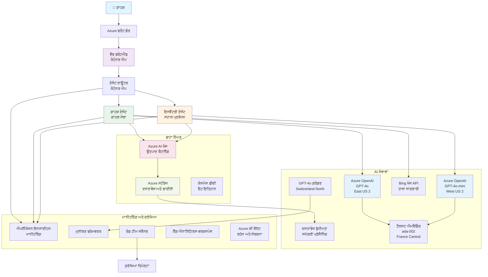

# ਮਲਟੀ-ਏਜੰਟ ਗਾਹਕ ਸਹਾਇਤਾ ਹੱਲ - ਰਿਟੇਲਰ ਸਨਰੀਓ

**ਅਧਿਆਇ 5: ਮਲਟੀ-ਏਜੰਟ AI ਹੱਲ**
- **📚 ਕੋਰਸ ਮੁੱਖ ਪੰਨਾ**: [AZD ਸ਼ੁਰੂਆਤੀ ਲਈ](../README.md)
- **📖 ਮੌਜੂਦਾ ਅਧਿਆਇ**: [ਅਧਿਆਇ 5: ਮਲਟੀ-ਏਜੰਟ AI ਹੱਲ](../README.md#-chapter-5-multi-agent-ai-solutions-advanced)
- **⬅️ ਪੂਰਵ ਸ਼ਰਤਾਂ**: [ਅਧਿਆਇ 2: AI-ਪਹਿਲਾ ਵਿਕਾਸ](../docs/ai-foundry/azure-ai-foundry-integration.md)
- **➡️ ਅਗਲਾ ਅਧਿਆਇ**: [ਅਧਿਆਇ 6: ਪੂਰਵ-ਤਾਇਨਾਤੀ ਵੈਧਤਾ](../docs/pre-deployment/capacity-planning.md)
- **🚀 ARM ਟੈਂਪਲੇਟਸ**: [ਤਾਇਨਾਤੀ ਪੈਕੇਜ](retail-multiagent-arm-template/README.md)

> **⚠️ ਆਰਕੀਟੈਕਚਰ ਗਾਈਡ - ਕੰਮ ਕਰਨ ਵਾਲਾ ਹੱਲ ਨਹੀਂ**  
> ਇਹ ਦਸਤਾਵੇਜ਼ **ਵਿਆਪਕ ਆਰਕੀਟੈਕਚਰ ਬਲੂਪ੍ਰਿੰਟ** ਪ੍ਰਦਾਨ ਕਰਦਾ ਹੈ ਜੋ ਮਲਟੀ-ਏਜੰਟ ਸਿਸਟਮ ਬਣਾਉਣ ਲਈ ਹੈ।  
> **ਕੀ ਮੌਜੂਦ ਹੈ:** ਇੰਫਰਾਸਟਰਕਚਰ ਤਾਇਨਾਤੀ ਲਈ ARM ਟੈਂਪਲੇਟ (Azure OpenAI, AI Search, Container Apps, ਆਦਿ)  
> **ਕੀ ਤੁਹਾਨੂੰ ਬਣਾਉਣਾ ਹੈ:** ਏਜੰਟ ਕੋਡ, ਰੂਟਿੰਗ ਲਾਜਿਕ, ਫਰੰਟਐਂਡ UI, ਡਾਟਾ ਪਾਈਪਲਾਈਨ (ਅਨੁਮਾਨਿਤ 80-120 ਘੰਟੇ)  
>  
> **ਇਸ ਨੂੰ ਇਸ ਤਰ੍ਹਾਂ ਵਰਤੋ:**
> - ✅ ਆਪਣੇ ਮਲਟੀ-ਏਜੰਟ ਪ੍ਰੋਜੈਕਟ ਲਈ ਆਰਕੀਟੈਕਚਰ ਰਿਫਰੈਂਸ
> - ✅ ਮਲਟੀ-ਏਜੰਟ ਡਿਜ਼ਾਈਨ ਪੈਟਰਨ ਲਈ ਸਿੱਖਣ ਗਾਈਡ
> - ✅ Azure ਸਰੋਤਾਂ ਨੂੰ ਤਾਇਨਾਤ ਕਰਨ ਲਈ ਇੰਫਰਾਸਟਰਕਚਰ ਟੈਂਪਲੇਟ
> - ❌ ਤਿਆਰ-ਤੋਂ-ਚਲਾਉਣ ਵਾਲਾ ਐਪਲੀਕੇਸ਼ਨ ਨਹੀਂ (ਕਾਫੀ ਵਿਕਾਸ ਦੀ ਲੋੜ ਹੈ)

## ਝਲਕ

**ਸਿੱਖਣ ਦਾ ਉਦੇਸ਼:** ਇੱਕ ਰਿਟੇਲਰ ਲਈ ਉੱਚ-ਪੱਧਰੀ AI ਯੋਗਤਾਵਾਂ ਵਾਲੇ ਪ੍ਰੋਡਕਸ਼ਨ-ਤਿਆਰ ਮਲਟੀ-ਏਜੰਟ ਗਾਹਕ ਸਹਾਇਤਾ ਚੈਟਬੋਟ ਬਣਾਉਣ ਲਈ ਆਰਕੀਟੈਕਚਰ, ਡਿਜ਼ਾਈਨ ਫੈਸਲੇ, ਅਤੇ ਅਮਲ ਪਹੁੰਚ ਨੂੰ ਸਮਝੋ।

**ਪੂਰਾ ਕਰਨ ਦਾ ਸਮਾਂ:** ਪੜ੍ਹਨਾ + ਸਮਝਣਾ (2-3 ਘੰਟੇ) | ਪੂਰੀ ਤਿਆਰੀ ਬਣਾਉਣਾ (80-120 ਘੰਟੇ)

**ਤੁਹਾਨੂੰ ਕੀ ਸਿੱਖਣ ਨੂੰ ਮਿਲੇਗਾ:**
- ਮਲਟੀ-ਏਜੰਟ ਆਰਕੀਟੈਕਚਰ ਪੈਟਰਨ ਅਤੇ ਡਿਜ਼ਾਈਨ ਸਿਧਾਂਤ
- ਮਲਟੀ-ਰੀਜਨ Azure OpenAI ਤਾਇਨਾਤੀ ਰਣਨੀਤੀਆਂ
- RAG (Retrieval-Augmented Generation) ਨਾਲ AI Search ਇੰਟੀਗ੍ਰੇਸ਼ਨ
- ਏਜੰਟ ਮੁਲਾਂਕਣ ਅਤੇ ਸੁਰੱਖਿਆ ਟੈਸਟਿੰਗ ਫਰੇਮਵਰਕ
- ਪ੍ਰੋਡਕਸ਼ਨ ਤਾਇਨਾਤੀ ਵਿਚਾਰ ਅਤੇ ਲਾਗਤ ਅਨੁਕੂਲਤਾ

## ਆਰਕੀਟੈਕਚਰ ਦੇ ਉਦੇਸ਼

**ਸ਼ਿਕਸ਼ਣ ਫੋਕਸ:** ਇਹ ਆਰਕੀਟੈਕਚਰ ਮਲਟੀ-ਏਜੰਟ ਸਿਸਟਮਾਂ ਲਈ ਉਦਯੋਗ ਪੈਟਰਨ ਦਿਖਾਉਂਦਾ ਹੈ।

### ਸਿਸਟਮ ਦੀਆਂ ਲੋੜਾਂ (ਤੁਹਾਡੇ ਅਮਲ ਲਈ)

ਪ੍ਰੋਡਕਸ਼ਨ ਗਾਹਕ ਸਹਾਇਤਾ ਹੱਲ ਲਈ ਲੋੜ ਹੈ:
- **ਵੱਖ-ਵੱਖ ਵਿਸ਼ੇਸ਼ ਏਜੰਟ** ਵੱਖ-ਵੱਖ ਗਾਹਕ ਦੀਆਂ ਲੋੜਾਂ ਲਈ (ਗਾਹਕ ਸੇਵਾ + ਸਟਾਕ ਪ੍ਰਬੰਧਨ)
- **ਮਲਟੀ-ਮਾਡਲ ਤਾਇਨਾਤੀ** ਸਹੀ ਸਮਰੱਥਾ ਯੋਜਨਾ ਨਾਲ (GPT-4o, GPT-4o-mini, embeddings ਵੱਖ-ਵੱਖ ਰੀਜਨਾਂ ਵਿੱਚ)
- **ਡਾਇਨਾਮਿਕ ਡਾਟਾ ਇੰਟੀਗ੍ਰੇਸ਼ਨ** AI Search ਅਤੇ ਫਾਈਲ ਅੱਪਲੋਡ ਨਾਲ (ਵੇਕਟਰ ਖੋਜ + ਦਸਤਾਵੇਜ਼ ਪ੍ਰਕਿਰਿਆ)
- **ਵਿਆਪਕ ਨਿਗਰਾਨੀ** ਅਤੇ ਮੁਲਾਂਕਣ ਯੋਗਤਾਵਾਂ (Application Insights + ਕਸਟਮ ਮੈਟ੍ਰਿਕਸ)
- **ਪ੍ਰੋਡਕਸ਼ਨ-ਗ੍ਰੇਡ ਸੁਰੱਖਿਆ** ਰੈਡ ਟੀਮਿੰਗ ਵੈਧਤਾ ਨਾਲ (ਨੁਕਸਾਨ ਸਕੈਨਿੰਗ + ਏਜੰਟ ਮੁਲਾਂਕਣ)

### ਇਹ ਗਾਈਡ ਕੀ ਪ੍ਰਦਾਨ ਕਰਦੀ ਹੈ

✅ **ਆਰਕੀਟੈਕਚਰ ਪੈਟਰਨ** - ਸਕੇਲਯੋਗ ਮਲਟੀ-ਏਜੰਟ ਸਿਸਟਮਾਂ ਲਈ ਸਾਬਤ ਡਿਜ਼ਾਈਨ  
✅ **ਇੰਫਰਾਸਟਰਕਚਰ ਟੈਂਪਲੇਟਸ** - ਸਾਰੇ Azure ਸੇਵਾਵਾਂ ਨੂੰ ਤਾਇਨਾਤ ਕਰਨ ਵਾਲੇ ARM ਟੈਂਪਲੇਟ  
✅ **ਕੋਡ ਉਦਾਹਰਨ** - ਮੁੱਖ ਹਿੱਸਿਆਂ ਲਈ ਰਿਫਰੈਂਸ ਅਮਲ  
✅ **ਕੰਫਿਗਰੇਸ਼ਨ ਗਾਈਡ** - ਕਦਮ-ਦਰ-ਕਦਮ ਸੈਟਅਪ ਹਦਾਇਤਾਂ  
✅ **ਸਰਵੋਤਮ ਅਭਿਆਸ** - ਸੁਰੱਖਿਆ, ਨਿਗਰਾਨੀ, ਲਾਗਤ ਅਨੁਕੂਲਤਾ ਰਣਨੀਤੀਆਂ  

❌ **ਸ਼ਾਮਲ ਨਹੀਂ** - ਪੂਰੀ ਤਿਆਰ ਕੰਮ ਕਰਨ ਵਾਲੀ ਐਪਲੀਕੇਸ਼ਨ (ਵਿਕਾਸ ਦੇ ਯਤਨ ਦੀ ਲੋੜ ਹੈ)

## 🗺️ ਅਮਲ ਰੋਡਮੈਪ

### ਚਰਨ 1: ਆਰਕੀਟੈਕਚਰ ਦਾ ਅਧਿਐਨ ਕਰੋ (2-3 ਘੰਟੇ) - ਇੱਥੋਂ ਸ਼ੁਰੂ ਕਰੋ

**ਉਦੇਸ਼:** ਸਿਸਟਮ ਡਿਜ਼ਾਈਨ ਅਤੇ ਹਿੱਸਿਆਂ ਦੀ ਪਰਸਪਰ ਕ੍ਰਿਆ ਨੂੰ ਸਮਝੋ

- [ ] ਇਸ ਪੂਰੇ ਦਸਤਾਵੇਜ਼ ਨੂੰ ਪੜ੍ਹੋ
- [ ] ਆਰਕੀਟੈਕਚਰ ਡਾਇਗ੍ਰਾਮ ਅਤੇ ਹਿੱਸਿਆਂ ਦੇ ਸੰਬੰਧਾਂ ਦੀ ਸਮੀਖਾ ਕਰੋ
- [ ] ਮਲਟੀ-ਏਜੰਟ ਪੈਟਰਨ ਅਤੇ ਡਿਜ਼ਾਈਨ ਫੈਸਲਿਆਂ ਨੂੰ ਸਮਝੋ
- [ ] ਏਜੰਟ ਟੂਲ ਅਤੇ ਰੂਟਿੰਗ ਲਈ ਕੋਡ ਉਦਾਹਰਨਾਂ ਦਾ ਅਧਿਐਨ ਕਰੋ
- [ ] ਲਾਗਤ ਅਨੁਮਾਨ ਅਤੇ ਸਮਰੱਥਾ ਯੋਜਨਾ ਦੀ ਸਿਫਾਰਸ਼ਾਂ ਦੀ ਸਮੀਖਾ ਕਰੋ

**ਨਤੀਜਾ:** ਤੁਹਾਨੂੰ ਕੀ ਬਣਾਉਣਾ ਹੈ ਇਸ ਦੀ ਸਪਸ਼ਟ ਸਮਝ

### ਚਰਨ 2: ਇੰਫਰਾਸਟਰਕਚਰ ਤਾਇਨਾਤ ਕਰੋ (30-45 ਮਿੰਟ)

**ਉਦੇਸ਼:** ARM ਟੈਂਪਲੇਟ ਦੀ ਵਰਤੋਂ ਕਰਕੇ Azure ਸਰੋਤਾਂ ਨੂੰ ਪ੍ਰੋਵੀਜ਼ਨ ਕਰੋ

```bash
cd retail-multiagent-arm-template
./deploy.sh -g myResourceGroup -m standard
```

**ਕੀ ਤਾਇਨਾਤ ਹੁੰਦਾ ਹੈ:**
- ✅ Azure OpenAI (3 ਰੀਜਨ: GPT-4o, GPT-4o-mini, embeddings)
- ✅ AI Search ਸੇਵਾ (ਖਾਲੀ, ਇੰਡੈਕਸ ਕਨਫਿਗਰੇਸ਼ਨ ਦੀ ਲੋੜ ਹੈ)
- ✅ Container Apps ਵਾਤਾਵਰਣ (placeholder images)
- ✅ Storage accounts, Cosmos DB, Key Vault
- ✅ Application Insights ਨਿਗਰਾਨੀ

**ਕੀ ਗੁੰਮ ਹੈ:**
- ❌ ਏਜੰਟ ਅਮਲ ਕੋਡ
- ❌ ਰੂਟਿੰਗ ਲਾਜਿਕ
- ❌ ਫਰੰਟਐਂਡ UI
- ❌ Search ਇੰਡੈਕਸ ਸਕੀਮਾ
- ❌ ਡਾਟਾ ਪਾਈਪਲਾਈਨ

### ਚਰਨ 3: ਐਪਲੀਕੇਸ਼ਨ ਬਣਾਓ (80-120 ਘੰਟੇ)

**ਉਦੇਸ਼:** ਇਸ ਆਰਕੀਟੈਕਚਰ ਦੇ ਅਧਾਰ 'ਤੇ ਮਲਟੀ-ਏਜੰਟ ਸਿਸਟਮ ਨੂੰ ਅਮਲ ਵਿੱਚ ਲਿਆਓ

1. **ਏਜੰਟ ਅਮਲ** (30-40 ਘੰਟੇ)
   - ਬੇਸ ਏਜੰਟ ਕਲਾਸ ਅਤੇ ਇੰਟਰਫੇਸ
   - GPT-4o ਨਾਲ ਗਾਹਕ ਸੇਵਾ ਏਜੰਟ
   - GPT-4o-mini ਨਾਲ ਸਟਾਕ ਏਜੰਟ
   - ਟੂਲ ਇੰਟੀਗ੍ਰੇਸ਼ਨ (AI Search, Bing, ਫਾਈਲ ਪ੍ਰਕਿਰਿਆ)

2. **ਰੂਟਿੰਗ ਸੇਵਾ** (12-16 ਘੰਟੇ)
   - ਬੇਨਤੀ ਵਰਗੀਕਰਨ ਲਾਜਿਕ
   - ਏਜੰਟ ਚੋਣ ਅਤੇ ਆਰਕੈਸਟ੍ਰੇਸ਼ਨ
   - FastAPI/Express ਬੈਕਐਂਡ

3. **ਫਰੰਟਐਂਡ ਵਿਕਾਸ** (20-30 ਘੰਟੇ)
   - ਚੈਟ ਇੰਟਰਫੇਸ UI
   - ਫਾਈਲ ਅੱਪਲੋਡ ਯੋਗਤਾ
   - ਜਵਾਬ ਰੈਂਡਰਿੰਗ

4. **ਡਾਟਾ ਪਾਈਪਲਾਈਨ** (8-12 ਘੰਟੇ)
   - AI Search ਇੰਡੈਕਸ ਬਣਾਉਣਾ
   - Document Intelligence ਨਾਲ ਦਸਤਾਵੇਜ਼ ਪ੍ਰਕਿਰਿਆ
   - Embedding ਜਨਰੇਸ਼ਨ ਅਤੇ ਇੰਡੈਕਸਿੰਗ

5. **ਨਿਗਰਾਨੀ ਅਤੇ ਮੁਲਾਂਕਣ** (10-15 ਘੰਟੇ)
   - ਕਸਟਮ ਟੈਲੀਮੈਟਰੀ ਅਮਲ
   - ਏਜੰਟ ਮੁਲਾਂਕਣ ਫਰੇਮਵਰਕ
   - ਰੈਡ ਟੀਮ ਸੁਰੱਖਿਆ ਸਕੈਨਰ

### ਚਰਨ 4: ਤਾਇਨਾਤ ਕਰੋ ਅਤੇ ਟੈਸਟ ਕਰੋ (8-12 ਘੰਟੇ)

- ਸਾਰੇ ਸੇਵਾਵਾਂ ਲਈ Docker images ਬਣਾਓ
- Azure Container Registry ਵਿੱਚ ਪੁਸ਼ ਕਰੋ
- Container Apps ਨੂੰ ਅਸਲੀ images ਨਾਲ ਅਪਡੇਟ ਕਰੋ
- ਵਾਤਾਵਰਣ ਵੈਰੀਏਬਲ ਅਤੇ ਰਾਜ਼ ਕਨਫਿਗਰ ਕਰੋ
- ਮੁਲਾਂਕਣ ਟੈਸਟ ਸੂਟ ਚਲਾਓ
- ਸੁਰੱਖਿਆ ਸਕੈਨਿੰਗ ਕਰੋ

**ਕੁੱਲ ਅਨੁਮਾਨਿਤ ਯਤਨ:** ਅਨੁਭਵੀ ਡਿਵੈਲਪਰਾਂ ਲਈ 80-120 ਘੰਟੇ

## ਹੱਲ ਆਰਕੀਟੈਕਚਰ

### ਆਰਕੀਟੈਕਚਰ ਡਾਇਗ੍ਰਾਮ


### ਹਿੱਸਾ ਝਲਕ

| ਹਿੱਸਾ | ਉਦੇਸ਼ | ਤਕਨਾਲੋਜੀ | ਰੀਜਨ |
|-----------|---------|------------|---------|
| **ਵੈੱਬ ਫਰੰਟਐਂਡ** | ਗਾਹਕ ਸੰਚਾਰ ਲਈ ਯੂਜ਼ਰ ਇੰਟਰਫੇਸ | Container Apps | ਪ੍ਰਾਇਮਰੀ ਰੀਜਨ |
| **ਏਜੰਟ ਰੂਟਰ** | ਬੇਨਤੀਆਂ ਨੂੰ ਸਹੀ ਏਜੰਟ ਵੱਲ ਰੂਟ ਕਰਦਾ ਹੈ | Container Apps | ਪ੍ਰਾਇਮਰੀ ਰੀਜਨ |
| **ਗਾਹਕ ਏਜੰਟ** | ਗਾਹਕ ਸੇਵਾ ਸਬੰਧੀ ਪੁੱਛਗਿੱਛਾਂ ਨੂੰ ਸੰਭਾਲਦਾ ਹੈ | Container Apps + GPT-4o | ਪ੍ਰਾਇਮਰੀ ਰੀਜਨ |
| **ਸਟਾਕ ਏਜੰਟ** | ਸਟਾਕ ਅਤੇ ਪੂਰੀ ਕਰਨ ਦੀ ਪ੍ਰਬੰਧਨ ਕਰਦਾ ਹੈ | Container Apps + GPT-4o-mini | ਪ੍ਰਾਇਮਰੀ ਰੀਜਨ |
| **Azure OpenAI** | ਏਜੰਟਾਂ ਲਈ LLM inference | Cognitive Services | ਮਲਟੀ-ਰੀਜਨ |
| **AI Search** | ਵੇਕਟਰ ਖੋਜ ਅਤੇ RAG | AI Search Service | ਪ੍ਰਾਇਮਰੀ ਰੀਜਨ |
| **Storage Account** | ਫਾਈਲ ਅੱਪਲੋਡ ਅਤੇ ਦਸਤਾਵੇਜ਼ | Blob Storage | ਪ੍ਰਾਇਮਰੀ ਰੀਜਨ |
| **Application Insights** | ਨਿਗਰਾਨੀ ਅਤੇ ਟੈਲੀਮੈਟਰੀ | Monitor | ਪ੍ਰਾਇਮਰੀ ਰੀਜਨ |
| **Grader Model** | ਏਜੰਟ ਮੁਲਾਂਕਣ ਸਿਸਟਮ | Azure OpenAI | ਸੈਕੰਡਰੀ ਰੀਜਨ |

## 📁 ਪ੍ਰੋਜੈਕਟ ਸਟ੍ਰਕਚਰ

> **📍 ਸਥਿਤੀ ਲੈਜੰਡ:**  
> ✅ = ਰਿਪੋਜ਼ਟਰੀ ਵਿੱਚ ਮੌਜੂਦ  
> 📝 = ਰਿਫਰੈਂਸ ਅਮਲ (ਇਸ ਦਸਤਾਵੇਜ਼ ਵਿੱਚ ਕੋਡ ਉਦਾਹਰਨ)  
> 🔨 = ਤੁਹਾਨੂੰ ਇਹ ਬਣਾਉਣਾ ਹੈ

```
retail-multiagent-solution/              🔨 Your project directory
├── .azure/                              🔨 Azure environment configs
│   ├── config.json                      🔨 Global config
│   └── env/
│       ├── .env.development             🔨 Dev environment
│       ├── .env.staging                 🔨 Staging environment
│       └── .env.production              🔨 Production environment
│
├── azure.yaml                          🔨 AZD main configuration
├── azure.parameters.json               🔨 Deployment parameters
├── README.md                           🔨 Solution documentation
│
├── infra/                              🔨 Infrastructure as Code (you create)
│   ├── main.bicep                      🔨 Main Bicep template (optional, ARM exists)
│   ├── main.parameters.json            🔨 Parameters file
│   ├── modules/                        📝 Bicep modules (reference examples below)
│   │   ├── ai-services.bicep           📝 Azure OpenAI deployments
│   │   ├── search.bicep                📝 AI Search configuration
│   │   ├── storage.bicep               📝 Storage accounts
│   │   ├── container-apps.bicep        📝 Container Apps environment
│   │   ├── monitoring.bicep            📝 Application Insights
│   │   ├── security.bicep              📝 Key Vault and RBAC
│   │   └── networking.bicep            📝 Virtual networks and DNS
│   ├── arm-template/                   ✅ ARM template version (EXISTS)
│   │   ├── azuredeploy.json            ✅ ARM main template (retail-multiagent-arm-template/)
│   │   └── azuredeploy.parameters.json ✅ ARM parameters
│   └── scripts/                        ✅/🔨 Deployment scripts
│       ├── deploy.sh                   ✅ Main deployment script (EXISTS)
│       ├── setup-data.sh               🔨 Data setup script (you create)
│       └── configure-rbac.sh           🔨 RBAC configuration (you create)
│
├── src/                                🔨 Application source code (YOU BUILD THIS)
│   ├── agents/                         📝 Agent implementations (examples below)
│   │   ├── base/                       🔨 Base agent classes
│   │   │   ├── agent.py                🔨 Abstract agent class
│   │   │   └── tools.py                🔨 Tool interfaces
│   │   ├── customer/                   🔨 Customer service agent
│   │   │   ├── agent.py                📝 Customer agent implementation (see below)
│   │   │   ├── prompts.py              🔨 System prompts
│   │   │   └── tools/                  🔨 Agent-specific tools
│   │   │       ├── search_tool.py      📝 AI Search integration (example below)
│   │   │       ├── bing_tool.py        📝 Bing Search integration (example below)
│   │   │       └── file_tool.py        🔨 File processing tool
│   │   └── inventory/                  🔨 Inventory management agent
│   │       ├── agent.py                🔨 Inventory agent implementation
│   │       ├── prompts.py              🔨 System prompts
│   │       └── tools/                  🔨 Agent-specific tools
│   │           ├── inventory_search.py 🔨 Inventory search tool
│   │           └── database_tool.py    🔨 Database query tool
│   │
│   ├── router/                         🔨 Agent routing service (you build)
│   │   ├── main.py                     🔨 FastAPI router application
│   │   ├── routing_logic.py            🔨 Request routing logic
│   │   └── middleware.py               🔨 Authentication & logging
│   │
│   ├── frontend/                       🔨 Web user interface (you build)
│   │   ├── Dockerfile                  🔨 Container configuration
│   │   ├── package.json                🔨 Node.js dependencies
│   │   ├── src/                        🔨 React/Vue source code
│   │   │   ├── components/             🔨 UI components
│   │   │   ├── pages/                  🔨 Application pages
│   │   │   ├── services/               🔨 API services
│   │   │   └── styles/                 🔨 CSS and themes
│   │   └── public/                     🔨 Static assets
│   │
│   ├── shared/                         🔨 Shared utilities (you build)
│   │   ├── config.py                   🔨 Configuration management
│   │   ├── telemetry.py                📝 Telemetry utilities (example below)
│   │   ├── security.py                 🔨 Security utilities
│   │   └── models.py                   🔨 Data models
│   │
│   └── evaluation/                     🔨 Evaluation and testing (you build)
│       ├── evaluator.py                📝 Agent evaluator (example below)
│       ├── red_team_scanner.py         📝 Security scanner (example below)
│       ├── test_cases.json             📝 Evaluation test cases (example below)
│       └── reports/                    🔨 Generated reports
│
├── data/                               🔨 Data and configuration (you create)
│   ├── search-schema.json              📝 AI Search index schema (example below)
│   ├── initial-docs/                   🔨 Initial document corpus
│   │   ├── product-manuals/            🔨 Product documentation (your data)
│   │   ├── policies/                   🔨 Company policies (your data)
│   │   └── faqs/                       🔨 Frequently asked questions (your data)
│   ├── fine-tuning/                    🔨 Fine-tuning datasets (optional)
│   │   ├── training.jsonl              🔨 Training data
│   │   └── validation.jsonl            🔨 Validation data
│   └── evaluation/                     🔨 Evaluation datasets
│       ├── test-conversations.json     📝 Test conversation data (example below)
│       └── ground-truth.json           🔨 Expected responses
│
├── scripts/                            # Utility scripts
│   ├── setup/                          # Setup scripts
│   │   ├── bootstrap.sh                # Initial environment setup
│   │   ├── install-dependencies.sh     # Install required tools
│   │   └── configure-env.sh            # Environment configuration
│   ├── data-management/                # Data management scripts
│   │   ├── upload-documents.py         # Document upload utility
│   │   ├── create-search-index.py      # Search index creation
│   │   └── sync-data.py                # Data synchronization
│   ├── deployment/                     # Deployment automation
│   │   ├── deploy-agents.sh            # Agent deployment
│   │   ├── update-frontend.sh          # Frontend updates
│   │   └── rollback.sh                 # Rollback procedures
│   └── monitoring/                     # Monitoring scripts
│       ├── health-check.py             # Health monitoring
│       ├── performance-test.py         # Performance testing
│       └── security-scan.py            # Security scanning
│
├── tests/                              # Test suites
│   ├── unit/                           # Unit tests
│   │   ├── test_agents.py              # Agent unit tests
│   │   ├── test_router.py              # Router unit tests
│   │   └── test_tools.py               # Tool unit tests
│   ├── integration/                    # Integration tests
│   │   ├── test_end_to_end.py          # E2E test scenarios
│   │   └── test_api.py                 # API integration tests
│   └── load/                           # Load testing
│       ├── load_test_config.yaml       # Load test configuration
│       └── scenarios/                  # Load test scenarios
│
├── docs/                               # Documentation
│   ├── architecture.md                 # Architecture documentation
│   ├── deployment-guide.md             # Deployment instructions
│   ├── agent-configuration.md          # Agent setup guide
│   ├── troubleshooting.md              # Troubleshooting guide
│   └── api/                            # API documentation
│       ├── agent-api.md                # Agent API reference
│       └── router-api.md               # Router API reference
│
├── hooks/                              # AZD lifecycle hooks
│   ├── preprovision.sh                 # Pre-provisioning tasks
│   ├── postprovision.sh                # Post-provisioning setup
│   ├── prepackage.sh                   # Pre-packaging tasks
│   └── postdeploy.sh                   # Post-deployment validation
│
└── .github/                            # GitHub workflows
    └── workflows/
        ├── ci-cd.yml                   # CI/CD pipeline
        ├── security-scan.yml           # Security scanning
        └── performance-test.yml        # Performance testing
```

---

## 🚀 ਤੁਰੰਤ ਸ਼ੁਰੂਆਤ: ਤੁਸੀਂ ਹੁਣ ਕੀ ਕਰ ਸਕਦੇ ਹੋ

### ਵਿਕਲਪ 1: ਸਿਰਫ ਇੰਫਰਾਸਟਰਕਚਰ ਤਾਇਨਾਤ ਕਰੋ (30 ਮਿੰਟ)

**ਤੁਹਾਨੂੰ ਕੀ ਮਿਲਦਾ ਹੈ:** ਸਾਰੇ Azure ਸਰੋਤ ਤਾਇਨਾਤ ਕੀਤੇ ਅਤੇ ਵਿਕਾਸ ਲਈ ਤਿਆਰ

```bash
# ਰਿਪੋਜ਼ਟਰੀ ਕਲੋਨ ਕਰੋ
git clone https://github.com/microsoft/AZD-for-beginners.git
cd AZD-for-beginners/examples/retail-multiagent-arm-template

# ਢਾਂਚੇ ਨੂੰ ਤੈਨਾਤ ਕਰੋ
./deploy.sh -g myResourceGroup -m standard

# ਤੈਨਾਤੀ ਦੀ ਪੁਸ਼ਟੀ ਕਰੋ
az resource list --resource-group myResourceGroup --output table
```

**ਅਨੁਮਾਨਿਤ ਨਤੀਜਾ:**
- ✅ Azure OpenAI ਸੇਵਾਵਾਂ ਤਾਇਨਾਤ ਕੀਤੀਆਂ (3 ਰੀਜਨ)
- ✅ AI Search ਸੇਵਾ ਬਣਾਈ (ਖਾਲੀ)
- ✅ Container Apps ਵਾਤਾਵਰਣ ਤਿਆਰ
- ✅ Storage, Cosmos DB, Key Vault ਕਨਫਿਗਰ ਕੀਤਾ
- ❌ ਕੋਈ ਕੰਮ ਕਰਨ ਵਾਲੇ ਏਜੰਟ ਨਹੀਂ (ਸਿਰਫ ਇੰਫਰਾਸਟਰਕਚਰ)

### ਵਿਕਲਪ 2: ਆਰਕੀਟੈਕਚਰ ਦਾ ਅਧਿਐਨ ਕਰੋ (2-3 ਘੰਟੇ)

**ਤੁਹਾਨੂੰ ਕੀ ਮਿਲਦਾ ਹੈ:** ਮਲਟੀ-ਏਜੰਟ ਪੈਟਰਨ ਦੀ ਗਹਿਰਾਈ ਨਾਲ ਸਮਝ

1. ਇਸ ਪੂਰੇ ਦਸਤਾਵੇਜ਼ ਨੂੰ ਪੜ੍ਹੋ
2. ਹਰ ਹਿੱਸੇ ਲਈ ਕੋਡ ਉਦਾਹਰਨਾਂ ਦੀ ਸਮੀਖਾ ਕਰੋ
3. ਡਿਜ਼ਾਈਨ ਫੈਸਲਿਆਂ ਅਤੇ ਵਪਾਰ-ਬਦਲਾਵਾਂ ਨੂੰ ਸਮਝੋ
4. ਲਾਗਤ ਅਨੁਕੂਲਤਾ ਰਣਨੀਤੀਆਂ ਦਾ ਅਧਿਐਨ ਕਰੋ
5. ਆਪਣੇ ਅਮਲ ਪਹੁੰਚ ਦੀ ਯੋਜਨਾ ਬਣਾਓ

**ਅਨੁਮਾਨਿਤ ਨਤੀਜਾ:**
- ✅ ਸਿਸਟਮ ਆਰਕੀਟੈਕਚਰ ਦਾ ਸਪਸ਼ਟ ਮਾਨਸਿਕ ਮਾਡਲ
- ✅ ਲੋੜੀਂਦੇ ਹਿੱਸਿਆਂ ਦੀ ਸਮਝ
- ✅ ਹਕੀਕਤੀ ਯਤਨ ਅਨੁਮਾਨ
- ✅ ਅਮਲ ਯੋਜਨਾ

### ਵਿਕਲਪ 3: ਪੂਰੀ ਸਿਸਟਮ ਬਣਾਓ (80-120 ਘੰਟੇ)

**ਤੁਹਾਨੂੰ ਕੀ ਮਿਲਦਾ ਹੈ:** ਪ੍ਰੋਡਕਸ਼ਨ-ਤਿਆਰ ਮਲਟੀ-ਏਜੰਟ ਹੱਲ

1. **ਚਰਨ 1:** ਇੰਫਰਾਸਟਰਕਚਰ ਤਾਇਨਾਤ ਕਰੋ (ਉਪਰ ਕੀਤਾ)
2. **ਚਰਨ 2:** ਹੇਠਾਂ ਦਿੱਤੇ ਕੋਡ ਉਦਾਹਰਨਾਂ ਦੀ ਵਰਤੋਂ ਕਰਕੇ ਏਜੰਟਾਂ ਨੂੰ ਅਮਲ ਵਿੱਚ ਲਿਆਓ (30-40 ਘੰਟੇ)
3. **ਚਰਨ 3:** ਰੂਟਿੰਗ ਸੇਵਾ ਬਣਾਓ (12-16 ਘੰਟੇ)
4. **ਚਰਨ 4:** ਫਰੰਟਐਂਡ UI ਬਣਾਓ (20-30 ਘੰਟੇ)
5. **ਚਰਨ 5:** ਡਾਟਾ ਪਾਈਪਲਾਈਨ ਕਨਫਿਗਰ ਕਰੋ (8-12 ਘੰਟੇ)
6. **ਚਰਨ 6:** ਨਿਗਰਾਨੀ ਅਤੇ ਮੁਲਾਂਕਣ ਸ਼ਾਮਲ ਕਰੋ (10-15 ਘੰਟੇ)

**ਅਨੁਮਾਨਿਤ ਨਤੀਜਾ:**
- ✅ ਪੂਰੀ ਤਰ੍ਹਾਂ ਕੰਮ ਕਰਨ ਵਾਲਾ ਮਲਟੀ-ਏਜੰਟ ਸਿਸਟਮ
- ✅ ਪ੍ਰੋਡਕਸ਼ਨ-ਗ੍ਰੇਡ ਨਿਗਰਾਨੀ
- ✅ ਸੁਰੱਖਿਆ ਵੈਧਤਾ
- ✅ ਲਾਗਤ-ਅਨੁਕੂਲ ਤਾਇਨਾਤੀ

---

## 📚 ਆਰਕੀਟੈਕਚਰ ਰਿਫਰੈਂਸ ਅਤੇ ਅਮਲ ਗਾਈਡ

ਹੇਠਾਂ ਦਿੱਤੇ ਭਾਗ ਵਿਸਤ੍ਰਿਤ ਆਰਕੀਟੈਕਚਰ ਪੈਟਰਨ, ਕਨਫਿਗਰੇਸ਼ਨ ਉਦਾਹਰਨਾਂ, ਅਤੇ ਰਿਫਰੈਂਸ ਕੋਡ ਪ੍ਰਦਾਨ ਕਰਦੇ ਹਨ ਜੋ ਤੁਹਾਡੇ ਅਮਲ ਨੂੰ ਮਦਦ ਕਰਨ ਲਈ ਹਨ।

## ਸ਼ੁਰੂਆਤੀ ਕਨਫਿਗਰੇਸ਼ਨ ਲੋੜਾਂ

### 1. ਵੱਖ-ਵੱਖ ਏਜੰਟ ਅਤੇ ਕਨਫਿਗਰੇਸ਼ਨ

**ਉਦੇਸ਼**: 2 ਵਿਸ਼ੇਸ਼ ਏਜੰਟ ਤਾਇਨਾਤ ਕਰੋ - "ਗਾਹਕ ਏਜੰਟ" (ਗਾਹਕ ਸੇਵਾ) ਅਤੇ "ਸਟਾਕ" (ਸਟਾਕ ਪ੍ਰਬੰਧਨ)

> **📝 ਨੋਟ:** ਹੇਠਾਂ ਦਿੱਤੇ azure.yaml ਅਤੇ Bicep ਕਨਫਿਗਰੇਸ਼ਨ **ਰਿਫਰੈਂਸ ਉਦਾਹਰਨ** ਹਨ ਜੋ ਮਲਟੀ-ਏਜੰਟ ਤਾਇਨਾਤੀ ਨੂੰ ਕਿਵੇਂ ਬਣਾਉਣਾ ਹੈ ਦਿਖਾਉਂਦੇ ਹਨ। ਤੁਹਾਨੂੰ ਇਹ
## ✅ ਤਿਆਰ-ਤਕ ਤਿਆਰ ARM ਟੈਂਪਲੇਟ

> **✨ ਇਹ ਵਾਸਤਵ ਵਿੱਚ ਮੌਜੂਦ ਹੈ ਅਤੇ ਕੰਮ ਕਰਦਾ ਹੈ!**  
> ਉਪਰੋਕਤ ਧਾਰਣਾਤਮਕ ਕੋਡ ਉਦਾਹਰਣਾਂ ਦੇ ਵਿਰੁੱਧ, ARM ਟੈਂਪਲੇਟ ਇਸ ਰਿਪੋਜ਼ਟਰੀ ਵਿੱਚ ਸ਼ਾਮਲ ਇੱਕ **ਅਸਲੀ, ਕੰਮ ਕਰਨ ਵਾਲਾ ਇੰਫਰਾਸਟਰਕਚਰ ਡਿਪਲੌਇਮੈਂਟ** ਹੈ।

### ਇਹ ਟੈਂਪਲੇਟ ਵਾਸਤਵ ਵਿੱਚ ਕੀ ਕਰਦਾ ਹੈ

[`retail-multiagent-arm-template/`](../../../examples/retail-multiagent-arm-template) ਵਿੱਚ ARM ਟੈਂਪਲੇਟ **ਸਾਰੇ Azure ਇੰਫਰਾਸਟਰਕਚਰ** ਪ੍ਰਦਾਨ ਕਰਦਾ ਹੈ ਜੋ ਮਲਟੀ-ਏਜੰਟ ਸਿਸਟਮ ਲਈ ਲੋੜੀਂਦਾ ਹੈ। ਇਹ **ਇਕਮਾਤਰ ਤਿਆਰ-ਤਕ ਤਿਆਰ ਹਿੱਸਾ** ਹੈ - ਬਾਕੀ ਸਭ ਕੁਝ ਵਿਕਾਸ ਦੀ ਲੋੜ ਹੈ।

### ARM ਟੈਂਪਲੇਟ ਵਿੱਚ ਕੀ ਸ਼ਾਮਲ ਹੈ

[`retail-multiagent-arm-template/`](../../../examples/retail-multiagent-arm-template) ਵਿੱਚ ਸਥਿਤ ARM ਟੈਂਪਲੇਟ ਵਿੱਚ ਸ਼ਾਮਲ ਹੈ:

#### **ਪੂਰਾ ਇੰਫਰਾਸਟਰਕਚਰ**
- ✅ **ਮਲਟੀ-ਰੀਜਨ Azure OpenAI** ਡਿਪਲੌਇਮੈਂਟ (GPT-4o, GPT-4o-mini, embeddings, grader)
- ✅ **Azure AI Search** ਵੈਕਟਰ ਖੋਜ ਸਮਰੱਥਾ ਨਾਲ
- ✅ **Azure Storage** ਦਸਤਾਵੇਜ਼ ਅਤੇ ਅਪਲੋਡ ਕੰਟੇਨਰਾਂ ਨਾਲ
- ✅ **Container Apps Environment** ਆਟੋ-ਸਕੇਲਿੰਗ ਨਾਲ
- ✅ **Agent Router & Frontend** ਕੰਟੇਨਰ ਐਪਸ
- ✅ **Cosmos DB** ਚੈਟ ਇਤਿਹਾਸ ਸਥਿਰਤਾ ਲਈ
- ✅ **Application Insights** ਵਿਸਤ੍ਰਿਤ ਮਾਨੀਟਰਿੰਗ ਲਈ
- ✅ **Key Vault** ਸੁਰੱਖਿਅਤ ਰਾਜ਼ ਪ੍ਰਬੰਧਨ ਲਈ
- ✅ **Document Intelligence** ਫਾਈਲ ਪ੍ਰੋਸੈਸਿੰਗ ਲਈ
- ✅ **Bing Search API** ਰੀਅਲ-ਟਾਈਮ ਜਾਣਕਾਰੀ ਲਈ

#### **ਡਿਪਲੌਇਮੈਂਟ ਮੋਡ**
| ਮੋਡ | ਵਰਤੋਂ ਦਾ ਕੇਸ | ਸਰੋਤ | ਅਨੁਮਾਨਿਤ ਲਾਗਤ/ਮਹੀਨਾ |
|------|----------|-----------|---------------------|
| **ਮਿਨੀਮਲ** | ਵਿਕਾਸ, ਟੈਸਟਿੰਗ | ਬੇਸਿਕ SKUs, ਸਿੰਗਲ ਰੀਜਨ | $100-370 |
| **ਸਟੈਂਡਰਡ** | ਪ੍ਰੋਡਕਸ਼ਨ, ਮੋਡਰੇਟ ਸਕੇਲ | ਸਟੈਂਡਰਡ SKUs, ਮਲਟੀ-ਰੀਜਨ | $420-1,450 |
| **ਪ੍ਰੀਮੀਅਮ** | ਐਨਟਰਪ੍ਰਾਈਜ਼, ਹਾਈ ਸਕੇਲ | ਪ੍ਰੀਮੀਅਮ SKUs, HA ਸੈਟਅਪ | $1,150-3,500 |

### 🎯 ਤੇਜ਼ ਡਿਪਲੌਇਮੈਂਟ ਵਿਕਲਪ

#### ਵਿਕਲਪ 1: ਇੱਕ-ਕਲਿੱਕ Azure ਡਿਪਲੌਇਮੈਂਟ

[](https://portal.azure.com/#create/Microsoft.Template/uri/https%3A%2F%2Fraw.githubusercontent.com%2Fmicrosoft%2Fazd-for-beginners%2Fmain%2Fexamples%2Fretail-multiagent-arm-template%2Fazuredeploy.json)

#### ਵਿਕਲਪ 2: Azure CLI ਡਿਪਲੌਇਮੈਂਟ

```bash
# ਰਿਪੋਜ਼ਿਟਰੀ ਕਲੋਨ ਕਰੋ
git clone https://github.com/microsoft/azd-for-beginners.git
cd azd-for-beginners/examples/retail-multiagent-arm-template

# ਡਿਪਲੋਇਮੈਂਟ ਸਕ੍ਰਿਪਟ ਨੂੰ ਚਲਾਉਣਯੋਗ ਬਣਾਓ
chmod +x deploy.sh

# ਮੂਲ ਸੈਟਿੰਗਾਂ ਨਾਲ ਡਿਪਲੋਇ ਕਰੋ (ਸਟੈਂਡਰਡ ਮੋਡ)
./deploy.sh -g myResourceGroup

# ਪ੍ਰੋਡਕਸ਼ਨ ਲਈ ਪ੍ਰੀਮੀਅਮ ਫੀਚਰਾਂ ਨਾਲ ਡਿਪਲੋਇ ਕਰੋ
./deploy.sh -g myProdRG -e prod -m premium -l eastus2

# ਡਿਵੈਲਪਮੈਂਟ ਲਈ ਘੱਟੋ-ਘੱਟ ਵਰਜਨ ਡਿਪਲੋਇ ਕਰੋ
./deploy.sh -g myDevRG -e dev -m minimal --no-multi-region
```

#### ਵਿਕਲਪ 3: ਸਿੱਧਾ ARM ਟੈਂਪਲੇਟ ਡਿਪਲੌਇਮੈਂਟ

```bash
# ਰਿਸੋਰਸ ਗਰੁੱਪ ਬਣਾਓ
az group create --name myResourceGroup --location eastus2

# ਟੈਂਪਲੇਟ ਸਿੱਧੇ ਤੌਰ 'ਤੇ ਡਿਪਲੌਇ ਕਰੋ
az deployment group create \
  --resource-group myResourceGroup \
  --template-file azuredeploy.json \
  --parameters azuredeploy.parameters.json \
  --parameters projectName=retail environmentName=prod
```

### ਟੈਂਪਲੇਟ ਆਉਟਪੁੱਟ

ਸਫਲ ਡਿਪਲੌਇਮੈਂਟ ਤੋਂ ਬਾਅਦ, ਤੁਹਾਨੂੰ ਪ੍ਰਾਪਤ ਹੋਵੇਗਾ:

```json
{
  "frontendUrl": "https://retail-frontend-abc123.azurecontainerapps.io",
  "routerUrl": "https://retail-router-abc123.azurecontainerapps.io",
  "openAiEndpointPrimary": "https://retail-openai-primary-abc123.openai.azure.com/",
  "searchServiceEndpoint": "https://retail-search-abc123.search.windows.net",
  "storageAccountName": "retailstorage123abc",
  "keyVaultName": "retail-kv-abc123",
  "applicationInsightsName": "retail-ai-abc123"
}
```

### 🔧 ਡਿਪਲੌਇਮੈਂਟ ਤੋਂ ਬਾਅਦ ਕਨਫਿਗਰੇਸ਼ਨ

ARM ਟੈਂਪਲੇਟ ਇੰਫਰਾਸਟਰਕਚਰ ਪ੍ਰੋਵਿਜ਼ਨਿੰਗ ਨੂੰ ਸੰਭਾਲਦਾ ਹੈ। ਡਿਪਲੌਇਮੈਂਟ ਤੋਂ ਬਾਅਦ:

1. **ਖੋਜ ਇੰਡੈਕਸ ਕਨਫਿਗਰ ਕਰੋ**:
   ```bash
   # ਦਿੱਤੇ ਗਏ ਖੋਜ ਸਕੀਮਾ ਦੀ ਵਰਤੋਂ ਕਰੋ
   curl -X POST "${SEARCH_ENDPOINT}/indexes?api-version=2023-11-01" \
     -H "Content-Type: application/json" \
     -H "api-key: ${SEARCH_KEY}" \
     -d @../data/search-schema.json
   ```

2. **ਸ਼ੁਰੂਆਤੀ ਦਸਤਾਵੇਜ਼ ਅਪਲੋਡ ਕਰੋ**:
   ```bash
   # ਉਤਪਾਦ ਮੈਨੂਅਲ ਅਤੇ ਗਿਆਨ ਅਧਾਰ ਅਪਲੋਡ ਕਰੋ
   az storage blob upload-batch \
     --destination documents \
     --source ../data/initial-docs \
     --account-name ${STORAGE_ACCOUNT}
   ```

3. **ਏਜੰਟ ਕੋਡ ਡਿਪਲੌਇ ਕਰੋ**:
   ```bash
   # ਅਸਲ ਏਜੰਟ ਐਪਲੀਕੇਸ਼ਨ ਬਣਾਓ ਅਤੇ ਤੈਨਾਤ ਕਰੋ
   docker build -t myregistry.azurecr.io/agent-router:latest ./src/router
   az containerapp update \
     --name retail-router \
     --resource-group myResourceGroup \
     --image myregistry.azurecr.io/agent-router:latest
   ```

### 🎛️ ਕਸਟਮਾਈਜ਼ੇਸ਼ਨ ਵਿਕਲਪ

`azuredeploy.parameters.json` ਨੂੰ ਸੋਧੋ ਆਪਣੇ ਡਿਪਲੌਇਮੈਂਟ ਨੂੰ ਕਸਟਮਾਈਜ਼ ਕਰਨ ਲਈ:

```json
{
  "projectName": {"value": "mycompany"},
  "environmentName": {"value": "prod"},
  "deploymentMode": {"value": "premium"},
  "location": {"value": "eastus2"},
  "enableMultiRegion": {"value": true},
  "enableMonitoring": {"value": true},
  "enableSecurity": {"value": true}
}
```

### 📊 ਡਿਪਲੌਇਮੈਂਟ ਫੀਚਰ

- ✅ **ਪ੍ਰੀ-ਰੇਕੁਇਜ਼ਿਟਸ ਵੈਲੀਡੇਸ਼ਨ** (Azure CLI, ਕੋਟਾ, ਅਧਿਕਾਰ)
- ✅ **ਮਲਟੀ-ਰੀਜਨ ਹਾਈ ਐਵੇਲਬਿਲਟੀ** ਆਟੋਮੈਟਿਕ ਫੇਲਓਵਰ ਨਾਲ
- ✅ **ਵਿਸਤ੍ਰਿਤ ਮਾਨੀਟਰਿੰਗ** Application Insights ਅਤੇ Log Analytics ਨਾਲ
- ✅ **ਸੁਰੱਖਿਆ ਦੇ ਸ੍ਰੇਸ਼ਠ ਅਭਿਆਸ** Key Vault ਅਤੇ RBAC ਨਾਲ
- ✅ **ਲਾਗਤ ਦਾ ਅਨੁਕੂਲਨ** ਕਨਫਿਗਰੇਸ਼ਨਯੋਗ ਡਿਪਲੌਇਮੈਂਟ ਮੋਡ ਨਾਲ
- ✅ **ਆਟੋਮੈਟਿਕ ਸਕੇਲਿੰਗ** ਮੰਗ ਪੈਟਰਨ ਦੇ ਅਧਾਰ 'ਤੇ
- ✅ **ਜ਼ੀਰੋ-ਡਾਊਨਟਾਈਮ ਅਪਡੇਟਸ** Container Apps ਰੀਵਿਜ਼ਨਸ ਨਾਲ

### 🔍 ਮਾਨੀਟਰਿੰਗ ਅਤੇ ਪ੍ਰਬੰਧਨ

ਡਿਪਲੌਇਮੈਂਟ ਤੋਂ ਬਾਅਦ, ਆਪਣੇ ਹੱਲ ਨੂੰ ਮਾਨੀਟਰ ਕਰੋ:

- **Application Insights**: ਪ੍ਰਦਰਸ਼ਨ ਮੈਟ੍ਰਿਕਸ, ਡਿਪੈਂਡੈਂਸੀ ਟ੍ਰੈਕਿੰਗ, ਅਤੇ ਕਸਟਮ ਟੈਲੀਮੇਟਰੀ
- **Log Analytics**: ਸਾਰੇ ਕੰਪੋਨੈਂਟਾਂ ਤੋਂ ਕੇਂਦਰੀ ਲੌਗਿੰਗ
- **Azure Monitor**: ਸਰੋਤ ਸਿਹਤ ਅਤੇ ਉਪਲਬਧਤਾ ਮਾਨੀਟਰਿੰਗ
- **ਲਾਗਤ ਪ੍ਰਬੰਧਨ**: ਰੀਅਲ-ਟਾਈਮ ਲਾਗਤ ਟ੍ਰੈਕਿੰਗ ਅਤੇ ਬਜਟ ਅਲਰਟ

---

## 📚 ਪੂਰੀ ਅਮਲ ਗਾਈਡ

ਇਹ ਸਿਨੇਰੀਓ ਦਸਤਾਵੇਜ਼ ARM ਟੈਂਪਲੇਟ ਦੇ ਨਾਲ ਇੱਕ ਪ੍ਰੋਡਕਸ਼ਨ-ਤਿਆਰ ਮਲਟੀ-ਏਜੰਟ ਗਾਹਕ ਸਹਾਇਤਾ ਹੱਲ ਨੂੰ ਡਿਪਲੌਇ ਕਰਨ ਲਈ ਸਾਰਾ ਕੁਝ ਪ੍ਰਦਾਨ ਕਰਦਾ ਹੈ। ਅਮਲ ਵਿੱਚ ਸ਼ਾਮਲ ਹੈ:

✅ **ਆਰਕੀਟੈਕਚਰ ਡਿਜ਼ਾਈਨ** - ਕੰਪੋਨੈਂਟ ਸੰਬੰਧਾਂ ਨਾਲ ਵਿਸਤ੍ਰਿਤ ਸਿਸਟਮ ਡਿਜ਼ਾਈਨ  
✅ **ਇੰਫਰਾਸਟਰਕਚਰ ਪ੍ਰੋਵਿਜ਼ਨਿੰਗ** - ਇੱਕ-ਕਲਿੱਕ ਡਿਪਲੌਇਮੈਂਟ ਲਈ ਪੂਰਾ ARM ਟੈਂਪਲੇਟ  
✅ **ਏਜੰਟ ਕਨਫਿਗਰੇਸ਼ਨ** - ਗਾਹਕ ਅਤੇ ਇਨਵੈਂਟਰੀ ਏਜੰਟਾਂ ਲਈ ਵਿਸਤ੍ਰਿਤ ਸੈਟਅਪ  
✅ **ਮਲਟੀ-ਮਾਡਲ ਡਿਪਲੌਇਮੈਂਟ** - ਰੀਜਨਾਂ ਵਿੱਚ ਰਣਨੀਤਿਕ ਮਾਡਲ ਪਲੇਸਮੈਂਟ  
✅ **ਖੋਜ ਇੰਟੀਗ੍ਰੇਸ਼ਨ** - ਵੈਕਟਰ ਸਮਰੱਥਾ ਅਤੇ ਡਾਟਾ ਇੰਡੈਕਸਿੰਗ ਨਾਲ AI ਖੋਜ  
✅ **ਸੁਰੱਖਿਆ ਅਮਲ** - ਰੈਡ ਟੀਮਿੰਗ, ਨੁਕਸਾਨ ਪਤਾ ਲਗਾਉਣਾ, ਅਤੇ ਸੁਰੱਖਿਅਤ ਅਭਿਆਸ  
✅ **ਮਾਨੀਟਰਿੰਗ ਅਤੇ ਮੁਲਾਂਕਣ** - ਵਿਸਤ੍ਰਿਤ ਟੈਲੀਮੇਟਰੀ ਅਤੇ ਏਜੰਟ ਮੁਲਾਂਕਣ ਫਰੇਮਵਰਕ  
✅ **ਪ੍ਰੋਡਕਸ਼ਨ ਤਿਆਰੀ** - HA ਅਤੇ ਡਿਜਾਸਟਰ ਰਿਕਵਰੀ ਨਾਲ ਐਨਟਰਪ੍ਰਾਈਜ਼-ਗਰੇਡ ਡਿਪਲੌਇਮੈਂਟ  
✅ **ਲਾਗਤ ਦਾ ਅਨੁਕੂਲਨ** - ਸਮਰੱਥ ਰੂਟਿੰਗ ਅਤੇ ਵਰਤੋਂ-ਅਧਾਰਿਤ ਸਕੇਲਿੰਗ  
✅ **ਟ੍ਰਬਲਸ਼ੂਟਿੰਗ ਗਾਈਡ** - ਆਮ ਸਮੱਸਿਆਵਾਂ ਅਤੇ ਹੱਲ ਦੀ ਰਣਨੀਤੀ

---

## 📊 ਸਾਰ: ਤੁਸੀਂ ਕੀ ਸਿੱਖਿਆ

### ਆਰਕੀਟੈਕਚਰ ਪੈਟਰਨ ਕਵਰ ਕੀਤੇ

✅ **ਮਲਟੀ-ਏਜੰਟ ਸਿਸਟਮ ਡਿਜ਼ਾਈਨ** - ਵਿਸ਼ੇਸ਼ ਏਜੰਟ (ਗਾਹਕ + ਇਨਵੈਂਟਰੀ) ਸਮਰਪਿਤ ਮਾਡਲਾਂ ਨਾਲ  
✅ **ਮਲਟੀ-ਰੀਜਨ ਡਿਪਲੌਇਮੈਂਟ** - ਲਾਗਤ ਦਾ ਅਨੁਕੂਲਨ ਅਤੇ ਰੀਡੰਡੈਂਸੀ ਲਈ ਰਣਨੀਤਿਕ ਮਾਡਲ ਪਲੇਸਮੈਂਟ  
✅ **RAG ਆਰਕੀਟੈਕਚਰ** - ਵੈਕਟਰ ਇੰਬੈਡਿੰਗਸ ਨਾਲ AI ਖੋਜ ਇੰਟੀਗ੍ਰੇਸ਼ਨ  
✅ **ਏਜੰਟ ਮੁਲਾਂਕਣ** - ਗੁਣਵੱਤਾ ਮੁਲਾਂਕਣ ਲਈ ਸਮਰਪਿਤ ਗਰੇਡਰ ਮਾਡਲ  
✅ **ਸੁਰੱਖਿਆ ਫਰੇਮਵਰਕ** - ਰੈਡ ਟੀਮਿੰਗ ਅਤੇ ਨੁਕਸਾਨ ਪਤਾ ਲਗਾਉਣ ਦੇ ਪੈਟਰਨ  
✅ **ਲਾਗਤ ਦਾ ਅਨੁਕੂਲਨ** - ਮਾਡਲ ਰੂਟਿੰਗ ਅਤੇ ਸਮਰੱਥਾ ਯੋਜਨਾ ਰਣਨੀਤੀਆਂ  
✅ **ਪ੍ਰੋਡਕਸ਼ਨ ਮਾਨੀਟਰਿੰਗ** - Application Insights ਨਾਲ ਕਸਟਮ ਟੈਲੀਮੇਟਰੀ  

### ਇਹ ਦਸਤਾਵੇਜ਼ ਕੀ ਪ੍ਰਦਾਨ ਕਰਦਾ ਹੈ

| ਕੰਪੋਨੈਂਟ | ਸਥਿਤੀ | ਇਹ ਕਿੱਥੇ ਮਿਲਦਾ ਹੈ |
|-----------|--------|------------------|
| **ਇੰਫਰਾਸਟਰਕਚਰ ਟੈਂਪਲੇਟ** | ✅ ਤਿਆਰ-ਤਕ ਤਿਆਰ | [`retail-multiagent-arm-template/`](../../../examples/retail-multiagent-arm-template) |
| **ਆਰਕੀਟੈਕਚਰ ਡਾਇਗ੍ਰਾਮ** | ✅ ਪੂਰਾ | ਉਪਰੋਕਤ ਮਰਮੇਡ ਡਾਇਗ੍ਰਾਮ |
| **ਕੋਡ ਉਦਾਹਰਣ** | ✅ ਰਿਫਰੈਂਸ ਅਮਲ | ਇਸ ਦਸਤਾਵੇਜ਼ ਵਿੱਚ |
| **ਕਨਫਿਗਰੇਸ਼ਨ ਪੈਟਰਨ** | ✅ ਵਿਸਤ੍ਰਿਤ ਮਾਰਗਦਰਸ਼ਨ | ਉਪਰੋਕਤ ਧਾਰਾ 1-10 |
| **ਏਜੰਟ ਅਮਲ** | 🔨 ਤੁਸੀਂ ਇਹ ਬਣਾਓ | ~40 ਘੰਟੇ ਵਿਕਾਸ |
| **ਫਰੰਟਐਂਡ UI** | 🔨 ਤੁਸੀਂ ਇਹ ਬਣਾਓ | ~25 ਘੰਟੇ ਵਿਕਾਸ |
| **ਡਾਟਾ ਪਾਈਪਲਾਈਨ** | 🔨 ਤੁਸੀਂ ਇਹ ਬਣਾਓ | ~10 ਘੰਟੇ ਵਿਕਾਸ |

### ਹਕੀਕਤ ਦੀ ਜਾਂਚ: ਕੀ ਵਾਸਤਵ ਵਿੱਚ ਮੌਜੂਦ ਹੈ

**ਰਿਪੋਜ਼ਟਰੀ ਵਿੱਚ (ਹੁਣ ਤਿਆਰ):**
- ✅ ARM ਟੈਂਪਲੇਟ 15+ Azure ਸੇਵਾਵਾਂ ਨੂੰ ਡਿਪਲੌਇ ਕਰਦਾ ਹੈ (azuredeploy.json)
- ✅ ਡਿਪਲੌਇਮੈਂਟ ਸਕ੍ਰਿਪਟ ਵੈਲੀਡੇਸ਼ਨ ਨਾਲ (deploy.sh)
- ✅ ਪੈਰਾਮੀਟਰ ਕਨਫਿਗਰੇਸ਼ਨ (azuredeploy.parameters.json)

**ਦਸਤਾਵੇਜ਼ ਵਿੱਚ ਦਰਸਾਇਆ ਗਿਆ (ਤੁਸੀਂ ਬਣਾਓ):**
- 🔨 ਏਜੰਟ ਅਮਲ ਕੋਡ (~30-40 ਘੰਟੇ)
- 🔨 ਰੂਟਿੰਗ ਸੇਵਾ (~12-16 ਘੰਟੇ)
- 🔨 ਫਰੰਟਐਂਡ ਐਪਲੀਕੇਸ਼ਨ (~20-30 ਘੰਟੇ)
- 🔨 ਡਾਟਾ ਸੈਟਅਪ ਸਕ੍ਰਿਪਟ (~8-12 ਘੰਟੇ)
- 🔨 ਮਾਨੀਟਰਿੰਗ ਫਰੇਮਵਰਕ (~10-15 ਘੰਟੇ)

### ਤੁਹਾਡੇ ਅਗਲੇ ਕਦਮ

#### ਜੇ ਤੁਸੀਂ ਇੰਫਰਾਸਟਰਕਚਰ ਡਿਪਲੌਇ ਕਰਨਾ ਚਾਹੁੰਦੇ ਹੋ (30 ਮਿੰਟ)
```bash
cd retail-multiagent-arm-template
./deploy.sh -g myResourceGroup
```

#### ਜੇ ਤੁਸੀਂ ਪੂਰਾ ਸਿਸਟਮ ਬਣਾਉਣਾ ਚਾਹੁੰਦੇ ਹੋ (80-120 ਘੰਟੇ)
1. ✅ ਇਸ ਆਰਕੀਟੈਕਚਰ ਦਸਤਾਵੇਜ਼ ਨੂੰ ਪੜ੍ਹੋ ਅਤੇ ਸਮਝੋ (2-3 ਘੰਟੇ)
2. ✅ ARM ਟੈਂਪਲੇਟ ਦੀ ਵਰਤੋਂ ਕਰਕੇ ਇੰਫਰਾਸਟਰਕਚਰ ਡਿਪਲੌਇ ਕਰੋ (30 ਮਿੰਟ)
3. 🔨 ਰਿਫਰੈਂਸ ਕੋਡ ਪੈਟਰਨ ਦੀ ਵਰਤੋਂ ਕਰਕੇ ਏਜੰਟਾਂ ਨੂੰ ਅਮਲ ਵਿੱਚ ਲਿਆਓ (~40 ਘੰਟੇ)
4. 🔨 FastAPI/Express ਨਾਲ ਰੂਟਿੰਗ ਸੇਵਾ ਬਣਾਓ (~15 ਘੰਟੇ)
5. 🔨 React/Vue ਨਾਲ ਫਰੰਟਐਂਡ UI ਬਣਾਓ (~25 ਘੰਟੇ)
6. 🔨 ਡਾਟਾ ਪਾਈਪਲਾਈਨ ਅਤੇ ਖੋਜ ਇੰਡੈਕਸ ਕਨਫਿਗਰ ਕਰੋ (~10 ਘੰਟੇ)
7. 🔨 ਮਾਨੀਟਰਿੰਗ ਅਤੇ ਮੁਲਾਂਕਣ ਸ਼ਾਮਲ ਕਰੋ (~15 ਘੰਟੇ)
8. ✅ ਟੈਸਟ, ਸੁਰੱਖਿਅਤ, ਅਤੇ ਅਨੁਕੂਲ (~10 ਘੰਟੇ)

#### ਜੇ ਤੁਸੀਂ ਮਲਟੀ-ਏਜੰਟ ਪੈਟਰਨ ਸਿੱਖਣਾ ਚਾਹੁੰਦੇ ਹੋ (ਅਧਿਐਨ)
- 📖 ਆਰਕੀਟੈਕਚਰ ਡਾਇਗ੍ਰਾਮ ਅਤੇ ਕੰਪੋਨੈਂਟ ਸੰਬੰਧਾਂ ਦੀ ਸਮੀਖਾ ਕਰੋ
- 📖 SearchTool, BingTool, AgentEvaluator ਲਈ ਕੋਡ ਉਦਾਹਰਣਾਂ ਅਧਿਐਨ ਕਰੋ
- 📖 ਮਲਟੀ-ਰੀਜਨ ਡਿਪਲੌਇਮੈਂਟ ਰਣਨੀਤੀ ਨੂੰ ਸਮਝੋ
- 📖 ਮੁਲਾਂਕਣ ਅਤੇ ਸੁਰੱਖਿਆ ਫਰੇਮਵਰਕ ਸਿੱਖੋ
- 📖 ਆਪਣੇ ਪ੍ਰੋਜੈਕਟਾਂ 'ਤੇ ਪੈਟਰਨ ਲਾਗੂ ਕਰੋ

### ਮੁੱਖ ਸਿੱਟਾ

1. **ਇੰਫਰਾਸਟਰਕਚਰ ਵਿਰੁੱਧ ਐਪਲੀਕੇਸ਼ਨ** - ARM ਟੈਂਪਲੇਟ ਇੰਫਰਾਸਟਰਕਚਰ ਪ੍ਰਦਾਨ ਕਰਦਾ ਹੈ; ਏਜੰਟਾਂ ਨੂੰ ਵਿਕਾਸ ਦੀ ਲੋੜ ਹੈ
2. **ਮਲਟੀ-ਰੀਜਨ ਰਣਨੀਤੀ** - ਰਣਨੀਤਿਕ ਮਾਡਲ ਪਲੇਸਮੈਂਟ ਲਾਗਤ ਨੂੰ ਘਟਾਉਂਦਾ ਹੈ ਅਤੇ ਭਰੋਸੇਯੋਗਤਾ ਨੂੰ ਸੁਧਾਰਦਾ ਹੈ
3. **ਮੁਲਾਂਕਣ ਫਰੇਮਵਰਕ** - ਸਮਰਪਿਤ ਗਰੇਡਰ ਮਾਡਲ ਨਿਰੰਤਰ ਗੁਣਵੱਤਾ ਮੁਲਾਂਕਣ ਨੂੰ ਯੋਗ ਬਣਾਉਂਦਾ ਹੈ
4. **ਸੁਰੱਖਿਆ ਪਹਿਲਾਂ** - ਰੈਡ ਟੀਮਿੰਗ ਅਤੇ ਨੁਕਸਾਨ ਪਤਾ ਲਗਾਉਣਾ ਪ੍ਰੋਡਕਸ਼ਨ ਲਈ ਜ਼ਰੂਰੀ ਹੈ
5. **ਲਾਗਤ ਦਾ ਅਨੁਕੂਲਨ** - GPT-4o ਅਤੇ GPT-4o-mini ਦੇ ਵਿਚਕਾਰ ਸਮਰੱਥ ਰੂਟਿੰਗ 60-80% ਬਚਾਉਂਦੀ ਹੈ

### ਅਨੁਮਾਨਿਤ ਲਾਗਤ

| ਡਿਪਲੌਇਮੈਂਟ ਮੋਡ | ਇੰਫਰਾਸਟਰਕਚਰ/ਮਹੀਨਾ | ਵਿਕਾਸ (ਇੱਕ ਵਾਰ) | ਕੁੱਲ ਪਹਿਲਾ ਮਹੀਨਾ |
|-----------------|---------------------|------------------------|-------------------|
| **ਮਿਨੀਮਲ** | $100-370 | $15K-25K (80-120 ਘੰਟੇ) | $15.1K-25.4K |
| **ਸਟੈਂਡਰਡ** | $420-1,450 | $15K-25K (ਇੱਕੋ ਜਿਹੀ ਮਿਹਨਤ) | $15.4K-26.5K |
| **ਪ੍ਰੀਮੀਅਮ** | $1,150-3,500 | $15K-25K (ਇੱਕੋ ਜਿਹੀ ਮਿਹਨਤ) | $16.2K-28.5K |

**ਨੋਟ:** ਨਵੀਆਂ ਅਮਲਵਾਰੀਆਂ ਲਈ ਕੁੱਲ ਲਾਗਤ ਦਾ <5% ਇੰਫਰਾਸਟਰਕਚਰ ਹੈ। ਵਿਕਾਸ ਦੀ ਮਿਹਨਤ ਮੁੱਖ ਨਿਵੇਸ਼ ਹੈ।

### ਸੰਬੰਧਿਤ ਸਰੋਤ

- 📚 [ARM ਟੈਂਪਲੇਟ ਡਿਪਲੌਇਮੈਂਟ ਗਾਈਡ](retail-multiagent-arm-template/README.md) - ਇੰਫਰਾਸਟਰਕਚਰ ਸੈਟਅਪ
- 📚 [Azure OpenAI ਸ੍ਰੇਸ਼ਠ ਅਭਿਆਸ](https://learn.microsoft.com/azure/ai-services/openai/) - ਮਾਡਲ ਡਿਪਲੌਇਮੈਂਟ
- 📚 [AI Search ਦਸਤਾਵੇਜ਼](https://learn.microsoft.com/azure/search/) - ਵੈਕਟਰ ਖੋਜ ਕਨਫਿਗਰੇਸ਼ਨ
- 📚 [Container Apps ਪੈਟਰਨ](https://learn.microsoft.com/azure/container-app

---

<!-- CO-OP TRANSLATOR DISCLAIMER START -->
**ਅਸਵੀਕਰਤੀ**:  
ਇਹ ਦਸਤਾਵੇਜ਼ AI ਅਨੁਵਾਦ ਸੇਵਾ [Co-op Translator](https://github.com/Azure/co-op-translator) ਦੀ ਵਰਤੋਂ ਕਰਕੇ ਅਨੁਵਾਦ ਕੀਤਾ ਗਿਆ ਹੈ। ਜਦੋਂ ਕਿ ਅਸੀਂ ਸਹੀ ਹੋਣ ਦਾ ਯਤਨ ਕਰਦੇ ਹਾਂ, ਕਿਰਪਾ ਕਰਕੇ ਧਿਆਨ ਦਿਓ ਕਿ ਸਵੈਚਾਲਿਤ ਅਨੁਵਾਦਾਂ ਵਿੱਚ ਗਲਤੀਆਂ ਜਾਂ ਅਸੁਚੱਜੇਪਣ ਹੋ ਸਕਦੇ ਹਨ। ਇਸਦੀ ਮੂਲ ਭਾਸ਼ਾ ਵਿੱਚ ਮੌਜੂਦ ਮੂਲ ਦਸਤਾਵੇਜ਼ ਨੂੰ ਅਧਿਕਾਰਤ ਸਰੋਤ ਮੰਨਿਆ ਜਾਣਾ ਚਾਹੀਦਾ ਹੈ। ਮਹੱਤਵਪੂਰਨ ਜਾਣਕਾਰੀ ਲਈ, ਪੇਸ਼ੇਵਰ ਮਨੁੱਖੀ ਅਨੁਵਾਦ ਦੀ ਸਿਫਾਰਸ਼ ਕੀਤੀ ਜਾਂਦੀ ਹੈ। ਅਸੀਂ ਇਸ ਅਨੁਵਾਦ ਦੀ ਵਰਤੋਂ ਤੋਂ ਪੈਦਾ ਹੋਣ ਵਾਲੇ ਕਿਸੇ ਵੀ ਗਲਤਫਹਿਮੀ ਜਾਂ ਗਲਤ ਵਿਆਖਿਆ ਲਈ ਜ਼ਿੰਮੇਵਾਰ ਨਹੀਂ ਹਾਂ।
<!-- CO-OP TRANSLATOR DISCLAIMER END -->