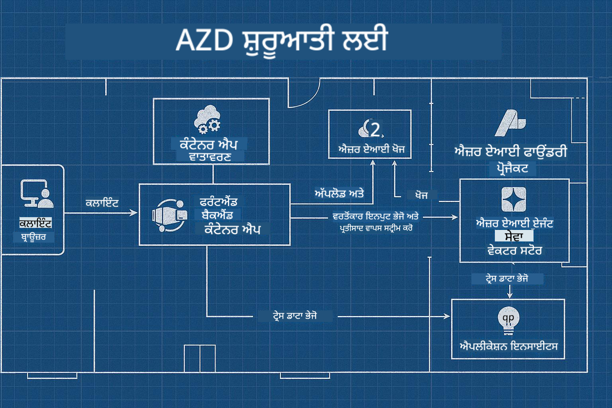

<!--
CO_OP_TRANSLATOR_METADATA:
{
  "original_hash": "245d24997bbcf2bae93bb2a503845d37",
  "translation_date": "2025-09-23T11:50:40+00:00",
  "source_file": "workshop/README.md",
  "language_code": "pa"
}
-->
# AZD ਫਾਰ AI ਡਿਵੈਲਪਰ ਵਰਕਸ਼ਾਪ

## AZD ਟੈਂਪਲੇਟ

ਤੁਹਾਡੇ ਵਿਸ਼ੇਸ਼ ਸਥਿਤੀ ਲਈ ਇੱਕ ਐਨਟਰਪ੍ਰਾਈਜ਼-ਗ੍ਰੇਡ AI ਐਪਲੀਕੇਸ਼ਨ ਹੱਲ ਬਣਾਉਣਾ ਬਿਲਕੁਲ ਆਪਣੇ ਘਰ ਬਣਾਉਣ ਵਾਂਗ ਹੈ। ਤੁਸੀਂ ਇਸਨੂੰ ਖੁਦ ਡਿਜ਼ਾਈਨ ਕਰ ਸਕਦੇ ਹੋ, ਇੱਕ-ਇੱਕ ਇੱਟ ਰੱਖ ਕੇ ਬਣਾਉਣ ਦਾ ਕੰਮ ਕਰ ਸਕਦੇ ਹੋ, ਅਤੇ ਇਹ ਯਕੀਨੀ ਬਣਾਉਣ ਦੀ ਜ਼ਿੰਮੇਵਾਰੀ ਲੈ ਸਕਦੇ ਹੋ ਕਿ ਇਹ ਸਾਰੇ ਗਵਰਨੈਂਸ ਅਤੇ ਵਿਕਾਸ ਦੇ ਨਿਯਮਾਂ ਨੂੰ ਪੂਰਾ ਕਰਦਾ ਹੈ।

**ਜਾਂ ....**

ਤੁਸੀਂ ਇੱਕ ਆਰਕੀਟੈਕਟ ਨਾਲ ਕੰਮ ਕਰ ਸਕਦੇ ਹੋ ਜੋ ਤੁਹਾਨੂੰ ਇੱਕ _ਬਲੂਪ੍ਰਿੰਟ_ ਦੇ ਸਕਦਾ ਹੈ ਇੱਕ ਸ਼ੁਰੂਆਤੀ ਘਰ ਲਈ, ਅਤੇ ਫਿਰ ਤੁਹਾਡੇ ਨਾਲ ਮਿਲ ਕੇ ਇਸਨੂੰ _ਕਸਟਮਾਈਜ਼_ ਕਰ ਸਕਦਾ ਹੈ ਤਾਂ ਜੋ ਇਹ ਤੁਹਾਡੇ ਜ਼ਰੂਰਤਾਂ ਨੂੰ ਪੂਰਾ ਕਰੇ। ਇਸ ਤਰੀਕੇ ਨਾਲ ਤੁਸੀਂ ਇਸ ਗੱਲ 'ਤੇ ਧਿਆਨ ਦੇ ਸਕਦੇ ਹੋ ਕਿ **ਤੁਹਾਡਾ ਘਰ** ਕਿਵੇਂ ਵਿਲੱਖਣ ਬਣਦਾ ਹੈ, ਅਤੇ ਤਾਰਾਂ, ਪਲੰਬਿੰਗ ਅਤੇ ਹੋਰ ਨਿਰਭਰਤਾਵਾਂ ਨੂੰ ਮਾਹਰਾਂ ਦੁਆਰਾ ਸੰਭਾਲਿਆ ਜਾ ਸਕਦਾ ਹੈ।

**ਇਹ ਹੀ [AI App Templates](https://ai.azure.com/templates)** ਦੇ ਪਿੱਛੇ ਦਾ ਦ੍ਰਿਸ਼ਟਿਕੋਣ ਹੈ - ਵੱਖ-ਵੱਖ ਕਿਸਮ ਦੇ AI ਐਪਲੀਕੇਸ਼ਨ "ਘਰਾਂ" ਬਣਾਉਣ ਲਈ ਬਲੂਪ੍ਰਿੰਟ ਦੀ ਇੱਕ ਲੜੀ, ਜੋ ਤੁਹਾਡੇ ਮੁੱਖ ਜ਼ਰੂਰਤਾਂ ਅਤੇ ਨਿਰਭਰਤਾਵਾਂ 'ਤੇ ਅਧਾਰਿਤ ਹੈ।

## ਟੈਂਪਲੇਟ ਕਸਟਮਾਈਜ਼ੇਸ਼ਨ

ਟੈਂਪਲੇਟਾਂ ਨੂੰ [Azure AI Foundry](https://ai.azure.com) ਨਾਲ ਕੰਮ ਕਰਨ ਲਈ ਡਿਜ਼ਾਈਨ ਕੀਤਾ ਗਿਆ ਹੈ। ਇਸ ਪਲੇਟਫਾਰਮ ਨੂੰ ਆਪਣੇ "ਬਿਲਡਿੰਗ ਕਾਂਟ੍ਰੈਕਟਰ" ਵਾਂਗ ਸੋਚੋ, ਜਿਸਦੇ ਕੋਲ ਸਾਰੇ ਸਰੋਤ, ਟੂਲ ਅਤੇ ਮਾਹਰਤਾ ਹੈ ਜੋ ਤੁਹਾਡਾ ਕੰਮ ਪੂਰਾ ਕਰਨ ਲਈ ਲੋੜੀਂਦੇ ਹਨ!

ਤੁਹਾਨੂੰ ਸਿਰਫ [ਆਪਣੇ ਸ਼ੁਰੂਆਤੀ ਟੈਂਪਲੇਟ](https://learn.microsoft.com/en-us/azure/ai-foundry/how-to/develop/ai-template-get-started) ਚੁਣਨ ਦੀ ਲੋੜ ਹੈ। ਉਦਾਹਰਣ ਲਈ, ਅਸੀਂ _Get Started with AI Agents_ ਟੈਂਪਲੇਟ 'ਤੇ ਧਿਆਨ ਦੇਵਾਂਗੇ ਤਾਂ ਜੋ ਤੁਹਾਡੇ ਲਈ ਇੱਕ "Agentic AI Home" ਬਣਾਇਆ ਜਾ ਸਕੇ ਜੋ AI Search, Red Teaming, Evaluations, Tracing, Monitoring ਅਤੇ ਹੋਰ ਵਿਸ਼ੇਸ਼ਤਾਵਾਂ ਲਈ ਤਿਆਰ ਹੈ!



ਤੁਹਾਨੂੰ ਸਿਰਫ ਆਰਕੀਟੈਕਟ ਨਾਲ ਸਮਾਂ ਬੁੱਕ ਕਰਨ ਦੀ ਲੋੜ ਹੈ, ਜੋ ਤੁਹਾਨੂੰ ਕਸਟਮਾਈਜ਼ੇਸ਼ਨ ਪ੍ਰਕਿਰਿਆ ਵਿੱਚ ਮਦਦ ਕਰੇਗਾ। [GitHub Copilot for Azure](https://learn.microsoft.com/en-us/azure/developer/github-copilot-azure/get-started) ਤੁਹਾਡਾ ਗਾਈਡ ਹੋ ਸਕਦਾ ਹੈ। ਸਿਰਫ "ਇਸ ਨਾਲ ਗੱਲਬਾਤ ਕਰੋ" ਤਾਂ ਜੋ:

- ਆਪਣੇ ਟੈਂਪਲੇਟ ਵਿੱਚ Azure ਵਿਸ਼ੇਸ਼ਤਾਵਾਂ ਬਾਰੇ ਸਿੱਖੋ
- Azure ਸਰੋਤਾਂ ਨੂੰ ਡਿਪਲੌਇ ਕਰੋ
- ਆਪਣੇ ਡਿਪਲੌਇਮੈਂਟ ਬਾਰੇ ਜਾਣਕਾਰੀ ਪ੍ਰਾਪਤ ਕਰੋ
- ਸਮੱਸਿਆਵਾਂ ਦਾ ਨਿਪਟਾਰਾ ਅਤੇ ਡਾਇਗਨੋਸ ਕਰੋ!

ਇਸ ਵਰਕਸ਼ਾਪ ਵਿੱਚ, ਅਸੀਂ ਮੌਜੂਦਾ ਟੈਂਪਲੇਟ ਨੂੰ _ਡਿਕੰਸਟ੍ਰਕਟ_ ਕਰਨਾ ਸਿੱਖਾਂਗੇ (ਤਾਂ ਜੋ ਇਹ ਪਤਾ ਲਗਾ ਸਕੀਏ ਕਿ ਇਹ ਕੀ ਪ੍ਰਦਾਨ ਕਰਦਾ ਹੈ), ਫਿਰ ਇਸਨੂੰ _ਕਸਟਮਾਈਜ਼_ ਕਰਨਾ (ਤਾਂ ਜੋ ਇਹ ਸਾਡੇ ਜ਼ਰੂਰਤਾਂ ਨੂੰ ਪੂਰਾ ਕਰੇ) - ਇੱਕ ਕਦਮ ਵਿੱਚ।

AI ਟੈਂਪਲੇਟ **ਇਹ ਕੰਮ ਕਰਦੇ ਹਨ** - ਵਰਕਸ਼ਾਪ ਪੂਰਾ ਕਰਨ ਦੁਆਰਾ ਤੁਸੀਂ ਸਿੱਖੋਗੇ ਕਿ **ਇਹ ਤੁਹਾਡਾ ਬਣਾਉਣਾ** ਕਿਵੇਂ ਹੈ।

----

**ਵਰਕਸ਼ਾਪ ਨੈਵੀਗੇਸ਼ਨ**
- **📚 ਕੋਰਸ ਹੋਮ**: [AZD For Beginners](../README.md)
- **📖 ਸੰਬੰਧਿਤ ਅਧਿਆਇ**: [Chapter 1](../README.md#-chapter-1-foundation--quick-start), [Chapter 2](../README.md#-chapter-2-ai-first-development-recommended-for-ai-developers), ਅਤੇ [Chapter 5](../README.md#-chapter-5-multi-agent-ai-solutions-advanced) ਨੂੰ ਕਵਰ ਕਰਦਾ ਹੈ
- **🛠️ ਹੈਂਡਸ-ਆਨ ਲੈਬ**: [AI Workshop Lab](../docs/ai-foundry/ai-workshop-lab.md)
- **🚀 ਅਗਲੇ ਕਦਮ**: [Workshop Lab Modules](../../../workshop)

AZD ਦੇ ਮੂਲ ਸਿਧਾਂਤਾਂ ਨੂੰ ਸਿੱਖਣ ਅਤੇ ਉਤਪਾਦਨ-ਤਿਆਰ AI ਹੱਲਾਂ ਨੂੰ ਡਿਪਲੌਇ ਕਰਨ 'ਤੇ ਧਿਆਨ ਦੇਣ ਵਾਲੇ ਵਰਕਸ਼ਾਪ ਵਿੱਚ ਤੁਹਾਡਾ ਸਵਾਗਤ ਹੈ। ਇਹ ਵਰਕਸ਼ਾਪ ਤੁਹਾਨੂੰ AZD ਬੁਨਿਆਦੀਆਂ ਤੋਂ ਲੈ ਕੇ ਉਤਪਾਦਨ-ਤਿਆਰ AI ਹੱਲਾਂ ਤੱਕ ਲੈ ਜਾਣ ਲਈ ਡਿਜ਼ਾਈਨ ਕੀਤੀ ਗਈ ਹੈ।

## ਵਰਕਸ਼ਾਪ ਝਲਕ

**ਅਵਧੀ:** 2-3 ਘੰਟੇ  
**ਪੱਧਰ:** ਸ਼ੁਰੂਆਤੀ ਤੋਂ ਮੱਧਮ  
**ਪੂਰਵ-ਸ਼ਰਤਾਂ:** Azure, ਕਮਾਂਡ ਲਾਈਨ ਟੂਲਾਂ, ਅਤੇ AI ਸੰਕਲਪਾਂ ਦੀ ਬੁਨਿਆਦੀ ਜਾਣਕਾਰੀ

### ਤੁਸੀਂ ਕੀ ਸਿੱਖੋਗੇ

- **AZD ਬੁਨਿਆਦੀਆਂ**: AZD ਨਾਲ ਇੰਫਰਾਸਟਰਕਚਰ ਐਜ਼ ਕੋਡ ਨੂੰ ਸਮਝਣਾ
- 🤖 **AI ਸੇਵਾ ਇੰਟੀਗ੍ਰੇਸ਼ਨ**: Azure OpenAI, AI Search, ਅਤੇ ਹੋਰ AI ਸੇਵਾਵਾਂ ਨੂੰ ਡਿਪਲੌਇ ਕਰਨਾ
- **ਕੰਟੇਨਰ ਡਿਪਲੌਇਮੈਂਟ**: AI ਐਪਲੀਕੇਸ਼ਨਾਂ ਲਈ Azure Container Apps ਦੀ ਵਰਤੋਂ
- **ਸੁਰੱਖਿਆ ਦੇ ਸ੍ਰੇਸ਼ਠ ਤਰੀਕੇ**: Managed Identity ਅਤੇ ਸੁਰੱਖਿਅਤ ਕਨਫਿਗਰੇਸ਼ਨ ਲਾਗੂ ਕਰਨਾ
- **ਮਾਨੀਟਰਿੰਗ ਅਤੇ ਦ੍ਰਿਸ਼ਟਾਵਲਤਾ**: AI ਵਰਕਲੋਡ ਲਈ Application Insights ਸੈਟਅਪ ਕਰਨਾ
- **ਉਤਪਾਦਨ ਪੈਟਰਨ**: ਐਨਟਰਪ੍ਰਾਈਜ਼-ਤਿਆਰ ਡਿਪਲੌਇਮੈਂਟ ਰਣਨੀਤੀਆਂ

## ਵਰਕਸ਼ਾਪ ਦੀ ਬਣਤਰ

### ਮੋਡਿਊਲ 1: AZD ਬੁਨਿਆਦੀਆਂ (30 ਮਿੰਟ)
- AZD ਨੂੰ ਇੰਸਟਾਲ ਅਤੇ ਕਨਫਿਗਰ ਕਰਨਾ
- AZD ਪ੍ਰੋਜੈਕਟ ਬਣਤਰ ਨੂੰ ਸਮਝਣਾ
- ਆਪਣਾ ਪਹਿਲਾ AZD ਡਿਪਲੌਇਮੈਂਟ
- **ਲੈਬ**: ਇੱਕ ਸਧਾਰਨ ਵੈੱਬ ਐਪਲੀਕੇਸ਼ਨ ਡਿਪਲੌਇ ਕਰੋ

### ਮੋਡਿਊਲ 2: Azure OpenAI ਇੰਟੀਗ੍ਰੇਸ਼ਨ (45 ਮਿੰਟ)
- Azure OpenAI ਸਰੋਤਾਂ ਨੂੰ ਸੈਟਅਪ ਕਰਨਾ
- ਮਾਡਲ ਡਿਪਲੌਇਮੈਂਟ ਰਣਨੀਤੀਆਂ
- API ਪਹੁੰਚ ਅਤੇ ਪ੍ਰਮਾਣਿਕਤਾ ਨੂੰ ਕਨਫਿਗਰ ਕਰਨਾ
- **ਲੈਬ**: GPT-4 ਨਾਲ ਇੱਕ ਚੈਟ ਐਪਲੀਕੇਸ਼ਨ ਡਿਪਲੌਇ ਕਰੋ

### ਮੋਡਿਊਲ 3: RAG ਐਪਲੀਕੇਸ਼ਨ (45 ਮਿੰਟ)
- Azure AI Search ਇੰਟੀਗ੍ਰੇਸ਼ਨ
- Azure Document Intelligence ਨਾਲ ਦਸਤਾਵੇਜ਼ ਪ੍ਰੋਸੈਸਿੰਗ
- ਵੈਕਟਰ ਐਮਬੈਡਿੰਗ ਅਤੇ ਸੈਮੈਂਟਿਕ ਸੇਰਚ
- **ਲੈਬ**: ਇੱਕ ਦਸਤਾਵੇਜ਼ Q&A ਸਿਸਟਮ ਬਣਾਓ

### ਮੋਡਿਊਲ 4: ਉਤਪਾਦਨ ਡਿਪਲੌਇਮੈਂਟ (30 ਮਿੰਟ)
- Container Apps ਕਨਫਿਗਰੇਸ਼ਨ
- ਸਕੇਲਿੰਗ ਅਤੇ ਪ੍ਰਦਰਸ਼ਨ ਅਪਟਿਮਾਈਜ਼ੇਸ਼ਨ
- ਮਾਨੀਟਰਿੰਗ ਅਤੇ ਲੌਗਿੰਗ
- **ਲੈਬ**: ਦ੍ਰਿਸ਼ਟਾਵਲਤਾ ਨਾਲ ਉਤਪਾਦਨ ਵਿੱਚ ਡਿਪਲੌਇ ਕਰੋ

### ਮੋਡਿਊਲ 5: ਉੱਨਤ ਪੈਟਰਨ (15 ਮਿੰਟ)
- ਬਹੁ-ਵਾਤਾਵਰਣ ਡਿਪਲੌਇਮੈਂਟ
- CI/CD ਇੰਟੀਗ੍ਰੇਸ਼ਨ
- ਲਾਗਤ ਅਪਟਿਮਾਈਜ਼ੇਸ਼ਨ ਰਣਨੀਤੀਆਂ
- **ਸਮਾਪਤੀ**: ਉਤਪਾਦਨ ਤਿਆਰੀ ਚੈੱਕਲਿਸਟ

## ਪੂਰਵ-ਸ਼ਰਤਾਂ

### ਲੋੜੀਂਦੇ ਟੂਲ

ਕਿਰਪਾ ਕਰਕੇ ਵਰਕਸ਼ਾਪ ਤੋਂ ਪਹਿਲਾਂ ਇਹ ਟੂਲ ਇੰਸਟਾਲ ਕਰੋ:

```bash
# Azure Developer CLI
curl -fsSL https://aka.ms/install-azd.sh | bash

# Azure CLI
curl -sL https://aka.ms/InstallAzureCLIDeb | sudo bash

# Git
sudo apt-get install git

# Docker
curl -fsSL https://get.docker.com -o get-docker.sh
sudo sh get-docker.sh

# Python 3.10+
sudo apt-get install python3.10 python3.10-venv python3-pip
```

### Azure ਖਾਤਾ ਸੈਟਅਪ

1. **Azure ਸਬਸਕ੍ਰਿਪਸ਼ਨ**: [ਮੁਫ਼ਤ ਸਾਈਨ ਅਪ ਕਰੋ](https://azure.microsoft.com/free/)  
2. **Azure OpenAI ਪਹੁੰਚ**: [ਪਹੁੰਚ ਦੀ ਬੇਨਤੀ ਕਰੋ](https://aka.ms/oai/access)  
3. **ਲੋੜੀਂਦੇ ਅਧਿਕਾਰ**:  
   - ਸਬਸਕ੍ਰਿਪਸ਼ਨ ਜਾਂ ਸਰੋਤ ਸਮੂਹ 'ਤੇ Contributor ਰੋਲ  
   - User Access Administrator (RBAC ਅਸਾਈਨਮੈਂਟ ਲਈ)

### ਪੂਰਵ-ਸ਼ਰਤਾਂ ਦੀ ਪੁਸ਼ਟੀ ਕਰੋ

ਆਪਣੀ ਸੈਟਅਪ ਦੀ ਪੁਸ਼ਟੀ ਕਰਨ ਲਈ ਇਹ ਸਕ੍ਰਿਪਟ ਚਲਾਓ:

```bash
#!/bin/bash
echo "Verifying workshop prerequisites..."

# Check AZD installation
if command -v azd &> /dev/null; then
    echo "✅ Azure Developer CLI: $(azd --version)"
else
    echo "❌ Azure Developer CLI not found"
fi

# Check Azure CLI
if command -v az &> /dev/null; then
    echo "✅ Azure CLI: $(az --version | head -n1)"
else
    echo "❌ Azure CLI not found"
fi

# Check Docker
if command -v docker &> /dev/null; then
    echo "✅ Docker: $(docker --version)"
else
    echo "❌ Docker not found"
fi

# Check Python
if command -v python3 &> /dev/null; then
    echo "✅ Python: $(python3 --version)"
else
    echo "❌ Python 3 not found"
fi

# Check Azure login
if az account show &> /dev/null; then
    echo "✅ Azure: Logged in as $(az account show --query user.name -o tsv)"
else
    echo "❌ Azure: Not logged in (run 'az login')"
fi

echo "Setup verification complete!"
```

## ਵਰਕਸ਼ਾਪ ਸਮੱਗਰੀ

### ਲੈਬ ਅਭਿਆਸ

ਹਰ ਮੋਡਿਊਲ ਵਿੱਚ ਸਟਾਰਟਰ ਕੋਡ ਅਤੇ ਕਦਮ-ਦਰ-ਕਦਮ ਹਦਾਇਤਾਂ ਨਾਲ ਹੈਂਡਸ-ਆਨ ਲੈਬ ਸ਼ਾਮਲ ਹੈ:

- **[lab-1-azd-basics/](../../../workshop/lab-1-azd-basics)** - ਆਪਣਾ ਪਹਿਲਾ AZD ਡਿਪਲੌਇਮੈਂਟ  
- **[lab-2-openai-chat/](../../../workshop/lab-2-openai-chat)** - Azure OpenAI ਨਾਲ ਚੈਟ ਐਪਲੀਕੇਸ਼ਨ  
- **[lab-3-rag-search/](../../../workshop/lab-3-rag-search)** - AI Search ਨਾਲ RAG ਐਪਲੀਕੇਸ਼ਨ  
- **[lab-4-production/](../../../workshop/lab-4-production)** - ਉਤਪਾਦਨ ਡਿਪਲੌਇਮੈਂਟ ਪੈਟਰਨ  
- **[lab-5-advanced/](../../../workshop/lab-5-advanced)** - ਉੱਨਤ ਡਿਪਲੌਇਮੈਂਟ ਸਥਿਤੀਆਂ  

### ਰਿਫਰੈਂਸ ਸਮੱਗਰੀ

- **[AI Foundry Integration Guide](../docs/ai-foundry/azure-ai-foundry-integration.md)** - ਵਿਸਥਾਰਤ ਇੰਟੀਗ੍ਰੇਸ਼ਨ ਪੈਟਰਨ  
- **[AI Model Deployment Guide](../docs/ai-foundry/ai-model-deployment.md)** - ਮਾਡਲ ਡਿਪਲੌਇਮੈਂਟ ਦੇ ਸ੍ਰੇਸ਼ਠ ਤਰੀਕੇ  
- **[Production AI Practices](../docs/ai-foundry/production-ai-practices.md)** - ਐਨਟਰਪ੍ਰਾਈਜ਼ ਡਿਪਲੌਇਮੈਂਟ ਪੈਟਰਨ  
- **[AI Troubleshooting Guide](../docs/troubleshooting/ai-troubleshooting.md)** - ਆਮ ਸਮੱਸਿਆਵਾਂ ਅਤੇ ਹੱਲ  

### ਸੈਂਪਲ ਟੈਂਪਲੇਟ

ਆਮ AI ਸਥਿਤੀਆਂ ਲਈ ਕਵਿਕ-ਸਟਾਰਟ ਟੈਂਪਲੇਟ:

```
workshop/templates/
├── minimal-chat/          # Basic OpenAI chat app
├── rag-application/       # RAG with AI Search
├── multi-model/          # Multiple AI services
└── production-ready/     # Enterprise template
```

## ਸ਼ੁਰੂਆਤ

### ਵਿਕਲਪ 1: GitHub Codespaces (ਸਿਫਾਰਸ਼ੀ)

ਵਰਕਸ਼ਾਪ ਸ਼ੁਰੂ ਕਰਨ ਦਾ ਸਭ ਤੋਂ ਤੇਜ਼ ਤਰੀਕਾ:

[](https://github.com/codespaces/new?hide_repo_select=true&ref=main&repo=YOUR_REPO_ID)

### ਵਿਕਲਪ 2: ਸਥਾਨਕ ਵਿਕਾਸ

1. **ਵਰਕਸ਼ਾਪ ਰਿਪੋਜ਼ਟਰੀ ਕਲੋਨ ਕਰੋ:**  
```bash
git clone https://github.com/YOUR_ORG/AZD-for-beginners.git
cd AZD-for-beginners/workshop
```

2. **Azure ਵਿੱਚ ਲੌਗਇਨ ਕਰੋ:**  
```bash
az login
azd auth login
```

3. **ਲੈਬ 1 ਨਾਲ ਸ਼ੁਰੂ ਕਰੋ:**  
```bash
cd lab-1-azd-basics
cat README.md  # Follow the instructions
```

### ਵਿਕਲਪ 3: ਇੰਸਟ੍ਰਕਟਰ-ਲੈਡ ਵਰਕਸ਼ਾਪ

ਜੇ ਤੁਸੀਂ ਇੰਸਟ੍ਰਕਟਰ-ਲੈਡ ਸੈਸ਼ਨ ਵਿੱਚ ਸ਼ਾਮਲ ਹੋ ਰਹੇ ਹੋ:

- 🎥 **ਵਰਕਸ਼ਾਪ ਰਿਕਾਰਡਿੰਗ**: [ਮੰਗ 'ਤੇ ਉਪਲਬਧ](https://aka.ms/azd-ai-workshop)  
- 💬 **Discord ਕਮਿਊਨਿਟੀ**: [ਲਾਈਵ ਸਹਾਇਤਾ ਲਈ ਸ਼ਾਮਲ ਹੋਵੋ](https://aka.ms/foundry/discord)  
- **ਵਰਕਸ਼ਾਪ ਫੀਡਬੈਕ**: [ਆਪਣਾ ਅਨੁਭਵ ਸਾਂਝਾ ਕਰੋ](https://aka.ms/azd-workshop-feedback)  

## ਵਰਕਸ਼ਾਪ ਟਾਈਮਲਾਈਨ

### ਸਵੈ-ਪੇਸਡ ਸਿੱਖਣਾ (3 ਘੰਟੇ)

```
⏰ 00:00 - 00:30  Module 1: AZD Foundations
⏰ 00:30 - 01:15  Module 2: Azure OpenAI Integration
⏰ 01:15 - 02:00  Module 3: RAG Applications
⏰ 02:00 - 02:30  Module 4: Production Deployment
⏰ 02:30 - 02:45  Module 5: Advanced Patterns
⏰ 02:45 - 03:00  Q&A and Next Steps
```

### ਇੰਸਟ੍ਰਕਟਰ-ਲੈਡ ਸੈਸ਼ਨ (2.5 ਘੰਟੇ)

```
⏰ 00:00 - 00:15  Welcome & Prerequisites Check
⏰ 00:15 - 00:40  Module 1: Live Demo + Lab
⏰ 00:40 - 01:20  Module 2: OpenAI Integration
⏰ 01:20 - 01:30  Break
⏰ 01:30 - 02:10  Module 3: RAG Applications
⏰ 02:10 - 02:30  Module 4: Production Patterns
⏰ 02:30 - 02:45  Module 5: Advanced Topics
⏰ 02:45 - 03:00  Q&A and Resources
```

## ਸਫਲਤਾ ਮਾਪਦੰਡ

ਵਰਕਸ਼ਾਪ ਦੇ ਅੰਤ ਤੱਕ, ਤੁਸੀਂ ਇਹ ਕਰਨ ਦੇ ਯੋਗ ਹੋਵੋਗੇ:

✅ **AZD ਟੈਂਪਲੇਟਾਂ ਦੀ ਵਰਤੋਂ ਕਰਕੇ AI ਐਪਲੀਕੇਸ਼ਨ ਡਿਪਲੌਇ ਕਰੋ**  
✅ **Azure OpenAI ਸੇਵਾਵਾਂ ਨੂੰ ਸੁਰੱਖਿਅਤ ਤਰੀਕੇ ਨਾਲ ਕਨਫਿਗਰ ਕਰੋ**  
✅ **Azure AI Search ਇੰਟੀਗ੍ਰੇਸ਼ਨ ਨਾਲ RAG ਐਪਲੀਕੇਸ਼ਨ ਬਣਾਓ**  
✅ **ਐਨਟਰਪ੍ਰਾਈਜ਼ AI ਵਰਕਲੋਡ ਲਈ ਉਤਪਾਦਨ ਪੈਟਰਨ ਲਾਗੂ ਕਰੋ**  
✅ **AI ਐਪਲੀਕੇਸ਼ਨ ਡਿਪਲੌਇਮੈਂਟ ਦੀ ਮਾਨੀਟਰਿੰਗ ਅਤੇ ਸਮੱਸਿਆਵਾਂ ਦਾ ਨਿਪਟਾਰਾ ਕਰੋ**  
✅ **AI ਵਰਕਲੋਡ ਲਈ ਲਾਗਤ ਅਪਟਿਮਾਈਜ਼ੇਸ਼ਨ ਰਣਨੀਤੀਆਂ ਲਾਗੂ ਕਰੋ**  

## ਕਮਿਊਨਿਟੀ ਅਤੇ ਸਹਾਇਤਾ

### ਵਰਕਸ਼ਾਪ ਦੌਰਾਨ

- 🙋 **ਸਵਾਲ**: ਵਰਕਸ਼ਾਪ ਚੈਟ ਵਿੱਚ ਪੁੱਛੋ ਜਾਂ ਹੱਥ ਚੁੱਕੋ  
- 🐛 **ਸਮੱਸਿਆਵਾਂ**: [ਟ੍ਰਬਲਸ਼ੂਟਿੰਗ ਗਾਈਡ](../docs/troubleshooting/ai-troubleshooting.md) ਚੈੱਕ ਕਰੋ  
- **ਟਿੱਪਸ**: ਹੋਰ ਭਾਗੀਦਾਰਾਂ ਨਾਲ ਖੋਜਾਂ ਸਾਂਝੀਆਂ ਕਰੋ  

### ਵਰਕਸ਼ਾਪ ਤੋਂ ਬਾਅਦ

- 💬 **Discord**: [Azure AI Foundry Community](https://aka.ms/foundry/discord)  
- **GitHub Issues**: [ਟੈਂਪਲੇਟ ਸਮੱਸਿਆਵਾਂ ਦੀ ਰਿਪੋਰਟ ਕਰੋ](https://github.com/YOUR_ORG/AZD-for-beginners/issues)  
- 📧 **ਫੀਡਬੈਕ**: [ਵਰਕਸ਼ਾਪ ਮੁਲਾਂਕਣ ਫਾਰਮ](https://aka.ms/azd-workshop-feedback)  

## ਅਗਲੇ ਕਦਮ

### ਸਿੱਖਣਾ ਜਾਰੀ ਰੱਖੋ

1. **ਉੱਨਤ ਸਥਿਤੀਆਂ**: [ਬਹੁ-ਖੇਤਰ ਡਿਪਲੌਇਮੈਂਟ](../docs/ai-foundry/production-ai-practices.md#multi-region-deployment) ਦੀ ਖੋਜ ਕਰੋ  
2. **CI/CD ਇੰਟੀਗ੍ਰੇਸ਼ਨ**: [GitHub Actions ਵਰਕਫਲੋ](../docs/deployment/github-actions.md) ਸੈਟਅਪ ਕਰੋ  
3. **ਕਸਟਮ ਟੈਂਪਲੇਟ**: ਆਪਣੇ [AZD ਟੈਂਪਲੇਟ](../docs/getting-started/custom-templates.md) ਬਣਾਓ  

### ਆਪਣੇ ਪ੍ਰੋਜੈਕਟਾਂ ਵਿੱਚ ਲਾਗੂ ਕਰੋ

1. **ਮੁਲਾਂਕਣ**: [ਤਿਆਰੀ ਚੈੱਕਲਿਸਟ](./production-readiness-checklist.md) ਦੀ ਵਰਤੋਂ ਕਰੋ  
2. **ਟੈਂਪਲੇਟ**: ਸਾਡੇ [AI-ਵਿਸ਼ੇਸ਼ ਟੈਂਪਲੇਟ](../../../workshop/templates) ਨਾਲ ਸ਼ੁਰੂ ਕਰੋ  
3. **ਸਹਾਇਤਾ**: [Azure AI Foundry Discord](https://aka.ms/foundry/discord) ਵਿੱਚ ਸ਼ਾਮਲ ਹੋਵੋ  

### ਆਪਣੀ ਸਫਲਤਾ ਸਾਂਝੀ ਕਰੋ

- ⭐ **ਰਿਪੋਜ਼ਟਰੀ ਨੂੰ ਸਟਾਰ ਕਰੋ** ਜੇ ਇਹ ਵਰਕਸ਼ਾਪ ਤੁਹਾਡੀ ਮਦਦ ਕਰਦਾ ਹੈ  
- 🐦 **ਸੋਸ਼ਲ ਮੀਡੀਆ 'ਤੇ ਸਾਂਝਾ ਕਰੋ

---

