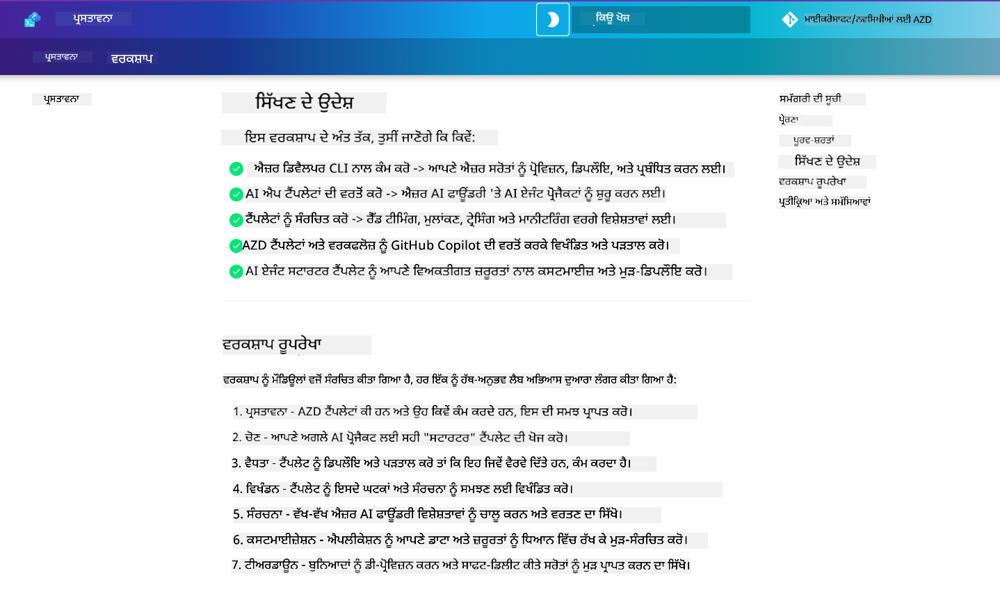

<!--
CO_OP_TRANSLATOR_METADATA:
{
  "original_hash": "9cc966416ab431c38b2ab863884b196c",
  "translation_date": "2025-09-24T14:33:11+00:00",
  "source_file": "workshop/README.md",
  "language_code": "pa"
}
-->
# AZD ਫਾਰ AI ਡਿਵੈਲਪਰ ਵਰਕਸ਼ਾਪ

AZD (Azure Developer CLI) ਨੂੰ ਸਿੱਖਣ ਲਈ ਹੱਥ-ਅਨੁਭਵ ਵਰਕਸ਼ਾਪ ਵਿੱਚ ਤੁਹਾਡਾ ਸਵਾਗਤ ਹੈ, ਜਿਸ ਵਿੱਚ AI ਐਪਲੀਕੇਸ਼ਨ ਡਿਪਲੌਇਮੈਂਟ 'ਤੇ ਧਿਆਨ ਦਿੱਤਾ ਗਿਆ ਹੈ। ਇਹ ਵਰਕਸ਼ਾਪ ਤੁਹਾਨੂੰ AZD ਟੈਂਪਲੇਟਸ ਦੀ ਸਮਝ ਤਿੰਨ ਕਦਮਾਂ ਵਿੱਚ ਪ੍ਰਾਪਤ ਕਰਨ ਵਿੱਚ ਮਦਦ ਕਰਦੀ ਹੈ:

1. **ਖੋਜ** - ਉਹ ਟੈਂਪਲੇਟ ਲੱਭੋ ਜੋ ਤੁਹਾਡੇ ਲਈ ਸਹੀ ਹੈ।
1. **ਡਿਪਲੌਇਮੈਂਟ** - ਡਿਪਲੌਇ ਕਰੋ ਅਤੇ ਇਹ ਯਕੀਨੀ ਬਣਾਓ ਕਿ ਇਹ ਕੰਮ ਕਰਦਾ ਹੈ।
1. **ਕਸਟਮਾਈਜ਼ੇਸ਼ਨ** - ਇਸ ਨੂੰ ਆਪਣੇ ਲਈ ਅਨੁਕੂਲ ਬਣਾਉਣ ਲਈ ਸੋਧ ਅਤੇ ਦੁਹਰਾਈ ਕਰੋ!

ਇਸ ਵਰਕਸ਼ਾਪ ਦੇ ਦੌਰਾਨ, ਤੁਹਾਨੂੰ ਕੋਰ ਡਿਵੈਲਪਰ ਟੂਲਸ ਅਤੇ ਵਰਕਫਲੋਜ਼ ਨਾਲ ਵੀ ਜਾਣੂ ਕਰਵਾਇਆ ਜਾਵੇਗਾ, ਜੋ ਤੁਹਾਡੇ ਅੰਤ-ਤੱਕ ਵਿਕਾਸ ਯਾਤਰਾ ਨੂੰ ਸਧਾਰਨ ਬਣਾਉਣ ਵਿੱਚ ਮਦਦ ਕਰਦੇ ਹਨ।

<br/>

## ਬ੍ਰਾਊਜ਼ਰ-ਅਧਾਰਿਤ ਗਾਈਡ

ਵਰਕਸ਼ਾਪ ਦੇ ਪਾਠ Markdown ਵਿੱਚ ਹਨ। ਤੁਸੀਂ ਇਨ੍ਹਾਂ ਨੂੰ ਸਿੱਧੇ GitHub ਵਿੱਚ ਨੇਵੀਗੇਟ ਕਰ ਸਕਦੇ ਹੋ - ਜਾਂ ਹੇਠਾਂ ਦਿੱਤੇ ਸਕ੍ਰੀਨਸ਼ਾਟ ਵਿੱਚ ਦਿਖਾਈ ਗਈ ਬ੍ਰਾਊਜ਼ਰ-ਅਧਾਰਿਤ ਪ੍ਰੀਵਿਊ ਲਾਂਚ ਕਰ ਸਕਦੇ ਹੋ।



ਇਹ ਵਿਕਲਪ ਵਰਤਣ ਲਈ - ਰਿਪੋਜ਼ਟਰੀ ਨੂੰ ਆਪਣੇ ਪ੍ਰੋਫਾਈਲ ਵਿੱਚ ਫੋਰਕ ਕਰੋ ਅਤੇ GitHub Codespaces ਲਾਂਚ ਕਰੋ। ਜਦੋਂ VS Code ਟਰਮੀਨਲ ਐਕਟਿਵ ਹੋਵੇ, ਤਾਂ ਇਹ ਕਮਾਂਡ ਟਾਈਪ ਕਰੋ:

```bash title="" linenums="0"
mkdocs serve > /dev/null 2>&1 &
```

ਕੁਝ ਸਕਿੰਟਾਂ ਵਿੱਚ, ਤੁਹਾਨੂੰ ਇੱਕ ਪੌਪ-ਅੱਪ ਡਾਇਲਾਗ ਦਿਖਾਈ ਦੇਵੇਗਾ। ਬ੍ਰਾਊਜ਼ਰ ਵਿੱਚ ਖੋਲ੍ਹਣ ਦੇ ਵਿਕਲਪ ਨੂੰ ਚੁਣੋ। ਵੈੱਬ-ਅਧਾਰਿਤ ਗਾਈਡ ਹੁਣ ਇੱਕ ਨਵੇਂ ਬ੍ਰਾਊਜ਼ਰ ਟੈਬ ਵਿੱਚ ਖੁੱਲ ਜਾਵੇਗਾ। ਇਸ ਪ੍ਰੀਵਿਊ ਦੇ ਕੁਝ ਫਾਇਦੇ:

1. **ਬਿਲਟ-ਇਨ ਖੋਜ** - ਕੀਵਰਡਸ ਜਾਂ ਪਾਠਾਂ ਨੂੰ ਤੇਜ਼ੀ ਨਾਲ ਲੱਭੋ।
1. **ਕਾਪੀ ਆਈਕਨ** - ਕੋਡਬਲਾਕਸ 'ਤੇ ਹਵਰ ਕਰੋ ਤਾਂ ਜੋ ਇਹ ਵਿਕਲਪ ਵੇਖ ਸਕੋ।
1. **ਥੀਮ ਟੌਗਲ** - ਡਾਰਕ ਅਤੇ ਲਾਈਟ ਥੀਮਾਂ ਵਿੱਚ ਸਵਿੱਚ ਕਰੋ।
1. **ਮਦਦ ਪ੍ਰਾਪਤ ਕਰੋ** - ਫੁੱਟਰ ਵਿੱਚ Discord ਆਈਕਨ 'ਤੇ ਕਲਿਕ ਕਰੋ ਅਤੇ ਜੁੜੋ!

<br/>

## ਵਰਕਸ਼ਾਪ ਝਲਕ

**ਅਵਧੀ:** 3-4 ਘੰਟੇ  
**ਪੱਧਰ:** ਬਿਗਿਨਰ ਤੋਂ ਇੰਟਰਮੀਡੀਏਟ  
**ਪੂਰਵ ਸ਼ਰਤਾਂ:** Azure, AI ਸੰਕਲਪਾਂ, VS Code ਅਤੇ ਕਮਾਂਡ-ਲਾਈਨ ਟੂਲਸ ਨਾਲ ਜਾਣੂ ਹੋਣਾ।

ਇਹ ਇੱਕ ਹੱਥ-ਅਨੁਭਵ ਵਰਕਸ਼ਾਪ ਹੈ ਜਿੱਥੇ ਤੁਸੀਂ ਕਰਕੇ ਸਿੱਖਦੇ ਹੋ। ਜਦੋਂ ਤੁਸੀਂ ਅਭਿਆਸ ਪੂਰੇ ਕਰ ਲੈਂਦੇ ਹੋ, ਤਾਂ ਸੁਰੱਖਿਆ ਅਤੇ ਉਤਪਾਦਕਤਾ ਦੀਆਂ ਵਧੀਆ ਪ੍ਰਥਾਵਾਂ ਵਿੱਚ ਆਪਣੀ ਸਿੱਖਣ ਯਾਤਰਾ ਜਾਰੀ ਰੱਖਣ ਲਈ AZD For Beginners ਕਰਿਕੁਲਮ ਦੀ ਸਮੀਖਿਆ ਕਰਨ ਦੀ ਸਿਫਾਰਸ਼ ਕੀਤੀ ਜਾਂਦੀ ਹੈ।

| ਸਮਾਂ| ਮੋਡਿਊਲ  | ਉਦੇਸ਼ |
|:---|:---|:---|
| 15 ਮਿੰਟ | [ਪ੍ਰਸਤਾਵਨਾ](docs/instructions/0-Introduction.md) | ਲਕਸ਼ਾਂ ਨੂੰ ਸਮਝੋ |
| 30 ਮਿੰਟ | [AI ਟੈਂਪਲੇਟ ਚੁਣੋ](docs/instructions/1-Select-AI-Template.md) | ਵਿਕਲਪਾਂ ਦੀ ਪੜਚੋਲ ਕਰੋ ਅਤੇ ਸ਼ੁਰੂਆਤ ਕਰੋ | 
| 30 ਮਿੰਟ | [AI ਟੈਂਪਲੇਟ ਦੀ ਪੁਸ਼ਟੀ ਕਰੋ](docs/instructions/2-Validate-AI-Template.md) | ਡਿਫਾਲਟ ਹੱਲ ਨੂੰ Azure 'ਤੇ ਡਿਪਲੌਇ ਕਰੋ |
| 30 ਮਿੰਟ | [AI ਟੈਂਪਲੇਟ ਨੂੰ ਵਿਖੰਡਿਤ ਕਰੋ](docs/instructions/3-Deconstruct-AI-Template.md) | ਸਟ੍ਰਕਚਰ ਅਤੇ ਕਨਫਿਗਰੇਸ਼ਨ ਦੀ ਪੜਚੋਲ ਕਰੋ |
| 30 ਮਿੰਟ | [AI ਟੈਂਪਲੇਟ ਕਨਫਿਗਰ ਕਰੋ](docs/instructions/4-Configure-AI-Template.md) | ਉਪਲਬਧ ਫੀਚਰਾਂ ਨੂੰ ਐਕਟੀਵੇਟ ਕਰੋ ਅਤੇ ਅਜ਼ਮਾਓ |
| 30 ਮਿੰਟ | [AI ਟੈਂਪਲੇਟ ਨੂੰ ਕਸਟਮਾਈਜ਼ ਕਰੋ](docs/instructions/5-Customize-AI-Template.md) | ਟੈਂਪਲੇਟ ਨੂੰ ਆਪਣੀ ਜ਼ਰੂਰਤਾਂ ਲਈ ਅਨੁਕੂਲ ਬਣਾਓ |
| 30 ਮਿੰਟ | [ਇੰਫਰਾਸਟਰਕਚਰ ਨੂੰ ਹਟਾਓ](docs/instructions/6-Teardown-Infrastructure.md) | ਸਾਫ਼ਸੁਥਰਾ ਕਰੋ ਅਤੇ ਸਰੋਤਾਂ ਨੂੰ ਰਿਲੀਜ਼ ਕਰੋ |
| 15 ਮਿੰਟ | [ਸਮਾਪਤੀ ਅਤੇ ਅਗਲੇ ਕਦਮ](docs/instructions/7-Wrap-up.md) | ਸਿੱਖਣ ਦੇ ਸਰੋਤ, ਵਰਕਸ਼ਾਪ ਚੁਣੌਤੀ |

<br/>

## ਤੁਸੀਂ ਕੀ ਸਿੱਖੋਗੇ

AZD ਟੈਂਪਲੇਟ ਨੂੰ Azure AI Foundry 'ਤੇ ਅੰਤ-ਤੱਕ ਵਿਕਾਸ ਲਈ ਵੱਖ-ਵੱਖ ਸਮਰੱਥਾਵਾਂ ਅਤੇ ਟੂਲਸ ਦੀ ਪੜਚੋਲ ਕਰਨ ਲਈ ਸਿੱਖਣ ਵਾਲੇ ਸੈਂਡਬਾਕਸ ਵਜੋਂ ਸੋਚੋ। ਇਸ ਵਰਕਸ਼ਾਪ ਦੇ ਅੰਤ ਤੱਕ, ਤੁਹਾਨੂੰ ਇਸ ਸੰਦਰਭ ਵਿੱਚ ਵੱਖ-ਵੱਖ ਟੂਲਸ ਅਤੇ ਸੰਕਲਪਾਂ ਲਈ ਇੱਕ ਸਹਜ ਸਮਝ ਹੋਣੀ ਚਾਹੀਦੀ ਹੈ।

| ਸੰਕਲਪ  | ਉਦੇਸ਼ |
|:---|:---|
| **Azure Developer CLI** | ਟੂਲ ਕਮਾਂਡਸ ਅਤੇ ਵਰਕਫਲੋਜ਼ ਨੂੰ ਸਮਝੋ|
| **AZD ਟੈਂਪਲੇਟਸ**| ਪ੍ਰੋਜੈਕਟ ਸਟ੍ਰਕਚਰ ਅਤੇ ਕਨਫਿਗਰੇਸ਼ਨ ਨੂੰ ਸਮਝੋ|
| **Azure AI Agent**| Azure AI Foundry ਪ੍ਰੋਜੈਕਟ ਨੂੰ ਪ੍ਰੋਵਿਜ਼ਨ ਅਤੇ ਡਿਪਲੌਇ ਕਰੋ |
| **Azure AI Search**| ਏਜੰਟਸ ਨਾਲ ਸੰਦਰਭ ਇੰਜੀਨੀਅਰਿੰਗ ਨੂੰ ਐਨਬਲ ਕਰੋ |
| **Observability**| ਟ੍ਰੇਸਿੰਗ, ਮਾਨੀਟਰਿੰਗ ਅਤੇ ਮੁਲਾਂਕਣ ਦੀ ਪੜਚੋਲ ਕਰੋ |
| **Red Teaming**| ਵਿਰੋਧੀ ਟੈਸਟਿੰਗ ਅਤੇ ਰੋਕਥਾਮ ਦੀ ਪੜਚੋਲ ਕਰੋ |

<br/>

## ਵਰਕਸ਼ਾਪ ਦੀ ਬਣਤਰ

ਵਰਕਸ਼ਾਪ ਨੂੰ ਟੈਂਪਲੇਟ ਦੀ ਖੋਜ, ਡਿਪਲੌਇਮੈਂਟ, ਵਿਖੰਡਨ ਅਤੇ ਕਸਟਮਾਈਜ਼ੇਸ਼ਨ ਦੀ ਯਾਤਰਾ 'ਤੇ ਲਿਜਾਣ ਲਈ ਬਣਾਇਆ ਗਿਆ ਹੈ - ਜਿਸ ਵਿੱਚ ਅਧਿਕਾਰਕ [Getting Started with AI Agents](https://github.com/Azure-Samples/get-started-with-ai-agents) ਸ਼ੁਰੂਆਤੀ ਟੈਂਪਲੇਟ ਨੂੰ ਆਧਾਰ ਵਜੋਂ ਵਰਤਿਆ ਗਿਆ ਹੈ।

### [Module 1: AI ਟੈਂਪਲੇਟ ਚੁਣੋ](docs/instructions/1-Select-AI-Template.md) (30 ਮਿੰਟ)

- AI ਟੈਂਪਲੇਟਸ ਕੀ ਹਨ?
- ਮੈਂ AI ਟੈਂਪਲੇਟਸ ਕਿੱਥੇ ਲੱਭ ਸਕਦਾ ਹਾਂ?
- ਮੈਂ AI ਏਜੰਟਸ ਬਣਾਉਣ ਦੀ ਸ਼ੁਰੂਆਤ ਕਿਵੇਂ ਕਰ ਸਕਦਾ ਹਾਂ?
- **ਲੈਬ**: GitHub Codespaces ਨਾਲ Quickstart

### [Module 2: AI ਟੈਂਪਲੇਟ ਦੀ ਪੁਸ਼ਟੀ ਕਰੋ](docs/instructions/2-Validate-AI-Template.md) (30 ਮਿੰਟ)

- AI ਟੈਂਪਲੇਟ ਆਰਕੀਟੈਕਚਰ ਕੀ ਹੈ?
- AZD ਵਿਕਾਸ ਵਰਕਫਲੋ ਕੀ ਹੈ?
- AZD ਵਿਕਾਸ ਵਿੱਚ ਮਦਦ ਕਿਵੇਂ ਪ੍ਰਾਪਤ ਕੀਤੀ ਜਾ ਸਕਦੀ ਹੈ?
- **ਲੈਬ**: AI Agents ਟੈਂਪਲੇਟ ਨੂੰ ਡਿਪਲੌਇ ਅਤੇ ਵੈਰੀਫਾਈ ਕਰੋ

### [Module 3: AI ਟੈਂਪਲੇਟ ਨੂੰ ਵਿਖੰਡਿਤ ਕਰੋ](docs/instructions/3-Deconstruct-AI-Template.md) (30 ਮਿੰਟ)

- `.azure/` ਵਿੱਚ ਆਪਣੇ ਵਾਤਾਵਰਣ ਦੀ ਪੜਚੋਲ ਕਰੋ 
- `infra/` ਵਿੱਚ ਆਪਣੇ ਸਰੋਤ ਸੈਟਅਪ ਦੀ ਪੜਚੋਲ ਕਰੋ 
- `azure.yaml`s ਵਿੱਚ ਆਪਣੇ AZD ਕਨਫਿਗਰੇਸ਼ਨ ਦੀ ਪੜਚੋਲ ਕਰੋ
- **ਲੈਬ**: ਵਾਤਾਵਰਣ ਵੈਰੀਏਬਲਸ ਨੂੰ ਸੋਧੋ ਅਤੇ ਮੁੜ ਡਿਪਲੌਇ ਕਰੋ

### [Module 4: AI ਟੈਂਪਲੇਟ ਕਨਫਿਗਰ ਕਰੋ](docs/instructions/4-Configure-AI-Template.md) (30 ਮਿੰਟ)
- ਪੜਚੋਲ ਕਰੋ: Retrieval Augmented Generation
- ਪੜਚੋਲ ਕਰੋ: Agent Evaluation & Red Teaming
- ਪੜਚੋਲ ਕਰੋ: Tracing & Monitoring
- **ਲੈਬ**: AI Agent + Observability ਦੀ ਪੜਚੋਲ ਕਰੋ 

### [Module 5: AI ਟੈਂਪਲੇਟ ਨੂੰ ਕਸਟਮਾਈਜ਼ ਕਰੋ](docs/instructions/5-Customize-AI-Template.md) (30 ਮਿੰਟ)
- Define: PRD ਨਾਲ ਸਿਨੇਰੀਓ ਦੀਆਂ ਜ਼ਰੂਰਤਾਂ
- Configure: AZD ਲਈ ਵਾਤਾਵਰਣ ਵੈਰੀਏਬਲਸ
- Implement: ਵਾਧੂ ਕੰਮਾਂ ਲਈ Lifecycle Hooks
- **ਲੈਬ**: ਮੇਰੇ ਸਿਨੇਰੀਓ ਲਈ ਟੈਂਪਲੇਟ ਨੂੰ ਕਸਟਮਾਈਜ਼ ਕਰੋ

### [Module 6: ਇੰਫਰਾਸਟਰਕਚਰ ਨੂੰ ਹਟਾਓ](docs/instructions/6-Teardown-Infrastructure.md) (30 ਮਿੰਟ)
- Recap: AZD ਟੈਂਪਲੇਟਸ ਕੀ ਹਨ?
- Recap: Azure Developer CLI ਕਿਉਂ ਵਰਤੋ?
- Next Steps: ਇੱਕ ਵੱਖਰਾ ਟੈਂਪਲੇਟ ਅਜ਼ਮਾਓ!
- **ਲੈਬ**: ਇੰਫਰਾਸਟਰਕਚਰ ਨੂੰ ਡਿਪਰੋਵਿਜ਼ਨ ਕਰੋ ਅਤੇ ਸਾਫ਼ ਕਰੋ

<br/>

## ਵਰਕਸ਼ਾਪ ਚੁਣੌਤੀ

ਕੀ ਤੁਸੀਂ ਆਪਣੇ ਆਪ ਨੂੰ ਹੋਰ ਕਰਨ ਦੀ ਚੁਣੌਤੀ ਦੇਣਾ ਚਾਹੁੰਦੇ ਹੋ? ਇੱਥੇ ਕੁਝ ਪ੍ਰੋਜੈਕਟ ਸੁਝਾਅ ਹਨ - ਜਾਂ ਸਾਡੇ ਨਾਲ ਆਪਣੇ ਵਿਚਾਰ ਸਾਂਝੇ ਕਰੋ!!

| ਪ੍ਰੋਜੈਕਟ | ਵੇਰਵਾ |
|:---|:---|
|1. **ਇੱਕ ਜਟਿਲ AI ਟੈਂਪਲੇਟ ਨੂੰ ਵਿਖੰਡਿਤ ਕਰੋ** | ਉਹ ਵਰਕਫਲੋ ਅਤੇ ਟੂਲਸ ਵਰਤੋ ਜੋ ਅਸੀਂ ਰੇਖਾਂਕਿਤ ਕੀਤੇ ਹਨ ਅਤੇ ਵੇਖੋ ਕਿ ਤੁਸੀਂ ਇੱਕ ਵੱਖਰੇ AI ਹੱਲ ਟੈਂਪਲੇਟ ਨੂੰ ਡਿਪਲੌਇ, ਵੈਰੀਫਾਈ ਅਤੇ ਕਸਟਮਾਈਜ਼ ਕਰ ਸਕਦੇ ਹੋ। _ਤੁਸੀਂ ਕੀ ਸਿੱਖਿਆ?_|
|2. **ਆਪਣੇ ਸਿਨੇਰੀਓ ਨਾਲ ਕਸਟਮਾਈਜ਼ ਕਰੋ**  | ਇੱਕ ਵੱਖਰੇ ਸਿਨੇਰੀਓ ਲਈ PRD (Product Requirements Document) ਲਿਖਣ ਦੀ ਕੋਸ਼ਿਸ਼ ਕਰੋ। ਫਿਰ ਆਪਣੇ ਟੈਂਪਲੇਟ ਰਿਪੋ ਵਿੱਚ GitHub Copilot ਨੂੰ Agent Model ਵਿੱਚ ਵਰਤੋ - ਅਤੇ ਇਸ ਨੂੰ ਤੁਹਾਡੇ ਲਈ ਇੱਕ ਕਸਟਮਾਈਜ਼ੇਸ਼ਨ ਵਰਕਫਲੋ ਜਨਰੇਟ ਕਰਨ ਲਈ ਕਹੋ। _ਤੁਸੀਂ ਕੀ ਸਿੱਖਿਆ? ਤੁਸੀਂ ਇਨ੍ਹਾਂ ਸੁਝਾਅਾਂ ਨੂੰ ਕਿਵੇਂ ਸੁਧਾਰ ਸਕਦੇ ਹੋ?_|
| | |

## ਫੀਡਬੈਕ ਹੈ?

1. ਇਸ ਰਿਪੋ 'ਤੇ ਇੱਕ ਇਸ਼ੂ ਪੋਸਟ ਕਰੋ - ਇਸਨੂੰ `Workshop` ਟੈਗ ਕਰੋ।
1. Azure AI Foundry Discord 'ਤੇ ਜੁੜੋ - ਆਪਣੇ ਸਾਥੀਆਂ ਨਾਲ ਜੁੜੋ!


| | | 
|:---|:---|
| **📚 ਕੋਰਸ ਹੋਮ**| [AZD For Beginners](../README.md)|
| **📖 ਦਸਤਾਵੇਜ਼** | [AI ਟੈਂਪਲੇਟਸ ਨਾਲ ਸ਼ੁਰੂਆਤ ਕਰੋ](https://learn.microsoft.com/en-us/azure/ai-foundry/how-to/develop/ai-template-get-started)|
| **🛠️AI ਟੈਂਪਲੇਟਸ** | [Azure AI Foundry Templates](https://ai.azure.com/templates) |
|**🚀 ਅਗਲੇ ਕਦਮ** | [ਚੁਣੌਤੀ ਲਵੋ](../../../workshop) |
| | |

<br/>

---

**ਪਿਛਲਾ:** [AI Troubleshooting Guide](../docs/troubleshooting/ai-troubleshooting.md) | **ਅਗਲਾ:** [ਲੈਬ 1: AZD Basics](../../../workshop/lab-1-azd-basics)

**AZD ਨਾਲ AI ਐਪਲੀਕੇਸ਼ਨ ਬਣਾਉਣ ਦੀ ਸ਼ੁਰੂਆਤ ਕਰਨ ਲਈ ਤਿਆਰ?**

[ਲੈਬ 1: AZD Foundations →](./lab-1-azd-basics/README.md)

---

