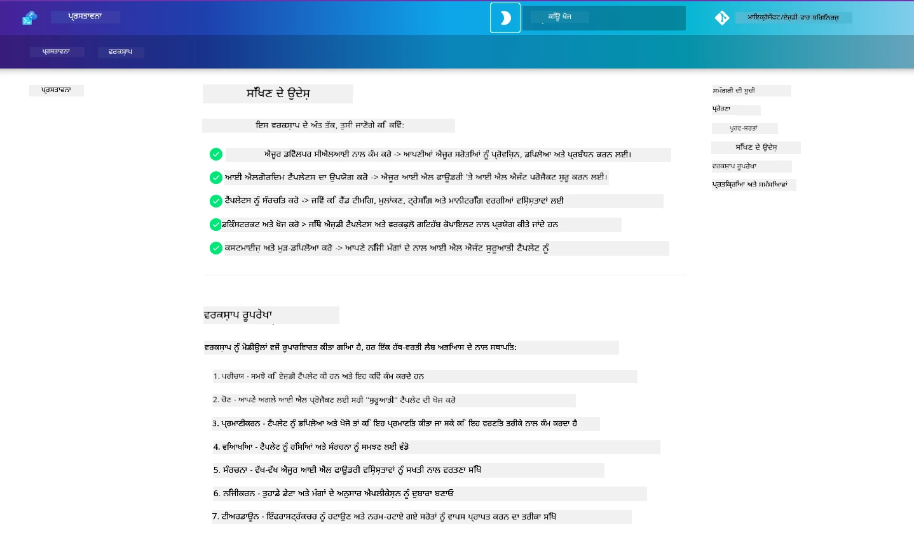

<div align="center">
  <div style="background: linear-gradient(135deg, #0078d4, #106ebe); border-radius: 10px; padding: 20px; margin: 20px 0; box-shadow: 0 4px 15px rgba(0, 120, 212, 0.3); border: 2px solid #005a9e;">
    <h2 style="color: white; margin: 0; font-size: 24px; text-shadow: 1px 1px 2px rgba(0,0,0,0.3);">
      🎯 AZD ਫਾਰ ਏਆਈ ਡਿਵੈਲਪਰਾਂ ਦਾ ਵਰਕਸ਼ਾਪ
    </h2>
    <p style="color: white; margin: 10px 0 0 0; font-size: 16px; text-shadow: 1px 1px 2px rgba(0,0,0,0.3);">
      <strong>Azure Developer CLI ਨਾਲ ਏਆਈ ਐਪਲੀਕੇਸ਼ਨਾਂ ਬਣਾਉਣ ਲਈ ਇੱਕ ਪ੍ਰਯੋਗਾਤਮਕ ਵਰਕਸ਼ਾਪ।</strong><br>
      AZD ਟੈਮਪਲੇਟਸ ਅਤੇ ਏਆਈ ਡਿਪਲੌਇਮੈਂਟ ਵਰਕਫਲੋਜ਼ ਵਿੱਚ ਨਿਪੁੰਨ ਹੋਣ ਲਈ 7 ਮੋਡਿਊਲਸ ਪੂਰੇ ਕਰੋ।
    </p>
    <div style="margin-top: 15px;">
      <span style="background: rgba(255,255,255,0.2); padding: 5px 10px; border-radius: 15px; color: white; font-size: 14px;">
        📅 ਆਖਰੀ ਅੱਪਡੇਟ: ਫਰਵਰੀ 2026
      </span>
    </div>
  </div>
</div>

# AZD ਫਾਰ ਏਆਈ ਡਿਵੈਲਪਰਾਂ ਦਾ ਵਰਕਸ਼ਾਪ

Azure Developer CLI (AZD) ਸਿੱਖਣ ਲਈ ਹੱਥ-ਵਰਤੋਂ ਵਾਲੇ ਵਰਕਸ਼ਾਪ ਵਿੱਚ ਤੁਹਾਡਾ ਸਵਾਗਤ ਹੈ, ਜਿਸਦਾ ਧਿਆਨ ਏਆਈ ਐਪਲੀਕੇਸ਼ਨ ਡਿਪਲੌਇਮੈਂਟ 'ਤੇ ਕੇਂਦ੍ਰਿਤ ਹੈ। ਇਹ ਵਰਕਸ਼ਾਪ ਤੁਹਾਨੂੰ AZD ਟੈਮਪਲੇਟਸ ਨੂੰ 3 ਕਦਮਾਂ ਵਿੱਚ ਵਿਹਾਰਕ ਸਮਝ ਪ੍ਰਦਾਨ ਕਰਦਾ ਹੈ:

1. **ਖੋਜ** - ਉਹ ਟੈਮਪਲੇਟ ਲੱਭੋ ਜੋ ਤੁਹਾਡੇ ਲਈ ਠੀਕ ਹੈ।
1. **ਡਿਪਲੌਇਮੈਂਟ** - ਡਿਪਲੌਇ ਕਰੋ ਅਤੇ ਮਾਨਿਆ ਜਾਵੇ ਕਿ ਇਹ ਕੰਮ ਕਰਦਾ ਹੈ
1. **ਕਸਟਮਾਈਜ਼ੇਸ਼ਨ** - ਸੋਧੋ ਅਤੇ ਦੁਹਰਾਓ ਤਾਂ ਜੋ ਇਹ ਤੁਹਾਡਾ ਬਣ ਜਾਵੇ!

ਇਸ ਵਰਕਸ਼ਾਪ ਦੇ ਦੌਰਾਨ, ਤੁਹਾਨੂੰ ਮੁੱਖ ਡਿਵੈਲਪਰ ਟੂਲ ਅਤੇ ਵਰਕਫਲੋਜ਼ ਨਾਲ ਵੀ ਰੂਬਰੂ ਕਰਵਾਇਆ ਜਾਵੇਗਾ, ਤਾਂ ਜੋ ਤੁਹਾਡਾ ਏੰਡ-ਟੂ-ਏੰਡ ਵਿਕਾਸ ਯਾਤਰਾ ਸੁਚਾਰੂ ਹੋ ਸਕੇ।

<br/>

## ਬ੍ਰਾਉਜ਼ਰ-ਆਧਾਰਿਤ ਗਾਈਡ

ਵਰਕਸ਼ਾਪ ਪਾਠ ਮਾਰਕਡਾਊਨ ਵਿੱਚ ਹਨ। ਤੁਸੀਂ ਉਨ੍ਹਾਂ ਨੂੰ ਸਿੱਧਾ GitHub ਵਿੱਚ ਨੈਵੀਗੇਟ ਕਰ ਸਕਦੇ ਹੋ - ਜਾਂ ਨੀਵੇਂ ਸਕ੍ਰੀਨਸ਼ਾਟ ਵਿੱਚ ਦਰਸਾਏ ਤਰੀਕੇ ਨਾਲ ਬ੍ਰਾਉਜ਼ਰ-ਆਧਾਰਿਤ ਪ੍ਰੀਵਿਊ ਲਾਂਚ ਕਰ ਸਕਦੇ ਹੋ।



ਇਸ ਵਿਕਲਪ ਨੂੰ ਵਰਤਣ ਲਈ - ਰਿਪੋਜ਼ਟਰੀ ਨੂੰ ਆਪਣੇ ਪ੍ਰੋਫਾਈਲ 'ਤੇ fork ਕਰੋ, ਅਤੇ GitHub Codespaces ਲਾਂਚ ਕਰੋ। ਜਦੋਂ VS Code ਟਰਮੀਨਲ ਸਰਗਰਮ ਹੋ ਜਾਵੇ, ਇਹ ਹੁਕਮ ਟਾਈਪ ਕਰੋ:

```bash title="" linenums="0"
mkdocs serve > /dev/null 2>&1 &
```

ਕੁਝ ਸਕਿੰਟਾਂ ਵਿੱਚ, ਤੁਸੀਂ ਇੱਕ ਪੌਪ-ਅੱਪ ਡਾਇਲਾਗ ਵੇਖੋਗੇ। ਵਿਕਲਪ 'Open in browser' ਚੁਣੋ। ਵੈੱਬ-ਆਧਾਰਿਤ ਗਾਈਡ ਹੁਣ ਨਵੇਂ ਬ੍ਰਾਉਜ਼ਰ ਟੈੱਬ ਵਿੱਚ ਖੁਲ ਜਾਵੇਗੀ। ਇਸ ਪ੍ਰੀਵਿਊ ਦੇ ਕੁਝ ਫਾਇਦੇ:

1. **ਬਿਲਟ-ਇਨ ਖੋਜ** - ਕੀਵਰਡ ਜਾਂ ਪਾਠ ਨੂੰ ਤੇਜ਼ੀ ਨਾਲ ਲੱਭੋ।
1. **ਕਾਪੀ ਆਇਕਨ** - ਕੋਡਬਲਾਕਸ 'ਤੇ ਹੋਵਰ ਕਰੋ ਤਾਂ ਇਹ ਵਿਕਲਪ ਵੇਖੋ
1. **ਥੀਮ ਟੌਗਲ** - ਡਾਰਕ ਅਤੇ ਲਾਈਟ ਥੀਮਾਂ ਵਿਚ ਬਦਲੋ
1. **ਮਦਦ ਪ੍ਰਾਪਤ ਕਰੋ** - ਫੂਟਰ ਵਿੱਚ Discord ਆਇਕਨ 'ਤੇ ਕਲਿੱਕ ਕਰਕੇ ਜੁੜੋ!

<br/>

## ਵਰਕਸ਼ਾਪ ਓਵਰਵਿਊ

**ਅਵਧੀ:** 3-4 ਘੰਟੇ  
**ਸਤਰ:** ਸ਼ੁਰੂਆਤੀ ਤੋਂ ਦਰਮਿਆਨੀ  
**ਪੂਰਵ-ਅਵਸ਼ਯਕਤਾਵਾਂ:** Azure, ਏਆਈ ਸੰਕਲਪ, VS Code ਅਤੇ ਕਮਾਂਡ-ਲਾਈਨ ਟੂਲਾਂ ਨਾਲ ਜਾਣੂਇਤਾ।

ਇਹ ਇੱਕ ਹੱਥ-ਵਰਤੋਂ ਵਾਲਾ ਵਰਕਸ਼ਾਪ ਹੈ ਜਿਥੇ ਤੁਸੀਂ ਕਰਕੇ ਸਿੱਖਦੇ ਹੋ। ਇੱਕ ਵਾਰੀ ਜਦੋਂ ਤੁਸੀਂ ਕਿਸੇ ਭਿਆਨਕਰਾ ਅਭਿਆਸ ਨੂੰ ਪੂਰਾ ਕਰ ਲੈਂਦੇ ਹੋ, ਤਾਂ ਅਸੀਂ AZD For Beginners ਕਰਿਕੁਲਮ ਦੀ ਸਮੀਖਿਆ ਕਰਨ ਦੀ ਸਿਫਾਰਸ਼ ਕਰਦੇ ਹਾਂ ਤਾਂ ਜੋ ਤੁਹਾਡੀ ਸਿੱਖਣ ਯਾਤਰਾ ਸੁਰੱਖਿਆ ਅਤੇ ਉਤਪਾਦਕਤਾ ਦੇ ਸਰਵੋਤਮ ਅਭਿਆਸਾਂ ਵੱਲ ਜਾਰੀ ਰਹੇ।

| Time| Module  | Objective |
|:---|:---|:---|
| 15 ਮਿੰਟ | [ਪਰਿਚਿਆ](docs/instructions/0-Introduction.md) | ਮੰਚ ਸੈੱਟ ਕਰੋ, ਉਦੇਸ਼ ਸਮਝੋ |
| 30 ਮਿੰਟ | [AI ਟੈਮਪਲੇਟ ਚੁਣੋ](docs/instructions/1-Select-AI-Template.md) | ਵਿਕਲਪਾਂ ਦੀ ਪੜਤਾਲ ਕਰੋ ਅਤੇ ਸ਼ੁਰੂਆਤੀ ਚੁਣੋ | 
| 30 ਮਿੰਟ | [AI ਟੈਮਪਲੇਟ ਸਤਿਆਪਿਤ ਕਰੋ](docs/instructions/2-Validate-AI-Template.md) | ਡਿਫਾਲਟ ਹੱਲ ਨੂੰ Azure 'ਤੇ ਡਿਪਲੌਇ ਕਰੋ |
| 30 ਮਿੰਟ | [AI ਟੈਮਪਲੇਟ ਵਿਸ਼ਲੇਸ਼ਣ](docs/instructions/3-Deconstruct-AI-Template.md) | ਸਰਚਨਾ ਅਤੇ ਸੰਰਚਨਾ ਦੀ ਜਾਂਚ ਕਰੋ |
| 30 ਮਿੰਟ | [AI ਟੈਮਪਲੇਟ ਸੰਰਚਿਤ ਕਰੋ](docs/instructions/4-Configure-AI-Template.md) | ਵਿਲਕ-ਫੀਚਰਜ਼ ਨੂੰ ਸਰਗਰਮ ਕਰੋ ਅਤੇ ਅਜ਼ਮਾਓ |
| 30 ਮਿੰਟ | [AI ਟੈਮਪਲੇਟ ਕਸਟਮਾਈਜ਼ ਕਰੋ](docs/instructions/5-Customize-AI-Template.md) | ਟੈਮਪਲੇਟ ਨੂੰ ਆਪਣੀਆਂ ਜ਼ਰੂਰਤਾਂ ਅਨੁਸਾਰ ਅਨੁਕੂਲ ਕਰੋ |
| 30 ਮਿੰਟ | [ਇੰਫਰਾਸਟਰੱਕਚਰ ਹਟਾਓ](docs/instructions/6-Teardown-Infrastructure.md) | ਰਿਸੋਰਸਸ ਦੀ ਸਫਾਈ ਅਤੇ ਰਿਲੀਜ਼ |
| 15 ਮਿੰਟ | [ਸੰਖੇਪ ਅਤੇ ਅਗਲੇ ਕਦਮ](docs/instructions/7-Wrap-up.md) | ਸਿੱਖਣ ਸਾਧਨ, ਵਰਕਸ਼ਾਪ ਚੈਲੈਂਜ |

<br/>

## ਤੁਹਾਨੂੰ ਕੀ ਸਿੱਖਣ ਨੂੰ ਮਿਲੇਗਾ

AZD ਟੈਮਪਲੇਟ ਨੂੰ ਇੱਕ ਸਿੱਖਣ ਵਾਲੇ ਸੈਂਡਬਾਕਸ ਵਜੋਂ ਸੋਚੋ ਜਿੱਥੇ ਤੁਸੀਂ Microsoft Foundry ਉੱਤੇ ਏੰਡ-ਟੂ-ਏੰਡ ਵਿਕਾਸ ਲਈ ਵੱਖ-ਵੱਖ ਸਮਰੱਥਾਵਾਂ ਅਤੇ ਟੂਲਾਂ ਦੀ ਪੜਤਾਲ ਕਰ ਸਕਦੇ ਹੋ। ਇਸ ਵਰਕਸ਼ਾਪ ਦੇ ਅੰਤ ਤੱਕ, ਤੁਹਾਨੂੰ ਇਸ ਸੰਦੇਭ ਵਿੱਚ ਵੱਖ-ਵੱਖ ਟੂਲਾਂ ਅਤੇ ਧਾਰਣਾਵਾਂ ਦੀ ਇੱਕ ਜੁਝਾਰੂ ਸਮਝ ਮਿਲ ਜਾਵੇਗੀ।

| ਕੌਂਸੈਪਟ  | ਉਦੇਸ਼ |
|:---|:---|
| **Azure Developer CLI** | ਟੂਲ ਦੇ ਕਮਾਂਡ ਅਤੇ ਵਰਕਫਲੋਜ਼ ਨੂੰ ਸਮਝੋ |
| **AZD Templates**| ਪ੍ਰੋਜੈਕਟ ਸਰਚਨਾ ਅਤੇ ਕਨਫਿਗ ਨੂੰ ਸਮਝੋ |
| **Azure AI Agent**| Microsoft Foundry ਪ੍ਰੋਜੈਕਟ ਦੀ ਪ੍ਰੋਵਿਜ਼ਨ ਅਤੇ ਡਿਪਲੌਇ ਕਰੋ  |
| **Azure AI Search**| ਏਜੈਂਟਸ ਨਾਲ ਸੰਦਰਭ ਇੰਜੀਨੀਅਰਿੰਗ ਯੋਗ ਬਣਾਓ |
| **Observability**| ਟਰੇਸਿੰਗ, ਮਾਨੀਟਰਿੰਗ ਅਤੇ ਮੁਲਾਂਕਣ ਦਾ ਅਧਿਐਨ ਕਰੋ |
| **Red Teaming**| ਵਿਰੋਧੀ ਟੈਸਟਿੰਗ ਅਤੇ ਰੋਕਥਾਮ ਤਕਨੀਕਾਂ ਦੀ ਪੜਤਾਲ ਕਰੋ |

<br/>

## ਵਰਕਸ਼ਾਪ ਢਾਂਚਾ

ਵਰਕਸ਼ਾਪ ਨੂੰ ਇਸ ਤਰੀਕੇ ਨਾਲ ਬਣਾਇਆ ਗਿਆ ਹੈ ਕਿ ਇਹ ਤੁਹਾਨੂੰ ਟੈਮਪਲੇਟ ਖੋਜ ਤੋਂ ਲੈ ਕੇ ਡਿਪਲੌਇਮੈਂਟ, ਵਿਸ਼ਲੇਸ਼ਣ ਅਤੇ ਕਸਟਮਾਈਜ਼ੇਸ਼ਨ ਦੇ ਯਾਤਰਾ 'ਤੇ ਲੈ ਜਾਵੇ - ਆਧਾਰ ਵਜੋਂ ਅਧਿਕਾਰਕ [Getting Started with AI Agents](https://github.com/Azure-Samples/get-started-with-ai-agents) ਸਟਾਰਟਰ ਟੈਮਪਲੇਟ ਦੀ ਵਰਤੋਂ ਕਰਦੇ ਹੋਏ।

### [ਮੋਡਿਊਲ 1: AI ਟੈਮਪਲੇਟ ਚੁਣੋ](docs/instructions/1-Select-AI-Template.md) (30 ਮਿੰਟ)

- AI ਟੈਮਪਲੇਟ ਕੀ ਹਨ?
- ਮੈਂ AI ਟੈਮਪਲੇਟ ਕਿਥੇ ਲੱਭ ਸਕਦਾ/ਸਕਦੀ ਹਾਂ?
- ਮੈਂ AI ਏਜੈਂਟ ਬਣਾਉਣਾ ਕਿਵੇਂ ਸ਼ੁਰੂ ਕਰ ਸਕਦਾ/ਸਕਦੀ ਹਾਂ?
- **ਲੈਬ**: GitHub Codespaces ਨਾਲ ਤੁਰੰਤ ਸ਼ੁਰੂਆਤ

### [ਮੋਡਿਊਲ 2: AI ਟੈਮਪਲੇਟ ਸਤਿਆਪਿਤ ਕਰੋ](docs/instructions/2-Validate-AI-Template.md) (30 ਮਿੰਟ)

- AI ਟੈਮਪਲੇਟ ਆਰਕੀਟੈਕਚਰ ਕੀ ਹੈ?
- AZD ਵਿਕਾਸ ਵਰਕਫਲੋ ਕੀ ਹੈ?
- AZD ਵਿਕਾਸ ਵਿੱਚ ਮਦਦ ਕਿਵੇਂ ਲੈ ਸਕਦੇ ਹਾਂ?
- **ਲੈਬ**: AI ਏਜੈਂਟਸ ਟੈਮਪਲੇਟ ਡਿਪਲੌਇ ਅਤੇ ਵੈਧ ਕਰੋ

### [ਮੋਡਿਊਲ 3: AI ਟੈਮਪਲੇਟ ਵਿਸ਼ਲੇਸ਼ਣ](docs/instructions/3-Deconstruct-AI-Template.md) (30 ਮਿੰਟ)

- ਆਪਣੇ ਪਰੀਵਾਰ ਨੂੰ `.azure/` ਵਿੱਚ ਵੇਖੋ
- ਆਪਣੇ ਰਿਸੋਰਸ ਸੈੱਟਅਪ ਨੂੰ `infra/` ਵਿੱਚ ਵੇਖੋ
- ਆਪਣੇ AZD ਸੰਰਚਨਾ ਨੂੰ `azure.yaml` ਵਿੱਚ ਵੇਖੋ
- **ਲੈਬ**: ਇਨਵਾਇਰਨਮੈਂਟ ਵੈਰੀਏਬਲਸ ਸੋਧੋ ਅਤੇ ਮੁੜ-ਡਿਪਲੌਇ ਕਰੋ

### [ਮੋਡਿਊਲ 4: AI ਟੈਮਪਲੇਟ ਸੰਰਚਿਤ ਕਰੋ](docs/instructions/4-Configure-AI-Template.md) (30 ਮਿੰਟ)
- ਪੜਤਾਲ: Retrieval Augmented Generation
- ਪੜਤਾਲ: Agent Evaluation & Red Teaming
- ਪੜਤਾਲ: Tracing & Monitoring
- **ਲੈਬ**: AI ਏਜੈਂਟ + Observability ਦੀ ਪੜਤਾਲ

### [ਮੋਡਿਊਲ 5: AI ਟੈਮਪਲੇਟ ਕਸਟਮਾਈਜ਼ ਕਰੋ](docs/instructions/5-Customize-AI-Template.md) (30 ਮਿੰਟ)
- ਪਰਿਭਾਸ਼ਾ: ਸਹੀ ਪ੍ਰੋਡਕਟ ਰਿਕਵਾਇਰਮੈਂਟਸ (PRD) ਦੇ ਨਾਲ ਦ੍ਰਿਸ਼
- ਸੰਰਚਿਤ ਕਰੋ: AZD ਲਈ ਇਨਵਾਇਰਨਮੈਂਟ ਵੈਰੀਏਬਲ
- ਲਾਗੂ ਕਰੋ: ਜੋੜੇ ਹੋਏ ਕਾਰਜਾਂ ਲਈ ਲਾਈਫਸਾਇਕਲ ਹੂਕਸ
- **ਲੈਬ**: ਆਪਣੇ ਸਨੈਰਿਓ ਲਈ ਟੈਮਪਲੇਟ ਕਸਟਮਾਈਜ਼ ਕਰੋ

### [ਮੋਡਿਊਲ 6: ਇੰਫਰਾਸਟਰੱਕਚਰ ਹਟਾਓ](docs/instructions/6-Teardown-Infrastructure.md) (30 ਮਿੰਟ)
- ਦੁਹਰਾਓ: AZD ਟੈਮਪਲੇਟ ਕੀ ਹਨ?
- ਦੁਹਰਾਓ: Azure Developer CLI ਕਿਉਂ ਵਰਤਣਾ ਹੈ?
- ਅਗਲੇ ਕਦਮ: ਇਕ ਵੱਖਰਾ ਟੈਮਪਲੇਟ ਅਜ਼ਮਾਓ!
- **ਲੈਬ**: ਇੰਫਰਾਸਟਰੱਕਚਰ ਦੀ ਡੀ-ਪ੍ਰੋਵਿਜ਼ਨ ਅਤੇ ਸਫਾਈ

<br/>

## ਵਰਕਸ਼ਾਪ ਚੈਲੈਂਜ

ਆਪਣੇ ਆਪ ਨੂੰ ਹੋਰ ਚੁਣੌਤੀ ਦੇਣਾ ਚਾਹੁੰਦੇ ਹੋ? ਇੱਥੇ ਕੁਝ ਪ੍ਰੋਜੈਕਟ ਸੁਝਾਅ ਹਨ - ਜਾਂ ਸਾਡੇ ਨਾਲ ਆਪਣੇ ਵਿਚਾਰ ਸਾਂਝੇ ਕਰੋ!!

| Project | Description |
|:---|:---|
|1. **ਇੱਕ ਜਟਿਲ AI ਟੈਮਪਲੇਟ ਦੀ ਵਿਸ਼ਲੇਸ਼ਣ ਕਰੋ** | ਦਿੱਤੇ ਗਏ ਵਰਕਫਲੋ ਅਤੇ ਟੂਲਾਂ ਦੀ ਵਰਤੋਂ ਕਰੋ ਅਤੇ ਦੇਖੋ ਕਿ ਕੀ ਤੁਸੀਂ ਇੱਕ ਵੱਖਰਾ AI ਹੱਲ ਟੈਮਪਲੇਟ ਡਿਪਲੌਇ, ਵੈਧ ਅਤੇ ਕਸਟਮਾਈਜ਼ ਕਰ ਸਕਦੇ ਹੋ। _ਤੁਸੀਂ ਕੀ ਸਿੱਖਿਆ?_|
|2. **ਆਪਣੇ ਸਨੈਰਿਓ ਨਾਲ ਕਸਟਮਾਈਜ਼ ਕਰੋ**  | ਕਿਸੇ ਵੱਖਰੇ ਸਨੈਰਿਓ ਲਈ PRD (Product Requirements Document) ਲਿਖਣ ਦੀ ਕੋਸ਼ਿਸ਼ ਕਰੋ। ਫਿਰ ਆਪਣੇ ਟੈਮਪਲੇਟ ਰੇਪੋ ਵਿਚ GitHub Copilot ਨੂੰ Agent Model ਵਿੱਚ ਵਰਤੋ - ਅਤੇ ਇਸ ਨੂੰ ਆਪਣੇ ਲਈ ਇੱਕ ਕਸਟਮਾਈਜ਼ੇਸ਼ਨ ਵਰਕਫਲੋ ਬਨਾਉਣ ਲਈ ਕਹੋ। _ਤੁਸੀਂ ਕੀ ਸਿੱਖਿਆ? ਤੁਸੀਂ ਇਨ੍ਹਾਂ ਸੁਝਾਵਾਂ ਨੂੰ ਕਿਵੇਂ ਸੁਧਾਰ ਸਕਦੇ ਹੋ?_|
| | |

## ਫੀਡਬੈਕ ਹੈ?

1. ਇਸ ਰੇਪੋ 'ਤੇ ਇੱਕ ਇਸ਼ੂ ਪੋਸਟ ਕਰੋ - ਸੁਵਿਧਾ ਲਈ ਇਸਨੂੰ `Workshop` ਟੈਗ ਕਰੋ।
1. Microsoft Foundry Discord ਵਿੱਚ ਸ਼ਾਮਿਲ ਹੋਵੋ - ਆਪਣੇ ਸਾਥੀਆਂ ਨਾਲ ਜੁੜੋ！


| | | 
|:---|:---|
| **📚 ਕੋਰਸ ਮੁੱਖ**| [AZD For Beginners](../README.md)|
| **📖 ਦਸਤਾਵੇਜ਼** | [Get started with AI templates](https://learn.microsoft.com/en-us/azure/ai-foundry/how-to/develop/ai-template-get-started)|
| **🛠️AI ਟੈਮਪਲੇਟਸ** | [Microsoft Foundry Templates](https://ai.azure.com/templates) |
|**🚀 ਅਗਲੇ ਕਦਮ** | [ਵਰਕਸ਼ਾਪ ਸ਼ੁਰੂ ਕਰੋ](../../../workshop) |
| | |

<br/>

---

**ਨੈਵੀਗੇਸ਼ਨ:** [ਮੁੱਖ ਕੋਰਸ](../README.md) | [ਪਰਿਚਿਆ](docs/instructions/0-Introduction.md) | [ਮੋਡਿਊਲ 1: AI ਟੈਮਪਲੇਟ ਚੁਣੋ](docs/instructions/1-Select-AI-Template.md)

**AZD ਨਾਲ ਏਆਈ ਐਪਲੀਕੇਸ਼ਨਾਂ ਬਣਾਉਣਾ ਸ਼ੁਰੂ ਕਰਨ ਲਈ ਤਿਆਰ ਹੋ?**

[ਵਰਕਸ਼ਾਪ ਸ਼ੁਰੂ ਕਰੋ: ਪਰਿਚਿਆ →](docs/instructions/0-Introduction.md)

---

<!-- CO-OP TRANSLATOR DISCLAIMER START -->
ਇਨਕਾਰ-ਘੋਸ਼ਣਾ:
ਇਸ ਦਸਤਾਵੇਜ਼ ਦਾ ਅਨੁਵਾਦ AI ਅਨੁਵਾਦ ਸੇਵਾ Co-op Translator (https://github.com/Azure/co-op-translator) ਦੀ ਵਰਤੋਂ ਕਰਕੇ ਕੀਤਾ ਗਿਆ ਹੈ। ਜਦੋਂ ਕਿ ਅਸੀਂ ਸਹੀਤਾ ਲਈ ਕੋਸ਼ਿਸ਼ ਕਰਦੇ ਹਾਂ, ਕਿਰਪਾ ਕਰਕੇ ਧਿਆਨ ਰੱਖੋ ਕਿ ਸਵੈਚਲਿਤ ਅਨੁਵਾਦਾਂ ਵਿੱਚ ਗਲਤੀਆਂ ਜਾਂ ਅਣਸਹੀਤੀਆਂ ਹੋ ਸਕਦੀਆਂ ਹਨ। ਮੂਲ ਦਸਤਾਵੇਜ਼ ਨੂੰ ਉਸ ਦੀ ਮੂਲ ਭਾਸ਼ਾ ਵਿੱਚ ਅਧਿਕਾਰਿਕ ਸਰੋਤ ਮੰਨਿਆ ਜਾਣਾ ਚਾਹੀਦਾ ਹੈ। ਨਾਜ਼ੁਕ ਜਾਂ ਨਿਰਣਾਇਕ ਜਾਣਕਾਰੀ ਲਈ, ਪੇਸ਼ੇਵਰ ਮਨੁੱਖੀ ਅਨੁਵਾਦ ਦੀ ਸਿਫਾਰਿਸ਼ ਕੀਤੀ ਜਾਂਦੀ ਹੈ। ਅਸੀਂ ਇਸ ਅਨੁਵਾਦ ਦੀ ਵਰਤੋਂ ਤੋਂ ਉਪਜਣ ਵਾਲੀਆਂ ਕਿਸੇ ਵੀ ਗਲਤਫਹਮੀਆਂ ਜਾਂ ਗਲਤ ਵਿਆਖਿਆਵਾਂ ਲਈ ਜ਼ਿੰਮੇਵਾਰ ਨਹੀਂ ਹੋਵਾਂਗੇ।
<!-- CO-OP TRANSLATOR DISCLAIMER END -->