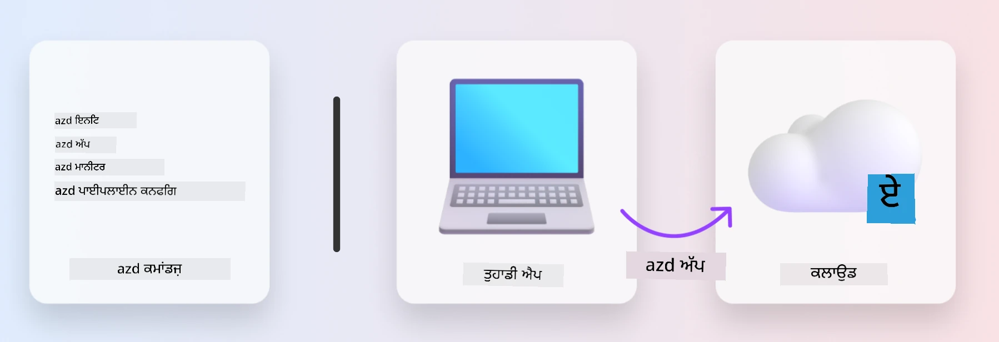

<!--
CO_OP_TRANSLATOR_METADATA:
{
  "original_hash": "06d6207eff634aefcaa41739490a5324",
  "translation_date": "2025-09-24T14:54:56+00:00",
  "source_file": "workshop/docs/instructions/1-Select-AI-Template.md",
  "language_code": "pa"
}
-->
# 1. ਟੈਂਪਲੇਟ ਚੁਣੋ

!!! tip "ਇਸ ਮੋਡਿਊਲ ਦੇ ਅੰਤ ਤੱਕ ਤੁਸੀਂ ਇਹ ਕਰਨ ਦੇ ਯੋਗ ਹੋਵੋਗੇ"

    - [ ] AZD ਟੈਂਪਲੇਟਸ ਕੀ ਹਨ, ਇਹ ਵੇਰਵਾ ਦਿਓ
    - [ ] AZD ਟੈਂਪਲੇਟਸ ਨੂੰ ਖੋਜੋ ਅਤੇ AI ਲਈ ਵਰਤੋ
    - [ ] AI Agents ਟੈਂਪਲੇਟ ਨਾਲ ਸ਼ੁਰੂਆਤ ਕਰੋ
    - [ ] **ਲੈਬ 1:** GitHub Codespaces ਨਾਲ AZD Quickstart

---

## 1. ਇੱਕ ਬਿਲਡਰ ਦੀ ਮਿਸਾਲ

ਆਧੁਨਿਕ ਐਨਟਰਪ੍ਰਾਈਜ਼-ਤਿਆਰ AI ਐਪਲੀਕੇਸ਼ਨ ਨੂੰ _ਸ਼ੁਰੂ ਤੋਂ_ ਬਣਾਉਣਾ ਡਰਾਉਣਾ ਹੋ ਸਕਦਾ ਹੈ। ਇਹ ਕੁਝ ਇਸ ਤਰ੍ਹਾਂ ਹੈ ਜਿਵੇਂ ਤੁਸੀਂ ਆਪਣਾ ਨਵਾਂ ਘਰ ਆਪਣੇ ਆਪ, ਇੱਟ-ਇੱਟ ਕਰਕੇ ਬਣਾਉ। ਹਾਂ, ਇਹ ਕੀਤਾ ਜਾ ਸਕਦਾ ਹੈ! ਪਰ ਇਹ ਚਾਹੇ ਗਏ ਨਤੀਜੇ ਨੂੰ ਪ੍ਰਾਪਤ ਕਰਨ ਦਾ ਸਭ ਤੋਂ ਪ੍ਰਭਾਵਸ਼ਾਲੀ ਤਰੀਕਾ ਨਹੀਂ ਹੈ!

ਇਸ ਦੀ ਬਜਾਏ, ਅਸੀਂ ਅਕਸਰ ਮੌਜੂਦਾ _ਡਿਜ਼ਾਈਨ ਬਲੂਪ੍ਰਿੰਟ_ ਨਾਲ ਸ਼ੁਰੂ ਕਰਦੇ ਹਾਂ ਅਤੇ ਇਸਨੂੰ ਆਪਣੇ ਨਿੱਜੀ ਜ਼ਰੂਰਤਾਂ ਅਨੁਸਾਰ ਕਸਟਮਾਈਜ਼ ਕਰਨ ਲਈ ਇੱਕ ਆਰਕੀਟੈਕਟ ਨਾਲ ਕੰਮ ਕਰਦੇ ਹਾਂ। ਅਤੇ ਇਹੀ ਤਰੀਕਾ ਹੈ ਜੋ ਬੁੱਧੀਮਾਨ ਐਪਲੀਕੇਸ਼ਨ ਬਣਾਉਣ ਵੇਲੇ ਅਪਨਾਉਣਾ ਚਾਹੀਦਾ ਹੈ। ਪਹਿਲਾਂ, ਇੱਕ ਚੰਗੀ ਡਿਜ਼ਾਈਨ ਆਰਕੀਟੈਕਚਰ ਲੱਭੋ ਜੋ ਤੁਹਾਡੇ ਸਮੱਸਿਆ ਖੇਤਰ ਨਾਲ ਮੇਲ ਖਾਂਦੀ ਹੋਵੇ। ਫਿਰ ਇੱਕ ਸੋਲਿਊਸ਼ਨ ਆਰਕੀਟੈਕਟ ਨਾਲ ਕੰਮ ਕਰਕੇ ਇਸਨੂੰ ਤੁਹਾਡੇ ਵਿਸ਼ੇਸ਼ ਸਨਰੀਓ ਲਈ ਕਸਟਮਾਈਜ਼ ਅਤੇ ਵਿਕਸਿਤ ਕਰੋ।

ਪਰ ਇਹ ਡਿਜ਼ਾਈਨ ਬਲੂਪ੍ਰਿੰਟਸ ਕਿੱਥੇ ਮਿਲਦੇ ਹਨ? ਅਤੇ ਇੱਕ ਆਰਕੀਟੈਕਟ ਕਿਵੇਂ ਲੱਭੀਏ ਜੋ ਸਾਨੂੰ ਸਿਖਾਉਣ ਲਈ ਤਿਆਰ ਹੋਵੇ ਕਿ ਇਹ ਬਲੂਪ੍ਰਿੰਟਸ ਨੂੰ ਆਪਣੇ ਆਪ ਕਿਵੇਂ ਕਸਟਮਾਈਜ਼ ਅਤੇ ਡਿਪਲੌਇ ਕਰਨਾ ਹੈ? ਇਸ ਵਰਕਸ਼ਾਪ ਵਿੱਚ, ਅਸੀਂ ਤੁਹਾਡੇ ਲਈ ਇਹ ਸਵਾਲਾਂ ਦੇ ਜਵਾਬ ਦਿੰਦੇ ਹਾਂ ਅਤੇ ਤੁਹਾਨੂੰ ਤਿੰਨ ਤਕਨਾਲੋਜੀਆਂ ਨਾਲ ਜਾਣੂ ਕਰਵਾਉਂਦੇ ਹਾਂ:

1. [Azure Developer CLI](https://aka.ms/azd) - ਇੱਕ ਖੁੱਲ੍ਹਾ-ਸਰੋਤ ਟੂਲ ਜੋ ਡਿਵੈਲਪਰ ਪਾਥ ਨੂੰ ਸਥਾਨਕ ਵਿਕਾਸ (ਬਿਲਡ) ਤੋਂ ਕਲਾਉਡ ਡਿਪਲੌਇਮੈਂਟ (ਸ਼ਿਪ) ਤੱਕ ਤੇਜ਼ ਕਰਦਾ ਹੈ।
1. [Azure AI Foundry Templates](https://ai.azure.com/templates) - ਮਿਆਰੀ ਖੁੱਲ੍ਹੇ-ਸਰੋਤ ਰਿਪੋਜ਼ਿਟਰੀਜ਼ ਜੋ AI ਸੋਲਿਊਸ਼ਨ ਆਰਕੀਟੈਕਚਰ ਨੂੰ ਡਿਪਲੌਇ ਕਰਨ ਲਈ ਨਮੂਨਾ ਕੋਡ, ਇੰਫਰਾਸਟ੍ਰਕਚਰ ਅਤੇ ਕਨਫਿਗਰੇਸ਼ਨ ਫਾਈਲਾਂ ਸ਼ਾਮਲ ਕਰਦੀਆਂ ਹਨ।
1. [GitHub Copilot Agent Mode](https://code.visualstudio.com/docs/copilot/chat/chat-agent-mode) - Azure ਗਿਆਨ ਵਿੱਚ ਜੜਿਆ ਇੱਕ ਕੋਡਿੰਗ ਏਜੰਟ, ਜੋ ਸਾਨੂੰ ਕੋਡਬੇਸ ਵਿੱਚ ਨੈਵੀਗੇਟ ਕਰਨ ਅਤੇ ਬਦਲਾਅ ਕਰਨ ਵਿੱਚ ਮਦਦ ਕਰ ਸਕਦਾ ਹੈ - ਕੁਦਰਤੀ ਭਾਸ਼ਾ ਦੀ ਵਰਤੋਂ ਕਰਕੇ।

ਇਹ ਟੂਲਜ਼ ਦੇ ਨਾਲ, ਹੁਣ ਅਸੀਂ _ਸਹੀ ਟੈਂਪਲੇਟ_ ਲੱਭ ਸਕਦੇ ਹਾਂ, _ਡਿਪਲੌਇ_ ਕਰਕੇ ਇਹ ਪੱਕਾ ਕਰ ਸਕਦੇ ਹਾਂ ਕਿ ਇਹ ਕੰਮ ਕਰਦਾ ਹੈ, ਅਤੇ _ਕਸਟਮਾਈਜ਼_ ਕਰਕੇ ਇਸਨੂੰ ਆਪਣੇ ਵਿਸ਼ੇਸ਼ ਸਨਰੀਓਜ਼ ਲਈ ਸੁਟ ਕਰ ਸਕਦੇ ਹਾਂ। ਆਓ ਸਿੱਖਣ ਲਈ ਸ਼ੁਰੂਆਤ ਕਰੀਏ ਕਿ ਇਹ ਕਿਵੇਂ ਕੰਮ ਕਰਦੇ ਹਨ।

---

## 2. Azure Developer CLI

[Azure Developer CLI](https://learn.microsoft.com/en-us/azure/developer/azure-developer-cli/) (ਜਾਂ `azd`) ਇੱਕ ਖੁੱਲ੍ਹਾ-ਸਰੋਤ ਕਮਾਂਡਲਾਈਨ ਟੂਲ ਹੈ ਜੋ ਤੁਹਾਡੇ ਕੋਡ-ਤੋਂ-ਕਲਾਉਡ ਯਾਤਰਾ ਨੂੰ ਤੇਜ਼ ਕਰ ਸਕਦਾ ਹੈ। ਇਹ ਡਿਵੈਲਪਰ-ਫ੍ਰੈਂਡਲੀ ਕਮਾਂਡਾਂ ਦੇ ਸੈੱਟ ਨਾਲ ਕੰਮ ਕਰਦਾ ਹੈ ਜੋ ਤੁਹਾਡੇ IDE (ਵਿਕਾਸ) ਅਤੇ CI/CD (ਡਿਵਓਪਸ) ਵਾਤਾਵਰਣਾਂ ਵਿੱਚ ਲਗਾਤਾਰ ਕੰਮ ਕਰਦੇ ਹਨ।

`azd` ਨਾਲ, ਤੁਹਾਡਾ ਡਿਪਲੌਇਮੈਂਟ ਸਫਰ ਇਸ ਤਰ੍ਹਾਂ ਸਧਾਰਨ ਹੋ ਸਕਦਾ ਹੈ:

- `azd init` - ਮੌਜੂਦਾ AZD ਟੈਂਪਲੇਟ ਤੋਂ ਇੱਕ ਨਵਾਂ AI ਪ੍ਰੋਜੈਕਟ ਸ਼ੁਰੂ ਕਰਦਾ ਹੈ।
- `azd up` - ਇੰਫਰਾਸਟ੍ਰਕਚਰ ਪ੍ਰੋਵੀਜ਼ਨ ਕਰਦਾ ਹੈ ਅਤੇ ਇੱਕ ਕਦਮ ਵਿੱਚ ਤੁਹਾਡੀ ਐਪਲੀਕੇਸ਼ਨ ਡਿਪਲੌਇ ਕਰਦਾ ਹੈ।
- `azd monitor` - ਤੁਹਾਡੀ ਡਿਪਲੌਇ ਕੀਤੀ ਐਪਲੀਕੇਸ਼ਨ ਲਈ ਰੀਅਲ-ਟਾਈਮ ਮਾਨੀਟਰਿੰਗ ਅਤੇ ਡਾਇਗਨੋਸਟਿਕਸ ਪ੍ਰਾਪਤ ਕਰੋ।
- `azd pipeline config` - Azure ਵਿੱਚ ਡਿਪਲੌਇਮੈਂਟ ਨੂੰ ਆਟੋਮੇਟ ਕਰਨ ਲਈ CI/CD ਪਾਈਪਲਾਈਨ ਸੈਟਅਪ ਕਰੋ।

**🎯 | ਅਭਿਆਸ**: <br/> 
GitHub Codespaces ਵਾਤਾਵਰਣ ਵਿੱਚ `azd` ਕਮਾਂਡਲਾਈਨ ਟੂਲ ਦੀ ਖੋਜ ਕਰੋ। ਇਸ ਕਮਾਂਡ ਨਾਲ ਸ਼ੁਰੂਆਤ ਕਰੋ ਤਾਂ ਜੋ ਤੁਸੀਂ ਦੇਖ ਸਕੋ ਕਿ ਇਹ ਟੂਲ ਕੀ ਕਰ ਸਕਦਾ ਹੈ:

```bash title="" linenums="0"
azd help
```



---

## 3. AZD ਟੈਂਪਲੇਟ

`azd` ਨੂੰ ਇਹ ਜਾਣਨ ਦੀ ਲੋੜ ਹੁੰਦੀ ਹੈ ਕਿ ਕਿਹੜਾ ਇੰਫਰਾਸਟ੍ਰਕਚਰ ਪ੍ਰੋਵੀਜ਼ਨ ਕਰਨਾ ਹੈ, ਕਿਹੜੀਆਂ ਕਨਫਿਗਰੇਸ਼ਨ ਸੈਟਿੰਗਜ਼ ਲਾਗੂ ਕਰਨੀ ਹਨ, ਅਤੇ ਕਿਹੜੀ ਐਪਲੀਕੇਸ਼ਨ ਡਿਪਲੌਇ ਕਰਨੀ ਹੈ। ਇਹੀ ਜਿੱਥੇ [AZD ਟੈਂਪਲੇਟਸ](https://learn.microsoft.com/en-us/azure/developer/azure-developer-cli/azd-templates?tabs=csharp) ਮਦਦ ਕਰਦੇ ਹਨ।

AZD ਟੈਂਪਲੇਟਸ ਖੁੱਲ੍ਹੇ-ਸਰੋਤ ਰਿਪੋਜ਼ਿਟਰੀਜ਼ ਹਨ ਜੋ ਨਮੂਨਾ ਕੋਡ ਨੂੰ ਇੰਫਰਾਸਟ੍ਰਕਚਰ ਅਤੇ ਕਨਫਿਗਰੇਸ਼ਨ ਫਾਈਲਾਂ ਨਾਲ ਜੋੜਦੇ ਹਨ ਜੋ ਸੋਲਿਊਸ਼ਨ ਆਰਕੀਟੈਕਚਰ ਨੂੰ ਡਿਪਲੌਇ ਕਰਨ ਲਈ ਲੋੜੀਂਦੇ ਹਨ। 
ਇਹ _Infrastructure-as-Code_ (IaC) ਪਹੁੰਚ ਦੀ ਵਰਤੋਂ ਕਰਦੇ ਹਨ, ਜੋ ਟੈਂਪਲੇਟ ਰਿਸੋਰਸ ਡਿਫਿਨੀਸ਼ਨ ਅਤੇ ਕਨਫਿਗਰੇਸ਼ਨ ਸੈਟਿੰਗਜ਼ ਨੂੰ ਵਰਜਨ-ਕੰਟਰੋਲ ਕਰਨ ਦੀ ਆਗਿਆ ਦਿੰਦੇ ਹਨ (ਜਿਵੇਂ ਐਪ ਸੋਰਸ ਕੋਡ) - ਪ੍ਰੋਜੈਕਟ ਦੇ ਵਰਤੋਂਕਾਰਾਂ ਵਿੱਚ ਦੁਹਰਾਏ ਜਾਣ ਵਾਲੇ ਅਤੇ ਲਗਾਤਾਰ ਵਰਕਫਲੋਜ਼ ਬਣਾਉਂਦੇ ਹਨ।

ਤੁਹਾਡੇ ਸਨਰੀਓ ਲਈ AZD ਟੈਂਪਲੇਟ ਬਣਾਉਣ ਜਾਂ ਦੁਬਾਰਾ ਵਰਤਣ ਵੇਲੇ, ਇਹ ਸਵਾਲਾਂ ਦੇਖੋ:

1. ਤੁਸੀਂ ਕੀ ਬਣਾਉਣ ਜਾ ਰਹੇ ਹੋ? → ਕੀ ਕੋਈ ਟੈਂਪਲੇਟ ਹੈ ਜਿਸ ਵਿੱਚ ਉਸ ਸਨਰੀਓ ਲਈ ਸਟਾਰਟਰ ਕੋਡ ਹੈ?
1. ਤੁਹਾਡਾ ਸੋਲਿਊਸ਼ਨ ਕਿਵੇਂ ਆਰਕੀਟੈਕਟ ਕੀਤਾ ਗਿਆ ਹੈ? → ਕੀ ਕੋਈ ਟੈਂਪਲੇਟ ਹੈ ਜਿਸ ਵਿੱਚ ਲੋੜੀਂਦੇ ਰਿਸੋਰਸ ਹਨ?
1. ਤੁਹਾਡਾ ਸੋਲਿਊਸ਼ਨ ਕਿਵੇਂ ਡਿਪਲੌਇ ਕੀਤਾ ਗਿਆ ਹੈ? → ਸੋਚੋ `azd deploy` ਨਾਲ ਪ੍ਰੀ/ਪੋਸਟ-ਪ੍ਰੋਸੈਸਿੰਗ ਹੂਕਸ!
1. ਤੁਸੀਂ ਇਸਨੂੰ ਹੋਰ ਕਿਵੇਂ ਅਪਟਿਮਾਈਜ਼ ਕਰ ਸਕਦੇ ਹੋ? → ਸੋਚੋ ਬਿਲਟ-ਇਨ ਮਾਨੀਟਰਿੰਗ ਅਤੇ ਆਟੋਮੇਸ਼ਨ ਪਾਈਪਲਾਈਨ!

**🎯 | ਅਭਿਆਸ**: <br/> 
[Awesome AZD](https://azure.github.io/awesome-azd/) ਗੈਲਰੀ 'ਤੇ ਜਾਓ ਅਤੇ ਫਿਲਟਰਾਂ ਦੀ ਵਰਤੋਂ ਕਰਕੇ ਮੌਜੂਦਾ 250+ ਟੈਂਪਲੇਟਸ ਦੀ ਖੋਜ ਕਰੋ। ਦੇਖੋ ਕਿ ਕੀ ਤੁਸੀਂ ਕੋਈ ਐਸਾ ਲੱਭ ਸਕਦੇ ਹੋ ਜੋ ਤੁਹਾਡੇ ਸਨਰੀਓ ਦੀਆਂ ਜ਼ਰੂਰਤਾਂ ਨਾਲ ਮੇਲ ਖਾਂਦਾ ਹੋਵੇ।


---

## 4. AI ਐਪ ਟੈਂਪਲੇਟਸ

---

