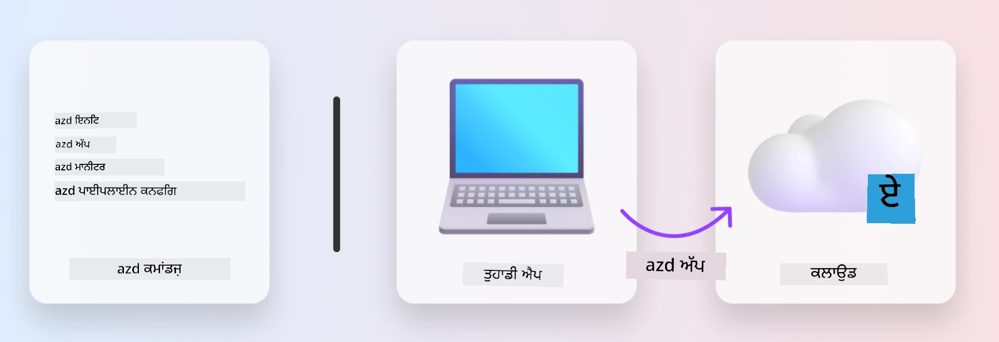
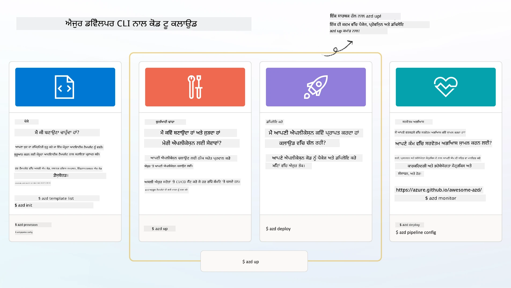

# 1. ਟੈਮਪਲੇਟ ਚੁਣੋ

!!! tip "ਇਸ ਮੋਡੀਊਲ ਦੇ ਅਖੀਰ ਤੱਕ ਤੁਸੀਂ ਇਹ ਕਰਨ ਯੋਗ ਹੋਵੋਗੇ"

    - [ ] AZD ਟੈਮਪਲੇਟ ਕੀ ਹਨ, ਵਰਨਣ ਕਰੋ
    - [ ] AI ਲਈ AZD ਟੈਮਪਲੇਟ ਲੱਭੋ ਅਤੇ ਵਰਤੋ
    - [ ] AI Agents ਟੈਮਪਲੇਟ ਨਾਲ ਸ਼ੁਰੂਆਤ ਕਰੋ
    - [ ] **Lab 1:** AZD Quickstart with GitHub Codespaces

---

## 1. ਇੱਕ ਬਿਲਡਰ ਦੀ ਤੁਲਨਾ

ਇੱਕ ਆਧੁਨਿਕ ਐਨਟਰਪ੍ਰਾਈਜ਼-ਤਿਆਰ AI ਐਪਲੀਕੇਸ਼ਨ ਨੂੰ _ਸ਼ੁਰੂ ਤੋਂ_ ਬਣਾਉਣਾ ਡਰਾਉਣਾ ਹੋ ਸਕਦਾ ਹੈ। ਇਹ ਕੁਝ ਹੱਦ ਤੱਕ ਆਪਣੇ ਨਵੇਂ ਘਰ ਨੂੰ ਇੱਕ ਇਕ ਇੱਟ ਇਕ ਇੱਟ ਰੱਖ ਕੇ ਬਣਾਉਣ ਵਰਗਾ ਹੈ। ਹਾਂ, ਇਹ ਕੀਤਾ ਜਾ ਸਕਦਾ ਹੈ! ਪਰ ਇਹ ਸਭ ਤੋਂ ਪ੍ਰਭਾਵਸ਼ਾਲੀ ਤਰੀਕਾ ਨਹੀਂ ਹੈ ਜਿਸ ਨਾਲ ਚਾਹਿਦਾ ਅੰਤ ਨਤੀਜਾ ਮਿਲਦਾ ਹੈ!

ਇਸ ਦੀ ਥਾਂ, ਅਸੀਂ ਅਕਸਰ ਪਹਿਲਾਂ ਹੀ ਮੌਜੂਦ _ਡਿਜ਼ਾਇਨ ਬਲੂਪ੍ਰਿੰਟ_ ਨਾਲ ਸ਼ੁਰੂ ਕਰਦੇ ਹਾਂ, ਅਤੇ ਇੱਕ ਆਰਕੀਟੈਕਟ ਨਾਲ ਕੰਮ ਕਰਕੇ ਇਸਨੂੰ ਆਪਣੀਆਂ ਨਿੱਜੀ ਜ਼ਰੂਰਤਾਂ ਦੇ ਅਨੁਸਾਰ ਕਸਟਮਾਈਜ਼ ਕਰਦੇ ਹਾਂ। ਅਤੇ ਇਹੀ ਦ੍ਰਿਸ਼ਟੀਕੋਣ ਬੁੱਝਦਾਰ ਐਪਲੀਕੇਸ਼ਨਾਂ ਬਣਾਉਣ ਵੇਲੇ ਅਪਣਾਇਆ ਜਾਣਾ ਚਾਹੀਦਾ ਹੈ। ਪਹਿਲਾਂ, ਆਪਣੀ ਸਮੱਸਿਆ ਲਈ ਫਿੱਟ ਬੈਠਣ ਵਾਲੀ ਵਧੀਆ ਡਿਜ਼ਾਇਨ ਆਰਕੀਟੈਕਚਰ ਲੱਭੋ। ਫਿਰ ਆਪਣੇ ਨਿਰਧਾਰਿਤ ਪਰਿਦ੍ਰਿਸ਼ ਲਈ ਸੋਲੂਸ਼ਨ ਆਰਕੀਟੈਕਟ ਨਾਲ ਕੰਮ ਕਰਕੇ ਹੱਲ ਨੂੰ ਕਸਟਮਾਈਜ਼ ਅਤੇ ਡਿਵੈਲਪ ਕਰੋ।

ਪਰ ਇਹ ਡਿਜ਼ਾਇਨ ਬਲੂਪ੍ਰਿੰਟ ਸਾਨੂੰ ਕਿੱਥੇ ਮਿਲਣਗੇ? ਅਤੇ ਅਸੀਂ ਇੱਕ ਐਸੇ ਆਰਕੀਟੈਕਟ ਨੂੰ ਕਿਵੇਂ ਲੱਭਾਂ ਜੋ ਸਾਨੂੰ ਇਹ ਸਿਖਾਉਣ ਲਈ ਰਾਜ਼ੀ ਹੋਵੇ ਕਿ ਕਿਵੇਂ ਆਪਣੇ ਆਪ ਇਹ ਬਲੂਪ੍ਰਿੰਟ ਕਸਟਮਾਈਜ਼ ਅਤੇ ਡਿਪਲੌਏ ਕਰਨੇ ਹਨ? ਇਸ ਵਰਕਸ਼ਾਪ ਵਿੱਚ, ਅਸੀਂ ਤੁਹਾਨੂੰ ਤਿੰਨ ਤਕਨਾਲੋਜੀਆਂ ਨਾਲ ਜਾਣੂ ਕਰਵਾਉਂਦੇ ਹਾਂ:

1. [Azure Developer CLI](https://aka.ms/azd) - ਇੱਕ open-source ਟੂਲ ਜੋ ਲੋਕਲ ਡਿਵੈਲਪਮੈਂਟ (build) ਤੋਂ ਕਲਾਉਡ ਡਿਪਲੋਇਮੈਂਟ (ship) ਤੱਕ ਡਿਵੈਲਪਰ ਦਾ ਰਸਤਾ ਤੇਜ਼ ਕਰਦਾ ਹੈ।
1. [Microsoft Foundry Templates](https://ai.azure.com/templates) - ਸਟੈਂਡਰਡਾਈਜ਼ਡ open-source ਰਿਪੋਜ਼ਿਟਰੀਆਂ ਜੋ AI ਸੋਲੂਸ਼ਨ ਆਰਕੀਟੈਕਚਰ ਨੂੰ ਡਿਪਲੋਇਟ ਕਰਨ ਲਈ ਉਦਾਹਰਨ ਕੋਡ, ਇੰਫਰਾਸਟਰੱਕਚਰ ਅਤੇ ਕੰਫਿਗਰੇਸ਼ਨ ਫਾਈਲਾਂ ਰੱਖਦੀਆਂ ਹਨ।
1. [GitHub Copilot Agent Mode](https://code.visualstudio.com/docs/copilot/chat/chat-agent-mode) - ਇੱਕ ਕੋਡਿੰਗ ਏਜੰਟ ਜੋ Azure ਗਿਆਨ ਤੇ ਅਧਾਰਿਤ ਹੈ, ਜੋ ਸਾਡੇ ਕੋਡਬੇਸ ਵਿੱਚ ਰਾਹ-ਦਿਖਾਉਂਦਾ ਅਤੇ ਬਦਲਾਵ ਕਰਨ ਵਿੱਚ ਸਹਾਇਤਾ ਕਰਦਾ - ਕੁਦਰਤੀ ਭਾਸ਼ਾ ਦੀ ਵਰਤੋਂ ਕਰਕੇ।

ਇਨ੍ਹਾਂ ਟੂਲਾਂ ਨਾਲ, ਅਸੀਂ ਹੁਣ ਠੀਕ ਟੈਮਪਲੇਟ _ਖੋਜ_ ਸਕਦੇ ਹਾਂ, ਇਸਨੂੰ ਵੈਰੀਫਾਈ ਕਰਨ ਲਈ _ਡਿਪਲੋਇ_ ਕਰ ਸਕਦੇ ਹਾਂ, ਅਤੇ ਆਪਣੇ ਖਾਸ ਦ੍ਰਿਸ਼ਾਂਕ ਲਈ ਇਸਨੂੰ _ਕਸਟਮਾਈਜ਼_ ਕਰ ਸਕਦੇ ਹਾਂ। ਆਓ ਡੂੰਘਾਈ ਵਿੱਚ ਜਾਕੇ ਸਿੱਖੀਏ ਕਿ ਇਹ ਕਿਵੇਂ ਕੰਮ ਕਰਦੇ ਹਨ।


---

## 2. Azure Developer CLI

The [Azure Developer CLI](https://learn.microsoft.com/en-us/azure/developer/azure-developer-cli/) (or `azd`) ਇੱਕ open-source ਕਮੈਂਡਲਾਈਨ ਟੂਲ ਹੈ ਜੋ ਉਹਨਾਂ ਡਿਵੈਲਪਰ-ਫ੍ਰੈਂਡਲੀ ਕਮਾਂਡਾਂ ਦੇ ਸੈੱਟ ਨਾਲ ਤੁਹਾਡੇ ਕੋਡ-ਟੂ-कਲਾਉਡ ਯਾਤਰਾ ਨੂੰ ਤੇਜ਼ ਕਰ ਸਕਦਾ ਹੈ ਜੋ ਤੁਹਾਡੇ IDE (development) ਅਤੇ CI/CD (devops) ਮਾਹੌਲਾਂ ਵਿੱਚ ਇਕਸਾਰਤਾਪੂਰਵਕ ਕੰਮ ਕਰਦੇ ਹਨ।

`azd` ਨਾਲ, ਤੁਹਾਡੀ ਡਿਪਲੋਇਮੈਂਟ ਯਾਤਰਾ ਇਨ੍ਹਾਂ ਸਧਾਰਨ ਕਦਮਾਂ ਵਰਗੀ ਹੋ ਸਕਦੀ ਹੈ:

- `azd init` - ਮੌਜੂਦਾ AZD ਟੈਮਪਲੇਟ ਤੋਂ ਨਵਾਂ AI ਪ੍ਰੋਜੈਕਟ ਸ਼ੁਰੂ ਕਰਦਾ ਹੈ।
- `azd up` - ਇੱਕ ਹੀ ਕਦਮ ਵਿੱਚ ਇੰਫਰਾਸਟਰੱਕਚਰ ਪ੍ਰੋਵਿਜ਼ਨ ਕਰਦਾ ਅਤੇ ਤੁਹਾਡੇ ਐਪਲੀਕੇਸ਼ਨ ਨੂੰ ਡਿਪਲੋਇ ਕਰਦਾ ਹੈ।
- `azd monitor` - ਤੁਹਾਡੇ ਡਿਪਲੋਇਡ ਐਪ ਲਈ ਰੀਅਲ-ਟਾਈਮ ਮਾਨੀਟਰਿੰਗ ਅਤੇ ਡਾਇਗਨੋਸਟਿਕਸ ਪ੍ਰਦਾਨ ਕਰਦਾ ਹੈ।
- `azd pipeline config` - Azure 'ਤੇ ਡਿਪਲੋਇਮੈਂਟ ਨੂੰ automate ਕਰਨ ਲਈ CI/CD ਪਾਈਪਲਾਈਨ ਸੈਟਅਪ ਕਰੋ।

**🎯 | EXERCISE**: <br/> GitHub Codespaces ਮਾਹੌਲ ਵਿੱਚ ਹੁਣੇ `azd` ਕਮੈਂਡਲਾਈਨ ਟੂਲ ਨੂੰ ਐਕਸਪਲੋਰ ਕਰੋ। ਇਹ ਦੇਖਣ ਲਈ ਇਹ ਕਮਾਂਡ ਟਾਈਪ ਕਰਕੇ ਸ਼ੁਰੂ ਕਰੋ ਕਿ ਟੂਲ ਕੀ ਕਰ ਸਕਦਾ ਹੈ:

```bash title="" linenums="0"
azd help
```



---

## 3. AZD ਟੈਮਪਲੇਟ

`azd` ਇਹ ਪਤਾ ਹੋਣਾ ਚਾਹੀਦਾ ਹੈ ਕਿ ਕਿਸ ਇੰਫਰਾਸਟਰੱਕਚਰ ਨੂੰ ਪ੍ਰੋਵਿਜ਼ਨ ਕਰਨਾ ਹੈ, ਕਿਹੜੀਆਂ ਕੰਫਿਗਰੇਸ਼ਨ ਸੈਟਿੰਗਜ਼ ਲਾਗੂ ਕਰਨੀਆਂ ਹਨ, ਅਤੇ ਕਿਹੜੀ ਐਪਲੀਕੇਸ਼ਨ ਨੂੰ ਡਿਪਲੋਇ ਕਰਨਾ ਹੈ। ਇਹੋ ਜਗ੍ਹਾ ਹੈ ਜਿੱਥੇ [AZD templates](https://learn.microsoft.com/en-us/azure/developer/azure-developer-cli/azd-templates?tabs=csharp) ਵਰਤੀ ਜਾਂਦੀਆਂ ਹਨ। 

AZD ਟੈਮਪਲੇਟ open-source ਰਿਪੋਜ਼ਿਟਰੀਆਂ ਹਨ ਜੋ ਉਦਾਹਰਨ ਕੋਡ ਨੂੰ ਇੰਫਰਾਸਟਰੱਕਚਰ ਅਤੇ ਡਿਪਲੋਇਮੈਂਟ ਲਈ ਲੋੜੀਨਿਆਂ ਕੰਫਿਗਰੇਸ਼ਨ ਫਾਈਲਾਂ ਨਾਲ ਜੋੜਦੀਆਂ ਹਨ।
ਇੱਕ _Infrastructure-as-Code_ (IaC) ਢੰਗ ਨੂੰ ਵਰਤ ਕੇ, ਇਹ ਟੈਮਪਲੇਟ ਰਿਸੋਰਸ ਡੈਫਿਨਿਸ਼ਨ ਅਤੇ ਕੰਫਿਗਰੇਸ਼ਨ ਸੈਟਿੰਗਜ਼ ਨੂੰ ਵਰਜ਼ਨ-ਕੰਟਰੋਲ ਦੇ ਅਧੀਨ ਰੱਖਣ ਦੀ ਆਗਿਆ ਦਿੰਦੀਆਂ ਹਨ (ਜਿਵੇਂ ਐਪ ਸੋਰਸ ਕੋਡ) - ਜਿਸ ਨਾਲ ਉਸ ਪ੍ਰੋਜੈਕਟ ਦੇ ਯੂਜ਼ਰਾਂ ਵਿਚਕਾਰ ਦੁਬਾਰਾ ਵਰਤੋਂਯੋਗ ਅਤੇ ਲਗਾਤਾਰ ਵਰਕਫਲੋ ਬਣਦੇ ਹਨ।

ਜਦੋਂ ਤੁਸੀਂ ਆਪਣੇ ਸੈਨਾਰਿਓ ਲਈ AZD ਟੈਮਪਲੇਟ ਬਣਾਉਣ ਜਾਂ ਦੁਬਾਰਾ ਵਰਤਣ ਬਾਰੇ ਸੋਚ ਰਹੇ ਹੋ, ਤਾਂ ਇਹਨਾਂ ਸਵਾਲਾਂ 'ਤੇ ਵਿਚਾਰ ਕਰੋ:

1. ਤੁਸੀਂ ਕੀ ਬਣਾ ਰਹੇ ਹੋ? → ਕੀ ਕੋਈ ਟੈਮਪਲੇਟ ਹੈ ਜਿਸ ਵਿੱਚ ਉਸ ਸੈਨਾਰਿਓ ਲਈ ਸ਼ੁਰੂਆਤੀ ਕੋਡ ਮੌਜੂਦ ਹੈ?
1. ਤੁਹਾਡਾ ਸੋਲੂਸ਼ਨ ਕਿਵੇਂ ਆਰਕੀਟੈਕਟ ਕੀਤਾ ਗਿਆ ਹੈ? → ਕੀ ਕੋਈ ਟੈਮਪਲੇਟ ਹੈ ਜਿਸ ਵਿੱਚ ਲੋੜੀਂਦੇ ਰਿਸੋਰਸ ਹਨ?
1. ਤੁਹਾਡਾ ਸੋਲੂਸ਼ਨ ਕਿਵੇਂ ਡਿਪਲੋਇ ਹੁੰਦਾ ਹੈ? → `azd deploy` ਨਾਲ ਪ੍ਰੀ/ਪੋਸਟ-ਪ੍ਰੋਸੈਸਿੰਗ ਹੂਕਸ ਦਾ ਸੋਚੋ!
1. ਤੁਸੀਂ ਇਸਨੂੰ ਹੋਰ ਕਿਵੇਂ ਮੱਧਮ ਕਰ ਸਕਦੇ ਹੋ? → ਬਿਲਟ-ਇਨ ਮਾਨੀਟਰਿੰਗ ਅਤੇ ਆਟੋਮੇਸ਼ਨ ਪਾਈਪਲਾਈਨਾਂ ਬਾਰੇ ਸੋਚੋ!

**🎯 | EXERCISE**: <br/> 
[Awesome AZD](https://azure.github.io/awesome-azd/) ਗੈਲਰੀ 'ਤੇ ਜਾਓ ਅਤੇ ਫਿਲਟਰਾਂ ਦੀ ਵਰਤੋਂ ਕਰਕੇ ਮੌਜੂਦ 250+ ਟੈਮਪਲੇਟਾਂ ਨੂੰ ਐਕਸਪਲੋਰ ਕਰੋ। ਵੇਖੋ ਕਿ ਕੀ ਤੁਸੀਂ ਆਪਣੇ ਸੈਨਾਰਿਓ ਦੀਆਂ ਮੰਗਾਂ ਨਾਲ ਮੇਲ ਖਾਣ ਵਾਲਾ ਕੋਈ ਟੈਮਪਲੇਟ ਲਭ ਸਕਦੇ ਹੋ।



---

## 4. AI ਐਪ ਟੈਮਪਲੇਟ

AI-ਸਮਰੱਥ ਐਪਲੀਕੇਸ਼ਨਾਂ ਲਈ, Microsoft ਵਿਸ਼ੇਸ਼ ਟੈਮਪਲੇਟ ਪ੍ਰਦਾਨ ਕਰਦਾ ਹੈ ਜਿਨ੍ਹਾਂ ਵਿੱਚ **Microsoft Foundry** ਅਤੇ **Foundry Agents** ਸ਼ਾਮਲ ਹਨ। ਇਹ ਟੈਮਪਲੇਟ ਤੁਹਾਡੇ ਲਈ ਹੋਸ਼ਿਆਰ, ਪ੍ਰੋਡਕਸ਼ਨ-ਤਿਆਰ ਐਪਲੀਕੇਸ਼ਨਾਂ ਬਣਾਉਣ ਦੀ ਰਾਹ ਨੂੰ ਤੇਜ਼ ਕਰਦੇ ਹਨ।

### Microsoft Foundry & Foundry Agents Templates

ਹੇਠਾਂੋਂ ਕੋਈ ਟੈਮਪਲੇਟ ਚੁਣੋ ਅਤੇ ਡਿਪਲੋਇ ਕਰੋ। ਹਰ ਟੈਮਪਲੇਟ [Awesome AZD](https://azure.github.io/awesome-azd/) 'ਤੇ ਉਪਲਬਧ ਹੈ ਅਤੇ ਇੱਕ ਕਮਾਂਡ ਨਾਲ ਇਨਿਸ਼ੀਅਲਾਈਜ਼ ਕੀਤਾ ਜਾ ਸਕਦਾ ਹੈ।

| Template | Description | Deploy Command |
|----------|-------------|----------------|
| **[AI Chat with RAG](https://azure.github.io/awesome-azd/?tags=ai&tags=rag)** | Microsoft Foundry ਦੀ ਵਰਤੋਂ ਨਾਲ Retrieval Augmented Generation ਵਾਲੀ ਚੈਟ ਐਪਲੀਕੇਸ਼ਨ | `azd init -t azure-samples/azure-search-openai-demo` |
| **[Foundry Agent Service Starter](https://azure.github.io/awesome-azd/?tags=ai&tags=agents)** | Foundry Agents ਦੀ ਵਰਤੋਂ ਕਰਕੇ ਸੁਤੰਤਰ ਕੰਮਾਂ ਲਈ AI ਏਜੰਟ ਬਣਾਓ | `azd init -t azure-samples/foundry-agent-service-starter` |
| **[Multi-Agent Orchestration](https://azure.github.io/awesome-azd/?tags=ai&tags=agents)** | ਜਟਿਲ ਵਰਕਫਲੋਜ਼ ਲਈ ਕਈ Foundry Agents ਨੂੰ ਕੋਆਰਡੀਨੇਟ ਕਰੋ | `azd init -t azure-samples/multi-agent-orchestration` |
| **[AI Document Intelligence](https://azure.github.io/awesome-azd/?tags=ai&tags=document)** | Microsoft Foundry ਮਾਡਲਾਂ ਦੀ ਵਰਤੋਂ ਕਰਕੇ ਦਸਤਾਵੇਜ਼ਾਂ ਨੂੰ ਨਿਕਾਲੋ ਅਤੇ ਵਿਸ਼ਲੇਸ਼ਣ ਕਰੋ | `azd init -t azure-samples/ai-document-processing` |
| **[Conversational AI Bot](https://azure.github.io/awesome-azd/?tags=ai&tags=bot)** | Microsoft Foundry ਇੰਟੀਗ੍ਰੇਸ਼ਨ ਨਾਲ ਬੁੱਧੀਮਾਨ ਚੈਟਬੋਟ ਬਣਾਓ | `azd init -t azure-samples/ai-chat-protocol` |
| **[AI Image Generation](https://azure.github.io/awesome-azd/?tags=ai&tags=dalle)** | Microsoft Foundry ਰਾਹੀਂ DALL-E ਦੀ ਵਰਤੋਂ ਕਰਕੇ ਝਲਕੀਆਂ ਤਿਆਰ ਕਰੋ | `azd init -t azure-samples/ai-image-generation` |
| **[Semantic Kernel Agent](https://azure.github.io/awesome-azd/?tags=ai&tags=semantic-kernel)** | Foundry Agents ਨਾਲ Semantic Kernel ਦੀ ਵਰਤੋਂ ਕਰਦੇ ਹੋਏ AI ਏਜੰਟ | `azd init -t azure-samples/semantic-kernel-agent` |
| **[AutoGen Multi-Agent](https://azure.github.io/awesome-azd/?tags=ai&tags=autogen)** | AutoGen ਫ੍ਰੇਮਵਰਕ ਦੀ ਵਰਤੋਂ ਨਾਲ ਮਲਟੀ-ਏਜੰਟ ਸਿਸਟਮ | `azd init -t azure-samples/autogen-multi-agent` |

### ਤੁਰੰਤ ਸ਼ੁਰੂਆਤ

1. **ਟੈਮਪਲੇਟਾਂ ਨੂੰ ਬ੍ਰਾਊਜ਼ ਕਰੋ**: [https://azure.github.io/awesome-azd/](https://azure.github.io/awesome-azd/) 'ਤੇ ਜਾਓ ਅਤੇ `AI`, `Agents`, ਜਾਂ `Microsoft Foundry` ਦੁਆਰਾ ਫਿਲਟਰ ਕਰੋ
2. **ਆਪਣਾ ਟੈਮਪਲੇਟ ਚੁਣੋ**: ਉਹ ਇੱਕ ਚੁਣੋ ਜੋ ਤੁਹਾਡੇ ਯੂਜ਼ ਕੇਸ ਨਾਲ ਮਿਲਦਾ ਹੋਵੇ
3. **ਇਨਿਸ਼ੀਅਲਾਈਜ਼ ਕਰੋ**: ਆਪਣੇ ਚੁਣੇ ਹੋਏ ਟੈਮਪਲੇਟ ਲਈ `azd init` ਕਮਾਂਡ ਚਲਾਓ
4. **ਡਿਪਲੋਇ ਕਰੋ**: ਪ੍ਰੋਵਿਜ਼ਨ ਅਤੇ ਡਿਪਲੋਇ ਕਰਨ ਲਈ `azd up` ਚਲਾਓ

**🎯 | EXERCISE**: <br/>
ਆਪਣੇ ਸੈਨਾਰਿਓ ਅਨੁਸਾਰ ਉਪਰ ਦਿੱਤਿਆਂ ਟੈਮਪਲੇਟਾਂ ਵਿੱਚੋਂ ਇੱਕ ਚੁਣੋ:

- **ਚੈਟਬੋਟ ਬਣਾ ਰਹੇ ਹੋ?** → **AI Chat with RAG** ਜਾਂ **Conversational AI Bot** ਨਾਲ ਸ਼ੁਰੂ ਕਰੋ
- **ਸੁਤੰਤਰ ਏਜੰਟਾਂ ਦੀ ਲੋੜ ਹੈ?** → **Foundry Agent Service Starter** ਜਾਂ **Multi-Agent Orchestration** ਕੋਸ਼ਿਸ਼ ਕਰੋ
- **ਦਸਤਾਵੇਜ਼ ਪ੍ਰੋਸੈਸਿੰਗ ਕਰ ਰਹੇ ਹੋ?** → **AI Document Intelligence** ਵਰਤੋ
- **AI ਕੋਡਿੰਗ ਸਹਾਇਤਾ ਚਾਹੁੰਦੇ ਹੋ?** → **Semantic Kernel Agent** ਜਾਂ **AutoGen Multi-Agent** ਨੂੰ ਐਕਸਪਲੋਰ ਕਰੋ

```bash title="Example: Deploy the AI Chat with RAG template" linenums="0"
azd init -t azure-samples/azure-search-openai-demo
azd up
```

!!! info "ਹੋਰ ਟੈਮਪਲੇਟਾਂ ਦੀ ਪੜਤਾਲ ਕਰੋ"
    The [Awesome AZD Gallery](https://azure.github.io/awesome-azd/) contains 250+ templates. Use the filters to find templates matching your specific requirements for language, framework, and Azure services.

---

<!-- CO-OP TRANSLATOR DISCLAIMER START -->
ਅਸਵੀਕਰਨ:
ਇਹ ਦਸਤਾਵੇਜ਼ AI ਅਨੁਵਾਦ ਸੇਵਾ [Co-op Translator](https://github.com/Azure/co-op-translator) ਦੀ ਵਰਤੋਂ ਕਰਕੇ ਅਨੁਵਾਦ ਕੀਤਾ ਗਿਆ ਹੈ। ਹਾਲਾਂਕਿ ਅਸੀਂ ਸ਼ੁੱਧਤਾ ਲਈ ਕੋਸ਼ਿਸ਼ ਕਰਦੇ ਹਾਂ, ਕਿਰਪਾ ਧਿਆਨ ਰੱਖੋ ਕਿ ਸਵੈਚਾਲਿਤ ਅਨੁਵਾਦਾਂ ਵਿੱਚ ਗਲਤੀਆਂ ਜਾਂ ਅਣਸਪਸ਼ਟਤਾਵਾਂ ਹੋ ਸਕਦੀਆਂ ਹਨ। ਮੂਲ ਦਸਤਾਵੇਜ਼ ਨੂੰ ਉਸਦੀ ਮੂਲ ਭਾਸ਼ਾ ਵਿੱਚ ਪ੍ਰਮਾਣਿਕ ਸਰੋਤ ਮੰਨਿਆ ਜਾਣਾ ਚਾਹੀਦਾ ਹੈ। ਮਹੱਤਵਪੂਰਨ ਜਾਣਕਾਰੀ ਲਈ, ਪੇਸ਼ੇਵਰ ਮਨੁੱਖੀ ਅਨੁਵਾਦ ਦੀ ਸਿਫਾਰਸ਼ ਕੀਤੀ ਜਾਂਦੀ ਹੈ। ਅਸੀਂ ਇਸ ਅਨੁਵਾਦ ਦੀ ਵਰਤੋਂ ਨਾਲ ਹੋਣ ਵਾਲੀਆਂ ਕਿਸੇ ਵੀ ਗਲਤਫਹਿਮੀਆਂ ਜਾਂ ਭੁਲ-ਵਿਆਖਿਆਵਾਂ ਲਈ ਜਵਾਬਦੇਹ ਨਹੀਂ ਹਾਂ।
<!-- CO-OP TRANSLATOR DISCLAIMER END -->