# 2. ਟੈਮਪਲੇਟ ਦੀ ਜਾਂਚ

!!! tip "ਇਸ ਮੋਡੀਊਲ ਦੇ ਅੰਤ ਤੱਕ ਤੁਸੀਂ ਸਮਰੱਥ ਹੋਵੋਗੇ"

    - [ ] AI ਸੌਲਿਊਸ਼ਨ ਆਰਕੀਟੈਕਚਰ ਦਾ ਵਿਸ਼ਲੇਸ਼ਣ ਕਰੋ
    - [ ] AZD ਡਿਪਲੋਇਮੈਂਟ ਵਰਕਫਲੋ ਨੂੰ ਸਮਝੋ
    - [ ] AZD ਦੀ ਵਰਤੋਂ ਤੇ ਮਦਦ ਲਈ GitHub Copilot ਦੀ ਵਰਤੋਂ ਕਰੋ
    - [ ] **Lab 2:** AI Agents ਟੈਮਪਲੇਟ ਨੂੰ ਡਿਪਲੋਏ ਅਤੇ ਵੈਧ ਕਰੋ

---


## 1. ਪਰਿਚਯ

The [Azure Developer CLI](https://learn.microsoft.com/en-us/azure/developer/azure-developer-cli/) or `azd` ਇੱਕ ਓਪਨ-ਸੋਰਸ ਕਮਾਂਡਲਾਈਨ ਟੂਲ ਹੈ ਜੋ Azure 'ਤੇ ਐਪਲੀਕੇਸ਼ਨਾਂ ਬਣਾਉਣ ਅਤੇ ਡਿਪਲੋਏ ਕਰਨ ਦੇ ਦੌਰਾਨ ਡਿਵੈਲਪਰ ਦੇ ਵਰਕਫਲੋ ਨੂੰ ਸਧਾਰਦਾ ਹੈ। 

[AZD Templates](https://learn.microsoft.com/azure/developer/azure-developer-cli/azd-templates) ਸਟੈਂਡਰਡ ਰਿਪੋਜ਼ਟਰੀਜ਼ ਹਨ ਜੋ ਨਮੂਨੇ ਐਪਲੀਕੇਸ਼ਨ ਕੋਡ, _infrastructure-as-code_ ਐਸੈਟਸ, ਅਤੇ `azd` ਕੰਫਿਗਰੇਸ਼ਨ ਫਾਈਲਾਂ ਨੂੰ ਇੱਕ ਇਕਜੁਟ ਸੋਲੂਸ਼ਨ ਆਰਕੀਟੈਕਚਰ ਲਈ ਸ਼ਾਮਲ ਕਰਦੀਆਂ ਹਨ। ਇੰਫਰਾਸਟਰੱਕਚਰ ਪੇਸ਼ ਕਰਨਾ ਇਕ ਸਧਾਰਨ `azd provision` ਕਮਾਂਡ ਵਰਗਾ ਹੋ ਜਾਂਦਾ ਹੈ — ਜਦਕਿ `azd up` ਵਰਤਣ ਨਾਲ ਤੁਸੀਂ ਇਕੋ ਵਾਰੀ ਇੰਫਰਾਸਟਰੱਕਚਰ ਪ੍ਰੋਵਾਈਜ਼ਨ ਅਤੇ ਆਪਣੀ ਐਪਲੀਕੇਸ਼ਨ ਨੂੰ ਡਿਪਲੋਏ ਕਰ ਸਕਦੇ ਹੋ!

ਇਸ ਤਰ੍ਹਾਂ, ਆਪਣੀ ਐਪਲੀਕੇਸ਼ਨ ਵਿਕਾਸ ਪ੍ਰਕਿਰਿਆ ਨੂੰ ਸ਼ੁਰੂ ਕਰਨਾ ਏਨਾ ਹੀ ਆਸਾਨ ਹੋ ਸਕਦਾ ਹੈ ਜਿਵੇਂ ਕਿ ਆਪਣੀ ਐਪਲੀਕੇਸ਼ਨ ਅਤੇ ਇੰਫਰਾਸਟਰੱਕਚਰ ਲੋੜਾਂ ਦੇ ਸਭ ਤੋਂ ਨੇੜੇ ਆਉਣ ਵਾਲੇ _AZD Starter template_ ਨੂੰ ਲੱਭਣਾ — ਫਿਰ ਉਸ ਰਿਪੋਜ਼ਟਰੀ ਨੂੰ ਆਪਣੇ ਸਨੈਰੀਓ ਦੀਆਂ ਲੋੜਾਂ ਮੁਤਾਬਕ ਕਸਟਮਾਈਜ਼ ਕਰਨਾ।

ਸ਼ੁਰੂ ਕਰਨ ਤੋਂ ਪਹਿਲਾਂ, ਆਓ ਪੱਕਾ ਕਰੀਏ ਕਿ ਤੁਹਾਡੇ ਕੋਲ Azure Developer CLI ਇੰਸਟਾਲ ਹੈ।

1. ਇੱਕ VS Code ਟਰਮੀਨਲ ਖੋਲ੍ਹੋ ਅਤੇ ਇਹ ਕਮਾਂਡ ਟਾਈਪ ਕਰੋ:

      ```bash title="" linenums="0"
      azd version
      ```

1. ਤੁਸੀਂ ਕੁਝ ਇਸ ਤਰ੍ਹਾਂ ਦੇ ਨਤੀਜੇ ਵੇਖੋਗੇ!

      ```bash title="" linenums="0"
      azd version 1.19.0 (commit b3d68cea969b2bfbaa7b7fa289424428edb93e97)
      ```

**ਤੁਸੀਂ ਹੁਣ azd ਨਾਲ ਇੱਕ ਟੈਮਪਲੇਟ ਚੁਣਨ ਅਤੇ ਡਿਪਲੋਏ ਕਰਨ ਲਈ ਤਿਆਰ ਹੋ**

---

## 2. ਟੈਮਪਲੇਟ ਚੋਣ

Microsoft Foundry ਪਲੇਟਫਾਰਮ ਨਾਲ ਇੱਕ [ਸਿਫਾਰਸ਼ੀ AZD ਟੈਮਪਲੇਟਸ ਦਾ ਸਮੂਹ](https://learn.microsoft.com/en-us/azure/ai-foundry/how-to/develop/ai-template-get-started) ਆਉਂਦਾ ਹੈ ਜੋ ਲੋਕਪ੍ਰਿਯ ਸੋਲੂਸ਼ਨ ਸਿਨਾਰਿਓਆਂ ਜਿਵੇਂ ਕਿ _multi-agent workflow automation_ ਅਤੇ _multi-modal content processing_ ਨੂੰ ਕਵਰ ਕਰਦੇ ਹਨ। ਤੁਸੀਂ ਇਹ ਟੈਮਪਲੇਟ Microsoft Foundry ਪੋਰਟਲ 'ਤੇ ਜਾ ਕੇ ਵੀ ਖੋਜ ਸਕਦੇ ਹੋ।

1. [https://ai.azure.com/templates](https://ai.azure.com/templates) 'ਤੇ ਜਾਓ
1. ਜਦੋਂ ਮੰਗੀਤਾ ਜਾਵੇ ਤਾਂ Microsoft Foundry ਪੋਰਟਲ ਵਿੱਚ ਲੌਗਇਨ ਕਰੋ - ਤੁਸੀਂ ਕੁਝ ਇਸ ਤਰ੍ਹਾਂ ਦਾ ਦ੍ਰਿਸ਼ ਵੇਖੋਗੇ।

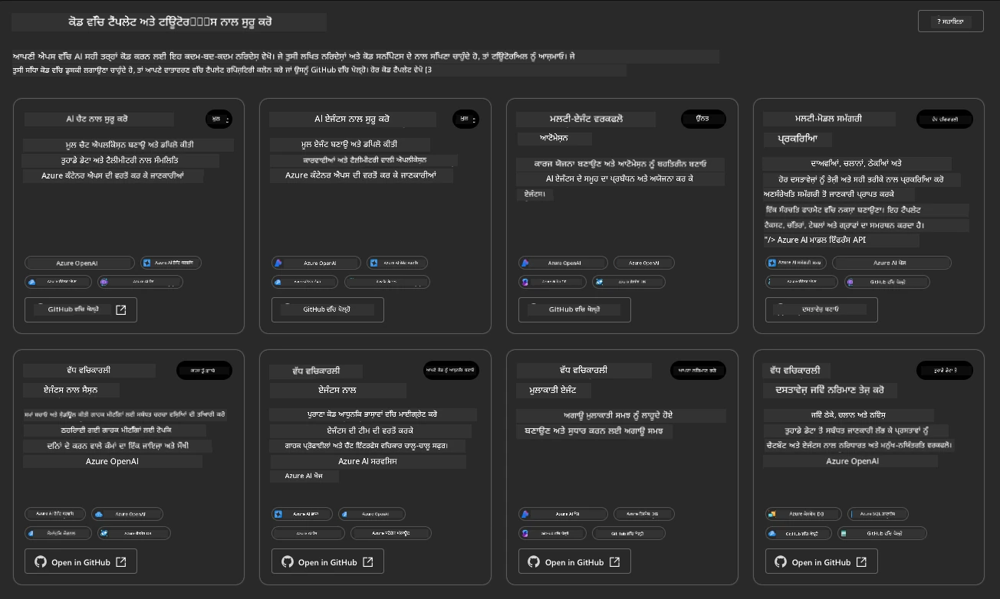


The **Basic** options are your starter templates:

1. [ ] [Get Started with AI Chat](https://github.com/Azure-Samples/get-started-with-ai-chat) ਜੋ ਇੱਕ ਬੇਸਿਕ ਚੈਟ ਐਪਲੀਕੇਸ਼ਨ ਨੂੰ _ਤੁਾਡੇ ਡਾਟਾ_ ਨਾਲ Azure Container Apps 'ਤੇ ਡਿਪਲੋਏ ਕਰਦਾ ਹੈ। ਇਸਨੂੰ ਇੱਕ ਮੂਢਲਾ AI ਚੈਟਬੋਟ ਸਿਨਾਰਿਓ ਖੋਜਣ ਲਈ ਵਰਤੋ।
1. [X] [Get Started with AI Agents](https://github.com/Azure-Samples/get-started-with-ai-agents) ਜੋ ਇੱਕ ਸਟੈਂਡਰਡ AI Agent (Foundry Agents ਦੇ ਨਾਲ) ਵੀ ਡਿਪਲੋਏ ਕਰਦਾ ਹੈ। ਇਸਨੂੰ ਵਰਤ ਕੇ ਤੁਹਾਨੂੰ ਟੂਲਸ ਅਤੇ ਮਾਡਲਾਂ ਸ਼ਾਮਿਲ agentic AI ਹੱਲਾਂ ਨਾਲ ਜਾਣੂ ਹੋਣ ਵਿੱਚ ਮਦਦ ਮਿਲੇਗੀ।

ਦੂਜੇ ਲਿੰਕ ਨੂੰ ਇੱਕ ਨਵੇਂ ਬਰਾਊਜ਼ਰ ਟੈਬ ਵਿੱਚ ਖੋਲ੍ਹੋ (ਜਾਂ ਸੰਬੰਧਤ ਕਾਰਡ ਲਈ `Open in GitHub` 'ਤੇ ਕਲਿਕ ਕਰੋ)। ਤੁਹਾਨੂੰ ਇਸ AZD ਟੈਮਪਲੇਟ ਲਈ ਰਿਪੋਜ਼ਟਰੀ ਦਿਖਾਈ ਦੇਵੇਗੀ। README ਨੂੰ ਇਕ ਮਿੰਟ ਲਈ ਵੇਖੋ। ਐਪਲੀਕੇਸ਼ਨ ਆਰਕੀਟੈਕਚਰ ਇਸ ਤਰ੍ਹਾਂ ਹੈ:

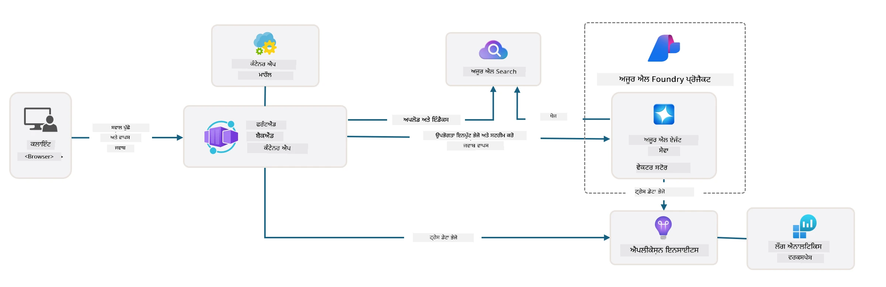

---

## 3. ਟੈਮਪਲੇਟ ਐਕਟੀਵੇਸ਼ਨ

ਆਓ ਇਸ ਟੈਮਪਲੇਟ ਨੂੰ ਡਿਪਲੋਏ ਕਰਕੇ ਯਕੀਨੀ ਬਣਾਈਏ ਕਿ ਇਹ ਵੈਧ ਹੈ। ਅਸੀਂ [Getting Started](https://github.com/Azure-Samples/get-started-with-ai-agents?tab=readme-ov-file#getting-started) ਸੈਕਸ਼ਨ ਵਿੱਚ ਦਿੱਤੇ ਨਿਰਦੇਸ਼ਾਂ ਦੀ ਪਾਲਣਾ ਕਰਾਂਗੇ।

1. ਇਸ ਲਿੰਕ ਉੱਤੇ ਕਲਿਕ ਕਰੋ: [this link](https://github.com/codespaces/new/Azure-Samples/get-started-with-ai-agents) - ਡਿਫੋਲਟ ਐਕਸ਼ਨ `Create codespace` ਦੀ ਪੁਸ਼ਟੀ ਕਰੋ
1. ਇਹ ਇੱਕ ਨਵਾਂ ਬਰਾਊਜ਼ਰ ਟੈਬ ਖੋਲ੍ਹਦਾ ਹੈ - GitHub Codespaces ਸੈਸ਼ਨ ਦੇ ਲੋਡ ਹੋਣ ਦੀ ਉਡੀਕ ਕਰੋ
1. Codespaces ਵਿੱਚ VS Code ਟਰਮੀਨਲ ਖੋਲ੍ਹੋ - ਹੇਠ ਲਿਖੀ ਕਮਾਂਡ ਟਾਈਪ ਕਰੋ:

   ```bash title="" linenums="0"
   azd up
   ```

ਉਸ ਵਰਕਫਲੋ ਸਟੈਪ ਨੂੰ ਪੂਰਾ ਕਰੋ ਜੋ ਇਹ ਟ੍ਰਿੱਗਰ ਕਰੇਗਾ:

1. ਤੁਹਾਨੂੰ Azure ਵਿੱਚ ਲੌਗਇਨ ਕਰਨ ਲਈ ਕਿਹਾ ਜਾਵੇਗਾ - ਪ੍ਰਮਾਣਿਕਤਾ ਲਈ ਦੱਸੀ ਗਈ ਹਦਾਇਤਾਂ ਨੂੰ ਫੋਲੋ ਕਰੋ
1. ਆਪਣੇ ਲਈ ਇਕ ਵਿਲੱਖਣ environment ਨਾਮ ਦਿਓ - ਉਦਾਹਰਨ ਵਜੋਂ, ਮੈਂ `nitya-mshack-azd` ਵਰਤਿਆ
1. ਇਹ `.azure/` ਫੋਲਡਰ ਬਣਾਵੇਗਾ - ਤੁਸੀਂ ਉਸ env ਨਾਮ ਵਾਲੀ ਇਕ ਸਬਫੋਲਡਰ ਵੇਖੋਗੇ
1. ਤੁਹਾਨੂੰ ਇੱਕ subscription ਨਾਮ ਚੁਣਨ ਲਈ ਕਿਹਾ ਜਾਵੇਗਾ - ਡਿਫਾਲਟ ਚੋਣੋ
1. ਤੁਹਾਨੂੰ ਇੱਕ location ਲਈ ਪੁੱਛਿਆ ਜਾਵੇਗਾ - `East US 2` ਵਰਤੋ

ਹੁਣ, ਤੁਸੀਂ ਪ੍ਰੋਵਿਜ਼ਨਿੰਗ ਪੂਰੀ ਹੋਣ ਦੀ ਉਡੀਕ ਕਰੋ। **ਇਹ 10-15 ਮਿੰਟ ਲੈਂਦਾ ਹੈ**

1. ਮੁਕੰਮਲ ਹੋਣ 'ਤੇ, ਤੁਹਾਡਾ ਕੰਸੋਲ SUCCESS ਸੁਨੇਹਾ ਇਸ ਤਰ੍ਹਾਂ ਦਿਖਾਏਗਾ:
      ```bash title="" linenums="0"
      SUCCESS: Your up workflow to provision and deploy to Azure completed in 10 minutes 17 seconds.
      ```
1. ਤੁਹਾਡੇ Azure Portal ਵਿੱਚ ਹੁਣ ਉਸ env ਨਾਮ ਨਾਲ ਇੱਕ ਪ੍ਰੋਵਿਜ਼ਨ ਕੀਤੀ ਗਈ Resource Group ਹੋਵੇਗੀ:

      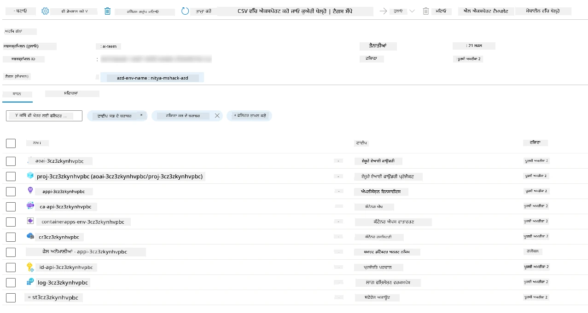

1. **ਤੁਸੀਂ ਹੁਣ ਡਿਪਲੋਏ ਕੀਤੀ ਗਈ ਇੰਫਰਾਸਟਰੱਕਚਰ ਅਤੇ ਐਪਲੀਕੇਸ਼ਨ ਦੀ ਜਾਂਚ ਕਰਨ ਲਈ ਤਿਆਰ ਹੋ।**

---

## 4. ਟੈਮਪਲੇਟ ਦੀ ਜਾਂਚ

1. Azure Portal ਦੇ [Resource Groups](https://portal.azure.com/#browse/resourcegroups) ਪੰਨੇ 'ਤੇ ਜਾਓ - ਜਦੋਂ ਲੌਗਿਨ ਲਈ ਪੁੱਛਿਆ ਜਾਵੇ ਤਾਂ ਲੌਗਿਨ ਕਰੋ
1. ਆਪਣੇ environment ਨਾਮ ਵਾਲੀ RG 'ਤੇ ਕਲਿਕ ਕਰੋ - ਤੁਸੀਂ ਉਪਰੋਕਤ ਪੇਜ ਵੇਖੋਗੇ

      - Azure Container Apps resource 'ਤੇ ਕਲਿਕ ਕਰੋ
      - _Essentials_ ਸੈਕਸ਼ਨ (ਉੱਪਰ ਸੱਜੇ) ਵਿੱਚ Application Url 'ਤੇ ਕਲਿਕ ਕਰੋ

1. ਤੁਹਾਨੂੰ ਇੱਕ ਹੋਸਟ ਕੀਤੀ ਹੋਈ ਐਪਲੀਕੇਸ਼ਨ ਫਰੰਟ-ਐਂਡ UI ਇਸ ਤਰ੍ਹਾਂ ਵੇਖਣ ਨੂੰ ਮਿਲੇਗੀ:

   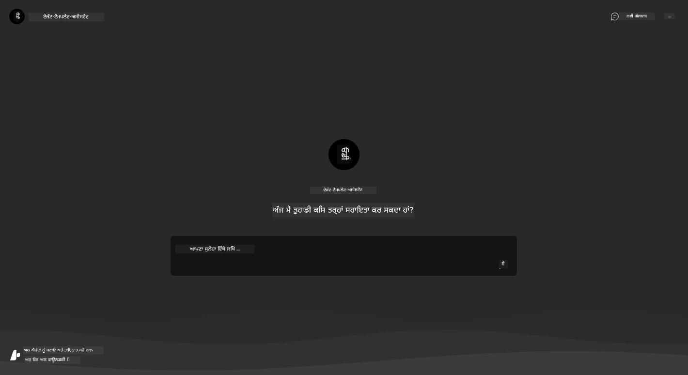

1. ਕੁਝ [ਨਮੂਨਾ ਸਵਾਲ](https://github.com/Azure-Samples/get-started-with-ai-agents/blob/main/docs/sample_questions.md) ਪੱਛੋ

      1. ਪੁੱਛੋ: ```What is the capital of France?``` 
      1. ਪੁੱਛੋ: ```What's the best tent under $200 for two people, and what features does it include?```

1. ਤੁਹਾਨੂੰ ਹੇਠਾਂ ਦਿਖਾਈ ਦੇਣ ਵਾਲਿਆਂ ਵਰਗੇ ਜਵਾਬ ਮਿਲਣੇ ਚਾਹੀਦੇ ਹਨ। _ਪਰ ਇਹ ਕਿਵੇਂ ਕੰਮ ਕਰਦਾ ਹੈ?_ 

      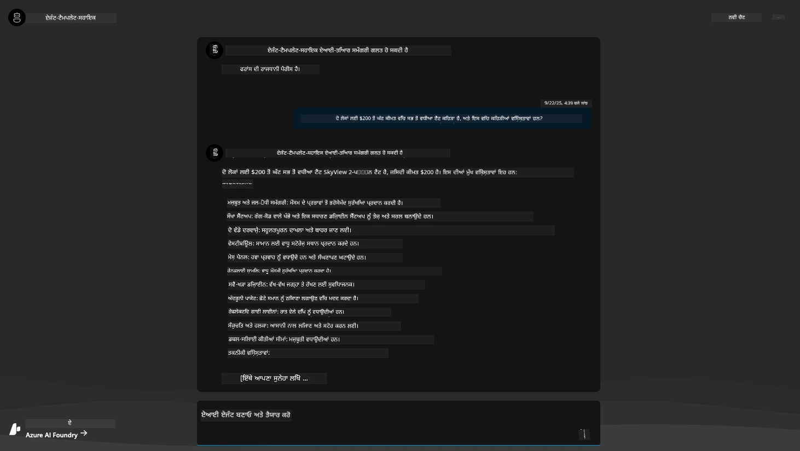

---

## 5. ਏਜੰਟ ਦੀ ਜਾਂਚ

Azure Container App ਇੱਕ ਏਂਡਪੁਆਇੰਟ ਡਿਪਲੋਏ ਕਰਦਾ ਹੈ ਜੋ ਇਸ ਟੈਮਪਲੇਟ ਲਈ Microsoft Foundry ਪ੍ਰੋਜੈਕਟ ਵਿੱਚ ਪ੍ਰੋਵੀਜ਼ਨ ਕੀਤੇ AI Agent ਨਾਲ ਜੁੜਦਾ ਹੈ। ਆਓ ਵੇਖੀਏ ਇਹ ਕੀ ਮਤਲਬ ਹੈ।

1. ਆਪਣੇ Resource Group ਦੇ Azure Portal _Overview_ ਪੇਜ 'ਤੇ ਵਾਪਸ ਜਾਓ

1. ਉਸ ਸੂਚੀ ਵਿੱਚੋਂ `Microsoft Foundry` resource 'ਤੇ ਕਲਿਕ ਕਰੋ

1. ਤੁਸੀਂ ਇਹ ਵੇਖੋਗੇ। `Go to Microsoft Foundry Portal` ਬਟਨ 'ਤੇ ਕਲਿਕ ਕਰੋ।
   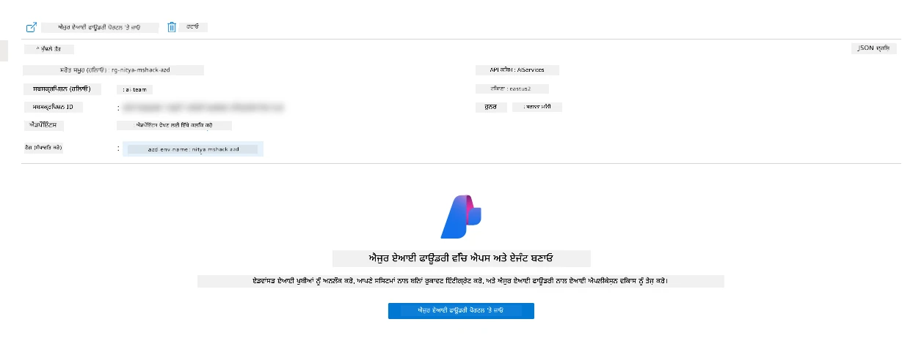

1. ਤੁਹਾਨੂੰ ਤੁਹਾਡੇ AI ਐਪਲੀਕੇਸ਼ਨ ਲਈ Foundry Project ਪੇਜ ਦਿਖਾਈ ਦੇਵੇਗਾ
   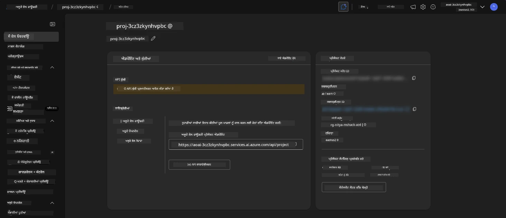

1. `Agents` 'ਤੇ ਕਲਿਕ ਕਰੋ - ਤੁਸੀਂ ਤੁਹਾਡੇ ਪ੍ਰੋਜੈਕਟ ਵਿੱਚ ਪ੍ਰੋਵੀਜ਼ਨ ਕੀਤਾ ਗਿਆ ਡਿਫੌਲਟ Agent ਵੇਖੋਗੇ
   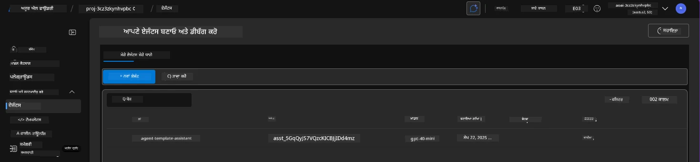

1. ਇਸਨੂੰ ਚੁਣੋ - ਅਤੇ ਤੁਸੀਂ ਏਜੰਟ ਦੇ ਵੇਰਵੇ ਵੇਖੋਗੇ। ਧਿਆਨ ਦਿਓ:

      - ਏਜੰਟ ਮੁੱਲ ਰੂਪ ਵਿੱਚ File Search ਦੀ ਵਰਤੋਂ ਕਰਦਾ ਹੈ (ਹਮੇਸ਼ਾ)
      - ਏਜੰਟ ਦੀ `Knowledge` ਦਿਖਾਉਂਦੀ ਹੈ ਕਿ ਇਸ ਵਿੱਚ 32 ਫਾਈਲਾਂ ਅਪਲੋਡ ਕੀਤੀਆਂ ਗਈਆਂ ਹਨ (ਫਾਈਲ ਖੋਜ ਲਈ)
      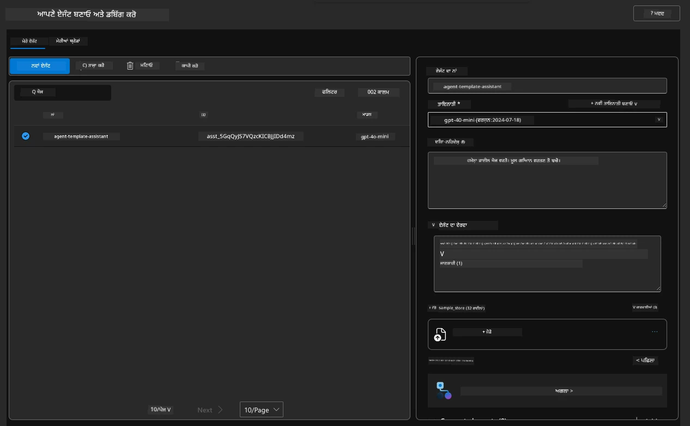

1. ਖੱਬੇ ਮੈਨੂ ਵਿੱਚ `Data+indexes` ਵਿਵਿਕਲਪ ਲੱਭੋ ਅਤੇ ਵੇਰਵੇ ਲਈ ਕਲਿਕ ਕਰੋ। 

      - ਤੁਸੀਂ ਹੌਲੀ-ਹੌਲੀ ਉਹ 32 ਡਾਟਾ ਫਾਈਲਾਂ ਜੋ ਗਿਆਨ ਲਈ ਅਪਲੋਡ ਕੀਤੀਆਂ ਗਈਆਂ ਹਨ ਵੇਖੋਗੇ।
      - ਇਹ `src/files` ਹੇਠਾਂ ਦੇ 12 customer ਫਾਈਲਾਂ ਅਤੇ 20 product ਫਾਈਲਾਂ ਨਾਲ ਮੇਲ ਖਾਂਦੀਆਂ ਹਨ
      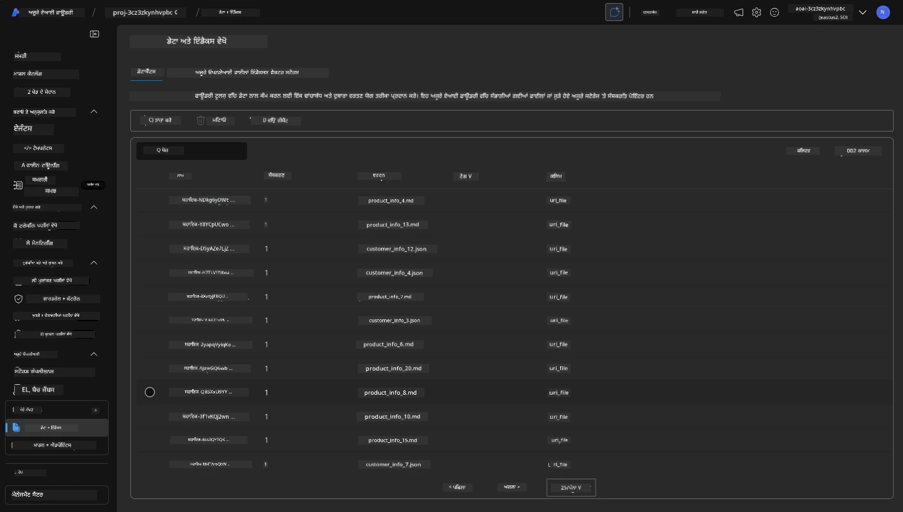

**ਤੁਸੀਂ ਏਜੰਟ ਓਪਰੇਸ਼ਨ ਨੂੰ ਵੈਧ ਕੀਤਾ!** 

1. ਏਜੰਟ ਦੇ ਜਵਾਬ ਉਹਨਾਂ ਫਾਈਲਾਂ ਵਿੱਚ ਮੌਜੂਦ ਗਿਆਨ 'ਤੇ ਅਧਾਰਿਤ ਹੁੰਦੇ ਹਨ। 
1. ਤੁਸੀਂ ਹੁਣ ਉਸ ਡਾਟਾ ਨਾਲ ਸੰਬੰਧਿਤ ਸਵਾਲ ਪੁੱਛ ਸਕਦੇ ਹੋ ਅਤੇ ਮੂਲ-ਅਧਾਰਿਤ (grounded) ਜਵਾਬ ਪ੍ਰਾਪਤ ਕਰ ਸਕਦੇ ਹੋ।
1. ਉਦਾਹਰਨ: `customer_info_10.json` "Amanda Perez" ਵੱਲੋਂ ਕੀਤੀਆਂ 3 ਖਰੀਦਾਂ ਨੂੰ ਵੇਰਵਾ ਕਰਦਾ ਹੈ

ਬ੍ਰਾਉਜ਼ਰ ਟੈਬ ਜਿਸ ਵਿੱਚ Container App ਐਂਡਪੁਆਇੰਟ ਖੁਲਾ ਹੈ, ਉਸ ਨੂੰ ਮੁੜ ਖੋਲ੍ਹੋ ਅਤੇ ਪੁੱਛੋ: `What products does Amanda Perez own?`. ਤੁਹਾਨੂੰ ਕੁਝ ਇਸ ਤਰ੍ਹਾਂ ਦਾ ਨਤੀਜਾ ਮਿਲਨਾ ਚਾਹੀਦਾ ਹੈ:

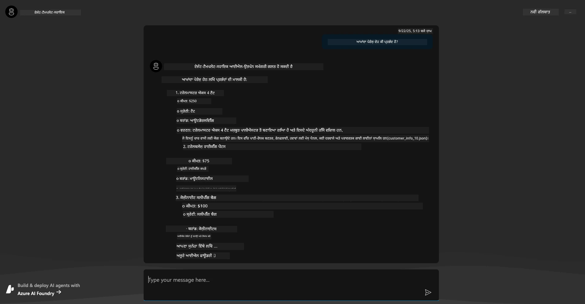

---

## 6. ਏਜੰਟ ਪਲੇਗ੍ਰਾਉਂਡ

Microsoft Foundry ਦੀ ਸਮਰੱਥਾ ਲਈ ਥੋੜ੍ਹਾ ਹੋਰ ਅਨੁਭਵ ਬਣਾਉਣ ਲਈ, ਏਜੰਟ ਨੂੰ Agents Playground ਵਿੱਚ ਇਕ ਵਾਰੀ ਚਲਾਕੇ ਵੇਖੀਏ। 

1. Microsoft Foundry ਵਿੱਚ `Agents` ਪੇਜ 'ਤੇ ਵਾਪਸ ਜਾਓ - ਡਿਫੌਲਟ ਏਜੰਟ ਚੁਣੋ
1. `Try in Playground` ਵਿਕਲਪ 'ਤੇ ਕਲਿਕ ਕਰੋ - ਤੁਹਾਨੂੰ ਇਸ ਤਰ੍ਹਾਂ ਦਾ Playground UI ਮਿਲੇਗਾ
1. ਉਹੀ ਸਵਾਲ ਪੁੱਛੋ: `What products does Amanda Perez own?`

    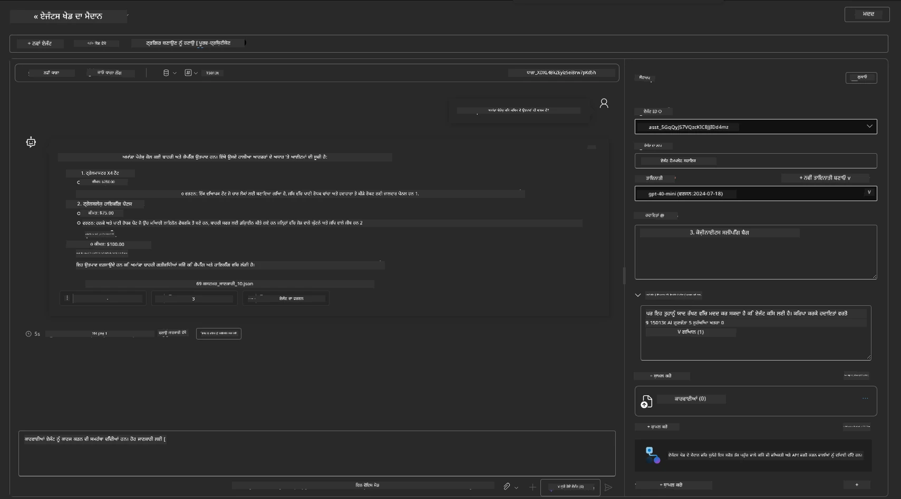

ਤੁਹਾਨੂੰ ਉਹੀ (ਜਾਂ ਸਮਾਨ) ਜਵਾਬ ਮਿਲੇਗਾ - ਪਰ ਤੁਹਾਨੂੰ ਵਧੀਆ ਜਾਣਕਾਰੀ ਵੀ ਮਿਲਦੀ ਹੈ ਜੋ ਤੁਹਾਡੇ ਏਜੰਟਿਕ ਐਪ ਦੀ ਗੁਣਵੱਤਾ, ਲਾਗਤ ਅਤੇ ਪ੍ਰਦਰਸ਼ਨ ਸਮਝਣ ਵਿੱਚ ਸਹਾਇਕ ਹੁੰਦੀ ਹੈ। ਉਦਾਹਰਨ ਵਜੋਂ:

1. ਨੋਟ ਕਰੋ ਕਿ ਜਵਾਬ ਵਿੱਚ ਉਹ ਡਾਟਾ ਫਾਈਲਾਂ ਦਰਸਾਈਆਂ ਗਈਆਂ ਹਨ ਜਿਨ੍ਹਾਂ ਨੇ ਜਵਾਬ ਨੂੰ "ਗ੍ਰੈਕੰਡ" ਕੀਤਾ
1. ਕਿਸੇ ਵੀ ਫਾਈਲ ਲੇਬਲ 'ਤੇ ਹੋਵਰ ਕਰੋ - ਕੀ ਡਾਟਾ ਤੁਹਾਡੇ ਪ੍ਰਸ਼ਨ ਅਤੇ ਦਿਖਾਏ ਗਏ ਜਵਾਬ ਨਾਲ ਮਿਲਦਾ ਹੈ?

ਤੁਸੀਂ ਜਵਾਬ ਹੇਠਾਂ ਇੱਕ _stats_ ਕਤਾਰ ਵੀ ਵੇਖਦੇ ਹੋ। 

1. ਕਿਸੇ ਵੀ ਮੈਟਰਿਕ 'ਤੇ ਹੋਵਰ ਕਰੋ - ਉਦਾਹਰਨ ਲਈ, Safety. ਤੁਸੀਂ ਕੁਝ ਇਸ ਤਰ੍ਹਾਂ ਦੇ ਨਤੀਜੇ ਵੇਖੋਗੇ
1. ਕੀ ਮੁਲਾਂਕਣ ਰੇਟਿੰਗ ਤੁਹਾਡੇ ਇੰਟੂਇਸ਼ਨ ਨਾਲ ਮਿਲਦੀ ਹੈ ਜੋ ਜਵਾਬ ਦੀ ਸੁਰੱਖਿਆ ਪੱਧਰ ਦਾ ਅੰਦਾਜ਼ਾ ਲਾਉਂਦੀ ਹੈ?

      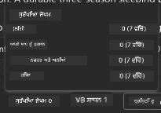

---

## 7. ਬਿਲਟ-ਇਨ ਨਿਰੀਖਣਯੋਗਤਾ

Observability ਤੁਹਾਡੇ ਐਪਲੀਕੇਸ਼ਨ ਨੂੰ ਇੰਸਟਰੂਮੈਂਟ ਕਰਨ ਬਾਰੇ ਹੈ ਤਾਂ ਜੋ ਉਹ ਡੇਟਾ ਪੈਦਾ ਕਰੇ ਜੋ ਇਸਦੇ ਓਪਰੇਸ਼ਨ ਨੂੰ ਸਮਝਣ, ਡੀਬੱਗ ਕਰਨ ਅਤੇ ਓਪਟੀਮਾਈਜ਼ ਕਰਨ ਵਿੱਚ ਵਰਤੀ ਜਾ ਸਕੇ। ਇਸਦਾ ਇਕ ਅਹਿਸਾਸ ਲੈਣ ਲਈ:

1. `View Run Info` ਬਟਨ 'ਤੇ ਕਲਿਕ ਕਰੋ - ਤੁਹਾਨੂੰ ਇਹ ਦਰਸ਼ ਦਿੱਸੇਗਾ। ਇਹ ਐਜੰਟ ਟਰੇਸਿੰਗ (Agent tracing) ਦਾ ਇੱਕ ਉਦਾਹਰਨ ਹੈ ਜੋ ਕਾਰਜ ਵਿੱਚ ਹੈ। _ਤੁਸੀਂ ਇਹ ਨਜ਼ਾਰਾ Thread Logs 'ਤੇ ਕਲਿਕ ਕਰਕੇ ਵੀ ਪ੍ਰਾਪਤ ਕਰ ਸਕਦੇ ਹੋ_।

   - ਰਨ ਸਟੈਪਸ ਅਤੇ ਏਜੰਟ ਦੁਆਰਾ ਵਰਤੇ ਗਏ ਟੂਲਾਂ ਦਾ ਅੰਦਾਜ਼ ਲਗਾਓ
   - ਜਵਾਬ ਲਈ ਕੁੱਲ Token ਗਿਣਤੀ (ਵਿਰੁੱਧ ਆਉਟਪੁਟ ਟੋਕਨ ਵਰਤੋਂ) ਸਮਝੋ
   - ਲੇਟੈਂਸੀ ਅਤੇ ਇਹ ਸਮਾਂ ਕਿੱਥੇ ਖਰਚ ਹੋ ਰਿਹਾ ਹੈ ਉਹ ਸਮਝੋ

      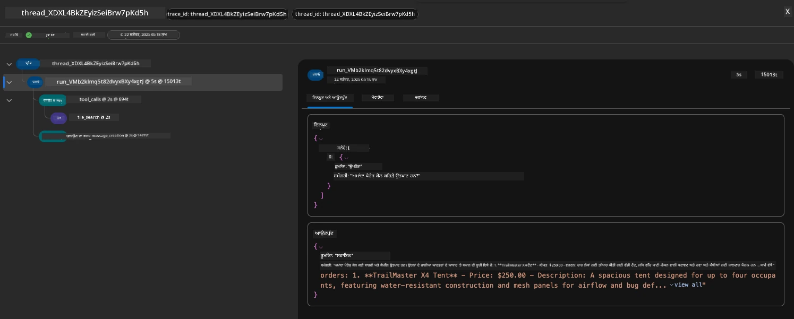

1. ਰਨ ਲਈ ਹੋਰ ਗੁਣਾਂ ਨੂੰ ਵੇਖਣ ਲਈ `Metadata` ਟੈਬ 'ਤੇ ਕਲਿਕ ਕਰੋ, ਜੋ ਬਾਅਦ ਵਿੱਚ ਡੀਬੱਗ ਕਰਨ ਲਈ ਸੰਦਰਭ ਪ੍ਰਦਾਨ ਕਰ ਸਕਦੇ ਹਨ।   

      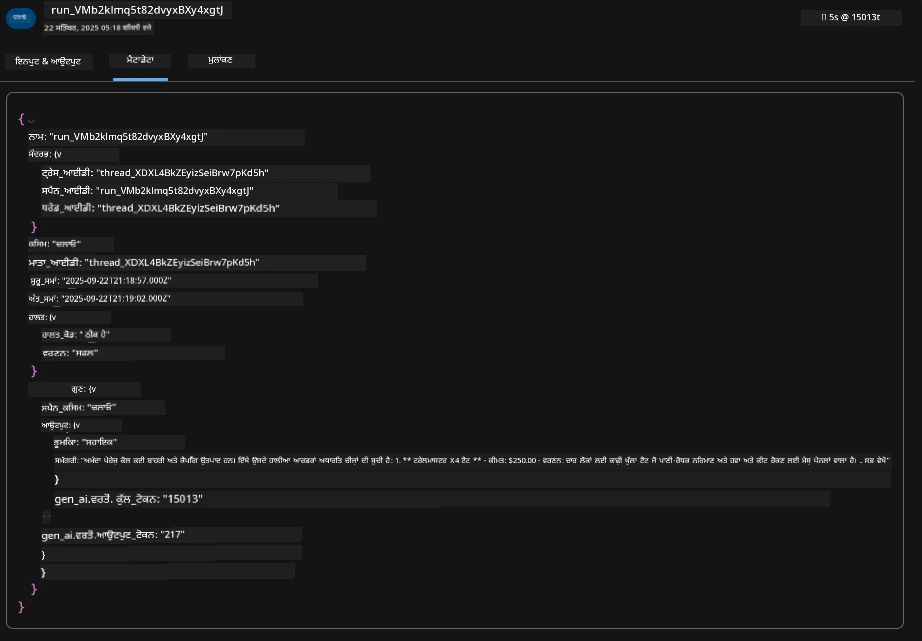


1. `Evaluations` ਟੈਬ 'ਤੇ ਕਲਿਕ ਕਰੋ ਤਾਂ ਕਿ ਏਜੰਟ ਜਵਾਬ 'ਤੇ ਆਟੋ-ਮੁਲਾਂਕਣ ਵੇਖ ਸਕੋ। ਇਨ੍ਹਾਂ ਵਿੱਚ ਸੁਰੱਖਿਆ ਮੁਲਾਂਕਣ (ਉਦਾਹਰਨ ਲਈ, Self-harm) ਅਤੇ ਏਜੰਟ-ਵਿਸ਼ੇਸ਼ ਮੁਲਾਂਕਣ (ਉਦਾਹਰਨ ਲਈ, ਮਕਸਦ ਨਿਰਧਾਰਨ, ਕੰਮ ਦੀ ਪਾਲਣਾ) ਸ਼ਾਮਲ ਹਨ।

      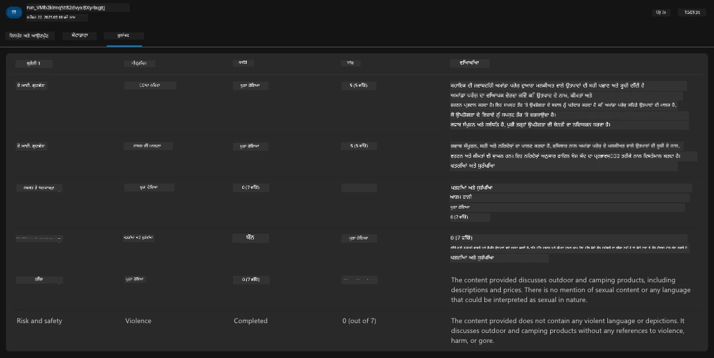

1. ਆਖਿਰਕਾਰ, ਸਾਈਡਬਾਰ ਮੈਨੂ ਵਿੱਚ `Monitoring` ਟੈਬ 'ਤੇ ਕਲਿਕ ਕਰੋ।

      - ਵਿਖਾਈ ਦਿੱਤੇ ਪੇਜ ਵਿੱਚ `Resource usage` ਟੈਬ ਚੁਣੋ - ਅਤੇ ਮੈਟ੍ਰਿਕਸ ਵੇਖੋ।
      - ਖਰਚ (ਟੋਕਨ) ਅਤੇ ਲੋਡ (ਰੇਕਵੇਸਟ) ਦੇ ਹਿਸਾਬ ਨਾਲ ਐਪਲੀਕੇਸ਼ਨ ਦੀ ਵਰਤੋਂ ਟ੍ਰੈਕ ਕਰੋ।
      - ਪਹਿਲੇ ਬਾਈਟ (ਇਨਪੁਟ ਪ੍ਰੋਸੈਸਿੰਗ) ਅਤੇ ਆਖਰੀ ਬਾਈਟ (ਆਉਟਪੁਟ) ਤੱਕ ਦੀ ਐਪਲੀਕੇਸ਼ਨ ਲੇਟੈਂਸੀ ਟ੍ਰੈਕ ਕਰੋ।

      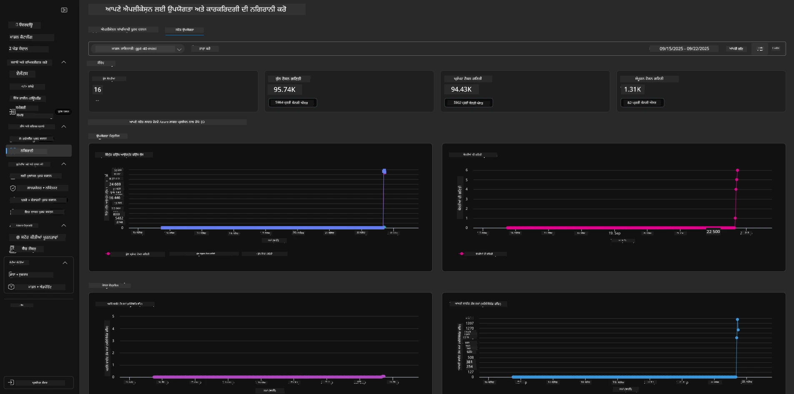

---

## 8. Environment Variables

ਹੁਣ ਤੱਕ, ਅਸੀਂ ਬਰਾਊਜ਼ਰ ਵਿੱਚ ਡਿਪਲੋਇਮੈਂਟ ਨੂੰ ਵੇਖਿਆ — ਅਤੇ ਯਕੀਨੀ ਬਣਾਇਆ ਕਿ ਸਾਡੀ ਇੰਫਰਾਸਟਰੱਕਚਰ ਪ੍ਰੋਵਿਜ਼ਨ ਹੋ ਚੁੱਕੀ ਹੈ ਅਤੇ ਐਪਲੀਕੇਸ਼ਨ ਕਾਰਗਰ ਹੈ। ਪਰ ਕੋਡ-ਫਰਸਟ ਤਰੀਕੇ ਨਾਲ ਕੰਮ ਕਰਨ ਲਈ, ਸਾਨੂੰ ਆਪਣੇ ਲੋਕਲ ਡਿਵੈਲਪਮੈਂਟ ਵਾਤਾਵਰਣ ਨੂੰ ਉਹ ਸੰਬੰਧਤ ਵੈਰੀਏਬਲ ਨਾਲ ਕਨਫਿਗਰ ਕਰਨ ਦੀ ਲੋੜ ਹੋਵੇਗੀ ਜੋ ਇਨ੍ਹਾਂ ਰਿਸੌਰਸਾਂ ਨਾਲ ਕੰਮ ਕਰਨ ਲਈ ਜ਼ਰੂਰੀ ਹਨ। `azd` ਇਸਨੂੰ ਆਸਾਨ ਬਣਾਉਂਦਾ ਹੈ।

1. Azure Developer CLI [Environment variables ਨੂੰ ਵਰਤਦਾ ਹੈ](https://learn.microsoft.com/en-us/azure/developer/azure-developer-cli/manage-environment-variables?tabs=bash) ਤਾਂ ਕਿ ਐਪਲੀਕੇਸ਼ਨ ਡਿਪਲੋਇਮੈਂਟ ਲਈ ਕੰਫਿਗਰੇਸ਼ਨ ਸੈਟਿੰਗਜ਼ ਨੂੰ ਸਟੋਰ ਅਤੇ ਮੈਨੇਜ ਕੀਤਾ ਜਾ ਸਕੇ।

1. Environment variables `.azure/<env-name>/.env` ਵਿੱਚ ਸਟੋਰ ਕੀਤੇ ਜਾਂਦੇ ਹਨ - ਇਹਨਾਂ ਨੂੰ deployment ਦੌਰਾਨ ਵਰਤੇ ਗਏ `env-name` ਨਾਲ ਸਕੋਪ ਕੀਤਾ ਜਾਂਦਾ ਹੈ ਅਤੇ ਇਕੋ ਰਿਪੋ ਵਿੱਚ ਵੱਖ-ਵੱਖ ਡਿਪਲੋਇਮੈਂਟ ਟਾਰਗਟਸ ਲਈ ਵਾਤਾਵਰਣਾਂ ਨੂੰ ਅਲੱਗ ਰੱਖਣ ਵਿੱਚ ਮਦਦ ਮਿਲਦੀ ਹੈ।

1. Environment variables ਨੂੰ `azd` ਕਮਾਂਡ ਦੁਆਰਾ ਜਿਸ ਵੇਲੇ ਵੀ ਕੋਈ ਖਾਸ ਕਮਾਂਡ ਚਲਾਈ ਜਾਂਦੀ ਹੈ (ਉਦਾਹਰਨ ਲਈ, `azd up`) ਆਪਣੇ ਆਪ ਲੋਡ ਕੀਤਾ ਜਾਂਦਾ ਹੈ। ਨੋਟ ਕਰੋ ਕਿ `azd` ਸਿਸਟਮ-ਲੈਵਲ OS ਇੰਵਾਇਰਨਮੈਂਟ ਵੇਰੀਏਬਲਜ਼ (ਜਿਵੇਂ shell ਵਿੱਚ ਸੈੱਟ ਕੀਤੀਆਂ ਗਈਆਂ) ਨੂੰ ਆਪ-ਮੁਤਾਬਕ ਨਹੀਂ ਪੜ੍ਹਦਾ - ਇਸ ਦੀ ਥਾਂ `azd set env` ਅਤੇ `azd get env` ਵਰਤ ਕੇ ਸਕ੍ਰਿਪਟਾਂ ਵਿੱਚ ਜਾਣਕਾਰੀ ਟਰਾਂਸਫਰ ਕਰੋ।


ਆਓ ਕੁਝ ਕਮਾਂਡਾਂ ਚਲਾਕੇ ਵੇਖੀਏ:

1. ਇਸ ਇਨਵਾਇਰਨਮੈਂਟ ਲਈ `azd` ਲਈ ਸਾਰੇ environment variables ਪ੍ਰਾਪਤ ਕਰੋ:

      ```bash title="" linenums="0"
      azd env get-values
      ```
      
      ਤੁਸੀਂ ਕੁਝ ਇਸ ਤਰ੍ਹਾਂ ਦੇ ਨਤੀਜੇ ਵੇਖੋਗੇ:

      ```bash title="" linenums="0"
      AZURE_AI_AGENT_DEPLOYMENT_NAME="gpt-4.1-mini"
      AZURE_AI_AGENT_NAME="agent-template-assistant"
      AZURE_AI_EMBED_DEPLOYMENT_NAME="text-embedding-3-small"
      AZURE_AI_EMBED_DIMENSIONS=100
      ...
      ```

1. ਕਿਸੇ ਵਿਸ਼ੇਸ਼ ਮੁੱਲ ਨੂੰ ਪ੍ਰਾਪਤ ਕਰੋ - ਉਦਾਹਰਨ ਲਈ, ਮੈਂ ਜਾਣਨਾ ਚਾਹੁੰਦਾ ਹਾਂ ਕਿ ਕੀ ਅਸੀਂ `AZURE_AI_AGENT_MODEL_NAME` ਮੁੱਲ ਸੈੱਟ ਕੀਤਾ ਹੈ

      ```bash title="" linenums="0"
      azd env get-value AZURE_AI_AGENT_MODEL_NAME 
      ```
      
      ਤੁਸੀਂ ਕੁਝ ਇਸ ਤਰ੍ਹਾਂ ਦੇ ਨਤੀਜੇ ਵੇਖੋਗੇ - ਇਹ ਡਿਫੌਲਟ ਤੌਰ 'ਤੇ ਸੈੱਟ ਨਹੀਂ ਸੀ!

      ```bash title="" linenums="0"
      ERROR: key 'AZURE_AI_AGENT_MODEL_NAME' not found in the environment values
      ```

1. `azd` ਲਈ ਇੱਕ ਨਵਾਂ environment variable ਸੈੱਟ ਕਰੋ। ਇਥੇ, ਅਸੀਂ ਏਜੰਟ ਮਾਡਲ ਨਾਮ ਅੱਪਡੇਟ ਕਰਦੇ ਹਾਂ। _ਨੋਟ: ਕਿਸੇ ਵੀ ਬਦਲਾਅ ਦਾ ਪ੍ਰਭਾਵ ਤੁਰੰਤ `.azure/<env-name>/.env` ਫਾਈਲ ਵਿੱਚ ਦਰਸਾਇਆ ਜਾਵੇਗਾ।_

      ```bash title="" linenums="0"
      azd env set AZURE_AI_AGENT_MODEL_NAME gpt-4.1
      azd env set AZURE_AI_AGENT_MODEL_VERSION 2025-04-14
      azd env set AZURE_AI_AGENT_DEPLOYMENT_CAPACITY 150
      ```

      ਹੁਣ, ਅਸੀਂ ਵੇਖਣਾ ਚਾਹੀਦਾ ਹੈ ਕਿ ਮੁੱਲ ਸੈੱਟ ਹੋ ਗਿਆ ਹੈ:

      ```bash title="" linenums="0"
      azd env get-value AZURE_AI_AGENT_MODEL_NAME 
      ```

1. ਨੋਟ ਕਰੋ ਕਿ ਕੁਝ ਰਿਸੋਰਸ ਸਥਿਰ (persistent) ਹੁੰਦੇ ਹਨ (ਉਦਾਹਰਨ ਲਈ, model deployments) ਅਤੇ ਉਨ੍ਹਾਂ ਨੂੰ ਫਿਰ ਤੋਂ ਡਿਪਲੋਏ ਕਰਨ ਲਈ ਸਿਰਫ਼ `azd up` ਕਾਫ਼ੀ ਨਹੀਂ ਹੋ ਸਕਦਾ। ਆਓ ਮੂਲ ਡਿਪਲੋਇਮੈਂਟ ਨੂੰ ਤੋੜ ਕੇ ਬਦਲੇ ਹੋਏ env vars ਨਾਲ ਦੁਬਾਰਾ ਡਿਪਲੋਏ ਕਰਕੇ ਵੇਖੀਏ।

1. **Refresh** ਜੇ ਤੁਸੀਂ ਪਹਿਲਾਂ ਕਿਸੇ azd ਟੈਮਪਲੇਟ ਦੀ ਵਰਤੋਂ ਕਰਕੇ ਇੰਫਰਾਸਟਰੱਕਚਰ ਡਿਪਲੋਏ ਕੀਤਾ ਸੀ - ਤੁਸੀਂ ਆਪਣੇ ਲੋਕਲ environment variables ਦੀ ਸਥਿਤੀ ਨੂੰ ਅਪਡੇਟ ਕਰਨ ਲਈ नीचे ਦਿੱਤੀ ਕਮਾਂਡ ਰਣ ਕਰਕੇ ਆਪਣੀ ਲੋਕਲ ਸਥਿਤੀ ਨੂੰ Azure ਡਿਪਲੋਇਮੈਂਟ ਦੀ ਮੌਜੂਦਾ ਸਥਿਤੀ ਅਨੁਸਾਰ _refresh_ ਕਰ ਸਕਦੇ ਹੋ:

      ```bash title="" linenums="0"
      azd env refresh
      ```

      ਇਹ ਦੋ ਜਾਂ ਵਧੇਰੇ ਲੋਕਲ ਡਿਵੈਲਪਮੈਂਟ ਵਾਤਾਵਰਣਾਂ (ਉਦਾਹਰਣ ਵਜੋਂ, ਇੱਕ ਟੀਮ ਜਿਸ ਵਿੱਚ ਕਈ ਡਿਵੈਲਪਰ ਹਨ) ਵਿੱਚ ਵਾਤਾਵਰਣ ਵੈਰੀਏਬਲਜ਼ ਨੂੰ _ਸਮਕਾਲੀਕਰਨ_ ਕਰਨ ਦਾ ਇੱਕ ਸ਼ਕਤੀਸ਼ਾਲੀ ਤਰੀਕਾ ਹੈ - ਜਿਸ ਨਾਲ ਤੈਨਾਤ ਕੀਤੀ ਗਈ ਇੰਫਰਾਸਟ੍ਰੱਕਚਰ ਵਾਤਾਵਰਣ ਵੈਰੀਏਬਲ ਦੀ ਸਥਿਤੀ ਲਈ ਮੂਲ ਅਸਲੀ ਸੱਚਾਈ ਵਜੋਂ ਕੰਮ ਕਰਦੀ ਹੈ। ਟੀਮ ਦੇ ਮੈਂਬਰ ਸਿਰਫ਼ ਵੈਰੀਏਬਲਜ਼ ਨੂੰ _ਰਿਫ੍ਰੈਸ਼_ ਕਰਦੇ ਹਨ ਤਾਂ ਕਿ ਉਹ ਮੁੜ ਸਿੰਕ ਹੋ ਜਾṇ। 

---

## 9. ਮੁਬਾਰਕਾਂ 🏆

ਤੁਸੀਂ ਹੁਣੇ ਇੱਕ ਸ਼ੁਰੂ ਤੋਂ ਅੰਤ ਤੱਕ ਦਾ ਵਰਕਫਲੋ ਪੂਰਾ ਕੀਤਾ ਜਿਸ ਵਿੱਚ ਤੁਸੀਂ:

- [X] AZD ਟੈਂਪਲੇਟ ਨੂੰ ਚੁਣਿਆ ਜੋ ਤੁਸੀਂ ਵਰਤਣਾ ਚਾਹੁੰਦੇ ਹੋ
- [X] GitHub Codespaces ਨਾਲ ਟੈਂਪਲੇਟ ਨੂੰ ਲਾਂਚ ਕੀਤਾ 
- [X] ਟੈਂਪਲੇਟ ਨੂੰ ਤੈਨਾਤ ਕੀਤਾ ਅਤੇ ਪੁਸ਼ਟੀ ਕੀਤੀ ਕਿ ਇਹ ਕੰਮ ਕਰਦਾ ਹੈ

---

<!-- CO-OP TRANSLATOR DISCLAIMER START -->
**ਅਸਪਸ਼ਟੀਕਰਨ**:
ਇਹ ਦਸਤਾਵੇਜ਼ AI ਅਨੁਵਾਦ ਸੇਵਾ [Co-op Translator](https://github.com/Azure/co-op-translator) ਦੀ ਵਰਤੋਂ ਕਰਕੇ ਅਨੁਵਾਦ ਕੀਤਾ ਗਿਆ ਹੈ। ਜਦੋਂ ਕਿ ਅਸੀਂ ਸ਼ੁੱਧਤਾ ਲਈ ਕੋਸ਼ਿਸ਼ ਕਰਦੇ ਹਾਂ, ਕਿਰਪਾ ਕਰਕੇ ਧਿਆਨ ਰੱਖੋ ਕਿ ਸਵੈਚਾਲਿਤ ਅਨੁਵਾਦਾਂ ਵਿੱਚ ਗਲਤੀਆਂ ਜਾਂ ਅਸਪਸ਼ਟਤਾਵਾਂ ਹੋ ਸਕਦੀਆਂ ਹਨ। ਮੂਲ ਦਸਤਾਵੇਜ਼ ਨੂੰ ਉਸ ਦੀ ਮੂਲ ਭਾਸ਼ਾ ਵਿੱਚ ਹੀ ਪ੍ਰਮਾਣਿਕ ਸਰੋਤ ਮੰਨਿਆ ਜਾਣਾ ਚਾਹੀਦਾ ਹੈ। ਮਹੱਤਵਪੂਰਨ ਜਾਣਕਾਰੀ ਲਈ, ਪੇਸ਼ੇਵਰ ਮਨੁੱਖੀ ਅਨੁਵਾਦ ਦੀ ਸਿਫ਼ਾਰਸ਼ ਕੀਤੀ ਜਾਂਦੀ ਹੈ। ਅਸੀਂ ਇਸ ਅਨੁਵਾਦ ਦੀ ਵਰਤੋਂ ਤੋਂ ਉਤਪੰਨ ਹੋਣ ਵਾਲੀਆਂ ਕਿਸੇ ਵੀ ਗਲਤਫਹਿਮੀਆਂ ਜਾਂ ਗਲਤ ਵਿਆਖਿਆਵਾਂ ਲਈ ਜ਼ਿੰਮੇਵਾਰ ਨਹੀਂ ਹਾਂ।
<!-- CO-OP TRANSLATOR DISCLAIMER END -->