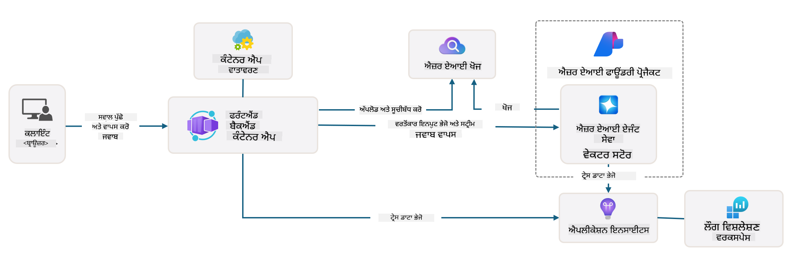

<!--
CO_OP_TRANSLATOR_METADATA:
{
  "original_hash": "4e403f041411361140d6beb88ab2a181",
  "translation_date": "2025-09-24T14:57:21+00:00",
  "source_file": "workshop/docs/instructions/3-Deconstruct-AI-Template.md",
  "language_code": "pa"
}
-->
# 3. ਟੈਂਪਲੇਟ ਨੂੰ ਸਮਝਣਾ

!!! tip "ਇਸ ਮੋਡਿਊਲ ਦੇ ਅੰਤ ਤੱਕ ਤੁਸੀਂ ਇਹ ਕਰਨ ਦੇ ਯੋਗ ਹੋਵੋਗੇ"

    - [ ] ਆਈਟਮ
    - [ ] ਆਈਟਮ
    - [ ] ਆਈਟਮ
    - [ ] **ਲੈਬ 3:** 

---

AZD ਟੈਂਪਲੇਟ ਅਤੇ Azure Developer CLI (`azd`) ਦੀ ਮਦਦ ਨਾਲ, ਅਸੀਂ ਸੈਂਪਲ ਕੋਡ, ਇੰਫਰਾਸਟਰਕਚਰ ਅਤੇ ਕਨਫਿਗਰੇਸ਼ਨ ਫਾਈਲਾਂ ਦੇ ਨਾਲ ਇੱਕ ਤਿਆਰ-ਤੋਂ-ਡਿਪਲੌਇ ਕਰਨ ਵਾਲੇ _ਸਟਾਰਟਰ_ ਪ੍ਰੋਜੈਕਟ ਰਾਹੀਂ ਆਪਣੀ AI ਵਿਕਾਸ ਯਾਤਰਾ ਨੂੰ ਤੇਜ਼ੀ ਨਾਲ ਸ਼ੁਰੂ ਕਰ ਸਕਦੇ ਹਾਂ।

**ਪਰ ਹੁਣ, ਸਾਨੂੰ ਪ੍ਰੋਜੈਕਟ ਦੀ ਬਣਤਰ ਅਤੇ ਕੋਡਬੇਸ ਨੂੰ ਸਮਝਣ ਦੀ ਲੋੜ ਹੈ - ਅਤੇ AZD ਟੈਂਪਲੇਟ ਨੂੰ ਕਸਟਮਾਈਜ਼ ਕਰਨ ਦੇ ਯੋਗ ਹੋਣਾ ਚਾਹੀਦਾ ਹੈ - ਬਿਨਾਂ ਕਿਸੇ ਪੂਰਵ ਅਨੁਭਵ ਜਾਂ AZD ਦੀ ਸਮਝ ਦੇ!**

---

## 1. GitHub Copilot ਨੂੰ ਐਕਟੀਵੇਟ ਕਰੋ

### 1.1 GitHub Copilot Chat ਇੰਸਟਾਲ ਕਰੋ

[GitHub Copilot Agent Mode](https://code.visualstudio.com/docs/copilot/chat/chat-agent-mode) ਦੀ ਖੋਜ ਕਰਨ ਦਾ ਸਮਾਂ ਹੈ। ਹੁਣ, ਅਸੀਂ ਆਪਣਾ ਕੰਮ ਕੁੱਲ-ਮਿਲਾ ਕੇ ਵਰਣਨ ਕਰਨ ਲਈ ਕੁਦਰਤੀ ਭਾਸ਼ਾ ਦੀ ਵਰਤੋਂ ਕਰ ਸਕਦੇ ਹਾਂ ਅਤੇ ਇਸਨੂੰ ਪੂਰਾ ਕਰਨ ਵਿੱਚ ਮਦਦ ਪ੍ਰਾਪਤ ਕਰ ਸਕਦੇ ਹਾਂ। ਇਸ ਲੈਬ ਲਈ, ਅਸੀਂ [Copilot Free plan](https://github.com/github-copilot/signup) ਦੀ ਵਰਤੋਂ ਕਰਾਂਗੇ ਜਿਸ ਵਿੱਚ ਪੂਰਨਾਂ ਅਤੇ ਚੈਟ ਇੰਟਰੈਕਸ਼ਨ ਲਈ ਮਹੀਨਾਵਾਰ ਸੀਮਾ ਹੈ।

ਇਹ ਐਕਸਟੈਂਸ਼ਨ ਮਾਰਕੀਟਪਲੇਸ ਤੋਂ ਇੰਸਟਾਲ ਕੀਤਾ ਜਾ ਸਕਦਾ ਹੈ, ਪਰ ਇਹ ਤੁਹਾਡੇ Codespaces ਵਾਤਾਵਰਣ ਵਿੱਚ ਪਹਿਲਾਂ ਹੀ ਉਪਲਬਧ ਹੋਣਾ ਚਾਹੀਦਾ ਹੈ। _Copilot ਆਈਕਨ ਡ੍ਰਾਪ-ਡਾਊਨ ਤੋਂ `Open Chat` 'ਤੇ ਕਲਿਕ ਕਰੋ - ਅਤੇ ਇੱਕ ਪ੍ਰੰਪਟ ਟਾਈਪ ਕਰੋ ਜਿਵੇਂ `What can you do?`_ - ਤੁਹਾਨੂੰ ਲੌਗਇਨ ਕਰਨ ਲਈ ਕਿਹਾ ਜਾ ਸਕਦਾ ਹੈ। **GitHub Copilot Chat ਤਿਆਰ ਹੈ**।

### 1.2. MCP ਸਰਵਰ ਇੰਸਟਾਲ ਕਰੋ

Agent mode ਨੂੰ ਪ੍ਰਭਾਵਸ਼ਾਲੀ ਬਣਾਉਣ ਲਈ, ਇਸਨੂੰ ਸਹੀ ਟੂਲਾਂ ਦੀ ਪਹੁੰਚ ਦੀ ਲੋੜ ਹੁੰਦੀ ਹੈ ਜੋ ਇਸਨੂੰ ਗਿਆਨ ਪ੍ਰਾਪਤ ਕਰਨ ਜਾਂ ਕਾਰਵਾਈ ਕਰਨ ਵਿੱਚ ਮਦਦ ਕਰ ਸਕਦੇ ਹਨ। ਇੱਥੇ MCP ਸਰਵਰ ਮਦਦ ਕਰ ਸਕਦੇ ਹਨ। ਅਸੀਂ ਹੇਠਾਂ ਦਿੱਤੇ ਸਰਵਰਾਂ ਨੂੰ ਕਨਫਿਗਰ ਕਰਾਂਗੇ:

1. [Azure MCP Server](../../../../../workshop/docs/instructions)
1. [Microsoft Docs MCP Server](../../../../../workshop/docs/instructions)

ਇਹਨਾਂ ਨੂੰ ਐਕਟੀਵੇਟ ਕਰਨ ਲਈ:

1. `.vscode/mcp.json` ਨਾਮਕ ਫਾਈਲ ਬਣਾਓ ਜੇਕਰ ਇਹ ਮੌਜੂਦ ਨਹੀਂ ਹੈ
1. ਇਸ ਫਾਈਲ ਵਿੱਚ ਹੇਠਾਂ ਦਿੱਤਾ ਕਾਪੀ ਕਰੋ - ਅਤੇ ਸਰਵਰ ਸ਼ੁਰੂ ਕਰੋ!
   ```json title=".vscode/mcp.json"
   {
      "servers": {
         "Azure MCP Server": {
            "command": "npx",
            "args": [
            "-y",
            "@azure/mcp@latest",
            "server",
            "start"
            ]
         },
         "microsoft.docs.mcp": {
            "type": "http",
            "url": "https://learn.microsoft.com/api/mcp"
         }
      }
   }
   ```

??? warning "`npx` ਇੰਸਟਾਲ ਨਹੀਂ ਹੋਣ ਦਾ ਐਰਰ ਆ ਸਕਦਾ ਹੈ (ਫਿਕਸ ਲਈ ਕਲਿਕ ਕਰੋ)"

      ਇਸਨੂੰ ਠੀਕ ਕਰਨ ਲਈ, `.devcontainer/devcontainer.json` ਫਾਈਲ ਖੋਲ੍ਹੋ ਅਤੇ ਫੀਚਰਸ ਸੈਕਸ਼ਨ ਵਿੱਚ ਇਹ ਲਾਈਨ ਸ਼ਾਮਲ ਕਰੋ। ਫਿਰ ਕੰਟੇਨਰ ਨੂੰ ਮੁੜ ਬਣਾਓ। ਹੁਣ ਤੁਹਾਡੇ ਕੋਲ `npx` ਇੰਸਟਾਲ ਹੋਣਾ ਚਾਹੀਦਾ ਹੈ।

      ```title="" linenums="0"
         "features": {
            "ghcr.io/devcontainers/features/node:1": {},
            ...
         },
      ```

---

### 1.3. GitHub Copilot Chat ਦੀ ਜਾਂਚ ਕਰੋ

**ਪਹਿਲਾਂ `az login` ਦੀ ਵਰਤੋਂ ਕਰਕੇ VS Code ਕਮਾਂਡ ਲਾਈਨ ਤੋਂ Azure ਨਾਲ ਪ੍ਰਮਾਣਿਕਤਾ ਕਰੋ।**

ਹੁਣ ਤੁਹਾਨੂੰ ਆਪਣੀ Azure ਸਬਸਕ੍ਰਿਪਸ਼ਨ ਸਥਿਤੀ ਦੀ ਪੁੱਛਗਿੱਛ ਕਰਨ ਦੀ ਯੋਗਤਾ ਹੋਣੀ ਚਾਹੀਦੀ ਹੈ, ਅਤੇ ਡਿਪਲੌਇਡ ਸਰੋਤਾਂ ਜਾਂ ਕਨਫਿਗਰੇਸ਼ਨ ਬਾਰੇ ਸਵਾਲ ਪੁੱਛਣੇ ਚਾਹੀਦੇ ਹਨ। ਇਹ ਪ੍ਰੰਪਟ ਟ੍ਰਾਈ ਕਰੋ:

1. `List my Azure resource groups`
1. `#foundry list my current deployments`

ਤੁਸੀਂ Azure ਦਸਤਾਵੇਜ਼ਾਂ ਬਾਰੇ ਸਵਾਲ ਵੀ ਪੁੱਛ ਸਕਦੇ ਹੋ ਅਤੇ Microsoft Docs MCP ਸਰਵਰ ਵਿੱਚ ਜੜੇ ਹੋਏ ਜਵਾਬ ਪ੍ਰਾਪਤ ਕਰ ਸਕਦੇ ਹੋ। ਇਹ ਪ੍ਰੰਪਟ ਟ੍ਰਾਈ ਕਰੋ:

1. `#microsoft_docs_search What is Azure Developer CLI?`
1. `#microsoft_docs_search Show me a Python tutorial to chat with deployed model`

ਜਾਂ ਤੁਸੀਂ ਕੰਮ ਪੂਰਾ ਕਰਨ ਲਈ ਕੋਡ ਸਨਿੱਪਟਸ ਦੀ ਬੇਨਤੀ ਕਰ ਸਕਦੇ ਹੋ। ਇਹ ਪ੍ਰੰਪਟ ਟ੍ਰਾਈ ਕਰੋ।

1. `Give me a Python code example that uses AAD for an interactive chat client`

`Ask` ਮੋਡ ਵਿੱਚ, ਇਹ ਤੁਹਾਨੂੰ ਕੋਡ ਪ੍ਰਦਾਨ ਕਰੇਗਾ ਜਿਸਨੂੰ ਤੁਸੀਂ ਕਾਪੀ-ਪੇਸਟ ਕਰਕੇ ਟ੍ਰਾਈ ਕਰ ਸਕਦੇ ਹੋ। `Agent` ਮੋਡ ਵਿੱਚ, ਇਹ ਹੋ ਸਕਦਾ ਹੈ ਕਿ ਇੱਕ ਕਦਮ ਅੱਗੇ ਜਾ ਕੇ ਤੁਹਾਡੇ ਲਈ ਸੰਬੰਧਿਤ ਸਰੋਤ ਬਣਾਏ - ਜਿਸ ਵਿੱਚ ਸੈਟਅਪ ਸਕ੍ਰਿਪਟਸ ਅਤੇ ਦਸਤਾਵੇਜ਼ ਸ਼ਾਮਲ ਹਨ - ਜੋ ਤੁਹਾਨੂੰ ਉਸ ਕੰਮ ਨੂੰ ਪੂਰਾ ਕਰਨ ਵਿੱਚ ਮਦਦ ਕਰਦੇ ਹਨ।

**ਹੁਣ ਤੁਸੀਂ ਟੈਂਪਲੇਟ ਰਿਪੋਜ਼ਟਰੀ ਦੀ ਖੋਜ ਕਰਨ ਲਈ ਤਿਆਰ ਹੋ**

---

## 2. ਆਰਕੀਟੈਕਚਰ ਨੂੰ ਸਮਝਣਾ

??? prompt "ASK: docs/images/architecture.png ਵਿੱਚ ਐਪਲੀਕੇਸ਼ਨ ਆਰਕੀਟੈਕਚਰ ਨੂੰ 1 ਪੈਰਾ ਵਿੱਚ ਸਮਝਾਓ"

      ਇਹ ਐਪਲੀਕੇਸ਼ਨ Azure 'ਤੇ ਬਣਾਈ ਗਈ ਇੱਕ AI-ਚਾਲਤ ਚੈਟ ਐਪਲੀਕੇਸ਼ਨ ਹੈ ਜੋ ਇੱਕ ਆਧੁਨਿਕ ਏਜੰਟ-ਅਧਾਰਤ ਆਰਕੀਟੈਕਚਰ ਨੂੰ ਦਰਸਾਉਂਦੀ ਹੈ। ਹੱਲ ਦਾ ਕੇਂਦਰ ਇੱਕ Azure Container App ਹੈ ਜੋ ਮੁੱਖ ਐਪਲੀਕੇਸ਼ਨ ਕੋਡ ਦੀ ਮਿਜ਼ਬਾਨੀ ਕਰਦਾ ਹੈ, ਜੋ ਉਪਭੋਗਤਾ ਇਨਪੁਟ ਨੂੰ ਪ੍ਰਕਿਰਿਆ ਕਰਦਾ ਹੈ ਅਤੇ AI ਏਜੰਟ ਰਾਹੀਂ ਸਮਰਥ ਜਵਾਬ ਪੈਦਾ ਕਰਦਾ ਹੈ।

      ਆਰਕੀਟੈਕਚਰ Azure AI Foundry Project ਨੂੰ AI ਸਮਰਥਨ ਦੇ ਆਧਾਰ ਵਜੋਂ ਵਰਤਦਾ ਹੈ, Azure AI Services ਨਾਲ ਜੁੜਦਾ ਹੈ ਜੋ ਅਧਾਰਭੂਤ ਭਾਸ਼ਾ ਮਾਡਲ (ਜਿਵੇਂ GPT-4o-mini) ਅਤੇ ਏਜੰਟ ਕਾਰਗੁਜ਼ਾਰੀ ਪ੍ਰਦਾਨ ਕਰਦੇ ਹਨ। ਉਪਭੋਗਤਾ ਇੰਟਰੈਕਸ਼ਨ React-ਅਧਾਰਿਤ ਫਰੰਟਐਂਡ ਰਾਹੀਂ FastAPI ਬੈਕਐਂਡ ਤੱਕ ਵਹਿੰਦੇ ਹਨ ਜੋ ਸੰਦਰਭਕ ਜਵਾਬ ਪੈਦਾ ਕਰਨ ਲਈ AI ਏਜੰਟ ਸੇਵਾ ਨਾਲ ਸੰਚਾਰ ਕਰਦਾ ਹੈ।

      ਸਿਸਟਮ ਵਿੱਚ ਫਾਈਲ ਖੋਜ ਜਾਂ Azure AI Search ਸੇਵਾ ਰਾਹੀਂ ਗਿਆਨ ਪ੍ਰਾਪਤੀ ਸਮਰਥਨ ਸ਼ਾਮਲ ਹੈ, ਜਿਸ ਨਾਲ ਏਜੰਟ ਨੂੰ ਅੱਪਲੋਡ ਕੀਤੇ ਦਸਤਾਵੇਜ਼ਾਂ ਤੋਂ ਜਾਣਕਾਰੀ ਪ੍ਰਾਪਤ ਕਰਨ ਅਤੇ ਹਵਾਲਾ ਦੇਣ ਦੀ ਯੋਗਤਾ ਮਿਲਦੀ ਹੈ। ਓਪਰੇਸ਼ਨਲ ਸ਼੍ਰੇਸ਼ਠਤਾ ਲਈ, ਆਰਕੀਟੈਕਚਰ ਵਿੱਚ ਟ੍ਰੇਸਿੰਗ, ਲੌਗਿੰਗ, ਅਤੇ ਪ੍ਰਦਰਸ਼ਨ ਅਪਟਮਾਈਜ਼ੇਸ਼ਨ ਲਈ Application Insights ਅਤੇ Log Analytics Workspace ਰਾਹੀਂ ਵਿਸਤ੍ਰਿਤ ਨਿਗਰਾਨੀ ਸ਼ਾਮਲ ਹੈ।

      Azure Storage ਐਪਲੀਕੇਸ਼ਨ ਡਾਟਾ ਅਤੇ ਫਾਈਲ ਅੱਪਲੋਡ ਲਈ blob ਸਟੋਰੇਜ ਪ੍ਰਦਾਨ ਕਰਦਾ ਹੈ, ਜਦਕਿ Managed Identity Azure ਸਰੋਤਾਂ ਦੇ ਵਿਚਕਾਰ ਸੁਰੱਖਿਅਤ ਪਹੁੰਚ ਨੂੰ ਯਕੀਨੀ ਬਣਾਉਂਦਾ ਹੈ ਬਿਨਾਂ ਪ੍ਰਮਾਣਿਕਤਾ ਸਟੋਰ ਕਰਨ ਦੇ। ਪੂਰਾ ਹੱਲ ਮੰਗ ਦੇ ਅਧਾਰ 'ਤੇ ਆਟੋਮੈਟਿਕ ਸਕੇਲਿੰਗ ਪ੍ਰਦਾਨ ਕਰਦੇ ਹੋਏ ਸਕੇਲਬਿਲਟੀ ਅਤੇ ਰੱਖ-ਰਖਾਵ ਲਈ ਡਿਜ਼ਾਈਨ ਕੀਤਾ ਗਿਆ ਹੈ, ਜਦਕਿ Azure ਦੇ ਪ੍ਰਬੰਧਿਤ ਸੇਵਾਵਾਂ ਦੇ ਪਰਿਸਥਿਤੀਕ ਤੰਤ੍ਰ ਰਾਹੀਂ ਬਣਾਈ ਗਈ ਸੁਰੱਖਿਆ, ਨਿਗਰਾਨੀ, ਅਤੇ CI/CD ਸਮਰਥਨ ਪ੍ਰਦਾਨ ਕਰਦਾ ਹੈ।



---

## 3. ਰਿਪੋਜ਼ਟਰੀ ਬਣਤਰ

!!! prompt "ASK: ਟੈਂਪਲੇਟ ਫੋਲਡਰ ਬਣਤਰ ਨੂੰ ਸਮਝਾਓ। ਇੱਕ ਵਿਜ਼ੁਅਲ ਹਾਇਰਾਰਕੀਕਲ ਡਾਇਗ੍ਰਾਮ ਨਾਲ ਸ਼ੁਰੂ ਕਰੋ।"

??? info "ANSWER: ਵਿਜ਼ੁਅਲ ਹਾਇਰਾਰਕੀਕਲ ਡਾਇਗ੍ਰਾਮ"

      ```bash title="" 
      get-started-with-ai-agents/
      ├── 📋 ਕਨਫਿਗਰੇਸ਼ਨ ਅਤੇ ਸੈਟਅਪ
      │   ├── azure.yaml                    # Azure Developer CLI ਕਨਫਿਗਰੇਸ਼ਨ
      │   ├── docker-compose.yaml           # ਸਥਾਨਕ ਵਿਕਾਸ ਕੰਟੇਨਰ
      │   ├── pyproject.toml                # Python ਪ੍ਰੋਜੈਕਟ ਕਨਫਿਗਰੇਸ਼ਨ
      │   ├── requirements-dev.txt          # ਵਿਕਾਸ ਦੀਆਂ ਲੋੜਾਂ
      │   └── .devcontainer/                # VS Code dev ਕੰਟੇਨਰ ਸੈਟਅਪ
      │
      ├── 🏗️ ਇੰਫਰਾਸਟਰਕਚਰ (infra/)
      │   ├── main.bicep                    # ਮੁੱਖ ਇੰਫਰਾਸਟਰਕਚਰ ਟੈਂਪਲੇਟ
      │   ├── api.bicep                     # API-ਵਿਸ਼ੇਸ਼ ਸਰੋਤ
      │   ├── main.parameters.json          # ਇੰਫਰਾਸਟਰਕਚਰ ਪੈਰਾਮੀਟਰ
      │   └── core/                         # ਮੋਡਿਊਲਰ ਇੰਫਰਾਸਟਰਕਚਰ ਕੰਪੋਨੈਂਟ
      │       ├── ai/                       # AI ਸੇਵਾ ਕਨਫਿਗਰੇਸ਼ਨ
      │       ├── host/                     # ਹੋਸਟਿੰਗ ਇੰਫਰਾਸਟਰਕਚਰ
      │       ├── monitor/                  # ਨਿਗਰਾਨੀ ਅਤੇ ਲੌਗਿੰਗ
      │       ├── search/                   # Azure AI Search ਸੈਟਅਪ
      │       ├── security/                 # ਸੁਰੱਖਿਆ ਅਤੇ ਪਛਾਣ
      │       └── storage/                  # ਸਟੋਰੇਜ ਅਕਾਊਂਟ ਕਨਫਿਗ
      │
      ├── 💻 ਐਪਲੀਕੇਸ਼ਨ ਸਰੋਤ (src/)
      │   ├── api/                          # ਬੈਕਐਂਡ API
      │   │   ├── main.py                   # FastAPI ਐਪਲੀਕੇਸ਼ਨ ਐਂਟਰੀ
      │   │   ├── routes.py                 # API ਰੂਟ ਪਰਿਭਾਸ਼ਾਵਾਂ
      │   │   ├── search_index_manager.py   # ਖੋਜ ਕਾਰਗੁਜ਼ਾਰੀ
      │   │   ├── data/                     # API ਡਾਟਾ ਸੰਭਾਲ
      │   │   ├── static/                   # ਸਥਿਰ ਵੈੱਬ ਐਸੈਟਸ
      │   │   └── templates/                # HTML ਟੈਂਪਲੇਟ
      │   ├── frontend/                     # React/TypeScript ਫਰੰਟਐਂਡ
      │   │   ├── package.json              # Node.js ਲੋੜਾਂ
      │   │   ├── vite.config.ts            # Vite ਬਿਲਡ ਕਨਫਿਗਰੇਸ਼ਨ
      │   │   └── src/                      # ਫਰੰਟਐਂਡ ਸਰੋਤ ਕੋਡ
      │   ├── data/                         # ਸੈਂਪਲ ਡਾਟਾ ਫਾਈਲਾਂ
      │   │   └── embeddings.csv            # ਪੂਰਵ-ਗਣਨਾ ਕੀਤੀਆਂ embeddings
      │   ├── files/                        # ਗਿਆਨ ਅਧਾਰ ਫਾਈਲਾਂ
      │   │   ├── customer_info_*.json      # ਗਾਹਕ ਡਾਟਾ ਸੈਂਪਲ
      │   │   └── product_info_*.md         # ਉਤਪਾਦ ਦਸਤਾਵੇਜ਼
      │   ├── Dockerfile                    # ਕੰਟੇਨਰ ਕਨਫਿਗਰੇਸ਼ਨ
      │   └── requirements.txt              # Python ਲੋੜਾਂ
      │
      ├── 🔧 ਆਟੋਮੇਸ਼ਨ ਅਤੇ ਸਕ੍ਰਿਪਟਸ (scripts/)
      │   ├── postdeploy.sh/.ps1           # ਪੋਸਟ-ਡਿਪਲੌਇਮੈਂਟ ਸੈਟਅਪ
      │   ├── setup_credential.sh/.ps1     # ਪ੍ਰਮਾਣਿਕਤਾ ਕਨਫਿਗਰੇਸ਼ਨ
      │   ├── validate_env_vars.sh/.ps1    # ਵਾਤਾਵਰਣ ਵੈਰੀਏਬਲ ਦੀ ਜਾਂਚ
      │   └── resolve_model_quota.sh/.ps1  # ਮਾਡਲ ਕੋਟਾ ਪ੍ਰਬੰਧਨ
      │
      ├── 🧪 ਟੈਸਟਿੰਗ ਅਤੇ ਮੁਲਾਂਕਣ
      │   ├── tests/                        # ਯੂਨਿਟ ਅਤੇ ਇੰਟੀਗ੍ਰੇਸ਼ਨ ਟੈਸਟ
      │   │   └── test_search_index_manager.py
      │   ├── evals/                        # ਏਜੰਟ ਮੁਲਾਂਕਣ ਫਰੇਮਵਰਕ
      │   │   ├── evaluate.py               # ਮੁਲਾਂਕਣ ਰਨਰ
      │   │   ├── eval-queries.json         # ਟੈਸਟ ਪ੍ਰਸ਼ਨ
      │   │   └── eval-action-data-path.json
      │   ├── sandbox/                      # ਵਿਕਾਸ ਪਲੇਗਰਾਊਂਡ
      │   │   ├── 1-quickstart.py           # ਸ਼ੁਰੂਆਤੀ ਉਦਾਹਰਨ
      │   │   └── aad-interactive-chat.py   # ਪ੍ਰਮਾਣਿਕਤਾ ਉਦਾਹਰਨ
      │   └── airedteaming/                 # AI ਸੁਰੱਖਿਆ ਮੁਲਾਂਕਣ
      │       └── ai_redteaming.py          # ਰੈੱਡ ਟੀਮ ਟੈਸਟਿੰਗ
      │
      ├── 📚 ਦਸਤਾਵੇਜ਼ (docs/)
      │   ├── deployment.md                 # ਡਿਪਲੌਇਮੈਂਟ ਗਾਈਡ
      │   ├── local_development.md          # ਸਥਾਨਕ ਸੈਟਅਪ ਹਦਾਇਤਾਂ
      │   ├── troubleshooting.md            # ਆਮ ਸਮੱਸਿਆਵਾਂ ਅਤੇ ਹੱਲ
      │   ├── azure_account_setup.md        # Azure ਪੂਰਵ-ਸ਼ਰਤਾਂ
      │   └── images/                       # ਦਸਤਾਵੇਜ਼ ਐਸੈਟਸ
      │
      └── 📄 ਪ੍ਰੋਜੈਕਟ ਮੈਟਾਡੇਟਾ
         ├── README.md                     # ਪ੍ਰੋਜੈਕਟ ਝਲਕ
         ├── CODE_OF_CONDUCT.md           # ਕਮਿਊਨਿਟੀ ਹਦਾਇਤਾਂ
         ├── CONTRIBUTING.md              # ਯੋਗਦਾਨ ਗਾਈਡ
         ├── LICENSE                      # ਲਾਇਸੈਂਸ ਸ਼ਰਤਾਂ
         └── next-steps.md                # ਪੋਸਟ-ਡਿਪਲੌਇਮੈਂਟ ਹਦਾਇਤਾਂ
      ```

### 3.1. ਕੋਰ ਐਪ ਆਰਕੀਟੈਕਚਰ

ਇਹ ਟੈਂਪਲੇਟ ਇੱਕ **ਫੁੱਲ-ਸਟੈਕ ਵੈੱਬ ਐਪਲੀਕੇਸ਼ਨ** ਪੈਟਰਨ ਦੀ ਪਾਲਣਾ ਕਰਦਾ ਹੈ:

- **ਬੈਕਐਂਡ**: Python FastAPI ਨਾਲ Azure AI ਇੰਟੀਗ੍ਰੇਸ਼ਨ
- **ਫਰੰਟਐਂਡ**: TypeScript/React ਨਾਲ Vite ਬਿਲਡ ਸਿਸਟਮ
- **ਇੰਫਰਾਸਟਰਕਚਰ**: Azure Bicep ਟੈਂਪਲੇਟਸ ਕਲਾਉਡ ਸਰੋਤਾਂ ਲਈ
- **ਕੰਟੇਨਰਾਈਜ਼ੇਸ਼ਨ**: Docker ਸਥਿਰ ਡਿਪਲੌਇਮੈਂਟ ਲਈ

### 3.2 Infra As Code (bicep)

ਇੰਫਰਾਸਟਰਕਚਰ ਲੇਅਰ **Azure Bicep** ਟੈਂਪਲੇਟਸ ਦੀ ਵਰਤੋਂ ਕਰਦਾ ਹੈ ਜੋ ਮੋਡਿਊਲਰ ਤਰੀਕੇ ਨਾਲ ਸੰਗਠਿਤ ਹਨ:

   - **`main.bicep`**: ਸਾਰੇ Azure ਸਰੋਤਾਂ ਨੂੰ ਸੰਗਠਿਤ ਕਰਦਾ ਹੈ
   - **`core/` modules**: ਵੱਖ-ਵੱਖ ਸੇਵਾਵਾਂ ਲਈ ਦੁਬਾਰਾ ਵਰਤਣਯੋਗ ਕੰਪੋਨੈਂਟ
      - AI ਸੇਵਾਵਾਂ (Azure OpenAI, AI Search)
      - ਕੰਟੇਨਰ ਹੋਸਟਿੰਗ (Azure Container Apps)
      - ਨਿਗਰਾਨੀ (Application Insights, Log Analytics)
      - ਸੁਰੱਖਿਆ (Key Vault, Managed Identity)

### 3.3 ਐਪਲੀਕੇਸ਼ਨ ਸਰੋਤ (`src/`)

**ਬੈਕਐਂਡ API (`src/api/`)**:

- FastAPI-ਅਧਾਰਿਤ REST API
- Azure AI Agent ਸੇਵਾ ਇੰਟੀਗ੍ਰੇਸ਼

---

