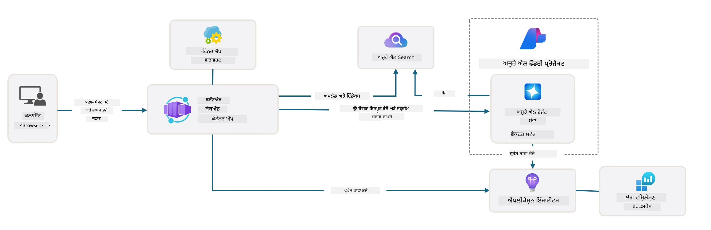

# 3. ਟੈਂਪਲੇਟ ਨੂੰ ਵਿਖੰਡਿਤ ਕਰੋ

!!! tip "ਇਸ ਮੋਡੀਊਲ ਦੇ ਅੰਤ ਤੱਕ ਤੁਸੀਂ ਇਹ ਸਮਰੱਥ ਹੋਵੋਗੇ"

    - [ ] Azure ਸਹਾਇਤਾ ਲਈ MCP ਸਰਵਰਾਂ ਨਾਲ GitHub Copilot ਨੂੰ ਐਕਟੀਵੇਟ ਕਰੋ
    - [ ] AZD ਟੈਂਪਲੇਟ ਫੋਲਡਰ ਬਣਤਰ ਅਤੇ ਘਟਕਾਂ ਨੂੰ ਸਮਝੋ
    - [ ] Infrastructure-as-code (Bicep) ਸੰਰਚਨਾ ਪੈਟਰਨਾਂ ਦੀ ਖੋਜ ਕਰੋ
    - [ ] **ਲੈਬ 3:** GitHub Copilot ਦੀ ਵਰਤੋਂ ਕਰਕੇ ਰਿਪੋਜ਼ਿਟਰੀ ਆਰਕੀਟੈਕਚਰ ਦੀ ਖੋਜ ਅਤੇ ਸਮਝ ਕਰੋ 

---


AZD ਟੈਂਪਲੇਟ ਅਤੇ Azure Developer CLI (`azd`) ਨਾਲ ਅਸੀਂ ਤੁਰੰਤ ਆਪਣੇ AI ਵਿਕਾਸ ਦੀ ਯਾਤਰਾ ਨੂੰ ਪ੍ਰਮਾਣਿਤ ਰਿਪੋਜ਼ਿਟਰੀਜ਼ ਦੇ ਨਾਲ ਸ਼ੁਰੂ ਕਰ ਸਕਦੇ ਹਾਂ ਜੋ ਨਮੂਨਾ ਕੋਡ, ਇਨਫਰਾਸਟ੍ਰਕਚਰ ਅਤੇ ਕੰਫ਼ਿਗਰੇਸ਼ਨ ਫਾਇਲਾਂ ਪ੍ਰਦਾਨ ਕਰਦੇ ਹਨ - ਇੱਕ ਤਿਆਰ-ਕੇ-ਲਈ-ਡਿਪਲੋਏ ਕਰਨ ਯੋਗ _starter_ ਪ੍ਰੋਜੈਕਟ ਦੇ ਰੂਪ ਵਿੱਚ।

**ਪਰ ਹੁਣ, ਸਾਨੂੰ ਪ੍ਰੋਜੈਕਟ ਦੀ ਬਣਤਰ ਅਤੇ ਕੋਡਬੇਸ ਨੂੰ ਸਮਝਣ ਦੀ ਲੋੜ ਹੈ - ਅਤੇ AZD ਟੈਂਪਲੇਟ ਨੂੰ ਕਸਟਮਾਈਜ਼ ਕਰ ਸਕਣਾ ਹੈ - ਬਿਨਾਂ ਕਿਸੇ ਪਹਿਲੀਆਂ ਅਨੁਭਵ ਜਾਂ AZD ਦੀ ਸਮਝ ਦੇ!**

---

## 1. GitHub Copilot ਐਕਟੀਵੇਟ ਕਰੋ

### 1.1 GitHub Copilot Chat ਇੰਸਟਾਲ ਕਰੋ

ਹੁਣ ਸਮਾਂ ਹੈ [GitHub Copilot with Agent Mode](https://code.visualstudio.com/docs/copilot/chat/chat-agent-mode) ਦੀ ਖੋਜ ਕਰਨ ਦਾ। ਹੁਣ ਅਸੀਂ ਪ੍ਰਾਕ੍ਰਿਤਿਕ ਭਾਸ਼ਾ ਦਾ ਉਪਯੋਗ ਕਰਕੇ ਆਪਣੇ ਟਾਸਕ ਨੂੰ ਉੱਚ ਪੱਧਰ 'ਤੇ ਵਰਣਨ ਕਰ ਸਕਦੇ ਹਾਂ, ਅਤੇ ਨਿਰਵਾਹ ਵਿੱਚ ਸਹਾਇਤਾ ਪ੍ਰਾਪਤ ਕਰ ਸਕਦੇ ਹਾਂ। ਇਸ ਲੈਬ ਲਈ, ਅਸੀਂ [Copilot Free plan](https://github.com/github-copilot/signup) ਦੀ ਵਰਤੋਂ ਕਰਾਂਗੇ ਜਿਸ ਵਿੱਚ ਪੂਰੇ ਕੀਤਾ ਜਾਣ ਵਾਲੇ ਕੰਰਟ ਅਤੇ ਚੈਟ ਇੰਟਰੈਕਸ਼ਨਾਂ ਲਈ ਮਹੀਨਾਵਾਰ ਸੀਮਾ ਹੈ।

ਇਸ ਐਕਸਟੇੰਸ਼ਨ ਨੂੰ ਮਾਰਕਿਟਪਲੇਸ ਤੋਂ ਇੰਸਟਾਲ ਕੀਤਾ ਜਾ ਸਕਦਾ ਹੈ, ਪਰ ਇਹ ਤੁਹਾਡੇ Codespaces ਵਾਤਾਵਰਣ ਵਿੱਚ ਪਹਿਲਾਂ ਹੀ ਉਪਲਬਧ ਹੋਣਾ ਚਾਹੀਦਾ ਹੈ। _Copilot ਆਈਕਨ ਡ੍ਰੌਪ-ਡਾਊਨ ਤੋਂ `Open Chat` 'ਤੇ ਕਲਿੱਕ ਕਰੋ - ਅਤੇ ਇੱਕ ਪ੍ਰੰਪਟ ਟਾਈਪ ਕਰੋ ਜਿਵੇਂ `What can you do?`_ - ਤੁਹਾਨੂੰ ਲਾਗਇਨ ਕਰਨ ਲਈ ਪੂਛਿਆ ਜਾ ਸਕਦਾ ਹੈ। **GitHub Copilot Chat ਤਿਆਰ ਹੈ**।

### 1.2. MCP ਸਰਵਰ ਇੰਸਟਾਲ ਕਰੋ

Agent ਮੋਡ ਪ੍ਰਭਾਵਸ਼ਾਲੀ ਹੋਣ ਲਈ, ਇਸਨੂੰ ਉਹਨਾਂ ਸਹੀ ਟੂਲਾਂ ਤੱਕ ਪਹੁੰਚ ਦੀ ਲੋੜ ਹੁੰਦੀ ਹੈ ਜੋ ਇਸਨੂੰ ਗਿਆਨ ਪ੍ਰਾਪਤ ਕਰਨ ਜਾਂ ਕਾਰਵਾਈ ਕਰਨ ਵਿੱਚ ਸਹਾਇਤਾ ਦੇ ਸਕਦੇ ਹਨ। ਇੱਥੇ MCP ਸਰਵਰ ਮਦਦ ਕਰ ਸਕਦੇ ਹਨ। ਅਸੀਂ ਹੇਠਾਂ ਦਿੱਤੇ ਸਰਵਰ ਸੰਰਚਨਾ ਕਰਾਂਗੇ:

1. [Azure MCP Server](../../../../../workshop/docs/instructions)
1. [Microsoft Docs MCP Server](../../../../../workshop/docs/instructions)

ਇਨ੍ਹਾ ਨੂੰ ਐਕਟੀਵੇਟ ਕਰਨ ਲਈ:

1. `.vscode/mcp.json` ਨਾਮ ਦੀ ਫਾਇਲ ਬਣਾਓ ਜੇ ਇਹ ਮੌਜੂਦ ਨਹੀਂ ਹੈ
1. ਉਸ ਫਾਇਲ ਵਿੱਚ ਹੇਠ ਲਿਖਿਆ ਨਕਲ ਕਰੋ - ਅਤੇ ਸਰਵਰਾਂ ਨੂੰ ਸ਼ੁਰੂ ਕਰੋ!
   ```json title=".vscode/mcp.json"
   {
      "servers": {
         "Azure MCP Server": {
            "command": "npx",
            "args": [
            "-y",
            "@azure/mcp@latest",
            "server",
            "start"
            ]
         },
         "microsoft.docs.mcp": {
            "type": "http",
            "url": "https://learn.microsoft.com/api/mcp"
         }
      }
   }
   ```

??? warning "ਤੁਹਾਨੂੰ ਇੱਕ ਐਰਰ ਮਿਲ ਸਕਦਾ ਹੈ ਕਿ `npx` ਇੰਸਟਾਲ ਨਹੀਂ ਹੈ (ਠੀਕ ਕਰਨ ਲਈ ਖੋਲ੍ਹਣ ਲਈ ਕਲਿੱਕ ਕਰੋ)"

      ਇਸ ਨੂੰ ਠੀਕ ਕਰਨ ਲਈ, `.devcontainer/devcontainer.json` ਫਾਇਲ ਖੋਲ੍ਹੋ ਅਤੇ features ਭਾਗ ਵਿੱਚ ਇਹ ਲਾਈਨ ਸ਼ਾਮਲ ਕਰੋ। ਫਿਰ ਕੰਟੇਨਰ ਨੂੰ ਪੁਨਰਬਿਲਡ ਕਰੋ। ਹੁਣ ਤੁਹਾਡੇ ਕੋਲ `npx` ਇੰਸਟਾਲ ਹੋਣਾ ਚਾਹੀਦਾ ਹੈ।

      ```title="" linenums="0"
         "features": {
            "ghcr.io/devcontainers/features/node:1": {},
            ...
         },
      ```


---

### 1.3. GitHub Copilot Chat ਦੀ ਜਾਂਚ ਕਰੋ

**ਸਭ ਤੋਂ ਪਹਿਲਾਂ VS Code ਕਮਾਂਡ ਲਾਈਨ ਤੋਂ Azure ਨਾਲ ਪ੍ਰਮਾਣਿਕਤਾ ਲਈ `az login` ਵਰਤੋ।**

ਹੁਣ ਤੁਹਾਨੂੰ ਆਪਣੀ Azure ਸਬਸਕ੍ਰਿਪਸ਼ਨ ਸਥਿਤੀ ਪੁੱਛਣ ਯੋਗ ਹੋਣਾ ਚਾਹੀਦਾ ਹੈ, ਅਤੇ ਤैनਾਤ ਕੀਤੇ ਗਏ ਸਰੋਤਾਂ ਜਾਂ ਕੰਫਿਗਰੇਸ਼ਨ ਬਾਰੇ ਸਵਾਲ ਪੁੱਛ ਸਕਦੇ ਹੋ। ਇਹ ਪ੍ਰੰਪਟ ਆਜ਼ਮਾਓ:

1. `List my Azure resource groups`
1. `#foundry list my current deployments`

ਤੁਸੀਂ Azure ਡੌਕੂਮੈਂਟੇਸ਼ਨ ਬਾਰੇ ਵੀ ਸਵਾਲ ਪੁੱਛ ਸਕਦੇ ਹੋ ਅਤੇ Microsoft Docs MCP ਸਰਵਰ ਵਿੱਚ ਅਧਾਰਿਤ ਜਵਾਬ ਪ੍ਰਾਪਤ ਕਰ ਸਕਦੇ ਹੋ। ਇਹ ਪ੍ਰੰਪਟ ਆਜ਼ਮਾਓ:

1. `#microsoft_docs_search What is Azure Developer CLI?`
1. `#microsoft_docs_search Show me a Python tutorial to chat with deployed model`

ਜਾਂ ਤੁਸੀਂ ਕਿਸੇ ਟਾਸਕ ਨੂੰ ਪੂਰਾ ਕਰਨ ਲਈ ਕੋਡ ਸਨੇਪਿਟ ਦੀ ਮੰਗ ਵੀ ਕਰ ਸਕਦੇ ਹੋ। ਇਹ ਪ੍ਰੰਪਟ ਆਜ਼ਮਾਓ:

1. `Give me a Python code example that uses AAD for an interactive chat client`

`Ask` ਮੋਡ ਵਿੱਚ, ਇਹ ਤੁਹਾਨੂੰ ਐਸਾ ਕੋਡ ਦਿਵੇਗਾ ਜੋ ਤੁਸੀਂ ਕਾਪੀ-ਪੇਸਟ ਕਰਕੇ ਟਰਾਇ ਕਰ ਸਕਦੇ ਹੋ। `Agent` ਮੋਡ ਵਿੱਚ, ਇਹ ਇੱਕ ਕਦਮ ਅੱਗੇ ਵੀ ਜਾ ਸਕਦਾ ਹੈ ਅਤੇ ਤੁਹਾਡੇ ਲਈ ਸੰਬੰਧਿਤ ਸਰੋਤ ਬਣਾਉਣ - ਸਮੇਤ ਸੈਟਅੱਪ ਸਕ੍ਰਿਪਟ ਅਤੇ ਡੌਕਯੂਮੈਂਟੇਸ਼ਨ - ਤਿਆਰ ਕਰ ਸਕਦਾ ਹੈ, ਤਾਂ ਜੋ ਤੁਸੀਂ ਉਹ ਟਾਸਕ ਨਿਰਵਾਹ ਕਰ ਸਕੋ।

**ਹੁਣ ਤੁਸੀਂ ਟੈਂਪਲੇਟ ਰਿਪੋਜ਼ਿਟਰੀ ਦੀ ਖੋਜ ਸ਼ੁਰੂ ਕਰਨ ਲਈ ਸਾਜ਼ੋ-ਸਮਾਨ ਨਾਲ ਲੈਸ ਹੋ।**

---

## 2. ਆਰਕੀਟੈਕਚਰ ਨੂੰ ਵਿਖੰਡਿਤ ਕਰੋ

??? prompt "ਪੂਛੋ: docs/images/architecture.png ਵਿੱਚ ਐਪਲੀਕੇਸ਼ਨ ਆਰਕੀਟੈਕਚਰ ਨੂੰ ਇੱਕ ਪੈਰਾਗ੍ਰਾਫ ਵਿੱਚ ਸਮਝਾਓ"

      ਇਹ ਐਪਲੀਕੇਸ਼ਨ ਇੱਕ ਐਜ਼ੂਰੇ ਉੱਤੇ ਅਧਾਰਿਤ AI-ਚਲਿਤ ਚੈਟ ਐਪਲੀਕੇਸ਼ਨ ਹੈ ਜੋ ਇੱਕ ਆਧੁਨਿਕ ਏਜੰਟ-ਅਧਾਰਿਤ ਆਰਕੀਟੈਕਚਰ ਦਾ ਨਮੂਨਾ ਦਿੰਦਾ ਹੈ। ਹੱਲAzure Container App ਦੇ ਆਸ-ਪਾਸ ਕੇਂਦ੍ਰਿਤ ਹੈ ਜੋ ਮੁੱਖ ਐਪਲੀਕੇਸ਼ਨ ਕੋਡ ਨੂੰ ਹੋਸਟ ਕਰਦਾ ਹੈ, ਜੋ ਉਪਭੋਗਤਾ ਦੇ ਇਨਪੁੱਟ ਨੂੰ ਪ੍ਰੋਸੈਸ ਕਰਦਾ ਹੈ ਅਤੇ AI ਏਜੰਟ ਰਾਹੀਂ ਸਮਝਦਾਰ ਜਵਾਬ ਤਿਆਰ ਕਰਦਾ ਹੈ। 
      
      ਆਰਕੀਟੈਕਚਰ Microsoft Foundry Project ਨੂੰ AI ਸਮਰਥਨਾਂ ਲਈ ਦਿੱਤਾ ਗਿਆ ਆਧਾਰ ਵਜੋਂ ਵਰਤਦਾ ਹੈ, ਅਤੇ Azure AI Services ਨਾਲ ਜੁੜਦਾ ਹੈ ਜੋ ਮੂਲ ਭਾਸ਼ਾਈ ਮਾਡਲ (ਜਿਵੇਂ GPT-4o-mini) ਅਤੇ ਏਜੰਟ ਫੰਕਸ਼ਨਾਲਟੀ ਪ੍ਰਦਾਨ ਕਰਦੇ ਹਨ। ਉਪਭੋਗਤਾ ਦੀਆਂ ਇੰਟਰੈਕਸ਼ਨਾਂ React-ਅਧਾਰਿਤ ਫਰੰਟਐਂਡ ਤੋਂ FastAPI ਬੈਕਐਂਡ ਵੱਲ ਵਗਦੀਆਂ ਹਨ ਜੋ AI ਏਜੰਟ ਸਰਵਿਸ ਨਾਲ ਸੰਪਰਕ ਕਰਕੇ ਸੰਦਰਭਕ ਜਵਾਬ ਤਿਆਰ ਕਰਦੀ ਹੈ। 
      
      ਪ੍ਰਣਾਲੀ ਵਿਚ ਗਿਆਨ ਪ੍ਰਾਪਤੀ ਸਮਰਥਾਵਾਂ ਹਨ ਜੋ ਫਾਇਲ ਸੇਰਚ ਜਾਂ Azure AI Search ਸਰਵਿਸ ਦੁਆਰਾ ਕੰਮ ਕਰਦੀਆਂ ਹਨ, ਜੋ ਏਜੰਟ ਨੂੰ ਅਪਲੋਡ ਕੀਤੀਆਂ ਦਸਤਾਵੇਜ਼ਾਂ ਵਿਚੋਂ ਜਾਣਕਾਰੀ ਪ੍ਰਾਪਤ ਕਰਨ ਅਤੇ ਹਵਾਲੇ ਦੇਣ ਦੀ ਆਗਿਆ ਦਿੰਦੀਆਂ ਹਨ। ਕਾਰਜਕੁਸ਼ਲਤਾ ਦੇ ਲਈ, ਆਰਕੀਟੈਕਚਰ ਵਿੱਚ Application Insights ਅਤੇ Log Analytics Workspace ਰਾਹੀਂ ਵਿਸਤ੍ਰਿਤ ਮਾਨੀਟਰਿੰਗ ਸ਼ਾਮਲ ਹੈ ਜੋ ਟ੍ਰੇਸਿੰਗ, ਲੌਗਿੰਗ ਅਤੇ ਪ੍ਰਦਰਸ਼ਨ ਨੂੰ ਸੁਧਾਰਨ ਲਈ ਹੈ। 
      
      Azure Storage ਐਪਲੀਕੇਸ਼ਨ ਡਾਟਾ ਅਤੇ ਫਾਇਲ ਅਪਲੋਡ ਲਈ ਬਲੌਬ ਸਟੋਰੇਜ ਦਿੰਦਾ ਹੈ, ਜਦਕਿ Managed Identity Azure ਸਰੋਤਾਂ ਦੇ ਵਿਚਕਾਰ ਸੁੱਖੜ ਪਹੁੰਚ ਨਿਸ਼ਚਿਤ ਕਰਦੀ ਹੈ ਬਿਨਾਂ ਸਾਲੈਡ ਸਨਾਵਾਂ ਨੂੰ ਸਟੋਰ ਕੀਤੇ। ਪੂਰਾ ਹੱਲ ਸਕੇਲਯਾਬਿਲਟੀ ਅਤੇ ਰਹਿਤਾਬੀ ਲਈ ਡਿਜ਼ਾਈਨ ਕੀਤਾ ਗਿਆ ਹੈ, ਜਿੱਥੇ ਕੰਟੇਨਰਾਈਜ਼ਡ ਐਪਲੀਕੇਸ਼ਨ ਮੰਗ ਅਨੁਸਾਰ ਸਵੈਚਲਿਤ ਤੌਰ 'ਤੇ ਸਕੇਲ ਹੁੰਦਾ ਹੈ ਅਤੇ Azure ਦੇ ਪ੍ਰਬੰਧਿਤ ਸਰਵਿਸਿਜ਼ ਦੁਆਰਾ ਨਿਰਮਿਤ ਸੁਰੱਖਿਆ, ਮਾਨੀਟਰਿੰਗ ਅਤੇ CI/CD ਸਮਰੱਥਾਵਾਂ ਪ੍ਰਦਾਨ ਕਰਦਾ ਹੈ।



---

## 3. ਰਿਪੋਜ਼ਿਟਰੀ ਬਣਤਰ

!!! prompt "ਪੂਛੋ: ਟੈਂਪਲੇਟ ਫੋਲਡਰ ਬਣਤਰ ਦੀ ਵਿਆਖਿਆ ਕਰੋ। ਇੱਕ ਦਰਸ਼ਨੀਕ ਅਨੁਕ੍ਰਮਿਕ ਡਾਇਗ੍ਰਾਮ ਨਾਲ ਸ਼ੁਰੂ ਕਰੋ।"

??? info "ਜਵਾਬ: ਵੇਖਣਯੋਗ ਹਾਇਰਾਰਕੀਕਲ ਡਾਇਗ੍ਰਾਮ"

      ```bash title="" 
      get-started-with-ai-agents/
      ├── 📋 Configuration & Setup
      │   ├── azure.yaml                    # Azure Developer CLI configuration
      │   ├── docker-compose.yaml           # Local development containers
      │   ├── pyproject.toml                # Python project configuration
      │   ├── requirements-dev.txt          # Development dependencies
      │   └── .devcontainer/                # VS Code dev container setup
      │
      ├── 🏗️ Infrastructure (infra/)
      │   ├── main.bicep                    # Main infrastructure template
      │   ├── api.bicep                     # API-specific resources
      │   ├── main.parameters.json          # Infrastructure parameters
      │   └── core/                         # Modular infrastructure components
      │       ├── ai/                       # AI service configurations
      │       ├── host/                     # Hosting infrastructure
      │       ├── monitor/                  # Monitoring and logging
      │       ├── search/                   # Azure AI Search setup
      │       ├── security/                 # Security and identity
      │       └── storage/                  # Storage account configs
      │
      ├── 💻 Application Source (src/)
      │   ├── api/                          # Backend API
      │   │   ├── main.py                   # FastAPI application entry
      │   │   ├── routes.py                 # API route definitions
      │   │   ├── search_index_manager.py   # Search functionality
      │   │   ├── data/                     # API data handling
      │   │   ├── static/                   # Static web assets
      │   │   └── templates/                # HTML templates
      │   ├── frontend/                     # React/TypeScript frontend
      │   │   ├── package.json              # Node.js dependencies
      │   │   ├── vite.config.ts            # Vite build configuration
      │   │   └── src/                      # Frontend source code
      │   ├── data/                         # Sample data files
      │   │   └── embeddings.csv            # Pre-computed embeddings
      │   ├── files/                        # Knowledge base files
      │   │   ├── customer_info_*.json      # Customer data samples
      │   │   └── product_info_*.md         # Product documentation
      │   ├── Dockerfile                    # Container configuration
      │   └── requirements.txt              # Python dependencies
      │
      ├── 🔧 Automation & Scripts (scripts/)
      │   ├── postdeploy.sh/.ps1           # Post-deployment setup
      │   ├── setup_credential.sh/.ps1     # Credential configuration
      │   ├── validate_env_vars.sh/.ps1    # Environment validation
      │   └── resolve_model_quota.sh/.ps1  # Model quota management
      │
      ├── 🧪 Testing & Evaluation
      │   ├── tests/                        # Unit and integration tests
      │   │   └── test_search_index_manager.py
      │   ├── evals/                        # Agent evaluation framework
      │   │   ├── evaluate.py               # Evaluation runner
      │   │   ├── eval-queries.json         # Test queries
      │   │   └── eval-action-data-path.json
      │   ├── sandbox/                      # Development playground
      │   │   ├── 1-quickstart.py           # Getting started examples
      │   │   └── aad-interactive-chat.py   # Authentication examples
      │   └── airedteaming/                 # AI safety evaluation
      │       └── ai_redteaming.py          # Red team testing
      │
      ├── 📚 Documentation (docs/)
      │   ├── deployment.md                 # Deployment guide
      │   ├── local_development.md          # Local setup instructions
      │   ├── troubleshooting.md            # Common issues & fixes
      │   ├── azure_account_setup.md        # Azure prerequisites
      │   └── images/                       # Documentation assets
      │
      └── 📄 Project Metadata
         ├── README.md                     # Project overview
         ├── CODE_OF_CONDUCT.md           # Community guidelines
         ├── CONTRIBUTING.md              # Contribution guide
         ├── LICENSE                      # License terms
         └── next-steps.md                # Post-deployment guidance
      ```

### 3.1. ਕੋਰ ਐਪ ਆਰਕੀਟੈਕਚਰ

ਇਹ ਟੈਂਪਲੇਟ ਇੱਕ **ਫੁੱਲ-ਸਟੈਕ ਵੈੱਬ ਐਪਲੀਕੇਸ਼ਨ** ਪੈਟਰਨ ਦੀ ਪਾਲਣਾ ਕਰਦਾ ਹੈ ਜਿਸ ਵਿੱਚ:

- **ਬੈਕਐਂਡ**: Python FastAPI ਨਾਲ Azure AI ਇੰਟੀਗ੍ਰੇਸ਼ਨ
- **ਫਰੰਟਐਂਡ**: TypeScript/React ਤੇ Vite ਬਿਲਡ ਸਿਸਟਮ
- **ਇਨਫਰਾਸਟ੍ਰਕਚਰ**: ਕਲਾਉਡ ਰਿਸੋਰਸ ਲਈ Azure Bicep ਟੈਂਪਲੇਟ
- **ਕੰਟੇਨਰਾਈਜੇਸ਼ਨ**: ਇਕਸਾਰ ਡਿਪਲੋਇਮੈਂਟ ਲਈ Docker

### 3.2 Infra As Code (bicep)

ਇਨਫਰਾਸਟ੍ਰਕਚਰ ਲੇਅਰ **Azure Bicep** ਟੈਂਪਲੇਟ ਵਰਤਦਾ ਹੈ ਜੋ ਮੋਡੀਊਲਰ ਤਰੀਕੇ ਨਾਲ ਸੰਗਠਿਤ ਹਨ:

   - **`main.bicep`**: ਸਾਰੇ Azure ਰਿਸੋਰਸਸ ਦਾ ਸੰਗਠਨ ਕਰਦਾ ਹੈ
   - **`core/` ਮੋਡੀਊਲ**: ਵੱਖ-ਵੱਖ ਸਰਵਿਸ ਲਈ ਦੁਬਾਰਾ ਵਰਤੋਂਯੋਗ ਕੰਪੋਨੇਟ
      - AI ਸਰਵਿਸਿਜ਼ (Azure OpenAI, AI Search)
      - ਕੰਟੇਨਰ ਹੋਸਟਿੰਗ (Azure Container Apps)
      - ਮਾਨੀਟਰਿੰਗ (Application Insights, Log Analytics)
      - ਸੁਰੱਖਿਆ (Key Vault, Managed Identity)

### 3.3 ਐਪਲੀਕੇਸ਼ਨ ਸੋর্স (`src/`)

**ਬੈਕਐਂਡ API (`src/api/`)**:

- FastAPI-ਅਧਾਰਿਤ REST API
- Foundry Agents ਇੰਟੀਗ੍ਰੇਸ਼ਨ
- ਗਿਆਨ ਪ੍ਰਾਪਤੀ ਲਈ ਸੇਰਚ ਇੰਡੈਕਸ ਮੈਨੇਜਮੈਂਟ
- ਫਾਇਲ ਅਪਲੋਡ ਅਤੇ ਪ੍ਰੋਸੈਸਿੰਗ ਸਮਰੱਥਾਵਾਂ

**ਫਰੰਟਐਂਡ (`src/frontend/`)**:

- ਆਧੁਨਿਕ React/TypeScript SPA
- ਤੇਜ਼ ਵਿਕਾਸ ਅਤੇ ਓਪਟੀਮਾਈਜ਼ਡ ਬਿਲਡ ਲਈ Vite
- ਏਜੰਟ ਇੰਟਰੈਕਸ਼ਨਾਂ ਲਈ ਚੈਟ ਇੰਟਰਫੇਸ

**ਨੋਲਡਜ ਬੇਸ (`src/files/`)**:

- ਨਮੂਨਾ ਗਾਹਕ ਅਤੇ ਉਤਪਾਦ ਡਾਟਾ
- ਫਾਇਲ-ਅਧਾਰਿਤ ਗਿਆਨ ਪ੍ਰਾਪਤੀ ਦਾ ਡੈਮੋ
- JSON ਅਤੇ Markdown ਫਾਰਮੈਟ ਉਦਾਹਰਣਾਂ


### 3.4 ਡੈਵਓਪਸ ਅਤੇ ਆਟੋਮੇਸ਼ਨ

**ਸਕ੍ਰਿਪਟਸ (`scripts/`)**:

- ਕ੍ਰਾਸ-ਪ্লੈਟਫਾਰਮ PowerShell ਅਤੇ Bash ਸਕ੍ਰਿਪਟ
- ਵਾਤਾਵਰਣ ਦੀ ਜਾਂਚ ਅਤੇ ਸੈਟਅੱਪ
- ਪੋਸਟ-ਡਿਪਲੋਇਮੈਂਟ ਸੰਰਚਨਾ
- ਮਾਡਲ ਕੋਟਾ ਪ੍ਰਬੰਧਨ

**Azure Developer CLI ਇੰਟੀਗ੍ਰੇਸ਼ਨ**:

- `azure.yaml` `azd` ਵਰਕਫਲੋਅਜ਼ ਲਈ ਕੰਫਿਗਰੇਸ਼ਨ
- ਸੁਚਾਰੂ ਪ੍ਰੋਵਿਜ਼ਨਿੰਗ ਅਤੇ ਡਿਪਲੋਇਮੈਂਟ
- ਵਾਤਾਵਰਣ ਵੈਰੀਏਬਲ ਮੈਨੇਜਮੈਂਟ

### 3.5 ਟੈਸਟਿੰਗ ਅਤੇ ਕੁਆਲਿਟੀ ਅੱਸ਼ੁਰੰਸ

**ਇਵੈਲਯੂਏਸ਼ਨ ਫ੍ਰੇਮਵਰਕ (`evals/`)**:

- ਏਜੰਟ ਦੇ ਪ੍ਰਦਰਸ਼ਨ ਦੀ ਮਾਪਨਾ
- ਪ੍ਰਸ਼ਨ-ਜਵਾਬ ਗੁਣਵੱਤਾ ਟੈਸਟਿੰਗ
- ਆਟੋਮੇਟਿਕ ਅਸੈਸਮੈਂਟ ਪਾਈਪਲਾਈਨ

**AI ਸੁਰੱਖਿਆ (`airedteaming/`)**:

- AI ਸੁਰੱਖਿਆ ਲਈ ਰੈੱਡ ਟੀਮ ਟੈਸਟਿੰਗ
- ਸੁਰੱਖਿਆ ਰਿਸਕ ਸਕੈਨਿੰਗ
- ਜ਼ਿੰਮੇਵਾਰ AI ਅਭਿਆਸ

---

## 4. ਵਧਾਈਆਂ 🏆

ਤੁਸੀਂ ਸਫਲਤਾਪੂਰਵਕ GitHub Copilot Chat ਨੂੰ MCP ਸਰਵਰਾਂ ਨਾਲ ਵਰਤਿਆ ਹੈ, ਰਿਪੋਜ਼ਿਟਰੀ ਦੀ ਖੋਜ ਕਰਨ ਲਈ।

- [X] Azure ਲਈ GitHub Copilot ਐਕਟੀਵੇਟ ਕੀਤਾ
- [X] ਐਪਲੀਕੇਸ਼ਨ ਆਰਕੀਟੈਕਚਰ ਨੂੰ ਸਮਝਿਆ
- [X] AZD ਟੈਂਪਲੇਟ ਬਣਤਰ ਦੀ ਖੋਜ ਕੀਤੀ

ਇਸ ਨਾਲ ਤੁਹਾਨੂੰ ਇਸ ਟੈਂਪਲੇਟ ਲਈ _Infrastructure as code_ ਸੰਪੱਤੀਆਂ ਦਾ ਇੱਕ ਅਨੁਭਵ ਮਿਲਦਾ ਹੈ। ਅਗਲੇ ਕਦਮ ਵਿੱਚ, ਅਸੀਂ AZD ਲਈ ਕੰਫਿਗਰੇਸ਼ਨ ਫਾਇਲ ਨੂੰ ਦੇਖਾਂਗੇ।

---

<!-- CO-OP TRANSLATOR DISCLAIMER START -->
ਦਿਸਕਲੇਮਰ:
ਇਹ ਦਸਤਾਵੇਜ਼ ਏਆਈ ਅਨੁਵਾਦ ਸੇਵਾ [Co-op Translator](https://github.com/Azure/co-op-translator) ਦੀ ਵਰਤੋਂ ਨਾਲ ਅਨੁਵਾਦ ਕੀਤਾ ਗਿਆ ਹੈ। ਅਸੀਂ ਸ਼ੁੱਧਤਾ ਲਈ ਯਤਨ ਕਰਦੇ ਹਾਂ, ਪਰ ਕਿਰਪਾ ਕਰਕੇ ਧਿਆਨ ਰਖੋ ਕਿ ਸਵੈਚਾਲਿਤ ਅਨੁਵਾਦਾਂ ਵਿੱਚ ਗਲਤੀਆਂ ਜਾਂ ਅਣਸ਼ੁੱਧਤੀਆਂ ਹੋ ਸਕਦੀਆਂ ਹਨ। ਮੂਲ ਦਸਤਾਵੇਜ਼ ਆਪਣੀ ਮੂਲ ਭਾਸ਼ਾ ਵਿੱਚ ਅਧਿਕਾਰਕ ਸਰੋਤ ਮੰਨਿਆ ਜਾਣਾ ਚਾਹੀਦਾ ਹੈ। ਮਹੱਤਵਪੂਰਨ ਜਾਣਕਾਰੀ ਲਈ, ਪੇਸ਼ੇਵਰ ਮਨੁੱਖੀ ਅਨੁਵਾਦ ਦੀ ਸਿਫ਼ਾਰਸ਼ ਕੀਤੀ ਜਾਂਦੀ ਹੈ। ਅਸੀਂ ਇਸ ਅਨੁਵਾਦ ਦੀ ਵਰਤੋਂ ਕਾਰਨ ਹੋਣ ਵਾਲੀਆਂ ਕਿਸੇ ਵੀ ਗਲਤਫਹਮੀ ਜਾਂ ਗਲਤ ਵਿਆਖਿਆ ਲਈ ਜ਼ਿੰਮੇਵਾਰ ਨਹੀਂ ਹਾਂ।
<!-- CO-OP TRANSLATOR DISCLAIMER END -->