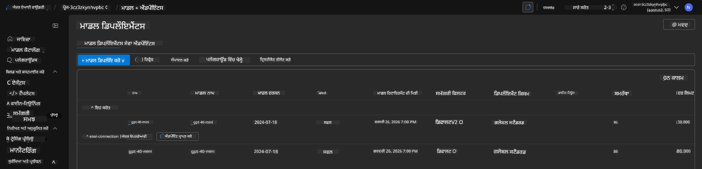

<!--
CO_OP_TRANSLATOR_METADATA:
{
  "original_hash": "6539a34c770f3ceff282370d72ee74dc",
  "translation_date": "2025-09-24T14:56:05+00:00",
  "source_file": "workshop/docs/instructions/6-Teardown-Infrastructure.md",
  "language_code": "pa"
}
-->
# 6. ਇੰਫ੍ਰਾਸਟਰਕਚਰ ਨੂੰ ਹਟਾਉਣਾ

!!! tip "ਇਸ ਮੋਡਿਊਲ ਦੇ ਅੰਤ ਤੱਕ ਤੁਸੀਂ ਸਮਰੱਥ ਹੋਵੋਗੇ"

    - [ ] ਆਈਟਮ
    - [ ] ਆਈਟਮ
    - [ ] ਆਈਟਮ

---

## ਬੋਨਸ ਅਭਿਆਸ

ਪ੍ਰੋਜੈਕਟ ਨੂੰ ਹਟਾਉਣ ਤੋਂ ਪਹਿਲਾਂ, ਕੁਝ ਖੁੱਲ੍ਹੇ-ਅੰਤ ਦੀ ਖੋਜ ਕਰਨ ਲਈ ਕੁਝ ਮਿੰਟ ਲਓ।

!!! danger "ਨਿਤਿਆ-ਟੂਡੂ: ਕੁਝ ਪ੍ਰੇਰਣਾਂ ਦੀ ਰੂਪਰੇਖਾ ਦਿਓ"

---

## ਇੰਫ੍ਰਾ ਨੂੰ ਡੀ-ਪ੍ਰੋਵਿਜਨ ਕਰੋ

1. ਇੰਫ੍ਰਾਸਟਰਕਚਰ ਨੂੰ ਹਟਾਉਣਾ ਇੰਨਾ ਆਸਾਨ ਹੈ:
      
      ```bash title="" linenums="0"
      azd down --purge
      ```
1. `--purge` ਫਲੈਗ ਇਹ ਯਕੀਨੀ ਬਣਾਉਂਦਾ ਹੈ ਕਿ ਇਹ ਸਾਫਟ-ਡਿਲੀਟ ਕੀਤੇ ਗਏ Cognitive Service ਸਰੋਤਾਂ ਨੂੰ ਵੀ ਹਟਾ ਦਿੰਦਾ ਹੈ, ਇਸ ਤਰ੍ਹਾਂ ਇਹ ਸਰੋਤਾਂ ਦੁਆਰਾ ਰੱਖੇ ਗਏ ਕੋਟੇ ਨੂੰ ਰਿਲੀਜ਼ ਕਰਦਾ ਹੈ। ਜਦੋਂ ਇਹ ਪੂਰਾ ਹੋ ਜਾਂਦਾ ਹੈ, ਤਾਂ ਤੁਹਾਨੂੰ ਕੁਝ ਇਸ ਤਰ੍ਹਾਂ ਦੇਖਣ ਨੂੰ ਮਿਲੇਗਾ:
      
      ```bash title="" linenums="0"
      ? Total resources to delete: 11, are you sure you want to continue? Yes
      Deleting your resources can take some time.
      (✓) Done: Deleted resource group rg-nitya-mshack-azd
      (✓) Done: Purging Cognitive Account: aoai-3cz3zkynhvpbc

      SUCCESS: Your application was removed from Azure in 11 minutes 4 seconds.
      ```

1. (ਵਿਕਲਪਿਕ) ਜੇ ਤੁਸੀਂ ਹੁਣ `azd up` ਦੁਬਾਰਾ ਚਲਾਉਂਦੇ ਹੋ, ਤਾਂ ਤੁਸੀਂ ਨੋਟਿਸ ਕਰੋਗੇ ਕਿ gpt-4.1 ਮਾਡਲ ਡਿਪਲੌਇ ਹੋ ਜਾਂਦਾ ਹੈ ਕਿਉਂਕਿ ਵਾਤਾਵਰਣ ਵੈਰੀਏਬਲ ਨੂੰ ਬਦਲਿਆ ਗਿਆ ਸੀ (ਅਤੇ ਸਥਾਨਕ `.azure` ਫੋਲਡਰ ਵਿੱਚ ਸੇਵ ਕੀਤਾ ਗਿਆ ਸੀ)। 

      ਇੱਥੇ ਮਾਡਲ ਡਿਪਲੌਇਮੈਂਟ **ਪਹਿਲਾਂ**:

      

      ਅਤੇ ਇਹ **ਬਾਅਦ ਵਿੱਚ** ਹੈ:
      

---

