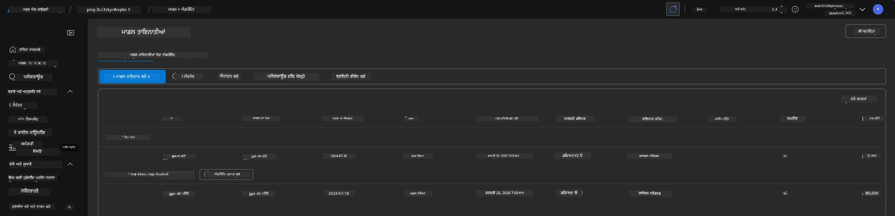
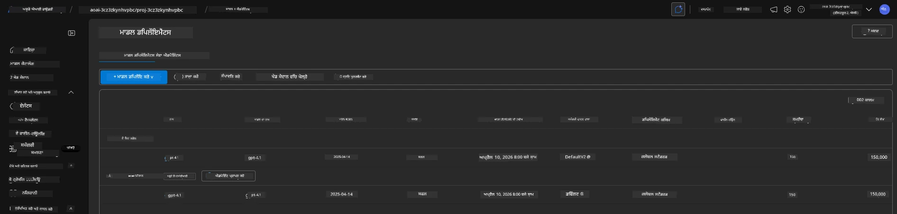

# 6. ਇੰਫਰਾਸਟ੍ਰੱਕਚਰ ਨੂੰ ਹਟਾਉਣਾ

!!! tip "ਇਸ ਮੋਡੀਊਲ ਦੇ ਅੰਤ ਤੱਕ ਤੁਸੀਂ ਸਮਰੱਥ ਹੋਵੋਗੇ"

    - [ ] ਸੰਸਾਧਨਾਂ ਦੀ ਸਫਾਈ ਅਤੇ ਲਾਗਤ ਪ੍ਰਬੰਧਨ ਦੀ ਮਹੱਤਤਾ ਨੂੰ ਸਮਝੋ
    - [ ] ਸੁਰੱਖਿਅਤ ਤਰੀਕੇ ਨਾਲ ਇੰਫਰਾਸਟ੍ਰੱਕਚਰ ਨੂੰ ਡੀਪ੍ਰੋਵਾਈਜ਼ਨ ਕਰਨ ਲਈ `azd down` ਵਰਤੋ
    - [ ] ਲੋੜ ਪੈਣ 'ਤੇ ਸੌਫਟ-ਡਿਲੀਟ ਕੀਤੀਆਂ Cognitive Service resources ਨੂੰ ਰਿਕਵਰ ਕਰੋ
    - [ ] **Lab 6:** Azure resources ਨੂੰ ਸਾਫ਼ ਕਰੋ ਅਤੇ ਹਟਾਉਣ ਦੀ ਪੁਸ਼ਟੀ ਕਰੋ

---

## ਬੋਨਸ ਅਭਿਆਸ

Before we tear down the project, take a few minutes to do some open-ended exploration.

!!! info "ਇਹ ਖੋਜ ਪ੍ਰੰਪਟਾਂ ਅਜ਼ਮਾਓ"

    **GitHub Copilot ਨਾਲ ਪ੍ਰਯੋਗ ਕਰੋ:**
    
    1. ਪੁੱਛੋ: `What other AZD templates could I try for multi-agent scenarios?`
    2. ਪੁੱਛੋ: `How can I customize the agent instructions for a healthcare use case?`
    3. ਪੁੱਛੋ: `What environment variables control cost optimization?`
    
    **Azure ਪੋਰਟਲ ਦੀ ਖੋਜ ਕਰੋ:**
    
    1. ਆਪਣੇ ਡਿਪਲੋਇਮੈਂਟ ਲਈ Application Insights ਮੈਟ੍ਰਿਕਸ ਦੀ ਸਮੀਖਿਆ ਕਰੋ
    2. ਪ੍ਰੋਵਿਜ਼ਨ ਕੀਤੀਆਂ ਸੰਸਾਧਨਾਂ ਲਈ ਲਾਗਤ ਵਿਸ਼ਲੇਸ਼ਣ ਚੈੱਕ ਕਰੋ
    3. Microsoft Foundry ਪੋਰਟਲ ਵਿੱਚ agent playground ਨੂੰ ਇੱਕ ਵਾਰੀ ਫਿਰ ਖੋਜੋ

---

## ইੰਫਰਾਸਟ੍ਰੱਕਚਰ ਨੂੰ ਡੀਪ੍ਰੋਵਾਈਜ਼ਨ ਕਰੋ

1. ਇੰਫਰਾਸਟ੍ਰੱਕਚਰ ਨੂੰ ਹਟਾਉਣਾ ਇੰਨਾ ਹੀ ਆਸਾਨ ਹੈ:
      
      ```bash title="" linenums="0"
      azd down --purge
      ```
1. `--purge` ਫਲੈਗ ਇਹ ਯਕੀਨੀ ਬਣਾਉਂਦਾ ਹੈ ਕਿ ਇਹ soft-deleted Cognitive Service resources ਨੂੰ ਵੀ ਹਟਾ ਦਿੰਦਾ ਹੈ, ਇਸ ਤਰ੍ਹਾਂ ਇਹਨਾਂ ਰਿਸੋਰਸਾਂ ਵੱਲੋਂ ਰੱਖਿਆ ਗਿਆ ਕੋਟਾ ਛੱਡ ਦਿੱਤਾ ਜਾਂਦਾ ਹੈ। ਮੁਕੰਮਲ ਹੋਣ 'ਤੇ ਤੁਸੀਂ ਕੁਝ ਇਸ ਤਰ੍ਹਾਂ ਵੇਖੋਗੇ:
      
      ```bash title="" linenums="0"
      ? Total resources to delete: 11, are you sure you want to continue? Yes
      Deleting your resources can take some time.
      (✓) Done: Deleted resource group rg-nitya-mshack-azd
      (✓) Done: Purging Cognitive Account: aoai-3cz3zkynhvpbc

      SUCCESS: Your application was removed from Azure in 11 minutes 4 seconds.
      ```

1. (Optional) ਜੇ ਤੁਸੀਂ ਹੁਣ ਫਿਰ `azd up` ਚਲਾਉਂਦੇ ਹੋ, ਤਾਂ ਤੁਸੀਂ ਦੇਖੋਗੇ ਕਿ gpt-4.1 ਮਾਡਲ ਡਿਪਲੋਇ ਹੋ ਜਾਂਦਾ ਹੈ ਕਿਉਂਕਿ environment variable ਨੂੰ ਬਦਲਿਆ ਗਿਆ ਸੀ (ਅਤੇ local `.azure` ਫੋਲਡਰ ਵਿੱਚ ਸੇਵ ਕੀਤਾ ਗਿਆ ਸੀ)। 

      ਇੱਥੇ ਮਾਡਲ ਡਿਪਲੋਇਮੈਂਟਸ **ਪਹਿਲਾਂ**:

      

      ਅਤੇ ਇਹ **ਬਾਅਦ**:
      

---

<!-- CO-OP TRANSLATOR DISCLAIMER START -->
ਡਿਸਕਲੇਮਰ:
ਇਹ ਦਸਤਾਵੇਜ਼ AI ਅਨੁਵਾਦ ਸੇਵਾ Co-op Translator (https://github.com/Azure/co-op-translator) ਦੀ ਵਰਤੋਂ ਕਰਕੇ ਅਨੁਵਾਦ ਕੀਤਾ ਗਿਆ ਹੈ। ਅਸੀਂ ਸ਼ੁੱਧਤਾ ਲਈ ਕੋਸ਼ਿਸ਼ ਕਰਦੇ ਹਾਂ, ਪਰ ਕਿਰਪਾ ਕਰਕੇ ਧਿਆਨ ਰੱਖੋ ਕਿ ਸਵੈਚਾਲਿਤ ਅਨੁਵਾਦਾਂ ਵਿੱਚ ਗਲਤੀਆਂ ਜਾਂ ਅਣਸਹੀਤੀਆਂ ਹੋ ਸਕਦੀਆਂ ਹਨ। ਮੂਲ ਭਾਸ਼ਾ ਵਿੱਚ ਮੌਜੂਦ ਦਸਤਾਵੇਜ਼ ਨੂੰ ਪ੍ਰਮਾਣਿਕ ਸਰੋਤ ਮੰਨਿਆ ਜਾਣਾ ਚਾਹੀਦਾ ਹੈ। ਮਹੱਤਵਪੂਰਨ ਜਾਣਕਾਰੀ ਲਈ ਪੇਸ਼ੇਵਰ ਮਨੁੱਖੀ ਅਨੁਵਾਦ ਦੀ ਸਿਫ਼ਾਰਸ਼ ਕੀਤੀ ਜਾਂਦੀ ਹੈ। ਇਸ ਅਨੁਵਾਦ ਦੇ ਉਪਯੋਗ ਤੋਂ ਉਤਪੰਨ ਕਿਸੇ ਵੀ ਗਲਤਫਹਮੀ ਜਾਂ ਗਲਤ ਵਿਆਖਿਆ ਲਈ ਅਸੀਂ ਜ਼ਿੰਮੇਵਾਰ ਨਹੀਂ ਹਾਂ।
<!-- CO-OP TRANSLATOR DISCLAIMER END -->