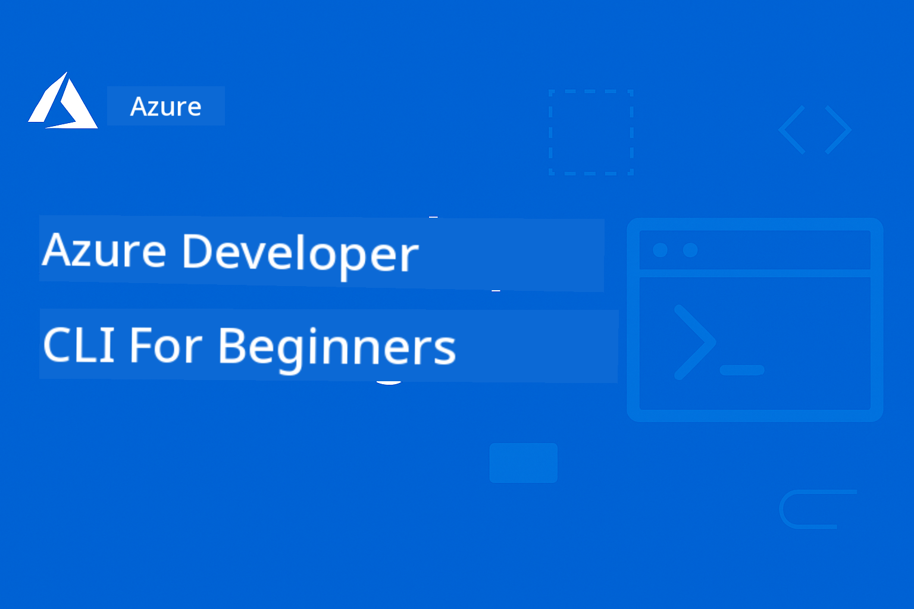

<!--
CO_OP_TRANSLATOR_METADATA:
{
  "original_hash": "068c87cc2641a81ca353ad7064ff326a",
  "translation_date": "2026-01-01T21:55:05+00:00",
  "source_file": "README.md",
  "language_code": "pcm"
}
-->
# AZD For Beginners: One Structured Learning Journey

 

[](https://GitHub.com/microsoft/azd-for-beginners/watchers/)
[](https://GitHub.com/microsoft/azd-for-beginners/network/)
[](https://GitHub.com/microsoft/azd-for-beginners/stargazers/)

[](https://discord.gg/microsoft-azure)
[](https://discord.gg/nTYy5BXMWG)

## How to Start Dis Course

Follow these steps to start your AZD learning journey:

1. **Fork di Repository**: Click [](https://GitHub.com/microsoft/azd-for-beginners/fork)
2. **Clone di Repository**: `git clone https://github.com/microsoft/azd-for-beginners.git`
3. **Join di Community**: [Azure Discord Communities](https://discord.com/invite/ByRwuEEgH4) for help from experts
4. **Choose Your Learning Path**: Pick di chapter wey match your experience level

### Support for Plenty Languages

#### Automated Translations (Dem dey always up-to-date)

<!-- CO-OP TRANSLATOR LANGUAGES TABLE START -->
[Arabic](../ar/README.md) | [Bengali](../bn/README.md) | [Bulgarian](../bg/README.md) | [Burmese (Myanmar)](../my/README.md) | [Chinese (Simplified)](../zh/README.md) | [Chinese (Traditional, Hong Kong)](../hk/README.md) | [Chinese (Traditional, Macau)](../mo/README.md) | [Chinese (Traditional, Taiwan)](../tw/README.md) | [Croatian](../hr/README.md) | [Czech](../cs/README.md) | [Danish](../da/README.md) | [Dutch](../nl/README.md) | [Estonian](../et/README.md) | [Finnish](../fi/README.md) | [French](../fr/README.md) | [German](../de/README.md) | [Greek](../el/README.md) | [Hebrew](../he/README.md) | [Hindi](../hi/README.md) | [Hungarian](../hu/README.md) | [Indonesian](../id/README.md) | [Italian](../it/README.md) | [Japanese](../ja/README.md) | [Kannada](../kn/README.md) | [Korean](../ko/README.md) | [Lithuanian](../lt/README.md) | [Malay](../ms/README.md) | [Malayalam](../ml/README.md) | [Marathi](../mr/README.md) | [Nepali](../ne/README.md) | [Nigerian Pidgin](./README.md) | [Norwegian](../no/README.md) | [Persian (Farsi)](../fa/README.md) | [Polish](../pl/README.md) | [Portuguese (Brazil)](../br/README.md) | [Portuguese (Portugal)](../pt/README.md) | [Punjabi (Gurmukhi)](../pa/README.md) | [Romanian](../ro/README.md) | [Russian](../ru/README.md) | [Serbian (Cyrillic)](../sr/README.md) | [Slovak](../sk/README.md) | [Slovenian](../sl/README.md) | [Spanish](../es/README.md) | [Swahili](../sw/README.md) | [Swedish](../sv/README.md) | [Tagalog (Filipino)](../tl/README.md) | [Tamil](../ta/README.md) | [Telugu](../te/README.md) | [Thai](../th/README.md) | [Turkish](../tr/README.md) | [Ukrainian](../uk/README.md) | [Urdu](../ur/README.md) | [Vietnamese](../vi/README.md)
<!-- CO-OP TRANSLATOR LANGUAGES TABLE END -->

## Wetin Dis Course Dey Cover

Learn how to use Azure Developer CLI (azd) through structured chapters wey dey build one after another. **Dem put special focus for deploying AI applications with Microsoft Foundry integration.**

### Why Dis Course Important for Modern Developers

Based on wetin Microsoft Foundry Discord community don observe, **45% of developers want to use AZD for AI workloads** but dem dey face problems like:
- Complex multi-service AI architectures
- Production AI deployment best practices  
- Azure AI service integration and configuration
- Cost optimization for AI workloads
- Troubleshooting AI-specific deployment issues

### Wetin You Go Learn

By the time you finish dis structured course, you go:
- **Master AZD Fundamentals**: Core concepts, installation, and configuration
- **Deploy AI Applications**: Use AZD with Microsoft Foundry services
- **Implement Infrastructure as Code**: Manage Azure resources with Bicep templates
- **Troubleshoot Deployments**: Resolve common issues and debug problems
- **Optimize for Production**: Security, scaling, monitoring, and cost management
- **Build Multi-Agent Solutions**: Deploy complex AI architectures

## 📚 Learning Chapters

*Pick your learning path based on experience level and goals*

### 🚀 Chapter 1: Foundation & Quick Start
**Wetin you need**: Azure subscription, small command line sabi  
**Duration**: 30-45 minutes  
**Complexity**: ⭐

#### Wetin You Go Learn
- Understand Azure Developer CLI fundamentals
- Install AZD for your platform
- Deploy your first app wey go succeed

#### Learning Resources
- **🎯 Start Here**: [What is Azure Developer CLI?](../..)
- **📖 Theory**: [AZD Basics](docs/getting-started/azd-basics.md) - Core concepts and terminology
- **⚙️ Setup**: [Installation & Setup](docs/getting-started/installation.md) - Platform-specific guides
- **🛠️ Hands-On**: [Your First Project](docs/getting-started/first-project.md) - Step-by-step tutorial
- **📋 Quick Reference**: [Command Cheat Sheet](resources/cheat-sheet.md)

#### Practical Exercises
```bash
# Small check make sure say installation dey okay
azd version

# Make you deploy your first app
azd init --template todo-nodejs-mongo
azd up
```

**💡 Chapter Outcome**: Successfully deploy a simple web application to Azure using AZD

**✅ Success Validation:**
```bash
# After you don finish Chapter 1, you go fit:
azd version              # Show di version wey don install
azd init --template todo-nodejs-mongo  # Set up di project
azd up                  # Deploy am go Azure
azd show                # Show di URL wey di app dey run on
# App go open for browser and e go work
azd down --force --purge  # Clean up di resources
```

**📊 Time Investment:** 30-45 minutes  
**📈 Skill Level After:** Fit deploy basic applications on your own

**✅ Success Validation:**
```bash
# When you don finish Chapter 1, you go fit:
azd version              # Show di version wey don install
azd init --template todo-nodejs-mongo  # Set up di project
azd up                  # Dey deploy go Azure
azd show                # Show di URL for di app wey dey run
# Application go open for browser an e go work
azd down --force --purge  # Dey clean up resources
```

**📊 Time Investment:** 30-45 minutes  
**📈 Skill Level After:** Fit deploy basic applications on your own

---

### 🤖 Chapter 2: AI-First Development (Recommended for AI Developers)
**Wetin you need**: Chapter 1 don finish  
**Duration**: 1-2 hours  
**Complexity**: ⭐⭐

#### Wetin You Go Learn
- Microsoft Foundry integration with AZD
- Deploy AI-powered applications
- Understand AI service configurations

#### Learning Resources
- **🎯 Start Here**: [Microsoft Foundry Integration](docs/microsoft-foundry/microsoft-foundry-integration.md)
- **📖 Patterns**: [AI Model Deployment](docs/microsoft-foundry/ai-model-deployment.md) - Deploy and manage AI models
- **🛠️ Workshop**: [AI Workshop Lab](docs/microsoft-foundry/ai-workshop-lab.md) - Make your AI solutions AZD-ready
- **🎥 Interactive Guide**: [Workshop Materials](workshop/README.md) - Browser-based learning with MkDocs * DevContainer Environment
- **📋 Templates**: [Microsoft Foundry Templates](../..)
- **📝 Examples**: [AZD Deployment Examples](examples/README.md)

#### Practical Exercises
```bash
# Put your first AI app to work
azd init --template azure-search-openai-demo
azd up

# Try more AI template dem
azd init --template openai-chat-app-quickstart
azd init --template agent-openai-python-prompty
```

**💡 Chapter Outcome**: Deploy and configure an AI-powered chat application with RAG capabilities

**✅ Success Validation:**
```bash
# After Chapter 2, you go fit:
azd init --template azure-search-openai-demo
azd up
# Test di AI chat interface
# Ask question dem and get AI-powered answers wey get sources
# Make sure say search integration dey work
azd monitor  # Check say Application Insights dey show telemetry
azd down --force --purge
```

**📊 Time Investment:** 1-2 hours  
**📈 Skill Level After:** Fit deploy and configure production-ready AI applications  
**💰 Cost Awareness:** Know say dev fit cost $80-150/month, production fit cost $300-3500/month

#### 💰 Cost Considerations for AI Deployments

**Development Environment (Estimated $80-150/month):**
- Azure OpenAI (Pay-as-you-go): $0-50/month (based on token usage)
- AI Search (Basic tier): $75/month
- Container Apps (Consumption): $0-20/month
- Storage (Standard): $1-5/month

**Production Environment (Estimated $300-3,500+/month):**
- Azure OpenAI (PTU for consistent performance): $3,000+/month OR Pay-as-go with high volume
- AI Search (Standard tier): $250/month
- Container Apps (Dedicated): $50-100/month
- Application Insights: $5-50/month
- Storage (Premium): $10-50/month

**💡 Cost Optimization Tips:**
- Use **Free Tier** Azure OpenAI for learning (50,000 tokens/month included)
- Run `azd down` to deallocate resources when you no dey actively develop
- Start with consumption-based billing, upgrade to PTU only for production
- Use `azd provision --preview` to estimate costs before deployment
- Enable auto-scaling: pay only for actual usage

**Cost Monitoring:**
```bash
# Check di costs wey dem estimate for each month
azd provision --preview

# Dey monitor di real costs for Azure Portal
az consumption budget list --resource-group <your-rg>
```

---

### ⚙️ Chapter 3: Configuration & Authentication
**Wetin you need**: Chapter 1 don finish  
**Duration**: 45-60 minutes  
**Complexity**: ⭐⭐

#### Wetin You Go Learn
- Environment configuration and management
- Authentication and security best practices
- Resource naming and organization

#### Learning Resources
- **📖 Configuration**: [Configuration Guide](docs/getting-started/configuration.md) - Environment setup
- **🔐 Security**: [Authentication patterns and managed identity](docs/getting-started/authsecurity.md) - Authentication patterns
- **📝 Examples**: [Database App Example](examples/database-app/README.md) - AZD Database Examples

#### Practical Exercises
- Configure multiple environments (dev, staging, prod)
- Set up managed identity authentication
- Implement environment-specific configurations

**💡 Chapter Outcome**: Manage multiple environments with proper authentication and security

---

### 🏗️ Chapter 4: Infrastructure as Code & Deployment
**Wetin you need**: Chapters 1-3 don finish  
**Duration**: 1-1.5 hours  
**Complexity**: ⭐⭐⭐

#### Wetin You Go Learn
- Advanced deployment patterns
- Infrastructure as Code with Bicep
- Resource provisioning strategies

#### Learning Resources
- **📖 Deployment**: [Deployment Guide](docs/deployment/deployment-guide.md) - Complete workflows
- **🏗️ Provisioning**: [Provisioning Resources](docs/deployment/provisioning.md) - Azure resource management
- **📝 Examples**: [Container App Example](../../examples/container-app) - Containerized deployments

#### Practical Exercises
- Create custom Bicep templates
- Deploy multi-service applications
- Implement blue-green deployment strategies

**💡 Chapter Outcome**: Deploy complex multi-service applications using custom infrastructure templates

---

### 🎯 Chapter 5: Multi-Agent AI Solutions (Advanced)
**Wetin you need**: Chapters 1-2 don finish  
**Duration**: 2-3 hours  
**Complexity**: ⭐⭐⭐⭐

#### Wetin You Go Learn
- Multi-agent architecture patterns
- Agent orchestration and coordination
- Production-ready AI deployments

#### Learning Resources
- **🤖 Featured Project**: [Retail Multi-Agent Solution](examples/retail-scenario.md) - Complete implementation
- **🛠️ ARM Templates**: [ARM Template Package](../../examples/retail-multiagent-arm-template) - Deploy wit one click
- **📖 Architecture**: [Multi-agent coordination patterns](/docs/pre-deployment/coordination-patterns.md) - Pattern dem

#### Practical Exercises
```bash
# Deploy di complete retail multi-agent solution
cd examples/retail-multiagent-arm-template
./deploy.sh

# Explore di agent configurations
az deployment group show --resource-group <rg-name> --name <deployment-name>
```

**💡 Chapter Outcome**: Deploy and manage a production-ready multi-agent AI solution with Customer and Inventory agents

---

### 🔍 Chapter 6: Pre-Deployment Validation & Planning
**Prerequisites**: Chapter 4 completed  
**Duration**: 1 hour  
**Complexity**: ⭐⭐

#### What You'll Learn
- Capacity planning and resource validation
- SKU selection strategies
- Pre-flight checks and automation

#### Learning Resources
- **📊 Planning**: [Capacity Planning](docs/pre-deployment/capacity-planning.md) - Resource validation
- **💰 Selection**: [SKU Selection](docs/pre-deployment/sku-selection.md) - Cost-effective choices
- **✅ Validation**: [Pre-flight Checks](docs/pre-deployment/preflight-checks.md) - Automated scripts

#### Practical Exercises
- Run capacity validation scripts
- Optimize SKU selections for cost
- Implement automated pre-deployment checks

**💡 Chapter Outcome**: Validate and optimize deployments before execution

---

### 🚨 Chapter 7: Troubleshooting & Debugging
**Prerequisites**: Any deployment chapter completed  
**Duration**: 1-1.5 hours  
**Complexity**: ⭐⭐

#### What You'll Learn
- Systematic debugging approaches
- Common issues and solutions
- AI-specific troubleshooting

#### Learning Resources
- **🔧 Common Issues**: [Common Issues](docs/troubleshooting/common-issues.md) - FAQ and solutions
- **🕵️ Debugging**: [Debugging Guide](docs/troubleshooting/debugging.md) - Step-by-step strategies
- **🤖 AI Issues**: [AI-Specific Troubleshooting](docs/troubleshooting/ai-troubleshooting.md) - AI service problems

#### Practical Exercises
- Diagnose deployment failures
- Resolve authentication issues
- Debug AI service connectivity

**💡 Chapter Outcome**: Independently diagnose and resolve common deployment issues

---

### 🏢 Chapter 8: Production & Enterprise Patterns
**Prerequisites**: Chapters 1-4 completed  
**Duration**: 2-3 hours  
**Complexity**: ⭐⭐⭐⭐

#### What You'll Learn
- Production deployment strategies
- Enterprise security patterns
- Monitoring and cost optimization

#### Learning Resources
- **🏭 Production**: [Production AI Best Practices](docs/microsoft-foundry/production-ai-practices.md) - Enterprise patterns
- **📝 Examples**: [Microservices Example](../../examples/microservices) - Complex architectures
- **📊 Monitoring**: [Application Insights integration](docs/pre-deployment/application-insights.md) - Monitoring

#### Practical Exercises
- Implement enterprise security patterns
- Set up comprehensive monitoring
- Deploy to production with proper governance

**💡 Chapter Outcome**: Deploy enterprise-ready applications with full production capabilities

---

## 🎓 Workshop Overview: Hands-On Learning Experience

> **⚠️ WORKSHOP STATUS: Active Development**  
> The workshop materials are currently being developed and refined. Core modules are functional, but some advanced sections are incomplete. We're actively working to complete all content. [Track progress →](workshop/README.md)

### Interactive Workshop Materials
**Comprehensive hands-on learning with browser-based tools and guided exercises**

Our workshop materials provide a structured, interactive learning experience that complements the chapter-based curriculum above. The workshop is designed for both self-paced learning and instructor-led sessions.

#### 🛠️ Workshop Features
- **Browser-Based Interface**: Complete MkDocs-powered workshop with search, copy, and theme features
- **GitHub Codespaces Integration**: One-click development environment setup
- **Structured Learning Path**: 7-step guided exercises (3.5 hours total)
- **Discovery → Deployment → Customization**: Progressive methodology
- **Interactive DevContainer Environment**: Pre-configured tools and dependencies

#### 📚 Workshop Structure
The workshop follows a **Discovery → Deployment → Customization** methodology:

1. **Discovery Phase** (45 mins)
   - Explore Microsoft Foundry templates and services
   - Understand multi-agent architecture patterns
   - Review deployment requirements and prerequisites

2. **Deployment Phase** (2 hours)
   - Hands-on deployment of AI applications with AZD
   - Configure Azure AI services and endpoints
   - Implement security and authentication patterns

3. **Customization Phase** (45 mins)
   - Modify applications for specific use cases
   - Optimize for production deployment
   - Implement monitoring and cost management

#### 🚀 Getting Started with the Workshop
```bash
# Option 1: GitHub Codespaces (Dis one na di one wey we recommend)
# Click "Code" → "Create codespace on main" inside di repository

# Option 2: Local development (Run am for your machine)
git clone https://github.com/microsoft/azd-for-beginners.git
cd azd-for-beginners/workshop
# Follow di setup instructions wey dey for workshop/README.md
```

#### 🎯 Workshop Learning Outcomes
By completing the workshop, participants will:
- **Deploy Production AI Applications**: Use AZD with Microsoft Foundry services
- **Master Multi-Agent Architectures**: Implement coordinated AI agent solutions
- **Implement Security Best Practices**: Configure authentication and access control
- **Optimize for Scale**: Design cost-effective, performant deployments
- **Troubleshoot Deployments**: Resolve common issues independently

#### 📖 Workshop Resources
- **🎥 Interactive Guide**: [Workshop Materials](workshop/README.md) - Browser-based learning environment
- **📋 Step-by-Step Instructions**: [Guided Exercises](../../workshop/docs/instructions) - Detailed walkthroughs
- **🛠️ AI Workshop Lab**: [AI Workshop Lab](docs/microsoft-foundry/ai-workshop-lab.md) - AI-focused exercises
- **💡 Quick Start**: [Workshop Setup Guide](workshop/README.md#quick-start) - Environment configuration

**Perfect for**: Corporate training, university courses, self-paced learning, and developer bootcamps.

---

## 📖 What is Azure Developer CLI?

Azure Developer CLI (azd) is a developer-centric command-line interface that accelerates the process of building and deploying applications to Azure. It provides:

- **Template-based deployments** - Use pre-built templates for common application patterns
- **Infrastructure as Code** - Manage Azure resources using Bicep or Terraform  
- **Integrated workflows** - Seamlessly provision, deploy, and monitor applications
- **Developer-friendly** - Optimized for developer productivity and experience

### **AZD + Microsoft Foundry: Perfect for AI Deployments**

**Why AZD for AI Solutions?** AZD addresses the top challenges AI developers face:

- **AI-Ready Templates** - Pre-configured templates for Azure OpenAI, Cognitive Services, and ML workloads
- **Secure AI Deployments** - Built-in security patterns for AI services, API keys, and model endpoints  
- **Production AI Patterns** - Best practices for scalable, cost-effective AI application deployments
- **End-to-End AI Workflows** - From model development to production deployment with proper monitoring
- **Cost Optimization** - Smart resource allocation and scaling strategies for AI workloads
- **Microsoft Foundry Integration** - Seamless connection to Microsoft Foundry model catalog and endpoints

---

## 🎯 Templates & Examples Library

### Featured: Microsoft Foundry Templates
**Start here if you're deploying AI applications!**

> **Note:** These templates demonstrate various AI patterns. Some are external Azure Samples, others are local implementations.

| Template | Chapter | Complexity | Services | Type |
|----------|---------|------------|----------|------|
| [**Get started with AI chat**](https://github.com/Azure-Samples/get-started-with-ai-chat) | Chapter 2 | ⭐⭐ | AzureOpenAI + Azure AI Model Inference API + Azure AI Search + Azure Container Apps + Application Insights | External |
| [**Get started with AI agents**](https://github.com/Azure-Samples/get-started-with-ai-agents) | Chapter 2 | ⭐⭐ | Azure AI Agent Service + AzureOpenAI + Azure AI Search + Azure Container Apps + Application Insights| External |
| [**Azure Search + OpenAI Demo**](https://github.com/Azure-Samples/azure-search-openai-demo) | Chapter 2 | ⭐⭐ | AzureOpenAI + Azure AI Search + App Service + Storage | External |
| [**OpenAI Chat App Quickstart**](https://github.com/Azure-Samples/openai-chat-app-quickstart) | Chapter 2 | ⭐ | AzureOpenAI + Container Apps + Application Insights | External |
| [**Agent OpenAI Python Prompty**](https://github.com/Azure-Samples/agent-openai-python-prompty) | Chapter 5 | ⭐⭐⭐ | AzureOpenAI + Azure Functions + Prompty | External |
| [**Contoso Chat RAG**](https://github.com/Azure-Samples/contoso-chat) | Chapter 8 | ⭐⭐⭐⭐ | AzureOpenAI + AI Search + Cosmos DB + Container Apps | External |
| [**Retail Multi-Agent Solution**](examples/retail-scenario.md) | Chapter 5 | ⭐⭐⭐⭐ | AzureOpenAI + AI Search + Storage + Container Apps + Cosmos DB | **Local** |

### Featured: Complete Learning Scenarios
**Production-ready application templates mapped to learning chapters**

| Template | Learning Chapter | Complexity | Key Learning |
|----------|------------------|------------|--------------|
| [**openai-chat-app-quickstart**](https://github.com/Azure-Samples/openai-chat-app-quickstart) | Chapter 2 | ⭐ | Basic AI deployment patterns |
| [**azure-search-openai-demo**](https://github.com/Azure-Samples/azure-search-openai-demo) | Chapter 2 | ⭐⭐ | RAG implementation with Azure AI Search |
| [**ai-document-processing**](https://github.com/Azure-Samples/ai-document-processing) | Chapter 4 | ⭐⭐ | Document Intelligence integration |
| [**agent-openai-python-prompty**](https://github.com/Azure-Samples/agent-openai-python-prompty) | Chapter 5 | ⭐⭐⭐ | Agent framework and function calling |
| [**contoso-chat**](https://github.com/Azure-Samples/contoso-chat) | Chapter 8 | ⭐⭐⭐ | Enterprise AI orchestration |
| [**retail-multi-agent-solution**](examples/retail-scenario.md) | Chapter 5 | ⭐⭐⭐⭐ | Multi-agent architecture with Customer and Inventory agents |

### Learning by Example Type

> **📌 Local vs. External Examples:**  
> **Local Examples** (in this repo) = Ready to use immediately  
> **External Examples** (Azure Samples) = Clone from linked repositories

#### Local Examples (Ready to Use)
- [**Retail Multi-Agent Solution**](examples/retail-scenario.md) - Complete production-ready implementation with ARM templates
  - Multi-agent architecture (Customer + Inventory agents)
  - Comprehensive monitoring and evaluation
  - One-click deployment via ARM template

#### Local Examples - Container Applications (Chapters 2-5)
**Comprehensive container deployment examples in this repository:**
- [**Container App Examples**](examples/container-app/README.md) - Complete guide to containerized deployments
  - [Simple Flask API](../../examples/container-app/simple-flask-api) - Basic REST API with scale-to-zero
  - [Microservices Architecture](../../examples/container-app/microservices) - Production-ready multi-service deployment
  - Quick Start, Production, and Advanced deployment patterns
  - Monitoring, security, and cost optimization guidance

#### External Examples - Simple Applications (Chapters 1-2)
**Clone these Azure Samples repositories to get started:**
- [Simple Web App - Node.js + MongoDB](https://github.com/Azure-Samples/todo-nodejs-mongo) - Basic deployment patterns
- [Static Website - React SPA](https://github.com/Azure-Samples/todo-csharp-sql-swa-func) - Static content deployment
- [Container App - Python Flask](https://github.com/Azure-Samples/container-apps-store-api-microservice) - REST API deployment

#### External Examples - Database Integration (Chapter 3-4)  
- [Database App - C# + SQL](https://github.com/Azure-Samples/todo-csharp-sql) - Database connectivity patterns
- [Functions + Cosmos DB](https://github.com/Azure-Samples/todo-python-mongo-swa-func) - Serverless data workflow

#### External Examples - Advanced Patterns (Chapters 4-8)
- [Java Microservices](https://github.com/Azure-Samples/java-microservices-aca-lab) - Multi-service architectures
- [Container Apps Jobs](https://github.com/Azure-Samples/container-apps-jobs) - Background processing  
- [Enterprise ML Pipeline](https://github.com/Azure-Samples/mlops-v2) - Production-ready ML patterns

### External Template Collections
- [**Official AZD Template Gallery**](https://azure.github.io/awesome-azd/) - Curated collection of official and community templates
- [**Azure Developer CLI Templates**](https://learn.microsoft.com/en-us/azure/developer/azure-developer-cli/azd-templates) - Microsoft Learn template documentation
- [**Examples Directory**](examples/README.md) - Local learning examples with detailed explanations

---

## 📚 Learning Resources & References

### Quick References
- [**Cheat Sheet wey get azd commands**](resources/cheat-sheet.md) - Important azd commands wey dem organize by chapter
- [**Glossary**](resources/glossary.md) - Words wey dem dey use for Azure and azd  
- [**FAQ**](resources/faq.md) - Common questions wey dem organize by learning chapter
- [**Study Guide**](resources/study-guide.md) - Plenty practice exercises

### Hands-On Workshops
- [**AI Workshop Lab**](docs/microsoft-foundry/ai-workshop-lab.md) - Make your AI solutions AZD-deployable (2-3 hours)
- [**Interactive Workshop Guide**](workshop/README.md) - Browser-based workshop with MkDocs and DevContainer Environment
- [**Structured Learning Path**](../../workshop/docs/instructions) - 7-step guided exercises (Discovery → Deployment → Customization)
- [**AZD For Beginners Workshop**](workshop/README.md) - Complete hands-on workshop materials with GitHub Codespaces integration

### External Learning Resources
- [Azure Developer CLI Documentation](https://learn.microsoft.com/en-us/azure/developer/azure-developer-cli/)
- [Azure Architecture Center](https://learn.microsoft.com/en-us/azure/architecture/)
- [Azure Pricing Calculator](https://azure.microsoft.com/pricing/calculator/)
- [Azure Status](https://status.azure.com/)

---

## 🔧 Quick Troubleshooting Guide

**Common issues wetin beginners dey face and quick solutions:**

### ❌ "azd: command no dey"

```bash
# Make you install AZD first
# Windows (PowerShell):
winget install microsoft.azd

# macOS:
brew tap azure/azd && brew install azd

# Linux:
curl -fsSL https://aka.ms/install-azd.sh | bash

# Confirm say e don install
azd version
```

### ❌ "No subscription dey" or "Subscription no set"

```bash
# List di subscriptions wey dey available
az account list --output table

# Set di default subscription
az account set --subscription "<subscription-id-or-name>"

# Set am for AZD environment
azd env set AZURE_SUBSCRIPTION_ID "<subscription-id>"

# Check am
az account show
```

### ❌ "InsufficientQuota" or "Quota don pass"

```bash
# Try use another Azure region
azd env set AZURE_LOCATION "westus2"
azd up

# Or use smaller SKUs for development
# Make you edit infra/main.parameters.json:
{
  "sku": "B1"  // Instead of "P1V2"
}
```

### ❌ "azd up" fail for half-way

```bash
# Option 1: Clean am, try am again
azd down --force --purge
azd up

# Option 2: Just fix di infrastructure
azd provision

# Option 3: Check di detailed logs
azd show
azd logs
```

### ❌ "Authentication failed" or "Token don expire"

```bash
# Make dem sign in again
az logout
az login

azd auth logout
azd auth login

# Make sure say authentication dey valid
az account show
```

### ❌ "Resource already exists" or naming conflicts

```bash
# AZD dey generate unique names, but if e get conflict:
azd down --force --purge

# Den try again wit fresh environment
azd env new dev-v2
azd up
```

### ❌ Template deployment dey take too long

**Normal time wey e dey take:**
- Simple web app: 5-10 minutes
- App with database: 10-15 minutes
- AI applications: 15-25 minutes (OpenAI provisioning slow)

```bash
# Check how e dey go
azd show

# If e jam pass 30 minutes, check Azure Portal:
azd monitor
# Look for any deployment wey don fail
```

### ❌ "Permission denied" or "Forbidden"

```bash
# Make sure sey your Azure role dey correct
az role assignment list --assignee $(az account show --query user.name -o tsv)

# You suppose get at least "Contributor" role
# Tell your Azure admin make e give you:
# - Contributor (for di resources)
# - User Access Administrator (to assign roles)
```

### ❌ Can't find deployed application URL

```bash
# Show all di service endpoints
azd show

# Or open di Azure Portal
azd monitor

# Check di specific service
azd env get-values
# Look for di *_URL variables
```

### 📚 Full Troubleshooting Resources

- **Common Issues Guide:** [Detailed Solutions](docs/troubleshooting/common-issues.md)
- **AI-Specific Issues:** [AI Troubleshooting](docs/troubleshooting/ai-troubleshooting.md)
- **Debugging Guide:** [Step-by-step Debugging](docs/troubleshooting/debugging.md)
- **Get Help:** [Azure Discord](https://discord.gg/microsoft-azure) #azure-developer-cli

---

## 🔧 Quick Troubleshooting Guide

**Common issues wetin beginners dey face and quick solutions:**

<details>
<summary><strong>❌ "azd: command no dey"</strong></summary>

```bash
# You go need install AZD first
# Windows (PowerShell):
winget install microsoft.azd

# macOS:
brew tap azure/azd && brew install azd

# Linux:
curl -fsSL https://aka.ms/install-azd.sh | bash

# Make sure say e don install well
azd version
```
</details>

<details>
<summary><strong>❌ "No subscription dey" or "Subscription no set"</strong></summary>

```bash
# Show di subscriptions wey dey available
az account list --output table

# Set di default subscription
az account set --subscription "<subscription-id-or-name>"

# Set am for AZD environment
azd env set AZURE_SUBSCRIPTION_ID "<subscription-id>"

# Check am
az account show
```
</details>

<details>
<summary><strong>❌ "InsufficientQuota" or "Quota don pass"</strong></summary>

```bash
# Try another Azure region
azd env set AZURE_LOCATION "westus2"
azd up

# Or use smaller SKUs when you dey do development
# Make you edit infra/main.parameters.json:
{
  "sku": "B1"  // Instead of "P1V2"
}
```
</details>

<details>
<summary><strong>❌ "azd up" fail for half-way</strong></summary>

```bash
# Option 1: Clean am, try again
azd down --force --purge
azd up

# Option 2: Just fix di infrastructure
azd provision

# Option 3: Check di detailed logs
azd show
azd logs
```
</details>

<details>
<summary><strong>❌ "Authentication failed" or "Token don expire"</strong></summary>

```bash
# Log in again
az logout
az login

azd auth logout
azd auth login

# Make sure say authentication correct
az account show
```
</details>

<details>
<summary><strong>❌ "Resource already exists" or naming conflicts</strong></summary>

```bash
# AZD dey generate unique names, but if e get conflict:
azd down --force --purge

# Den try again with fresh environment
azd env new dev-v2
azd up
```
</details>

<details>
<summary><strong>❌ Template deployment dey take too long</strong></summary>

**Normal time wey e dey take:**
- Simple web app: 5-10 minutes
- App with database: 10-15 minutes
- AI applications: 15-25 minutes (OpenAI provisioning slow)

```bash
# Check how e dey go
azd show

# If you dey stuck for pass 30 minutes, check Azure Portal:
azd monitor
# Look for any deployments wey don fail
```
</details>

<details>
<summary><strong>❌ "Permission denied" or "Forbidden"</strong></summary>

```bash
# Make you check your Azure role
az role assignment list --assignee $(az account show --query user.name -o tsv)

# You gats get at least "Contributor" role
# Ask your Azure admin make e give:
# - Contributor (for di resources)
# - User Access Administrator (for assign role dem)
```
</details>

<details>
<summary><strong>❌ Can't find deployed application URL</strong></summary>

```bash
# Show all di service endpoints
azd show

# Or open di Azure Portal
azd monitor

# Check di specific service
azd env get-values
# Find di *_URL variables
```
</details>

### 📚 Full Troubleshooting Resources

- **Common Issues Guide:** [Detailed Solutions](docs/troubleshooting/common-issues.md)
- **AI-Specific Issues:** [AI Troubleshooting](docs/troubleshooting/ai-troubleshooting.md)
- **Debugging Guide:** [Step-by-step Debugging](docs/troubleshooting/debugging.md)
- **Get Help:** [Azure Discord](https://discord.gg/microsoft-azure) #azure-developer-cli

---

## 🎓 Course Completion & Certification

### Progress Tracking
Track how far you don go for each chapter:

- [ ] **Chapter 1**: Foundation & Quick Start ✅
- [ ] **Chapter 2**: AI-First Development ✅  
- [ ] **Chapter 3**: Configuration & Authentication ✅
- [ ] **Chapter 4**: Infrastructure as Code & Deployment ✅
- [ ] **Chapter 5**: Multi-Agent AI Solutions ✅
- [ ] **Chapter 6**: Pre-Deployment Validation & Planning ✅
- [ ] **Chapter 7**: Troubleshooting & Debugging ✅
- [ ] **Chapter 8**: Production & Enterprise Patterns ✅

### Learning Verification
When you finish each chapter, make sure say you sabi by:
1. **Practical Exercise**: Do the chapter hands-on deployment
2. **Knowledge Check**: Read the FAQ for the chapter
3. **Community Discussion**: Share your experience for Azure Discord
4. **Next Chapter**: Move go the next level

### Course Completion Benefits
After you finish all chapters, you go get:
- **Production Experience**: You don deploy real AI applications to Azure
- **Professional Skills**: Deployment skills wey enterprise fit use  
- **Community Recognition**: You go dey active for Azure developer community
- **Career Advancement**: In-demand AZD and AI deployment expertise

---

## 🤝 Community & Support

### Get Help & Support
- **Technical Issues**: [Report bugs and request features](https://github.com/microsoft/azd-for-beginners/issues)
- **Learning Questions**: [Microsoft Azure Discord Community](https://discord.gg/microsoft-azure) and [](https://discord.gg/nTYy5BXMWG)
- **AI-Specific Help**: Join the [](https://discord.gg/nTYy5BXMWG)
- **Documentation**: [Official Azure Developer CLI documentation](https://learn.microsoft.com/en-us/azure/developer/azure-developer-cli/)

### Community Insights from Microsoft Foundry Discord

**Recent Poll Results from #Azure Channel:**
- **45%** of developers want make dem use AZD for AI workloads
- **Top challenges**: Multi-service deployments, credential management, production readiness  
- **Most requested**: AI-specific templates, troubleshooting guides, best practices

**Join our community to:**
- Share your AZD + AI experience and get help
- Access early previews of new AI templates
- Contribute to AI deployment best practices
- Influence future AI + AZD feature development

### Contributing to the Course
We dey welcome contributions! Read our [Contributing Guide](CONTRIBUTING.md) for how to:
- **Content Improvements**: Make existing chapters and examples better
- **New Examples**: Add real-world scenarios and templates  
- **Translation**: Help keep multi-language support
- **Bug Reports**: Make accuracy and clarity better
- **Community Standards**: Follow our inclusive community rules

---

## 📄 Course Information

### License
This project dey under MIT License - see the [LICENSE](../../LICENSE) file for details.

### Related Microsoft Learning Resources

Our team dey produce other complete learning courses:

<!-- CO-OP TRANSLATOR OTHER COURSES START -->
### LangChain
[](https://aka.ms/langchain4j-for-beginners)
[](https://aka.ms/langchainjs-for-beginners?WT.mc_id=m365-94501-dwahlin)

---

### Azure / Edge / MCP / Agents
[](https://github.com/microsoft/AZD-for-beginners?WT.mc_id=academic-105485-koreyst)
[](https://github.com/microsoft/edgeai-for-beginners?WT.mc_id=academic-105485-koreyst)
[](https://github.com/microsoft/mcp-for-beginners?WT.mc_id=academic-105485-koreyst)
[](https://github.com/microsoft/ai-agents-for-beginners?WT.mc_id=academic-105485-koreyst)

---
 
### Generative AI Series
[](https://github.com/microsoft/generative-ai-for-beginners?WT.mc_id=academic-105485-koreyst)
[-9333EA?style=for-the-badge&labelColor=E5E7EB&color=9333EA)](https://github.com/microsoft/Generative-AI-for-beginners-dotnet?WT.mc_id=academic-105485-koreyst)
[-C084FC?style=for-the-badge&labelColor=E5E7EB&color=C084FC)](https://github.com/microsoft/generative-ai-for-beginners-java?WT.mc_id=academic-105485-koreyst)
[-E879F9?style=for-the-badge&labelColor=E5E7EB&color=E879F9)](https://github.com/microsoft/generative-ai-with-javascript?WT.mc_id=academic-105485-koreyst)

---
 
### Core Learning
[](https://aka.ms/ml-beginners?WT.mc_id=academic-105485-koreyst)
[](https://aka.ms/datascience-beginners?WT.mc_id=academic-105485-koreyst)
[](https://aka.ms/ai-beginners?WT.mc_id=academic-105485-koreyst)
[](https://github.com/microsoft/Security-101?WT.mc_id=academic-96948-sayoung)
[](https://aka.ms/webdev-beginners?WT.mc_id=academic-105485-koreyst)
[](https://aka.ms/iot-beginners?WT.mc_id=academic-105485-koreyst)
[](https://github.com/microsoft/xr-development-for-beginners?WT.mc_id=academic-105485-koreyst)

---
 
### Copilot Series
[](https://aka.ms/GitHubCopilotAI?WT.mc_id=academic-105485-koreyst)
[](https://github.com/microsoft/mastering-github-copilot-for-dotnet-csharp-developers?WT.mc_id=academic-105485-koreyst)
[](https://github.com/microsoft/CopilotAdventures?WT.mc_id=academic-105485-koreyst)
<!-- CO-OP TRANSLATOR OTHER COURSES END -->

---

## 🗺️ How to waka di course

**🚀 You ready to start to learn?**

**People Wey New**: Start wit [Chapter 1: Foundation & Quick Start](../..)  
**AI Developers**: Go to [Chapter 2: AI-First Development](../..)  
**Developers Wey Don Get Experience**: Start wit [Chapter 3: Configuration & Authentication](../..)

**Wetin to do next**: [Start Chapter 1 - AZD Basics](docs/getting-started/azd-basics.md) →

---

<!-- CO-OP TRANSLATOR DISCLAIMER START -->
Disclaimer:
Dis dokument don translate by AI translation service (Co-op Translator: https://github.com/Azure/co-op-translator). We dey try make am correct, but abeg note say automated translation fit get mistakes or things wey no clear. Di original dokument for im native language na di main source wey you suppose trust. If na important information, e better make professional human translator handle am. We no go responsible for any misunderstanding or wrong interpretation wey fit come from this translation.
<!-- CO-OP TRANSLATOR DISCLAIMER END -->