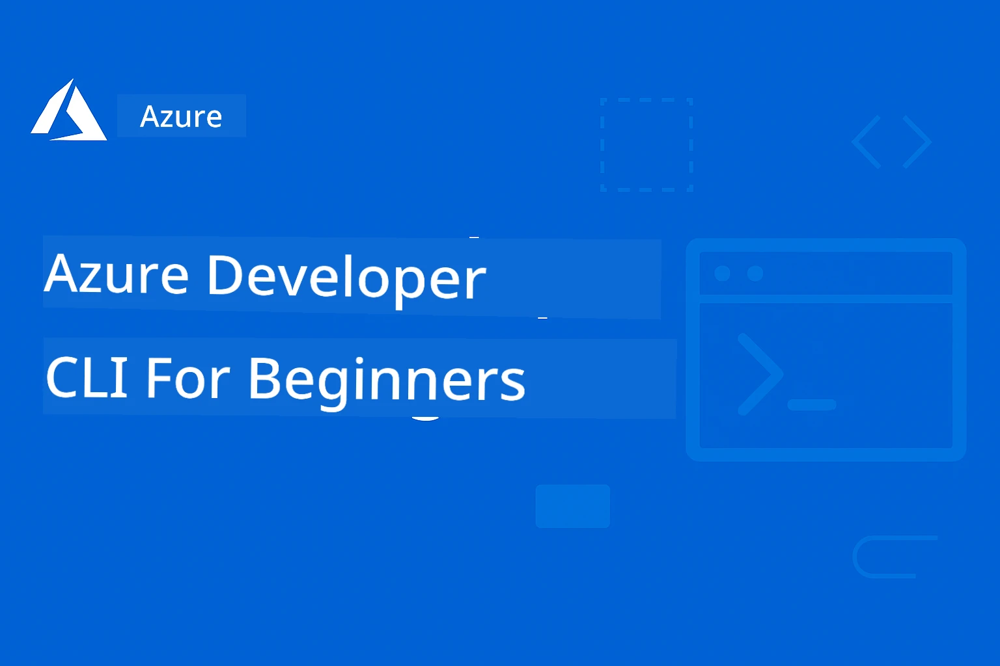

# AZD For Beginners: A Structured Learning Journey

 

[](https://GitHub.com/microsoft/azd-for-beginners/watchers/)
[](https://GitHub.com/microsoft/azd-for-beginners/network/)
[](https://GitHub.com/microsoft/azd-for-beginners/stargazers/)

[](https://discord.com/invite/nkVh3dp)
[](https://discord.gg/nTYy5BXMWG)

---

### Automated Translations (Always Up-to-Date)

<!-- CO-OP TRANSLATOR LANGUAGES TABLE START -->
[Arabic](../ar/README.md) | [Bengali](../bn/README.md) | [Bulgarian](../bg/README.md) | [Burmese (Myanmar)](../my/README.md) | [Chinese (Simplified)](../zh-CN/README.md) | [Chinese (Traditional, Hong Kong)](../zh-HK/README.md) | [Chinese (Traditional, Macau)](../zh-MO/README.md) | [Chinese (Traditional, Taiwan)](../zh-TW/README.md) | [Croatian](../hr/README.md) | [Czech](../cs/README.md) | [Danish](../da/README.md) | [Dutch](../nl/README.md) | [Estonian](../et/README.md) | [Finnish](../fi/README.md) | [French](../fr/README.md) | [German](../de/README.md) | [Greek](../el/README.md) | [Hebrew](../he/README.md) | [Hindi](../hi/README.md) | [Hungarian](../hu/README.md) | [Indonesian](../id/README.md) | [Italian](../it/README.md) | [Japanese](../ja/README.md) | [Kannada](../kn/README.md) | [Khmer](../km/README.md) | [Korean](../ko/README.md) | [Lithuanian](../lt/README.md) | [Malay](../ms/README.md) | [Malayalam](../ml/README.md) | [Marathi](../mr/README.md) | [Nepali](../ne/README.md) | [Nigerian Pidgin](./README.md) | [Norwegian](../no/README.md) | [Persian (Farsi)](../fa/README.md) | [Polish](../pl/README.md) | [Portuguese (Brazil)](../pt-BR/README.md) | [Portuguese (Portugal)](../pt-PT/README.md) | [Punjabi (Gurmukhi)](../pa/README.md) | [Romanian](../ro/README.md) | [Russian](../ru/README.md) | [Serbian (Cyrillic)](../sr/README.md) | [Slovak](../sk/README.md) | [Slovenian](../sl/README.md) | [Spanish](../es/README.md) | [Swahili](../sw/README.md) | [Swedish](../sv/README.md) | [Tagalog (Filipino)](../tl/README.md) | [Tamil](../ta/README.md) | [Telugu](../te/README.md) | [Thai](../th/README.md) | [Turkish](../tr/README.md) | [Ukrainian](../uk/README.md) | [Urdu](../ur/README.md) | [Vietnamese](../vi/README.md)

> **Prefer to Clone Locally?**
>
> Dis repo get pass 50 language translations wey dey make di download big. If you wan clone without di translations, use sparse checkout:
>
> **Bash / macOS / Linux:**
> ```bash
> git clone --filter=blob:none --sparse https://github.com/microsoft/AZD-for-beginners.git
> cd AZD-for-beginners
> git sparse-checkout set --no-cone '/*' '!translations' '!translated_images'
> ```
>
> **CMD (Windows):**
> ```cmd
> git clone --filter=blob:none --sparse https://github.com/microsoft/AZD-for-beginners.git
> cd AZD-for-beginners
> git sparse-checkout set --no-cone "/*" "!translations" "!translated_images"
> ```
>
> Dis go give you wetin you need to finish di course plus faster download.
<!-- CO-OP TRANSLATOR LANGUAGES TABLE END -->

## 🆕 Wetin New for azd Today

Azure Developer CLI don grow pass just normal web apps and APIs. Today, azd na di single tool wey fit deploy any application to Azure — including AI-powered applications and intelligent agents.

Wetin dis mean for you:

- **AI agents don turn first-class azd workloads.** You fit initialize, deploy, and manage AI agent projects using the same `azd init` → `azd up` workflow wey you don sabi.
- **Microsoft Foundry integration** don bring model deployment, agent hosting, and AI service configuration straight into di azd template ecosystem.
- **Di core workflow never change.** Whether you dey deploy todo app, microservice, or multi-agent AI solution, di commands still be di same.

If you don use azd before, AI support na natural extension — no be separate tool or one advanced track. If you dey start fresh, you go learn one workflow wey dey work for everything.

---

## 🚀 Wetin be Azure Developer CLI (azd)?

**Azure Developer CLI (azd)** na developer-friendly command-line tool wey dey make am easy to deploy applications to Azure. Instead of you dey manually create and connect plenti Azure resources, you fit deploy complete applications with just one command.

### Di Magic of `azd up`

```bash
# Dis one command dey do everytin:
# ✅ E go create all Azure resources
# ✅ E go arrange networking and security
# ✅ E go build your application code
# ✅ E go deploy am to Azure
# ✅ E go give you beta working URL
azd up
```

**Na so e be!** No need click for Azure Portal, no complex ARM templates to learn first, no manual configuration — just working applications for Azure.

---

## ❓ Azure Developer CLI vs Azure CLI: Wetin Different?

Na di question wey beginners dey ask pass. See di simple answer:

| Feature | **Azure CLI (`az`)** | **Azure Developer CLI (`azd`)** |
|---------|---------------------|--------------------------------|
| **Purpose** | Manage individual Azure resources | Deploy complete applications |
| **Mindset** | Infrastructure-focused | Application-focused |
| **Example** | `az webapp create --name myapp...` | `azd up` |
| **Learning Curve** | Must know Azure services | Just know your app |
| **Best For** | DevOps, Infrastructure | Developers, Prototyping |

### Simple Analogy

- **Azure CLI** na like get all di tools to build house - hammers, saws, nails. You fit build anything, but you gots sabi construction.
- **Azure Developer CLI** na like hire contractor - you talk wetin you want, dem go handle di building.

### When to Use Each

| Scenario | Use This |
|----------|----------|
| "I want to deploy my web app quickly" | `azd up` |
| "I need to create just a storage account" | `az storage account create` |
| "I'm building a full AI application" | `azd init --template azure-search-openai-demo` |
| "I need to debug a specific Azure resource" | `az resource show` |
| "I want production-ready deployment in minutes" | `azd up --environment production` |

### Dem Dey Work Together!

AZD dey use Azure CLI under di hood. You fit use both:
```bash
# Deploy your app wit AZD
azd up

# Den adjust specific resources wit Azure CLI
az webapp config set --name myapp --always-on true
```

---

## 🌟 Find Templates in Awesome AZD

No start from scratch! **Awesome AZD** na community collection of ready-to-deploy templates:

| Resource | Description |
|----------|-------------|
| 🔗 [**Awesome AZD Gallery**](https://azure.github.io/awesome-azd/) | Browse 200+ templates with one-click deploy |
| 🔗 [**Submit a Template**](https://github.com/Azure/awesome-azd/issues) | Contribute your own template to the community |
| 🔗 [**GitHub Repository**](https://github.com/Azure/awesome-azd) | Star and explore the source |

### Popular AI Templates from Awesome AZD

```bash
# RAG Chát wit Microsoft Foundry Models + AI Search
azd init --template azure-search-openai-demo

# Quick AI Chát Applikeshn
azd init --template openai-chat-app-quickstart

# AI Agents wit Foundry Agents
azd init --template get-started-with-ai-agents
```

---

## 🎯 How to Start: 3 Steps

Before you start, make sure your machine ready for the template you wan deploy:

**Windows:**
```powershell
.\validate-setup.ps1
```

**macOS / Linux:**
```bash
bash ./validate-setup.sh
```

If any required check fail, fix am first before you continue with the quick start.

### Step 1: Install AZD (2 minutes)

**Windows:**
```powershell
winget install microsoft.azd
```

**macOS:**
```bash
brew tap azure/azd && brew install azd
```

**Linux:**
```bash
curl -fsSL https://aka.ms/install-azd.sh | bash
```

### Step 2: Authenticate for AZD

```bash
# Na Optional if you wan use Azure CLI commands direct for dis course
az login

# E dey required for AZD workflows
azd auth login
```

If you no sure which one you need, follow the full setup flow for [Installation & Setup](docs/chapter-01-foundation/installation.md#authentication-setup).

### Step 3: Deploy Your First App

```bash
# Start from one template
azd init --template todo-nodejs-mongo

# Put for Azure (e go create everytin!)
azd up
```

**🎉 Na so!** Your app don dey live for Azure.

### Clean Up (No Forget!)

```bash
# Remove all resources when done experimenting
azd down --force --purge
```

---

## 📚 How to Use This Course

Dis course design for **progressive learning** — start where you comfortable and dey work your way up:

| Your Experience | Start Here |
|-----------------|------------|
| **Brand new to Azure** | [Chapter 1: Foundation](#-chapter-1-foundation--quick-start) |
| **Know Azure, new to AZD** | [Chapter 1: Foundation](#-chapter-1-foundation--quick-start) |
| **Want to deploy AI apps** | [Chapter 2: AI-First Development](#-chapter-2-ai-first-development-recommended-for-ai-developers) |
| **Want hands-on practice** | [🎓 Interactive Workshop](workshop/README.md) - 3-4 hour guided lab |
| **Need production patterns** | [Chapter 8: Production & Enterprise](#-chapter-8-production--enterprise-patterns) |

### Quick Setup

1. **Fork This Repository**: [](https://GitHub.com/microsoft/azd-for-beginners/fork)
2. **Clone It**: `git clone https://github.com/YOUR-USERNAME/azd-for-beginners.git`
3. **Get Help**: [Azure Discord Community](https://discord.com/invite/ByRwuEEgH4)

> **Prefer to Clone Locally?**

> Dis repo get pass 50 language translations wey dey make di download big. If you wan clone without di translations, use sparse checkout:
> ```bash
> git clone --filter=blob:none --sparse https://github.com/microsoft/AZD-for-beginners.git
> cd AZD-for-beginners
> git sparse-checkout set --no-cone '/*' '!translations' '!translated_images'
> ```
> Dis go give you wetin you need to finish di course plus faster download.


## Course Overview

Master Azure Developer CLI (azd) through structured chapters wey dem design for progressive learning. **Special focus on AI application deployment with Microsoft Foundry integration.**

### Why Dis Course Dey Important for Modern Developers

Based on Microsoft Foundry Discord community insights, **45% of developers wan use AZD for AI workloads** but dem dey face challenges like:
- Complex multi-service AI architectures
- Production AI deployment best practices  
- Azure AI service integration and configuration
- Cost optimization for AI workloads
- Troubleshooting AI-specific deployment issues

### Learning Objectives

By finishing dis structured course, you go:
- **Master AZD Fundamentals**: Core concepts, installation, and configuration
- **Deploy AI Applications**: Use AZD with Microsoft Foundry services
- **Implement Infrastructure as Code**: Manage Azure resources with Bicep templates
- **Troubleshoot Deployments**: Resolve common issues and debug problems
- **Optimize for Production**: Security, scaling, monitoring, and cost management
- **Build Multi-Agent Solutions**: Deploy complex AI architectures

## Before You Start: Accounts, Access, and Assumptions

Before you begin Chapter 1, make sure say you get di following things in place. Di installation steps wey dey later for dis guide dey assume say these basics don already handle.
- **Wan Azure subscription**: You fit use one wey don dey for work or your own account, or create a [free trial](https://aka.ms/azurefreetrial) to start.
- **Permission to create Azure resources**: For most exercises, make sure sey you get at least **Contributor** access for the subscription or resource group wey you dey target. Some chapters fit also assume say you fit create resource groups, managed identities, and RBAC assignments.
- [**Wan GitHub account**](https://github.com): Dis go help you to fork the repository, track your own changes, and use GitHub Codespaces for the workshop.
- **Template runtime prerequisites**: Some templates need local tools like Node.js, Python, Java, or Docker. Run the setup validator before you start so you go fit catch missing tools early.
- **Basic terminal familiarity**: You no need be expert, but you suppose sabi run commands like `git clone`, `azd auth login`, and `azd up`.

> **You dey work for enterprise subscription?**
> If administrator dey manage your Azure environment, make you confirm beforehand sey you fit deploy resources for the subscription or resource group wey you wan use. If no, ask for sandbox subscription or **Contributor** access before you start.

> **New to Azure?**
> Start with your own Azure trial or pay-as-you-go subscription at https://aka.ms/azurefreetrial so you go fit finish the exercises end-to-end without waiting for tenant-level approvals.

## 🗺️ Course Map: Quick Navigation by Chapter

Each chapter get im own README wey get learning objectives, quick starts, and exercises:

| Chapter | Topic | Lessons | Duration | Complexity |
|---------|-------|---------|----------|------------|
| **[Ch 1: Foundation](docs/chapter-01-foundation/README.md)** | Getting Started | [AZD Basics](docs/chapter-01-foundation/azd-basics.md) &#124; [Installation](docs/chapter-01-foundation/installation.md) &#124; [First Project](docs/chapter-01-foundation/first-project.md) | 30-45 min | ⭐ |
| **[Ch 2: AI Development](docs/chapter-02-ai-development/README.md)** | AI-First Apps | [Foundry Integration](docs/chapter-02-ai-development/microsoft-foundry-integration.md) &#124; [AI Agents](docs/chapter-02-ai-development/agents.md) &#124; [Model Deployment](docs/chapter-02-ai-development/ai-model-deployment.md) &#124; [Workshop](docs/chapter-02-ai-development/ai-workshop-lab.md) | 1-2 hrs | ⭐⭐ |
| **[Ch 3: Configuration](docs/chapter-03-configuration/README.md)** | Auth & Security | [Configuration](docs/chapter-03-configuration/configuration.md) &#124; [Auth & Security](docs/chapter-03-configuration/authsecurity.md) | 45-60 min | ⭐⭐ |
| **[Ch 4: Infrastructure](docs/chapter-04-infrastructure/README.md)** | IaC & Deployment | [Deployment Guide](docs/chapter-04-infrastructure/deployment-guide.md) &#124; [Provisioning](docs/chapter-04-infrastructure/provisioning.md) | 1-1.5 hrs | ⭐⭐⭐ |
| **[Ch 5: Multi-Agent](docs/chapter-05-multi-agent/README.md)** | AI Agent Solutions | [Retail Scenario](examples/retail-scenario.md) &#124; [Coordination Patterns](docs/chapter-06-pre-deployment/coordination-patterns.md) | 2-3 hrs | ⭐⭐⭐⭐ |
| **[Ch 6: Pre-Deployment](docs/chapter-06-pre-deployment/README.md)** | Planning & Validation | [Preflight Checks](docs/chapter-06-pre-deployment/preflight-checks.md) &#124; [Capacity Planning](docs/chapter-06-pre-deployment/capacity-planning.md) &#124; [SKU Selection](docs/chapter-06-pre-deployment/sku-selection.md) &#124; [App Insights](docs/chapter-06-pre-deployment/application-insights.md) | 1 hr | ⭐⭐ |
| **[Ch 7: Troubleshooting](docs/chapter-07-troubleshooting/README.md)** | Debug & Fix | [Common Issues](docs/chapter-07-troubleshooting/common-issues.md) &#124; [Debugging](docs/chapter-07-troubleshooting/debugging.md) &#124; [AI Issues](docs/chapter-07-troubleshooting/ai-troubleshooting.md) | 1-1.5 hrs | ⭐⭐ |
| **[Ch 8: Production](docs/chapter-08-production/README.md)** | Enterprise Patterns | [Production Practices](docs/chapter-08-production/production-ai-practices.md) | 2-3 hrs | ⭐⭐⭐⭐ |
| **[🎓 Workshop](workshop/README.md)** | Hands-On Lab | [Introduction](workshop/docs/instructions/0-Introduction.md) &#124; [Selection](workshop/docs/instructions/1-Select-AI-Template.md) &#124; [Validation](workshop/docs/instructions/2-Validate-AI-Template.md) &#124; [Deconstruction](workshop/docs/instructions/3-Deconstruct-AI-Template.md) &#124; [Configuration](workshop/docs/instructions/4-Configure-AI-Template.md) &#124; [Customization](workshop/docs/instructions/5-Customize-AI-Template.md) &#124; [Teardown](workshop/docs/instructions/6-Teardown-Infrastructure.md) &#124; [Wrap-up](workshop/docs/instructions/7-Wrap-up.md) | 3-4 hrs | ⭐⭐ |

**Total Course Duration:** ~10-14 hours | **Skill Progression:** Beginner → Production-Ready

---

## 📚 Learning Chapters

*Choose your learning path based on your experience level and goals*

### 🚀 Chapter 1: Foundation & Quick Start
**Prerequisites**: Wan Azure subscription, basic command line knowledge  
**Duration**: 30-45 minutes  
**Complexity**: ⭐

#### Wetin You Go Learn
- Understand Azure Developer CLI basics
- How to install AZD for your platform
- How to make your first successful deployment

#### Learning Resources
- **🎯 Start Here**: [What is Azure Developer CLI?](#what-is-azure-developer-cli)
- **📖 Theory**: [AZD Basics](docs/chapter-01-foundation/azd-basics.md) - Core concepts and terminology
- **⚙️ Setup**: [Installation & Setup](docs/chapter-01-foundation/installation.md) - Platform-specific guides
- **🛠️ Hands-On**: [Your First Project](docs/chapter-01-foundation/first-project.md) - Step-by-step tutorial
- **📋 Quick Reference**: [Command Cheat Sheet](resources/cheat-sheet.md)

#### Practical Exercises
```bash
# Quick check make sure say installation dey okay
azd version

# Deploy your first app
azd init --template todo-nodejs-mongo
azd up
```

**💡 Chapter Outcome**: You go fit deploy small web application to Azure using AZD

**✅ Success Validation:**
```bash
# After you don finish Chapter 1, you go fit:
azd version              # Dey show di installed version
azd init --template todo-nodejs-mongo  # Dey initialize di project
azd up                  # Dey deploy go Azure
azd show                # Dey show di running app URL
# Di application go open for browser and e go work
azd down --force --purge  # Dey clean up resources
```

**📊 Time Investment:** 30-45 minutes  
**📈 Skill Level After:** Fit deploy basic applications by yourself
**📈 Skill Level After:** Fit deploy basic applications by yourself

---

### 🤖 Chapter 2: AI-First Development (Recommended for AI Developers)
**Prerequisites**: Finish Chapter 1  
**Duration**: 1-2 hours  
**Complexity**: ⭐⭐

#### Wetin You Go Learn
- Microsoft Foundry integration with AZD
- How to deploy AI-powered applications
- Understand AI service configurations

#### Learning Resources
- **🎯 Start Here**: [Microsoft Foundry Integration](docs/chapter-02-ai-development/microsoft-foundry-integration.md)
- **🤖 AI Agents**: [AI Agents Guide](docs/chapter-02-ai-development/agents.md) - How to deploy intelligent agents with AZD
- **📖 Patterns**: [AI Model Deployment](docs/chapter-02-ai-development/ai-model-deployment.md) - How to deploy and manage AI models
- **🛠️ Workshop**: [AI Workshop Lab](docs/chapter-02-ai-development/ai-workshop-lab.md) - Make your AI solutions AZD-ready
- **🎥 Interactive Guide**: [Workshop Materials](workshop/README.md) - Browser-based learning with MkDocs * DevContainer Environment
- **📋 Templates**: [Microsoft Foundry Templates](#workshop-resources)
- **📝 Examples**: [AZD Deployment Examples](examples/README.md)

#### Practical Exercises
```bash
# Put your first AI app live
azd init --template azure-search-openai-demo
azd up

# Try more AI templates
azd init --template openai-chat-app-quickstart
azd init --template agent-openai-python-prompty
```

**💡 Chapter Outcome**: Deploy and configure AI-powered chat app with RAG capabilities

**✅ Success Validation:**
```bash
# After Chapter 2, you go fit:
azd init --template azure-search-openai-demo
azd up
# Try the AI chat interface
# Ask question dem, then AI go give you answer wey get source
# Confirm say search integration dey work
azd monitor  # Check say Application Insights dey show telemetry
azd down --force --purge
```

**📊 Time Investment:** 1-2 hours  
**📈 Skill Level After:** Fit deploy and configure production-ready AI applications  
**💰 Cost Awareness:** Know say dev costs fit be $80-150/month, production costs fit be $300-3500/month

#### 💰 Cost Considerations for AI Deployments

**Development Environment (Estimated $80-150/month):**
- Microsoft Foundry Models (Pay-as-you-go): $0-50/month (based on token usage)
- AI Search (Basic tier): $75/month
- Container Apps (Consumption): $0-20/month
- Storage (Standard): $1-5/month

**Production Environment (Estimated $300-3,500+/month):**
- Microsoft Foundry Models (PTU for consistent performance): $3,000+/month OR Pay-as-go with high volume
- AI Search (Standard tier): $250/month
- Container Apps (Dedicated): $50-100/month
- Application Insights: $5-50/month
- Storage (Premium): $10-50/month

**💡 Cost Optimization Tips:**
- Use **Free Tier** Microsoft Foundry Models for learning (Azure OpenAI 50,000 tokens/month included)
- Run `azd down` to deallocate resources when you no dey actively develop
- Start with consumption-based billing, upgrade to PTU only for production
- Use `azd provision --preview` to estimate costs before deployment
- Enable auto-scaling: pay only for wetin you use

**Cost Monitoring:**
```bash
# Check di estimated cost wey go dey every month
azd provision --preview

# Dey monitor di real costs inside Azure Portal
az consumption budget list --resource-group <your-rg>
```

---

### ⚙️ Chapter 3: Configuration & Authentication
**Prerequisites**: Chapter 1 completed  
**Duration**: 45-60 minutes  
**Complexity**: ⭐⭐

#### Wetin You Go Learn
- How to manage environment configuration
- Authentication and security best practices
- Resource naming and organization

#### Learning Resources
- **📖 Configuration**: [Configuration Guide](docs/chapter-03-configuration/configuration.md) - Environment setup
- **🔐 Security**: [Authentication patterns and managed identity](docs/chapter-03-configuration/authsecurity.md) - Authentication patterns
- **📝 Examples**: [Database App Example](examples/database-app/README.md) - AZD Database Examples

#### Practical Exercises
- Configure multiple environments (dev, staging, prod)
- Set up managed identity authentication
- Implement environment-specific configurations

**💡 Chapter Outcome**: Manage multiple environments with correct authentication and security

---

### 🏗️ Chapter 4: Infrastructure as Code & Deployment
**Prerequisites**: Chapters 1-3 completed  
**Duration**: 1-1.5 hours  
**Complexity**: ⭐⭐⭐

#### Wetin You Go Learn
- Advanced deployment patterns
- Infrastructure as Code with Bicep
- Resource provisioning strategies

#### Learning Resources
- **📖 Deployment**: [Deployment Guide](docs/chapter-04-infrastructure/deployment-guide.md) - Complete workflows
- **🏗️ Provisioning**: [Provisioning Resources](docs/chapter-04-infrastructure/provisioning.md) - Azure resource management
- **📝 Examples**: [Container App Example](../../examples/container-app) - Containerized deployments

#### Practical Exercises
- Create custom Bicep templates
- Deploy multi-service applications
- Implement blue-green deployment strategies

**💡 Chapter Outcome**: Deploy complex multi-service applications using custom infrastructure templates

---

### 🎯 Chapter 5: Multi-Agent AI Solutions (Advanced)
**Prerequisites**: Chapters 1-2 completed  
**Duration**: 2-3 hours  
**Complexity**: ⭐⭐⭐⭐

#### Wetin You Go Learn
- Multi-agent architecture patterns
- Agent orchestration and coordination
- Production-ready AI deployments

#### Learning Resources
- **🤖 Featured Project**: [Retail Multi-Agent Solution](examples/retail-scenario.md) - Complete implementation
- **🛠️ ARM Templates**: [ARM Template Package](../../examples/retail-multiagent-arm-template) - One-click deployment
- **📖 Architecture**: [Multi-agent coordination patterns](docs/chapter-06-pre-deployment/coordination-patterns.md) - Patterns

#### Practical Exercises
```bash
# Deploy di full retail solution wey get many agents
cd examples/retail-multiagent-arm-template
./deploy.sh

# Check di agent configurations
az deployment group show --resource-group <rg-name> --name <deployment-name>
```

**💡 Chapter Outcome**: Deploy and manage production-ready multi-agent AI solution with Customer and Inventory agents

---

### 🔍 Chapter 6: Pre-Deployment Validation & Planning
**Prerequisites**: Chapter 4 completed  
**Duration**: 1 hour  
**Complexity**: ⭐⭐
#### Wetin You Go Learn
- Plan capacity and check resources
- Ways to choose SKU dem
- Checks wey you go run before deployment and automation

#### Resources wey You Go Use
- **📊 Planning**: [Capacity Planning](docs/chapter-06-pre-deployment/capacity-planning.md) - Check resources
- **💰 Selection**: [SKU Selection](docs/chapter-06-pre-deployment/sku-selection.md) - Choices wey cost-effective
- **✅ Validation**: [Pre-flight Checks](docs/chapter-06-pre-deployment/preflight-checks.md) - Automated scripts

#### Practical Exercises
- Run capacity validation scripts
- Optimize SKU selections for cost
- Implement automated pre-deployment checks

**💡 Chapter Outcome**: Check and make deployments better before you run dem

---

### 🚨 Chapter 7: Troubleshooting & Debugging
**Prerequisites**: Any deployment chapter completed  
**Duration**: 1-1.5 hours  
**Complexity**: ⭐⭐

#### Wetin You Go Learn
- Step-by-step debugging approaches
- Common problems and how to solve dem
- Troubleshooting wey concern AI

#### Resources wey You Go Use
- **🔧 Common Problems**: [Common Issues](docs/chapter-07-troubleshooting/common-issues.md) - FAQ and solutions
- **🕵️ Debugging**: [Debugging Guide](docs/chapter-07-troubleshooting/debugging.md) - Step-by-step strategies
- **🤖 AI Problems**: [AI-Specific Troubleshooting](docs/chapter-07-troubleshooting/ai-troubleshooting.md) - AI service problems

#### Practical Exercises
- Diagnose deployment failures
- Resolve authentication issues
- Debug AI service connectivity

**💡 Chapter Outcome**: Fit diagnose and fix common deployment issues by yourself

---

### 🏢 Chapter 8: Production & Enterprise Patterns
**Prerequisites**: Chapters 1-4 completed  
**Duration**: 2-3 hours  
**Complexity**: ⭐⭐⭐⭐

#### Wetin You Go Learn
- Strategies for production deployment
- Enterprise-level security patterns
- Monitoring and cost-saving optimization

#### Resources wey You Go Use
- **🏭 Production**: [Production AI Best Practices](docs/chapter-08-production/production-ai-practices.md) - Enterprise patterns
- **📝 Examples**: [Microservices Example](../../examples/microservices) - Complex architectures
- **📊 Monitoring**: [Application Insights integration](docs/chapter-06-pre-deployment/application-insights.md) - Monitoring

#### Practical Exercises
- Implement enterprise security patterns
- Set up comprehensive monitoring
- Deploy to production with proper governance

**💡 Chapter Outcome**: Deploy apps wey ready for enterprise with full production capabilities

---

## 🎓 Workshop Overview: Hands-On Learning Experience

> **⚠️ WORKSHOP STATUS: Active Development**  
> The workshop materials dem still dey under development and refinement. Core modules dey work, but some advanced sections never finish. We dey actively work to finish everything. [See progress →](workshop/README.md)

### Interactive Workshop Materials
**Complete hands-on learning with browser-based tools and guided exercises**

Our workshop materials dey provide structured, interactive learning wey go complement di chapter-based curriculum wey dey top. Di workshop design fit for self-paced learning or instructor-led sessions.

#### 🛠️ Workshop Features
- **Browser-Based Interface**: Complete MkDocs-powered workshop wey get search, copy, and theme features
- **GitHub Codespaces Integration**: One-click setup for development environment
- **Structured Learning Path**: 8-module guided exercises (3-4 hours total)
- **Progressive Methodology**: Introduction → Selection → Validation → Deconstruction → Configuration → Customization → Teardown → Wrap-up
- **Interactive DevContainer Environment**: Pre-configured tools and dependencies

#### 📚 Workshop Module Structure
Di workshop follow an **8-module progressive methodology** wey go carry you from discovery reach deployment mastery:

| Module | Topic | Wetin You Go Do | Duration |
|--------|-------|-----------------|----------|
| **0. Introduction** | Workshop Overview | Understand learning objectives, prerequisites, and workshop structure | 15 min |
| **1. Selection** | Template Discovery | Explore AZD templates and select the right AI template for your scenario | 20 min |
| **2. Validation** | Deploy & Verify | Deploy the template with `azd up` and validate infrastructure works | 30 min |
| **3. Deconstruction** | Understand Structure | Use GitHub Copilot to explore template architecture, Bicep files, and code organization | 30 min |
| **4. Configuration** | azure.yaml Deep Dive | Master `azure.yaml` configuration, lifecycle hooks, and environment variables | 30 min |
| **5. Customization** | Make It Yours | Enable AI Search, tracing, evaluation, and customize for your scenario | 45 min |
| **6. Teardown** | Clean Up | Safely deprovision resources with `azd down --purge` | 15 min |
| **7. Wrap-up** | Next Steps | Review accomplishments, key concepts, and continue your learning journey | 15 min |

**Workshop Flow:**
```
Introduction → Selection → Validation → Deconstruction → Configuration → Customization → Teardown → Wrap-up
     ↓            ↓           ↓              ↓               ↓              ↓            ↓           ↓
  Overview    Find the     Deploy &      Explore        Master         Customize     Clean up    Review &
             right        verify        code &        azure.yaml      for your      resources   next steps
             template                   structure                     scenario
```

#### 🚀 How to Start the Workshop
```bash
# Option 1: GitHub Codespaces (We dey recommend am)
# Click "Code" → "Create codespace on main" for di repository

# Option 2: Local Development (Work for your komputa)
git clone https://github.com/microsoft/azd-for-beginners.git
cd azd-for-beginners/workshop
# Follow di setup instructions wey dey for workshop/README.md
```

#### 🎯 Wetin You Go Gain from the Workshop
By finishing the workshop, participants go:
- **Deploy Production AI Applications**: Use AZD with Microsoft Foundry services
- **Master Multi-Agent Architectures**: Implement coordinated AI agent solutions
- **Implement Security Best Practices**: Configure authentication and access control
- **Optimize for Scale**: Design cost-effective, performant deployments
- **Troubleshoot Deployments**: Resolve common issues independently

#### 📖 Workshop Resources
- **🎥 Interactive Guide**: [Workshop Materials](workshop/README.md) - Browser-based learning environment
- **📋 Module-by-Module Instructions**:
  - [0. Introduction](workshop/docs/instructions/0-Introduction.md) - Workshop overview and objectives
  - [1. Selection](workshop/docs/instructions/1-Select-AI-Template.md) - Find and select AI templates
  - [2. Validation](workshop/docs/instructions/2-Validate-AI-Template.md) - Deploy and verify templates
  - [3. Deconstruction](workshop/docs/instructions/3-Deconstruct-AI-Template.md) - Explore template architecture
  - [4. Configuration](workshop/docs/instructions/4-Configure-AI-Template.md) - Master azure.yaml
  - [5. Customization](workshop/docs/instructions/5-Customize-AI-Template.md) - Customize for your scenario
  - [6. Teardown](workshop/docs/instructions/6-Teardown-Infrastructure.md) - Clean up resources
  - [7. Wrap-up](workshop/docs/instructions/7-Wrap-up.md) - Review and next steps
- **🛠️ AI Workshop Lab**: [AI Workshop Lab](docs/chapter-02-ai-development/ai-workshop-lab.md) - Exercises wey focus on AI
- **💡 Quick Start**: [Workshop Setup Guide](workshop/README.md#quick-start) - Environment configuration

**Perfect for**: Corporate training, university courses, self-paced learning, and developer bootcamps.

---

## 📖 Deep Dive: AZD Capabilities

Pass di basics, AZD get powerful features for production deployments:

- **Template-based deployments** - Use pre-built templates for common application patterns
- **Infrastructure as Code** - Manage Azure resources using Bicep or Terraform  
- **Integrated workflows** - Seamlessly provision, deploy, and monitor applications
- **Developer-friendly** - Optimized for developer productivity and experience

### **AZD + Microsoft Foundry: Perfect for AI Deployments**

**Why AZD for AI Solutions?** AZD tackle di main challenges wey AI developers dey face:

- **AI-Ready Templates** - Pre-configured templates for Microsoft Foundry Models, Cognitive Services, and ML workloads
- **Secure AI Deployments** - Built-in security patterns for AI services, API keys, and model endpoints  
- **Production AI Patterns** - Best practices for scalable, cost-effective AI application deployments
- **End-to-End AI Workflows** - From model development to production deployment with proper monitoring
- **Cost Optimization** - Smart resource allocation and scaling strategies for AI workloads
- **Microsoft Foundry Integration** - Seamless connection to Microsoft Foundry model catalog and endpoints

---

## 🎯 Templates & Examples Library

### Featured: Microsoft Foundry Templates
**Start here if you dey deploy AI applications!**

> **Note:** These templates dey show different AI patterns. Some be external Azure Samples, others na local implementations.

| Template | Chapter | Complexity | Services | Type |
|----------|---------|------------|----------|------|
| [**Get started with AI chat**](https://github.com/Azure-Samples/get-started-with-ai-chat) | Chapter 2 | ⭐⭐ | AzureOpenAI + Azure AI Model Inference API + Azure AI Search + Azure Container Apps + Application Insights | External |
| [**Get started with AI agents**](https://github.com/Azure-Samples/get-started-with-ai-agents) | Chapter 2 | ⭐⭐ | Foundry Agents + AzureOpenAI + Azure AI Search + Azure Container Apps + Application Insights| External |
| [**Azure Search + OpenAI Demo**](https://github.com/Azure-Samples/azure-search-openai-demo) | Chapter 2 | ⭐⭐ | AzureOpenAI + Azure AI Search + App Service + Storage | External |
| [**OpenAI Chat App Quickstart**](https://github.com/Azure-Samples/openai-chat-app-quickstart) | Chapter 2 | ⭐ | AzureOpenAI + Container Apps + Application Insights | External |
| [**Agent OpenAI Python Prompty**](https://github.com/Azure-Samples/agent-openai-python-prompty) | Chapter 5 | ⭐⭐⭐ | AzureOpenAI + Azure Functions + Prompty | External |
| [**Contoso Chat RAG**](https://github.com/Azure-Samples/contoso-chat) | Chapter 8 | ⭐⭐⭐⭐ | AzureOpenAI + AI Search + Cosmos DB + Container Apps | External |
| [**Retail Multi-Agent Solution**](examples/retail-scenario.md) | Chapter 5 | ⭐⭐⭐⭐ | AzureOpenAI + AI Search + Storage + Container Apps + Cosmos DB | **Local** |

### Featured: Complete Learning Scenarios
**Production-ready application templates wey map to learning chapters**

| Template | Learning Chapter | Complexity | Key Learning |
|----------|------------------|------------|--------------|
| [**openai-chat-app-quickstart**](https://github.com/Azure-Samples/openai-chat-app-quickstart) | Chapter 2 | ⭐ | Basic AI deployment patterns |
| [**azure-search-openai-demo**](https://github.com/Azure-Samples/azure-search-openai-demo) | Chapter 2 | ⭐⭐ | RAG implementation with Azure AI Search |
| [**ai-document-processing**](https://github.com/Azure-Samples/ai-document-processing) | Chapter 4 | ⭐⭐ | Document Intelligence integration |
| [**agent-openai-python-prompty**](https://github.com/Azure-Samples/agent-openai-python-prompty) | Chapter 5 | ⭐⭐⭐ | Agent framework and function calling |
| [**contoso-chat**](https://github.com/Azure-Samples/contoso-chat) | Chapter 8 | ⭐⭐⭐ | Enterprise AI orchestration |
| [**retail-multi-agent-solution**](examples/retail-scenario.md) | Chapter 5 | ⭐⭐⭐⭐ | Multi-agent architecture with Customer and Inventory agents |

### How You Go Learn by Example

> **📌 Local vs. External Examples:**  
> **Local Examples** (inside this repo) = Ready to use immediately  
> **External Examples** (Azure Samples) = Clone from linked repositories

#### Local Examples (Ready to Use)
- [**Retail Multi-Agent Solution**](examples/retail-scenario.md) - Complete production-ready implementation with ARM templates
  - Multi-agent architecture (Customer + Inventory agents)
  - Comprehensive monitoring and evaluation
  - One-click deployment via ARM template

#### Local Examples - Container Applications (Chapters 2-5)
**Complete container deployment examples for this repository:**
- [**Container App Examples**](examples/container-app/README.md) - Complete guide to containerized deployments
  - [Simple Flask API](../../examples/container-app/simple-flask-api) - Basic REST API with scale-to-zero
  - [Microservices Architecture](../../examples/container-app/microservices) - Production-ready multi-service deployment
  - Quick Start, Production, and Advanced deployment patterns
  - Monitoring, security, and cost optimization guidance

#### External Examples - Simple Applications (Chapters 1-2)
**Clone these Azure Samples repositories to start:**
- [Simple Web App - Node.js + MongoDB](https://github.com/Azure-Samples/todo-nodejs-mongo) - Basic deployment patterns
- [Static Website - React SPA](https://github.com/Azure-Samples/todo-csharp-sql-swa-func) - Static content deployment
- [Container App - Python Flask](https://github.com/Azure-Samples/container-apps-store-api-microservice) - REST API deployment

#### External Examples - Database Integration (Chapter 3-4)
- [Database App - C# + SQL](https://github.com/Azure-Samples/todo-csharp-sql) - Patterns wey dem dey use to connect database
- [Functions + Cosmos DB](https://github.com/Azure-Samples/todo-python-mongo-swa-func) - Data workflow wey no need server

#### External Examples - Advanced Patterns (Chapters 4-8)
- [Java Microservices](https://github.com/Azure-Samples/java-microservices-aca-lab) - Architectures wey get many services
- [Container Apps Jobs](https://github.com/Azure-Samples/container-apps-jobs) - Processing wey dey run for background  
- [Enterprise ML Pipeline](https://github.com/Azure-Samples/mlops-v2) - ML patterns wey ready for production

### External Template Collections
- [**Official AZD Template Gallery**](https://azure.github.io/awesome-azd/) - Collection wey dem choose well of official and community templates
- [**Azure Developer CLI Templates**](https://learn.microsoft.com/en-us/azure/developer/azure-developer-cli/azd-templates) - Microsoft Learn documentation for templates
- [**Examples Directory**](examples/README.md) - Local learning examples wey get detailed explanations

---

## 📚 Learning Resources & References

### Quick References
- [**Command Cheat Sheet**](resources/cheat-sheet.md) - Important azd commands wey dem arrange by chapter
- [**Glossary**](resources/glossary.md) - Words and meanings for Azure and azd  
- [**FAQ**](resources/faq.md) - Common questions wey dem arrange by learning chapter
- [**Study Guide**](resources/study-guide.md) - Wide set of practice exercises

### Hands-On Workshops
- [**AI Workshop Lab**](docs/chapter-02-ai-development/ai-workshop-lab.md) - Make your AI solutions fit deploy with AZD (2-3 hours)
- [**Interactive Workshop**](workshop/README.md) - 8-module guided exercises with MkDocs and GitHub Codespaces
  - E go follow: Introduction → Selection → Validation → Deconstruction → Configuration → Customization → Teardown → Wrap-up

### External Learning Resources
- [Azure Developer CLI Documentation](https://learn.microsoft.com/en-us/azure/developer/azure-developer-cli/)
- [Azure Architecture Center](https://learn.microsoft.com/en-us/azure/architecture/)
- [Azure Pricing Calculator](https://azure.microsoft.com/pricing/calculator/)
- [Azure Status](https://status.azure.com/)

### AI Agent Skills for Your Editor
- [**Microsoft Azure Skills on skills.sh**](https://skills.sh/microsoft/github-copilot-for-azure) - 37 open agent skills for Azure AI, Foundry, deployment, diagnostics, cost optimization, and more. Fit install dem for GitHub Copilot, Cursor, Claude Code, or any agent wey support am:
  ```bash
  npx skills add microsoft/github-copilot-for-azure
  ```

---

## 🔧 Quick Troubleshooting Guide

**Common problems wey beginners dey face and quick solutions:**

<details>
<summary><strong>❌ "azd: command not found"</strong></summary>

```bash
# First make you install AZD
# Windows (PowerShell):
winget install microsoft.azd

# macOS:
brew tap azure/azd && brew install azd

# Linux:
curl -fsSL https://aka.ms/install-azd.sh | bash

# Make sure say e don install
azd version
```
</details>

<details>
<summary><strong>❌ "No subscription found" or "Subscription not set"</strong></summary>

```bash
# Show di subscriptions wey dey available
az account list --output table

# Set di default subscription
az account set --subscription "<subscription-id-or-name>"

# Set for di AZD environment
azd env set AZURE_SUBSCRIPTION_ID "<subscription-id>"

# Check am
az account show
```
</details>

<details>
<summary><strong>❌ "InsufficientQuota" or "Quota exceeded"</strong></summary>

```bash
# Try use another Azure region
azd env set AZURE_LOCATION "westus2"
azd up

# Or use smaller SKUs for development
# Edit di infra/main.parameters.json:
{
  "sku": "B1"  // Instead of "P1V2"
}
```
</details>

<details>
<summary><strong>❌ "azd up" fails halfway through</strong></summary>

```bash
# Option 1: Clear am, try again
azd down --force --purge
azd up

# Option 2: Just fix di infrastructure
azd provision

# Option 3: Check di detailed status
azd show

# Option 4: Check di logs for Azure Monitor
azd monitor --logs
```
</details>

<details>
<summary><strong>❌ "Authentication failed" or "Token expired"</strong></summary>

```bash
# Make you sign in again for AZD
azd auth logout
azd auth login

# If you want: refresh di Azure CLI too if you dey run az commands
az logout
az login

# Make sure say you don sign in
az account show
```
</details>

<details>
<summary><strong>❌ "Resource already exists" or naming conflicts</strong></summary>

```bash
# AZD dey generate unique names, but if e get conflict:
azd down --force --purge

# Den try again wit fresh environment
azd env new dev-v2
azd up
```
</details>

<details>
<summary><strong>❌ Template deployment dey take too long</strong></summary>

**Normal time wey e dey take:**
- Simple web app: 5-10 minutes
- App wey get database: 10-15 minutes
- AI apps: 15-25 minutes (OpenAI provisioning dey slow)

```bash
# Check how e dey go
azd show

# If you dey stuck pass 30 minutes, check Azure Portal:
azd monitor --overview
# Find di deployments wey fail
```
</details>

<details>
<summary><strong>❌ "Permission denied" or "Forbidden"</strong></summary>

```bash
# Check wetin your Azure role be
az role assignment list --assignee $(az account show --query user.name -o tsv)

# You suppose get at least "Contributor" role
# Tell your Azure admin make em give you:
# - Contributor (so e fit manage resources)
# - User Access Administrator (so e fit assign roles)
```
</details>

<details>
<summary><strong>❌ No fit find deployed application URL</strong></summary>

```bash
# Make e show all service endpoints
azd show

# Or open di Azure Portal
azd monitor

# Check di specific service
azd env get-values
# Find di *_URL variables
```
</details>

### 📚 Full Troubleshooting Resources

- **Common Issues Guide:** [Detailed Solutions](docs/chapter-07-troubleshooting/common-issues.md)
- **AI-Specific Issues:** [AI Troubleshooting](docs/chapter-07-troubleshooting/ai-troubleshooting.md)
- **Debugging Guide:** [Step-by-step Debugging](docs/chapter-07-troubleshooting/debugging.md)
- **Get Help:** [Azure Discord](https://discord.gg/microsoft-azure) #azure-developer-cli

---

## 🎓 Course Completion & Certification

### Progress Tracking
Track how you dey progress for each chapter:

- [ ] **Chapter 1**: Foundation & Quick Start ✅
- [ ] **Chapter 2**: AI-First Development ✅  
- [ ] **Chapter 3**: Configuration & Authentication ✅
- [ ] **Chapter 4**: Infrastructure as Code & Deployment ✅
- [ ] **Chapter 5**: Multi-Agent AI Solutions ✅
- [ ] **Chapter 6**: Pre-Deployment Validation & Planning ✅
- [ ] **Chapter 7**: Troubleshooting & Debugging ✅
- [ ] **Chapter 8**: Production & Enterprise Patterns ✅

### Learning Verification
After you don finish each chapter, make you verify wetin you don learn by:
1. **Practical Exercise**: Do the chapter hands-on deployment
2. **Knowledge Check**: Review the FAQ section for your chapter
3. **Community Discussion**: Share your experience for Azure Discord
4. **Next Chapter**: Move go the next complexity level

### Course Completion Benefits
When you don finish all chapters, you go get:
- **Production Experience**: Deployed real AI applications to Azure
- **Professional Skills**: Enterprise-ready deployment capabilities  
- **Community Recognition**: Active member of Azure developer community
- **Career Advancement**: In-demand AZD and AI deployment expertise

---

## 🤝 Community & Support

### Get Help & Support
- **Technical Issues**: [Report bugs and request features](https://github.com/microsoft/azd-for-beginners/issues)
- **Learning Questions**: [Microsoft Azure Discord Community](https://discord.gg/microsoft-azure) and [](https://discord.gg/nTYy5BXMWG)
- **AI-Specific Help**: Join the [](https://discord.gg/nTYy5BXMWG)
- **Documentation**: [Official Azure Developer CLI documentation](https://learn.microsoft.com/en-us/azure/developer/azure-developer-cli/)

### Community Insights from Microsoft Foundry Discord

**Recent poll results from #Azure channel:**
- **45%** of developers wan use AZD for AI workloads
- **Main wahalas**: Multi-service deployments, credential management, production readiness  
- **Wetin dem dey request pass**: AI-specific templates, troubleshooting guides, best practices

**Join our community make you fit:**
- Share your AZD + AI experiences and get help
- See early previews of new AI templates
- Help add to AI deployment best practices
- Fit influence future AI + AZD feature development

### Contributing to the Course
We dey happy when people contribute! Abeg read our [Contributing Guide](CONTRIBUTING.md) for details on:
- **Content Improvements**: Make existing chapters and examples better
- **New Examples**: Add real-world scenarios and templates  
- **Translation**: Help keep multi-language support
- **Bug Reports**: Improve accuracy and clarity
- **Community Standards**: Follow our inclusive community guidelines

---

## 📄 Course Information

### License
This project dey licensed under the MIT License - see the [LICENSE](../../LICENSE) file for details.

### Related Microsoft Learning Resources

Our team dey produce other complete learning courses:

<!-- CO-OP TRANSLATOR OTHER COURSES START -->
### LangChain
[](https://aka.ms/langchain4j-for-beginners)
[](https://aka.ms/langchainjs-for-beginners?WT.mc_id=m365-94501-dwahlin)
[](https://github.com/microsoft/langchain-for-beginners?WT.mc_id=m365-94501-dwahlin)
---

### Azure / Edge / MCP / Agents
[](https://github.com/microsoft/AZD-for-beginners?WT.mc_id=academic-105485-koreyst)
[](https://github.com/microsoft/edgeai-for-beginners?WT.mc_id=academic-105485-koreyst)
[](https://github.com/microsoft/mcp-for-beginners?WT.mc_id=academic-105485-koreyst)
[](https://github.com/microsoft/ai-agents-for-beginners?WT.mc_id=academic-105485-koreyst)

---
 
### Generative AI Series
[](https://github.com/microsoft/generative-ai-for-beginners?WT.mc_id=academic-105485-koreyst)
[-9333EA?style=for-the-badge&labelColor=E5E7EB&color=9333EA)](https://github.com/microsoft/Generative-AI-for-beginners-dotnet?WT.mc_id=academic-105485-koreyst)
[-C084FC?style=for-the-badge&labelColor=E5E7EB&color=C084FC)](https://github.com/microsoft/generative-ai-for-beginners-java?WT.mc_id=academic-105485-koreyst)
[-E879F9?style=for-the-badge&labelColor=E5E7EB&color=E879F9)](https://github.com/microsoft/generative-ai-with-javascript?WT.mc_id=academic-105485-koreyst)

---
 
### Core Learning
[](https://aka.ms/ml-beginners?WT.mc_id=academic-105485-koreyst)
[](https://aka.ms/datascience-beginners?WT.mc_id=academic-105485-koreyst)
[](https://aka.ms/ai-beginners?WT.mc_id=academic-105485-koreyst)
[](https://github.com/microsoft/Security-101?WT.mc_id=academic-96948-sayoung)
[](https://aka.ms/webdev-beginners?WT.mc_id=academic-105485-koreyst)
[](https://aka.ms/iot-beginners?WT.mc_id=academic-105485-koreyst)
[](https://github.com/microsoft/xr-development-for-beginners?WT.mc_id=academic-105485-koreyst)

---
 
### Copilot Series
[](https://aka.ms/GitHubCopilotAI?WT.mc_id=academic-105485-koreyst)
[](https://github.com/microsoft/mastering-github-copilot-for-dotnet-csharp-developers?WT.mc_id=academic-105485-koreyst)
[](https://github.com/microsoft/CopilotAdventures?WT.mc_id=academic-105485-koreyst)
<!-- CO-OP TRANSLATOR OTHER COURSES END -->

---

## 🗺️ How to waka di Course

**🚀 You ready to start learn?**

**Pipul wey dey start**: Start wit [Chapter 1: Foundation & Quick Start](#-chapter-1-foundation--quick-start)  
**Developers wey dey do AI**: Jump go [Chapter 2: AI-First Development](#-chapter-2-ai-first-development-recommended-for-ai-developers)  
**Developers wey don get experience**: Begin wit [Chapter 3: Configuration & Authentication](#️-chapter-3-configuration--authentication)

**Wetin next**: [Start Chapter 1 - AZD Basics](docs/chapter-01-foundation/azd-basics.md) →

---

<!-- CO-OP TRANSLATOR DISCLAIMER START -->
**Disclaimer**:
Dis dokument don translate wit AI translation service [Co-op Translator](https://github.com/Azure/co-op-translator). Even tho we dey try make am correct, abeg sabi say automatic translations fit get errors or inaccuracies. Di original dokument for im native language na di authoritative source. If na critical information, make person wey sabi do professional human translation do am. We no go liable for any misunderstanding or misinterpretation wey fit come from di use of dis translation.
<!-- CO-OP TRANSLATOR DISCLAIMER END -->