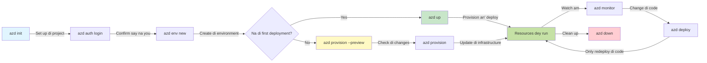
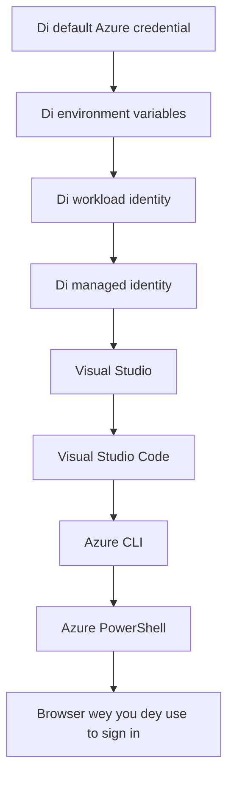

# AZD Basics - Understanding Azure Developer CLI

# AZD Basics - Core Concepts and Fundamentals

**Chapter Navigation:**
- **📚 Course Home**: [AZD For Beginners](../../README.md)
- **📖 Current Chapter**: Chapter 1 - Foundation & Quick Start
- **⬅️ Previous**: [Course Overview](../../README.md#-chapter-1-foundation--quick-start)
- **➡️ Next**: [Installation & Setup](installation.md)
- **🚀 Next Chapter**: [Chapter 2: AI-First Development](../chapter-02-ai-development/microsoft-foundry-integration.md)

## Introduction

Dis lesson go introduce you to Azure Developer CLI (azd), one powerful command-line tool wey dey speed your waka from local development go Azure deployment. You go learn the main concepts, core features, and how azd dey make cloud-native app deployment easy.

## Learning Goals

By the end of this lesson, you go:
- Understand wetin Azure Developer CLI be and wetin e dey do mainly
- Learn the core concepts of templates, environments, and services
- Explore key features like template-driven development and Infrastructure as Code
- Understand the azd project structure and workflow
- Ready to install and configure azd for your development environment

## Learning Outcomes

After you don finish this lesson, you go fit:
- Explain the role of azd for modern cloud development workflows
- Identify the components wey dey an azd project structure
- Describe how templates, environments, and services dey work together
- Understand the benefits of Infrastructure as Code with azd
- Recognize different azd commands and why you go use dem

## What is Azure Developer CLI (azd)?

Azure Developer CLI (azd) na command-line tool wey dem design to speed your journey from local development go Azure deployment. E dey simplify how you build, deploy, and manage cloud-native applications for Azure.

### 🎯 Why Use AZD? A Real-World Comparison

Make we compare how to deploy simple web app plus database:

#### ❌ WITHOUT AZD: Manual Azure Deployment (30+ minutes)

```bash
# Step 1: Make resource group
az group create --name myapp-rg --location eastus

# Step 2: Make App Service Plan
az appservice plan create --name myapp-plan \
  --resource-group myapp-rg \
  --sku B1 --is-linux

# Step 3: Make Web App
az webapp create --name myapp-web-unique123 \
  --resource-group myapp-rg \
  --plan myapp-plan \
  --runtime "NODE:18-lts"

# Step 4: Make Cosmos DB account (e go take 10-15 minutes)
az cosmosdb create --name myapp-cosmos-unique123 \
  --resource-group myapp-rg \
  --kind MongoDB

# Step 5: Make database
az cosmosdb mongodb database create \
  --account-name myapp-cosmos-unique123 \
  --resource-group myapp-rg \
  --name tododb

# Step 6: Make collection
az cosmosdb mongodb collection create \
  --account-name myapp-cosmos-unique123 \
  --resource-group myapp-rg \
  --database-name tododb \
  --name todos

# Step 7: Grab connection string
CONN_STR=$(az cosmosdb keys list \
  --name myapp-cosmos-unique123 \
  --resource-group myapp-rg \
  --type connection-strings \
  --query "connectionStrings[0].connectionString" -o tsv)

# Step 8: Set app settings
az webapp config appsettings set \
  --name myapp-web-unique123 \
  --resource-group myapp-rg \
  --settings MONGODB_URI="$CONN_STR"

# Step 9: Turn on logging
az webapp log config --name myapp-web-unique123 \
  --resource-group myapp-rg \
  --application-logging filesystem \
  --detailed-error-messages true

# Step 10: Set up Application Insights
az monitor app-insights component create \
  --app myapp-insights \
  --location eastus \
  --resource-group myapp-rg

# Step 11: Connect App Insights to Web App
INSTRUMENTATION_KEY=$(az monitor app-insights component show \
  --app myapp-insights \
  --resource-group myapp-rg \
  --query "instrumentationKey" -o tsv)

az webapp config appsettings set \
  --name myapp-web-unique123 \
  --resource-group myapp-rg \
  --settings APPINSIGHTS_INSTRUMENTATIONKEY="$INSTRUMENTATION_KEY"

# Step 12: Build app for local machine
npm install
npm run build

# Step 13: Make deployment package
zip -r app.zip . -x "*.git*" "node_modules/*"

# Step 14: Deploy application
az webapp deployment source config-zip \
  --resource-group myapp-rg \
  --name myapp-web-unique123 \
  --src app.zip

# Step 15: Wait an pray say e go work 🙏
# (No automated validation, you go need to test manually)
```

**Problems:**
- ❌ 15+ commands to remember and execute in order
- ❌ 30-45 minutes of manual work
- ❌ Easy to make mistakes (typos, wrong parameters)
- ❌ Connection strings exposed in terminal history
- ❌ No automated rollback if something fails
- ❌ Hard to replicate for team members
- ❌ Different every time (not reproducible)

#### ✅ WITH AZD: Automated Deployment (5 commands, 10-15 minutes)

```bash
# Step 1: Start wit di template
azd init --template todo-nodejs-mongo

# Step 2: Prove say na you
azd auth login

# Step 3: Create di environment
azd env new dev

# Step 4: Preview di changes (no compulsory but e good make you do am)
azd provision --preview

# Step 5: Deploy everytin
azd up

# ✨ Done! Everything don deploy, dem don set am up, an dem dey monitor am
```

**Benefits:**
- ✅ **5 commands** vs. 15+ manual steps
- ✅ **10-15 minutes** total time (mostly waiting for Azure)
- ✅ **Zero errors** - automated and tested
- ✅ **Secrets managed securely** via Key Vault
- ✅ **Automatic rollback** on failures
- ✅ **Fully reproducible** - same result every time
- ✅ **Team-ready** - anybody fit deploy with same commands
- ✅ **Infrastructure as Code** - version controlled Bicep templates
- ✅ **Built-in monitoring** - Application Insights configured automatically

### 📊 Time & Error Reduction

| Metric | Manual Deployment | AZD Deployment | Improvement |
|:-------|:------------------|:---------------|:------------|
| **Commands** | 15+ | 5 | 67% fewer |
| **Time** | 30-45 min | 10-15 min | 60% faster |
| **Error Rate** | ~40% | <5% | 88% reduction |
| **Consistency** | Low (manual) | 100% (automated) | Perfect |
| **Team Onboarding** | 2-4 hours | 30 minutes | 75% faster |
| **Rollback Time** | 30+ min (manual) | 2 min (automated) | 93% faster |

## Core Concepts

### Templates
Templates na the foundation of azd. Dem dey contain:
- **Application code** - Your source code and dependencies
- **Infrastructure definitions** - Azure resources wey dem define in Bicep or Terraform
- **Configuration files** - Settings and environment variables
- **Deployment scripts** - Automated deployment workflows

### Environments
Environments represent different places wey you fit deploy:
- **Development** - For testing and development
- **Staging** - Pre-production environment
- **Production** - Live production environment

Each environment get im own:
- Azure resource group
- Configuration settings
- Deployment state

### Services
Services na the building blocks of your application:
- **Frontend** - Web applications, SPAs
- **Backend** - APIs, microservices
- **Database** - Data storage solutions
- **Storage** - File and blob storage

## Key Features

### 1. Template-Driven Development
```bash
# See di templates wey dey
azd template list

# Start from wan template
azd init --template <template-name>
```

### 2. Infrastructure as Code
- **Bicep** - Azure's domain-specific language
- **Terraform** - Multi-cloud infrastructure tool
- **ARM Templates** - Azure Resource Manager templates

### 3. Integrated Workflows
```bash
# Di complete deployment workflow
azd up            # Provision + Deploy dis na hands-off for di first time setup

# 🧪 NEW: See wetin go change for infrastructure before you deploy (SAFE)
azd provision --preview    # Run fake deploy for infrastructure without changing anything

azd provision     # Make Azure resources, if you dey update di infrastructure, use dis
azd deploy        # Deploy app code or redeploy am after update
azd down          # Clear resources
```

#### 🛡️ Safe Infrastructure Planning with Preview
The `azd provision --preview` command na game-changer for safe deployments:
- **Dry-run analysis** - Dey show wetin go be created, modified, or deleted
- **Zero risk** - No real change go happen for your Azure environment
- **Team collaboration** - Fit share preview results before deployment
- **Cost estimation** - Understand resource costs before you commit

```bash
# Na example workflow wey you fit preview
azd provision --preview           # See wetin go change
# Check di output, yarn wit di team
azd provision                     # Apply di changes wit confidence
```

### 📊 Visual: AZD Development Workflow


**Workflow Explanation:**
1. **Init** - Start with template or new project
2. **Auth** - Authenticate with Azure
3. **Environment** - Create isolated deployment environment
4. **Preview** - 🆕 Always preview infrastructure changes first (na safe practice)
5. **Provision** - Create/update Azure resources
6. **Deploy** - Push your application code
7. **Monitor** - Observe application performance
8. **Iterate** - Make changes and redeploy code
9. **Cleanup** - Remove resources when you don finish

### 4. Environment Management
```bash
# Make and manage environment dem
azd env new <environment-name>
azd env select <environment-name>
azd env list
```

## 📁 Project Structure

One typical azd project structure:
```
my-app/
├── .azd/                    # azd configuration
│   └── config.json
├── .azure/                  # Azure deployment artifacts
├── .devcontainer/          # Development container config
├── .github/workflows/      # GitHub Actions
├── .vscode/               # VS Code settings
├── infra/                 # Infrastructure code
│   ├── main.bicep        # Main infrastructure template
│   ├── main.parameters.json
│   └── modules/          # Reusable modules
├── src/                  # Application source code
│   ├── api/             # Backend services
│   └── web/             # Frontend application
├── azure.yaml           # azd project configuration
└── README.md
```

## 🔧 Configuration Files

### azure.yaml
The main project configuration file:
```yaml
name: my-awesome-app
metadata:
  template: my-template@1.0.0

services:
  web:
    project: ./src/web
    language: js
    host: appservice
  api:
    project: ./src/api
    language: js
    host: appservice

hooks:
  preprovision:
    shell: pwsh
    run: echo "Preparing to provision..."
```

### .azure/config.json
Environment-specific configuration:
```json
{
  "version": 1,
  "defaultEnvironment": "dev",
  "environments": {
    "dev": {
      "subscriptionId": "your-subscription-id",
      "location": "eastus"
    }
  }
}
```

## 🎪 Common Workflows with Hands-On Exercises

> **💡 Learning Tip:** Follow these exercises in order to build your AZD skills progressively.

### 🎯 Exercise 1: Initialize Your First Project

**Goal:** Create an AZD project and explore its structure

**Steps:**
```bash
# Use template wey don show say e dey work
azd init --template todo-nodejs-mongo

# Check the files wey dem generate
ls -la  # See all files, even di ones wey dem hide

# Important files wey dem create:
# - azure.yaml (main setup)
# - infra/ (infra code)
# - src/ (app code)
```

**✅ Success:** You get azure.yaml, infra/, and src/ directories

---

### 🎯 Exercise 2: Deploy to Azure

**Goal:** Complete end-to-end deployment

**Steps:**
```bash
# 1. Make you sign in
az login && azd auth login

# 2. Set up di environment
azd env new dev
azd env set AZURE_LOCATION eastus

# 3. Preview di changes (DEY RECOMMEND)
azd provision --preview

# 4. Deploy everytin
azd up

# 5. Check say deployment don work
azd show    # See your app URL
```

**Expected Time:** 10-15 minutes  
**✅ Success:** Application URL open for your browser

---

### 🎯 Exercise 3: Multiple Environments

**Goal:** Deploy to dev and staging

**Steps:**
```bash
# Dev don already dey, make staging
azd env new staging
azd env set AZURE_LOCATION westus2
azd up

# Switch between dem
azd env list
azd env select dev
```

**✅ Success:** Two separate resource groups for Azure Portal

---

### 🛡️ Clean Slate: `azd down --force --purge`

When you need to completely reset:

```bash
azd down --force --purge
```

**What it does:**
- `--force`: No confirmation prompts
- `--purge`: Deletes all local state and Azure resources

**Use when:**
- Deployment fail for middle
- You dey switch projects
- You need fresh start

---

## 🎪 Original Workflow Reference

### Starting a New Project
```bash
# Method 1: Use di template wey don dey
azd init --template todo-nodejs-mongo

# Method 2: Start am from scratch
azd init

# Method 3: Use di current directory
azd init .
```

### Development Cycle
```bash
# Make di development environment ready
azd auth login
azd env new dev
azd env select dev

# Deploy all di tins
azd up

# Make changes den deploy again
azd deploy

# Clear up wen you don finish
azd down --force --purge # Di command for di Azure Developer CLI na **full reset** for your environment—specially useful when you dey troubleshoot failed deployments, dey clear orphaned resources, or dey prepare for fresh redeploy.
```

## Understanding `azd down --force --purge`
The `azd down --force --purge` command na powerful way to completely tear down your azd environment and all associated resources. Below na breakdown of wetin each flag dey do:
```
--force
```
- E dey skip confirmation prompts.
- E good for automation or scripting where manual input no possible.
- E make sure teardown continue without interruption, even if CLI detect inconsistencies.

```
--purge
```
Deletes **all associated metadata**, wey include:
Environment state
Local `.azure` folder
Cached deployment info
Prevents azd from "remembering" previous deployments, wey fit cause wahala like mismatched resource groups or stale registry references.


### Why use both?
When you don jam wall with `azd up` because state remain or partial deployments, dis combo go give you **clean slate**.

E especially helpful after manual resource deletions for Azure portal or when you dey switch templates, environments, or resource group naming conventions.


### Managing Multiple Environments
```bash
# Make di staging environment
azd env new staging
azd env select staging
azd up

# Go back to dev
azd env select dev

# Compare di environments
azd env list
```

## 🔐 Authentication and Credentials

To sabi authentication na key for successful azd deployments. Azure get different authentication methods, and azd dey use the same credential chain wey other Azure tools dey use.

### Azure CLI Authentication (`az login`)

Before you start to use azd, you go need authenticate with Azure. The common way na use Azure CLI:

```bash
# Interactive login (e go open browser)
az login

# Login wit specific tenant
az login --tenant <tenant-id>

# Login wit service principal
az login --service-principal -u <app-id> -p <password> --tenant <tenant-id>

# Check wetin your login status be now
az account show

# List subscriptions wey dey available
az account list --output table

# Set di default subscription
az account set --subscription <subscription-id>
```

### Authentication Flow
1. **Interactive Login**: E go open your default browser for authentication
2. **Device Code Flow**: For environments wey no get browser access
3. **Service Principal**: For automation and CI/CD scenarios
4. **Managed Identity**: For Azure-hosted applications

### DefaultAzureCredential Chain

`DefaultAzureCredential` na credential type wey dey simplify authentication by dey try multiple credential sources for one particular order:

#### Credential Chain Order

#### 1. Environment Variables
```bash
# Set di environment variables for di service principal
export AZURE_CLIENT_ID="<app-id>"
export AZURE_CLIENT_SECRET="<password>"
export AZURE_TENANT_ID="<tenant-id>"
```

#### 2. Workload Identity (Kubernetes/GitHub Actions)
E dey used automatically for:
- Azure Kubernetes Service (AKS) with Workload Identity
- GitHub Actions with OIDC federation
- Other federated identity scenarios

#### 3. Managed Identity
For Azure resources like:
- Virtual Machines
- App Service
- Azure Functions
- Container Instances

```bash
# Check if e dey run for Azure resource wey get managed identity
az account show --query "user.type" --output tsv
# E go return "servicePrincipal" if e dey use managed identity
```

#### 4. Developer Tools Integration
- **Visual Studio**: Automatically dey use signed-in account
- **VS Code**: Dey use Azure Account extension credentials
- **Azure CLI**: Dey use `az login` credentials (the common one for local development)

### AZD Authentication Setup

```bash
# Method 1: Use Azure CLI (dem recommend am for development)
az login
azd auth login  # E dey use di existing Azure CLI credentials

# Method 2: Do azd authentication direct
azd auth login --use-device-code  # For headless environment dem

# Method 3: Check di authentication status
azd auth login --check-status

# Method 4: Logout, den authenticate again
azd auth logout
azd auth login
```

### Authentication Best Practices

#### For Local Development
```bash
# 1. Log in wit Azure CLI
az login

# 2. Make sure say di subscription dey correct
az account show
az account set --subscription "Your Subscription Name"

# 3. Use azd wit di existing credentials
azd auth login
```

#### For CI/CD Pipelines
```yaml
# GitHub Actions example
- name: Azure Login
  uses: azure/login@v1
  with:
    creds: ${{ secrets.AZURE_CREDENTIALS }}

- name: Deploy with azd
  run: |
    azd auth login --client-id ${{ secrets.AZURE_CLIENT_ID }} \
                    --client-secret ${{ secrets.AZURE_CLIENT_SECRET }} \
                    --tenant-id ${{ secrets.AZURE_TENANT_ID }}
    azd up --no-prompt
```

#### For Production Environments
- Use **Managed Identity** when you dey run on Azure resources
- Use **Service Principal** for automation scenarios
- No dey store credentials for code or configuration files
- Use **Azure Key Vault** for sensitive configuration

### Common Authentication Issues and Solutions

#### Issue: "No subscription found"
```bash
# How to fix am: Make di subscription na default
az account list --output table
az account set --subscription "<subscription-id>"
azd env set AZURE_SUBSCRIPTION_ID "<subscription-id>"
```

#### Issue: "Insufficient permissions"
```bash
# Wetin go solve am: Make sure say you check an assign di roles wey dem need
az role assignment list --assignee $(az account show --query user.name --output tsv)

# Common roles wey dem dey need:
# - Contributor (to manage di resources)
# - User Access Administrator (to assign di roles)
```

#### Issue: "Token expired"
```bash
# Wetin go solve am: Make person sign in again.
az logout
az login
azd auth logout
azd auth login
```

### Authentication in Different Scenarios

#### Local Development
```bash
# Account wey pesin dey use to better imself.
az login
azd auth login
```

#### Team Development
```bash
# Use one specific tenant for di organization
az login --tenant contoso.onmicrosoft.com
azd auth login
```

#### Multi-tenant Scenarios
```bash
# Switch from one tenant go another
az login --tenant tenant1.onmicrosoft.com
# Deploy go tenant 1
azd up

az login --tenant tenant2.onmicrosoft.com  
# Deploy go tenant 2
azd up
```

### Security Considerations

1. **Credential Storage**: No ever store credentials for source code
2. **Scope Limitation**: Use least-privilege principle for service principals
3. **Token Rotation**: Rotate service principal secrets regularly
4. **Audit Trail**: Monitor authentication and deployment activities
5. **Network Security**: Use private endpoints when e possible

### Troubleshooting Authentication

```bash
# Check an fix login wahala
azd auth login --check-status
az account show
az account get-access-token

# Commands wey we dey use for diagnosis
whoami                          # Context of di user wey dey now
az ad signed-in-user show      # Details of di Azure AD user
az group list                  # Test if we fit access the resource
```

## Understanding `azd down --force --purge`

### Discovery
```bash
azd template list              # Browse template dem
azd template show <template>   # Template details dem
azd init --help               # Setup options dem
```

### Project Management
```bash
azd show                     # Project gist
azd env show                 # Di environment wey dey now
azd config list             # Settings wey dem set
```

### Monitoring
```bash
azd monitor                  # Open di Azure portal make you check monitoring
azd monitor --logs           # See di application logs
azd monitor --live           # See di live metrics
azd pipeline config          # Set up di CI/CD
```

## Best Practices

### 1. Use Meaningful Names
```bash
# Gud
azd env new production-east
azd init --template web-app-secure

# No go near
azd env new env1
azd init --template template1
```

### 2. Leverage Templates
- Start with templates wey already dey
- Customize for your needs
- Create reusable templates for your organization

### 3. Environment Isolation
- Use separate environments for dev/staging/prod
- No dey deploy straight to production from local machine
- Use CI/CD pipelines for production deployments

### 4. Configuration Management
- Use environment variables for sensitive data
- Keep configuration inside version control
- Document environment-specific settings

## Learning Progression

### Beginner (Week 1-2)
1. Install azd and authenticate
2. Deploy one simple template
3. Understand project structure
4. Learn basic commands (up, down, deploy)

### Intermediate (Week 3-4)
1. Customize templates
2. Manage multiple environments
3. Understand infrastructure code
4. Set up CI/CD pipelines

### Advanced (Week 5+)
1. Create custom templates
2. Advanced infrastructure patterns
3. Multi-region deployments
4. Enterprise-grade configurations

## Next Steps

**📖 Continue Chapter 1 Learning:**
- [Installation & Setup](installation.md) - Make you install azd an set am up
- [Your First Project](first-project.md) - Complete hands-on tutorial wey you go do
- [Configuration Guide](configuration.md) - Advanced configuration options

**🎯 You ready for di next chapter?**
- [Chapter 2: AI-First Development](../chapter-02-ai-development/microsoft-foundry-integration.md) - Start to build AI apps

## Additional Resources

- [Azure Developer CLI Overview](https://learn.microsoft.com/en-us/azure/developer/azure-developer-cli/)
- [Template Gallery](https://azure.github.io/awesome-azd/)
- [Community Samples](https://github.com/Azure-Samples)

---

## 🙋 Frequently Asked Questions

### General Questions

**Q: Wetin be di difference between AZD and Azure CLI?**

A: Azure CLI (`az`) na for managing individual Azure resources. AZD (`azd`) na for managing whole applications:

```bash
# Azure CLI - Management wey dey handle resources small-small
az webapp create --name myapp --resource-group rg
az sql server create --name myserver --resource-group rg
# ...plenty more commands dey needed

# AZD - Management wey dey for app level
azd up  # E dey deploy the whole app with all di resources
```

**Think of it this way:**
- `az` = dey operate on individual Lego bricks
- `azd` = dey work wit complete Lego sets

---

**Q: I need sabi Bicep or Terraform to use AZD?**

A: No! Start wit templates:
```bash
# Use the existing template - you no need sabi IaC
azd init --template todo-nodejs-mongo
azd up
```

You fit learn Bicep later to customize infrastructure. Templates dey give working examples wey you fit learn from.

---

**Q: How much e go cost to run AZD templates?**

A: Cost dey vary by template. Most development templates dey cost $50-150/month:

```bash
# See wetin e go cost before you deploy
azd provision --preview

# Make sure say you always clean up when you no dey use am
azd down --force --purge  # E go remove all di resources
```

**Pro tip:** Use free tiers where dem get am:
- App Service: F1 (Free) tier
- Azure OpenAI: 50,000 tokens/month free
- Cosmos DB: 1000 RU/s free tier

---

**Q: I fit use AZD with existing Azure resources?**

A: Yes, but e easier to start fresh. AZD dey work best when e dey manage full lifecycle. For existing resources:

```bash
# Option 1: Bring in di resources wey don dey (advanced)
azd init
# Den change infra/ make e point to di resources wey don dey

# Option 2: Start fresh (we recommend am)
azd init --template matching-your-stack
azd up  # E go create new environment
```

---

**Q: How I go share my project with teammates?**

A: Commit the AZD project to Git (but NOT the .azure folder):

```bash
# E don dey .gitignore by default
.azure/        # E get sekrits and environment data
*.env          # Variables wey dey for environment

# Na di team members be:
git clone <your-repo>
azd auth login
azd env new <their-name>-dev
azd up
```

Everybody go get identical infrastructure from di same templates.

---

### Troubleshooting Questions

**Q: "azd up" failed halfway. What do I do?**

A: Check di error, fix am, then try again:

```bash
# See di detailed logs
azd show

# Common fix dem:

# 1. If quota don pass:
azd env set AZURE_LOCATION "westus2"  # Try use another region

# 2. If resource name dey conflict:
azd down --force --purge  # Wipe everytin
azd up  # Try again

# 3. If auth don expire:
az login
azd auth login
azd up
```

**Di most common problem:** Wrong Azure subscription selected
```bash
az account list --output table
az account set --subscription "<correct-subscription>"
```

---

**Q: How I go deploy just code changes without reprovisioning?**

A: Use `azd deploy` instead of `azd up`:

```bash
azd up          # Na di fust taim: set up + deploy (slow)

# Mek code changes...

azd deploy      # Na next taims: just deploy (fast)
```

Speed comparison:
- `azd up`: 10-15 minutes (e dey provision infrastructure)
- `azd deploy`: 2-5 minutes (code only)

---

**Q: I fit customize di infrastructure templates?**

A: Yes! Edit di Bicep files for `infra/`:

```bash
# After wey you don run azd init
cd infra/
code main.bicep  # Change am inside VS Code

# Check di changes
azd provision --preview

# Apply di changes
azd provision
```

**Tip:** Start small - change SKUs first:
```bicep
// infra/main.bicep
sku: {
  name: 'B1'  // Change to 'P1V2' for production
}
```

---

**Q: How I go delete everything AZD create?**

A: One command go remove all resources:

```bash
azd down --force --purge

# Dis go delete:
# - All Azure resources dem
# - Di resource group
# - Di local environment state
# - Di cached deployment data
```

**Always run this when:**
- You don finish testing a template
- You dey switch to different project
- You want start fresh

**Cost savings:** If you delete unused resources, you no go get charges

---

**Q: Wetin if I by mistake delete resources for Azure Portal?**

A: AZD state fit comot from sync. Clean-slate approach:

```bash
# 1. Comot local state
azd down --force --purge

# 2. Start am new
azd up

# Anoda way: Make AZD detect an fix
azd provision  # E go create di missing resources
```

---

### Advanced Questions

**Q: I fit use AZD for CI/CD pipelines?**

A: Yes! GitHub Actions example:

```yaml
# .github/workflows/deploy.yml
name: Deploy with AZD

on:
  push:
    branches: [main]

jobs:
  deploy:
    runs-on: ubuntu-latest
    steps:
      - uses: actions/checkout@v2
      
      - name: Install azd
        run: curl -fsSL https://aka.ms/install-azd.sh | bash
      
      - name: Azure Login
        run: |
          azd auth login \
            --client-id ${{ secrets.AZURE_CLIENT_ID }} \
            --client-secret ${{ secrets.AZURE_CLIENT_SECRET }} \
            --tenant-id ${{ secrets.AZURE_TENANT_ID }}
      
      - name: Deploy
        run: azd up --no-prompt
```

---

**Q: How I go handle secrets and sensitive data?**

A: AZD dey integrate with Azure Key Vault automatically:

```bash
# Secrets dey for Key Vault, no dey for code
azd env set DATABASE_PASSWORD "$(openssl rand -base64 32)"

# AZD dey do am automatically:
# 1. E dey create Key Vault
# 2. E dey store secret
# 3. E dey give app access via Managed Identity
# 4. E dey inject am for runtime
```

**Never commit:**
- `.azure/` folder (contains environment data)
- `.env` files (local secrets)
- Connection strings

---

**Q: I fit deploy to multiple regions?**

A: Yes, create environment per region:

```bash
# Environment wey dey East for US
azd env new prod-eastus
azd env set AZURE_LOCATION eastus
azd up

# Environment wey dey West for Europe
azd env new prod-westeurope
azd env set AZURE_LOCATION westeurope
azd up

# Every environment dey independent
azd env list
```

For true multi-region apps, customize Bicep templates to deploy to multiple regions at di same time.

---

**Q: Where I fit get help if I stuck?**

1. **AZD Documentation:** https://learn.microsoft.com/azure/developer/azure-developer-cli/
2. **GitHub Issues:** https://github.com/Azure/azure-dev/issues
3. **Discord:** [Azure Discord](https://discord.gg/microsoft-azure) - #azure-developer-cli channel
4. **Stack Overflow:** Tag `azure-developer-cli`
5. **This Course:** [Troubleshooting Guide](../chapter-07-troubleshooting/common-issues.md)

**Pro tip:** Before you ask, run:
```bash
azd show       # Dey show di current state
azd version    # Dey show your version
```
Include dis info for your question make dem fit help you faster.

---

## 🎓 Wetin next?

You don sabi AZD fundamentals now. Choose which road you wan take:

### 🎯 For Beginners:
1. **Next:** [Installation & Setup](installation.md) - Install AZD for your machine
2. **Then:** [Your First Project](first-project.md) - Deploy your first app
3. **Practice:** Do all 3 exercises for this lesson

### 🚀 For AI Developers:
1. **Skip to:** [Chapter 2: AI-First Development](../chapter-02-ai-development/microsoft-foundry-integration.md)
2. **Deploy:** Start wit `azd init --template get-started-with-ai-chat`
3. **Learn:** Build while you deploy

### 🏗️ For Experienced Developers:
1. **Review:** [Configuration Guide](configuration.md) - Advanced settings
2. **Explore:** [Infrastructure as Code](../chapter-04-infrastructure/provisioning.md) - Bicep deep dive
3. **Build:** Create custom templates for your stack

---

**Chapter Navigation:**
- **📚 Course Home**: [AZD For Beginners](../../README.md)
- **📖 Current Chapter**: Chapter 1 - Foundation & Quick Start  
- **⬅️ Previous**: [Course Overview](../../README.md#-chapter-1-foundation--quick-start)
- **➡️ Next**: [Installation & Setup](installation.md)
- **🚀 Next Chapter**: [Chapter 2: AI-First Development](../chapter-02-ai-development/microsoft-foundry-integration.md)

---

<!-- CO-OP TRANSLATOR DISCLAIMER START -->
Disclaimer:
Dis document don translate by AI translation service Co-op Translator (https://github.com/Azure/co-op-translator). Even though we dey try make am correct, abeg note say automated translations fit get mistakes or incorrect parts. The original document for im original language na the main/authoritative source. For important information, make you use professional human translator. We no go responsible for any misunderstandings or wrong interpretations wey fit come from using this translation.
<!-- CO-OP TRANSLATOR DISCLAIMER END -->