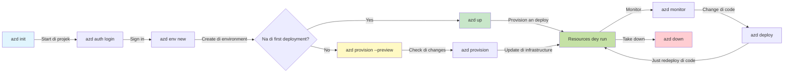
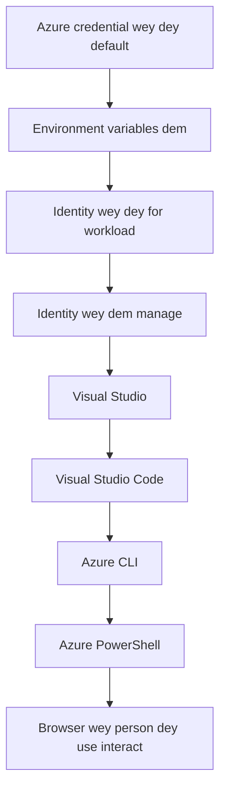

# AZD Basics - How Azure Developer CLI (azd) Dey Work

# AZD Basics - Core Koncepts & Fundamentals

**How to waka through Chapters:**
- **📚 Course Home**: [AZD For Beginners](../../README.md)
- **📖 Current Chapter**: Chapter 1 - Foundation & Quick Start
- **⬅️ Previous**: [Course Overview](../../README.md#-chapter-1-foundation--quick-start)
- **➡️ Next**: [Installation & Setup](installation.md)
- **🚀 Next Chapter**: [Chapter 2: AI-First Development](../chapter-02-ai-development/microsoft-foundry-integration.md)

## Introduction

Dis lesson go introduce you to Azure Developer CLI (azd), one powerful command-line tool wey go fast-track your waka from local development go Azure deployment. You go learn the main koncepts, core features, an go sabi how azd dey simplify cloud-native application deployment.

## Learning Goals

By di end of dis lesson, you go:
- Sabi wetin Azure Developer CLI be an wetin e dey for
- Learn di core konsepts of templates, environments, an services
- Check important features like template-driven development an Infrastructure as Code
- Sabi di azd project structure an workflow
- Ready to install an configure azd for your development environment

## Learning Outcomes

After you finish dis lesson, you go fit:
- Explain di role of azd for modern cloud development workflows
- Identify di components wey dey inside azd project structure
- Describe how templates, environments, an services dey work together
- Understand di benefits of Infrastructure as Code with azd
- Recognize different azd commands an wetin dem dey do

## What is Azure Developer CLI (azd)?

Azure Developer CLI (azd) na command-line tool wey dem design to fast-track your waka from local development go Azure deployment. E dey make building, deploying, an managing cloud-native applications for Azure simple.

### What Can You Deploy with azd?

azd dey support plenty workloads—and di list still dey grow. Today, you fit use azd deploy:

| Workload Type | Examples | Same Workflow? |
|---------------|----------|----------------|
| **Traditional applications** | Web apps, REST APIs, static sites | ✅ `azd up` |
| **Services and microservices** | Container Apps, Function Apps, multi-service backends | ✅ `azd up` |
| **AI-powered applications** | Chat apps with Microsoft Foundry Models, RAG solutions with AI Search | ✅ `azd up` |
| **Intelligent agents** | Foundry-hosted agents, multi-agent orchestrations | ✅ `azd up` |

Di main point be say **di azd lifecycle dey the same no matter wetin you dey deploy**. You go init project, provision infrastructure, deploy your code, monitor your app, an clean up—whether na simple website or one correct AI agent.

Dis continuity na by design. azd dey treat AI capabilities as another kind of service wey your application fit use, no be something wey different for ground. One chat endpoint wey dey use Microsoft Foundry Models, from azd point of view, na just another service to configure an deploy.

### 🎯 Why Use AZD? A Real-World Comparison

Make we compare deploying one simple web app with database:

#### ❌ WITHOUT AZD: Manual Azure Deployment (30+ minutes)

```bash
# Step 1: Make resource group
az group create --name myapp-rg --location eastus

# Step 2: Make App Service Plan
az appservice plan create --name myapp-plan \
  --resource-group myapp-rg \
  --sku B1 --is-linux

# Step 3: Make Web App
az webapp create --name myapp-web-unique123 \
  --resource-group myapp-rg \
  --plan myapp-plan \
  --runtime "NODE:18-lts"

# Step 4: Make Cosmos DB account (10-15 minutes)
az cosmosdb create --name myapp-cosmos-unique123 \
  --resource-group myapp-rg \
  --kind MongoDB

# Step 5: Make database
az cosmosdb mongodb database create \
  --account-name myapp-cosmos-unique123 \
  --resource-group myapp-rg \
  --name tododb

# Step 6: Make collection
az cosmosdb mongodb collection create \
  --account-name myapp-cosmos-unique123 \
  --resource-group myapp-rg \
  --database-name tododb \
  --name todos

# Step 7: Get connection string
CONN_STR=$(az cosmosdb keys list \
  --name myapp-cosmos-unique123 \
  --resource-group myapp-rg \
  --type connection-strings \
  --query "connectionStrings[0].connectionString" -o tsv)

# Step 8: Set app settings
az webapp config appsettings set \
  --name myapp-web-unique123 \
  --resource-group myapp-rg \
  --settings MONGODB_URI="$CONN_STR"

# Step 9: Turn on logging
az webapp log config --name myapp-web-unique123 \
  --resource-group myapp-rg \
  --application-logging filesystem \
  --detailed-error-messages true

# Step 10: Set up Application Insights
az monitor app-insights component create \
  --app myapp-insights \
  --location eastus \
  --resource-group myapp-rg

# Step 11: Connect App Insights to Web App
INSTRUMENTATION_KEY=$(az monitor app-insights component show \
  --app myapp-insights \
  --resource-group myapp-rg \
  --query "instrumentationKey" -o tsv)

az webapp config appsettings set \
  --name myapp-web-unique123 \
  --resource-group myapp-rg \
  --settings APPINSIGHTS_INSTRUMENTATIONKEY="$INSTRUMENTATION_KEY"

# Step 12: Build app on your machine
npm install
npm run build

# Step 13: Make deployment package
zip -r app.zip . -x "*.git*" "node_modules/*"

# Step 14: Deploy app
az webapp deployment source config-zip \
  --resource-group myapp-rg \
  --name myapp-web-unique123 \
  --src app.zip

# Step 15: Wait and pray say e go work 🙏
# (No automated validation, you go need test am manually)
```

**Problems:**
- ❌ 15+ commands to remember and execute in order
- ❌ 30-45 minutes of manual work
- ❌ Easy to make mistakes (typos, wrong parameters)
- ❌ Connection strings exposed in terminal history
- ❌ No automated rollback if something fails
- ❌ Hard to replicate for team members
- ❌ Different every time (not reproducible)

#### ✅ WITH AZD: Automated Deployment (5 commands, 10-15 minutes)

```bash
# Step 1: Set up from di template
azd init --template todo-nodejs-mongo

# Step 2: Confirm who you be
azd auth login

# Step 3: Set up di environment
azd env new dev

# Step 4: Preview di changes (no compulsory but e dey recommended)
azd provision --preview

# Step 5: Deploy everytin
azd up

# ✨ Done! Everything don deploy, set up, an dem dey monitor am
```

**Benefits:**
- ✅ **5 commands** vs. 15+ manual steps
- ✅ **10-15 minutes** total time (mostly waiting for Azure)
- ✅ **Zero errors** - automated and tested
- ✅ **Secrets managed securely** via Key Vault
- ✅ **Automatic rollback** on failures
- ✅ **Fully reproducible** - same result every time
- ✅ **Team-ready** - anyone can deploy with same commands
- ✅ **Infrastructure as Code** - version controlled Bicep templates
- ✅ **Built-in monitoring** - Application Insights configured automatically

### 📊 Time & Error Reduction

| Metric | Manual Deployment | AZD Deployment | Improvement |
|:-------|:------------------|:---------------|:------------|
| **Commands** | 15+ | 5 | 67% fewer |
| **Time** | 30-45 min | 10-15 min | 60% faster |
| **Error Rate** | ~40% | <5% | 88% reduction |
| **Consistency** | Low (manual) | 100% (automated) | Perfect |
| **Team Onboarding** | 2-4 hours | 30 minutes | 75% faster |
| **Rollback Time** | 30+ min (manual) | 2 min (automated) | 93% faster |

## Core Concepts

### Templates
Templates na di foundation of azd. Dem get:
- **Application code** - Your source code an dependencies
- **Infrastructure definitions** - Azure resources wey dem define for Bicep or Terraform
- **Configuration files** - Settings an environment variables
- **Deployment scripts** - Automated deployment workflows

### Environments
Environments mean di different deployment targets:
- **Development** - For testing an development
- **Staging** - Pre-production environment
- **Production** - Live production environment

Each environment get im own:
- Azure resource group
- Configuration settings
- Deployment state

### Services
Services na di building blocks of your application:
- **Frontend** - Web applications, SPAs
- **Backend** - APIs, microservices
- **Database** - Data storage solutions
- **Storage** - File an blob storage

## Key Features

### 1. Template-Driven Development
```bash
# See template dem wey dey
azd template list

# Start from one template
azd init --template <template-name>
```

### 2. Infrastructure as Code
- **Bicep** - Azure domain-specific language
- **Terraform** - Multi-cloud infrastructure tool
- **ARM Templates** - Azure Resource Manager templates

### 3. Integrated Workflows
```bash
# Di full workflow for deployment
azd up            # Provision + Deploy — na hands-off for di first-time setup

# 🧪 NEW: See di infrastructure changes before you deploy (SAFE)
azd provision --preview    # Run deployment simulation for infrastructure, no change go happen

azd provision     # Create Azure resources. If you dey update di infrastructure, use dis
azd deploy        # Deploy di app code or redeploy am after update
azd down          # Clean up di resources
```

#### 🛡️ Safe Infrastructure Planning with Preview
Di `azd provision --preview` command na game-changer for safe deployments:
- **Dry-run analysis** - Show wetin dem go create, modify, or delete
- **Zero risk** - No actual changes go happen for your Azure environment
- **Team collaboration** - Fit share preview results before deployment
- **Cost estimation** - Know how resources go cost before you commit

```bash
# Example wey dey show how to preview di workflow
azd provision --preview           # See wetin go change
# Check di output, talk am over wit di team
azd provision                     # Apply di changes wit confidence
```

### 📊 Visual: AZD Development Workflow


**Workflow Explanation:**
1. **Init** - Start with template or new project
2. **Auth** - Authenticate with Azure
3. **Environment** - Create isolated deployment environment
4. **Preview** - 🆕 Always preview infrastructure changes first (safe practice)
5. **Provision** - Create/update Azure resources
6. **Deploy** - Push your application code
7. **Monitor** - Observe application performance
8. **Iterate** - Make changes an redeploy code
9. **Cleanup** - Remove resources when you don finish

### 4. Environment Management
```bash
# Make and manage environment dem
azd env new <environment-name>
azd env select <environment-name>
azd env list
```

### 5. Extensions and AI Commands

azd dey use extension system to add capabilities wey beyond the core CLI. Dis one especially useful for AI workloads:

```bash
# Show all extensions wey dey available
azd extension list

# Install di Foundry agents extension
azd extension install azure.ai.agents

# Start AI agent project from di manifest
azd ai agent init -m agent-manifest.yaml

# Start di MCP server for AI-assisted development (Alpha)
azd mcp start
```

> Extensions dey covered well for [Chapter 2: AI-First Development](../chapter-02-ai-development/agents.md) and di [AZD AI CLI Commands](../chapter-08-production/production-ai-practices.md#azd-ai-cli-commands-and-extensions) reference.

## 📁 Project Structure

One typical azd project structure:
```
my-app/
├── .azd/                    # azd configuration
│   └── config.json
├── .azure/                  # Azure deployment artifacts
├── .devcontainer/          # Development container config
├── .github/workflows/      # GitHub Actions
├── .vscode/               # VS Code settings
├── infra/                 # Infrastructure code
│   ├── main.bicep        # Main infrastructure template
│   ├── main.parameters.json
│   └── modules/          # Reusable modules
├── src/                  # Application source code
│   ├── api/             # Backend services
│   └── web/             # Frontend application
├── azure.yaml           # azd project configuration
└── README.md
```

## 🔧 Configuration Files

### azure.yaml
Di main project configuration file:
```yaml
name: my-awesome-app
metadata:
  template: my-template@1.0.0

services:
  web:
    project: ./src/web
    language: js
    host: appservice
  api:
    project: ./src/api
    language: js
    host: appservice

hooks:
  preprovision:
    shell: pwsh
    run: echo "Preparing to provision..."
```

### .azure/config.json
Environment-specific configuration:
```json
{
  "version": 1,
  "defaultEnvironment": "dev",
  "environments": {
    "dev": {
      "subscriptionId": "your-subscription-id",
      "location": "eastus"
    }
  }
}
```

## 🎪 Common Workflows with Hands-On Exercises

> **💡 Learning Tip:** Follow these exercises one by one to build your AZD skills step-by-step.

### 🎯 Exercise 1: Initialize Your First Project

**Goal:** Create an AZD project an check im structure

**Steps:**
```bash
# Use one template wey don prove say e dey work
azd init --template todo-nodejs-mongo

# Explore di files wey dem generate
ls -la  # See all files, even di hidden ones

# Di key files wey dem create:
# - azure.yaml (main konfig)
# - infra/ (infra code)
# - src/ (app code)
```

**✅ Success:** You don get azure.yaml, infra/, an src/ directories

---

### 🎯 Exercise 2: Deploy to Azure

**Goal:** Complete end-to-end deployment

**Steps:**
```bash
# 1. Prove say na you
az login && azd auth login

# 2. Set up di environment
azd env new dev
azd env set AZURE_LOCATION eastus

# 3. Preview di changes (WE RECOMMEND)
azd provision --preview

# 4. Deploy everytin
azd up

# 5. Check say deployment don work
azd show    # See your app link
```

**Expected Time:** 10-15 minutes  
**✅ Success:** Application URL go open for browser

---

### 🎯 Exercise 3: Multiple Environments

**Goal:** Deploy to dev an staging

**Steps:**
```bash
# Dev don dey already, make staging
azd env new staging
azd env set AZURE_LOCATION westus2
azd up

# Switch between dem
azd env list
azd env select dev
```

**✅ Success:** Two separate resource groups for Azure Portal

---

### 🛡️ Clean Slate: `azd down --force --purge`

When you need to wipe every tin:

```bash
azd down --force --purge
```

**What it does:**
- `--force`: No confirmation prompts
- `--purge`: Deletes all local state and Azure resources

**Use when:**
- Deployment fail for middle
- You dey switch projects
- You need fresh start

---

## 🎪 Original Workflow Reference

### Starting a New Project
```bash
# Method 1: Use di template wey already dey
azd init --template todo-nodejs-mongo

# Method 2: Start from di beginning
azd init

# Method 3: Use di current directory
azd init .
```

### Development Cycle
```bash
# Set up di development environment
azd auth login
azd env new dev
azd env select dev

# Deploy everytin
azd up

# Make changes den redeploy
azd deploy

# Clean up when you don finish
azd down --force --purge # Di command for the Azure Developer CLI na hard reset for your environment—e dey especially useful when you dey troubleshoot failed deployments, dey clean up orphaned resources, or dey prepare for fresh redeploy.
```

## Understanding `azd down --force --purge`
Di `azd down --force --purge` command strong well to completely tear down your azd environment an all resources wey join. Na di breakdown of wetin each flag dey do:
```
--force
```
- Skips confirmation prompts.
- Useful for automation or scripting where manual input no dey possible.
- Ensures the teardown go continue without interruption, even if CLI detect inconsistencies.

```
--purge
```
Deletes **all associated metadata**, including:
Environment state
Local `.azure` folder
Cached deployment info
Prevents azd from "remembering" previous deployments, wey fit cause wahala like mismatched resource groups or stale registry references.


### Why use both?
When `azd up` jam problem because of lingering state or partial deployments, dis combo go give you **clean slate**.

E dey especially useful after you delete resources manually for Azure portal or when you dey switch templates, environments, or resource group naming conventions.


### Managing Multiple Environments
```bash
# Make di staging environment
azd env new staging
azd env select staging
azd up

# Change back to di dev
azd env select dev

# Compare di environments
azd env list
```

## 🔐 Authentication and Credentials

To sabi authentication na important thing for successful azd deployments. Azure get plenty authentication methods, an azd dey use di same credential chain wey other Azure tools dey use.

### Azure CLI Authentication (`az login`)

Before you start use azd, you must authenticate with Azure. Di commonest method na use Azure CLI:

```bash
# Login wey you go interact (e go open browser)
az login

# Login wit one particular tenant
az login --tenant <tenant-id>

# Login wit service principal
az login --service-principal -u <app-id> -p <password> --tenant <tenant-id>

# Check how login status dey now
az account show

# List subscriptions wey dey available
az account list --output table

# Set subscription wey go be default
az account set --subscription <subscription-id>
```

### Authentication Flow
1. **Interactive Login**: Go open your default browser for authentication
2. **Device Code Flow**: For environments wey no get browser access
3. **Service Principal**: For automation an CI/CD scenarios
4. **Managed Identity**: For Azure-hosted applications

### DefaultAzureCredential Chain

`DefaultAzureCredential` na credential type wey dey make authentication easy by automatically trying multiple credential sources for one specific order:

#### Credential Chain Order

#### 1. Environment Variables
```bash
# Make di environment variables for di service principal
export AZURE_CLIENT_ID="<app-id>"
export AZURE_CLIENT_SECRET="<password>"
export AZURE_TENANT_ID="<tenant-id>"
```

#### 2. Workload Identity (Kubernetes/GitHub Actions)
Dey used automatically for:
- Azure Kubernetes Service (AKS) with Workload Identity
- GitHub Actions with OIDC federation
- Other federated identity scenarios

#### 3. Managed Identity
For Azure resources like:
- Virtual Machines
- App Service
- Azure Functions
- Container Instances

```bash
# Make e check if e dey run for Azure resource wey get managed identity
az account show --query "user.type" --output tsv
# E go return: "servicePrincipal" if e dey use managed identity
```

#### 4. Developer Tools Integration
- **Visual Studio**: Dey automatically use signed-in account
- **VS Code**: Dey use Azure Account extension credentials
- **Azure CLI**: Dey use `az login` credentials (most common for local development)

### AZD Authentication Setup

```bash
# Method 1: Use Azure CLI (We dey recommend am for development)
az login
azd auth login  # E dey use di existing Azure CLI credentials

# Method 2: Do azd authentication direct
azd auth login --use-device-code  # For environments wey no get GUI

# Method 3: Check di authentication status
azd auth login --check-status

# Method 4: Logout, den authenticate again
azd auth logout
azd auth login
```

### Authentication Best Practices

#### For Local Development
```bash
# 1. Login wit Azure CLI
az login

# 2. Check say di subscription correct
az account show
az account set --subscription "Your Subscription Name"

# 3. Use azd wit di credentials wey don dey
azd auth login
```

#### For CI/CD Pipelines
```yaml
# GitHub Actions example
- name: Azure Login
  uses: azure/login@v1
  with:
    creds: ${{ secrets.AZURE_CREDENTIALS }}

- name: Deploy with azd
  run: |
    azd auth login --client-id ${{ secrets.AZURE_CLIENT_ID }} \
                    --client-secret ${{ secrets.AZURE_CLIENT_SECRET }} \
                    --tenant-id ${{ secrets.AZURE_TENANT_ID }}
    azd up --no-prompt
```

#### For Production Environments
- Use **Managed Identity** when you dey run on Azure resources
- Use **Service Principal** for automation scenarios
- No dey store credentials for code or configuration files
- Use **Azure Key Vault** for sensitive configuration

### Common Authentication Issues and Solutions

#### Issue: "No subscription found"
```bash
# Wetin go solve am: Make di subscription default
az account list --output table
az account set --subscription "<subscription-id>"
azd env set AZURE_SUBSCRIPTION_ID "<subscription-id>"
```

#### Issue: "Insufficient permissions"
```bash
# Solution: Make sure say you check and assign the roles wey dem need
az role assignment list --assignee $(az account show --query user.name --output tsv)

# Common roles wey dem need:
# - Contributor (make person manage resources)
# - User Access Administrator (make person assign roles)
```

#### Issue: "Token expired"
```bash
# Wetin go solve am: Make you sign in again
az logout
az login
azd auth logout
azd auth login
```

### Authentication in Different Scenarios

#### Local Development
```bash
# Account wey dey for self improvement
az login
azd auth login
```

#### Team Development
```bash
# Make you use one specific tenant wey belong to di organization
az login --tenant contoso.onmicrosoft.com
azd auth login
```

#### Multi-tenant Scenarios
```bash
# Change between tenants dem
az login --tenant tenant1.onmicrosoft.com
# Deploy go tenant 1
azd up

az login --tenant tenant2.onmicrosoft.com  
# Deploy go tenant 2
azd up
```

### Security Considerations
1. **Credential Storage**: No dey store credentials for source code
2. **Scope Limitation**: Make service principals get only di minimum permissions wey dem need
3. **Token Rotation**: Dey rotate service principal secrets regular
4. **Audit Trail**: Dey monitor authentication and deployment activities
5. **Network Security**: Use private endpoints when e possible

### Troubleshooting Authentication

```bash
# Check why authentication dey do wahala
azd auth login --check-status
az account show
az account get-access-token

# Commands wey dem dey use for checking problems
whoami                          # User wey dey active now
az ad signed-in-user show      # Azure AD user info
az group list                  # Check if we fit access the resource
```

## Wetin `azd down --force --purge` mean

### Discovery
```bash
azd template list              # Look through templates dem
azd template show <template>   # Template details dem
azd init --help               # Options wey dem dey use to start
```

### Project Management
```bash
azd show                     # Wetin project be
azd env show                 # Di environment we dey now
azd config list             # Settings wey dem set
```

### Monitoring
```bash
azd monitor                  # Open Azure portal make you fit monitor
azd monitor --logs           # See di application logs
azd monitor --live           # See di live metrics
azd pipeline config          # Arrange CI/CD make e dey run
```

## Beta Way Wey You Suppos Do (Best Practices)

### 1. Use Meaningful Names
```bash
# Gud
azd env new production-east
azd init --template web-app-secure

# Comot
azd env new env1
azd init --template template1
```

### 2. Leverage Templates
- Start with existing templates
- Customize for your needs
- Create reusable templates for your organization

### 3. Environment Isolation
- Use separate environments for dev/staging/prod
- No dey deploy straight to production from your local machine
- Use CI/CD pipelines for production deployments

### 4. Configuration Management
- Use environment variables for sensitive data
- Keep configuration for version control
- Document environment-specific settings

## Learning Progression

### Beginner (Week 1-2)
1. Install azd and authenticate
2. Deploy a simple template
3. Understand project structure
4. Learn basic commands (up, down, deploy)

### Intermediate (Week 3-4)
1. Customize templates
2. Manage multiple environments
3. Understand infrastructure code
4. Set up CI/CD pipelines

### Advanced (Week 5+)
1. Create custom templates
2. Advanced infrastructure patterns
3. Multi-region deployments
4. Enterprise-grade configurations

## Next Steps

**📖 Continue Chapter 1 Learning:**
- [Installation & Setup](installation.md) - Make you install azd and configure am
- [Your First Project](first-project.md) - Do the hands-on tutorial
- [Configuration Guide](configuration.md) - Advanced configuration options

**🎯 Ready for Next Chapter?**
- [Chapter 2: AI-First Development](../chapter-02-ai-development/microsoft-foundry-integration.md) - Start to build AI applications

## Additional Resources

- [Azure Developer CLI Overview](https://learn.microsoft.com/en-us/azure/developer/azure-developer-cli/)
- [Template Gallery](https://azure.github.io/awesome-azd/)
- [Community Samples](https://github.com/Azure-Samples)

---

## 🙋 Frequently Asked Questions

### General Questions

**Q: Wetin be difference between AZD and Azure CLI?**

A: Azure CLI (`az`) na for managing individual Azure resources. AZD (`azd`) na for managing whole applications:

```bash
# Azure CLI - Management wey dey handle low-level resources
az webapp create --name myapp --resource-group rg
az sql server create --name myserver --resource-group rg
# ...plenty more commands wey dem still need

# AZD - Management wey dey for app level
azd up  # E dey deploy whole app wit all resources
```

**Think of it this way:**
- `az` = You dey operate individual Lego bricks
- `azd` = You dey work with full Lego sets

---

**Q: I need sabi Bicep or Terraform before I fit use AZD?**

A: No! Start with templates:
```bash
# Use di existing template - no need to sabi IaC
azd init --template todo-nodejs-mongo
azd up
```

You fit learn Bicep later to customize infrastructure. Templates dey give working examples wey you fit learn from.

---

**Q: How much e go cost to run AZD templates?**

A: Cost dey vary by template. Most development templates dey cost $50-150/month:

```bash
# See how much e go cost before you deploy am
azd provision --preview

# Always clean up when you no dey use am
azd down --force --purge  # E go remove all resources dem
```

**Pro tip:** Use free tiers where dem dey:
- App Service: F1 (Free) tier
- Microsoft Foundry Models: Azure OpenAI 50,000 tokens/month free
- Cosmos DB: 1000 RU/s free tier

---

**Q: I fit use AZD with existing Azure resources?**

A: Yes, but e sweet make you start fresh. AZD dey work well if e manage full lifecycle. For existing resources:

```bash
# Option 1: Bring in resources wey don dey (for advanced users)
azd init
# Den change infra/ make e point to resources wey don dey

# Option 2: Start fresh (we recommend am)
azd init --template matching-your-stack
azd up  # E go create new environment
```

---

**Q: How I go share my project with teammates?**

A: Commit the AZD project to Git (but NO dey commit the .azure folder):

```bash
# E don dey for .gitignore by default
.azure/        # E get secret dem and environment data
*.env          # Environment variable dem

# Na team members:
git clone <your-repo>
azd auth login
azd env new <their-name>-dev
azd up
```

Everybody go get the same infrastructure from the same templates.

---

### Troubleshooting Questions

**Q: "azd up" fail for middle. Wetin I go do?**

A: Check the error, fix am, then try again:

```bash
# See di detailed logs
azd show

# Things wey dem dey do to fix am:

# 1. If quota don pass:
azd env set AZURE_LOCATION "westus2"  # Try another region

# 2. If resource name dey conflict:
azd down --force --purge  # Start from clean slate
azd up  # Try again

# 3. If auth don expire:
az login
azd auth login
azd up
```

**Most common issue:** Wrong Azure subscription selected
```bash
az account list --output table
az account set --subscription "<correct-subscription>"
```

---

**Q: How I go deploy only code changes without reprovisioning?**

A: Use `azd deploy` instead of `azd up`:

```bash
azd up          # For di first time: dem go set up + deploy (slow)

# Change di code...

azd deploy      # For di next times: dem go just deploy (fast)
```

Speed comparison:
- `azd up`: 10-15 minutes (e dey provision infrastructure)
- `azd deploy`: 2-5 minutes (code only)

---

**Q: I fit customize the infrastructure templates?**

A: Yes! Edit the Bicep files for `infra/`:

```bash
# After you don run azd init
cd infra/
code main.bicep  # Make edits inside VS Code

# Preview di changes
azd provision --preview

# Apply di changes
azd provision
```

**Tip:** Start small - change SKUs first:
```bicep
// infra/main.bicep
sku: {
  name: 'B1'  // Change to 'P1V2' for production
}
```

---

**Q: How I go delete everything wey AZD create?**

A: One command fit remove all resources:

```bash
azd down --force --purge

# Dis go delete:
# - All di Azure resources
# - Di resource group
# - Di local environment state
# - Di cached deployment data
```

**Always run this when:**
- You don finish testing a template
- You dey change to different project
- You wan start fresh

**Cost savings:** If you delete resources wey you no dey use, na $0 charges

---

**Q: If I mistakenly delete resources for Azure Portal, wetin happen?**

A: AZD state fit no agree with Azure again. For clean slate approach:

```bash
# 1. Comot di local state
azd down --force --purge

# 2. Start again from scratch
azd up

# Alternative: Make AZD detect an fix am
azd provision  # E go create di missing resources
```

---

### Advanced Questions

**Q: I fit use AZD for CI/CD pipelines?**

A: Yes! Example with GitHub Actions:

```yaml
# .github/workflows/deploy.yml
name: Deploy with AZD

on:
  push:
    branches: [main]

jobs:
  deploy:
    runs-on: ubuntu-latest
    steps:
      - uses: actions/checkout@v2
      
      - name: Install azd
        run: curl -fsSL https://aka.ms/install-azd.sh | bash
      
      - name: Azure Login
        run: |
          azd auth login \
            --client-id ${{ secrets.AZURE_CLIENT_ID }} \
            --client-secret ${{ secrets.AZURE_CLIENT_SECRET }} \
            --tenant-id ${{ secrets.AZURE_TENANT_ID }}
      
      - name: Deploy
        run: azd up --no-prompt
```

---

**Q: How I go handle secrets and sensitive data?**

A: AZD dey integrate with Azure Key Vault automatically:

```bash
# Secrets dey for Key Vault, no dey for code
azd env set DATABASE_PASSWORD "$(openssl rand -base64 32)"

# AZD dey do am by itself:
# 1. E go create Key Vault
# 2. E go store secret
# 3. E go give app access via Managed Identity
# 4. E go inject am for runtime
```

**No ever commit:**
- `.azure/` folder (e get environment data)
- `.env` files (local secrets)
- Connection strings

---

**Q: I fit deploy to multiple regions?**

A: Yes, create environment per region:

```bash
# East US area
azd env new prod-eastus
azd env set AZURE_LOCATION eastus
azd up

# West Europe area
azd env new prod-westeurope
azd env set AZURE_LOCATION westeurope
azd up

# Each environment dey independent
azd env list
```

If you want true multi-region apps, customize Bicep templates to deploy to multiple regions at once.

---

**Q: Where I fit find help if I jam problem?**

1. **AZD Documentation:** https://learn.microsoft.com/azure/developer/azure-developer-cli/
2. **GitHub Issues:** https://github.com/Azure/azure-dev/issues
3. **Discord:** [Azure Discord](https://discord.gg/microsoft-azure) - #azure-developer-cli channel
4. **Stack Overflow:** Tag `azure-developer-cli`
5. **This Course:** [Troubleshooting Guide](../chapter-07-troubleshooting/common-issues.md)

**Pro tip:** Before you ask, run:
```bash
azd show       # Dey show di current state
azd version    # Dey show yuh version
```
Include this info for your question make dem fit help you faster.

---

## 🎓 Wetin Next?

You don sabi AZD basics now. Choose your path:

### 🎯 For Beginners:
1. **Next:** [Installation & Setup](installation.md) - Install AZD for your machine
2. **Then:** [Your First Project](first-project.md) - Deploy your first app
3. **Practice:** Do all 3 exercises wey dey this lesson

### 🚀 For AI Developers:
1. **Skip to:** [Chapter 2: AI-First Development](../chapter-02-ai-development/microsoft-foundry-integration.md)
2. **Deploy:** Start with `azd init --template get-started-with-ai-chat`
3. **Learn:** Build as you deploy

### 🏗️ For Experienced Developers:
1. **Review:** [Configuration Guide](configuration.md) - Advanced settings
2. **Explore:** [Infrastructure as Code](../chapter-04-infrastructure/provisioning.md) - Bicep deep dive
3. **Build:** Create custom templates for your stack

---

**Chapter Navigation:**
- **📚 Course Home**: [AZD For Beginners](../../README.md)
- **📖 Current Chapter**: Chapter 1 - Foundation & Quick Start  
- **⬅️ Previous**: [Course Overview](../../README.md#-chapter-1-foundation--quick-start)
- **➡️ Next**: [Installation & Setup](installation.md)
- **🚀 Next Chapter**: [Chapter 2: AI-First Development](../chapter-02-ai-development/microsoft-foundry-integration.md)

---

<!-- CO-OP TRANSLATOR DISCLAIMER START -->
Abeg note:
Dis document don translate wit AI translation service [Co-op Translator] (https://github.com/Azure/co-op-translator). Even though we dey try make am correct, make you sabi say automatic translation fit get mistakes or no 100% accurate. The original document wey dey im native language na di official/authority source. If na critical matter, we recommend say person wey sabi translate (professional human translator) make e check am. We no go take responsibility for any misunderstanding or wrong interpretation wey fit happen from using dis translation.
<!-- CO-OP TRANSLATOR DISCLAIMER END -->