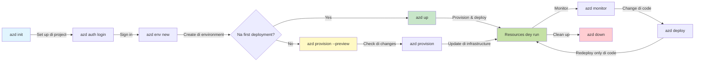
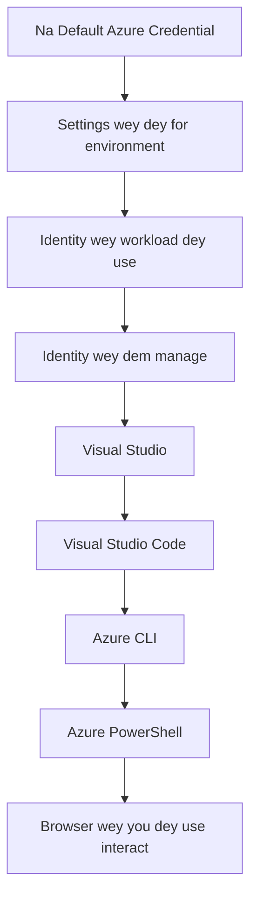

# AZD Basics - Wetin Azure Developer CLI mean

# AZD Basics - Main Concepts and Fundamentals

**Chapter Navigation:**
- **📚 Course Home**: [AZD For Beginners](../../README.md)
- **📖 Current Chapter**: Chapter 1 - Foundation & Quick Start
- **⬅️ Previous**: [Course Overview](../../README.md#-chapter-1-foundation--quick-start)
- **➡️ Next**: [Installation & Setup](installation.md)
- **🚀 Next Chapter**: [Chapter 2: AI-First Development](../chapter-02-ai-development/microsoft-foundry-integration.md)

## Introduction

Dis lesson go introduce you to Azure Developer CLI (azd), one powerful command-line tool wey dey help speed up how you go move from local development go Azure deployment. You go learn di basic concepts, core features, and understand how azd dey make cloud-native application deployment easy.

## Learning Goals

By di end of dis lesson, you go:
- Sabi wetin Azure Developer CLI be and wetin e dey do mainly
- Learn di main concepts of templates, environments, and services
- Explore key features like template-driven development and Infrastructure as Code
- Sabi di azd project structure and workflow
- Ready to install and configure azd for your development environment

## Learning Outcomes

After you finish dis lesson, you go fit:
- Explain di role of azd for modern cloud development workflows
- Identify components wey dey inside azd project structure
- Describe how templates, environments, and services dey work together
- Understand di benefits of Infrastructure as Code with azd
- Recognize different azd commands and wetin dem dey do

## What is Azure Developer CLI (azd)?

Azure Developer CLI (azd) na command-line tool wey dem design to make your journey from local development go Azure deployment faster. E dey simplify di process of building, deploying, and managing cloud-native applications on Azure.

### What Can You Deploy with azd?

azd support plenty workloads—and di list still dey grow. Today, you fit use azd deploy:

| Workload Type | Examples | Same Workflow? |
|---------------|----------|----------------|
| **Traditional applications** | Web apps, REST APIs, static sites | ✅ `azd up` |
| **Services and microservices** | Container Apps, Function Apps, multi-service backends | ✅ `azd up` |
| **AI-powered applications** | Chat apps with Microsoft Foundry Models, RAG solutions with AI Search | ✅ `azd up` |
| **Intelligent agents** | Foundry-hosted agents, multi-agent orchestrations | ✅ `azd up` |

Di main point be say **di azd lifecycle dey remain di same no matter wetin you dey deploy**. You go initialize project, provision infrastructure, deploy your code, monitor your app, and clean up—whether na simple website or one gbege AI agent.

Dis continuity na by design. azd dey treat AI capabilities as another kind of service wey your application fit use, no be something wey different for inside. One chat endpoint wey Microsoft Foundry Models dey power na, for azd perspective, just another service to configure and deploy.

### 🎯 Why Use AZD? A Real-World Comparison

Make we compare how to deploy simple web app with database:

#### ❌ WITHOUT AZD: Manual Azure Deployment (30+ minutes)

```bash
# Step 1: Make resource group
az group create --name myapp-rg --location eastus

# Step 2: Make App Service Plan
az appservice plan create --name myapp-plan \
  --resource-group myapp-rg \
  --sku B1 --is-linux

# Step 3: Make Web App
az webapp create --name myapp-web-unique123 \
  --resource-group myapp-rg \
  --plan myapp-plan \
  --runtime "NODE:18-lts"

# Step 4: Make Cosmos DB account (10-15 minutes)
az cosmosdb create --name myapp-cosmos-unique123 \
  --resource-group myapp-rg \
  --kind MongoDB

# Step 5: Make database
az cosmosdb mongodb database create \
  --account-name myapp-cosmos-unique123 \
  --resource-group myapp-rg \
  --name tododb

# Step 6: Make collection
az cosmosdb mongodb collection create \
  --account-name myapp-cosmos-unique123 \
  --resource-group myapp-rg \
  --database-name tododb \
  --name todos

# Step 7: Get connection string
CONN_STR=$(az cosmosdb keys list \
  --name myapp-cosmos-unique123 \
  --resource-group myapp-rg \
  --type connection-strings \
  --query "connectionStrings[0].connectionString" -o tsv)

# Step 8: Set app settings
az webapp config appsettings set \
  --name myapp-web-unique123 \
  --resource-group myapp-rg \
  --settings MONGODB_URI="$CONN_STR"

# Step 9: Turn on logging
az webapp log config --name myapp-web-unique123 \
  --resource-group myapp-rg \
  --application-logging filesystem \
  --detailed-error-messages true

# Step 10: Set up Application Insights
az monitor app-insights component create \
  --app myapp-insights \
  --location eastus \
  --resource-group myapp-rg

# Step 11: Connect App Insights to Web App
INSTRUMENTATION_KEY=$(az monitor app-insights component show \
  --app myapp-insights \
  --resource-group myapp-rg \
  --query "instrumentationKey" -o tsv)

az webapp config appsettings set \
  --name myapp-web-unique123 \
  --resource-group myapp-rg \
  --settings APPINSIGHTS_INSTRUMENTATIONKEY="$INSTRUMENTATION_KEY"

# Step 12: Build di application locally
npm install
npm run build

# Step 13: Make deployment package
zip -r app.zip . -x "*.git*" "node_modules/*"

# Step 14: Deploy app
az webapp deployment source config-zip \
  --resource-group myapp-rg \
  --name myapp-web-unique123 \
  --src app.zip

# Step 15: Wait an pray say e go work 🙏
# (No automated validation, you go test am manually)
```

**Problems:**
- ❌ 15+ commands to remember and execute in order
- ❌ 30-45 minutes of manual work
- ❌ Easy to make mistakes (typos, wrong parameters)
- ❌ Connection strings exposed in terminal history
- ❌ No automated rollback if something fails
- ❌ Hard to replicate for team members
- ❌ Different every time (not reproducible)

#### ✅ WITH AZD: Automated Deployment (5 commands, 10-15 minutes)

```bash
# Step 1: Set up from di template
azd init --template todo-nodejs-mongo

# Step 2: Confirm say na you
azd auth login

# Step 3: Create di environment
azd env new dev

# Step 4: Preview di changes (no compulsory but dem recommend am)
azd provision --preview

# Step 5: Deploy everytin
azd up

# ✨ E don finish! Everytin don deploy, dem don configure am, an dem dey monitor am
```

**Benefits:**
- ✅ **5 commands** vs. 15+ manual steps
- ✅ **10-15 minutes** total time (mostly waiting for Azure)
- ✅ **Fewer manual mistakes** - consistent, template-driven workflow
- ✅ **Secure secret handling** - many templates use Azure-managed secret storage
- ✅ **Repeatable deployments** - same workflow every time
- ✅ **Fully reproducible** - same result every time
- ✅ **Team-ready** - anybody fit deploy with same commands
- ✅ **Infrastructure as Code** - version controlled Bicep templates
- ✅ **Built-in monitoring** - Application Insights configured automatically

### 📊 Time & Error Reduction

| Metric | Manual Deployment | AZD Deployment | Improvement |
|:-------|:------------------|:---------------|:------------|
| **Commands** | 15+ | 5 | 67% fewer |
| **Time** | 30-45 min | 10-15 min | 60% faster |
| **Error Rate** | ~40% | <5% | 88% reduction |
| **Consistency** | Low (manual) | 100% (automated) | Perfect |
| **Team Onboarding** | 2-4 hours | 30 minutes | 75% faster |
| **Rollback Time** | 30+ min (manual) | 2 min (automated) | 93% faster |

## Core Concepts

### Templates
Templates na di foundation of azd. Dem get:
- **Application code** - Your source code and dependencies
- **Infrastructure definitions** - Azure resources wey dem define for Bicep or Terraform
- **Configuration files** - Settings and environment variables
- **Deployment scripts** - Automated deployment workflows

### Environments
Environments mean different deployment targets:
- **Development** - For testing and development
- **Staging** - Pre-production environment
- **Production** - Live production environment

Each environment get im own:
- Azure resource group
- Configuration settings
- Deployment state

### Services
Services be di building blocks of your application:
- **Frontend** - Web applications, SPAs
- **Backend** - APIs, microservices
- **Database** - Data storage solutions
- **Storage** - File and blob storage

## Key Features

### 1. Template-Driven Development
```bash
# Check di templates wey dey
azd template list

# Start from wan template
azd init --template <template-name>
```

### 2. Infrastructure as Code
- **Bicep** - Azure's domain-specific language
- **Terraform** - Multi-cloud infrastructure tool
- **ARM Templates** - Azure Resource Manager templates

### 3. Integrated Workflows
```bash
# Finish di whole deployment workflow
azd up            # Provision + Deploy — na hands-off for di first time setup

# 🧪 NEW: See di infrastructure changes before deployment (SAFE)
azd provision --preview    # Simulate di infrastructure deployment without changing anything

azd provision     # Use this to create Azure resources when you update di infrastructure
azd deploy        # Deploy di application code or redeploy am after update
azd down          # Clean up di resources
```

#### 🛡️ Safe Infrastructure Planning with Preview
The `azd provision --preview` command na game-changer for safe deployments:
- **Dry-run analysis** - Shows wetin go be created, modified, or deleted
- **Zero risk** - No real changes go happen to your Azure environment
- **Team collaboration** - Fit share preview results before deployment
- **Cost estimation** - Know how resources go cost before you commit

```bash
# Example wey dey show how workflow go be
azd provision --preview           # See wetin go change
# Check di output, yarn wit di team
azd provision                     # Make di changes wit confidence
```

### 📊 Visual: AZD Development Workflow



**Workflow Explanation:**
1. **Init** - Start with template or new project
2. **Auth** - Authenticate with Azure
3. **Environment** - Create isolated deployment environment
4. **Preview** - 🆕 Always preview infrastructure changes first (safe practice)
5. **Provision** - Create/update Azure resources
6. **Deploy** - Push your application code
7. **Monitor** - Observe application performance
8. **Iterate** - Make changes and redeploy code
9. **Cleanup** - Remove resources when done

### 4. Environment Management
```bash
# Make and manage environment dem
azd env new <environment-name>
azd env select <environment-name>
azd env list
```

### 5. Extensions and AI Commands

azd dey use extension system to add capabilities wey pass di core CLI. Dis one dey especially useful for AI workloads:

```bash
# Show di extensions wey dey available
azd extension list

# Install di Foundry agents extension
azd extension install azure.ai.agents

# Set up AI agent project from di manifest
azd ai agent init -m agent-manifest.yaml

# Test agent wey don deploy (go show latency and time-to-first-byte)
azd ai agent invoke

# Start di MCP server for development wey AI dey help (Alpha)
azd mcp start
```

**The agent lifecycle, end to end.** Once you don install `azure.ai.agents`, one single workflow go carry you from idea to running, monitored agent. You no need all dis things on day one—just sabi say dem dey:

| Stage | Command | What it does |
|-------|---------|--------------|
| **Scaffold** | `azd ai agent init -m <manifest>` | Generate an agent project from a manifest |
| **Test** | `azd ai agent invoke` | Call the agent and view response timing |
| **Measure** | `azd ai agent eval generate` | Create an evaluation dataset for the agent |
| **Improve** | `azd ai agent optimize` | Optimize agent instructions against your data |
| **Inspect** | `azd ai agent endpoint show` | View the live endpoint configuration |
| **Clean up** | `azd ai agent delete` | Delete a hosted agent and all its versions |

> Extensions dey covered for detail inside [Chapter 2: AI-First Development](../chapter-02-ai-development/agents.md) and di [AZD AI CLI Commands](../chapter-08-production/production-ai-practices.md#azd-ai-cli-commands-and-extensions) reference.

## 📁 Project Structure

Typical azd project structure be:
```
my-app/
├── .azd/                    # azd configuration
│   └── config.json
├── .azure/                  # Azure deployment artifacts
├── .devcontainer/          # Development container config
├── .github/workflows/      # GitHub Actions
├── .vscode/               # VS Code settings
├── infra/                 # Infrastructure code
│   ├── main.bicep        # Main infrastructure template
│   ├── main.parameters.json
│   └── modules/          # Reusable modules
├── src/                  # Application source code
│   ├── api/             # Backend services
│   └── web/             # Frontend application
├── azure.yaml           # azd project configuration
└── README.md
```

## 🔧 Configuration Files

### azure.yaml
Di main project configuration file:
```yaml
name: my-awesome-app
metadata:
  template: my-template@1.0.0

services:
  web:
    project: ./src/web
    language: js
    host: appservice
  api:
    project: ./src/api
    language: js
    host: appservice

hooks:
  preprovision:
    shell: pwsh
    run: echo "Preparing to provision..."
```

### .azure/config.json
Environment-specific configuration:
```json
{
  "version": 1,
  "defaultEnvironment": "dev",
  "environments": {
    "dev": {
      "subscriptionId": "your-subscription-id",
      "location": "eastus"
    }
  }
}
```

## 🎪 Common Workflows with Hands-On Exercises

> **💡 Learning Tip:** Follow these exercises one by one to build your AZD skills step by step.

### 🎯 Exercise 1: Initialize Your First Project

**Goal:** Create AZD project and explore im structure

**Steps:**
```bash
# Use one template wey don prove say e dey work
azd init --template todo-nodejs-mongo

# Check the files wey dem generate
ls -la  # See all files, even di ones wey dem hide

# Key files wey dem create:
# - azure.yaml (main konfig)
# - infra/ (di infrastructure code)
# - src/ (di app code)
```

**✅ Success:** You get azure.yaml, infra/, and src/ directories

---

### 🎯 Exercise 2: Deploy to Azure

**Goal:** Complete end-to-end deployment

**Steps:**
```bash
# 1. Confirm say na you
az login && azd auth login

# 2. Create di environment
azd env new dev
azd env set AZURE_LOCATION eastus

# 3. Preview di changes (E BETTER)
azd provision --preview

# 4. Deploy everytin
azd up

# 5. Confirm say deployment don work
azd show    # See your app URL
```

**Expected Time:** 10-15 minutes  
**✅ Success:** Application URL open for browser

---

### 🎯 Exercise 3: Multiple Environments

**Goal:** Deploy to dev and staging

**Steps:**
```bash
# Dev don already dey, make staging
azd env new staging
azd env set AZURE_LOCATION westus2
azd up

# Shift between dem
azd env list
azd env select dev
```

**✅ Success:** Two separate resource groups for Azure Portal

---

### 🛡️ Clean Slate: `azd down --force --purge`

When you need to reset everything completely:

```bash
azd down --force --purge
```

**What it does:**
- `--force`: No confirmation prompts
- `--purge`: Deletes all local state and Azure resources

**Use when:**
- Deployment fail mid-way
- You dey switch projects
- You need fresh start

---

## 🎪 Original Workflow Reference

### Starting a New Project
```bash
# Method 1: Use di template wey don dey
azd init --template todo-nodejs-mongo

# Method 2: Start from di beginning
azd init

# Method 3: Use di current directory
azd init .
```

### Development Cycle
```bash
# Make di development environment ready
azd auth login
azd env new dev
azd env select dev

# Deploy everytin
azd up

# Make changes den redeploy
azd deploy

# Clean up when you don finish
azd down --force --purge # Di command for di Azure Developer CLI na **big reset** for your environment — e dey especially useful when you dey troubleshoot failed deployments, clean up orphaned resources, or prepare for fresh redeploy.
```

## Understanding `azd down --force --purge`
The `azd down --force --purge` command na powerful way to tear down your azd environment and all resources wey join am. Below na breakdown of wetin each flag dey do:
```
--force
```
- Skips confirmation prompts.
- Useful for automation or scripting where manual input no possible.
- Ensures teardown go continue without interruption, even if CLI detect inconsistencies.

```
--purge
```
Deletes **all associated metadata**, including:
Environment state
Local `.azure` folder
Cached deployment info
Prevents azd from "remembering" previous deployments, wey fit cause wahala like mismatched resource groups or stale registry references.


### Why use both?
When you don jam problem with `azd up` because of leftover state or partial deployments, dis combo go give you **clean slate**.

E dey especially helpful after you don manually delete resources for Azure portal or when you dey switch templates, environments, or resource group naming conventions.


### Managing Multiple Environments
```bash
# Make di staging environment
azd env new staging
azd env select staging
azd up

# Change back to dev
azd env select dev

# Compare di environments
azd env list
```

## 🔐 Authentication and Credentials

Sabi authentication dey important for successful azd deployments. Azure dey use different authentication methods, and azd dey leverage di same credential chain wey other Azure tools dey use.

### Azure CLI Authentication (`az login`)

Before you use azd, you gats authenticate with Azure. Di most common way na to use Azure CLI:

```bash
# Interactive login (e go open di browser)
az login

# Login wit one specific tenant
az login --tenant <tenant-id>

# Login wit service principal
az login --service-principal -u <app-id> -p <password> --tenant <tenant-id>

# Check how di current login status dey
az account show

# List subscriptions wey dey available
az account list --output table

# Set di default subscription
az account set --subscription <subscription-id>
```

### Authentication Flow
1. **Interactive Login**: E go open your default browser for authentication
2. **Device Code Flow**: For environment wey no get browser access
3. **Service Principal**: For automation and CI/CD scenarios
4. **Managed Identity**: For Azure-hosted applications

### DefaultAzureCredential Chain

`DefaultAzureCredential` na credential type wey make authentication easier by automatically trying many credential sources for a specific order:

#### Credential Chain Order


#### 1. Environment Variables
```bash
# Set di environment variables for di service principal
export AZURE_CLIENT_ID="<app-id>"
export AZURE_CLIENT_SECRET="<password>"
export AZURE_TENANT_ID="<tenant-id>"
```

#### 2. Workload Identity (Kubernetes/GitHub Actions)
Dey used automatically for:
- Azure Kubernetes Service (AKS) with Workload Identity
- GitHub Actions with OIDC federation
- Other federated identity scenarios

#### 3. Managed Identity
For Azure resources like:
- Virtual Machines
- App Service
- Azure Functions
- Container Instances

```bash
# Check if e dey run for Azure resource wey get managed identity
az account show --query "user.type" --output tsv
# E go return: "servicePrincipal" if dem dey use managed identity
```

#### 4. Developer Tools Integration
- **Visual Studio**: Automatically dey use signed-in account
- **VS Code**: Dey use Azure Account extension credentials
- **Azure CLI**: Dey use `az login` credentials (most common for local development)

### AZD Authentication Setup

```bash
# Method 1: Use Azure CLI (Na di one wey dem recommend for development)
az login
azd auth login  # E dey use di existing Azure CLI credentials

# Method 2: Sign in to azd direct
azd auth login --use-device-code  # For headless environments wey no get UI

# Method 3: Check if you don authenticate
azd auth login --check-status

# Method 4: Log out and sign in again
azd auth logout
azd auth login
```

### Authentication Best Practices

#### For Local Development
```bash
# 1. Login wit Azure CLI
az login

# 2. Make sure say na di correct subscription
az account show
az account set --subscription "Your Subscription Name"

# 3. Use azd wit di credentials wey already dey
azd auth login
```

#### For CI/CD Pipelines
```yaml
# GitHub Actions example
- name: Azure Login
  uses: azure/login@v1
  with:
    creds: ${{ secrets.AZURE_CREDENTIALS }}

- name: Deploy with azd
  run: |
    azd auth login --client-id ${{ secrets.AZURE_CLIENT_ID }} \
                    --client-secret ${{ secrets.AZURE_CLIENT_SECRET }} \
                    --tenant-id ${{ secrets.AZURE_TENANT_ID }}
    azd up --no-prompt
```

#### For Production Environments
- Make you use **Managed Identity** when you dey run on Azure resources
- Use **Service Principal** for automation scenarios
- No dey store credentials for code or configuration files
- Use **Azure Key Vault** for sensitive configuration

### Common Authentication Wahala and Solutions

#### Issue: "No subscription found"
```bash
# Di solution: make e be di default subscription
az account list --output table
az account set --subscription "<subscription-id>"
azd env set AZURE_SUBSCRIPTION_ID "<subscription-id>"
```

#### Issue: "Insufficient permissions"
```bash
# How to fix am: make sure say you check and give the roles wey dem need
az role assignment list --assignee $(az account show --query user.name --output tsv)

# Common roles wey dem need:
# - Contributor (to manage resource dem)
# - User Access Administrator (to assign role dem)
```

#### Issue: "Token expired"
```bash
# How to fix am: Make dem sign in again
az logout
az login
azd auth logout
azd auth login
```

### Authentication for Different Scenarios

#### Local Development
```bash
# Account wey person fit use for self improvement
az login
azd auth login
```

#### Team Development
```bash
# Use one specific tenant for di organization.
az login --tenant contoso.onmicrosoft.com
azd auth login
```

#### Multi-tenant Scenarios
```bash
# Change between tenants dem
az login --tenant tenant1.onmicrosoft.com
# Deploy go tenant 1
azd up

az login --tenant tenant2.onmicrosoft.com  
# Deploy go tenant 2
azd up
```

### Security Considerations

1. **Credential Storage**: No dey store credentials for source code
2. **Scope Limitation**: Use least-privilege principle for service principals
3. **Token Rotation**: Make you dey rotate service principal secrets regular
4. **Audit Trail**: Monitor authentication and deployment activities
5. **Network Security**: Use private endpoints when e possible

### Troubleshooting Authentication

```bash
# Find and fix authentication wahala
azd auth login --check-status
az account show
az account get-access-token

# Common diagnostic commands wey people dey use
whoami                          # Di current user context
az ad signed-in-user show      # Microsoft Entra ID user details
az group list                  # Test if you fit access resource
```

## Understanding `azd down --force --purge`

### Discovery
```bash
azd template list              # Dey browse templates
azd template show <template>   # Di template details
azd init --help               # Options wey you fit choose wen you dey start
```

### Project Management
```bash
azd show                     # Wetin project dey about
azd env list                # Environments wey dey available and di default wey dem pick
azd config show            # Settings wey dem configure
```

### Monitoring
```bash
azd monitor                  # Open di Azure portal monitoring
azd monitor --logs           # See di application logs
azd monitor --live           # See di live metrics
azd pipeline config          # Set up di CI/CD
```

## Best Practices

### 1. Use Meaningful Names
```bash
# Gud
azd env new production-east
azd init --template web-app-secure

# Make you no do am
azd env new env1
azd init --template template1
```

### 2. Leverage Templates
- Begin with templates wey dey already
- Customize am for wetin you need
- Create templates wey you fit reuse for your organization

### 3. Environment Isolation
- Use different environments for dev/staging/prod
- No deploy straight to production from your local machine
- Use CI/CD pipelines for production deployments

### 4. Configuration Management
- Use environment variables for sensitive data
- Keep configuration for version control
- Write down settings wey specific to each environment

## Learning Progression

### Beginner (Week 1-2)
1. Install azd and authenticate
2. Deploy a simple template
3. Understand how project dey organized
4. Learn basic commands (up, down, deploy)

### Intermediate (Week 3-4)
1. Customize templates
2. Manage multiple environments
3. Understand infrastructure code
4. Set up CI/CD pipelines

### Advanced (Week 5+)
1. Create custom templates
2. Advanced infrastructure patterns
3. Multi-region deployments
4. Enterprise-grade configurations

## Next Steps

**📖 Continue Chapter 1 Learning:**
- [Installation & Setup](installation.md) - Make you install azd and configure am
- [Your First Project](first-project.md) - Finish the hands-on tutorial
- [Configuration Guide](configuration.md) - Advanced configuration options

**🎯 Ready for Next Chapter?**
- [Chapter 2: AI-First Development](../chapter-02-ai-development/microsoft-foundry-integration.md) - Begin to build AI applications

## Additional Resources

- [Azure Developer CLI Overview](https://learn.microsoft.com/en-us/azure/developer/azure-developer-cli/)
- [Template Gallery](https://azure.github.io/awesome-azd/)
- [Community Samples](https://github.com/Azure-Samples)

---

## 🙋 Frequently Asked Questions

### General Questions

**Q: Wetin be the difference between AZD and Azure CLI?**

A: Azure CLI (`az`) na for managing individual Azure resources. AZD (`azd`) na for managing entire applications:

```bash
# Azure CLI - dey manage resources wey dey low level
az webapp create --name myapp --resource-group rg
az sql server create --name myserver --resource-group rg
# ...plenty more commands still dey needed

# AZD - dey manage things for application level
azd up  # E deploy whole app with all resources
```

**Make you reason am like this:**
- `az` = You dey operate individual Lego bricks
- `azd` = You dey work with complete Lego sets

---

**Q: I need sabi Bicep or Terraform to use AZD?**

A: No! Start with templates:
```bash
# Use di existing template - you no need sabi IaC
azd init --template todo-nodejs-mongo
azd up
```

You fit learn Bicep later to customize infrastructure. Templates dey provide working examples to learn from.

---

**Q: How much e go cost to run AZD templates?**

A: Cost dey different by template. Most development templates dey cost $50-150/month:

```bash
# See how e go cost before you deploy am
azd provision --preview

# Always clean up when you no dey use am
azd down --force --purge  # E dey remove all resources
```

**Pro tip:** Use free tiers where e dey available:
- App Service: F1 (Free) tier
- Microsoft Foundry Models: Azure OpenAI 50,000 tokens/month free
- Cosmos DB: 1000 RU/s free tier

---

**Q: Fit I use AZD with existing Azure resources?**

A: Yes, but e dey easier to start fresh. AZD dey work best when e manage the full lifecycle. For existing resources:

```bash
# Option 1: Import di resources wey don dey (advanced)
azd init
# Then change infra/ make e point to di resources wey don dey

# Option 2: Start fresh (na wetin we recommend)
azd init --template matching-your-stack
azd up  # E go create new environment
```

---

**Q: How I go share my project with teammates?**

A: Commit the AZD project to Git (but NOT the .azure folder):

```bash
# E don dey for .gitignore as default
.azure/        # E get secret things and environment data
*.env          # Variables wey dey for environment

# People wey dey the team den:
git clone <your-repo>
azd auth login
azd env new <their-name>-dev
azd up
```

Everybody go get identical infrastructure from the same templates.

---

### Troubleshooting Questions

**Q: "azd up" fail halfway. Wetin I go do?**

A: Check the error, fix am, then try again:

```bash
# Check di detailed logs
azd show

# Fixes wey dey common:

# 1. If quota don pass:
azd env set AZURE_LOCATION "westus2"  # Try another region

# 2. If resource name dey conflict:
azd down --force --purge  # Start again from scratch
azd up  # Try again

# 3. If auth don expire:
az login
azd auth login
azd up
```

**Most common issue:** Wrong Azure subscription selected
```bash
az account list --output table
az account set --subscription "<correct-subscription>"
```

---

**Q: How I deploy only code changes without reprovisioning?**

A: Use `azd deploy` instead of `azd up`:

```bash
azd up          # Di first time: set up + deploy (slow)

# Change di code...

azd deploy      # Di next times: deploy only (fast)
```

Speed comparison:
- `azd up`: 10-15 minutes (provisions infrastructure)
- `azd deploy`: 2-5 minutes (code only)

---

**Q: Fit I customize the infrastructure templates?**

A: Yes! Edit the Bicep files in `infra/`:

```bash
# After you don run azd init
cd infra/
code main.bicep  # Change am for VS Code

# See di changes
azd provision --preview

# Apply di changes
azd provision
```

**Tip:** Start small - change SKUs first:
```bicep
// infra/main.bicep
sku: {
  name: 'B1'  // Change to 'P1V2' for production
}
```

---

**Q: How I fit delete everything we AZD create?**

A: One command go remove all resources:

```bash
azd down --force --purge

# Dis go delete:
# - All di Azure resources
# - Di resource group
# - Di local environment state
# - Di cached deployment data
```

**Always run this when:**
- You don finish testing a template
- You dey switch to different project
- You wan start fresh

**Cost savings:** Deleting unused resources = $0 charges

---

**Q: Wetin if I mistakenly deleted resources for Azure Portal?**

A: AZD state fit get out of sync. Do clean slate approach:

```bash
# 1. Comot local state
azd down --force --purge

# 2. Start again from scratch
azd up

# Alternative: Make AZD detect and fix am
azd provision  # E go create any resource wey dey missing
```

---

### Advanced Questions

**Q: Fit I use AZD in CI/CD pipelines?**

A: Yes! GitHub Actions example:

```yaml
# .github/workflows/deploy.yml
name: Deploy with AZD

on:
  push:
    branches: [main]

jobs:
  deploy:
    runs-on: ubuntu-latest
    steps:
      - uses: actions/checkout@v2
      
      - name: Install azd
        run: curl -fsSL https://aka.ms/install-azd.sh | bash
      
      - name: Azure Login
        run: |
          azd auth login \
            --client-id ${{ secrets.AZURE_CLIENT_ID }} \
            --client-secret ${{ secrets.AZURE_CLIENT_SECRET }} \
            --tenant-id ${{ secrets.AZURE_TENANT_ID }}
      
      - name: Deploy
        run: azd up --no-prompt
```

---

**Q: How I handle secrets and sensitive data?**

A: AZD dey integrate with Azure Key Vault automatically:

```bash
# Secrets dem dey keep for Key Vault, no be for code
azd env set DATABASE_PASSWORD "$(openssl rand -base64 32)"

# AZD dey do am automatically:
# 1. E go create Key Vault
# 2. E go store secret
# 3. E go give app access through Managed Identity
# 4. E go inject am for runtime
```

**Never commit:**
- `.azure/` folder (dey contain environment data)
- `.env` files (local secrets)
- Connection strings

---

**Q: Fit I deploy to multiple regions?**

A: Yes, create environment per region:

```bash
# East US area
azd env new prod-eastus
azd env set AZURE_LOCATION eastus
azd up

# West Europe area
azd env new prod-westeurope
azd env set AZURE_LOCATION westeurope
azd up

# Each environment dey independent
azd env list
```

For real multi-region apps, customize Bicep templates so dem go deploy to multiple regions at once.

---

**Q: Where I fit get help if I stuck?**

1. **AZD Documentation:** https://learn.microsoft.com/azure/developer/azure-developer-cli/
2. **GitHub Issues:** https://github.com/Azure/azure-dev/issues
3. **Discord:** [Azure Discord](https://discord.gg/microsoft-azure) - #azure-developer-cli channel
4. **Stack Overflow:** Tag `azure-developer-cli`
5. **This Course:** [Troubleshooting Guide](../chapter-07-troubleshooting/common-issues.md)

**Pro tip:** Before you ask, run:
```bash
azd show       # Dey show di current state
azd version    # Dey show di version wey you get
```
Include this info in your question so dem go fit help you faster.

---

## 🎓 Wetin Next?

You don sabi AZD fundamentals. Choose your path:

### 🎯 For Beginners:
1. **Next:** [Installation & Setup](installation.md) - Install AZD on your machine
2. **Then:** [Your First Project](first-project.md) - Deploy your first app
3. **Practice:** Complete all 3 exercises in this lesson

### 🚀 For AI Developers:
1. **Skip to:** [Chapter 2: AI-First Development](../chapter-02-ai-development/microsoft-foundry-integration.md)
2. **Deploy:** Start with `azd init --template get-started-with-ai-chat`
3. **Learn:** Build as you deploy

### 🏗️ For Experienced Developers:
1. **Review:** [Configuration Guide](configuration.md) - Advanced settings
2. **Explore:** [Infrastructure as Code](../chapter-04-infrastructure/provisioning.md) - Bicep deep dive
3. **Build:** Create custom templates for your stack

---

**Chapter Navigation:**
- **📚 Course Home**: [AZD For Beginners](../../README.md)
- **📖 Current Chapter**: Chapter 1 - Foundation & Quick Start  
- **⬅️ Previous**: [Course Overview](../../README.md#-chapter-1-foundation--quick-start)
- **➡️ Next**: [Installation & Setup](installation.md)
- **🚀 Next Chapter**: [Chapter 2: AI-First Development](../chapter-02-ai-development/microsoft-foundry-integration.md)

---

<!-- CO-OP TRANSLATOR DISCLAIMER START -->
**Disclaimer**:
Dis document don translate wit AI translation service [Co-op Translator](https://github.com/Azure/co-op-translator). Even tho we dey try make am correct, abeg make you know say automated translation fit get errors or mistakes. Di original document for dia own language na im be di correct source. For important info, make person wey sabi human translation do am. We no go responsible for any misunderstanding or wrong understanding wey fit happen because of dis translation.
<!-- CO-OP TRANSLATOR DISCLAIMER END -->