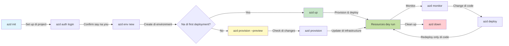
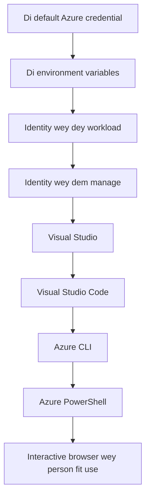

# AZD Basics - Wetin Azure Developer CLI (azd) be

# AZD Basics - Di Main Tin Dem (Core Concepts & Fundamentals)

**How to waka for chapters:**
- **📚 Course Home**: [AZD For Beginners](../../README.md)
- **📖 Current Chapter**: Chapter 1 - Foundation & Quick Start
- **⬅️ Previous**: [Course Overview](../../README.md#-chapter-1-foundation--quick-start)
- **➡️ Next**: [Installation & Setup](installation.md)
- **🚀 Next Chapter**: [Chapter 2: AI-First Development](../chapter-02-ai-development/microsoft-foundry-integration.md)

## Introduction

Dis lesson go show you Azure Developer CLI (azd), na powerful command-line tool wey dey speed up your waka from local development go Azure deployment. You go learn di basic concepts, main features, an how azd dey make cloud-native application deployment easy.

## Learning Goals

By di end of dis lesson, you go:
- Understand wetin Azure Developer CLI be and wetin e dey do mainly
- Learn di main concepts of templates, environments, an services
- Explore key features like template-driven development an Infrastructure as Code
- Understand di azd project structure an workflow
- Ready to install an configure azd for your development environment

## Learning Outcomes

After you finish dis lesson, you go fit:
- Explain di role of azd for modern cloud development workflows
- Identify di components of an azd project structure
- Describe how templates, environments, an services dey work together
- Understand di benefits of Infrastructure as Code with azd
- Recognize different azd commands and wetin dem dey do

## What is Azure Developer CLI (azd)?

Azure Developer CLI (azd) na command-line tool wey dem design to fasten your waka from local development go Azure deployment. E simplify di process of building, deploying, an managing cloud-native applications on Azure.

### What Can You Deploy with azd?

azd dey support plenty workloads—and di list still dey grow. Today, you fit use azd to deploy:

| Kain Workload | Examples | Na di same workflow? |
|---------------|----------|---------------------|
| **Traditional applications** | Web apps, REST APIs, static sites | ✅ `azd up` |
| **Services and microservices** | Container Apps, Function Apps, multi-service backends | ✅ `azd up` |
| **AI-powered applications** | Chat apps with Microsoft Foundry Models, RAG solutions with AI Search | ✅ `azd up` |
| **Intelligent agents** | Foundry-hosted agents, multi-agent orchestrations | ✅ `azd up` |

Di main point be say **di azd lifecycle remain di same no matter wetin you dey deploy**. You go initialize project, provision infrastructure, deploy your code, monitor your app, an clean up—whether na small website or one big AI agent.

Dis continuity na by design. azd dey treat AI capabilities as another kind of service wey your application fit use, no be something wey different. A chat endpoint wey Microsoft Foundry Models dey back na, for azd eye, just another service to configure an deploy.

### 🎯 Why Use AZD? A Real-World Comparison

Make we compare how to deploy simple web app with database:

#### ❌ WITHOUT AZD: Manual Azure Deployment (30+ minutes)

```bash
# Step 1: Make resource group
az group create --name myapp-rg --location eastus

# Step 2: Make App Service Plan
az appservice plan create --name myapp-plan \
  --resource-group myapp-rg \
  --sku B1 --is-linux

# Step 3: Make Web App
az webapp create --name myapp-web-unique123 \
  --resource-group myapp-rg \
  --plan myapp-plan \
  --runtime "NODE:18-lts"

# Step 4: Make Cosmos DB account (10-15 minutes)
az cosmosdb create --name myapp-cosmos-unique123 \
  --resource-group myapp-rg \
  --kind MongoDB

# Step 5: Make database
az cosmosdb mongodb database create \
  --account-name myapp-cosmos-unique123 \
  --resource-group myapp-rg \
  --name tododb

# Step 6: Make collection
az cosmosdb mongodb collection create \
  --account-name myapp-cosmos-unique123 \
  --resource-group myapp-rg \
  --database-name tododb \
  --name todos

# Step 7: Grab connection string
CONN_STR=$(az cosmosdb keys list \
  --name myapp-cosmos-unique123 \
  --resource-group myapp-rg \
  --type connection-strings \
  --query "connectionStrings[0].connectionString" -o tsv)

# Step 8: Set up app settings
az webapp config appsettings set \
  --name myapp-web-unique123 \
  --resource-group myapp-rg \
  --settings MONGODB_URI="$CONN_STR"

# Step 9: Turn on logging
az webapp log config --name myapp-web-unique123 \
  --resource-group myapp-rg \
  --application-logging filesystem \
  --detailed-error-messages true

# Step 10: Set up Application Insights
az monitor app-insights component create \
  --app myapp-insights \
  --location eastus \
  --resource-group myapp-rg

# Step 11: Connect App Insights to Web App
INSTRUMENTATION_KEY=$(az monitor app-insights component show \
  --app myapp-insights \
  --resource-group myapp-rg \
  --query "instrumentationKey" -o tsv)

az webapp config appsettings set \
  --name myapp-web-unique123 \
  --resource-group myapp-rg \
  --settings APPINSIGHTS_INSTRUMENTATIONKEY="$INSTRUMENTATION_KEY"

# Step 12: Build app locally
npm install
npm run build

# Step 13: Make deployment package
zip -r app.zip . -x "*.git*" "node_modules/*"

# Step 14: Deploy app
az webapp deployment source config-zip \
  --resource-group myapp-rg \
  --name myapp-web-unique123 \
  --src app.zip

# Step 15: Wait and pray say e go work 🙏
# (No automatic validation, you go need test am by hand)
```

**Wahala dem:**
- ❌ 15+ commands wey you gats remember an run for correct order
- ❌ 30-45 minutes manual work
- ❌ E easy to make mistakes (typos, wrong parameters)
- ❌ Connection strings fit show for terminal history
- ❌ No automatic rollback if mata spoil
- ❌ E hard to replicate for team members
- ❌ Different every time (no fit reproduce)

#### ✅ WITH AZD: Automated Deployment (5 commands, 10-15 minutes)

```bash
# Step 1: Make am ready wit template
azd init --template todo-nodejs-mongo

# Step 2: Confirm say na you
azd auth login

# Step 3: Make di environment
azd env new dev

# Step 4: Preview di changes (no mandatory but e dey recommended)
azd provision --preview

# Step 5: Deploy everytin
azd up

# ✨ Done! Everytin don deploy, dem don set am up and dem dey monitor am
```

**Wetin you gain:**
- ✅ **5 commands** vs. 15+ manual steps
- ✅ **10-15 minutes** total time (most na waiting for Azure)
- ✅ **Fewer manual mistakes** - consistent, template-driven workflow
- ✅ **Secure secret handling** - many templates dey use Azure-managed secret storage
- ✅ **Repeatable deployments** - same workflow every time
- ✅ **Fully reproducible** - same result every time
- ✅ **Team-ready** - anybody fit deploy with same commands
- ✅ **Infrastructure as Code** - version controlled Bicep templates
- ✅ **Built-in monitoring** - Application Insights dey configure automatically

### 📊 Time & Error Reduction

| Metric | Manual Deployment | AZD Deployment | Improvement |
|:-------|:------------------|:---------------|:------------|
| **Commands** | 15+ | 5 | 67% fewer |
| **Time** | 30-45 min | 10-15 min | 60% faster |
| **Error Rate** | ~40% | <5% | 88% reduction |
| **Consistency** | Low (manual) | 100% (automated) | Perfect |
| **Team Onboarding** | 2-4 hours | 30 minutes | 75% faster |
| **Rollback Time** | 30+ min (manual) | 2 min (automated) | 93% faster |

## Core Concepts

### Templates
Templates na di foundation for azd. Dem get:
- **Application code** - Your source code an dependencies
- **Infrastructure definitions** - Azure resources wey dem define for Bicep or Terraform
- **Configuration files** - Settings an environment variables
- **Deployment scripts** - Automated deployment workflows

### Environments
Environments mean different deployment targets:
- **Development** - For testing an development
- **Staging** - Pre-production environment
- **Production** - Live production environment

Each environment get im own:
- Azure resource group
- Configuration settings
- Deployment state

### Services
Services na di building blocks of your application:
- **Frontend** - Web applications, SPAs
- **Backend** - APIs, microservices
- **Database** - Data storage solutions
- **Storage** - File and blob storage

## Key Features

### 1. Template-Driven Development
```bash
# Look through templates wey dey
azd template list

# Start from one template
azd init --template <template-name>
```

### 2. Infrastructure as Code
- **Bicep** - Azure domain-specific language
- **Terraform** - Multi-cloud infrastructure tool
- **ARM Templates** - Azure Resource Manager templates

### 3. Integrated Workflows
```bash
# Di full deployment workflow
azd up            # Provision + Deploy — dis na hands-off tin for di first time setup

# 🧪 NEW: See wetin go change for infrastructure before you deploy (SAFE)
azd provision --preview    # Run fake deployment for infrastructure without changing anything

azd provision     # Create Azure resources — if you update di infrastructure, use dis
azd deploy        # Deploy app code or redeploy am after you update
azd down          # Remove resources we no need
```

#### 🛡️ Safe Infrastructure Planning with Preview
The `azd provision --preview` command na game-changer for safe deployments:
- **Dry-run analysis** - Shows wetin go be created, modified, or deleted
- **Zero risk** - No actual changes dey made to your Azure environment
- **Team collaboration** - Fit share preview results before deployment
- **Cost estimation** - Know resource costs before you commit

```bash
# Workflow wey dey show example preview
azd provision --preview           # See wetin go change
# Check di output, yarn wit di team
azd provision                     # Apply di changes wit confidence
```

### 📊 Visual: AZD Development Workflow


**Workflow Explanation:**
1. **Init** - Start with template or create new project
2. **Auth** - Authenticate with Azure
3. **Environment** - Create isolated deployment environment
4. **Preview** - 🆕 Always preview infrastructure changes first (safe practice)
5. **Provision** - Create/update Azure resources
6. **Deploy** - Push your application code
7. **Monitor** - Watch application performance
8. **Iterate** - Make changes and redeploy code
9. **Cleanup** - Remove resources when you don finish

### 4. Environment Management
```bash
# Make and manage environment dem
azd env new <environment-name>
azd env select <environment-name>
azd env list
```

### 5. Extensions and AI Commands

azd dey use extension system to add capabilities wey pass di core CLI. Dis one dey specially useful for AI workloads:

```bash
# List di extensions wey dey available
azd extension list

# Install di Foundry agents extension
azd extension install azure.ai.agents

# Set up AI agent project from manifest
azd ai agent init -m agent-manifest.yaml

# Start di MCP server for development wey AI dey help (Alpha)
azd mcp start
```

> Extensions dem dey cover for detail inside [Chapter 2: AI-First Development](../chapter-02-ai-development/agents.md) an di [AZD AI CLI Commands](../chapter-08-production/production-ai-practices.md#azd-ai-cli-commands-and-extensions) reference.

## 📁 Project Structure

Typical azd project structure be like:
```
my-app/
├── .azd/                    # azd configuration
│   └── config.json
├── .azure/                  # Azure deployment artifacts
├── .devcontainer/          # Development container config
├── .github/workflows/      # GitHub Actions
├── .vscode/               # VS Code settings
├── infra/                 # Infrastructure code
│   ├── main.bicep        # Main infrastructure template
│   ├── main.parameters.json
│   └── modules/          # Reusable modules
├── src/                  # Application source code
│   ├── api/             # Backend services
│   └── web/             # Frontend application
├── azure.yaml           # azd project configuration
└── README.md
```

## 🔧 Configuration Files

### azure.yaml
Di main project configuration file:
```yaml
name: my-awesome-app
metadata:
  template: my-template@1.0.0

services:
  web:
    project: ./src/web
    language: js
    host: appservice
  api:
    project: ./src/api
    language: js
    host: appservice

hooks:
  preprovision:
    shell: pwsh
    run: echo "Preparing to provision..."
```

### .azure/config.json
Environment-specific configuration:
```json
{
  "version": 1,
  "defaultEnvironment": "dev",
  "environments": {
    "dev": {
      "subscriptionId": "your-subscription-id",
      "location": "eastus"
    }
  }
}
```

## 🎪 Common Workflows with Hands-On Exercises

> **💡 Learning Tip:** Do di exercises in order so dat you go build your AZD skills step-by-step.

### 🎯 Exercise 1: Initialize Your First Project

**Goal:** Create an AZD project and check im structure

**Steps:**
```bash
# Use template wey don prove say e dey work
azd init --template todo-nodejs-mongo

# Check the files wey dem generate
ls -la  # See all files, even di hidden ones

# Key files wey dem create:
# - azure.yaml (main konfig)
# - infra/ (infra code)
# - src/ (app code)
```

**✅ Success:** You get azure.yaml, infra/, an src/ directories

---

### 🎯 Exercise 2: Deploy to Azure

**Goal:** Complete end-to-end deployment

**Steps:**
```bash
# 1. Make you sign in
az login && azd auth login

# 2. Set up di environment
azd env new dev
azd env set AZURE_LOCATION eastus

# 3. Preview di changes (we dey recommend am)
azd provision --preview

# 4. Make everything go live
azd up

# 5. Check say di deployment correct
azd show    # See di URL wey your app get
```

**Expected Time:** 10-15 minutes  
**✅ Success:** Application URL go open for browser

---

### 🎯 Exercise 3: Multiple Environments

**Goal:** Deploy to dev and staging

**Steps:**
```bash
# Dev don dey already, create staging
azd env new staging
azd env set AZURE_LOCATION westus2
azd up

# Switch between dem
azd env list
azd env select dev
```

**✅ Success:** Two separate resource groups for Azure Portal

---

### 🛡️ Clean Slate: `azd down --force --purge`

When you need to completely reset:

```bash
azd down --force --purge
```

**Wetin e dey do:**
- `--force`: No confirmation prompts
- `--purge`: Deletes all local state and Azure resources

**Use am when:**
- Deployment fail for middle
- You dey switch projects
- You need fresh start

---

## 🎪 Original Workflow Reference

### Starting a New Project
```bash
# Way 1: Use di template wey dey
azd init --template todo-nodejs-mongo

# Way 2: Start from scratch
azd init

# Way 3: Use di folder wey you dey now
azd init .
```

### Development Cycle
```bash
# Arrange di development environment
azd auth login
azd env new dev
azd env select dev

# Deploy everytin
azd up

# Make changes an redeploy
azd deploy

# Clear up wen you don finish
azd down --force --purge # Di command for the Azure Developer CLI na **big reset** for your environment—e dey especially useful wen you dey try fix deployments wey don fail, dey clean up resources wey dem leave, or dey ready for fresh redeploy
```

## Understanding `azd down --force --purge`
Di `azd down --force --purge` command na powerful way to completely tear down your azd environment and all resources wey join am. Below na breakdown of wetin each flag dey do:
```
--force
```
- E dey skip confirmation prompts.
- Useful for automation or scripting where manual input no dey possible.
- Make sure teardown continue without interruption, even if CLI detect some inconsistencies.

```
--purge
```
E dey delete **all associated metadata**, wey include:
Environment state
Local `.azure` folder
Cached deployment info
E go prevent azd from "remembering" previous deployments, wey fit cause wahala like mismatched resource groups or stale registry references.


### Why use both?
When you don jam wall with `azd up` because of lingering state or partial deployments, dis combo go give you **clean slate**.

E dey very helpful after you delete resources manually for Azure portal or when you dey switch templates, environments, or resource group naming conventions.


### Managing Multiple Environments
```bash
# Set up di staging environment
azd env new staging
azd env select staging
azd up

# Go back to dev
azd env select dev

# Compare di environments
azd env list
```

## 🔐 Authentication and Credentials

To sabi authentication dey important for successful azd deployments. Azure get different authentication methods, an azd dey use di same credential chain wey other Azure tools dey use.

### Azure CLI Authentication (`az login`)

Before you use azd, you need authenticate with Azure. Di common way na to use Azure CLI:

```bash
# Interactive login (e go open browser)
az login

# Login wit one tenant wey you choose
az login --tenant <tenant-id>

# Login wit di service principal
az login --service-principal -u <app-id> -p <password> --tenant <tenant-id>

# Check di current login status
az account show

# List all subscriptions wey dey available
az account list --output table

# Set di default subscription
az account set --subscription <subscription-id>
```

### Authentication Flow
1. **Interactive Login**: E go open your default browser make you authenticate
2. **Device Code Flow**: For environments wey no get browser access
3. **Service Principal**: For automation an CI/CD scenarios
4. **Managed Identity**: For Azure-hosted applications

### DefaultAzureCredential Chain

`DefaultAzureCredential` na credential type wey dey give simplified authentication experience by automatically trying many credential sources for specific order:

#### Credential Chain Order

#### 1. Environment Variables
```bash
# Set di environment variables for di service principal
export AZURE_CLIENT_ID="<app-id>"
export AZURE_CLIENT_SECRET="<password>"
export AZURE_TENANT_ID="<tenant-id>"
```

#### 2. Workload Identity (Kubernetes/GitHub Actions)
Dey used automatically for:
- Azure Kubernetes Service (AKS) with Workload Identity
- GitHub Actions with OIDC federation
- Other federated identity scenarios

#### 3. Managed Identity
For Azure resources like:
- Virtual Machines
- App Service
- Azure Functions
- Container Instances

```bash
# Check if e dey run for Azure resource wey get managed identity
az account show --query "user.type" --output tsv
# E go return: "servicePrincipal" if e dey use managed identity
```

#### 4. Developer Tools Integration
- **Visual Studio**: Automatically dey use signed-in account
- **VS Code**: Dey use Azure Account extension credentials
- **Azure CLI**: Dey use `az login` credentials (di commonest for local development)

### AZD Authentication Setup

```bash
# Method 1: Use Azure CLI (Na di one we dem recommend for development)
az login
azd auth login  # E dey use di existing Azure CLI credentials

# Method 2: Do azd authentication direct
azd auth login --use-device-code  # For environments wey no get GUI

# Method 3: Check di authentication status
azd auth login --check-status

# Method 4: Sign out, den sign in again
azd auth logout
azd auth login
```

### Authentication Best Practices

#### For Local Development
```bash
# 1. Log in wit Azure CLI
az login

# 2. Make sure say na di correct subscription
az account show
az account set --subscription "Your Subscription Name"

# 3. Use azd wit di credentials wey don already dey
azd auth login
```

#### For CI/CD Pipelines
```yaml
# GitHub Actions example
- name: Azure Login
  uses: azure/login@v1
  with:
    creds: ${{ secrets.AZURE_CREDENTIALS }}

- name: Deploy with azd
  run: |
    azd auth login --client-id ${{ secrets.AZURE_CLIENT_ID }} \
                    --client-secret ${{ secrets.AZURE_CLIENT_SECRET }} \
                    --tenant-id ${{ secrets.AZURE_TENANT_ID }}
    azd up --no-prompt
```

#### For Production Environments
- Use **Managed Identity** when you dey run on Azure resources
- Use **Service Principal** for automation scenarios
- No store credentials for code or configuration files
- Use **Azure Key Vault** for sensitive configuration

### Common Authentication Issues and Solutions

#### Issue: "No subscription found"
```bash
# Di solution: Make di subscription be di default
az account list --output table
az account set --subscription "<subscription-id>"
azd env set AZURE_SUBSCRIPTION_ID "<subscription-id>"
```

#### Issue: "Insufficient permissions"
```bash
# How to fix am: check and assign di roles wey dem need
az role assignment list --assignee $(az account show --query user.name --output tsv)

# Roles wey dem dey always need:
# - Contributor (to manage resource dem)
# - User Access Administrator (to assign role dem)
```

#### Issue: "Token expired"
```bash
# Wetin go solve am: Make you log in again
az logout
az login
azd auth logout
azd auth login
```

### Authentication in Different Scenarios

#### Local Development
```bash
# Account wey person dey use develop imself
az login
azd auth login
```

#### Team Development
```bash
# Use wan specific tenant for di organization
az login --tenant contoso.onmicrosoft.com
azd auth login
```

#### Multi-tenant Scenarios
```bash
# Switch between tenant dem
az login --tenant tenant1.onmicrosoft.com
# Deploy go tenant 1
azd up

az login --tenant tenant2.onmicrosoft.com  
# Deploy go tenant 2
azd up
```

### Security Considerations
1. **Where You Dey Keep Credentials**: No ever put credentials for source code
2. **Limit di Scope**: Make dem get only di minimum permission (least-privilege) for service principals
3. **Rotate Tokens**: Make una dey rotate service principal secrets regular
4. **Audit Trail**: Dey monitor authentication and deployment activities
5. **Network Security**: Use private endpoints if e possible

### How to fix authentication wahala

```bash
# Debug authentication wahala
azd auth login --check-status
az account show
az account get-access-token

# Commands wey dem dey use to check problems
whoami                          # User wey dey active now
az ad signed-in-user show      # Azure AD user info
az group list                  # Check if fit access resource
```

## Wetin `azd down --force --purge` mean

### How to find di problem
```bash
azd template list              # Browse template dem
azd template show <template>   # Template detail dem
azd init --help               # Options wey you fit use to start
```

### How to manage project
```bash
azd show                     # Project gist
azd env list                # Environments wey dey available and de one wey dem pick as default
azd config show            # Settings wey dem configure
```

### How to monitor
```bash
azd monitor                  # Open Azure portal make you check monitoring
azd monitor --logs           # See di application logs
azd monitor --live           # See di live metrics
azd pipeline config          # Set up CI/CD
```

## Best Practices

### 1. Use names wey get sense
```bash
# Gud
azd env new production-east
azd init --template web-app-secure

# No dey near
azd env new env1
azd init --template template1
```

### 2. Use Templates
- Begin with templates wey don already dey
- Customize for wetin you need
- Create reusable templates for your organization

### 3. Keep environments separate
- Make separate environments for dev/staging/prod
- No ever deploy directly to production from local machine
- Use CI/CD pipelines for production deployments

### 4. Configuration Management
- Use environment variables for sensitive data
- Keep configuration for version control
- Document environment-specific settings

## How to learn step by step

### Beginner (Week 1-2)
1. Install azd and sign in
2. Deploy small template
3. Know how project structured
4. Learn basic commands (up, down, deploy)

### Intermediate (Week 3-4)
1. Customize templates
2. Manage multiple environments
3. Understand infrastructure code
4. Set up CI/CD pipelines

### Advanced (Week 5+)
1. Create custom templates
2. Advanced infrastructure patterns
3. Multi-region deployments
4. Enterprise-grade configurations

## Wetin next

**📖 Continue Learning Chapter 1:**
- [Installation & Setup](installation.md) - Make you install azd and configure am
- [Your First Project](first-project.md) - Complete hands-on tutorial
- [Configuration Guide](configuration.md) - Advanced configuration options

**🎯 You ready for next chapter?**
- [Chapter 2: AI-First Development](../chapter-02-ai-development/microsoft-foundry-integration.md) - Start to build AI applications

## More Resources

- [Azure Developer CLI Overview](https://learn.microsoft.com/en-us/azure/developer/azure-developer-cli/) - Short guide about Azure Developer CLI
- [Template Gallery](https://azure.github.io/awesome-azd/) - Gallery of templates
- [Community Samples](https://github.com/Azure-Samples) - Samples from community

---

## 🙋 Questions wey people dey ask often

### General Questions

**Q: Wetin be difference between AZD and Azure CLI?**

A: Azure CLI (`az`) na for managing individual Azure resources. AZD (`azd`) na for managing whole applications:

```bash
# Azure CLI - Manage resources wey dey low-level
az webapp create --name myapp --resource-group rg
az sql server create --name myserver --resource-group rg
# ...plenty more commands still dey needed

# AZD - Manage di application level
azd up  # E dey deploy di whole app wit all resources
```

**Think of am like this:**
- `az` = You dey work with single Lego brick dem
- `azd` = You dey work with full Lego set dem

---

**Q: I need sabi Bicep or Terraform to use AZD?**

A: No! Start with templates:
```bash
# Use di existing template - no need to sabi IaC
azd init --template todo-nodejs-mongo
azd up
```

You fit learn Bicep later to customize infrastructure. Templates dey give working examples wey you fit learn from.

---

**Q: How much e go cost to run AZD templates?**

A: Cost dey change by template. Most development templates dey cost $50-150/month:

```bash
# See how much e go cost before you deploy
azd provision --preview

# Always clean up when you no dey use am
azd down --force --purge  # E go remove all di resources
```

**Pro tip:** Make una use free tiers where dem dey:
- App Service: F1 (Free) tier
- Microsoft Foundry Models: Azure OpenAI 50,000 tokens/month free
- Cosmos DB: 1000 RU/s free tier

---

**Q: Fit I use AZD with resources wey don already dey for Azure?**

A: Yes, but e easier to start fresh. AZD dey work best when e dey manage full lifecycle. For existing resources:
```bash
# Option 1: Bring in resources wey don dey (advanced)
azd init
# Den edit infra/ make e refer to di resources wey don dey

# Option 2: Start fresh (na di one wey we recommend)
azd init --template matching-your-stack
azd up  # E go create new environment
```

---

**Q: How I go share my project with teammates?**

A: Commit the AZD project to Git (but NO put the .azure folder):
```bash
# E don dey for .gitignore by default
.azure/        # E get sekrits and environment data
*.env          # Environment variables

# Team members den:
git clone <your-repo>
azd auth login
azd env new <their-name>-dev
azd up
```

Everybody go get identical infrastructure from the same templates.

---

### Troubleshooting Questions

**Q: "azd up" fail for middle. Wetin I go do?**

A: Check the error, fix am, then retry:
```bash
# See di full logs
azd show

# Normal ways to fix:

# 1. If quota don pass:
azd env set AZURE_LOCATION "westus2"  # Try for another region

# 2. If resource name dey conflict:
azd down --force --purge  # Start from scratch
azd up  # Try again

# 3. If auth don expire:
az login
azd auth login
azd up
```

**Most common issue:** Wrong Azure subscription selected
```bash
az account list --output table
az account set --subscription "<correct-subscription>"
```

---

**Q: How I go deploy just code changes without reprovisioning?**

A: Use `azd deploy` instead of `azd up`:
```bash
azd up          # Di first taim: set up + deploy (slow)

# Change di code...

azd deploy      # After dat: just deploy (fast)
```

Comparison of speed:
- `azd up`: 10-15 minutes (e dey provision infrastructure)
- `azd deploy`: 2-5 minutes (code only)

---

**Q: Fit I customize the infrastructure templates?**

A: Yes! Edit the Bicep files for `infra/`:
```bash
# After you don run azd init
cd infra/
code main.bicep  # Change am for VS Code

# See di changes first
azd provision --preview

# Apply di changes
azd provision
```

**Tip:** Start small - change SKUs first:
```bicep
// infra/main.bicep
sku: {
  name: 'B1'  // Change to 'P1V2' for production
}
```

---

**Q: How I go delete everything we AZD create?**

A: One command go remove all resources:
```bash
azd down --force --purge

# Dis dey delete:
# - All di Azure resources
# - Di resource group
# - Di local environment state
# - Di cached deployment data
```

**Always run this when:**
- You don finish testing a template
- You dey switch to another project
- You want start fresh

**Cost savings:** If you delete unused resources, charges go be $0

---

**Q: Wetin if I accidentally delete resources for Azure Portal?**

A: AZD state fit comot from sync. Clean slate approach:
```bash
# 1. Comot local state
azd down --force --purge

# 2. Start again
azd up

# Alternative: Make AZD detect an fix am
azd provision  # E go create di resources wey dey missing
```

---

### Advanced Questions

**Q: Fit I use AZD for CI/CD pipelines?**

A: Yes! GitHub Actions example:
```yaml
# .github/workflows/deploy.yml
name: Deploy with AZD

on:
  push:
    branches: [main]

jobs:
  deploy:
    runs-on: ubuntu-latest
    steps:
      - uses: actions/checkout@v2
      
      - name: Install azd
        run: curl -fsSL https://aka.ms/install-azd.sh | bash
      
      - name: Azure Login
        run: |
          azd auth login \
            --client-id ${{ secrets.AZURE_CLIENT_ID }} \
            --client-secret ${{ secrets.AZURE_CLIENT_SECRET }} \
            --tenant-id ${{ secrets.AZURE_TENANT_ID }}
      
      - name: Deploy
        run: azd up --no-prompt
```

---

**Q: How I go handle secrets and sensitive data?**

A: AZD dey integrate with Azure Key Vault automatically:
```bash
# Secrets dem dey keep for Key Vault, no for code
azd env set DATABASE_PASSWORD "$(openssl rand -base64 32)"

# AZD dey do am automatic:
# 1. E go create Key Vault
# 2. E go store secret
# 3. E go give app access via Managed Identity
# 4. E go inject am for runtime
```

**Never commit:**
- `.azure/` folder (contains environment data)
- `.env` files (local secrets)
- Connection strings

---

**Q: Fit I deploy to multiple regions?**

A: Yes, create environment per region:
```bash
# East side for US
azd env new prod-eastus
azd env set AZURE_LOCATION eastus
azd up

# West side for Europe
azd env new prod-westeurope
azd env set AZURE_LOCATION westeurope
azd up

# Each environment dey independent
azd env list
```

For true multi-region apps, customize Bicep templates to deploy to multiple regions at the same time.

---

**Q: Where I fit get help if I stuck?**

1. **AZD Documentation:** https://learn.microsoft.com/azure/developer/azure-developer-cli/
2. **GitHub Issues:** https://github.com/Azure/azure-dev/issues
3. **Discord:** [Azure Discord](https://discord.gg/microsoft-azure) - #azure-developer-cli channel
4. **Stack Overflow:** Tag `azure-developer-cli`
5. **This Course:** [Troubleshooting Guide](../chapter-07-troubleshooting/common-issues.md)

**Pro tip:** Before you ask, run:
```bash
azd show       # Dey show di current state
azd version    # Dey show di version wey you get
```
Include this info for your question make dem fit help you faster.

---

## 🎓 Wetin Next?

Now you don sabi AZD basics. Choose wetin you go do:

### 🎯 For Beginners:
1. **Next:** [Installation & Setup](installation.md) - Install AZD for your machine
2. **Then:** [Your First Project](first-project.md) - Deploy your first app
3. **Practice:** Do all 3 exercises for this lesson

### 🚀 For AI Developers:
1. **Skip to:** [Chapter 2: AI-First Development](../chapter-02-ai-development/microsoft-foundry-integration.md)
2. **Deploy:** Start with `azd init --template get-started-with-ai-chat`
3. **Learn:** Build as you deploy

### 🏗️ For Experienced Developers:
1. **Review:** [Configuration Guide](configuration.md) - Advanced settings
2. **Explore:** [Infrastructure as Code](../chapter-04-infrastructure/provisioning.md) - Bicep deep dive
3. **Build:** Create custom templates for your stack

---

**Chapter Navigation:**
- **📚 Course Home**: [AZD For Beginners](../../README.md)
- **📖 Current Chapter**: Chapter 1 - Foundation & Quick Start  
- **⬅️ Previous**: [Course Overview](../../README.md#-chapter-1-foundation--quick-start)
- **➡️ Next**: [Installation & Setup](installation.md)
- **🚀 Next Chapter**: [Chapter 2: AI-First Development](../chapter-02-ai-development/microsoft-foundry-integration.md)

---

<!-- CO-OP TRANSLATOR DISCLAIMER START -->
**Disclaimer**:
Dis document don translate wit AI translation service [Co-op Translator](https://github.com/Azure/co-op-translator). Even though we dey try make am correct, abeg note say automated translations fit get errors or inaccuracies. Di original document for im original language na di authoritative source wey you suppose rely on. For critical information, we recommend say una use professional human translation. We no dey liable for any misunderstandings or misinterpretations wey fit arise from di use of this translation.
<!-- CO-OP TRANSLATOR DISCLAIMER END -->