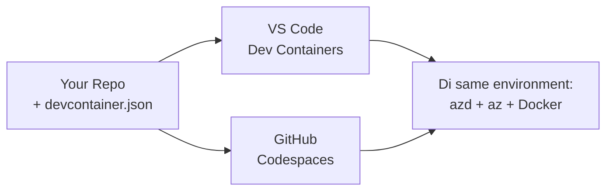

# Dev Containers & GitHub Codespaces for azd

**Chapter Navigation:**
- **📚 Course Home**: [AZD For Beginners](../../README.md)
- **📖 Current Chapter**: Chapter 1 - Foundation & Quick Start
- **⬅️ Previous**: [Bring Your Own App](bring-your-own-app.md)
- **🚀 Next Chapter**: [Chapter 2: AI-First Development](../chapter-02-ai-development/README.md)

> Dem validate am wit `azd 1.25.6` for June 2026.

## Introduction

To install azd, correct language runtime, Docker, and the Azure CLI for every machine na big wahala—and na why plenty tutorials wey “e dey work for my machine” no dey work for other people. One **dev container** dey solve dis mata by dey describe your full toolchain for one file. Anybody wey open the project for VS Code or GitHub Codespaces go get the exact same environment, with azd don install already. Dis lesson go show you how to add one.

## Learning Goals

By the end of this lesson, you go:
- Understand wetin dev container be and why e dey help with azd
- Add small `.devcontainer/devcontainer.json` to one project
- Include azd, the Azure CLI, and Docker via Dev Container *features*
- Open the project for GitHub Codespaces or VS Code

## Learning Outcomes

After you finish this lesson, you go fit:
- Write `devcontainer.json` for an azd project
- Add azd and Azure tools without to install dem by hand
- Run `azd up` from inside container or Codespace

---

## What Is a Dev Container?

One dev container na Docker-based development environment wey dey defined by `.devcontainer/devcontainer.json` file for your repo. When you open the project:

- **VS Code** (with the Dev Containers extension) go build the container and attach to am.
- **GitHub Codespaces** go build the same container for cloud and give you browser-based editor.

Either way, every contributor go get identical tools—no more “you don install azd?” troubleshooting.



---

## Step 1: Create the devcontainer File

Create `.devcontainer/devcontainer.json` for root of your project:

```json
{
  "name": "azd-project",
  "image": "mcr.microsoft.com/devcontainers/base:bookworm",
  "features": {
    "ghcr.io/devcontainers/features/azure-cli:1": {},
    "ghcr.io/azure/azure-dev/azd:latest": {},
    "ghcr.io/devcontainers/features/docker-in-docker:2": {},
    "ghcr.io/devcontainers/features/node:1": {}
  },
  "customizations": {
    "vscode": {
      "extensions": [
        "ms-azuretools.azure-dev",
        "ms-azuretools.vscode-bicep"
      ]
    }
  },
  "forwardPorts": [3000],
  "postCreateCommand": "azd version"
}
```

Wetin each part dey do:

| Key | Purpose |
|-----|---------|
| `image` | The base OS for the container |
| `features` | Prebuilt installers—here: Azure CLI, **azd**, Docker, and Node.js |
| `customizations.vscode.extensions` | Auto-installs the azd and Bicep VS Code extensions |
| `forwardPorts` | Exposes your app's port to your browser |
| `postCreateCommand` | Runs once after the container is built (here, a sanity check) |

> The `ghcr.io/azure/azure-dev/azd:latest` feature na the official way to get azd for a container. If you need reproducible setup, pin one specific version (for example `azd:1.25.6`).

---

## Step 2: Match the Feature to Your App's Language

Change the `node` feature to the one wey your app dey use:

```jsonc
// Python project
"ghcr.io/devcontainers/features/python:1": {},

// .NET project
"ghcr.io/devcontainers/features/dotnet:2": {},

// Java project
"ghcr.io/devcontainers/features/java:1": {},

// Go project
"ghcr.io/devcontainers/features/go:1": {}
```

Keep `docker-in-docker` if your `host` na `containerapp`, `aks`, or anything wey go build a container image—azd need Docker to build and push images.

---

## Step 3: Open It

**In VS Code:**
1. Install the **Dev Containers** extension.
2. Open the project folder.
3. Click **Reopen in Container** when prompt show (or run *Dev Containers: Reopen in Container*).

**In GitHub Codespaces:**
1. Push the repo to GitHub.
2. Click **Code → Codespaces → Create codespace on main**.
3. Wait make the container build—azd go ready inside the terminal.

---

## Step 4: Deploy From Inside the Container

The container don already get azd, so the normal workflow go just work:

```bash
azd auth login --use-device-code   # device code dey useful inside Codespaces
azd up
```

> **Why `--use-device-code`?** For remote container or Codespace no get local browser wey go redirect, so device-code login na the reliable way. You go paste one code for browser tab to finish sign-in.

---

## Common Pitfalls

| Pitfall | Fix |
|---------|-----|
| `azd up` can't build an image | Add the `docker-in-docker` feature |
| Browser login hangs in Codespaces | Use `azd auth login --use-device-code` |
| Tools differ between teammates | Pin feature versions (e.g. `azd:1.25.6`) |
| App not reachable in browser | Add the port to `forwardPorts` |

---

## Summary

- Dev container dey make your azd toolchain reproducible for everybody.
- Add azd, the Azure CLI, and Docker through Dev Container *features*.
- Match the language feature to your app and keep `docker-in-docker` for container hosts.
- Use device-code login when you dey run inside Codespaces.

---

## 🔗 Navigation

| Direction | Resource |
|-----------|----------|
| **Previous** | [Bring Your Own App](bring-your-own-app.md) |
| **Chapter Home** | [Chapter 1: Foundation & Quick Start](README.md) |
| **Next Chapter** | [Chapter 2: AI-First Development](../chapter-02-ai-development/README.md) |

## 📖 Related Resources

- [Installation & Setup](installation.md)
- [Command Cheat Sheet](../../resources/cheat-sheet.md)
- [Official Dev Containers specification](https://containers.dev/)
- [azd Dev Container feature](https://github.com/Azure/azure-dev/tree/main/ext/devcontainer)

---

<!-- CO-OP TRANSLATOR DISCLAIMER START -->
**Disclaimer**:
Dis document don translate wit AI translation service [Co-op Translator](https://github.com/Azure/co-op-translator). Even tho we dey try make am correct, abeg make you know say automated translation fit get errors or mistakes. Di original document for dia own language na im be di correct source. For important info, make person wey sabi human translation do am. We no go responsible for any misunderstanding or wrong understanding wey fit happen because of dis translation.
<!-- CO-OP TRANSLATOR DISCLAIMER END -->