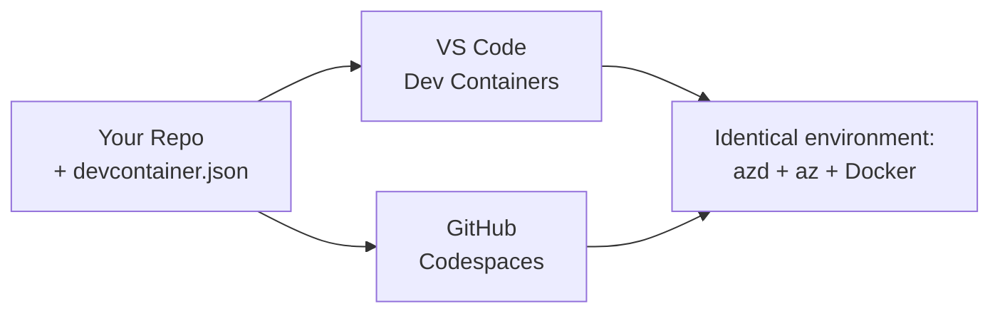

# Dev Containers & GitHub Codespaces for azd

**Chapter Navigation:**
- **📚 Course Home**: [AZD For Beginners](../../README.md)
- **📖 Current Chapter**: Chapter 1 - Foundation & Quick Start
- **⬅️ Previous**: [Bring Your Own App](bring-your-own-app.md)
- **🚀 Next Chapter**: [Chapter 2: AI-First Development](../chapter-02-ai-development/README.md)

> Validated against `azd 1.27.1` in July 2026.

## Introduction

Installing azd, di correct language runtime, Docker, and di Azure CLI for every machine na wahala—an e be di number-one reason why tutorial wey “work for my machine” no go work for someone else. One **dev container** dey solve dis one by describing your whole toolchain for inside one file. Anyone wey open di project for VS Code or GitHub Codespaces go get di exact same environment, wit azd don already install. Dis lesson go show you how to add one.

## Learning Goals

By di end of dis lesson, you go:
- Understand wetin dev container be and why e dey help wit azd
- Add one small `.devcontainer/devcontainer.json` to project
- Include azd, di Azure CLI, and Docker through Dev Container *features*
- Open di project for GitHub Codespaces or VS Code

## Learning Outcomes

After you finish dis lesson, you go fit:
- Write one `devcontainer.json` for azd project
- Add azd and Azure tools without to install manually
- Run `azd up` from inside container or Codespace

---

## Wetin Be Dev Container?

Dev container na Docker-based development environment wey you define with `.devcontainer/devcontainer.json` file for your repo. When you open di project:

- **VS Code** (wit di Dev Containers extension) go build di container and attach to am.
- **GitHub Codespaces** go build di same container for cloud and give you browser-based editor.

Either way, every contributor go get di same tools—no need to ask "you don install azd?"



---

## Step 1: Create di devcontainer File

Create `.devcontainer/devcontainer.json` for di root of your project:

```json
{
  "name": "azd-project",
  "image": "mcr.microsoft.com/devcontainers/base:bookworm",
  "features": {
    "ghcr.io/devcontainers/features/azure-cli:1": {},
    "ghcr.io/azure/azure-dev/azd:latest": {},
    "ghcr.io/devcontainers/features/docker-in-docker:2": {},
    "ghcr.io/devcontainers/features/node:1": {}
  },
  "customizations": {
    "vscode": {
      "extensions": [
        "ms-azuretools.azure-dev",
        "ms-azuretools.vscode-bicep"
      ]
    }
  },
  "forwardPorts": [3000],
  "postCreateCommand": "azd version"
}
```

Wetin each part dey do:

| Key | Purpose |
|-----|---------|
| `image` | Di base OS for di container |
| `features` | Prebuilt installers—here: Azure CLI, **azd**, Docker, and Node.js |
| `customizations.vscode.extensions` | Auto-install di azd and Bicep VS Code extensions |
| `forwardPorts` | Make your app port dey accessible for your browser |
| `postCreateCommand` | Run once after container build (here, na to check say everytin dey okay) |

> Di `ghcr.io/azure/azure-dev/azd:latest` feature na di official way to get azd inside container. You fit pin one specific version (example `azd:1.27.1`) if you want make e repeat exactly same way.

---

## Step 2: Match di Feature to Your App Language

Change di `node` feature to wetin your app dey use:

```jsonc
// Python project
"ghcr.io/devcontainers/features/python:1": {},

// .NET project
"ghcr.io/devcontainers/features/dotnet:2": {},

// Java project
"ghcr.io/devcontainers/features/java:1": {},

// Go project
"ghcr.io/devcontainers/features/go:1": {}
```

Make sure you keep `docker-in-docker` if your `host` na `containerapp`, `aks`, or anything wey dey build container image—azd need Docker to build and push images.

---

## Step 3: Open Am

**For VS Code:**
1. Install **Dev Containers** extension.
2. Open di project folder.
3. Click **Reopen in Container** when e ask you (or run *Dev Containers: Reopen in Container*).

**For GitHub Codespaces:**
1. Push di repo go GitHub.
2. Click **Code → Codespaces → Create codespace on main**.
3. Wait make container build finish—azd go ready for terminal.

---

## Step 4: Deploy From Inside Container

Di container get azd wey don already install, so di normal workflow go just work:

```bash
azd auth login --use-device-code   # device code dey handy inside Codespaces
azd up
```

> **Why `--use-device-code`?** For remote container or Codespace, no local browser dey to redirect you, so device-code login na di sure way. You go paste one code for browser tab to finish sign-in.

---

## Common Pitfalls

| Pitfall | How to Fix am |
|---------|-----|
| `azd up` no fit build image | Add di `docker-in-docker` feature |
| Browser login dey hang for Codespaces | Use `azd auth login --use-device-code` |
| Tools different between teammates | Pin feature versions (e.g. `azd:1.27.1`) |
| App no fit reach for browser | Add di port to `forwardPorts` |

---

## Summary

- Dev container go make your azd toolchain fit repeat for everybody.
- Add azd, di Azure CLI, and Docker through Dev Container *features*.
- Match di language feature to your app and keep `docker-in-docker` for container hosts.
- Use device-code login when you dey run inside Codespaces.

---

## 🔗 Navigation

| Direction | Resource |
|-----------|----------|
| **Previous** | [Bring Your Own App](bring-your-own-app.md) |
| **Chapter Home** | [Chapter 1: Foundation & Quick Start](README.md) |
| **Next Chapter** | [Chapter 2: AI-First Development](../chapter-02-ai-development/README.md) |

## 📖 Related Resources

- [Installation & Setup](installation.md)
- [Command Cheat Sheet](../../resources/cheat-sheet.md)
- [Official Dev Containers specification](https://containers.dev/)
- [azd Dev Container feature](https://github.com/Azure/azure-dev/tree/main/ext/devcontainer)

---

<!-- CO-OP TRANSLATOR DISCLAIMER START -->
**Disclaimer**:
Dis document don translate wit AI translation service [Co-op Translator](https://github.com/Azure/co-op-translator). Even tho we dey try make am correct, abeg make you know say automated translation fit get errors or mistakes. Di original document for dia own language na im be di correct source. For important info, make person wey sabi human translation do am. We no go responsible for any misunderstanding or wrong understanding wey fit happen because of dis translation.
<!-- CO-OP TRANSLATOR DISCLAIMER END -->