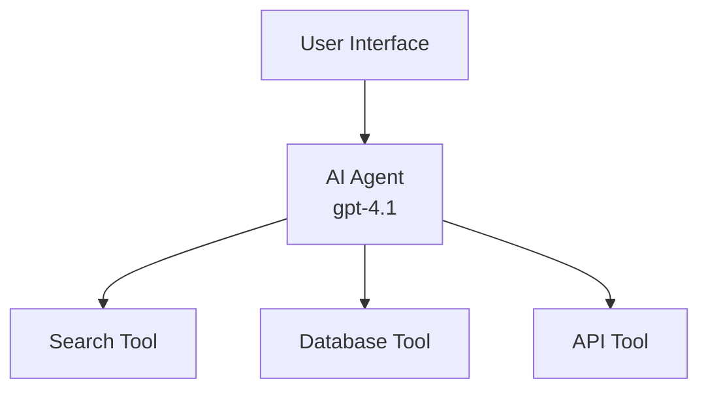
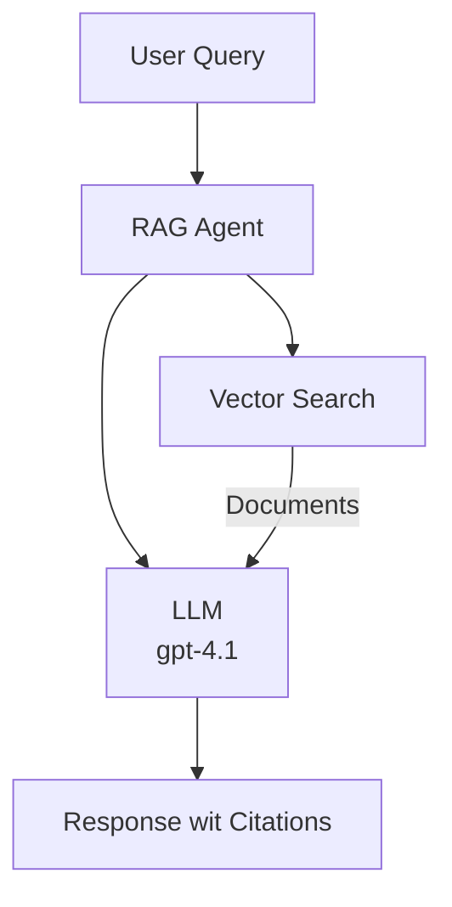
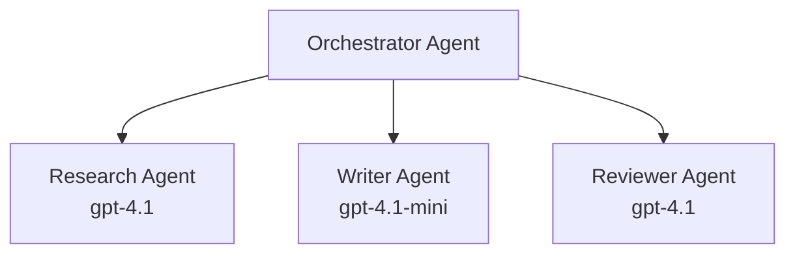

# AI Agents wit Azure Developer CLI

**Chapter Navigation:**
- **📚 Course Home**: [AZD For Beginners](../../README.md)
- **📖 Current Chapter**: Chapter 2 - AI-First Development
- **⬅️ Previous**: [Microsoft Foundry Integration](microsoft-foundry-integration.md)
- **➡️ Next**: [AI Model Deployment](ai-model-deployment.md)
- **🚀 Advanced**: [Multi-Agent Solutions](../../examples/retail-scenario.md)

---

## Introduction

AI agents na autonomous programs we fit sense their environment, make decisions, an take actions to achieve specific goals. Unlike simple chatbots wey dey only respond to prompts, agents fit:

- **Use tools** - Call APIs, search databases, execute code
- **Plan and reason** - Break complex tasks into steps
- **Learn from context** - Maintain memory and adapt behavior
- **Collaborate** - Work wit oda agents (multi-agent systems)

Dis guide go show you how to deploy AI agents to Azure using Azure Developer CLI (azd).

> **Validation note (2026-07-13):** Dis guide don check for `azd` `1.27.1` an `azure.ai.agents` `1.0.0-beta.5`. The `azd ai` experience still be preview, so check extension help if your installed flags different.

## Learning Goals

When you finish dis guide, you go:
- Understand wetin AI agents be and how dem differ from chatbots
- Deploy pre-built AI agent templates using AZD
- Configure Foundry Agents for custom agents
- Implement basic agent patterns (tool use, RAG, multi-agent)
- Monitor and debug deployed agents

## Learning Outcomes

When you finish am, you go fit:
- Deploy AI agent applications to Azure with one command
- Configure agent tools and capabilities
- Implement retrieval-augmented generation (RAG) wit agents
- Design multi-agent architectures for complex workflows
- Troubleshoot common agent deployment issues

---

## 🤖 Wetin Make Agent Different From Chatbot?

| Feature | Chatbot | AI Agent |
|---------|---------|----------|
| **Behavior** | Responds to prompts | Takes autonomous actions |
| **Tools** | None | Fit call APIs, search, execute code |
| **Memory** | Session-based only | Persistent memory across sessions |
| **Planning** | Single response | Multi-step reasoning |
| **Collaboration** | Single entity | Fit work wit oda agents |

### Simple Analogy

- **Chatbot** = Person wey dey help answer questions for information desk
- **AI Agent** = Personal assistant wey fit make calls, book appointments, and complete tasks for you

---

## 🚀 Quick Start: Deploy Your First Agent

### Option 1: Foundry Agents Template (Recommended)

```bash
# Set up di AI agents template
azd init --template get-started-with-ai-agents

# Put am for Azure
azd up
```

**Wetin go deploy:**
- ✅ Foundry Agents
- ✅ Microsoft Foundry Models (gpt-4.1)
- ✅ Azure AI Search (for RAG)
- ✅ Azure Container Apps (web interface)
- ✅ Application Insights (monitoring)

**Time:** ~15-20 minutes
**Cost:** ~$100-150/month (development)

### Option 2: OpenAI Agent with Prompty

```bash
# Start di Prompty-based agent template
azd init --template agent-openai-python-prompty

# Put am for Azure
azd up
```

**Wetin go deploy:**
- ✅ Azure Functions (serverless agent execution)
- ✅ Microsoft Foundry Models
- ✅ Prompty configuration files
- ✅ Sample agent implementation

**Time:** ~10-15 minutes
**Cost:** ~$50-100/month (development)

### Option 3: RAG Chat Agent

```bash
# Start RAG chat template
azd init --template azure-search-openai-demo

# Put am for Azure
azd up
```

**Wetin go deploy:**
- ✅ Microsoft Foundry Models
- ✅ Azure AI Search wit sample data
- ✅ Document processing pipeline
- ✅ Chat interface wit citations

**Time:** ~15-25 minutes
**Cost:** ~$80-150/month (development)

### Option 4: AZD AI Agent Init (Manifest- or Template-Based Preview)

If you get agent manifest file, you fit use `azd ai` command to scaffold Foundry Agent Service project directly. Recent preview releases add template-based initialization support, so exact prompt flow fit small different based on your installed extension version.

```bash
# Make you install di AI agents extension
azd extension install azure.ai.agents

# Optional: make you confirm di preview version wey you don install
azd extension show azure.ai.agents

# Start from an agent manifest
azd ai agent init -m agent-manifest.yaml

# Deploy am for Azure
azd up

# Test di agent wey you don deploy (e go show latency + time-to-first-byte)
azd ai agent invoke
```

**When to use `azd ai agent init` vs `azd init --template`:**

| Approach | Best For | How E Dey Work |
|----------|----------|--------------|
| `azd init --template` | Starting from working sample app | Clones full template repo wit code + infra |
| `azd ai agent init -m` | Building from your own agent manifest | Scaffolds project structure from your agent definition |

> **Tip:** Use `azd init --template` when you dey learn (Options 1-3 above). Use `azd ai agent init` when you dey build production agents with your own manifests.

After `azd up`, the same extension go carry you through rest of the agent lifecycle: `azd ai agent invoke` to test, `azd ai agent eval generate` and `azd ai agent optimize` to measure and improve quality, and `azd ai agent delete` to clean up. See [AZD AI CLI Commands](../chapter-08-production/production-ai-practices.md#azd-ai-cli-commands-and-extensions) for full reference.

---

## 🏗️ Agent Architecture Patterns

### Pattern 1: Single Agent wit Tools

Di simplest agent pattern - one agent wey fit use multiple tools.



**Best for:**
- Customer support bots
- Research assistants
- Data analysis agents

**AZD Template:** `azure-search-openai-demo`

### Pattern 2: RAG Agent (Retrieval-Augmented Generation)

Agent wey go find relevant documents before e go generate responses.



**Best for:**
- Enterprise knowledge bases
- Document Q&A systems
- Compliance and legal research

**AZD Template:** `azure-search-openai-demo`

### Pattern 3: Multi-Agent System

Multiple specialized agents dey work together on complex tasks.



**Best for:**
- Complex content generation
- Multi-step workflows
- Tasks wey need different expertise

**Learn More:** [Multi-Agent Coordination Patterns](../chapter-06-pre-deployment/coordination-patterns.md)

---

## ⚙️ Configuring Agent Tools

Agents dey powerful when dem fit use tools. Na so we go configure common tools:

### Tool Configuration in Foundry Agents

```python
# agent_config.py
from azure.ai.projects import AIProjectClient
from azure.ai.projects.models import FunctionTool, CodeInterpreterTool

# Define custom tools
search_tool = FunctionTool(
    name="search_knowledge_base",
    description="Search the company knowledge base for relevant documents",
    parameters={
        "type": "object",
        "properties": {
            "query": {
                "type": "string",
                "description": "The search query"
            }
        },
        "required": ["query"]
    }
)

# Create agent wit tools
agent = project_client.agents.create_agent(
    model="gpt-4.1",
    name="Support Agent",
    instructions="You are a helpful support agent. Use the search tool to find relevant information.",
    tools=[search_tool, CodeInterpreterTool()]
)
```

### Environment Configuration

```bash
# Arrange environment variables wey dey for agent only
azd env set AZURE_OPENAI_MODEL "gpt-4.1"
azd env set AGENT_INSTRUCTIONS "You are a helpful assistant..."
azd env set ENABLE_CODE_INTERPRETER "true"
azd env set ENABLE_FILE_SEARCH "true"

# Carry deploy wit updated configuration
azd deploy
```

---

## 📊 Monitoring Agents

### Application Insights Integration

All AZD agent templates get Application Insights inside for monitoring:

```bash
# Open moni-tor moni-dashboard
azd monitor --overview

# See live logs
azd monitor --logs

# See live metrics
azd monitor --live
```

### Key Metrics to Track

| Metric | Description | Target |
|--------|-------------|--------|
| Response Latency | Time wey e take to generate response | < 5 seconds |
| Token Usage | Tokens per request | Monitor for cost |
| Tool Call Success Rate | % of successful tool executions | > 95% |
| Error Rate | Failed agent requests | < 1% |
| User Satisfaction | Feedback scores | > 4.0/5.0 |

### Custom Logging for Agents

```python
import os
from azure.monitor.opentelemetry import configure_azure_monitor
from opentelemetry import trace

# Set up Azure Monitor wit OpenTelemetry
configure_azure_monitor(
    connection_string=os.environ["APPLICATIONINSIGHTS_CONNECTION_STRING"]
)

tracer = trace.get_tracer(__name__)

def log_agent_interaction(user_query, agent_response, tools_used, latency_ms):
    with tracer.start_as_current_span("agent_interaction") as span:
        span.set_attributes({
            "user_query": user_query,
            "response_length": len(agent_response),
            "tools_used": tools_used,
            "latency_ms": latency_ms
        })
```

> **Note:** Install na di packages wey dem require: `pip install azure-monitor-opentelemetry opentelemetry`

---

## 💰 Cost Considerations

### Estimated Monthly Costs by Pattern

| Pattern | Dev Environment | Production |
|---------|-----------------|------------|
| Single Agent | $50-100 | $200-500 |
| RAG Agent | $80-150 | $300-800 |
| Multi-Agent (2-3 agents) | $150-300 | $500-1,500 |
| Enterprise Multi-Agent | $300-500 | $1,500-5,000+ |

### Cost Optimization Tips

1. **Use gpt-4.1-mini for simple tasks**
   ```bash
   azd env set AZURE_OPENAI_MODEL "gpt-4.1-mini"
   ```

2. **Implement caching for repeated queries**
   ```python
   from functools import lru_cache
   
   @lru_cache(maxsize=1000)
   def get_cached_response(query_hash):
       return agent.run(query_hash)
   ```

3. **Set token limits per run**
   ```python
   # Set max_completion_tokens wen you dey run the agent, no be when you dey create am
   run = project_client.agents.create_run(
       thread_id=thread.id,
       agent_id=agent.id,
       max_completion_tokens=1000  # Make response length no too long
   )
   ```

4. **Scale to zero when not in use**
   ```bash
   # Container Apps go automatically scale reach zero
   azd env set MIN_REPLICAS "0"
   ```

---

## 🔧 Troubleshooting Agents

### Common Issues and Solutions

<details>
<summary><strong>❌ Agent no dey respond to tool calls</strong></summary>

```bash
# Make sure say di tools don register well well
azd show

# Confirm OpenAI deployment
az cognitiveservices account deployment list \
  --name $AZURE_OPENAI_NAME \
  --resource-group $RG_NAME

# Check di agent logs
azd monitor --logs
```

**Common causes:**
- Tool function signature no match
- Missing required permissions
- API endpoint no dey accessible
</details>

<details>
<summary><strong>❌ High latency in agent responses</strong></summary>

```bash
# Check Application Insights for bottlenecks
azd monitor --live

# Consider using a faster model
azd env set AZURE_OPENAI_MODEL "gpt-4.1-mini"
azd deploy
```

**Optimization tips:**
- Use streaming responses
- Implement response caching
- Reduce context window size
</details>

<details>
<summary><strong>❌ Agent dey return wrong or hallucinated info</strong></summary>

```python
# Make am beta wit beta system prompts
instructions = """
You are a helpful assistant. IMPORTANT:
- Only answer based on provided context
- If you don't know, say "I don't know"
- Always cite your sources
- Never make up information
"""

# Add retrieval for grounding
agent = project_client.agents.create_agent(
    model="gpt-4.1",
    instructions=instructions,
    tools=[FileSearchTool()]  # Ground responses for documents
)
```
</details>

<details>
<summary><strong>❌ Token limit exceeded errors</strong></summary>

```python
# Make sure say you dey manage context window well well
def truncate_context(messages, max_tokens=8000, model="gpt-4.1"):
    """Keep only recent messages within token limit."""
    import tiktoken
    encoding = tiktoken.encoding_for_model(model)
    total_tokens = 0
    truncated = []
    
    for msg in reversed(messages):
        msg_tokens = len(encoding.encode(msg.content))
        if total_tokens + msg_tokens > max_tokens:
            break
        truncated.insert(0, msg)
        total_tokens += msg_tokens
    
    return truncated
```
</details>

---

## 🎓 Hands-On Exercises

### Exercise 1: Deploy Basic Agent (20 minutes)

**Goal:** Deploy your first AI agent using AZD

```bash
# Step 1: Make template ready
azd init --template get-started-with-ai-agents

# Step 2: Login to Azure
azd auth login
# If you dey work across tenants, add --tenant-id <tenant-id>

# Step 3: Deploy am
azd up

# Step 4: Try test the agent
# Wetin you suppose see after deployment be say:
#   Deployment don finish!
#   Endpoint: https://<app-name>.<region>.azurecontainerapps.io
# Open di URL wey show for output and try ask question

# Step 5: Check di monitoring
azd monitor --overview

# Step 6: Clear everything up
azd down --force --purge
```

**Success Criteria:**
- [ ] Agent respond to questions
- [ ] Fit access monitoring dashboard via `azd monitor`
- [ ] Resources clean up well

### Exercise 2: Add Custom Tool (30 minutes)

**Goal:** Extend agent wit custom tool

1. Deploy agent template:
   ```bash
   azd init --template get-started-with-ai-agents
   azd up
   ```
2. Create new tool function for your agent code:
   ```python
   def get_weather(location: str) -> str:
       """Get current weather for a location."""
       # API call go di weather service
       return f"Weather in {location}: Sunny, 72°F"
   ```
3. Register the tool wit the agent:
   ```python
   from azure.ai.projects.models import FunctionTool

   weather_tool = FunctionTool(
       name="get_weather",
       description="Get current weather for a location",
       parameters={
           "type": "object",
           "properties": {
               "location": {"type": "string", "description": "City name"}
           },
           "required": ["location"]
       }
   )

   agent = project_client.agents.create_agent(
       model="gpt-4.1",
       name="Weather Agent",
       tools=[weather_tool]
   )
   ```
4. Redeploy an test:
   ```bash
   azd deploy
   # Ask: "How di weather be for Seattle?"
   # Expected: Agent go call get_weather("Seattle") and return weather info
   ```

**Success Criteria:**
- [ ] Agent sabi weather-related queries
- [ ] Tool dey call well
- [ ] Response get weather info

### Exercise 3: Build RAG Agent (45 minutes)

**Goal:** Build agent wey answer questions from your documents

```bash
# Step 1: Make RAG template ready
azd init --template azure-search-openai-demo
azd up

# Step 2: Upload your documents
# Put PDF/TXT files for data/ folder, den run:
python scripts/prepdocs.py

# Step 3: Try am wit questions wey concern di domain
# Open di web app URL wey come from azd up output
# Ask any question wey concern your uploaded documents
# Di answers suppose get citation like [doc.pdf] inside am
```

**Success Criteria:**
- [ ] Agent dey answer from uploaded documents
- [ ] Responses get citations
- [ ] No hallucination for out-of-scope questions

---

## 📚 Next Steps

Now wey you don understand AI agents, try these advanced topics:

| Topic | Description | Link |
|-------|-------------|------|
| **Multi-Agent Systems** | Build systems wit multiple collaborating agents | [Retail Multi-Agent Example](../../examples/retail-scenario.md) |
| **Coordination Patterns** | Learn orchestration and communication patterns | [Coordination Patterns](../chapter-06-pre-deployment/coordination-patterns.md) |
| **Production Deployment** | Enterprise-ready agent deployment | [Production AI Practices](../chapter-08-production/production-ai-practices.md) |
| **Agent Evaluation** | Test an evaluate agent performance | [AI Troubleshooting](../chapter-07-troubleshooting/ai-troubleshooting.md) |
| **AI Workshop Lab** | Hands-on: Make your AI solution AZD-ready | [AI Workshop Lab](ai-workshop-lab.md) |

---

## 📖 Additional Resources

### Official Documentation
- [Microsoft Foundry Agent Service](https://learn.microsoft.com/azure/ai-services/agents/)
- [Microsoft Foundry Agent Service Quickstart](https://learn.microsoft.com/azure/ai-services/agents/quickstart)
- [Semantic Kernel Agent Framework](https://learn.microsoft.com/semantic-kernel/)

### AZD Templates for Agents
- [Get Started with AI Agents](https://github.com/Azure-Samples/get-started-with-ai-agents)
- [Agent OpenAI Python Prompty](https://github.com/Azure-Samples/agent-openai-python-prompty)
- [Azure Search OpenAI Demo](https://github.com/Azure-Samples/azure-search-openai-demo)

### Community Resources
- [Awesome AZD - Agent Templates](https://azure.github.io/awesome-azd/?tags=ai-agents)
- [Azure AI Discord](https://discord.gg/microsoft-azure)
- [Microsoft Foundry Discord](https://discord.gg/nTYy5BXMWG)

### Agent Skills for Your Editor
- [**Microsoft Azure Agent Skills**](https://skills.sh/microsoft/github-copilot-for-azure) - Install reusable AI agent skills for Azure development in GitHub Copilot, Cursor, or any supported agent. Includes skills for [Azure AI](https://skills.sh/microsoft/github-copilot-for-azure/azure-ai), [Microsoft Foundry](https://skills.sh/microsoft/github-copilot-for-azure/microsoft-foundry), [deployment](https://skills.sh/microsoft/github-copilot-for-azure/azure-deploy), and [diagnostics](https://skills.sh/microsoft/github-copilot-for-azure/azure-diagnostics):
  ```bash
  npx skills add microsoft/github-copilot-for-azure
  ```

---

**Navigation**
- **Previous Lesson**: [Microsoft Foundry Integration](microsoft-foundry-integration.md)
- **Next Lesson**: [AI Model Deployment](ai-model-deployment.md)

---

<!-- CO-OP TRANSLATOR DISCLAIMER START -->
**Disclaimer**:
Dis document don translate wit AI translation service [Co-op Translator](https://github.com/Azure/co-op-translator). Even tho we dey try make am correct, abeg make you know say automated translation fit get errors or mistakes. Di original document for dia own language na im be di correct source. For important info, make person wey sabi human translation do am. We no go responsible for any misunderstanding or wrong understanding wey fit happen because of dis translation.
<!-- CO-OP TRANSLATOR DISCLAIMER END -->