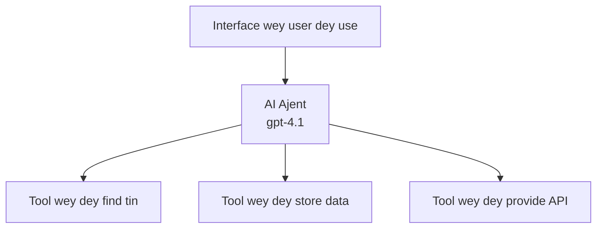
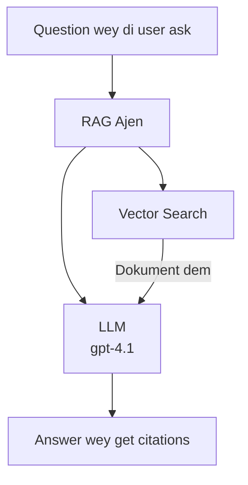
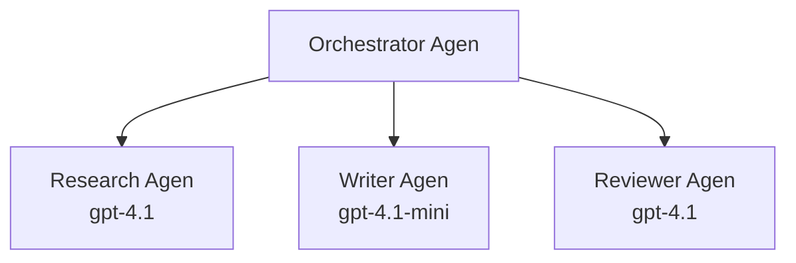

# AI Agents wit Azure Developer CLI

**Chapter Navigation:**
- **📚 Course Home**: [AZD For Beginners](../../README.md)
- **📖 Current Chapter**: Chapter 2 - AI-First Development
- **⬅️ Previous**: [Microsoft Foundry Integration](microsoft-foundry-integration.md)
- **➡️ Next**: [AI Model Deployment](ai-model-deployment.md)
- **🚀 Advanced**: [Multi-Agent Solutions](../../examples/retail-scenario.md)

---

## Introduction

AI agents na autonomous programs wey fit sense dia environment, make decisions, an take actions to achieve specific goals. No be like simple chatbots wey just dey respond to prompts, agents fit:

- **Use tools** - Call APIs, search databases, execute code
- **Plan and reason** - Break complex tasks into steps
- **Learn from context** - Maintain memory and adapt behaviour
- **Collaborate** - Work with other agents (multi-agent systems)

This guide go show you how to deploy AI agents to Azure using Azure Developer CLI (azd).

> **Validation note (2026-03-25):** This guide bin reviewed against `azd` `1.23.12` and `azure.ai.agents` `0.1.18-preview`. The `azd ai` experience still dey preview, so check extension help if your installed flags differ.

## Learning Goals

If you finish this guide, you go:
- Understand wetin AI agents be and how dem different from chatbots
- Deploy pre-built AI agent templates using AZD
- Configure Foundry Agents for custom agents
- Implement basic agent patterns (tool use, RAG, multi-agent)
- Monitor and debug deployed agents

## Learning Outcomes

After you finish, you go fit:
- Deploy AI agent applications to Azure with one command
- Configure agent tools and capabilities
- Implement retrieval-augmented generation (RAG) with agents
- Design multi-agent architectures for complex workflows
- Troubleshoot common agent deployment issues

---

## 🤖 Wetin Make Agent Different from Chatbot?

| Feature | Chatbot | AI Agent |
|---------|---------|----------|
| **Behavior** | Responds to prompts | Takes autonomous actions |
| **Tools** | None | Fit call APIs, search, execute code |
| **Memory** | Session-based only | Persistent memory across sessions |
| **Planning** | Single response | Multi-step reasoning |
| **Collaboration** | Single entity | Fit work with other agents |

### Simple Analogy

- **Chatbot** = One helpful person wey dey answer questions for information desk
- **AI Agent** = Personal assistant wey fit make calls, book appointments, an complete tasks for you

---

## 🚀 Quick Start: Deploy Your First Agent

### Option 1: Foundry Agents Template (Recommended)

```bash
# Set up di AI agents template
azd init --template get-started-with-ai-agents

# Deploy am for Azure
azd up
```

**Wetin go deploy:**
- ✅ Foundry Agents
- ✅ Microsoft Foundry Models (gpt-4.1)
- ✅ Azure AI Search (for RAG)
- ✅ Azure Container Apps (web interface)
- ✅ Application Insights (monitoring)

**Time:** ~15-20 minutes
**Cost:** ~$100-150/month (development)

### Option 2: OpenAI Agent with Prompty

```bash
# Start di agent template wey base for Prompty
azd init --template agent-openai-python-prompty

# Deploy am go Azure
azd up
```

**Wetin go deploy:**
- ✅ Azure Functions (serverless agent execution)
- ✅ Microsoft Foundry Models
- ✅ Prompty configuration files
- ✅ Sample agent implementation

**Time:** ~10-15 minutes
**Cost:** ~$50-100/month (development)

### Option 3: RAG Chat Agent

```bash
# Make di RAG chat template ready
azd init --template azure-search-openai-demo

# Deploy am go Azure
azd up
```

**Wetin go deploy:**
- ✅ Microsoft Foundry Models
- ✅ Azure AI Search with sample data
- ✅ Document processing pipeline
- ✅ Chat interface with citations

**Time:** ~15-25 minutes
**Cost:** ~$80-150/month (development)

### Option 4: AZD AI Agent Init (Manifest- or Template-Based Preview)

If you get agent manifest file, you fit use the `azd ai` command to scaffold a Foundry Agent Service project directly. Recent preview releases don also add template-based initialization support, so the exact prompt flow fit small change depending on your installed extension version.

```bash
# Install di AI agents extension
azd extension install azure.ai.agents

# Optional: check say di preview version wey you don install correct
azd extension show azure.ai.agents

# Set up from wan agent manifest
azd ai agent init -m agent-manifest.yaml

# Deploy go Azure
azd up
```

**When to use `azd ai agent init` vs `azd init --template`:**

| Approach | Best For | How It Works |
|----------|----------|------|
| `azd init --template` | Starting from a working sample app | Clones a full template repo with code + infra |
| `azd ai agent init -m` | Building from your own agent manifest | Scaffolds project structure from your agent definition |

> **Tip:** Use `azd init --template` when you dey learn (Options 1-3 above). Use `azd ai agent init` when you dey build production agents with your own manifests. See [AZD AI CLI Commands](../chapter-08-production/production-ai-practices.md#azd-ai-cli-commands-and-extensions) for full reference.

---

## 🏗️ Agent Architecture Patterns

### Pattern 1: Single Agent with Tools

The simplest agent pattern - one agent wey fit use multiple tools.


**Best for:**
- Customer support bots
- Research assistants
- Data analysis agents

**AZD Template:** `azure-search-openai-demo`

### Pattern 2: RAG Agent (Retrieval-Augmented Generation)

Agent wey go retrieve relevant documents before e go generate responses.


**Best for:**
- Enterprise knowledge bases
- Document Q&A systems
- Compliance and legal research

**AZD Template:** `azure-search-openai-demo`

### Pattern 3: Multi-Agent System

Plenty specialized agents wey dey work together on complex tasks.


**Best for:**
- Complex content generation
- Multi-step workflows
- Tasks wey need different expertise

**Learn More:** [Multi-Agent Coordination Patterns](../chapter-06-pre-deployment/coordination-patterns.md)

---

## ⚙️ Configuring Agent Tools

Agents go powerful when dem fit use tools. Na so you go configure common tools:

### Tool Configuration in Foundry Agents

```python
# agent_config.py
from azure.ai.projects import AIProjectClient
from azure.ai.projects.models import FunctionTool, CodeInterpreterTool

# Make di custom tools
search_tool = FunctionTool(
    name="search_knowledge_base",
    description="Search the company knowledge base for relevant documents",
    parameters={
        "type": "object",
        "properties": {
            "query": {
                "type": "string",
                "description": "The search query"
            }
        },
        "required": ["query"]
    }
)

# Make di agent wit di tools
agent = project_client.agents.create_agent(
    model="gpt-4.1",
    name="Support Agent",
    instructions="You are a helpful support agent. Use the search tool to find relevant information.",
    tools=[search_tool, CodeInterpreterTool()]
)
```

### Environment Configuration

```bash
# Set up environment variables wey particular to di agent
azd env set AZURE_OPENAI_MODEL "gpt-4.1"
azd env set AGENT_INSTRUCTIONS "You are a helpful assistant..."
azd env set ENABLE_CODE_INTERPRETER "true"
azd env set ENABLE_FILE_SEARCH "true"

# Deploy wit di updated configuration
azd deploy
```

---

## 📊 Monitoring Agents

### Application Insights Integration

All AZD agent templates get Application Insights for monitoring:

```bash
# Open di monitoring dashboard
azd monitor --overview

# Check di live logs
azd monitor --logs

# Check di live metrics
azd monitor --live
```

### Key Metrics to Track

| Metric | Description | Target |
|--------|-------------|--------|
| Response Latency | Time to generate response | < 5 seconds |
| Token Usage | Tokens per request | Monitor for cost |
| Tool Call Success Rate | % of successful tool executions | > 95% |
| Error Rate | Failed agent requests | < 1% |
| User Satisfaction | Feedback scores | > 4.0/5.0 |

### Custom Logging for Agents

```python
import os
from azure.monitor.opentelemetry import configure_azure_monitor
from opentelemetry import trace

# Set up Azure Monitor wit OpenTelemetry
configure_azure_monitor(
    connection_string=os.environ["APPLICATIONINSIGHTS_CONNECTION_STRING"]
)

tracer = trace.get_tracer(__name__)

def log_agent_interaction(user_query, agent_response, tools_used, latency_ms):
    with tracer.start_as_current_span("agent_interaction") as span:
        span.set_attributes({
            "user_query": user_query,
            "response_length": len(agent_response),
            "tools_used": tools_used,
            "latency_ms": latency_ms
        })
```

> **Note:** Install the required packages: `pip install azure-monitor-opentelemetry opentelemetry`

---

## 💰 Cost Considerations

### Estimated Monthly Costs by Pattern

| Pattern | Dev Environment | Production |
|---------|-----------------|------------|
| Single Agent | $50-100 | $200-500 |
| RAG Agent | $80-150 | $300-800 |
| Multi-Agent (2-3 agents) | $150-300 | $500-1,500 |
| Enterprise Multi-Agent | $300-500 | $1,500-5,000+ |

### Cost Optimization Tips

1. **Use gpt-4.1-mini for simple tasks**
   ```bash
   azd env set AZURE_OPENAI_MODEL "gpt-4.1-mini"
   ```

2. **Implement caching for repeated queries**
   ```python
   from functools import lru_cache
   
   @lru_cache(maxsize=1000)
   def get_cached_response(query_hash):
       return agent.run(query_hash)
   ```

3. **Set token limits per run**
   ```python
   # Make you set max_completion_tokens when you dey run di agent, no for when you dey create am
   run = project_client.agents.create_run(
       thread_id=thread.id,
       agent_id=agent.id,
       max_completion_tokens=1000  # Limit how long di response go be
   )
   ```

4. **Scale to zero when not in use**
   ```bash
   # Container Apps dey automatically scale go zero
   azd env set MIN_REPLICAS "0"
   ```

---

## 🔧 Troubleshooting Agents

### Common Issues and Solutions

<details>
<summary><strong>❌ Agent no dey respond to tool calls</strong></summary>

```bash
# Make sure say di tools don register well
azd show

# Confirm say OpenAI don deploy
az cognitiveservices account deployment list \
  --name $AZURE_OPENAI_NAME \
  --resource-group $RG_NAME

# Check di agent log dem
azd monitor --logs
```

**Common causes:**
- Tool function signature no match
- Missing required permissions
- API endpoint no dey accessible
</details>

<details>
<summary><strong>❌ High latency for agent responses</strong></summary>

```bash
# Make you check Application Insights for where things dey jam
azd monitor --live

# Try use faster model
azd env set AZURE_OPENAI_MODEL "gpt-4.1-mini"
azd deploy
```

**Optimization tips:**
- Use streaming responses
- Implement response caching
- Reduce context window size
</details>

<details>
<summary><strong>❌ Agent dey return wrong or hallucinated information</strong></summary>

```python
# Make am beta wit betta system prompts
instructions = """
You are a helpful assistant. IMPORTANT:
- Only answer based on provided context
- If you don't know, say "I don't know"
- Always cite your sources
- Never make up information
"""

# Add retrieval so e go fit ground
agent = project_client.agents.create_agent(
    model="gpt-4.1",
    instructions=instructions,
    tools=[FileSearchTool()]  # Make di responses base for documents
)
```
</details>

<details>
<summary><strong>❌ Token limit exceeded errors</strong></summary>

```python
# Make code wey go manage di context window
def truncate_context(messages, max_tokens=8000, model="gpt-4.1"):
    """Keep only recent messages within token limit."""
    import tiktoken
    encoding = tiktoken.encoding_for_model(model)
    total_tokens = 0
    truncated = []
    
    for msg in reversed(messages):
        msg_tokens = len(encoding.encode(msg.content))
        if total_tokens + msg_tokens > max_tokens:
            break
        truncated.insert(0, msg)
        total_tokens += msg_tokens
    
    return truncated
```
</details>

---

## 🎓 Hands-On Exercises

### Exercise 1: Deploy a Basic Agent (20 minutes)

**Goal:** Deploy your first AI agent using AZD

```bash
# Step 1: Set up di template
azd init --template get-started-with-ai-agents

# Step 2: Sign in to Azure
azd auth login
# If you dey work across tenants, add --tenant-id <tenant-id>

# Step 3: Deploy
azd up

# Step 4: Test di agent
# Wetin you go see after deployment:
#   Deployment don complete!
#   Endpoint: https://<app-name>.<region>.azurecontainerapps.io
# Open di URL wey dey for the output and try ask question

# Step 5: Check monitoring
azd monitor --overview

# Step 6: Clean up
azd down --force --purge
```

**Success Criteria:**
- [ ] Agent dey respond to questions
- [ ] Fit access monitoring dashboard via `azd monitor`
- [ ] Resources don clean up successfully

### Exercise 2: Add a Custom Tool (30 minutes)

**Goal:** Add one custom tool to your agent

1. Deploy the agent template:
   ```bash
   azd init --template get-started-with-ai-agents
   azd up
   ```
2. Create a new tool function for your agent code:
   ```python
   def get_weather(location: str) -> str:
       """Get current weather for a location."""
       # API call wey dey ask weather service
       return f"Weather in {location}: Sunny, 72°F"
   ```
3. Register the tool with the agent:
   ```python
   from azure.ai.projects.models import FunctionTool

   weather_tool = FunctionTool(
       name="get_weather",
       description="Get current weather for a location",
       parameters={
           "type": "object",
           "properties": {
               "location": {"type": "string", "description": "City name"}
           },
           "required": ["location"]
       }
   )

   agent = project_client.agents.create_agent(
       model="gpt-4.1",
       name="Weather Agent",
       tools=[weather_tool]
   )
   ```
4. Redeploy and test:
   ```bash
   azd deploy
   # Ask: "How the weather dey for Seattle?"
   # Wetin we expect: Agent go call get_weather("Seattle") come return weather info
   ```

**Success Criteria:**
- [ ] Agent sabi recognize weather-related queries
- [ ] Tool dey called correct
- [ ] Response get weather information

### Exercise 3: Build a RAG Agent (45 minutes)

**Goal:** Build agent wey answer questions from your documents

```bash
# Step 1: Deploy di RAG template
azd init --template azure-search-openai-demo
azd up

# Step 2: Upload your documents
# Put di PDF/TXT files for di data/ directory, den run:
python scripts/prepdocs.py

# Step 3: Test wit questions wey relate to your domain
# Open di web app URL wey come from di azd up output
# Ask questions about di documents wey you don upload
# Responses suppose include citation references like [doc.pdf]
```

**Success Criteria:**
- [ ] Agent dey answer from uploaded documents
- [ ] Responses get citations
- [ ] No hallucination for out-of-scope questions

---

## 📚 Next Steps

Now wey you don understand AI agents, explore these advanced topics:

| Topic | Description | Link |
|-------|-------------|------|
| **Multi-Agent Systems** | Build systems with multiple collaborating agents | [Retail Multi-Agent Example](../../examples/retail-scenario.md) |
| **Coordination Patterns** | Learn orchestration and communication patterns | [Coordination Patterns](../chapter-06-pre-deployment/coordination-patterns.md) |
| **Production Deployment** | Enterprise-ready agent deployment | [Production AI Practices](../chapter-08-production/production-ai-practices.md) |
| **Agent Evaluation** | Test and evaluate agent performance | [AI Troubleshooting](../chapter-07-troubleshooting/ai-troubleshooting.md) |
| **AI Workshop Lab** | Hands-on: Make your AI solution AZD-ready | [AI Workshop Lab](ai-workshop-lab.md) |

---

## 📖 Additional Resources

### Official Documentation
- [Azure AI Agent Service](https://learn.microsoft.com/azure/ai-services/agents/)
- [Azure AI Foundry Agent Service Quickstart](https://learn.microsoft.com/azure/ai-services/agents/quickstart)
- [Semantic Kernel Agent Framework](https://learn.microsoft.com/semantic-kernel/)

### AZD Templates for Agents
- [Get Started with AI Agents](https://github.com/Azure-Samples/get-started-with-ai-agents)
- [Agent OpenAI Python Prompty](https://github.com/Azure-Samples/agent-openai-python-prompty)
- [Azure Search OpenAI Demo](https://github.com/Azure-Samples/azure-search-openai-demo)

### Community Resources
- [Awesome AZD - Agent Templates](https://azure.github.io/awesome-azd/?tags=ai-agents)
- [Azure AI Discord](https://discord.gg/microsoft-azure)
- [Microsoft Foundry Discord](https://discord.gg/nTYy5BXMWG)

### Agent Skills for Your Editor
- [**Microsoft Azure Agent Skills**](https://skills.sh/microsoft/github-copilot-for-azure) - Install reusable AI agent skills for Azure development in GitHub Copilot, Cursor, or any supported agent. Includes skills for [Azure AI](https://skills.sh/microsoft/github-copilot-for-azure/azure-ai), [Microsoft Foundry](https://skills.sh/microsoft/github-copilot-for-azure/microsoft-foundry), [deployment](https://skills.sh/microsoft/github-copilot-for-azure/azure-deploy), and [diagnostics](https://skills.sh/microsoft/github-copilot-for-azure/azure-diagnostics):
  ```bash
  npx skills add microsoft/github-copilot-for-azure
  ```

---

**Navigation**
- **Previous Lesson**: [Microsoft Foundry Integration](microsoft-foundry-integration.md)
- **Next Lesson**: [AI Model Deployment](ai-model-deployment.md)

---

<!-- CO-OP TRANSLATOR DISCLAIMER START -->
**Disclaimer**:
Dis document don translate using AI translation service [Co-op Translator](https://github.com/Azure/co-op-translator). Even though we dey try make am accurate, abeg note say automated translations fit get mistakes or inaccuracies. The original document for im native language suppose be the authoritative source. For critical information, na professional human translation we dey recommend. We no dey liable for any misunderstanding or misinterpretation wey fit arise from the use of this translation.
<!-- CO-OP TRANSLATOR DISCLAIMER END -->