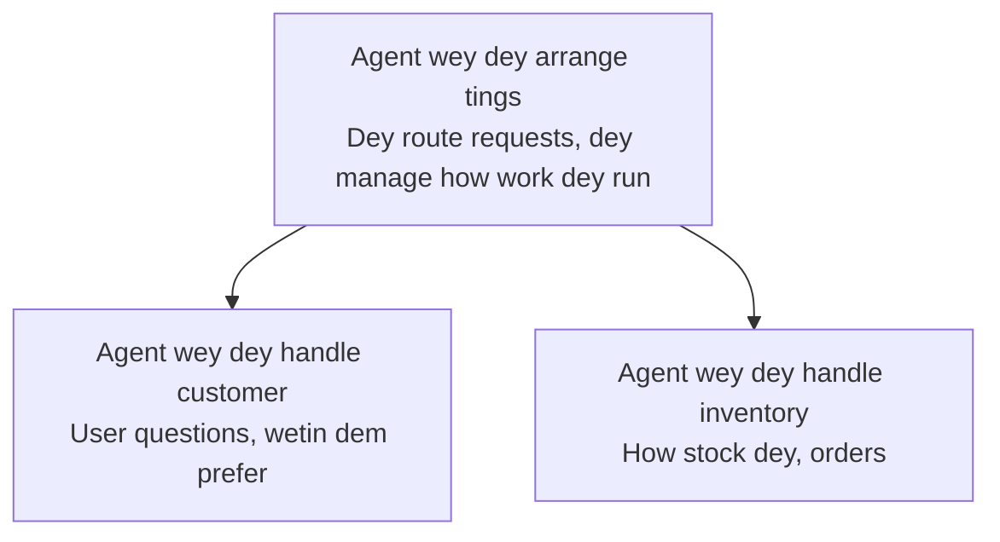

# Chapter 5: Multi-Agent AI Solutions

**📚 Course**: [AZD For Beginners](../../README.md) | **⏱️ Duration**: 2-3 hours | **⭐ Complexity**: Advanced

---

## Overview

Dis chapter go cover advanced multi-agent architecture patterns, agent orchestration, and production-ready AI deployments for complex scenarios.

> Dem don validate am wit `azd 1.25.6` for June 2026.

## Learning Objectives

By completing this chapter, you go:
- Understand multi-agent architecture patterns
- Deploy coordinated AI agent systems
- Implement agent-to-agent communication
- Build production-ready multi-agent solutions

---

## 📚 Lessons

| # | Lesson | Description | Time |
|---|--------|-------------|------|
| 1 | [Multi-Agent Basics](multi-agent-basics.md) | Hands-on: deploy a working multi-agent app with `azd up` | 45 min |
| 2 | [Coordination Patterns](../chapter-06-pre-deployment/coordination-patterns.md) | Agent orchestration strategies (continues in Chapter 6) | 30 min |
| 3 | [ARM Template Deployment](../../examples/retail-multiagent-arm-template/README.md) | One-click deployment example | 30 min |

> **Start with Lesson 1.** Na im be the only fully hands-on, deployable lesson for this chapter. Lesson 2 dey for Chapter 6 (e dey share space wit pre-deployment planning), and the [Retail Multi-Agent Solution](../../examples/retail-scenario.md) na architecture blueprint—na design reference, no be one-command template.

---

## 🚀 Quick Start

```bash
# Option 1: Use template make deployment
azd init --template agent-openai-python-prompty
azd up

# Option 2: Use agent manifest make deployment (you go need azure.ai.agents extension)
azd extension install azure.ai.agents
azd ai agent init -m agent-manifest.yaml
azd up
```

> **Which approach?** Use `azd init --template` to start from a working sample. Use `azd ai agent init` when you get your own agent manifest. See the [AZD AI CLI reference](../chapter-08-production/production-ai-practices.md#azd-ai-cli-commands-and-extensions) for full details.

---

## 🤖 Multi-Agent Architecture



---

## 🎯 Featured Solution: Retail Multi-Agent

The [Retail Multi-Agent Solution](../../examples/retail-scenario.md) dey show:

- **Customer Agent**: Dey handle user interactions and preferences
- **Inventory Agent**: Dey manage stock and order processing
- **Orchestrator**: Dey coordinate between agents
- **Shared Memory**: Cross-agent context management

### Services Used

| Service | Purpose |
|---------|---------|
| Microsoft Foundry Models | Language understanding |
| Azure AI Search | Product catalog |
| Cosmos DB | Agent state and memory |
| Container Apps | Agent hosting |
| Application Insights | Monitoring |

---

## 🔗 Navigation

| Direction | Chapter |
|-----------|---------|
| **Previous** | [Chapter 4: Infrastructure](../chapter-04-infrastructure/README.md) |
| **Next** | [Chapter 6: Pre-Deployment](../chapter-06-pre-deployment/README.md) |

---

## 📖 Related Resources

- [AI Agents Guide](../chapter-02-ai-development/agents.md)
- [Production AI Practices](../chapter-08-production/production-ai-practices.md)
- [AI Troubleshooting](../chapter-07-troubleshooting/ai-troubleshooting.md)

---

<!-- CO-OP TRANSLATOR DISCLAIMER START -->
**Disclaimer**:
Dis document don translate wit AI translation service [Co-op Translator](https://github.com/Azure/co-op-translator). Even tho we dey try make am correct, abeg make you know say automated translation fit get errors or mistakes. Di original document for dia own language na im be di correct source. For important info, make person wey sabi human translation do am. We no go responsible for any misunderstanding or wrong understanding wey fit happen because of dis translation.
<!-- CO-OP TRANSLATOR DISCLAIMER END -->