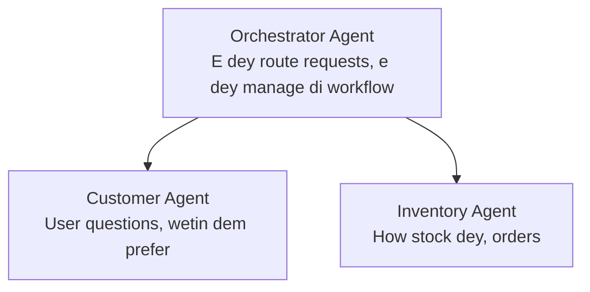

# Chaptah 5: Multi-Agent AI Solutions

**📚 Kọs**: [AZD For Beginners](../../README.md) | **⏱️ Taim**: 2-3 awa | **⭐ Level**: Advanced

---

## Wetin dis chaptah go cover

Dis chaptah dey cover advanced multi-agent architecture patterns, agent orchestration, an how to deploy AI wey ready for production for complex situations.

## Wetin you go learn

If you finish dis chaptah, you go:
- Sabi multi-agent architecture patterns
- Fit deploy coordinated AI agent systems
- Set up how agent dem go dey communicate
- Build multi-agent solutions wey ready for production

---

## 📚 Leson dem

| # | Leson | Tok | Taim |
|---|--------|-------------|------|
| 1 | [Retail Multi-Agent Solution](../../examples/retail-scenario.md) | Complete implementation walkthrough | 90 min |
| 2 | [Coordination Patterns](../chapter-06-pre-deployment/coordination-patterns.md) | Agent orchestration strategies | 30 min |
| 3 | [ARM Template Deployment](../../examples/retail-multiagent-arm-template/README.md) | One-click deployment | 30 min |

---

## 🚀 How to start sharp-sharp

```bash
# Option 1: Use template take deploy am
azd init --template agent-openai-python-prompty
azd up

# Option 2: Use agent manifest take deploy am (you go need azure.ai.agents extension)
azd extension install azure.ai.agents
azd ai agent init -m agent-manifest.yaml
azd up
```

> **Which approach?** Use `azd init --template` to start from a working sample. Use `azd ai agent init` when you have your own agent manifest. See the [AZD AI CLI reference](../chapter-08-production/production-ai-practices.md#azd-ai-cli-commands-and-extensions) for full details.

---

## 🤖 Multi-Agent Architecture


---

## 🎯 Solution we dem highlight: Retail Multi-Agent

Di [Retail Multi-Agent Solution](../../examples/retail-scenario.md) dey show:

- **Customer Agent**: Dey handle user interactions an preferences
- **Inventory Agent**: Dey manage stock an process orders
- **Orchestrator**: Dey coordinate between agents
- **Shared Memory**: Management of cross-agent context wey dem share

### Services We Dem Use

| Service | Wetin e dey do |
|---------|---------|
| Microsoft Foundry Models | Language understanding |
| Azure AI Search | Product catalog |
| Cosmos DB | Agent state and memory |
| Container Apps | Agent hosting |
| Application Insights | Monitoring |

---

## 🔗 Navigation

| Direction | Chaptah |
|-----------|---------|
| **Previous** | [Chapter 4: Infrastructure](../chapter-04-infrastructure/README.md) |
| **Next** | [Chapter 6: Pre-Deployment](../chapter-06-pre-deployment/README.md) |

---

## 📖 Related Resources

- [AI Agents Guide](../chapter-02-ai-development/agents.md)
- [Production AI Practices](../chapter-08-production/production-ai-practices.md)
- [AI Troubleshooting](../chapter-07-troubleshooting/ai-troubleshooting.md)

---

<!-- CO-OP TRANSLATOR DISCLAIMER START -->
Disclaimer:
Dis document don translate wit AI translation service Co-op Translator (https://github.com/Azure/co-op-translator). Even tho we dey try make everything correct, abeg note say automated translations fit get errors or inaccuracies. The original document for im original language suppose be the main source. For critical information, we recommend make professional human translation do am. We no go responsible for any misunderstanding or misinterpretation wey fit arise from using this translation.
<!-- CO-OP TRANSLATOR DISCLAIMER END -->