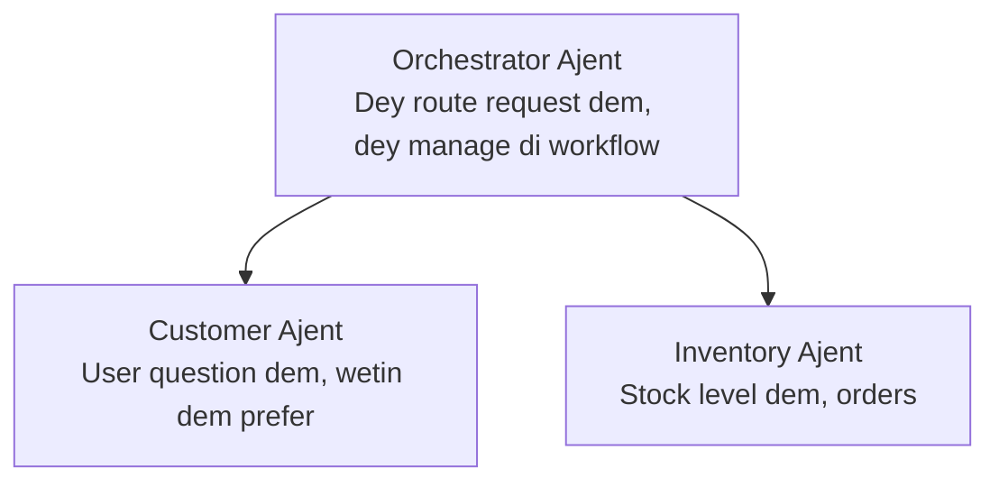

# Chapta 5: Multi-Agent AI Solushon

**📚 Kors**: [AZD For Beginners](../../README.md) | **⏱️ Taim**: 2-3 hours | **⭐ Kompleksiti**: Advanced

---

## Wetin dis chapta dey cover

Dis chapta go cover advanced multi-agent architecture patterns, how to orchestrate agents, and how to deploy AI wey ready for production for complex situations.

> We don validate wit `azd 1.23.12` for March 2026.

## Wetin you go learn

As you finish dis chapta, you go:
- Sabi multi-agent architecture patterns
- Fit deploy coordinated AI agent systems
- Implement how agents go dey communicate wit each oda
- Build multi-agent solutions wey ready for production

---

## 📚 Lekshon

| # | Lekshan | Description | Taim |
|---|--------|-------------|------|
| 1 | [Retail Multi-Agent Solution](../../examples/retail-scenario.md) | Full step-by-step implementation walkthrough | 90 min |
| 2 | [Coordination Patterns](../chapter-06-pre-deployment/coordination-patterns.md) | Strategi wey dem dey use to coordinate agents | 30 min |
| 3 | [ARM Template Deployment](../../examples/retail-multiagent-arm-template/README.md) | Deploy wit one click | 30 min |

---

## 🚀 Quick Start

```bash
# Option 1: Make you deploy from one template
azd init --template agent-openai-python-prompty
azd up

# Option 2: Make you deploy from agent manifest (you go need azure.ai.agents extension)
azd extension install azure.ai.agents
azd ai agent init -m agent-manifest.yaml
azd up
```

> **Which approach?** Make you use `azd init --template` to start from one working sample. Use `azd ai agent init` when you get your own agent manifest. Check the [AZD AI CLI reference](../chapter-08-production/production-ai-practices.md#azd-ai-cli-commands-and-extensions) for full details.

---

## 🤖 Multi-Agent Architecture


---

## 🎯 Solution wey dem highlight: Retail Multi-Agent

The [Retail Multi-Agent Solution](../../examples/retail-scenario.md) show how e dey work:

- **Customer Agent**: Dey handle user interactions and preferences
- **Inventory Agent**: Dey manage stock and order processing
- **Orchestrator**: Dey coordinate between agents
- **Shared Memory**: Dey manage cross-agent context

### Services Wey Dem Dey Use

| Service | Wetin e dey do |
|---------|----------------|
| Microsoft Foundry Models | Understand language |
| Azure AI Search | Product catalog |
| Cosmos DB | Agent state and memory |
| Container Apps | Agent hosting |
| Application Insights | Monitoring |

---

## 🔗 Navigation

| Direction | Chapter |
|-----------|---------|
| **Previous** | [Chapter 4: Infrastructure](../chapter-04-infrastructure/README.md) |
| **Next** | [Chapter 6: Pre-Deployment](../chapter-06-pre-deployment/README.md) |

---

## 📖 Related Resources

- [AI Agents Guide](../chapter-02-ai-development/agents.md)
- [Production AI Practices](../chapter-08-production/production-ai-practices.md)
- [AI Troubleshooting](../chapter-07-troubleshooting/ai-troubleshooting.md)

---

<!-- CO-OP TRANSLATOR DISCLAIMER START -->
**Disclaimer**:
Dis document don translate using AI translation service [Co-op Translator](https://github.com/Azure/co-op-translator). Even though we dey try make am correct, abeg note say automated translations fit get errors or inaccurate parts. Di original document for im native language suppose be di authoritative source. For critical information, e better make professional human translation handle am. We no dey liable for any misunderstandings or misinterpretations wey fit arise from di use of this translation.
<!-- CO-OP TRANSLATOR DISCLAIMER END -->