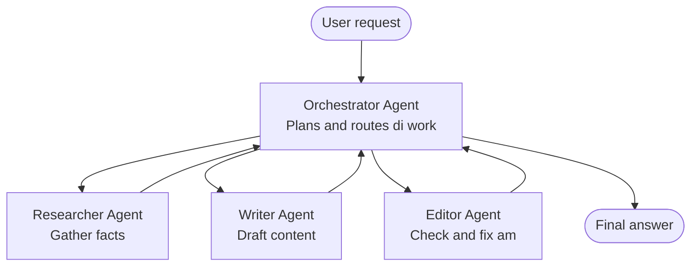

# Multi-Agent Basics - Deploy Your First Coordinated AI System

**Chapter Navigation:**
- **📚 Course Home**: [AZD For Beginners](../../README.md)
- **📖 Current Chapter**: Chapter 5 - Multi-Agent AI Solutions
- **⬅️ Previous**: [Chapter 4: Infrastructure](../chapter-04-infrastructure/README.md)
- **➡️ Next**: [Coordination Patterns](../chapter-06-pre-deployment/coordination-patterns.md)

> Validated against `azd 1.27.1` in July 2026.

## Introduction

For di earlier chapters, you don deploy only one application—and for Chapter 2, you deploy only one AI agent. Dis lesson na di next step: deploying **multi-agent system**, weh several specialized agents dey work together to solve problem wey no single agent fit handle well by imself.

Good news for beginners be say: **you no need new commands.** Multi-agent solution still be azd project. You go `azd init`, `azd up`, test, and `azd down`—na di same workflow wey you sabi. Di tins wey go change na di *shape* of di app inside.

## Learning Goals

By di end of dis lesson, you go:
- Understand wetin "multi-agent" mean and wen e make sense to use am even if e get extra complexity
- Recognize di common roles for multi-agent system (orchestrator + specialists)
- Deploy real, working multi-agent template with `azd up`
- Understand di Azure resources wey dey support multi-agent app
- Know how to verify, customize, and tear down di solution safely

## Learning Outcomes

After you finish dis lesson, you fit:
- Explain di difference between single agent and multi-agent system
- Choose between single agent with tools and real multi-agent design
- Deploy and test multi-agent template end-to-end with azd
- Identify where each agent dey run and how dem dey communicate
- Clean up all resources so no extra money go dey charge you

---

## Wetin Be Multi-Agent System?

Single AI agent na one model wey get instructions and (sometimes) some tools. E dey work well for focused tasks. But as di work grow—research, then writing, then editing, then fact-checking—putting everything for one prompt go make di agent slow, less reliable, and harder to debug.

**Multi-agent system** break di work into specialists, each dey do one job well, wen orchestrator dey coordinate dem:



### Di two roles wey you go always see

| Role | Job | Example |
|------|-----|---------|
| **Orchestrator** | Decides *wetin go happen next* and directs work between agents | "First research, then write, then edit" |
| **Specialist** | Dey do one focused job and return result | Researcher wey just dey gather facts |

### You really need multiple agents?

Start simple. Use multi-agent **only** if one of these tins true:

- ✅ Di task get **different stages** wey dey need different instructions (research vs write vs review)
- ✅ You want specialists to run **in parallel** to save time
- ✅ Different steps need **different tools or data sources**
- ✅ You want make every step fit **test and debug on its own**

If your task na single question-and-answer or simple tool call, then **single agent with tools** (Chapter 2) na easier, cheaper, and simpler to use.

> **Beginner tip:** "More agents" no mean "better." Each agent dey add delay, cost, and something new to watch. Add agents only when di problem clear to split into parts.

---

## Two Ways to Build Multi-Agent for Azure

| Approach | Wetin e be | Best for |
|----------|------------|---------|
| **Single agent + tools** | One Foundry agent wey dey call functions/tools | Simple workflows, beginners |
| **Multiple coordinated agents** | Several agents with orchestrator | Different stages, parallel work, specialization |

Dis lesson focus on di second method with **ready-made template**, so you fit see real multi-agent system wey dey run before you build your own.

---

## Hands-On: Deploy Working Multi-Agent App

We go deploy **Contoso Creative Writer**, official Azure sample wey use multiple agents (researcher, writer, editor) to produce article. Na good first multi-agent app because di roles easy to understand.

### Step 1: Initialize di template

```bash
# Maak wan wok folder
mkdir creative-writer && cd creative-writer

# Start from di official multi-agent template
azd init --template contoso-creative-writer
```

> You fit see more multi-agent templates anytime for [Awesome AZD AI gallery](https://azure.github.io/awesome-azd/?tags=ai). Other beginner-friendly options be `get-started-with-ai-agents` and `azure-ai-travel-agents`.

### Step 2: Authenticate

```bash
# We need am for azd workflows
azd auth login
```

### Step 3: Create environment

```bash
azd env new dev
```

### Step 4: Preview, then deploy

```bash
# See wetin go create before you spend anything (recommended)
azd provision --preview

# Arrange infrastructure and put all agents for one step
azd up
```

`azd up` go ask for subscription and region, then go setup Azure resources and deploy di application. AI deployments fit take longer than simple web app—if you dey deploy bigger models, you fit increase di deploy timeout:

```bash
azd deploy --timeout 1800
```

> **Heads up on cost and capacity:** Multi-agent apps deploy AI models wey dey use quota and dey cost money. If `azd up` fail for model quota, check [AI Troubleshooting](../chapter-07-troubleshooting/ai-troubleshooting.md) for region and quota fixes, plus Chapter 6 [Capacity Planning](../chapter-06-pre-deployment/capacity-planning.md).

---

## Understanding Wetin You Deploy

Typical multi-agent app like dis one dey setup Azure resources wey map directly to di jobs for di diagram wey dey above:

| Resource | Why e dey here |
|----------|--------------|
| **Microsoft Foundry / Models** | Hosts language models wey each agent dey use |
| **Azure AI Search** | Gives researcher agent data wey e fit search |
| **Container Apps** (or App Service) | Hosts di orchestrator and agent code |
| **Cosmos DB** (for some samples) | Stores shared state/memory wey agents dey pass between themselves |
| **Application Insights** | Traces requests *across* agents so you fit debug di flow |

### How agents dey talk to each other

For most azd multi-agent samples, **orchestrator dey run inside your app code** (like example, using framework like Semantic Kernel or Microsoft Agent Framework). Orchestrator go call each specialist agent one by one, pass results, then join them to form final answer. Agents dey share context through:

- **Function/tool calls** — orchestrator go call specialist and get result back
- **Shared memory** — database (often Cosmos DB) wey hold state wey both agents fit read
- **Messages/events** — for less tight connection, agents dey communicate through queue or Service Bus

> **Why e matter for debugging:** because each step dey separate, Application Insights go show you *which* agent slow or fail. Na one big reason why dem split work among agents.

---

## Verify di Deployment

Make sure di system dey work well before you continue:

```bash
# Show di deployed endpoints
azd show

# Open di app monitoring dashboard
azd monitor

# Tail logs if something dey off
azd monitor --logs
```

Then open app URL from `azd show` and make request wey wan test all agents (for Creative Writer, ask am write short article on topic). For Application Insights **transaction search**, you go see di request split across researcher, writer, and editor steps.

**Success criteria:**
- ✅ `azd show` list reachable endpoint
- ✅ Request produce result wey clearly pass multiple stages
- ✅ Application Insights show traces for more than one agent step

---

## Customize: Add or Adjust Agent

Because each agent na just instructions plus tools, e easy to customize:

1. **Find agent definitions** inside template (fit dey for `prompts/`, `agents/`, or `*.prompty` files).
2. **Tune agent instructions** — for example, tell editor agent make e use specific tone or word count.
3. **Redeploy only code** (infrastructure no change):

   ```bash
   azd deploy
   ```

To go further and build agents from *your own* manifest, use agent extension with full lifecycle:

```bash
azd extension install azure.ai.agents
azd ai agent init -m agent-manifest.yaml
azd up
azd ai agent invoke      # test, wit response timing
```

See [Chapter 2: Agents](../chapter-02-ai-development/agents.md) and [AZD AI CLI reference](../chapter-08-production/production-ai-practices.md#azd-ai-cli-commands-and-extensions) for full agent lifecycle (`invoke`, `eval generate`, `optimize`, `delete`).

---

## Clean Up

Multi-agent apps dey run many billable services. Tear everything down after you finish:

```bash
azd down --force --purge
```

`--purge` flag go remove also soft-deleted AI resources (like Foundry/Azure AI Services accounts) so dem no go block future redeploy or dey continue dey cost you.

---

## Note on Production Multi-Agent Systems

[Retail Multi-Agent Solution](../../examples/retail-scenario.md) for dis repo na **architecture blueprint**, no be one-command template—it dey document how production retail system *go be built* (dem say full build na big work). Use am as design guide *after* you deploy working sample here. For production needs (resilience, cost, monitoring, governance), continue to [Chapter 8: Production AI Practices](../chapter-08-production/production-ai-practices.md).

---

## Summary

- Multi-agent system dey split work among specialists coordinated by orchestrator.
- Use am only when task get stages, parallelism, or different tools for steps—otherwise use single agent.
- azd workflow no change: `azd init` → `azd up` → test → `azd down`.
- Real template like `contoso-creative-writer` fit show you and customize working multi-agent app now.
- Application Insights tracing across agents na one big practical benefit of multi-agent design.

---

## 🔗 Navigation

| Direction | Lesson |
|-----------|--------|
| **Previous** | [Chapter 4: Infrastructure](../chapter-04-infrastructure/README.md) |
| **Next** | [Coordination Patterns](../chapter-06-pre-deployment/coordination-patterns.md) |

## 📖 Related Resources

- [AI Agents Guide](../chapter-02-ai-development/agents.md)
- [Coordination Patterns](../chapter-06-pre-deployment/coordination-patterns.md)
- [Production AI Practices](../chapter-08-production/production-ai-practices.md)
- [AI Troubleshooting](../chapter-07-troubleshooting/ai-troubleshooting.md)

---

<!-- CO-OP TRANSLATOR DISCLAIMER START -->
**Disclaimer**:
Dis document don translate wit AI translation service [Co-op Translator](https://github.com/Azure/co-op-translator). Even tho we dey try make am correct, abeg make you know say automated translation fit get errors or mistakes. Di original document for dia own language na im be di correct source. For important info, make person wey sabi human translation do am. We no go responsible for any misunderstanding or wrong understanding wey fit happen because of dis translation.
<!-- CO-OP TRANSLATOR DISCLAIMER END -->