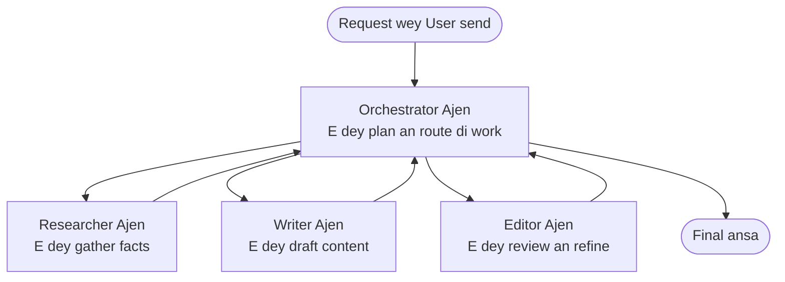

# Multi-Agent Basics - Deploy Your First Coordinated AI System

**Chapter Navigation:**
- **📚 Course Home**: [AZD For Beginners](../../README.md)
- **📖 Current Chapter**: Chapter 5 - Multi-Agent AI Solutions
- **⬅️ Previous**: [Chapter 4: Infrastructure](../chapter-04-infrastructure/README.md)
- **➡️ Next**: [Coordination Patterns](../chapter-06-pre-deployment/coordination-patterns.md)

> Dem don validate dis wit `azd 1.25.6` for June 2026.

## Introduction

For the earlier chapters you don deploy one application—an for Chapter 2 you don deploy one AI agent. Dis lesson dey carry next step: how to deploy **multi-agent system**, wey mean say plenty specialized agents go work together to solve wahala wey one agent no fit handle well by itself.

Good news for beginners: **you no need new commands.** Multi-agent solution still be azd project. You go `azd init`, `azd up`, test, and `azd down`—exactly the workflow wey you don sabi. Wetin change na the *shape* of the app wey dey inside.

## Learning Goals

By the end of this lesson, you go:
- Understand wetin "multi-agent" mean and when e worth the extra complexity
- Recognize the common roles for multi-agent system (orchestrator + specialists)
- Deploy real, working multi-agent template with `azd up`
- Understand the Azure resources wey dey support a multi-agent app
- Know how to verify, customize, and tear down the solution without wahala

## Learning Outcomes

After you finish this lesson, you go fit:
- Explain the difference between single agent and multi-agent system
- Choose between single agent with tools and real multi-agent design
- Deploy and test multi-agent template end-to-end with azd
- Identify where each agent dey run and how dem dey communicate
- Clean up all resources so you no go dey pay ongoing charges

---

## What Is a Multi-Agent System?

One single AI agent na one model with instructions and (sometimes) some tools. E dey work well for focused tasks. But when task don big—research, then writing, then editing, then fact-checking—squeezing everything inside one prompt dey make agent slow, unreliable, and hard to debug.

A **multi-agent system** dey break work into specialists wey each dey do one job well, and one orchestrator dey coordinate dem:



### The two roles you'll always see

| Role | Job | Example |
|------|-----|---------|
| **Orchestrator** | Decides *what happens next* and routes work between agents | "First research, then write, then edit" |
| **Specialist** | Does one focused job and returns a result | A "researcher" that only gathers facts |

### Do you actually need multiple agents?

Start simple. Use multi-agent **only** when one of these true:

- ✅ The task get **distinct stages** wey go benefit from different instructions (research vs. write vs. review)
- ✅ You want specialists to run **in parallel** to save time
- ✅ Different steps need **different tools or data sources**
- ✅ You need each step to dey **independently testable and debuggable**

If your task na single question-and-answer or simple tool call, a **single agent with tools** (Chapter 2) simpler, cheaper, and easy to manage.

> **Beginner tip:** "More agents" no mean "better." Every agent dey add latency, cost, and another thing to monitor. Add agents only when the problem clearly fit break into parts.

---

## Two Ways to Build Multi-Agent on Azure

| Approach | What it is | Best for |
|----------|-----------|----------|
| **Single agent + tools** | One Foundry agent wey dey call functions/tools | Simple workflows, making start easy |
| **Multiple coordinated agents** | Several agents plus one orchestrator | Distinct stages, parallel work, specialization |

Dis lesson concentrate on the second approach using **ready-made template**, so you fit see real multi-agent system dey run before you build your own.

---

## Hands-On: Deploy a Working Multi-Agent App

We go deploy **Contoso Creative Writer**, official Azure sample wey dey use multiple agents (researcher, writer, editor) wey dem coordinate to produce article. E good as first multi-agent app because roles simple to understand.

### Step 1: Initialize the template

```bash
# Make one folder for work
mkdir creative-writer && cd creative-writer

# Set up from di official multi-agent template
azd init --template contoso-creative-writer
```

> Browse more multi-agent templates anytime for the [Awesome AZD AI gallery](https://azure.github.io/awesome-azd/?tags=ai). Other beginner-friendly options include `get-started-with-ai-agents` and `azure-ai-travel-agents`.

### Step 2: Authenticate

```bash
# Dem need am for azd workflows
azd auth login
```

### Step 3: Create an environment

```bash
azd env new dev
```

### Step 4: Preview, then deploy

```bash
# See wetin dem go create before you spend anything (we dey recommend am)
azd provision --preview

# Set up di infrastructure and deploy all agents for one step
azd up
```

`azd up` go ask for subscription and region, then e go provision the Azure resources and deploy the application. AI deployments fit take longer pass simple web app—if you dey deploy bigger models, you fit extend deploy timeout:

```bash
azd deploy --timeout 1800
```

> **Heads up on cost and capacity:** Multi-agent apps deploy AI models wey dey consume quota and go cost money. If `azd up` fail because of model quota, check [AI Troubleshooting](../chapter-07-troubleshooting/ai-troubleshooting.md) for region and quota fixes, and Chapter 6 [Capacity Planning](../chapter-06-pre-deployment/capacity-planning.md).

---

## Understanding What You Deployed

Typical multi-agent app like this one go provision set of Azure resources wey map straight to responsibilities for the diagram up there:

| Resource | Why it's there |
|----------|----------------|
| **Microsoft Foundry / Models** | Hosts the language models wey each agent dey use |
| **Azure AI Search** | Gives the researcher agent grounded data to search |
| **Container Apps** (or App Service) | Hosts the orchestrator and agent code |
| **Cosmos DB** (in some samples) | Stores shared state/memory wey agents fit pass between dem |
| **Application Insights** | Traces requests *across* agents so you fit debug the flow |

### How the agents talk to each other

For most azd multi-agent samples, the **orchestrator dey run inside your application code** (for example, using framework like Semantic Kernel or the Microsoft Agent Framework). Orchestrator go call each specialist agent one by one, pass the results, and assemble the final answer. Agents dey share context through:

- **Function/tool calls** — orchestrator go invoke specialist and receive result
- **Shared memory** — database (often Cosmos DB) hold state wey all agents fit read
- **Messages/events** — for looser coupling, agents dey communicate via queue or Service Bus

> **Why this matters for debugging:** because every step separate, Application Insights go show which agent slow or fail. Na one big reason to split work across agents.

---

## Verify the Deployment

Confirm say the system dey work before you move on:

```bash
# Show the endpoints wey dem don deploy
azd show

# Open the app dashboard wey dey monitor am
azd monitor

# Follow the logs if something no dey right
azd monitor --logs
```

Then open the app URL from `azd show` and try one request wey go exercise all agents (for Creative Writer, ask am to write short article on some topic). For Application Insights **transaction search**, you go see the request don fan out across researcher, writer, and editor steps.

**Success criteria:**
- ✅ `azd show` dey list reachable endpoint
- ✅ One request go produce result wey clear say e pass through multiple stages
- ✅ Application Insights dey show traces for more than one agent step

---

## Customize: Add or Adjust an Agent

Because each agent na just instructions plus tools, customization easy small:

1. **Find the agent definitions** inside template (often for `prompts/`, `agents/`, or `*.prompty` files).
2. **Tune agent's instructions** — for example, tell editor agent to enforce specific tone or word count.
3. **Redeploy only the code** (infrastructure remain unchanged):

   ```bash
   azd deploy
   ```

To go further and build agents from your *own* manifest, use the agent extension and the full lifecycle:

```bash
azd extension install azure.ai.agents
azd ai agent init -m agent-manifest.yaml
azd up
azd ai agent invoke      # test, wey dey measure response time
```

See [Chapter 2: Agents](../chapter-02-ai-development/agents.md) and the [AZD AI CLI reference](../chapter-08-production/production-ai-practices.md#azd-ai-cli-commands-and-extensions) for the complete agent lifecycle (`invoke`, `eval generate`, `optimize`, `delete`).

---

## Clean Up

Multi-agent apps dey run plenty billable services. Tear everything down when you don finish:

```bash
azd down --force --purge
```

The `--purge` flag also go remove soft-deleted AI resources (like Foundry/Azure AI Services accounts) so dem no go block future redeploy or continue dey charge you.

---

## A Note on Production Multi-Agent Systems

The [Retail Multi-Agent Solution](../../examples/retail-scenario.md) for this repo na **architecture blueprint**, no be one-command template—e dey document how production retail system *for* build (and e clear say full build na big work). Use am as design reference *after* you don deploy working sample here. For production matters (resilience, cost, monitoring, governance), continue to [Chapter 8: Production AI Practices](../chapter-08-production/production-ai-practices.md).

---

## Summary

- Multi-agent system dey split work across specialists wey orchestrator coordinate.
- Use am only when task get distinct stages, need parallelism, or different tools per step—otherwise prefer single agent.
- azd workflow no change: `azd init` → `azd up` → test → `azd down`.
- Real template like `contoso-creative-writer` let you see and customize working multi-agent app today.
- Application Insights tracing across agents na one big practical benefit of multi-agent design.

---

## 🔗 Navigation

| Direction | Lesson |
|-----------|--------|
| **Previous** | [Chapter 4: Infrastructure](../chapter-04-infrastructure/README.md) |
| **Next** | [Coordination Patterns](../chapter-06-pre-deployment/coordination-patterns.md) |

## 📖 Related Resources

- [AI Agents Guide](../chapter-02-ai-development/agents.md)
- [Coordination Patterns](../chapter-06-pre-deployment/coordination-patterns.md)
- [Production AI Practices](../chapter-08-production/production-ai-practices.md)
- [AI Troubleshooting](../chapter-07-troubleshooting/ai-troubleshooting.md)

---

<!-- CO-OP TRANSLATOR DISCLAIMER START -->
**Disclaimer**:
Dis document don translate wit AI translation service [Co-op Translator](https://github.com/Azure/co-op-translator). Even tho we dey try make am correct, abeg make you know say automated translation fit get errors or mistakes. Di original document for dia own language na im be di correct source. For important info, make person wey sabi human translation do am. We no go responsible for any misunderstanding or wrong understanding wey fit happen because of dis translation.
<!-- CO-OP TRANSLATOR DISCLAIMER END -->