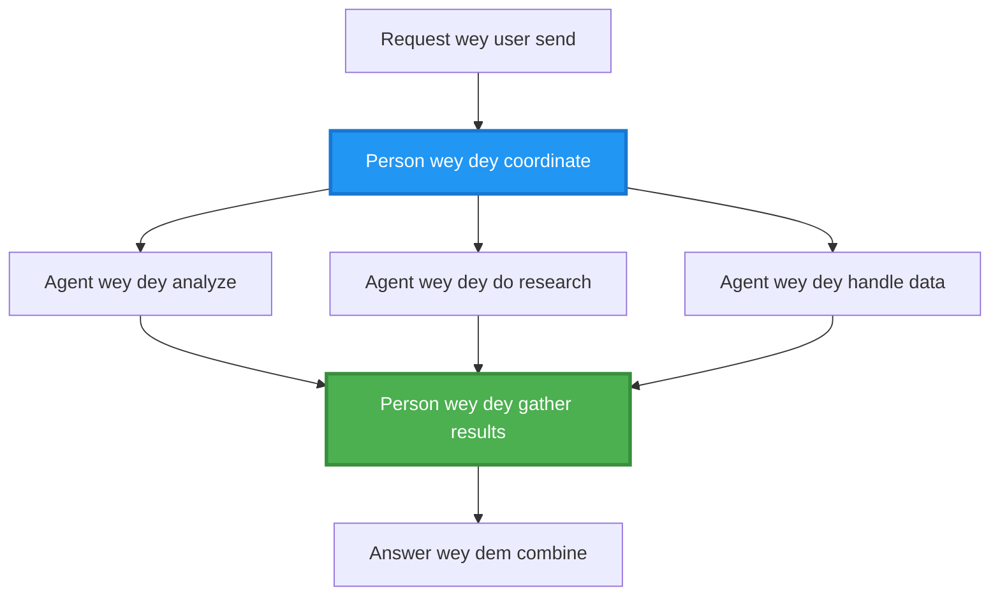
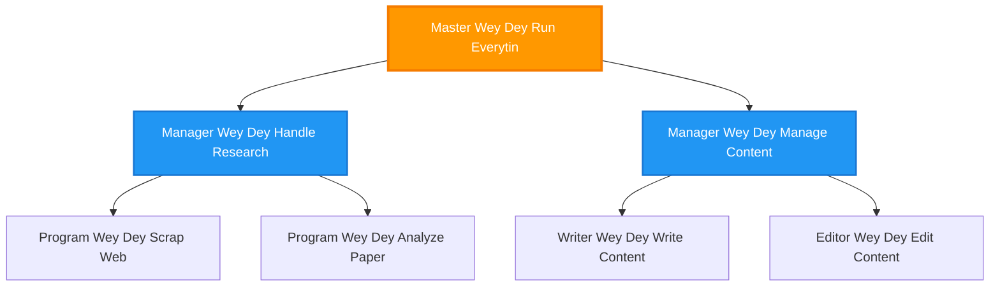
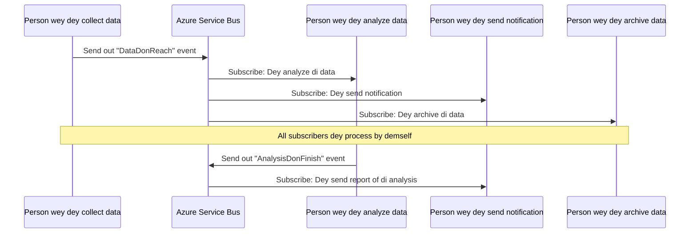
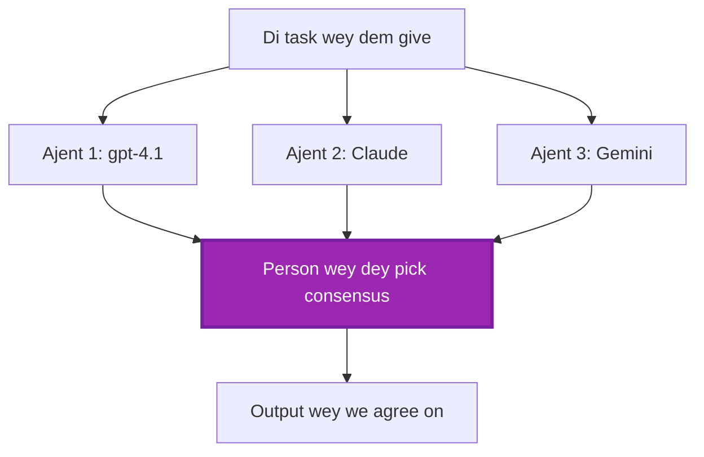
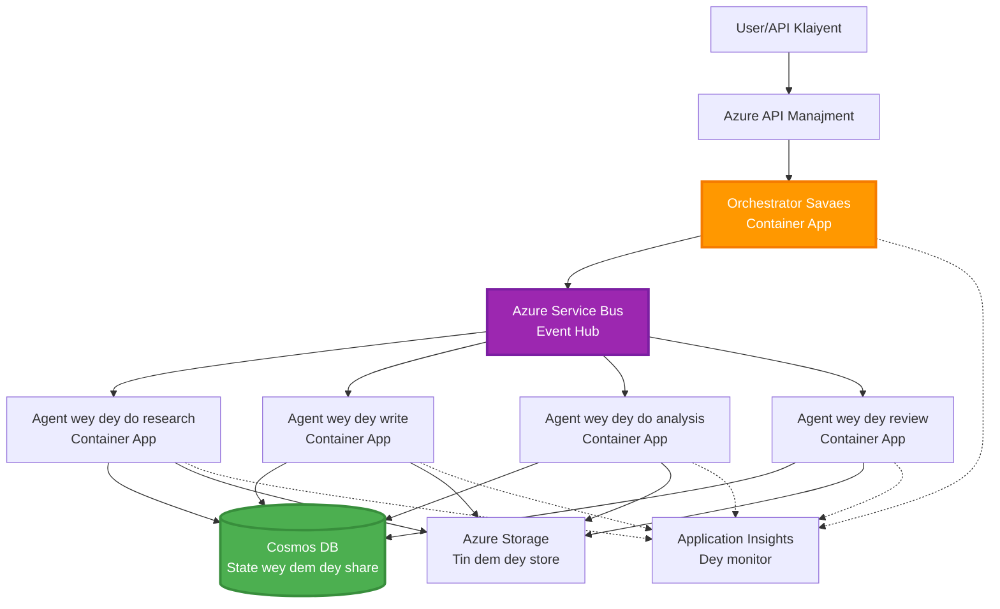

# Multi-Agent Coordination Patterns

⏱️ **How long e go take**: 60-75 minutes | 💰 **How much e go cost**: ~$100-300/month | ⭐ **Difficulty**: Advanced

**📚 Roadmap for learning:**
- ← Previous: [Capacity Planning](capacity-planning.md) - Resource sizing and scaling strategies
- 🎯 **You Dey Here**: Multi-Agent Coordination Patterns (Orchestration, communication, state management)
- → Next: [SKU Selection](sku-selection.md) - Choosing the right Azure services
- 🏠 [Course Home](../../README.md)

---

## Wetin You Go Learn

If you finish dis lesson, you go:
- Understand **multi-agent architecture** patterns and when to use dem
- Implement **orchestration patterns** (centralized, decentralized, hierarchical)
- Design **agent communication** strategies (synchronous, asynchronous, event-driven)
- Manage **shared state** across distributed agents
- Deploy **multi-agent systems** on Azure with AZD
- Apply **coordination patterns** for real-world AI scenarios
- Monitor and debug distributed agent systems

## Why Multi-Agent Coordination Matter

### The Evolution: From Single Agent to Multi-Agent

**Single Agent (Simple):**
```
User → Agent → Response
```
- ✅ Easy to understand and implement
- ✅ Fast for simple tasks
- ❌ Limited by single model's capabilities
- ❌ Cannot parallelize complex tasks
- ❌ No specialization

**Multi-Agent System (Advanced):**
```mermaid
graph TD
    Orchestrator[Orkestrator] --> Agent1[Ejent1<br/>Plan]
    Orchestrator --> Agent2[Ejent2<br/>Kodu]
    Orchestrator --> Agent3[Ejent3<br/>Revyu]
```- ✅ Specialized agents for specific tasks
- ✅ Parallel execution for speed
- ✅ Modular and maintainable
- ✅ Better at complex workflows
- ⚠️ Requires coordination logic

**Analogy**: Single agent na like one person dey do all work. Multi-agent na like team wey each person get im own specialty (researcher, coder, reviewer, writer) wey dey work together.

---

## Core Coordination Patterns

### Pattern 1: Sequential Coordination (Chain of Responsibility)

**When to use**: Tasks suppose finish for one correct order, each agent go build on wetin the previous agent deliver.

```mermaid
sequenceDiagram
    participant User
    participant Orchestrator
    participant Agent1 as Agent wey dey do research
    participant Agent2 as Agent wey dey write
    participant Agent3 as Agent wey dey edit
    
    User->>Orchestrator: "Write one article about AI"
    Orchestrator->>Agent1: Do research for di topic
    Agent1-->>Orchestrator: Wetin di research show
    Orchestrator->>Agent2: Write draft (use di research)
    Agent2-->>Orchestrator: Draft wey dem write
    Orchestrator->>Agent3: Edit and make am beta
    Agent3-->>Orchestrator: Di final article
    Orchestrator-->>User: Article wey dem don polish
    
    Note over User,Agent3: One by one: Every step go wait for di one wey finish before am
```
**Benefits:**
- ✅ Clear data flow
- ✅ Easy to debug
- ✅ Predictable execution order

**Limitations:**
- ❌ Slower (no parallelism)
- ❌ One failure fit block the whole chain
- ❌ No fit handle tasks wey depend on each other too much

**Example Use Cases:**
- Content creation pipeline (research → write → edit → publish)
- Code generation (plan → implement → test → deploy)
- Report generation (data collection → analysis → visualization → summary)

---

### Pattern 2: Parallel Coordination (Fan-Out/Fan-In)

**When to use**: Independent tasks fit run at the same time, then you go combine results for the end.


**Benefits:**
- ✅ Fast (parallel execution)
- ✅ Fault-tolerant (partial results fit still work)
- ✅ Scales horizontally

**Limitations:**
- ⚠️ Results fit show up out-of-order
- ⚠️ You need aggregation logic
- ⚠️ State management fit hard

**Example Use Cases:**
- Multi-source data gathering (APIs + databases + web scraping)
- Competitive analysis (multiple models generate solutions, best selected)
- Translation services (translate to multiple languages simultaneously)

---

### Pattern 3: Hierarchical Coordination (Manager-Worker)

**When to use**: For complex workflows wey get sub-tasks and you need delegation.


**Benefits:**
- ✅ Handles complex workflows
- ✅ Modular and maintainable
- ✅ Clear responsibility boundaries

**Limitations:**
- ⚠️ Architecture go more complex
- ⚠️ Higher latency (many coordination layers)
- ⚠️ Need sophisticated orchestration

**Example Use Cases:**
- Enterprise document processing (classify → route → process → archive)
- Multi-stage data pipelines (ingest → clean → transform → analyze → report)
- Complex automation workflows (planning → resource allocation → execution → monitoring)

---

### Pattern 4: Event-Driven Coordination (Publish-Subscribe)

**When to use**: Agents need react to events, and you want make dem loosely coupled.


**Benefits:**
- ✅ Loose coupling between agents
- ✅ Easy to add new agents (just subscribe)
- ✅ Asynchronous processing
- ✅ Resilient (message persistence)

**Limitations:**
- ⚠️ Eventual consistency
- ⚠️ Debugging fit hard
- ⚠️ Message ordering fit cause wahala

**Example Use Cases:**
- Real-time monitoring systems (alerts, dashboards, logs)
- Multi-channel notifications (email, SMS, push, Slack)
- Data processing pipelines (multiple consumers of same data)

---

### Pattern 5: Consensus-Based Coordination (Voting/Quorum)

**When to use**: When you need agreement from many agents before you proceed.


**Benefits:**
- ✅ Higher accuracy (many opinions)
- ✅ Fault-tolerant (small number of failures fit still be okay)
- ✅ Quality assurance dey baked in

**Limitations:**
- ❌ Cost plenty (many model calls)
- ❌ Slower (you go wait for multiple agents)
- ⚠️ Need conflict resolution

**Example Use Cases:**
- Content moderation (multiple models review content)
- Code review (multiple linters/analyzers)
- Medical diagnosis (multiple AI models, expert validation)

---

## Architecture Overview

### Complete Multi-Agent System on Azure


**Key Components:**

| Component | Purpose | Azure Service |
|-----------|---------|---------------|
| **API Gateway** | Entry point, rate limiting, auth | API Management |
| **Orchestrator** | Coordinates agent workflows | Container Apps |
| **Message Queue** | Asynchronous communication | Service Bus / Event Hubs |
| **Agents** | Specialized AI workers | Container Apps / Functions |
| **State Store** | Shared state, task tracking | Cosmos DB |
| **Artifact Storage** | Documents, results, logs | Blob Storage |
| **Monitoring** | Distributed tracing, logs | Application Insights |

---

## Prerequisites

### Required Tools

```bash
# Make sure say Azure Developer CLI dey
azd version
# ✅ Wetin we expect: azd version 1.0.0 or pass

# Make sure say Azure CLI dey
az --version
# ✅ Wetin we expect: azure-cli 2.50.0 or pass

# Make sure say Docker dey (so you fit test am for your machine)
docker --version
# ✅ Wetin we expect: Docker version 20.10 or pass
```

### Azure Requirements

- Active Azure subscription
- Permissions to create:
  - Container Apps
  - Service Bus namespaces
  - Cosmos DB accounts
  - Storage accounts
  - Application Insights

### Knowledge Prerequisites

You suppose don finish:
- [Configuration Management](../chapter-03-configuration/configuration.md)
- [Authentication & Security](../chapter-03-configuration/authsecurity.md)
- [Microservices Example](../../../../examples/microservices)

---

## Implementation Guide

### Project Structure

```
multi-agent-system/
├── azure.yaml                    # AZD configuration
├── infra/
│   ├── main.bicep               # Main infrastructure
│   ├── core/
│   │   ├── servicebus.bicep     # Message queue
│   │   ├── cosmos.bicep         # State store
│   │   ├── storage.bicep        # Artifact storage
│   │   └── monitoring.bicep     # Application Insights
│   └── app/
│       ├── orchestrator.bicep   # Orchestrator service
│       └── agent.bicep          # Agent template
└── src/
    ├── orchestrator/            # Orchestration logic
    │   ├── app.py
    │   ├── workflows.py
    │   └── Dockerfile
    ├── agents/
    │   ├── research/            # Research agent
    │   ├── writer/              # Writer agent
    │   ├── analyst/             # Analyst agent
    │   └── reviewer/            # Reviewer agent
    └── shared/
        ├── state_manager.py     # Shared state logic
        └── message_handler.py   # Message handling
```

---

## Lesson 1: Sequential Coordination Pattern

### Implementation: Content Creation Pipeline

Make we build sequential pipeline: Research → Write → Edit → Publish

### 1. AZD Configuration

**File: `azure.yaml`**

```yaml
name: content-pipeline
metadata:
  template: multi-agent-sequential@1.0.0

services:
  orchestrator:
    project: ./src/orchestrator
    language: python
    host: containerapp
  
  research-agent:
    project: ./src/agents/research
    language: python
    host: containerapp
  
  writer-agent:
    project: ./src/agents/writer
    language: python
    host: containerapp
  
  editor-agent:
    project: ./src/agents/editor
    language: python
    host: containerapp
```

### 2. Infrastructure: Service Bus for Coordination

**File: `infra/core/servicebus.bicep`**

```bicep
param name string
param location string
param tags object = {}

resource serviceBusNamespace 'Microsoft.ServiceBus/namespaces@2022-10-01-preview' = {
  name: name
  location: location
  tags: tags
  sku: {
    name: 'Standard'
    tier: 'Standard'
  }
  properties: {
    minimumTlsVersion: '1.2'
  }
}

// Queue for orchestrator → research agent
resource researchQueue 'Microsoft.ServiceBus/namespaces/queues@2022-10-01-preview' = {
  parent: serviceBusNamespace
  name: 'research-tasks'
  properties: {
    maxDeliveryCount: 3
    lockDuration: 'PT5M'
    deadLetteringOnMessageExpiration: true
  }
}

// Queue for research agent → writer agent
resource writerQueue 'Microsoft.ServiceBus/namespaces/queues@2022-10-01-preview' = {
  parent: serviceBusNamespace
  name: 'writer-tasks'
  properties: {
    maxDeliveryCount: 3
    lockDuration: 'PT5M'
  }
}

// Queue for writer agent → editor agent
resource editorQueue 'Microsoft.ServiceBus/namespaces/queues@2022-10-01-preview' = {
  parent: serviceBusNamespace
  name: 'editor-tasks'
  properties: {
    maxDeliveryCount: 3
    lockDuration: 'PT5M'
  }
}

output namespace string = serviceBusNamespace.name
output connectionString string = listKeys('${serviceBusNamespace.id}/AuthorizationRules/RootManageSharedAccessKey', serviceBusNamespace.apiVersion).primaryConnectionString
```

### 3. Shared State Manager

**File: `src/shared/state_manager.py`**

```python
from azure.cosmos import CosmosClient, PartitionKey
from datetime import datetime
import os

class StateManager:
    """Manages shared state across agents using Cosmos DB"""
    
    def __init__(self):
        endpoint = os.environ['COSMOS_ENDPOINT']
        key = os.environ['COSMOS_KEY']
        
        self.client = CosmosClient(endpoint, key)
        self.database = self.client.get_database_client('agent-state')
        self.container = self.database.get_container_client('tasks')
    
    def create_task(self, task_id: str, task_type: str, input_data: dict):
        """Create a new task"""
        task = {
            'id': task_id,
            'type': task_type,
            'status': 'pending',
            'input': input_data,
            'created_at': datetime.utcnow().isoformat(),
            'steps': []
        }
        self.container.create_item(task)
        return task
    
    def update_task_step(self, task_id: str, step_name: str, result: dict):
        """Update task with completed step"""
        task = self.container.read_item(task_id, partition_key=task_id)
        
        task['steps'].append({
            'name': step_name,
            'completed_at': datetime.utcnow().isoformat(),
            'result': result
        })
        
        self.container.replace_item(task_id, task)
        return task
    
    def complete_task(self, task_id: str, final_result: dict):
        """Mark task as complete"""
        task = self.container.read_item(task_id, partition_key=task_id)
        task['status'] = 'completed'
        task['result'] = final_result
        task['completed_at'] = datetime.utcnow().isoformat()
        self.container.replace_item(task_id, task)
        return task
    
    def get_task(self, task_id: str):
        """Retrieve task state"""
        return self.container.read_item(task_id, partition_key=task_id)
```

### 4. Orchestrator Service

**File: `src/orchestrator/app.py`**

```python
from flask import Flask, request, jsonify
from azure.servicebus import ServiceBusClient, ServiceBusMessage
import json
import uuid
import os
from shared.state_manager import StateManager

app = Flask(__name__)
state_manager = StateManager()

# Service Bus konekshon
servicebus_connection_str = os.environ['SERVICEBUS_CONNECTION_STRING']
servicebus_client = ServiceBusClient.from_connection_string(servicebus_connection_str)

@app.route('/health', methods=['GET'])
def health():
    return jsonify({'status': 'healthy', 'service': 'orchestrator'})

@app.route('/create-content', methods=['POST'])
def create_content():
    """
    Sequential workflow: Research → Write → Edit → Publish
    """
    data = request.json
    topic = data.get('topic')
    
    if not topic:
        return jsonify({'error': 'Topic required'}), 400
    
    # Make task for state store
    task_id = str(uuid.uuid4())
    task = state_manager.create_task(
        task_id=task_id,
        task_type='content_creation',
        input_data={'topic': topic}
    )
    
    # Send message go research agent (first step)
    sender = servicebus_client.get_queue_sender('research-tasks')
    message = ServiceBusMessage(
        body=json.dumps({
            'task_id': task_id,
            'topic': topic,
            'next_queue': 'writer-tasks'  # Where we go send results
        }),
        content_type='application/json'
    )
    
    with sender:
        sender.send_messages(message)
    
    return jsonify({
        'task_id': task_id,
        'status': 'started',
        'workflow': 'sequential',
        'steps': ['research', 'write', 'edit', 'publish'],
        'message': 'Content creation pipeline initiated'
    }), 202

@app.route('/task/<task_id>', methods=['GET'])
def get_task_status(task_id):
    """Check task status"""
    try:
        task = state_manager.get_task(task_id)
        return jsonify(task)
    except Exception as e:
        return jsonify({'error': str(e)}), 404

if __name__ == '__main__':
    app.run(host='0.0.0.0', port=8080)
```

### 5. Research Agent

**File: `src/agents/research/app.py`**

```python
from azure.servicebus import ServiceBusClient, ServiceBusMessage
from openai import AzureOpenAI
import json
import os
import time
from shared.state_manager import StateManager

# Make di clients dem ready
state_manager = StateManager()
servicebus_client = ServiceBusClient.from_connection_string(
    os.environ['SERVICEBUS_CONNECTION_STRING']
)

openai_client = AzureOpenAI(
    api_key=os.environ['AZURE_OPENAI_API_KEY'],
    api_version="2024-02-01",
    azure_endpoint=os.environ['AZURE_OPENAI_ENDPOINT']
)

def process_research_task(message_data):
    """Process research request and pass to writer"""
    task_id = message_data['task_id']
    topic = message_data['topic']
    next_queue = message_data['next_queue']
    
    print(f"🔬 Researching: {topic}")
    
    # Call Microsoft Foundry models make we do research
    response = openai_client.chat.completions.create(
        model="gpt-4.1",
        messages=[
            {"role": "system", "content": "You are a research assistant. Provide comprehensive research on the given topic."},
            {"role": "user", "content": f"Research this topic thoroughly: {topic}"}
        ],
        max_tokens=1500
    )
    
    research_results = response.choices[0].message.content
    
    # Update di state
    state_manager.update_task_step(
        task_id=task_id,
        step_name='research',
        result={'research': research_results}
    )
    
    # Send am go di next agent (writer)
    sender = servicebus_client.get_queue_sender(next_queue)
    message = ServiceBusMessage(
        body=json.dumps({
            'task_id': task_id,
            'topic': topic,
            'research': research_results,
            'next_queue': 'editor-tasks'
        }),
        content_type='application/json'
    )
    
    with sender:
        sender.send_messages(message)
    
    print(f"✅ Research complete for task {task_id}")

def main():
    """Listen to research queue"""
    receiver = servicebus_client.get_queue_receiver('research-tasks')
    
    print("🔬 Research Agent started, listening for tasks...")
    
    with receiver:
        while True:
            messages = receiver.receive_messages(max_wait_time=5)
            for message in messages:
                try:
                    message_data = json.loads(str(message))
                    process_research_task(message_data)
                    receiver.complete_message(message)
                except Exception as e:
                    print(f"❌ Error processing message: {e}")
                    receiver.abandon_message(message)

if __name__ == '__main__':
    main()
```

### 6. Writer Agent

**File: `src/agents/writer/app.py`**

```python
from azure.servicebus import ServiceBusClient, ServiceBusMessage
from openai import AzureOpenAI
import json
import os
from shared.state_manager import StateManager

state_manager = StateManager()
servicebus_client = ServiceBusClient.from_connection_string(
    os.environ['SERVICEBUS_CONNECTION_STRING']
)

openai_client = AzureOpenAI(
    api_key=os.environ['AZURE_OPENAI_API_KEY'],
    api_version="2024-02-01",
    azure_endpoint=os.environ['AZURE_OPENAI_ENDPOINT']
)

def process_writing_task(message_data):
    """Write article based on research"""
    task_id = message_data['task_id']
    topic = message_data['topic']
    research = message_data['research']
    next_queue = message_data['next_queue']
    
    print(f"✍️ Writing article: {topic}")
    
    # Make Microsoft Foundry Models write di article
    response = openai_client.chat.completions.create(
        model="gpt-4.1",
        messages=[
            {"role": "system", "content": "You are a professional writer. Write engaging, well-structured articles."},
            {"role": "user", "content": f"Based on this research:\n\n{research}\n\nWrite a comprehensive article about: {topic}"}
        ],
        max_tokens=2000
    )
    
    article_draft = response.choices[0].message.content
    
    # Update di state
    state_manager.update_task_step(
        task_id=task_id,
        step_name='writing',
        result={'draft': article_draft}
    )
    
    # Send to di editor
    sender = servicebus_client.get_queue_sender(next_queue)
    message = ServiceBusMessage(
        body=json.dumps({
            'task_id': task_id,
            'topic': topic,
            'draft': article_draft
        }),
        content_type='application/json'
    )
    
    with sender:
        sender.send_messages(message)
    
    print(f"✅ Article draft complete for task {task_id}")

def main():
    """Listen to writer queue"""
    receiver = servicebus_client.get_queue_receiver('writer-tasks')
    
    print("✍️ Writer Agent started, listening for tasks...")
    
    with receiver:
        while True:
            messages = receiver.receive_messages(max_wait_time=5)
            for message in messages:
                try:
                    message_data = json.loads(str(message))
                    process_writing_task(message_data)
                    receiver.complete_message(message)
                except Exception as e:
                    print(f"❌ Error: {e}")
                    receiver.abandon_message(message)

if __name__ == '__main__':
    main()
```

### 7. Editor Agent

**File: `src/agents/editor/app.py`**

```python
from azure.servicebus import ServiceBusClient
from openai import AzureOpenAI
import json
import os
from shared.state_manager import StateManager

state_manager = StateManager()
servicebus_client = ServiceBusClient.from_connection_string(
    os.environ['SERVICEBUS_CONNECTION_STRING']
)

openai_client = AzureOpenAI(
    api_key=os.environ['AZURE_OPENAI_API_KEY'],
    api_version="2024-02-01",
    azure_endpoint=os.environ['AZURE_OPENAI_ENDPOINT']
)

def process_editing_task(message_data):
    """Edit and finalize article"""
    task_id = message_data['task_id']
    topic = message_data['topic']
    draft = message_data['draft']
    
    print(f"📝 Editing article: {topic}")
    
    # Call Microsoft Foundry Models make dem edit am
    response = openai_client.chat.completions.create(
        model="gpt-4.1",
        messages=[
            {"role": "system", "content": "You are an expert editor. Improve grammar, clarity, and structure."},
            {"role": "user", "content": f"Edit and improve this article:\n\n{draft}"}
        ],
        max_tokens=2000
    )
    
    final_article = response.choices[0].message.content
    
    # Mark task say e don finish
    state_manager.complete_task(
        task_id=task_id,
        final_result={
            'topic': topic,
            'final_article': final_article,
            'word_count': len(final_article.split())
        }
    )
    
    print(f"✅ Article finalized for task {task_id}")

def main():
    """Listen to editor queue"""
    receiver = servicebus_client.get_queue_receiver('editor-tasks')
    
    print("📝 Editor Agent started, listening for tasks...")
    
    with receiver:
        while True:
            messages = receiver.receive_messages(max_wait_time=5)
            for message in messages:
                try:
                    message_data = json.loads(str(message))
                    process_editing_task(message_data)
                    receiver.complete_message(message)
                except Exception as e:
                    print(f"❌ Error: {e}")
                    receiver.abandon_message(message)

if __name__ == '__main__':
    main()
```

### 8. Deploy and Test

```bash
# Option A: Deployment wey base on template
azd init
azd up

# Option B: Deployment wey base on agent manifest (go need extension)
azd extension install azure.ai.agents
azd ai agent init -m agent-manifest.yaml
azd up
```

> See [AZD AI CLI Commands](../chapter-08-production/production-ai-practices.md#azd-ai-cli-commands-and-extensions) for all `azd ai` flags and options.

```bash
# Find di orchestrator URL
ORCHESTRATOR_URL=$(azd env get-values | grep ORCHESTRATOR_URL | cut -d '=' -f2 | tr -d '"')

# Make di content
curl -X POST $ORCHESTRATOR_URL/create-content \
  -H "Content-Type: application/json" \
  -d '{"topic": "The Future of AI in Healthcare"}'
```

**✅ Wetin you suppose see:**
```json
{
  "task_id": "a1b2c3d4-e5f6-7890-abcd-ef1234567890",
  "status": "started",
  "workflow": "sequential",
  "steps": ["research", "write", "edit", "publish"],
  "message": "Content creation pipeline initiated"
}
```

**Check task progress:**
```bash
TASK_ID="a1b2c3d4-e5f6-7890-abcd-ef1234567890"
curl $ORCHESTRATOR_URL/task/$TASK_ID
```

**✅ Wetin you suppose see (completed):**
```json
{
  "id": "a1b2c3d4-e5f6-7890-abcd-ef1234567890",
  "type": "content_creation",
  "status": "completed",
  "steps": [
    {
      "name": "research",
      "completed_at": "2025-11-19T10:30:00Z",
      "result": {"research": "..."}
    },
    {
      "name": "writing",
      "completed_at": "2025-11-19T10:32:00Z",
      "result": {"draft": "..."}
    }
  ],
  "result": {
    "topic": "The Future of AI in Healthcare",
    "final_article": "...",
    "word_count": 1500
  }
}
```

---

## Lesson 2: Parallel Coordination Pattern

### Implementation: Multi-Source Research Aggregator

Make we build parallel system wey dey gather info from many sources at the same time.

### Parallel Orchestrator

**File: `src/orchestrator/parallel_workflow.py`**

```python
from flask import Flask, request, jsonify
from azure.servicebus import ServiceBusClient, ServiceBusMessage
import json
import uuid
import os
from shared.state_manager import StateManager

app = Flask(__name__)
state_manager = StateManager()

servicebus_client = ServiceBusClient.from_connection_string(
    os.environ['SERVICEBUS_CONNECTION_STRING']
)

@app.route('/research-parallel', methods=['POST'])
def research_parallel():
    """
    Parallel workflow: Multiple agents work simultaneously
    """
    data = request.json
    query = data.get('query')
    
    task_id = str(uuid.uuid4())
    task = state_manager.create_task(
        task_id=task_id,
        task_type='parallel_research',
        input_data={
            'query': query,
            'agents': ['web', 'academic', 'news', 'social']
        }
    )
    
    # Fan-out: Send to all agents dem at di same time
    agents = [
        ('web-research-queue', 'web'),
        ('academic-research-queue', 'academic'),
        ('news-research-queue', 'news'),
        ('social-research-queue', 'social')
    ]
    
    for queue_name, agent_type in agents:
        sender = servicebus_client.get_queue_sender(queue_name)
        message = ServiceBusMessage(
            body=json.dumps({
                'task_id': task_id,
                'query': query,
                'agent_type': agent_type,
                'result_queue': 'aggregation-queue'
            }),
            content_type='application/json'
        )
        
        with sender:
            sender.send_messages(message)
    
    return jsonify({
        'task_id': task_id,
        'status': 'started',
        'workflow': 'parallel',
        'agents_dispatched': 4,
        'message': 'Parallel research initiated'
    }), 202

if __name__ == '__main__':
    app.run(host='0.0.0.0', port=8080)
```

### Aggregation Logic

**File: `src/agents/aggregator/app.py`**

```python
from azure.servicebus import ServiceBusClient
import json
import os
from collections import defaultdict
from shared.state_manager import StateManager

state_manager = StateManager()
servicebus_client = ServiceBusClient.from_connection_string(
    os.environ['SERVICEBUS_CONNECTION_STRING']
)

# Dey keep track of result dem for each task
task_results = defaultdict(list)
expected_agents = 4  # web, akademik, news, social

def process_result(message_data):
    """Aggregate results from parallel agents"""
    task_id = message_data['task_id']
    agent_type = message_data['agent_type']
    result = message_data['result']
    
    # Save result
    task_results[task_id].append({
        'agent': agent_type,
        'data': result
    })
    
    print(f"📊 Received result from {agent_type} agent ({len(task_results[task_id])}/{expected_agents})")
    
    # Check if all agent dem don finish (fan-in)
    if len(task_results[task_id]) == expected_agents:
        print(f"✅ All agents completed for task {task_id}. Aggregating...")
        
        # Combine result dem
        aggregated = {
            'query': message_data['query'],
            'sources': task_results[task_id],
            'summary': generate_summary(task_results[task_id])
        }
        
        # Mark am finish
        state_manager.complete_task(task_id, aggregated)
        
        # Clear everytin
        del task_results[task_id]
        
        print(f"✅ Aggregation complete for task {task_id}")

def generate_summary(results):
    """Generate summary from all sources"""
    summaries = [r['data'].get('summary', '') for r in results]
    return '\n\n'.join(summaries)

def main():
    """Listen to aggregation queue"""
    receiver = servicebus_client.get_queue_receiver('aggregation-queue')
    
    print("📊 Aggregator started, listening for results...")
    
    with receiver:
        while True:
            messages = receiver.receive_messages(max_wait_time=5)
            for message in messages:
                try:
                    message_data = json.loads(str(message))
                    process_result(message_data)
                    receiver.complete_message(message)
                except Exception as e:
                    print(f"❌ Error: {e}")
                    receiver.abandon_message(message)

if __name__ == '__main__':
    main()
```

**Benefits of Parallel Pattern:**
- ⚡ **4x faster** (agents dey run at the same time)
- 🔄 **Fault-tolerant** (partial results fit still be okay)
- 📈 **Scalable** (fit add more agents sharp sharp)

---

## Practical Exercises

### Exercise 1: Add Timeout Handling ⭐⭐ (Medium)

**Goal**: Implement timeout logic so aggregator no go wait forever for slow agents.

**Steps**:

1. **Add timeout tracking to aggregator:**

```python
from datetime import datetime, timedelta

task_timeouts = {}  # task_id -> expiration_time

def process_result(message_data):
    task_id = message_data['task_id']
    
    # Set timeout for di first result
    if task_id not in task_timeouts:
        task_timeouts[task_id] = datetime.utcnow() + timedelta(seconds=30)
    
    task_results[task_id].append({
        'agent': message_data['agent_type'],
        'data': message_data['result']
    })
    
    # Check if e don complete OR e don time out
    if len(task_results[task_id]) == expected_agents or \
       datetime.utcnow() > task_timeouts[task_id]:
        
        print(f"📊 Aggregating with {len(task_results[task_id])}/{expected_agents} results")
        
        aggregated = {
            'query': message_data['query'],
            'sources': task_results[task_id],
            'completed_agents': len(task_results[task_id]),
            'timed_out': len(task_results[task_id]) < expected_agents
        }
        
        state_manager.complete_task(task_id, aggregated)
        
        # Clean up
        del task_results[task_id]
        del task_timeouts[task_id]
```

2. **Test with artificial delays:**

```python
# Make one agent delay small to show say e dey process slow
import time
time.sleep(35)  # E don pass 30-second timeout
```

3. **Deploy and verify:**

```bash
azd deploy aggregator

# Submit di task
curl -X POST $ORCHESTRATOR_URL/research-parallel \
  -H "Content-Type: application/json" \
  -d '{"query": "AI safety research"}'

# Check di results after 30 sekons
curl $ORCHESTRATOR_URL/task/$TASK_ID
```

**✅ Success Criteria:**
- ✅ Task go finish after 30 seconds even if some agents never finish
- ✅ Response go show partial results (`"timed_out": true`)
- ✅ Available results go return (3 out of 4 agents)

**Time**: 20-25 minutes

---

### Exercise 2: Implement Retry Logic ⭐⭐⭐ (Advanced)

**Goal**: Retry failed agent tasks automatically before you give up.

**Steps**:

1. **Add retry tracking to orchestrator:**

```python
from dataclasses import dataclass
from typing import Dict

@dataclass
class RetryConfig:
    max_retries: int = 3
    backoff_seconds: int = 5

retry_counts: Dict[str, int] = {}  # message_id dey point to retry_count

def send_with_retry(queue_name: str, message_data: dict, retry_config: RetryConfig):
    """Send message with retry metadata"""
    message_id = message_data.get('message_id', str(uuid.uuid4()))
    message_data['message_id'] = message_id
    message_data['retry_count'] = retry_counts.get(message_id, 0)
    message_data['max_retries'] = retry_config.max_retries
    
    sender = servicebus_client.get_queue_sender(queue_name)
    message = ServiceBusMessage(
        body=json.dumps(message_data),
        content_type='application/json',
        message_id=message_id
    )
    
    with sender:
        sender.send_messages(message)
```

2. **Add retry handler to agents:**

```python
def process_with_retry(message, receiver, process_func):
    """Process message with automatic retry on failure"""
    try:
        message_data = json.loads(str(message))
        
        # Process di message
        process_func(message_data)
        
        # Success - don complete
        receiver.complete_message(message)
        
    except Exception as e:
        message_id = message.message_id
        retry_count = message_data.get('retry_count', 0)
        max_retries = message_data.get('max_retries', 3)
        
        if retry_count < max_retries:
            # Retry: abandon am, put am back for queue and increase di count
            print(f"⚠️ Retry {retry_count + 1}/{max_retries} for message {message_id}")
            
            message_data['retry_count'] = retry_count + 1
            
            # Send am back to di same queue wit delay
            time.sleep(5 * (retry_count + 1))  # Backoff wey dey increase exponentially
            send_with_retry(queue_name, message_data, RetryConfig())
            
            receiver.complete_message(message)  # Comot di original
        else:
            # Max retries don pass - send am go dead letter queue
            print(f"❌ Max retries exceeded for message {message_id}")
            receiver.dead_letter_message(
                message,
                reason="MaxRetriesExceeded",
                error_description=str(e)
            )
```

3. **Monitor dead letter queue:**

```python
def monitor_dead_letters():
    """Check dead letter queue for failed messages"""
    receiver = servicebus_client.get_queue_receiver(
        'research-queue',
        sub_queue='deadletter'
    )
    
    with receiver:
        messages = receiver.receive_messages(max_wait_time=5)
        for message in messages:
            print(f"☠️ Dead letter: {message.message_id}")
            print(f"Reason: {message.dead_letter_reason}")
            print(f"Description: {message.dead_letter_error_description}")
```

**✅ Success Criteria:**
- ✅ Failed tasks go retry automatically (up to 3 times)
- ✅ Exponential backoff between retries (5s, 10s, 15s)
- ✅ After max retries, messages go dead letter queue
- ✅ Dead letter queue fit be monitored and replayed

**Time**: 30-40 minutes

---

### Exercise 3: Implement Circuit Breaker ⭐⭐⭐ (Advanced)

**Goal**: Make sure one failing agent no go cause cascade—stop requests to failing agents.

**Steps**:

1. **Create circuit breaker class:**

```python
from enum import Enum
from datetime import datetime, timedelta

class CircuitState(Enum):
    CLOSED = "closed"      # Everything dey normal
    OPEN = "open"          # Dey fail, dey reject request dem
    HALF_OPEN = "half_open"  # Dey test if e don recover

class CircuitBreaker:
    def __init__(self, failure_threshold=5, timeout_seconds=60):
        self.failure_threshold = failure_threshold
        self.timeout_seconds = timeout_seconds
        self.failure_count = 0
        self.last_failure_time = None
        self.state = CircuitState.CLOSED
    
    def call(self, func):
        """Execute function with circuit breaker protection"""
        if self.state == CircuitState.OPEN:
            # Check if timeout don expire
            if datetime.utcnow() - self.last_failure_time > timedelta(seconds=self.timeout_seconds):
                self.state = CircuitState.HALF_OPEN
                print("🔄 Circuit breaker: HALF_OPEN (testing)")
            else:
                raise Exception(f"Circuit breaker OPEN for agent. Try again in {self.timeout_seconds}s")
        
        try:
            result = func()
            
            # Na success
            if self.state == CircuitState.HALF_OPEN:
                self.state = CircuitState.CLOSED
                self.failure_count = 0
                print("✅ Circuit breaker: CLOSED (recovered)")
            
            return result
            
        except Exception as e:
            self.failure_count += 1
            self.last_failure_time = datetime.utcnow()
            
            if self.failure_count >= self.failure_threshold:
                self.state = CircuitState.OPEN
                print(f"🔴 Circuit breaker: OPEN (too many failures)")
            
            raise e
```

2. **Apply to agent calls:**

```python
# Inside di orchestrator
agent_circuits = {
    'web': CircuitBreaker(failure_threshold=5, timeout_seconds=60),
    'academic': CircuitBreaker(failure_threshold=5, timeout_seconds=60),
    'news': CircuitBreaker(failure_threshold=5, timeout_seconds=60),
    'social': CircuitBreaker(failure_threshold=5, timeout_seconds=60)
}

def send_to_agent(agent_type, message_data):
    """Send with circuit breaker protection"""
    circuit = agent_circuits[agent_type]
    
    try:
        circuit.call(lambda: send_message(agent_type, message_data))
    except Exception as e:
        print(f"⚠️ Skipping {agent_type} agent: {e}")
        # Carry on wit oda agents
```

3. **Test circuit breaker:**

```bash
# Make e be like say failures dey happen again and again (stop one agent)
az containerapp stop --name web-research-agent --resource-group rg-agents

# Send plenty requests
for i in {1..10}; do
  curl -X POST $ORCHESTRATOR_URL/research-parallel \
    -H "Content-Type: application/json" \
    -d '{"query": "test query '$i'"}'
  sleep 2
done

# Check logs - you go see say circuit open after 5 failures
# Use Azure CLI make you fit see Container App logs:
az containerapp logs show --name orchestrator --resource-group $RG_NAME --tail 50
```

**✅ Success Criteria:**
- ✅ After 5 failures, circuit open (requests dey reject)
- ✅ After 60 seconds, circuit go half-open (e go test if recovery don happen)
- ✅ Other agents go still dey work normal
- ✅ Circuit go close automatic when agent don recover

**Time**: 40-50 minutes

---

## Monitoring and Debugging

### Distributed Tracing with Application Insights

**File: `src/shared/tracing.py`**

```python
from opencensus.ext.azure.log_exporter import AzureLogHandler
from opencensus.ext.azure.trace_exporter import AzureExporter
from opencensus.trace import config_integration
from opencensus.trace.tracer import Tracer
from opencensus.trace.samplers import AlwaysOnSampler
import logging
import os

# Make tracing ready
config_integration.trace_integrations(['requests', 'logging'])

connection_string = os.environ.get('APPLICATIONINSIGHTS_CONNECTION_STRING')

# Make tracer
tracer = Tracer(
    exporter=AzureExporter(connection_string=connection_string),
    sampler=AlwaysOnSampler()
)

# Make logging ready
logger = logging.getLogger(__name__)
logger.addHandler(AzureLogHandler(connection_string=connection_string))
logger.setLevel(logging.INFO)

def trace_agent_call(agent_name, task_id, operation):
    """Trace agent operations"""
    with tracer.span(name=f'{agent_name}.{operation}') as span:
        span.add_attribute('agent', agent_name)
        span.add_attribute('task_id', task_id)
        span.add_attribute('operation', operation)
        
        try:
            result = operation()
            span.add_attribute('status', 'success')
            return result
        except Exception as e:
            span.add_attribute('status', 'error')
            span.add_attribute('error', str(e))
            raise
```

### Application Insights Queries

**Track multi-agent workflows:**

```kusto
// Trace complete workflow for a task
traces
| where customDimensions.task_id == "a1b2c3d4-..."
| project timestamp, message, customDimensions.agent, customDimensions.operation
| order by timestamp asc
```

**Agent performance comparison:**

```kusto
// Compare agent execution times
dependencies
| where name contains "agent"
| summarize 
    avg_duration = avg(duration),
    p95_duration = percentile(duration, 95),
    count = count()
  by agent = tostring(customDimensions.agent)
| order by avg_duration desc
```

**Failure analysis:**

```kusto
// Find which agents fail most
exceptions
| where customDimensions.agent != ""
| summarize 
    failure_count = count(),
    unique_errors = dcount(outerMessage)
  by agent = tostring(customDimensions.agent)
| order by failure_count desc
```

---

## Cost Analysis

### Multi-Agent System Costs (Monthly Estimates)

| Component | Configuration | Cost |
|-----------|--------------|------|
| **Orchestrator** | 1 Container App (1 vCPU, 2GB) | $30-50 |
| **4 Agents** | 4 Container Apps (0.5 vCPU, 1GB each) | $60-120 |
| **Service Bus** | Standard tier, 10M messages | $10-20 |
| **Cosmos DB** | Serverless, 5GB storage, 1M RUs | $25-50 |
| **Blob Storage** | 10GB storage, 100K operations | $5-10 |
| **Application Insights** | 5GB ingestion | $10-15 |
| **Microsoft Foundry Models** | gpt-4.1, 10M tokens | $100-300 |
| **Total** | | **$240-565/month** |

### Cost Optimization Strategies

1. **Use serverless where possible:**
   ```bicep
   // Cosmos DB serverless (no minimum cost)
   properties: {
     databaseAccountOfferType: 'Standard'
     capabilities: [{ name: 'EnableServerless' }]
   }
   ```

2. **Scale agents to zero when idle:**
   ```bicep
   scale: {
     minReplicas: 0  // Scale to zero when no messages
     maxReplicas: 10
   }
   ```

3. **Use batching for Service Bus:**
   ```python
   # Send messages for batch dem (e go cheap)
   sender.send_messages([message1, message2, message3])
   ```

4. **Cache frequently used results:**
   ```python
   # Make una use Azure Cache for Redis
   if cache.exists(query_hash):
       return cache.get(query_hash)
   ```

---

## Best Practices

### ✅ DO:

1. **Use idempotent operations**
   ```python
   # Agent fit process di same message many times without wahala
   def process_task(task_id):
       if state_manager.task_exists(task_id):
           print(f"Task {task_id} already processed, skipping")
           return
       # Dey process task...
   ```

2. **Implement comprehensive logging**
   ```python
   logger.info(f"Agent: {agent_name}, Task: {task_id}, Action: {action}")
   ```

3. **Use correlation IDs**
   ```python
   # Carry task_id go through the whole workflow
   message_data = {
       'task_id': task_id,  # ID wey dey connect
       'timestamp': datetime.utcnow().isoformat()
   }
   ```

4. **Set message TTL (time-to-live)**
   ```bicep
   properties: {
     defaultMessageTimeToLive: 'PT1H'  // 1 hour max
   }
   ```

5. **Monitor dead letter queues**
   ```python
   # Dey always dey monitor messages wey don fail
   monitor_dead_letters()
   ```

### ❌ DON'T:

1. **Don't create circular dependencies**
   ```python
   # ❌ NO GOOD: Agent A → Agent B → Agent A (loop wey no dey end)
   # ✅ GOOD: Make clear graph wey get direction and no get cycle (DAG)
   ```

2. **Don't block agent threads**
   ```python
   # ❌ BAD: Dey wait sync wey dey block
   while not task_complete:
       time.sleep(1)
   
   # ✅ GOOD: Make you use callback dem for message queue
   ```

3. **Don't ignore partial failures**
   ```python
   # ❌ BAD: Make di whole workflow stop if one agent fail
   # ✅ GOOD: Send back some results wey dey show error signs
   ```

4. **No dey use retries wey no get end**
   ```python
   # ❌ BAD: go dey retry forever
   # ✅ GOOD: max_retries = 3, after dat put am for dead letter
   ```

---

## Guide to Fix Wahala

### Problem: Messages wey jam for queue

**Signs:**
- Messages dey accumulate for queue
- Agents no dey process
- Task status dey stuck for "pending"

**Diagnosis:**
```bash
# Check how deep di queue dey
az servicebus queue show \
  --namespace-name mybus \
  --name research-tasks \
  --query "countDetails"

# Make you use Azure CLI check di agent logs
az containerapp logs show --name research-agent --resource-group $RG_NAME --tail 50
```

**Solution dem:**

1. **Increase agent replicas:**
   ```bash
   az containerapp update \
     --name research-agent \
     --min-replicas 3 \
     --max-replicas 10
   ```

2. **Check dead letter queue:**
   ```bash
   az servicebus queue show \
     --namespace-name mybus \
     --name research-tasks \
     --query "countDetails.deadLetterMessageCount"
   ```

---

### Problem: Task time out / no dey complete

**Signs:**
- Task status still dey "in_progress"
- Some agents don finish, others never finish
- No error messages

**Diagnosis:**
```bash
# Check di task status
curl $ORCHESTRATOR_URL/task/$TASK_ID

# Check di Application Insights
# Run di query: traces | where customDimensions.task_id == "..."
```

**Solution dem:**

1. **Implememt timeout for aggregator (Exercise 1)**

2. **Check for agent failures with Azure Monitor:**
   ```bash
   # See logs wit azd monitor
   azd monitor --logs
   
   # Or use Azure CLI to check particular container app log dem
   az containerapp logs show --name <agent-name> --resource-group $RG_NAME --follow | grep "ERROR\|FAIL"
   ```

3. **Make sure all agents dey run:**
   ```bash
   az containerapp list \
     --resource-group rg-agents \
     --query "[].{name:name, status:properties.runningStatus}"
   ```

---

## Learn More

### Official Documentation
- [Azure Service Bus](https://learn.microsoft.com/azure/service-bus-messaging/service-bus-messaging-overview)
- [Cosmos DB](https://learn.microsoft.com/azure/cosmos-db/introduction)
- [Container Apps DAPR](https://learn.microsoft.com/azure/container-apps/dapr-overview)
- [Multi-Agent Design Patterns](https://learn.microsoft.com/azure/architecture/guide/ai/multi-agent-systems)

### Next Steps in This Course
- ← Previous: [Capacity Planning](capacity-planning.md)
- → Next: [SKU Selection](sku-selection.md)
- 🏠 [Course Home](../../README.md)

### Related Examples
- [Microservices Example](../../../../examples/microservices) - Service communication patterns
- [Microsoft Foundry Models Example](../../../../examples/azure-openai-chat) - AI integration

---

## Summary

**You don learn:**
- ✅ Five coordination patterns (sequential, parallel, hierarchical, event-driven, consensus)
- ✅ Multi-agent architecture for Azure (Service Bus, Cosmos DB, Container Apps)
- ✅ How to manage state across distributed agents
- ✅ How to handle timeout, retries, and circuit breakers
- ✅ How to monitor and debug distributed systems
- ✅ Ways to optimize cost

**Main Takeaways:**
1. **Choose the correct pattern** - Sequential if order matter, parallel if you want speed, event-driven if you want flexibilty
2. **Manage state well** - Use Cosmos DB or similar for shared state
3. **Handle failures well** - Timeouts, retries, circuit breakers, dead letter queues
4. **Monitor everything** - Distributed tracing na key for debugging
5. **Optimize costs** - Scale to zero, use serverless, implement caching

**Next Steps:**
1. Finish the practical exercises
2. Build multi-agent system for your use case
3. Study [SKU Selection](sku-selection.md) to optimize performance and cost

---

<!-- CO-OP TRANSLATOR DISCLAIMER START -->
Disclaimer:
Dis document don translate wit AI translation service [Co-op Translator] (https://github.com/Azure/co-op-translator). Even though we dey try make am correct, abeg sabi say automatic translations fit get errors or wrong tins. Di original document for im original language remain di official/authoritative source. If na important information, better make una use professional human translator. We no go dey responsible for any misunderstanding or wrong interpretation wey fit come from using dis translation.
<!-- CO-OP TRANSLATOR DISCLAIMER END -->