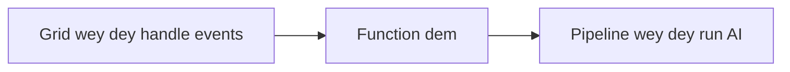

# Chapter 8: Production & Enterprise Patterns

**📚 Course**: [AZD For Beginners](../../README.md) | **⏱️ Duration**: 2-3 hours | **⭐ Complexity**: Advanced

---

## Overview

Dis chapter dey cover deployment patterns wey ready for enterprise, how to harden security, monitoring, an how to optimize cost for production AI workloads.

## Learning Objectives

By finishing dis chapter, you go:
- Deploy multi-region resilient applications
- Implement enterprise security patterns
- Configure comprehensive monitoring
- Optimize costs at scale
- Set up CI/CD pipelines with AZD

---

## 📚 Lessons

| # | Leson | Deskripsion | Taem |
|---|--------|-------------|------|
| 1 | [Production AI Practices](production-ai-practices.md) | Deployment patterns wey enterprise dey use | 90 min |

---

## 🚀 Production Checklist

- [ ] Deploy for many regions make e dey resilient
- [ ] Use managed identity for authentication (no keys)
- [ ] Use Application Insights for monitoring
- [ ] Cost budgets and alerts don set
- [ ] Security scanning don enable
- [ ] CI/CD pipeline integration
- [ ] Get disaster recovery plan

---

## 🏗️ Architecture Patterns

### Pattern 1: Microservices AI


### Pattern 2: Event-Driven AI


---

## 🔐 Security Best Practices

```bicep
// Use managed identity
identity: {
  type: 'SystemAssigned'
}

// Private endpoints for AI services
properties: {
  publicNetworkAccess: 'Disabled'
  networkAcls: {
    defaultAction: 'Deny'
  }
}
```

---

## 💰 Cost Optimization

| Strategy | Savings |
|----------|---------|
| Scale to zero (Container Apps) | 60-80% |
| Use consumption tiers for dev | 50-70% |
| Scheduled scaling | 30-50% |
| Reserved capacity | 20-40% |

```bash
# Put alert dem for budget
az consumption budget create \
  --budget-name "AI-Budget" \
  --amount 500 \
  --category Cost \
  --time-grain Monthly
```

---

## 📊 Monitoring Setup

```bash
# Stream di logs
azd monitor --logs

# Check di Application Insights
azd monitor

# See di metrics
az monitor metrics list --resource <resource-id>
```

---

## 🔗 Navigation

| Direction | Chapter |
|-----------|---------|
| **Previous** | [Chapter 7: Troubleshooting](../chapter-07-troubleshooting/README.md) |
| **Course Complete** | [Course Home](../../README.md) |

---

## 📖 Related Resources

- [AI Agents Guide](../chapter-02-ai-development/agents.md)
- [Application Insights](../chapter-06-pre-deployment/application-insights.md)
- [Multi-Agent Solutions](../chapter-05-multi-agent/README.md)
- [Microservices Example](../../examples/microservices/README.md)

---

<!-- CO-OP TRANSLATOR DISCLAIMER START -->
Disclaimer:
Dis document na AI translation wey dem do with Co-op Translator (https://github.com/Azure/co-op-translator). Even though we dey try make am correct, abeg note say machine translations fit get mistakes or no too correct. Di original document for im own language suppose be di main authority. If na serious or critical information, make you use professional human translator. We no dey liable for any misunderstanding or wrong interpretation wey fit follow from dis translation.
<!-- CO-OP TRANSLATOR DISCLAIMER END -->