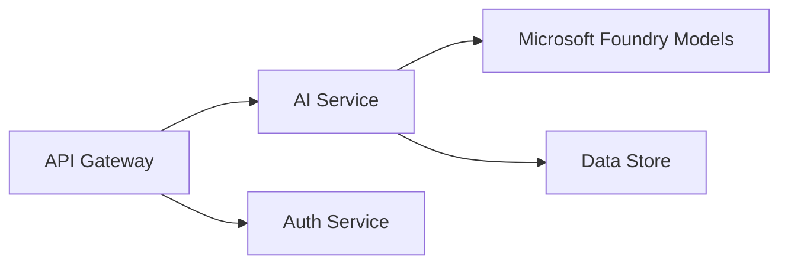

# Chapter 8: Production & Enterprise Patterns

**📚 Course**: [AZD For Beginners](../../README.md) | **⏱️ Duration**: 2-3 hours | **⭐ Complexity**: Advanced

---

## Overview

Dis chapter dey cover enterprise-ready deployment patterns, security stronging, monitoring, and cost optimization for production AI workloads dem.

> Validated against `azd 1.27.1` in July 2026.

## Learning Objectives

As you finish dis chapter, you go:
- Deploy multi-region resilient applications
- Implement enterprise security patterns
- Configure comprehensive monitoring
- Optimize costs at scale
- Set up CI/CD pipelines with AZD

---

## 📚 Lessons

| # | Lesson | Description | Time |
|---|--------|-------------|------|
| 1 | [Production AI Practices](production-ai-practices.md) | Enterprise deployment patterns | 90 min |

---

## 🚀 Production Checklist

- [ ] Multi-region deployment for resilience
- [ ] Managed identity for authentication (no keys)
- [ ] Application Insights for monitoring
- [ ] Cost budgets and alerts configured
- [ ] Security scanning enabled
- [ ] CI/CD pipeline integration
- [ ] Disaster recovery plan

---

## 🏗️ Architecture Patterns

### Pattern 1: Microservices AI



### Pattern 2: Event-Driven AI


---

## 🔐 Security Best Practices

```bicep
// Use managed identity
identity: {
  type: 'SystemAssigned'
}

// Private endpoints for AI services
properties: {
  publicNetworkAccess: 'Disabled'
  networkAcls: {
    defaultAction: 'Deny'
  }
}
```

---

## 💰 Cost Optimization

| Strategy | Savings |
|----------|---------|
| Scale to zero (Container Apps) | 60-80% |
| Use consumption tiers for dev | 50-70% |
| Scheduled scaling | 30-50% |
| Reserved capacity | 20-40% |

```bash
# Set budget alert dem
az consumption budget create \
  --budget-name "AI-Budget" \
  --amount 500 \
  --category Cost \
  --time-grain Monthly
```

---

## 📊 Monitoring Setup

```bash
# Stream logs
azd monitor --logs

# Check Application Insights
azd monitor --overview

# View metrics
az monitor metrics list --resource <resource-id>
```

---

## 🔗 Navigation

| Direction | Chapter |
|-----------|---------|
| **Previous** | [Chapter 7: Troubleshooting](../chapter-07-troubleshooting/README.md) |
| **Course Complete** | [Course Home](../../README.md) |

---

## 📖 Related Resources

- [AI Agents Guide](../chapter-02-ai-development/agents.md)
- [Application Insights](../chapter-06-pre-deployment/application-insights.md)
- [Multi-Agent Solutions](../chapter-05-multi-agent/README.md)
- [Microservices Example](../../examples/microservices/README.md)

---

<!-- CO-OP TRANSLATOR DISCLAIMER START -->
**Disclaimer**:
Dis document don translate wit AI translation service [Co-op Translator](https://github.com/Azure/co-op-translator). Even tho we dey try make am correct, abeg make you know say automated translation fit get errors or mistakes. Di original document for dia own language na im be di correct source. For important info, make person wey sabi human translation do am. We no go responsible for any misunderstanding or wrong understanding wey fit happen because of dis translation.
<!-- CO-OP TRANSLATOR DISCLAIMER END -->