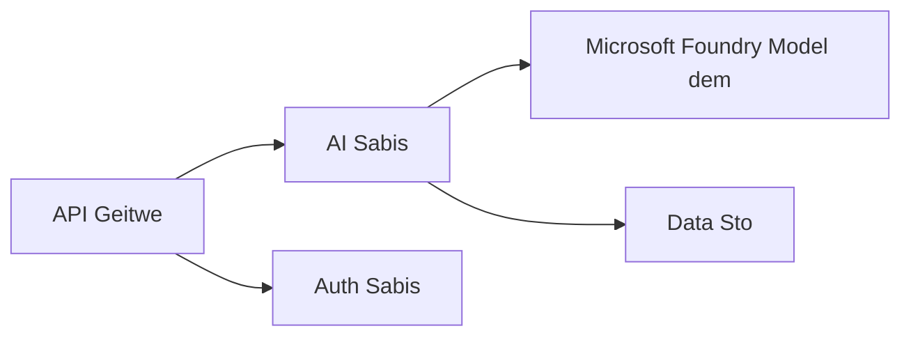
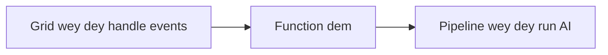

# Chapta 8: Production & Enterprise Patterns

**📚 Kọs**: [AZD For Beginners](../../README.md) | **⏱️ Taim**: 2-3 hours | **⭐ Kompleksiti**: Advanced

---

## Overview

Dis chapta go cover enterprise-ready deployment patterns, how to harden security, monitoring, and how to optimize cost for production AI workloads.

> Dem don validate am wit `azd 1.25.6` for June 2026.

## Learning Objectives

If you finish dis chapta, you go:
- Deploy app wey dey resilient across many regions
- Implement enterprise security pattern dem
- Configure full monitoring
- Optimize cost when things dey scale
- Set up CI/CD pipelines wit AZD

---

## 📚 Lekshon dem

| # | Lekshon | Tori | Taim |
|---|--------|-------------|------|
| 1 | [Production AI Practices](production-ai-practices.md) | Enterprise deployment pattern dem | 90 min |

---

## 🚀 Production Checklist

- [ ] Deploy for many regions make app resilient
- [ ] Use managed identity to authenticate (no keys)
- [ ] Application Insights for monitoring
- [ ] Set cost budgets and alerts
- [ ] Enable security scanning
- [ ] Integrate CI/CD pipeline
- [ ] Disaster recovery plan

---

## 🏗️ Architecture Patterns

### Pattern 1: Microservices AI



### Pattern 2: Event-Driven AI



---

## 🔐 Security Best Practices

```bicep
// Use managed identity
identity: {
  type: 'SystemAssigned'
}

// Private endpoints for AI services
properties: {
  publicNetworkAccess: 'Disabled'
  networkAcls: {
    defaultAction: 'Deny'
  }
}
```

---

## 💰 Cost Optimization

| Strategy | Savings |
|----------|---------|
| Scale to zero (Container Apps) | 60-80% |
| Use consumption tiers for dev | 50-70% |
| Scheduled scaling | 30-50% |
| Reserved capacity | 20-40% |

```bash
# Put alert dem for budget
az consumption budget create \
  --budget-name "AI-Budget" \
  --amount 500 \
  --category Cost \
  --time-grain Monthly
```

---

## 📊 Monitoring Setup

```bash
# Stream di logs
azd monitor --logs

# Check di Application Insights
azd monitor --overview

# See di metrics
az monitor metrics list --resource <resource-id>
```

---

## 🔗 Navigation

| Direction | Chapter |
|-----------|---------|
| **Previous** | [Chapter 7: Troubleshooting](../chapter-07-troubleshooting/README.md) |
| **Course Complete** | [Course Home](../../README.md) |

---

## 📖 Related Resources

- [AI Agents Guide](../chapter-02-ai-development/agents.md)
- [Application Insights](../chapter-06-pre-deployment/application-insights.md)
- [Multi-Agent Solutions](../chapter-05-multi-agent/README.md)
- [Microservices Example](../../examples/microservices/README.md)

---

<!-- CO-OP TRANSLATOR DISCLAIMER START -->
**Disclaimer**:
Dis document don translate wit AI translation service [Co-op Translator](https://github.com/Azure/co-op-translator). Even tho we dey try make am correct, abeg make you know say automated translation fit get errors or mistakes. Di original document for dia own language na im be di correct source. For important info, make person wey sabi human translation do am. We no go responsible for any misunderstanding or wrong understanding wey fit happen because of dis translation.
<!-- CO-OP TRANSLATOR DISCLAIMER END -->