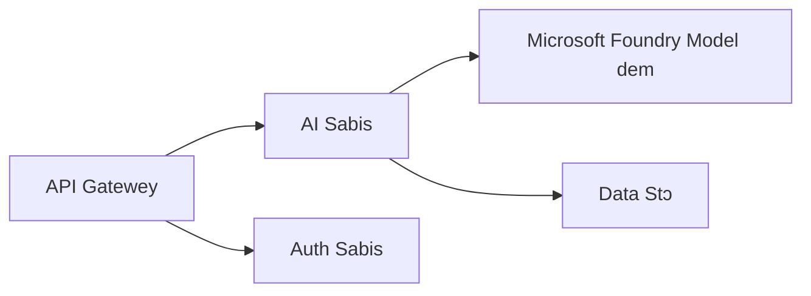
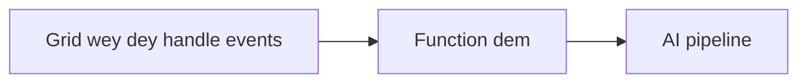

# Chapter 8: Production & Enterprise Patterns

**📚 Course**: [AZD For Beginners](../../README.md) | **⏱️ Duration**: 2-3 hours | **⭐ Complexity**: Advanced

---

## Overview

Dis chapter dey cover enterprise-ready deployment patterns, how to harden security, monitoring, and how to optimize cost for production AI workloads.

> Dem validate am wit `azd 1.23.12` for March 2026.

## Learning Objectives

By completing this chapter, you go:
- Deploy multi-region resilient applications
- Implement enterprise security patterns
- Configure comprehensive monitoring
- Optimize costs at scale
- Set up CI/CD pipelines with AZD

---

## 📚 Lessons

| # | Lekshon | Tori | Time |
|---|--------|-------------|------|
| 1 | [Production AI Practices](production-ai-practices.md) | Enterprise deployment patterns | 90 min |

---

## 🚀 Production Checklist

- [ ] Multi-region deployment for resilience
- [ ] Managed identity for authentication (no keys)
- [ ] Application Insights for monitoring
- [ ] Cost budgets and alerts configured
- [ ] Security scanning enabled
- [ ] CI/CD pipeline integration
- [ ] Disaster recovery plan

---

## 🏗️ Architecture Patterns

### Pattern 1: Microservices AI


### Pattern 2: Event-Driven AI


---

## 🔐 Security Best Practices

```bicep
// Use managed identity
identity: {
  type: 'SystemAssigned'
}

// Private endpoints for AI services
properties: {
  publicNetworkAccess: 'Disabled'
  networkAcls: {
    defaultAction: 'Deny'
  }
}
```

---

## 💰 Cost Optimization

| Strategy | Savings |
|----------|---------|
| Scale to zero (Container Apps) | 60-80% |
| Use consumption tiers for dev | 50-70% |
| Scheduled scaling | 30-50% |
| Reserved capacity | 20-40% |

```bash
# Put budget alert dem
az consumption budget create \
  --budget-name "AI-Budget" \
  --amount 500 \
  --category Cost \
  --time-grain Monthly
```

---

## 📊 Monitoring Setup

```bash
# Stream di logs
azd monitor --logs

# Check di Application Insights
azd monitor --overview

# View di metrics
az monitor metrics list --resource <resource-id>
```

---

## 🔗 Navigation

| Direction | Chapter |
|-----------|---------|
| **Previous** | [Chapter 7: Troubleshooting](../chapter-07-troubleshooting/README.md) |
| **Course Complete** | [Course Home](../../README.md) |

---

## 📖 Related Resources

- [AI Agents Guide](../chapter-02-ai-development/agents.md)
- [Application Insights](../chapter-06-pre-deployment/application-insights.md)
- [Multi-Agent Solutions](../chapter-05-multi-agent/README.md)
- [Microservices Example](../../examples/microservices/README.md)

---

<!-- CO-OP TRANSLATOR DISCLAIMER START -->
**Disclaimer**:
Dis document don translate by AI translation service [Co-op Translator](https://github.com/Azure/co-op-translator). Even though we dey try make am correct, abeg sabi say automated translations fit get errors or mistakes. Di original document for im own native language suppose be di authoritative source. For critical information, we recommend say una use professional human translation. We no dey liable for any misunderstandings or wrong interpretations wey fit come from the use of this translation.
<!-- CO-OP TRANSLATOR DISCLAIMER END -->