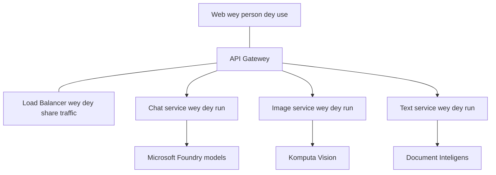

# Production AI Workload Best Practices with AZD

**Chapter Navigation:**
- **📚 Course Home**: [AZD For Beginners](../../README.md)
- **📖 Current Chapter**: Chapter 8 - Production & Enterprise Patterns
- **⬅️ Previous Chapter**: [Chapter 7: Troubleshooting](../chapter-07-troubleshooting/debugging.md)
- **⬅️ Also Related**: [AI Workshop Lab](ai-workshop-lab.md)
- **🎯 Course Complete**: [AZD For Beginners](../../README.md)

## Overview

Dis guide dey give complete best-practices wey you fit follow to deploy production-ready AI workloads wit Azure Developer CLI (AZD). Based on feedback wey we collect from Microsoft Foundry Discord community and real customer deployments, these practices dey tackle the common wahala wey people dey see for production AI systems.

## Key Challenges Addressed

Based on our community poll results, these be the top challenges developers dey face:

- **45%** dey struggle wit multi-service AI deployments
- **38%** get issues wit credential and secret management  
- **35%** dey find production readiness and scaling hard
- **32%** need better cost optimization strategies
- **29%** need improved monitoring and troubleshooting

## Architecture Patterns for Production AI

### Pattern 1: Microservices AI Architecture

**When to use**: For complex AI applications wey get many capabilities



**AZD Implementation**:

```yaml
# azure.yaml
name: enterprise-ai-platform
services:
  web:
    project: ./web
    host: staticwebapp
  api-gateway:
    project: ./api-gateway
    host: containerapp
  chat-service:
    project: ./services/chat
    host: containerapp
  vision-service:
    project: ./services/vision
    host: containerapp
  text-service:
    project: ./services/text
    host: containerapp
```

### Pattern 2: Event-Driven AI Processing

**When to use**: Batch processing, document analysis, async workflows

```bicep
// Event Hub for AI processing pipeline
resource eventHub 'Microsoft.EventHub/namespaces@2023-01-01-preview' = {
  name: eventHubNamespaceName
  location: location
  sku: {
    name: 'Standard'
    tier: 'Standard'
    capacity: 1
  }
}

// Service Bus for reliable message processing
resource serviceBus 'Microsoft.ServiceBus/namespaces@2022-10-01-preview' = {
  name: serviceBusNamespaceName
  location: location
  sku: {
    name: 'Premium'
    tier: 'Premium'
    capacity: 1
  }
}

// Function App for processing
resource functionApp 'Microsoft.Web/sites@2023-01-01' = {
  name: functionAppName
  location: location
  kind: 'functionapp,linux'
  properties: {
    siteConfig: {
      appSettings: [
        {
          name: 'FUNCTIONS_EXTENSION_VERSION'
          value: '~4'
        }
        {
          name: 'AZURE_OPENAI_ENDPOINT'
          value: '@Microsoft.KeyVault(VaultName=${keyVault.name};SecretName=openai-endpoint)'
        }
      ]
    }
  }
}
```

## Thinking About AI Agent Health

When normal web app enter wahala, the symptoms na common: page no load, API return error, or deployment fail. AI-powered applications fit break for all those same ways—but dem fit still misbehave small-small ways wey no dey show clear error messages.

This section go help you build mental model for how to monitor AI workloads so you go sabi where to check when things no dey right.

### How Agent Health Differs from Traditional App Health

Normal app either dey work or e no dey. AI agent fit look like e dey work but e dey give bad results. Think about agent health for two layers:

| Layer | What to Watch | Where to Look |
|-------|--------------|---------------|
| **Infrastructure health** | Is the service running? Are resources provisioned? Are endpoints reachable? | `azd monitor`, Azure Portal resource health, container/app logs |
| **Behavior health** | Is the agent responding accurately? Are responses timely? Is the model being called correctly? | Application Insights traces, model call latency metrics, response quality logs |

Infrastructure health dey familiar—na the same for any azd app. Behavior health na the new layer wey AI workloads dey bring.

### Where to Look When AI Apps Don't Behave as Expected

If your AI application no dey give the kind results wey you expect, here be conceptual checklist:

1. **Start with the basics.** Is the app running? Fit reach im dependencies? Check `azd monitor` and resource health like you go do for any app.
2. **Check the model connection.** Your application dey call the AI model fine? Failed or timed-out model calls na the commonest cause of AI app issues and dem go show for your application logs.
3. **Look at what the model received.** AI responses depend on the input (the prompt and any retrieved context). If output wrong, normally the input wrong. Check whether your app dey send the correct data to the model.
4. **Review response latency.** AI model calls slow pass normal API calls. If your app dey feel slow, check if model response times don increase—this fit mean throttling, capacity limits, or region-level congestion.
5. **Watch for cost signals.** Unexpected spikes for token usage or API calls fit show say you get loop, misconfigured prompt, or too much retries.

You no need master observability tooling sharp-sharp. The main point be say AI applications get extra behavior layer to monitor, and azd's built-in monitoring (`azd monitor`) fit give you starting point to investigate both layers.

---

## Security Best Practices

### 1. Zero-Trust Security Model

**Implementation Strategy**:
- No service-to-service communication without authentication
- All API calls use managed identities
- Network isolation with private endpoints
- Least privilege access controls

```bicep
// Managed Identity for each service
resource chatServiceIdentity 'Microsoft.ManagedIdentity/userAssignedIdentities@2023-01-31' = {
  name: 'chat-service-identity'
  location: location
}

// Role assignments with minimal permissions
resource openAIUserRole 'Microsoft.Authorization/roleAssignments@2022-04-01' = {
  scope: openAIAccount
  name: guid(openAIAccount.id, chatServiceIdentity.id, openAIUserRoleDefinitionId)
  properties: {
    roleDefinitionId: subscriptionResourceId('Microsoft.Authorization/roleDefinitions', '5e0bd9bd-7b93-4f28-af87-19fc36ad61bd')
    principalId: chatServiceIdentity.properties.principalId
    principalType: 'ServicePrincipal'
  }
}
```

### 2. Secure Secret Management

**Key Vault Integration Pattern**:

```bicep
// Key Vault with proper access policies
resource keyVault 'Microsoft.KeyVault/vaults@2023-02-01' = {
  name: keyVaultName
  location: location
  properties: {
    tenantId: tenant().tenantId
    sku: {
      family: 'A'
      name: 'premium'  // Use premium for production
    }
    enableRbacAuthorization: true  // Use RBAC instead of access policies
    enablePurgeProtection: true    // Prevent accidental deletion
    enableSoftDelete: true
    softDeleteRetentionInDays: 90
  }
}

// Store all AI service credentials
resource openAIKeySecret 'Microsoft.KeyVault/vaults/secrets@2023-02-01' = {
  parent: keyVault
  name: 'openai-api-key'
  properties: {
    value: openAIAccount.listKeys().key1
    attributes: {
      enabled: true
    }
  }
}
```

### 3. Network Security

**Private Endpoint Configuration**:

```bicep
// Virtual Network for AI services
resource virtualNetwork 'Microsoft.Network/virtualNetworks@2023-04-01' = {
  name: vnetName
  location: location
  properties: {
    addressSpace: {
      addressPrefixes: ['10.0.0.0/16']
    }
    subnets: [
      {
        name: 'ai-services-subnet'
        properties: {
          addressPrefix: '10.0.1.0/24'
          privateEndpointNetworkPolicies: 'Disabled'
        }
      }
      {
        name: 'app-services-subnet'
        properties: {
          addressPrefix: '10.0.2.0/24'
          delegations: [
            {
              name: 'Microsoft.Web/serverFarms'
              properties: {
                serviceName: 'Microsoft.Web/serverFarms'
              }
            }
          ]
        }
      }
    ]
  }
}

// Private endpoints for all AI services
resource openAIPrivateEndpoint 'Microsoft.Network/privateEndpoints@2023-04-01' = {
  name: '${openAIAccountName}-pe'
  location: location
  properties: {
    subnet: {
      id: virtualNetwork.properties.subnets[0].id
    }
    privateLinkServiceConnections: [
      {
        name: 'openai-connection'
        properties: {
          privateLinkServiceId: openAIAccount.id
          groupIds: ['account']
        }
      }
    ]
  }
}
```

## Performance and Scaling

### 1. Auto-Scaling Strategies

**Container Apps Auto-scaling**:

```bicep
resource containerApp 'Microsoft.App/containerApps@2023-05-01' = {
  name: containerAppName
  location: location
  properties: {
    configuration: {
      ingress: {
        external: true
        targetPort: 8000
        transport: 'http'
      }
    }
    template: {
      scale: {
        minReplicas: 2  // Always have 2 instances minimum
        maxReplicas: 50 // Scale up to 50 for high load
        rules: [
          {
            name: 'http-scaling'
            http: {
              metadata: {
                concurrentRequests: '20'  // Scale when >20 concurrent requests
              }
            }
          }
          {
            name: 'cpu-scaling'
            custom: {
              type: 'cpu'
              metadata: {
                type: 'Utilization'
                value: '70'  // Scale when CPU >70%
              }
            }
          }
        ]
      }
    }
  }
}
```

### 2. Caching Strategies

**Redis Cache for AI Responses**:

```bicep
// Redis Premium for production workloads
resource redisCache 'Microsoft.Cache/redis@2023-04-01' = {
  name: redisCacheName
  location: location
  properties: {
    sku: {
      name: 'Premium'
      family: 'P'
      capacity: 1
    }
    enableNonSslPort: false
    minimumTlsVersion: '1.2'
    redisConfiguration: {
      'maxmemory-policy': 'allkeys-lru'
    }
    // Enable clustering for high availability
    redisVersion: '6.0'
    shardCount: 2
  }
}

// Cache configuration in application
var cacheConnectionString = '${redisCache.properties.hostName}:6380,password=${redisCache.listKeys().primaryKey},ssl=True,abortConnect=False'
```

### 3. Load Balancing and Traffic Management

**Application Gateway with WAF**:

```bicep
// Application Gateway with Web Application Firewall
resource applicationGateway 'Microsoft.Network/applicationGateways@2023-04-01' = {
  name: appGatewayName
  location: location
  properties: {
    sku: {
      name: 'WAF_v2'
      tier: 'WAF_v2'
      capacity: 2
    }
    webApplicationFirewallConfiguration: {
      enabled: true
      firewallMode: 'Prevention'
      ruleSetType: 'OWASP'
      ruleSetVersion: '3.2'
    }
    // Backend pools for AI services
    backendAddressPools: [
      {
        name: 'ai-services-pool'
        properties: {
          backendAddresses: [
            {
              fqdn: '${containerApp.properties.configuration.ingress.fqdn}'
            }
          ]
        }
      }
    ]
  }
}
```

## 💰 Cost Optimization

### 1. Resource Right-Sizing

**Environment-Specific Configurations**:

```bash
# Environment wey dem dey use for development
azd env new development
azd env set AZURE_OPENAI_SKU "S0"
azd env set AZURE_OPENAI_CAPACITY 10
azd env set AZURE_SEARCH_SKU "basic"
azd env set CONTAINER_CPU 0.5
azd env set CONTAINER_MEMORY 1.0

# Environment wey dey run for production
azd env new production
azd env set AZURE_OPENAI_SKU "S0"
azd env set AZURE_OPENAI_CAPACITY 100
azd env set AZURE_SEARCH_SKU "standard"
azd env set CONTAINER_CPU 2.0
azd env set CONTAINER_MEMORY 4.0
```

### 2. Cost Monitoring and Budgets

```bicep
// Cost management and budgets
resource budget 'Microsoft.Consumption/budgets@2023-05-01' = {
  name: 'ai-workload-budget'
  properties: {
    timePeriod: {
      startDate: '2024-01-01'
      endDate: '2024-12-31'
    }
    timeGrain: 'Monthly'
    amount: 2000  // $2000 monthly budget
    category: 'Cost'
    notifications: {
      warning: {
        enabled: true
        operator: 'GreaterThan'
        threshold: 80
        contactEmails: [
          'finance@company.com'
          'engineering@company.com'
        ]
        contactRoles: [
          'Owner'
          'Contributor'
        ]
      }
      critical: {
        enabled: true
        operator: 'GreaterThan'
        threshold: 95
        contactEmails: [
          'cto@company.com'
        ]
      }
    }
  }
}
```

### 3. Token Usage Optimization

**OpenAI Cost Management**:

```typescript
// Token optimization for di app level
class TokenOptimizer {
  private readonly maxTokens = 4000;
  private readonly reserveTokens = 500;
  
  optimizePrompt(userInput: string, context: string): string {
    const availableTokens = this.maxTokens - this.reserveTokens;
    const estimatedTokens = this.estimateTokens(userInput + context);
    
    if (estimatedTokens > availableTokens) {
      // Cut context, no cut di user input
      context = this.truncateContext(context, availableTokens - this.estimateTokens(userInput));
    }
    
    return `${context}\n\nUser: ${userInput}`;
  }
  
  private estimateTokens(text: string): number {
    // Rough estimation: 1 token na about 4 characters
    return Math.ceil(text.length / 4);
  }
}
```

## Monitoring and Observability

### 1. Comprehensive Application Insights

```bicep
// Application Insights with advanced features
resource applicationInsights 'Microsoft.Insights/components@2020-02-02' = {
  name: applicationInsightsName
  location: location
  kind: 'web'
  properties: {
    Application_Type: 'web'
    WorkspaceResourceId: logAnalyticsWorkspace.id
    SamplingPercentage: 100  // Full sampling for AI apps
    DisableIpMasking: false  // Enable for security
  }
}

// Custom metrics for AI operations
resource aiMetricAlerts 'Microsoft.Insights/metricAlerts@2018-03-01' = {
  name: 'ai-high-error-rate'
  location: 'global'
  properties: {
    description: 'Alert when AI service error rate is high'
    severity: 2
    enabled: true
    scopes: [
      applicationInsights.id
    ]
    evaluationFrequency: 'PT1M'
    windowSize: 'PT5M'
    criteria: {
      'odata.type': 'Microsoft.Azure.Monitor.SingleResourceMultipleMetricCriteria'
      allOf: [
        {
          name: 'high-error-rate'
          metricName: 'requests/failed'
          operator: 'GreaterThan'
          threshold: 10
          timeAggregation: 'Count'
        }
      ]
    }
  }
}
```

### 2. AI-Specific Monitoring

**Custom Dashboards for AI Metrics**:

```json
// Dashboard configuration for AI workloads
{
  "dashboard": {
    "name": "AI Application Monitoring",
    "tiles": [
      {
        "name": "OpenAI Request Volume",
        "query": "requests | where name contains 'openai' | summarize count() by bin(timestamp, 5m)"
      },
      {
        "name": "AI Response Latency",
        "query": "requests | where name contains 'openai' | summarize avg(duration) by bin(timestamp, 5m)"
      },
      {
        "name": "Token Usage",
        "query": "customMetrics | where name == 'openai_tokens_used' | summarize sum(value) by bin(timestamp, 1h)"
      },
      {
        "name": "Cost per Hour",
        "query": "customMetrics | where name == 'openai_cost' | summarize sum(value) by bin(timestamp, 1h)"
      }
    ]
  }
}
```

### 3. Health Checks and Uptime Monitoring

```bicep
// Application Insights availability tests
resource availabilityTest 'Microsoft.Insights/webtests@2022-06-15' = {
  name: 'ai-app-availability-test'
  location: location
  tags: {
    'hidden-link:${applicationInsights.id}': 'Resource'
  }
  properties: {
    SyntheticMonitorId: 'ai-app-availability-test'
    Name: 'AI Application Availability Test'
    Description: 'Tests AI application endpoints'
    Enabled: true
    Frequency: 300  // 5 minutes
    Timeout: 120    // 2 minutes
    Kind: 'ping'
    Locations: [
      {
        Id: 'us-east-2-azr'
      }
      {
        Id: 'us-west-2-azr'
      }
    ]
    Configuration: {
      WebTest: '''
        <WebTest Name="AI Health Check" 
                 Id="8d2de8d2-a2b0-4c2e-9a0d-8f9c9a0b8c8d" 
                 Enabled="True" 
                 CssProjectStructure="" 
                 CssIteration="" 
                 Timeout="120" 
                 WorkItemIds="" 
                 xmlns="http://microsoft.com/schemas/VisualStudio/TeamTest/2010" 
                 Description="" 
                 CredentialUserName="" 
                 CredentialPassword="" 
                 PreAuthenticate="True" 
                 Proxy="default" 
                 StopOnError="False" 
                 RecordedResultFile="" 
                 ResultsLocale="">
          <Items>
            <Request Method="GET" 
                     Guid="a5f10126-e4cd-570d-961c-cea43999a200" 
                     Version="1.1" 
                     Url="${webApp.properties.defaultHostName}/health" 
                     ThinkTime="0" 
                     Timeout="120" 
                     ParseDependentRequests="True" 
                     FollowRedirects="True" 
                     RecordResult="True" 
                     Cache="False" 
                     ResponseTimeGoal="0" 
                     Encoding="utf-8" 
                     ExpectedHttpStatusCode="200" 
                     ExpectedResponseUrl="" 
                     ReportingName="" 
                     IgnoreHttpStatusCode="False" />
          </Items>
        </WebTest>
      '''
    }
  }
}
```

## Disaster Recovery and High Availability

### 1. Multi-Region Deployment

```yaml
# azure.yaml - Multi-region configuration
name: ai-app-multiregion
services:
  api-primary:
    project: ./api
    host: containerapp
    env:
      - AZURE_REGION=eastus
  api-secondary:
    project: ./api
    host: containerapp
    env:
      - AZURE_REGION=westus2
```

```bicep
// Traffic Manager for global load balancing
resource trafficManager 'Microsoft.Network/trafficManagerProfiles@2022-04-01' = {
  name: trafficManagerProfileName
  location: 'global'
  properties: {
    profileStatus: 'Enabled'
    trafficRoutingMethod: 'Priority'
    dnsConfig: {
      relativeName: trafficManagerProfileName
      ttl: 30
    }
    monitorConfig: {
      protocol: 'HTTPS'
      port: 443
      path: '/health'
      intervalInSeconds: 30
      toleratedNumberOfFailures: 3
      timeoutInSeconds: 10
    }
    endpoints: [
      {
        name: 'primary-endpoint'
        type: 'Microsoft.Network/trafficManagerProfiles/azureEndpoints'
        properties: {
          targetResourceId: primaryAppService.id
          endpointStatus: 'Enabled'
          priority: 1
        }
      }
      {
        name: 'secondary-endpoint'
        type: 'Microsoft.Network/trafficManagerProfiles/azureEndpoints'
        properties: {
          targetResourceId: secondaryAppService.id
          endpointStatus: 'Enabled'
          priority: 2
        }
      }
    ]
  }
}
```

### 2. Data Backup and Recovery

```bicep
// Backup configuration for critical data
resource backupVault 'Microsoft.DataProtection/backupVaults@2023-05-01' = {
  name: backupVaultName
  location: location
  identity: {
    type: 'SystemAssigned'
  }
  properties: {
    storageSettings: [
      {
        datastoreType: 'VaultStore'
        type: 'LocallyRedundant'
      }
    ]
  }
}

// Backup policy for AI models and data
resource backupPolicy 'Microsoft.DataProtection/backupVaults/backupPolicies@2023-05-01' = {
  parent: backupVault
  name: 'ai-data-backup-policy'
  properties: {
    policyRules: [
      {
        backupParameters: {
          backupType: 'Full'
          objectType: 'AzureBackupParams'
        }
        trigger: {
          schedule: {
            repeatingTimeIntervals: [
              'R/2024-01-01T02:00:00+00:00/P1D'  // Daily at 2 AM
            ]
          }
          objectType: 'ScheduleBasedTriggerContext'
        }
        dataStore: {
          datastoreType: 'VaultStore'
          objectType: 'DataStoreInfoBase'
        }
        name: 'BackupDaily'
        objectType: 'AzureBackupRule'
      }
    ]
  }
}
```

## DevOps and CI/CD Integration

### 1. GitHub Actions Workflow

```yaml
# .github/workflows/deploy-ai-app.yml
name: Deploy AI Application

on:
  push:
    branches: [main]
  pull_request:
    branches: [main]

jobs:
  test:
    runs-on: ubuntu-latest
    steps:
      - uses: actions/checkout@v4
      
      - name: Setup Python
        uses: actions/setup-python@v4
        with:
          python-version: '3.11'
          
      - name: Install dependencies
        run: |
          pip install -r requirements.txt
          pip install pytest
          
      - name: Run tests
        run: pytest tests/
        
      - name: AI Safety Tests
        run: |
          python scripts/test_ai_safety.py
          python scripts/validate_prompts.py

  deploy-staging:
    needs: test
    if: github.event_name == 'pull_request'
    runs-on: ubuntu-latest
    steps:
      - uses: actions/checkout@v4
      
      - name: Setup AZD
        uses: Azure/setup-azd@v2
        
      - name: Login to Azure
        uses: azure/login@v1
        with:
          creds: ${{ secrets.AZURE_CREDENTIALS }}
          
      - name: Deploy to Staging
        run: |
          azd env select staging
          azd deploy

  deploy-production:
    needs: test
    if: github.ref == 'refs/heads/main'
    runs-on: ubuntu-latest
    steps:
      - uses: actions/checkout@v4
      
      - name: Setup AZD
        uses: Azure/setup-azd@v2
        
      - name: Login to Azure
        uses: azure/login@v1
        with:
          creds: ${{ secrets.AZURE_CREDENTIALS }}
          
      - name: Deploy to Production
        run: |
          azd env select production
          azd deploy
          
      - name: Run Production Health Checks
        run: |
          python scripts/health_check.py --env production
```

### 2. Infrastructure Validation

```bash
# scripts/validate_infrastructure.sh
#!/bin/bash

echo "Validating AI infrastructure deployment..."

# Make sure say all di required services dey run
services=("openai" "search" "storage" "keyvault")
for service in "${services[@]}"; do
    echo "Checking $service..."
    if ! az resource list --resource-type "Microsoft.CognitiveServices/accounts" --query "[?contains(name, '$service')]" -o tsv; then
        echo "ERROR: $service not found"
        exit 1
    fi
done

# Check di OpenAI models wey dem don deploy
echo "Validating OpenAI model deployments..."
models=$(az cognitiveservices account deployment list --name $AZURE_OPENAI_NAME --resource-group $AZURE_RESOURCE_GROUP --query "[].name" -o tsv)
if [[ ! $models == *"gpt-4.1-mini"* ]]; then
  echo "ERROR: Required model gpt-4.1-mini not deployed"
    exit 1
fi

# Test if AI service connection dey work
echo "Testing AI service connectivity..."
python scripts/test_connectivity.py

echo "Infrastructure validation completed successfully!"
```

## Production Readiness Checklist

### Security ✅
- [ ] All services use managed identities
- [ ] Secrets stored in Key Vault
- [ ] Private endpoints configured
- [ ] Network security groups implemented
- [ ] RBAC with least privilege
- [ ] WAF enabled on public endpoints

### Performance ✅
- [ ] Auto-scaling configured
- [ ] Caching implemented
- [ ] Load balancing setup
- [ ] CDN for static content
- [ ] Database connection pooling
- [ ] Token usage optimization

### Monitoring ✅
- [ ] Application Insights configured
- [ ] Custom metrics defined
- [ ] Alerting rules setup
- [ ] Dashboard created
- [ ] Health checks implemented
- [ ] Log retention policies

### Reliability ✅
- [ ] Multi-region deployment
- [ ] Backup and recovery plan
- [ ] Circuit breakers implemented
- [ ] Retry policies configured
- [ ] Graceful degradation
- [ ] Health check endpoints

### Cost Management ✅
- [ ] Budget alerts configured
- [ ] Resource right-sizing
- [ ] Dev/test discounts applied
- [ ] Reserved instances purchased
- [ ] Cost monitoring dashboard
- [ ] Regular cost reviews

### Compliance ✅
- [ ] Data residency requirements met
- [ ] Audit logging enabled
- [ ] Compliance policies applied
- [ ] Security baselines implemented
- [ ] Regular security assessments
- [ ] Incident response plan

## Performance Benchmarks

### Typical Production Metrics

| Metric | Target | Monitoring |
|--------|--------|------------|
| **Response Time** | < 2 seconds | Application Insights |
| **Availability** | 99.9% | Uptime monitoring |
| **Error Rate** | < 0.1% | Application logs |
| **Token Usage** | < $500/month | Cost management |
| **Concurrent Users** | 1000+ | Load testing |
| **Recovery Time** | < 1 hour | Disaster recovery tests |

### Load Testing

```bash
# Script wey dey do load testing for AI apps
python scripts/load_test.py \
  --endpoint https://your-ai-app.azurewebsites.net \
  --concurrent-users 100 \
  --duration 300 \
  --ramp-up 60
```

## 🤝 Community Best Practices

Based on Microsoft Foundry Discord community feedback:

### Top Recommendations from the Community:

1. **Start Small, Scale Gradually**: Begin with basic SKUs and scale up based on actual usage
2. **Monitor Everything**: Set up comprehensive monitoring from day one
3. **Automate Security**: Use infrastructure as code for consistent security
4. **Test Thoroughly**: Include AI-specific testing in your pipeline
5. **Plan for Costs**: Monitor token usage and set budget alerts early

### Common Pitfalls to Avoid:

- ❌ Hardcoding API keys in code
- ❌ Not setting up proper monitoring
- ❌ Ignoring cost optimization
- ❌ Not testing failure scenarios
- ❌ Deploying without health checks

## AZD AI CLI Commands and Extensions

AZD get plenti AI-specific commands and extensions wey dey make production AI workflows easier. These tools dey bridge the gap between local development and production deployment for AI workloads.

### AZD Extensions for AI

AZD dey use extension system to add AI-specific capabilities. Install and manage extensions with:

```bash
# Make list of all di extensions wey dey available (including AI)
azd extension list

# Check di details of di installed extensions
azd extension show azure.ai.agents

# Install di Foundry agents extension
azd extension install azure.ai.agents

# Install di fine-tuning extension
azd extension install azure.ai.finetune

# Install di custom models extension
azd extension install azure.ai.models

# Upgrade all di installed extensions
azd extension upgrade --all
```

**Available AI extensions:**

| Extension | Purpose | Status |
|-----------|---------|--------|
| `azure.ai.agents` | Foundry Agent Service management | Preview |
| `azure.ai.skills` | Reusable agent skills | Preview |
| `azure.ai.connections` | Foundry connections (data sources, tools) | Preview |
| `azure.ai.finetune` | Foundry model fine-tuning | Preview |
| `azure.ai.models` | Foundry custom models | Preview |
| `azure.coding-agent` | Coding agent configuration | Available |

> The `azure.ai.agents` extension dey evolve fast. This course validate against `0.1.40-preview`. Run `azd extension upgrade --all` to pick up the latest command set, and `azd extension show azure.ai.agents` to confirm the version wey you install.

**Wetin be the newer `skills` and `connections` extensions?**

Two preview extensions show for side-by-side wit the agent tooling and dem worth to sabi even if you be beginner:

- **`azure.ai.skills`** — A **skill** na reusable capability (na packaged tool or behavior) wey you fit attach to one or more agents instead of to re-implement am every time. Think am like shared building block: define "search the docs" or "look up an order" skill once, then reuse am across agents. This one dey help multi-agent systems (Chapter 5) make dem consistent and avoid copy-paste.
- **`azure.ai.connections`** — A **connection** na managed link from your Foundry project to external resource wey agents need—data source (like Azure AI Search), tool endpoint, or another service. Connections centralize where and how agents access data, so credentials and endpoints dey for one governed place instead of scatter for code.

You no need these to deploy your first agents—stick with `azure.ai.agents` while you dey learn. Use `skills` when you dey repeat the same tool across agents, and `connections` when many agents share the same data source.

### Initializing Agent Projects with `azd ai agent init`

The `azd ai agent init` command go scaffold production-ready AI agent project wey integrate with Microsoft Foundry Agent Service:

```bash
# Start wan new agent project from de agent manifest
azd ai agent init -m <manifest-path-or-uri>

# Set up an point am to wan specific Foundry project
azd ai agent init -m agent-manifest.yaml --project-id <foundry-project-id>

# Set up wit wan custom source directory
azd ai agent init -m agent-manifest.yaml --src ./agents/my-agent

# Make Container Apps de host
azd ai agent init -m agent-manifest.yaml --host containerapp
```

**Key flags:**

| Flag | Description |
|------|-------------|
| `-m, --manifest` | Path or URI to an agent manifest to add to your project |
| `-p, --project-id` | Existing Microsoft Foundry Project ID for your azd environment |
| `-s, --src` | Directory to download the agent definition (defaults to `src/<agent-id>`) |
| `--host` | Override the default host (e.g., `containerapp`) |
| `-e, --environment` | The azd environment to use |

**Production tip**: Use `--project-id` to connect direct to existing Foundry project, so your agent code and cloud resources go stay linked from the start.

### Managing the Agent Lifecycle

Beyond `init`, the `azure.ai.agents` extension get commands for full lifecycle of a hosted agent—testing, evaluating, optimizing, and retiring am:

```bash
# Call agent wey dem don deploy make you see server response timing
# (total delay and time wey e take reach di first byte)
azd ai agent invoke

# Show di live endpoint configuration before you change am
azd ai agent endpoint show

# Generate evaluation dataset for di agent
azd ai agent eval generate --dataset ./eval/dataset.jsonl

# Optimize di agent instructions using your evaluation data
# (e require one optimization_model inside di agent project)
azd ai agent optimize

# Download di deployed source of code-based hosted agent
# (wit SHA-256 verification)
azd ai agent code download

# Delete di hosted agent and all of im versions
# (--force go terminate active sessions)
azd ai agent delete --force
```

**Lifecycle at a glance:**

| Stage | Command | Production use |
|-------|---------|----------------|
| Test | `azd ai agent invoke` | Validate responses and measure latency before release |
| Inspect | `azd ai agent endpoint show` | Review endpoint auth/config; spot breaking changes early |
| Measure | `azd ai agent eval generate` | Build a repeatable evaluation set from real traces |
| Improve | `azd ai agent optimize` | Tune instructions against measured quality |
| Recover | `azd ai agent code download` | Retrieve the exact deployed source for audit/rollback |
| Retire | `azd ai agent delete --force` | Tear down an agent and its versions cleanly |

> These commands still dey preview and fit change between extension releases. Run `azd ai agent --help` to see the exact subcommands wey dey your installed version.

### Model Context Protocol (MCP) with `azd mcp`
AZD get built-in MCP server support (Alpha), wey enable AI agents and tools to interact wit your Azure resources through one standardized protocol:

```bash
# Start di MCP server for your project
azd mcp start

# Check di current Coppilot consent rules wey dey for tool execution
azd copilot consent list
```

The MCP server dey expose your azd project context—environments, services, and Azure resources—to AI-powered development tools. Dis one fit do:

- **AI-assisted deployment**: Make coding agents fit ask about your project state and trigger deployments
- **Resource discovery**: AI tools fit find which Azure resources your project dey use
- **Environment management**: Agents fit switch between dev/staging/production environments

### Infrastructure Generation with `azd infra generate`

For production AI workloads, you fit generate and customize Infrastructure as Code instead of relying on automatic provisioning:

```bash
# Make Bicep/Terraform files from di way wey you define your project
azd infra generate
```

This go write IaC to disk so you fit:
- Check and audit infrastructure before you deploy
- Add custom security policies (network rules, private endpoints)
- Integrate wit existing IaC review processes
- Put infrastructure changes under version control separate from application code

### Production Lifecycle Hooks

AZD hooks make you fit inject custom logic at every stage of the deployment lifecycle—wey critical for production AI workflows:

```yaml
# azure.yaml - Production hooks example
name: ai-production-app
hooks:
  preprovision:
    shell: sh
    run: scripts/validate-quotas.sh    # Check AI model quota before provisioning
  postprovision:
    shell: sh
    run: scripts/configure-networking.sh  # Set up private endpoints
  predeploy:
    shell: sh
    run: scripts/run-ai-safety-tests.sh  # Run prompt safety checks
  postdeploy:
    shell: sh
    run: scripts/smoke-test.sh           # Verify agent responses post-deploy
services:
  agent-api:
    project: ./src/agent
    host: containerapp
    hooks:
      predeploy:
        shell: sh
        run: scripts/validate-model-access.sh  # Per-service hook
```

```bash
# Run one particular hook by hand while you dey develop
azd hooks run predeploy
```

**Recommended production hooks for AI workloads:**

| Hook | Use Case |
|------|----------|
| `preprovision` | Check subscription quotas for AI model capacity |
| `postprovision` | Configure private endpoints, deploy model weights |
| `predeploy` | Run AI safety tests, validate prompt templates |
| `postdeploy` | Do smoke test for agent responses, verify model connectivity |

### CI/CD Pipeline Configuration

Use `azd pipeline config` to connect your project to GitHub Actions or Azure Pipelines wit secure Azure authentication:

```bash
# Set up CI/CD pipeline (wey you go dey answer questions)
azd pipeline config

# Set up wit one specific provider
azd pipeline config --provider github
```

Dis command:
- Creates one service principal wit least-privilege access
- Configures federated credentials (no stored secrets)
- Generates or updates your pipeline definition file
- Sets required environment variables in your CI/CD system

#### Step-by-step: your first GitHub Actions pipeline

Here na the full walkthrough from a working azd project go reach automated deployments on every push.

**1. Make sure your project dey for GitHub**

```bash
git init
git add .
git commit -m "Initial azd project"
gh repo create my-ai-app --private --source=. --push
```

**2. Run pipeline config**

```bash
azd pipeline config --provider github
```

azd go, interactively:
- Ask which Azure subscription and environment make you wan target
- Create an Entra **app registration + service principal** for the pipeline
- Set up **federated credentials (OIDC)**—so GitHub go authenticate to Azure with short-lived tokens and **no secrets dey stored**
- Push the required **variables** to your GitHub repo (`AZURE_CLIENT_ID`, `AZURE_TENANT_ID`, `AZURE_SUBSCRIPTION_ID`, `AZURE_ENV_NAME`, `AZURE_LOCATION`)

**3. Understand the generated workflow**

azd go add `.github/workflows/azure-dev.yml`. The key parts dey like this:

```yaml
# .github/workflows/azure-dev.yml
on:
  push:
    branches: [ main ]
  workflow_dispatch:        # lets you run it manually too

permissions:
  id-token: write           # required for OIDC federated login
  contents: read

jobs:
  build:
    runs-on: ubuntu-latest
    env:
      AZURE_CLIENT_ID: ${{ vars.AZURE_CLIENT_ID }}
      AZURE_TENANT_ID: ${{ vars.AZURE_TENANT_ID }}
      AZURE_SUBSCRIPTION_ID: ${{ vars.AZURE_SUBSCRIPTION_ID }}
      AZURE_ENV_NAME: ${{ vars.AZURE_ENV_NAME }}
      AZURE_LOCATION: ${{ vars.AZURE_LOCATION }}
    steps:
      - uses: actions/checkout@v4
      - name: Install azd
        uses: Azure/setup-azd@v2
      - name: Log in with OIDC
        run: azd auth login --client-id "$AZURE_CLIENT_ID" --federated-credential-provider "github" --tenant-id "$AZURE_TENANT_ID"
      - name: Provision infrastructure
        run: azd provision --no-prompt
      - name: Deploy application
        run: azd deploy --no-prompt
```

**4. Verify it works**

```bash
# Push one change make the pipeline start
git commit -am "Trigger pipeline" --allow-empty
git push
```

Open the **Actions** tab in your GitHub repo and watch the workflow run `azd provision` and `azd deploy` automatically.

> **Why federated credentials matter:** old pipelines dey store a client secret for GitHub. OIDC federated credentials remove that secret complete—GitHub go request short-lived token at runtime, wey dey more secure and nothing to rotate or leak. Na dis `azd pipeline config` set up by default.

> **Secrets vs. variables:** non-sensitive identifiers (`AZURE_CLIENT_ID`, etc.) na them go inside repo **variables**. If your app really need secret at build time, add am as a GitHub **secret** and reference am with `${{ secrets.NAME }}`—but try use Key Vault + managed identity at runtime (see [Chapter 3](../chapter-03-configuration/authsecurity.md)).

**Production workflow with pipeline config:**

```bash
# 1. Make di production environment ready
azd env new production
azd env set AZURE_OPENAI_CAPACITY 100

# 2. Configure di pipeline
azd pipeline config --provider github

# 3. Di pipeline dey run azd deploy every time dem push to main
```

#### Step-by-step: Azure DevOps Pipelines

You prefer Azure DevOps over GitHub Actions? azd dey support am natively with the `azdo` provider. The flow almost the same—azd generates the pipeline file, creates a service connection, and wires up authentication.

**1. Make sure sey you get Azure DevOps project**

You go need organization and project for `https://dev.azure.com/<your-org>`. Generate Personal Access Token (PAT) wit **Build (Read & execute)**, **Code (Read & write)**, and **Service Connections (Read, query & manage)** scopes—azd go ask you for am.

**2. Configure the pipeline**

```bash
azd pipeline config --provider azdo
```

azd go:
- Ask for your Azure DevOps organization and project
- Create (or reuse) a **service connection** to Azure using a service principal
- Configure **workload identity federation (OIDC)** so no client secret dey stored
- Commit an `azure-dev.yml` pipeline definition to your repo

**3. Review the generated `azure-dev.yml`**

azd go write pipeline wey go provision and deploy on every push to `main`:

```yaml
# azure-dev.yml
trigger:
  - main

pool:
  vmImage: ubuntu-latest

steps:
  - task: setup-azd@1
    displayName: Install azd

  - script: azd provision --no-prompt
    displayName: Provision Infrastructure
    env:
      AZURE_SUBSCRIPTION_ID: $(AZURE_SUBSCRIPTION_ID)
      AZURE_ENV_NAME: $(AZURE_ENV_NAME)
      AZURE_LOCATION: $(AZURE_LOCATION)

  - script: azd deploy --no-prompt
    displayName: Deploy Application
    env:
      AZURE_SUBSCRIPTION_ID: $(AZURE_SUBSCRIPTION_ID)
      AZURE_ENV_NAME: $(AZURE_ENV_NAME)
      AZURE_LOCATION: $(AZURE_LOCATION)
```

**4. Where the variables dey come from**

azd dey store the environment values (`AZURE_ENV_NAME`, `AZURE_LOCATION`, `AZURE_SUBSCRIPTION_ID`) as a **variable group** in Azure DevOps so the pipeline fit read dem. You fit view and edit dem under **Pipelines → Library**.

> **Same OIDC benefit as GitHub:** the `azdo` provider too dey configure workload identity federation by default, so no client secret dey stored in the service connection—Azure DevOps go exchange short-lived token at runtime. Pass `--auth-type client-credentials` only if your organization no fit use OIDC yet.

**5. Run it**

```bash
git commit -am "Add Azure DevOps pipeline" --allow-empty
git push
```

Open **Pipelines** in Azure DevOps make you watch `azd provision` and `azd deploy` run.

### Adding Components with `azd add`

Small-small add Azure services to an existing project:

```bash
# Add new service component by answering question dem
azd add
```

Dis one especially useful when you dey expand production AI applications—for example, add vector search service, a new agent endpoint, or a monitoring component to an existing deployment.

## Additional Resources

- **Azure Well-Architected Framework**: [AI workload guidance](https://learn.microsoft.com/azure/well-architected/ai/)
- **Microsoft Foundry Documentation**: [Official docs](https://learn.microsoft.com/azure/ai-studio/)
- **Community Templates**: [Azure Samples](https://github.com/Azure-Samples)
- **Discord Community**: [#Azure channel](https://discord.gg/microsoft-azure)
- **Agent Skills for Azure**: [microsoft/github-copilot-for-azure on skills.sh](https://skills.sh/microsoft/github-copilot-for-azure) - 37 open agent skills for Azure AI, Foundry, deployment, cost optimization, and diagnostics. Install for your editor:
  ```bash
  npx skills add microsoft/github-copilot-for-azure
  ```

---

**Chapter Navigation:**
- **📚 Course Home**: [AZD For Beginners](../../README.md)
- **📖 Current Chapter**: Chapter 8 - Production & Enterprise Patterns
- **⬅️ Previous Chapter**: [Chapter 7: Troubleshooting](../chapter-07-troubleshooting/debugging.md)
- **⬅️ Also Related**: [AI Workshop Lab](ai-workshop-lab.md)
- **� Course Complete**: [AZD For Beginners](../../README.md)

**Remember**: Production AI workloads need careful planning, monitoring, and continuous optimization. Start with these patterns and adapt dem to your specific requirements.

---

<!-- CO-OP TRANSLATOR DISCLAIMER START -->
**Disclaimer**:
Dis document don translate wit AI translation service [Co-op Translator](https://github.com/Azure/co-op-translator). Even tho we dey try make am correct, abeg make you know say automated translation fit get errors or mistakes. Di original document for dia own language na im be di correct source. For important info, make person wey sabi human translation do am. We no go responsible for any misunderstanding or wrong understanding wey fit happen because of dis translation.
<!-- CO-OP TRANSLATOR DISCLAIMER END -->