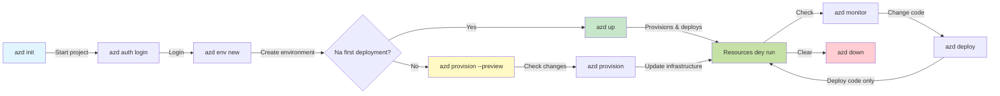
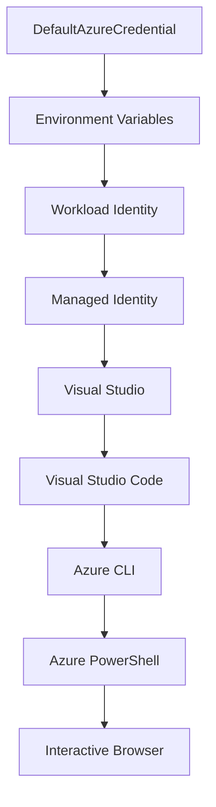

<!--
CO_OP_TRANSLATOR_METADATA:
{
  "original_hash": "e855e899d2705754fe85b04190edd0f0",
  "translation_date": "2025-11-24T13:49:18+00:00",
  "source_file": "docs/getting-started/azd-basics.md",
  "language_code": "pcm"
}
-->
# AZD Basics - Core Concepts and Fundamentals

**Chapter Navigation:**
- **📚 Course Home**: [AZD For Beginners](../../README.md)
- **📖 Current Chapter**: Chapter 1 - Foundation & Quick Start
- **⬅️ Previous**: [Course Overview](../../README.md#-chapter-1-foundation--quick-start)
- **➡️ Next**: [Installation & Setup](installation.md)
- **🚀 Next Chapter**: [Chapter 2: AI-First Development](../microsoft-foundry/microsoft-foundry-integration.md)

## Introduction

Dis lesson go show you wetin Azure Developer CLI (azd) be, one strong command-line tool wey go help you move fast from local development go Azure deployment. You go sabi di main ideas, di key features, and how azd dey make cloud-native application deployment easy.

## Learning Goals

By di end of dis lesson, you go:
- Sabi wetin Azure Developer CLI be and wetin e dey do
- Learn di main ideas like templates, environments, and services
- Check di key features like template-driven development and Infrastructure as Code
- Understand di azd project structure and workflow
- Ready to install and set up azd for your development environment

## Learning Outcomes

After you finish dis lesson, you go fit:
- Explain di role of azd for modern cloud development workflows
- Identify di parts of azd project structure
- Talk how templates, environments, and services dey work together
- Understand di benefits of Infrastructure as Code with azd
- Recognize different azd commands and wetin dem dey do

## Wetin Azure Developer CLI (azd) Be?

Azure Developer CLI (azd) na command-line tool wey dem design to help you move fast from local development go Azure deployment. E dey make di process of building, deploying, and managing cloud-native applications for Azure easy.

### 🎯 Why You Go Use AZD? Real-Life Comparison

Make we compare how to deploy one simple web app with database:

#### ❌ WITHOUT AZD: Manual Azure Deployment (30+ minutes)

```bash
# Step 1: Create resource group
az group create --name myapp-rg --location eastus

# Step 2: Create App Service Plan
az appservice plan create --name myapp-plan \
  --resource-group myapp-rg \
  --sku B1 --is-linux

# Step 3: Create Web App
az webapp create --name myapp-web-unique123 \
  --resource-group myapp-rg \
  --plan myapp-plan \
  --runtime "NODE:18-lts"

# Step 4: Create Cosmos DB account (10-15 minutes)
az cosmosdb create --name myapp-cosmos-unique123 \
  --resource-group myapp-rg \
  --kind MongoDB

# Step 5: Create database
az cosmosdb mongodb database create \
  --account-name myapp-cosmos-unique123 \
  --resource-group myapp-rg \
  --name tododb

# Step 6: Create collection
az cosmosdb mongodb collection create \
  --account-name myapp-cosmos-unique123 \
  --resource-group myapp-rg \
  --database-name tododb \
  --name todos

# Step 7: Get connection string
CONN_STR=$(az cosmosdb keys list \
  --name myapp-cosmos-unique123 \
  --resource-group myapp-rg \
  --type connection-strings \
  --query "connectionStrings[0].connectionString" -o tsv)

# Step 8: Configure app settings
az webapp config appsettings set \
  --name myapp-web-unique123 \
  --resource-group myapp-rg \
  --settings MONGODB_URI="$CONN_STR"

# Step 9: Enable logging
az webapp log config --name myapp-web-unique123 \
  --resource-group myapp-rg \
  --application-logging filesystem \
  --detailed-error-messages true

# Step 10: Set up Application Insights
az monitor app-insights component create \
  --app myapp-insights \
  --location eastus \
  --resource-group myapp-rg

# Step 11: Link App Insights to Web App
INSTRUMENTATION_KEY=$(az monitor app-insights component show \
  --app myapp-insights \
  --resource-group myapp-rg \
  --query "instrumentationKey" -o tsv)

az webapp config appsettings set \
  --name myapp-web-unique123 \
  --resource-group myapp-rg \
  --settings APPINSIGHTS_INSTRUMENTATIONKEY="$INSTRUMENTATION_KEY"

# Step 12: Build application locally
npm install
npm run build

# Step 13: Create deployment package
zip -r app.zip . -x "*.git*" "node_modules/*"

# Step 14: Deploy application
az webapp deployment source config-zip \
  --resource-group myapp-rg \
  --name myapp-web-unique123 \
  --src app.zip

# Step 15: Wait make e work 🙏
# (No automated validation, manual testing go dey required)
```

**Problems:**
- ❌ 15+ commands wey you go need remember and run one by one
- ❌ 30-45 minutes of manual work
- ❌ Mistakes fit happen (typos, wrong parameters)
- ❌ Connection strings go show for terminal history
- ❌ No automatic rollback if something fail
- ❌ Hard for team members to repeat am
- ❌ E go dey different every time (no consistency)

#### ✅ WITH AZD: Automated Deployment (5 commands, 10-15 minutes)

```bash
# Step 1: Start wit template
azd init --template todo-nodejs-mongo

# Step 2: Confirm say na you
azd auth login

# Step 3: Set up di environment
azd env new dev

# Step 4: Check di changes wey you wan do (e no dey compulsory but e good)
azd provision --preview

# Step 5: Put everything for work
azd up

# ✨ E don finish! Everything don dey work, set up, and dem dey monitor am
```

**Benefits:**
- ✅ **5 commands** instead of 15+ manual steps
- ✅ **10-15 minutes** total time (na Azure go take most of di time)
- ✅ **No errors** - e dey automated and tested
- ✅ **Secrets dey secure** with Key Vault
- ✅ **Automatic rollback** if e fail
- ✅ **Consistent results** - e dey same every time
- ✅ **Team-ready** - anybody fit deploy with di same commands
- ✅ **Infrastructure as Code** - version-controlled Bicep templates
- ✅ **Monitoring dey built-in** - Application Insights dey set up automatically

### 📊 Time & Error Reduction

| Metric | Manual Deployment | AZD Deployment | Improvement |
|:-------|:------------------|:---------------|:------------|
| **Commands** | 15+ | 5 | 67% fewer |
| **Time** | 30-45 min | 10-15 min | 60% faster |
| **Error Rate** | ~40% | <5% | 88% reduction |
| **Consistency** | Low (manual) | 100% (automated) | Perfect |
| **Team Onboarding** | 2-4 hours | 30 minutes | 75% faster |
| **Rollback Time** | 30+ min (manual) | 2 min (automated) | 93% faster |

## Core Concepts

### Templates
Templates na di foundation of azd. Dem get:
- **Application code** - Your source code and dependencies
- **Infrastructure definitions** - Azure resources wey dem define with Bicep or Terraform
- **Configuration files** - Settings and environment variables
- **Deployment scripts** - Automated deployment workflows

### Environments
Environments na di different deployment targets:
- **Development** - For testing and development
- **Staging** - Pre-production environment
- **Production** - Live production environment

Each environment get im own:
- Azure resource group
- Configuration settings
- Deployment state

### Services
Services na di building blocks of your application:
- **Frontend** - Web applications, SPAs
- **Backend** - APIs, microservices
- **Database** - Data storage solutions
- **Storage** - File and blob storage

## Key Features

### 1. Template-Driven Development
```bash
# Check templates wey dey available
azd template list

# Start from one template
azd init --template <template-name>
```

### 2. Infrastructure as Code
- **Bicep** - Azure's domain-specific language
- **Terraform** - Multi-cloud infrastructure tool
- **ARM Templates** - Azure Resource Manager templates

### 3. Integrated Workflows
```bash
# Finish deployment workflow
azd up            # Arrange + Deploy dis one na hands off for first time setup

# 🧪 NEW: Check how infrastructure go change before deployment (SAFE)
azd provision --preview    # Try infrastructure deployment without changing anything

azd provision     # Create Azure resources if you change the infrastructure use dis one
azd deploy        # Deploy application code or deploy am again after update
azd down          # Clear resources
```

#### 🛡️ Safe Infrastructure Planning with Preview
Di `azd provision --preview` command na big deal for safe deployments:
- **Dry-run analysis** - E go show wetin dem go create, modify, or delete
- **Zero risk** - E no go make any change for your Azure environment
- **Team collaboration** - Share preview results before deployment
- **Cost estimation** - Sabi di resource costs before you commit

```bash
# Example preview workflow
azd provision --preview           # See wetin go change
# Check di output, talk am wit team
azd provision                     # Apply di changes wit confidence
```

### 📊 Visual: AZD Development Workflow


**Workflow Explanation:**
1. **Init** - Start with template or new project
2. **Auth** - Authenticate with Azure
3. **Environment** - Create isolated deployment environment
4. **Preview** - 🆕 Always preview infrastructure changes first (safe practice)
5. **Provision** - Create/update Azure resources
6. **Deploy** - Push your application code
7. **Monitor** - Observe application performance
8. **Iterate** - Make changes and redeploy code
9. **Cleanup** - Remove resources when done

### 4. Environment Management
```bash
# Create an manage environments
azd env new <environment-name>
azd env select <environment-name>
azd env list
```

## 📁 Project Structure

Di normal azd project structure:
```
my-app/
├── .azd/                    # azd configuration
│   └── config.json
├── .azure/                  # Azure deployment artifacts
├── .devcontainer/          # Development container config
├── .github/workflows/      # GitHub Actions
├── .vscode/               # VS Code settings
├── infra/                 # Infrastructure code
│   ├── main.bicep        # Main infrastructure template
│   ├── main.parameters.json
│   └── modules/          # Reusable modules
├── src/                  # Application source code
│   ├── api/             # Backend services
│   └── web/             # Frontend application
├── azure.yaml           # azd project configuration
└── README.md
```

## 🔧 Configuration Files

### azure.yaml
Di main project configuration file:
```yaml
name: my-awesome-app
metadata:
  template: my-template@1.0.0

services:
  web:
    project: ./src/web
    language: js
    host: appservice
  api:
    project: ./src/api
    language: js
    host: appservice

hooks:
  preprovision:
    shell: pwsh
    run: echo "Preparing to provision..."
```

### .azure/config.json
Environment-specific configuration:
```json
{
  "version": 1,
  "defaultEnvironment": "dev",
  "environments": {
    "dev": {
      "subscriptionId": "your-subscription-id",
      "location": "eastus"
    }
  }
}
```

## 🎪 Common Workflows with Hands-On Exercises

> **💡 Learning Tip:** Follow dis exercises step by step to sabi AZD well well.

### 🎯 Exercise 1: Initialize Your First Project

**Goal:** Create one AZD project and check di structure

**Steps:**
```bash
# Use template wey don work well
azd init --template todo-nodejs-mongo

# Check di files wey dem generate
ls -la  # See all di files, even di ones wey dem hide

# Di main files wey dem create:
# - azure.yaml (main config)
# - infra/ (code for infrastructure)
# - src/ (code for application)
```

**✅ Success:** You go get azure.yaml, infra/, and src/ directories

---

### 🎯 Exercise 2: Deploy to Azure

**Goal:** Finish end-to-end deployment

**Steps:**
```bash
# 1. Confirm say you don log in
az login && azd auth login

# 2. Set up di environment
azd env new dev
azd env set AZURE_LOCATION eastus

# 3. Check wetin don change (E GOOD MAKE YOU DO AM)
azd provision --preview

# 4. Deploy everything
azd up

# 5. Check say deployment work well
azd show    # See di URL for your app
```

**Expected Time:** 10-15 minutes  
**✅ Success:** Application URL go open for browser

---

### 🎯 Exercise 3: Multiple Environments

**Goal:** Deploy to dev and staging

**Steps:**
```bash
# We don get dev, make we create staging
azd env new staging
azd env set AZURE_LOCATION westus2
azd up

# Dey switch between dem
azd env list
azd env select dev
```

**✅ Success:** Two separate resource groups go dey for Azure Portal

---

### 🛡️ Clean Slate: `azd down --force --purge`

If you wan reset everything:

```bash
azd down --force --purge
```

**Wetin e dey do:**
- `--force`: No confirmation prompts
- `--purge`: E go delete all local state and Azure resources

**Use am when:**
- Deployment fail halfway
- You dey switch projects
- You need fresh start

---

## 🎪 Original Workflow Reference

### Starting a New Project
```bash
# Metod 1: Use di template wey dey already
azd init --template todo-nodejs-mongo

# Metod 2: Start from di beginning
azd init

# Metod 3: Use di directory wey dey now
azd init .
```

### Development Cycle
```bash
# Set up development environment
azd auth login
azd env new dev
azd env select dev

# Deploy everything
azd up

# Make changes and redeploy
azd deploy

# Clean up when done
azd down --force --purge # command for Azure Developer CLI na **hard reset** for your environment—e dey useful wella when you dey try solve deployment wey fail, clean orphaned resources, or prepare for fresh redeploy.
```

## Understanding `azd down --force --purge`
Di `azd down --force --purge` command na strong way to clear azd environment and all di resources wey dey follow am. Dis na wetin di flags mean:
```
--force
```
- E go skip confirmation prompts.
- E dey useful for automation or scripting wey no need manual input.
- E go make sure di teardown go smooth, even if CLI see wahala.

```
--purge
```
E go delete **all metadata wey dey follow am**, like:
Environment state
Local `.azure` folder
Cached deployment info
E go stop azd from "remembering" old deployments, wey fit cause wahala like mismatched resource groups or stale registry references.


### Why use both?
If `azd up` dey fail because of old state or partial deployments, dis combo go give you **clean slate**.

E dey helpful after you don manually delete resources for Azure portal or if you dey switch templates, environments, or resource group naming conventions.


### Managing Multiple Environments
```bash
# Make staging environment
azd env new staging
azd env select staging
azd up

# Change go back to dev
azd env select dev

# Check environments
azd env list
```

## 🔐 Authentication and Credentials

To sabi authentication na key for azd deployments wey go work well. Azure get different authentication methods, and azd dey use di same credential chain wey other Azure tools dey use.

### Azure CLI Authentication (`az login`)

Before you use azd, you go need authenticate with Azure. Di common method na Azure CLI:

```bash
# Login wey go open browser
az login

# Login wit specific tenant
az login --tenant <tenant-id>

# Login wit service principal
az login --service-principal -u <app-id> -p <password> --tenant <tenant-id>

# Check di current login status
az account show

# Show di subscriptions wey dey available
az account list --output table

# Set default subscription
az account set --subscription <subscription-id>
```

### Authentication Flow
1. **Interactive Login**: E go open your default browser for authentication
2. **Device Code Flow**: For environments wey no get browser access
3. **Service Principal**: For automation and CI/CD scenarios
4. **Managed Identity**: For Azure-hosted applications

### DefaultAzureCredential Chain

`DefaultAzureCredential` na credential type wey dey make authentication easy by trying different credential sources in order:

#### Credential Chain Order

#### 1. Environment Variables
```bash
# Set environment variables for service principal
export AZURE_CLIENT_ID="<app-id>"
export AZURE_CLIENT_SECRET="<password>"
export AZURE_TENANT_ID="<tenant-id>"
```

#### 2. Workload Identity (Kubernetes/GitHub Actions)
E dey work automatically for:
- Azure Kubernetes Service (AKS) with Workload Identity
- GitHub Actions with OIDC federation
- Other federated identity scenarios

#### 3. Managed Identity
For Azure resources like:
- Virtual Machines
- App Service
- Azure Functions
- Container Instances

```bash
# Check if e dey run for Azure resource wey get managed identity
az account show --query "user.type" --output tsv
# Returns: "servicePrincipal" if e dey use managed identity
```

#### 4. Developer Tools Integration
- **Visual Studio**: E go use di account wey you don sign in
- **VS Code**: E go use Azure Account extension credentials
- **Azure CLI**: E go use `az login` credentials (di common one for local development)

### AZD Authentication Setup

```bash
# Metod 1: Use Azure CLI (E beta for development)
az login
azd auth login  # E dey use di Azure CLI credentials wey don dey already

# Metod 2: Direct azd authentication
azd auth login --use-device-code  # For environments wey no get head

# Metod 3: Check authentication status
azd auth login --check-status

# Metod 4: Logout and re-authenticate
azd auth logout
azd auth login
```

### Authentication Best Practices

#### For Local Development
```bash
# 1. Login wit Azure CLI
az login

# 2. Check say subscription correct
az account show
az account set --subscription "Your Subscription Name"

# 3. Use azd wit di credentials wey you get
azd auth login
```

#### For CI/CD Pipelines
```yaml
# GitHub Actions example
- name: Azure Login
  uses: azure/login@v1
  with:
    creds: ${{ secrets.AZURE_CREDENTIALS }}

- name: Deploy with azd
  run: |
    azd auth login --client-id ${{ secrets.AZURE_CLIENT_ID }} \
                    --client-secret ${{ secrets.AZURE_CLIENT_SECRET }} \
                    --tenant-id ${{ secrets.AZURE_TENANT_ID }}
    azd up --no-prompt
```

#### For Production Environments
- Use **Managed Identity** if you dey run for Azure resources
- Use **Service Principal** for automation scenarios
- No dey store credentials for code or configuration files
- Use **Azure Key Vault** for sensitive configuration

### Common Authentication Issues and Solutions

#### Issue: "No subscription found"
```bash
# Solushon: Set default subskripshon
az account list --output table
az account set --subscription "<subscription-id>"
azd env set AZURE_SUBSCRIPTION_ID "<subscription-id>"
```

#### Issue: "Insufficient permissions"
```bash
# Solushon: Check am and give di roles wey dem need
az role assignment list --assignee $(az account show --query user.name --output tsv)

# Di common roles wey dem need:
# - Contributor (to manage di resources)
# - User Access Administrator (to assign roles)
```

#### Issue: "Token expired"
```bash
# Solushon: Do re-authenticate
az logout
az login
azd auth logout
azd auth login
```

### Authentication in Different Scenarios

#### Local Development
```bash
# Akant wey dey for personal development
az login
azd auth login
```

#### Team Development
```bash
# Use specific tenant for organization
az login --tenant contoso.onmicrosoft.com
azd auth login
```

#### Multi-tenant Scenarios
```bash
# Change between tenants
az login --tenant tenant1.onmicrosoft.com
# Deploy go tenant 1
azd up

az login --tenant tenant2.onmicrosoft.com  
# Deploy go tenant 2
azd up
```

### Security Considerations

1. **Credential Storage**: No ever store credentials for source code
2. **Scope Limitation**: Use least-privilege principle for service principals
3. **Token Rotation**: Rotate service principal secrets regularly
4. **Audit Trail**: Monitor authentication and deployment activities
5. **Network Security**: Use private endpoints if e dey possible

### Troubleshooting Authentication

```bash
# Check wetin dey cause authentication wahala
azd auth login --check-status
az account show
az account get-access-token

# Commands wey dey help check problem
whoami                          # User wey dey active now
az ad signed-in-user show      # Details about Azure AD user
az group list                  # Try access resource
```

## Understanding `azd down --force --purge`

### Discovery
```bash
azd template list              # Check templates
azd template show <template>   # Template gist
azd init --help               # Options for start
```

### Project Management
```bash
azd show                     # Overview of di project
azd env show                 # Di environment wey dey now
azd config list             # Settings for configuration
```

### Monitoring
```bash
azd monitor                  # Open Azure portal
azd pipeline config          # Set up CI/CD
azd logs                     # Check application logs
```

## Best Practices

### 1. Use Meaningful Names
```bash
# Good
azd env new production-east
azd init --template web-app-secure

# Avoid
azd env new env1
azd init --template template1
```

### 2. Leverage Templates
- Start with templates wey dey already
- Customize am for wetin you need
- Create reusable templates for your organization

### 3. Environment Isolation
- Use different environments for dev/staging/prod
- No deploy directly to production from local machine
- Use CI/CD pipelines for production deployments

### 4. Configuration Management
- Use environment variables for sensitive data
- Keep configuration for version control
- Document environment-specific settings

## Learning Progression

### Beginner (Week 1-2)
1. Install azd and authenticate
2. Deploy one simple template
3. Understand project structure
4. Learn basic commands (up, down, deploy)

### Intermediate (Week 3-4)
1. Customize templates
2. Manage multiple environments
3. Understand infrastructure code
4. Set up CI/CD pipelines

### Advanced (Week 5+)
1. Create custom templates
2. Advanced infrastructure patterns
3. Multi-region deployments
4. Enterprise-grade configurations

## Next Steps

**📖 Continue Chapter 1 Learning:**
- [Installation & Setup](installation.md) - Make sure say azd dey your machine and e don set up well
- [Your First Project](first-project.md) - Full hands-on tutorial wey go guide you
- [Configuration Guide](configuration.md) - Advanced options for configuration

**🎯 Ready for Next Chapter?**
- [Chapter 2: AI-First Development](../microsoft-foundry/microsoft-foundry-integration.md) - Start to dey build AI apps

## Extra Resources

- [Azure Developer CLI Overview](https://learn.microsoft.com/en-us/azure/developer/azure-developer-cli/)
- [Template Gallery](https://azure.github.io/awesome-azd/)
- [Community Samples](https://github.com/Azure-Samples)

---

## 🙋 Questions wey people dey ask well well

### General Questions

**Q: Wetin be di difference between AZD and Azure CLI?**

A: Azure CLI (`az`) na for manage one-one Azure resources. AZD (`azd`) na for manage full application:

```bash
# Azure CLI - Low-level resource management
az webapp create --name myapp --resource-group rg
az sql server create --name myserver --resource-group rg
# ...plenti more commands wey dem need

# AZD - Application-level management
azd up  # E dey deploy di whole app wit all di resources
```

**Make e clear like dis:**
- `az` = Work on one Lego block
- `azd` = Work on full Lego set

---

**Q: I need sabi Bicep or Terraform before I fit use AZD?**

A: No! Just start with templates:
```bash
# Use di template wey dey - no need sabi IaC
azd init --template todo-nodejs-mongo
azd up
```

You fit learn Bicep later if you wan customize infrastructure. Templates dey give you working examples wey you fit learn from.

---

**Q: How much e go cost me to run AZD templates?**

A: Cost dey depend on di template. Most development templates dey cost $50-150/month:

```bash
# Check how much e go cost before you deploy
azd provision --preview

# Always clear am when you no dey use
azd down --force --purge  # Comot all di resources
```

**Pro tip:** Use free tiers if dem dey:
- App Service: F1 (Free) tier
- Azure OpenAI: 50,000 tokens/month free
- Cosmos DB: 1000 RU/s free tier

---

**Q: I fit use AZD with Azure resources wey I don already get?**

A: Yes, but e go easy if you start fresh. AZD dey work best if e dey manage di full lifecycle. For resources wey you don already get:

```bash
# Opsi 1: Import di resos wey don dey (advanced)
azd init
# Den change infra/ make e dey point to di resos wey don dey

# Opsi 2: Start afresh (recommended)
azd init --template matching-your-stack
azd up  # E go create new environment
```

---

**Q: How I go fit share my project with my teammates?**

A: Commit di AZD project to Git (but NOT di .azure folder):

```bash
# E dey already for .gitignore by default
.azure/        # E get secrets and environment data
*.env          # Environment variables

# Team members den:
git clone <your-repo>
azd auth login
azd env new <their-name>-dev
azd up
```

Everybody go get di same infrastructure from di same templates.

---

### Troubleshooting Questions

**Q: "azd up" stop halfway. Wetin I go do?**

A: Check di error, fix am, then try again:

```bash
# See logs wey get plenty detail
azd show

# Common way to fix am:

# 1. If quota don pass limit:
azd env set AZURE_LOCATION "westus2"  # Try another region

# 2. If resource name dey clash:
azd down --force --purge  # Start afresh
azd up  # Try again

# 3. If auth don expire:
az login
azd auth login
azd up
```

**Di common wahala:** Wrong Azure subscription wey you select
```bash
az account list --output table
az account set --subscription "<correct-subscription>"
```

---

**Q: How I go fit deploy only code changes without reprovisioning?**

A: Use `azd deploy` instead of `azd up`:

```bash
azd up          # First time: provide + deploy (slow)

# Change di code...

azd deploy      # Next times: deploy only (fast)
```

Speed comparison:
- `azd up`: 10-15 minutes (e dey provision infrastructure)
- `azd deploy`: 2-5 minutes (code only)

---

**Q: I fit customize di infrastructure templates?**

A: Yes! Edit di Bicep files wey dey inside `infra/`:

```bash
# Afta azd init
cd infra/
code main.bicep  # Edit am for VS Code

# Preview di changes
azd provision --preview

# Apply di changes
azd provision
```

**Tip:** Start small - change di SKUs first:
```bicep
// infra/main.bicep
sku: {
  name: 'B1'  // Change to 'P1V2' for production
}
```

---

**Q: How I go fit delete everything wey AZD create?**

A: One command go remove all resources:

```bash
azd down --force --purge

# Dis one go delete:
# - All Azure resources
# - Resource group
# - Local environment state
# - Cached deployment data
```

**Always run dis command if:**
- You don finish test template
- You wan switch to another project
- You wan start fresh

**Cost savings:** Delete resources wey you no dey use = $0 charges

---

**Q: Wetin I go do if I mistakenly delete resources for Azure Portal?**

A: AZD state fit dey out of sync. Use clean slate approach:

```bash
# 1. Comot local state
azd down --force --purge

# 2. Start afresh
azd up

# Alternative: Make AZD see am and fix am
azd provision  # E go create resources wey dey miss
```

---

### Advanced Questions

**Q: I fit use AZD for CI/CD pipelines?**

A: Yes! Example for GitHub Actions:

```yaml
# .github/workflows/deploy.yml
name: Deploy with AZD

on:
  push:
    branches: [main]

jobs:
  deploy:
    runs-on: ubuntu-latest
    steps:
      - uses: actions/checkout@v2
      
      - name: Install azd
        run: curl -fsSL https://aka.ms/install-azd.sh | bash
      
      - name: Azure Login
        run: |
          azd auth login \
            --client-id ${{ secrets.AZURE_CLIENT_ID }} \
            --client-secret ${{ secrets.AZURE_CLIENT_SECRET }} \
            --tenant-id ${{ secrets.AZURE_TENANT_ID }}
      
      - name: Deploy
        run: azd up --no-prompt
```

---

**Q: How I go fit handle secrets and sensitive data?**

A: AZD dey work with Azure Key Vault automatically:

```bash
# Secrets dey store for Key Vault, no be for code
azd env set DATABASE_PASSWORD "$(openssl rand -base64 32)"

# AZD dey do am automatic:
# 1. E go create Key Vault
# 2. E go store secret
# 3. E go give app access through Managed Identity
# 4. E go put am during runtime
```

**No ever commit:**
- `.azure/` folder (e get environment data)
- `.env` files (local secrets)
- Connection strings

---

**Q: I fit deploy to multiple regions?**

A: Yes, create environment for each region:

```bash
# East US environment
azd env new prod-eastus
azd env set AZURE_LOCATION eastus
azd up

# West Europe environment
azd env new prod-westeurope
azd env set AZURE_LOCATION westeurope
azd up

# Each environment dey independent
azd env list
```

For true multi-region apps, customize Bicep templates to deploy to multiple regions at di same time.

---

**Q: Where I go fit get help if I dey stuck?**

1. **AZD Documentation:** https://learn.microsoft.com/azure/developer/azure-developer-cli/
2. **GitHub Issues:** https://github.com/Azure/azure-dev/issues
3. **Discord:** [Azure Discord](https://discord.gg/microsoft-azure) - #azure-developer-cli channel
4. **Stack Overflow:** Tag `azure-developer-cli`
5. **Dis Course:** [Troubleshooting Guide](../troubleshooting/common-issues.md)

**Pro tip:** Before you ask, run:
```bash
azd show       # E dey show di current state
azd version    # E dey show your version
```
Include di info for your question so dem go fit help you quick.

---

## 🎓 Wetin next?

You don sabi di basics of AZD. Choose your path:

### 🎯 For Beginners:
1. **Next:** [Installation & Setup](installation.md) - Install AZD for your machine
2. **Then:** [Your First Project](first-project.md) - Deploy your first app
3. **Practice:** Finish di 3 exercises wey dey dis lesson

### 🚀 For AI Developers:
1. **Skip to:** [Chapter 2: AI-First Development](../microsoft-foundry/microsoft-foundry-integration.md)
2. **Deploy:** Start with `azd init --template get-started-with-ai-chat`
3. **Learn:** Build as you dey deploy

### 🏗️ For Experienced Developers:
1. **Review:** [Configuration Guide](configuration.md) - Advanced settings
2. **Explore:** [Infrastructure as Code](../deployment/provisioning.md) - Bicep deep dive
3. **Build:** Create custom templates for your stack

---

**Chapter Navigation:**
- **📚 Course Home**: [AZD For Beginners](../../README.md)
- **📖 Current Chapter**: Chapter 1 - Foundation & Quick Start  
- **⬅️ Previous**: [Course Overview](../../README.md#-chapter-1-foundation--quick-start)
- **➡️ Next**: [Installation & Setup](installation.md)
- **🚀 Next Chapter**: [Chapter 2: AI-First Development](../microsoft-foundry/microsoft-foundry-integration.md)

---

<!-- CO-OP TRANSLATOR DISCLAIMER START -->
**Disclaimer**:  
Dis dokyument don translate wit AI translation service [Co-op Translator](https://github.com/Azure/co-op-translator). Even as we dey try make am accurate, abeg sabi say automated translations fit get mistake or no correct well. Di original dokyument for im native language na di main source wey you go fit trust. For important information, e good make professional human translation dey use. We no go fit take blame for any misunderstanding or wrong interpretation wey fit happen because you use dis translation.
<!-- CO-OP TRANSLATOR DISCLAIMER END -->