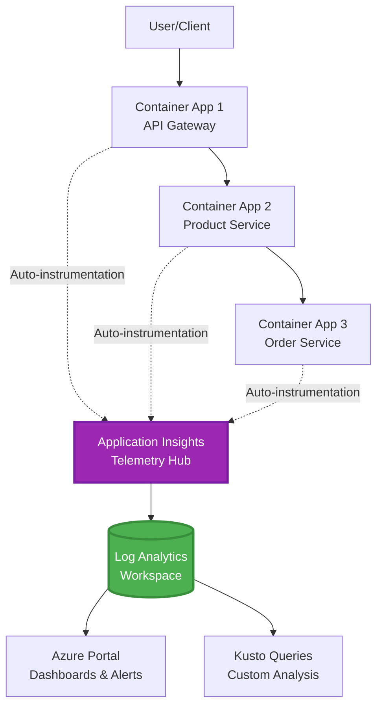
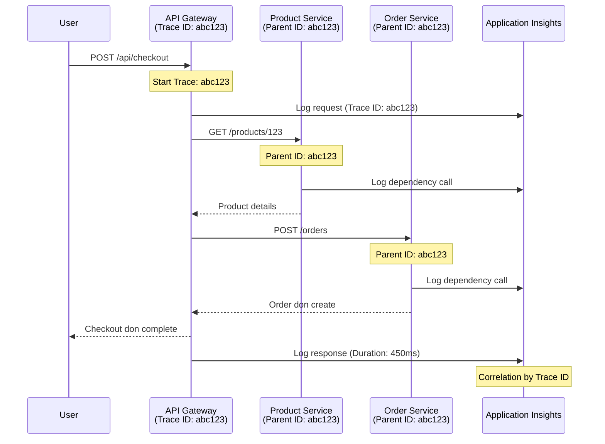

# Application Insights Integration wit AZD

⏱️ **Estimated Time**: 40-50 minutes | 💰 **Cost Impact**: ~$5-15/month | ⭐ **Complexity**: Intermediate

**📚 Learning Path:**
- ← Previous: [Preflight Checks](preflight-checks.md) - Pre-deployment validation
- 🎯 **You Dey Here**: Application Insights Integration (Monitoring, telemetry, debugging)
- → Next: [Deployment Guide](../deployment/deployment-guide.md) - Deploy to Azure
- 🏠 [Course Home](../../README.md)

---

## Wetin You Go Learn

If you complete dis lesson, you go sabi:
- Add **Application Insights** to AZD projects automatically
- Set up **distributed tracing** for microservices
- Do **custom telemetry** (metrics, events, dependencies)
- Arrange **live metrics** for real-time monitoring
- Create **alerts and dashboards** from AZD deployments
- Debug production wahala wit **telemetry queries**
- Manage **costs and sampling** strategies
- Monitor **AI/LLM applications** (tokens, latency, costs)

## Why Application Insights wit AZD Dey Important

### Di Wahala: Production Observability

**Without Application Insights:**
```
❌ No visibility into production behavior
❌ Manual log aggregation across services
❌ Reactive debugging (wait for customer complaints)
❌ No performance metrics
❌ Cannot trace requests across services
❌ Unknown failure rates and bottlenecks
```

**With Application Insights + AZD:**
```
✅ Automatic telemetry collection
✅ Centralized logs from all services
✅ Proactive issue detection
✅ End-to-end request tracing
✅ Performance metrics and insights
✅ Real-time dashboards
✅ AZD provisions everything automatically
```

**Analogy**: Application Insights be like "black box" flight recorder + cockpit dashboard for your app. You go fit see wetin dey happen live and replay any issue.

---

## Architecture Overview

### Application Insights for AZD Architecture


### Wetin Dey Monitored Automatically

| Telemetry Type | Wetin E Capture | Use Case |
|----------------|------------------|----------|
| **Requests** | HTTP requests, status codes, duration | API performance monitoring |
| **Dependencies** | External calls (DB, APIs, storage) | Find bottlenecks |
| **Exceptions** | Errors wey no dey handled wit stack traces | Debugging failures |
| **Custom Events** | Business events (signup, purchase) | Analytics and funnels |
| **Metrics** | Performance counters, custom metrics | Capacity planning |
| **Traces** | Log messages wit severity | Debugging and auditing |
| **Availability** | Uptime and response time tests | SLA monitoring |

---

## Prerequisites

### Tools Weh You Need

```bash
# Check Azure Developer CLI
azd version
# ✅ We dey expect: azd version 1.0.0 or higher

# Check Azure CLI
az --version
# ✅ We dey expect: azure-cli 2.50.0 or higher
```

### Azure Requirements

- Active Azure subscription
- Permissions to create:
  - Application Insights resources
  - Log Analytics workspaces
  - Container Apps
  - Resource groups

### Knowledge Weh You Need

You suppose don complete:
- [AZD Basics](../getting-started/azd-basics.md) - Core AZD concepts
- [Configuration](../getting-started/configuration.md) - Environment setup
- [First Project](../getting-started/first-project.md) - Basic deployment

---

## Lesson 1: Automatic Application Insights wit AZD

### How AZD Dey Create Application Insights

AZD dey automatically create and configure Application Insights when you deploy. Make we see how e dey work.

### Project Structure

```
monitored-app/
├── azure.yaml                     # AZD configuration
├── infra/
│   ├── main.bicep                # Main infrastructure
│   ├── core/
│   │   └── monitoring.bicep      # Application Insights + Log Analytics
│   └── app/
│       └── api.bicep             # Container App with monitoring
└── src/
    ├── app.py                    # Application with telemetry
    ├── requirements.txt
    └── Dockerfile
```

---

### Step 1: Configure AZD (azure.yaml)

**File: `azure.yaml`**

```yaml
name: monitored-app
metadata:
  template: monitored-app@1.0.0

services:
  api:
    project: ./src
    language: python
    host: containerapp

# AZD automatically provisions monitoring!
```

**Na all be dat!** AZD go create Application Insights by default. No need extra configuration for basic monitoring.

---

### Step 2: Monitoring Infrastructure (Bicep)

**File: `infra/core/monitoring.bicep`**

```bicep
param logAnalyticsName string
param applicationInsightsName string
param location string = resourceGroup().location
param tags object = {}

// Log Analytics Workspace (required for Application Insights)
resource logAnalytics 'Microsoft.OperationalInsights/workspaces@2022-10-01' = {
  name: logAnalyticsName
  location: location
  tags: tags
  properties: {
    sku: {
      name: 'PerGB2018'  // Pay-as-you-go pricing
    }
    retentionInDays: 30  // Keep logs for 30 days
    features: {
      enableLogAccessUsingOnlyResourcePermissions: true
    }
  }
}

// Application Insights
resource applicationInsights 'Microsoft.Insights/components@2020-02-02' = {
  name: applicationInsightsName
  location: location
  tags: tags
  kind: 'web'
  properties: {
    Application_Type: 'web'
    WorkspaceResourceId: logAnalytics.id
    IngestionMode: 'LogAnalytics'
    publicNetworkAccessForIngestion: 'Enabled'
    publicNetworkAccessForQuery: 'Enabled'
  }
}

// Outputs for Container Apps
output logAnalyticsWorkspaceId string = logAnalytics.id
output logAnalyticsWorkspaceName string = logAnalytics.name
output applicationInsightsConnectionString string = applicationInsights.properties.ConnectionString
output applicationInsightsInstrumentationKey string = applicationInsights.properties.InstrumentationKey
output applicationInsightsName string = applicationInsights.name
```

---

### Step 3: Connect Container App to Application Insights

**File: `infra/app/api.bicep`**

```bicep
param name string
param location string
param tags object = {}
param containerAppsEnvironmentName string
param applicationInsightsConnectionString string

resource containerApp 'Microsoft.App/containerApps@2023-05-01' = {
  name: name
  location: location
  tags: tags
  properties: {
    configuration: {
      ingress: {
        external: true
        targetPort: 8000
      }
      secrets: [
        {
          name: 'appinsights-connection-string'
          value: applicationInsightsConnectionString
        }
      ]
    }
    template: {
      containers: [
        {
          name: 'api'
          image: 'myregistry.azurecr.io/api:latest'
          resources: {
            cpu: json('0.5')
            memory: '1Gi'
          }
          env: [
            {
              name: 'APPLICATIONINSIGHTS_CONNECTION_STRING'
              secretRef: 'appinsights-connection-string'
            }
            {
              name: 'APPLICATIONINSIGHTS_ENABLED'
              value: 'true'
            }
          ]
        }
      ]
    }
  }
}

output uri string = 'https://${containerApp.properties.configuration.ingress.fqdn}'
```

---

### Step 4: Application Code wit Telemetry

**File: `src/app.py`**

```python
from flask import Flask, request, jsonify
from opencensus.ext.azure.log_exporter import AzureLogHandler
from opencensus.ext.azure.trace_exporter import AzureExporter
from opencensus.ext.flask.flask_middleware import FlaskMiddleware
from opencensus.trace.samplers import ProbabilitySampler
import logging
import os

app = Flask(__name__)

# Get Application Insights connection string
connection_string = os.environ.get('APPLICATIONINSIGHTS_CONNECTION_STRING')

if connection_string:
    # Set up distributed tracing
    middleware = FlaskMiddleware(
        app,
        exporter=AzureExporter(connection_string=connection_string),
        sampler=ProbabilitySampler(rate=1.0)  # 100% sampling for dev
    )
    
    # Set up logging
    logger = logging.getLogger(__name__)
    logger.addHandler(AzureLogHandler(connection_string=connection_string))
    logger.setLevel(logging.INFO)
    
    print("✅ Application Insights enabled")
else:
    logger = logging.getLogger(__name__)
    logger.setLevel(logging.INFO)
    print("⚠️ Application Insights not configured")

@app.route('/health')
def health():
    logger.info('Health check endpoint called')
    return jsonify({'status': 'healthy', 'monitoring': 'enabled'})

@app.route('/api/products')
def get_products():
    logger.info('Fetching products')
    
    # Simulate database call (e go track am as dependency)
    products = [
        {'id': 1, 'name': 'Laptop', 'price': 999.99},
        {'id': 2, 'name': 'Mouse', 'price': 29.99},
        {'id': 3, 'name': 'Keyboard', 'price': 79.99}
    ]
    
    logger.info(f'Returned {len(products)} products')
    return jsonify(products)

@app.route('/api/error-test')
def error_test():
    """Test error tracking"""
    logger.error('Testing error tracking')
    try:
        raise ValueError('This is a test exception')
    except Exception as e:
        logger.exception('Exception occurred in error-test endpoint')
        return jsonify({'error': str(e)}), 500

@app.route('/api/slow')
def slow_endpoint():
    """Test performance tracking"""
    import time
    logger.info('Slow endpoint called')
    time.sleep(3)  # Simulate slow operation
    logger.warning('Endpoint took 3 seconds to respond')
    return jsonify({'message': 'Slow operation completed'})

if __name__ == '__main__':
    app.run(host='0.0.0.0', port=8000)
```

**File: `src/requirements.txt`**

```txt
Flask==3.0.0
opencensus-ext-azure==1.1.13
opencensus-ext-flask==0.8.1
gunicorn==21.2.0
```

---

### Step 5: Deploy and Verify

```bash
# Start AZD
azd init

# Deploy (e go set up Application Insights by itself)
azd up

# Collect app URL
APP_URL=$(azd env get-values | grep API_URL | cut -d '=' -f2 | tr -d '"')

# Make telemetry
curl $APP_URL/health
curl $APP_URL/api/products
curl $APP_URL/api/error-test
curl $APP_URL/api/slow
```

**✅ Wetin You Go See:**
```json
{
  "status": "healthy",
  "monitoring": "enabled"
}
```

---

### Step 6: View Telemetry for Azure Portal

```bash
# Collect Application Insights details
azd env get-values | grep APPLICATIONINSIGHTS

# Open am for Azure Portal
az monitor app-insights component show \
  --app $(azd env get-values | grep APPLICATIONINSIGHTS_NAME | cut -d '=' -f2 | tr -d '"') \
  --resource-group $(azd env get-values | grep AZURE_RESOURCE_GROUP | cut -d '=' -f2 | tr -d '"') \
  --query "appId" -o tsv
```

**Go Azure Portal → Application Insights → Transaction Search**

You suppose see:
- ✅ HTTP requests wit status codes
- ✅ Request duration (3+ seconds for `/api/slow`)
- ✅ Exception details from `/api/error-test`
- ✅ Custom log messages

---

## Lesson 2: Custom Telemetry and Events

### Track Business Events

Make we add custom telemetry for business-critical events.

**File: `src/telemetry.py`**

```python
from opencensus.ext.azure import metrics_exporter
from opencensus.stats import aggregation as aggregation_module
from opencensus.stats import measure as measure_module
from opencensus.stats import stats as stats_module
from opencensus.stats import view as view_module
from opencensus.tags import tag_map as tag_map_module
from opencensus.ext.azure.log_exporter import AzureLogHandler
from opencensus.ext.azure.trace_exporter import AzureExporter
from opencensus.trace import tracer as tracer_module
import logging
import os

class TelemetryClient:
    """Custom telemetry client for Application Insights"""
    
    def __init__(self, connection_string=None):
        self.connection_string = connection_string or os.environ.get('APPLICATIONINSIGHTS_CONNECTION_STRING')
        
        if not self.connection_string:
            print("⚠️ Application Insights connection string not found")
            return
        
        # Set logger
        self.logger = logging.getLogger(__name__)
        self.logger.addHandler(AzureLogHandler(connection_string=self.connection_string))
        self.logger.setLevel(logging.INFO)
        
        # Set metrics exporter
        self.stats = stats_module.stats
        self.view_manager = self.stats.view_manager
        self.stats_recorder = self.stats.stats_recorder
        
        exporter = metrics_exporter.new_metrics_exporter(
            connection_string=self.connection_string
        )
        self.view_manager.register_exporter(exporter)
        
        # Set tracer
        self.tracer = tracer_module.Tracer(
            exporter=AzureExporter(connection_string=self.connection_string)
        )
        
        print("✅ Custom telemetry client initialized")
    
    def track_event(self, event_name: str, properties: dict = None):
        """Track custom business event"""
        properties = properties or {}
        self.logger.info(
            f"CustomEvent: {event_name}",
            extra={
                'custom_dimensions': {
                    'event_name': event_name,
                    **properties
                }
            }
        )
    
    def track_metric(self, metric_name: str, value: float, properties: dict = None):
        """Track custom metric"""
        properties = properties or {}
        self.logger.info(
            f"CustomMetric: {metric_name} = {value}",
            extra={
                'custom_dimensions': {
                    'metric_name': metric_name,
                    'value': value,
                    **properties
                }
            }
        )
    
    def track_dependency(self, name: str, dependency_type: str, duration: float, success: bool):
        """Track external dependency call"""
        with self.tracer.span(name=name) as span:
            span.add_attribute('dependency.type', dependency_type)
            span.add_attribute('duration', duration)
            span.add_attribute('success', success)

# Global telemetry client
telemetry = TelemetryClient()
```

### Update Application wit Custom Events

**File: `src/app.py` (enhanced)**

```python
from flask import Flask, request, jsonify
from telemetry import telemetry
import time
import random

app = Flask(__name__)

@app.route('/api/purchase', methods=['POST'])
def purchase():
    """Track purchase event with custom telemetry"""
    data = request.json
    product_id = data.get('product_id')
    quantity = data.get('quantity', 1)
    price = data.get('price', 0)
    
    # Follow business event
    telemetry.track_event('Purchase', {
        'product_id': product_id,
        'quantity': quantity,
        'total_amount': price * quantity,
        'user_id': request.headers.get('X-User-Id', 'anonymous')
    })
    
    # Follow money metric
    telemetry.track_metric('Revenue', price * quantity, {
        'product_id': product_id,
        'currency': 'USD'
    })
    
    return jsonify({
        'order_id': f'ORD-{random.randint(1000, 9999)}',
        'status': 'confirmed',
        'total': price * quantity
    })

@app.route('/api/search')
def search():
    """Track search queries"""
    query = request.args.get('q', '')
    
    start_time = time.time()
    
    # Do search like say na real database query
    results = [{'id': 1, 'name': f'Result for {query}'}]
    
    duration = (time.time() - start_time) * 1000  # Change am to ms
    
    # Follow search event
    telemetry.track_event('Search', {
        'query': query,
        'results_count': len(results),
        'duration_ms': duration
    })
    
    # Follow search performance metric
    telemetry.track_metric('SearchDuration', duration, {
        'query_length': len(query)
    })
    
    return jsonify({'results': results, 'count': len(results)})

@app.route('/api/external-call')
def external_call():
    """Track external API dependency"""
    import requests
    
    start_time = time.time()
    success = True
    
    try:
        # Do external API call like say na real
        response = requests.get('https://api.example.com/data', timeout=5)
        result = response.json()
    except Exception as e:
        success = False
        result = {'error': str(e)}
    
    duration = (time.time() - start_time) * 1000
    
    # Follow dependency
    telemetry.track_dependency(
        name='ExternalAPI',
        dependency_type='HTTP',
        duration=duration,
        success=success
    )
    
    return jsonify(result)

if __name__ == '__main__':
    app.run(host='0.0.0.0', port=8000)
```

### Test Custom Telemetry

```bash
# Track buy somtin event
curl -X POST $APP_URL/api/purchase \
  -H "Content-Type: application/json" \
  -H "X-User-Id: user123" \
  -d '{"product_id": 1, "quantity": 2, "price": 29.99}'

# Track search somtin event
curl "$APP_URL/api/search?q=laptop"

# Track outside dependency
curl $APP_URL/api/external-call
```

**View for Azure Portal:**

Go Application Insights → Logs, then run:

```kusto
// View purchase events
traces
| where customDimensions.event_name == "Purchase"
| project 
    timestamp,
    product_id = tostring(customDimensions.product_id),
    total_amount = todouble(customDimensions.total_amount),
    user_id = tostring(customDimensions.user_id)
| order by timestamp desc

// View revenue metrics
traces
| where customDimensions.metric_name == "Revenue"
| summarize TotalRevenue = sum(todouble(customDimensions.value)) by bin(timestamp, 1h)
| render timechart

// View search performance
traces
| where customDimensions.event_name == "Search"
| summarize 
    AvgDuration = avg(todouble(customDimensions.duration_ms)),
    SearchCount = count()
  by bin(timestamp, 5m)
| render timechart
```

---

## Lesson 3: Distributed Tracing for Microservices

### Enable Cross-Service Tracing

For microservices, Application Insights dey automatically connect requests across services.

**File: `infra/main.bicep`**

```bicep
targetScope = 'subscription'

param environmentName string
param location string = 'eastus'

var tags = { 'azd-env-name': environmentName }

resource rg 'Microsoft.Resources/resourceGroups@2021-04-01' = {
  name: 'rg-${environmentName}'
  location: location
  tags: tags
}

// Monitoring (shared by all services)
module monitoring './core/monitoring.bicep' = {
  name: 'monitoring'
  scope: rg
  params: {
    logAnalyticsName: 'log-${environmentName}'
    applicationInsightsName: 'appi-${environmentName}'
    location: location
    tags: tags
  }
}

// API Gateway
module apiGateway './app/api-gateway.bicep' = {
  name: 'api-gateway'
  scope: rg
  params: {
    name: 'ca-gateway-${environmentName}'
    location: location
    tags: union(tags, { 'azd-service-name': 'gateway' })
    applicationInsightsConnectionString: monitoring.outputs.applicationInsightsConnectionString
  }
}

// Product Service
module productService './app/product-service.bicep' = {
  name: 'product-service'
  scope: rg
  params: {
    name: 'ca-products-${environmentName}'
    location: location
    tags: union(tags, { 'azd-service-name': 'products' })
    applicationInsightsConnectionString: monitoring.outputs.applicationInsightsConnectionString
  }
}

// Order Service
module orderService './app/order-service.bicep' = {
  name: 'order-service'
  scope: rg
  params: {
    name: 'ca-orders-${environmentName}'
    location: location
    tags: union(tags, { 'azd-service-name': 'orders' })
    applicationInsightsConnectionString: monitoring.outputs.applicationInsightsConnectionString
  }
}

output APPLICATIONINSIGHTS_CONNECTION_STRING string = monitoring.outputs.applicationInsightsConnectionString
output GATEWAY_URL string = apiGateway.outputs.uri
```

### View End-to-End Transaction


**Query end-to-end trace:**

```kusto
// Find complete request flow
let traceId = "abc123...";  // Get from response header
dependencies
| union requests
| where operation_Id == traceId
| project 
    timestamp,
    type = itemType,
    name,
    duration,
    success,
    cloud_RoleName
| order by timestamp asc
```

---

## Lesson 4: Live Metrics and Real-Time Monitoring

### Enable Live Metrics Stream

Live Metrics dey provide real-time telemetry wit <1 second latency.

**Access Live Metrics:**

```bash
# Collect Application Insights resource
APPI_NAME=$(azd env get-values | grep APPLICATIONINSIGHTS_NAME | cut -d '=' -f2 | tr -d '"')

# Collect resource group
RG_NAME=$(azd env get-values | grep AZURE_RESOURCE_GROUP | cut -d '=' -f2 | tr -d '"')

echo "Navigate to: Azure Portal → Resource Groups → $RG_NAME → $APPI_NAME → Live Metrics"
```

**Wetin You Go See Live:**
- ✅ Incoming request rate (requests/sec)
- ✅ Outgoing dependency calls
- ✅ Exception count
- ✅ CPU and memory usage
- ✅ Active server count
- ✅ Sample telemetry

### Generate Load for Testing

```bash
# Generate load make you fit see live metrics
for i in {1..100}; do
  curl $APP_URL/api/products &
  curl $APP_URL/api/search?q=test$i &
done

# Dey watch live metrics for Azure Portal
# You go see request rate go high
```

---

## Practical Exercises

### Exercise 1: Set Up Alerts ⭐⭐ (Medium)

**Goal**: Create alerts for high error rates and slow responses.

**Steps:**

1. **Create alert for error rate:**

```bash
# Get Application Insights resource ID
APPI_ID=$(az monitor app-insights component show \
  --app $APPI_NAME \
  --resource-group $RG_NAME \
  --query "id" -o tsv)

# Create metric alert for failed requests
az monitor metrics alert create \
  --name "High-Error-Rate" \
  --resource-group $RG_NAME \
  --scopes $APPI_ID \
  --condition "count requests/failed > 10" \
  --window-size 5m \
  --evaluation-frequency 1m \
  --description "Alert when error rate exceeds 10 per 5 minutes"
```

2. **Create alert for slow responses:**

```bash
az monitor metrics alert create \
  --name "Slow-Responses" \
  --resource-group $RG_NAME \
  --scopes $APPI_ID \
  --condition "avg requests/duration > 3000" \
  --window-size 5m \
  --evaluation-frequency 1m \
  --description "Alert when average response time exceeds 3 seconds"
```

3. **Create alert via Bicep (preferred for AZD):**

**File: `infra/core/alerts.bicep`**

```bicep
param applicationInsightsId string
param actionGroupId string = ''
param location string = resourceGroup().location

// High error rate alert
resource errorRateAlert 'Microsoft.Insights/metricAlerts@2018-03-01' = {
  name: 'high-error-rate'
  location: 'global'
  properties: {
    description: 'Alert when error rate exceeds threshold'
    severity: 2
    enabled: true
    scopes: [
      applicationInsightsId
    ]
    evaluationFrequency: 'PT1M'
    windowSize: 'PT5M'
    criteria: {
      'odata.type': 'Microsoft.Azure.Monitor.SingleResourceMultipleMetricCriteria'
      allOf: [
        {
          name: 'Error rate'
          metricName: 'requests/failed'
          operator: 'GreaterThan'
          threshold: 10
          timeAggregation: 'Count'
        }
      ]
    }
    actions: actionGroupId != '' ? [
      {
        actionGroupId: actionGroupId
      }
    ] : []
  }
}

// Slow response alert
resource slowResponseAlert 'Microsoft.Insights/metricAlerts@2018-03-01' = {
  name: 'slow-responses'
  location: 'global'
  properties: {
    description: 'Alert when response time is too high'
    severity: 3
    enabled: true
    scopes: [
      applicationInsightsId
    ]
    evaluationFrequency: 'PT1M'
    windowSize: 'PT5M'
    criteria: {
      'odata.type': 'Microsoft.Azure.Monitor.SingleResourceMultipleMetricCriteria'
      allOf: [
        {
          name: 'Response duration'
          metricName: 'requests/duration'
          operator: 'GreaterThan'
          threshold: 3000
          timeAggregation: 'Average'
        }
      ]
    }
  }
}

output errorAlertId string = errorRateAlert.id
output slowResponseAlertId string = slowResponseAlert.id
```

4. **Test alerts:**

```bash
# Make errors
for i in {1..20}; do
  curl $APP_URL/api/error-test
done

# Make slow response
for i in {1..10}; do
  curl $APP_URL/api/slow
done

# Check alert status (wait 5-10 minutes)
az monitor metrics alert list \
  --resource-group $RG_NAME \
  --query "[].{Name:name, Enabled:enabled, State:properties.enabled}" \
  --output table
```

**✅ Success Criteria:**
- ✅ Alerts dey created successfully
- ✅ Alerts dey fire when thresholds dey pass
- ✅ You fit view alert history for Azure Portal
- ✅ E dey work wit AZD deployment

**Time**: 20-25 minutes

---

### Exercise 2: Create Custom Dashboard ⭐⭐ (Medium)

**Goal**: Build dashboard wey dey show key application metrics.

**Steps:**

1. **Create dashboard via Azure Portal:**

Go: Azure Portal → Dashboards → New Dashboard

2. **Add tiles for key metrics:**

- Request count (last 24 hours)
- Average response time
- Error rate
- Top 5 slowest operations
- Geographic distribution of users

3. **Create dashboard via Bicep:**

**File: `infra/core/dashboard.bicep`**

```bicep
param dashboardName string
param applicationInsightsId string
param location string = resourceGroup().location

resource dashboard 'Microsoft.Portal/dashboards@2020-09-01-preview' = {
  name: dashboardName
  location: location
  properties: {
    lenses: [
      {
        order: 0
        parts: [
          // Request count
          {
            position: { x: 0, y: 0, rowSpan: 4, colSpan: 6 }
            metadata: {
              type: 'Extension/Microsoft_OperationsManagementSuite_Workspace/PartType/LogsDashboardPart'
              inputs: [
                {
                  name: 'resourceId'
                  value: applicationInsightsId
                }
                {
                  name: 'query'
                  value: '''
                    requests
                    | summarize RequestCount = count() by bin(timestamp, 1h)
                    | render timechart
                  '''
                }
              ]
            }
          }
          // Error rate
          {
            position: { x: 6, y: 0, rowSpan: 4, colSpan: 6 }
            metadata: {
              type: 'Extension/Microsoft_OperationsManagementSuite_Workspace/PartType/LogsDashboardPart'
              inputs: [
                {
                  name: 'resourceId'
                  value: applicationInsightsId
                }
                {
                  name: 'query'
                  value: '''
                    requests
                    | summarize 
                        Total = count(),
                        Failed = countif(success == false)
                    | extend ErrorRate = (Failed * 100.0) / Total
                    | project ErrorRate
                  '''
                }
              ]
            }
          }
        ]
      }
    ]
  }
}

output dashboardId string = dashboard.id
```

4. **Deploy dashboard:**

```bash
# Add am to main.bicep
module dashboard './core/dashboard.bicep' = {
  name: 'dashboard'
  scope: rg
  params: {
    dashboardName: 'dashboard-${environmentName}'
    applicationInsightsId: monitoring.outputs.applicationInsightsId
    location: location
  }
}

# Deploy am
azd up
```

**✅ Success Criteria:**
- ✅ Dashboard dey show key metrics
- ✅ You fit pin am to Azure Portal home
- ✅ E dey update live
- ✅ Deployable via AZD

**Time**: 25-30 minutes

---

### Exercise 3: Monitor AI/LLM Application ⭐⭐⭐ (Advanced)

**Goal**: Track Azure OpenAI usage (tokens, costs, latency).

**Steps:**

1. **Create AI monitoring wrapper:**

**File: `src/ai_telemetry.py`**

```python
from telemetry import telemetry
from openai import AzureOpenAI
import time

class MonitoredAzureOpenAI:
    """Azure OpenAI client with automatic telemetry"""
    
    def __init__(self, api_key, endpoint, api_version="2024-02-01"):
        self.client = AzureOpenAI(
            api_key=api_key,
            api_version=api_version,
            azure_endpoint=endpoint
        )
    
    def chat_completion(self, model: str, messages: list, **kwargs):
        """Track chat completion with telemetry"""
        start_time = time.time()
        
        try:
            # Call Azure OpenAI
            response = self.client.chat.completions.create(
                model=model,
                messages=messages,
                **kwargs
            )
            
            duration = (time.time() - start_time) * 1000  # ms
            
            # Comot usage
            usage = response.usage
            prompt_tokens = usage.prompt_tokens
            completion_tokens = usage.completion_tokens
            total_tokens = usage.total_tokens
            
            # Calculate cost (GPT-4 pricing)
            prompt_cost = (prompt_tokens / 1000) * 0.03  # $0.03 per 1K tokens
            completion_cost = (completion_tokens / 1000) * 0.06  # $0.06 per 1K tokens
            total_cost = prompt_cost + completion_cost
            
            # Track custom event
            telemetry.track_event('OpenAI_Request', {
                'model': model,
                'prompt_tokens': prompt_tokens,
                'completion_tokens': completion_tokens,
                'total_tokens': total_tokens,
                'duration_ms': duration,
                'cost_usd': total_cost,
                'success': True
            })
            
            # Track metrics
            telemetry.track_metric('OpenAI_Tokens', total_tokens, {
                'model': model,
                'type': 'total'
            })
            
            telemetry.track_metric('OpenAI_Cost', total_cost, {
                'model': model,
                'currency': 'USD'
            })
            
            telemetry.track_metric('OpenAI_Duration', duration, {
                'model': model
            })
            
            return response
            
        except Exception as e:
            duration = (time.time() - start_time) * 1000
            
            telemetry.track_event('OpenAI_Request', {
                'model': model,
                'duration_ms': duration,
                'success': False,
                'error': str(e)
            })
            
            raise
```

2. **Use monitored client:**

```python
from flask import Flask, request, jsonify
from ai_telemetry import MonitoredAzureOpenAI
import os

app = Flask(__name__)

# Start OpenAI client wey dem dey monitor
openai_client = MonitoredAzureOpenAI(
    api_key=os.environ['AZURE_OPENAI_API_KEY'],
    endpoint=os.environ['AZURE_OPENAI_ENDPOINT']
)

@app.route('/api/chat', methods=['POST'])
def chat():
    data = request.json
    user_message = data.get('message')
    
    # Use am with monitoring wey dey automatic
    response = openai_client.chat_completion(
        model='gpt-4',
        messages=[
            {'role': 'user', 'content': user_message}
        ]
    )
    
    return jsonify({
        'response': response.choices[0].message.content,
        'tokens': response.usage.total_tokens
    })
```

3. **Query AI metrics:**

```kusto
// Total AI spend over time
traces
| where customDimensions.event_name == "OpenAI_Request"
| where customDimensions.success == "True"
| summarize TotalCost = sum(todouble(customDimensions.cost_usd)) by bin(timestamp, 1h)
| render timechart

// Token usage by model
traces
| where customDimensions.event_name == "OpenAI_Request"
| summarize 
    TotalTokens = sum(toint(customDimensions.total_tokens)),
    RequestCount = count()
  by Model = tostring(customDimensions.model)

// Average latency
traces
| where customDimensions.event_name == "OpenAI_Request"
| summarize AvgDuration = avg(todouble(customDimensions.duration_ms))
| project AvgDurationSeconds = AvgDuration / 1000

// Cost per request
traces
| where customDimensions.event_name == "OpenAI_Request"
| extend Cost = todouble(customDimensions.cost_usd)
| summarize 
    TotalCost = sum(Cost),
    RequestCount = count(),
    AvgCostPerRequest = avg(Cost)
```

**✅ Success Criteria:**
- ✅ Every OpenAI call dey tracked automatically
- ✅ Token usage and costs dey visible
- ✅ Latency dey monitored
- ✅ You fit set budget alerts

**Time**: 35-45 minutes

---

## Cost Optimization

### Sampling Strategies

Manage costs by sampling telemetry:

```python
from opencensus.trace.samplers import ProbabilitySampler

# Development: 100% sampling
sampler = ProbabilitySampler(rate=1.0)

# Production: 10% sampling (reduce costs by 90%)
sampler = ProbabilitySampler(rate=0.1)

# Adaptive sampling (automatically adjusts)
from opencensus.trace.samplers import AdaptiveSampler
sampler = AdaptiveSampler()
```

**For Bicep:**

```bicep
resource applicationInsights 'Microsoft.Insights/components@2020-02-02' = {
  name: applicationInsightsName
  properties: {
    SamplingPercentage: 10  // 10% sampling
  }
}
```

### Data Retention

```bicep
resource logAnalytics 'Microsoft.OperationalInsights/workspaces@2022-10-01' = {
  name: logAnalyticsName
  properties: {
    retentionInDays: 30  // Minimum (cheapest)
    // Options: 30, 31, 60, 90, 120, 180, 270, 365, 550, 730
  }
}
```

### Monthly Cost Estimates

| Data Volume | Retention | Monthly Cost |
|-------------|-----------|--------------|
| 1 GB/month | 30 days | ~$2-5 |
| 5 GB/month | 30 days | ~$10-15 |
| 10 GB/month | 90 days | ~$25-40 |
| 50 GB/month | 90 days | ~$100-150 |

**Free tier**: 5 GB/month dey included

---

## Knowledge Checkpoint

### 1. Basic Integration ✓

Test wetin you sabi:

- [ ] **Q1**: How AZD dey create Application Insights?
  - **A**: Automatically via Bicep templates for `infra/core/monitoring.bicep`

- [ ] **Q2**: Which environment variable dey enable Application Insights?
  - **A**: `APPLICATIONINSIGHTS_CONNECTION_STRING`

- [ ] **Q3**: Wetin be di three main telemetry types?
  - **A**: Requests (HTTP calls), Dependencies (external calls), Exceptions (errors)

**Hands-On Verification:**
```bash
# Check say dem don configure Application Insights
azd env get-values | grep APPLICATIONINSIGHTS

# Make sure say telemetry dey flow
az monitor app-insights metrics show \
  --app $APPI_NAME \
  --resource-group $RG_NAME \
  --metric "requests/count"
```

---

### 2. Custom Telemetry ✓

Test wetin you sabi:

- [ ] **Q1**: How you go track custom business events?
  - **A**: Use logger wit `custom_dimensions` or `TelemetryClient.track_event()`

- [ ] **Q2**: Wetin be di difference between events and metrics?
  - **A**: Events na discrete occurrences, metrics na numerical measurements

- [ ] **Q3**: How you go connect telemetry across services?
  - **A**: Application Insights dey automatically use `operation_Id` for connection

**Hands-On Verification:**
```kusto
// Verify custom events
traces
| where customDimensions.event_name != ""
| summarize count() by tostring(customDimensions.event_name)
```

---

### 3. Production Monitoring ✓

Test wetin you sabi:

- [ ] **Q1**: Wetin be sampling and why you go use am?
  - **A**: Sampling dey reduce data volume (and cost) by capturing only percentage of telemetry

- [ ] **Q2**: How you go set up alerts?
  - **A**: Use metric alerts for Bicep or Azure Portal based on Application Insights metrics

- [ ] **Q3**: Wetin be di difference between Log Analytics and Application Insights?
  - **A**: Application Insights dey store data for Log Analytics workspace; App Insights dey provide application-specific views

**Hands-On Verification:**
```bash
# Check how dem set sampling config
az monitor app-insights component show \
  --app $APPI_NAME \
  --resource-group $RG_NAME \
  --query "properties.SamplingPercentage"
```

---

## Best Practices

### ✅ DO:

1. **Use correlation IDs**
   ```python
   logger.info('Processing order', extra={
       'custom_dimensions': {
           'order_id': order_id,
           'user_id': user_id
       }
   })
   ```

2. **Set up alerts for critical metrics**
   ```bicep
   // Error rate, slow responses, availability
   ```

3. **Use structured logging**
   ```python
   # ✅ GOOD: E dey well arrange
   logger.info('User signup', extra={'custom_dimensions': {'user_id': 123}})
   
   # ❌ BAD: E no dey well arrange
   logger.info(f'User 123 signed up')
   ```

4. **Monitor dependencies**
   ```python
   # Dey track database calls, HTTP requests, etc. automatic.
   ```

5. **Use Live Metrics during deployments**

### ❌ DON'T:

1. **No log sensitive data**
   ```python
   # ❌ NO GOOD
   logger.info(f'Login: {username}:{password}')
   
   # ✅ CORRECT
   logger.info('Login attempt', extra={'custom_dimensions': {'username': username}})
   ```

2. **No use 100% sampling for production**
   ```python
   # ❌ E cost well well
   sampler = ProbabilitySampler(rate=1.0)
   
   # ✅ E cheap well well
   sampler = ProbabilitySampler(rate=0.1)
   ```

3. **No ignore dead letter queues**

4. **No forget to set data retention limits**

---

## Troubleshooting

### Problem: No telemetry dey show

**Diagnosis:**
```bash
# Make sure say connection string dey set
azd env get-values | grep APPLICATIONINSIGHTS

# Make sure say application logs dey
azd logs api --tail 50
```

**Solution:**
```bash
# Check connection string for Container App
az containerapp show \
  --name $APP_NAME \
  --resource-group $RG_NAME \
  --query "properties.template.containers[0].env" \
  | grep -i applicationinsights
```

---

### Problem: High costs

**Diagnosis:**
```bash
# Check how data dey enter
az monitor app-insights metrics show \
  --app $APPI_NAME \
  --resource-group $RG_NAME \
  --metric "availabilityResults/count"
```

**Solution:**
- Reduce sampling rate
- Decrease retention period
- Remove verbose logging

---

## Learn More

### Official Documentation
- [Application Insights Overview](https://learn.microsoft.com/azure/azure-monitor/app/app-insights-overview)
- [Application Insights for Python](https://learn.microsoft.com/azure/azure-monitor/app/opencensus-python)
- [Kusto Query Language](https://learn.microsoft.com/azure/data-explorer/kusto/query/)
- [AZD Monitoring](https://learn.microsoft.com/azure/developer/azure-developer-cli/monitor-your-app)

### Next Steps for Dis Course
- ← Previous: [Preflight Checks](preflight-checks.md)
- → Next: [Deployment Guide](../deployment/deployment-guide.md)
- 🏠 [Course Home](../../README.md)

### Related Examples
- [Azure OpenAI Example](../../../../examples/azure-openai-chat) - AI telemetry
- [Microservices Example](../../../../examples/microservices) - Distributed tracing

---

## Summary

**You don learn:**
- ✅ Automatic Application Insights setup wit AZD
- ✅ Custom telemetry (events, metrics, dependencies)
- ✅ Distributed tracing across microservices
- ✅ Live metrics and real-time monitoring
- ✅ Alerts and dashboards
- ✅ AI/LLM app moni
- ✅ Cost optimization strategies

**Wetin you go learn:**
1. **AZD dey set moni moni automatically** - You no need do am by hand
2. **Use structured logging** - E go make query easy
3. **Track business events** - No just dey look technical metrics
4. **Moni AI costs** - Check tokens and wetin you dey spend
5. **Set up alerts** - No wait make wahala happen, act quick
6. **Optimize costs** - Use sampling and retention limits

**Wetin you go do next:**
1. Finish di practical exercises
2. Add Application Insights to your AZD projects
3. Create custom dashboards for your team
4. Learn [Deployment Guide](../deployment/deployment-guide.md)

---

<!-- CO-OP TRANSLATOR DISCLAIMER START -->
**Disclaimer**:  
Dis dokyument don use AI transle-shon service [Co-op Translator](https://github.com/Azure/co-op-translator) do di transle-shon. Even as we dey try make am correct, abeg sabi say transle-shon wey machine do fit get mistake or no dey accurate well. Di original dokyument for im native language na di one wey you go take as di correct source. For important mata, e good make professional human transle-shon dey use. We no go fit take blame for any misunderstanding or wrong interpretation wey fit happen because you use dis transle-shon.
<!-- CO-OP TRANSLATOR DISCLAIMER END -->